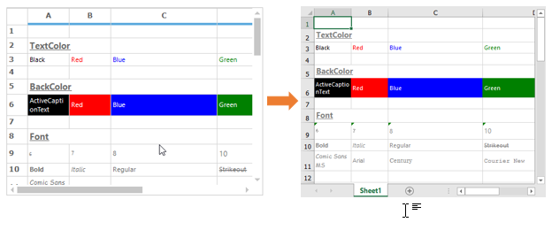
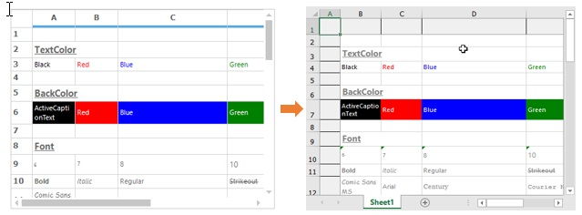
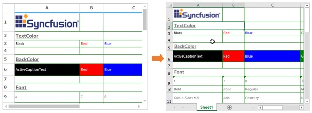
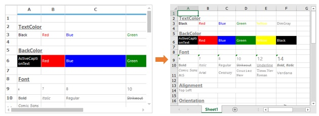
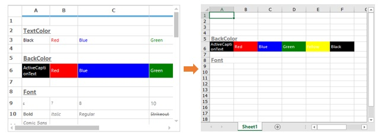
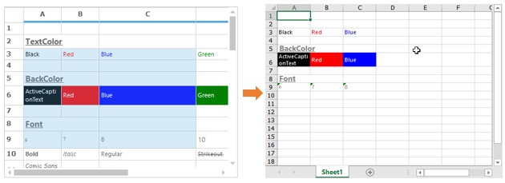
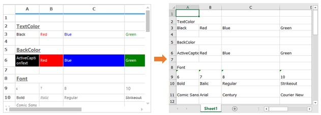
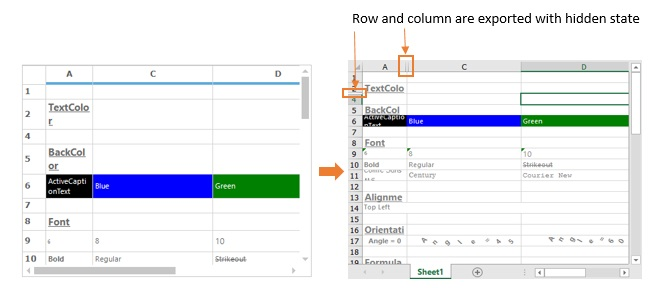
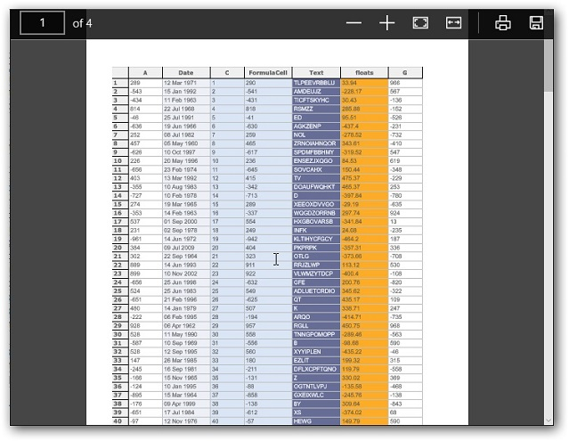
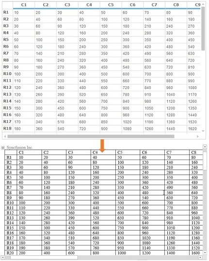

# Exporting in Windows Forms Grid Control
The columns and rows of the grid can be exported to the Excel, PDF and word documents. This section will explain about the properties, methods and events available for exporting the GridControl.

## Excel Export
The GridControl has in-built support to export the contents of the GridControl to Excel. The class [GridExcelConverterControl](https://help.syncfusion.com/cr/windowsforms/Syncfusion.GridExcelConverter.GridExcelConverterControl.html) provides support for exporting the GridControl to Excel. 

The following assembly files should be added to the application reference folder,

* Syncfusion.GridConverter.Windows
* Syncfusion.XlsIO.Base

N> **Syncfusion.XlsIO.Base** libraries are used to support conversion of the grid contents to Excel. 

The [GridToExcel](https://help.syncfusion.com/cr/windowsforms/Syncfusion.GridExcelConverter.GridExcelConverterControl.html#Syncfusion_GridExcelConverter_GridExcelConverterControl_GridToExcel_Syncfusion_Windows_Forms_Grid_GridControl_Syncfusion_XlsIO_IWorksheet_) method is used to export the grid to an excel sheet. The exported file behavior can be set by specifying the [ConverterOptions](https://help.syncfusion.com/cr/windowsforms/Syncfusion.GridExcelConverter.ConverterOptions.html) to this method (i.e., it will include or exclude the column and row headers). 

The following example shows the GridControl is exported to the Excel sheet,



Syncfusion.GridExcelConverter.GridExcelConverterControl excelConverter = new Syncfusion.GridExcelConverter.GridExcelConverterControl();
excelConverter.GridToExcel(this.gridControl1.Model, "Sample.xlsx");


Dim excelConverter As Syncfusion.GridExcelConverter.GridExcelConverterControl = New Syncfusion.GridExcelConverter.GridExcelConverterControl
excelConverter.GridToExcel(Me.gridControl1.Model, "Sample.xlsx")



### Exporting Options
There are several options available for customizing the exporting. 

The [ConverterOptions](https://help.syncfusion.com/cr/windowsforms/Syncfusion.GridExcelConverter.ConverterOptions.html) is used to set the conditions for exporting the grid. It has the following enumerations, 

* **ColumnHeaders** – Export the grid with the column headers
* **RowHeaders** – Export the grid with the Row Headers
* **Default** – Export the grid without the Row and Column Headers. This is the default option of `ConverterOptions`.
* **Visible** – To Export only the visible columns to the Excel. i.e. the hidden columns will be skipped.

### Exporting with Row and Column Headers
By default, [GridExcelConverterControl](https://help.syncfusion.com/cr/windowsforms/Syncfusion.GridExcelConverter.GridExcelConverterControl.html) exports all elements in the grid. The following code example illustrates how to include both row and column headers during the export.


//Converter to export the contents of the Grid to Excel.
GridExcelConverterControl excelConverter = new GridExcelConverterControl();

//Set converter options to export the Grid with Row Headers and Column Headers
excelConverter.GridToExcel(this.gridControl1.Model, "SampleExcel.xlsx", ConverterOptions.ColumnHeaders | ConverterOptions.RowHeaders);


'Converter to export the contents of the Grid to Excel.
Dim excelConverter As New GridExcelConverterControl()

'Set converter options to export the Grid with Row Headers and Column Headers.
excelConverter.GridToExcel(Me.gridControl1.Model, "SampleExcel.xlsx", ConverterOptions.ColumnHeaders Or ConverterOptions.RowHeaders)



### Exporting Borders and Images
The borders and Images of the GridControl can be exported to the Excel by using the [ExportBorders](https://help.syncfusion.com/cr/windowsforms/Syncfusion.GridExcelConverter.GridExcelConverterBase.html#Syncfusion_GridExcelConverter_GridExcelConverterBase_ExportBorders) and [ExportImage](https://help.syncfusion.com/cr/windowsforms/Syncfusion.GridExcelConverter.GridExcelConverterBase.html#Syncfusion_GridExcelConverter_GridExcelConverterBase_ExportImage) properties.


GridExcelConverterControl excelConverter = new GridExcelConverterControl();

// To export the Grid with applied borders to the Excel file.
excelConverter.ExportBorders = true;

// To export the images to the Excel.  
excelConverter.ExportImage = true;
excelConverter.GridToExcel(this.gridControl1.Model, "FileName.xls", ConverterOptions.Default);


Dim excelConverter As New GridExcelConverterControl()

'To export the Grid with applied borders to the Excel file.
excelConverter.ExportBorders = True

'To export the images to the Excel.  
excelConverter.ExportImage = True
excelConverter.GridToExcel(Me.gridControl1.Model, "FileName.xls", ConverterOptions.Default)



N> The `ExportBorders` lets you decide whether borders can be exported to Excel. If this property is `false`, the default border style of the Excel will be set. The `GridLines` of the Excel sheet can be enabled or disabled by using [ShowGridLines](https://help.syncfusion.com/cr/windowsforms/Syncfusion.GridExcelConverter.GridExcelConverterControl.html#Syncfusion_GridExcelConverter_GridExcelConverterControl_ShowGridLines) property.

### Auto Fitting Rows and Columns
By default, the rows and columns are exported with its corresponding row height and column width. The `GridExcelConverterControl` lets you decide whether the rows and columns should be exported with row height and column width based on its content. This can be done by using [AutoFitRows](https://help.syncfusion.com/cr/windowsforms/Syncfusion.GridExcelConverter.GridExcelConverterControl.html#Syncfusion_GridExcelConverter_GridExcelConverterControl_AutoFitRows) and [AutoFitColumns](https://help.syncfusion.com/cr/windowsforms/Syncfusion.GridExcelConverter.GridExcelConverterControl.html#Syncfusion_GridExcelConverter_GridExcelConverterControl_AutoFitColumns) properties.

The following example shows the GridControl content is resized based on its content. 


GridExcelConverterControl excelConverter = new GridExcelConverterControl();
// Enabling row heights to be fitted.
excelConverter.AutoFitRows = true;

// Enabling column widths to be fitted.
excelConverter.AutoFitColumns = true;

excelConverter.GridToExcel(this.gridControl1.Model, "FileName.xls", ConverterOptions.Default);


Dim excelConverter As New GridExcelConverterControl()
' Enabling row heights to be fitted.
excelConverter.AutoFitRows = True

' Enabling column widths to be fitted.
excelConverter.AutoFitColumns = True

excelConverter.GridToExcel(Me.gridControl1.Model, "FileName.xls", ConverterOptions.Default)



### Setting Default Row Height and Column Width
By default, the `GridExcelConverterControl` provides support to export the content with its corresponding row height and column width. The default row height and column width can be set by using [DefaultColumnWidth](https://help.syncfusion.com/cr/windowsforms/Syncfusion.GridExcelConverter.GridExcelConverterControl.html#Syncfusion_GridExcelConverter_GridExcelConverterControl_DefaultColumnWidth) and [DefaultRowHeight](https://help.syncfusion.com/cr/windowsforms/Syncfusion.GridExcelConverter.GridExcelConverterControl.html#Syncfusion_GridExcelConverter_GridExcelConverterControl_DefaultRowHeight) property.

To use the `DefaultRowHeight` and `DefaultColumnWidth` properties, the following properties has to be disabled. 

* [CanExportRowHeight](https://help.syncfusion.com/cr/windowsforms/Syncfusion.GridExcelConverter.GridExcelConverterControl.html#Syncfusion_GridExcelConverter_GridExcelConverterControl_CanExportRowHeight)
* [CanExportColumnWidth](https://help.syncfusion.com/cr/windowsforms/Syncfusion.GridExcelConverter.GridExcelConverterControl.html#Syncfusion_GridExcelConverter_GridExcelConverterControl_DefaultColumnWidth)
* [AutoFitRows](https://help.syncfusion.com/cr/windowsforms/Syncfusion.GridExcelConverter.GridExcelConverterControl.html#Syncfusion_GridExcelConverter_GridExcelConverterControl_AutoFitRows )
* [AutoFitColumns](https://help.syncfusion.com/cr/windowsforms/Syncfusion.GridExcelConverter.GridExcelConverterControl.html#Syncfusion_GridExcelConverter_GridExcelConverterControl_AutoFitColumns)

The following example shows the GridControl is exported with the default row height and column width,



GridExcelConverterControl excelConverter = new GridExcelConverterControl();

//Disabling row height to be exported.
excelConverter.CanExportRowHeight = false;

//Disabling column width to be exported.
excelConverter.CanExportColumnWidth = false;

//Setting default column width.
excelConverter.DefaultColumnWidth = 40;

//Setting default row height.
excelConverter.DefaultRowHeight = 30;
excelConverter.GridToExcel(this.gridControl1.Model, "FileName.xls", ConverterOptions.Default);


Dim excelConverter As New GridExcelConverterControl()

'Disabling row height to be exported.
excelConverter.CanExportRowHeight = False

'Disabling column width to be exported.
excelConverter.CanExportColumnWidth = False

'Setting default column width.
excelConverter.DefaultColumnWidth = 40

'Setting default row height.
excelConverter.DefaultRowHeight = 30
excelConverter.GridToExcel(Me.gridControl1.Model, "FileName.xls", ConverterOptions.Default)



### Exporting the Range of Cells
The `GridExcelConverterControl` lets you export a particular range of cells to Excel. The range can be a cell, a range of cells, a row or a column. 

The particular range of cells can be exported to Excel by using [ExportRange](https://help.syncfusion.com/cr/windowsforms/Syncfusion.GridExcelConverter.GridExcelConverterControl.html#Syncfusion_GridExcelConverter_GridExcelConverterControl_ExportRange_Syncfusion_Windows_Forms_Grid_GridRangeInfo_Syncfusion_Windows_Forms_Grid_GridModel_Syncfusion_XlsIO_IWorksheet_Syncfusion_GridExcelConverter_ConverterOptions_) method.


//Create converter for export grid to excel.
GridExcelConverterControl converter = new GridExcelConverterControl();

//Convert the specific row range of Grid to Excel.
converter.ExportRange(GridRangeInfo.Rows(4, 6), this.gridControl1.Model, "FileName", ConverterOptions.Default);


'Create converter for export grid to excel.
Dim converter As New GridExcelConverterControl()

'Convert the specific range of Grid to Excel.
converter.ExportRange(GridRangeInfo.Rows(4, 6), Me.gridControl1.Model, "FileName", ConverterOptions.Default)



### Exporting the Selected Ranges
The `GridExcelConverterControl` provides support to export the ranges which are all selected in the GridControl. To export the selected ranges to Excel, the [SelectedExport](https://help.syncfusion.com/cr/windowsforms/Syncfusion.GridExcelConverter.GridExcelConverterControl.html#Syncfusion_GridExcelConverter_GridExcelConverterControl_SelectedExport_Syncfusion_Windows_Forms_Grid_GridModel_System_String_Syncfusion_GridExcelConverter_ConverterOptions_) method can be used.


//Create converter for export grid to excel.
GridExcelConverterControl converter = new GridExcelConverterControl();

//Convert the selected row range of Grid to Excel.
converter. SelectedExport(this.gridControl1.Model, "FileName", ConverterOptions.Default);


'Create converter for export grid to excel.
Dim converter As New GridExcelConverterControl()

'Convert the selected range of Grid to Excel.
converter. SelectedExport(Me.gridControl1.Model, "FileName", ConverterOptions.Default)



### Exporting without Styling
The GridControl will be exported to Excel with styles including font, back color, text color, number formats, images, borders, alignments etc., by default. The exporting of styles can be disabled by using [ExportStyle](https://help.syncfusion.com/cr/windowsforms/Syncfusion.GridExcelConverter.GridExcelConverterBase.html#Syncfusion_GridExcelConverter_GridExcelConverterBase_ExportStyle) property. This can be used to increase the exporting performance.


GridExcelConverterControl excelConverter = new GridExcelConverterControl();

// Disabling exporting with styles.
excelConverter.ExportStyle = true
excelConverter.GridToExcel(this.gridControl1.Model, "FileName.xls", ConverterOptions.Default);


Dim excelConverter As New GridExcelConverterControl()

' Disabling exporting with styles.
excelConverter.ExportStyle = true excelConverter.GridToExcel(Me.gridControl1.Model, "FileName.xls", ConverterOptions.Default)



### Handling Hidden Rows and Columns Exporting
By default, the entire grid data can be exported to Excel even the grid has hidden columns and rows. The exporting of hidden rows and columns can be handled by using [ExportHiddenRowsMode](https://help.syncfusion.com/cr/windowsforms/Syncfusion.GridExcelConverter.GridExcelConverterControl.html#Syncfusion_GridExcelConverter_GridExcelConverterControl_ExportHiddenRowsMode) and [ExportHiddenColumnsMode](https://help.syncfusion.com/cr/windowsforms/Syncfusion.GridExcelConverter.GridExcelConverterControl.html#Syncfusion_GridExcelConverter_GridExcelConverterControl_ExportHiddenColumnsMode) properties.

These properties are used to set the behavior for exporting the hidden range of rows and columns. It provides the following methods to handle the hidden rows and columns while exporting the grid,

* **DoNotExport** – Used to skip the hidden rows and columns
* **ExportAndShow** – Used to show the hidden rows and columns while exporting the grid. This is the default option.
* **ExportAndHide** – Used to export the hidden rows and hidden columns with hidden state in Excel sheet 

The following example shows the GridControl is exported with hidden columns with hidden state,



Syncfusion.GridExcelConverter.GridExcelConverterControl excelConverter = new Syncfusion.GridExcelConverter.GridExcelConverterControl();

//To Avoid Exporting Hidden Rows and Columns.
excelConverter.ExportHiddenColumnsMode = GridExcelConverterControl.ExportHiddenColumns. ExportAndHide;
excelConverter.ExportHiddenRowsMode = GridExcelConverterControl.ExportHiddenRows. ExportAndHide;
excelConverter.GridToExcel(this.gridControl1.Model, "FileName.xlsx");


Dim excelConverter As New Syncfusion.GridExcelConverter.GridExcelConverterControl()

'To Avoid Exporting Hidden Rows and Columns.
excelConverter.ExportHiddenColumnsMode = GridExcelConverterControl.ExportHiddenColumns. ExportAndHide
excelConverter.ExportHiddenRowsMode = GridExcelConverterControl.ExportHiddenRows. ExportAndHide
excelConverter.GridToExcel(Me.gridControl1.Model, "FileName.xlsx")



### Exporting the GridControl to Specific Excel version 
The GridControl can be exported to the specific Excel version (like Excel 2010). The [ExcelVersion](https://help.syncfusion.com/cr/windowsforms/Syncfusion.GridExcelConverter.GridExcelConverterControl.html#Syncfusion_GridExcelConverter_GridExcelConverterControl_ExcelVersion) property can be used to export the GridControl to specific Excel version.


Syncfusion.GridExcelConverter.GridExcelConverterControl excelConverter = new Syncfusion.GridExcelConverter.GridExcelConverterControl();
excelConverter.ExcelVersion = ExcelVersion.Excel2013;
excelConverter.GridToExcel(this.gridControl1.Model, saveFileDialog.FileName, ConverterOptions.Default);


Dim excelConverter As New Syncfusion.GridExcelConverter.GridExcelConverterControl()
excelConverter.ExcelVersion = ExcelVersion.Excel2013
excelConverter.GridToExcel(Me.gridControl1.Model, saveFileDialog.FileName, ConverterOptions.Default)



### Exporting Multiple Grids to the Workbook in Excel
To export the multiple grids to the Excel workbook, create new excel workbook and add the number of worksheets need to be displayed in the workbook. Then export the grids to the desired worksheets as of follows,


SaveFileDialog saveFileDialog = new SaveFileDialog();
saveFileDialog.Filter = "Files(*.xls) | *.xls";
saveFileDialog.DefaultExt = ".xls";

if(saveFileDialog.ShowDialog() == System.Windows.Forms.DialogResult.OK)
{
    GridExcelConverterControl excelConverter = new GridExcelConverterControl();

    //Create new workbook with two worksheets named sheet1 and sheet2.
    IWorkbook workbook = ExcelUtils.CreateWorkbook(new string[] { "sheet1", "sheet2" });

    //Export the each grid separately to the worksheets.
    excelConverter.GridToExcel(this.gridControl1.Model, workbook.Worksheets[0]);
    excelConverter.GridToExcel(this.gridControl1.Model, workbook.Worksheets[1]);

    //save the workbook with the filename.
    workbook.SaveAs(saveFileDialog.FileName);

    //close the workbook object.
    workbook.Close();
}


Dim saveFileDialog As New SaveFileDialog()
saveFileDialog.Filter = "Files(*.xls) | *.xls"
saveFileDialog.DefaultExt = ".xls"

If saveFileDialog.ShowDialog() = System.Windows.Forms.DialogResult.OK Then
Dim excelConverter As New GridExcelConverterControl()

'Create new workbook with two worksheets named sheet1 and sheet2.
Dim workbook As IWorkbook = ExcelUtils.CreateWorkbook(New String() { "sheet1", "sheet2" })

'Export the each grid separately to the worksheets.
excelConverter.GridToExcel(Me.gridControl1.Model, workbook.Worksheets(0))
excelConverter.GridToExcel(Me.gridControl1.Model, workbook.Worksheets(1))

'Save the workbook with the filename.
workbook.SaveAs(saveFileDialog.FileName)

'Close the workbook object.
workbook.Close()
End If



### Export Customization using Events
To customize the grid content styles while exporting to Excel, [QueryImportExportCellInfo](https://help.syncfusion.com/cr/windowsforms/Syncfusion.GridExcelConverter.GridExcelConverterBase.html) can be handled. This event will be raised when importing or exporting of each cells.

The following example shows on how to change a row back color to pink on exporting,


Syncfusion.GridExcelConverter.GridExcelConverterControl excelConverter = new Syncfusion.GridExcelConverter.GridExcelConverterControl();

// Triggering the event.
excelConverter.QueryImportExportCellInfo += new GridImportExportCellInfoEventHandler(excelConverter _QueryImportExportCellInfo);
excelConverter.GridToExcel(this.gridControl1.Model, "Sample.xlsx");

void excelConverter _QueryImportExportCellInfo(object sender, GridImportExportCellInfoEventArgs e)
{

    // Checking whether it is Exporting action.
    if (e.Action == GridConverterAction.Export)
    {

    // Setting backcolor for first row cells in Excel sheet.
         if (e.RowIndex == 1)
         {
              e.ExcelCell.CellStyle.Color = Color.Pink;
    // Handled property has to be enabled to confirm the changes.
              e.Handled = true;
          }
    }
}



Private excelConverter As New Syncfusion.GridExcelConverter.GridExcelConverterControl()

' Triggering the event.
Private excelConverter.QueryImportExportCellInfo += New GridImportExportCellInfoEventHandler(excelConverter AddressOf _QueryImportExportCellInfo)
excelConverter.GridToExcel(Me.gridControl1.Model, "Sample.xlsx")

void excelConverter _QueryImportExportCellInfo(Object sender, GridImportExportCellInfoEventArgs e)
 
 ' Checking whether it is Exporting action.
    If e.Action = GridConverterAction.Export Then

' Setting backcolor for first row cells in Excel sheet.
         If e.RowIndex = 1 Then
              e.ExcelCell.CellStyle.Color = Color.Pink

' Handled property has to be enabled to confirm the changes.
              e.Handled = True
         End If
    End If
End Sub


The following example shows the row back color is changed to pink color in Excel sheet,

## PDF Exporting
To Export the contents of the grid to PDF file, use the [GridPDFConverter](https://help.syncfusion.com/cr/windowsforms/Syncfusion.GridHelperClasses.GridPDFConverter.html) class. To have this class, refer the `Syncfusion.PDF.Base.dll` and `GridHelperClasses.Windows.dll` to the application. The[ExportToPDF](https://help.syncfusion.com/cr/windowsforms/Syncfusion.GridHelperClasses.GridPDFConverter.html#Syncfusion_GridHelperClasses_GridPDFConverter_ExportToPdf_Syncfusion_Pdf_PdfDocument_Syncfusion_Windows_Forms_Grid_GridControlBase_) method of this converter is used to export the content of grid to the PDF. 



//Create PDF converter. 
GridPDFConverter pdfConverter = new GridPDFConverter();

//Export the content of Grid to the PDF file.
pdfConverter.ExportToPdf("Sample.pdf", this.gridControl1);



'Create PDF converter. 
Dim pdfConverter As New GridPDFConverter()

'Export the content of Grid to the PDF file.
pdfConverter.ExportToPdf("Sample.pdf", Me.gridControl1)



### Adding Header/Footer 
The PDF converter provides the options to export the contents of the grid with header/footer. This can be achieved by enabling the [ShowHeader](https://help.syncfusion.com/cr/windowsforms/Syncfusion.GridHelperClasses.GridPDFConverter.html#Syncfusion_GridHelperClasses_GridPDFConverter_ShowHeader) and [ShowFooter](https://help.syncfusion.com/cr/windowsforms/Syncfusion.GridHelperClasses.GridPDFConverter.html#Syncfusion_GridHelperClasses_GridPDFConverter_ShowFooter) properties of the converter. 


//Create PDF converter. 
GridPDFConverter pdfConverter = new GridPDFConverter();

// Add the Header and Footer to the Exported pdf.
pdfConverter.ShowHeader = true;
pdfConverter.ShowFooter = true;

//Export the content of Grid to the PDF file.
pdfConverter.ExportToPdf("Sample.pdf", this.gridControl1);



'Create PDF converter. 
Dim pdfConverter As New GridPDFConverter()

' Add the Header and Footer to the Exported pdf.
pdfConverter.ShowHeader = True
pdfConverter.ShowFooter = True

'Export the content of Grid to the PDF file.
pdfConverter.ExportToPdf("Sample.pdf", Me.gridControl1)


### Setting Header and Footer Height
The height of the header and footer of the exporter PDF file can be set by using the [HeaderHeight](https://help.syncfusion.com/cr/windowsforms/Syncfusion.GridHelperClasses.GridPDFConverter.html#Syncfusion_GridHelperClasses_GridPDFConverter_HeaderHeight) and [FooterHeight](https://help.syncfusion.com/cr/windowsforms/Syncfusion.GridHelperClasses.GridPDFConverter.html#Syncfusion_GridHelperClasses_GridPDFConverter_FooterHeight) properties.


//Create PDF converter.
GridPDFConverter pdfConverter = new GridPDFConverter();

// Add the Header and Footer to the Exported pdf.
pdfConverter.ShowHeader = true;
pdfConverter.ShowFooter = true;

//Setting the Height of the Header and Footer.
pdfConverter.HeaderHeight = 100;
pdfConverter.FooterHeight = 50;

//Export the content of Grid to the PDF file.
pdfConverter.ExportToPdf("Sample.pdf", this.gridControl1);



'Create PDF converter.
Dim pdfConverter As New GridPDFConverter()

' Add the Header and Footer to the Exported pdf.
pdfConverter.ShowHeader = True
pdfConverter.ShowFooter = True

'Setting the Height of the Header and Footer.
pdfConverter.HeaderHeight = 100
pdfConverter.FooterHeight = 50

'Export the content of Grid to the PDF file.
pdfConverter.ExportToPdf("Sample.pdf", Me.gridControl1)



### Merging with PDF document
The GridControl can be exported and merged with another PDF document using [ExportToPdfWithMerge](https://help.syncfusion.com/cr/windowsforms/Syncfusion.GridHelperClasses.GridPDFConverter.html#Syncfusion_GridHelperClasses_GridPDFConverter_ExportToPdfWithMerge_Syncfusion_Pdf_PdfDocument__Syncfusion_Windows_Forms_Grid_GridControlBase_) method.

The `GridPDFConverter` does not have support to export the GridControl which has more than 60000 records. It will throw the `OutOfMemoryException` when exporting.  

To resolve this exception, the GridControl can be exported as two or more documents and merging them to single document using this technique. The number of records to be exported can be determined by using [ExportRange](https://help.syncfusion.com/cr/windowsforms/Syncfusion.GridHelperClasses.GridPDFConverter.html#Syncfusion_GridHelperClasses_GridPDFConverter_ExportRange) property.



//Create PDF converter. 
GridPDFConverter pdfConverter = new GridPDFConverter();

//First 40000 records will be exported.
pdfConverter.ExportRange = 40000;

//Exporting and merging with another PDF document.
pdfConverter.ExportToPdfWithMerge("Sample1.pdf", this.gridControl1);


'Create PDF converter. 
Dim pdfConverter As New GridPDFConverter()

'First 40000 records will be exported.
pdfConverter.ExportRange = 40000

' Exporting and merging with another PDF document.
pdfConverter.ExportToPdfWithMerge("Sample1.pdf", Me.gridControl1)



### Events
The `GridPDFConverter` provides support to customize the exporting actions through events. The following events are used to customize the exporting,

* [Exporting](https://help.syncfusion.com/cr/windowsforms/Syncfusion.GridHelperClasses.GridPDFConverter.html) – This event will be raised before exporting is started.
* [Exported](https://help.syncfusion.com/cr/windowsforms/Syncfusion.GridHelperClasses.GridPDFConverter.html)– This event will be raised after exporting is completed.
* [DrawPDFHeader](https://help.syncfusion.com/cr/windowsforms/Syncfusion.GridHelperClasses.GridPDFConverter.html)– This event is used to draw the header for the PDF document.
* [DrawPDFFooter](https://help.syncfusion.com/cr/windowsforms/Syncfusion.GridHelperClasses.GridPDFConverter.html)– This event is used to draw the footer for the PDF document.

The PDF converter has `Exporting` and `Exported` events to notify the exporting of the grid to PDF. The PDF document can get from these events. So that the PDF document can be modified in `Exporting` event and PDF document can be viewed in `Exported` event. 



//Create PDF converter. 
GridPDFConverter pdfConverter = new GridPDFConverter();
//Used to perform the action while exporting the Grid.
pdfConverter.Exporting += new GridPDFConverter.PDFExportingEventHandler(pdfConverter_Exporting);
pdfConverter.Exported += new GridPDFConverter.PDFExportedEventHandler(pdfConverter_Exported);

private void pdfConverter_Exporting(object sender, PDFExportingEventArgs e)
{
     // Getting the pdf document.
     PdfDocument pdfDocument = e.PdfDocument;

      // To-Do.
}

private void pdfConverter_Exported(object sender, PDFExportedEventArgs e)
{
      // Getting the pdf document.
     PdfDocument pdfDocument = e.PdfDocument;

     // To-Do.
}



'Create PDF converter 
Private pdfConverter As New GridPDFConverter()
'Used to perform the action while exporting the Grid.
Private pdfConverter.Exporting += New GridPDFConverter.PDFExportingEventHandler(AddressOf pdfConverter_Exporting)
Private pdfConverter.Exported += New GridPDFConverter.PDFExportedEventHandler(AddressOf pdfConverter_Exported)

Private Sub pdfConverter_Exporting(ByVal sender As Object, ByVal e As PDFExportingEventArgs)
     '  Getting the pdf document.
     Dim pdfDocument As PdfDocument = e.PdfDocument
     ' To-Do.
End Sub

Private Sub pdfConverter_Exported(ByVal sender As Object, ByVal e As PDFExportedEventArgs)
     '  Getting the pdf document.
     Dim pdfDocument As PdfDocument = e.PdfDocument
     ' To-Do.
End Sub


The following example shows the header and footer is exported to PDF,


pdfConvertor.DrawPDFHeader += new GridPDFConverter.DrawPDFHeaderFooterEventHandler(pdfConvertor_DrawPDFHeader);

pdfConvertor.DrawPDFFooter += new GridPDFConverter.DrawPDFHeaderFooterEventHandler(pdfConvertor_DrawPDFFooter);
void pdfConverter_DrawPDFHeader(object sender, PDFHeaderFooterEventArgs e)
{
    PdfPageTemplateElement header = e.HeaderFooterTemplate;
    PdfSolidBrush brush = new PdfSolidBrush(Color.FromArgb(44, 71, 120));
    PdfFont font = new PdfStandardFont(PdfFontFamily.Helvetica, 16, PdfFontStyle.Bold);

    //Set formatting's for the text.
    PdfStringFormat format = new PdfStringFormat();
    format.Alignment = PdfTextAlignment.Center;
    format.LineAlignment = PdfVerticalAlignment.Middle;

    //Draw title.
    header.Graphics.DrawString("Syncfusion Essential PDF", font, brush, new RectangleF(0, 0, header.Width, header.Height), format);           
}

    //Displaying Footer with the page number.
void pdfConverter_DrawPDFFooter(object sender, PDFHeaderFooterEventArgs e)
{
    PdfPageTemplateElement footer = e.HeaderFooterTemplate;
    PdfSolidBrush brush = new PdfSolidBrush(Color.Gray);
    PdfFont font = new PdfStandardFont(PdfFontFamily.Helvetica, 6, PdfFontStyle.Bold);
    PdfStringFormat format = new PdfStringFormat();
    format.Alignment = PdfTextAlignment.Center;
    format.LineAlignment = PdfVerticalAlignment.Middle;
    footer.Graphics.DrawString("@Copyright 2015", font, brush, new RectangleF(0, footer.Height - 40, footer.Width, footer.Height), format);

    format = new PdfStringFormat();
    format.Alignment = PdfTextAlignment.Right;
    format.LineAlignment = PdfVerticalAlignment.Bottom;

    //Create page number field.
    PdfPageNumberField pageNumber = new PdfPageNumberField(font, brush);

    //Create page count field.
    PdfPageCountField count = new PdfPageCountField(font, brush);

    PdfCompositeField compositeField = new PdfCompositeField(font, brush, "Page {0} of {1}", pageNumber, count);
    compositeField.Bounds = footer.Bounds;
    compositeField.Draw(footer.Graphics, new PointF(470, footer.Height - 10));
}



Private pdfConvertor.DrawPDFHeader += New GridPDFConverter.DrawPDFHeaderFooterEventHandler(AddressOf pdfConvertor_DrawPDFHeader)

Private pdfConvertor.DrawPDFFooter += New GridPDFConverter.DrawPDFHeaderFooterEventHandler(AddressOf pdfConvertor_DrawPDFFooter)
Private Sub pdfConverter_DrawPDFHeader(ByVal sender As Object, ByVal e As PDFHeaderFooterEventArgs)
    Dim header As PdfPageTemplateElement = e.HeaderFooterTemplate
    Dim brush As New PdfSolidBrush(Color.FromArgb(44, 71, 120))
    Dim font As PdfFont = New PdfStandardFont(PdfFontFamily.Helvetica, 16, PdfFontStyle.Bold)

'Set formatting's for the text.
    Dim format As New PdfStringFormat()
    format.Alignment = PdfTextAlignment.Center
    format.LineAlignment = PdfVerticalAlignment.Middle

'Draw title.
    header.Graphics.DrawString("Syncfusion Essential PDF", font, brush, New RectangleF(0, 0, header.Width, header.Height), format)
End Sub

'Displaying Footer with the page number.
Private Sub pdfConverter_DrawPDFFooter(ByVal sender As Object, ByVal e As PDFHeaderFooterEventArgs)
    Dim footer As PdfPageTemplateElement = e.HeaderFooterTemplate
    Dim brush As New PdfSolidBrush(Color.Gray)
    Dim font As PdfFont = New PdfStandardFont(PdfFontFamily.Helvetica, 6, PdfFontStyle.Bold)
    Dim format As New PdfStringFormat()
    format.Alignment = PdfTextAlignment.Center
    format.LineAlignment = PdfVerticalAlignment.Middle
    footer.Graphics.DrawString("@Copyright 2015", font, brush, New RectangleF(0, footer.Height - 40, footer.Width, footer.Height), format)

    format = New PdfStringFormat()
    format.Alignment = PdfTextAlignment.Right
    format.LineAlignment = PdfVerticalAlignment.Bottom

 'Create page number field.
    Dim pageNumber As New PdfPageNumberField(font, brush)

'Create page count field.
    Dim count As New PdfPageCountField(font, brush)

    Dim compositeField As New PdfCompositeField(font, brush, "Page {0} of {1}", pageNumber, count)
    compositeField.Bounds = footer.Bounds
    compositeField.Draw(footer.Graphics, New PointF(470, footer.Height - 10))
End Sub




N> For more information about the `DrawPDFHeader` and `DrawPDFFooter` events, please refer the below dashboard sample,
N>
N> &lt;Installation Location&gt;\Syncfusion\EssentialStudio\&lt;Product Version&gt;\Windows\Grid.Windows\Samples\Exporting\Exporting Demo

## Word Exporting
To export the contents of the grid to word, use the [GridToWord](https://help.syncfusion.com/cr/windowsforms/Syncfusion.GridHelperClasses.GridWordConverter.html#Syncfusion_GridHelperClasses_GridWordConverter_GridToWord_System_String_Syncfusion_Windows_Forms_Grid_GridControlBase_) method of the [GridWordConverter](https://help.syncfusion.com/cr/windowsforms/Syncfusion.GridHelperClasses.GridWordConverter.html) class which is derived from [GridWordConverterBase](https://help.syncfusion.com/cr/windowsforms/Syncfusion.GridHelperClasses.GridWordConverterBase.html). This method does the conversion of grid content in a tabular format to the word file.


//Create Converter to export the contents of Grid to Excel.
GridWordConverter wordConverter = new GridWordConverter();
wordConverter.GridToWord("Sample.doc", gridControl1);


'Create Converter to export the contents of Grid to Excel.
Dim wordConverter As New GridWordConverter()
wordConverter.GridToWord("Sample.doc", gridControl1)


### Displaying the Header and Footer
The word converter provides the option to display the Header/Footer to the exported word document. This can be achieved by using [DrawHeader](https://help.syncfusion.com/cr/windowsforms/Syncfusion.GridHelperClasses.GridWordConverterBase.html) and [DrawFooter](https://help.syncfusion.com/cr/windowsforms/Syncfusion.GridHelperClasses.GridWordConverterBase.html) events respectively.


// “true” defines the ShowHeader and ShowFooter to export.

// i.e. GridWordConverter(bool showHeader, bool showFooter).
GridWordConverter converter = new GridWordConverter(true,true);

//To Set the Header and Footer for the Exported word document.
wordConverter.DrawHeader += new GridWordConverterBase.DrawDocHeaderFooterEventHandler(converter_DrawHeader);
wordConverter.DrawFooter += new GridWordConverterBase.DrawDocHeaderFooterEventHandler(converter_DrawFooter);
converter.GridToWord("Sample.doc", gridControl1);
void converter_DrawFooter(object sender, DocHeaderFooterEventArgs e)
{
     e.Footer.AddParagraph().AppendText("Copyright 2001-2015");
}
void converter_DrawHeader(object sender, DocHeaderFooterEventArgs e)
{
     e.Header.AddParagraph().AppendText("Syncfusion Inc.");
}



' “true” defines the ShowHeader and ShowFooter to export.

' i.e. GridWordConverter(bool showHeader, bool showFooter).
Private converter As New GridWordConverter(True,True)

'To Set the Header and Footer for the Exported word document.
Private wordConverter.DrawHeader += New GridWordConverterBase.DrawDocHeaderFooterEventHandler(AddressOf converter_DrawHeader)
Private wordConverter.DrawFooter += New GridWordConverterBase.DrawDocHeaderFooterEventHandler(AddressOf converter_DrawFooter)
converter.GridToWord("Sample.doc", gridControl1)
void converter_DrawFooter(Object sender, DocHeaderFooterEventArgs e)
    e.Footer.AddParagraph().AppendText("Copyright 2001-2015")
void converter_DrawHeader(Object sender, DocHeaderFooterEventArgs e)
    e.Header.AddParagraph().AppendText("Syncfusion Inc.")



 
## CSV Exporting
The [GridCSVConverter](https://help.syncfusion.com/cr/windowsforms/Syncfusion.GridHelperClasses.GridCSVConverter.html) lets you export the GridControl content to `CSV` format by using [GridToCSV](https://help.syncfusion.com/cr/windowsforms/Syncfusion.GridHelperClasses.GridCSVConverter.html#Syncfusion_GridHelperClasses_GridCSVConverter_GridToCSV_Syncfusion_Windows_Forms_Grid_GridControlBase_System_String_) method. In this technique, the content only will be exported without any styles.

A delimiter is used for separating the columns when exporting. The columns will be separated based on `,` character. The delimiter can be set using [ExportTabDelim](https://help.syncfusion.com/cr/windowsforms/Syncfusion.Windows.Forms.Grid.GridModelTextDataExchange.html#Syncfusion_Windows_Forms_Grid_GridModelTextDataExchange_ExportTabDelim) property.



this.gridControl1.TextDataExchange.ExportTabDelim = ",";


Me.gridControl1.TextDataExchange.ExportTabDelim = ","


The following example shows the GridControl is exported to the CSV format,


GridCSVConverter csvConverter = new GridCSVConverter();

//Exporting to CSV format.
csvConverter.GridToCSV(this.gridControl1.Model, "Sample.csv");


Dim csvConverter As New GridCSVConverter()

'Exporting to CSV format.
csvConverter.GridToCSV(Me.gridControl1.Model, "Sample.csv")



### Exporting the Range of Cells
The `GridCSVConverter` provides support to export the range of cells in GridControl to CSV format. This can be done by using [ExportRange](https://help.syncfusion.com/cr/windowsforms/Syncfusion.GridHelperClasses.GridCSVConverter.html#Syncfusion_GridHelperClasses_GridCSVConverter_ExportRange_Syncfusion_Windows_Forms_Grid_GridRangeInfo_Syncfusion_Windows_Forms_Grid_GridModel_System_String_) method.

The following example shows the rows 4 to 8 are exported to CSV,


GridCSVConverter csvConverter = new GridCSVConverter();

//Exporting the range of cells to CSV.
csvConverter.ExportRange(GridRangeInfo.Rows(4, 8), this.gridControl1.Model, "Sample.csv");


Dim csvConverter As New GridCSVConverter()

'Exporting the range of cells to CSV.
csvConverter.ExportRange(GridRangeInfo.Rows(4, 8), Me.gridControl1.Model, "Sample.csv")



### Exporting the Selected Ranges
The `GridCSVConverter` provides support to export the selected cells in GridControl to CSV format. This can be done by using [ExportRange](https://help.syncfusion.com/cr/windowsforms/Syncfusion.GridHelperClasses.GridCSVConverter.html#Syncfusion_GridHelperClasses_GridCSVConverter_ExportRange_Syncfusion_Windows_Forms_Grid_GridRangeInfo_Syncfusion_Windows_Forms_Grid_GridModel_System_String_) method.

The following example shows the rows 4 to 8 are exported to CSV,


GridCSVConverter csvConverter = new GridCSVConverter();

//Exporting the selected ranges.
csvConverter.SelectedExport(this.gridControl1.Model, "Sample.csv");


Dim csvConverter As New GridCSVConverter()

'Exporting the selected ranges.
csvConverter.SelectedExport(Me.gridControl1.Model, "Sample.csv")



## HTML Exporting
The GridControl don’t have built-in support for HTML exporting. The HTML exporting can be done by structuring the [StringBuilder](https://learn.microsoft.com/en-us/dotnet/api/system.text.stringbuilder?view=net-5.0) and form the HTML Tag coding. 

The following steps are used to convert the GridControl content to HTML Tags,

**Step - 1**

Converting the GridControl range to the HTML Tags by building the strings. 


StringBuilder ExportAsHTML(GridRangeInfoList rangeList)
{

    GridRangeInfoList expandedRange = rangeList.ExpandRanges(0, 0, this.gridControl1.RowCount, this.gridControl1.ColCount);
    StringBuilder html = new StringBuilder();
    foreach (GridRangeInfo r in expandedRange)
    {
        html.Append("<table border=\"0\">");
        for (int i = r.Top; i <= r.Bottom; i++)
        {
            html.Append("<tr>");
            for (int j = r.Left; j <= r.Right; j++)
            {
                GridStyleInfo style = this.gridControl1.Model[i, j];

                string align = style.VerticalAlignment.ToString();
                string backColor = ColorTranslator.ToHtml(Color.FromArgb(style.BackColor.A, style.BackColor.R, style.BackColor.G, style.BackColor.B));
                string foreColor = ColorTranslator.ToHtml(Color.FromArgb(style.TextColor.A, style.TextColor.R, style.TextColor.G, style.TextColor.B));
                string htmlStyle = BordersAsStyle(style.Borders);
                htmlStyle += " " + FontAsStyle(style.Font, style.TextColor, style.HorizontalAlignment);

                object o = (object)style.FormattedText;
                string tag = "td";

                //Add a non-breaking space (&nbsp;) to empty cells, to make the borders visible.
                if (!style.HasText)
                    o = (object)"&nbsp;";

                if (style.CellType == GridCellTypeName.Header)
                {
                    if (j > this.gridControl1.Cols.HeaderCount && i == 0 && !style.HasText)
                        o = (object)GridRangeInfo.GetAlphaLabel(j);
                    else
                        if (j == 0 && i > this.gridControl1.Rows.HeaderCount && !style.HasText)
                            o = (object)i;
                    tag = "th";
                }

                html.AppendFormat("<" + tag + " width=\"{0}\" height = \"{1}\" valign =\"{2}\" bgcolor=\"{3}\" style=\"{4}\">",
                    this.gridControl1.ColWidths[j], this.gridControl1.RowHeights[i], align, backColor, htmlStyle);

                if (style.CellType == GridCellTypeName.CheckBox || style.CellType == GridCellTypeName.PushButton ||
                    style.CellType == GridCellTypeName.RadioButton || style.CellType == GridCellTypeName.Image ||
                    style.CellType == GridCellTypeName.ComboBox)
                {
                    switch (style.CellType)
                    {
                        case "CheckBox":
                            html.AppendFormat("<input type=\"checkbox\" id=\"checkboxR{0}C{1}\" name=\"checkbox1\" {2}>", i, j, (style.CheckBoxOptions.HasCheckedValue ? (style.CheckBoxOptions.CheckedValue == style.CellValue.ToString() ? "checked" : "") : (style.CellValue.ToString() == "1") ? "checked" : ""));
                            html.AppendFormat(style.HasDescription ? style.Description : "");
                            break;
                        case "Image":
                            if (style.ImageIndex != -1 && style.ImageList != null && style.ImageList.Images.Count > style.ImageIndex)
                            {
                                string srcFile = System.IO.Path.Combine(System.IO.Path.GetTempPath(), System.IO.Path.GetTempFileName() + ".jpg");
                                style.ImageList.Images[style.ImageIndex].Save(srcFile, System.Drawing.Imaging.ImageFormat.Jpeg);
                                html.AppendFormat("", srcFile);
                            }
                            break;
                        case "PushButton":

                        //To show button uncomment below.
                            
                        //html.AppendFormat("<input type=\"button\" value=\"{0}\">",style.Description);
                            html.Append(style.Description);
                            break;
                        case "RadioButton":
                            for (int rc = 0; rc < style.ChoiceList.Count; rc++)
                                html.AppendFormat("{0}<input type=\"radio\" id=\"radio{1}R{2}C{3}\" value=\"radio{1}\" name=\"RadioGroup{4}\" {5}>", style.ChoiceList[rc], rc, i, j, i * this.gridControl1.ColCount + j, rc.ToString() == style.CellValue.ToString() ? "checked" : "");
                            break;
                        case "ComboBox":
                            if (style.ChoiceList != null)
                            {
                                html.Append("<select>");
                                html.Append("<OPTION></OPTION>");
                                for (int l = 0; l < style.ChoiceList.Count; l++)
                                    html.AppendFormat("<option value=\"{0}\" {1}>{0}</option>", style.ChoiceList[l], style.ChoiceList[l] == style.CellValue.ToString() ? "selected" : "");
                                html.Append("</select>");
                            }
                            else
                                html.Append(style.FormattedText);
                            break;
                    }
                }
                else
                    html.AppendFormat("{0}", o);

                html.AppendFormat("</" + tag + ">");
            }
            html.Append("</tr>");
        }
        html.Append("</table>");
    }
    return html;
}



Private Function ExportAsHTML(ByVal rangeList As GridRangeInfoList) As StringBuilder

    Dim expandedRange As GridRangeInfoList = rangeList.ExpandRanges(0, 0, Me.gridControl1.RowCount, Me.gridControl1.ColCount)
    Dim html As New StringBuilder()
    For Each r As GridRangeInfo In expandedRange
        html.Append("<table border=""0"">")
        For i As Integer = r.Top To r.Bottom
            html.Append("<tr>")
            For j As Integer = r.Left To r.Right
                Dim style As GridStyleInfo = Me.gridControl1.Model(i, j)

                Dim align As String = style.VerticalAlignment.ToString()
                Dim backColor As String = ColorTranslator.ToHtml(Color.FromArgb(style.BackColor.A, style.BackColor.R, style.BackColor.G, style.BackColor.B))
                Dim foreColor As String = ColorTranslator.ToHtml(Color.FromArgb(style.TextColor.A, style.TextColor.R, style.TextColor.G, style.TextColor.B))
                Dim htmlStyle As String = BordersAsStyle(style.Borders)
                htmlStyle &= " " & FontAsStyle(style.Font, style.TextColor, style.HorizontalAlignment)

                Dim o As Object = CObj(style.FormattedText)
                Dim tag As String = "td"

                'Add a non-breaking space (&nbsp;) to empty cells, to make the borders visible:
                If Not style.HasText Then
                    o = CObj("&nbsp;")
                End If

                If style.CellType Is GridCellTypeName.Header Then
                    If j > Me.gridControl1.Cols.HeaderCount AndAlso i = 0 AndAlso (Not style.HasText) Then
                        o = CObj(GridRangeInfo.GetAlphaLabel(j))
                    Else
                        If j = 0 AndAlso i > Me.gridControl1.Rows.HeaderCount AndAlso (Not style.HasText) Then
                            o = CObj(i)
                        End If
                    End If
                    tag = "th"
                End If

                html.AppendFormat("<" & tag & " width=""{0}"" height = ""{1}"" valign =""{2}"" bgcolor=""{3}"" style=""{4}"">", Me.gridControl1.ColWidths(j), Me.gridControl1.RowHeights(i), align, backColor, htmlStyle)

                If style.CellType Is GridCellTypeName.CheckBox OrElse style.CellType Is GridCellTypeName.PushButton OrElse style.CellType Is GridCellTypeName.RadioButton OrElse style.CellType Is GridCellTypeName.Image OrElse style.CellType Is GridCellTypeName.ComboBox Then
                    Select Case style.CellType
                        Case "CheckBox"
                            html.AppendFormat("<input type=""checkbox"" id=""checkboxR{0}C{1}"" name=""checkbox1"" {2}>", i, j, (If(style.CheckBoxOptions.HasCheckedValue, (If(style.CheckBoxOptions.CheckedValue = style.CellValue.ToString(), "checked", "")), If((style.CellValue.ToString() = "1"), "checked", ""))))
                            html.AppendFormat(If(style.HasDescription, style.Description, ""))
                        Case "Image"
                            If style.ImageIndex <> -1 AndAlso style.ImageList IsNot Nothing AndAlso style.ImageList.Images.Count > style.ImageIndex Then
                                Dim srcFile As String = System.IO.Path.Combine(System.IO.Path.GetTempPath(), System.IO.Path.GetTempFileName() & ".jpg")
                                style.ImageList.Images(style.ImageIndex).Save(srcFile, System.Drawing.Imaging.ImageFormat.Jpeg)
                                html.AppendFormat("", srcFile)
                            End If
                        Case "PushButton"

                        'To show button uncomment below.
                           
                        'html.AppendFormat("<input type=\"button\" value=\"{0}\">",style.Description);
                            html.Append(style.Description)
                        Case "RadioButton"
                            For rc As Integer = 0 To style.ChoiceList.Count - 1
                                html.AppendFormat("{0}<input type=""radio"" id=""radio{1}R{2}C{3}"" value=""radio{1}"" name=""RadioGroup{4}"" {5}>", style.ChoiceList(rc), rc, i, j, i * Me.gridControl1.ColCount + j,If(rc.ToString() = style.CellValue.ToString(), "checked", ""))
                            Next rc
                        Case "ComboBox"
                            If style.ChoiceList IsNot Nothing Then
                                html.Append("<select>")
                                html.Append("<OPTION></OPTION>")
                                For l As Integer = 0 To style.ChoiceList.Count - 1
                                    html.AppendFormat("<option value=""{0}"" {1}>{0}</option>", style.ChoiceList(l),If(style.ChoiceList(l) = style.CellValue.ToString(), "selected", ""))
                                Next l
                                html.Append("</select>")
                            Else
                                html.Append(style.FormattedText)
                            End If
                    End Select
                Else
                    html.AppendFormat("{0}", o)
                End If

                html.AppendFormat("</" & tag & ">")
            Next j
            html.Append("</tr>")
        Next i
        html.Append("</table>")
    Next r
    Return html
End Function


**Step – 2**
Convert the string which is formed as HTML tags to the HTML file, 


private void ExportToHTML(object sender, EventArgs e)
{

    //Getting the GridControl table range.
    GridRangeInfoList range = new GridRangeInfoList();
    range.Add(GridRangeInfo.Table());

    //Exporting the GridControl content to HTML.
    System.Diagnostics.Process.Start(CopyHtmlToClipBoard(ExportAsHTML(range).ToString(), true));
}

public static string CopyHtmlToClipBoard(string html, bool e)
{
  if (html != "")
  {
       Encoding enc = Encoding.UTF8;
       string begin = e ? "<!--Syncfusion Essential Grid-->" : "Version:0.9\r\nStartHTML:{0:000000}\r\nEndHTML:{1:000000}"
                + "\r\nStartFragment:{2:000000}\r\nEndFragment:{3:000000}\r\n";
            string html_begin = "<html>\r\n<head>\r\n"
                + "<meta http-equiv=\"Content-Type\""
                + " content=\"text/html; charset=" + enc.WebName + "\">\r\n"
                + "<title>Syncfusion Essential Grid</title>\r\n</head>\r\n<body>\r\n"
                + "<!--StartFragment-->";

       string html_end = "<!--EndFragment-->\r\n</body>\r\n</html>\r\n";

       string begin_sample = String.Format(begin, 0, 0, 0, 0);

       int count_begin = enc.GetByteCount(begin_sample);
       int count_html_begin = enc.GetByteCount(html_begin);
       int count_html = enc.GetByteCount(html);
       int count_html_end = enc.GetByteCount(html_end);

       string html_total = String.Format( begin
                , count_begin
                , count_begin + count_html_begin + count_html + count_html_end
                , count_begin + count_html_begin
                , count_begin + count_html_begin + count_html
                ) + html_begin + html + html_end;

        DataObject obj = new DataObject();
        obj.SetData(DataFormats.Html, new System.IO.MemoryStream(
            enc.GetBytes(html_total)));
        obj.SetData(DataFormats.Text, true, html_total);
        Clipboard.SetDataObject(obj, true);
        string htmlFile = System.IO.Path.Combine(System.IO.Path.GetTempPath(), System.IO.Path.GetTempFileName() + ".html");
        System.IO.StreamWriter streamWriter = System.IO.File.CreateText(htmlFile);
        streamWriter.Write(html_total);
        streamWriter.Close();
        return htmlFile;
    }
    return "";
}



Private Sub ExportToHTML(ByVal sender As Object, ByVal e As EventArgs)

'Getting the GridControl table range.
	Dim range As New GridRangeInfoList()
	range.Add(GridRangeInfo.Table())

'Exporting the GridControl content to HTML.
	System.Diagnostics.Process.Start(CopyHtmlToClipBoard(ExportAsHTML(range).ToString(), True))
End Sub

Public Shared Function CopyHtmlToClipBoard(ByVal html As String, ByVal e As Boolean) As String
  If html <> "" Then
	   Dim enc As Encoding = Encoding.UTF8
	   Dim begin As String = If(e, "<!--Syncfusion Essential Grid-->", "Version:0.9" & Constants.vbCrLf & "StartHTML:{0:000000}" & Constants.vbCrLf & "EndHTML:{1:000000}" & Constants.vbCrLf & "StartFragment:{2:000000}" & Constants.vbCrLf & "EndFragment:{3:000000}" & Constants.vbCrLf)
			Dim html_begin As String = "<html>" & Constants.vbCrLf & "<head>" & Constants.vbCrLf & "<meta http-equiv=""Content-Type""" & " content=""text/html; charset=" & enc.WebName & """>" & Constants.vbCrLf & "<title>Syncfusion Essential Grid</title>" & Constants.vbCrLf & "</head>" & Constants.vbCrLf & "<body>" & Constants.vbCrLf & "<!--StartFragment-->"

	   Dim html_end As String = "<!--EndFragment-->" & Constants.vbCrLf & "</body>" & Constants.vbCrLf & "</html>" & Constants.vbCrLf

	   Dim begin_sample As String = String.Format(begin, 0, 0, 0, 0)

	   Dim count_begin As Integer = enc.GetByteCount(begin_sample)
	   Dim count_html_begin As Integer = enc.GetByteCount(html_begin)
	   Dim count_html As Integer = enc.GetByteCount(html)
	   Dim count_html_end As Integer = enc.GetByteCount(html_end)

	   Dim html_total As String = String.Format(begin, count_begin, count_begin + count_html_begin + count_html + count_html_end, count_begin + count_html_begin, count_begin + count_html_begin + count_html) + html_begin & html & html_end

		Dim obj As New DataObject()
		obj.SetData(DataFormats.Html, New System.IO.MemoryStream(enc.GetBytes(html_total)))
		obj.SetData(DataFormats.Text, True, html_total)
		Clipboard.SetDataObject(obj, True)
		Dim htmlFile As String = System.IO.Path.Combine(System.IO.Path.GetTempPath(), System.IO.Path.GetTempFileName() & ".html")
		Dim streamWriter As System.IO.StreamWriter = System.IO.File.CreateText(htmlFile)
		streamWriter.Write(html_total)
		streamWriter.Close()
		Return htmlFile
  End If
	Return ""
End Function



For more information about the `HTML` exporting, please refer the below dashboard sample, 
&lt;Installation Location&gt;\Syncfusion\EssentialStudio\&lt;Product Version&gt;\Windows\Grid.Windows\Samples\Exporting\Exporting Demo
