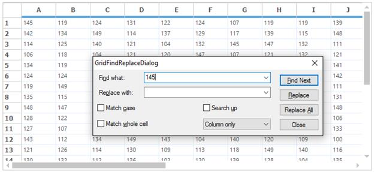

# Find and Replace in Windows Forms Grid Control
The searching and replacing of text and numbers can be done as like the Find and Replace functionality in the Excel. This can be done by using dialog or programmatically. This feature can be added to the GridControl by including the `Syncfusion.GridHelperClasses.Windows.dll` to the assembly reference. The following classes are used to implement the `Find and Replace` technique in GridControl. 

* [GridFindReplaceDialogSink](https://help.syncfusion.com/cr/windowsforms/Syncfusion.Windows.Forms.Grid.GridFindReplaceDialogSink.html) 
* [GridFindReplaceDialog](https://help.syncfusion.com/cr/windowsforms/Syncfusion.Windows.Forms.Grid.GridFindReplaceDialog.html)

The `GridFindReplaceDialogSink` class is used to perform the `Find and Replace` of text in GridControl. The `GridFindReplaceDialog` is the built-in dialog which shows the options for finding and replacing of the text. If this dialog is used for finding and replacing, there is no need to implement the methods for finding and replacing the text programmatically. 

The below example shows the `Find and Replace` dialog is shown in GridControl,



// Setting the Dialog sink.
GridFindReplaceDialogSink findReplaceSink = new GridFindReplaceDialogSink(this.gridControl1);

// Setting the Dialog.
GridFindReplaceDialog findReplaceDialog = GridFindReplaceDialog.Instance;

// Setting the sink to dialog.
findReplaceDialog.ActiveSink = findReplaceSink;
findReplaceDialog.ShowDialog();


' Setting the Dialog sink.
Dim findReplaceSink As New GridFindReplaceDialogSink(Me.gridControl1)

' Setting the Dialog.
Dim findReplaceDialog As GridFindReplaceDialog = GridFindReplaceDialog.Instance

' Setting the sink to dialog.
findReplaceDialog.ActiveSink = findReplaceSink
findReplaceDialog.ShowDialog()



## Finding Options
The finding options are used to set certain conditions for search the text and number using the [GridFindTextOptions](https://help.syncfusion.com/cr/windowsforms/Syncfusion.Windows.Forms.Grid.GridFindTextOptions.html) enumeration property. It has the following finding options,

**MatchCase** -Matches case while performing search. 
**MatchWholeCell** -Matches the search text with the entire text in a grid cell. 
**SearchUp** -Specifies if the search can be performed bottom-up. 
**ColumnOnly** -Searches only the current column. 
**SelectionOnly** -Searches only the current selection. 
**WholeTable** -Searches the whole table. 



//Create object for Find and Replace dialog.
GridFindReplaceDialogSink frDialog = new GridFindReplaceDialogSink(this.gridControl1);

//Set options for find Text.
GridFindTextOptions options = GridFindTextOptions.WholeTable;

//Set the range info.
object locInfo = GridRangeInfo.Table();

//Create Find and Replace event args. 
GridFindReplaceEventArgs frEvents = new GridFindReplaceEventArgs(this.txtSearchText.Text, "", options, locInfo);


'Create object for Find and Replace dialog.
Dim frDialog As New GridFindReplaceDialogSink(Me.gridControl1)

'Set options for find Text.
Dim options As GridFindTextOptions = GridFindTextOptions.WholeTable

'Set the range info.
Dim locInfo As Object = GridRangeInfo.Table()

'Create Find and Replace event args. 
Dim frEvents As New GridFindReplaceEventArgs(Me.txtSearchText.Text, "", options, locInfo)



### Find and Replace using Keyboard Shortcut
The Find and Replace dialog can be shown in GridControl as like Excel while pressing <kbd>CTRL</kbd> + <kbd>F</kbd> shortcut key.  This can be done by using the [CurrentCellKeyDown](https://help.syncfusion.com/cr/windowsforms/Syncfusion.Windows.Forms.Grid.GridControlBase.html#Syncfusion_Windows_Forms_Grid_GridControlBase_CurrentCellKeyDown) event as like below example,



//Triggering the CurrentCellKeyDown event.
this.gridControl1.CurrentCellKeyDown += new KeyEventHandler(gridControl1_CurrentCellKeyDown);

void gridControl1_CurrentCellKeyDown(object sender, KeyEventArgs e)
{
     if (e.Control && e.KeyCode == Keys.F)
     {

    // Setting the Dialog sink.
     GridFindReplaceDialogSink findReplaceSink = new GridFindReplaceDialogSink(this.gridControl1);

    // Setting the Dialog.
    GridFindReplaceDialog findReplaceDialog = GridFindReplaceDialog.Instance;
        
    // Setting the sink to dialog.
     findReplaceDialog.ActiveSink = findReplaceSink;
     findReplaceDialog.ShowDialog();
    }
}


'Triggering the CurrentCellKeyDown event.
Private Me.gridControl1.CurrentCellKeyDown += New KeyEventHandler(AddressOf gridControl1_CurrentCellKeyDown)

Private Sub gridControl1_CurrentCellKeyDown(ByVal sender As Object, ByVal e As KeyEventArgs)
     If e.Control AndAlso e.KeyCode = Keys.F Then
    
' Setting the Dialog sink.
         Dim findReplaceSink As New GridFindReplaceDialogSink(Me.gridControl1)

' Setting the Dialog.
        Dim findReplaceDialog As GridFindReplaceDialog = GridFindReplaceDialog.Instance

' Setting the sink to dialog.
         findReplaceDialog.ActiveSink = findReplaceSink
         findReplaceDialog.ShowDialog()
     End If
End Sub



## Programmatic Searching
The `Find and Replace` of the text in GridControl can be customized or can be used other than the `GridFindReplaceDialog`. The [GridFindReplaceEventArgs](https://help.syncfusion.com/cr/windowsforms/Syncfusion.Windows.Forms.Grid.GridFindReplaceEventArgs.html) class provides the options to the `GridFindReplaceDialogSink` to perform the `Find and Replace` programmatically without having dialog.

### Find and Find All
To find first possible match at the earliest based on the search options, use the [Find](https://help.syncfusion.com/cr/windowsforms/Syncfusion.Windows.Forms.Grid.Grouping.GridGroupTypedListRecordsCollection.html) method. The below code is used to find the text in GridControl



//Create object for Find and Replace dialog.
GridFindReplaceDialogSink frDialog = new GridFindReplaceDialogSink(this.gridControl1);

//Set options for find Text.
GridFindTextOptions options = GridFindTextOptions.WholeTable;

//Set the range info.
object locInfo = GridRangeInfo.Table();

//Create Find and Replace event args.
GridFindReplaceEventArgs frEvents = new GridFindReplaceEventArgs(this.txtSearchText.Text, "", options, locInfo);

//Used to Find the next possible match.
frDialog.Find(frEvents);            


'Create object for Find and Replace dialog.
Dim frDialog As New GridFindReplaceDialogSink(Me.gridControl1)

'Set options for find Text.
Dim options As GridFindTextOptions = GridFindTextOptions.WholeTable

'Set the range info.
Dim locInfo As Object = GridRangeInfo.Table()

'Create Find and Replace event args.
Dim frEvents As New GridFindReplaceEventArgs(Me.txtSearchText.Text, "", options, locInfo)

'Used to Find the next possible match.
frDialog.Find(frEvents) 



The below code snippet denotes to find the text in all places at once.



if (txtSearchText.Text != null)
{               
    object locInfo = GridRangeInfo.Table();
    GridRangeInfo selRange = GridRangeInfo.Empty;
    int rowIndex, colIndex;
    if ((options & GridFindTextOptions.SelectionOnly) != GridFindTextOptions.None)
        selRange = gridControl1.Selections.Ranges.ActiveRange;

    else if ((options & GridFindTextOptions.ColumnOnly) != GridFindTextOptions.None)
        selRange = GridRangeInfo.Col(gridControl1.CurrentCell.ColIndex);

    else if ((options & GridFindTextOptions.WholeTable) != GridFindTextOptions.None)
        selRange = GridRangeInfo.Cells(1, 1, gridControl1.RowCount, gridControl1.ColCount);

    clearHighlight();

    int startTop = selRange.Top;
    int startLeft = selRange.Left;

    while (GridFindReplaceDialogSink.GetNextCell(selRange, ref startTop, ref startLeft, false, false))
    {
        GridStyleInfo style = gridControl1[startTop, startLeft];
        GridCellRendererBase renderer = gridControl1.CellRenderers[style.CellType];
        if (renderer.FindText(txtSearchText.Text, startTop, startLeft, options, true))
        {
            gridControl1.CurrentCell.GetCurrentCell(out rowIndex, out colIndex);
            gridControl1[rowIndex, colIndex].BackColor = Color.Orange;
        }
    }
}
this.highlightText.highlightText = "";
this.gridControl1.Refresh();


If txtSearchText.Text IsNot Nothing Then
    Dim locInfo As Object = GridRangeInfo.Table()
    Dim selRange As GridRangeInfo = GridRangeInfo.Empty
    Dim rowIndex, colIndex As Integer
    If (options And GridFindTextOptions.SelectionOnly) <> GridFindTextOptions.None Then
        selRange = gridControl1.Selections.Ranges.ActiveRange

    ElseIf (options And GridFindTextOptions.ColumnOnly) <> GridFindTextOptions.None Then
        selRange = GridRangeInfo.Col(gridControl1.CurrentCell.ColIndex)

    ElseIf (options And GridFindTextOptions.WholeTable) <> GridFindTextOptions.None Then
        selRange = GridRangeInfo.Cells(1, 1, gridControl1.RowCount, gridControl1.ColCount)
    End If

    clearHighlight()

    Dim startTop As Integer = selRange.Top
    Dim startLeft As Integer = selRange.Left

    Do While GridFindReplaceDialogSink.GetNextCell(selRange, startTop, startLeft, False, False)
        Dim style As GridStyleInfo = gridControl1(startTop, startLeft)
        Dim renderer As GridCellRendererBase = gridControl1.CellRenderers(style.CellType)
        If renderer.FindText(txtSearchText.Text, startTop, startLeft, options, True) Then
            gridControl1.CurrentCell.GetCurrentCell(rowIndex, colIndex)
            gridControl1(rowIndex, colIndex).BackColor = Color.Orange
        End If
    Loop
End If
Me.highlightText.highlightText = ""
Me.gridControl1.Refresh()



### Replace and Replace All
The `Replace` and `Replace All` methods are used to replace the found text or number with the new text after the finding operation has been performed. 



//Create Find and Replace event args.
GridFindReplaceEventArgs frEvents = new GridFindReplaceEventArgs("Search Text", "Replace Text", searchOptions, locInfo);

//Replace the text with the first match found using the Find option.
frDialog.Replace(frEvents);

//Replace the entire match with the possible replace string
frDialog.ReplaceAll(frEvents);


'Create Find and Replace event args 
Dim frEvents As New GridFindReplaceEventArgs("Search Text", "Replace Text", searchOptions, locInfo)

'Replace the text with the first match found using the Find option
frDialog.Replace(frEvents)

'Replace the entire match with the possible replace string
frDialog.ReplaceAll(frEvents)



For more details about the programmatically adding a `Find and Replace`, refer the below dashboard sample, 
**&lt;Install Location&gt;Syncfusion\EssentialStudio\[Version Number]\Windows\Grid.Windows\Samples\Editing\Find-Replace Demo**

## Highlight Search Text 
The search text can be highlighted by using the [GridHighlightSearchText](https://help.syncfusion.com/cr/windowsforms/Syncfusion.GridHelperClasses.GridHighlightSearchText.html) class. It will highlight the search text with the default color (yellow). The highlighting color can be changed by using[HighlightColor](https://help.syncfusion.com/cr/windowsforms/Syncfusion.GridHelperClasses.GridHighlightSearchText.html#Syncfusion_GridHelperClasses_GridHighlightSearchText_HighlightColor) property.



//Creates an instance for the class “GridHighlightSearchText”.
GridHighlightSearchText highlightText = new GridHighlightSearchText();

//Wires the grid to the object.
highlightText.WireGrid(this.gridControl1);

//Assigns the text that needs to be highlighted.
highlightText.highlightText = txtSearchText.Text;

//Assigns the color (optional).
highlightText.HighlightColor = Color.Yellow;


'Creates an instance for the class “GridHighlightSearchText”.
Dim highlightText As New GridHighlightSearchText()

'Wires the grid to the object.
highlightText.WireGrid(Me.gridControl1)

'Assigns the text that needs to be highlighted.
highlightText.highlightText = txtSearchText.Text

'Assigns the color (optional).
highlightText.HighlightColor = Color.Yellow



