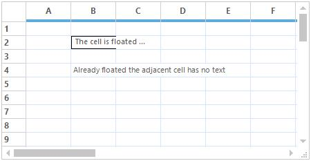
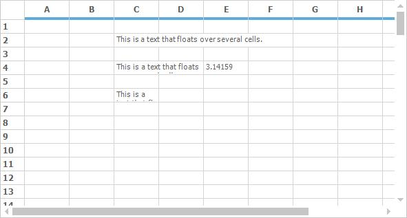
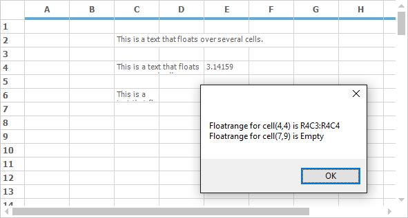

# Floating in Windows Forms Grid Control
Floating cells are those cells whose content floats over empty, adjacent cells. The floating cells can be enabled by setting [GridControl.FloatCellsMode](https://help.syncfusion.com/cr/windowsforms/Syncfusion.Windows.Forms.Grid.GridControl.html#Syncfusion_Windows_Forms_Grid_GridControl_FloatCellsMode) property. The `FloatCellsMode` property has the following enumerations,

* [GridFloatCellsMode.BeforeDisplayCalculation](https://help.syncfusion.com/cr/windowsforms/Syncfusion.Windows.Forms.Grid.GridFloatCellsMode.html) – This is used to force the floating cells to always be calculated just prior to being displayed.  
* [GridFloatCellsMode.OnDemandCalculation](https://help.syncfusion.com/cr/windowsforms/Syncfusion.Windows.Forms.Grid.GridFloatCellsMode.html)  - This is used to calculate the floating cells only if the cell contents or size changes.



// Enable Float Cells for GridControl
this.gridControl1.TableStyle.FloatCell = true;

// Set mode for calculating the float cells
this.gridControl1.FloatCellsMode = GridFloatCellsMode.OnDemandCalculation;


' Enable Float Cells for GridControl
Me.gridControl1.TableStyle.FloatCell = True

' Set mode for calculating the float cells
Me.gridControl1.FloatCellsMode = GridFloatCellsMode.OnDemandCalculation



## Preventing Cells from Being Flooded
To prevent the specific cell from being flooded by another cell, [FloodCell](https://help.syncfusion.com/cr/windowsforms/Syncfusion.Windows.Forms.Grid.GridStyleInfo.html#Syncfusion_Windows_Forms_Grid_GridStyleInfo_FloodCell) can be disabled for that cell. 



// Set mode for calculating the float cells
this.gridControl1.FloatCellsMode = GridFloatCellsMode.OnDemandCalculation;

//Specifies Cell Text.
this.gridControl1[2, 3].Text = "This is a text that floats over several cells.";
this.gridControl1[4, 3].Text = "This is a text that floats over several cells.";
this.gridControl1[6, 3].Text = "This is a text that floats over several cells.";
this.gridControl1[4, 5].Text = "3.14159";

//Code to prevent cell(5,2) from being flooded.
this.gridControl1[6, 4].FloodCell = false;



' Set mode for calculating the float cells
Me.gridControl1.FloatCellsMode = GridFloatCellsMode.OnDemandCalculation

'Specifies Cell Text.
Me.gridControl1(2, 3).Text = "This is a text that floats over several cells."
Me.gridControl1(4, 3).Text = "This is a text that floats over several cells."
Me.gridControl1(6, 3).Text = "This is a text that floats over several cells."
Me.gridControl1(4, 5).Text = "3.14159"

'Code to prevent cell(5,2) from being flooded.
Me.gridControl1(6, 4).FloodCell = False



## Finding a Floating Range of a Cell
The [FloatingCells](https://help.syncfusion.com/cr/windowsforms/Syncfusion.Windows.Forms.Grid.GridModelFloatingCells.html) collection maintains the all the floating ranges of a GridControl. To find a floating range of a cell, [FindRange](https://help.syncfusion.com/cr/windowsforms/Syncfusion.Windows.Forms.Grid.GridModelFloatingCells.html#Syncfusion_Windows_Forms_Grid_GridModelFloatingCells_FindRange_System_Int32_System_Int32_) method can be used. If the specified cell with row index and column index is inside a floating range, a range will be returned. Otherwise it will return the empty range.



// Finding a FloatRange for cell(4,4)
GridRangeInfo floatRange = this.gridControl1.Model.FloatingCells.FindRange(4, 4);

// Finding a FloatRange for cell(7,9)
GridRangeInfo floatRange2 = this.gridControl1.Model.FloatingCells.FindRange(7, 9);
MessageBox.Show("Float range for cell(4,4) is " + floatRange.Info.ToString()
+ "\n" + "Float range for cell(7,9) is " + floatRange2.RangeType.ToString());



' Finding a FloatRange for cell(4,4)
Dim floatRange As GridRangeInfo = Me.gridControl1.Model.FloatingCells.FindRange(4, 4)

' Finding a FloatRange for cell(7,9)
Dim floatRange2 As GridRangeInfo = Me.gridControl1.Model.FloatingCells.FindRange(7, 9)
MessageBox.Show("Float range for cell(4,4) is " & floatRange.Info.ToString() & Constants.vbLf & "Float range for cell(7,9) is " & floatRange2.RangeType.ToString())



N> The merged range of a cell can also be determined by using [GetSpannedRangeInfo](/windowsforms/grid/managing-the-rows-and-columns#finding-covered-range-floating-range-or-merged-range-of-a-cell) method instead of using `FindRange` method. 

## Delaying and Evaluating the Floating cells
The floating of cells can be delayed for specified range of cells to be re-evaluated later using [DelayFloatCells](https://help.syncfusion.com/cr/windowsforms/Syncfusion.Windows.Forms.Grid.GridModelFloatingCells.html#Syncfusion_Windows_Forms_Grid_GridModelFloatingCells_DelayFloatCells_Syncfusion_Windows_Forms_Grid_GridRangeInfo_) and those delayed floating cells can be re-evaluated later by using [EvaluateFloatingCells](https://help.syncfusion.com/cr/windowsforms/Syncfusion.Windows.Forms.Grid.GridModelFloatingCells.html#Syncfusion_Windows_Forms_Grid_GridModelFloatingCells_EvaluateFloatingCells_Syncfusion_Windows_Forms_Grid_GridRangeInfo_) methods. So floating cells which are delayed will not be re-evaluated until `EvaluateFloatingCells` method is called for that specified range.



// Delaying the floating of cells for specified range
this.gridControl1.FloatingCells.DelayFloatCells(GridRangeInfo.Rows(1, 3));

// Re-evaluating of floating cells
this.gridControl1.FloatingCells.EvaluateFloatingCells(GridRangeInfo.Rows(1, 3));



' Delaying the floating of cells for specified range
Me.gridControl1.FloatingCells.DelayFloatCells(GridRangeInfo.Rows(1, 3))

' Re-evaluating of floating cells
Me.gridControl1.FloatingCells.EvaluateFloatingCells(GridRangeInfo.Rows(1, 3))



## Locking and Unlocking of Evaluating
The Evaluating of cells can be temporarily stopped and restarted for evaluating using [LockEvaluate](https://help.syncfusion.com/cr/windowsforms/Syncfusion.Windows.Forms.Grid.GridModelFloatingCells.html#Syncfusion_Windows_Forms_Grid_GridModelFloatingCells_LockEvaluate) and [UnlockEvaluate](https://help.syncfusion.com/cr/windowsforms/Syncfusion.Windows.Forms.Grid.GridModelFloatingCells.html#Syncfusion_Windows_Forms_Grid_GridModelFloatingCells_UnlockEvaluate) methods.



//Temporarily locking the cells to be floated
this.gridControl1.FloatingCells.LockEvaluate();

//Unlocking the cells which are all locked for floating
this.gridControl1.FloatingCells.UnlockEvaluate();



'Temporarily locking the cells to be floated
Me.gridControl1.FloatingCells.LockEvaluate()

'Unlocking the cells which are all locked for floating
Me.gridControl1.FloatingCells.UnlockEvaluate()


