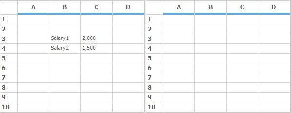
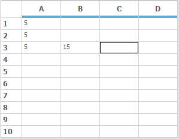
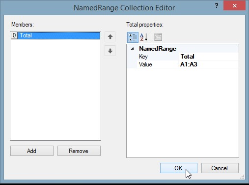
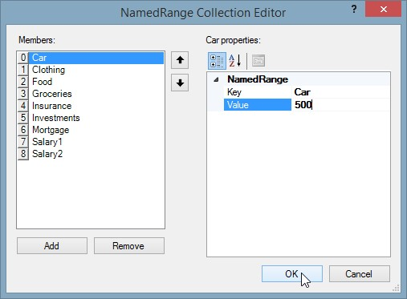
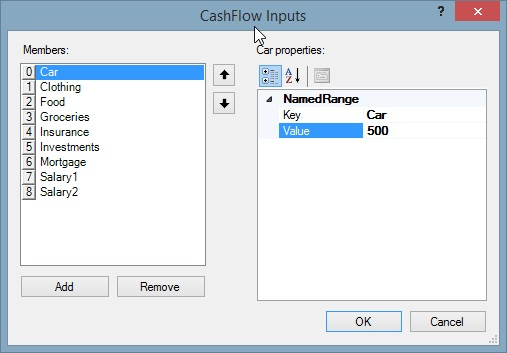

# Formula Support in Windows Forms Grid Control
Setting cell type of a cell to **FormulaCell** will allow to enter algebraic expressions using formulas and cell references. Formula cells can be used for every cell in a grid or just for a few cells. If the cell value starts with an equal sign, then the cell is considered as a formula cell and its contents are treated as such.



//Setting Formula cell for a particular cell
this.gridControl1[2, 2].CellType = GridCellTypeName.FormulaCell;



'Setting Formula cell for a particular cell
Me.gridControl1(2, 2).CellType = GridCellTypeName.FormulaCell


## Operators
The current formula support will allow well-formed parenthetical algebraic expressions with operators and operands. The 10 supported operators are shown in the following precedence table.
<table>
<tr>
<th>
Operations
</th>
<th>
Symbol
</th>
<th>
Calculation Precedence
</th>
</tr>
<tr>
<td>
Multiplication
</td>
<td>
*
</td>
<td>
1st
</td>
</tr>
<tr>
<td>
Division
</td>
<td>
/
</td>
<td>
1st 
</td>
</tr>
<tr>
<td>
Addition
</td>
<td>
+
</td>
<td>
2nd
</td>
</tr>
<tr>
<td>
Subtraction
</td>
<td>
-
</td>
<td>
2nd
</td>
</tr>
<tr>
<td>
Less Than
</td>
<td>
<
</td>
<td>
3rd
</td>
</tr>
<tr>
<td>
Greater Than
</td>
<td>
>
</td>
<td>
3rd
</td>
</tr>
<tr>
<td>
Equal
</td>
<td>
=
</td>
<td>
3rd
</td>
</tr>
<tr>
<td>
Less Than or Equal
</td>
<td>
<=
</td>
<td>
3rd
</td>
</tr>
<tr>
<td>
Greater Than or Equal
</td>
<td>
>=
</td>
<td>
3rd
</td>
</tr>
<tr>
<td>
Not Equal
</td>
<td>
!=
</td>
<td>
3rd
</td>
</tr>
</table>
The supported operands include those listed in the following table. An operand by itself is also a well-formed algebraic expression that can serve as an entire formula in a cell. Within a formula cell, case is ignored. So, `a1` is the same as `A1`, and `Cos(3)` is the same as `COS(3)`.
<table>
<tr>
<th>
Operand
</th>
<th>
Example
</th>
</tr>
<tr>
<td>
Number
</td>
<td>
532.1, -10.2, or 18.
</td>
</tr>
<tr>
<td>
cell reference
</td>
<td>
A12, BB1010, or Q18
</td>
</tr>
<tr>
<td>
library formula with valid arguments
</td>
<td>
Abs(E14), Cos(-3.14), or Sum(A1:A14)
</td>
</tr>
<tr>
<td>
any well-formed algebraic expression
</td>
<td>
E1+E2, Cos(2)<A4, or Abs(A1-A5).
</td>
</tr>
</table>

## Architecture
Formula Cell control is implemented with four classes. [GridFormulaCellModel](https://help.syncfusion.com/cr/windowsforms/Syncfusion.Windows.Forms.Grid.GridFormulaCellModel.html), [GridFormulaCellRenderer](https://help.syncfusion.com/cr/windowsforms/Syncfusion.Windows.Forms.Grid.GridFormulaCellRenderer.html), [GridFormulaEngine](https://help.syncfusion.com/cr/windowsforms/Syncfusion.Windows.Forms.Grid.GridFormulaEngine.html) and [GridFormulaTag](https://help.syncfusion.com/cr/windowsforms/Syncfusion.Windows.Forms.Grid.GridFormulaTag.html).
`GridFormulaCellModel` class does some significant work in its[GetFormattedText](https://help.syncfusion.com/cr/windowsforms/Syncfusion.Windows.Forms.Grid.GridFormulaCellModel.html#Syncfusion_Windows_Forms_Grid_GridFormulaCellModel_GetFormattedText_Syncfusion_Windows_Forms_Grid_GridStyleInfo_System_Object_System_Int32_) method override where calculations and formula parsing are initiated dynamically.
`GridFormulaCellRenderer` class handles a couple of activation methods that are specific for displaying formulas when a formula cell is activated.
`GridFormulaEngine` class does the actual parsing and calculation that is required to evaluate a formula in a cell. This class also maintains Formula Library.
`GridFormulaTag` class is used in conjunction with[GridStyleInfo](https://help.syncfusion.com/cr/windowsforms/Syncfusion.Windows.Forms.Grid.GridStyleInfo.html) class that has a property of this type. `GridFormulaTag` tracks computed value of the cell in its Text property.

## Supported Functions
This section explains the list of library functions that are shipped in the `GridFormulaEngine`.

### ABS
Returns the absolute value of a number. The absolute value of a non-negative number is the number itself. The absolute value of a negative number is -1 times the number.

#### Syntax
ABS(number),

#### Where:
* **Number** is the real number for which you want the absolute value.

### ACCRINT
ACCRINT function returns the accrued interest for a security that pays periodic interest.

#### Syntax
ACCRINT(issue, first_interest, settlement, rate, par, frequency, [basis], [calc_method])

#### Where:
* **issue** - security’s issue date.
* **first_interest**- security’s first interest date.
* **settlement** - security’s settlement date. The security settlement date is the date after the issue date when the security is traded to the buyer.
* **rate** - security’s annual coupon rate.
* **par** - security’s par value.
* **frequency** - number of coupon payments per year.

### ACCRINTM
Returns the accrued interest for a security that pays maturity interest.

#### Syntax
ACCRINTM(issue, settlement, rate, par, [basis])

#### Where:
* **issue** - security’s issue date.
* **settlement** - security’s settlement date. The security settlement date is the date after the issue date when the security is traded to the buyer.
* **rate** - security’s annual coupon rate.
* **par** - security’s par value.

### ACOS
Returns the inverse cosine of a number. Inverse cosine is also referred to as arccosine. The arccosine is the angle whose cosine is the given number. The returned angle is given in radians in the range of 0 to pi.

#### Syntax
ACOS(number),

#### Where:
* **number** is the cosine of the angle that you want and must be between -1 and 1.

### ACOSH
Returns the inverse hyperbolic cosine of a number. The number must be greater than or equal to 1. The inverse hyperbolic cosine is the value whose hyperbolic cosine is the given number.

#### Syntax
ACOSH(number),

#### Where:
* **number** is any real number that is greater than or equal to 1.

### ACOT
`ACOT` function retrieves the principal value of the inverse cotangent or arctangent of a number.

#### Syntax
ACOT(number)

#### Where:
* **number** is the cotangent of the angle you need.

### ACOTH
`ACOTH` function retrieves the inverse hyperbolic cotangent of a value.

#### Syntax
ACOTH(number)

#### Where:
* **number** is the cotangent of the angle you need.

### ACSCH
`ACSCH` function computes inverse hyperbolic cosecant of its argument.

#### Syntax
x = acsch(y)

#### Where:
* **x** is a complex or real array
* **y** is a complex or real array

### ADDRESS
`ADDRESS` function returns the address of a cell in a worksheet given specified row and column numbers.

#### Syntax
ADDRESS(row_number, column_number, [abs_number], [a1], [sheet_text])

#### Where:
* **row_number**: A numeric value that specifies the row number.
* **column_number**: A numeric value that specifies the column number
* **abs_number**: Optional. A numeric value that specifies the type of reference to return.

### AND
Returns `True` if all the arguments have a logical value of true and returns `False` if at least one argument is false.

#### Syntax
AND(logical1, logical2, …),

#### Where:
* **logical1**, **logical2**, … are multiple conditions you want to test for True or False.

### ARABIC
A Roman numeral has been converted to an Arabic numeral.

#### Syntax
ARABIC( text ),

#### where:
* **text** which needs to be converted.

### AREAS
The `AREAS` function returns the number of areas that make up the reference.

#### Syntax
AREAS(reference)

#### Where:
* **reference** is an input argument.

### ASC
The `ASC` function changes the double-byte characters to single-byte characters for `DBCS` languages.

#### Syntax
ASC(text)

#### Where:
* **text** is the text you want to change.

### ASECH
`ASECH` function computes element-wise inverse hyperbolic secant of the argument.

#### Syntax
x = asech(y)

#### Where:
* **x** is a complex or real array.
* **y** is a complex or real array.

### ASIN
Returns the inverse sine of a number. Inverse sine is also referred to as arcsine. The arcsine is the angle whose sine is the given number. The returned angle is given in radians in the range from -pi/2 to +pi/2.

#### Syntax
ASIN(number)

#### Where:
* **number** is the sine of the angle that you want and must be between -1 and 1.

### ASINH
Returns the inverse hyperbolic sine of a number. The inverse hyperbolic sine is the value whose hyperbolic sine is the given number, so ASINH(SINH(number)) equals number.

#### Syntax
ASINH(number)

#### Where:
* **number** is any real number.

### ATAN
Returns the inverse tangent of a number. Inverse tangent is also known as arctangent. The arctangent is the angle whose tangent is a number. The returned angle is given in radians in the range from -pi/2 to +pi/2.

#### Syntax
ATAN(number)

#### Where:
* **number** is the tangent of the angle that you want.

### ATAN2
Returns the inverse tangent of the specified x- and y-coordinates. The arctangent is the angle from the x-axis to a line containing the origin (0, 0) and the point (x_number, y_number). The angle is given in radians between -pi and pi, excluding -pi.

#### Syntax
ATAN2(x_number,y_number)

#### Where:
* **x_number** is the X coordinate of the point.
* **y_number** is the Y coordinate of the point.

### ATANH
Returns the inverse hyperbolic tangent of a number. Number must be strictly between -1 and 1. The inverse hyperbolic tangent is the value whose hyperbolic tangent is a number, so ATANH(TANH(number)) equals the given number.

#### Syntax
ATANH(number)

#### Where:
* **number** is any real number that is between 1 and -1.

### AVEDEV
Returns the average of absolute mean deviations of data points. AVEDEV is a measure of variability in a data set.

#### Syntax
AVEDEV(number1, number2, …)

#### Where:
* **number1**, **number2**, … are arguments for which you want the average of the absolute deviations. You can also use a single array or a reference to an array instead of arguments separated by commas.

### AVERAGE
Returns the average (arithmetic mean) of the arguments.

#### Syntax
AVERAGE(number1, number2, …)

#### Where:
* **number1**,**number2**, … are numeric arguments for which you want the average.

### AVERAGEA
Calculates the average (arithmetic mean) of the values in the list of arguments. In addition to numbers and text logical values such as `True` and `False` are also included in the calculation.

#### Syntax
AVERAGEA(value1, value2, …)

#### Where:
* **value1**, **value2**, … are cells, ranges of cells, or values for which you want the average.

### AVERAGEIF
`AVERAGEIF` function finds the average of values in a given array that satisfies the given criteria, and returns the average value of the corresponding values in a second given array.

#### Syntax
=AVERAGEIF(range, criteria, average_range)

#### Where:
* **range** - Array of values to be tested against the given criteria.
* **criteria** - The condition to be tested in each of the values of the given range.
* **average_range**- Numeric values to be evaluated against the criteria and averaged.

### AVERAGEIFS
`AVERAGEIFS` function finds the average of values in a given array that satisfies a set of given criteria.

#### Syntax
= AVERAGEIFS( average_range, criteria_range1, criteria1, [criteria_range2, criteria2], … )

#### Where:
* **average_range -**Specific set of values to be averaged if the criteria range meets the provided criteria.
* **criteria_range1**- Array of values to be tested against the given criteria.
* **criteria1** - The condition to be tested on each of the values of the given range.

### AVG
Returns the average (arithmetic mean) of the arguments.

#### Syntax
AVG(number1, number2, …),

#### Where:
* **number1**, **number2**, … are numeric arguments for which you want the average.

### BASE
A number has been converted into a text representation with the given radix (base).

#### Syntax
BASE(Number, Radix [Min_length])

#### Where:
* **Number** is the value that you want to convert.
* **Radix** is the base radix that you want to convert the number into.
* **Min_length** is the minimum length of the returned string. Min_length is optional.

### BESSELI
The BESSELI function calculates the [modified Bessel functions](https://en.wikipedia.org/wiki/Bessel_function). These functions are the equivalent of the [Bessel functions](https://en.wikipedia.org/wiki/Bessel_function), evaluated for purely imaginary arguments.

#### Syntax
BESSELI(a,n)

#### Where:
* **a** is the value that evaluates the function.
* **n** is the order of the Bessel function.

#### Remarks
`#VALUE!` - occurs if a or n is non-numeric 
`#NUM!` - occurs if n < 0

### BESSELJ
The `BESSELJ` function calculates the [Bessel function](https://en.wikipedia.org/wiki/Bessel_function), Jn(x), for a specified order and a given value of x.

#### Syntax
BESSELJ(a,n)

#### Where
* **a** is the value that evaluates the function.
* **n** is the order of the Bessel function.

#### Remarks
`#VALUE!` - occurs if a or n is non-numeric 
`#NUM!` - occurs if n < 0

### BESSELY
The `BESSELY` function calculates for a specified order and value of x.

#### Syntax
BESSELY(a,n)

#### Where:
* **a** is the value that evaluates the function.
* **n** is the order of the Bessel function.

#### Remarks
`#VALUE!` - occurs if a or n is non-numeric 
`#NUM!` - occurs if n < 0

### BESSELK
The `BESSELK` function retrieves the modified Bessel function K n(x), which is equivalent to the Bessel functions evaluated for purely imaginary arguments.

#### Syntax
BESSELK(x,n)

#### where
* **x** is the value that evaluates the function.
* **n** is the order of the Bessel function.

#### Remarks
`#VALUE!` - occurs if a or n is non-numeric 
`#NUM!`- occurs if n < 0

### BETA.DIST
The` BETA.DIST` function returns the beta distribution which is commonly used to study variation in the percentage of something.

#### Syntax
BETA.DIST( x, alpha, beta, cumulative, [A], [B] )

#### Where:
* **x** is the function of calculate the value between [A] and [B].
* **alpha** is a parameter of the distribution.
* **beta** is a parameter of the distribution.
* **cumulative** is a logical argument that specifies the type of distribution to be used. If it is True returns the cumulative distribution else it returns the probability density function.
* **[A**]-Optional argument which is lower bound of the interval of x.
* **[B**]-Optional argument which is upper bound of the interval of x.

### BIGMUL
`BIGMUL` function gives the full value of multiplying two 32-bit numbers.

#### Syntax
Math.BigMul(x,y);

#### Where:
* **x** is the first number to multiply
* **y** is the second number to multiply.

### BIN2DEC
The `BIN2DEC` function converts a binary number into a decimal number.

#### Syntax
BIN2DEC(number)

#### Where:
* **number** is the binary number that you want to convert.

#### Remarks
`#NUM!`- occurs if number is not a valid binary number, or if number contains more than 10 characters.

### BIN2OCT
The `BIN2OCT` function converts a binary number into an octal number.

#### Syntax
BIN2OCT(number, places)

#### Where:
* **number** is the decimal integer you want to convert.
* **places** is the number of characters to use.

### BIN2HEX
The **BIN2HEX** function converts a binary number into a hexadecimal.

#### Syntax
BIN2HEX(number places)

#### Where:
* **number** is the decimal integer you want to convert.
* **places** is the number of characters to use.

#### Remarks
`#NUM!` - occurs if number is not a valid binary number, if places is negative. 
`#VALUE!` - occurs if places is non-numeric.

### BINOM.DIST
The `BINOM.DIST` function returns the Binomial Distribution probability for a given number of successes from a specified number of trials.

#### Syntax
BINOM.DIST (trial number,success_probability,value, cumulative)

#### Where
* **trial** number is the number of Bernoulli trials.
* **success_probability** is the probability of a success on each trial.
* **value** is the criterion value.
* **cumulative** is a logical value that determines the form of the function.

#### Remarks
`#NUM!` - occurs if trial number is less than zero, if success_probability and value is less than zero or greater one. 
`#VALUE!` - occurs if trials, success_probability and value are non-numeric.

### BINOMDIST
Returns the individual term binomial distribution probability.

#### Syntax
BINOMDIST(number_s, trials, probability_s, cumulative)

#### Where:
* **number_s** is the number of successes in trials.
* **trials** is the number of independent trials.
* **probability_s** is the probability of success on each trial.

### BINOM.INV
`BINOM.INV` function returns the smallest value for which the cumulative binomial distribution is greater than or equal to a criterion value.

#### Syntax
BINOM.INV(trials, probability_s, alpha)

#### Where:
* **trials** is the number of Bernoulli trials.
* **probability_s** is the probability of a success on each trial.
* **alpha** is the criterion value.

### BITAND
The `BITAND` function returns a bitwise ‘AND’ of two numbers.

#### Syntax
BITAND(num1,num2)

#### Where:
* **num1** and **num2** should be in decimal format.

#### Remarks
`#NUM!` - occurs if num1 or num2 is less than zero, if num1 or num2 is a non-integer or is greater than (2^48)-1. 
`#VALUE!` - occurs if num1 or num2 is a non-numeric value.

### BITLSHIFT
The `BITLSHIFT` function retrieves a number shifted left by the specified number of bits.

#### Syntax
BITLSHIFT(num1,num2)

#### Where:
* **num1** must be an integer greater than or equal to 0.
* **num2** must be an integer.

#### Remarks
`#NUM!` - occurs if num1 or num2 is less than zero, if num1 or num2 is a non-integer or is greater than (2^48)-1. 
`#VALUE!` - occurs if num1 or num2 is a non-numeric value.

### BITOR
The `BITOR` function retrieves a bitwise `OR` of two numbers.

#### Syntax
BITOR(num1, num2)

#### Where:
* **num1** and **num2** should be in decimal format.

#### Remarks
`#NUM!`- occurs if num1 or num2 is less than zero, if num1 or num2 is a non-integer or is greater than (2^48)-1. 
`#VALUE!` - occurs if num1 or num2 is a non-numeric value.

### BITRSHIFT
The `BITRSHIFT` function retrieves a number shifted right by the specified number of bits.

#### Syntax
BITRSHIFT(num1,num2)

#### Where:
* num1 must be an integer greater than or equal to 0.
* Num2 must be an integer.

#### Remarks
`#NUM!`- occurs if num1 or num2 is less than zero, if num1 or num2 is a non-integer or is greater than (2^48)-1. 
`#VALUE!` - occurs if num1 or num2 is a non-numeric value.

### BITXOR
The `BITXOR` function retrieves a bitwise ‘XOR’ of two numbers.

#### Syntax
BITXOR(num1,num2b)

#### Where:
* **num1** and **num2** should be in decimal format.

#### Remarks
`#NUM!`- occurs if num1 or num2 is less than zero, if num1 or num2 is a non-integer or is greater than (2^48)-1. 
`#VALUE!` - occurs if num1 or num2 is a non-numeric value.

### CEILING
Returns number rounded up, away from zero, to the nearest multiple of significance. For example, if you want to avoid using pennies in your prices and your product is priced at $4.82, use the formula =CEILING(4.82, 0.05) to round prices up to the nearest nickel.

#### Syntax
CEILING(number, significance)

#### Where:
* **number** is the value you want to round off.
* **significance** is the multiple to which you want to round.

### CEILING.MATH
`CEILING.MATH` function rounds a number up to the nearest multiple of significance.

#### Syntax
CEILING(number, [significance], [mode])

#### Where:
* **number** must be less than 9.99E+307 and greater than -2.229E-308.
* **significance** must be the multiple to which the number is to be rounded.
* **mode** is for negative numbers, it controls whether the number is rounded towards or away from zero.

### CELL
The `CELL` function returns information about a given cell. This can be information in relation to the contents, formatting, or location of the cell.

#### Syntax
CELL( infoType, reference )

#### Where:
* **infoType** argument is a text string that specifies the type of information to be returned.
* **reference** is the cell for which the information is to be returned.

### CHAR
The `CHAR` function returns the character whose number code is defined in the parameter.

#### Syntax
CHAR(number)

#### Where:
* **number** is the numeric value to retrieve the character.

### CHIDIST
Returns the one-tailed probability of the chi-squared distribution. The χ2 distribution is associated with a χ2 test.

#### Syntax
CHIDIST(x, degrees_freedom)

#### Where:
* **x** is the value at which you want to evaluate the distribution.
* **degrees_freedom** is the number of degrees of freedom.

### CHIINV
Returns the inverse of the one-tailed probability of the chi-squared () distribution. If probability = CHIDIST(x,…), then CHIINV(probability,…) = x. Use this function to compare observed results with expected ones in order to decide whether your original hypothesis is valid.

#### Syntax
CHIINV(probability, degrees_freedom)

#### Where:
* **probability** is a probability associated with the chi-squared distribution.
* **degrees_freedom** is the number of degrees of freedom.

### CHISQ.DIST
The `CHISQ.DIST` function calculates the Probability Density Function or the Cumulative Distribution Function for the [chi-square distribution](https://en.wikipedia.org/wiki/Chi-squared_distribution).

#### Syntax
CHISQ.DIST(x,degFreedom,cumulative)

#### Where:
* **x** is the value that evaluates the function.
* **degFreedom** is the number of degrees of freedom.
* **cumulative** is a logical value that determines the form of the function.

#### Remarks
`#VALUE!` - occurs if any argument is non-numeric. 
`#NUM!`- occurs if x is negative and if f degFreedom &lt; 1 or degFreedom &gt; 10^10.

### CHISQ.DIST.RT
The `CHISQ.DIST.RT` function calculates the right-tailed probability of the [chi-square distribution](https://en.wikipedia.org/wiki/Chi-squared_distribution).

#### Syntax
CHISQ.DIST.RT(x,degFreedom)

#### Where:
* **x** is the value that evaluates the function.
* **degFreedom** is the number of degrees of freedom.

#### Remarks
`#VALUE!` - occurs if either argument is non-numeric. 
`#VALUE!` - occurs if any argument is non-numeric.
`#NUM!`- occurs occurs if f degFreedom &lt; 1 or degFreedom &gt; 10^10.

### CHISQ.INV
The `CHISQ.INV` function returns the inverse of the left-tailed probability of the chi-squared distribution.

#### Syntax
CHISQ.INV(probability,degFreedom)

#### Where:
* **probability** is a probability of chi-squared distribution.
* **deg_freedom** is the number of degrees of freedom.

#### Remarks
`#NUM!`- occurs if probability is is less than zero, if probability is greater than 1 and degFreedom is less than 1. 
`#VALUE!` - occurs if probability or degFreedom is non-numeric.

### CHISQ.INV.RT
The `CHISQ.INV.RT` function calculates the inverse of the right-tailed probability of the [chi-square distribution](https://en.wikipedia.org/wiki/Chi-squared_distribution).

#### Syntax
CHISQ.INV.RT(probability, degFreedom)

#### Where:
* **probability** is a probability of chi-squared distribution.
* **degFreedom** is the number of degrees of freedom.

#### Remarks
`#NUM!`- occurs if probability is is less than zero, if probability is greater than 1 and if degFreedom is less than 1.
`#VALUE!` - occurs if probability or degFreedom is non-numeric.

### CHISQ.TEST
The `CHISQ.TEST` function function performs the chi-square test on two supplied data sets (of observed and expected frequencies), and returns the probability that the differences between the sets are simply due to sampling error.

#### Syntax
CHISQ.TEST(O_range,E_range)

#### Where:
* **O_range** is the range of data that contains observed values.
* **E_range** is the range of data that contains expected values.

### CHITEST
Returns the test for independence. `CHITEST` returns the value from chi-squared (c2) distribution for statistic and the appropriate degrees of freedom.

#### Syntax
CHITEST(actual_range, expected_range)

#### Where:
* **actual_range** is the range of data that contains observations to test against expected values.
* **expected_range** is the range of data that contains the ratio of the product of row totals and column totals to the grand total.

### CHOOSE
The `CHOOSE` function returns the value from a range of values on a specific index.
##### Syntax:
CHOOSE(index, value array)

#### Where:
* **index** is to specify the index from where you want to retrieve the value.
* **value array** is the array of value from where you want to take the value.

### CLEAN
`CLEAN` function is used to remove the non-printable characters from the given text, represented by numbers 0 to 31 of the 7-bit ASCII code.

#### Syntax
=Clean(Text)

#### Where:
Text: Required. String or text from which to remove non printable characters.

### CODE
The `CODE` function converts the first character of a supplied text string into numeric character set code.

#### Syntax
CODE(name)

#### Where:
* **name** is the text for which you want the code of the first character.

### COLUMN
The `Column` function returns the column index of the provided column in range.

#### Syntax
Column(range)

#### Where:
* **range** is to provide the column in range.

### COLUMNS
The `COLUMNS` function returns the number of columns that are contained within the range.

#### Syntax
COLUMNS( array )

#### Where:
* **array** argument is the range that you want to know the number of columns in.

### COMPLEX
The `COMPLEX` function converts real and imaginary coefficients into a complex number of the form a + bi or a + bj.

#### Syntax
COMPLEX(number,imaginary_number, suffix )

#### Where:
* **number** is the real coefficient of the complex number.
* **imaginary_number** is the imaginary coefficient of the complex number.
* **suffix** is the imaginary component of the complex number.

#### Remarks
`#VALUE!` - occurs if number or imaginary_number is non-numeric, if suffix is neither “i” nor “j”.

### COMBIN
Returns the number of combinations for a given number of items. Use `COMBIN` to determine the total possible number of groups for a given number of items.

#### Syntax
COMBIN(number, number_chosen)

#### Where:
* **number** is the number of items.
* **number_chosen** is the number of items in each combination.

### COMBINA
For a given number of items, `COMBINA` function returns the number of combinations (with reputations).

#### Syntax
COMBINA(number1, number2)

#### Where:
* **number1** is greater than equal to zero and greater than equal to number2
* **number2** is greater than equal to zero.

### CONCATENATE
Joins several text strings into one text string.

#### Syntax
CONCATENATE (text1, text2, …),

#### Where:
* **text1, text2**, … are text items to be joined into a single text item. The text items can be text strings, numbers, or single-cell references.

### CONFIDENCE
Returns a value that you can use to construct a confidence interval about population mean. The confidence interval is a range of values. In your sample, mean x is at the center of this range and the range is x ± CONFIDENCE. For example, if x is the sample mean of delivery times for products ordered through the mail, x ± CONFIDENCE is a range of population means.

#### Syntax
CONFIDENCE(alpha, standard_deviation, size)

#### Where:
* **alpha** is the significance level used to compute the confidence level. The confidence level equals 100*(1 - alpha)%, or in other words, an alpha of 0.05 indicates a 95 percent confidence level.
* **standard_deviation** is the population standard deviation for the data range and is assumed to be known.
* **size** is the sample size.

### CONFIDENCE.NORM
The `CONFIDENCE.NORM` function uses a [Normal Distribution](https://en.wikipedia.org/wiki/Normal_distribution) to calculate a confidence value that can be used to construct the confidence interval for a population mean, for a supplied probability and sample size.

#### Syntax
CONFIDENCE.NORM(alpha,standard_deviation,size)

#### Where:
* **alpha** is the significance level.
* **standard_deviation** is the population standard deviation for the data range.
* **size** is the sample size.

#### Remarks
`#VALUE!` - occurs if any argument is non-numeric. 
`#NUM!`- occurs if alpha and standard_deviation is less than or equal to zero or if alpha is greater than or equal to zero. 
`#DIV/0!` - occurs if the size is equal to one.

### CONFIDENCE.T
Using a student’s distribution, this function retrieves the confidence interval for a population mean.

#### Syntax
CONFIDENCE.T(alpha,standard_deviation,size)

#### Where:
* **alpha** is the significance level used to compute the confidence level.
* **standard_deviation** is the population standard deviation for data range and is assumed to be known.
* **size** is the sample size.

### CONVERT
The `CONVERT` function converts a number from one unit type (e.g. Yards) to another unit type (e.g. Meters).

#### Syntax
CONVERT(number,fromUnit,toUnit)

#### Where:
* **number** is the value in fromUnit to convert.
* **fromUnit** is the units for number.
* **toUnit** is the units of the result.

#### Remarks
`#VALUE!` - occurs if the input data types are incorrect. 
`#N/A` - occurs if the unit does not exist or are in different groups. 

### CORREL
Returns the correlation coefficient of the array1 and array2 cell ranges.

#### Syntax
CORREL(array1, array2)

#### Where:
* **array1** is a cell range of values.
* **array2** is the second cell range of values.

### COS
Returns the cosine of the given angle.

#### Syntax
COS(number)

#### Where:
* **number** is the angle in radians for which you want the cosine.

### COSH
Returns the hyperbolic cosine of a number.

#### Syntax
COSH(number)

#### Where:
* **number** is any real number for which you want to find the hyperbolic cosine.

### COT
`COT` function returns the cotangent of an angle specified in radians.

#### Syntax
COT(number)

#### Where:
* **number** – the angle radians for which you want the secant.

### COTH
`COTH` function returns the hyperbolic cotangent of a hyperbolic angle.

#### Syntax
COTH(number)

#### Where:
* **number** – the angle radians for which you want the secant.

### COUNT
Counts the number of items in a list that contains numbers.

#### Syntax
COUNT(value1,value2, …)

#### Where:
* **value1**, **value2**, … are arguments that can contain or refer to a variety of different types of data, but only numbers are counted.

### COUNTA
Counts the number of cells that are not empty.

#### Syntax
COUNTA(value1, value2, …)

#### Where:
* **value1**, **value2**, … are arguments representing the values you want to count. In this case, a value is any type of information excluding empty cells.

### COUNTBLANK
Counts empty cells in a specified range of cells.

#### Syntax
COUNTBLANK(range)

#### Where:
* **range** is the range from which you want to count the blank cells.

### COUNTIF
Counts the number of cells within a range that meet the given criteria.

#### Syntax
COUNTIF(range, criteria)

#### Where:
* **range** is the range of cells from which you want to count cells.
* **criteria** is the criteria in the form of a number, expression or text that defines which cells will be counted. For example, the criteria can be expressed as “>32”.

### COUNTIFS

Counts the number of cells in specified ranges, which meet a set of given criteria.

#### Syntax

COUNTIFS(range1, criteria1, range2, criteria2)

#### Where

* **range1:** Specifies a range of cells from which you want to count the cells.
* **criteria1:** Specifies a criteria in the form of number, expression, or text that defines the cells that will be counted. For example, the criteria can be expressed as “>32”.
* **range2** and **criteria2** are optional.

### COVAR
Returns covariance, the average of the products of deviations for each data point pair.

#### Syntax
COVAR(array1, array2)

#### Where:
* **array1** is the first cell range of numbers.
* **array2** is the second cell range of numbers.

### COVARIANCE.P
`COVARIANCE.P` function retrieves population covariance, the average of the products of deviations for each data point pair in two data sets.

#### Syntax
COVARIANCE.P(array1, array2)

#### Where:
* **array1** is the first cell range of integers.
* **array2** is the second cell range of integers.

### COVARIANCE.S
`COVARIANCE.S` function returns the sample covariance, the average of the products of deviations for each data point pair in two data sets.

#### Syntax
COVARIANCE.S(array1, array2)

#### Where:
* **array1** is the first cell range of integers.
* **array2** is the second cell range of integers.

### CRITBINOM
Returns the smallest value for which, the cumulative binomial distribution is greater than or equal to a criterion value.

#### Syntax
CRITBINOM(trials, probability_s, alpha)

#### Where:
* **trials** is the number of Bernoulli trials.
* **probability**_s is the probability of a success on each trial.
* **alpha** is the criterion value.

### CSC
`CSC` function returns the cosecant of an angle specified in radians.

#### Syntax
CSC(number)

#### Where:
* **number** – the angle radians for which you want the secant.

### CSCH
`CSCH` function returns the hyperbolic cosecant of an angle specified in radians.

#### Syntax
CSCH(number)

#### Where:
* **number** – the angle radians for which you want the secant.

### CUMIPMT
Returns the Macaulay duration for an assumed par value of $100. Duration is defined as the weighted average of the present value of cash flows and is used as a measure of a bond price’s response to changes in yield.

#### Syntax
DURATION(settlement, maturity, coupon, yield, frequency, basis)

#### Where:
* **Settlement** - security’s settlement date.
* **Maturity** - security’s maturity date.
* **Coupon** – annual coupon rate
* **yield** – security’s annual yield.
* **Frequency** – number of coupon payments per year.
* **Basis** – type of day count basis.

### CUMPRINC
`CUMPRINC` function returns the cumulative principal paid on a loan between the start_period and end_period.

#### Syntax
CUMPRINC(rate, number_of_periods, present_value, start_period, end_period, type)

#### Where:
* **Rate** – the interest rate.
* **number_of_periods** - total number of payment periods
* **present_value** - present value.
* **start_period**- first period in calculation. Begin with one.
* **end_period**- last period in calculation.
* **type** - timing of the payment.

### DATE
Returns the sequential serial number that represents a particular date.

#### Syntax
DATE(year, month, day)

#### Where:
* **year** can be one to four digits. Year is interpreted based on 1900.
* If a year is between 0 (zero) and 1899 (inclusive), the value is added to 1900 to calculate the year. For example, DATE(102,11,12) returns November 12, 2002 (1900+102).
* If a year is between 1900 and 9999 (inclusive), the value is used as is, for example, DATE(2002,11,12) returns November 12, 2002.
* **month** is a number representing the month of the year.
* **day** is a number representing the day of the month.

### DATEVALUE
Returns the serial number of the date represented by date_text.

#### Syntax
DATEVALUE(date_text),

#### Where:
* **date_text** is the text that represents a date as a formatted string. For example, “11/12/2002” or “12-Nov-2002” are text strings within quotation marks that represent dates. If the year portion of the date_text is omitted, DATEVALUE uses current year from your computer’s built-in clock. The time information in the date_text is ignored.

#### Remarks
* Dates are stored as sequential serial numbers so that they can be used in calculations. By default, January 1, 1900 is serial number 1, and November 12, 2002 is serial number 37572 because it is 37572 days after January 1, 1900.
* Most functions automatically convert date values to serial numbers.

### DAVERAGE
`DAVERAGE` function finds the average values in a column of a list or database that matches the conditions that have been specified.

#### Syntax
DAVERAGE(database, field, criteria)

#### Where:
* **database** is the range of cells that makes up the list or database
* **field** indicates which column is used in the function
* **criteria** is the range of cells that contains the conditions you specify.

### DAY
Returns the day of a date represented by a serial number. The day is given as an integer ranging from 1 to 31.

#### Syntax
DAY(serial_number)

#### Where:
* **serial_number** is the date of the day you are trying to find. Dates should be entered by using the DATE function or as results of other formulas or functions. For example, use DATE(2002,4,23) for the 23rd day of April, 2002.

### DAYS
The `DAYS` function retrieves the number of days between two dates.

#### Syntax:
DAYS(endDate, startDate)

#### Where:
* **endDate** and **startDate** are the two dates between which you want to know the number of days.

### DAYS360
Returns the number of days between two dates based on a 360-day year (twelve 30-day months) which is used in some accounting calculations.

#### Syntax
DAYS360(start_date, end_date, method)

#### Where:
* **start_date**and **end_date**are the two dates between which you want to know the number of days. If start_date occurs after end_date, DAYS360 returns a negative number. Dates should be entered by using the DATE function or as results of other formulas or functions. 
* **method** is a logical value that specifies whether to use the U.S. or European method in calculation. If method is: False or omitted – The calculation uses the U.S. (NASD) method. If the starting date is the 31st of a month, it becomes equal to the 30th of the same month. If the ending date is the 31st of a month and the starting date is earlier than the 30th of a month, the ending date becomes equal to the 1st of the next month; otherwise the ending date becomes equal to the 30th of the same month. True – The calculation uses the European method. Starting dates and ending dates that occur on the 31st of a month become equal to the 30th of the same month.

### DB
Returns the depreciation of an asset for a specified period using the fixed-declining balance method.

#### Syntax
DB(cost, salvage, life, period, month)

#### Where:
* **cost** is the initial cost of the asset.
* **salvage** is the value at the end of the depreciation (sometimes called the salvage value of the asset).
* **life** is the number of periods over which the asset is being depreciated (sometimes called the useful life of the asset).
* **period** is the period for which you want to calculate the depreciation. Period must use the same units as life.
* **month** is the number of months in the first year. If month is omitted, it is assumed to be 12.

### DCOUNT
`DCOUNT` function counts the number of cells that contain numbers in a column of a list or database, which matches the conditions specified.

#### Syntax
DCOUNT(database, field, criteria )

#### Where:
* **database** is the range of cells that makes up the list or database
* **field** indicates which column is used in the function
* **criteria** is the range of cells that contains the conditions you specify.

### DCOUNTA
`DCOUNTA` function counts the number of non-blank cells in a column of a list or database that matches the conditions specified.

#### Syntax
DCOUNTA(database, field, criteria)

#### Where:
* **database** is the range of cells that makes up the list or database.
* **field** indicates which column is used in the function.
* **criteria** is the range of cells that contains the conditions you specify.

### DDB
Returns the depreciation of an asset for a specified period using double-declining balance method or some other method you specify.

#### Syntax
DDB(cost, salvage, life, period, factor)

#### Where:
* **cost** is the initial cost of the asset.
* **salvage** is the value at the end of depreciation (sometimes called the salvage value of the asset).
* **life** is the number of periods over which the asset is being depreciated (sometimes called the useful life of the asset).
* **period** is the period for which you want to calculate the depreciation. Period must use the same units as life.
* **factor** is the rate at which the balance declines. If factor is omitted, it is assumed to be 2 (the double-declining balance method).
**NOTE** All five arguments must be positive numbers.

### DEC2BIN
The `DEC2BIN` function converts a decimal number into a binary number.

#### Syntax
DEC2BIN(number,places)

#### Where:
* **number** is the decimal integer you want to convert.
* **places** is the number of characters to use.

#### Remarks
`#NUM!`- occurs if number &lt; -512 or if number &gt; 511 and if places is zero or negative. 
`#VALUE!` - occurs if number or places is non-numeric, if DEC2BIN requires more than the number of characters specified in places.

### DEC2OCT
The `DEC2OCT` function converts a decimal number into an octal number.

#### Syntax
DEC2OCT(number, places)

#### Where:
* **number** is the decimal integer you want to convert.
* **places** is the number of characters to use.

#### Remarks
`#NUM!`- occurs if number &lt; -512 or if number &gt; 511 and if places is zero or negative. 
`#VALUE!` - occurs if number or places is non-numeric, if DEC2OCT requires more than the number of characters specified in places.

### DEC2HEX
The `DEC2HEX` function converts a decimal number into hexadecimal number.

#### Syntax
DEC2HEX(number, places )

#### Where:
* **number** is the decimal integer you want to convert.
* **places** is the number of characters to use.

#### Remarks
`#NUM!`- occurs if number &lt; -512 or if number &gt; 511 and if places is zero or negative. 
`#VALUE!` - occurs if number or places is non-numeric, if DEC2HEX requires more than the number of characters specified in places.

### DECIMAL
A text representation of a number in a given base has been converted into a decimal number.

#### Syntax
DECIMAL(text, radix)

#### Where:
* **text** is a string.
* **radix** is an integer.

### DEGREES
Converts radians into degrees.

#### Syntax
DEGREES(angle)

#### Where:
* **angle** is the angle in radians that you want to convert.

### DELTA
The `DELTA` function tests two numbers for equality and returns the [Kronecker Delta](https://en.wikipedia.org/wiki/Kronecker_delta). Returns 1 if a =b; returns 0 otherwise.

#### Syntax
DELTA(num1,num2)

#### Where:
* **num1** is the first number.
* **num2** is the second number.

### DEVSQ
Returns the sum of squares of deviations of data points from their sample mean.

#### Syntax
DEVSQ(number1, number2, …)

#### Where:
**number1**, **number2**, … are arguments for which you want to calculate the sum of squared deviations. You can also use a single array or a reference to an array instead of arguments separated by commas.

### DGET
`DGET` function extracts a single value from a column of a list or database that matches the conditions specified.

#### Syntax
DGET(database, field, criteria)

#### Where:
* **database** is the range of cells that makes up the list or database.
* **field** indicates which column is used in the function.
* **criteria** is the range of cells that contains the conditions you specify.

### DISC
`DISC` function returns the discount rate for a security.

#### Syntax
Disc(Arg1, Arg2, Arg3, Arg4, Arg5)

#### Where:
* **Arg1** represents the security’s settlement date.
* **Arg2** represents the security’s maturity date.
* **Arg3** represents the security’ price per $100 face value.
* **Arg4** represents the security’s redemption value.
* **Arg5** represents the type of day count basis to use.

### DIVREM
`DIVREM` function calculates the quotient of two numbers and also returns the remainder in an output parameter.

#### Syntax
Math.DivRem(a,b)

#### Where:
* a and b are integers.

### DMAX
`DMAX` function returns the largest number in a column of a list or database,which matches the conditions specified.

#### Syntax
DMAX(database,field,criteria)

#### Where:
* **database** is the range of cells that makes up the list or database.
* **field** indicates which column is used in the function.
* **criteria** is the range of cells that contains the conditions you specify.

### DMIN
`DMIN` function returns the smallest number in a column of a list or database, which matches the conditions specified.

#### Syntax
DMIN(database,field,criteria)

#### Where:
* **database** is the range of cells that makes up the list or database.
* **field** indicates which column is used in the function.
* **criteria** is the range of cells that contains the conditions you specify.

### DOLLAR
`DOLLAR` function converts a number to text, using currency format. The format used is $#,##0.00_);($#,##0.00).

#### Syntax
Dollar (number, decimal_places)

#### Where:
* **number** is the number, which you want to convert to text.
* **decimal_places** is the number of decimal digits to be displayed. The value will be rounded off accordingly.

### DOLLARDE
A dollar price expressed as a fraction will be converted into a dollar price expressed as a decimal number.

#### Syntax
DOLLARDE(object arg1, object arg2)

#### Where:
* **Arg1** is a number expressed as a fraction.
* **Arg2** is an integer to use in the denominator of the fraction.

#### Remarks
`#NUM!`- Occurs if the fraction is less than 0. #DIV/0! - Occurs if the fraction is equal to 0.

### DOLLARFR
Dollar price expressed as a decimal number will be converted into a dollar price expressed as a fraction.

#### Syntax
DOLLARFR (object arg1,object arg2)

#### Where:
* **arg1** is a decimal number.
* **arg2** is an integer to use in the denominator of a fraction.

### DPRODUCT
The `DPRODUCT` function calculates the product of a field in a database for selected records which satisfy user mentioned criteria.

#### Syntax
DPRODUCT( database, field, criteria )

#### Where:
* **database** presenting a range of the cells. The top row of the database should specify the field names.
* **field**(column) within the database, that you want to calculate the product of. This can either be a field number, or can be the field name.
* A range of cell containing **criteria** to specify which records should added in the calculation.

### DSTDEV
`DSTDEV` function estimates the standard deviation of population based on a sample by using the numbers in a column of a list or database that matches the conditions specified.

#### Syntax
DSTDEV(database, field, criteria)

#### Where:
* **database** is the range of cells that makes up the list or database.
* **field** indicates which column is used in the function.
* **criteria** is the range of cells that contains the conditions you specify.

### DSTDEVP
`DSTDEVP` function calculates the standard deviation of population based on the entire population using numbers in a column of a list or database that matches the conditions specified.

#### Syntax
DSTDEVP(database,field,criteria)

#### Where:
* **database** is the range of cells that makes up the list or database.
* **field** indicates which column is used in the function.
* **criteria** is the range of cells that contains the conditions you specify.

### DSUM
`DSUM` function adds the numbers in a field (column) of records in a list or database that matches the conditions specified.

#### Syntax
DSUM(database, field, criteria)

#### Where:
* **database** is the range of cells that makes up the list or database.
* **field** indicates which column is used in the function.
* **criteria** is the range of cells that contains the conditions you specify.

### DURATION
Returns the annual duration of a security with periodic interest payments.

#### Syntax
Duration (settlement, maturity, coupon, yield, frequency, basis)

#### Where:
* **Settlement** – a security’s settlement date.
* **Maturity** – a security’s maturity date.
* **Coupon** – the annual coupon rate.
* **yield** – security’s annual yield.
* **Frequency** – the number of coupon payments per year.
* **Basis** – the type of day count basis.

### DVAR
`DVAR` function estimates the variance of population based on a sample by using the numbers in a column of a list or database which matches the conditions specified.

#### Syntax
VAR(database,field,criteria)

#### Where:
* **database** is the range of cells that makes up the list or database.
* **field** indicates which column is used in the function.
* **criteria** is the range of cells that contains the conditions you specify.

### DVARP
`DVARP` function calculates the variance of population based on the entire population by using numbers in a column of a list or database which matches the conditions specified.

#### Syntax
DVARP(database,field,criteria)

#### Where:
* **database** is the range of cells that makes up the list or database.
* **field** indicates which column is used in the function.
* **criteria** is the range of cells that contains the conditions you specify.

### EDATE
The `EDATE` function returns a date that is a specified number of months before or after a supplied start date.

#### Syntax
EDATE( startDate, Months )

#### Where:
* **startDate** is the initial date, from which to count the number of months.
* **Months** is the number of months to add to (or subtract from) the startDate.

#### Remarks
`#VALUE!` - occurs if the supplied startDate is not a valid date. 
`#VALUE!` - occurs if the supplied Months argument is non-numeric.

### ENCODEURL
The `ENCODEURL` function retrieves a URL-encoded string.

#### Syntax
ENCODEURL(name)

#### Where:
* **name** denotes a string that is to be URL encoded.

### EOMONTH
The` EOMONTH` function returns the last day of the month that is a specified number of months before or after an initially supplied start date.

#### Syntax
EOMONTH(startDate, Months)

#### Where:
* **startDate** is the initial date.
* **Months** is the number of months to add to (or subtract from) the startDate before returning the last day of the resulting month

#### Remarks
`#VALUE!` - occurs if either any of the supplied arguments are not numeric values. 
`#NUM!`- occurs if the supplied startDate is not a valid date. 
`#NUM!`- occurs if the supplied startDate plus the value of the months argument is not a valid date.

### ERF
The `ERF` function calculates the Error Function, integrated between two supplied limits.

#### Syntax
ERF(lowerLimit, upperLimit )

#### Where:
* **lowerLimit** is lower bound for integrating ERF.
* **upperLimit** is upper bound for integrating ERF.

#### Remarks
`#VALUE!` - occurs if lowerLimit or upperLimit is non-numeric. 
`#NUM!`- occurs if lowerLimit or upperLimit is negative.

### ERF.PRECISE
The `ERF.PRECISE` function calculates the Error Function, integrated between a supplied lower or upper limit and 0.

#### Syntax
ERF.PRECISE(a)

#### Where:
* a is the lower bound for integrating ERF.PRECISE.

#### Remarks
`#VALUE!` - a is non-numeric

### ERROR.TYPE
The `Error.Type` function returns an integer for the given error value that denotes the type of given error.

#### Syntax
= ERROR.TYPE(value)
The given value is required.
Here is the return value of function:
<table>
<tr>
<td>
{{'**GIVEN VALUE**'| markdownify }}
</td>
<td>
{{'**RETURN VALUE OF FUNCTION**'| markdownify }}
</td>
</tr>
<tr>
<td>
#NULL!
</td>
<td>
1
</td>
</tr>
<tr>
<td>
#DIV/0!
</td>
<td>
2
</td>
</tr>
<tr>
<td>
`#VALUE!
</td>
<td>
3
</td>
</tr>
<tr>
<td>
#REF!
</td>
<td>
4
</td>
</tr>
<tr>
<td>
#NAME?
</td>
<td>
5
</td>
</tr>
<tr>
<td>
#NUM!
</td>
<td>
6
</td>
</tr>
<tr>
<td>
#N/A
</td>
<td>
7
</td>
</tr>
<tr>
<td>
#GETTING_DATA
</td>
<td>
8
</td>
</tr>
<tr>
<td>
Anything else
</td>
<td>
#N/A
</td>
</tr>
</table>

#### Example:
<table>
<tr>
<td>
{{'**FORMULA**'| markdownify }}
</td>
<td>
{{'**RESULT**'| markdownify }}
</td>
</tr>
<tr>
<td>
= ERROR.TYPE(#NULL!)
</td>
<td>
1
</td>
</tr>
<tr>
<td>
= ERROR.TYPE(even)
</td>
<td>
#NA
</td>
</tr>
</table>

### EVEN
Returns the number rounded up to the nearest even integer.

#### Syntax
EVEN(number),

#### Where:
* **number** is the value that is to be rounded.

### EXACT
The `EXACT` function compares two values ignoring the styles and returns the boolean value as true or false.

#### Syntax
EXACT(value1, value2)

#### Where:
* **value1** is the first value you want to compare .
* **value2** is the second value you want to compare.

### EXP
Returns e raised to the power of the given number.

#### Syntax
EXP(number),

#### Where:
* **number** is the exponent applied to the base e.

### EXPON.DIST
The `EXPON.DIST` function calculates the value of the probability density function or the cumulative distribution function for the exponential distribution.

#### Syntax
EXPON.DIST(x,y,cumulative)

#### Where:
* **x** is the value that evaluates the function.
* **y** is the parameter value.
* **cumulative** is a logical value for given function.

#### Remarks
`#NUM!`- occurs if x is less than zero and if y is equal to or less than zero. 
`#VALUE!` - occurs if x or y is non-numeric.

### EXPONDIST
Returns the exponential distribution.

#### Syntax
EXPONDIST(x, lambda, cumulative),

#### Where:
* **x** is the value of the function.
* **lambda** is the parameter value.
* **cumulative** is a logical value that indicates which form of the exponential function is to be provided. If cumulative is True, EXPONDIST returns the cumulative distribution function; if False, it returns the probability density function.

### F.DIST
The `F.DIST` function calculates the Probability Density Function or the Cumulative Distribution Function for the F Distribution.

#### Syntax
F.DIST(x,degFreedom1,degFreedom2,cumulative)

#### Where:
* **x** is the value that evaluates the function.
* **degFreedom1** is the numerator degrees of freedom.
* **degFreedom1** is the denominator degrees of freedom.
* **cumulative** is a logical value that determines the form of the function.

#### Remarks
`#VALUE!` - occurs if any argument is non-numeric. 
`#NUM!`- occurs if x is negative, if degFreedom1< 1 and if degFreedom1< 1

### F.DIST.RT
The `F.DIST.RT` function calculates the F Probability Distribution, which measures the degree of diversity between two data sets.

#### Syntax
F.DIST.RT(x, degFreedom1, degFreedom2)

#### Where:
* **x** is the value that evaluates the function.
* **degFreedom1** is the numerator degrees of freedom.
* **DegFreedom2** is the denominator degrees of freedom.

#### Remarks
`#VALUE!` - occurs if any argument is non-numeric.
`#NUM!`- occurs if x is negative, if degFreedom1< 1 and if degFreedom2< 1

### F.INV.RT
`F.INV.RT` function returns the inverse of F probability distribution.

#### Syntax
F.INV.RT(probability,deg_freedom1,deg_freedom2)

#### Where:
* **probability** is a probability that corresponds to normal distribution.
* **deg_freedom1** is the numerator degrees of freedom.
* **deg_freedom2** is the denominator degrees of freedom.

### FACT
Returns the factorial of a number. The factorial of a number is the product of all positive integers <= the given number.

#### Syntax
FACT(number),

#### Where:
* **number** is the non-negative number for which you want the factorial. If the number is not an integer, it is truncated.

### FACTDOUBLE
`FACTDOUBLE` function returns the double factorial of a given value. The given value must be an integer value.

#### Syntax
= FACTDOUBLE (number)

#### Where:
**number** – Required.

### FALSE
`FALSE` function returns logical value when the given sting value is false.

#### Syntax
False(string value)

#### Where:
**string value** is to provide any text value or empty string.

### FILTERXML
The `FILTERXML` function retrieves specific data from the XML content by using the specified XPath.

#### Syntax
FILTERXML(xml, XPath)

#### Where:
* **xml** is a string in valid XML format. 
* **XPath** is a string in standard XPath format.

#### Remarks
`#VALUE!` - occurs if XML is not valid or if XML contains a namespace with a prefix that is not valid.

### FDIST
Returns the F probability distribution.

#### Syntax
FDIST(x, degrees_freedom1, degrees_freedom2),

#### Where:
* **x** is the value at which to evaluate the function.
* **degrees_freedom1** is the numerator degrees of freedom.
* **degrees_freedom2** is the denominator degrees of freedom.

### Find
The `Find` function finds a portion of a string from a particular text and returns the location of the string.

#### Syntax
Find(look for, look in, start)

#### Where:
* **look for** is the text you want to search.
* **look in** is the the text in which you want to search.
* **start** specifies the starting position of the text from where you want to start searching in the text. This is optional.

### FINDB
The `FINDB` function finds one text string (text1) within another text string (text2) and returns the number of the starting position of text1, based on the number of bytes each character uses, from the first character of text2.

#### Syntax
FINDB(text1,text2, number)

#### Where:
* **text1** is the text that to be found.
* **text2** is the text that contains found text..
* **number** specifies the character at which to start the search.

#### Remarks
`#VALUE!` - occurs if text1 does not appear in text2 and if number is not greater than zero.

### FINV
`FINV` function returns the inverse of F probability distribution. If p = FDIST(x,…), then FINV(p,…) = x. By using F distribution, you can compare the degree of variability for two data sets.

#### Syntax
FINV(probability,deg_freedom1,deg_freedom2) FINV function syntax has the following three arguments (Argument is a value that provides information to an action, an event, a method, a property, a function, or a procedure):

#### Where:
* **Probability** is a probability associated with F cumulative distribution.
* **Deg_freedom1** is the numerator degrees of freedom.
* **Deg_freedom2** is the denominator degrees of freedom.

### FISHER
Returns Fisher transformation at x. This transformation produces a function that is normally distributed rather than skewed.

#### Syntax
FISHER(x),

#### Where:
* **x** is a numeric value for which you want the transformation.

### FISHERINV
Returns the inverse of Fisher transformation. If y = FISHER(x), then FISHERINV(y) = x.

#### Syntax
FISHERINV(y),

#### Where:
* **y** is the value for which you want to perform the inverse of the transformation.

### FIXED
`FIXED` function rounds off the given value to a specified number of decimal places and returns the value in text format.

#### Syntax
Fixed (number, decimal_places, no_commas)

#### Where:
* **number** is the number, which you want to round off.
* **decimal_**places is the number of decimal places you want to display in the result.
* **no_commas** is a logical value. It will display commas when it is set to FALSE and does not display commas when it is set to TRUE.

### FLOOR
Rounds off the given number down towards zero to the nearest multiple of significance.

#### Syntax
FLOOR(number, significance)

#### Where:
* **number** is the numeric value that you want to round off.
* **significance** is the multiple to which you want to round off the number.

### FORECAST
Calculates future value with existing values by using linear regression. The predicted value is y-value for a given x-value.

#### Syntax
FORECAST(x, Known_YS, Known_XS)

#### Where:
* **x** is the data point for which you want to predict a value.
* **Known_YS** is the dependent array or range of data.
* **Known_XS** is the independent array or range of data.

### FORMULATEXT
`FORMULATEXT` function returns the formula as string.

#### Syntax
FORMULATEXT(reference)

#### Where:
* **reference** is the reference to a cell or range of cells.

#### Remarks
`#N/A` - occurs if the reference argument is to another workbook that is not open. 
`#N/A` - occurs if the reference argument is to a range containing more than one cell. 
`#N/A` - occurs if the cell used as the reference argument does not contain a formula. 
`#N/A` - occurs if the formula in the cell is longer than 8192 characters. 
`#N/A` - occurs if the formula can’t be displayed in the worksheet. 
`#N/A` - occurs if an external workbook that contains the formula which is not open.

### FV
Returns the future value of an investment based on periodic, constant payments and interest rate.

#### Syntax
FV(rate, number_of_periods, payment, present_value, type)

#### Where:
* **rate** is the interest rate per period.
* **number_of_periods** is the total number of payment periods in an annuity.
* **payment** is the payment made each period; it cannot change over the life of the annuity. Typically, payment contains principal and interest, but no other fees or taxes. If payment is omitted, you must include the present_value argument.
* **present_value** is the present value or lump-sum amount that a series of future payments is worth right now. If present_value is omitted, it is assumed to be 0 (zero), and you must include the payment argument.
* **type** is the number 0 or 1 and indicates when payments are due. If type is omitted it is assumed to be 0. If type equals: 0 - Payments are due at the end of the period. 1 - Payments are due at the beginning of the period. NOTE For a more complete description of the arguments in FV, see present_value.

### FVSCHEDULE
After applying a series of compound interest rates, FVSchedule method returns future value of the initial principle.

#### Syntax
FVSchedule(arg1,arg2)

#### Where:
* **Arg1** is the present value.
* **Arg2** is an array of interest rates to apply.

#### Remarks
`#VALUE!` – occurs any other than numbers or blank cells.

### GAMMA.DIST
The `GAMMA.DIST` function returns either the cumulative distribution or the probability density function for the Gamma Distribution.

#### Syntax
GAMMA.DIST(x,y,z,cumulative)

#### Where:
* **x** is the value that evaluates the function.
* **y** is a distribution parameter.
* **z** is a distribution parameter.
* **cumulative** is a logical value that indicates which form of the exponential function to provide.

#### Remarks
`#NUM!`- occurs if x is less than zero, if z is equal to or less than zero and occurs if alpha is equal to or less than zero. 
`#VALUE!` - occurs if x or y or z is non-numeric.

### GAMMA.INV
The `GAMMA.INV` function returns the inverse of the Gamma Distribution.

#### Syntax
GAMMA.INV(x,y,z,cumulative)

#### Where:
* **x** is the value that evaluates the function.
* **y** is a distribution parameter.
* **z** is a distribution parameter.
* **cumulative** is a logical value that indicates which form of the exponential function to provide.

#### Remarks
`#NUM!`- occurs if x is less than zero, if z is equal to or less than zero and occurs if alpha is equal to or less than zero. 
`#VALUE!` - occurs if x or y or z is non-numeric

### GAMMADIST
Returns the gamma distribution.

#### Syntax
GAMMADIST(x, alpha, beta, cumulative)

#### Where:
* **x** is the value at which you want to evaluate distribution.
* **alpha** is a parameter to distribution.
* **beta** is a parameter to distribution. If beta = 1, GAMMADIST returns the standard gamma distribution.
* **cumulative** is a logical value that determines the form of the function. If cumulative is True, `GAMMADIST` returns the cumulative distribution function; if False, it returns the probability density function.

### GAMMAINV
Returns the inverse of the gamma cumulative distribution. If p = GAMMADIST(x,…), then GAMMAINV(p,…) = x.

#### Syntax
GAMMAINV(probability, alpha, beta)

#### Where:
* **probability** is the probability associated with the gamma distribution.
* **alpha** is a parameter to the distribution.
* **beta** is a parameter to the distribution.

### GAMMALN
Returns the natural logarithm of the gamma function, Ã(x).

#### Syntax
GAMMALN(x),

#### Where:
* **x** is the value for which you want to calculate GAMMALN.

### GAMMALN.PRECISE
The `GAMMALN.PRECISE` function returns the natural logarithm of the Gamma Distribution.

#### Syntax
GAMMALN.PRECISE( x )

#### Where:
* **x** is the positive numeric value that evaluates the function.

#### Remarks
`#NUM!`- occurs if x is less than zero. 
`#VALUE!` - occurs if x is non-numeric.

### GCD
The `GCD` function returns the greatest common divisor of two or more given values. The values must be a numeric value.

#### Syntax
GCD (number1, number2, …) Number1 – Required. If any value is not an integer, then it will be rounded down.

### GEOMEAN
Returns the geometric mean of an array or range of positive data.

#### Syntax
GEOMEAN(number1, number2, …)

#### Where:
**number1**, **number2**, … are arguments for which you want to calculate the mean.

### GESTEP
The `GESTEP` function tests whether a supplied number is greater than a supplied step size and returns 1 if number ≥ step; returns 0 (zero) otherwise.

#### Syntax
GESTEP(number, step )

#### Where:
* **number** is the value to test against step. 
* **step** is the threshold value.

#### Remarks
`#VALUE!` - occurs if any argument is non-numeric.

### GROWTH
`GROWTH` enables you to calculate predicted exponential growth by using existing data. This calculates and returns an array of values used for regression analysis.

#### Syntax
=GROWTH(known_y’s, [known_x’s], [new_x’s]

#### Where:
* **known_y’s**: A set of y-values you already know in a relationship, where y = b*m^x.
* **known_x’s**: An optional set of x-values that you may already know in the relationship, where y = b*m^x.
* **new_x’s**: New x-values for which you want GROWTH to return corresponding y-values. Code =Growth(B2:B7,A2:A7,C6:C7)

### HARMEAN
Returns the harmonic mean of a data set. The harmonic mean is the reciprocal of arithmetic mean of reciprocals.

#### Syntax
HARMEAN(number1, number2, …)

#### Where:
**number1**, **number2**, … are arguments for which you want to calculate the mean.

### HEX2BIN
The `HEX2BIN` function converts a hexadecimal number into a binary number.

#### Syntax
HEX2BIN(number, places )

#### Where:
* **number** is the decimal integer you want to convert.
* **places** is the number of characters to use.

#### Remarks
`#NUM!`- occurs if number is not a valid binary number, if if places is negative. 
`#VALUE!` - occurs if places is non-numeric.

### HEX2OCT
The `HEX2OCT` function converts a hexadecimal number into an octal number.

#### Syntax
HEX2OCT(number, places)

#### Where:
* **number** is the hexadecimal integer you want to convert.
* **places** is the number of characters to use.

#### Remarks
`#NUM!`- occurs if number is not a valid hexadecimal number and if if places is negative. 
`#VALUE!` - occurs if places is non-numeric.

### HEX2DEC
The `HEX2DEC` function converts a hexadecimal number into a decimal number.

#### Syntax
HEX2DEC(number)

#### Where:
* **number** is the hexadecimal integer you want to convert.

#### Remarks
`#NUM!`- occurs if number is not a valid hexadecimal number.

### HLOOKUP
Searches for a value in the top row of the array of values and then returns a value in the same column from a row you specify in the array. Use `HLOOKUP` when your comparison values are located in a row across the top of a table of data and you want to look down a specified number of rows. Use `VLOOKUP` when your comparison values are located in a column to the left of the data you want to find.

#### Syntax
HLOOKUP(lookup_value, table_array, row_index_number, range_lookup)

#### Where:
* **lookup_value** is the value to be found in the first row of the table. Lookup_value can be a value, a reference or a text string.
* **table_array** is a table of information in which, data is looked up. Use a reference to a range or a range name.
* **row_index_number** is the row number in table_array from which, the matching value will be returned. A row_index_number of 1 returns the first row value in table_array, a row_index_number of 2 returns the second row value in table_array and so on.
* **range_lookup** is a logical value that specifies whether you want HLOOKUP to find an exact match or an approximate match. If True or omitted, an approximate match is returned. In other words, if an exact match is not found, the next largest value that is less than the lookup_value is returned. (This requires your lookup values to be sorted.) If False, HLOOKUP will find an exact match.

### HYPERLINK
The `HYPERLINK` function creates a hyperlink to a document in a supplied location.

#### Syntax
HYPERLINK( linkLocation, friendlyName )

#### Where
* **linkLocation** is the address of the file to link to.
* **friendlyName** is the text to display in the cell.

### HOUR
Returns the hour of a time value. The hour is given as an integer, ranging from 0 (12:00 A.M.) to 23 (11:00 P.M.).

#### Syntax
HOUR(serial_number),

#### Where: 
* **serial_number** is the time that contains the hour you want to find. Times may be entered as text strings within quotation marks (for example, “6:00 PM”), as decimal numbers (for example, 0.75, which represents 6:00 PM), or as results of other formulas or functions (for example, TIMEVALUE(“6:00 PM”)).

### HYPGEOMDIST
Returns the hypergeometric distribution. `HYPGEOMDIST` returns the probability of a given number of sample successes, given the sample size, population successes and population size.

#### Syntax
HYPGEOMDIST(sample_s, number_sample, population_s, number_population),

#### Where:
* **sample_s** is the number of successes in the sample.
* **number_sample** is the size of the sample.
* **population_s** is the number of successes in the population.
* **number_population** is the population size.

### IEEEREMAINDER
`IEEEREMAINDER` function returns the remainder operation on two arguments.

#### Syntax
IEEERemainder(d1, d2)

#### Where:
* **d1** is the divisor.
* **d2** is the dividend.

### IF
Returns one value if a condition you specify evaluates to `True` and another value if it evaluates to` False`. Use IF to conduct conditional tests on values and formulas.

#### Syntax
IF(logical_test, value_if_true, value_if_false)

#### Where:
* **logical_test** is any value or expression that can be evaluated to True or False.
* **value_if_true** is the value that is returned if a logical_test is True.
* **value_if_false** is the value that is returned if a logical_test is False.

### IFERROR
`IFERROR` function tests if an initial given value (or expression) returns an error, and if so, this function returns a second given argument. Otherwise, the function returns the initial tested value.

#### Syntax
= IFERROR (value, value_error)

#### Where:
**value** –This is a value to check the error. value_error –This value will be returned if the value has an error.

### IFNA
**IFNA** function returns the value specified if the formula returns #N/A error value; otherwise, it returns the result of the given formula.

#### Syntax
=IFNA (Formula_value, value_if_NA)

#### Where:
* **Formula_value**- The argument that is checked for the #N/A error value.
* **value_if_NA**-The value returned if the formula evaluates to the #N/A error value.

### IMABS
The `IMABS` function calculates the absolute value of a complex number in a + bi or a + bj text format.

#### Syntax
IMABS(imaginary_number)

#### Where:
* `imaginary_number` is a complex number for which you want the absolute value.

#### Remarks
`#NUM!`- occurs if imaginary_number is not in the form a + bi or a + bj.

### IMAGINARY
The `IMAGINARY` function returns the imaginary coefficient of a complex number in a + bi or a+bj text format.

#### Syntax
IMAGINARY(imaginary_number)

#### Where:
* **imaginary_number** is a complex number for which you want the absolute value.

#### Remarks
`#NUM!`- occurs if imaginary_number is not in the form a + bi or a + bj.

### IMREAL
The `IMREAL` function returns the real coefficient of a complex number in a + bi or a + bj text format.

#### Syntax
IMREAL(imaginary_number) 

#### Where:
* **imaginary_number** is a complex number for which you want the absolute value.

#### Remarks
`#NUM!`- occurs if imaginary_number is not in the form a + bi or a + bj.

### COMPLEX
The `COMPLEX` function converts real and imaginary coefficients into a complex number of the form a + bi or a + bj.

#### Syntax
COMPLEX(number,imaginary_number, suffix ) 

#### Where:
* **number** is the real coefficient of the complex number. 
* **imaginary_number** is the imaginary coefficient of the complex number. 
* **suffix** is the imaginary component of the complex number.

#### Remarks
`#VALUE!` - occurs if number or imaginary_number is non-numeric, if suffix is neither “i” nor “j”.

### IMSUM
The `IMSUM` function calculates the sum of two or more complex numbers in a + bi or a + bj text format.

#### Syntax
IMSUM(imaginary_number1,imaginary_number2,…) where:
* **imaginary_number1**,**imaginary_number2**,… are 1 to 29 complex numbers to add.

### IMSUB
The `IMSUB` function calculates the difference of two complex numbers in a + bi or a + bj text format.

#### Syntax
IMSUB(imaginary_number1,imaginary_number2)

#### Where:
* **imaginary_number1** is the complex number from which to subtract imaginary_number1.

### IMPRODUCT
The `IMPRODUCT` function calculates the product of 1 to 255 complex numbers in a + bi or a + bj text format.

#### Syntax
IMPRODUCT(imaginary_number1, imaginary_number2,… )

#### Where:
* **imaginary_number1**, **imaginary_number2**,… are 1 to 255 complex numbers to multiply.
* **imaginary_number2** is the complex number to subtract from imaginary_number1.

### IMDIV
The IMDIV function calculates the quotient of two complex numbers in a + bi or a + bj text format.

#### Syntax
IMDIV(imaginary_number1, imaginary_number2) where:
* **imaginary_number1** is the complex numerator or dividend.
* **imaginary_number2** is the complex denominator or divisor.

### IMCONJUGATE
The `IMCONJUGATE` function calculates the complex conjugate of a complex number in a + bi or a + bj text format.

#### Syntax
IMCONJUGATE(imaginary_number) where:
* **imaginary_number** is a complex number for which you want the conjugate.

### IMSQRT
The` IMSQRT` function calculates the square root of a complex number in a + bi or a + bj text format.

#### Syntax
IMSQRT(imaginary_number)

#### Where:
* **imaginary_number** is a complex number for which you want the square root.

### IMARGUMENT
The `IMARGUMENT` function retrieves the argument Theta, an angle expressed in radians.

#### Syntax
IMARGUMENT(imaginary_number)

#### Where:
* **imaginary_number** is a complex number for which you want the argument Theta.

### IMSIN
The `IMSIN` function returns the sine of a complex number in a + bi or a + bj text format.

#### Syntax
IMSIN(imaginary_number)

#### Where:
* **imaginary_number** is a complex number for which you want the sine.

### IMCSC
The `IMCSC` function retrieves the cosecant of a complex number in a+bi or a+bj text format.

#### Syntax
IMCSC(imaginary_number)

#### Where:
* **imaginary_number** is a complex number for which you want the cosecant.

#### Remarks
`#NUM!`- occurs if imaginary_number is a value that is not in the a+bi or a+bj text format. 
`#VALUE!` - occurs if imaginary_number is a logical value.

### IMCOS
The `IMCOS` function retrieves the cosine of a complex number in a + bi or a + bj text format.

#### Syntax
IMCOS(imaginary_number)

#### Where:
* **imaginary_number** is a complex number for which you want the cosine.

### IMSEC
The `IMSEC` function retrieves the secant of a complex number in a+bi or a+bj text format.

#### Syntax
IMSEC(imaginary_number)

#### Where:
* **imaginary_number** is a complex number for which you want the secant.

#### Remarks
`#NUM!`- occurs if imaginary_number is a value that is not in the a + bi or a + bj text format. 
`#VALUE!` - occurs if imaginary_number is a logical value.

### IMTAN
The `IMTAN` function retrieves the tangent of a complex number in a + bi or a + bj text format.

#### Syntax
IMTAN(imaginary_number) 

#### Where:
* **imaginary_number** is a complex number for which you want the cotangent.

#### Remarks
`#NUM!`- occurs if imaginary_number is a value that is not in a + bi or a + bj text format. 
`#VALUE!` - occurs if imaginary_number is a logical value.

### IMCOT
The `IMCOT` function calculates the cotangent of a complex number in a + bi or a + bj text format.

#### Syntax
IMCOT(imaginary_number)

#### Where:
* `imaginary_number` is a complex number for which you want the cotangent.

#### Remarks
`#NUM!`- occurs if imaginary_number is a value that is not in a + bi or a + bj text format. 
`#VALUE!` - occurs if imaginary_number is a logical value.

### IMSINH
The `IMSINH` function calculates the hyperbolic sine of a complex number in a + bi or a + bj text format.

#### Syntax
IMSINH(imaginary_number)

#### Where:
* **imaginary_number** is a complex number for which you want the hyperbolic sine.

#### Remarks
`#NUM!`- occurs if imaginary_number is a value that is not in a + bi or a + bj text format. 
`#VALUE!` - occurs if imaginary_number is a logical value.

### IMCSCH
The `IMCSCH` function calculates the hyperbolic cosecant of a complex number in a + bi or a + bj text format.

#### Syntax
IMCSCH(imaginary_number) 

#### Where:
* **imaginary_number** is a complex number for which you want the hyperbolic cosecant.

#### Remarks
`#NUM!`- occurs if imaginary_number is a value that is not in a + bi or a + bj text format. 
`#VALUE!` - occurs if imaginary_number is a logical value.

### IMCOSH
The `IMCOSH` function calculates the hyperbolic cosine of a complex number in a + bi or a + bj text format.

#### Syntax
IMCOSH(imaginary_number)

#### Where:
* **imaginary_number** is a complex number for which you want the hyperbolic cosine.

#### Remarks
`#NUM!`- occurs if imaginary_number is a value that is not in a + bi or a + bj text format. 
`#VALUE!` - occurs if imaginary_number is a logical value.

### IMSECH
The `IMSECH` function calculates the hyperbolic secant of a complex number in a + bi or a + bj text format.

#### Syntax
IMSECH(imaginary_number)

#### Where:
* **imaginary_number** is a complex number for which you want the hyperbolic secant.

#### Remarks
`#NUM!`- occurs if imaginary_number is a value that is not in a + bi or a + bj text format.
`#VALUE!` - occurs if imaginary_number is a logical value.

### IMTANH
The `IMTANH` function calculates the hyperbolic tangent of the complex number z.

#### Syntax
IMTANH(imaginary_number)

#### Where:
* **imaginary_number** is a complex number for which you want the hyperbolic tangent.

#### Remarks
`#NUM!`- occurs if imaginary_number is a value that is not in a + bi or a + bj text format. 
`#VALUE!` - occurs if imaginary_number is a logical value.

### IMCOTH
The `IMCOTH` function calculates the hyperbolic cotangent of the complex number z.

#### Syntax
IMCOTH(imaginary_number)

#### Where:
* **imaginary_number** is a complex number for which you want the hyperbolic cotangent.

#### Remarks
`#NUM!`- occurs if imaginary_number is a value that is not in the a + bi or a + bj text format. 
`#VALUE!` - occurs if imaginary_number is a logical value.

### IMLOG10
The `IMLOG10` function calculates the common logarithm (base 10) of a complex number z.

#### Syntax
IMLOG10(imaginary_number)

#### Where:
* **imaginary_number** is a complex number for which you want the common logarithm.

#### Remarks
`#NUM!`- occurs if imaginary_number is not in the complex format

### IMLOG2
The `IMLOG2` function calculates the base-2 logarithm of a complex number z.

#### Syntax
IMLOG2(imaginary_number)

#### Where:
* **imaginary_number** is a complex number for which you want the base-2 logarithm.

#### Remarks
`#NUM!`- occurs if imaginary_number is not in the complex format.

### IMLN
The `IMLN` function calculates the natural logarithm of a complex number z.

#### Syntax
IMLN(imaginary_number)

#### Where:
* **imaginary_number** is a complex number for which you want the natural logarithm.

#### Remarks
`#NUM!`- occurs if imaginary_number is not in the complex format

### IMEXP
The `IMEXP` function calculates the exponential of a complex number z.

#### Syntax
IMEXP(imaginary_number)

#### Where:
* **imaginary_number** is a complex number for which you want the exponential.

#### Remarks
`#NUM!`- occurs if imaginary_number is not in the complex format

### IMPOWER
The `IMPOWER` function calculates a complex number in a + bi or a + bj text format raised to a power.

#### Syntax
IMPOWER(imaginary_number,number)

#### Where:
* **imaginary_number** is a complex number you want to raise to a power. 
* **number** is the power to which you want to raise the complex number.

#### Remarks
`#NUM!`- occurs if imaginary_number is not in the complex format 
`#VALUE!` - occurs if number is non-numeric.

### INDEX
The `INDEX` function returns the exact cell value from the provided row index and column index from a specific range of cells.

#### Syntax
Index(range,row,col)

#### Where:
* **range** is a string to mention the specific range.
* **row** is the integer that indicates the specific row index.
* **col** is the integer that indicates the specific column index.

### INDIRECT
The `INDIRECT` function returns the reference as a string instead of providing the content or range within the cell.

#### Syntax
Indirect(content),

#### Where:
**content** is the string that provides the textual representation of the cell reference.

### INFO
The `INFO` function returns a text string containing information about the current operating environment.

#### Syntax
INFO( infoType )

#### Where:
* **infoType** argument is a text string that specifies the type of information to be returned.

### INT
Rounds a number down to the nearest integer.

#### Syntax
INT(number),

#### Where:
**number** is the real number that you want to round down to an integer.

### INTRATE
`INTRATE` function returns the interest rate for a fully invested security.

#### Syntax
INTRATE(settlement, maturity, investment, redemption, basis )

#### Where:
* **settlement** is the security’s settlement date.
* **maturity** is the security’s maturity date.
* **investment** is the amount invested in the security.
* **redemption** is the amount to be received at maturity.
* **basis** is the kind of day count basis to use.

### INTERCEPT
Calculates the point at which the least squares fit line will intersect the y-axis.

#### Syntax
INTERCEPT(known_y’s, known_x’s)

#### Where:
* **known_y’s** is the dependent set of observations or data.
* **known_x’s** is the independent set of observations or data.

### IPMT
Returns the interest payment for a given period of investment based on periodic, constant payments and constant interest rate.

#### Syntax
IPMT(rate, per, number_of_periods, present_value, future_value, type)

#### Where:
* **rate** is the interest rate per period.
* **per** is the period for which you want to find the interest and must be in the range 1 to number_of_periods.
* **number_of_periods** is the total number of payment periods in an annuity.
* **present_value** is the present value or the lump-sum amount that a series of future payments is worth right now.
* **future_value** is the future value or a cash balance that you want to attain after the last payment is made. If future_value is omitted, it is assumed to be 0 (the future value of a loan, for example, is 0).
* **type** is the number 0 or 1 and indicates when payments are due. If type is omitted, it is assumed to be 0. If type = 0, payments are made at the end of the period. If type is 1, payments are made at the beginning of the period.

### IRR
Returns the internal rate of return for a series of cash flows represented by the numbers in values. The cash flows must occur at regular intervals such as monthly or annually.

#### Syntax
IRR(values, guess)

#### Where:
* **values** is an array or a reference to cells that contain numbers for which you want to calculate the internal rate of return. Values must contain at least one positive value and one negative value to calculate the internal rate of return.& IRR uses the order of values to interpret the order of cash flows. Be sure to enter your payment and income values in the sequence you want.
* **Guess** is a number that you guess close to the result of IRR. An iterative technique is used for calculating IRR. In most cases, you do not need to provide a guess for the IRR calculation. If a guess is omitted, it is assumed to be 0.1 (10 percent).

### ISERR
The `ISERR` function checks whether a value is an error.

#### Syntax
IsErr(value)

#### Where:
**value** is the value that you want to test for error. If the value has an error (except #N/A), this function will return TRUE or else it will return FALSE.

### ISERROR
Returns `True` if the value is a string that starts with a #.

#### Syntax
ISERROR(value),

#### Where:
**value** is the value that is to be tested.

### ISEVEN
The `ISEVEN` function returns `TRUE` if given number is an even number and returns `FALSE` if the given number is an odd number.

#### Syntax
ISEVEN (value),

#### Where:
**value** must be a numeric value. If it is non-integer value, the value is rounded down.

### ISFORMULA
The `ISFORMULA` function returns true or false if there is a reference to a cell that contains a formula.

#### Syntax
ISFORMULA(reference) 

#### Where:
* **Reference** is a reference to the cell you want to test.

#### Remarks
`#VALUE!` - occurs if reference is not a valid data type.

### ISNA
The `ISNA` function returns a boolean value after determining that the provided value is a #NA error value.

#### Syntax
IsNA(value)

#### Where:
**value** is the value, which the function will test.

### ISNUMBER
Returns `True` if the value parses as a numeric value.

#### Syntax
ISNUMBER(value),

#### Where:
**value** is the value that is to be tested.

### ISOWEEKNUM
For a given date, the `ISOWEEKNUM` function returns the ISO week number of that year.

#### Syntax
ISOWEEKNUM( DateTime)

#### Where:
* **DateTime** is used for date and time calculation.

#### Remarks
`#NUM!`- occurs if the date argument is not a valid number.
`#VALUE!` - occurs if the date argument is not a valid date type.

### ISPMT
Calculates the interest paid during a specific period of investment.

#### Syntax
ISPMT(rate, per, number_of_periods, present_value),

#### Where:
* **rate** is the interest rate for the investment.
* **per** is the period for which you want to find the interest, and it must be between 1 and number_of_periods.
* **number_of_periods** is the total number of payment periods for the investment.
* **present_value** is the present value of the investment. For a loan, present_value is the loan amount.

### ISREF
The `ISREF` function returns the logical value TRUE if the given value is a reference value; otherwise, the function returns FALSE.

#### Syntax
=ISREF(given_value)

#### Where:
**given_value**- The value that is to be tested. The value argument can be a blank (empty cell), error, logical value, text, number, or reference value, or a name referring to any of these.

### ISTEXT
The `ISTEXT` function returns a boolean value after determining that the provided value is a string.

#### Syntax
IsText(text)

#### Where:
**text** is the value you want to check whether it is a string or not.

### ISNONTEXT
The `ISNONTEXT` function returns the boolean value after determining that the provided value is not a string.

#### Syntax
IsNonText(text)

#### Where:
**text** is the value you want to check whether it is a string or not.

### JIS
The `JIS` function changes single-byte English letters or katakana within a character string to double-byte characters. This function is a Japanese-specific feature.

#### Syntax
JIS(name)

#### Where:
* **name** is a reference to a cell that contains the text.

### KURT
Returns the kurtosis of data set. Kurtosis characterizes the relative flatness of a distribution compared to the normal distribution. Positive kurtosis indicates a relatively peaked distribution. Negative kurtosis indicates a relatively flat distribution.

#### Syntax
KURT(number1, number2, …),

#### Where:
**number1**, **number2**, … are arguments for which you want to calculate kurtosis. You can also use a single array or a reference to an array instead of arguments separated by commas.

### LARGE
Returns the k-th largest value in a data set.

#### Syntax
LARGE(array, k),

#### Where:
* **array** is the array or range of data for which you want to determine the k-th largest value.
* **k** is the position (from the largest) in the array or cell range of data to return.

### LCM
`LCM` function returns the least common multiple of two or more given values. The values must be numeric values.

#### Syntax
= LCM (number1, number2, …)

#### Where:
**number1**, **number2** – are arguments for which you want to calculate the least common multiple . You can also use an array instead of arguments separated by commas.

### LEFT
`LEFT` returns the first character or characters in a text string based on the number of characters you specify.

#### Syntax
LEFT(text, numeric_chars)

#### Where:
* **text** is the text string that contains characters you want to extract.
* **numeric_chars**specifies the number of characters you want LEFT to extract.

### LEFTB
The `LEFTB` function returns the first character or characters in a text string, based on the number of bytes you specify for double-byte character set (DBCS) languages.

#### Syntax
LEFTB(text, bytes) 

#### Where:
* **text** is a string that contains the characters that you want to return.
* **bytes** specifies the number of characters.

### LEN
`LEN` returns the length of a text string including spaces.

#### Syntax
Len(text),

#### Where:
**text** is the text string whose length is to be determined.

### LENB
The `LENB` function returns the number of bytes used to represent the characters in a text string for DBCS languages.

#### Syntax
LENB(name)

#### Where:
* **name** is the text whose length you want to find.

### LN
Returns the natural logarithm of a number. Natural logarithms are based on the constant e (2.718281828459…).

#### Syntax
LN(number)

#### Where:
* **number** is the positive real number for which you want the natural logarithm.

### LOG
Returns the logarithm of a number to the base that you specify.

#### Syntax
LOG(number, base)

#### Where:
* **number** is the positive real number for which you want the logarithm.
* **base** is the base of the logarithm. If base is omitted, it is assumed to be 10.

### LOG10
Returns the base-10 logarithm of a number.

#### Syntax
LOG10(number),

#### Where:
* **number** is the positive real number for which you want the base-10 logarithm.

### ISBLANK
The `ISBLANK` function checks for blank or null values.

#### Syntax
IsBlank(value)

#### Where:
* **value** is the value that you want to test. If the value is blank, this function will return TRUE. If the value is not blank, this function will return FALSE.

### ISODD
The `ISODD` function returns TRUE if the given number is an odd number and returns FALSE if the given number is even.

#### Syntax
ISODD (value),

#### Where:
* **value** must be a numeric value. If it is a non-integer, the value is rounded down.

### LOGEST
This feature enables you to calculate predicted exponential growth using existing data. This calculates and returns an array of values used for regression analysis.

#### Syntax
=LOGEST(known_y’s, [known_x’s], [constant], [statistics])

#### Where:
* **known_y’s**: A set of y-values you already know in a relationship, where y = b*m^x.
* **known_x’s**: An optional set of x-values that you may already know in a relationship, where y = b*m^x.
* **constant** : A logical value specifying whether to force the constant b to equal 1.
* **statistics** : A logical value specifying whether to return additional regression statistics.
**Code**
= Logest(B2:B7, A2:A7, TRUE, FALSE)

### ISLOGICAL
The `ISLOGICAL` function checks whether a value is a logical value and returns TRUE or FALSE.

#### Syntax
IsLogical(value)

#### Where:
* **value** is the value to check if it is logical. If the value is `TRUE` or `FALSE`, this function will return TRUE. Otherwise, it will return FALSE.

### LOGINV
Returns the inverse of the lognormal cumulative distribution function of x, where ln(x) is normally distributed with parameters mean and standard_deviation. If p = LOGNORMDIST(x,…), then LOGINV(p,…) = x.

#### Syntax
LOGINV(probability, mean, standard_deviation),

#### Where:
* **probability** is the probability associated with the lognormal distribution.
* **mean** is the mean of ln(x).
* **standard_deviation** is the standard deviation of ln(x).

### LOGNORM.DIST
The `LOGNORM.DIST` function calculates the Log-Normal Probability Density Function or the Cumulative Log-Normal Distribution Function for a supplied value of x.

#### Syntax
LOGNORM.DIST(x,mean,standard_deviation,cumulative)

#### Where:
* **x** is the value that evaluates the function.
* **mean** is the mean value of ln(x).
* **standard_deviation** is the standard deviation of ln(x).
* **cumulative** is a logical value that determines the form of the function.

#### Remarks
`#VALUE!` - occurs if any argument is non-numeric. 
`#NUM!`- occurs if x ≤ 0 or if standard_deviation ≤ 0.

### LOGNORM.INV
The `LOGNORM.INV` function calculates the inverse of the Cumulative Log-Normal Distribution Function of x, for a supplied probability.

#### Syntax
LOGNORM.INV(probability, mean, standard_deviation)

#### Where:
* **probability** is a probability that corresponds to the lognormal distribution.
* **mean** is the arithmetic mean of In(x).
* **standard_deviation** is the standard deviation of ln(x).

#### Remarks
`#VALUE!` - occurs if any argument is non-numeric. 
`#NUM!`- occurs if probability &lt;= 0 or probability &gt;= 1 and if standard_deviation<=0.

### LOGNORMDIST
Returns the cumulative lognormal distribution of x, where ln(x) is normally distributed with parameters mean and standard_deviation.

#### Syntax
LOGNORMDIST(x, mean, standard_deviation),

#### Where:
* **x** is the value at which the function can be evaluated.
* **mean** is the mean of ln(x).
* **standard_deviation** is the standard deviation of ln(x).

### LOOKUP
`LOOKUP` function returns a value either from a one-row or one-column range or from an array. LOOKUP function has two syntax forms: vector and array.
**Vector Form** The vector form of LOOKUP looks in one-row or one-column range for a value and then returns the value from the same position in the second one-row or one-column range.

#### Syntax
LOOKUP(lookup_value, lookup_vector, result_vector)
**Array form** The array form of LOOKUP looks in the first row or column of an array for the specified value, and then returns a value from the same position in the last row or column of the array.

#### Syntax
=LOOKUP(lookup_value, array)

### LOWER
`LOWER` function converts all characters in a specified text string to lowercase. Characters in the string that are not text are not changed.

#### Syntax
Lower(text)

#### Where:
**text** is the string you want to convert to lowercase.

### MATCH
The `Match` function searches for a specified value in an array and returns the relative position of that item.

#### Syntax
Match( value, array, match_type )

#### Where:
* **value** is the value you want to search in the array.
* **array** is a range of cells that contains the value you want to search.
* **match_type** is the type of match you want to perform.
  match_type accepts the following values:
  * 1 - The Match function will find the largest value that is less than or equal to the specified value. Ensure that the array is sorted in ascending order.
  * 0 - The Match function will find the first value that is equal to the specified value. The array can be sorted in any order.
    * 1 - The Match function will find the smallest value that is greater than or equal to the specified value. Ensure that the array is sorted in descending order.

N> 
N> 1. The Match function does not distinguish between uppercase and lowercase when searching. 
N> 2.If the Match function does not find a match, it returns #N/A error. 
N> 3.match_type is optional. The Match Function assumes match_type as 1 when the parameter is omitted. 
N> 4.If the match_type parameter is 0 and a text value, then you can use wildcards in the value parameter. 
N> where, 
N> * - matches any sequence of characters 
N> ? - matches any single character

### MAX
Returns the largest value in a set of values.

#### Syntax
MAX(number1, number2, …),

#### Where:
**number1**, **number2**, … are numbers for which you want to find the maximum value.

### MAXA
Returns the largest value in a list of arguments. Text and logical values such as True and False are compared as well as numbers.

#### Syntax
MAXA(value1, value2, …),

#### Where:
**value1**, **value2**, … are values for which you want to find the largest value.

### MDETERM
`MDETERM` function retrieves the matrix determinant of an array.

#### Syntax
MDETERM(array)

#### Where:
**array** is a numeric array with an equal number of rows and columns.

### MEDIAN
Returns the median of the given numbers. Median is the number in the middle of a set of numbers; that is, half the numbers have values that are greater than the median and half have values that are less.

#### Syntax
MEDIAN(number1, number2, …),

#### Where:
* **number1**, **number2**, … are numbers for which you want the median.

#### Remarks
* If there is an even number of numbers in the set, then MEDIAN calculates the average of the two numbers in the middle.

### MID
`MID` returns a text segment of a character string. The parameters specify the starting position and the number of characters.

#### Syntax
MID(text, start_position, numeric_chars),

#### Where:
* **text** is the text containing characters to extract.
* **start** is the position of the first character in the text to extract.
* **number** specifies the number of characters in the part of text.

### MIDB
The `MIDB` function returns a specific number of characters from a text string, starting at the position you specify, based on the number of bytes you specify for double-byte character set (DBCS) languages.

#### Syntax
MIDB(text, startNumber, numericBytes)

#### Where:
* **text** is a string that contains the characters that you want to return.
* **startNumber** is the position of the first character that you want to extract in text.
* **numericBytes** specifies the number of characters you want in bytes.

### MIN
Returns the smallest number in a set of values.

#### Syntax
MIN(number1, number2, …),

#### Where:
* **number1**, **number2**, … are numbers for which you want to find the minimum value.

### MINA
Returns the smallest value in the list of arguments. Text and logical values such as True and False are compared as well as numbers.

#### Syntax
MINA(value1,value2, …),

#### Where:
* **value1**, **value2**, … are values for which you want to find the smallest value.

#### Remarks
* Arguments that contain True evaluate as 1; arguments that contain text or False evaluate as 0 (zero).

### MINUTE
Returns the minutes of time value. The minute is given as an integer, ranging from 0 to 59.

#### Syntax
MINUTE(serial_number),

#### Where:
* **serial_number** is the time that contains the minute you want to find. Times may be entered as text strings within quotation marks (for example, “6:00 PM”), as decimal numbers (for example, 0.75, which represent 6:00 PM), or as results of other formulas or functions (for example, TIMEVALUE(“6:00 PM”)).

### MINVERSE
`MINVERSE` function retrieves inverse matrix for the matrix stored in an array.

#### Syntax
MINVERSE(array)

#### Where:
**array** is a numeric array with an equal number of rows and columns.

#### Remarks
`#VALUE!` - occurs if any cell in the array is empty or contains a string. 
`#VALUE!` - occurs if the array does not have an equal number of rows and columns.

### MIRR
Returns the modified internal rate of return for a series of periodic cash flow.

#### Syntax
MIRR(values, finance_rate, reinvest_rate),

#### Where:
* **values** is an array or reference to cells that contain numbers. These numbers represent a series of payments (negative values) and income (positive values) occurring at regular periods. Values must contain at least one positive value and one negative value to calculate the modified internal rate of return.
* **finance_rate** is the interest rate you pay on the money used in the cash flows.
* **reinvest_rate** is the interest rate you receive on the cash flows as you reinvest them.

### MMULT
`MMULT` function returns the matrix product of two arrays. Both the arrays should have same number of columns and same number of rows.

#### Syntax
MMULT(a1,a2)

#### Where:
**a1**,**a2** are the arrays that have to be multiplied.

#### Remarks
`#VALUE!` - occurs if any cell in array is empty or contains string. 
`#VALUE!` - occurs if the array does not have an equal number of rows and columns.

### MOD
Returns the remainder after the number is divided by a divisor. The result has the same sign as the divisor.

#### Syntax
MOD(number, divisor),

#### Where:
* **number** is the number for which you want to find the remainder.
* **divisor** is the value by which you want to divide the number.

### MODE
Returns the most frequently occurring or repetitive value in an array or range of data.

#### Syntax
MODE(number1, number2, …),

#### Where:
**number1**, **number2**, … are arguments for which you want to calculate the mode.

#### Remarks
In a set of values, mode is the most frequently occurring value.

### MODE.MULT
The `MODE.MULT` function returns a vertical array of the statistical modes (the most frequently occurring values) within a list of supplied numbers.

#### Syntax
MODE.MULT(number1)

#### Where:
* **number1** is the first number argument for which you want to calculate the mode.

#### Remarks
`#N/A` - occurs if the data set contains no duplicate data points.

### MODE.SNGL
The `MODE.SNGL` function returns the most repetitive values in range of data.

#### Syntax
MODE.SNGL(number1,[number2],…)

#### Where:
* **number1** and **number2** arguments for which you want to calculate the mode.

### MONTH
Returns the month of a date represented by a serial number. Month is given as an integer, ranging from 1 (January) to 12 (December).

#### Syntax
MONTH(serial_number),

#### Where:
* **serial_number** is the date of the month you are trying to find. Dates should be entered by using the DATE function or as results of other formulas or functions. For example, use DATE(2002,11,12) for the 12th day of Nov, 2002.

#### Remarks
* Dates are stored as sequential serial numbers so that they can be used in calculations. By default, January 1, 1900 is serial number 1 and January 1, 2008 is serial number 39448 because it is 39,448 days after January 1, 1900.

### MROUND
`MROUND` function rounds a given number up or down to the nearest multiple of a given number.

#### Syntax
MROUND (number, multiple)

#### Where:
* **number** – The value to be rounded. This value is required.
* **multiple** – This value is required.

#### Remarks
The number must be greater than or equal to half the value of multiple.

`#NUM!`- Occurs if the number and multiple have different signs. 
`#VALUE!` - Occurs if any of the given argument is non-numeric.

### MULTINOMIAL
`MULTINOMIAL` function returns the ratio of the factorial of a sum of values to the product of factorials.

#### Syntax
MULTINOMIAL(number1, (number2), …)

#### Where:
**number1**, **number2**, … - are arguments for which you want the multinomial.

### MUNIT
`MUNIT` function retrieves the unit matrix for the particular dimension that has been specified.

#### Syntax
MUNIT(dimension)

#### Where:
**dimension** is an integer specifying the dimension of the unit matrix that you want to return.

### N
The `N` function converts the given value into a numeric value.

#### Syntax
N (value),

#### Where:
**value** is required. Numeric values are converted to numeric values. A date value is converted to serial number. Logic operator TRUE returns a value of 1. The other values return as 0.

### NA
The `NA` function returns the #N/A error. This error message is produced when a formula is unable to find a value that it needs. This error message denotes value not available.

#### Syntax
NA()

#### Remarks
The function does not have any arguments.

### NEGBINOM.DIST
The `NEGBINOM.DIST` function calculates the probability mass function or the cumulative distribution function for the Negative Binomial Distribution.

#### Syntax
NEGBINOM.DIST(F_number,S_number,S_probability,cumulative)

#### Where:
* **F_number** is the number of failures.
* **S_number** is the threshold number of successes.
* **S_probability**s is the probability of a success.
* **cumulative** is a logical value that determines the form of the function.

### NEGBINOMDIST
Returns the negative binomial distribution. `NEGBINOMDIST` returns the probability that there will be number_f failures before the number_s-th success, when the constant probability of a success is probability_s.

#### Syntax
NEGBINOMDIST(number_f, number_s, probability_s),

#### Where:
* **number_f** is the number of failures.
* **number_s** is the threshold number of successes.
* **probability_s** is the probability of a success.

### NETWORKDAYS
`NETWORKDAYS` function is used to calculate the number of whole work days between two given dates. This includes all weekdays from Monday to Friday, but excludes a supplied list of holidays.

#### Syntax
NETWORKDAYS( start_date, end_date, [holidays] )

#### Where:
* **start_date**: The start of the period to find the working days 
* **end_date:**The end of the period to find the working days. 
* **holidays:**An optional argument, which specifies an array of dates that are not to be counted as working days. Notes If any argument is not a valid date, NETWORKDAYS returns the `#VALUE!` error value.

### NETWORKDAYS.INTL
`NETWORKDAYS.INTL` calculates the number of whole work days between two supplied dates.

#### Syntax
NETWORKDAYS.INTL(startDate, endDate)

#### Where:
* **startDate** is the start of the period in which days are being counted.
* **endDate** is the end of the period in which days are being counted.

#### Remarks
`#VALUE!` - occurs if the supplied startDate, endDate are not valid dates.

### NORM.DIST
The `NORM.DIST` function calculates the normal distribution for a supplied value of x, and a supplied distribution mean & standard deviation.

#### Syntax
NORM.DIST(x,mean,standard_deviation,cumulative)

#### Where:
* **x** is the value for which you want the distribution.
* **mean** is the arithmetic mean of the distribution.
* **standard_deviation** is the standard deviation of the distribution.
* **cumulative** is a logical value for given function.

#### Remarks
`#VALUE!` - occurs if mean or standard_deviation is non-numeric. 
`#NUM!`- occurs if standard_deviation is equal to or less than zero.

### NORMDIST
Returns the normal distribution for the specified mean and standard deviation.

#### Syntax
NORMDIST(x, mean, standard_deviation, cumulative),

#### Where:
* **x** is the value for which you want the distribution.
* **mean** is the arithmetic mean of the distribution.
* **standard_deviation** is the standard deviation of the distribution.
* **cumulative** is a logical value that determines the form of the function. If cumulative is True, NORMDIST returns the cumulative distribution function; if False, it returns the probability mass function.

#### Remarks
* standard_deviation must be > 0.
* The equation for normal density function (cumulative = False) is,
* When cumulative = True, the formula is the integral from negative infinity to x of the given formula.
* `#VALUE!` - occurs if mean is non-numeric.
* `#VALUE!` - occurs if standard_deviation is non-numeric.
* `#NUM!`- occurs if standard_deviation is equal to or less than zero.

### NORMSDIST
`NORMSDIST` function returns the probability that the observed value of a standard normal random variable will be less than or equal to the parameter.

#### Syntax
NormsDist(value),

#### Where:
* **value** is a numeric value that checks with the random variable.

### NORMINV
Returns the inverse of normal cumulative distribution for the specified mean and standard deviation.

#### Syntax
NORMINV(probability, mean, standard_deviation),

#### Where:
* **probability** is a probability that corresponds to the normal distribution.
* **mean** is the arithmetic mean of the distribution.
* **standard_deviation** is the standard deviation of the distribution.

#### Remarks
`#NUM!`- if probability is equal to or less than zero. 
 `#NUM!`- if probability is equal to or greater than 1. 
 `#VALUE!` - if probability is non-numeric.  
`#VALUE!` - if mean is non-numeric. 
 `#NUM!`- if standard_deviation is equal to or less than zero.  
`#VALUE!` - if standard_deviation is non-numeric. Given a value for probability, NORMINV seeks value x such that NORMDIST(x, mean, standard_deviation, True) = probability. NORMINV uses an iterative search technique.

### NORMSINV
`NormsInv` function returns the standard normal random variable that has Mean 0 and Standard Deviation 1.

#### Syntax
NormsInv(value)

#### Where:
* **value** is the probability of the standard deviation.

### NORM.S.DIST
`NORM.S.DIST` function returns the standard normal distribution.

#### Syntax
NORM.S.DIST(z, cumulative),

#### Where:
* **z** is the value for which you want the distribution.
* **cumulative** is a logical value that determines the form of the function.

#### Remarks
The equation for the standard normal density function is:

### NORM.S.INV
`NORM.S.INV` function returns the inverse of the standard normal cumulative distribution.

#### Syntax
NORM.S.INV(probability)

#### Where:
* **probability** - probability that corresponds to the normal distribution.

### NOT
Reverses the value of its argument.

#### Syntax
NOT(logical),

#### Where:
* **logical** is a value or expression that can be evaluated to True or False.

### NOW
Returns the serial number of the current date and time.

#### Syntax
NOW( )

#### Remarks
* Dates are stored as sequential serial numbers so that they can be used in calculations. By default, January 1, 1900 is serial number 1 and January 1, 2008 is serial number 39448 because it is 39,448 days after January 1, 1900.
* Numbers to the right of the decimal point in the serial number represent the time; numbers to the left represent the date. For example, the serial number .5 represents the time 12:00 noon.

### NPER
Returns the number of periods for an investment based on periodic, constant payments and a constant interest rate.

#### Syntax
NPER(rate, payment, present_value, future_value, type),

#### Where:
* **rate** is the interest rate per period.
* **payment** is the payment made each period; it cannot change over the life of the annuity.
* **present_value** is the present value or lump-sum amount that a series of future payments is worth right now.
* **future_value** is the future value or a cash balance that you want to attain after the last payment is made. If future_value is omitted, it is assumed to be 0 (the future value of a loan, for example, is 0).
* **type** is the number 0 or 1 and indicates when payments are due. If type equals:
  * 0 - Payments are due at the end of the period.
  * 1 - Payments are due at the beginning of the period.

### NPV
Calculates the net present value of an investment by using a discount rate and a series of future payments (negative values) and income (positive values).

#### Syntax
NPV(rate, value1, value2, …),

#### Where:
* **rate** is the rate of discount over the length of one period.
* **value1**, **value2**, … are arguments representing the payments and income.
* **Value1**, **value2**, … must be equally spaced in time and occur at the end of each period.
* NPV uses the order of value1, value2, … to interpret the order of cash flows. Be sure to enter your payment and income values in the correct sequence.

#### Remarks
NPV investment begins one period before the date of the value1 cash flow and ends with the last cash flow in the list. NPV calculation is based on future cash flows. If your first cash flow occurs at the beginning of the first period, the first value must be added to the NPV result, not included in the value arguments. If n is the number of cash flows in the list of values, the formula for NPV is,

### NUMBERVALUE
The `NUMBERVALUE` function converts text to a number in a locale-independent way.

#### Syntax
NUMBERVALUE(text)

#### Where:
* **text** is the text to convert to a number.

#### Remarks
`#VALUE!` - occurs if any of the arguments are not valid.

### OCT2BIN
The `OCT2BIN` function converts an octal number into a binary number.

#### Syntax
OCT2BIN(number, places )

#### Where:
* **number** is the octal number you want to convert.
* **places** is the number of characters to use.

#### Remarks
`#NUM!`- occurs if number is not a valid octal number and if if places is negative. 
`#VALUE!` - occurs if places is non-numeric.

### OCT2HEX
The `OCT2HEX` function converts an octal number into a hexadecimal number.

#### Syntax
OCT2HEX(number, places)

#### Where:
* **number** is the octal number you want to convert.
* **places** is the number of characters to use.

#### Remarks
`#NUM!`- occurs if number is not a valid octal number and if if places is negative.
`#VALUE!` - occurs if places is non-numeric.

### OCT2DEC
The decimal value converts to an octal number.

#### Syntax
OCT2DEC(number)

#### Where:
* **number** is the octal number you want to convert.

#### Remarks
`#NUM!`- occurs if number is not a valid octal number.

### ODD
Returns the number rounded up to the nearest odd integer.

#### Syntax
ODD(number),

#### Where:
* **number** is the value to be rounded off.

#### Remarks
Regardless of the sign of a number, a value is rounded up when adjusted away from zero. If the number is an odd integer, no rounding occurs.

### OFFSET
The Offset function returns a reference to a range that is offset a number of rows and columns from any given range or cell.

#### Syntax
Offset( range, rows, columns, height, width )

#### Where:
* **range** is the starting range from which you want to apply the offset.
* **rows** is the number of rows you want to apply as the offset to the range. This can be either a positive or negative number.
* **columns** is the number of columns you want to apply as the offset to the range. This can be either a positive or a negative number.
* **height** is the number of rows that you want the returned range to be.
* **width** is the number of columns that you want the returned range to be.

### OR
Returns `True` if any argument is true; returns `False` if all arguments are false.

#### Syntax
OR(logical1, logical2, …),

#### Where:
* **logical1**, **logical2**, … are conditions you want to test that can be either True or False.

#### Remarks
The arguments must evaluate to logical values such as True or False or in arrays or references that contain logical values.

### PEARSON
Returns the Pearson product moment correlation coefficient, r, a dimensionless index that ranges from -1.0 to 1.0 inclusive and reflects the extent of linear relationship between two data sets.

#### Syntax
PEARSON(array1, array2),

#### Where:
* **array1** is a set of independent values.
* **array2** is a set of dependent values.

#### Remarks
The arguments must be either numbers or names, array constants or references that contain numbers. The formula for the Pearson product moment correlation coefficient, r, is, where x-bar and y-bar are the sample means AVERAGE(array1) and AVERAGE(array2).

### PERCENTILE
Returns the k-th percentile of values in a range.

#### Syntax
PERCENTILE(array, k),

#### Where:
* **array** is the array or range of data that defines relative standing.
* **k** is the percentile value in the range 0..1, inclusive.

#### Remarks
k must be >=10 and <= 1. If k is not a multiple of 1/(n - 1), PERCENTILE interpolates to determine the value at the k-th percentile.

### PERCENTILE.EXC
`PERCENTILE.EXC` function returns the k-th percentile of values in a range, where k is in the range of 0 to 1, exclusively.

#### Syntax
PERCENTILE.EXC(array, k)

#### Where:
* **array** is the range of data that defines relative standing.
* **k** is the percentile value in the range of 0 to 1.

#### Remarks
* `#NUM!`- occurs if k is equal to or less than zero.
* `#NUM!`- occurs if the array is empty.
* `#NUM!`- occurs if k is equal to or greater than 1.
* `#VALUE!` - occurs if k is non-numeric.

### PERCENTILE.INC
`PERCENTILE.INC` function returns the k-th percentile of values in a range, where k is in the range 0 to 1.

#### Syntax
PERCENTILE.INC(array, k)

#### Where:
* **array** is the range of data that defines relative standing.
* **k** is the percentile value in the range 0 to 1.

#### Remarks
* `#NUM!`- occurs if k is equal to or less than zero. 
* `#NUM!`- occurs if array is empty. 
* `#NUM!`- occurs if k is equal to or greater than 1. 
* `#VALUE!` - occurs if k is non-numeric.

### PERCENTRANK
Returns the rank of a value in data set as a percentage of data set.

#### Syntax
PERCENTRANK(array, x, significance),

#### Where:
* **array** is the range of data with numeric values that defines relative standing.
* **x** is the value for which you want to know the rank.
* **significance** is an optional value that identifies the number of significant digits for the returned percentage value. If omitted, PERCENTRANK uses three digits (0.xxx).

#### Remarks
* Significance must be >= 1.
* If x does not match one of the values in the array, PERCENTRANK interpolates to return the correct percentage rank.

### PERCENTRANK.EXC
`PERCENTRANK.EXC` function returns the rank of a value in data set as a percentage (0 to 1, exclusively) of the data set.

#### Syntax
PERCENTRANK.EXC(array, x, significance)

#### Where:
* **array** is the range of data that defines relative standing.
* **x** is value for which you want to know the rank.
* **significance** is an optional value that identifies the number of significant digits for the returned percentage value.

#### Remarks
* `#NUM!`- occurs if this argument is empty.
* `#NUM!`- occurs if the argument is less than one.

### PERMUT
Returns the number of permutations for a given number of objects that can be selected from a number of objects.

#### Syntax
PERMUT(number, number_chosen),

#### Where:
* **number** is an integer that describes the number of objects.
* **number_chosen** is an integer that describes the number of objects in each permutation.

#### Remarks
Number must be > 0 and number_chosen must be >= 0. Number must be >= number_chosen. The equation for the number of permutations is,

### PERMUTATIONA
`PERMUTATIONA` function returns the number of permutations for a given number of objects (with repetitions) that can be selected from the total number of objects.

#### Syntax
PERMUTATIONA(number, number-chosen)

#### Where:
* **number** is an integer that describes the total number of objects.
* **number-chosen** is an integer that describes the number of objects in each permutation.

#### Remarks
* `#VALUE!` - occurs if numeric arguments use data types that are non-numeric.
* `#NUM!`- occurs if numeric arguments are values that are not valid. Both arguments are truncated to integers.

### PI
Returns the number 3.14159265358979, the mathematical constant pi, accurate to 15 digits.

#### Syntax
PI( )

### PMT
Calculates the payment for a loan based on constant payments and constant interest rate.

#### Syntax
PMT(rate, number_of_periods, present_value, future_value, type)

#### Where:
* **rate** is the interest rate for the loan.
* **number_of_periods** is the total number of payments for the loan.
* **present_value** is the present value or the total amount that a series of future payments is worth now; also known as the principal.
* **future_value** is the future value or cash balance you want to attain after the last payment is made. If future_value is omitted, it is assumed to be 0 (zero), that is, the future value of a loan is 0.
* **type** is the number 0 (zero) or 1 and indicates when payments are due. If type equals:
  * 0 - Payments are due at the end of the period.
  * 1 - Payments are due at the beginning of the period.

#### Remarks
The payment returned by PMT includes principal and interest, but no taxes, reserve payments, or fees sometimes associated with loans.
Make sure that you are consistent about the units you use for specifying rate and number_of_periods. If you make monthly payments on a four-year loan at an annual interest rate of 12 percent, use 12%/12 for rate and 4*12 for number_of_periods. If you make annual payments on the same loan, use 12 percent for rate and 4 for number_of_periods.

### POISSON
Returns the Poisson distribution.

#### Syntax
POISSON(x, mean, cumulative),

#### Where:
* **x** is the number of events.
* **mean** is the expected numeric value.
* **cumulative** is a logical value that determines the form of probability distribution returned. If cumulative is True, POISSON returns the cumulative Poisson probability that the number of random events occurring will be between zero and x inclusive; if False, it returns the Poisson probability mass function that the number of events occurring will be exactly x.

### POISSON.DIST
The `POISSON.DIST` function calculates the Poisson Probability Mass Function or the Cumulative Poisson Probability Function for a supplied set of parameters.
POISSON.DIST(x,mean,cumulative)

#### Where:
* **x** is the number of events.
* **mean** is the expected numeric value.
* **cumulative** is a logical value that determines the form of the probability distribution returned.

#### Remarks
`#VALUE!` - occurs if x is not an integer.
`#NUM!`- occurs if x or mean is non-numeric and s if x < 0.

### POW
`Pow` function returns the number raised to the specified power.

#### Syntax
POW(number, power)

#### Where:
* **number** is the base number. It can be any real number.
* **power** is the exponent to which, the base number is raised.

### POWER
Returns the result of a number raised to a power.

#### Syntax
POWER(number, power),

#### Where:
* **number** is the base number. It can be any real number.
* **power** is the exponent to which the base number is raised.

### PPMT
Returns the payment on the principal for a given period, for an investment based on periodic, constant payments and a constant interest rate.

#### Syntax
PPMT(rate, per, number_of_periods, present_value, future_value, type),

#### Where:
* **rate** is the interest rate per period.
* **per** specifies the period and must be in the range of 1 to number_of_periods.
* **number_of_periods** is the total number of payment periods in an annuity.
* **present_value** is the present value - the total amount that a series of future payments is worth now.
* **future_value** is the future value or a cash balance that you may want to attain after the last payment is made. If future_value is omitted, it is assumed to be 0 (zero), that is, the future value of a loan is 0.
* **type** is the number 0 or 1 and indicates when payments are due. If type equals:
  * 0 - Payments are due at the end of the period.
  * 1 - Payments are due at the beginning of the period.

#### Remarks
* Make sure that you are consistent about the units you use for specifying rate and number_of_periods. If you make monthly payments on a four-year loan at 12 percent annual interest, use 12%/12 for rate and 4*12 for number_of_periods. If you make annual payments on the same loan, use 12% for rate and 4 for number_of_periods.

### PROB
Returns the probability whose values are in a range between two limits. If upper_limit is not supplied, returns the probability that values in x_range are equal to lower_limit.

#### Syntax
PROB(x_range, prob_range, lower_limit, upper_limit),

#### Where:
* **x_range** is the range of numeric values of x with which there are associated probabilities.
* **prob_range** is a set of probabilities associated with values in x_range.
* **lower_limit** is the lower bound on the value for which you want a probability.
* **upper_limit** is the optional upper bound on the value for which you want a probability.

#### Remarks
* Any value in prob_range must be > 0 and < 1.
* If upper_limit is omitted, PROB returns the probability of being equal to lower_limit.

### PRODUCT
Multiplies all the numbers given as arguments and returns the product.

#### Syntax
PRODUCT(number1, number2, …),

#### Where:
* **number1**, **number2**, … are numbers that you want to multiply.

### PROPER
The PROPER function changes the first letter of text into a capital letter and following letters changes to lowercases.

#### Syntax
PROPER(text)

#### Where:
* **text** is the string which you want to capitalize the first letter.

### PV
Returns the present value of an investment. The present value is the total amount that a series of future payments is worth now.

#### Syntax
PV(rate, number_of_periods, payment, future_value, type),

#### Where:
* **rate** is the interest rate per period. For example, if you obtain an automobile loan at 10% annual interest rate and make monthly payments, your interest rate per month is 10%/12 or 0.83%. You would enter 10%/12 or 0.83% or 0.0083, into the formula as the rate.
* **number_of_periods** is the total number of payment periods in an annuity. For example, if you get a four-year car loan and make monthly payments, your loan has 4*12 (or 48) periods. You would enter 48 into the formula for number_of_periods.
* **payment** is the payment made for each period and cannot change over the life of the annuity. Typically, payment includes principal and interest, but no other fees or taxes. For example, the monthly payments on $10,000, four-year car loan at 12 percent are $263.33. You will have to enter 263.33 into the formula as the payment. If payment is omitted, you must include the future_value argument.
* **future_value** is the future value or a cash balance that you want to attain after the last payment is made. If future_value is omitted, it is assumed to be 0 (the future value of a loan, for example, is 0). For example, if you want to save $50,000 to pay for a special project in 18 years, then $50,000 is the future value. You could then make a conservative guess at an interest rate and determine how much you must save each month. If future_value is omitted, you must include the payment argument.
* **type** is the number 0 or 1 and indicates when payments are due. If type equals:
  * 0 - Payments are due at the end of the period.
  * 1 - Payments are due at the beginning of the period.

#### Remarks
* Make sure that you are consistent about the units you use for specifying rate and number_of_periods. If you make monthly payments on a four-year loan at 12 percent annual interest, use 12%/12 for rate and 4*12 for number_of_periods. If you make annual payments on the same loan, use 12% for rate and 4 for number_of_periods.
* In annuity functions, the cash you pay out such as a deposit to savings is represented by a negative number; the cash you receive such as a dividend check is represented by a positive number.
* One financial argument is solved in terms of the others. If rate is not 0, then, If rate is 0, then, (payment * number_of_periods) + present_value + future_value = 0

### QUARTILE
Returns the quartile of a data set.

#### Syntax
QUARTILE(array, quart),

#### Where:
* **array** is the array or cell range of numeric values for which you want the quartile value.
* **quart** indicates which value to return.

### QUARTILE.EXC
The `QUARTILE.EXC` function returns a requested quartile of a supplied range of values, based on a percentile range of 0 to 1 exclusive.

#### Syntax
QUARTILE.EXC(array, quart)

#### Where:
* **array** is the range of numeric values.
* **quart** shows which value to return.

#### Remarks
`#NUM!`- occurs if the array is empty or if quart ≤ 0 or if quart ≥ 4.

### QUARTILE.INC
The `QUARTILE.INC` function returns a requested quartile of a supplied range of values, based on a percentile range of 0 to 1 inclusive.
QUARTILE.INC(array,quart)

#### Where:
* **array** is the array range of numeric values.
* **quart** shows which value to return

#### Remarks
`#NUM!`- occurs if the array is empty or if quart ≤ 0 or if quart ≥ 4.

### QUOTIENT
`QUOTIENT` function returns the integer portion of a division between two given numbers. The returned value will be integer value.

#### Syntax
QUOTIENT (numerator, denominator) Numerator – Required. Denominator – Required.

### RADIANS
Converts degrees to radians.

#### Syntax
RADIANS(angle),

#### Where:
* **angle** is an angle in degrees that you want to convert.

### RAND
Returns an evenly distributed random number greater than or equal to 0 and less than 1.

#### Syntax
RAND( )

### RANDBETWEEN
`RANDBETWEEN` function returns a random number that is between the given ranges. This function returns a new random number each time in recalculation.

#### Syntax
RANDBETWEEN (start_number, end_number),

#### Where:
* **start_number**– is the smallest integer.
* **end_number**– is the largest integer.

### RANK
Returns the rank of a number in a list of numbers. The rank of a number is its size relative to other values in a list. (If you were to sort the list, the rank of the number would be its position)

#### Syntax
RANK(number, ref, order)

#### Where:
* number is the number whose rank you want to find.
* ref is an array or a reference to a list of numbers.
* order is a number specifying how to rank numbers.

### RANK.AVG
The `RANK.AVG` function returns the statistical rank of a given value, within a supplied array of values. If there are duplicate values in the list, the average rank is returned.

#### Syntax
RANK.AVG(number,ref)

#### Where:
* **number** is the rank you want to find.
* **ref** is a reference to, a list of numbers.

### RANK.EQ
The `RANK.EQ` function returns the statistical rank of a given value, within a supplied array of values.

#### Syntax
RANK.EQ( number, ref )

#### Where:
* **number** is the value for which you want to find the rank.
* **ref** is an array of values containing the supplied number.

### RATE
Returns the interest rate per period of an annuity. `RATE` is calculated by iteration and may not converge to a unique solution.

#### Syntax
RATE(number_of_periods, payment, present_value, future_value, type, guess)

#### Where:
* **number_of_periods** is the total number of payment periods in an annuity.
* **payment** is the payment made for each period and cannot change over the life of the annuity. Typically, payment includes the principal and interest, but no other fees or taxes. If payment is omitted, you must include the future_value argument.
* **present_value** is the present value - the total amount that a series of future payments is worth now.
* **future_value** is the future value or cash balance that you want to attain after the last payment is made. If future_value is omitted, it is assumed to be 0 (the future value of a loan, for example, is 0).
* **type** is the number 0 or 1 and indicates when payments are due. If type equals:

### RECEIVED
Received function returns the amount received at maturity for a fully invested security.

#### Syntax
RECEIVED(settlement, maturity, investment, discount, basis)

#### Where:
* **maturity** - security’s maturity date.
* **settlement** - security’s settlement date.
* **discount** - security’s discount rate.
* **basis** - type of day count basis.

### REPLACE
The `REPLACE` function replaces a certain part of text with a different part of text based on the number of characters given.

#### Syntax
REPLACE(oldText, start_number, numeric_chars, newText)

#### Where:
* **oldText** is the text that needs to be replaced.
* **startNumber** is the position of the character in oldText
* **numeric_chars** is the number of characters that is need to be replaced
* **newText** is the text that replaces the character in old text.

### REPLACEB
The `REPLACEB` function replaces a certain part of text with a different part of text based on the number of bytes given.

#### Syntax
REPLACEB(oldText, start_number, number_bytes, newText)

#### Where:
* **oldText** is the text that needs to be replaced.
* **startNumber** is the position of the character in oldText
* **number_bytes** is the number of bytes that is need to be replaced,
* newText is the text that replaces the character in old text.

### REPT
The `REPT` function returns a supplied text string, repeated a specified number of times.

#### Syntax
REPT(string, number)

#### Where:
* **string** is the text that you want to repeat.
* **number** is the number of times to repeat the text.

#### Remarks
Blank text - occurs if number is zero.

### RIGHT
`RIGHT` returns the last character or characters in a text string based on the number of characters you specify.

#### Syntax
RIGHT(text, numeric_chars),

#### Where:
* **text** is the text string containing the characters you want to extract.
* **numeric_chars**specifies the number of characters you want RIGHT to extract.

### RIGHTB
The RIGHTB function returns the last character or characters in a string, based on the number of bytes you specify for double-byte character set (DBCS) languages.

#### Syntax
RIGHTB(string, number)

#### Where:
* **string** contains the characters you want to return.
* **number** specifies the number of characters.

### ROMAN
The `ROMAN` function converts an Arabic number to a Roman numeral. This function returns a text string depicting the Roman numeral form of the given number.

#### Syntax
ROMAN( number, (form) )

#### Where:
* **number** – Required. If number is not an integer, then it will be rounded down.
* **form** – Optional, this value will specify the style of the Roman numeral.

### ROUND
Rounds a number to a specified number of digits.

#### Syntax
ROUND(number, number_digits),

#### Where:
* **number** is the number you want to round off.
* **number_digits**specifies the number of digits you want to round off.

### ROUNDDOWN
Rounds a number down towards zero.

#### Syntax
ROUNDDOWN(number, number_digits),

#### Where:
* **number** is any real number that you want rounded down.
* **number_digits** is the number of digits to which you want to round a number.

#### Remark
ROUNDDOWN behaves like ROUND, except that it always rounds a number down.

### ROUNDUP
Rounds a number up away from 0 (zero).

#### Syntax
ROUNDUP(number, number_digits),

#### Where:
* **number** is any real number that you want rounded up.
* **number_digits** is the number of digits to which you want to round a number.

#### Remarks
ROUNDUP behaves like ROUND, except that it always rounds a number up.

### ROW
The `ROW` function returns the first row number within a supplied reference, or if no reference is supplied, the function returns the number of the current row in the currently active spreadsheet..
ROW( [reference] )

#### Where:
* **reference** is an optional argument that you want to return the row number of. If [reference] is omitted, the function returns the row number of the current cell (i.e. the cell that the function is entered into).

### ROWS
The `ROWS` function takes a range and returns the number of rows that are contained within the range.

#### Syntax
ROWS( array )

#### Where:
* **array** argument is the range in which you want to count the number of rows.

### RRI
The `RRI` function returns an equivalent interest rate when investment value increases.

#### Syntax
RRI(number_of_periods,present_value,future_value)

#### Where:
* **number_of_periods** is the number of investment period.
* **present_value** is the present investment value.
* **future_value** is the future investment value.

### RSQ
Returns the square of the Pearson product moment correlation coefficient through data points in known_y’s and known_x’s.

#### Syntax
RSQ(known_y’s, known_x’s),

#### Where:
* **known_y’s** is an array or range of data points.
* **known_x’s** is an array or range of data points.

#### Remarks
* The equation for the Pearson product moment correlation coefficient is,

#### Where:
* x-bar and y-bar are the sample means AVERAGE(known_x’s) and AVERAGE(known_y’s).
* RSQ returns r2, which is the square of this correlation coefficient.

### SEARCH
`SEARCH` function returns the location of a substring in a string. This function is NOT case-sensitive.

#### Syntax
SEARCH(substring, string, [start_position] )

#### Where:
* **substring**: Required. The text to be found.
* **string:Required**. The text in which to search for the value of the substring.
* **start_number**: Optional. The starting position for searching the string.

### SEARCHB
The `SEARCHB` function finds one text string (find_text) within another text string (within_text), and returns the number of the starting position of find_text for double-byte character set (DBCS) languages.

#### Syntax
SEARCHB(findText,withinText, start_number )

#### Where:
* **findText** is the text that you want to find.
* **withinText** is the text in which you want to search for findText.
* **start_number** is the character number in withinText, at which you want to start the search.

### SEC
`SEC` function returns the secant of an angle.

#### Syntax
SEC(number)

#### Where:
**number** - angle radians for which you want the secant

### SECH
`SECH` function returns the hyperbolic secant of an angle.

#### Syntax
SECH(number)

#### Where:
* number - angle radians for which you want the secant

### SECOND
Returns the seconds of time value. The second is given as an integer in the range 0 (zero) to 59.

#### Syntax
SECOND(serial_number),

#### Where:
* **serial_number** is the time that contains the seconds you want to find.

### SERIESSUM
`SEIESSUM` returns the sum of a power series.

#### Syntax:
SERIESSUM( x, n, m, coefficients )

#### Where:
* **x** is the input value for power series.
* **n** is the initial power to which x to raise.
* **m** is step by increased n for each time in the series
* **coefficients** are multiply by power of x.

### SHEET
The `SHEET` function returns the sheet number of the reference sheet.

#### Syntax
SHEET(value)

#### Where:
* **value** is an optional argument with the name of a sheet for which you want the sheet number.

#### Remarks

`#REF!` - occurs if value argument is not a valid value. 
`#NA` - occurs if value argument is a sheet name that is not valid.

### SHEETS
`SHEETS` function returns the number of sheets in a reference.

#### Syntax
SHEETS(reference)

#### Where:
* **reference** is an optional argument with the name of a sheet for which you want to know the number of sheets.

#### Remarks
`#REF!` - occurs if reference is not a valid value.

### SIGN
Determines the sign of a number. Returns 1 if the number is positive, zero (0) if the number is 0 and -1 if the number is negative.

#### Syntax
SIGN(number),

#### Where:
* **number** is any real number.

### SIN
Returns the sine of the given angle.

#### Syntax
SIN(number),

#### Where:
* **number** is the angle in radians for which you want the sine.

### SINH
Returns the hyperbolic sine of a number.

#### Syntax
SINH(number),

#### Where:
* **number** is any real number.

### SKEW
Returns the skewness of a distribution. Skewness characterizes the degree of asymmetry of a distribution around its mean.

#### Syntax
SKEW(number1, number2, …),

#### Where:
* **number1**, **number2** … are arguments for which you want to calculate the skewness. You can also use a single array or a reference to an array instead of arguments separated by commas.

### SKEW.P
Returns the skewness of a distribution based on population, characterization of the degree of asymmetry of a distribution around its mean.

#### Syntax
SKEW.P(number 1, [number 2],…)

#### Where:
* **Number1** is required, and subsequent numbers are optional. 
* **Number2**,… up to 254 can be used and they are numbers or names, arrays, or references that contain numbers for which you want the population skewness.

### SLN
Returns the straight-line depreciation of an asset for one period.

#### Syntax
SLN(cost,salvage, life)

#### Where:
* **cost** is the initial cost of the asset.
* **salvage** is the value at the end of the depreciation (sometimes called the salvage value of the asset).
* **life** is the number of periods over which the asset is depreciated (the useful life of the asset).

### SLOPE
Returns the slope of the linear regression line through data points in known_y’s and known_x’s. The slope is the rate of change along the regression line.

#### Syntax
SLOPE(known_y’s, known_x’s),

#### Where:
* **known_y’s** is an array or cell range of numeric dependent data points. 
* **known_x’s** is the set of independent data points.

### SMALL
Returns the k-th smallest value in a data set.

#### Syntax
SMALL(array, k),

#### Where:
* **array** is an array or range of numerical data for which you want to determine the k-th smallest value.
* **k** is the position (from the smallest) in the array or range of data to return.

### SQRT
Returns a positive square root.

#### Syntax
SQRT(number),

#### Where:
* **number** is the number for which you want the square root.

#### Remarks
Number must be >= 0.

### SQRTPI
`SQRTPI` function returns the square root of a given number multiplied by π. Here π is the constant math value.

#### Syntax
SQRTPI (number) number – Required.

### STANDARDIZE
Returns a normalized value from a distribution characterized by mean and standard_deviation.

#### Syntax
STANDARDIZE(x,mean, standard_deviation)

#### Where:
* **x** is the value that you want to normalize.
* **mean** is the arithmetic mean of the distribution.
* **standard_deviation** is the standard deviation of the distribution.

### STDEV
Estimates the standard deviation based on a sample. The standard deviation is a measure of how widely values are dispersed from the average value (the mean).

#### Syntax
STDEV(number1, number2, …),

#### Where:
* number1, number2, … are number arguments corresponding to a sample of a population.

### STDEV.P
The `STDEV.P` function calculates the standard deviation of a supplied set of values.

#### Syntax
STDEV.P(number1,[number2],…])

#### Where:
* **number1** is the first number argument corresponding to a population.
* **number2**, … are the arguments 2 to 254 corresponding to a population.

#### Remarks
* Arguments can either be numbers or names, arrays, or references that contain numbers.
* The standard deviation is calculated using the “n” method.
* Arguments that are error values or text that cannot be translated into numbers cause errors.

### STDEVA
Estimates standard deviation based on a sample. Standard deviation is a measure of how widely values are dispersed from the average value (the mean). Text and logical values such as True and False are also included in the calculation.

#### Syntax
STDEVA(value1, value2, …),

#### Where: 
* **value1**, **value2**, … are values corresponding to a sample population. You can also use a single array or a reference to an array instead of arguments separated by commas.

### STDEVP
Calculates standard deviation based on the entire population given as arguments.

#### Syntax
STDEVP(number1, number2, …),

#### Where:
* **number1**, **number2**, … are 1 to 30 number arguments corresponding to population. You can also use a single array or a reference to an array instead of arguments separated by commas.

### STDEVPA
Calculates the standard deviation based on the entire population given as arguments, including text and logical values.

#### Syntax
STDEVPA(value1, value2, …),

#### Where:
* **value1**, **value2**, … are values corresponding to a population. You can also use a single array or a reference to an array instead of arguments separated by commas.

### STDEV.S
Based on a sample, STDEV.S function estimates standard deviation.

#### Syntax
STDEV.S(number1,[number2],…])

#### Where:
* **number1** is the first number argument corresponding to a population. 
* **number2**, … are the arguments 2 to 254 corresponding to a population.

### STEYX
Returns the standard error of the predicted y-value for each x in the regression.

#### Syntax
STEYX(known_y’s, known_x’s),

#### Where:
* **known_y’s** is an array or range of dependent data points. 
* **known_x’s** is an array or range of independent data points.

### SUBSTITUTE
Substitutes new_text for old_text in a text string. Use SUBSTITUTE when you want to replace specific text in a text string; use REPLACE when you want to replace any text that occurs in a specific location in a text string.

#### Syntax
SUBSTITUTE(text, old_text, new_text, instance_number)

#### Where:
* **text** is the text or the reference to a cell containing text for which you want to substitute characters.
* **old_text** is the text you want to replace.
* **new_text** is the text you want to replace old_text with
* **instance_number**specifies which occurrence of old_text you want to replace with new_text. If you specify instance_number, only that instance of old_text is replaced. Otherwise, every occurrence of old_text in text is changed to new_text.

### SUBTOTAL
`SUBTOTAL` function returns a subtotal in a list. Once the subtotal list is created, you can modify it by editing the `SUBTOTAL` function.

#### Syntax
SUBTOTAL (function_Number, ref1, (ref2),…) function_Number is required. This specifies which function to use in calculating subtotals within a list. Here is the list of functions supported by Syncfusion: ref1 The first named range which is used for the subtotal. This value is required. ref2 This value is optional.

### SUM
`Sum` function adds all numbers in a range of cells and returns the result.

#### Syntax
Sum(number1, number2, … number_n)

#### Where:
* **number1** is the first number, **number2** is the second and **number_n** is the nth number to be added together.

### SUMIF
Adds the cells specified by a given criteria.

#### Syntax
SUMIF(range, criteria, sum_range),

#### Where:
* **range** is the range of cells you want evaluated. 
* **criteria** is the criteria in the form of a number, expression, or text that defines the cells to be added. For example, criteria can be expressed as “>32” or some other logical expression.
* **Sum_range** is the actual cells to sum.

### SUMIFS
`SUMIFS` function sums the values in a given array that satisfies a set of given criteria.

#### Syntax
SUMIFS(sum_range, criteria_range1, criteria1, [criteria_range2, criteria2], …)

#### Where:
* **criteria_range1:**Array of values to be tested against the given criteria. 
* **criteria1:** The condition to be tested on each of the values of given range. 
* **sum_range:** The range of values to be summed if the associated criteria range meets the specified criteria.

N> Cells in the sum_range argument that contain TRUE evaluate to 1; cells in sum_range that contain FALSE evaluate to 0 (zero).

### SUMPRODUCT
Multiplies corresponding components in the given arrays and returns the sum of those products.

#### Syntax
SUMPRODUCT(array1, array2, array3, …),

#### Where:
* **array1**, **array2**, **array3**, … are 2 to 30 arrays whose components you will want to multiply and then add.

#### Remarks
* The array arguments must have the same dimensions.
* SUMPRODUCT treats array entries that are not numeric as if they were zeros.

### SUMSQ
Returns the sum of the squares of the arguments.

#### Syntax
SUMSQ(number1, number2, …),

#### Where:
* **number1**, **number2**, … are arguments for which you want the sum of the squares. You can also use a single array or a reference to an array instead of arguments separated by commas.

### SUMX2MY2
Returns the sum of the difference of squares of corresponding values in two arrays.

#### Syntax
SUMX2MY2(array_x, array_y)

#### Where:
* **array_x** is the first array or range of values.
* **array_y** is the second array or range of values.

### SUMX2PY2
Returns the sum of the sum of squares of corresponding values in two arrays. The sum of the sum of squares is a common term in many statistical calculations.

#### Syntax
SUMX2PY2(array_x, array_y)

#### Where:
* **array_x** is the first array or range of values.
* **array_y** is the second array or range of values.

### SUMXMY2
Returns the sum of squares of differences of corresponding values in two arrays.

#### Syntax
SUMXMY2(array_x, array_y)

#### Where:
* array_x is the first array or range of values.
* array_y is the second array or range of values.

### SYD
Returns the sum-of-years digits depreciation of an asset for a specified period.

#### Syntax
SYD(cost, salvage, life, per)

#### Where:
* **cost** is the initial cost of the asset.
* **salvage** is the value at the end of the depreciation (sometimes called the salvage value of the asset).
* **life** is the number of periods over which the asset is depreciated (sometimes called the useful life of the asset).
* **per** is the period and must use the same units as life.

### T
`T` function tests whether the given value is text or not. If the given value is text, then it returns the given text. Otherwise, the function returns an empty text string.

#### Syntax
T( value ),

#### Where:
* value is a value to be checked.

### T.DIST
‘T.DIST’ function returns the left-tailed t-distribution.

#### Syntax
T.DIST(x,degree_freedom, tails)

#### Where:
* **x** is the numeric value to evaluate the distribution.
* **degree_freedom** is the number of degrees of freedom.

### T.INV
Returns the the inverse of the two-tailed t-distribution. It’s must be > 0.

#### Syntax
T.INV(probability,degree_freedom)

#### Where:
* **probability** associated with the Student’s t-distribution.
* **degree_freedom** is the number of degrees of freedom. It’s must be > 0.

### TAN
Returns the tangent of the given angle.

#### Syntax
TAN(number),

#### Where:
* **number** is the angle in radians for which you want the tangent.

### TANH
Returns the hyperbolic tangent of a number.

#### Syntax
TANH(number),

#### Where:
* **number** is any real number.

### TEXT
Converts a value to text in a specific number format.

#### Syntax
TEXT(value, format_text),

#### Where:
* **value** is a numeric value, formula that evaluates to a numeric value, or reference to a cell containing numeric value.
* **format_text** is a number format in text form in the Category box of Number tab in the Format Cells dialog box.

### TIME
Returns the decimal number for a particular time. The decimal number returned by TIME is a value ranging from 0 (zero) to 0.99999999, representing the times from 0:00:00 (12:00:00 A.M.) to 23:59:59 (11:59:59 P.M.).

#### Syntax
TIME(hour, minute, second),

#### Where:
* **hour** is a number from 0 (zero) to 23 representing the hour. 
* **minute** is a number from 0 to 59 representing the minute.
* **second** is a number from 0 to 59 representing the second.

### TIMEVALUE
Returns the decimal number of the time represented by a text string. The decimal number is a value ranging from 0 (zero) to 0.99999999, representing the times from 0:00:00 (12:00:00 A.M.) to 23:59:59 (11:59:59 P.M.).

#### Syntax
TIMEVALUE(time_text),

#### Where:
* **time_text** is a text string that represents time as a formatted string; for example, “6:45 PM” and “18:45” text strings within quotation marks that represent time.

### TODAY
Returns the serial number of the current date. The serial number is the number of days since Jan 1, 1900.

#### Syntax
TODAY( )

### TRANSPOSE
The `TRANSPOSE` function copies a horizontal range of cells into a vertical range and vice versa.

#### Syntax
TRANSPOSE( array )

#### Where:
* **array** argument is a range of spreadsheet cells.

### TRIM
`Trim` function returns a text value with the leading and trailing spaces removed.

#### Syntax
Trim(text)

#### Where:
* **text** is the text value for which you want to remove the leading and trailing spaces.

### TRIMMEAN
Returns the mean of the interior of a data set. `TRIMMEAN` calculates the mean taken by excluding a percentage of data points from the top and bottom tails of data set.

#### Syntax
TRIMMEAN(array, percent)

#### Where:
* **array** is the array or range of values to trim and average.
* **percent** is the fractional number of data points to exclude from the calculation. For example, if percent = 0.2, 4 points are trimmed from a data set of 20 points (20 x 0.2): 2 from the top and 2 from the bottom of the set.

### TRUNC
`TRUNC` function truncates a supplied number to a specified number of decimal places.

#### Syntax
TRUNC(number, number_digits),

#### Where:
* **number** is the number you want to truncate. 
* **number_digits** is an optional argument that specifies the number of decimal places to truncate the supplied number to. The default value is 0.

### TRUE
`TRUE` function returns the logical value when the given sting value is true.

#### Syntax
True(string value)

#### Where:
* **string value** is to provide any text value or empty string.

### TYPE
The `TYPE` function receives a value and returns an integer that represents the supplied value’s data type.

#### Syntax
TYPE( value )

#### Where:
* **value** can be input either directly, as a value returned from a formula, or as a reference to a cell that contains a value.

### UNICHAR
The `UNICHAR` function retrieves the Unicode character for a given numeric value.

#### Syntax
UNICHAR(number)

#### Where:
* **number** is the Unicode number that represents the character.

#### Remarks
`#N/A` - occurs if data types are not valid. 
`#VALUE!` - occurs if number fall outside the allowable range, if number is zero.

### UNICODE
The `UNICODE` function calculates the number corresponding to the first character of the text.

#### Syntax
UNICODE(text)

#### Where:
* **text** is the character for which you want the Unicode value.

#### Remarks
`#VALUE!` - occurs if data types is not valid.

### UPPER
`Upper` function converts all characters in a text string to uppercase.

#### Syntax
Upper(text)

#### Where:
* **text** is the string you want to convert to uppercase.

### VALUE
Converts a text string that represents a number to a number.

#### Syntax
VALUE(text)

#### Where:
* **text** is the text enclosed in quotation marks or a reference to a cell containing the text you want to convert.

### VAR
Estimates variance based on a sample.

#### Syntax
VAR(number1, number2, …),

#### Where:
* **number1**, **number2**, … are arguments corresponding to a sample of a population.

### VARA
Estimates variance based on a sample. In addition to numbers and text, logical values such as True and False are included in the calculation.

#### Syntax
VARA(value1, value2, …),

#### Where:
* **value1**, **value2**, … are value arguments corresponding to a sample of a population.

### VARP
Calculates variance based on the entire population.

#### Syntax
VARP(number1, number2, …),

#### Where:
* **number1**, **number2**, … are number arguments corresponding to a population.

### VARPA
Calculates variance based on the entire population. In addition to numbers and text, logical values such as True and False are also included in the calculation.

#### Syntax
VARPA(value1, value2, …),

#### Where:
* **value1**, **value2**, … are arguments corresponding to a population.

### VDB
Returns the depreciation of an asset for any period you specify, including partial periods, using the double-declining balance method or some other method you specify. VDB stands for variable declining balance.

#### Syntax
VDB(cost, salvage, life, start_period, end_period, factor, no_switch)

#### Where:
* **cost** is the initial cost of the asset.
* **salvage** is the value at the end of the depreciation (sometimes called the salvage value of the asset).
* **life** is the number of periods over which the asset is depreciated (sometimes called the useful life of the asset).
* **start_period** is the starting period for which you want to calculate the depreciation. start_period must use the same units as life.
* **end_period** is the ending period for which you want to calculate the depreciation. end_period must use the same units as life.
* **factor** is the rate at which the balance declines. If factor is omitted, it is assumed to be 2 (the double-declining balance method).
* **no_switch** is a logical value specifying whether to switch to straight-line depreciation when depreciation is greater than the declining balance calculation.
  * If no_switch is True, straight-line depreciation is not used even when the depreciation is greater than the declining balance calculation.
  * If no_switch is False or omitted, straight-line depreciation is used when depreciation is greater than the declining balance calculation. All arguments except no_switch must be positive numbers.

### VLOOKUP
Searches for a value in the left most column of a table and then returns a value in the same row from a column you specify in the table. Use `VLOOKUP` instead of `HLOOKUP` when your comparison values are located in a column to the left of the data you want to find. The V in `VLOOKUP` stands for “Vertical.”

#### Syntax
VLOOKUP(lookup_value, table_array, col_index_number, range_lookup)

#### Where:
* **lookup_value** is the value to be found in the first column of the array. Lookup_value can be a value, a reference, or a text string.
* **table_array** is the table of information in which data is looked up. Use a reference to a range or a range name.
* **col_index_number** is the column number in table_array from which the matching value must be returned. Col_index_number of 1 returns the value in the first column of the table_array; col_index_number of 2 returns the value in the second column of the table_array, and so on.
* **range_lookup** is a logical value that specifies whether you want VLOOKUP to find an exact match or an approximate match. If True or omitted, an approximate match is returned. In other words, if an exact match is not found, the next largest value that is less than the lookup_value is returned.

### WEBSERVICE
`WEBSERVICE` function retrieves data from a web service on the Internet.

#### Syntax:
WEBSERVICE(url)

#### Where:
* URL is the URL of the web service.

#### Remarks:
`#VALUE!` - occurs if URL is unable to return the data, if URL result in a string that is not valid and if URL is a string that contains more than the 2048 characters.

### WEEKDAY
Returns the day of the week corresponding to a date. The day is given as an integer, ranging from 1 (Sunday) to 7 (Saturday) by default.

#### Syntax
WEEKDAY(serial_number, return_type),

#### Where:
* **serial_number** is a sequential number that represents the date of the day you are trying to find. Dates should be entered by using the DATE function or as results of other formulas or functions. For example, use DATE(2008,5,23) for the 23rd day of May 2008.
* **return_type** is a number that determines the type of return value.

### WEEKNUM
For a supplied a date, the` WEEKNUM` function returns an integer representing the week number (from 1 to 53) of the year.

#### Syntax
WEEKNUM( serial_number, [returnType] )

#### Where:
* **serial_number** is the date that you want to return the week number for.
* **[returnType]** is an optional argument that specifies which numbering system should be used and which weekday should be treated as the start of the week.

#### Remarks
`#VALUE!` - occurs if the supplied serial_number cannot be recognized as a numeric value or a date. 
`#NUM!`- occurs if the supplied [returnType] argument is not one of the above listed permitted values. 
`#NUM!`- occurs if the supplied serial_number argument is numeric but is out of range for the current date base.

### WEIBULL
Returns the Weibull distribution.

#### Syntax
WEIBULL(x, alpha, beta, cumulative)

#### Where:
* **x** is the value at which to evaluate the function.
* **alpha** is a parameter to the distribution.
* **beta** is a parameter to the distribution.
* **cumulative** determines the form of the function.

### WEIBULL.DIST
`WEIBULL.DIST` function returns the Weibull distribution.

#### Syntax
WEIBULL.DIST(x,alpha,beta,cumulative)

#### Where:
* **x** is the value at which to evaluate the function.
* **alpha** is a parameter of the distribution.
* **beta** is a parameter of the distribution.
* **cumulative** determines the form of the function.

### WORKDAY
The `WORKDAY` function returns a date that is a supplied number of working days (excluding weekends and holidays) ahead of a given start date.

#### Syntax
WORKDAY(startDate, Days, [holidays] ) 

#### Where:
* **startDate** is the initial date from which to count the number of workdays.
* **Days** are number of workdays to add onto startDate.
* **[holidays]** is an optional argument, which specifies an array of dates that are not to be counted as working days.

#### Remarks
`#NUM!`- occurs if the supplied startDate plus the supplied days argument results in an invalid date. 
`#VALUE!` - occurs if the supplied startDate or any of the values in the supplied [holidays] array are not valid dates, if the supplied days argument is non-numeric.

### WORKDAY.INTL
The `WORKDAY.INTL` function returns a date that is a supplied number of working days (excluding weekends and holidays) ahead of a given start date.

#### Syntax
WORKDAY.INTL( startDate, days, [weekend], [holidays] )

#### Where:
* **startDate** is the initial date from which to count the number of workdays.
* **days** are number of workdays to add onto startDate.
* **[weekend]** is an optional argument, which specifies which weekdays should be counted as weekends.
* **[holidays]** is an optional argument, which specifies an array of dates that are not to be counted as working days.

#### Remarks
`#NUM!`- occurs if the supplied startDate plus the supplied days argument results in an invalid date. 
`#NUM!`- occurs if the supplied [weekend] argument is invalid (see above explanation of this argument). 
`#VALUE!` - occurs if the supplied startDate or any of the values in the supplied [holidays] array are not valid dates. 
`#VALUE!` - occurs if the supplied days argument is non-numeric.

### XIRR
`Xirr` function computes the internal rate-of-return for a schedule of possibly non-periodic cash flows.

#### Syntax
Xirr(cash flow, date list, value)

#### Where:
cash flow is the range of cash flow. date list is the list of serial number of the corresponding date values. value is an initial guess integer value which reflects in the result of the function.

### XOR
`XOR` function returns the exclusive `OR` for the given arguments.

#### Syntax
XOR (logical_value1, logical_value2,…)

#### Where:
**logical_value1**: Required. This can be either TRUE or FALSE, and can be logical values, arrays, or references.

### YEAR
Returns the year corresponding to a date. The year is returned as an integer in the range 1900-9999.

#### Syntax
YEAR(serial_number),

#### Where:
* **serial_number** is the date of the year you want to find. Dates should be entered by using the DATE function or as results of other formulas or functions. For example, use DATE(2002,11,12) for the 12th day of November 2002.

### YEARFRAC
The `YEARFRAC` function returns the fraction of a year that is represented by the number of whole days between two supplied dates.

#### Syntax
YEARFRAC( startDate, endDate, [basis] )

#### Where:
* **startDate** is the start of the period.
* **endDate** is the end of the period.
* **[basis]** is an optional argument that specifies the type of day count basis to be used.

#### Remarks
`#VALUE!` - occurs if the startDate or endDate arguments are not valid dates. 
`#NUM!`- occurs if the value of the supplied [basis] argument is less than 0 or greater than 4.

### ZTEST
Returns the one-tailed probability-value of a z-test.

#### Syntax
ZTEST(array, u0, sigma)

#### Where:
* **array** is the array or range of data against which to test u0
* **u0** is the value to test.
* **Sigma** is the population (known) standard deviation. If omitted, the sample standard deviation is used.

## Custom Functions
GridControl also supports adding custom functions in the function library. This section will explain how to add and remove functions in function library.

### Add Function
A custom function can be added into the function library by using the [AddFunction](https://help.syncfusion.com/cr/windowsforms/Syncfusion.Windows.Forms.Grid.GridFormulaEngine.html#Syncfusion_Windows_Forms_Grid_GridFormulaEngine_AddFunction_System_String_Syncfusion_Windows_Forms_Grid_GridFormulaEngine_LibraryFunction_) method but before adding the function it is necessary to create a new formula. The below steps needs to be followed to create and add a custom formula into the function library.

1.Define a method that has the below signature.



//Defines a method whose name is the Formula Name.
public string MyLibraryFormulaName(string args)
{
}


'Defines a method whose name is the Formula Name.
Public Function MyLibraryFormulaName(ByVal args As String) As String
End Function


Here `MyLibraryFormulaName` must be a name that has not already been used in Function Library and must include only letters and digits. Write the required implementation in this method.

The below code is used to implement a function that will sum only positive numbers that are passed in as either a range like `A1:A5` or a list such as `A1`, `A4`, `A10`. The code uses the [FormulaEngine](https://help.syncfusion.com/cr/windowsforms/Syncfusion.Windows.Forms.Grid.GridFormulaEngine.html) helper method to extract these values from the cells. 

The [GetCellsFromArgs](https://help.syncfusion.com/cr/windowsforms/Syncfusion.Windows.Forms.Grid.GridFormulaEngine.html#Syncfusion_Windows_Forms_Grid_GridFormulaEngine_GetCellsFromArgs_System_String_) method will return an array of cells from a range such as `A1:A5`, and [GetValueFromArg](https://help.syncfusion.com/cr/windowsforms/Syncfusion.Windows.Forms.Grid.GridFormulaEngine.html#Syncfusion_Windows_Forms_Grid_GridFormulaEngine_GetValueFromArg_System_String_) method will take cells such as `A3` and return a value.




//Implements the desired method.
public string ComputeSumPosNumber(string args)
{
    GridFormulaCellModel model = this.gridControl1.CellModels["FormulaCell"] as GridFormulaCellModel;
    if (model != null)
    {
        GridFormulaEngine engine = model.Engine;
        double sum = 0d;
        double d;
        string s1;

//Loops through arguments and sum up the positive values.
        foreach (string r in args.Split(new char[] { ',' }))
        {
            //Cell Range.
            if (r.IndexOf(':') > -1)
            {
                foreach (string s in engine.GetCellsFromArgs(r))
                {
                    // s is a cell line a21 or c3...
                    try
                    {
                        s1 = engine.GetValueFromArg(s);
                    }
                    catch (Exception ex)
                    {
                        return ex.Message;
                    }
                    if (s1 != "")
                    {
                        //Adds only if positive.
                        if (double.TryParse(s1, NumberStyles.Number, null, out d) && d > 0)
                        {
                            sum += d;
                        }
                    }
                }

            }
            else
            {
                try
                {
                    s1 = engine.GetValueFromArg(r);
                }
                catch (Exception ex)
                {
                    return ex.Message;
                }
                if (s1 != "")
                {
                    if (double.TryParse(s1, NumberStyles.Number, null, out d) && d > 0)
                    {
                        sum += d;
                    }
                }
            }
        }
        return sum.ToString();
    }
    return "";
}




Public Function ComputeSumPosNumber(ByVal args As String) As String
    Dim model As GridFormulaCellModel = TryCast(Me.gridControl1.CellModels("FormulaCell"), GridFormulaCellModel)
    If model IsNot Nothing Then
        Dim engine As GridFormulaEngine = model.Engine
        Dim sum As Double = 0R
        Dim d As Double
        Dim s1 As String

'Loops through arguments and sum up the positive values.
        For Each r As String In args.Split(New Char() { ","c })
            'Cell Range.
            If r.IndexOf(":"c) > -1 Then
                For Each s As String In engine.GetCellsFromArgs(r)
                    ' s is a cell line a21 or c3...
                    Try
                        s1 = engine.GetValueFromArg(s)
                    Catch ex As Exception
                        Return ex.Message
                    End Try
                    If s1 <> "" Then
                        'Adds only if positive.
                        If Double.TryParse(s1, NumberStyles.Number, Nothing, d) AndAlso d > 0 Then
                            sum += d
                        End If
                    End If
                Next s

            Else
                Try
                    s1 = engine.GetValueFromArg(r)
                Catch ex As Exception
                    Return ex.Message
                End Try
                If s1 <> "" Then
                    If Double.TryParse(s1, NumberStyles.Number, Nothing, d) AndAlso d > 0 Then
                        sum += d
                    End If
                End If
            End If
        Next r
        Return sum.ToString()
    End If
    Return ""
End Function




2.The created formula has to be added to the formula library. It has to be added after the Grid is initialized. The following code explains how to achieve it.



GridFormulaCellModel cellModel = this.gridControl1.CellModels["FormulaCell"] as GridFormulaCellModel;

//Adds a formula named SumPosNumber to the Library.
cellModel.Engine.AddFunction("SumPosNumber", new GridFormulaEngine.LibraryFunction(ComputeSumPosNumber));




Dim cellModel As GridFormulaCellModel = TryCast(Me.gridControl1.CellModels("FormulaCell"), GridFormulaCellModel)

'Adds a formula named SumPosNumber to the Library.
cellModel.Engine.AddFunction("SumPosNumber", New GridFormulaEngine.LibraryFunction(ComputeSumPosNumber))




### Remove Function
To remove a single function from the Function Library, use the [RemoveFunction](https://help.syncfusion.com/cr/windowsforms/Syncfusion.Windows.Forms.Grid.GridFormulaEngine.html#Syncfusion_Windows_Forms_Grid_GridFormulaEngine_RemoveFunction_System_String_) method. Pass the function name as string in this method to remove it from the library.


// Remove formula name MyMin from the Library.
engine.RemoveFunction("MyMin");


' Remove formula name MyMin from the Library.
engine.RemoveFunction("MyMin")



### Replace Function
To replace an existing function with another implementation, it is necessary to remove the original name, and add the same name again with a different delegate method.



//Removes the SUM function from the library.
cellModel.Engine.RemoveFunction("SUM");

//Add the function of SUM but with the name MySUM
cellModel.Engine.AddFunction("MySUM", cellModel.Engine.ComputeSum);


'Removes the SUM function from the library.
cellModel.Engine.RemoveFunction("SUM")

'Add the function of SUM but with the name MySUM
cellModel.Engine.AddFunction("MySUM", cellModel.Engine.ComputeSum)



### Clear All Functions
It is possible to clear all the functions from the hash table that holds them by using the `Engine.LibraryFunctions.Clear` method. Removing unused functions from the function library, reduces the memory usage and speeds up parsing as well. It is also used to add only few selected libraries and can remove all the unwanted libraries. 



// Removes all functions from the Library.
cellModel.Engine.LibraryFunctions.Clear();


'Removes all functions from the Library.
cellModel.Engine.LibraryFunctions.Clear()



New functions can be added after clearing all the functions from the function library. To know how to add functions, refer the [Add Function](#_Add_Function "") topic.

## Cross Sheet Reference
A formula cell can be defined with values from another grid by using cross sheet references. In this case, multiple grids can either be in worksheet format or multiple grids can be laid out in a form. This section explains on how to apply cross reference support between two grids.

Initially, register both the grids by using the static[RegisterGridAsSheet](https://help.syncfusion.com/cr/windowsforms/Syncfusion.Windows.Forms.Grid.GridFormulaEngine.html#Syncfusion_Windows_Forms_Grid_GridFormulaEngine_RegisterGridAsSheet_System_String_Syncfusion_Windows_Forms_Grid_GridModel_System_Int32_) method. This method can be seen in the[GridFormulaEngine](https://help.syncfusion.com/cr/windowsforms/Syncfusion.Windows.Forms.Grid.GridFormulaEngine.html) class. Registering both the grids can be referenced in a formula from each other.




//Register the grid1 so it can be referenced in a formula from grid2.
GridFormulaEngine.RegisterGridAsSheet(this. gridControl1.Text, this. gridControl1.Model, 0);

//Register the grid2 so it can be referenced in a formula from grid1.
GridFormulaEngine.RegisterGridAsSheet(this. gridControl2.Text, this. gridControl2.Model, 0);




'Register the grid1 so it can be referenced in a formula from grid2.
GridFormulaEngine.RegisterGridAsSheet(Me. gridControl1.Text, Me. gridControl1.Model, 0)

'Register the grid2 so it can be referenced in a formula from grid1.
GridFormulaEngine.RegisterGridAsSheet(Me. gridControl2.Text, Me. gridControl2.Model, 0)


 After registering, the values of `grid1` can be accessed in the formula cell of grid by assigning the string `"=gridControl1!B3 + B4"` to that particular formula cell. Where `grid1` denotes the name of the first grid. `B3 + B4` denotes the formula.
For better understanding lets add two grids in a WinForms application. Register both the grids by using the above mentioned code. Now apply some values in the `grid1`.



this.gridControl1[3, 1].Text = "Salary1";
this.gridControl1[3, 2].Text = "2,000";
this.gridControl1[4, 1].Text = "Salary2";
this.gridControl1[4, 2].Text = "1,500";


Me.gridControl1(3, 1).Text = "Salary1"
Me.gridControl1(3, 2).Text = "2,000"
Me.gridControl1(4, 1).Text = "Salary2"
Me.gridControl1(4, 2).Text = "1,500"



Now compute the values for the `grid2` by using the values in the `grid1` by using the below code.


this.gridControl2[3, 2].Text = "Salary1";
this.gridControl2[4, 2].Text = "Salary2";
this.gridControl2[5, 2].Text = "Total";

// Assigning the cell type as formula cell
this.gridControl2[3, 3].CellType = GridCellTypeName.FormulaCell;

// Assigning the formula.
this.gridControl2[3, 3].Text = "=" + this.gridControl1.Text + "!C3";

// Assigning the cell type as formula cell
this.gridControl2[4, 3].CellType = GridCellTypeName.FormulaCell;

// Assigning the formula.
this.gridControl2[4, 3].Text = "=" + this.gridControl1.Text + "!C4";

// Assigning the cell type as formula cell
this.gridControl2[5, 3].CellType = GridCellTypeName.FormulaCell;

// Assigning the formula.
this.gridControl2[5, 3].Text = "=" + this.gridControl1.Text + "!C3 + C4";



Me.gridControl2(3, 2).Text = "Salary1"
Me.gridControl2(4, 2).Text = "Salary2"
Me.gridControl2(5, 2).Text = "Total"

'Assigning the cell type as formula cell
Me.gridControl2(3, 3).CellType = GridCellTypeName.FormulaCell

'Assigning the formula.
Me.gridControl2(3, 3).Text = "=" & Me.gridControl1.Text & "!C3"

' Assigning the cell type as formula cell
Me.gridControl2(4, 3).CellType = GridCellTypeName.FormulaCell

'Assigning the formula.
Me.gridControl2(4, 3).Text = "=" & Me.gridControl1.Text & "!C4"

'Assigning the cell type as formula cell
Me.gridControl2(5, 3).CellType = GridCellTypeName.FormulaCell

'Assigning the formula.
Me.gridControl2(5, 3).Text = "=" & Me.gridControl1.Text & "!C3 + C4"




## Named Ranges
GridControl supports named ranges along with Grid Formula Engine. Named ranges let the users to set up names for expressions or ranges, and then use these names in formulas. For example, if the name of the range, `B4:B12` is `Expenses`, then the formula `=Sum(Expenses)` can be used instead of `=Sum(B4:B12)`.

For adding the custom name for a particular range, [AddNamedRange](https://help.syncfusion.com/cr/windowsforms/Syncfusion.Windows.Forms.Grid.GridFormulaEngine.html#Syncfusion_Windows_Forms_Grid_GridFormulaEngine_AddNamedRange_System_String_System_String_) property under the [GridFormulaEngine](https://help.syncfusion.com/cr/windowsforms/Syncfusion.Windows.Forms.Grid.GridFormulaEngine.html) has to be used. 



GridFormulaEngine engine;
engine = ((GridFormulaCellModel)gridControl1.Model.CellModels["FormulaCell"]).Engine;
engine.AddNamedRange("Total", "A1:A3");
this.gridControl1[3, 3].CellType = GridCellTypeName.FormulaCell;


Dim engine As GridFormulaEngine
engine = (CType(gridControl1.Model.CellModels("FormulaCell"), GridFormulaCellModel)).Engine
engine.AddNamedRange("Total", "A1:A3")
Me.gridControl1(3, 3).CellType = GridCellTypeName.FormulaCell



After using the above code, the formula `A1:A3` can be accessed in anywhere in a formula cell by just using the text `Total`.

N> The following sample illustrates the use of Cross Sheet References and Named Ranges with Grid Formula Engine.  &lt;Install Location&gt;\Syncfusion\EssentialStudio\[Version Number]\Windows\Grid.Windows\Samples\Formula Support\Named Range Demo

### Named Range Collection Editor
GridControl provides **Named Range Collection Editor**, in which it is possible to edit the named ranges. To display the **Named Range Collection Editor** make use of the method.


GridFormulaCellModel cellModel = this.gridControl1.CellModels["FormulaCell"] as GridFormulaCellModel;
GridFormulaNamedRangesEditHelper.ShowNamedRangesDialog(cellModel.Engine);


Dim cellModel As GridFormulaCellModel = TryCast(Me.gridControl1.CellModels("FormulaCell"), GridFormulaCellModel)
GridFormulaNamedRangesEditHelper.ShowNamedRangesDialog(cellModel.Engine)



In the dialog box all the named range members will be displayed in the left pane and their corresponding properties in the right pane. Previously a named range `Total` has been added and hence the named range dialog box shows the value `Total` by default. It is possible to add or remove the existing or custom ranges using this **Named Range Collection Editor**.

It is possible to edit the title of this editor by handling [ShowingNamedRangesDialog](https://help.syncfusion.com/cr/windowsforms/Syncfusion.Windows.Forms.Grid.GridFormulaNamedRangesEditHelper.html) event.



GridFormulaNamedRangesEditHelper.ShowingNamedRangesDialog += new ControlEventHandler(GridFormulaNamedRangesEditHelper_ShowingNamedRangesDialog);

//Event handler changes the title of Named Range Collection Editor dialog box.
void GridFormulaNamedRangesEditHelper_ShowingNamedRangesDialog(object sender, ControlEventArgs e)
{
    Form f = e.Control as Form;
    if (f != null)
    {

//Sets title for the dialog box.
        f.Text = "CashFlow Inputs";
    }   
}


AddHandler GridFormulaNamedRangesEditHelper.ShowingNamedRangesDialog, AddressOf GridFormulaNamedRangesEditHelper_ShowingNamedRangesDialog

'Event handler changes the title of Named Range Collection Editor dialog box.
Private Sub GridFormulaNamedRangesEditHelper_ShowingNamedRangesDialog(ByVal sender As Object, ByVal e As ControlEventArgs)
    Dim f As Form = TryCast(e.Control, Form)
    If f IsNot Nothing Then

'Sets title for the dialog box.
        f.Text = "CashFlow Inputs"
    End If
End Sub



