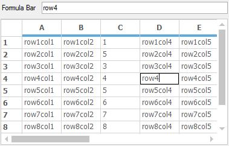
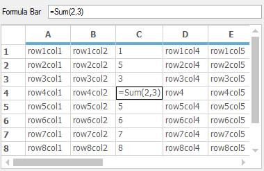
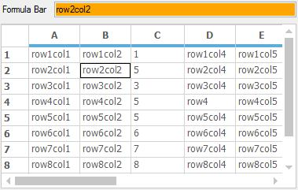

# Formula Bar in Windows Forms Grid Control

The formula bar is derived from the [TextBox](https://docs.microsoft.com/en-us/dotnet/api/system.windows.forms.textbox?view=net-5.0) control which is used to bind to the [CurrentCell](https://help.syncfusion.com/cr/windowsforms/Syncfusion.Windows.Forms.Grid.Grouping.GridNestedTableControl.html#Syncfusion_Windows_Forms_Grid_Grouping_GridNestedTableControl_CurrentCell) of GridControl. This is similar to the formula bar in Excel. It will allow to view and edit the formula and values of the current cell.  

To have the formula bar in the form, open the designer and drag and drop the [GridAwareTextBox](http://help.syncfusion.com/cr/windowsforms/Syncfusion.Windows.Forms.Grid.GridAwareTextBox.html#) from the toolbox along with the GridControl.

The `GridAwareTextBox` can be synchronized with GridControl using [WireGrid](https://help.syncfusion.com/cr/windowsforms/Syncfusion.Windows.Forms.Grid.GridAwareTextBox.html#Syncfusion_Windows_Forms_Grid_GridAwareTextBox_WireGrid_Syncfusion_Windows_Forms_Grid_GridControlBase_) method. 



//Synchronize GridAwareTextBox with the Grid
this.gridAwareTextBox1.WireGrid(this.gridControl1);



'Synchronize GridAwareTextBox with the Grid
Me.gridAwareTextBox1.WireGrid(Me.gridControl1)



Note: If the cell has formula, `GridAwareTextBox` will display the formula instead of calculated value.

## Applying Back color 

`GridAwareTextBox` background color can be customized based on the editable state of the current cell. [EnabledBackColor](https://help.syncfusion.com/cr/windowsforms/Syncfusion.Windows.Forms.Grid.GridAwareTextBox.html#Syncfusion_Windows_Forms_Grid_GridAwareTextBox_EnabledBackColor) property is used to set background color when current cell is editable and [DisabledBackColor](https://help.syncfusion.com/cr/windowsforms/Syncfusion.Windows.Forms.Grid.GridAwareTextBox.html#Syncfusion_Windows_Forms_Grid_GridAwareTextBox_DisabledBackColor) property is used to set background color when current cell is disabled for editing. 




// To set the back color for the GridAwareTextBox while editing 
this.gridAwareTextBox1.EnabledBackColor = Color.Yellow;

// To set the back color for the formula bar when editing is disabled in the current cell
this.gridAwareTextBox1.DisabledBackColor = Color.Orange;



' To set the back color for the GridAwareTextBox while editing 
Me.gridAwareTextBox1.EnabledBackColor = Color.Yellow

' To set the back color for the GridAwareTextBox when editing is disabled in the current cell
Me.gridAwareTextBox1.DisabledBackColor = Color.Orange



## Auto Suggestion

To enable the auto suggestion of formulas while editing the cell, set the [AutoSuggestFormula](https://help.syncfusion.com/cr/windowsforms/Syncfusion.Windows.Forms.Grid.GridAwareTextBox.html#Syncfusion_Windows_Forms_Grid_GridAwareTextBox_AutoSuggestFormula) property to `true` before wiring the formula bar with the grid. 



//Enable Auto Suggest
this.gridAwareTextBox1.AutoSuggestFormula = true;



'Enable Auto Suggest
Me.gridAwareTextBox1.AutoSuggestFormula = True



The custom collections can also use for the auto suggestion in the formula bar. To add the custom suggestion list to the `GridAwareTextBox`, set the [AutoCompleteSource](https://docs.microsoft.com/en-us/dotnet/api/system.windows.forms.textbox.autocompletesource?view=net-5.0) value as `AutoCompleteSource.CustomSource` and then add the custom collection to [AutoSuggestCustomSource](https://docs.microsoft.com/en-us/dotnet/api/system.windows.forms.textbox.autocompletecustomsource?view=net-5.0) collection.



//Set Auto Complete Mode to append the suggestion while typing the text
this.gridAwareTextBox1.AutoCompleteMode = AutoCompleteMode.SuggestAppend;

// Set custom collection to be displayed while typing on the GridAwareTextBox
this.gridAwareTextBox1.AutoCompleteSource = AutoCompleteSource.CustomSource;

string[] items = new string[] { "Boolean", "Base", "Bold", "Bind", "Integer" };

//Add the items to the Auto Complete Custom Source
this.gridAwareTextBox1.AutoCompleteCustomSource.AddRange(items);



'Set Auto Complete Mode to append the suggestion while typing the text
Me.gridAwareTextBox1.AutoCompleteMode = AutoCompleteMode.SuggestAppend

' Set custom collection to be displayed while typing on the GridAwareTextBox
Me.gridAwareTextBox1.AutoCompleteSource = AutoCompleteSource.CustomSource

Dim items() As String = { "Boolean", "Base", "Bold", "Bind", "Integer" }

'Add the items to the Auto Complete Custom Source
Me.gridAwareTextBox1.AutoCompleteCustomSource.AddRange(items)



## Multi-line Support

Formula Bar can be used like multi-line textbox. While typing the text in the current cell the content will be automatically wrapped into the next row while reaching the width of the `GridAwareTextBox`. 



// Enable Multi-Line GridAwareTextBox
this.gridAwareTextBox1.Multiline = true;



' Enable Multi-Line GridAwareTextBox
Me.gridAwareTextBox1.Multiline = True



N> Formula bar supports all the events and methods which are provided by the `TextBox` control.

## Unwire Formula Bar

The formula bar can be unwired from the grid by using the [UnwireGrid](https://help.syncfusion.com/cr/windowsforms/Syncfusion.Windows.Forms.Grid.GridAwareTextBox.html#Syncfusion_Windows_Forms_Grid_GridAwareTextBox_UnwireGrid_Syncfusion_Windows_Forms_Grid_GridControlBase_) method. It will break the connection between the grid and the formula bar.



//Unwire the Grid from the GridAwareTextBox
this.gridAwareTextBox1.UnwireGrid(this.gridControl1);



'Unwire the Grid from the GridAwareTextBox
Me.gridAwareTextBox1.UnwireGrid(Me.gridControl1)



