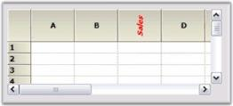

# How to Style a Header Cell in Windows Forms GridControl

To make changes to individual cells (header cells or otherwise), use an indexer on GridControl. In a GridControl with default headers, column headers are row zero and row headers are column zero. Given below is the code that will change a column header.




//Changes the font properties of the header cell.
gridControl1[0, 3].Font.Italic = true; 
gridControl1[0, 3].Font.Bold = true; 
gridControl1[0, 3].Font.Orientation = 270;

//Changes the Text Color and Text of the header cell. 
gridControl1[0, 3].TextColor = Color.Red; 
gridControl1[0, 3].Text = "Sales";





'Changes the font properties of the header cell.
GridControl1(0, 3).Font.Italic = True
GridControl1(0, 3).Font.Bold = True
GridControl1(0, 3).Font.Orientation = 270

'Changes the Text Color and Text of the header cell.
GridControl1(0, 3).TextColor = Color.Red
GridControl1(0, 3).Text = "Sales"




