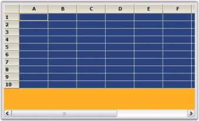

# How to set the Background color for a Grid

To set the BackColor for the area of the grid populated by cells, you must set the grid.BackColor property to the color. The grid display may also have regions where there are no cells. These regions will be the grid's client area where there are no cells or scrollbars. 




//Blue.
grid.BackColor = Color.Blue;

//Orange.
grid.Properties.BackgroundColor = Color.Orange;





'Blue.
grid.BackColor = Color.Blue

'Orange.
grid.Properties.BackgroundColor = Color.Orange




