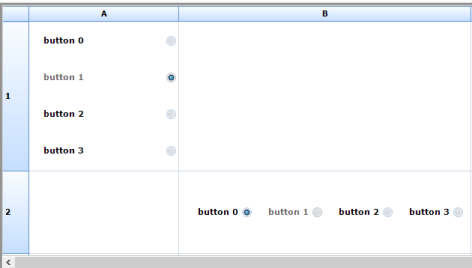

# How to Align Radio Buttons in Windows Forms Grid Control

The Windows Forms Grid control includes support for displaying radio button of the RadioButton cell type in both vertical and horizontal order. By default, RadioButton cell aligns the buttons in horizontal order. The display order can be changed using RadioButtonAlignment property.




this.gridControl1[1, 2].RadioButtonAlignment = ButtonAlignment.Vertical;
this.gridControl1[2, 2].RadioButtonAlignment = ButtonAlignment.Horizontal;





Me.gridControl1[1, 2].RadioButtonAlignment = ButtonAlignment.Vertical
Me.gridControl1[2, 2].RadioButtonAlignment = ButtonAlignment.Horizontal




