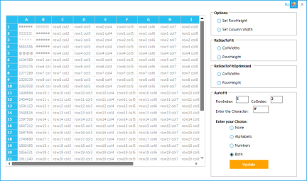

# How to Display Placeholder Characters when Cell Content Exceeds Cell Width

If the content of a grid cell exceeds the cell width, then characters can be displayed to act as placeholders instead of actual letters or numbers, indicating that the cell contains more content than can be shown within the cell. By default, the number sign (#) is used as the placeholder character, but you can specify custom characters.You can enable the following types of cell content to be converted to placeholder characters when content exceeds cell size:

* Alphabetic
* Numeric
* Both alphabetic and numeric
* None
N> When set to None, the original content will be displayed.

### Converting Alphabetic Content

Use the following code to specify that only alphabetic content will be converted to placeholder characters when content exceeds a cell.




this.gridcontrol1[1,1].AutoFit=AutoFitOptions.Alphabet;





Me.gridcontrol1(1,1).AutoFit=AutoFitOptions.Alphabet




### Converting Numeric Content

Use the following code to specify that only numeric content will be converted to placeholder characters when content exceeds a cell.



this.gridcontrol1[1,1].AutoFit=AutoFitOptions.Numeric



Me.gridcontrol1(1,1).AutoFit=AutoFitOptions.Numeric



### Converting Alphabetic and Numeric Content

The following code specifies that both alphabetic and numeric content will be converted to placeholder characters. To do so, set AutoFitOptions to Both.




 this.gridcontrol1[1,1].AutoFit=AutoFitOptions.Both





 Me.gridcontrol1(1,1).AutoFit=AutoFitOptions.Both




### Not Converting Content

Use the following code to display original cell content without converting anything to placeholder characters. This is performed by setting AutoFitOptions to None.




 this.gridcontrol1[1,1].AutoFit=AutoFitOptions.None





 Me.gridcontrol1(1,1).AutoFit=AutoFitOptions.None




N> By default, AutoFitOptions is set to None.

### Setting Custom Characters

Characters other than the number sign (#), the default, can be used to replace alphanumeric content that exceeds the size of a cell.To do so, set AutoFitChar to the desired character. For example, in the code samples below, the placeholder character has been changed to the _at_ (@) character.




 this.gridcontrol1[1,1]. AutoFitChar=’@’





 Me.gridcontrol1[1,1]. AutoFitChar=’@’




#### Sample Link

The following sample demonstrates how to use placeholder characters for content exceeding a cell’s dimensions.

_&lt;Installed location of Essential Studio&gt;\&lt;Essential Studio Version Number&gt;\Windows\Grid.Windows\Samples\2.0\Grid Layout\Resize To Fit Demo_

