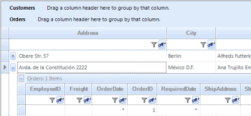

# How to Enable ColorStyle Settings in Windows Forms GridControl

This feature enables you to apply enhanced visual styles to the following Windows Forms Grid controls: Grid, GridGrouping, GridDataBoundGrid, and GridList. 

You can apply one of the following styles: 

* Office2007Blue
* Office2007Black
* Office2007Silver
* Office2010Blue
* Office2010Black
* Office2010Silver
* Metro

<table>
<tr>
<th>
PROPERTY</th><th>
DESCRIPTION</th><th>
TYPE</th><th>
DATA TYPE</th></tr>
<tr>
<td>
EnableLegacyStyle</td><td>
Get or set the value.</td><td>
</td><td>
Boolean </td></tr>
</table>

## Sample Link

_{Installed Path}\Syncfusion\EssentialStudio\{Version}\Windows\Grid.Grouping.Windows\Samples\2.0\ Styling and Formatting\Skin Customization Demo\_

To enable this feature, use the following code:




this.gridGroupingControl1.TableModel.EnableLegacyStyle  = false;





Me.gridGroupingControl1.TableModel.EnableLegacyStyle  = False



