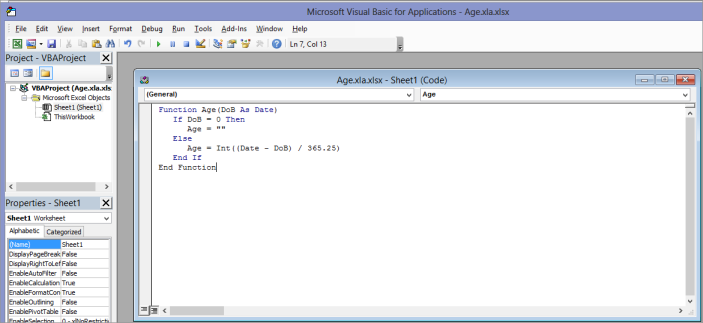

# How to export user-defined function from Grid to Excel workbook

To export user-defined formula library function from Grid to Excel:

1. Create an Excel Add-In file (*.xla) including the user-defined function as illustrated in the following link: [https://docs.microsoft.com/en-us/previous-versions/office/developer/office-xp/aa140990(v=office.10)](https://docs.microsoft.com/en-us/previous-versions/office/developer/office-xp/aa140990(v=office.10)).
2. Now, bind add-in file path and custom method name with GridExcelConverterControl through AddCustomFunction method.

### Creating the XLA File

To create an XLA file in Excel:

1. Create a new empty workbook and click Save As from the File menu.
2. In the Save As dialog box, select the location to save the workbook. Enter the file name for the Add-In workbook, and then select the type as Excel Add-In (*.xla).
3. Click Save, and then press ALT+ F11 to open the VBA Editor. Now, you can create the custom function through the VBA Editor.

The XLA file will not be visible in Excel because Add-Ins are never visible. All changes must be done to the VBA Editor only.




//Exports the user-defined function.
string xla = @"..\..\AddIns\Add.xla";
Syncfusion.GridExcelConverter.GridExcelConverterControl excelConverter = new Syncfusion.GridExcelConverter.GridExcelConverterControl();
excelConverter.AddCustomFunction(xla, "add", saveFileDialog1.FileName);
excelConverter.GridToExcel(this.gridControl1.Model, saveFileDialog1.FileName);



