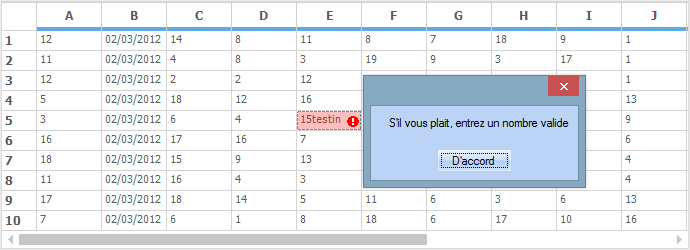
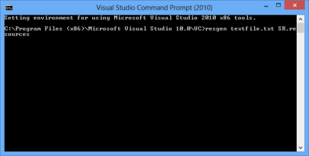
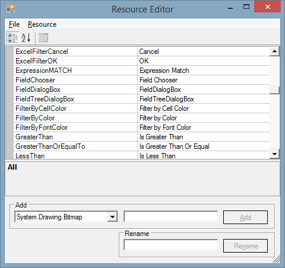

# Localization in Windows Forms Grid Control

Localization support allows to set the content according to the language or culture of a specific country or region. 

## ILocalization Interface

To localize the content, create a class file and inherit [ILocalizationProvider](http://help.syncfusion.com/cr/windowsforms/Syncfusion.Windows.Forms.ILocalizationProvider.html) interface to the class. This interface consists of a method [GetLocalizedString](https://help.syncfusion.com/cr/windowsforms/Syncfusion.Windows.Forms.ILocalizationProvider.html#Syncfusion_Windows_Forms_ILocalizationProvider_GetLocalizedString_System_Globalization_CultureInfo_System_String_System_Object_) which gets the string and localize it. The enum property [GridResourceIdentifiers](http://help.syncfusion.com/cr/windowsforms/Syncfusion.Windows.Forms.Grid.GridResourceIdentifiers.html) and [ResourceIdentifiers](http://help.syncfusion.com/cr/windowsforms/Syncfusion.Windows.Forms.ResourceIdentifiers.html) contains the resource identifiers specific to the GridControl.
The following code will explain how to localize the **Alert Error MessageBox** which will be displayed at the time of cell content validation,



class Localizer : ILocalizationProvider
{
    public string GetLocalizedString(System.Globalization.CultureInfo culture, string name, object obj)
    {
        switch (name)
        {
            // Returns the localized value for the word "OK"
            case ResourceIdentifiers.OK:
            return "D'accord";

            // Returns the localized value for the word "Cancel"
            case ResourceIdentifiers.Cancel:
            return "annuler";
            
            default:
            return string.Empty;
        }
    }
}



Friend Class Localizer
Implements ILocalizationProvider
Public Function GetLocalizedString(ByVal culture As System.Globalization.CultureInfo, ByVal name As String, ByVal obj As Object) As String
Select Case name

' Returns the localized value for the word "OK"
Case ResourceIdentifiers.OK
Return "D'accord"

' Returns the localized value for the word "Cancel"
Case ResourceIdentifiers.Cancel
Return "annuler"
Case Else
Return String.Empty
End Select
End Function
End Class



This custom localizer class has to be assigned to the static property [Provider](https://help.syncfusion.com/cr/windowsforms/Syncfusion.Windows.Forms.LocalizationProvider.html#Syncfusion_Windows_Forms_LocalizationProvider_Provider).



LocalizationProvider.Provider = new Localizer();



LocalizationProvider.Provider = New Localizer()



Only strings that are been used in GridControl can be localized; other text which are assigned by user (by other methods) needs to be set manually. So, to assign the custom error text for the current cell, make use of the [SetError](https://help.syncfusion.com/cr/windowsforms/Syncfusion.Windows.Forms.Grid.GridCurrentCell.html#Syncfusion_Windows_Forms_Grid_GridCurrentCell_SetError_System_String_) method in the [CurrentCellValidating](https://help.syncfusion.com/cr/windowsforms/Syncfusion.Windows.Forms.Grid.GridControlBase.html) event.



this._grid.CurrentCellValidating += new CancelEventHandler(_grid_CurrentCellValidating);
void _grid_CurrentCellValidating(object sender, CancelEventArgs e)
{
    this._grid.CurrentCell.SetError("S'il vous plait, entrez un nombre valide");
}



AddHandler gridControl1.CurrentCellValidating, AddressOf gridControl1_CurrentCellValidating
Private Sub _grid_CurrentCellValidating(ByVal sender As Object, ByVal e As CancelEventArgs)
Me._grid.CurrentCell.SetError("S'il vous plait, entrez un nombre valide")
End Sub



## Satellite Assemblies 

A satellite assembly is a compiled library that contains resources which can be localized. Make use of the satellite assemblies to create a multilingual application. 
Rather than using hard coding strings in main application, it is easier to design and deploy solutions to multiple cultures by using satellite assemblies. These assemblies are auto generated, and do not contain any code. Hence, they cannot be executed as the main assembly. Localization processes can be performed by using satellite assemblies without recompiling the main assembly.

### Requirements

A resource file is needed to create a satellite assembly. It can be created by using a tool provided by Microsoft Visual Studio.NET namely [Resource Editor](https://docs.microsoft.com/en-us/cpp/windows/resource-editors?view=msvc-160) (ResEditor) that can be used to localize the string resources.
A resource file can also be created by using the `Text` file. The resource file has the `.Resources` extension.

### Creating a Satellite Assembly

The following steps illustrate on creating a Satellite Assembly:

1.Enter the following command in the Visual Studio Command Prompt for creating resource file from the text file:


Resgen Text_file.txt Resource_File.resources


2.By using the [Resource Editor](https://docs.microsoft.com/en-us/cpp/windows/resource-editors?view=msvc-160), open the resource file that is been created. It provides a graphic interface that allows to construct resource files containing bitmaps, icons, and strings. 

3.After opening the resource file in the Resource Editor, start entering the equivalent strings for the required culture.

4.In ResEditor, Click File > Save As and save the file. The file is saved as **Syncfusion.Grid.Windows.Localization.SR.de-DE**.

5.Now, in the Visual Studio.NET Command Prompt, enter the following command and press Enter. Make sure to keep the sf.publicsnk file from the localization folder.


al /t:lib /culture:de-DE /out:Syncfusion.Grid.Windows.resources.dll /v:1.1.0.0 /delay+ /keyf:sf.publicsnk /embed:Syncfusion.Grid.Windows.Localization.SR.de-DE.resources


6.The version specified for these assemblies in the `al` command should be based on the `SatelliteContractVersionAttribute` setting in the product AssemblyInfo. This also means that when a new version of the product is released (with a newer assembly version), then it is necessary to recreate (adding new resources, when available or necessary), and recompile the resource assemblies with a new version (in case the SatelliteContractVersionAttribute has changed).

7.On successful execution, an assembly file named Syncfusion.Grid.Windows.resources.dll is created.

8.Finally, mark this satellite assembly for verification skipping (since it is not signed with the same strong-name as the product assembly). To do this, enter the following code in the Visual Studio command prompt


sn –Vr Syncfusion.Grid.Windows.resources.dll.


9.Drop this assembly into an appropriate sub-directory under the required .EXE’s directory (bin\Debug), based on the naming conventions enforced in .NET. It has to be replaced in the de-DE sub-directory in case this assembly contains resources from the German (Germany) culture.

10.Finally, make sure the application fetches the German resources during run time. To change the UI culture of the current thread, add this code in the Forms constructor before the InitializeComponent().



Thread.CurrentThread.CurrentUICulture = new System.Globalization.CultureInfo("de-DE");



Thread.CurrentThread.CurrentUICulture = New System.Globalization.CultureInfo("de-DE")



N> The name of the subfolder in Debug folder differs based on the culture of the application. For example, `fr-FR` is used for the French Culture, and so on.

N> For more details on the Localization using satellite assembly make use of the following dashboard sample 
&lt;Installed Location&gt;\Syncfusion\EssentialStudio\&lt;Installed Version&gt;\Windows\PivotAnalysis.Windows\Samples\Localization\Localization using Satellite Assemblies\
