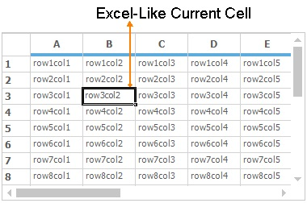
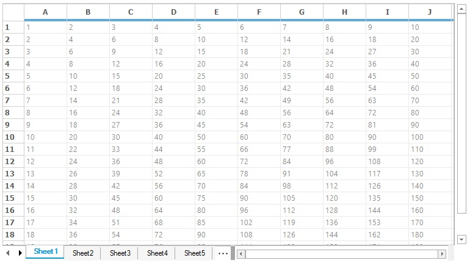
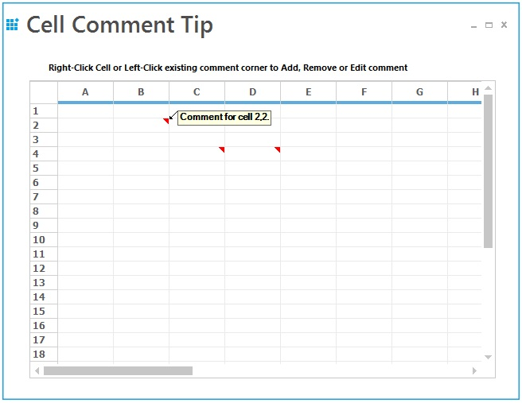
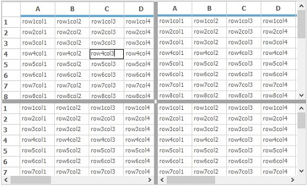
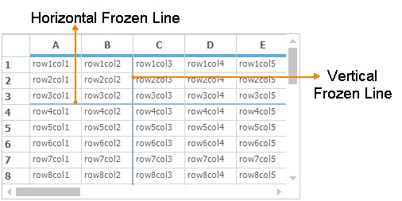
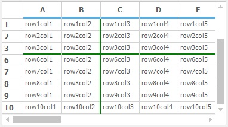
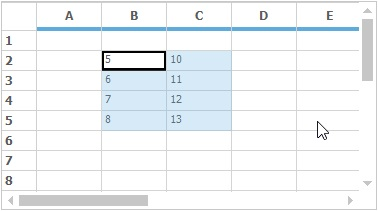
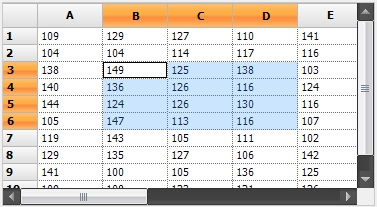
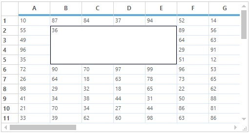
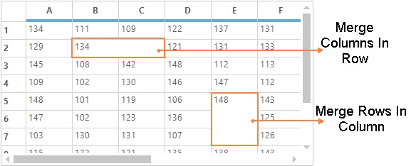

# Microsoft Excel Like Features in Windows Forms Grid Control
The [Windows Forms Grid](https://www.syncfusion.com/winforms-ui-controls/grid-control) Control provides some of the functionalities of Microsoft Excel as the features. This section will walk through the implementation of these features. 

## Excel Like Selection Frame
To enable excel like selection frame in the grid, the [ExcelLikeSelectionFrame](https://help.syncfusion.com/cr/windowsforms/Syncfusion.Windows.Forms.Grid.GridDataBoundGrid.html#Syncfusion_Windows_Forms_Grid_GridDataBoundGrid_ExcelLikeSelectionFrame) property can be used. This enables the selected cells in a frame to be highlighted. 



//Enable the Excel like selection frame to the GridControl
this.gridControl1.ExcelLikeSelectionFrame = true;


'Enable the Excel like selection frame to the GridControl
Me.gridControl1.ExcelLikeSelectionFrame = True



## 2016 Excel like Selection Frame 
2016 Excel like selection frame can be enabled by setting the [ExcelLikeSelectionFrame](https://help.syncfusion.com/cr/windowsforms/Syncfusion.Windows.Forms.Grid.GridControl.html#Syncfusion_Windows_Forms_Grid_GridControl_ExcelLikeSelectionFrame) and [ExcelLikeCurrentCell](https://help.syncfusion.com/cr/windowsforms/Syncfusion.Windows.Forms.Grid.GridControl.html#Syncfusion_Windows_Forms_Grid_GridControl_ExcelLikeCurrentCell) properties to `true`. The [SelectionFrameOption](https://help.syncfusion.com/cr/windowsforms/Syncfusion.Windows.Forms.Grid.GridModelOptions.html#Syncfusion_Windows_Forms_Grid_GridModelOptions_SelectionFrameOption) property can be used to enable the 2016 Excel like selection frame or 2003 Excel like selection fame by using [SelectionFrameOption](https://help.syncfusion.com/cr/windowsforms/Syncfusion.Windows.Forms.Grid.SelectionFrameOption.html# ) enumeration. The default value of the `SelectionFrameOption` property is `SelectionFrameOption.Excel2016`.

The `SelectionFrameOption` enumeration has the following types of selection frame options,  
   
 [SelectionFrameOption.Excel2003](https://help.syncfusion.com/cr/windowsforms/Syncfusion.Windows.Forms.Grid.SelectionFrameOption.html#) - It is used the enable the 2003 Excel like selection frame for the grid. 
 [SelectionFrameOption.Excel2016](https://help.syncfusion.com/cr/windowsforms/Syncfusion.Windows.Forms.Grid.SelectionFrameOption.html#) - It is used the enable the 2016 Excel like selection frame for the grid.


//Enable the Excel like selection frame to grid
this.gridControl1.ExcelLikeSelectionFrame = true;

//Enable Excel like current cell to grid
this.gridControl1.ExcelLikeCurrentCell = true;


'Enable the Excel like selection frame to grid
Me.gridControl1.ExcelLikeSelectionFrame = True

'Enable Excel like current cell to grid
Me.gridControl1.ExcelLikeCurrentCell = True



### Changing the Selection Border Brush 
The selection border brush for 2016 Excel like selection frame can be changed by using the [SelectionBorderBrush](https://help.syncfusion.com/cr/windowsforms/Syncfusion.Windows.Forms.Grid.GridModelOptions.html#Syncfusion_Windows_Forms_Grid_GridModelOptions_SelectionBorderBrush) property.


//Sets the selection border brush for 2016 Excel-like selection frame.
this.gridControl1.Model.Options.SelectionBorderBrush = new SolidBrush(Color.DarkGreen);


'Sets the selection border brush for 2016 Excel-like selection frame.
Me.gridControl1.Model.Options.SelectionBorderBrush = New SolidBrush(Color.DarkGreen)



### Changing the Selection Border Thickness 
The selection border thickness for 2016 Excel like selection frame can be changed by using the [SelectionBorderThickness](https://help.syncfusion.com/cr/windowsforms/Syncfusion.Windows.Forms.Grid.GridModelOptions.html#Syncfusion_Windows_Forms_Grid_GridModelOptions_SelectionBorderThickness) property.


//Set the selection border thickness for 2016 Excel-like selection frame.
this.gridControl1.Model.Options.SelectionBorderThickness = 4;


'Set the selection border thickness for 2016 Excel-like selection frame.
Me.gridControl1.Model.Options.SelectionBorderThickness = 4



### Setting the 2003 Excel like Selection Frame 
2003 Excel like selection frame can be enabled by setting the `SelectionFrameOption` property to `SelectionFrameOption.Excel2003`.


//Enable the 2003 Excel like selection frame.
this.gridControl1.Model.Options.SelectionFrameOption = SelectionFrameOption.Excel2003;


'Enable the 2003 Excel like selection frame.
Me.gridControl1.Model.Options.SelectionFrameOption = SelectionFrameOption.Excel2003



## Excel-like Current Cell
To have the Excel-Like current cell in the Windows Forms GridControl, set the [ExcelLikeCurrentCell](https://help.syncfusion.com/cr/windowsforms/Syncfusion.Windows.Forms.Grid.GridControl.html#Syncfusion_Windows_Forms_Grid_GridControl_ExcelLikeCurrentCell) property to `true`. When the current cell moves out of a selected range, then the range will be cleared. Whereas the current cell can be moved inside a selected range, the range will be stayed.



//Enable Excel like current cell in Grid 
this.gridControl1.ExcelLikeCurrentCell = true;



'Enable Excel like current cell in Grid 
Me.gridControl1.ExcelLikeCurrentCell = True



## Excel-like Alignments
In Excel, by default the strings are aligned to left and the integer, double or decimal values are aligned to the right side of the cell. The text alignments in grid cells can be similar to text alignment in Excel cells by setting the [ExcelLikeAlignment](https://help.syncfusion.com/cr/windowsforms/Syncfusion.Windows.Forms.Grid.GridControlBase.html#Syncfusion_Windows_Forms_Grid_GridControlBase_ExcelLikeAlignment) property to `true`. 



//Enable Excel-Like Alignment to the Grid control
this.gridControl1.ExcelLikeAlignment = true;


'Enable Excel-Like Alignment to the Grid control
Me.gridControl1.ExcelLikeAlignment = True



## Work Book
The Windows Forms GridControl can be used like workbook in Excel. This can be achieved by adding the [TabBarSplitterControl](http://help.syncfusion.com/cr/windowsforms/Syncfusion.Windows.Forms.TabBarSplitterControl.html) to the form. In this control, add the number of [TabBarPage](http://help.syncfusion.com/cr/windowsforms/Syncfusion.Windows.Forms.TabBarPage.html) (work sheets) to be shown in the workbook. Fill each page with the GridControl to look like the work sheets in excel. The following code snippet will perform the above process,



//Creating Tab pages

//TabBarPage tabBarPage = new Syncfusion.Windows.Forms.TabBarPage();

//Add TabBarPage to the TabBarSplitterControl
this.tabBarSplitterControl1.Controls.Add(this.tabBarPage1);
this.tabBarSplitterControl1.Controls.Add(this.tabBarPage2);
this.tabBarSplitterControl1.Controls.Add(this.tabBarPage3);

//Adding Grid control to the Tab bar pages
this.tabBarPage1.Controls.Add(gridcontrol1);
this.tabBarPage2.Controls.Add(gridControl2);
this.tabBarPage3.Controls.Add(gridControl3);


'Creating Tab pages

'Dim tabBarPage As TabBarPage = New Syncfusion.Windows.Forms.TabBarPage()

'Add TabBarPage to the TabBarSplitterControl
Me.tabBarSplitterControl1.Controls.Add(Me.tabBarPage1)
Me.tabBarSplitterControl1.Controls.Add(Me.tabBarPage2)
Me.tabBarSplitterControl1.Controls.Add(Me.tabBarPage3)

'Adding Grid control to the Tab bar pages
Me.tabBarPage1.Controls.Add(gridcontrol1)
Me.tabBarPage2.Controls.Add(gridControl2)
Me.tabBarPage3.Controls.Add(gridControl3)



## Excel-like Comment Tip
Excel-like cell comment tips can be included in the GridControl by implementing the[IMouseController](http://help.syncfusion.com/cr/windowsforms/Syncfusion.Windows.Forms.IMouseController.html) interface. The `GridExcelTipStyleProperties` class is used to define the `Excel-Like comment tip` for the cell. To add, delete or modify the comment, right-click on the cell or left-click the red corner.



//Code for add Comment tip
private ExcelTip.CommentMouseController commentMouseController1;

//Create the Comment mouse controller.
this.commentMouseController1 = new ExcelTip.CommentMouseController(gridControl1);

//Allow context menu to edit/add comments
this.commentMouseController1.ContextMenuEnabled = true;

//Register the controller
gridControl1.MouseControllerDispatcher.Add(commentMouseController1);

//Set the comment using custom style property, ExcelTipText
ExcelTip.GridExcelTipStyleProperties style = new ExcelTip.GridExcelTipStyleProperties(gridControl1[2, 2]);
style.ExcelTipText = "Comment for cell 2,2.";


'Code for add Comment tip
Private commentMouseController1 As ExcelTip.CommentMouseController

'Create the Comment mouse controller.
Me.commentMouseController1 = New ExcelTip.CommentMouseController(gridControl1)

'Allow context menu to edit/add comments
Me.commentMouseController1.ContextMenuEnabled = True

'Register the controller
gridControl1.MouseControllerDispatcher.Add(commentMouseController1)

'Set the comment using custom style property, ExcelTipText
Dim style As New ExcelTip.GridExcelTipStyleProperties(gridControl1(2, 2))
style.ExcelTipText = "Comment for cell 2,2."




For more details about the Excel-Like comment tip, refer the following dashboard sample, 
**&lt;Install Location&gt; \Syncfusion\EssentialStudio\[Version Number]\Windows\Grid.Windows\Samples\ToolTip\Cell Comment Tip Demo**

## Splitter
Splitter is used to display the multiple view of the grid. This Microsoft Excel-like feature enables the user to view more than one copy of a worksheet and scroll through each pane of worksheet independently. The panes are working simultaneously, i.e., the changes made in one pane are reflected in the other. 

The splitter can be scrolled by placing the mouse pointer over it, holding down the left mouse button and dragging it to the required position. It can be split horizontally and vertically.



//Adding GridControl to the SplitterControl
this.splitterControl1.Controls.Add(this.gridControl);

//Events triggered while creating and closing the splitter pane
this.splitterControl1.PaneCreated += splitterControl1_PaneCreated;
this.splitterControl1.PaneClosing += splitterControl1_PaneClosing;

void splitterControl1_PaneClosing(object sender, SplitterPaneEventArgs e)
{
    Console.WriteLine("Splitter pane is closing");
}

void splitterControl1_PaneCreated(object sender, SplitterPaneEventArgs e)
{
    Console.WriteLine("Splitter pane is created");
}



'Adding GridControl to the SplitterControl
Me.splitterControl1.Controls.Add(Me.gridControl)

'Events triggered while creating and closing the splitter pane
Me.splitterControl1.PaneCreated += splitterControl1_PaneCreated
Me.splitterControl1.PaneClosing += splitterControl1_PaneClosing

Private Sub splitterControl1_PaneClosing(ByVal sender As Object, ByVal e As SplitterPaneEventArgs)
    Console.WriteLine("Splitter pane is closing")
End Sub

Private Sub splitterControl1_PaneCreated(ByVal sender As Object, ByVal e As SplitterPaneEventArgs)
    Console.WriteLine("Splitter pane is created")
End Sub



## Freeze Pane
The Windows Forms GridControl supports Microsoft Excel-like Freeze Pane feature. In a large worksheet, it is often required that column or row labels remain in view. This feature enables to freeze either columns or rows in the grid, so that they may remain visible while scrolling. The number of rows to be frozen can be specified by using [Model.Rows.FrozenCount](https://help.syncfusion.com/cr/windowsforms/Syncfusion.Windows.Forms.Grid.GridModelRowColOperations.html#Syncfusion_Windows_Forms_Grid_GridModelRowColOperations_FrozenCount) property and the number of columns to be frozen can be specified by using [Model.Cols.FrozenCount](https://help.syncfusion.com/cr/windowsforms/Syncfusion.Windows.Forms.Grid.GridModelRowColOperations.html#Syncfusion_Windows_Forms_Grid_GridModelRowColOperations_FrozenCount) property.



//Frozen the Rows and columns in the Grid control
this.gridControl1.Rows.FrozenCount = 3;
this.gridControl1.Cols.FrozenCount = 2;

//Clear the Frozen range of Rows and Columns
this.gridControl1.Rows.RestoreFrozen();
this.gridControl1.Cols.RestoreFrozen();


'Frozen the Rows and columns in the Grid control
Me.gridControl1.Rows.FrozenCount = 3
Me.gridControl1.Cols.FrozenCount = 2

'Clear the Frozen range of Rows and Columns
Me.gridControl1.Rows.RestoreFrozen()
Me.gridControl1.Cols.RestoreFrozen()



The frozen lines of the GridControl can be hidden by setting the [HighlightFrozenLines](https://help.syncfusion.com/cr/windowsforms/Syncfusion.Windows.Forms.Grid.GridControl.html#Syncfusion_Windows_Forms_Grid_GridControl_HighlightFrozenLine) property to `false`. By default, it will be enabled to display the frozen lines.



// To hide the highlighting of Frozen lines 
this.gridControl1.HighlightFrozenLine = false;


' To hide the highlighting of Frozen lines 
Me.gridControl1.HighlightFrozenLine = False



The frozen line color can be changed by using [FixedLinesColor](https://help.syncfusion.com/cr/windowsforms/Syncfusion.Windows.Forms.Grid.GridProperties.html#Syncfusion_Windows_Forms_Grid_GridProperties_FixedLinesColor) property. This frozen line color will be changed only when the `HighlightFrozenLine` property is enabled.



//Set Frozen Line color
this.gridControl1.Model.Properties.FixedLinesColor = Color.Green;


'Set Frozen Line color 
Me.gridControl1.Model.Properties.FixedLinesColor = Color.Green



## Copy/Fill Series
The Windows Forms GridControl can have the copy/fill series like Excel. The copy series is used to copy the content of the current cell to the entire selection whereas the fill series is used to fill the selection with the increment of the current cell. 

An [ExcelSelectionMarkerMouseController](http://help.syncfusion.com/cr/windowsforms/Syncfusion.GridHelperClasses.ExcelSelectionMarkerMouseController.html) helper class that implements the behavior of `Copy/Fill` series in the GridControl. This class is available in the `Syncfusion.GridHelperClasses.Windows` assembly. 

N>  To enable this feature, the [ExcelLikeCurrentCell](https://help.syncfusion.com/cr/windowsforms/Syncfusion.Windows.Forms.Grid.GridControl.html#Syncfusion_Windows_Forms_Grid_GridControl_ExcelLikeCurrentCell) property has to be enabled for GridControl.



//Enable Excel like current cell in Grid 
this.gridControl1.ExcelLikeCurrentCell = true;

//Create Selection marker for Copy/Fill series
ExcelSelectionMarkerMouseController marker = new Syncfusion.GridHelperClasses.ExcelSelectionMarkerMouseController(this.gridControl1);

//Add the selection marker to the MouseControllerDispatcher
this.gridControl1.MouseControllerDispatcher.Add(marker);


'Enable Excel like current cell in Grid 
Me.gridControl1.ExcelLikeCurrentCell = True

'Create Selection marker for Copy/Fill series
Dim marker As ExcelSelectionMarkerMouseController = New Syncfusion.GridHelperClasses.ExcelSelectionMarkerMouseController(Me.gridControl1)

'Add the selection marker to the MouseControllerDispatcher
Me.gridControl1.MouseControllerDispatcher.Add(marker)



The following examples are showing the difference between the Copy and Fill series,

1. The following example shows the Fill series is selected,
   
   

2. The range of cells are filled with the series,
   
   

3. The following example shows the `Copy Series` is selected for January cell,
   
   

4. The range of cells are copied and filled with the January,
   
   

## Highlighting Row/Column Header
This feature is used to highlight the corresponding row and column headers of one or more selected cells. It can be enabled by setting the [MarkRowHeader](https://help.syncfusion.com/cr/windowsforms/Syncfusion.Windows.Forms.Grid.GridProperties.html#Syncfusion_Windows_Forms_Grid_GridProperties_MarkRowHeader) and [MarkColHeader](https://help.syncfusion.com/cr/windowsforms/Syncfusion.Windows.Forms.Grid.GridProperties.html#Syncfusion_Windows_Forms_Grid_GridProperties_MarkColHeader)  property value as `true`.



//Highlight Row/Column header while having the current cell
this.gridControl1.MarkRowHeader = true;
this.gridControl1.MarkColHeader = true;


'Highlight Row/Column header while having the current cell
Me.gridControl1.MarkRowHeader = True
Me.gridControl1.MarkColHeader = True



## Unhide Columns Using Double Click
The hidden columns can be shown by double clicking on the column headers as like Excel. This behavior can be determined by using the [UnHideColsOnDblClick](https://help.syncfusion.com/cr/windowsforms/Syncfusion.Windows.Forms.Grid.GridControlBase.html#Syncfusion_Windows_Forms_Grid_GridControlBase_UnHideColsOnDblClick) property. The default value of this property is `true`. So the unhide behavior can be disabled by setting this property as `false`.



//Disabling Un hide the columns on double click 
this.gridControl1.UnHideColsOnDblClick = false;  


' Disabling Un hide the columns on double click 
Me.gridControl1.UnHideColsOnDblClick = False



For more details about the hiding columns and rows, refer the link over [here](/windowsforms/grid/managing-the-rows-and-columns).

## FormatCell Dialog
The Format Cell Dialog is used to dynamically format the contents of the cell or range of cells in the GridControl. This can be enabled in the GridControl by using the [GridFormatCellsDialog](http://help.syncfusion.com/cr/windowsforms/Syncfusion.GridHelperClasses.GridFormatCellDialog.html) class.



// Add the format Cells dialog into the GridControl
GridFormatCellDialog formatCellDialog = new GridFormatCellDialog(this.gridControl1);
// To display the dialog 
formatCellDialog.ShowDialog();


' Add the format Cells dialog into the GridControl
Dim formatCellDialog As New GridFormatCellDialog(Me.gridControl1)
' To display the dialog 
formatCellDialog.ShowDialog()



N> You can refer the [FormatCellDialog](#formatcell-dialog) section for detailed information. 

## Covered Ranges
The range of cells can be covered like Excel merging functionality. In this technique, range of cells which has different data or same data can be covered. The range of cells can be covered by adding the [GridRangeInfo](http://help.syncfusion.com/cr/windowsforms/Syncfusion.Windows.Forms.Grid.GridRangeInfo.html) to the [CoveredRanges](https://help.syncfusion.com/cr/windowsforms/Syncfusion.Windows.Forms.Grid.GridControl.html#Syncfusion_Windows_Forms_Grid_GridControl_CoveredRanges) collection. The range can be cell, range of cells, table, row or column.

The CoveredRanges will be maintained in the [GridModelCoveredRanges](http://help.syncfusion.com/cr/windowsforms/Syncfusion.Windows.Forms.Grid.GridModelCoveredRanges.html) collection.



// Add covered range for the range of cells
this.gridControl1.Model.CoveredRanges.Add(GridRangeInfo.Cells(2, 2, 5, 5));


' Add covered range for the range of cells
Me.gridControl1.Model.CoveredRanges.Add(GridRangeInfo.Cells(2, 2, 5, 5))




N> For more information about `CoveredRanges`, see the link over [here](/windowsforms/grid/covered-ranges).

## Cell Merging
The cell merging also one of the technique to merge the range of cells in the GridControl. The range of cells will be merged based on the data. The cells which has same data will be merged in row wise in same column or column wise in same row. To enable the merging support in grid, the [MergeCell](https://help.syncfusion.com/cr/windowsforms/Syncfusion.Windows.Forms.Grid.GridStyleInfo.html#Syncfusion_Windows_Forms_Grid_GridStyleInfo_MergeCell), [MergeCellsMode](https://help.syncfusion.com/cr/windowsforms/Syncfusion.Windows.Forms.Grid.GridModelOptions.html#Syncfusion_Windows_Forms_Grid_GridModelOptions_MergeCellsMode) and [MergeCellsLayout](http://help.syncfusion.com/cr/windowsforms/Syncfusion.Windows.Forms.Grid.GridMergeCellsLayout.html) properties can be used.

The following code snippet is used to enable the merging in GridControl,



// Set MergeCells direction for the GridControl
this.gridControl1.TableStyle.MergeCell = GridMergeCellDirection.Both;

// Set merge cells behavior for the Grid
this.gridControl1.Model.Options.MergeCellsMode = GridMergeCellsMode.OnDemandCalculation
    | GridMergeCellsMode.MergeColumnsInRow | GridMergeCellsMode.MergeRowsInColumn;
this.gridControl1.Model.Options.MergeCellsLayout = GridMergeCellsLayout.Grid;


' Set MergeCells direction for the GridControl
Me.gridControl1.TableStyle.MergeCell = GridMergeCellDirection.Both

' Set merge cells behavior for the Grid
Me.gridControl1.Model.Options.MergeCellsMode = GridMergeCellsMode.OnDemandCalculation Or GridMergeCellsMode.MergeColumnsInRow Or GridMergeCellsMode.MergeRowsInColumn
Me.gridControl1.Model.Options.MergeCellsLayout = GridMergeCellsLayout.Grid



N> Any range of cells cannot be merged like the covered ranges because merging has different functionality than the covered ranges, which allows only to merge the adjacent cells with same data. 

For more details about the `Cell Merging`, refer the link over [here](/windowsforms/grid/cell-merging).

## Floating
Floating cells  are those cells whose content floats over empty, adjacent cells. The floating cells can be enabled by setting [GridControl.FloatCellsMode](https://help.syncfusion.com/cr/windowsforms/Syncfusion.Windows.Forms.Grid.GridControl.html#Syncfusion_Windows_Forms_Grid_GridControl_FloatCellsMode) property. Setting this property to[GridFloatCellsMode.BeforeDisplayCalculation](http://help.syncfusion.com/cr/windowsforms/Syncfusion.Windows.Forms.Grid.GridFloatCellsMode.html) will force the floating cells to always be calculated just prior to being displayed. Setting the property to [GridFloatCellsMode.OnDemandCalculation](http://help.syncfusion.com/cr/windowsforms/Syncfusion.Windows.Forms.Grid.GridFloatCellsMode.html) will calculate the floating cells only if the cell contents or size changes.

The preventing of a cell being flooded by using [FloodCell](https://help.syncfusion.com/cr/windowsforms/Syncfusion.Windows.Forms.Grid.GridStyleInfo.html#Syncfusion_Windows_Forms_Grid_GridStyleInfo_FloodCell) property.



// Enable Float Cells for GridControl
this.gridControl1.TableStyle.FloatCell = true;

// Set mode for calculating the float cells
this.gridControl1.FloatCellsMode = GridFloatCellsMode.OnDemandCalculation;


' Enable Float Cells for GridControl
Me.gridControl1.TableStyle.FloatCell = True

' Set mode for calculating the float cells
Me.gridControl1.FloatCellsMode = GridFloatCellsMode.OnDemandCalculation



For more information about this section, refer the link over [here](/windowsforms/grid/floating).

## Multilevel Undo Redo
GridControl lets you do the multilevel undo and redo operations which are used to revert the changes made in the grid. This can be enabled by setting [CommandStack.Enabled](https://help.syncfusion.com/cr/windowsforms/Syncfusion.Windows.Forms.Grid.GridModelCommandManager.html#Syncfusion_Windows_Forms_Grid_GridModelCommandManager_Enabled) property to true. Using the functions of [GridModelCommandManager](http://help.syncfusion.com/cr/windowsforms/Syncfusion.Windows.Forms.Grid.GridModelCommandManager.html) class, various tasks like undo and redo can be done. User can access this class from a grid using the[CommandStack](https://help.syncfusion.com/cr/windowsforms/Syncfusion.Windows.Forms.Grid.GridControl.html#Syncfusion_Windows_Forms_Grid_GridControl_CommandStack) property of a [GridModel](http://help.syncfusion.com/cr/windowsforms/Syncfusion.Windows.Forms.Grid.GridModel.html) instance.



//Enable Undo Redo
this.gridControl1.CommandStack.Enabled = true;

//Undo the last action performed in the grid
this.gridControl1.CommandStack.Undo();

//Redo the last action performed
this.gridControl1.CommandStack.Redo();


'Enable Undo Redo
Me.gridControl1.CommandStack.Enabled = True

'Undo the last action performed in the grid
Me.gridControl1.CommandStack.Undo()

'Redo the last action performed
Me.gridControl1.CommandStack.Redo()



For more information about the `Undo-Redo`, See [Undo - Redo](/windowsforms/grid/undo-redo)

## Find and Replace
The Windows Forms GridControl provides the support to search and replace the text and numbers like the Find and Replace feature of Excel. This feature can be added to the GridControl by including the `Syncfusion.GridHelperClasses.Windows.dll` to the assembly reference. The following classes are used to implement the `Find and Replace` technique in GridControl. 

* [GridFindReplaceDialogSink](http://help.syncfusion.com/cr/windowsforms/Syncfusion.Windows.Forms.Grid.GridFindReplaceDialogSink.html) 
* [GridFindReplaceDialog](http://help.syncfusion.com/cr/windowsforms/Syncfusion.Windows.Forms.Grid.GridFindReplaceDialog.html) 

The `GridFindReplaceDialogSink` class is used to perform the `Find and Replace` of text in GridControl. The `GridFindReplaceDialog` is the built-in dialog which shows the options for finding and replacing of the text. If this dialog is used for finding and replacing, there is no need to implement the methods for finding and replacing the text programmatically. 

The below example shows the `Find and Replace` dialog is shown in GridControl,



// Setting the Dialog sink
GridFindReplaceDialogSink findReplaceSink = new GridFindReplaceDialogSink(this.gridControl1);

// Setting the Dialog
GridFindReplaceDialog findReplaceDialog = GridFindReplaceDialog.Instance;

// Setting the sink to dialog
findReplaceDialog.ActiveSink = findReplaceSink;
findReplaceDialog.ShowDialog();


' Setting the Dialog sink
Dim findReplaceSink As New GridFindReplaceDialogSink(Me.gridControl1)

' Setting the Dialog
Dim findReplaceDialog As GridFindReplaceDialog = GridFindReplaceDialog.Instance

' Setting the sink to dialog
findReplaceDialog.ActiveSink = findReplaceSink
findReplaceDialog.ShowDialog()



N> This section has been explained briefly in [Find and Replace](/windowsforms/grid/find-and-replace) section.
