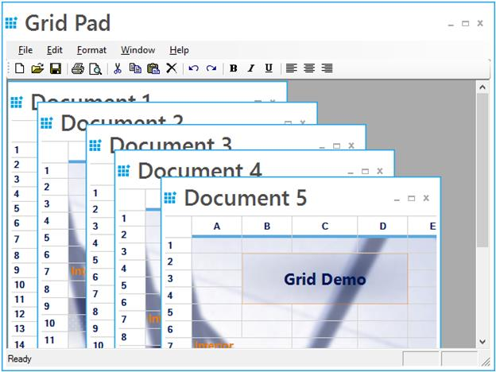

# Multiple Document Interface in Windows Forms Grid Control
GridControl supports Multiple Document Interface (MDI). This support is used to work with multiple GridControl’s simultaneously. Here, multiple windows reside under a single parent window.

A sample demonstrating this feature is available under the following [Sample Location](https://github.com/syncfusion/winforms-demos/tree/master/gridcontrol/Product%20Showcase/Grid%20Pad%20Demo)
