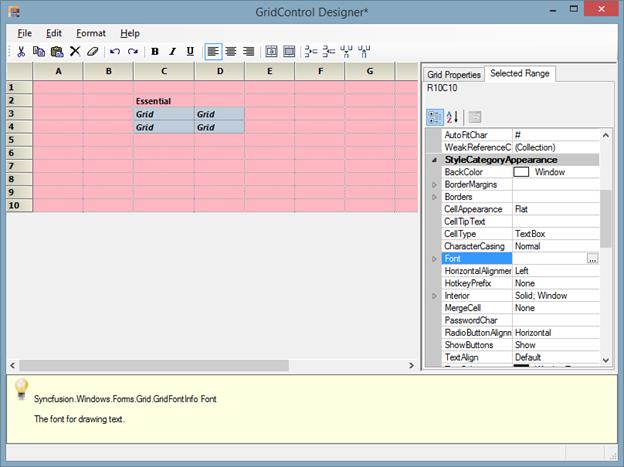
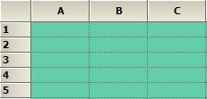
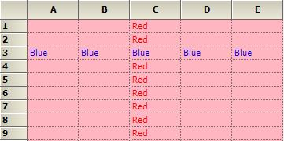

# Populating Data in Windows Forms Grid Control

There are two ways to populate data into a Grid Control. One way is to move the data directly into the GridControl and let the underlying grid manage the data. Another method is to use GridControl in a virtual mode whereby need to handle certain events to provide data to the grid whenever it is in demand.

The virtual method for providing data to a GridControl will be discussed in [Virtual Grid](https://help.syncfusion.com/windowsforms/grid-control/virtual-grid) section with more details. This section will walk through the different method used to store data directly into the GridControl’s internal storage. 

## Indexer Technique

To place the data into a grid using the indexer technique, it is necessary to loop through all the rows and column and set the [CellValue](https://help.syncfusion.com/cr/windowsforms/Syncfusion.Windows.Forms.Grid.GridStyleInfo.html#Syncfusion_Windows_Forms_Grid_GridStyleInfo_CellValue) property for each cell. This technique is mainly used for small grids.



//Specifying row and column count
gridControl1.RowCount = 15;

gridControl1.ColCount = 4;

//Looping through the cells and assigning the values based on row and column index
for (int row = 1; row <= gridControl1.RowCount; row++)
{
    for (int col = 1;col <= gridControl1.ColCount; col++)
    {
        gridControl1.Model[row, col].CellValue = string.Format("{0}/{1}", row, col);
    }
}



'Specifying row and column count
gridControl1.RowCount = 15
gridControl1.ColCount = 4

'Looping through the cells and assigning the values based on row and column index
For row As Integer = 1 To gridControl1.RowCount
For col As Integer = 1 To gridControl1.ColCount
gridControl1.Model(row, col).CellValue = String.Format("{0}/{1}", row, col)
Next col
Next row



N> The Undo/Redo support of the grid needs to be turned off so that initial population of the grid cannot be undone. 

## PopulateValues Method

GridControl has [PopulateValues](https://help.syncfusion.com/cr/windowsforms/Syncfusion.Windows.Forms.Grid.GridModel.html#Syncfusion_Windows_Forms_Grid_GridModel_PopulateValues_Syncfusion_Windows_Forms_Grid_GridRangeInfo_System_Object_) method to overcome the looping of data through cell by cell. This method is used to pass a range of cells of type [GridRangeInfo](https://help.syncfusion.com/cr/windowsforms/Syncfusion.Windows.Forms.Grid.GridRangeInfo.html) and data source of type `object`. 

On using the `PopulateValues` method, data values are just been copied from your data source and placed into the GridControl. Hence it is an entirely different concept of binding a grid to a data source which can be achieved only in [GridGroupingControl](https://help.syncfusion.com/windowsforms/gridgrouping/getting-started). 



//Specifying row and column count
gridControl1.RowCount = 15;

gridControl1.ColCount = 4;

//Populating values using PopulateValues method
string[,] table = new string[this.gridControl1.RowCount, this.gridControl1.ColCount];
for (int row = 1; row <= this.gridControl1.RowCount; ++row)
for (int col = 1; col <= this.gridControl1.ColCount; ++col)
table[row - 1, col - 1] = string.Format(“Row{0}:Col{0}”, row, col);

this.gridControl1.PopulateValues(
GridRangeInfo.Cells(1, 1, this.gridControl1.RowCount, this.gridControl1.ColCount),
table);


'Specifying row and column count
gridControl1.RowCount = 15

gridControl1.ColCount = 4

'Populating values using PopulateValues method
Dim table(Me.gridControl1.RowCount - 1, Me.gridControl1.ColCount - 1) As String
For row As Integer = 1 To Me.gridControl1.RowCount
For col As Integer = 1 To Me.gridControl1.ColCount
table(row - 1, col - 1) = String.Format(“Row{0}:=Col{0}”, row, col)
Next col
Next row

Me.gridControl1.PopulateValues(GridRangeInfo.Cells(1, 1, Me.gridControl1.RowCount, Me.gridControl1.ColCount), table)



## Using Cell Style

The appearance of a cell can be changed and displayed using the [GridStyleInfo](https://help.syncfusion.com/cr/windowsforms/Syncfusion.Windows.Forms.Grid.GridStyleInfo.html#) class. It contains all the style properties that are needed for a cell.

`GridRangeInfo` class specifies a range of cells in grid. This section will explain about how to create `GridStyleInfo` object and how to access its properties.

### Modifying Cell Styles through Designer

To edit the cell styles in designer mode, the grid has to be selected in the designer mode and `Edit` option has to be clicked. This will allow the grid to be edited in the designer surface. Style settings also can be changed by using the `PropertyGrid` which is visible in the right side of the designer window.

N> The values can be directly entered for the desired cells through the designer mode.

For changing the appearance of the cells, the property grid in the right side can be used. In property grid there are two tabs mainly.

* Grid Properties.
* Selected Range.

`Grid Properties` tab consists of all the properties related to the whole grid. The appearance and style related settings can be changed for the whole grid.

All the style related properties for the whole grid will be displayed in this tab. If back color of the whole grid needs to be changed, then the [BackColor](https://help.syncfusion.com/cr/windowsforms/Syncfusion.Windows.Forms.Grid.GridStyleInfo.html#Syncfusion_Windows_Forms_Grid_GridStyleInfo_BackColor) property listed below the heading `Appearance` can be used and required color can be chosen.

`Selected Range` tab consists of all the properties related to a particular cell or selected range of cells. The style and format related properties can be changed for the desired range of cells.

All the style related changes will be displayed under the `StyleCategoryAppearance`. If font style of a particular range needs to be changed, the [Font](https://help.syncfusion.com/cr/windowsforms/Syncfusion.Windows.Forms.Grid.GridStyleInfo.html#Syncfusion_Windows_Forms_Grid_GridStyleInfo_Font) property listed under the `StyleCategoryAppearance` can be used and required color can be chosen.

### Modifying Cell Styles through Code

Values can be entered through code by using the `GridRangeInfo` class and properties of `GridStyleInfo` class. The appearance of the cell can be customized by using the properties of `GridStyleInfo` class and the range of cells to be modified will be specified through `GridRangeInfo`. The [ChangeCells](https://help.syncfusion.com/cr/windowsforms/Syncfusion.Windows.Forms.Grid.GridControl.html#Syncfusion_Windows_Forms_Grid_GridControl_ChangeCells_Syncfusion_Windows_Forms_Grid_GridRangeInfo_Syncfusion_Windows_Forms_Grid_GridStyleInfo_) method is used to assign the customized styles to the mentioned range of cells.



// Add cell value to a particular cell
this.gridControl1[2, 2].CellValue = "Essential";

this.gridControl1[2, 2].Font.Bold = true;

//Creates a GridStyleInfo object
GridStyleInfo style = new GridStyleInfo();

// Set values and properties
style.BackColor = Color.LightPink;
style.CellValue = "Grid";
style.Font.Facename = "Verdana";
style.Font.Size = 8.2f;
style.Font.Bold = true;
style.Font.Italic = true;

// Applies the styles to a range of cells
this.gridControl1.ChangeCells(GridRangeInfo.Cells(3, 2, 4, 3), style);



'Add cell value to a particular cell
Me.gridControl1(2, 2).CellValue = "Essential"

Me.gridControl1(2, 2).Font.Bold = True

'Creates a GridStyleInfo object
Dim style As New GridStyleInfo()

'Set values and properties
style.BackColor = Color.LightPink
style.CellValue = "Grid"
style.Font.Facename = "Verdana"
style.Font.Size = 8.2f
style.Font.Bold = True
style.Font.Italic = True

'Applies the styles to a range of cells
Me.gridControl1.ChangeCells(GridRangeInfo.Cells(3, 2, 4, 3), style)



The styles of the whole grid, for a particular column and for a particular row can be changed by using the [TableStyle](https://help.syncfusion.com/cr/windowsforms/Syncfusion.Windows.Forms.Grid.GridData.html#Syncfusion_Windows_Forms_Grid_GridData_TableStyle), [RowStyles](https://help.syncfusion.com/cr/windowsforms/Syncfusion.Windows.Forms.Grid.GridData.html#Syncfusion_Windows_Forms_Grid_GridData_RowStyles) and [ColStyles](https://help.syncfusion.com/cr/windowsforms/Syncfusion.Windows.Forms.Grid.GridData.html#Syncfusion_Windows_Forms_Grid_GridData_ColStyles) properties respectively. 



//Changes the back color of the grid by using TableStyle.
this.gridControl1.TableStyle.BackColor = Color.MediumAquamarine;



'Changes the back color of the grid by using TableStyle.
Me.gridControl1.TableStyle.BackColor = Color.MediumAquamarine





//Changes the back color of the grid by using TableStyle.
this.gridControl1.TableStyle.BackColor = Color.LightPink;

// Set values and text color for a particular row
this.gridControl1.RowStyles[3].TextColor = Color.Blue;

this.gridControl1.RowStyles[3].CellValue = "Blue";

// Set values and text color for a particular column
this.gridControl1.ColStyles[3].TextColor = Color.Red;

this.gridControl1.ColStyles[3].CellValue = "Red";



'Changes the back color of the grid by using TableStyle.
Me.gridControl1.TableStyle.BackColor = Color.LightPink

' Set values and text color for a particular row
Me.gridControl1.RowStyles(3).TextColor = Color.Blue

Me.gridControl1.RowStyles(3).CellValue = "Blue"

' Set values and text color for a particular column
Me.gridControl1.ColStyles(3).TextColor = Color.Red

Me.gridControl1.ColStyles(3).CellValue = "Red"



N> You can also explore our [WinForms Grid control example](https://github.com/syncfusion/winforms-demos/tree/master/gridcontrol) that shows how to render the Grid control in Windows Forms.