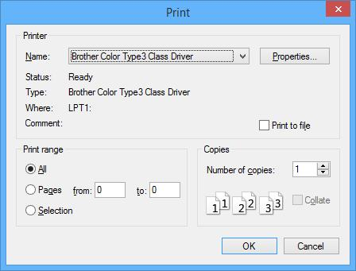
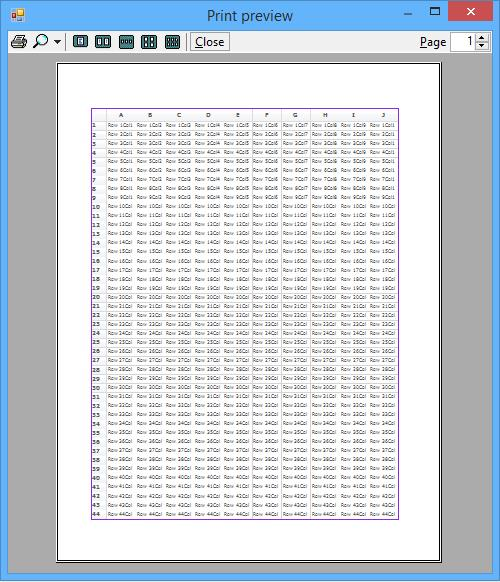
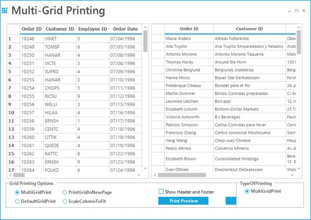
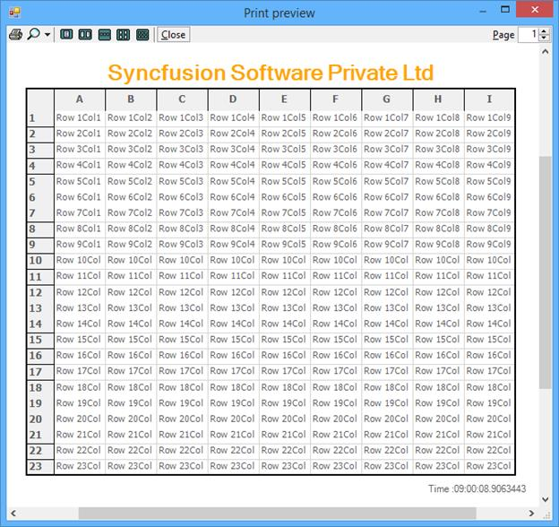
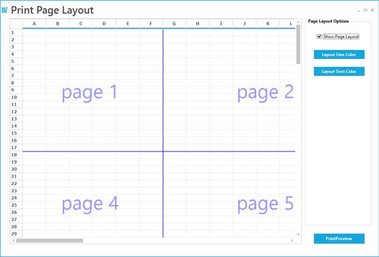
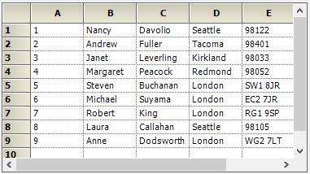
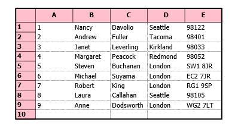

# Printing in Windows Forms Grid Control
The GridControl has in-built support for printing. To print the contents of the grid, convert the grid into the printable document using [GridPrintDocument](https://help.syncfusion.com/cr/windowsforms/Syncfusion.Windows.Forms.Grid.GridPrintDocument.html) and pass it to the [PrintDialog](https://learn.microsoft.com/en-us/dotnet/api/system.windows.forms.printdialog?view=windowsdesktop-7.0&viewFallbackFrom=net-5.0). 



//Convert the Grid as printing document
GridPrintDocument gridPrintDocument = new GridPrintDocument(this.gridControl1);
PrintDialog pd = new PrintDialog();
pd.Document = gridPrintDocument;

//Print the contents of the Grid
gridPrintDocument.Print();


'Convert the Grid as printing document
Dim gridPrintDocument As New GridPrintDocument(Me.gridControl1)
Dim pd As New PrintDialog()
pd.Document = gridPrintDocument

'Print the contents of the Grid
gridPrintDocument.Print()



## Print Preview
The [PrintPreviewDialog](https://learn.microsoft.com/en-us/dotnet/api/system.windows.forms.printpreviewdialog?view=windowsdesktop-7.0&viewFallbackFrom=net-5.0) is used to preview the pages before printing the contents of the grid.



// Converting the grid to printable document
GridPrintDocument gridPrintDocument = new GridPrintDocument(this.gridControl1, true);
PrintPreviewDialog printPreviewDialog = new PrintPreviewDialog();

//Set the Grid contents to the print preview document
printPreviewDialog.Document = gridPrintDocument;

//Display the print preview dialog
printPreviewDialog.ShowDialog();


'Converting the grid to printable document
Dim gridPrintDocument As New GridPrintDocument(Me.gridControl1, True)
Dim printPreviewDialog As New PrintPreviewDialog()

'Set the Grid contents to the print preview document
printPreviewDialog.Document = gridPrintDocument

'Display the print preview dialog
printPreviewDialog.ShowDialog()



### Printing using Keyboard shortcut
There is no direct support for printing the grid using <kbd>Ctrl</kbd>+<kbd>P</kbd> combination but this can be achieved by handling the `KeyDown` event of the grid.


this.gridControl1.KeyDown += new KeyEventHandler(gridControl1_KeyDown);
void gridControl1_KeyDown(object sender, KeyEventArgs e)
{
   if(e.Control && e.KeyCode== Keys.P)
   {

        //Call the method used to print the grid.
        PrintGridControl();
   }
}

public void PrintGridControl()
{
    GridPrintDocument document = new GridPrintDocument(this.gridControl1, true);
    PrintDialog pd = new PrintDialog();
    pd.Document = document;
    document.Print();
}


AddHandler gridControl1.KeyDown, AddressOf gridControl1_KeyDown
Private Sub gridControl1_KeyDown(ByVal sender As Object, ByVal e As KeyEventArgs)
   If e.Control AndAlso e.KeyCode= Keys.P Then
       'Call the method used to print the grid.
       PrintGridControl()
   End If
End Sub

Public Sub PrintGridControl()
    Dim document As New GridPrintDocument(Me.gridControl1, True)
    Dim pd As New PrintDialog()
    pd.Document = document
    document.Print()
End Sub



## Print Settings
GridControl supports all the default settings of the printing. This section explains about the additional settings and the usages of [GridPrintDocument](https://help.syncfusion.com/cr/windowsforms/Syncfusion.Windows.Forms.Grid.GridPrintDocument.html) and [GridPrintDocumentAdv](https://help.syncfusion.com/cr/windowsforms/Syncfusion.GridHelperClasses.GridPrintDocumentAdv.html).

The `GridPrintDocumentAdv` class is available in the [Syncfusion.GridHelperClasses.Windows.dll](https://help.syncfusion.com/cr/windowsforms/Syncfusion.GridHelperClasses.html) assembly. So, this assembly needs to be added into the assembly reference.

### Scaling 
All the columns of the grid can be printed with in a single page by enabling the [ScaleColumnsToFitPage](https://help.syncfusion.com/cr/windowsforms/Syncfusion.GridHelperClasses.GridPrintDocumentAdv.html#Syncfusion_GridHelperClasses_GridPrintDocumentAdv_ScaleColumnsToFitPage) property of the `GridPrintDocumentAdv`.


//Create the Grid as printing document
GridPrintDocumentAdv gridPrintDocument = new GridPrintDocumentAdv(this.gridControl1);
PrintDialog pd = new PrintDialog();

//Scale all columns to fit within a page
gridPrintDocument.ScaleColumnsToFitPage = true;
pd.Document = gridPrintDocument;

//Print the contents of the Grid
gridPrintDocument.Print();           


'Create the Grid as printing document
Dim gridPrintDocument As New GridPrintDocumentAdv(Me.gridControl1)
Dim pd As New PrintDialog()

'Scale all columns to fit within a page
gridPrintDocument.ScaleColumnsToFitPage = True
pd.Document = gridPrintDocument

'Print the contents of the Grid
gridPrintDocument.Print()



### Printing All the Contents into a Single Page
The grid data will be fit to a single page or the minimal number of pages using [PagesToFit](https://help.syncfusion.com/cr/windowsforms/Syncfusion.GridHelperClasses.GridPrintDocumentAdv.html#Syncfusion_GridHelperClasses_GridPrintDocumentAdv_PagesToFit) property and this option will be enabled only when the [PrintColumnToFitPage](https://help.syncfusion.com/cr/windowsforms/Syncfusion.GridHelperClasses.GridPrintDocumentAdv.html#Syncfusion_GridHelperClasses_GridPrintDocumentAdv_PrintColumnToFitPage) is set to `true`.



//Create the grid document for print
GridPrintDocumentAdv gridPrintDocument = new GridPrintDocumentAdv(this.gridControl1);

//Used to print all columns to fit within a page
gridPrintDocument.PrintColumnToFitPage = true;

// Printing All the Contents into a Single Page
gridPrintDocument.PagesToFit = 1;
PrintDialog pd = new PrintDialog();
pd.Document = gridPrintDocument;
gridPrintDocument.Print();           


'Create the grid document for print
Dim gridPrintDocument As New GridPrintDocumentAdv(Me.gridControl1)

'Used to print all columns to fit within a page
gridPrintDocument.PrintColumnToFitPage = True

' Printing All the Contents into a Single Page
gridPrintDocument.PagesToFit = 1
Dim pd As New PrintDialog()
pd.Document = gridPrintDocument
gridPrintDocument.Print()



### Printing the Grid with the Frame
The contents of the grid can be printed with an outer frame by setting the [PrintFrame](https://help.syncfusion.com/cr/windowsforms/Syncfusion.Windows.Forms.Grid.GridProperties.html#Syncfusion_Windows_Forms_Grid_GridProperties_PrintFrame) property to `true`.


//Print the grid with frame
this.gridControl1.Model.Properties.PrintFrame = true;


'Print the grid with frame
Me.gridControl1.Model.Properties.PrintFrame = True



### Changing Orientation 
The orientation of the printing layout can be changed to landscape by setting [LandScape](https://learn.microsoft.com/en-us/dotnet/api/system.drawing.printing.pagesettings.landscape?view=dotnet-plat-ext-7.0&viewFallbackFrom=net-5.0) property to `true`.


//Create the Grid as printing document
GridPrintDocument gridPrintDocument = new GridPrintDocument(this.gridControl1);

//Print the page in landscape mode
gridPrintDocument.DefaultPageSettings.Landscape = true;            
PrintDialog pd = new PrintDialog();
pd.Document = gridPrintDocument;

//Print the contents of the Grid
gridPrintDocument.Print(); 


'Create the Grid as printing document
Dim gridPrintDocument As New GridPrintDocument(Me.gridControl1)

'Print the page in landscape mode
gridPrintDocument.DefaultPageSettings.Landscape = True
Dim pd As New PrintDialog()
pd.Document = gridPrintDocument

'Print the contents of the Grid
gridPrintDocument.Print()



## Black and White Printing 
The grid can be printed with the `black and white` color combination by setting [BlackWhite](https://help.syncfusion.com/cr/windowsforms/Syncfusion.Windows.Forms.Grid.GridProperties.html#Syncfusion_Windows_Forms_Grid_GridProperties_BlackWhite) property to `true`. 



//To print the grid in a Black and White color
this.gridControl1.Model.Properties.BlackWhite = true;


'To print the grid in a Black and White color
Me.gridControl1.Model.Properties.BlackWhite = True



## Multiple Grid Printing
Multiple grids can be printed across various pages using helper class [MultipleGridPrintDocument](https://help.syncfusion.com/cr/windowsforms/Syncfusion.GridHelperClasses.MultiGridPrintDocument.html). This is achieved by drawing full-size grid to a large bitmap and then scaling this bitmap to fit the output page.

The [GridPrintOption](https://help.syncfusion.com/cr/windowsforms/Syncfusion.GridHelperClasses.MultiGridPrintDocument.html#Syncfusion_GridHelperClasses_MultiGridPrintDocument_GridPrintOption) property is used to specify the multiple grids printing options. 

**MultiGridPrinting** - Customizes the way printing support is provided for grids. It enables multiple grids to be printed in a single print. 
**PrintGridInNewPage** - Multiple grids can be printed continuously. However, the consecutive grid’s starting page will begin on a new page. 
**DefaultGridPrint** - Multiple grids will be printed without considering column breaks. 
**ScaleColumnsToFit** - Multiple grid columns will be scaled to fit the printed page. 



List<Control> gridsToPrint = new List<Control>();
foreach (Control ctrl in this.Controls)
{
    if (ctrl is Control)
    {
        gridsToPrint.Add((Control)ctrl);
    }
}
MultiGridPrintDocument multiGridPrintDocument = new MultiGridPrintDocument(gridsToPrint);
multiGridPrintDocument.GridPrintOption = MultiGridPrintDocument.GridPrintOptions.MultipleGridPrint;
multiGridPrintDocument.ShowHeaderFooterOnAllPages = true;
PrintPreviewDialog printDialog = new PrintPreviewDialog();
printDialog.Document = multiGridPrintDocument;


Dim gridsToPrint As New List(Of Control)()
For Each ctrl As Control In Me.Controls
    If TypeOf ctrl Is Control Then
        gridsToPrint.Add(CType(ctrl, Control)
    End If
Next ctrl
Dim multiGridPrintDocument As New MultiGridPrintDocument(gridsToPrint)
multiGridPrintDocument.GridPrintOption = MultiGridPrintDocument.GridPrintOptions.MultipleGridPrint
multiGridPrintDocument.ShowHeaderFooterOnAllPages = True
Dim printDialog As New PrintPreviewDialog()
printDialog.Document = multiGridPrintDocument



N> The headers and footers can be printed for all the pages by setting the [ShowHeaderFooterOnAllPages](https://help.syncfusion.com/cr/windowsforms/Syncfusion.GridHelperClasses.MultiGridPrintDocument.html#Syncfusion_GridHelperClasses_MultiGridPrintDocument_ShowHeaderFooterOnAllPages) property to `true`. The particular grid can be removed from the printing grid collection by handling the [MultipleGridPrint](https://help.syncfusion.com/cr/windowsforms/Syncfusion.GridHelperClasses.MultiGridPrintDocument.html) event.

The sample illustrates this feature is given in the following location, 
_&lt;Installed_Location&gt;\Syncfusion\EssentialStudio\&lt;Version_No&gt;\Windows\Grid.Windows\Samples\Printing\Multi-Grid Printing\CS_

## Setting Header and Footer 
The grid can be print with the headers and footers by setting the [HeaderPrintStyleInfo](https://help.syncfusion.com/cr/windowsforms/Syncfusion.GridHelperClasses.GridPrintDocumentAdv.html#Syncfusion_GridHelperClasses_GridPrintDocumentAdv_HeaderPrintStyleInfo) and [FooterPrintStyleInfo](https://help.syncfusion.com/cr/windowsforms/Syncfusion.GridHelperClasses.GridPrintDocumentAdv.html#Syncfusion_GridHelperClasses_GridPrintDocumentAdv_FooterPrintStyleInfo) properties of the advanced GridPrintDocument.


GridPrintDocumentAdv gridPrintDocument = new GridPrintDocumentAdv(this.gridControl1);
PrintPreviewDialog printPreviewDialog = new PrintPreviewDialog();
printPreviewDialog.Document = gridPrintDocument;

//Setting the height for header and footer
gridPrintDocument.HeaderHeight = 30;
gridPrintDocument.FooterHeight = 30;
gridPrintDocument.HeaderPrintStyleInfo.Text = "Syncfusion Software Private Ltd";
gridPrintDocument.FooterPrintStyleInfo.Text = "Time :" + DateTime.Now.TimeOfDay.ToString();
gridPrintDocument.HeaderPrintStyleInfo.TextColor = Color.Orange;
gridPrintDocument.HeaderPrintStyleInfo.Font.Bold = true;
gridPrintDocument.HeaderPrintStyleInfo.Font.Size = 20;

//Set the alignments 
gridPrintDocument.HeaderPrintStyleInfo.HorizontalAlignment = GridHorizontalAlignment.Center;
gridPrintDocument.FooterPrintStyleInfo.HorizontalAlignment = GridHorizontalAlignment.Right;
printPreviewDialog.ShowDialog();



Dim gridPrintDocument As New GridPrintDocumentAdv(Me.gridControl1)
Dim printPreviewDialog As New PrintPreviewDialog()
printPreviewDialog.Document = gridPrintDocument

'Setting the height for header and footer
gridPrintDocument.HeaderHeight = 30
gridPrintDocument.FooterHeight = 30
gridPrintDocument.HeaderPrintStyleInfo.Text = "Syncfusion Software Private Ltd"
gridPrintDocument.FooterPrintStyleInfo.Text = "Time :" & DateTime.Now.TimeOfDay.ToString()
gridPrintDocument.HeaderPrintStyleInfo.TextColor = Color.Orange
gridPrintDocument.HeaderPrintStyleInfo.Font.Bold = True
gridPrintDocument.HeaderPrintStyleInfo.Font.Size = 20

'Set the alignments 
gridPrintDocument.HeaderPrintStyleInfo.HorizontalAlignment = GridHorizontalAlignment.Center
gridPrintDocument.FooterPrintStyleInfo.HorizontalAlignment = GridHorizontalAlignment.Right
printPreviewDialog.ShowDialog()



## Page Break
Print Page Layout feature enables viewing page layout on the grid by displaying a segment line and page number with each segment. This helps to analyze page breaks within the grid, and manage them accordingly.

Properties are available to define colors for the line and text of the page layout. The number of rows and columns to be printed for each page can be set by using the [PageBreakRows](https://help.syncfusion.com/cr/windowsforms/Syncfusion.GridHelperClasses.LayoutSupportHelper.html#Syncfusion_GridHelperClasses_LayoutSupportHelper_PageBreakRows) and [PageBreakCols](https://help.syncfusion.com/cr/windowsforms/Syncfusion.GridHelperClasses.LayoutSupportHelper.html#Syncfusion_GridHelperClasses_LayoutSupportHelper_PageBreakCols) through [LayoutSupportHelper](https://help.syncfusion.com/cr/windowsforms/Syncfusion.GridHelperClasses.LayoutSupportHelper.html). The following code examples illustrate how to set the line and text color of the page layout.



LayoutSupportHelper layoutHelper = new LayoutSupportHelper(gridControl1);
layoutHelper.LineColor = Color.Blue;
layoutHelper.TextColor = Color.Blue;


Dim layoutHelper As New LayoutSupportHelper(gridControl1)
layoutHelper.LineColor = Color.Blue
layoutHelper.TextColor = Color.Blue



To display the layout lines and page number in the grid, set the [ShowLayoutLines](https://help.syncfusion.com/cr/windowsforms/Syncfusion.GridHelperClasses.LayoutSupportHelper.html#Syncfusion_GridHelperClasses_LayoutSupportHelper_ShowLayoutLines) property to `true`.


if (layoutHelper != null)
    layoutHelper.ShowLayoutLines = this.checkBox1.Checked;


If layoutHelper IsNot Nothing Then
    layoutHelper.ShowLayoutLines = Me.checkBox1.Checked
End If



The sample demonstrating the printing layout is given in the below location, 
&lt;Installed_Location&gt;\Syncfusion\EssentialStudio\&lt;Version_No&gt;\Windows\Grid.Windows\Samples\Printing\Print Page Layout Demo\CS

### Customizing Page Breaks
The row breaks and column breaks for each pages can be customized by using the [PrintInfo](https://help.syncfusion.com/cr/windowsforms/Syncfusion.Windows.Forms.Grid.GridControlBase.html#Syncfusion_Windows_Forms_Grid_GridControlBase_PrintInfo) property. This will provide the list of first row index and first column index of each pages while printing.


private void PageBreak_Click(object sender, EventArgs e)
{
    GridPrintDocument document = new GridPrintDocument(this.gridControl1);
    PrintPreviewDialog dialog = new PrintPreviewDialog();
    document.PrintPage += Document_PrintPage1;
    dialog.Document = document;
    dialog.ShowDialog();
}
private void Document_PrintPage(object sender, System.Drawing.Printing.PrintPageEventArgs e)
{

// set the row count need to be printed for each page
    this.gridControl1.PrintInfo.m_awPageFirstRow = new ArrayList();
    this.gridControl1.PrintInfo.m_awPageFirstRow.Add(0);
    this.gridControl1.PrintInfo.m_awPageFirstRow.Add(30);
    this.gridControl1.PrintInfo.m_awPageFirstRow.Add(60);

// Set the starting column count for each page
    this.gridControl1.PrintInfo.m_awPageFirstCol = new ArrayList();
    this.gridControl1.PrintInfo.m_awPageFirstCol.Add(0);
    this.gridControl1.PrintInfo.m_awPageFirstCol.Add(5);
}


Private Sub PageBreak_Click(ByVal sender As Object, ByVal e As EventArgs)
    Dim document As New GridPrintDocument(Me.gridControl1)
    Dim dialog As New PrintPreviewDialog()
    AddHandler document.PrintPage, AddressOf Document_PrintPage1
    dialog.Document = document
    dialog.ShowDialog()
End Sub
Private Sub Document_PrintPage(ByVal sender As Object, ByVal e As System.Drawing.Printing.PrintPageEventArgs)

' set the row count need to be printed for each page
    Me.gridControl1.PrintInfo.m_awPageFirstRow = New ArrayList()
    Me.gridControl1.PrintInfo.m_awPageFirstRow.Add(0)
    Me.gridControl1.PrintInfo.m_awPageFirstRow.Add(30)
    Me.gridControl1.PrintInfo.m_awPageFirstRow.Add(60)

' Set the starting column count for each page
    Me.gridControl1.PrintInfo.m_awPageFirstCol = New ArrayList()
    Me.gridControl1.PrintInfo.m_awPageFirstCol.Add(0)
    Me.gridControl1.PrintInfo.m_awPageFirstCol.Add(5)
End Sub



## Printing Customizations
The printing options of the grid can be customized by using the following methods.

### Applying Header Colors while Printing
The cell styles can be changed dynamically on printing the grid by using [PrintingMode](https://help.syncfusion.com/cr/windowsforms/Syncfusion.Windows.Forms.Grid.GridControlBase.html#Syncfusion_Windows_Forms_Grid_GridControlBase_PrintingMode) property. The following code snippet is used to set the header colors for the GridControl only on the printed document,


this.gridControl1.QueryCellInfo += new GridQueryCellInfoEventHandler(gridControl1_QueryCellInfo);
void gridControl1_QueryCellInfo(object sender, GridQueryCellInfoEventArgs e)
{

//Change the back color of the headers only when the grid is in printing mode.
   if(this.gridControl1.PrintingMode)
   {
 
 //Column headers or Row headers
       if(e.RowIndex == 0 || e.ColIndex ==0)
       {
           e.Style.BackColor = Color.Pink;
       }
   }
} 


AddHandler gridControl1.QueryCellInfo, AddressOf gridControl1_QueryCellInfo
Private Sub gridControl1_QueryCellInfo(ByVal sender As Object, ByVal e As GridQueryCellInfoEventArgs)

'Change the back color of the headers only when the grid is in printing mode.
   If Me.gridControl1.PrintingMode Then
                 'Column headers or Row headers
       If e.RowIndex = 0 OrElse e.ColIndex =0 Then
           e.Style.BackColor = Color.Pink
       End If
   End If
End Sub


The grid in normal mode looks like the below screen shot,

The grid headers printed with Pink color on the printing mode,

### Hiding Row and Column Headers 
To hide the row and column headers while printing or print previewing the grid, set the [PrintRowHeader](https://help.syncfusion.com/cr/windowsforms/Syncfusion.Windows.Forms.Grid.Grouping.GridGroupingControl.html#Syncfusion_Windows_Forms_Grid_Grouping_GridGroupingControl_PrintRowHeader) and [PrintColumnHeader](https://help.syncfusion.com/cr/windowsforms/Syncfusion.Windows.Forms.Grid.Grouping.GridGroupingControl.html#Syncfusion_Windows_Forms_Grid_Grouping_GridGroupingControl_PrintColumnHeader) property values as `false`.


//Hide Row and column headers while printing the document
this.gridControl1.Properties.PrintRowHeader = false;
this.gridControl1.Properties.PrintColHeader = false;


'Hide Row and column headers while printing the document
Me.gridControl1.Properties.PrintRowHeader = False
Me.gridControl1.Properties.PrintColHeader = False



### Column Header on each page
Column headers can be printed on each page by enabling the `AllowRepeatHeaders` property of [GridPrintInfo](https://help.syncfusion.com/cr/windowsforms/Syncfusion.Windows.Forms.Grid.GridPrintInfo.html).



//Show the column headers on all pages of print document.
this.gridControl1.PrintInfo.AllowRepeatHeaders = true;


'Show the column headers on all pages of print document.
Me.gridControl1.PrintInfo.AllowRepeatHeaders = true



N> The `PrintColHeader` property should be enabled to avail this feature.

### Printing the Grid with Center Aligned 
The grid can be centered vertically while printing by setting the [CenterVertical](https://help.syncfusion.com/cr/windowsforms/Syncfusion.Windows.Forms.Grid.GridProperties.html#Syncfusion_Windows_Forms_Grid_GridProperties_CenterVertical) property to `true`. The grid can be printed with centered horizontally by enabling the [CenterHorizontal](https://help.syncfusion.com/cr/windowsforms/Syncfusion.Windows.Forms.Grid.GridProperties.html#Syncfusion_Windows_Forms_Grid_GridProperties_CenterHorizontal) property.


//Specifies if the grid should be centered vertically on printing.
this.gridControl1.Properties.CenterVertical = true;

//Specifies if the grid should be centered horizontally while printing.
this.gridControl1.Properties.CenterHorizontal = true;


'Specifies if the grid should be centered vertically on printing.
Me.gridControl1.Properties.CenterVertical = True

'Specifies if the grid should be centered horizontally while printing.
Me.gridControl1.Properties.CenterHorizontal = True



### Hiding Grid Lines While Printing
The horizontal and the vertical lines can be hidden in the printed document by setting the following code snippet,


//To avoid printing the Horizontal and vertical lines
this.gridControl1.PrintHorizontalLines = false;
this.gridControl1.PrintVerticalLines = false;


'To avoid printing the Horizontal and vertical lines
Me.gridControl1.PrintHorizontalLines = False
Me.gridControl1.PrintVerticalLines = False



### Hiding the Row/columns using Events
To hide some of the rows and columns while printing the grid, set the size of the row height and column width value as zero at the [QueryRowHeight](https://help.syncfusion.com/cr/windowsforms/Syncfusion.Windows.Forms.Grid.GridModel.html#Syncfusion_Windows_Forms_Grid_GridModel_QueryRowHeight) and [QueryColWidth](https://help.syncfusion.com/cr/windowsforms/Syncfusion.Windows.Forms.Grid.GridModel.html#Syncfusion_Windows_Forms_Grid_GridModel_QueryColWidth) events while the grid entered into the [PrintingMode](https://help.syncfusion.com/cr/windowsforms/Syncfusion.Windows.Forms.Grid.GridControlBase.html#Syncfusion_Windows_Forms_Grid_GridControlBase_PrintingMode).


void gridControl1_QueryRowHeight(object sender, GridRowColSizeEventArgs e)
{

//Apply the condition only on printing 
    if(this.gridControl1.PrintingMode)
    {
        if(e.Index==2 || e.Index ==3)
        {

//Set the row height value as zero while the Grid in printing mode
            e.Size = 0;
            e.Handled = true;
        }
    }
}
void gridControl1_QueryColWidth(object sender, GridRowColSizeEventArgs e)
{

//Apply the condition only on printing 
    if (this.gridControl1.PrintingMode)
    {
        if (e.Index == 3)
        {
            //Set the Column width value as zero while the Grid in printing mode
            e.Size = 0;
            e.Handled = true;
        }
    }
}    


Private Sub gridControl1_QueryRowHeight(ByVal sender As Object, ByVal e As GridRowColSizeEventArgs)

'Apply the condition only on printing 
    If Me.gridControl1.PrintingMode Then
        If e.Index=2 OrElse e.Index =3 Then
            'Set the row height value as zero while the Grid in printing mode
            e.Size = 0
            e.Handled = True
        End If
    End If
End Sub
Private Sub gridControl1_QueryColWidth(ByVal sender As Object, ByVal e As GridRowColSizeEventArgs)

'Apply the condition only on printing 
    If Me.gridControl1.PrintingMode Then
        If e.Index = 3 Then
            'Set the Column width value as zero while the Grid in printing mode
            e.Size = 0
            e.Handled = True
        End If
    End If
End Sub



### Print the Selected Range of the Cells 
To print only the selected range of cells from the grid, set the [PrintRange](https://learn.microsoft.com/en-us/dotnet/api/system.drawing.printing.printrange?view=dotnet-plat-ext-7.0&viewFallbackFrom=net-5.0) value as `Selection`. It will print the selected range of cells or the selected page from the GridControl. 


GridPrintDocument gridPrintDocument = new GridPrintDocument(this.gridControl1, true);

//To print the selected range of cells
gridPrintDocument.PrinterSettings.PrintRange = System.Drawing.Printing.PrintRange.Selection;


Dim gridPrintDocument As New GridPrintDocument(Me.gridControl1, True)

'To print the selected range of cells
gridPrintDocument.PrinterSettings.PrintRange = System.Drawing.Printing.PrintRange.Selection


The `PrintRange` enumeration has the following printing options,

**AllPages –**Used to print all the pages of the Grid 
**CurrentPage –**Used to print the Current page 
**Selection –**Used to print the selected range of cells 
**SomePages –**Used to print particular range of pages. 

N> By default the [PrintRange](https://learn.microsoft.com/en-us/dotnet/api/system.drawing.printing.printrange?view=dotnet-plat-ext-7.0&viewFallbackFrom=net-5.0) will be pointed to `AllPages`, so that the print method will print all the pages of the grid.

### Printing Needed Pages alone
The needed pages in the grid can only be printed by setting the [PrintRange](https://learn.microsoft.com/en-us/dotnet/api/system.drawing.printing.printrange?view=dotnet-plat-ext-7.0&viewFallbackFrom=net-5.0) property value as `SomePages`.


GridPrintDocument gridPrintDocument = new GridPrintDocument(this.gridControl1, true);
PrintPreviewDialog printPreviewDialog = new PrintPreviewDialog();
printPreviewDialog.Document = gridPrintDocument;

//To print the specific range of pages
gridPrintDocument.PrinterSettings.FromPage = 2;
gridPrintDocument.PrinterSettings.ToPage = 3;
gridPrintDocument.PrinterSettings.PrintRange = System.Drawing.Printing.PrintRange.SomePages;
printPreviewDialog.ShowDialog();


Dim gridPrintDocument As New GridPrintDocument(Me.gridControl1, True)
Dim printPreviewDialog As New PrintPreviewDialog()
printPreviewDialog.Document = gridPrintDocument

'To print the specific range of pages
gridPrintDocument.PrinterSettings.FromPage = 2
gridPrintDocument.PrinterSettings.ToPage = 3
gridPrintDocument.PrinterSettings.PrintRange = System.Drawing.Printing.PrintRange.SomePages
printPreviewDialog.ShowDialog()



## Deriving GridPrintDocument 
The [GridPrintDocument](https://help.syncfusion.com/cr/windowsforms/Syncfusion.Windows.Forms.Grid.GridPrintDocument.html) has the events [BeginPrint](https://help.syncfusion.com/cr/windowsforms/Syncfusion.Windows.Forms.Grid.GridPrintDocument.html#Syncfusion_Windows_Forms_Grid_GridPrintDocument_OnBeginPrint_System_Drawing_Printing_PrintEventArgs_), [PrintPage](https://help.syncfusion.com/cr/windowsforms/Syncfusion.Windows.Forms.Grid.GridPrintDocument.html#Syncfusion_Windows_Forms_Grid_GridPrintDocument_OnPrintPage_System_Drawing_Printing_PrintPageEventArgs_) and [EndPrint](https://help.syncfusion.com/cr/windowsforms/Syncfusion.Windows.Forms.Grid.GridPrintDocument.html#Syncfusion_Windows_Forms_Grid_GridPrintDocument_OnEndPrint_System_Drawing_Printing_PrintEventArgs_) inherited from `PrintDocument`, which allows to access the printing flow at certain points. To gain more control over the printing document, derive the `GridPrintDocument` and override the members like `OnPrintPage`. Using this overrides, the [ViewLayout](https://help.syncfusion.com/cr/windowsforms/Syncfusion.Windows.Forms.Grid.GridControlBase.html#Syncfusion_Windows_Forms_Grid_GridControlBase_ViewLayout) and [TopRowIndex](https://help.syncfusion.com/cr/windowsforms/Syncfusion.Windows.Forms.Grid.GridControlBase.html#Syncfusion_Windows_Forms_Grid_GridControlBase_TopRowIndex) of the grid members can be accessed to obtain the information about the page that is being printed. The following code shows how to print the top and bottom row of the page.


public class MyPrintDocument : GridPrintDocument
{
    GridControlBase _grid;

    public MyPrintDocument(GridControlBase grid, bool printPreview)
        : base(grid, printPreview)
    {
        _grid = grid;
    }

    protected override void OnPrintPage(System.Drawing.Printing.PrintPageEventArgs e)
    {
        base.OnPrintPage(e);
        _grid.PrintingMode = true;

//Gets Top Row Index.
        int topRow = _grid.TopRowIndex;
        _grid.ViewLayout.Reset();

//Gets Bottom Row Index.
        int botRow = this._grid.ViewLayout.LastVisibleRow
                        - (this._grid.ViewLayout.HasPartialVisibleRows ? 1 : 0);

        _grid.PrintingMode = false;

//Prints.
        Console.WriteLine("OnPrintPage " + topRow.ToString() + "   " + botRow.ToString();
    }
}


Public Class MyPrintDocument
    Inherits GridPrintDocument
    Private _grid As GridControlBase

    Public Sub New(ByVal grid As GridControlBase, ByVal printPreview As Boolean)
        MyBase.New(grid, printPreview)
        _grid = grid
    End Sub

    Protected Overrides Sub OnPrintPage(ByVal e As System.Drawing.Printing.PrintPageEventArgs)
        MyBase.OnPrintPage(e)
        _grid.PrintingMode = True

'Gets Top Row Index.
        Dim topRow As Integer = _grid.TopRowIndex
        _grid.ViewLayout.Reset()

'Gets Bottom Row Index.
        Dim botRow As Integer = Me._grid.ViewLayout.LastVisibleRow - (If(Me._grid.ViewLayout.HasPartialVisibleRows, 1, 0)

        _grid.PrintingMode = False

'Prints.
        Console.WriteLine("OnPrintPage " & topRow.ToString() & "   " & botRow.ToString()
    End Sub
End Class


