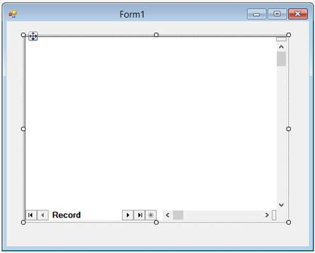
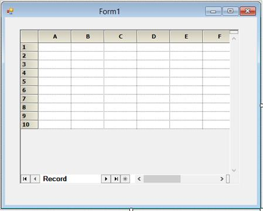
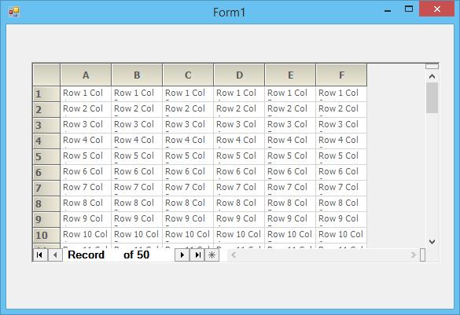
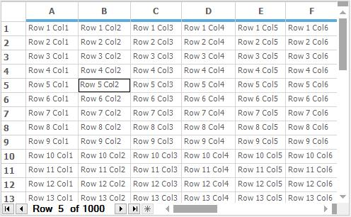
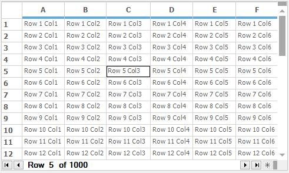
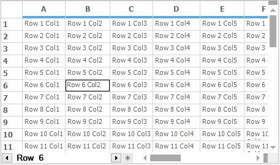

# Record Navigation Control in Windows Forms Grid Control
The [GridRecordNavigationControl](https://help.syncfusion.com/cr/windowsforms/Syncfusion.Windows.Forms.Grid.GridRecordNavigationControl.html) is used to navigate between records using a navigation bar at the bottom of the grid. 
## Adding Record Navigation
The record navigation control can be added throw the designer as well as the code. 

N> The [GridGroupingControl](https://help.syncfusion.com/windowsforms/gridgrouping/navigation-bar) has the built-in support for Record Navigation control.

### Through Designer
It can be drag and drop from the Toolbox window from the designer along with the GridControl. The step-by-step procedure to create GridRecordNavigationControl through designer is given below,

1. Drag and drop the GridRecordNavigationControl from the toolbox on the form.
2. Size and position in the proper place.
   
   

3. Drag the GridControl from toolbox and drop it on the GridRecordNavigationControl properly which was shown in below screenshot.
   
   

4. Populate the GridControl with data.

   

5. Run the application and get the following screenshot as an Output.

   

### Through Code
The GridRecordNavigationControl can also be programmatically added to the GridControl.



//Create the Grid record Navigation control.
GridRecordNavigationControl recordNavigationControl1 = new Syncfusion.Windows.Forms.Grid.GridRecordNavigationControl();

this.recordNavigationControl1.Location = new System.Drawing.Point(32, 48);
this.recordNavigationControl1.MaxLabel = "of 50";
this.recordNavigationControl1.MaxRecord = 50;
this.recordNavigationControl1.NavigationBarWidth = 237;
this.recordNavigationControl1.Size = new System.Drawing.Size(520, 256);
this.recordNavigationControl1.SplitBars = Syncfusion.Windows.Forms.DynamicSplitBars.Both;

//Create the GridControl.
GridControl gridControl1 = new Syncfusion.Windows.Forms.Grid.GridControl();

this.gridControl1.ColCount = 6;
this.gridControl1.NumberedRowHeaders = false;
this.gridControl1.RowCount = 50;

//Add the grid to the Record Navigation control.
this.recordNavigationControl1.Controls.Add(this.gridControl1);

//Add the Record Navigation control to the form.
this.Controls.Add(this.recordNavigationControl1);


'Create the Grid record Navigation control.
Dim recordNavigationControl1 As GridRecordNavigationControl = New Syncfusion.Windows.Forms.Grid.GridRecordNavigationControl()

Me.recordNavigationControl1.Location = New System.Drawing.Point(32, 48)
Me.recordNavigationControl1.MaxLabel = "of 50"
Me.recordNavigationControl1.MaxRecord = 50
Me.recordNavigationControl1.NavigationBarWidth = 237
Me.recordNavigationControl1.Size = New System.Drawing.Size(520, 256)
Me.recordNavigationControl1.SplitBars = Syncfusion.Windows.Forms.DynamicSplitBars.Both

'Create the GridControl.
Dim gridControl1 As GridControl = New Syncfusion.Windows.Forms.Grid.GridControl()

Me.gridControl1.ColCount = 6
Me.gridControl1.NumberedRowHeaders = False
Me.gridControl1.RowCount = 50

'Add the grid to the Record Navigation control.
Me.recordNavigationControl1.Controls.Add(Me.gridControl1)

'Add the Record Navigation control to the form.
Me.Controls.Add(Me.recordNavigationControl1)



## Customizing Record Navigation Control
The GridRecordNavigationControl provides the following list of properties for customization,

### Changing the Text of the Navigation
By default the Record navigation bar will display the ‘Record’ at the prefix of the navigation bar text. This can be changed by setting the [Label](https://help.syncfusion.com/cr/windowsforms/Syncfusion.Windows.Forms.Grid.GridRecordNavigationControl.html#Syncfusion_Windows_Forms_Grid_GridRecordNavigationControl_Label) property as of follows,



//Label for navigation bar
this.recordNavigationControl.Label = "Row";


' Label for navigation bar
Me.recordNavigationControl.Label = "Row"



### Appending the Text to the Navigation Bar
The Record navigation bar text can be append with the desired text by setting the [MaxLabel](https://help.syncfusion.com/cr/windowsforms/Syncfusion.Windows.Forms.Grid.GridRecordNavigationControl.html#Syncfusion_Windows_Forms_Grid_GridRecordNavigationControl_MaxLabel) property.



//To display the text in navigation bar
this.recordNavigationControl.MaxLabel = "of 1000";


'To display the text in navigation bar
Me.recordNavigationControl.MaxLabel = "of 1000"



### Setting the Maximum Record Count
The maximum number of record position can be set by using [MaxRecord](https://help.syncfusion.com/cr/windowsforms/Syncfusion.Windows.Forms.Grid.GridRecordNavigationControl.html#Syncfusion_Windows_Forms_Grid_GridRecordNavigationControl_MaxRecord) property.



//set maximum record position as 1000
this.recordNavigationControl.MaxRecord = 1000;


'set maximum record position as 1000
Me.recordNavigationControl.MaxRecord = 1000


The maximum record count can be reset to default by using the [ResetMaxRecord](https://help.syncfusion.com/cr/windowsforms/Syncfusion.Windows.Forms.RecordNavigationControl.html#Syncfusion_Windows_Forms_RecordNavigationControl_ResetMaxRecord) method.


//Reset the maximum record 
this.gridRecordNavigationControl1.ResetMaxRecord();


'Reset the maximum record 
Me.gridRecordNavigationControl1.ResetMaxRecord()



### Setting the Minimum Record Position 
The minimum number of record position can be set by using [MinRecord](https://help.syncfusion.com/cr/windowsforms/Syncfusion.Windows.Forms.Grid.GridRecordNavigationControl.html#Syncfusion_Windows_Forms_Grid_GridRecordNavigationControl_MinRecord) property.



//set minimum record position as 1
this.recordNavigationControl.MinRecord = 1;


'set minimum record position as 1
Me.recordNavigationControl.MinRecord = 1


The minimum record position can be reset to default by using the [ResetMinRecord](https://help.syncfusion.com/cr/windowsforms/Syncfusion.Windows.Forms.RecordNavigationControl.html#Syncfusion_Windows_Forms_RecordNavigationControl_ResetMinRecord) method.


//Reset the minimum record count
this.gridRecordNavigationControl1.ResetMinRecord();


'Reset the minimum record count
Me.gridRecordNavigationControl1.ResetMinRecord()



### Setting the width of the Navigation Bar
The width of the navigation bar can be changed by setting the [NavigationBarWidth](https://help.syncfusion.com/cr/windowsforms/Syncfusion.Windows.Forms.Grid.GridRecordNavigationControl.html#Syncfusion_Windows_Forms_Grid_GridRecordNavigationControl_NavigationBarWidth) property.



//Set the width of the navigation bar
this.recordNavigationControl.NavigationBarWidth = 600;


'Set the width of the navigation bar
Me.recordNavigationControl.NavigationBarWidth = 600



### Changing the Back Color for the Navigation Bar
To set back color for the record navigation bar, use the [NavigationBarBackColor](https://help.syncfusion.com/cr/windowsforms/Syncfusion.Windows.Forms.Grid.GridRecordNavigationControl.html#Syncfusion_Windows_Forms_Grid_GridRecordNavigationControl_NavigationBarBackColor) property as of follows.



//Set the back color for navigation bar
this.recordNavigationControl.NavigationBarBackColor = Color.LightGreen;


'Set the back color for navigation bar
Me.recordNavigationControl.NavigationBarBackColor = Color.LightGreen



### Resetting the Arrow Color
The disable arrow back color can be reset to default by using the [ResetDisabledArrowColor](https://help.syncfusion.com/cr/windowsforms/Syncfusion.Windows.Forms.RecordNavigationControl.html#Syncfusion_Windows_Forms_RecordNavigationControl_ResetDisabledArrowColor) method.



//Reset the color of the disabled arrow backcolor
this.gridRecordNavigationControl1.ResetDisabledArrowColor();


'Reset the color of the disabled arrow backcolor
Me.gridRecordNavigationControl1.ResetDisabledArrowColor()


The enabled arrow back color can be reset to default by using the [ResetEnabledArrowColor](https://help.syncfusion.com/cr/windowsforms/Syncfusion.Windows.Forms.RecordNavigationControl.html#Syncfusion_Windows_Forms_RecordNavigationControl_ResetEnabledArrowColor) method.


//Reset the back color of the enable arrow 
this.gridRecordNavigationControl1.ResetEnabledArrowColor();


'Reset the back color of the enable arrow 
Me.gridRecordNavigationControl1.ResetEnabledArrowColor()


The record navigation bar back color can be reset to default by using the [ResetNavigationBarBackColor](https://help.syncfusion.com/cr/windowsforms/Syncfusion.Windows.Forms.RecordNavigationControl.html#Syncfusion_Windows_Forms_RecordNavigationControl_ResetNavigationBarBackColor) method.


//Reset the back color of the Navigation Bar
this.gridRecordNavigationControl1.ResetNavigationBarBackColor();


'Reset the back color of the Navigation Bar
Me.gridRecordNavigationControl1.ResetNavigationBarBackColor()



### Navigating the Records through Code
The grid records can be programmatically navigate by using the [NavigationBar](https://help.syncfusion.com/cr/windowsforms/Syncfusion.Windows.Forms.RecordNavigationControl.html#Syncfusion_Windows_Forms_RecordNavigationControl_NavigationBar) method. The followings are the methods used for navigation,



//Moves the current record position to the first row 
this.gridRecordNavigationControl1.NavigationBar.MoveFirst();

//Moves the current record position to the last row 
this.gridRecordNavigationControl1.NavigationBar.MoveLast();

//Moves the current record position to the next row 
this.gridRecordNavigationControl1.NavigationBar.MoveNext();

//Moves the current record position to the previous row 
this.gridRecordNavigationControl1.NavigationBar.MovePrevious();


'Moves the current record position to the first row 
Me.gridRecordNavigationControl1.NavigationBar.MoveFirst()

'Moves the current record position to the last row 
Me.gridRecordNavigationControl1.NavigationBar.MoveLast()

'Moves the current record position to the next row 
Me.gridRecordNavigationControl1.NavigationBar.MoveNext()

'Moves the current record position to the previous row 
Me.gridRecordNavigationControl1.NavigationBar.MovePrevious()



### Changing the Visibility of the Arrow Buttons
The visibility of the arrow buttons can be changed by setting the [NavigationButtons](https://help.syncfusion.com/cr/windowsforms/Syncfusion.Windows.Forms.Grid.GridRecordNavigationControl.html#Syncfusion_Windows_Forms_Grid_GridRecordNavigationControl_NavigationButtons) property appropriate value from the [DisplayArrowButtons](https://help.syncfusion.com/cr/windowsforms/Syncfusion.Windows.Forms.DisplayArrowButtons.html) enumeration such as,

**Single** – Used to show only the next and previous buttons in the navigation bar. 
**All** – Used to show all the buttons from the navigation bar. This is the default option. 
**None** – Does not display any buttons in the record navigation bar. 



//Display only next and previous buttons in the navigation bar
this.gridRecordNavigationControl1.NavigationButtons = Syncfusion.Windows.Forms.DisplayArrowButtons.Single;


'Display only next and previous buttons in the navigation bar
Me.gridRecordNavigationControl1.NavigationButtons = Syncfusion.Windows.Forms.DisplayArrowButtons.Single



## Applying Visual Style
The GridRecordNavigationControl can be displayed with Metro and Default theme. It can be applied by setting the `Style` property as of follows,



//Setting the Visual Style for Record navigation bar
this.gridRecordNavigationControl1.Style = Syncfusion.Windows.Forms.Appearance.Metro;


'Setting the Visual Style for Record navigation bar
Me.gridRecordNavigationControl1.Style = Syncfusion.Windows.Forms.Appearance.Metro


