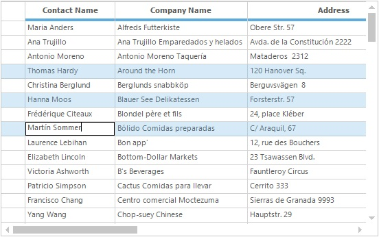
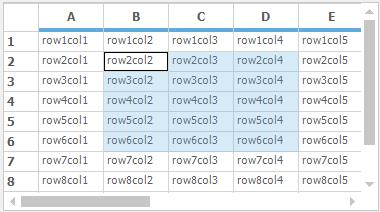
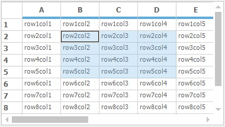
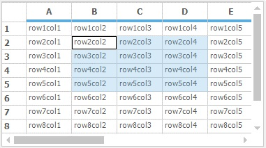
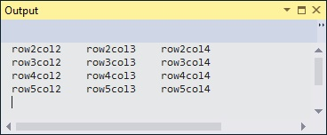
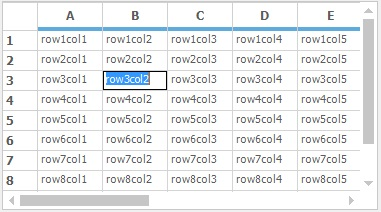

# Selection in Windows Forms Grid Control

The selection is the process of highlighting. This section will explain about the types of selection available for GridControl and its usability’s. 

## Range Selection

The particular range of cells/rows/columns/table in the grid can be selected by setting the [AllowSelection](https://help.syncfusion.com/cr/windowsforms/Syncfusion.Windows.Forms.Grid.GridControl.html#Syncfusion_Windows_Forms_Grid_GridControl_AllowSelection) property to the appropriate [GridSelectionFlags](http://help.syncfusion.com/cr/windowsforms/Syncfusion.Windows.Forms.Grid.GridSelectionFlags.html#) enumeration. 



//Enable the Range Selection 
this.gridControl1.AllowSelection = GridSelectionFlags.Any;



'Enable the Range Selection 
Me.gridControl1.AllowSelection = GridSelectionFlags.Any



## Record Selection

The [ListBoxSelectionMode](https://help.syncfusion.com/cr/windowsforms/Syncfusion.Windows.Forms.Grid.GridControl.html#Syncfusion_Windows_Forms_Grid_GridControl_ListBoxSelectionMode) is used to select the range of rows on clicking the cells inside the grid. The [SelectionMode](https://learn.microsoft.com/en-us/dotnet/api/system.windows.forms.selectionmode?view=windowsdesktop-7.0&viewFallbackFrom=net-5.0) enumeration has provide the options to set the type of selection mode. 



// To set MultiSimple ListBox Selection Mode 
this.gridControl1.ListBoxSelectionMode = SelectionMode.MultiSimple;



' To set MultiSimple ListBox Selection Mode 
Me.gridControl1.ListBoxSelectionMode = SelectionMode.MultiSimple



## Adding Selection

In the GridControl the selections are maintained in the [SelectedRanges](https://help.syncfusion.com/cr/windowsforms/Syncfusion.Windows.Forms.Grid.Grouping.GridTableModel.html#Syncfusion_Windows_Forms_Grid_Grouping_GridTableModel_SelectedRanges) collection. To add the selection for particular range of cells, add the range into the `SelectedRanges` collection. 



//Adding the range of cells to the SelectedRanges
this.gridControl1.Model.SelectedRanges.Add(GridRangeInfo.Cells(2, 2, 5, 4));



'Adding the range of cells to the SelectedRanges
Me.gridControl1.Model.SelectedRanges.Add(GridRangeInfo.Cells(2, 2, 5, 4))



User can also add the selection by using the following code snippet,



//Adding the range of cells to the selection
this.gridControl1.Selections.Add(GridRangeInfo.Cells(2, 2, 5, 4));



'Adding the range of cells to the selection
Me.gridControl1.Selections.Add(GridRangeInfo.Cells(2, 2, 5, 4))



### Adding Multiple Selected Ranges

To have the multiple selected ranges in the GirdControl, add the list of ranges into the [GridRangeInfoList](http://help.syncfusion.com/cr/windowsforms/Syncfusion.Windows.Forms.Grid.GridRangeInfoList.html#) collection. 



//Add Selection to the multiple ranges
this.gridControl1.Model.SelectedRanges.Add(GridRangeInfo.Cells(3, 3, 3, 4));

this.gridControl1.Model.SelectedRanges.Add(GridRangeInfo.Cols(1, 1));

this.gridControl1.Model.SelectedRanges.Add(GridRangeInfo.Row(5));



'Add Selection to the multiple ranges
Me.gridControl1.Model.SelectedRanges.Add(GridRangeInfo.Cells(3, 3, 3, 4))

Me.gridControl1.Model.SelectedRanges.Add(GridRangeInfo.Cols(1, 1))

Me.gridControl1.Model.SelectedRanges.Add(GridRangeInfo.Row(5))



The following screen shot shows the grid with multiple selected range,

## Clearing Selection

To clear all the selections from the grid, use the [Selections.Clear](https://help.syncfusion.com/cr/windowsforms/Syncfusion.Windows.Forms.Grid.GridModelSelections.html#Syncfusion_Windows_Forms_Grid_GridModelSelections_Clear) method.



//To clear the selections from the GridControl
this.gridControl1.Selections.Clear();



'To clear the selections from the GridControl
Me.gridControl1.Selections.Clear()



### Remove Range from Selection

To clear the particular range of cells from the selection, use the [Remove](https://help.syncfusion.com/cr/windowsforms/Syncfusion.Windows.Forms.Grid.GridModelSelections.html#Syncfusion_Windows_Forms_Grid_GridModelSelections_Remove_Syncfusion_Windows_Forms_Grid_GridRangeInfo_) or `RemoveAt` methods.



//Remove the range at the given index from the Selection 
this.gridControl1.Selections.Ranges.RemoveAt(1);

//Remove particular range from the selection
GridRangeInfo range1 = this.gridControl1.Model.SelectedRanges[0];

this.gridControl1.Selections.Ranges.Remove(range1);



'Remove the range at the given index from the Selection 
Me.gridControl1.Selections.Ranges.RemoveAt(1)

'Remove particular range from the selection
Dim range1 As GridRangeInfo = Me.gridControl1.Model.SelectedRanges(0)

Me.gridControl1.Selections.Ranges.Remove(range1)



### Preventing Selection using event

When the selection is added to the grid, it will be notified by using the [SelectionChanged](https://help.syncfusion.com/cr/windowsforms/Syncfusion.Windows.Forms.Grid.GridModel.html) event. This event can be used to prevent the selection for the particular range of cells as of follows,



//To prevent the selection from particular range of cells
this.gridControl1.SelectionChanging +=gridControl1_SelectionChanging;

void gridControl1_SelectionChanging(object sender, GridSelectionChangingEventArgs e)
{
    //Prevent cell from selection
    if (e.Range.Contains(GridRangeInfo.Cell(2, 2)))
    e.Cancel = true;

//Prevent column from selection
    if (e.Range.IntersectsWith(GridRangeInfo.Col(3)))
    e.Cancel = true;

}



'To prevent the selection from particular range of cells
Private Me.gridControl1.SelectionChanging += AddressOf gridControl1_SelectionChanging

Private Sub gridControl1_SelectionChanging(ByVal sender As Object, ByVal e As GridSelectionChangingEventArgs)

'Prevent cell from selection
If e.Range.Contains(GridRangeInfo.Cell(2, 2)) Then

e.Cancel = True

End If

'Prevent column from selection
If e.Range.IntersectsWith(GridRangeInfo.Col(3)) Then

e.Cancel = True

End If

End Sub



## Selection Colors

The range selection color of the grid can be changed by setting the required color to the [AlphaBlendSelectionColor](https://help.syncfusion.com/cr/windowsforms/Syncfusion.Windows.Forms.Grid.GridControl.html#Syncfusion_Windows_Forms_Grid_GridControl_AlphaBlendSelectionColor) property. The default Alpha blend selection color is blue.



//Set the Selection color 
this.gridControl1.AlphaBlendSelectionColor = Color.Green;



'Set the Selection color 
Me.gridControl1.AlphaBlendSelectionColor = Color.Green



The selection color of the grid can be reset by using the [ResetAlphaBlendSelectionColor](https://help.syncfusion.com/cr/windowsforms/Syncfusion.Windows.Forms.Grid.GridControl.html#Syncfusion_Windows_Forms_Grid_GridControl_ResetAlphaBlendSelectionColor) method. It will reset the default color for selection.



//To reset the color of selection in grid control
gridControl.ResetAlphaBlendSelectionColor();



'To reset the color of selection in grid control
gridControl.ResetAlphaBlendSelectionColor()



### Setting the CurrentCell Back Color Similar to the Back Color of the Remaining Selected Cells

When the cell is entered into the edit mode, it will not display the selection color. To display the selection color for the editing cell, set the selection color as the back color for the current cell in the [CellDrawn](https://help.syncfusion.com/cr/windowsforms/Syncfusion.GridHelperClasses.GridCardView.html) event.



//To Draw the selection color for Current Cell
this.gridControl1.CellDrawn += gridControl1_CellDrawn;

void gridControl1_CellDrawn(object sender, GridDrawCellEventArgs e)
{
    //Get the current cell
    GridCurrentCell cc = this.gridControl1.CurrentCell;
    if (e.RowIndex == cc.RowIndex && e.ColIndex == cc.ColIndex)
    {
//Fill the selection color to the cells background
        using (SolidBrush br = new SolidBrush(this.gridControl1.AlphaBlendSelectionColor))
        {
            e.Graphics.FillRectangle(br, e.Bounds);
        }
    }
}



'To Draw the selection color for Current Cell
Private Me.gridControl1.CellDrawn += AddressOf gridControl1_CellDrawn

Private Sub gridControl1_CellDrawn(ByVal sender As Object, ByVal e As GridDrawCellEventArgs)

'Get the current cell
Dim cc As GridCurrentCell = Me.gridControl1.CurrentCell

If e.RowIndex = cc.RowIndex AndAlso e.ColIndex = cc.ColIndex Then

'Fill the selection color to the cells background
Using br As New SolidBrush(Me.gridControl1.AlphaBlendSelectionColor)
e.Graphics.FillRectangle(br, e.Bounds)
End Using
End If
End Sub



## Retrieving Selected Values

To get the values from the selected range of cells, get the range list of the selected ranges and loop through the each range to get the selected values. Refer to the following code snippet,



//Get the Selected ranges as the RangeInfoList
GridRangeInfoList list = this.gridControl1.Model.SelectedRanges;

foreach (GridRangeInfo range in list)
{
    for (int i = range.Top; i <= range.Bottom; i++)
    {
        for (int j = range.Left; j <= range.Right; j++)
        {

//Prints the text in the output screen.
            Trace.Write(this.gridControl1[i, j].Text + "\t");    
        }
        Trace.WriteLine("");
    }
}



'Get the Selected ranges as the RangeInfoList
Dim list As GridRangeInfoList = Me.gridControl1.Model.SelectedRanges
For Each range As GridRangeInfo In list
For i As Integer = range.Top To range.Bottom
For j As Integer = range.Left To range.Right

'Prints the text in the output screen.
Trace.Write(Me.gridControl1(i, j).Text + Constants.vbTab)
Next j
Trace.WriteLine("")
Next i
Next range



The selected values are printed in the output screen as of follows,

## Cell Text Selection

The current cell activation behavior is controlled by the grid’s [ActivateCurrentCellBehavior](https://help.syncfusion.com/cr/windowsforms/Syncfusion.Windows.Forms.Grid.Grouping.GridGroupingControl.html#Syncfusion_Windows_Forms_Grid_Grouping_GridGroupingControl_ActivateCurrentCellBehavior) property. When the property is set to [SelectAll](http://help.syncfusion.com/cr/windowsforms/Syncfusion.Windows.Forms.Grid.GridCellActivateAction.html#)**,** it will selects all the text in the cell when the cell is activated.



//Select all the text in the cell while activating the current cell
this.gridControl1.ActivateCurrentCellBehavior = GridCellActivateAction.SelectAll;



'Select all the text in the cell while activating the current cell
Me.gridControl1.ActivateCurrentCellBehavior = GridCellActivateAction.SelectAll



