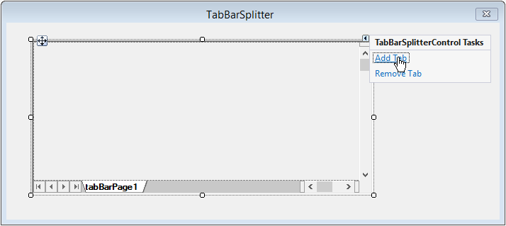
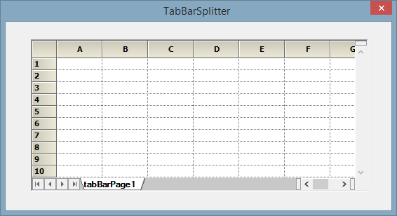
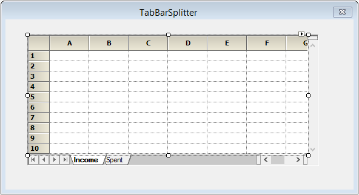
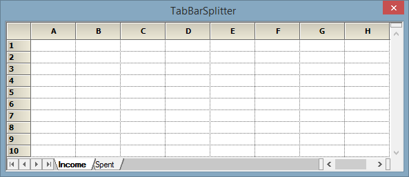
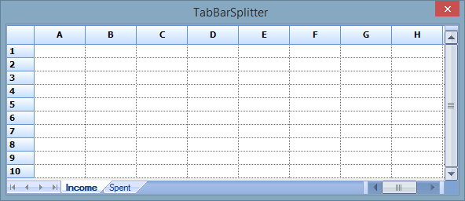
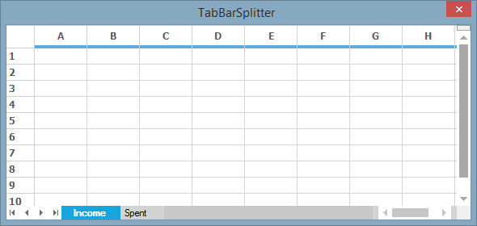
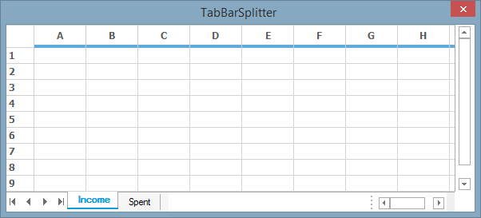
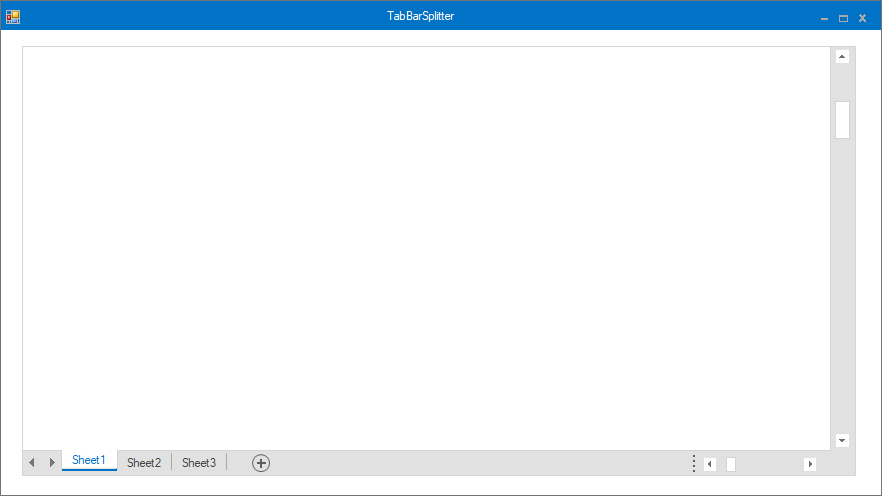
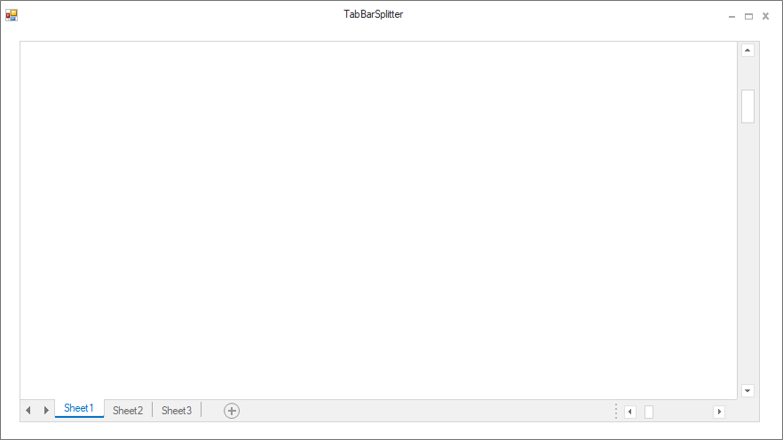

# TabBarSplitterControl
User can create TabBar Pages with dynamic splitters by using [TabBarSplitterControl](http://help.syncfusion.com/cr/windowsforms/Syncfusion.Windows.Forms.TabBarSplitterControl.html). When used with a GridControl, it gives a workbook like appearance. User can add more than one [TabBarPage](http://help.syncfusion.com/cr/windowsforms/Syncfusion.Windows.Forms.TabBarPage.html) and GridControl can be added in each page. This control is helpful when GridControl with formula cells and [Cross-Reference](http://help.syncfusion.com/windowsforms/grid/formula-support#named-ranges) sheets are used. The TabBarSplitterControl comes under the library [Syncfusion.Shared.Base](http://help.syncfusion.com/cr/windowsforms/) assembly.

## Adding via Designer

The following steps will explain on how to integrate a GridControl with the TabBarSplitterControl.

1.Drag and Drop the TabBarSplitterControl from the toolbox.

2.Drag the GridControl from toolbox and drop it on the TabBarSplitterControl.

3.It is also possible to add or remove `TabBarPage` through designer by using the `Edit` option in designer mode.

It can also be added or removed through the **TabBarPageCollectionEditor** which can be accessed through the `TabBarPage` property in the property window.

4.After adding `TabBarPage`, GridControl can be added in these pages by just drag and drop the control over them.

## Adding via Code

Create a new TabBarSplitterControl and add the required number of [TabBarPage](http://help.syncfusion.com/cr/windowsforms/Syncfusion.Windows.Forms.TabBarPage.html) in this control. Add the existing GridControl in the created `TabBarPage`. Refer the below code on how to initialize a TabBarSplitterControl and how to add `TabBarPage` with GridControl in it.



// Initialize a TabBarSplitterControl.
TabBarSplitterControl tabBarSplitterControl1 = new TabBarSplitterControl();

// Initialize required number of TabBarPage.
TabBarPage Income = new TabBarPage();
TabBarPage Spent = new TabBarPage();

//Add a new GridControl in the TabBarPage named Income.
Income.Text = "Income";
Income.Controls.Add(new GridControl());

//Add a new GridControl in the TabBarPage named Spent.
Spent.Text = "Spent";
Spent.Controls.Add(new GridControl());

//Add the TabBarPages to TabBarSplitterControl.
tabBarSplitterControl1.Controls.Add(Income);
tabBarSplitterControl1.Controls.Add(Spent);



'Create a TabBarPage Control.
Private Income As New Syncfusion.Windows.Forms.TabBarPage()
Private Spent As New Syncfusion.Windows.Forms.TabBarPage()

'Add the gridcontrol1 for Income page.
Income.Text = "Income"
Income.Controls.Add(Me.gridControl1)

'Add the gridcontrol2 for Spent page.
Spent.Text = "Spent"
Spent.Controls.Add(Me.gridControl2)

'Add the TabBarPages to TabBarSplitterControl.
tabBarSplitterControl1.Controls.Add(Me.Income)
tabBarSplitterControl1.Controls.Add(Me.Spent)



N> To know about TabBarSplitterControl properties and methods, please check the link over [here](http://help.syncfusion.com/windowsforms/splitter/overview).

## Visual Styles

TabBarSplitterControl gives support for adding visual styles similar to that of in GridControl. Visual style can be changed by using the [Style](https://help.syncfusion.com/cr/windowsforms/Syncfusion.Windows.Forms.TabBarSplitterControl.html#Syncfusion_Windows_Forms_TabBarSplitterControl_Style) property. 



//Default Theme.
tabBarSplitterControl1.Style = Syncfusion.Windows.Forms.TabBarSplitterStyle.Default;
gridControl1.GridVisualStyles = GridVisualStyles.SystemTheme;



'Default Theme.
tabBarSplitterControl1.Style = Syncfusion.Windows.Forms.TabBarSplitterStyle.Default
gridControl1.GridVisualStyles = GridVisualStyles.SystemTheme



For setting the Office 2007 styles theme, make use of the [Office2007ColorScheme](https://help.syncfusion.com/cr/windowsforms/Syncfusion.Windows.Forms.TabBarSplitterControl.html#Syncfusion_Windows_Forms_TabBarSplitterControl_Office2007ColorScheme) property and change the theme to blue, black or silver accordingly.



// Office2007 Blue theme.
tabBarSplitterControl1.Style = Syncfusion.Windows.Forms.TabBarSplitterStyle.Office2007;
gridControl1.GridVisualStyles = GridVisualStyles.Office2007Blue;
tabBarSplitterControl1.Office2007ColorScheme = Office2007Theme.Blue;



'Office2007 Blue theme.
tabBarSplitterControl1.Style = Syncfusion.Windows.Forms.TabBarSplitterStyle.Office2007
Office2007Theme.gridControl1.GridVisualStyles = GridVisualStyles.Office2007Blue
tabBarSplitterControl1.Office2007ColorScheme = Office2007Theme.Blue



For setting the Metro theme, set the `Style` property as `Metro` style appearance.



//Default Theme.
gridControl1.GridVisualStyles = GridVisualStyles.Metro;
tabBarSplitterControl1.Style = Syncfusion.Windows.Forms.TabBarSplitterStyle.Metro;



'Default Theme.
gridControl1.GridVisualStyles = GridVisualStyles.Metro
tabBarSplitterControl1.Style = Syncfusion.Windows.Forms.TabBarSplitterStyle.Metro



For setting the Office 2013 styles theme, make sure to set the [EnableOffice2013Style](https://help.syncfusion.com/cr/windowsforms/Syncfusion.Windows.Forms.TabBarSplitterControl.html#Syncfusion_Windows_Forms_TabBarSplitterControl_EnableOffice2013Style) property to `true` and set the TabBarSplitterControl `Style` as `Metro`.



// Office2013 theme style.
gridControl1.GridVisualStyles = GridVisualStyles.Metro;
tabBarSplitterControl1.EnableOffice2013Style = true;
tabBarSplitterControl1.Style = TabBarSplitterStyle.Metro;



'Office2013 theme style.
gridControl1.GridVisualStyles = GridVisualStyles.Metro
tabBarSplitterControl1.EnableOffice2013Style = True
tabBarSplitterControl1.Style = TabBarSplitterStyle.Metro



**Office2016Colorful**

This option helps to set the Office2016Colorful style.

#####  Code Sample





// Office2016Colorful

this.tabBarSplitterControl1.Style = Syncfusion.Windows.Forms.TabBarSplitterStyle.Office2016Colorful;





'Office2016Colorful

Me.tabBarSplitterControl1.Style = Syncfusion.Windows.Forms.TabBarSplitterStyle.Office2016Colorful





**Office2016White**

This option helps to set the Office2016White style.

#####  Code Sample





// Office2016White

this.tabBarSplitterControl1.Style = Syncfusion.Windows.Forms.TabBarSplitterStyle.Office2016White;





'Office2016White

Me.tabBarSplitterControl1.Style = Syncfusion.Windows.Forms.TabBarSplitterStyle.Office2016White





**Office2016DarkGray**

This option helps to set the Office2016DarkGray style.

#####  Code Sample





// Office2016DarkGray

this.tabBarSplitterControl1.Style = Syncfusion.Windows.Forms.TabBarSplitterStyle.Office2016DarkGray;





'Office2016DarkGray

Me.tabBarSplitterControl1.Style = Syncfusion.Windows.Forms.TabBarSplitterStyle.Office2016DarkGray





**Office2016Black**

This option helps to set the Office2016Black style.

#####  Code Sample





// Office2016Black

this.tabBarSplitterControl1.Style = Syncfusion.Windows.Forms.TabBarSplitterStyle.Office2016Black;





'Office2016Black

Me.tabBarSplitterControl1.Style = Syncfusion.Windows.Forms.TabBarSplitterStyle.Office2016Black





##Custom Styles

It is possible to apply custom color to the TabBarSplitterControl by setting `Office2007ColorScheme` property as `Managed`. The desired color can be chosen by using the [ApplyManagedColors](https://help.syncfusion.com/cr/windowsforms/Syncfusion.Windows.Forms.Office2007Colors.html#Syncfusion_Windows_Forms_Office2007Colors_ApplyManagedColors_System_Windows_Forms_Form_System_Drawing_Color_) method.



//Custom Color for TabBarSplitterControl.
this.tabBarSplitterControl1.Style = Syncfusion.Windows.Forms.TabBarSplitterStyle.Office2007;
this.tabBarSplitterControl1.Office2007ColorScheme = Syncfusion.Windows.Forms.Office2007Theme.Managed;
Syncfusion.Windows.Forms.Office2007Colors.ApplyManagedColors(this, Color.Aquamarine);



'Custom Color for TabBarSplitterControl.
Me.tabBarSplitterControl1.Style = Syncfusion.Windows.Forms.TabBarSplitterStyle.Office2007
Me.tabBarSplitterControl1.Office2007ColorScheme = Syncfusion.Windows.Forms.Office2007Theme.Managed
Syncfusion.Windows.Forms.Office2007Colors.ApplyManagedColors(Me, Color.Aquamarine)




