# TabBarSplitterControl in Windows Forms Grid Control
Users can create TabBar pages with dynamic splitters by using [TabBarSplitterControl](https://help.syncfusion.com/cr/windowsforms/Syncfusion.Windows.Forms.TabBarSplitterControl.html). When used with a GridControl, it gives a workbook-like appearance. Users can add more than one [TabBarPage](https://help.syncfusion.com/cr/windowsforms/Syncfusion.Windows.Forms.TabBarPage.html), and a GridControl can be added to each page. This control is helpful when a GridControl with formula cells and [Cross-Reference](https://help.syncfusion.com/windowsforms/grid/formula-support#named-ranges) sheets is used. The TabBarSplitterControl is available in the `Syncfusion.Shared.Base` assembly.

## Adding via Designer

The following steps explain how to integrate a GridControl with the TabBarSplitterControl.

1. Drag and Drop the TabBarSplitterControl from the toolbox.

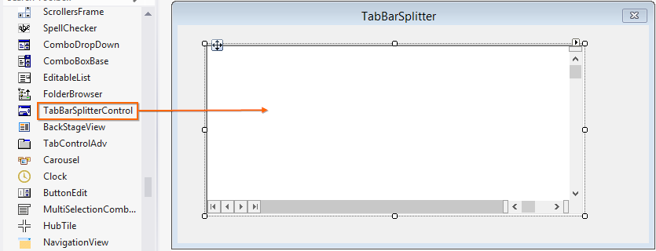

2. Drag the GridControl from the toolbox and drop it on the TabBarSplitterControl.

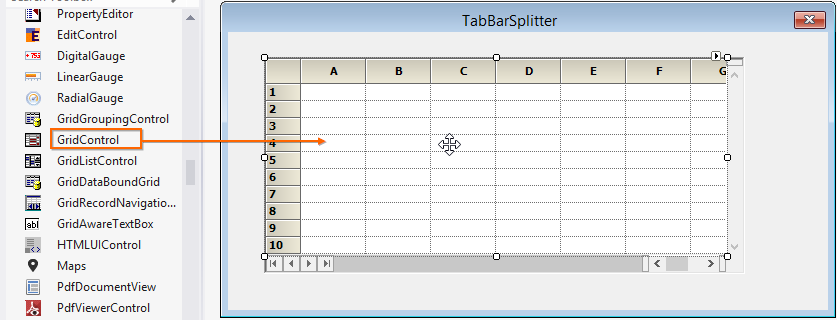

3. `TabBarPage` items can also be added or removed through the designer by using the `Edit` option in designer mode.

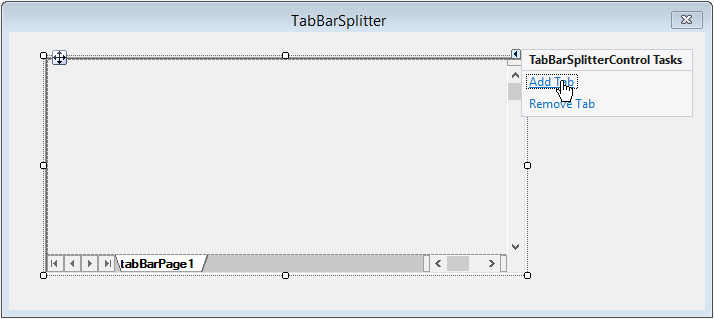

They can also be added or removed through the **TabBarPageCollectionEditor**, which can be accessed by using the `TabBarPage` property in the property window.

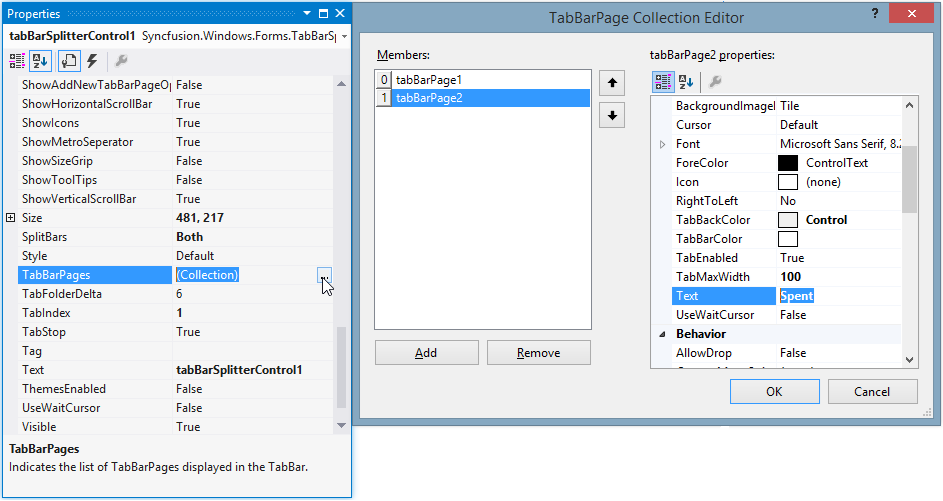

4. After adding a `TabBarPage`, a GridControl can be added to these pages by dragging and dropping the control over them.

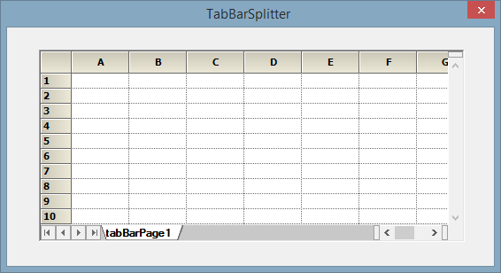

## Adding via Code

Create a new TabBarSplitterControl and add the required number of [TabBarPage](https://help.syncfusion.com/cr/windowsforms/Syncfusion.Windows.Forms.TabBarPage.html) to this control. Add the existing GridControl to the created `TabBarPage`. Refer to the following code to learn how to initialize a TabBarSplitterControl and how to add a `TabBarPage` with a GridControl in it.



// Initialize a TabBarSplitterControl.
TabBarSplitterControl tabBarSplitterControl1 = new TabBarSplitterControl();

// Initialize required number of TabBarPage.
TabBarPage Income = new TabBarPage();
TabBarPage Spent = new TabBarPage();

// Add a new GridControl in the TabBarPage named Income.
Income.Text = "Income";
Income.Controls.Add(new GridControl());

// Add a new GridControl in the TabBarPage named Spent.
Spent.Text = "Spent";
Spent.Controls.Add(new GridControl());

// Add the TabBarPages to TabBarSplitterControl.
tabBarSplitterControl1.Controls.Add(Income);
tabBarSplitterControl1.Controls.Add(Spent);



' Create a TabBarPage Control.
Private Income As New Syncfusion.Windows.Forms.TabBarPage()
Private Spent As New Syncfusion.Windows.Forms.TabBarPage()

' Add a new GridControl to the TabBarPage named Income
Income.Text = "Income"
Income.Controls.Add(New GridControl())

' Add a new GridControl to the TabBarPage named Spent.
Spent.Text = "Spent"
Spent.Controls.Add(New GridControl())

' Add the TabBarPages to TabBarSplitterControl.
tabBarSplitterControl1.Controls.Add(Income)
tabBarSplitterControl1.Controls.Add(Spent)



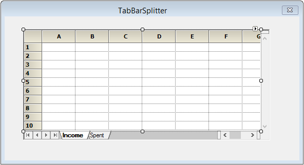

N> To know about TabBarSplitterControl properties and methods, please check the link over [here](http://help.syncfusion.com/windowsforms/splitter/overview).

## Visual Styles

TabBarSplitterControl provides support for visual styles similar to that of the GridControl. The visual style can be changed by using the [Style](https://help.syncfusion.com/cr/windowsforms/Syncfusion.Windows.Forms.TabBarSplitterControl.html#Syncfusion_Windows_Forms_TabBarSplitterControl_Style) property.



//Default Theme.
tabBarSplitterControl1.Style = Syncfusion.Windows.Forms.TabBarSplitterStyle.Default;
gridControl1.GridVisualStyles = GridVisualStyles.SystemTheme;



'Default Theme.
tabBarSplitterControl1.Style = Syncfusion.Windows.Forms.TabBarSplitterStyle.Default
gridControl1.GridVisualStyles = GridVisualStyles.SystemTheme



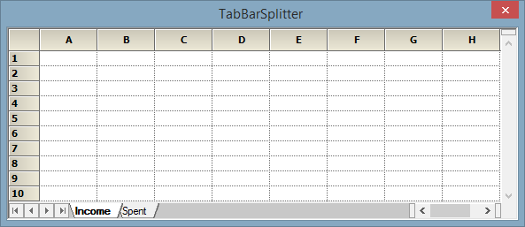

For setting the Office 2007 styles theme, make use of the [Office2007ColorScheme](https://help.syncfusion.com/cr/windowsforms/Syncfusion.Windows.Forms.TabBarSplitterControl.html#Syncfusion_Windows_Forms_TabBarSplitterControl_Office2007ColorScheme) property and change the theme to blue, black, or silver accordingly.



// Office2007 Blue theme.
tabBarSplitterControl1.Style = Syncfusion.Windows.Forms.TabBarSplitterStyle.Office2007;
gridControl1.GridVisualStyles = GridVisualStyles.Office2007Blue;
tabBarSplitterControl1.Office2007ColorScheme = Office2007Theme.Blue;



'Office2007 Blue theme.
tabBarSplitterControl1.Style = Syncfusion.Windows.Forms.TabBarSplitterStyle.Office2007
gridControl1.GridVisualStyles = GridVisualStyles.Office2007Blue
tabBarSplitterControl1.Office2007ColorScheme = Office2007Theme.Blue



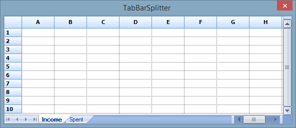

For setting the Metro theme, set the `Style` property as `Metro` style appearance.



// Metro Theme.
gridControl1.GridVisualStyles = GridVisualStyles.Metro;
tabBarSplitterControl1.Style = Syncfusion.Windows.Forms.TabBarSplitterStyle.Metro;



' Metro Theme.
gridControl1.GridVisualStyles = GridVisualStyles.Metro
tabBarSplitterControl1.Style = Syncfusion.Windows.Forms.TabBarSplitterStyle.Metro



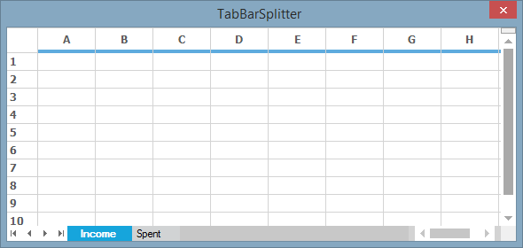

For setting the Office 2013 styles theme, make sure to set the [EnableOffice2013Style](https://help.syncfusion.com/cr/windowsforms/Syncfusion.Windows.Forms.TabBarSplitterControl.html#Syncfusion_Windows_Forms_TabBarSplitterControl_EnableOffice2013Style) property to `true` and set the TabBarSplitterControl `Style` as `Metro`.



// Office2013 theme style.
gridControl1.GridVisualStyles = GridVisualStyles.Metro;
tabBarSplitterControl1.EnableOffice2013Style = true;
tabBarSplitterControl1.Style = TabBarSplitterStyle.Metro;



'Office2013 theme style.
gridControl1.GridVisualStyles = GridVisualStyles.Metro
tabBarSplitterControl1.EnableOffice2013Style = True
tabBarSplitterControl1.Style = TabBarSplitterStyle.Metro



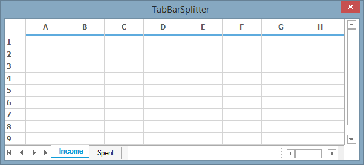

### Office2016Colorful

This option helps to set the Office2016Colorful style.





// Office2016Colorful

this.tabBarSplitterControl1.Style = Syncfusion.Windows.Forms.TabBarSplitterStyle.Office2016Colorful;





'Office2016Colorful

Me.tabBarSplitterControl1.Style = Syncfusion.Windows.Forms.TabBarSplitterStyle.Office2016Colorful





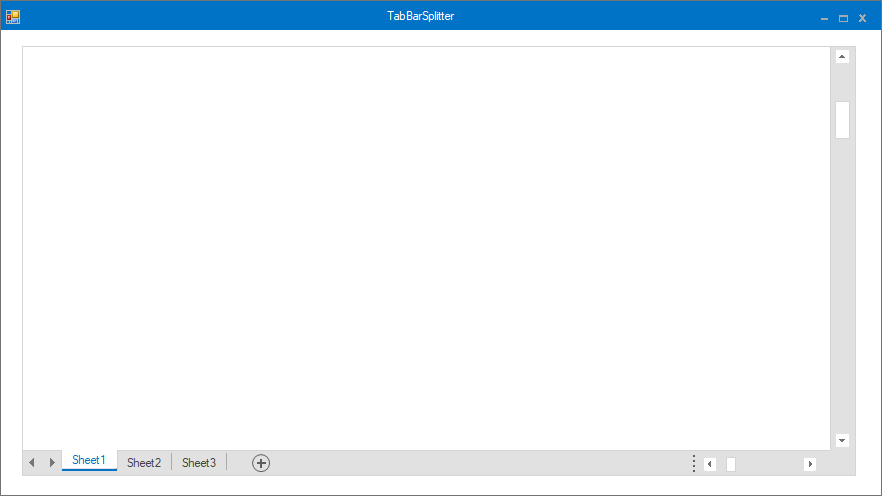

### Office2016White

This option helps to set the Office2016White style.





// Office2016White

this.tabBarSplitterControl1.Style = Syncfusion.Windows.Forms.TabBarSplitterStyle.Office2016White;





'Office2016White

Me.tabBarSplitterControl1.Style = Syncfusion.Windows.Forms.TabBarSplitterStyle.Office2016White





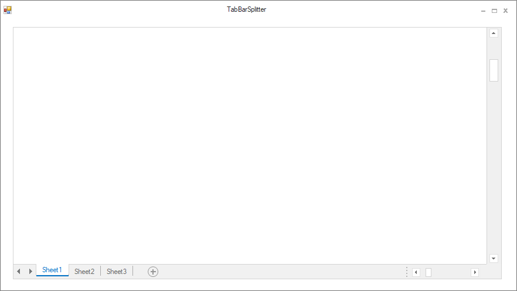

### Office2016DarkGray

This option helps to set the Office2016DarkGray style.





// Office2016DarkGray

this.tabBarSplitterControl1.Style = Syncfusion.Windows.Forms.TabBarSplitterStyle.Office2016DarkGray;





'Office2016DarkGray

Me.tabBarSplitterControl1.Style = Syncfusion.Windows.Forms.TabBarSplitterStyle.Office2016DarkGray





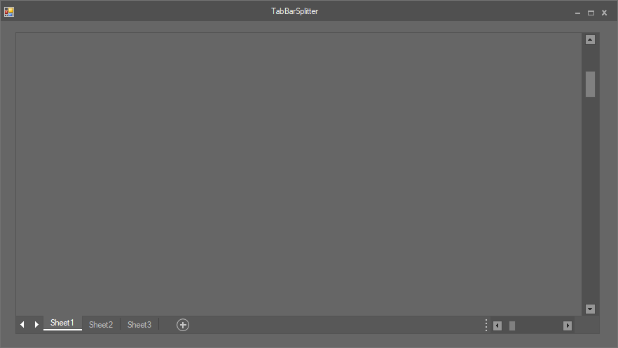

### Office2016Black

This option helps to set the Office2016Black style.





// Office2016Black

this.tabBarSplitterControl1.Style = Syncfusion.Windows.Forms.TabBarSplitterStyle.Office2016Black;





'Office2016Black

Me.tabBarSplitterControl1.Style = Syncfusion.Windows.Forms.TabBarSplitterStyle.Office2016Black





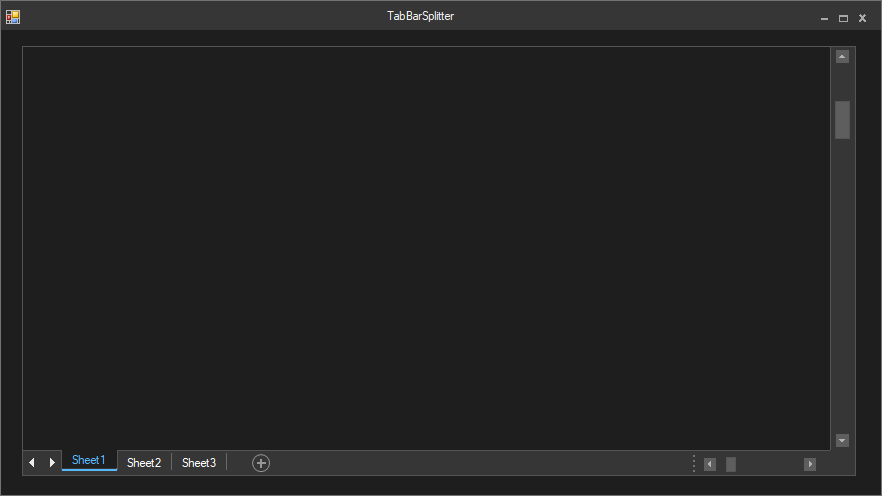

## Custom Styles

It is possible to apply a custom color to the TabBarSplitterControl by setting the `Office2007ColorScheme` property as `Managed`. The desired color can be chosen by using the [ApplyManagedColors](https://help.syncfusion.com/cr/windowsforms/Syncfusion.Windows.Forms.Office2007Colors.html#Syncfusion_Windows_Forms_Office2007Colors_ApplyManagedColors_System_Windows_Forms_Form_System_Drawing_Color_) method.



//Custom Color for TabBarSplitterControl.
this.tabBarSplitterControl1.Style = Syncfusion.Windows.Forms.TabBarSplitterStyle.Office2007;
this.tabBarSplitterControl1.Office2007ColorScheme = Syncfusion.Windows.Forms.Office2007Theme.Managed;
Syncfusion.Windows.Forms.Office2007Colors.ApplyManagedColors(this, Color.Aquamarine);



'Custom Color for TabBarSplitterControl.
Me.tabBarSplitterControl1.Style = Syncfusion.Windows.Forms.TabBarSplitterStyle.Office2007
Me.tabBarSplitterControl1.Office2007ColorScheme = Syncfusion.Windows.Forms.Office2007Theme.Managed
Syncfusion.Windows.Forms.Office2007Colors.ApplyManagedColors(Me, Color.Aquamarine)




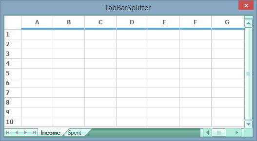
