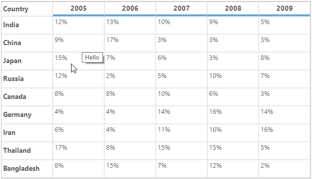
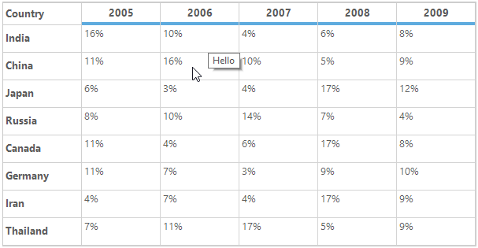
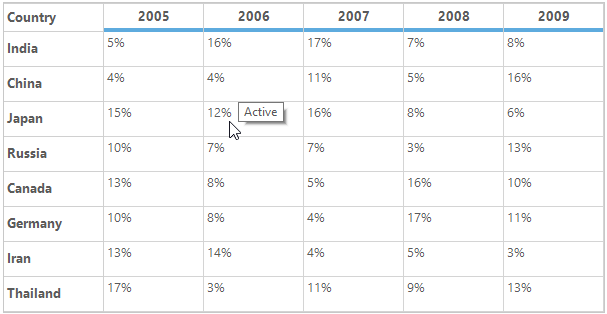
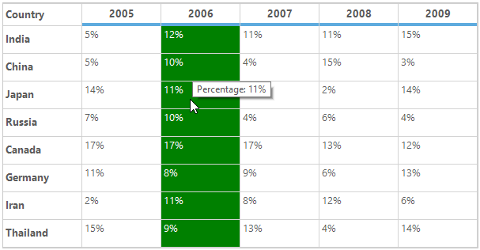

# ToolTip in Windows Forms Grid Control

ToolTip can be added to the individual cells. This allows a user to show more information about the particular cell on mouse hover.

## Adding ToolTip

The ToolTip can be added to the particular cell by setting the [CellTipText](https://help.syncfusion.com/cr/windowsforms/Syncfusion.Windows.Forms.Grid.GridStyleInfo.html#Syncfusion_Windows_Forms_Grid_GridStyleInfo_CellTipText) property of a cell. The tool tip text will be displayed in the tool tip.



//Set the ToolTip text for particular cell.
this.gridControl1[2, 2].CellTipText = "Hello";


'Set the ToolTip text for particular cell.
Me.gridControl1(2, 2).CellTipText = "Hello"



### Adding ToolTip to Column

The ToolTip can be added to the specific column by setting the `CellTipText` property of the [ColStyles](https://help.syncfusion.com/cr/windowsforms/Syncfusion.Windows.Forms.Grid.GridControl.html#Syncfusion_Windows_Forms_Grid_GridControl_ColStyles) property.



//Adding ToolTip to the specific column
this.gridControl1.ColStyles[1].CellTipText = "Hello";


'Adding ToolTip to the specific column
Me.gridControl1.ColStyles(1).CellTipText = "Hello"



### Adding ToolTip to Row

The ToolTip can be added to specific row by setting the `CellTipText` property of the [RowStyles](https://help.syncfusion.com/cr/windowsforms/Syncfusion.Windows.Forms.Grid.GridControl.html#Syncfusion_Windows_Forms_Grid_GridControl_RowStyles) property.



//Adding ToolTip to the specific row
this.gridControl1.RowStyles[2].CellTipText = "Hello";


'Adding ToolTip to the specific row
Me.gridControl1.RowStyles(2).CellTipText = "Hello"



### Adding ToolTip using QueryCellInfo Event

The ToolTip can be added conditionally to the specific cell or row or column by using the [QueryCellInfo](https://help.syncfusion.com/cr/windowsforms/Syncfusion.Windows.Forms.Grid.GridControl.html) event.



this.gridControl1.QueryCellInfo += gridControl1_QueryCellInfo;

void gridControl1_QueryCellInfo(object sender, GridQueryCellInfoEventArgs e)
{
    // Enabling comment tip for particular cell.
    if (e.RowIndex == 1 && e.ColIndex == 1)
        e.Style.CellTipText = "Cell comment";

    // Enabling comment tip for row.
    if (e.ColIndex > 0 && e.RowIndex == 5)
        e.Style.CellTipText = "Row comment";

    // Enabling comment tip for column.
    if (e.RowIndex > 0 && e.ColIndex == 4)
        e.Style.CellTipText = "Column comment";
}


AddHandler gridControl1.QueryCellInfo, AddressOf gridControl1_QueryCellInfo

Private Sub gridControl1_QueryCellInfo(ByVal sender As Object, ByVal e As GridQueryCellInfoEventArgs)

'Enabling comment tip for particular cell.
    If e.RowIndex = 1 AndAlso e.ColIndex = 1 Then
        e.Style.CellTipText = "Cell comment"
    End If

'Enabling comment tip for row.
    If e.ColIndex > 0 AndAlso e.RowIndex = 5 Then
        e.Style.CellTipText = "Row comment"
    End If

'Enabling comment tip for column.
    If e.RowIndex > 0 AndAlso e.ColIndex = 4 Then
        e.Style.CellTipText = "Column comment"
    End If
End Sub



N> The ToolTip will not be enabled for a cell if the `CellTipText` property of the cell is empty.

## Removing ToolTip

The ToolTip for the cell can be removed by using [ResetCellTipText](https://help.syncfusion.com/cr/windowsforms/Syncfusion.Windows.Forms.Grid.GridStyleInfo.html#Syncfusion_Windows_Forms_Grid_GridStyleInfo_ResetCellTipText) method. It will reset the `CellTipText` property to the default values.



//Reset ToolTip for the particular cell.
this.gridControl1[2, 2].ResetCellTipText();


'Reset ToolTip for the particular cell.
Me.gridControl1(2, 2).ResetCellTipText()



## Disabling ToolTip for Control

The displaying of ToolTip on mouse hover for control can be restricted by setting the `Active` property of `CellToolTip` to `false`.



//Disable the ToolTip for GridControl.
this.gridControl1.CellToolTip.Active = false;


'Disable the ToolTip for GridControl.
Me.gridControl1.CellToolTip.Active = False



## Setting ToolTip Delay Time

The below properties are used to set the ToolTip delay time.

* [AutoPopDelay](https://docs.microsoft.com/en-us/dotnet/api/system.windows.forms.tooltip.autopopdelay?view=net-5.0)
* [InitialDelay](https://docs.microsoft.com/en-us/dotnet/api/system.windows.forms.tooltip.initialdelay?view=net-5.0)
* [ReshowDelay](https://docs.microsoft.com/en-us/dotnet/api/system.windows.forms.tooltip.reshowdelay?view=net-5.0)
* [AutomaticDelay](https://docs.microsoft.com/en-us/dotnet/api/system.windows.forms.tooltip.automaticdelay?view=net-5.0)

### AutoPopDelay

The `CellToolTip.AutoPopDelay` property enables you to shorten or lengthen the time that the `ToolTip` is displayed when the pointer is on a control. User can increase the value of this property to ensure that the user has sufficient time to read the text. The maximum time you can delay a popup is 5000 milliseconds.



//Set the ToolTip display time.
this.gridControl1.CellToolTip.AutoPopDelay = 5000;


'Set the ToolTip display time.
Me.gridControl1.CellToolTip.AutoPopDelay = 5000



### InitialDelay

The `CellToolTip.InitialDelay` property enables you to shorten or lengthen the time that the `ToolTip` waits before displaying a ToolTip. User can use this property to ensure that the user has ToolTips displayed quickly by shortening the time specified. The value for this property cannot exceed 32767.



//Set the ToolTip Initial delay time.
this.gridControl1.CellToolTip.InitialDelay = 1000;


'Set the ToolTip Initial delay time.
Me.gridControl1.CellToolTip.InitialDelay = 1000



### ReshowDelay

The `CellToolTip.ReshowDelay` property enables you to shorten or lengthen the time that the `ToolTip` waits before displaying a ToolTip after a previous ToolTip is displayed. 

When a ToolTip is currently being displayed and the user moves the pointer to another control that displays a ToolTip, the value of the `CellToolTip.ReshowDelay` property is used before showing the ToolTip for the new control. 

The ToolTip from the previous control must still be displayed in order for the delay specified in the `CellToolTip.ReshowDelay` property to be used; otherwise the `CellToolTip.InitialDelay` property value is used.



//Set the ToolTip reshow delay time.
this.gridControl1.CellToolTip.ReshowDelay = 500;


'Set the ToolTip reshow delay time.
Me.gridControl1.CellToolTip.ReshowDelay = 500



### AutomaticDelay

The `AutomaticDelay` property enables you to set a single delay value, which is then used to set the values of the *AutoPopDelay* , *InitialDelay*, and *ReshowDelay* properties. Each time the `CellToolTip.AutomaticDelay` property is set, the following values are set by default.

<table>
<tr>
<td>
<b>Property</b>  </td><td>
<b>Default Values</b>  </td></tr>
<tr>
<td>
AutoPopDelay  </td><td>
10 times the AutomaticDelay value.  </td></tr>
<tr>
<td>
InitialDelay  </td><td>
Equal to the AutomaticDelay value.  </td></tr>
<tr>
<td>
ReshowDelay  </td><td>
1/5 of the AutomaticDelay value.  </td></tr>
</table>


//Set the delay time for ToolTip
this.gridControl1.CellToolTip.AutomaticDelay = 1000;


'Set the delay time for ToolTip
Me.gridControl1.CellToolTip.AutomaticDelay = 1000



## Event

### ActivateToolTip

[ActivateToolTip](https://help.syncfusion.com/cr/windowsforms/Syncfusion.Windows.Forms.Grid.Grouping.GridTableControl.html) event will be triggered when the mouse hovers on a cell which has the valid [CellTipText](https://help.syncfusion.com/cr/windowsforms/Syncfusion.Windows.Forms.Grid.GridStyleInfo.html#Syncfusion_Windows_Forms_Grid_GridStyleInfo_CellTipText) (`CellTipText` should not be empty).



this.gridControl1.ActivateToolTip += GridControl1_ActivateToolTip;

private void GridControl1_ActivateToolTip(object sender, GridActivateToolTipEventArgs e)
{
    e.Style.CellTipText = "Active";
}


AddHandler gridControl1.ActivateToolTip, AddressOf GridControl1_ActivateToolTip

Private Sub GridControl1_ActivateToolTip(ByVal sender As Object, ByVal e As GridActivateToolTipEventArgs)
    e.Style.CellTipText = "Active"
End Sub



## Disabling the ToolTip for particular cell

The displaying of ToolTip on mouse hover for particular cells can be restricted by canceling the `ActivateToolTip` event instead of setting the empty string to `CellTipText` property.



this.gridControl1.ActivateToolTip += GridControl1_ActivateToolTip;

private void GridControl1_ActivateToolTip(object sender, GridActivateToolTipEventArgs e)
{

//Disable the ToolTip for particular cell.
    if (e.ColIndex == 3 && e.RowIndex == 3)
    {
        e.Cancel = true;
    }
}


AddHandler gridControl1.ActivateToolTip, AddressOf GridControl1_ActivateToolTip

Private Sub GridControl1_ActivateToolTip(ByVal sender As Object, ByVal e As GridActivateToolTipEventArgs)

'Disable the ToolTip for particular cell.
    If e.ColIndex = 3 AndAlso e.RowIndex = 3 Then
        e.Cancel = True
    End If
End Sub



## Identify whether Cell has ToolTip

To identify whether the cell has ToolTip or not, [HasCellTipText](https://help.syncfusion.com/cr/windowsforms/Syncfusion.Windows.Forms.Grid.GridStyleInfo.html#Syncfusion_Windows_Forms_Grid_GridStyleInfo_HasCellTipText) property can be used in the `QueryCellStyleInfo` event. 

The below code illustrates that back color and text color are changed for the cells which has ToolTip.



this.gridControl1.QueryCellInfo += gridControl1_QueryCellInfo; 

void gridControl1_QueryCellInfo(object sender, GridQueryCellInfoEventArgs e)
{

//Checking whether the cell has ToolTip or not.
    if (e.Style.HasCellTipText)
    {
        e.Style.BackColor = Color.Green;
        e.Style.TextColor = Color.White;
    }
}


AddHandler gridControl1.QueryCellInfo, AddressOf gridControl1_QueryCellInfo

Private Sub gridControl1_QueryCellInfo(ByVal sender As Object, ByVal e As GridQueryCellInfoEventArgs)

'Checking whether the cell has ToolTip or not.
    If e.Style.HasCellTipText Then
        e.Style.BackColor = Color.Green
        e.Style.TextColor = Color.White
    End If
End Sub



