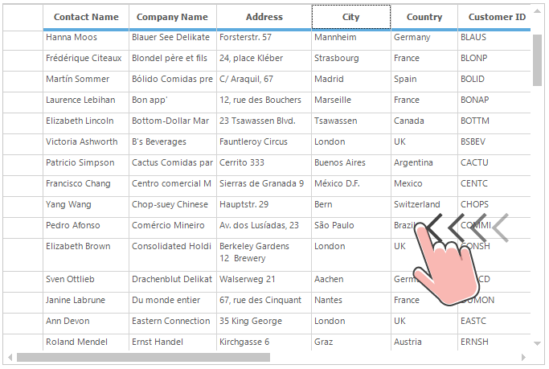

---
layout: post
title: Touch Support in Windows Forms Grid Control | Syncfusion®
description: Learn about Touch Support support in Syncfusion® Windows Forms Grid Control, its elements and more details.
platform: WindowsForms
control: GridControl
documentation: ug
--- 

# Touch Support in Windows Forms Grid Control
GridControl provides the swipe scrolling, panning, zooming and touch selection (bubble selection) touch support. The touch support for grid can be enabled by setting the [EnableTouchMode](https://help.syncfusion.com/cr/windowsforms/Syncfusion.Windows.Forms.Grid.GridControl.html#Syncfusion_Windows_Forms_Grid_GridControl_EnableTouchMode) property to `true`. This will enable the grid to support the swiping, panning, touch selection (bubble selection) and zooming. The default value of `EnableTouchMode` property is `false`.


//Enable the touch mode
this.gridControl1.EnableTouchMode = true;


'Enable the touch mode
Me.gridControl1.EnableTouchMode = True



## Touch Swiping
GridControl provides the swipe scrolling support in both horizontal and vertical directions.

N> To have the proper horizontal and vertical pixel touch scrolling, the [HScrollPixel](https://help.syncfusion.com/cr/windowsforms/Syncfusion.Windows.Forms.Grid.GridControlBase.html#Syncfusion_Windows_Forms_Grid_GridControlBase_HScrollPixel) and [VScrollPixel](https://help.syncfusion.com/cr/windowsforms/Syncfusion.Windows.Forms.Grid.GridControlBase.html#Syncfusion_Windows_Forms_Grid_GridControlBase_VScrollPixel) properties should be set to `true`.

## Touch Zooming
GridControl allows to perform the touch zoom in or out to the entire grid by initializing [ZoomGrid](https://help.syncfusion.com/cr/windowsforms/Syncfusion.GridHelperClasses.ZoomGrid.html#) class where the constructor takes a parameter as a `GridControl` object.
To have this touch zooming support in grid, the [GridHelperClasses.Windows](https://help.syncfusion.com/cr/windowsforms/Syncfusion.GridHelperClasses.html#) assembly needs to be added into the assembly reference. 


//Initialize the Zooming to GridControl
ZoomGrid zoomGrid = new ZoomGrid(this.gridControl1);


'Initialize the Zooming to GridControl
Dim zoomGrid As New ZoomGrid(Me.gridControl1)



N> The GridControl does not allow to perform the touch zoom in or out operations when current cell is in editing mode.

## Touch Selection
The touch selection support as like Excel can be enabled by setting the `EnableTouchMode` property to `true` and also the Excel-like selection frame and Excel-like current cell options needs to be enabled to enable the touch selection support.
To enable Excel-like selection frame in the grid, the [ExcelLikeSelectionFrame](https://help.syncfusion.com/windowsforms/grid/ms-excel-like-features#excel-like-selection-frame) property can be used and to have the Excel-like current cell in the grid, set the [ExcelLikeCurrentCell](https://help.syncfusion.com/windowsforms/grid/ms-excel-like-features#excel-like-current-cell) property to `true`.


//Enable the Excel like selection frame to the GridControl
this.gridControl1.ExcelLikeSelectionFrame = true;

//Enable Excel like current cell in Grid 
this.gridControl1.ExcelLikeCurrentCell = true;


'Enable the Excel like selection frame to the GridControl
Me.gridControl1.ExcelLikeSelectionFrame = True

'Enable Excel like current cell in Grid 
Me.gridControl1.ExcelLikeCurrentCell = True



N> The GridControl does not allow to perform the touch selection operation in 2003 Excel like selection frame. And also grid does not allow to perform the touch selection operations when current cell is in editing mode. This can be avoid by setting the [ActivateCurrentCellBehavior](https://help.syncfusion.com/cr/windowsforms/Syncfusion.Windows.Forms.Grid.GridControl.html#Syncfusion_Windows_Forms_Grid_GridControl_ActivateCurrentCellBehavior) property to `GridCellActivateAction.DblClickOnCell` or `GridCellActivateAction .None` option.

### Disabling the Touch Selection
The touch selection can be disabled by setting the [ShowTouchIndicator](https://help.syncfusion.com/cr/windowsforms/Syncfusion.Windows.Forms.Grid.GridControlBase.html#Syncfusion_Windows_Forms_Grid_GridControlBase_ShowTouchIndicator) property to `false`. The default value of `ShowTouchIndicator` property is `true`. 


//Disable the touch indicator
this.gridControl1.ShowTouchIndicator = false;


'Disable the touch indicator
Me.gridControl1.ShowTouchIndicator = False



