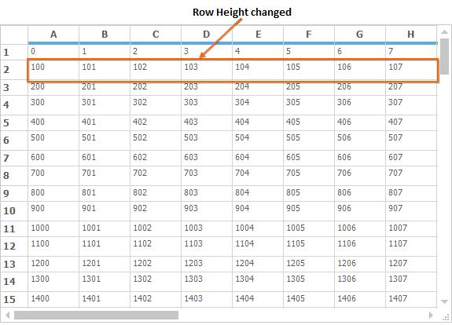
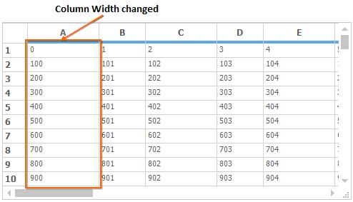
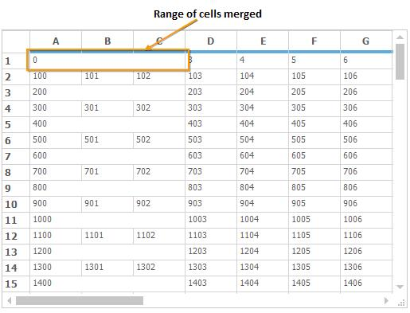

# Virtual Grid in Windows Forms Grid Control

Virtual Grid is designed to display very large amount of data extremely fast. In a virtual grid, no cell data is stored in [GridStyleInfo](https://help.syncfusion.com/cr/windowsforms/Syncfusion.Windows.Forms.Grid.GridStyleInfo.html#) objects or any other internal grid storage. All information is provided on demand through handled events. This walkthrough will explain how to create a virtual grid and all the events that are required to accomplish it, in `GridControl`.

## Getting Started

This section explains about creating data source and how to initialize a virtual grid.

### Creating a Data Source

User can set any external data source that can return value based on the row column parameters that are passed to it. In addition, external data source should have knowledge of the number of rows and columns.

The external data source will be a class with two public properties (`RowCount` and `ColCount`) and two-parameter class indexer that will return the integer value associated with two integers (row and column) passed in as indexes. Add a class named `ExternalData` into the project. This class simply provides data on demand. How it stores it or how it gets it, plays no role in a virtual grid.

Notice that the constructor accepts row and column count, and then populates an integer array. User can modify this class in any way as long as you define the class indexer and `RowCount` and `ColCount` properties, so that the virtual grid can access the data when needed.

N> The `ExternalData` class is just a model class. Any additional properties or methods can be used in this class but the basic structure should not be changed. For example the RowCount and ColCount properties.



class ExternalData
{
    private int _rowCount;
    private int _colCount;
    private int[,] _data;

    public ExternalData(int rows, int cols)
    {
        //Sets number of rows and columns.
        _rowCount = rows;
        _colCount = cols;

        //Allocates memory to store data values.
        _data = new int[_rowCount, _colCount];

        // Sets the data. 
        for (int i = 0; i < RowCount; ++i)
        for (int j = 0; j < ColCount; ++j)
        _data[i, j] = 100 * i + j;
    }

//Sets Properties.
public virtual int this[int row, int col]
{
    get { return _data[row, col]; }
    set { _data[row, col] = value; }
}

public virtual int RowCount
{
    get { return _rowCount; }
}

public virtual int ColCount
{
    get { return _colCount; }
}
}



Friend Class ExternalData

Private _rowCount As Integer

Private _colCount As Integer

Private _data(,) As Integer

Public Sub New(ByVal rows As Integer, ByVal cols As Integer)

'Sets number of rows and columns.
_rowCount = rows
_colCount = cols

'Allocates memory to store data values.
_data = New Integer(_rowCount - 1, _colCount - 1){}

'Sets the data. 
For i As Integer = 0 To RowCount - 1
For j As Integer = 0 To ColCount - 1

_data(i, j) = 100 * i + j
Next j
Next i
End Sub

'Sets Properties.
Default Public Overridable Property Item(ByVal row As Integer, ByVal col As Integer) As Integer
Get
Return _data(row, col)
End Get
Set(ByVal value As Integer)
_data(row, col) = value
End Set
End Property

Public Overridable ReadOnly Property RowCount() As Integer
Get
Return _rowCount
End Get
End Property

Public Overridable ReadOnly Property ColCount() As Integer
Get
Return _colCount
End Get
End Property

End Class



### Initializing a Virtual Grid

To add and initialize the virtual grid in an application, below steps need to be followed.

1. Drag GridControl from toolbox into the application. 

2. Customize properties like `BorderStyle` etc., if needed. But don’t change the `RowCount` and `ColCount` values. These values will be provided dynamically as part of the virtual grid implementation.

3. Add the `ExternalData` member to the application.
   


//Adds an external data member.
private ExternalData _extData;



'Adds an external data member.
Private _extData As ExternalData



{{ codesnippet1 | OrderList_Indent_Level_1 }}

4. Initialize a new external data source with required number of rows and columns.  
   


//Creates a new external data source with 100 rows and 20 columns.
this._extData = new ExternalData(100, 20);

//Prepares the grid for virtual data.
gridControl1.ResetVolatileData();



'Creates a new external data source with 100 rows and 20 columns.
Me._extData = New ExternalData(100, 20)

'Prepares the grid for virtual data.
gridControl1.ResetVolatileData()



{{ codesnippet2 | OrderList_Indent_Level_1 }}

N> The call to [ResetVolatileData](https://help.syncfusion.com/cr/windowsforms/Syncfusion.Windows.Forms.Grid.GridControl.html#Syncfusion_Windows_Forms_Grid_GridControl_ResetVolatileData) tells the grid that it needs to reset properties like `RowCount` and `ColCount` the next time when they are needed. This will allow the event handlers to set these values.

5. For setting the number of rows and columns in the Virtual Grid, [QueryRowCount](https://help.syncfusion.com/cr/windowsforms/Syncfusion.Windows.Forms.Grid.GridModel.html) and [QueryColCount](https://help.syncfusion.com/cr/windowsforms/Syncfusion.Windows.Forms.Grid.GridModel.html) event has to be used respectively. 



gridControl1.QueryRowCount += gridControl1_QueryRowCount;

void gridControl1_QueryRowCount(object sender, GridRowColCountEventArgs e)
{

//Determines number of rows.
e.Count = 100;
e.Handled = true;
}
gridControl1.QueryColCount += gridControl1_QueryColCount;

void gridControl1_QueryColCount(object sender, GridRowColCountEventArgs e)
{

//Determines number of columns.
e.Count = 20;
e.Handled = true;
}



Private gridControl1.QueryRowCount += AddressOf gridControl1_QueryRowCount

Private Sub gridControl1_QueryRowCount(ByVal sender As Object, ByVal e As GridRowColCountEventArgs)

'Determines number of rows.
e.Count = 100
e.Handled = True
End Sub

Private gridControl1.QueryColCount += AddressOf gridControl1_QueryColCount

Private Sub gridControl1_QueryColCount(ByVal sender As Object, ByVal e As GridRowColCountEventArgs)

'Determines number of columns.
e.Count = 20
e.Handled = True
End Sub



{{ codesnippet3 | OrderList_Indent_Level_1 }}

6. To add data in a Virtual Grid, [QueryCellInfo](https://help.syncfusion.com/cr/windowsforms/Syncfusion.Windows.Forms.Grid.GridModel.html) event has to be used. This event is used to provide `GridStyleInfo` object for a given cell. 
  The [CellValue](https://help.syncfusion.com/cr/windowsforms/Syncfusion.Windows.Forms.Grid.GridStyleInfo.html#Syncfusion_Windows_Forms_Grid_GridStyleInfo_CellValue) property of the `GridStyleInfo` object holds the data. All the changes made in this event is done in on-demand basis and not stored in any internal storage.



void gridControl1_QueryCellInfo(object sender, GridQueryCellInfoEventArgs e)
{
if (e.ColIndex > 0 && e.RowIndex > 0)
{

//By using indexers, pass value to a cell from a given data source.
e.Style.CellValue = this.intArray[e.RowIndex - 1, e.ColIndex - 1];
e.Handled = true;
}
}


 
Private Sub gridControl1_QueryCellInfo(ByVal sender As Object, ByVal e As GridQueryCellInfoEventArgs)
If e.ColIndex > 0 AndAlso e.RowIndex > 0 Then

'By using indexers, pass value to a cell from a given data source.
e.Style.CellValue = Me.intArray(e.RowIndex - 1, e.ColIndex - 1)
e.Handled = True
End If
End Sub



{{ codesnippet4 | OrderList_Indent_Level_1 }}

## Editing and Updating

Since virtual grid does not store data internally, it is not possible to update the cell values while changing the data dynamically. To overcome this, [SaveCellInfo](https://help.syncfusion.com/cr/windowsforms/Syncfusion.Windows.Forms.Grid.GridControl.html) event has to be used. This event will update/save values in virtual grid whenever any changes done in cells.



void gridControl1_SaveCellInfo(object sender, GridSaveCellInfoEventArgs e)
{
if (e.ColIndex > 0 && e.RowIndex > 0)
{

//Stores data back to the data source from the grid cell.
this._extData[e.RowIndex - 1, e.ColIndex - 1] = int.Parse(e.Style.CellValue.ToString());
e.Handled = true;
}
}



Private Sub gridControl1_SaveCellInfo(ByVal sender As Object, ByVal e As GridSaveCellInfoEventArgs)

If e.ColIndex > 0 AndAlso e.RowIndex > 0 Then

'Stores data back to the data source from the grid cell.

Me._extData(e.RowIndex - 1, e.ColIndex - 1) = Integer.Parse(e.Style.CellValue.ToString())
e.Handled = True

End If

End Sub



## Row Height

For changing the height of the row in the Virtual Grid, make use of the [QueryRowHeight](https://help.syncfusion.com/cr/windowsforms/Syncfusion.Windows.Forms.Grid.GridModel.html) event. This event is used to return row heights that are in demand. The `e.Size` property handles the height of the row.



this.gridControl1.QueryRowHeight += gridControl1_QueryRowHeight;

void gridControl1_QueryRowHeight(object sender, GridRowColSizeEventArgs e)
{
    //Set Row Heights for alternative rows.
    if (e.Index % 2 == 0)
    {
        //Determines Row Height.
        e.Size = 25;
        e.Handled = true;
    }
}



Me.gridControl1.QueryRowHeight += gridControl1_QueryRowHeight

Private Sub gridControl1_QueryRowHeight(ByVal sender As Object, ByVal e As GridRowColSizeEventArgs)
	
'Set Row Heights for alternative rows.
If e.Index Mod 2 = 0 Then
		
'Determines Row Height.
e.Size = 25
e.Handled = True
End If
End Sub



## Column Width

For changing the width of the column in the Virtual Grid, make use of the [QueryColWidth](https://help.syncfusion.com/cr/windowsforms/Syncfusion.Windows.Forms.Grid.GridModel.html) event. This event is used to return column widths that are in demand. The `e.Size` property handles the width.



this.gridControl1.QueryColWidth += gridControl1_QueryColWidth;

void gridControl1_QueryColWidth(object sender, GridRowColSizeEventArgs e)
{

//Set ColWidths for alternative columns.
if (e.Index % 2 == 1)
{

//Determines Column Width.
e.Size = 100;
e.Handled = true;
}                
}



Private Me.gridControl1.QueryColWidth += AddressOf gridControl1_QueryColWidth

Private Sub gridControl1_QueryColWidth(ByVal sender As Object, ByVal e As GridRowColSizeEventArgs)

'Set ColWidths for alternative columns.
If e.Index Mod 2 = 1 Then

'Determines Column Width.
e.Size = 100
e.Handled = True
End If
End Sub



## Covered Ranges

For merging range of cells in Virtual Grid use the [QueryCoveredRange](https://help.syncfusion.com/cr/windowsforms/Syncfusion.Windows.Forms.Grid.GridModel.html) event. This event is used to provide covered ranges on demand. The desired range of cells can be merged using the [e.Range](https://help.syncfusion.com/cr/windowsforms/Syncfusion.Windows.Forms.Grid.GridQueryCoveredRangeEventArgs.html#Syncfusion_Windows_Forms_Grid_GridQueryCoveredRangeEventArgs_Range) property.



this.gridControl1.QueryCoveredRange += gridControl1_QueryCoveredRange;

void gridControl1_QueryCoveredRange(object sender, GridQueryCoveredRangeEventArgs e)
{

//Covers odd rows, columns 1 through 3.
if (e.RowIndex % 2 == 1 && e.ColIndex >= 1 && e.ColIndex <= 3)
{
e.Range = GridRangeInfo.Cells(e.RowIndex, 1, e.RowIndex, 3);
e.Handled = true;
}
}



Private Me.gridControl1.QueryCoveredRange += AddressOf gridControl1_QueryCoveredRange

Private Sub gridControl1_QueryCoveredRange(ByVal sender As Object, ByVal e As GridQueryCoveredRangeEventArgs)

'Covers odd rows, columns 1 through 3.
If e.RowIndex Mod 2 = 1 AndAlso e.ColIndex >= 1 AndAlso e.ColIndex <= 3 Then
e.Range = GridRangeInfo.Cells(e.RowIndex, 1, e.RowIndex, 3)
e.Handled = True
End If
End Sub



## Refreshing the Grid

For refreshing the grid and to force the grid cells that are visible to reload all their data from the data source, make use of the [Model.ResetVolatileData](https://help.syncfusion.com/cr/windowsforms/Syncfusion.Windows.Forms.Grid.GridModel.html#Syncfusion_Windows_Forms_Grid_GridModel_ResetVolatileData) method.


// Refreshes the visible cells in grid.
this.gridControl1.Model.ResetVolatileData();



'Refreshes the visible cells in grid.
Me.gridControl1.Model.ResetVolatileData()



### Refreshing Grid for Particular Range

It is possible to refresh grid for a particular range by using the [RefreshRange](https://help.syncfusion.com/cr/windowsforms/Syncfusion.Windows.Forms.Grid.GridControlBase.html#Syncfusion_Windows_Forms_Grid_GridControlBase_RefreshRange_Syncfusion_Windows_Forms_Grid_GridRangeInfo_) method. Required range can be passed through this method by using the `GridRangeInfo` class. 


// Will refresh the cells of range (2, 2, 20, 20). 
this.gridControl1.RefreshRange(GridRangeInfo.Cells(2, 2, 20, 20));



'Will refresh the cells of range (2, 2, 20, 20). 
Me.gridControl1.RefreshRange(GridRangeInfo.Cells(2, 2, 20, 20))



