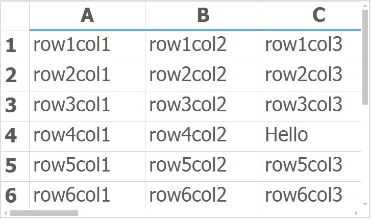
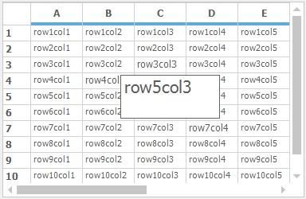

# Zooming in Windows Forms Grid Control

The GridControl allows the user to zoom in or out to the entire grid as well as the individual cells. To have this zooming support in grid, the [Syncfusion.GridHelperClasses.Windows.dll](https://help.syncfusion.com/cr/windowsforms/Syncfusion.GridHelperClassesWindowsAssembly.html) assembly needs to be added into the assembly reference.

## Grid Level Zooming

The grid can be zoomed to the specific percentage by using the [ZoomGrid](https://help.syncfusion.com/cr/windowsforms/Syncfusion.GridHelperClasses.ZoomGrid.html#Syncfusion_GridHelperClasses_ZoomGrid__ctor_Syncfusion_Windows_Forms_Grid_GridControl_) method. To get the actual zooming percentage after the grid gets zoomed, use the [GetCurrentZoomSize](https://help.syncfusion.com/cr/windowsforms/Syncfusion.GridHelperClasses.ZoomGrid.html#Syncfusion_GridHelperClasses_ZoomGrid_GetCurrentZoomSize_Syncfusion_Windows_Forms_Grid_GridControl_) method.  It will return the current zooming percentage of the grid.



//Enable zooming in GridControl
ZoomGrid zoom = new ZoomGrid(this.gridControl1);

//Zoom the grid with the specific percentage
zoom.zoomGrid("140");

//To get the current zoom size of the GridControl
int size = zoom.GetCurrentZoomSize(this.gridControl1);



'Enable zooming in GridControl
Dim zoom As New ZoomGrid(Me.gridControl1)

'Zoom the grid with the specific percentage
zoom.zoomGrid("140")

'To get the current zoom size of the GridControl
Dim size As Integer = zoom.GetCurrentZoomSize(Me.gridControl1)



## Cell Level Zooming

This facilitates to display the clicked cell content in a maximized form. This support can be enabled by setting [ZoomGrid.ZoomGridControlCell](https://help.syncfusion.com/cr/windowsforms/Syncfusion.GridHelperClasses.ZoomGrid.html#Syncfusion_GridHelperClasses_ZoomGrid_ZoomGridControlCell) property to `true`.



//To enable cell level zooming in GridControl
ZoomGrid.ZoomGridControlCell = true;



'To enable cell level zooming in GridControl
ZoomGrid.ZoomGridControlCell = True



N> The cell level zooming should be enabled for the grid only when the zooming percentage is `100`. 

