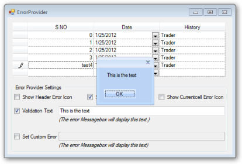

# Built-in Error Provider Support

Essential Grid for Windows Forms now provides a built-in error provider for error alerts. This feature enables you to display an error icon in a specific cell and row header when incorrect data is entered in a cell. This also enables you to specify the error conditions.

### Use Case Scenarios

This feature is useful when you want to set only numeric values to be entered in a cell. 

_Table 148: Error properties_

<table>
<tr>
<th>
PROPERTIES </th><th>
DESCRIPTION </th><th>
TYPE </th><th>
DATA TYPE </th></tr>
<tr>
<td>
ShowerrorIcon</td><td>
Specifies whether to show error icon. </td><td>
NA</td><td>
Boolean </td></tr>
<tr>
<td>
ShowRowHeaderErrorIcon</td><td>
Specifies whether to show error icon in the row header. </td><td>
NA</td><td>
Boolean </td></tr>
<tr>
<td>
ShowErrorMessageBox</td><td>
Specifies whether to show error message box.</td><td>
NA</td><td>
Boolean </td></tr>
<tr>
<td>
ValidationErrorText</td><td>
Specifies the text to be displayed in the error message box. </td><td>
NA</td><td>
Boolean </td></tr>
</table>

_Table 149: Methods_

<table>
<tr>
<th>
METHOD </th><th>
DESCRIPTION </th><th>
PARAMETERS </th><th>
TYPE </th><th>
RETURN TYPE </th></tr>
<tr>
<td>
SetError()</td><td>
</td><td>
Method (string)</td><td>
Method</td><td>
String </td></tr>
</table>

#### Sample Link

A sample of this feature is available in the following location:

#### GridDataBoundGrid

&lt;Install Location&gt;\Syncfusion\EssentialStudio\[Version Number]\Windows\GridDataBound.Windows\Samples\Appearance\Error Provider Demo

&lt;Install Location&gt;\Syncfusion\EssentialStudio\[Version Number]\Windows\Grid.Grouping.Windows\Samples\Styling and Formatting\Error Provider Demo                                                              

&lt;Install Location&gt;\Syncfusion\EssentialStudio\[Version Number]\Windows\Grid.Windows\Samples\Grid Layout\Error Provider Demo

## Enabling Error Alert

You can show an error icon or error message box as an alert for incorrect data. 

### Displaying Error Icon

You can show the error icon in the cell and row header using the ShowerrorIcon and the ShowRowHeaderErrorIcon properties respectively. 

To show the error icon in the cell, set ShowerrorIcon property to True. By default this will be set to True. To show the error icon in the row header, set ShowRowHeaderErrorIcon property to True. By default this will be set to False. You can display the error icon in the cell as well as a row header if needed. 

The following code illustrates how to display the error icon on both the cell as well as the row header:



this.gridDataBoundGrid1.CurrentCell.ShowerrorIcon = true;

this.gridDataBoundGrid1.ShowRowHeaderErrorIcon = true; 





Me.gridDataBoundGrid1.CurrentCell.ShowerrorIcon = True

Me.gridDataBoundGrid1.ShowRowHeaderErrorIcon = True



### Displaying Error Message Box

You can show an error dialog using ShowErrorMessageBox__property and specify the content to be displayed using the ValidationErrorText__property. 

The following code illustrates this:



this.gridDataBoundGrid1.CurrentCell.ShowErrorMessageBox= false;

this.gridDataBoundGrid1.CurrentCell.ValidationErrorText = "this is the text";





Me.gridDataBoundGrid1.CurrentCell.ShowErrorMessageBox= False

Me.gridDataBoundGrid1.CurrentCell.ValidationErrorText = "this is the text"



### Specifying Error Content

You can specify error conditions for individual cells using SetError() method of GridCurrentCell. 

The following code illustrates this:



this.gridDataBoundGrid1.CurrentCell.SetError("Please enter valid number");





Me.gridDataBoundGrid1.CurrentCell.SetError("Please enter valid number")

