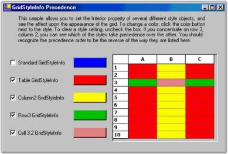
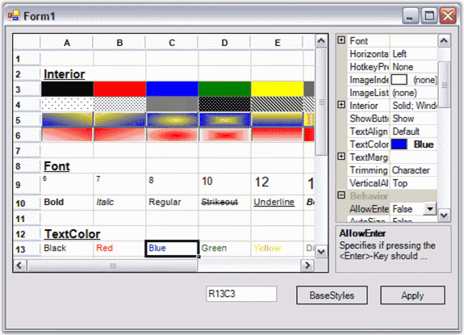
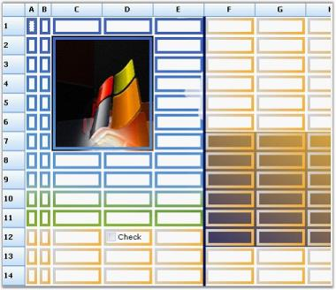
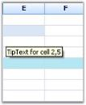

# Cell Style Architecture

The Essential Grid's cell style architecture plays an integral role in almost every aspect of Essential Grid. A basic understanding of this layered cell style architecture will help you understand and learn the grid behavior. This is particularly important when you are trying to modify or extend some existing functionality.

## GridStyleInfo Class Overview

Grid control can be thought of as a rectangular table of grid cells. Each cell contains distinct information and can be displayed independently of other cells. EssentiGrid uses GridStyleInfo objects to store state information about the appearance of a grid cell. So attributes like font, backcolor, cellvalue and celltype are all reflected in a single GridStyleInfo object.

Every cell in a grid may have such an object associated with it, giving the individual cell its unique appearance. It is not necessary that all cells should require fully populated GridStyleInfo objects stored in memory to function. And, for a given GridStyleInfo object, not all possible properties need to be populated in the object. So for example, a particular cell may or may not have a stored GridStyleInfo object, and if it does, this GridStyleInfo object may, or may not, contain a particular property such as Font.

In general, when Essential Grid needs a cell's state information, usually to draw the cell, it uses an inheritance process to generate a GridStyleInfo from several parent styles. The following parent styles are GridStyleInfo objects associated with particular grid entities:

* TableStyle is a single GridStyleInfo object that is associated with the entire grid.
* RowStyles are GridStyleInfo objects that are associated with each row.
* ColumnStyles are GridStyleInfo objects that are associated with each column.

These three GridStyleInfo objects may not be fully populated, meaning that some properties may have not been set. However, there is a fourth parent style referred as the StandardStyle, which is a fully populated style object, meaning every property has a setting in StandardStyle. So when Grid control needs to generate a composite GridStyleInfo object for a particular cell, it first looks at any property that may be specifically set in a stored cell GridStyleInfo (if one exists) for this cell. If there are properties not set in this cell-specific GridStyleInfo object, Grid control will then pick up the rowstyle GridStyleInfo for this cell. From this rowstyle, it will populate any property that was explicitly set in the RowStyle, and those that were not explicitly set in the cell-specific GridStyleInfo object. After adding on unset properties to the composite GridStyleInfo from the RowStyle, it does the same for columnstyle, tablestyle, and finally standardstyle. In this manner, Grid control comes up with a fully populated composite GridStyleInfo object to use.

The following graphic illustrates the effect of using the GridStyleInfo inheritance to come up with the appearance of a cell 3, 2. Even though BackColor property is set in each of the tablestyle, rowstyle and columnstyle objects, it is the cell specific style that determines the back color of the cell.

 

The next graphic shows the effect of removing BackColor property from cell specific style. In this case, it is the rowstyle that determines the back color setting for the displayed cell. If you remove the rowstyle setting for BackColor, then the columnstyle would contribute its BackColor property to determine the cell's displayed color. Run the GridStyleInfo sample to experiment using different parent styles.

  

     

### Properties

GridStyleInfo provides many properties to control the appearance and behavior of grid cells. The following table lists some of the properties.

Table 22: GridStyleInfo properties

<table>
<tr>
<th>
GRIDSTYLEINFO PROPERTIES</th><th>
DESCRIPTION</th></tr>
<tr>
<td>
String GridStyleInfo.Text</td><td>
Formatted string value of the cell.</td></tr>
<tr>
<td>
Object GridStyleInfo.CellValue</td><td>
Value of the object stored in the cell.</td></tr>
<tr>
<td>
BrushInfo GridStyleInfo.BackColor</td><td>
Back color of the cell.</td></tr>
<tr>
<td>
Color GridStyleInfo.TextColor</td><td>
Color of the displayed text.</td></tr>
<tr>
<td>
GridFontInfo GridStyleInfo.Font</td><td>
Font used to display the text.</td></tr>
<tr>
<td>
ImageList GridStyleInfo.ImageList</td><td>
Holds a list of images for use by the cell.</td></tr>
<tr>
<td>
Int GridStyleInfo.ImageIndex</td><td>
Picks a particular image from the ImageList property.</td></tr>
</table>

N> Refer to the GridStyleInfo topic in the Essential Grid Class Reference for a complete description of all the GridStyleInfo class members.

#### BackColor

BackColor property specifies the background color for the cell. If you want to use a special brush to get gradient background, you can use Interior property of GridStyleInfo to specify a brush that can be used to draw the cell background.

  

#### GridFontInfo

GridFontInfo class is an Essential Grid wrapper class for standard Systems.Drawing.Font class. Font property of the GridStyleInfo class specifies the font for the text displayed in the cell. The GridFontInfo class has special static members that enable you to easily modify font property members.

  

#### ImageList

ImageList property holds Systems.Windows.Forms.ImageList. Generally, there is one ImageListstored in the parent GridInfoStyle such as standardstyle or tablestyle. This single ImageListis shared by all cells in the grid through ImageIndex property, which has been set on cell-by-cell basis. 

  

#### Text and CellValue

Text and CellValue properties are closely related. You can set the value of either by using the other. The major difference is that Text property is a string and CellValue property is an object. This means, for example, that you can assign DateTime object to cell value, but you cannot assign it to a text. Grid control generally sets Text property by using CultureInfo formatting on CellValue property. Text property can also be set directly through code.

  

## BaseStyles

Grid control supports another parent-type style, BaseStyles, which is used to customize cell's appearance. BaseStyles are GridStyleInfo objects which can be associated with an arbitrary collection of cells. In a Word Processing software, there is the common task of defining a particular style (such as style Header1 representing a bold, 20-point Helvetica font), and then using it repeatedly in your document whenever you need a 'Header1' type. BaseStyles play the same role within Grid control. You can define BaseStyle named Header1 as having certain properties, and then you can place these properties onto any cell just by applying this BaseStyle Header1 to the cell. More importantly, if you want to change Header1 (for example, changing its BackColor property from white to red), you can make the change once by just changing Header1 BaseStyle, and not having to relabel every other cell assigned to this BaseStyle.

Since BaseStyles are considered parent styles, where do they fit within the precedence hierarchy that we have discussed above? BaseStyles are applied between the tablestyle and standardstyle. Thus, they are the 'weakest' styles other than the fully populated standardstyle. BaseStyles are stored in GridControl.BaseStylesMap class. In addition to the standardstyle, other BaseStyles used by all Essential Grids include Row Header, Header and Column Header. You can define and apply your own BaseStyles as well.

To work with BaseStyles from within the Visual Studio designer, you need to use the Edit base styles verb that appears at the bottom of the Grid control's property grid.

  

When you click Edit base styles verb, GridBaseStyle Collection Editor dialog box is displayed. You can use GridBaseStyle Collection Editor to edit existing BaseStyles or add new ones.

  

The following code example illustrates how to create BaseStyle. When you define BaseStyle you can apply it to any cell (or row or column) just by setting GridStyleInfo.BaseStyle for that cell to the name used to define BaseStyle.



//Adds a new base style.

GridBaseStyle gridBaseStyle1 = new GridBaseStyle("BackColorTest", false);

gridBaseStyle1.StyleInfo.BackColor = Color.SkyBlue;

gridBaseStyle1.StyleInfo.TextColor = Color.RosyBrown;

gridControl1.BaseStylesMap.AddRange(new GridBaseStyle[]{gridBaseStyle1});

...

//Applies this base style to a couple of cells.

gridControl1[1,2].BaseStyle = "BackColorTest";

gridControl1[4,2].BaseStyle = "BackColorTest";





'Adds a new base style.

Dim gridBaseStyle1 As GridBaseStyle = New GridBaseStyle("BackColorTest", False)

gridBaseStyle1.StyleInfo.BackColor = Color.SkyBlue

gridBaseStyle1.StyleInfo.TextColor = Color.RosyBrown

gridControl1.BaseStylesMap.AddRange(New GridBaseStyle() {gridBaseStyle1})

...

'Applies this base style to a couple of cells.

gridControl1(1, 2).BaseStyle = "BackColorTest"

gridControl1(4, 2).BaseStyle = "BackColorTest"


## GridRangeInfo

This class is used extensively to specify a collection of grid cells that are to be used as parameters for other method calls. GridRangeInfo class contains static methods that will allow you to specify a single cell, a rectangular range of cells, a row or rows, a column or columns, or the entire table.

Table 23: GridRangeInfo methods

<table>
<tr>
<th>
GRIDRANGEINFO METHOD</th><th>
DESCRIPTION</th></tr>
<tr>
<td>
GridRangeInfo.Cell(int row, int col)</td><td>
Returns the GridRangeInfo object with cell row, col.</td></tr>
<tr>
<td>
GridRangeInfo.Cells(int top, int left, int bottom, int right)</td><td>
Returns GridRangeInfo object containing rectangular collection of cells with top left cell (top, left) and bottom right cell (bot, right).</td></tr>
<tr>
<td>
GridRangeInfo.Row(int row)</td><td>
Returns GridRangeInfo object with row = row.</td></tr>
<tr>
<td>
GridRangeInfo.Rows(int fromRow, int toRow)</td><td>
Returns GridRangeInfo object containing rows fromRow through toRow.</td></tr>
<tr>
<td>
GridRangeInfo.Col(int col)</td><td>
Returns GridRangeInfo object with column col.</td></tr>
<tr>
<td>
GridRangeInfo.Cols(int fromCol, int toCol)</td><td>
Returns GridRangeInfo object containing columns fromCol through toCol.</td></tr>
<tr>
<td>
GridRangeInfo.Table()</td><td>
Returns GridRangeInfo object containing the whole table.</td></tr>
</table>
 

N>  For complete description of GridRangeInfo class, see the Essential Grid Class Reference.

## The GridControl.ChangeCells Method

GridControl.ChangeCells method is used to modify GridStyleInfo objects. This overloaded method accepts GridRangeInfo and GridStyleInfo objects. ChangeCells method depends upon the value of ModifyType parameter. Current GridStyleInfo settings are modified by using new GridStyleInfo settings that are present in CellInfo parameter, according to the value of the ModifyType parameter.



//Applies an array of styles to the specified range in grid.

public bool ChangeCells(GridRangeInfo range, GridStyleInfo cellInfo, StyleModifyType modifyType);





' Applies an array of styles to the specified range in grid.

Public Function ChangeCells(range As GridRangeInfo, cellInfo As GridStyleInfo, modifyType As StyleModifyType) As Boolean


## Activating Current Cell Behavior

When moving current cell or clicking inside a cell, you can control the current cell's activation behavior by using ActivateCurrentCellBehavior property. GridCellActivateAction enumeration defines when to set focus on the cell or toggle to edit mode for the current cell. Here is the list of options under GridCellActivateAction enumeration:

* ClickOnCell-Setting ActivateCurrentCellBehavior to this option sets the cell to editing mode or sets focus on the cell after user clicks the cell.
* DblClickOnCell-Setting ActivateCurrentCellBehavior to this option sets the cell to editing mode or sets focus on the cell when user double clicks the cell.
* None-Setting ActivateCurrentCellBehavior to this option deactivates the cell, even if the user clicks it.
* PositionCaret-Setting ActivateCurrentCellBehavior to this option sets the caret to be positioned at the character where the user clicks.
* SelectAll-Setting ActivateCurrentCellBehavior to this option sets the cell to editing mode or sets focus on the cell and keeps the entire text in the cell selected whenever it becomes the current cell irrespective of the click on the cell or movement over it using arrow keys.
* SetCurrent-Setting ActivateCurrentCellBehavior to this option sets the cell to editing mode or sets focus on the cell whenever it becomes the current cell irrespective of the click on the cell or movement over it using arrow keys.

The following code examples illustrate how to set the ActivateCurrentCellBehavior property:



this.gridControl1.ActivateCurrentCellBehavior = GridCellActivateAction.SelectAll;





Me.gridControl1.ActivateCurrentCellBehavior = GridCellActivateAction.SelectAll


## Scroll Cell into View

You can use grid method, ScrollCellInView, to scroll the specified cell or range into view. The range that should be scrolled into the visible grid view area is given as the parameter to this method. The following code examples illustrate this:



//Scrolls into view cell(2,2).

this.gridControl1.ScrollCellInView(GridRangeInfo.Cell(2, 2));

//Scrolls into view range Col(2).

this.gridControl1.ScrollCellInView(GridRangeInfo.Col(2));





'Scrolls into view cell(2,2).

Me.gridControl1.ScrollCellInView(GridRangeInfo.Cell(2, 2))

'Scrolls into view range Col(2).

Me.gridControl1.ScrollCellInView(GridRangeInfo.Col(2))


## Managing Current Cell Operations

GridCurrentCell class provides storage for current cell information and manages all the current cell operations such as activating, deactivating, saving, editing and moving the current cell.

The following code examples illustrate how to set a GridCurrentCell:



GridCurrentCell cc = this.gridControl1.CurrentCell;




Dim cc As GridCurrentCell = Me.gridControl1.CurrentCell


## Show/Hide Current Cell Border

ShowCurrentCellBorderBehavior property of the grid determines the behavior of the current cell's border. The GridShowCurrentCellBorder enumeration specifies display of current cell's frame or border. Here is the list of options in GridShowCurrentCellBorder enumeration.

* AlwaysVisible-Setting ShowCurrentCellBorderBehavior property with this option displays the current cell borders/frame.
* GrayWhenLostFocus-Setting ShowCurrentCellBorderBehavior property with this option shows the current cell's borders in gray when it is not focused upon.
* HideAlways-Setting ShowCurrentCellBorderBehavior property with this option hides the borders of the current cell.
* WhenGridActive-Setting ShowCurrentCellBorderBehavior property with this option highlights the current cell's border when the grid is under focus.

The following code examples illustrate how to set the ShowCurrentCellBorderBehavior property:



this.gridControl1.ShowCurrentCellBorderBehavior = GridShowCurrentCellBorder.AlwaysVisible;




Me.gridControl1.ShowCurrentCellBorderBehavior = GridShowCurrentCellBorder.AlwaysVisible


## Refreshing Behavior of Current Cell

The Grid property, RefreshCurrentCellBehavior determines the behavior of refreshing cells while the focus is moved from current cell to another. GridRefreshCurrentCellBehavior enumeration specifies which cells to refresh when the focus is moved from current cell to another.

N>  Refreshing behavior of the cells enables them to display current data automatically after updates.

N> Refreshing the cells denote reloading cell's value.

Following is the list of options provided by GridRefreshCurrentCellBehavior enumeration.

* None-Setting ShowCurrentCellBorderBehavior property with this option does not initiate refresh when moving the current cell.
* RefreshCell-Setting ShowCurrentCellBorderBehavior property with this option refreshes the current cell only.
* RefreshRow-Setting ShowCurrentCellBorderBehavior property with this option refreshes the entire row to which the current cell belongs. Use this setting if you are using GridShowButtons.ShowCurrentRow.

The following code examples illustrate how to set RefreshCurrentCellBehavior property:



this.gridControl1.RefreshCurrentCellBehavior = GridRefreshCurrentCellBehavior.RefreshCell;





Me.gridControl1.RefreshCurrentCellBehavior = GridRefreshCurrentCellBehavior.RefreshCell

## Style Properties

This section provides information on the following topics:

### GridStyleInfo Properties

GridStyleInfo class comprises properties that let users to control the appearance and behavior of grid cells.

  

The above screen shot provides information on the following properties:

1. Interior -  Lets you specify solid, gradient, or pattern style for cell's background. Grid cells can be painted by using Interior property under Syncfusion.Drawing.BrushInfo class. BrushInfo holds information on filling the background of a grid cell. PatternStyle specifies the pattern style to be used and GradientStyle specifies the gradient style to be used.

   ~~~ cs

      gridControl1[2, 2].Interior = new BrushInfo(GradientStyle.Horizontal, Color.Yellow, Color.Blue);  

      gridControl1[3,2].Interior = new BrushInfo(PattenStyle.DashedHorizontal, Color.Black, Color.White);

   ~~~
   {:.prettyprint}

   ~~~ vbnet

		gridControl1(2, 2).Interior = New BrushInfo(GradientStyle.Horizontal, color.Yellow, color.Blue)

		gridControl1(3, 2).Interior = New BrushInfo(PattenStyle.DashedHorizontal, color.Black, color.White)
   ~~~
   {:.prettyprint}

2. Font - Lets you specify the font for drawing text. Cells can be given required styles by using Font property under GridFontInfo. GridFontInfo holds information on font settings.

   ~~~ cs
		GridFontInfo boldFont = new GridFontInfo();

		boldFont.Bold = true;

		boldFont.Size = 11;

		boldFont.Underline = true;

		gridControl1[3, 4].Font = boldFont;
   ~~~
   {:.prettyprint}

   ~~~ vbnet
		Dim boldFont As GridFontInfo = New GridFontInfo()

		boldFont.Bold = True

		boldFont.Size = 11

		boldFont.Underline = True

		gridControl1(3, 4).Font = boldFont
   ~~~
   {:.prettyprint}

3. Text Color - Colors for the cell text can be set by using TextColor property.

   ~~~ cs
		gridControl1[rowIndex, colIndex].TextColor = Color.Red;

   ~~~
   {:.prettyprint}

   ~~~ vbnet

		gridControl1(rowIndex, colIndex).TextColor = color.Red

   ~~~
   {:.prettyprint}

4. Border - Borders can be set on all sides of a cell by setting Border property to an instance of GridBorder. GridBorder class holds the formatting information for borders of the cell.

   ~~~ cs

		gridControl1[rowIndex, colIndex].Borders.All = new GridBorder(GridBorderStyle.DashDotDot, Color.Red);

   ~~~
   {:.prettyprint}

   ~~~ vbnet

		gridControl1(rowIndex, colIndex).Borders.All = New GridBorder(GridBorderStyle.DashDotDot, color.Red)

   ~~~
   {:.prettyprint}

5. Orientation - Lets you specify orientation of the grid cell text, in turn specifying the angle at which the text is displayed.

   ~~~ cs
		gridControl1[3, 4].Font.Orientation = 270;

   ~~~
   {:.prettyprint}

   ~~~ vbnet

		gridControl1[3, 4].Font.Orientation = 270

   ~~~
   {:.prettyprint}

A sample demonstrating this feature is available under the following sample installation path. 

&lt;Install Location&gt;\Syncfusion\EssentialStudio\[Version Number]\Windows\Grid.Windows\Samples\Appearance\Cell Customization Demo

### Custom Borders

You can draw custom borders around cells by using DrawCellFrameAppearance event of the Grid. DrawCellFrameAppearance event is triggered for every cell before the grid draws the frame of a specified cell and after the cell's background is drawn. This event can be used with any cell type such as TextBox, CheckBox, and so on. You can draw texture-brush border and gradient borders. The following code examples illustrate drawing custom borders by using the DrawCellFrameAppearance event:



private void grid_DrawCellFrameAppearance(object sender, GridDrawCellBackgroundEventArgs)

{

//Draws a custom cell frame/border.

int rowIndex = e.Style.CellIdentity.RowIndex;

int colIndex = e.Style.CellIdentity.ColIndex;

if (rowIndex > 0 && colIndex > 0)

{

Brush brush;

Graphics g = e.Graphics;

//Allocates and cache bitmap and texture brush.

if (tb == null)

{

if (backBmp == null)

backBmp = GetImage("back3.jpg");

tb = new TextureBrush(backBmp);

}

//Uses TextureBrush for top-left cells.

if (colIndex < 6 && rowIndex < 12)

brush = tb;

else

//Otherwise uses a gradient brush.

brush = new System.Drawing.Drawing2D.LinearGradientBrush(e.TargetBounds, Color.FromArgb( 204, 212, 230 ), Color.FromArgb( 252, 172, 38 ), 45f);

//Draws custom border for the cell.

//Space has been reserved for this area with the TableStyle.BorderMargins property.

Rectangle rect = e.TargetBounds;

rect.Inflate(-2, -2);

Rectangle[] rects = new Rectangle[] 

{

new Rectangle(rect.X, rect.Y, rect.Width, 4),

new Rectangle(rect.X, rect.Y, 4, rect.Height),

new Rectangle(rect.Right-4, rect.Y, 4, rect.Height),

new Rectangle(rect.X, rect.Bottom-4, rect.Width, 4),

};

g.FillRectangles(brush, rects);

//Disallows grid's default drawing of cell frame for this cell.

e.Cancel = true;

}

}




Private Sub grid_DrawCellFrameAppearance(ByVal sender As Object, ByVal e As GridDrawCellBackgroundEventArgs)

'Draws a custom cell frame/border.

Dim rowIndex As Integer = e.Style.CellIdentity.RowIndex

Dim colIndex As Integer = e.Style.CellIdentity.ColIndex

If rowIndex > 0 AndAlso colIndex > 0 Then

Dim brush As Brush

Dim g As Graphics = e.Graphics

'Allocates and cache bitmap and texture brush.

If tb Is Nothing Then

If backBmp Is Nothing Then

backBmp = GetImage("back3.jpg")

End If

tb = New TextureBrush(backBmp)

End If

'Uses TextureBrush for top-left cells.

If colIndex < 6 AndAlso rowIndex < 12 Then

brush = tb

Else

' Otherwise uses a gradient brush.

brush = New System.Drawing.Drawing2D.LinearGradientBrush(e.TargetBounds, Color.FromArgb(204, 212, 230), Color.FromArgb(252, 172, 38), 45.0F)

End If

'Draws custom border for the cell.

'Space has been reserved for this area with the TableStyle.BorderMargins property.

Dim rect As Rectangle = e.TargetBounds

rect.Inflate(-2, -2)

Dim rects() As Rectangle = New Rectangle() {New Rectangle(rect.X, rect.Y, rect.Width, 4), New Rectangle(rect.X, rect.Y, 4, rect.Height), New Rectangle(rect.Right - 4, rect.Y, 4, rect.Height), New Rectangle(rect.X, rect.Bottom - 4, rect.Width, 4)}

g.FillRectangles(brush, rects)

'Disallow grid's default drawing of cell frame for this cell.

e.Cancel = True

End If

End Sub



  

### Number Formats

The formats of a numeric field (cell value) can be masked by using Format object. You can specify numeric format string as a mask. Format mask objects are assigned to date and numeric fields, and are also used to define how the data returned for that field is displayed.

N>  Format masks object cannot be deleted once assigned to a field.

The following code examples illustrate masking numeric fields by using the Format object:



this.gridControl1[2, 2].Format = "###0.##%";





Me.gridControl1(2, 2).Format = "###0.##%"


 

### Cell Tips

CellTipText object lets you specify the ToolTip Text to be displayed when the mouse pointer is moved over a cell. Cell tip text can be set for rows, columns, tables and individual cells. The following code examples illustrate how to set cell tips by using the CellTipText object:



//Tip Text for cell (2,3).

this.gridControl1[2, 3].CellTipText = "TipText for cell 2,3";

//Tip Text for row 3.

this.gridControl1.RowStyles[3].CellTipText = "TipText for row 3";

//Tip Text for column 4.

this.gridControl1.ColStyles[4].CellTipText = "TipText for column 4";

//Tip Text for table.

this.gridControl1.TableStyle.CellTipText = "TipText for table";





'Tip Text for cell (2,3).

Me.gridControl1(2, 3).CellTipText = "TipText for cell 2,3"

'Tip Text for row 3.

Me.gridControl1.RowStyles(3).CellTipText = "TipText for row 3"

'Tip Text for column 4.

Me.gridControl1.ColStyles(4).CellTipText = "TipText for column 4"

'Tip Text for table.

Me.gridControl1.TableStyle.CellTipText = "TipText for table"


  

### Cell Comment Tips

Excel-like Cell Comment Tips can be included in a Grid by deriving the mouse controller class. The comment text is a custom style property added to cells that hold comments. To change, add, or delete a commen right-click the cell or left-click the red corner.

  

A sample demonstrating this feature is available under the following sample installation path. <Install Location>\Syncfusion\EssentialStudio\[Version Number]\Windows\Grid.Windows\Samples\ToolTip\Cell Comment Tip Demo

## Grid New Feature

ShowCurrentCellBorderBehavior property of the grid determines the behavior of the current cell's border. GridShowCurrentCellBorder enumeration specifies display of current cell's frame or border.

Here is the list of options in GridShowCurrentCellBorder enumeration.

* AlwaysVisible-Setting ShowCurrentCellBorderBehavior property with this option displays the current cell borders/frame.
* GrayWhenLostFocus-Setting ShowCurrentCellBorderBehavior property with this option shows the current cell's borders in gray when it is not focused upon.
* HideAlways-Setting ShowCurrentCellBorderBehavior property with this option hides the borders of the current cell.
* WhenGridActive-Setting ShowCurrentCellBorderBehavior property with this option highlights the current cell's border when the grid is under focus.

The following code example illustrates how to set the ShowCurrentCellBorderBehavior property:



this.gridControl1.ShowCurrentCellBorderBehavior = GridShowCurrentCellBorder.AlwaysVisible;





'Set the ShowCurrentCellBorderBehavior property.

Me.gridControl1.ShowCurrentCellBorderBehavior = GridShowCurrentCellBorder.AlwaysVisible

## Browse-Only Grid

BrowseOnly property permits the Grid control to be set to a non-editable state without affecting its background appearance, displaying an unavailable effect, etc. This feature is available in GridDataBoundGrid and GridGrouping controls, and it is directly exposed under the controls' properties.

Applying this property will reflect in all cell types and will make the Grid non-editable. It affects the following cell types as follows:

* ComboBox—Items in the drop-down can be viewed, but cannot be selected.
* CheckBox—Items cannot be selected or deselected.
* Textbox—Text cannot be entered in default edit mode

DropDown cells like MonthCalendar, ColorEdit, etc. will behave the same as ComboBox cell type; items can be viewed, but cannot be selected.

Table 24: BrowseOnly property

<table>
<tr>
<th>
PROPERTY</th><th>
DESCRIPTION</th><th>
TYPE</th><th>
DATA TYPE</th></tr>
<tr>
<td>
BrowseOnly</td><td>
Gets or sets a value to determine whether the Grid should be available only for viewing and not for editing.</td><td>
Boolean </td><td>
 true/false</td></tr>
</table>

### Sample Link

{Install Drive}\AppData\Local\Syncfusion\EssentialStudio\[Version Number]\Windows\Grid.Windows\Samples\Cell Types\Editor Cell Demo

### Making a Grid Browse-Only

To make the Grid non-editable, the following property must be set to true:



 this.gridControl1.BrowseOnly = true;   





 Me.gridControl1.BrowseOnly = true


