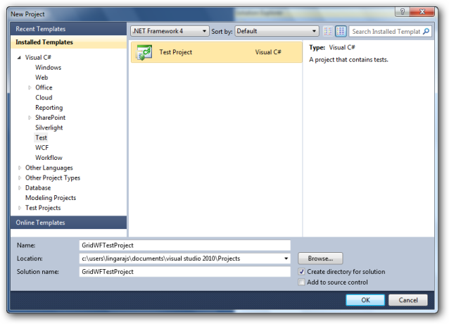

# Coded UI Support in Windows Grids

Essential Grid for Windows Forms now supports automated UI testing with VS 2010 Coded UI technology. The Grid Test plugin blends in with automated UI testing framework in VS 2010 by implementing the following classes:

* UITechnologyManager
* UITestPropertyProvider
* UIActionFilter

The architectural diagram is as follows:

_Figure602: Architectural Diagram_

* The Grid Test Plugin implements necessary details to communicate with VS 2010 Test Framework.
* The Grid application host runs with .NET Remoting channel hosted internally to communicate with test plugin through an interface. Data is then channeled across the VS 2010 Test Framework to identify the Cells and Grid controls.

## Use Case Scenarios

You can create Coded UI Test with Essential Grid for Windows Forms. The following example shows the implementation of the feature.

Perform the following initial steps before creating the Coded UI Test project:

* Deploying Extension assembly
* Prepare Grid sample application
* Write UI tests using VS 2010
* Testing the application with generated Coded UI Tests

## Deploying Extension Assembly

To deploy extension assembly:

1. Navigate to copydrop.bat file in UITest folder.
2. Run Bat file to place Extension and Provider assemblies with appropriate directories to pick the assemblies by VS2010.

## Preparing the Grid Application

To prepare the Grid Application:

1. Syncfusion.VisualStudio.TestTools.UITest.GridCommunication.dll contains implementation to easily change an existing application to the test application that the plugin would require.
2. Let the parent container inherit GridControlTestApplication class as shown below:

   ~~~ cs

		public class Form1 : GridControlTestApplication

		{

		}

   ~~~
   {:.prettyprint}

   ~~~ vbnet
		Public Class Form1

		Inherits GridControlTestApplication

		End Class
   ~~~
   {:.prettyprint}
   
3. Build and run the application to make it ready for testing.

## Creating Unit Tests with VS2010

To create Unit Tests with VS2010:

1. Create a new test project in VS2010.

    

2. Add a new CodedUITest item for the project.

    

Figure 604: Adding Coded UI Test file

## Testing the Application with Generated Coded UI Tests

To test the application with generated coded UI Tests:

1. Add a TestMethod called CodedUITestMethod1.

   ~~~ cs

		  

		public void CodedUITestMethod1()

		{

		//Generates codes for this test, select "Generate Code for Coded UI Test" from the shortcut menu and select one of the menu items.

		//For more information on generated code, see: http://go.microsoft.com/fwlink/?LinkId=179463

		}
   ~~~
   {:.prettyprint}

   ~~~ vbnet
		  

		Public Sub CodedUITestMethod1()

					'            

		'Generates codes for this test, select "Generate Code for Coded UI Test" from the shortcut menu and select one of the menu items.

		'For more information on generated code, see: http://go.microsoft.com/fwlink/?LinkId=179463

					'

		End Sub
   ~~~
   {:.prettyprint}
2. Build and run the Grid application that was configured already. Right-click TestMethod body and then select Generate Code for Coded UI Test -> Use Coded UI Test Builder as shown in the following screenshot:

    

3. Click the Record button to perform actions. In this scenario, add a text Hello World in a cell [x, y].

    

    

     Figure 607: Identifying the Table of the Syncfusion Grid

    

4. Assert the cell value using cross-hair present in Coded UI Test builder. Click cross-hair and hover to the cell. It will display Assert window as shown in the following screenshot:

    

## Properties

Below is the Cell Properties Table-

<table>
<tr>
<th>
PROPERTIES</th><th>
DESCRIPTION</th><th>
TYPE</th><th>
DATA TYPE</th></tr>
<tr>
<td>
AllowEnter</td><td>
Indicates that by pressing the &lt;Enter&gt; -Key, a new line is inserted into the edited text.</td><td>
-</td><td>
bool</td></tr>
<tr>
<td>
AllowPrompt</td><td>
Specifies if the prompt character can be allowed to be entered as an input character.</td><td>
-</td><td>
bool</td></tr>
<tr>
<td>
AutoSize</td><td>
Specifies that the cell height should automatically increase when the edited text does not fit into the cell and when WrapText is True. If WrapText is False, AutoSize will affect the column width.</td><td>
-</td><td>
bool</td></tr>
<tr>
<td>
BackGradientEndColor</td><td>
The end color of the dual gradient of the background (Progress bar).</td><td>
-</td><td>
Color</td></tr>
<tr>
<td>
BackGradientStartColor</td><td>
The start color of the dual gradient of the background (Progress bar).</td><td>
-</td><td>
Color</td></tr>
<tr>
<td>
Background</td><td>
Background color of the control.</td><td>
-</td><td>
Color</td></tr>
<tr>
<td>
BackgroundFallBackStyle</td><td>
Determines the background style when System mode is selected and the machine does not support themes.</td><td>
-</td><td>
ProgressBarBackgroundStyles</td></tr>
<tr>
<td>
BackgroundImageID</td><td>
Gets / sets the image that the PictureBox displays.</td><td>
-</td><td>
Image</td></tr>
<tr>
<td>
BackgroundImageMode</td><td>
Indicates how the image is displayed.</td><td>
-</td><td>
GridBackgroundImageMode</td></tr>
<tr>
<td>
BackgroundStyle</td><td>
Determines the background style.</td><td>
-</td><td>
ProgressBarBackgroundStyles</td></tr>
<tr>
<td>
BackMultipleColors</td><td>
The array of colors used to draw the multiple gradient of the background.</td><td>
-</td><td>
Color[]</td></tr>
<tr>
<td>
BackSegments</td><td>
Determines if the background is segmented.</td><td>
-</td><td>
bool</td></tr>
<tr>
<td>
BackTubeEndColor</td><td>
The outer color of the tube of the background.</td><td>
-</td><td>
Color</td></tr>
<tr>
<td>
BackTubeStartColor</td><td>
The middle color of the tube of the background.</td><td>
-</td><td>
Color</td></tr>
<tr>
<td>
Borders</td><td>
Top, left, bottom, and right border settings.</td><td>
-</td><td>
GridBordersInfo</td></tr>
<tr>
<td>
CellAppearance</td><td>
Specifies if cell edges shall be drawn raised, sunken, or flat (default).</td><td>
-</td><td>
GridCellAppearance</td></tr>
<tr>
<td>
CellTipText</td><td>
ToolTip text to be displayed when the user hovers the mouse over the cell.</td><td>
-</td><td>
string</td></tr>
<tr>
<td>
CellType</td><td>
Contains cell type information of a cell.</td><td>
-</td><td>
string</td></tr>
<tr>
<td>
CellValue</td><td>
Contains cell value information of a cell.</td><td>
-</td><td>
object</td></tr>
<tr>
<td>
CheckState</td><td>
Indicates the check state of the node.</td><td>
-</td><td>
CheckState</td></tr>
<tr>
<td>
Clickable</td><td>
Specifies if the user can click on any cell button elements in this renderer.</td><td>
-</td><td>
bool</td></tr>
<tr>
<td>
Control</td><td>
A custom control you can associate with a cell.</td><td>
-</td><td>
Control</td></tr>
<tr>
<td>
CultureInfo</td><td>
The culture information holds rules for parsing and formatting the cell's value.</td><td>
-</td><td>
CultureInfo</td></tr>
<tr>
<td>
CurrencyDecimalDigits</td><td>
Gets or sets the maximum number of digits for the decimal portion of the currency.</td><td>
-</td><td>
int</td></tr>
<tr>
<td>
CurrencyDecimalSeperator</td><td>
Gets or sets the decimal separator character that will be used for the display.</td><td>
-</td><td>
string</td></tr>
<tr>
<td>
CurrencyGroupSeperator</td><td>
Gets or sets the separator to be used for grouping digits.</td><td>
-</td><td>
string</td></tr>
<tr>
<td>
CurrencyGroupSizes</td><td>
Gets or sets the grouping of CurrencyDigits in the CurrencyTextBox</td><td>
-</td><td>
int[]</td></tr>
<tr>
<td>
CurrencyNumberDigits</td><td>
Gets or Sets the number of digits for the number part. This value is initially set based on the maximum value of the Currency data type.</td><td>
-</td><td>
int</td></tr>
<tr>
<td>
CurrencySymbol</td><td>
Gets or sets the currency symbol to be used in the CurrencyTextBox.</td><td>
-</td><td>
string</td></tr>
<tr>
<td>
DataSource</td><td>
Indicates the list that this cell will use to get its items.</td><td>
-</td><td>
object</td></tr>
<tr>
<td>
DateSeperator</td><td>
Gets or sets the character to use when a date separator position is specified.</td><td>
-</td><td>
char</td></tr>
<tr>
<td>
DecimalSeperator</td><td>
Gets or sets the character to use when a decimal separator position is specified.</td><td>
-</td><td>
char</td></tr>
<tr>
<td>
Description</td><td>
Gets or sets the text that is shown in check box or pushbuttons.</td><td>
-</td><td>
string</td></tr>
<tr>
<td>
DisplayMember</td><td>
Indicates the property to display for the items in this control.</td><td>
-</td><td>
string</td></tr>
<tr>
<td>
Enabled</td><td>
Specifies if the cell can be activated as the current cell or if the cell should be skipped when moving the current cell.</td><td>
-</td><td>
bool</td></tr>
<tr>
<td>
FloatCell</td><td>
Gets or sets if text can float into the boundaries of a neighboring cell.</td><td>
-</td><td>
bool</td></tr>
<tr>
<td>
FloodCell</td><td>
Gets or sets if this cell can be flooded by a previous cell.</td><td>
-</td><td>
bool</td></tr>
<tr>
<td>
Font</td><td>
The font for drawing text.</td><td>
-</td><td>
GridFontInfo</td></tr>
<tr>
<td>
Foreground</td><td>
The foreground color used to display text and graphics in the control.</td><td>
-</td><td>
Color</td></tr>
<tr>
<td>
ForeSegments</td><td>
Determines if the foreground is segmented (Progress bar)</td><td>
-</td><td>
bool</td></tr>
<tr>
<td>
Format</td><td>
Contains format information of a cell.</td><td>
-</td><td>
string</td></tr>
<tr>
<td>
FormulaTag</td><td>
A custom tag you can associate with a cell.</td><td>
-</td><td>
GridFormulaTag</td></tr>
<tr>
<td>
GradientEndColor</td><td>
The end color of the dual gradient of the foreground (Progress bar).</td><td>
-</td><td>
Color</td></tr>
<tr>
<td>
GradientStartColor</td><td>
The start color of the dual gradient of the foreground (Progress bar).</td><td>
-</td><td>
Color</td></tr>
<tr>
<td>
HorizontalAlignment</td><td>
Specifies the horizontal alignment of text in the cell.</td><td>
-</td><td>
GridHorizontalAlignment</td></tr>
<tr>
<td>
ImageIndex</td><td>
Holds an image index that specifies an image inside an image list.</td><td>
-</td><td>
int</td></tr>
<tr>
<td>
ImageList</td><td>
A list of images.</td><td>
-</td><td>
ImageList</td></tr>
<tr>
<td>
ImageSizeMode</td><td>
Indicates how the image is displayed.</td><td>
-</td><td>
GridImageSizeMode</td></tr>
<tr>
<td>
Interior</td><td>
Lets you specify a solid backcolor, gradient, or pattern style with both back and forecolor for a cell's background.</td><td>
-</td><td>
BrushInfo</td></tr>
<tr>
<td>
MaxLength</td><td>
Limits the number of characters the user can type into the cell. Note: When selecting a text from a choice list or when pasting text, the text can be longer but additional validation is necessary from your side.</td><td>
-</td><td>
int</td></tr>
<tr>
<td>
MaxValue</td><td>
Specifies the maximum value that can be set through the MaskedEditBox.</td><td>
-</td><td>
decimal</td></tr>
<tr>
<td>
MergeCell</td><td>
Specifies if cell edges shall be drawn raised, sunken, or flat (default).</td><td>
-</td><td>
GridMergeCellDirection</td></tr>
<tr>
<td>
MinValue</td><td>
Specifies the minimum value that can be set through the MaskedEditBox.</td><td>
-</td><td>
decimal</td></tr>
<tr>
<td>
NegativeColor</td><td>
Gets/Sets the forecolor when the current value is negative.</td><td>
-</td><td>
Color</td></tr>
<tr>
<td>
NegativeSign</td><td>
Specifies the sign that is to be used to indicate a negative value.</td><td>
-</td><td>
string</td></tr>
<tr>
<td>
NullString</td><td>
Specifies the string to be displayed when the DecimalValue is 0.</td><td>
-</td><td>
string</td></tr>
<tr>
<td>
NullValue</td><td>
Specifies the value to be saved when the modified display text matches the null string.</td><td>
-</td><td>
object</td></tr>
<tr>
<td>
PaddingCharacter</td><td>
Specifies the character that will be used instead of mask characters when the mask position has not been filled when the Text property is used.</td><td>
-</td><td>
char</td></tr>
<tr>
<td>
PassivePromptCharacter</td><td>
The prompt character that will serve as a placeholder for mask characters when the control does not have the focus.</td><td>
-</td><td>
char</td></tr>
<tr>
<td>
PasswordChar</td><td>
The character used to mask characters of a password in a password-entry cell.</td><td>
-</td><td>
char</td></tr>
<tr>
<td>
PositiveColor</td><td>
Gets or Sets the forecolor when the current value is positive</td><td>
-</td><td>
Color</td></tr>
<tr>
<td>
ProgressFontColor</td><td>
The color of the font used to draw the text of the ProgressBar.</td><td>
-</td><td>
Color</td></tr>
<tr>
<td>
ProgressForeColor</td><td>
The color used to draw the foreground in segment mode and constant mode.</td><td>
-</td><td>
Color</td></tr>
<tr>
<td>
ProgressMaximum</td><td>
The higher bound of the range of the ProgressBar.</td><td>
-</td><td>
int</td></tr>
<tr>
<td>
ProgressMinimum</td><td>
The lower bound of the range of the ProgressBar.</td><td>
-</td><td>
int</td></tr>
<tr>
<td>
ProgressMultipleColors</td><td>
The array of colors used in the multiple gradient of the foreground.</td><td>
-</td><td>
Color</td></tr>
<tr>
<td>
ProgressOrientation</td><td>
Determines the orientation of the text.</td><td>
-</td><td>
Orientation</td></tr>
<tr>
<td>
ProgressStep</td><td>
The amount to increment the value of the ProgressBar when Increment() is called.</td><td>
-</td><td>
int</td></tr>
<tr>
<td>
ProgressStretchImage</td><td>
Determines if the foreground image will be stretched.</td><td>
-</td><td>
bool</td></tr>
<tr>
<td>
ProgressStyle</td><td>
Determines the foreground drawing style.</td><td>
-</td><td>
ProgressBarStyles</td></tr>
<tr>
<td>
ProgressTextVisible</td><td>
Determines if the text of the Progressbar is visible.</td><td>
-</td><td>
bool</td></tr>
<tr>
<td>
ProgressValue</td><td>
The current value between the minimum and maximum values.</td><td>
-</td><td>
int</td></tr>
<tr>
<td>
PromptCharacter</td><td>
The prompt character that will serve as a placeholder for mask characters when the control does not have the focus (MaskEdit).</td><td>
-</td><td>
char</td></tr>
<tr>
<td>
ReadOnly</td><td>
Specifies if cell contents can be modified by the user. You can programmatically change Read-only cells by setting IgnoreReadOnly to True.</td><td>
-</td><td>
bool</td></tr>
<tr>
<td>
RightToLeft</td><td>
Specifies if the cell content reads from right to left.</td><td>
-</td><td>
RightToLeft</td></tr>
<tr>
<td>
ShowButtons</td><td>
Specifies when to show or display the cell buttons. Possible choices are: show the button only for the current cell, always show buttons, or never show buttons.</td><td>
-</td><td>
GridShowButtons</td></tr>
<tr>
<td>
StretchMultGrad</td><td>
Determines if the multiple gradient will be stretched.</td><td>
-</td><td>
bool</td></tr>
<tr>
<td>
StrictValueType</td><td>
Gets or sets a value indicating whether an exception should be thrown in the ApplyFormattedText method if the formatted text cannot be parsed and converted to the type specified with CellValueType.</td><td>
-</td><td>
bool</td></tr>
<tr>
<td>
Tag</td><td>
A custom tag you can associate with a cell.</td><td>
-</td><td>
object</td></tr>
<tr>
<td>
Text</td><td>
Gets or sets the value as a string.</td><td>
-</td><td>
string</td></tr>
<tr>
<td>
TextAlign</td><td>
Align text left of button elements (which is typical for combo boxes) or align text right of button elements.</td><td>
-</td><td>
GridTextAlign</td></tr>
<tr>
<td>
TextShadow</td><td>
Determines if the text shadow is visible.</td><td>
-</td><td>
bool</td></tr>
<tr>
<td>
TextStyle</td><td>
Determines the style of the text.</td><td>
-</td><td>
ProgressBarTextStyles</td></tr>
<tr>
<td>
ThousandSeperator</td><td>
The character to use when thousand separator positions are specified.</td><td>
-</td><td>
char</td></tr>
<tr>
<td>
TimeSeperator</td><td>
The character to use when a time separator position is specified.</td><td>
-</td><td>
char</td></tr>
<tr>
<td>
Trimming</td><td>
Indicates how text is trimmed when it exceeds the edges of the cell text rectangle.</td><td>
-</td><td>
StringTrimming</td></tr>
<tr>
<td>
TubeEndColor</td><td>
The outer color of the tube of the foreground (Progress bar).</td><td>
-</td><td>
Color</td></tr>
<tr>
<td>
TubeStartColor</td><td>
The middle color of the tube of the foreground.</td><td>
-</td><td>
Color</td></tr>
<tr>
<td>
UsageMode</td><td>
Specifies if the MaskedEditBox is to behave as a numeric control.</td><td>
-</td><td>
MaskedUsageMode</td></tr>
<tr>
<td>
UseCultureInfo</td><td>
Specifies whether the NumberFormat should be based on Grid's style or individual properties of this object.</td><td>
-</td><td>
bool</td></tr>
<tr>
<td>
UseLocaleDefault</td><td>
Specifies if the individual globalization property changes are to be ignored.</td><td>
-</td><td>
bool</td></tr>
<tr>
<td>
UseUserOverride</td><td>
The UseUserOverride parameter for CultureInfo.</td><td>
-</td><td>
bool</td></tr>
<tr>
<td>
ValueMember</td><td>
Indicates the property to use as the actual value for the items in the control.</td><td>
-</td><td>
string</td></tr>
<tr>
<td>
VerticalAlignment</td><td>
Specifies the vertical alignment of the text in the cell.</td><td>
-</td><td>
GridVerticalAlignment</td></tr>
<tr>
<td>
VerticalScrollBar</td><td>
Specifies if the text box should show a vertical scrollbar when text is being edited and does not fit in cell. WrapText must be initialized to True.</td><td>
-</td><td>
bool</td></tr>
</table>

<table>
<tr>
<th>
PROPERTIES</th><th>
DESCRIPTION</th><th>
TYPE</th><th>
DATA TYPE</th></tr>
<tr>
<td>
RowCount</td><td>
Gets or sets the number of rows in the grid. </td><td>
 -</td><td>
int</td></tr>
<tr>
<td>
ColCount</td><td>
Gets or sets the number of columns in the grid.</td><td>
-</td><td>
int</td></tr>
<tr>
<td>
SelectedRanges</td><td>
Gets the Selected Ranges.</td><td>
-</td><td>
GridRangeInfoList</td></tr>
<tr>
<td>
CurrentCell</td><td>
Gets GridCurrentCell object that provides storage for current cell information and manages all current cell operations such as activating, deactivating, saving, editing, and moving the current cell.</td><td>
-</td><td>
GridCurrentCell</td></tr>
<tr>
<td>
GridOfficeScrollBars</td><td>
Gets or sets MS Office-like scrollbars.</td><td>
-</td><td>
OfficeScrollBars</td></tr>
<tr>
<td>
GridVisualStyles</td><td>
Specifies the look and feel skins for the Grid.</td><td>
-</td><td>
GridVisualStyles</td></tr>
<tr>
<td>
ThemesEnabled</td><td>
Specifies whether XP Themes should be used for this control when available.</td><td>
-</td><td>
bool</td></tr>
</table>

## In-built Coded UI Support for 3.5 and 4.0 Frameworks

Essential Grid for Windows Forms supports automated UI testing with VS 2010 coded UI technology. Without using the existing plugins, the coded UI test is now enabled in frameworks 3.5 and 4.0.

<table>
<tr>
<th>
PROPERTY </th><th>
DESCRIPTION </th><th>
DATA TYPE </th></tr>
<tr>
<td>
AccesibiltyEnabled </td><td>
Gets or sets a value indicating whether the control should enable its accessibility support.</td><td>
Boolean, true/false</td></tr>
</table>

Enabling AccessibilityEnabled Property

The following code example illustrates how to enable AccessibilityEnabled property for the control.

 


    this.grid.AccessibilityEnabled = true;


 


    Me.grid.AccessibilityEnabled = True


 

N> You can follow the same steps to test the application with generated coded UI tests as described in the chapter Testing the Application with Generated Coded UI Tests.

