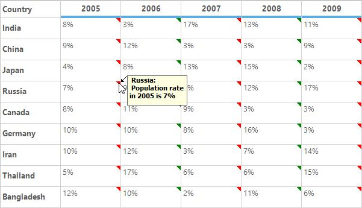
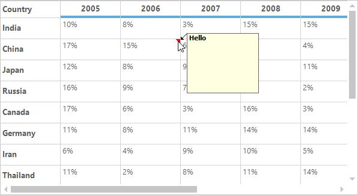
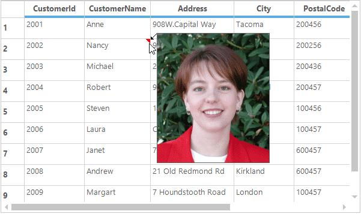
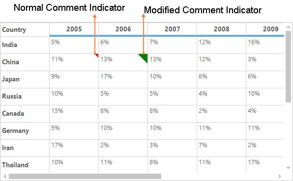
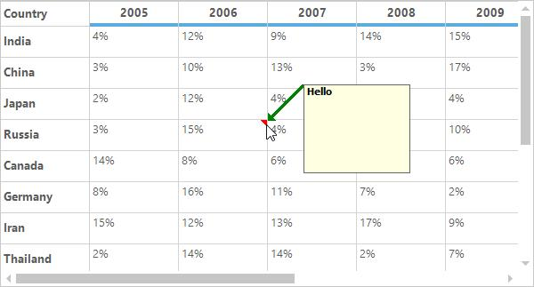
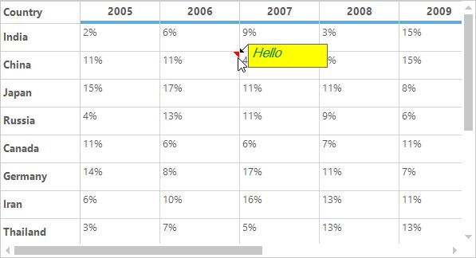
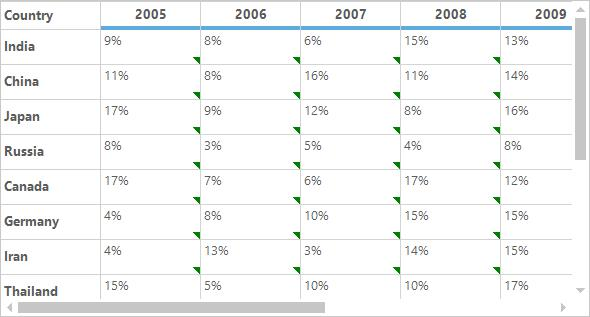
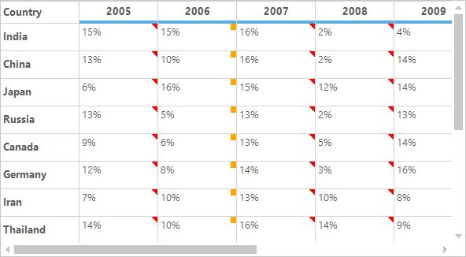
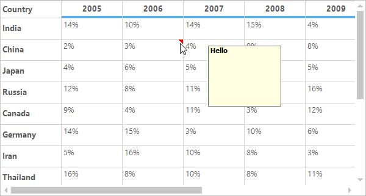
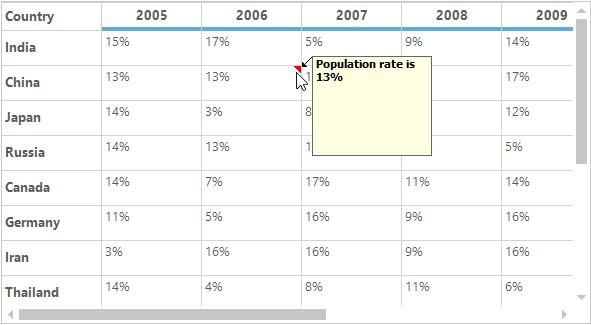

# Comment Tip
GridControl provides the default support for adding the Excel-like comment tip to the cells. This allows the user to show more information about the particular cell on mouse hover. 
The user can customize the appearance of the comment tip window and comment indicator of the individual cells. The user can also add the images to the comment tip window.

## Adding Comment Tip
The comment tip can be added for the particular cell by setting the `CommentText` property. This will display the given text in the comment tip window on mouse hover on the particular cell. 


//Set the comment text for particular cell
gridControl1[2, 2].CommentTip.CommentText = "Hello";



'Set the comment text for particular cell
gridControl1(2, 2).CommentTip.CommentText = "Hello"



The comment tip for the cell can also be added by setting the `CommentImage` property value as some desired image. The given image will be displayed as the comment tip for the cell.


//Adding comment tip by setting the Comment Image
this.gridControl1[2, 2].CommentTip.CommentImage = Image.FromFile(@"..\..\img1.png");



'Adding comment tip by setting the Comment Image
Me.gridControl1(2, 2).CommentTip.CommentImage = Image.FromFile("..\..\img1.png")



## Removing Comment Tip 
The comment tip for the cell can be removed by using the `ResetCommentTip` method.  It will reset the comment tip properties to the default value to remove the comment tip for the cell.


//Removes the comment tip for the particular cell.
this.gridControl1[2, 2].ResetCommentTip();



'Removes the comment tip for the particular cell.
Me.gridControl1(2, 2).ResetCommentTip()



The Comment tip can also be removed for the individual cells by setting the default value for the `CommentText` and `CommentImage` properties.


//Clear the comment tip when its add by using the CommentText property.
this.gridControl1[2, 2].CommentTip.CommentText = string.Empty;
//Clear the comment tip when its add by using the CommentImage property.
this.gridControl1[2, 2].CommentTip.CommentImage = null;



'Clear the comment tip when its add by using the CommentText property.
Me.gridControl1(2, 2).CommentTip.CommentText = String.Empty
'Clear the comment tip when its add by using the CommentImage property.
Me.gridControl1(2, 2).CommentTip.CommentImage = Nothing



The `ResetCommentText` and `ResetCommentImage` methods is also used to clear the comment tip for the cell.


//Reset the comment tip for the cell.
this.gridControl1[2, 2].CommentTip.ResetCommentText();
this.gridControl1[2, 2].CommentTip.ResetCommentImage();



'Reset the comment tip for the cell.
Me.gridControl1(2, 2).CommentTip.ResetCommentText()
Me.gridControl1(2, 2).CommentTip.ResetCommentImage()



## Customizing the Appearance 
The `CommentTip` object provides the list of properties that are used to customize the appearance of the comment tip window. 
### Comment Indicator
The size and color of the comment indicator can be customized by using the `CommentIndicatorSize` and `CommentIndicatorColor` properties of the `CommentTip`. By default, it will be displayed at the red color triangle at the top-right corner of the cell.


//Setting Comment indicator color
this.gridControl1[2, 2].CommentTip.CommentIndicatorColor = Color.Green;
//Set the size for the comment indicator.
this.gridControl1[2, 2].CommentTip.CommentIndicatorSize = new Size(20, 20);



'Setting Comment indicator color
Me.gridControl1(2, 2).CommentTip.CommentIndicatorColor = Color.Green
'Set the size for the comment indicator.
Me.gridControl1(2, 2).CommentTip.CommentIndicatorSize = New Size(20, 20)



### Comment Arrow 
The size and color of the comment arrow can be customized by using the `CommentArrowSize` and `CommentArrowColor` property. 


this.gridControl1[4, 2].CommentTip.CommentText = "Hello";
//Set comment arrow size and arrow color.
this.gridControl1[4, 2].CommentTip.CommentArrowSize = new Size(10, 40);
this.gridControl1[4, 2].CommentTip.CommentArrowColor = Color.Green;



Me.gridControl1(4, 2).CommentTip.CommentText = "Hello"
'Set comment arrow size and arrow color.
Me.gridControl1(4, 2).CommentTip.CommentArrowSize = New Size(10, 40)
Me.gridControl1(4, 2).CommentTip.CommentArrowColor = Color.Green



N> The comment arrow can be hide by setting the width of the `CommentArrowSize` property to zero. 
### Comment Tip Window
The size and font of the comment tip window can be set by using the `CommentWindowSize` and  `CommentWindowFont` properties respectively. The foreground and background colors of the comment tip window can  be set by using the `ForeColor` and `BackColor` properties of the `CommentTip`.


//Setting window size and Font
this.gridControl1[2, 2].CommentTip.CommentText = "Hello";
this.gridControl1[2, 2].CommentTip.CommentWindowSize = new Size(100, 30);
this.gridControl1[2, 2].CommentTip.CommentFont = new Font("sans serif", 12, FontStyle.Italic);
this.gridControl1[2, 2].CommentTip.ForeColor = Color.Green;
this.gridControl1[2, 2].CommentTip.BackColor = Color.Yellow;



'Setting window size and Font
Me.gridControl1(2, 2).CommentTip.CommentText = "Hello"
Me.gridControl1(2, 2).CommentTip.CommentWindowSize = New Size(100, 30)
Me.gridControl1(2, 2).CommentTip.CommentFont = New Font("sans serif", 12, FontStyle.Italic)
Me.gridControl1(2, 2).CommentTip.ForeColor = Color.Green
Me.gridControl1(2, 2).CommentTip.BackColor = Color.Yellow



## Events
The following events are used to customize the appearance of the comment tip, 
* CommentIndicatorDraw
* CommentTipShowing
* CommentTipShown

### CommentIndicatorDraw Event
This event is also used to customize the appearance of the comment indicator by changing its shape, color and location through the event arguments.


this.gridControl1.CommentTipIndicatorDraw += new CommentTipIndicatorDrawEventHandler(gridControl1_CommentTipIndicatorDraw);
void gridControl1_CommentTipIndicatorDraw(object sender, CommentTipIndicatorDrawEventArgs e)
{
    //To do…
}



Private Me.gridControl1.CommentTipIndicatorDraw += New CommentTipIndicatorDrawEventHandler(AddressOf gridControl1_CommentTipIndicatorDraw)
Private Sub gridControl1_CommentTipIndicatorDraw(ByVal sender As Object, ByVal e As CommentTipIndicatorDrawEventArgs)
	'To do…
End Sub



### CommentTipShowing Event
The appearance of the comment tip window can be customized by using the `CommentTipShowing` event. This can also be used to change the text, size, color and location of the comment tip window. This event is occurs before displaying the comment tip window on mouse hover at the comment tip cell. 


this.gridControl1.CommentTipShowing += new CommentTipShowingEventHandler(gridControl1_CommentTipShowing);
void gridControl1_CommentTipShowing(object sender, CommentTipShowingEventArgs e)
{
    //To do…
}



Private Me.gridControl1.CommentTipShowing += New CommentTipShowingEventHandler(AddressOf gridControl1_CommentTipShowing)
Private Sub gridControl1_CommentTipShowing(ByVal sender As Object, ByVal e As CommentTipShowingEventArgs)
	'To do…
End Sub



### CommentTipShown Event
This event will be raised after showing the comment tip window on mouse hover. This is used to get the notification of the showing of comment tip window. 


this.gridControl1.CommentTipShown += new CommentTipShownEventHandler(gridControl1_CommentTipShown);
void gridControl1_CommentTipShown(object sender, CommentTipShownEventArgs e)
{
    Console.WriteLine("Comment tip is shown for the cell [" + e.RowIndex + "," + e.ColIndex + "].");
}



AddHandler gridControl1.CommentTipShown, AddressOf gridControl1_CommentTipShown
Private Sub gridControl1_CommentTipShown(ByVal sender As Object, ByVal e As CommentTipShownEventArgs)
	Console.WriteLine("Comment tip is shown for the cell [" & e.RowIndex & "," & e.ColIndex & "].")
End Sub



## Customization Using Events
The `CommentTipShowing` and `CommentIndicatorDraw` events are used to customize the appearance of the comment tip window. This section explains about the customization using this events.
### Changing the Color and Location of the Comment Indicator 
The color and location of the comment indicator can be customized by using the `CommentTipIndicatorDraw` event. 


this.gridControl1.CommentTipIndicatorDraw +=new CommentTipIndicatorDrawEventHandler(gridControl1_CommentTipIndicatorDraw);
void gridControl1_CommentTipIndicatorDraw(object sender, CommentTipIndicatorDrawEventArgs e)
{
    //Set the color for the comment indicator.
    e.Style.CommentTip.CommentIndicatorColor = Color.Green;
    // Modify the indicator location
    e.IndicatorBounds = new Rectangle(e.IndicatorBounds.Left , e.IndicatorBounds.Top + e.CellBounds.Height -8, 8, 8);
}


AddHandler gridControl1.CommentTipIndicatorDrawn, AddressOf gridControl1_CommentTipIndicatorDrawn
Private Sub gridControl1_CommentTipIndicatorDraw(ByVal sender As Object, ByVal e As CommentTipIndicatorDrawEventArgs)
	'Set the color for the comment indicator.
	e.Style.CommentTip.CommentIndicatorColor = Color.Green
	' Modify the indicator location
	e.IndicatorBounds = New Rectangle(e.IndicatorBounds.Left, e.IndicatorBounds.Top + e.CellBounds.Height -8, 8, 8)
End Sub



### Changing the Shape of the Comment Indicator
By default the comment indicator will draw in a triangle shape at the top right corner of the cell. If you want to change the default shape of the comment indicator, you can use the `CommentTipIndicatorDraw` event. Using this event argument `e.Graphics`, you can fill the shape that you want to be display as the comment indicator. The default location of the comment indicator can be get by using the `e.IndicatorBounds`. 


this.gridControl1.CommentTipIndicatorDraw +=new CommentTipIndicatorDrawnEventHandler(gridControl1_CommentTipIndicatorDrawn);
void gridControl1_CommentTipIndicatorDraw(object sender, CommentTipIndicatorDrawEventArgs e)
{
    if (e.ColIndex == 2)
    {
        //Set the comment indicator color and shape.
        e.Graphics.FillRectangle(new SolidBrush(Color.Orange), e.IndicatorBounds);
        e.Cancel = true;
    }
}



AddHandler gridControl1.CommentTipIndicatorDraw, AddressOf gridControl1_CommentTipIndicatorDraw
Private Sub gridControl1_CommentTipIndicatorDraw(ByVal sender As Object, ByVal e As CommentTipIndicatorDrawEventArgs)
	If e.ColIndex = 2 Then
		'Set the comment indicator color and shape.
		e.Graphics.FillRectangle(New SolidBrush(Color.Orange), e.IndicatorBounds)
		e.Cancel = True
	End If
End Sub



### Disabling the Comment Indicator for particular column
The `CommentIndicatorDraw` event is used to avoid displaying the comment indicator by setting the `e.Cancel` to `true`.


this.gridControl1.CommentTipIndicatorDraw += new CommentTipIndicatorDrawEventHandler(gridControl1_CommentTipIndicatorDraw);
void gridControl1_CommentTipIndicatorDraw(object sender, CommentTipIndicatorDrawEventArgs e)
{
    if(e.RowIndex == 2 && e.ColIndex ==2)
    {
        //Cancel the displaying of the comment tip indicator.
        e.Cancel = true;
    }
}



AddHandler gridControl1.CommentTipIndicatorDraw, AddressOf gridControl1_CommentTipIndicatorDraw
Private Sub gridControl1_CommentTipIndicatorDraw(ByVal sender As Object, ByVal e As CommentTipIndicatorDrawEventArgs)
	If e.RowIndex = 2 AndAlso e.ColIndex =2 Then
		'Cancel the displaying of the comment tip indicator.
		e.Cancel = True
	End If
End Sub



### Disabling the comment tip window for particular cell
The displaying of comment tip window on mouse hover at the comment tip cell can be restricted by cancelling the `CommentTipShowing` event.


this.gridControl1.CommentTipShowing += new CommentTipShowingEventHandler(gridControl1_CommentTipShowing);
void gridControl1_CommentTipShowing(object sender, CommentTipShowingEventArgs e)
{
    if(e.RowIndex == 2 && e.ColIndex ==2)
    {
        //Cancel the displaying of the comment tip window.
        e.Cancel = true;
    }
}



AddHandler gridControl1.CommentTipShowing, AddressOf gridControl1_CommentTipShowing
Private Sub gridControl1_CommentTipShowing(ByVal sender As Object, ByVal e As CommentTipShowingEventArgs)
	If e.RowIndex = 2 AndAlso e.ColIndex =2 Then
		'Cancel the displaying of the comment tip window.
		e.Cancel = True
	End If
End Sub



### Changing the location of Comment Tip Window
The location of the comment tip window can be modified dynamically by handling the `CommentTipShowing` event. In this event the location of the comment tip window can be set through the `CommentTipWindow.Location` property.


this.gridControl1.CommentTipShowing += new CommentTipShowingEventHandler(gridControl1_CommentTipShowing);void gridControl1_CommentTipShowing(object sender, CommentTipShowingEventArgs e)
{
    Point pt = e.CommentTipWindow.Location;
    //Display the comment tip window at the given point.
    e.CommentTipWindow.Location = new Point(pt.X + 40, pt.Y + 10);
}



AddHandler gridControl1.CommentTipShowing, AddressOf gridControl1_CommentTipShowing
Private Sub gridControl1_CommentTipShowing(ByVal sender As Object, ByVal e As CommentTipShowingEventArgs)
	Dim pt As Point = e.CommentTipWindow.Location
	'Display the comment tip window at the given point.
	e.CommentTipWindow.Location = New Point(pt.X + 40, pt.Y + 10)
End Sub



N> When the custom location is set by the end user the default comment arrow for indicating the comment window will not draw.

### Setting Custom Comment Text 
The text displayed on the comment tip window can be customized by using the `CommentTipShowing` event.


this.gridControl1.CommentTipShowing += new CommentTipShowingEventHandler(gridControl1_CommentTipShowing);
void gridControl1_CommentTipShowing(object sender, CommentTipShowingEventArgs e)
{
    string comment = "Population rate is " + e.Style.CellValue.ToString();
    e.Style.CommentTip.CommentText = comment;            
}



AddHandler gridControl1.CommentTipShowing, AddressOf gridControl1_CommentTipShowing
Private Sub gridControl1_CommentTipShowing(ByVal sender As Object, ByVal e As CommentTipShowingEventArgs)
	Dim comment As String = "Population rate is " & e.Style.CellValue.ToString()
	e.Style.CommentTip.CommentText = comment
End Sub


