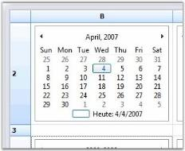
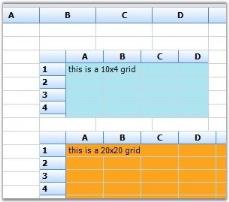
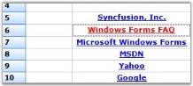
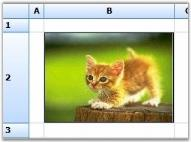
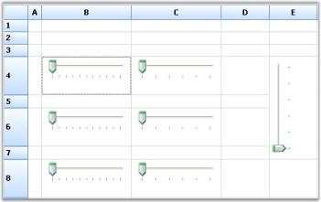
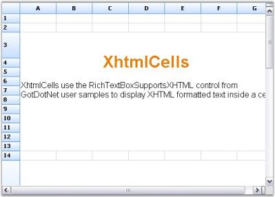
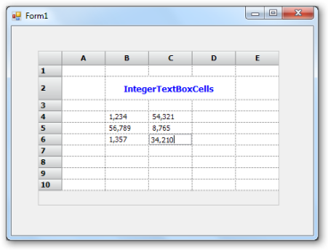
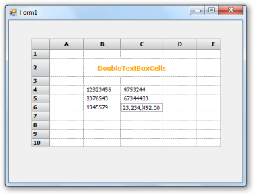
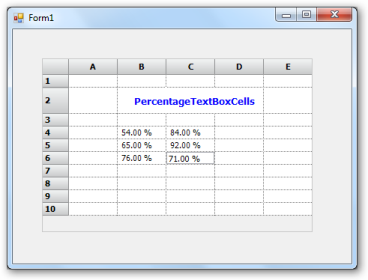

# Custom Cell Types

## Button Edit

The Button Edit cell type will allow you to add images to the button, which can be embedded into the grid cells. This Button Edit cell type can be added by registering its cell model to the corresponding grid by using RegisterCellModel class. There are some in-built images, which will be added to the button by providing the button type, and also custom images can be added by specifying the button type as image and providing the location of the image. These Button Edit types can be used by initializing the ButtonEditStyleProperties class for the corresponding cell. The Button Edit types provided by grid control are listed as follows.

* Browse
* Check
* Down
* Left
* Leftend
* Redo
* Right
* Rightend
* Undo
* Up
* Image

You can also add custom buttons that you have created to the grid cells. This enables you to add custom buttons like split button to the grid.

The following code example illustrates how to set the cell type to ButtonEdit.



RegisterCellModel.GridCellType(gridControl1, CustomCellTypes.ButtonEdit);

ButtonEditStyleProperties sp;

this.gridControl1[rowIndex, colIndex].CellType = CustomCellTypes.ButtonEdit.ToString();

sp = new ButtonEditStyleProperties(this.gridControl1[rowIndex, colIndex]);

sp.ButtonEditInfo.ButtonEditType = ButtonType.Browse;

sp.ButtonEditInfo.Width = 50;




RegisterCellModel.GridCellType(gridControl1, CustomCellTypes.ButtonEdit)

Private sp As ButtonEditStyleProperties

Me.gridControl1[rowIndex += 1, colIndex].CellType = "ButtonEdit";

Me.gridControl1(rowIndex, colIndex).CellType = CustomCellTypes.ButtonEdit.ToString()

sp = New ButtonEditStyleProperties(Me.gridControl1(rowIndex, colIndex))

sp.ButtonEditInfo.ButtonEditType = ButtonType.Browse



  

## Embeding OLE Objects in the Grid Cell

OLE objects can be directly embedded to a grid’s cell, which by default displays the icon of the file attached and opens through its default associated application when the cell is activated. This custom cell type will host the cell as an OLE container. The address of the file should be passed through the cell's Style.Description value.

### Use Case Scenarios

In a payroll application, the generated report can be attached to the grid and viewed directly from the grid. The grid should be exported to the Excel when the operation is completed to view the recent results; otherwise the document will not reflect the recent changes.

### Sample Link

Find a sample in the following location: _<Install Location>\Syncfusion\EssentialStudio\[Version Number]\Windows\Grid.Windows\Samples\2.0\ Grid Controls / Grid Control / Concepts and Features/Custom Cell Types_

### Adding OleContainer Cell to an Application 

The following code illustrates how to set the cell type to OleContainer: 



RegisterCellModel.GridCellType(this.gridControl1, CustomCellTypes.OleContainerCell);

this.gridControl1[rowIndex, colIndex].CellType = CustomCellTypes. OleContainerCell.ToString();

this.gridControl1[rowIndex, colIndex].Description = GetIconFile(@"common\Data\DocIO\SalesInvoiceDemo.doc");




RegisterCellModel.GridCellType(this.gridControl1, CustomCellTypes.OleContainerCell);

Me.gridControl1(rowIndex, colIndex).CellType = CustomCellTypes. OleContainerCell.ToString()

Me.gridControl1(rowIndex, colIndex).Description = GetIconFile("common\Data\DocIO\SalesInvoiceDemo.doc")



  

## Calculator Text Box

Calculator Text Box cell type is implemented as a drop-down container, embedded in the cell where the drop-down contains the calculator, which displays the value in the cell. The following code examples illustrate how to set the cell type to CalculatorTextBox.



RegisterCellModel.GridCellType(gridControl1, CustomCellTypes.CalculatorTextBox);

CalculatorControl c2 = new CalculatorControl();

c2.BorderStyle = Border3DStyle.RaisedOuter;

c2.BackColor = Color.BlanchedAlmond;

style = gridControl1[6, 2];

style.CellType = CustomCellTypes.CalculatorTextBox.ToString();

style.Control = c2;





RegisterCellModel.GridCellType(Me.gridControl1, CustomCellTypes.CalculatorTextBox)

Dim c2 As CalculatorControl = New CalculatorControl()

c2.BorderStyle = Border3DStyle.RaisedOuter

c2.BackColor = Color.BlanchedAlmond

style = gridControl1(6, 2)

style.CellType = CustomCellTypes.CalculatorTextBox.ToString()

style.Control = c2


  

## Calendar

Calendar cell type by can be added by registering the cell model by using RegisterCellModel class. The following code example illustrates how to set the cell type to Calendar.



GridStyleInfo style;

style = gridControl1[row, 2];

style.CellType = CustomCellTypes.Calendar.ToString();

style.Control = new MonthCalendar();





Dim style As GridStyleInfo

style = gridControl1(row, 2)

style.CellType = CustomCellTypes.Calendar.ToString()

style.Control = New MonthCalendar()



## Date Time Picker

Date Time Picker cell type can be embedded into a cell as a drop-down container where date and time picker will be added in the drop-down. The cell value of the corresponding cell has to be specified as date value. Various formats of the date and time can be provided in the Format styleproperty. The following code example illustrates how to set the cell type to DateTimePicker.



RegisterCellModel.GridCellType(gridControl1, CustomCellTypes.DateTimePicker);

this.gridControl1[4, 2].CellType = CustomCellTypes.DateTimePicker.ToString();

this.gridControl1[4, 2].CellValueType = typeof(DateTime);

this.gridControl1[4, 2].CellValue = DateTime.Now;

this.gridControl1[4, 2].Format = "MM/dd/yyyy hh:mm";





RegisterCellModel.GridCellType(Me.gridControl1, CustomCellTypes.DateTimePicker)

Me.gridControl1(4, 2).CellType = CustomCellTypes.DateTimePicker.ToString()

Me.gridControl1(4, 2).CellValueType = GetType(DateTime)

Me.gridControl1(4, 2).CellValue = DateTime.Now

Me.gridControl1(4, 2).Format = "MM/dd/yyyy hh:mm"



 

## Enhanced Numeric Up Down

Numeric Up Down cell type has been enhanced to provide more styles and properties that can be added to the numeric up down control by using FloatNumericUpDownStyleProperties class. It enables you to set the limitations of the numeric values and several other properties. 

Table 27: Numeric Up Down style properties

<table>
<tr>
<th>
FLOAT NUMERIC UP DOWN STYLE PROPERTIES</th><th>
DESCRIPTION</th></tr>
<tr>
<td>
BackColor</td><td>
Specifies the back color of the container.</td></tr>
<tr>
<td>
Maximum</td><td>
Indicates the maximum value that the cell can have.</td></tr>
<tr>
<td>
StartValue </td><td>
The starting value of the embedded cell.</td></tr>
<tr>
<td>
Step</td><td>
The value that has to be incremented for each click of the button.</td></tr>
<tr>
<td>
WrapValue</td><td>
The bool value that will allow to wrap the text.</td></tr>
<tr>
<td>
DecimalPlaces</td><td>
The decimal values after the decimal point.</td></tr>
<tr>
<td>
Orientation</td><td>
Orientation of the cell container on NumericUpDown.</td></tr>
<tr>
<td>
InterceptArrowkeys</td><td>
Allows to change the value by using ARROW keys from keyboard.</td></tr>
<tr>
<td>
ThousandsSeparator</td><td>
The bool value, which allows to separate thousand basis.</td></tr>
</table>

The following code example illustrates how to set the cell type to FNumericUpDown.



RegisterCellModel.GridCellType(this.gridControl1, CustomCellTypes.FNumericUpDown);

GridStyleInfo style = this.gridControl1[1, 1];

style.Text = "Allow Decimal Increment and Decrement(step by 0.2,0.01,0.001)";

style.TextColor = Color.MidnightBlue;

//Sets up FNumericUpDown Cell.

style = gridControl1[2, 2];

style.CellType = CustomCellTypes.FNumericUpDown.ToString();

style.Text = "0.5";

//Assigns the Style Properties of Up Down Control.

FloatNumericUpDownStyleProperties sp = new FloatNumericUpDownStyleProperties(style);

sp.StyleInfo.BackColor = SystemColors.Window;

sp.FloatNumericUpDownProperties.Maximum = 15.0;

sp.FloatNumericUpDownProperties.Minimum = 0.0;

sp.FloatNumericUpDownProperties.StartValue = 0.5;

sp.FloatNumericUpDownProperties.Step = 0.2;

sp.FloatNumericUpDownProperties.WrapValue = true;

sp.FloatNumericUpDownProperties.DecimalPlaces = 1;





RegisterCellModel.GridCellType(gridControl1, CustomCellTypes.FNumericUpDown)

Dim style As GridStyleInfo = Me.gridControl1(1, 1)

style.Text = "Allow Decimal Increment and Decrement(step by 0.2,0.01,0.001)"

style.TextColor = Color.MidnightBlue

'Sets up FNumericUpDown Cell.

style = gridControl1(2, 2)

style.CellType = CustomCellTypes.FNumericUpDown.ToString()

style.Text = "0.5"

'Assigns the Style Properties of Up Down Control.

Dim sp As FloatNumericUpDownStyleProperties = New FloatNumericUpDownStyleProperties(style)

sp.StyleInfo.BackColor = SystemColors.Window

sp.FloatNumericUpDownProperties.Maximum = 15.0

sp.FloatNumericUpDownProperties.Minimum = 0.0

sp.FloatNumericUpDownProperties.StartValue = 0.5

sp.FloatNumericUpDownProperties.Step = 0.2

sp.FloatNumericUpDownProperties.WrapValue = True

sp.FloatNumericUpDownProperties.DecimalPlaces = 1



 

## GridInCell

GridInCell cell type provide covered range of cells to embed the grid, which is added as a control to the cells. The registered cell model will initialize the range by calculating the size of the grid control to be embedded, and add some styles such as borders and scroll bar to have the control within the range. The following code examples illustrate how to set the cell type to GridinCell.



RegisterCellModel.GridCellType(gridControl1, CustomCellTypes.GridinCell);

gridControl1.BackColor = Color.FromArgb(0xda, 0xe5, 0xf5);

GridControl grid;

this.gridControl1[3, 2].CellType = CustomCellTypes.GridinCell.ToString();

this.gridControl1.CoveredRanges.Add(GridRangeInfo.Cells(3, 2, 7, 4));

grid = new CellEmbeddedGrid(this.gridControl1);

grid.BackColor = Color.FromArgb(0xb4, 0xe7, 0xf2);

grid.RowCount = 10;

grid.ColCount = 4;

grid[1, 1].Text = "this is a 10x4 grid";

grid.ThemesEnabled = true;

this.gridControl1[3, 2].Control = grid;

this.gridControl1.Controls.Add(grid);





RegisterCellModel.GridCellType(Me.gridControl1, CustomCellTypes.GridinCell)

Dim grid As GridControl

Me.gridControl1(3, 2).CellType = CustomCellTypes.GridinCell.ToString()

Me.gridControl1.CoveredRanges.Add(GridRangeInfo.Cells(3, 2, 7, 4))

grid = New CellEmbeddedGrid(Me.gridControl1)

grid.BackColor = Color.FromArgb(&HB4, &HE7, &HF2)

grid.RowCount = 10

grid.ColCount = 4

grid(1, 1).Text = "this is a 10x4 grid"

grid.ThemesEnabled = True

Me.gridControl1(3, 2).Control = grid

Me.gridControl1.Controls.Add(grid)


 

## Link Label Cell

The Link Label Cell type holds the link that has been provided in the Tag property. This displays ordinary text in the cell, which links specified location. The following code example illustrates how to set the cell type to LinkLabelCell.



RegisterCellModel.GridCellType(gridControl1, CustomCellTypes.LinkLabelCell);

int rowIndex = 5;

gridControl1[rowIndex, 2].CellType = CustomCellTypes.LinkLabelCell.ToString();

gridControl1[rowIndex, 2].Text = "Syncfusion, Inc.";

gridControl1[rowIndex, 2].Font.Bold = true;

gridControl1[rowIndex, 2].Tag = "http://www.syncfusion.com";





RegisterCellModel.GridCellType(gridControl1, CustomCellTypes.LinkLabelCell)

Dim rowIndex As Integer = 5

gridControl1(rowIndex, 2).CellType = CustomCellTypes.LinkLabelCell.ToString()

gridControl1(rowIndex, 2).Text = "Syncfusion, Inc."

gridControl1(rowIndex, 2).Font.Bold = True

gridControl1(rowIndex, 2).Tag = "http://www.syncfusion.com"



 

## Picture Box

Picture Box cell type can be embedded into a cell by calculating the size of the picture and extending the width and height of the cell accordingly. PictureBoxStyleProperties class provides the style where it holds the information of the picture that has to be added. The following code examples illustrate how to set the cell type to PictureBox.



RegisterCellModel.GridCellType(gridControl1, CustomCellTypes.PictureBox);

PictureBoxStyleProperties sp;

style = gridControl1[2, 2];

style.CellType = CustomCellTypes.PictureBox.ToString();

sp = new PictureBoxStyleProperties(style);

sp.Image = GetImage("one.jpg");





RegisterCellModel.GridCellType(Me.gridControl1, CustomCellTypes.PictureBox)

Dim sp As PictureBoxStyleProperties

style = gridControl1(2, 2)

style.CellType = CustomCellTypes.PictureBox.ToString()

sp = New PictureBoxStyleProperties(style)

sp.Image = GetImage("one.jpg")



  

## Slider

Slider control embedded in a grid cell is termed as a Slider Cell. Slider control can be embedded in the grid cells by using Slider cell type. The class SliderStyleProperties provides custom properties specific to Slider control. All the properties support the style inheritance mechanism. Slider control can be embedded by using the following set of codes:



gridControl1.CellModels.Add("Slider", new SliderCellModel(gridControl1.Model));

GridStyleInfo style;

style = gridControl1[4, 5];

SliderStyleProperties sp = new SliderStyleProperties(style);

style.CellType = "Slider";

sp.Maximum = 40;

sp.Minimum = 0;

sp.TickFrequency = 8;

sp.LargeChange = 16;

sp.SmallChange = 4;

sp.Orientation = Orientation.Vertical;





gridControl1.CellModels.Add("Slider", New SliderCellModel(gridControl1.Model))

Dim style As GridStyleInfo

style = gridControl1(4, 5)

Dim sp As SliderStyleProperties = New SliderStyleProperties(style)

style.CellType = "Slider"

sp.Maximum = 40

sp.Minimum = 0

sp.TickFrequency = 8

sp.LargeChange = 16

sp.SmallChange = 4

sp.Orientation = Orientation.Vertical



 

## XHTML Cell

An XHTML page can be displayed in a grid cell by using Xhtml Cell cell type. Custom cell type can be created and registered to provide XHTML functionality. It requires derivation of two classes:

* GridCellModelBase
* GridCellRendererBase

The CellModel (read GridCellModelBase class in this document) handles any serialization that a cell type requires and also creates the CellRenderer (read GridCellRendererBase class in this document) class that is associated with the cell type. CellRenderer class manages the UI aspects of cell type. The XHTML page can be displayed by using the following set of codes.



string xhtml1 = "<body style=\"font-family:Arial; line-height:1em\"> ";

xhtml1 += "<h1 style=\"text-align:center; color:#EE7A03 \">XhtmlCells</h1>";

xhtml1 += "
";

xhtml1 += "
XhtmlCells use the RichTextBoxSupportsXHTML control from GotDotNet user samples to display XHTML formatted text inside a cell.
";

xhtml1 += "</body>";

gridControl1[rowIndex, 1].CellType = "XhtmlCell";

gridControl1[rowIndex, 1].Text = xhtml1;





Dim xhtml1 As String = "<body style=""font-family:Arial; line-height:1em""> "

xhtml1 += "<h1 style=""text-align:center; color:#EE7A03 "">XhtmlCells</h1>"

xhtml1 += "
"

xhtml1 += "
XhtmlCells use the RichTextBoxSupportsXHTML control from GotDotNet user samples to display XHTML formatted text inside a cell.
"

xhtml1 += "</body>"

gridControl1(rowIndex, 1).CellType = "XhtmlCell"

gridControl1(rowIndex, 1).Text = xhtml1


## Chart Cell

Essential Chart control can be embedded in grid cells by creating and registering custom Chart Cell cell type. CellModel class handles any serialization that a cell type requires and also creates CellRenderer class associated with the cell type. The actions mentioned can be performed by using the following code example.



ChartStyleProperties csp;

this.gridControl1.CellModels.Add("ChartCell", new GridChartCellModel(this.gridControl1.Model));

style = this.gridControl1[8, 2];

style.CellType = "ChartCell";

csp = new ChartStyleProperties(style);

csp.ChartType = ChartSeriesType.Column;

csp.TitleText = "Chart Cell";

csp.Series3D = false;

csp.TitleAlignment = StringAlignment.Center;





Dim csp As ChartStyleProperties

Me.gridControl1.CellModels.Add("ChartCell", New GridChartCellModel(Me.gridControl1.Model))

style = Me.gridControl1(8, 2)

style.CellType = "ChartCell"

csp = New ChartStyleProperties(style)

csp.ChartType = ChartSeriesType.Column

csp.TitleText = "Chart Cell"

csp.Series3D = False

csp.TitleAlignment = StringAlignment.Center



 

## Drop-Down Grid Cell

Essential Grid has flexible support for displaying drop-down grids in cells. It uses a custom cell derived from the GridDropDownGridCellModel/GridDropDownGridCellRenderer classes to display a drop-down grid. The GridDropDownGridCellModel gets an instance of GridControlBase and displays it through GridDropDownGridCellRenderer.

The actions mentioned above can be performed by using the following code examples.



//Creates and registers drop-down grid cells.

DropDownGridCellModel aModel = new DropDownGridCellModel(this.gridControl1.Model);

aModel.EmbeddedGrid = GridA;

gridControl1.CellModels.Add("GridADropCell", aModel);

//Sets the drop-downs in the cell.

this.gridControl1[rowIndex,1].Text = "Grid A";

this.gridControl1[rowIndex,1].CellType = "GridADropCell";





'Creates and registers drop-down grid cells.

Dim aModel As DropDownGridCellModel = New DropDownGridCellModel(Me.gridControl1.Model)

aModel.EmbeddedGrid = GridA

gridControl1.CellModels.Add("GridADropCell", aModel)

'Sets the drop-downs in the cell.

Me.gridControl1(rowIndex,1).Text = "Grid A"

Me.gridControl1(rowIndex,1).CellType = "GridADropCell"



  

## Drop-Down Form and User Control Cell

A custom control cell that displays a drop-down form or a user control in a grid cell can be created.

### You can create:

* A drop-down form in a grid cell by deriving GridStaticCellModel/GridStaticCellRenderer classes.
* Adrop-down User control in a grid cell by deriving GridDropDownCellModel/GridDropDownCellRender classes.

The actions mentioned can be performed by using the following code example.



//Registers your custom cell type.

this.gridControl1.CellModels.Add("DropDownForm", new DropDownFormCellModel(this.gridControl1.Model, new DropDownForm()));

//Sets the style.CellType for the cells.

this.gridControl1[2, 2].CellType = "DropDownForm";

//Registers your custom cell type.

this.gridControl1.CellModels.Add("DropDownUserControl", new DropDownUserCellModel(this.gridControl1.Model, new DropDownUser()));

//Sets the style.CellType for the cells.

this.gridControl1[6, 2].CellType = "DropDownUserControl";





'Registers your custom cell type.

Me.gridControl1.CellModels.Add("DropDownForm", New DropDownFormCellModel(Me.gridControl1.Model, New DropDownForm()))

'Sets the style.CellType for the cells.

Me.gridControl1(2, 2).CellType = "DropDownForm"

'Registers your custom cell type.

Me.gridControl1.CellModels.Add("DropDownUserControl", New DropDownUserCellModel(Me.gridControl1.Model, New DropDownUser()))

'Sets the style.CellType for the cells.

Me.gridControl1(6, 2).CellType = "DropDownUserControl"



  

## Integer Text Box

Integer text box is used to display integer data-type values in the grid cells. This cell type can be added to the grid cells by registering its cell model using RegisterCellModel class. The following code example illustrates how to add the integer text box to grid cells using the RegisterCellModel class.



RegisterCellModel.GridCellType(this.gridControl1, CustomCellTypes.IntegerTextBox);

this.gridControl1[4, 2].CellType = CustomCellTypes.IntegerTextBox.ToString();




RegisterCellModel.GridCellType(Me.gridControl1, CustomCellTypes.IntegerTextBox)

Me.gridControl1(4, 2).CellType = CustomCellTypes.IntegerTextBox.ToString()

 

## Double Text Box

Double text box is used to display double data-type values in the grid cells. This cell type can be added to the grid cells by registering its cell model using RegisterCellModel class. The following code example illustrates how to add the double text box to grid cells using the RegisterCellModel class.



 RegisterCellModel.GridCellType(this.gridControl1, CustomCellTypes.DoubleTextBox);

   this.gridControl1[4, 2].CellType= CustomCellTypes.DoubleTextBox.ToString();




RegisterCellModel.GridCellType(Me.gridControl1, CustomCellTypes.DoubleTextBox)

Me.gridControl1(4, 2).CellType = CustomCellTypes.DoubleTextBox.ToString()



 

## Percent Text Box

Percent text box is used to display percentage values in the grid cell. This cell type can be added to the grid cells by registering its cell model using RegisterCellModel class. The following code example illustrates how to add percent text box to grid cells using RegisterCellModel class.



   RegisterCellModel.GridCellType(this.gridControl1, CustomCellTypes.PercentTextBox);

this.gridControl1[5, 2].CellType = CustomCellTypes.PercentTextBox.ToString();





RegisterCellModel.GridCellType(Me.gridControl1, CustomCellTypes.PercentTextBox)

Me.gridControl1(4, 2).CellType = CustomCellTypes.PercentTextBox.ToString() 

 

