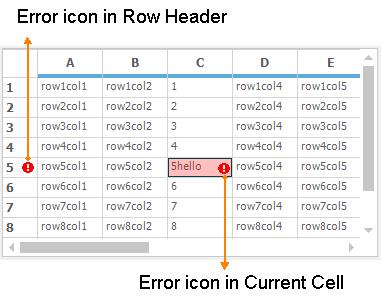
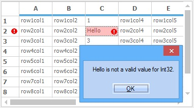
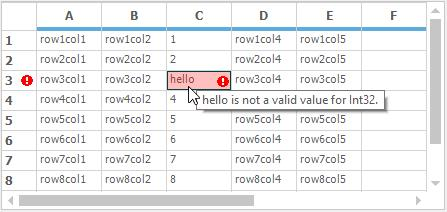
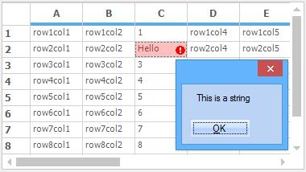
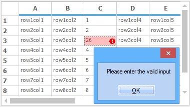

# Data Validation

GridControl provides support to validate the cell while editing. When an incorrect data is entered in the cell, it will display an error icon and an error message.  It is also possible to display error icon in row header.

## Built-in Validation

The GridControl has the built-in data validation. It will shows the error icon on the current cell to notify the error is occurred. The visibility of the error icon can be changed by setting the [ShowErrorIcon](http://help.syncfusion.com/cr/cref_files/windowsforms/grid/Syncfusion.Grid.Windows~Syncfusion.Windows.Forms.Grid.GridCurrentCell~ShowErrorIcon.html#) and [ShowRowHeaderErrorIcon](http://help.syncfusion.com/cr/cref_files/windowsforms/grid/Syncfusion.Grid.Windows~Syncfusion.Windows.Forms.Grid.GridControlBase~ShowRowHeaderErroricon.html#) property.  



//To display the error icon in the current cell
this.gridControl1.CurrentCell.ShowErrorIcon = true;

//To display the Error icon on the RowHeader
this.gridControl1.ShowRowHeaderErroricon = true;



'To display the error icon in the current cell
Me.gridControl1.CurrentCell.ShowErrorIcon = True

'To display the Error icon on the RowHeader
Me.gridControl1.ShowRowHeaderErroricon = True



N> The default value for the [ShowErrorIcon](http://help.syncfusion.com/cr/cref_files/windowsforms/grid/Syncfusion.Grid.Windows~Syncfusion.Windows.Forms.Grid.GridCurrentCell~ShowErrorIcon.html#) property value is `true` and the [ShowRowHeaderErrorIcon](http://help.syncfusion.com/cr/cref_files/windowsforms/grid/Syncfusion.Grid.Windows~Syncfusion.Windows.Forms.Grid.GridControlBase~ShowRowHeaderErroricon.html#)` property value is false`.

GridControl validates the cell based on the [CellValueType](http://help.syncfusion.com/cr/cref_files/windowsforms/grid/Syncfusion.Grid.Windows~Syncfusion.Windows.Forms.Grid.GridStyleInfo~CellValueType.html#) property and shows the error message. If `CellValueType` is `int` type and user enters `string` value, then the grid will automatically throw the error message like “Value(x) is not a valid value for Int32” in a message box. Whereas, `x` denotes the entered cell value.

By default the error provider will show a popup while the exception is occurred. When you want to disable this popup, set the [ShowErrorMessageBox](http://help.syncfusion.com/cr/cref_files/windowsforms/grid/Syncfusion.Grid.Windows~Syncfusion.Windows.Forms.Grid.GridCurrentCell~ShowErrorMessageBox.html#) property to `false`.



//Disable the Error Message Box
this.gridControl1.CurrentCell.ShowErrorMessageBox = false;



'Disable the Error Message Box
Me.gridControl1.CurrentCell.ShowErrorMessageBox = False



### Error tips support

The Error provider will also show the error message in the comment tips while moving the mouse over the error cell.

N> While the error is occurred, the current cell will not leave from the edit mode. So that the grid will not allow to perform other actions like moving the current cells, clicking, etc. The `Esc` key is used to get out from the exception with the old value of the cell.

## Programmatic Validation

While setting the cell value through the code, it will not trigger the [CurrentCellStartEditing](http://help.syncfusion.com/cr/cref_files/windowsforms/grid/Syncfusion.GridHelperClasses.Windows~Syncfusion.GridHelperClasses.GridCardView~CurrentCellStartEditing_EV.html#) and [CurrentCellValidating](http://help.syncfusion.com/cr/cref_files/windowsforms/grid/Syncfusion.Grid.Windows~Syncfusion.Windows.Forms.Grid.GridControlBase~CurrentCellValidating_EV.html#) events. Therefore the validation will not work at this type of editing. To validate this type of editing, call [CurrentCell.Validate](http://help.syncfusion.com/cr/cref_files/windowsforms/grid/Syncfusion.Grid.Windows~Syncfusion.Windows.Forms.Grid.GridCurrentCell~Validate.html#) method after editing the value of the current cell. It will raise the `CurrentCellValidating` event to manually validate the cell value.



this.gridControl1.CurrentCellValidating += new CancelEventHandler(gridControl1_CurrentCellValidating);

void gridControl1_CurrentCellValidating(object sender, CancelEventArgs e)

{

if (this.gridControl1.CurrentCell.ColIndex == 3)

{

int val;

GridTextBoxCellRenderer renderer = this.gridControl1.CurrentCell.Renderer as GridTextBoxCellRenderer;

if (renderer != null && !int.TryParse(renderer.ControlText, out val))

{

//Display custom error provider
this.gridControl1.CurrentCell.SetError("Please enter the valid input");

}

}

}

// Set the CellValue for the particular cell in a button click event
private void button1_Click(object sender, EventArgs e)

{ 

this.gridControl1[3, 3].CellValue = "Hello";

this.gridControl1.CurrentCell.MoveTo(3, 3);

this.gridControl1.CurrentCell.Validate();

}



AddHandler gridControl1.CurrentCellValidating, AddressOf gridControl1_CurrentCellValidating

Private Sub gridControl1_CurrentCellValidating(ByVal sender As Object, ByVal e As CancelEventArgs)

If Me.gridControl1.CurrentCell.ColIndex = 3 Then

Dim val As Integer

Dim renderer As GridTextBoxCellRenderer = TryCast(Me.gridControl1.CurrentCell.Renderer, GridTextBoxCellRenderer)

If renderer IsNot Nothing AndAlso (Not Integer.TryParse(renderer.ControlText, val)) Then

'Display custom error provider
Me.gridControl1.CurrentCell.SetError("Please enter the valid input")

End If

End If

End Sub

' Set the CellValue for the particular cell in a button click event
Private Sub button1_Click(ByVal sender As Object, ByVal e As EventArgs)

Me.gridControl1(3, 3).CellValue = "Hello"

Me.gridControl1.CurrentCell.MoveTo(3, 3)

Me.gridControl1.CurrentCell.Validate()

End Sub



## Customizing Error Text 

If you want to change the text displayed in the Error message box, it can be done by setting the [ValidationErrorText](http://help.syncfusion.com/cr/cref_files/windowsforms/grid/Syncfusion.Grid.Windows~Syncfusion.Windows.Forms.Grid.GridCurrentCell~ValidationErrorText.html#) property. 



//Set the text displayed in the Error Message Box
this.gridControl1.CurrentCell.ValidationErrorText = "This is a String";



'Set the text displayed in the Error Message Box
Me.gridControl1.CurrentCell.ValidationErrorText = "This is a String"



## Custom Validation

The user can validate the data based on their required conditions using some customizations. It’s also possible to handle the display of error message box using the customizations.

### Validating the Current Cell Data Using Event

The error provider can be customized by calling the [SetError](http://help.syncfusion.com/cr/cref_files/windowsforms/grid/Syncfusion.Grid.Windows~Syncfusion.Windows.Forms.Grid.GridCurrentCell~SetError.html# "") method of the current cell in the [CurrentCellValidating](http://help.syncfusion.com/cr/cref_files/windowsforms/grid/Syncfusion.Grid.Windows~Syncfusion.Windows.Forms.Grid.GridControlBase~CurrentCellValidating_EV.html# "") event. 



//Invoke this event for validate the conditions
this.gridControl1.CurrentCellValidating += gridControl1_CurrentCellValidating; 

void gridControl1_CurrentCellValidating(object sender, CancelEventArgs e)

{

if (this.gridControl1.CurrentCell.ColIndex == 3)

{

int val;

GridTextBoxCellRenderer renderer = this.gridControl1.CurrentCell.Renderer as GridTextBoxCellRenderer;

if (renderer != null && int.TryParse(renderer.ControlText,out val) && val> 20)

{

//Disply custom error provider
this.gridControl1.CurrentCell.SetError("Please enter the valid input");

}

}

}     



'Invoke this event for validate the conditions
Private Me.gridControl1.CurrentCellValidating += AddressOf gridControl1_CurrentCellValidating

Private Sub gridControl1_CurrentCellValidating(ByVal sender As Object, ByVal e As CancelEventArgs)

If Me.gridControl1.CurrentCell.ColIndex = 3 Then

Dim val As Integer

Dim renderer As GridTextBoxCellRenderer = TryCast(Me.gridControl1.CurrentCell.Renderer, GridTextBoxCellRenderer)

If renderer IsNot Nothing AndAlso Integer.TryParse(renderer.ControlText,val) AndAlso val> 20 Then

'Disply custom error provider
Me.gridControl1.CurrentCell.SetError("Please enter the valid input")

End If

End If

End Sub



When the validation is failed at the `CurrentCellValidating` event, the custom error provider will pop up the error message as of follows,

### Handling Error Message using events

The [CurrentCellErrorMessage](http://help.syncfusion.com/cr/cref_files/windowsforms/grid/Syncfusion.Grid.Windows~Syncfusion.Windows.Forms.Grid.GridControlBase~CurrentCellErrorMessage_EV.html#) event will triggered while the error is occurred. It can be used to get the error message by using the `e.Text` and also used to restrict display of error message box by handling this event like `e.Cancel` value as `true`. 



this.gridControl1.CurrentCellErrorMessage += gridControl1_CurrentCellErrorMessage;

void gridControl1_CurrentCellErrorMessage(object sender, GridCurrentCellErrorMessageEventArgs e)

{

// Does not show the Message box for error provider
e.Cancel = true;

}



Private Me.gridControl1.CurrentCellErrorMessage += AddressOf gridControl1_CurrentCellErrorMessage

Private Sub gridControl1_CurrentCellErrorMessage(ByVal sender As Object, ByVal e As GridCurrentCellErrorMessageEventArgs)

' Does not show the Message box for error provider
e.Cancel = True

End Sub



