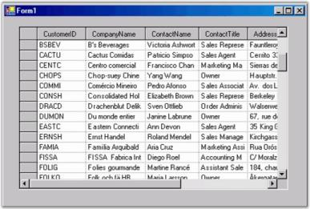
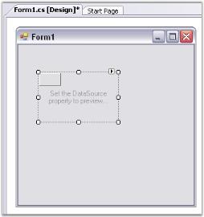
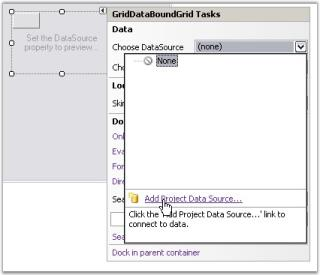
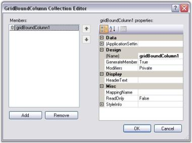

# DataBound Grid

DataBound Grid has been designed to be used as a grid that is bound to a data source such as an ADO.NET dataset or data table. It can be used with either flat or hierarchical data sources and it does not include grouping support. No data value is stored in GridDataBoundGrid object. DataBound Grid is more column-centric than the Grid control as it is data bound. Its GridBoundColumns collection property will maintain an array of GridBoundColumn objects that will hold information like HeaderText, MappingName and GridStyleInfo object that holds the style properties for the column.

## Creating Grid DataBound Grid

This section will provide step-by-step procedure to create Grid DataBound Grid through designer and through programmatical approach in a .NET application.

### Through Designer

With the designer, all you have to do is drag Grid DataBound Grid control, resize it and then set the desired properties. The following steps illustrate this.

1. Drag GridBoundDataGrid object from your toolbox onto the form.

   
   
2. Size and position it.

3. Click Smart tag, expand Choose DataSource combo box and click Add Project DataSource.

   

4. In the Data Source Configuration wizard, select Database and click Next.

   

5. Select appropriate data connection and click Next. This example uses Northwind database available in: _&lt;Sample Install Location&gt;\Syncfusion\EssentialStudio\x.x.x.x\Common\Data_

   

6. Select appropriate table and data using this wizard.

   

7. To customize columns, open GridBoundColumns collection by clicking that property in Grid DataBound Grid. With this editor, you can determine exactly which columns of data source are displayed in the grid. You can also set column properties like backcolor and font.

   

8. Run the application. Following is the output.

   

Grid Data Bound Grid is added to the windows application and bound to a local data source. For more details, see Grid Data Bound Grid tutorial.

### Through Code

Here are some code samples that will create a DataTable and bind it a to Grid Data Bound Grid. Once you have a DataTable object populated you can use the GridDataBoundGrid.DataSource property to implement the binding.



DataTable myDataTable = new DataTable("MyDataTable");

//Declares the Data Column and Data Row variables.

DataColumn myDataColumn;

DataRow myDataRow;

//Creates a new Data Column, sets the Data Type and Column Name and adds to the Data Table.   

myDataColumn = new DataColumn();

myDataColumn.DataType = System.Type.GetType("System.Int32");

myDataColumn.ColumnName = "id";

myDataTable.Columns.Add(myDataColumn);

//Creates a second column.

myDataColumn = new DataColumn();

myDataColumn.DataType = Type.GetType("System.String");

myDataColumn.ColumnName = "item";

myDataTable.Columns.Add(myDataColumn);

//Creates new Data Row objects and adds to the Data Table.    

for (int i = 0; i <= 10; i++)

{

    myDataRow = myDataTable.NewRow();

    myDataRow["id"] = i;

    myDataRow["item"] = "item " + i.ToString();

    myDataTable.Rows.Add(myDataRow);

}

this.GridDataBoundGrid1.DataSource = myDataTable;

//Sizes the columns.

this.GridDataBoundGrid1.Model.ColWidths[1] = 30;

this.GridDataBoundGrid1.Model.ColWidths[2] = 50;





Dim myDataTable As DataTable = New DataTable("MyDataTable")

'Declares the Data Column and Data Row variables.

Dim myDataColumn As DataColumn

Dim myDataRow As DataRow

'Creates a new Data Column, sets Data Type and Column Name and adds to the Data Table. 

myDataColumn = New DataColumn()

myDataColumn.DataType = System.Type.GetType("System.Int32")

myDataColumn.ColumnName = "id"

myDataTable.Columns.Add(myDataColumn)

'Creates a second column.

myDataColumn = New DataColumn()

myDataColumn.DataType = Type.GetType("System.String")

myDataColumn.ColumnName = "item"

myDataTable.Columns.Add(myDataColumn)

'Creates new Data Row objects and adds to the Data Table.    

Dim i As Integer

For i = 0 To 10

myDataRow = myDataTable.NewRow

myDataRow("id") = i

myDataRow("item") = "item " & i

myDataTable.Rows.Add(myDataRow)

Next i

Me.gridDataBoundGrid1.DataSource = myDataTable

'Sizes the columns.

Me.gridDataBoundGrid1.Model.ColWidths(1) = 30

Me.gridDataBoundGrid1.Model.ColWidths(2) = 50



