# Drag and Drop

GridControl supports drag and drop functionality, which allows to drag and drop values from range of cells within a grid or multiple grids. It is required to set the [AllowDrop](https://msdn.microsoft.com/en-in/library/system.windows.uielement.allowdrop.aspx#) property to `true` for achieving this support. 



// Enabling DragDrop for GridControl
this.gridControl1.AllowDrop = true;



'Enabling DragDrop for GridControl
Me.gridControl1.AllowDrop = True



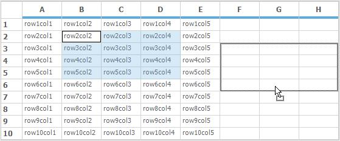

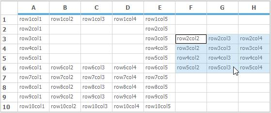

## Drag and Drop between multiple grids

It is also possible to drag and drop between the two or more GridControls by enabling the `AllowDrop` property for both of the GridControls.



// Enabling DragDrop for the first GridControl
this.gridControl1.AllowDrop = true;

// Enabling DragDrop for the second GridControl
this.gridControl2.AllowDrop = true;



'Enabling DragDrop for the first GridControl
Me.gridControl1.AllowDrop = True

'Enabling DragDrop for the second GridControl
Me.gridControl2.AllowDrop = True



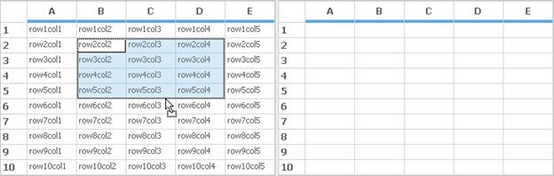

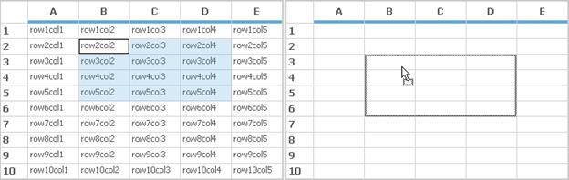

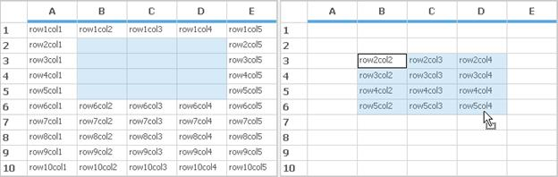

N> OLE Drag Drop operation is also possible between GridControl and any other text editors.

## Column Ordering

In GridControl, the drag drop functionality is available in between the columns of the Grid. This can be achieved by setting the [ControllerOptions](http://help.syncfusion.com/cr/cref_files/windowsforms/grid/Syncfusion.Grid.Windows~Syncfusion.Windows.Forms.Grid.GridControllerOptions.html#) property as `DragColumnHeader`.



this.gridControl1.ControllerOptions = GridControllerOptions.DragColumnHeader;



Me.gridControl1.ControllerOptions = GridControllerOptions.DragColumnHeader



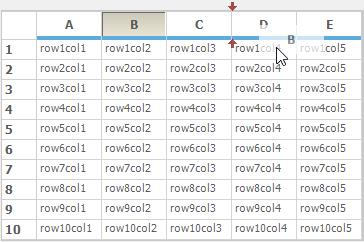

N> It is also possible to stop the drag drop functionality between columns by using the below code,



this.gridControl1.ControllerOptions ~= GridControllerOptions.DragColumnHeader;



Me.gridControl1.ControllerOptions ~= GridControllerOptions.DragColumnHeader



### Disabling drag and drop for a particular column header

There is an event named [QueryAllowDragColumnHeader](http://help.syncfusion.com/cr/cref_files/windowsforms/grid/Syncfusion.Grid.Windows~Syncfusion.Windows.Forms.Grid.GridControlBaseImp~QueryAllowDragColumnHeader_EV.html#) which gets fired while dragging the header. This event can be used to prevent drag drop operation between particular headers by setting the [AllowDrag](http://help.syncfusion.com/cr/cref_files/windowsforms/grid/Syncfusion.Grid.Windows~Syncfusion.Windows.Forms.Grid.GridQueryDragColumnHeaderEventArgs~AllowDrag.html#) property as `false`.



this.gridControl1.QueryAllowDragColumnHeader += new GridQueryDragColumnHeaderEventHandler(gridControl1_QueryAllowDragColumnHeader);

void gridControl1_QueryAllowDragColumnHeader(object sender, GridQueryDragColumnHeaderEventArgs e)

{

// Prevents dragging in 2nd column.
if (e.Column == 2)

e.AllowDrag = false;

}



Private Me.gridControl1.QueryAllowDragColumnHeader += New GridQueryDragColumnHeaderEventHandler(AddressOf gridControl1_QueryAllowDragColumnHeader)

Private Sub gridControl1_QueryAllowDragColumnHeader(ByVal sender As Object, ByVal e As GridQueryDragColumnHeaderEventArgs)

'Prevents dragging in 2nd column.
e.AllowDrag = False

End Sub



## Customizing Drag and Drop

It is possible to control the clipboard format of the data that is being be dragged by using the [Model.Options.DragDropDropTargetFlags](http://help.syncfusion.com/cr/cref_files/windowsforms/grid/Syncfusion.Grid.Windows~Syncfusion.Windows.Forms.Grid.GridModelOptions~DragDropDropTargetFlags.html#). Check the enumeration [GridDragDropFlags](http://help.syncfusion.com/cr/cref_files/windowsforms/grid/Syncfusion.Grid.Windows~Syncfusion.Windows.Forms.Grid.GridDragDropFlags_members.html#) to see the full set of options that are supported.



// Accepts only text values while dropping the contents
gridControl2.Model.Options.DragDropDropTargetFlags = GridDragDropFlags.Text;



'Accepts only text values while dropping the contents
gridControl2.Model.Options.DragDropDropTargetFlags = GridDragDropFlags.Text



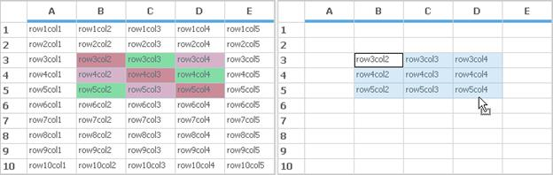



// Accepts both text values and appearance while dropping the contents
gridControl2.Model.Options.DragDropDropTargetFlags = GridDragDropFlags.Text | GridDragDropFlags.Styles;



'Accepts both text values and appearance while dropping the contents
gridControl2.Model.Options.DragDropDropTargetFlags = GridDragDropFlags.Text Or GridDragDropFlags.Styles



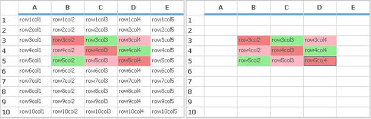

## Drag Drop Events

It is also possible to move or copy the contents from one grid to another by using events. There are three events related to Drag and Drop.

* [DragOver](https://msdn.microsoft.com/en-in/library/system.windows.forms.control.dragover.aspx#) 
* [DragEnter](https://msdn.microsoft.com/en-us/library/system.windows.forms.control.dragenter.aspx#)
* [DragDrop](https://msdn.microsoft.com/en-us/library/system.windows.forms.control.dragdrop.aspx#) 
* [DragLeave](https://msdn.microsoft.com/en-us/library/system.windows.forms.control.dragleave.aspx#)

To change the effects of the contents while dropping, [Effect](https://msdn.microsoft.com/en-us/library/system.windows.forms.drageventargs.effect.aspx#) property can be used. 



this.gridControl2.DragOver += new DragEventHandler(gridControl2_DragOver);

void gridControl2_DragOver(object sender, DragEventArgs e)

{

// Contents that are been dragged over gridControl2 will be copied.
e.Effect = DragDropEffects.Copy;

}



AddHandler gridControl2.DragOver, AddressOf gridControl2_DragOver

Private Sub gridControl2_DragOver(ByVal sender As Object, ByVal e As DragEventArgs)

' Contents that are been dragged over gridControl2 will be copied.
e.Effect = DragDropEffects.Copy

End Sub



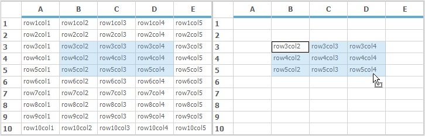

### Prevent Drag and Drop

The contents alone can be prevented while dropping by setting the [Effect](https://msdn.microsoft.com/en-us/library/system.windows.forms.drageventargs.effect.aspx#) property as `None`.



this.gridControl2.DragOver += new DragEventHandler(gridControl2_DragOver);

void gridControl2_DragOver(object sender, DragEventArgs e)

{

// Contents that are been dragged over gridControl2 will not be moved or copied.
e.Effect = DragDropEffects.None;

}



AddHandler gridControl2.DragOver, AddressOf gridControl2_DragOver

Private Sub gridControl2_DragOver(ByVal sender As Object, ByVal e As DragEventArgs)

'Contents that are been dragged over gridControl2 will not be moved or copied.
e.Effect = DragDropEffects.None

End Sub



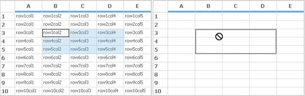

### Blocking the data before dragging

[QueryCanOleDragRange](http://help.syncfusion.com/cr/cref_files/windowsforms/grid/Syncfusion.Grid.Windows~Syncfusion.Windows.Forms.Grid.GridControlBase~QueryCanOleDragRange_EV.html#) event can be used to identify in which range the contents are been moved. It is also possible to cancel the process of Drag and drop operations by using the `Cancel` property.



this.gridControl1.QueryCanOleDragRange += new GridQueryCanOleDragRangeEventHandler(gridControl1_QueryCanOleDragRange);

void gridControl1_QueryCanOleDragRange(object sender, GridQueryCanOleDragRangeEventArgs e)

{

// Drag Drop process will be cancelled.
e.Cancel = true;

}



Private Me.gridControl1.QueryCanOleDragRange += New GridQueryCanOleDragRangeEventHandler(AddressOf gridControl1_QueryCanOleDragRange)

Private Sub gridControl1_QueryCanOleDragRange(ByVal sender As Object, ByVal e As GridQueryCanOleDragRangeEventArgs)

'Drag Drop process will be cancelled.
e.Cancel = True

End Sub



### Drag and Drop for merged cells

Drag Drop can also be done for merged cells but while dropping the contents to another location the merged cells will be removed. To overcome this problem make use of the [QueryCanOleDragRange](http://help.syncfusion.com/cr/cref_files/windowsforms/grid/Syncfusion.Grid.Windows~Syncfusion.Windows.Forms.Grid.GridControlBase~QueryCanOleDragRange_EV.html#)  event and add the merged range in the selection property.



//QueryCanOleDragRange event.
void gridControl1_QueryCanOleDragRange(object sender, GridQueryCanOleDragRangeEventArgs e)

{

if (e.Range.Left != e.Range.Right || e.Range.Top!=e.Range.Bottom)

this.gridControl1.Selections.Add(e.Range);

}



'QueryCanOleDragRange event.
Private Sub gridControl1_QueryCanOleDragRange(ByVal sender As Object, ByVal e As GridQueryCanOleDragRangeEventArgs)

If e.Range.Left <> e.Range.Right OrElse e.Range.Top<>e.Range.Bottom Then

Me.gridControl1.Selections.Add(e.Range)

End If

End Sub



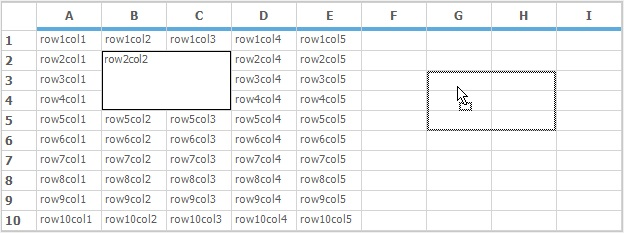

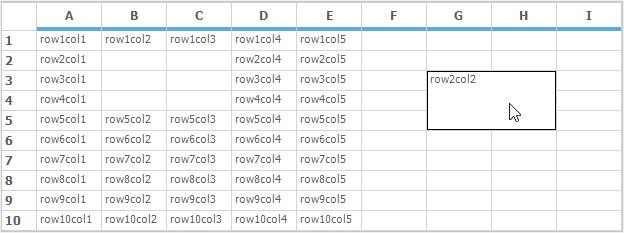

For more info regarding the Drag Drop related queries please refer our KB articles which can be viewed over [here](https://www.syncfusion.com/kb/windowsforms/gridcontrol?sortId=0&tags=drag-and-drop#).

### Retaining the dragged contents

By default while moving the contents from one grid to another using drag and drop operation, the contents of the first grid will be moved completely to the second grid. To overcome this make use of the [QueryDragDropMoveClearCells](http://help.syncfusion.com/cr/cref_files/windowsforms/grid/Syncfusion.Grid.Windows~Syncfusion.Windows.Forms.Grid.GridModel~QueryDragDropMoveClearCells_EV.html#) event and set the `Cancel` property as `true`. 



this.gridControl1.Model.QueryDragDropMoveClearCells += new CancelEventHandler(Model_QueryDragDropMoveClearCells);

void Model_QueryDragDropMoveClearCells(object sender, CancelEventArgs e)

{

// Cancels the Clearing of Cells in the Grid
e.Cancel = true;

}



AddHandler gridControl1.Model.QueryDragDropMoveClearCells, AddressOf Model_QueryDragDropMoveClearCells

Private Sub Model_QueryDragDropMoveClearCells(ByVal sender As Object, ByVal e As CancelEventArgs)

' Cancels the Clearing of Cells in the Grid
e.Cancel = True

End Sub



### Obtaining the dragging range

[QueryOleDataSourceData](http://help.syncfusion.com/cr/cref_files/windowsforms/grid/Syncfusion.Grid.Windows~Syncfusion.Windows.Forms.Grid.GridModel~QueryOleDataSourceData_EV.html#) is another event which is used to get the range of cells that is being copied by using OLE Drag Drop operations.



gridControl1.QueryOleDataSourceData += new GridQueryOleDataSourceDataEventHandler(gridControl1_QueryOleDataSourceData);

void gridControl1_QueryOleDataSourceData(object sender, GridQueryOleDataSourceDataEventArgs e)

{

// Gets the selected range that is been dragged.
string s = e.RangeList.ToString(); 

}



AddHandler gridControl1.QueryOleDataSourceData, AddressOf gridControl1_QueryOleDataSourceData

Private Sub gridControl1_QueryOleDataSourceData(ByVal sender As Object, ByVal e As GridQueryOleDataSourceDataEventArgs)

'Gets the selected range that is been dragged.
Dim s As string = e.RangeList.ToString()

End Sub



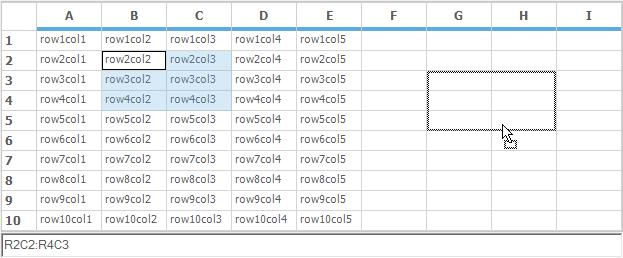

### Finding the row index and column index of the dropped grid

It is possible to get the row index and column index while drag and drop the contents to the exact location by using the [Model.OleDropAtRowCol](http://help.syncfusion.com/cr/cref_files/windowsforms/grid/Syncfusion.Grid.Windows~Syncfusion.Windows.Forms.Grid.GridModel~OleDropAtRowCol_EV.html#) event.



gridControl3.Model.OleDropAtRowCol += new GridOleDropAtRowColEventHandler(Model_OleDropAtRowCol);

void Model_OleDropAtRowCol(object sender, GridOleDropAtRowColEventArgs e)

{

this.richTextBox1.Text = "Contents are dropped in the RowIndex " + e.RowIndex + " and ColIndex " + e.ColIndex;

}



AddHandler gridControl3.Model.OleDropAtRowCol, AddressOf Model_OleDropAtRowCol

Private Sub Model_OleDropAtRowCol(ByVal sender As Object, ByVal e As GridOleDropAtRowColEventArgs)

Me.richTextBox1.Text = "Contents are dropped in the RowIndex " & e.RowIndex & " and ColIndex " & e.ColIndex

End Sub



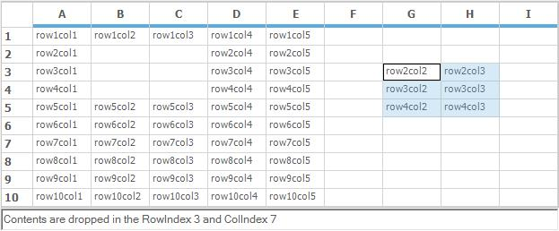

