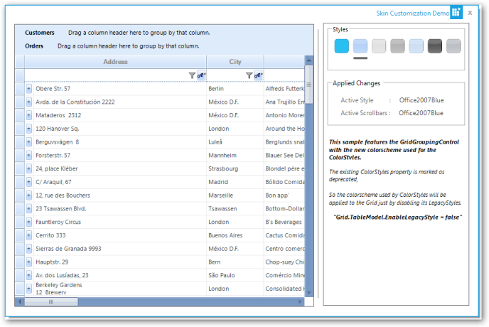

# Enhanced Visual Styles for Syncfusion Windows Grids

This feature enables you to apply an enhanced visual styles for Windows Grids: Grid control, GridGrouping control, GridDataBoundGrid, GridList control, GridRecordNavigation control and associated scrollbars, combo box drop-down container, filter (dynamic filter and filter bar), selected row and group drop area.

By default, EnableLegacyStyle property value is true.

## Use Case Scenarios

You can use this control to apply skin for the entire control including the scrollbars, combo box, drop-down container, filter, and so on.

 _Table 141: Properties Table_

<table>
<tr>
<th>
PROPERTY</th><th>
DESCRIPTION</th><th>
DATA TYPE</th></tr>
<tr>
<td>
EnableLegacyStyle</td><td>
Specifies whether the enhanced GridVisual style has to be enabled.</td><td>
Boolean</td></tr>
<tr>
<td>
EnableGridListControlInCobmoBox</td><td>
Specifies whether the grid combo box should contain GridList control.</td><td>
Boolean</td></tr>
</table>

## Sample Link

Samples for the feature are available in the following locations: 

_&lt;Install Location&gt;\Syncfusion\EssentialStudio\[Version Number]\Windows\Grid.Grouping.Windows\Samples\Styling and Formatting\Skin Customization Demo_

## Applying Enhanced GridVisualStyle to the Application

To apply enhanced visual style to the entire control, you have to enable enhanced GridVisualStyle. You can enable this using _EnableLegacyStyle_ property. To enable enhanced GridVisualStyle, set EnableLegacyStyle to _false_. To enable GridVisualStyle, set EnableLegacyStyle to _true_. By default, this is set to _true_.                                                   

The following code illustrates how to enable enhanced GridVisualStyle. 



this.gridGroupingControl1.TableModel.EnableLegacyStyle = false;




Me.gridGroupingControl1.TableModel.EnableLegacyStyle = False


## EnhancedGridVisualStyle

You can apply one of the following skins to the control using EnhancedGridVisualStyle property: 

* Office2003
* Office2007Blue
* Office2007Black
* Office2007Silver
* Office2010Blue
* Office2010Black
* Office2010Silver
* Metro
* SystemTheme 

## SystemTheme is the default skin.

The following code illustrated how to customize the skin for the control: 


this.gridGroupingControl1.GridVisualStyles = GridVisualStyles.Office2007Black;





this.gridGroupingControl1.GridVisualStyles = GridVisualStyles.Office2007Black


 

## Combo Box

Skin cannot be applied to ListBox control inside combo box. To overcome this limitation, Essential Grid uses GridList__control in the combo box. The enhanced GridVisualStyle settings uses combo box with GridDropDownGridListControlCellModel, which is inherited from GridComboBoxCellModel__class, instead of using GridComboBoxCellModel directly. To use GridList control in the combo box (which enables you to apply styles), set EnableGridListControlInCobmoBox property to true_._  This is__the default value.

The following code illustrated this: 


this.gridControl1.Model.EnableGridListControlInComboBox = true;




Me.gridControl1.Model.EnableGridListControlInComboBox = true


If you want to create an application for which the combo box is created from GridComboBoxCellModel and not to use GridDropDownGridListControlCellModel, you need to set EnableGridListControlInCobmoBox property to false. By default, this is set to true.

The following code illustrates how to disable EnableGridListControlInCobmoBox property:


this.gridControl1.Model.EnableGridListControlInComboBox = false;




this.gridControl1.Model.EnableGridListControlInComboBox = false;



