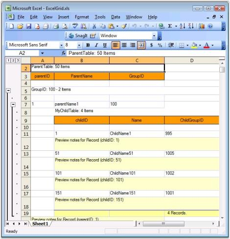

# Excel Export

Export to Excel is one of the most common functionalities required in the .Net world. The Essential Grid Control has in-built support for Excel Export. Users can download data from the Grouping Grid control into an Excel spreadsheet for offline verification and/or computation. This can be achieved by making use of the GroupingGridExcelConverter class. This section will walk you through the conversion of the contents of grid to an excel file as well as discuss various converter options.

GroupingGridExcelConverter class derives from GridExcelConverterBase. It contains a number of methods that helps in exporting different components of the grouping grid. Its properties will let you control the export of grid schema like styles and grid elements. You will be able to export Styles, RecordPlusMinus, GroupCaptionPlusMinus, Borders and PreviewRows as well.

### ConverterOptions

Exporting of a Grouping Grid to Excel has two options: Visible and Default. Visible option will allow you to export only the visible contents of the grid, whereas Default option exports the entire elements of the grouping grid. Converter options are defined in GridExcelConverter.ConverterOptions enumeration.

The following table lists the properties offered by Grouping Grid Excel Converter. By setting these properties, you would be able to choose the elements you need to export.

_Table 107: Grouping Grid Excel Converter properties_

<table>
<tr>
<th>
PROPERTIES</th><th>
DESCRIPTION</th></tr>
<tr>
<td>
ExportBorders</td><td>
Specifies if borders should be exported.</td></tr>
<tr>
<td>
ExportStyle</td><td>
Indicates if style should be exported.</td></tr>
<tr>
<td>
ExportGroupPlusMinus</td><td>
Specifies if GridGroup should be exported as Excel Group.</td></tr>
<tr>
<td>
ExportRecordPlusMinus</td><td>
When true, the record with related tables will be exported as Excel Group.</td></tr>
<tr>
<td>
ExportPreviewRows</td><td>
When enabled, PreviewRows will be exported.</td></tr>
<tr>
<td>
CaptionBackColor</td><td>
Specifies the color to be used for Caption in the worksheet.</td></tr>
<tr>
<td>
HeaderBackColor</td><td>
Indicates the color to be used for Header in the worksheet.</td></tr>
</table>

#### Method

Grouping Grid Excel Converter control provides a method called GroupingGridToExcel. This is the method that converts grouping grid contents to an excel file. It accepts three parameters: grouping grid to be converted, filename of the destination worksheet, and convert options.

#### Syntax



GroupingGridExcelConverterControl converter = new GroupingGridExcelConverterControl();

converter.GroupingGridToExcel(this.gridGroupingControl1, "Grid.xls", ConverterOptions.Visible);





Dim converter As GroupingGridExcelConverter = New GroupingGridExcelConverter()

converter.GroupingGridToExcel(Me.gridGroupingControl1, "Grid.xls", ConverterOptions.Visible)



### Events

QueryExportPreviewRowInfo is an event offered by the Grouping Grid Excel Converter control that aids in the conversion process. It occurs for each PreviewRow element before exporting the grid and letting you customize the preview row. It accepts two parameters: one contains the Element to export and the other the GridStyleInfo object representing style information.

#### Syntax



GroupingGridExcelConverter converter  = new GroupingGridExcelConverter();

converter.QueryExportPreviewRowInfo += new GroupingGridExcelConverterControl.GroupingGridExportPreviewRowQueryInfoEventHandler(converter_QueryExportPreviewRowInfo);

void converter_QueryExportPreviewRowInfo(object sender, GroupingGridExportPreviewRowQueryInfoEventArgs e)

{

}





Dim converter As GroupingGridExcelConverter  = New GroupingGridExcelConverter()

AddHandler converter.QueryExportPreviewRowInfo, AddressOf converter_QueryExportPreviewRowInfo

Private Sub converter_QueryExportPreviewRowInfo(ByVal sender As Object, ByVal e As GroupingGridExportPreviewRowQueryInfoEventArgs)

End Sub



#### Implementation

Here is an example that illustrates the conversion of a grouping grid to an Excel file.

1. Include the required namespaces.

   ~~~ cs
   
		using Syncfusion.GridExcelConverter;

		using Syncfusion.GroupingGridExcelConverter;

		using Syncfusion.Grouping;

		using Syncfusion.Windows.Forms.Grid;

		using Syncfusion.Windows.Forms.Grid.Grouping;
		
		using Syncfusion.XlsIO;

   ~~~
   {:.prettyprint }

   ~~~ vbnet

		Imports Syncfusion.XlsIO

		Imports Syncfusion.GridExcelConverter

		Imports Syncfusion.GroupingGridExcelConverter

		Imports Syncfusion.Grouping

		Imports Syncfusion.Windows.Forms.Grid

		Imports Syncfusion.Windows.Forms.Grid.Grouping

   ~~~
   {:.prettyprint }

2. Setup an hierarchical datasource.

   ~~~ cs

		private int numberParentRows = 50;

		private int numberChildRows = 200;

		private int numberGrandChildRows = 500;

		private DataTable GetParentTable()

		{

			DataTable dt = new DataTable("ParentTable");

			dt.Columns.Add(new DataColumn("parentID"));

			dt.Columns.Add(new DataColumn("ParentName"));

			dt.Columns.Add(new DataColumn("GroupID"));

			Random r = new Random();

			for (int i = 0; i < numberParentRows; i++)

			{

				DataRow dr = dt.NewRow();

				dr[0] = i;

				dr[1] = string.Format("parentName{0}", i);

				dr[2] = r.Next(99, 111);

				dt.Rows.Add(dr);

			}

			return dt;

		}

		private DataTable GetChildTable()

		{

			DataTable dt = new DataTable("ChildTable");

			dt.Columns.Add(new DataColumn("childID"));

			dt.Columns.Add(new DataColumn("Name"));

			dt.Columns.Add(new DataColumn("ParentID"));

			dt.Columns.Add(new DataColumn("ChildGroupID"));

			Random r = new Random();

			for (int i = 0; i < numberChildRows; i++)

			{

				DataRow dr = dt.NewRow();

				dr[0] = i.ToString();

				dr[1] = string.Format("ChildName{0}", i);

				dr[2] = (i % numberParentRows).ToString();

				dr[3] = r.Next(994, 1006);

				dt.Rows.Add(dr);

			}

			return dt;

		}

   ~~~
   {:.prettyprint }

   ~~~ vbnet

		Private numberParentRows As Integer = 50

		Private numberChildRows As Integer = 200

		Private numberGrandChildRows As Integer = 500

		Private Function GetParentTable() As DataTable

		Dim dt As DataTable = New DataTable("ParentTable")

		dt.Columns.Add(New DataColumn("parentID"))

		dt.Columns.Add(New DataColumn("ParentName"))

		dt.Columns.Add(New DataColumn("GroupID"))

		Dim r As Random = New Random()

		Dim i As Integer = 0

		Do While i < numberParentRows

		Dim dr As DataRow = dt.NewRow()

		dr(0) = i

		dr(1) = String.Format("parentName{0}", i)

		dr(2) = r.Next(99, 111)

		dt.Rows.Add(dr)

		i += 1

		Loop

		Return dt

		End Function

		Private Function GetChildTable() As DataTable

		Dim dt As DataTable = New DataTable("ChildTable")

		dt.Columns.Add(New DataColumn("childID"))

		dt.Columns.Add(New DataColumn("Name"))

		dt.Columns.Add(New DataColumn("ParentID"))

		dt.Columns.Add(New DataColumn("ChildGroupID"))

		Dim r As Random = New Random()

		Dim i As Integer = 0

		Do While i < numberChildRows

		Dim dr As DataRow = dt.NewRow()

		dr(0) = i.ToString()

		dr(1) = String.Format("ChildName{0}", i)

		dr(2) = (i Mod numberParentRows).ToString()

		dr(3) = r.Next(994, 1006)

		dt.Rows.Add(dr)

		i += 1

		Loop

		Return dt

		End Function

   ~~~
   {:.prettyprint }

3. Setup a grouping grid and load it with data from data source. Customize the grid by adding preview rows, groups, etc., as required.

   ~~~ cs

		DataTable parentTable = GetParentTable();

		DataTable childTable = GetChildTable();

		//Adds Summary row to parent table.

		GridSummaryColumnDescriptor gridSummaryColumnDescriptor = new GridSummaryColumnDescriptor();

		gridSummaryColumnDescriptor.DisplayColumn = "GroupID";

		gridSummaryColumnDescriptor.Format = "  {Count} Records.";

		gridSummaryColumnDescriptor.Name = "SummaryColumn";

		gridSummaryColumnDescriptor.SummaryType = SummaryType.Count;

		this.gridGroupingControl1.TableDescriptor.SummaryRows.Add(new GridSummaryRowDescriptor("SummaryRow", new GridSummaryColumnDescriptor[] {gridSummaryColumnDescriptor}));

		//Manually specify relations in grouping engine.

		GridRelationDescriptor parentToChildRelationDescriptor = new GridRelationDescriptor();

		parentToChildRelationDescriptor.ChildTableName = "MyChildTable";// same as SourceListSetEntry.Name for childTable 

		parentToChildRelationDescriptor.RelationKind = RelationKind.RelatedMasterDetails;

		parentToChildRelationDescriptor.RelationKeys.Add("parentID", "ParentID");

		//Adds Summary Row to child table.

		gridSummaryColumnDescriptor = new GridSummaryColumnDescriptor();

		gridSummaryColumnDescriptor.DisplayColumn = "ChildGroupID";

		gridSummaryColumnDescriptor.Format = "  {Count} Records.";

		gridSummaryColumnDescriptor.Name = "SummaryColumn";

		gridSummaryColumnDescriptor.SummaryType = SummaryType.Count;

		parentToChildRelationDescriptor.ChildTableDescriptor.SummaryRows.Add(new GridSummaryRowDescriptor("SummaryRow", new Syncfusion.Windows.Forms.Grid.Grouping.GridSummaryColumnDescriptor[] {gridSummaryColumnDescriptor}));

		//Adds relation to parent table.

		gridGroupingControl1.TableDescriptor.Relations.Add(parentToChildRelationDescriptor);

		//Registers any DataTable/IList with SourceListSet, so that RelationDescriptor can resolve the name

		this.gridGroupingControl1.Engine.SourceListSet.Add("MyParentTable", parentTable);

		this.gridGroupingControl1.Engine.SourceListSet.Add("MyChildTable", childTable);

		this.gridGroupingControl1.DataSource = parentTable;

		this.gridGroupingControl1.ShowGroupDropArea = true;

		this.gridGroupingControl1.AddGroupDropArea("MyChildTable");

		//The TrackWidthOfParentColumn property of a column descriptor ensures that 

		//columns are aligned and synchronized. 

		this.gridGroupingControl1.TableDescriptor.Columns[0].Width = 200;

		this.gridGroupingControl1.TableDescriptor.Columns[1].Width = 150;

		this.gridGroupingControl1.TableDescriptor.Columns[2].Width = 150;

		//Synchronizes width of columns in child record with width of column in parent record.

		for(int n=0;n<3;n++)

		parentToChildRelationDescriptor.ChildTableDescriptor.Columns[n].TrackWidthOfParentColumn = gridGroupingControl1.TableDescriptor.Columns[n].Name;

		this.gridGroupingControl1.TableDescriptor.GroupedColumns.Add("GroupID");

		this.gridGroupingControl1.TableOptions.ShowRecordPreviewRow = true;

		this.gridGroupingControl1.ChildGroupOptions.ShowGroupPreview = true;

		this.gridGroupingControl1.TableDescriptor.Columns["GroupID"].Appearance.AnyHeaderCell.HorizontalAlignment = GridHorizontalAlignment.Right;

		this.gridGroupingControl1.TableDescriptor.Columns["GroupID"].Appearance.AnyHeaderCell.VerticalAlignment = GridVerticalAlignment.Bottom;

		this.gridGroupingControl1.Appearance.AnySummaryCell.Interior = new BrushInfo(Color.FromArgb(255, 231, 162));

		//Hooks up this event to handle preview rows.

		this.gridGroupingControl1.QueryCellStyleInfo += new GridTableCellStyleInfoEventHandler(gridGroupingControl1_QueryCellStyleInfo);

		Private Sub gridGroupingControl1_QueryCellStyleInfo(sender Object, GridTableCellStyleInfoEventArgs e)
		{
		if (e.TableCellIdentity.TableCellType == GridTableCellType.RecordPreviewCell)
		{
		 Element  el= e.TableCellIdentity.DisplayElement;

		 e.Style.CellValue = ("Preview notes for Record (" 
					+ (el.ParentTableDescriptor.Fields(0).Name + (": " 
					+ (el.ParentRecord.GetValue(el.ParentTableDescriptor.Fields(0).Name) + ")"))));
		}

		if( e.TableCellIdentity.TableCellType == GridTableCellType.GroupPreviewCell) 
		{
		  Element el = e.TableCellIdentity.DisplayElement;

		  e.Style.CellValue = ("Preview notes for Group (" 
					+ (el.ParentGroup.Name + (": " 
					+ (el.ParentGroup.Category.ToString() + ")"))));
		}
		}
		
   ~~~
   {:.prettyprint }

   ~~~ vbnet

		Dim parentTable As DataTable = GetParentTable()

		Dim childTable As DataTable = GetChildTable()

		'Adds Summary row to parent table.

		Dim gridSummaryColumnDescriptor As New GridSummaryColumnDescriptor()

		gridSummaryColumnDescriptor.DisplayColumn = "GroupID"

		gridSummaryColumnDescriptor.Format = "  {Count} Records."

		gridSummaryColumnDescriptor.Name = "SummaryColumn"

		gridSummaryColumnDescriptor.SummaryType = SummaryType.Count

		Me.gridGroupingControl1.TableDescriptor.SummaryRows.Add(New GridSummaryRowDescriptor("SummaryRow", New GridSummaryColumnDescriptor() {gridSummaryColumnDescriptor}))

		'Manually specify relations in grouping engine.

		Dim parentToChildRelationDescriptor As New GridRelationDescriptor()

		parentToChildRelationDescriptor.ChildTableName = "MyChildTable" ' same as SourceListSetEntry.Name for childTable

		parentToChildRelationDescriptor.RelationKind = RelationKind.RelatedMasterDetails

		parentToChildRelationDescriptor.RelationKeys.Add("parentID", "ParentID")

		'Adds Summary Row to child table.

		gridSummaryColumnDescriptor = New GridSummaryColumnDescriptor()

		gridSummaryColumnDescriptor.DisplayColumn = "ChildGroupID"

		gridSummaryColumnDescriptor.Format = "  {Count} Records."

		gridSummaryColumnDescriptor.Name = "SummaryColumn"

		gridSummaryColumnDescriptor.SummaryType = SummaryType.Count

		parentToChildRelationDescriptor.ChildTableDescriptor.SummaryRows.Add(New GridSummaryRowDescriptor("SummaryRow", New Syncfusion.Windows.Forms.Grid.Grouping.GridSummaryColumnDescriptor() {gridSummaryColumnDescriptor}))

		'Adds relation to parent table.

		gridGroupingControl1.TableDescriptor.Relations.Add(parentToChildRelationDescriptor)

		'Registers any DataTable/IList with SourceListSet, so that RelationDescriptor can resolve the name

		Me.gridGroupingControl1.Engine.SourceListSet.Add("MyParentTable", parentTable)

		Me.gridGroupingControl1.Engine.SourceListSet.Add("MyChildTable", childTable)

		Me.gridGroupingControl1.DataSource = parentTable

		Me.gridGroupingControl1.ShowGroupDropArea = True

		Me.gridGroupingControl1.AddGroupDropArea("MyChildTable")

		'The TrackWidthOfParentColumn property of a column descriptor ensures that 

		'columns are aligned and synchronized. 

		Me.gridGroupingControl1.TableDescriptor.Columns(0).Width = 200

		Me.gridGroupingControl1.TableDescriptor.Columns(1).Width = 150

		Me.gridGroupingControl1.TableDescriptor.Columns(2).Width = 150

		'Synchronizes width of columns in child record with width of column in parent record.

		For n As Integer = 0 To 2

		parentToChildRelationDescriptor.ChildTableDescriptor.Columns(n).TrackWidthOfParentColumn = gridGroupingControl1.TableDescriptor.Columns(n).Name

		Next n

		Me.gridGroupingControl1.TableDescriptor.GroupedColumns.Add("GroupID")

		Me.gridGroupingControl1.TableOptions.ShowRecordPreviewRow = True

		Me.gridGroupingControl1.ChildGroupOptions.ShowGroupPreview = True

		Me.gridGroupingControl1.TableDescriptor.Columns("GroupID").Appearance.AnyHeaderCell.HorizontalAlignment = GridHorizontalAlignment.Right

		Me.gridGroupingControl1.TableDescriptor.Columns("GroupID").Appearance.AnyHeaderCell.VerticalAlignment = GridVerticalAlignment.Bottom

		Me.gridGroupingControl1.Appearance.AnySummaryCell.Interior = New BrushInfo(Color.FromArgb(255, 231, 162))

		'Hooks up this event to handle preview rows.

		AddHandler gridGroupingControl1.QueryCellStyleInfo, AddressOf gridGroupingControl1_QueryCellStyleInfo

		private void gridGroupingControl1_QueryCellStyleInfo(Object sender,GridTableCellStyleInfoEventArgs e)

		If e.TableCellIdentity.TableCellType = GridTableCellType.RecordPreviewCell Then

		Dim el As Element = e.TableCellIdentity.DisplayElement

		e.Style.CellValue = "Preview notes for Record (" & el.ParentTableDescriptor.Fields(0).Name & ": " & el.ParentRecord.GetValue(el.ParentTableDescriptor.Fields(0).Name) & ")"

		End If

		If e.TableCellIdentity.TableCellType = GridTableCellType.GroupPreviewCell Then

		Dim el As Element = e.TableCellIdentity.DisplayElement

		e.Style.CellValue = "Preview notes for Group (" & el.ParentGroup.Name & ": " & el.ParentGroup.Category.ToString() & ")"

		End Sub

   ~~~
   {:.prettyprint }

4. Set up a Grouping Grid Excel Converter and choose the elements you want to export by setting the appropriate properties.

   ~~~ cs

		GroupingGridExcelConverterControl converter = new GroupingGridExcelConverterControl();

		converter.ExportBorders = true;

		converter.ExportGroupPlusMinus = true;

		converter.ExportPreviewRows = true;

		converter.ExportRecordPlusMinus = true;

		converter.ExportStyle = true;

		converter.HeaderBackColor = Color.Orange;

		converter.CaptionBackColor = Color.Lavender;

   ~~~
   {:.prettyprint }

   ~~~ vbnet

		Dim converter As GroupingGridExcelConverterControl = New GroupingGridExcelConverterControl()

		converter.ExportBorders = True

		converter.ExportGroupPlusMinus = True

		converter.ExportPreviewRows = True

		converter.ExportRecordPlusMinus = True

		converter.ExportStyle = True

		converter.HeaderBackColor = Color.Orange

		converter.CaptionBackColor = Color.Lavender

   ~~~
   {:.prettyprint }

5. Handle the QueryExportPreviewRowInfo event to customize preview rows before export.

   ~~~ cs

		converter.QueryExportPreviewRowInfo += new GroupingGridExcelConverterControl.GroupingGridExportPreviewRowQueryInfoEventHandler(converter_QueryExportPreviewRowInfo);

		void converter_QueryExportPreviewRowInfo(object sender, GroupingGridExportPreviewRowQueryInfoEventArgs e)

		{

			if (e.Element.Kind == DisplayElementKind.GroupPreview)

			{

				Element el = e.Element;

				e.Style.CellValue = "Preview notes for Group (" + el.ParentGroup.Name + ": " + el.ParentGroup.Category.ToString() + ")";

				e.Style.BackColor = Color.MistyRose;

				e.Handled = true;

			}

			if (e.Element.Kind == DisplayElementKind.RecordPreview)

			{

				Element el = e.Element;

				e.Style.CellValue = "Preview notes for Record (" + el.ParentTableDescriptor.Fields[0].Name + ": " +                                       el.ParentRecord.GetValue(el.ParentTableDescriptor.Fields[0].Name) + ")";

				e.Style.BackColor = Color.MistyRose;

				e.Handled = true;

			}

		}

   ~~~
   {:.prettyprint }

   ~~~ vbnet

		AddHandler converter.QueryExportPreviewRowInfo, AddressOf converter_QueryExportPreviewRowInfo)

		Private Sub converter_QueryExportPreviewRowInfo(ByVal sender As Object, ByVal e As GroupingGridExportPreviewRowQueryInfoEventArgs)

		If e.Element.Kind = DisplayElementKind.GroupPreview Then

		Dim el As Element = e.Element

		e.Style.CellValue = "Preview notes for Group (" & el.ParentGroup.Name & ": " & el.ParentGroup.Category.ToString() & ")"

		e.Style.BackColor = Color.MistyRose

		e.Handled = True

		End If

		If e.Element.Kind = DisplayElementKind.RecordPreview Then

		Dim el As Element = e.Element

		e.Style.CellValue = "Preview notes for Record (" & el.ParentTableDescriptor.Fields(0).Name & ": " & el.ParentRecord.GetValue(el.ParentTableDescriptor.Fields(0).Name) & ")"

		e.Style.BackColor = Color.MistyRose

		e.Handled = True

		End If

		End Sub

   ~~~
   {:.prettyprint }

6. Export the grouping grid to an Excel file. 

   ~~~ cs

		converter.GroupingGridToExcel(this.gridGroupingControl1, "ExcelGrid.xls", ConverterOptions.Default);

   ~~~
   {:.prettyprint }

   ~~~ vbnet

		converter.GroupingGridToExcel(Me.gridGroupingControl1, "ExcelGrid.xls", ConverterOptions.Default)

   ~~~
   {:.prettyprint }

Here are screen shots showing grouping grid and the exported grid in Excel file.

> Note: For more details, refer to the following browser sample:
>
> &lt;Install Location&gt;\Syncfusion\EssentialStudio\[Version Number]\Windows\Grid.Grouping.Windows\Samples\Exporting\Excel Export Demo
