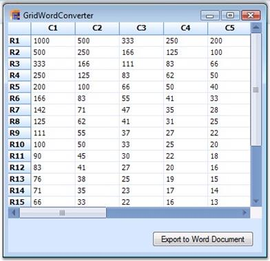
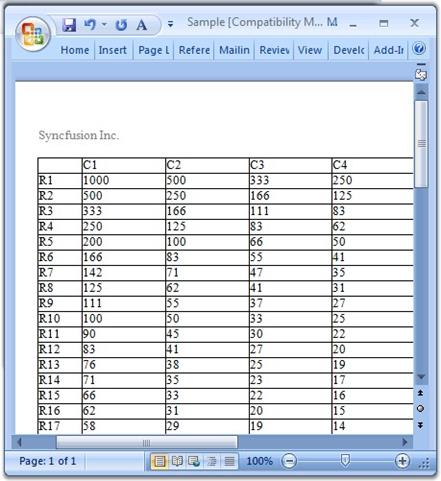
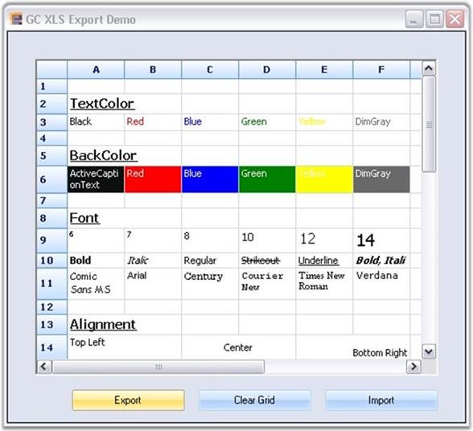
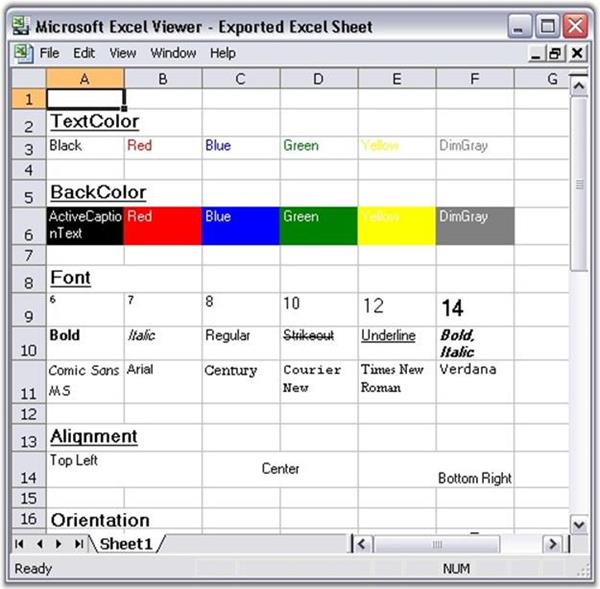
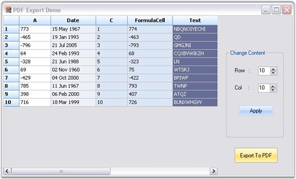

#Exporting

## Word Converter
Export to Word is one of the most common functionalities that is required in the .NET world. Essential Grid control has in-built support for Word Export. Users can download data from the Grid Control into a Word document for offline verification and/or computation. This can be achieved by making use of the **GridWordConverter** class. This section will walk you through conversion of the contents of the grid to a word file as well as discuss various converter options. GridWordConverter class derives from GridWordConverterBase. It contains number of methods that helps in exporting different components of the grid.
**Properties**
Here is a list of properties offered by GridWordConverter. By setting these properties, you will be able to choose the elements you need to export.
*Table 68: Properties*
<table>
<tr>
<th>
PROPERTIES
</th>
<th>
DESCRIPTION
</th>
</tr>
<tr>
<td>
ShowHeader
</td>
<td>
Specifies if header should be displayed.
</td>
</tr>
<tr>
<td>
ShowFooter
</td>
<td>
Indicates if footer should be displayed.
</td>
</tr>
</table>

**Method**
GridWordConverter control provides a method called GridToWord. This is the method that does the conversion of grid contents to a Word file. It accepts two parameters: grid to be converted and filename of the destination Word document.

**Syntax**



GridWordConverter converter = new GridWordConverter();
converter.GridToWord("Grid.doc", this.gridControl1);



Dim converter As GridWordConverter = New GridWordConverter()
converter.GridToWord("Grid.doc", Me.gridControl1)



**Events**
DrawHeader and DrawFooter are the events offered by the GridWordConverter that aids in adding as well as customizing the header and footer in the destination word document. 

**Sample Output**
Below images depict the conversion of grid content to a Word file.

A sample demonstrating this feature is available under the following sample installation path.

**&lt;Install Location&gt;\Syncfusion\EssentialStudio\[Version Number]\Windows\Grid.Windows\Samples\Exporting\Exporting Demo\\**

## Excel Export
Exporting data to an Excel spreadsheet is one of the most commonly preferred features in the .NET world. **EssentialGrid** control has in-built support for an Excel spreadsheet export. The class **GridExcelConverterControl** provides support for exporting data from **GridControl** or **GridDataBoundGridControl** to an Excel spreadsheet for verification and/or computation. This class automatically copies grid's styles and formats to an Excel spreadsheet. **GridExcelConverterControl** class is derived from **GridExcelConverterBase** class. XlsIO libraries are used to support conversion of the grid contents to Excel. For the control to function, the following dll files should be added along with the default dll files in the reference folder

* Syncfusion.GridConverter.Windows
* Syncfusion.XlsIO.Base

**GridToExcel** method is used to export the grid to an excel sheet. The following code example illustrates how to convert the content of Grid control to an Excel spreadsheet. 



Syncfusion.GridExcelConverter.GridExcelConverterControl gecc = newSyncfusion.GridExcelConverter.GridExcelConverterControl();
gecc.GridToExcel(this.gridControl1.Model, @"C:\MyGC.xls");


Dim gecc As Syncfusion.GridExcelConverter.GridExcelConverterControl = NewSyncfusion.GridExcelConverter.GridExcelConverterControl()
gecc.GridToExcel(Me.gridControl1.Model, "C:\MyGC.xls")



The following screenshot shows a grid, which has some data that can be exported.

The following code example illustrates how to convert the content in **GridDataBoundGrid** control to an Excel spreadsheet.



Syncfusion.GridExcelConverter.GridExcelConverterControl gecc = newSyncfusion.GridExcelConverter.GridExcelConverterControl();
gecc.GridToExcel(this.gridDataBoundGrid1.Model, @"C:\MyGC.xls");


Dim gecc As Syncfusion.GridExcelConverter.GridExcelConverterControl = NewSyncfusion.GridExcelConverter.GridExcelConverterControl()
gecc.GridToExcel(Me.gridDataBoundGrid1.Model, "C:\MyGC.xls")


The following screenshot shows the output of the exported excel. 

You can view the sample for this demo under the following location.

**&lt;Install Location&gt;\Syncfusion\EssentialStudio\ [Version Number]\Windows\Grid.Windows\Samples\Exporting\Exporting**Demo

## PDF Export
Our Essential Grid control supports conversion of grid content to a PDF file. Data in Grid control can be converted to a PDF document for offline verification and/or computation. This can be achieved by making use of **GridPDFConverter** class. PDF libraries are used to support the conversion of grid content to a PDF page. To make the control functional, the following dll files should be added along with the default dll files in the reference folder:

* Syncfusion.Pdf.Base
* Syncfusion.GridHelperClasses.Windows.

**ExportToPdf** method is used to export grid content to a PDF file. Following code example illustrates how to convert the content in grid to PDF.



GridPDFConverter pdfConvertor = new GridPDFConverter();
pdfConvertor.ExportToPdf("Sample1.pdf", this.gridControl1);


Dim pdfConvertor As GridPDFConverter = New GridPDFConverter()
pdfConvertor.ExportToPdf("Sample1.pdf", Me.gridControl1)



A sample demonstrating this feature is available under the following sample installation path.
***&lt;Install Location&gt;\Syncfusion\EssentialStudio\[Version Number]\Windows\Grid.Windows\Samples\2.0\Export\PDF Converter Demo***

**Support to Access or Modify Document Attributes of Exported PDF**
This feature allows you to access and modify PDF document attributes while exporting, or after exporting, a grid to PDF. When you want to check the page count of the exporting document, you can use this feature. 

**Events**
*Table 69: Export Event table*
<table>
<tr>
<th>
EVENT 
</th>
<th>
DESCRIPTION 
</th>
<th>
ARGUMENTS 
</th>
<th>
TYPE 
</th>
<th>
REFERENCE LINKS 
</th>
</tr>
<tr>
<td>
Exporting 
</td>
<td>
This will be triggered before exporting grid to PDF. 
</td>
<td>
(object sender, Eventargs e) 
</td>
<td>
event
</td>
<td>
N/A 
</td>
</tr>
<tr>
<td>
Exported 
</td>
<td>
This will be triggered after exporting grid to PDF.
</td>
<td>
(object sender, Eventargs e) 
</td>
<td>
event
</td>
<td>
N/A 
</td>
</tr>
</table>

 **Sample Link**
 
A demo of this feature is available in the following location: 

**{Install Drive}\AppData\Local\Syncfusion\EssentialStudio\[Version Number]\Windows\Grid.Windows\Samples\Exporting\Exporting Demo\\**

**Hooking the events in an application**
You can hook the events using the **ExportToPdf()**method of **PDFconverter**. The following code illustrates this:



GridPDFConverter pdfConvertor = new GridPDFConverter();
pdfConvertor.Exporting += new GridPDFConverter.PDFExportingEventHandler(pdfConvertor_Exporting);
pdfConvertor.Exported += new GridPDFConverter.PDFExportedEventHandler(pdfConvertor_Exported);


Dim pdfConvertor As GridPDFConverter = New GridPDFConverter()
AddHandler pdfConvertor.Exporting, AddressOf pdfConvertor_Exporting
AddHandler pdfConvertor.Exported, AddressOf pdfConvertor_Exported


