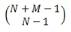
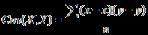
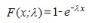
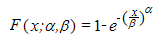
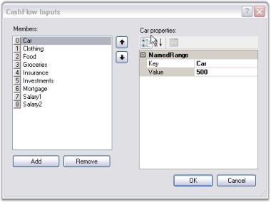

# Formula Support

Setting cell type of a cell to FormulaCell will allow you to enter algebraic expressions using formulas and cell references. Cell references are entries such as A11 for column A row 11 or BA3 for column BA row 3. A formula is a defined calculation from the Formula Library, which is included with Essential Grid. This Formula Library is extensible and lets you to add additional formulas.

## Defining FormulaCell

You can use Formula Cells for every cell in a grid or just for a few cells. Even if you set CellType property to _FormulaCell_ for every cell in a grid, the default behavior is to treat such cells as text box cells, unless you start the cell entry with an equal sign. If the cell value starts with an equal sign, then the cell is considered as a formula cell and its contents are treated as such. To make all cells present in a grid as potential formula cells, you will have to set cell type of standard BaseStyle to FormulaCell by using the following code. 



//Sets up a Formula Cell.

this.gridControl1.BaseStylesMap["Standard"].StyleInfo.CellType = "FormulaCell";





'Sets up a Formula Cell.

Me.gridControl1.BaseStylesMap("Standard").StyleInfo.CellType = "FormulaCell"


## Using the Formula Library

Essential Grid's Formula Library contains mathematical functions that are available in the .NET Framework's System.Math class. In addition, there are Sum and Avg members. You can also add additional functions to this library by using your own code.

  

In the above screen shot, cell A2 has a formula that uses four different library functions: Sqrt, Pow, Cos, and Sin.

N> For a complete list of these library functions, refer to the Class Reference for "GridFormulaEngine".

## Supported Arithmetic Operators and Calculation Precedence

The current formula support will let you enter well-formed parenthetical algebraic expressions with operators and operands. The nine supported operators are shown in the following precedence table with operators on the same level being calculated as encountered when the expression is scanned from left to right. 

Code Tables

Table 31: Code tables

<table>
<tr>
<th>
OPERATIONS</th><th>
SYMBOL</th><th>
CALCULATION PRECEDENCE</th></tr>
<tr>
<td>
Multiplication, Division</td><td>
/  *</td><td>
1st</td></tr>
<tr>
<td>
Addition, Subtraction</td><td>
+  -</td><td>
2nd</td></tr>
<tr>
<td>
Less Than, Greater Than, Equal, Less Than Or Equal, Greater Than Or Equal, Not Equal</td><td>
<  > = <= >= <></td><td>
3rd</td></tr>
</table>

The supported operands include those listed in the following table. An operand by itself is also a well-formed algebraic expression that can serve as an entire formula in a cell.

Table 32: Supported operands

<table>
<tr>
<th>
OPERAND</th><th>
EXAMPLE</th></tr>
<tr>
<td>
number</td><td>
532.1, -10.2, or 18.</td></tr>
<tr>
<td>
cell reference</td><td>
A12, BB1010, or Q18.</td></tr>
<tr>
<td>
library formula with valid arguments</td><td>
Abs(E14), Cos(-3.14), or Sum(A1:A14).</td></tr>
<tr>
<td>
any well formed algebraic expression</td><td>
E1+E2, Cos(2)<A4, or Abs(A1-A5).</td></tr>
</table>
Within a formula cell, case is ignored. So, a1 is the same as A1, and Cos(3) is the same as COS(3).

## Inside Essential Grid's Formula Support

Formula Cell control is implemented with four classes: GridFormulaCellModel, GridFormulaCellRenderer, GridFormulaEngine and GridFormulaTag. GridFormulaCellRenderer class handles a couple of activation issues that are specific to displaying formulas when a formula cell gets activated. GridFormulaCellModel class does some significant work in its GetFormattedText method override where calculations and formula parsing are initiated dynamically as required. 

GridFormulaEngine class does the actual parsing and calculation that is required to evaluate a formula in a cell. This class also maintains Formula Library. The programmer can gain access to an engine object by using GridFormulaCellModel.Engine property. It is this property that will let you add functions to (or remove functions from) the Formula Library. The use of the class is discussed in the next section. 

Finally, GridFormulaTag class is used in conjunction with GridStyleInfo class that has a property of this type. GridFormulaTag tracks computed value of the cell in its Text property.

## Adding Formulas to the Formula Library

Here are the steps that are required to add a function to the Function Library.

1. First, define a method that has this signature.

   ~~~ cs

		//Defines a method whose name is the FormulaName.

		public string MyLibraryFormulaName(string args)
   ~~~
   {:.prettyprint}

   ~~~ vbnet

		'Defines a method whose name is the FormulaName.

		Public Function MyLibraryFormulaName(ByVal args As String) As String
   ~~~
   {:.prettyprint}

Here MyLibraryFormulaName must be a name that has not already been used in Function Library and must include only letters and digits. If you want to replace an existing formula with a formula of the same name, first remove the existing formula before adding the new formula. Use GridFormulaEngine.RemoveFunction method to remove a formula.

Then, write an implementation for your method. Here code is used to implement a function that will sum only positive numbers that are passed in as either a range like A1:A5 and/or a list such as A1, A4, A10. The code uses the FormulaEngine helper method to extract these values from the cells. The GetCellsFromArgs method will return an array of cells from a range such as A1:A5, and GetValueFromArg method will take cells such as A3 and return a value such as 123.3. 



//Implements your method.

public string ComputeSumPosNums(string args)

{

    GridFormulaCellModel model = this.gridControl1.CellModels["FormulaCell"] as GridFormulaCellModel;

    if(model != null)

    {

        GridFormulaEngine engine = model.Engine;

        double sum = 0d;

        double d;

        string s1;

//Loops through arguments and sum up the positive values.

        foreach(string r in args.Split(new char[]{','}))

        {

//Cell Range.

            if(r.IndexOf(':') > -1) 

            {

                foreach(string s in engine.GetCellsFromArgs(r))

                {

// s is a cell line a21 or c3...

                try

                    {

                        s1 = engine.GetValueFromArg(s);

                    }

                    catch(Exception ex)

                    {

                        return ex.Message;

                    }

                    if(s1 != "")

                    {

//Adds only if positive.

                        if(double.TryParse(s1, NumberStyles.Number, null, out d)

                                    && d > 0)

                        {

                            sum += d; 

                        }

                    }

                }

            }

            else

            {

                try

                {

                    s1 = engine.GetValueFromArg(r);

                }

                catch(Exception ex)

                {

                    return ex.Message;

                }

                if(s1 != "")

                {

                    if(double.TryParse(s1, NumberStyles.Number, null, out d) && d > 0)

                    {

                        sum += d; 

                    }

                }

            }

        }        

        return sum.ToString();

    }

    return "";

}





'Implements your Method.

Public Function ComputeSumPosNums(args As String) As String

Dim model As GridFormulaCellModel = Me.gridControl1.CellModels("FormulaCell")

If Not (model Is Nothing) Then

Dim engine As GridFormulaEngine = model.Engine

Dim sum As Double = 0.0

Dim d As Double

Dim s1 As String

'Loops through arguments and sum up the positive values.

Dim r As String

For Each r In args.Split(New Char() {","c})

'Cell Range.

If r.IndexOf(":"c) > -1 Then

Dim s As String

For Each s In engine.GetCellsFromArgs(r)

's is a cell line a21 or c3...

Try

s1 = engine.GetValueFromArg(s)

Catch ex As Exception

Return ex.Message

End Try

If s1 <> "" Then

'Adds only if positive.

If Double.TryParse(s1, NumberStyles.Number, Nothing, d) And d > 0 Then

sum += d

End If

End If

Next s

Else

Try

s1 = engine.GetValueFromArg(r)

Catch ex As Exception

Return ex.Message

End Try

If s1 <> "" Then

If Double.TryParse(s1, NumberStyles.Number, Nothing, d) And d > 0 Then

sum += d

End If

End If

End If

Next r

Return sum.ToString()

End If

Return ""

End Function



The last step is to actually add your formula to the library. You should do this after the grid has been created, say in a Form.Load event handler. 



GridFormulaCellModel cellModel = this.gridControl1.CellModels["FormulaCell"] as GridFormulaCellModel;

//Adds a formula named SumPosNums to the Library.

cellModel.Engine.AddFunction("SumPosNums", new GridFormulaEngine.LibraryFunction(ComputeSumPosNums));




Dim cellModel As GridFormulaCellModel = Me.gridControl1.CellModels("FormulaCell")

'Adds a formula named SumPosNums to the Library.

cellModel.Engine.AddFunction("SumPosNums", New GridFormulaEngine.LibraryFunction(AddressOf ComputeSumPosNums))


## Function Reference Section

In this section, the library functions that are shipped in the Essential Calculate library are discussed. The arguments required by each of these functions are listed in bold text. Optional arguments are listed in a normal text.

### ABS

Returns the absolute value of a number. The absolute value of a non-negative number is the number itself. Theabsolute value of a negative number is -1 times the number.

#### Syntax

ABS(_number_), where: number is the real number for which you want the absolute value.

### ACCRINT

ACCRINT function returns the accrued interest for a security that pays periodic interest.

#### Syntax

ACCRINT(issue, first_interest, settlement, rate, par, frequency, [basis], [calc_method]) where:

* issue - security's issue date.
* first_interest - security's first interest date.
* settlement - security's settlement date. The security settlement date is the date after the issue date when the security is traded to the buyer.
* rate - security's annual coupon rate.
* par - security's par value.
* frequency - number of coupon payments per year.

#### Remarks:

* &#35;VALUE - occurs if issue, first_interest, or settlement is not a valid date   
* &#35;NUM! - occurs if rate ≤ 0 or if par ≤ 0         
* &#35;NUM! - occurs if frequency is any number other than 1, 2, or 4        
* &#35;NUM! - occurs if basis < 0 or if basis > 4           
* &#35;NUM! - occurs if issue ≥ settlement          

ACCRINT is calculated as follows: 

where:

Ai is the number of accrued days for the ith quasi-coupon period within an odd period.

NC is the number of quasi-coupon periods that fit in an odd period. If this number contains a fraction, raise it to the next whole number.

NLi is the normal length in days of the ith quasi-coupon period within an odd period.

### ACOS

Returns the inverse cosine of a number. Inverse cosine is also referred to as arccosine. The arccosine is the angle whose cosine is the given number. The returned angle is given in radians in the range of 0 to pi.

#### Syntax 

ACOS(_number_),where: number is the cosine of the angle that you want and must be between -1 and 1.

### ACOSH

Returns the inverse hyperbolic cosine of a number. The number must be greater than or equal to 1. The inverse hyperbolic cosine is the value whose hyperbolic cosine is the given number.

#### Syntax

ACOSH(_number_), where: number is any real number that is greater than or equal to 1.

### ACOT

ACOT function retrieves the principal value of the inverse cotangent or arcotangent of a number.

#### Syntax

ACOT(number) where: number is the cotangent of the angle you need.

#### Remarks:

 #VALUE! - occurs if the number is a non-numeric value.

The returned angle is given in radians in the range of 0 (zero) to pi.

### ACOTH

ACOTH function retrieves the inverse hyperbolic cotangent of a value.

#### Syntax:

ACOTH(number) where: number is the cotangent of the angle you need.

#### Remarks:

* &#35;NUM! - occurs if number is less than one.
* &#35;VALUE! - occurs if absolute value of number is less than one.

This mathematical equation is used:

 

### AcscH

AcscH function computes inverse hyperbolic cosecant of its argument.

#### Syntax

x = acsch(y) where:

* x is a complex or real array
* y is a complex or real array

### ADDRESS

ADDRESS function returns the address of a cell in a worksheet given specified row and column numbers.

#### Syntax 

ADDRESS(row_num, column_num, [abs_num], [a1], [sheet_text])

* row_num:A numeric value that specifies the row number.
* column_num:A numeric value that specifies the column number
* abs_num: Optional. A numeric value that specifies the type of reference to return.
* A1: A logical value that specifies the A1 or R1C1 reference style.

#### Example

Table 33: Address

<table>
<tr>
<th>
FORMULA</th><th>
RESULT</th></tr>
<tr>
<td>
=ADDRESS(2,3,2,FALSE)</td><td>
R2C[3].</td></tr>
<tr>
<td>
=ADDRESS(2,3,1,FALSE,"[Book1]Sync1")</td><td>
[Book1] Sync1!R2C3</td></tr>
</table>

### AND

Returns True if all the arguments have a logical value of True and returns False if at least one argument is False.

#### Syntax

AND(_logical1, logical2, ...),_ where:

logical1, logical2, ... are multiple conditions you want to test for True or False.

#### Remarks

* The arguments must evaluate to logical values (True or False).
* If an argument does not evaluate to True or False, those values are ignored. 
* There must be at least one value in the argument list.

### ARABIC

A Roman numeral has been converted to an Arabic numeral.

#### Syntax:

ARABIC( text ) where text is a string.

#### Remarks:

* &#35;VALUE! - occurs if text is not a valid value.
* &#35;VALUE! - occurs if text is not a valid Roman numeral.

Value zero occurs if an empty string is given as an input.

### AsecH

AsecH function computes element-wise inverse hyperbolic secant of the argument.

#### Syntax:

x = asech(y) where:

* x is a complex or real array.
* y is a complex or real array.

### ASIN

Returns theinverse sine of a number. Inverse sine is also referred to as arcsine. The arcsine is the angle whose sine is the given number. The returned angle is given in radians in the range from -pi/2 to +pi/2.

#### Syntax

ASIN(_number_), where: number is the sine of the angle that you want and must be between -1 and 1.

### ASINH

Returns the inverse hyperbolic sine of a number. The inverse hyperbolic sine is the value whose hyperbolic sine is the given number, so ASINH(SINH(number)) equals number.

#### Syntax

ASINH(number), where: number is any real number.

### ATAN

Returns theinverse tangent of a number. Inverse tangent is also known as arctangent. The arctangent is the angle whose tangent is a number. The returned angle is given in radians in the range from -pi/2 to +pi/2.

#### Syntax

ATAN(number), where: number is the tangent of the angle that you want.

### ATAN2

Returns the inverse tangent of the specified x- and y-coordinates. The arctangent is the angle from the x-axis to a line containing the origin (0, 0) and the point (x_num, y_num). The angle is given in radians between -pi and pi, excluding -pi.

#### Syntax

ATAN2(_x_num,y_num_), where:

x_num is the X coordinate of the point.

y_num is the Y coordinate of the point.

#### Remarks

* A positive result represents counterclockwise angle from the x-axis; and negative result represents clockwise angle. 
* ATAN2(a,b) equals ATAN(b/a), except that a can equal 0 in ATAN2.

### ATANH

Returns the inverse hyperbolic tangent of a number. Number must be strictly between -1 and 1. The inverse hyperbolic tangent is the value whose hyperbolic tangent is a number, so ATANH(TANH(number)) equals the given number.

#### Syntax

ATANH(_number_), where: number is any real number that is between 1 and -1.

### AVEDEV

Returns the average of absolute mean deviations of data points. AVEDEV is a measure of variability in a data set.

#### Syntax

AVEDEV(number1, number2, ...), where: number1, number2, ... are arguments for which you want the average of the absolute deviations. You can also use a single array or a reference to an array instead of arguments separated by commas.

#### Remarks

* The arguments must either be numbers or names, arrays or references that contain numbers. 
* If an array or reference argument contains text, logical values, or empty cells, those values are ignored; however, cells with zero value are included. 
* The equation for average deviation is,

 

* where x-bar is the arithmetic mean of the data.

`

### AVERAGE

Returns the average (arithmetic mean) of the arguments.

#### Syntax

AVERAGE(number1, number2, ...), where: number1,number2, ... are numeric arguments for which you want the average.

#### Remarks

* The arguments must either be numbers or names, arrays or references that contain numbers. 
* If an array or reference argument contains text, logical values, or empty cells, those values are ignored; however, cells with zero value are included.

### AVERAGEA

Calculates the average (arithmetic mean) of the values in the list of arguments. In addition to numbers and text logical values such as True and False are also included in the calculation.

#### Syntax

AVERAGEA(value1, value2, ...), where: value1, value2, ... are cells, ranges of cells, or values for which you want the average.

#### Remarks

* The arguments must be numbers, names, arrays, or references. 
* Array or reference arguments that contain text evaluate as 0 (zero). If the calculation should not include text values in the average, then use AVERAGE function. 
* Arguments that contain True evaluate as 1; arguments that contain False evaluate as 0 (zero).

### AVERAGEIF

AVERAGEIF function finds the average of values in a given array that satisfies the given criteria, and returns the average value of the corresponding values in a second given array.

#### Syntax 

=AVERAGEIF(range, criteria, average_range)

* range: Array of values to be tested against the given criteria.
* criteria: The condition to be tested in each of the values of the given range.
* average_range: Numeric values to be evaluated against the criteria and averaged.

#### Notes

* If range is blank or a text value, AVERAGEIF returns the #DIV/0! error value.
* If a cell in criteria is empty, AVERAGEIF treats it as 0 value.
* If no cells in the range meet the criteria, AVERAGEIF returns the #DIV/0! error value.

#### Example

Table 34: Input Table

<table>
<tr>
<th>
</th><th>
A</th><th>
B</th></tr>
<tr>
<td>
1</td><td>
Earning</td><td>
Tax</td></tr>
<tr>
<td>
2</td><td>
100000</td><td>
3000</td></tr>
<tr>
<td>
3</td><td>
200000</td><td>
6000</td></tr>
<tr>
<td>
4</td><td>
300000</td><td>
7500</td></tr>
<tr>
<td>
5</td><td>
400000</td><td>
9000</td></tr>
</table>

<table>
<tr>
<th>
FORMULA</th><th>
RESULT</th></tr>
<tr>
<td>
=AVERAGEIF(B2:B5,"<7000")</td><td>
4500</td></tr>
<tr>
<td>
=AVERAGEIF(A2:A5,">250000")</td><td>
350000</td></tr>
</table>

### AVERAGEIFS

AVERAGEIFS function finds the average of values in a given array that satisfies a set of given criteria.

#### Syntax

= AVERAGEIFS( average_range, criteria_range1, criteria1, [criteria_range2, criteria2], ... )

* average_range: Specific set of values to be averaged if the criteria range meets the provided criteria.
* criteria_range1: Array of values to be tested against the given criteria.
* criteria1: The condition to be tested on each of the values of the given range.

#### Notes

* If average_range is blank or a text value, AVERAGEIFS returns the #DIV/0! error value.
* If a cell in a criteria range is empty, AVERAGEIFS treats it as a 0 value.
* If cells in average_range cannot be translated into numbers, AVERAGEIFS returns the #DIV/0! error value.

#### Example

Table 35: Input Table

<table>
<tr>
<th>
</th><th>
A</th><th>
B</th><th>
C</th></tr>
<tr>
<td>
1</td><td>
Earning</td><td>
Tax</td><td>
other</td></tr>
<tr>
<td>
2</td><td>
100000</td><td>
3000</td><td>
100</td></tr>
<tr>
<td>
3</td><td>
200000</td><td>
6000</td><td>
200</td></tr>
<tr>
<td>
4</td><td>
300000</td><td>
7500</td><td>
300</td></tr>
<tr>
<td>
5</td><td>
400000</td><td>
9000</td><td>
500</td></tr>
</table>

<table>
<tr>
<th>
FORMULA</th><th>
RESULT</th></tr>
<tr>
<td>
AVERAGEIFS(C2:C5, B2:B5, ">7000", B2:B5, "<10000")</td><td>
400</td></tr>
</table>

### AVG

Returns the average (arithmetic mean) of the arguments.

#### Syntax

AVG(number1, number2, ...), where: number1, number2, ... are numeric arguments for which you want the average.

#### Remarks

* This method is the same as AVERAGE and is included for compatibility purpose.

### BASE

A number has been converted into a text representation with the given radix (base).

#### Syntax:

BASE(Number, Radix [Min_length]) where:

* Number is the value that you want to convert.
* Radix is the base radix that you want to convert the number into.
* Min_length is the minimum length of the returned string. Min_length is optional.

#### Remarks:

* &#35;NUM! - occurs if Number, Radix, or Min_length are outside the minimum or maximum constraints.
* &#35;VALUE! - occurs if Number is a non-numeric value.

### BigMul

BigMul function gives the full value of multiplying two 32-bit numbers.

#### Syntax

Math.BigMul(x,y); where:

* x is the first number to multiply
* y is the second nr to multiply.

### BINOMDIST

Returns the individual term binomial distribution probability. 

#### Syntax

BINOMDIST(number_s, trials, probability_s, cumulative), where:

number_s  is the number of successes in trials.

trials is the number of independent trials.

probability_s  is the probability of success on each trial.

Cumulative is a logical value that determines the form of function. If cumulative is True, thenBINOMDIST returns the cumulative distribution, which is the probability that there are at most number_s successes; if False, it returns the probability that there are exactly number_s successes.

#### Remarks

* Number_s and trials are truncated to integers. 
* Number_s should be >= 0 and <= trials. 
* Probability_s  should be >=0 and <= 1. 
* The binomial probability mass function is,

  

where:

 

is COMBIN(n,x).

* The cumulative binomial distribution is,

  

### Binom.Inv

Binom.Inv function returns the smallest value for which the cumulative binomial distribution is greater than or equal to a criterion value.

#### Syntax:

BINOM.INV(trials,probability_s,alpha) where:

* trials is the number of Bernoulli trials.
* probability_s is the probability of a success on each trial.
* alpha is the criterion value.

#### Remarks:

* &#35;NUM! - occurs if trials is less than zero.
* &#35;VALUE! - occurs if trials is non-numeric.
* &#35;NUM! - occurs if probability_s is less than zero.
* &#35;NUM! - occurs if probability_s is greater than one.
* &#35;VALUE! - occurs if probability_s is non-numeric.
* &#35;NUM! - occurs if alpha is less than zero.
* &#35;NUM! - occurs if alpha is greater than one.
* &#35;VALUE! - occurs if alpha is non-numeric.

### CEILING

Returns number rounded up, away from zero, to the nearest multiple of significance. For example, if you want to avoid using pennies in your prices and your product is priced at $4.82, use the formula =CEILING(4.82,0.05) to round prices up to the nearest nickel.

#### Syntax

CEILING(number, significance), where:

number is the value you want to round off.

significance is the multiple to which you want to round.

#### Remarks

* Both values must be numeric. 
* Regardless of the sign of a number, a value is rounded up when adjusted away from zero. If the number is an exact multiple of significance, no rounding occurs.

### CEILING.MATH

CEILING.MATH function rounds a number up to the nearest multiple of significance.

#### Syntax:

CEILING(number, [significance],  [mode]) where:

* number must be less than 9.99E+307 and greater than -2.229E-308.
* significance must be the multiple to which the number is to be rounded.
* mode is for negative numbers, it controls whether the number is rounded towards or away from zero.

### CHIDIST

Returns the one-tailed probability of the chi-squared ( ) distribution. The  distribution is associated with a  test. 

#### Syntax

CHIDIST(x, degrees_freedom), where:

x is the value at which you want to evaluate the distribution.

degrees_freedom is the number of degrees of freedom.

#### Remarks

* Both arguments should be numeric. 
* degrees_freedom  >= 1 and < 10^10. 
* CHIDIST is calculated as CHIDIST = P(X > x), where X is a  random variable.

### CHIINV

Returns the inverse of the one-tailed probability of the chi-squared () distribution. If probability = CHIDIST(x,...), then CHIINV(probability,...) = x. Use this function to compare observed results with expected ones in order to decide whether your original hypothesis is valid.

#### Syntax

CHIINV(probability, degrees_freedom), where:

probability is a probability associated with the chi-squared distribution.

degrees_freedom is the number of degrees of freedom.

#### Remarks

* Probability must be >= 0 and <= 1.
* degrees_freedom >=1 and  = 10^10.

Given a value for probability, CHIINV seeks the value x such that CHIDIST(x, degrees_freedom) = probability. Thus, precision of CHIINV depends on precision of CHIDIST. CHIINV uses an iterative search technique.

### CHI- TEST

Returns thetest for independence. CHITEST returns the value from chi-squared (c2) distribution for statistic and the appropriate degrees of freedom. 

#### Syntax

CHITEST(actual_range, expected_range), where:

actual_range is the range of data that contains observations to test against expected values.

expected_range is the range of data that contains the ratio of the product of row totals and column totals to the grand total.

#### Remarks

* The test first calculates  statistic using the formula,

 

      where:

        Aij = actual frequency in the i-th row, j-th column

        Eij = expected frequency in the i-th row, j-th column

        r = number of rows

        c = number of columns

       A low value of  is an indicator of independence.

The use of CHITEST is most appropriate when Eij's are not too small. Some statisticians suggest that each Eij should be greater than or equal to 5.

### CLEAN

CLEAN function is used to remove the non-printable characters from the given text, represented by numbers 0 to 31 of the 7-bit ASCII code.

#### Syntax

=Clean(Text)

Text: Required. String or text from which to remove nonprintable characters.

#### Example 

Table 36: Clean

<table>
<tr>
<th>
FORMULA</th><th>
RESULT</th></tr>
<tr>
<td>
=Clean(Syncfusion)</td><td>
Syncfusion</td></tr>
<tr>
<td>
= Clean("Text*")</td><td>
Text</td></tr>
</table>

### COMBIN

Returns the number of combinations for a given number of items. Use COMBIN to determine the total possible number of groups for a given number of items.

#### Syntax

COMBIN(number, number_chosen), where:

number is the number of items.

number_chosen is the number of items in each combination.

#### Remarks

* Numeric arguments are truncated to integers. 
* A combination is any set or subset of items, regardless of their internal order. Combinations are distinct from permutations where the internal order is significant. 
* The number of combinations is as follows, where number = n and number_chosen = k,

  

where:

  

### COMBINA

For a given number of items, COMBINA function returns the number of combinations (with reputations).

#### Syntax

COMBINA(number1, number2) where:

* number 1 is greater than equal to zero and greater than equal to number2
* number 2 is greater than equal to zero.

#### Remarks:

* &#35;NUM! - occurs if either value is outside its constraints
* &#35;VALUE! - occurs if either value is non-numeric.

The following equation is used:

 

### CONCATENATE

Joins several text strings into one text string.

#### Syntax

CONCATENATE (text1, text2, ...), where: text1, text2, ... are text items to be joined into a single text item. The text items can be text strings, numbers, or single-cell references.

#### Remarks

* The "&" operator can be used instead of CONCATENATE to join text items.

### CONFIDENCE

Returns a value that you can use to construct a confidence interval about population mean. The confidence interval is a range of values. In your sample, mean x is at the center of this range and the range is x ± CONFIDENCE. For example, if x is the sample mean of delivery times for products ordered through the mail, x ± CONFIDENCE is a range of population means. 

#### Syntax

CONFIDENCE(alpha, standard_dev, size), where:

alpha is the significance level used to compute the confidence level. The confidence level equals 100*(1 - alpha)%, or in other words, an alpha of 0.05 indicates a 95 percent confidence level.

standard_dev is the population standard deviation for the data range and is assumed to be known.

size is the sample size.

#### Remarks

* All arguments must be non-numeric.
* Alpha must be > 0 and < 1.
* Standard_dev must be > 0.
* Size must be >= 1.

### CONFIDENCE.T

Using a student’s distribution, this function retrieves the confidence interval for a population mean.

#### Syntax

CONFIDENCE.T(alpha,standard_dev,size) where:

* alpha is the significance level used to compute the confidence level.
* standard_dev is the population standard deviation for data range and is assumed to be known.
* size is the sample size.

#### Remarks:

* &#35;VALUE! - occurs if any argument is non-numeric.
* &#35;NUM! - occurs if alpha is less than or equal to zero or if alpha is greater than or equal to zero.
* &#35;NUM! - occurs if standard_dev is less than or equal to zero.
* &#35;DIV/0! - occurs if the size is equal to one.

### CORREL

Returns the correlation coefficient of the array1 and array2 cell ranges. 

#### Syntax

CORREL(array1, array2), where:

array1 is a cell range of values.

array2 is the second cell range of values.

#### Remarks

* array1 and array2 must have the same number of data points.
* The equation for correlation coefficient is,

 

where x-bar and y-bar are the sample means AVERAGE(array1) and AVERAGE(array2).

### COS

Returns the cosine of the given angle.

#### Syntax

COS(number), where: number is the angle in radians for which you want the cosine.

### COSH

Returns the hyperbolic cosine of a number.

#### Syntax

COSH(number), where: number is any real number for which you want to find the hyperbolic cosine.

#### Remarks

The formula for the hyperbolic cosine is,

 

### COT

COT function returns the cotangent of an angle specified in radians.

#### Syntax:

COT(number) where: number – the angle radians for which you want the secant.

#### Remarks

* &#35;NUM! - occurs if the number is outside its constraints.
* &#35;VALUE! - occurs if the number is a non-numeric value.

### COTH

COTH function returns the hyperbolic cotangent of a hyperbolic angle.

#### Syntax

COTH(number) where: number – the angle radians for which you want the secant.

#### Remarks

* &#35;NUM! - occurs if the number is outside of its constraints.
* &#35;VALUE! - occurs if the number is a non-numeric value.

The following equation is used:

  

### COUNT

Counts the number of items in a list that contains numbers. 

#### Syntax

COUNT(value1,value2, ...), where: value1, value2, ... are arguments that can contain or refer to a variety of different types of data, but only numbers are counted.

#### Remarks

* Arguments that are numbers, dates, or text representations of numbers are counted; arguments that are error values or text that cannot be translated into numbers are ignored.
* If an argument is an array or reference, only numbers in that array or reference are counted. Empty cells, logical values, text, or error values in the array or reference are ignored.

### COUNTA

Counts the number of cells that are not empty.

#### Syntax

COUNTA(value1, value2, ...), where: value1, value2, ... are arguments representing the values you want to count. In this case, a value is any type of information excluding empty cells.

### COUNTBLANK

Counts empty cells in a specified range of cells.

#### Syntax

COUNTBLANK(range), where: range is the range from which you want to count the blank cells.

#### Remark

* Cells with formulas that return "" (empty text) are also counted. Cells with zero values are not counted.

### COUNTIF

Counts the number of cells within a range that meet the given criteria.

#### Syntax

COUNTIF(range, criteria), where:

range is the range of cells from which you want to count cells.

criteria is the criteria in the form of a number, expression or text that defines which cells will be counted. For example, the criteria can be expressed as ">32".

#### Remark

* If and SumIf are other library functions that can be used to conditionally compute values.

### COVAR

Returns covariance, the average of the products of deviations for each data point pair. 

#### Syntax

COVAR(array1, array2), where:

array1 is the first cell range of numbers.

array2 is the second cell range of numbers.

#### Remarks

* The arguments must either be numbers or names, arrays or references that contain numbers. 
* array1 and array2 must have the same number of data points. 
* The covariance is,

  

where X is array1, Y is array2, x-bar and y-bar are the sample means AVERAGE(array1) and AVERAGE(array2) and n is the sample size.

### COVARIANCE.P

COVARIANCE.P function retrieves population covariance, the average of the products of deviations for each data point pair in two data sets.

#### Syntax

COVARIANCE.P(array1,array2) where:

* array1 is the first cell range of integers.
* array2 is the second cell range of integers.

#### Remarks

 #N/A - occurs if arguments have a different number of data points.

The covariance is:

 

__

where x and y are the sample means, AVERAGE(array1) and AVERAGE(array2), and n is the sample size.

### COVARIANCE.S

COVARIANCE.S function returns the sample covariance, the average of the products of deviations for each data point pair in two data sets.

#### Syntax

COVARIANCE.S(array1,array2) where:

* array1 is the first cell range of integers.
* array2 is the second cell range of integers.

#### Remarks

* &#35;N/A - occurs when values are different number of data points.
* &#35;DIV/0! - occurs if either array1 or array2 is empty or contain only one data point each.

### CRITBINOM

Returns the smallest value for which, the cumulative binomial distribution is greater than or equal to a criterion value.

#### Syntax

CRITBINOM(trials, probability_s, alpha), where:

trials is the number of Bernoulli trials.

probability_s is the probability of a success on each trial.

alpha is the criterion value.

#### Remarks

* Trials must be >= 0. 
* Probability_s must be >=0 and <= 1. 
* Alpha must be >= 0 and <= 1.

### CSC

CSC function returns the cosecant of an angle specified in radians.

#### Syntax

CSC(number) where: number – the angle radians for which you want the secant.

### Remarks

* &#35;NUM! - occurs if the number is outside its constraints.
* &#35;VALUE! - occurs if the number is a non-numeric value.

### CSCH

CSCH function returns the hyperbolic cosecant of an angle specified in radians.

#### Syntax

CSCH(number) where: number – the angle radians for which you want the secant.

#### Remarks

* &#35;NUM! - occurs if the number is outside its constraints.
* &#35;VALUE! - occurs if the number is a non-numeric value.

### CUMIPMT

Returns the Macaulay duration for an assumed par value of $100. Duration is defined as the weighted average of the present value of cash flows and is used as a measure of a bond price's response to changes in yield.

#### Syntax

DURATION(settlement,maturity,coupon,yld,frequency,basis) where:

* Settlement - security’s settlement date.
* Maturity - security’s maturity date.
* Coupon – annual coupon rate
* Yld – security’s annual yield.
* Frequency – number of coupon payments per year.
* Basis – type of day count basis.

#### Remarks

* &#35;VALUE! – occurs if settlement or maturity is not a valid date.
* &#35;NUM! – occurs if coupon < 0 or yld < 0
* &#35;NUM! – occurs if frequency number is other than 1,2 and 4
* &#35;NUM! – occurs if basis is less than 0 and greater than 4
* &#35;NUM! – occurs if settlement is >= Maturity

### CUMPRINC

CUMPRINC function returns the cumulative principal paid on a loan between the start_period and end_period.

#### Syntax

CUMPRINC(rate, nper, pv, start_period, end_period, type) where:

* Rate – the interest rate.
* Nper - total number of payment periods
* pv - present value.
* start_period - first period in calculation. Brgind with one.
* end_period - last period in calculation.
* type - timing of the payment.

#### Remarks

* &#35;NUM! - occurs if rate,nper or pv is less than or equals zero.
* &#35;NUM! - occurs if start_period or end_period is less than one
* &#35;NUM! - occurs if start_period is greater than end_period.
* &#35;NUM! - occurs if type is any number other than 0 or 1

### DATE

Returns the sequential serial number that represents a particular date. 

#### Syntax

DATE(year, month, day), where: year can be one to four digits. Year is interpreted based on 1900.

* If a year is between 0 (zero) and 1899 (inclusive), the value is added to 1900 to calculate the year. For example, DATE(102,11,12) returns November 12, 2002 (1900+102).
* If a year is between 1900 and 9999 (inclusive), the value is used as is, for example, DATE(2002,11,12) returns November 12, 2002.

month is a number representing the month of the year. 

day is a number representing the day of the month.

#### Remark

* Dates are stored as sequential serial numbers so that they can be used in calculations. By default, January 1, 1900 is serial number 1 and November 12, 2002 is serial number 37572 because it is 37572 days after January 1, 1900.

### DATEVALUE

Returns theserial number of the date represented by date_text. 

#### Syntax

DATEVALUE(date_text), where: date_text is the text that represents a date as a formatted string. For example, "11/12/2002" or "12-Nov-2002" are text strings within quotation marks that represent dates. If the year portion of the date_text is omitted, DATEVALUE uses current year from your computer's built-in clock. The time information in the date_text is ignored.

#### Remarks

* Dates are stored as sequential serial numbers so that they can be used in calculations. By default, January 1, 1900 is serial number 1, and November 12, 2002 is serial number 37572 because it is 37572 days after January 1, 1900. 
* Most functions automatically convert date values to serial numbers.

### DAVERAGE

DAVERAGE function finds the average values in a column of a list or database that matches the conditions that have been specified.

#### Syntax

DAVERAGE(database,field,criteria) where:

* database is the range of cells that makes up the list or database
* field indicates which column is used in the function
* criteria is the range of cells that contains the conditions you specify.

### DAY

Returns the day of a date represented by a serial number. The day is given as an integer ranging from 1 to 31.

#### Syntax

DAY(serial_number), where: serial_number is the date of the day you are trying to find. Dates should be entered by using the DATE function or as results of other formulas or functions. For example, use DATE(2002,4,23) for the 23rd day of April, 2002.

### DAYS360

Returns the number of days between two dates based on a 360-day year (twelve 30-day months) which is used in some accounting calculations. 

#### Syntax

DAYS360(start_date, end_date, method), where: start_date and end_date are the two dates between which you want to know the number of days. If start_date occurs after end_date, DAYS360 returns a negative number. Dates should be entered by using the DATE function or as results of other formulas or functions. 

method is a logical value that specifies whether to use the U.S. or European method in calculation.

If method is:

* False or omitted – The calculation uses the U.S. (NASD) method. If the starting date is the 31st of a month, it becomes equal to the 30th of the same month. If the ending date is the 31st of a month and the starting date is earlier than the 30th of a month, the ending date becomes equal to the 1st of the next month; otherwise the ending date becomes equal to the 30th of the same month.
* True – The calculation uses the European method. Starting dates and ending dates that occur on the 31st of a month become equal to the 30th of the same month.

### DB

Returns thedepreciation of an asset for a specified period using thefixed-declining balance method.

#### Syntax

DB(cost, salvage, life, period, month), where:

cost is the initial cost of the asset.

salvage is the value at the end of the depreciation (sometimes called the salvage value of the asset).

life is the number of periods over which the asset is being depreciated (sometimes called the useful life of the asset).

period is the period for which you want to calculate the depreciation. Period must use the same units as life.

month is the number of months in the first year. If month is omitted, it is assumed to be 12.

#### Remarks

* The fixed-declining balance method computes the depreciation at a fixed rate. DB uses the following formulas to calculate the depreciation for a period,

(cost - total depreciation from prior periods) * rate

where rate = 1 - ((salvage / cost) ^ (1 / life)), rounded to three decimal places.

* Depreciation for the first and last periods is a special case. For the first period, DB uses this formula,

cost * rate * month / 12

* For the last period, DB uses this formula,

((cost - total depreciation from prior periods) * rate * (12 - month)) / 12

### DCOUNT

DCOUNT function counts the number of cells that contain numbers in a column of a list or database, which matches the conditions specified.

#### Syntax

DCOUNT(database, field,criteria ) where:

* database is the range of cells that makes up the list or database
* field indicates which column is used in the function
* criteria is the range of cells that contains the conditions you specify.

### DCOUNTA

DCOUNTA function counts the number of nonblank cells in a column of a list or database that matches the conditions specified.

#### Syntax

DCOUNTA(database, field, criteria) where:

* database is the range of cells that makes up the list or database.
* field indicates which column is used in the function.
* criteria is the range of cells that contains the conditions you specify.

### DDB

Returns the depreciation of an asset for a specified period using double-declining balance method or some other method you specify.

#### Syntax

DDB(cost, salvage, life, period, factor), where:

cost is the initial cost of the asset.

salvage is the value at the end of depreciation (sometimes called the salvage value of the asset).

life is the number of periods over which the asset is being depreciated (sometimes called the useful life of the asset).

period is the period for which you want to calculate the depreciation. Period must use the same units as life.

factor is the rate at which the balance declines. If factor is omitted, it is assumed to be 2 (the double-declining balance method).

N>  All five arguments must be positive numbers.

#### Remarks

* The double-declining balance method computes the depreciation at an accelerated rate. Depreciation is highest in the first period and decreases in successive periods. DDB uses the following formula to calculate depreciation for a period,

((cost-salvage) - total depreciation from prior periods) * (factor/life)

### DECIMAL

A text representation of a number in a given base has been converted into a decimal number.

#### Syntax

DECIMAL(text, radix) where:

* text is a string.
* radix is an integer.

#### Remarks

 #NUM! or #VALUE! - occurs if text or radix is outside the constraints.

### DEGREES

Converts radians into degrees.

#### Syntax

DEGREES(angle), where: angle is the angle in radians that you want to convert.

### DEVSQ

Returns the sum of squares of deviations of data points from their sample mean.

#### Syntax

DEVSQ(number1, number2, ...), where: number1, number2, ... are arguments for which you want to calculate the sum of squared deviations. You can also use a single array or a reference to an array instead of arguments separated by commas.

#### Remarks

* The arguments must be numbers or names, arrays or references that contain numbers. 
* The equation for the sum of squared deviations is,

  

### DGET

DGET function extracts a single value from a column of a list or database that matches the conditions specified.

#### Syntax

DGET(database,field,criteria) where:

* database is the range of cells that makes up the list or database.
* _field_ indicates which column is used in the function.
* criteria is the range of cells that contains the conditions you specify.

### Disc

Disc function returns the discount rate for a security.

#### Syntax

Disc(Arg1, Arg2, Arg3, Arg4, Arg5) where:

* Arg1 represents the security’s settlement date.
* Arg2 represents the security’s maturity date.
* Arg3 represents the security’ price per $100 face value.
* Arg4 represents the security’s redemption value.
* Arg5 represents the type of day count basis to use.

### DivRem

DivRem function calculates the quotient of two numbers and also returns the remainder in an output parameter.

#### Syntax

Math.DivRem(a,b) where: a and b are integers.

### DMAX

DMAX function returns the largest number in a column of a list or database,which matches the conditions specified.

#### Syntax

DMAX(database,field,criteria) where:

* database is the range of cells that makes up the list or database.
* field indicates which column is used in the function.
* criteria is the range of cells that contains the conditions you specify.
### DMIN

DMIN function returns the smallest number in a column of a list or database, which matches the conditions specified.

#### Syntax

DMIN(database,field,criteria) where:

* database is the range of cells that makes up the list or database.
* field indicates which column is used in the function.
* criteria is the range of cells that contains the conditions you specify.

### Dollar

Dollar function converts a number to text, using currency format. 

The format used is $#,##0.00_);($#,##0.00). 

#### Syntax

Dollar (number, decimal_places) where:

number is the number, which you want to convert to text.

decimal_places is the number of decimal digits to be displayed. The value will be rounded off accordingly.

### DollarDe

A dollar price expressed as a fraction will be converted into a dollar price expressed as a decimal number.

#### Syntax

DOLLARDE(object arg1, object arg2) where:

* Arg1 is a number expressed as a fraction.
* Arg2 is an integer to use in the denominator of the fraction.

#### Remarks

* &#35;NUM! - Occurs if the fraction is less than 0.
* &#35;DIV/0! - Occurs if the fraction is equal to 0.

### DollarFr

Dollar price expressed as a decimal number will be converted into a dollar price expressed as a fraction.

#### Syntax

DOLLARFR (object arg1,object arg2) where:

arg1 is a decimal number.

arg2 is an integer to use in the denominator of a fraction.

#### Remarks:

* &#35;NUM! - Occurs if the fraction is less than 0.
* &#35;DIV/0! - Occurs if the fraction is 0.

### DSTDEV

DSTDEV function estimates the standard deviation of population based on a sample by using the numbers in a column of a list or database that matches the conditions specified.

####Syntax

DSTDEV(database, field, criteria) where:

* database is the range of cells that makes up the list or database.
* field indicates which column is used in the function.
* criteria is the range of cells that contains the conditions you specify.

### DSTDEVP

DSTDEVP function calculates the standard deviation of population based on the entire population using numbers in a column of a list or database that matches the conditions specified.

#### Syntax

DSTDEVP(database,field,criteria) where:

* database is the range of cells that makes up the list or database.
* field indicates which column is used in the function.
* criteria is the range of cells that contains the conditions you specify.

### DSUM

DSUM function adds the numbers in a field (column) of records in a list or database that matches the conditions specified.

#### Syntax

DSUM(database, field, criteria) where:

* database is the range of cells that makes up the list or database.
* field indicates which column is used in the function.
* criteria is the range of cells that contains the conditions you specify.

### Duration

Returns the annual duration of a security with periodic interest payments.

#### Syntax

Duration (settlement, maturity, coupon, yld, frequency, basis) where:

* Settlement – a security’s settlement date.
* Maturity – a security’s maturity date.
* Coupon – the annual coupon rate.
* Yld – security’s annual yield.
* Frequency – the number of coupon payments per year.
* Basis – the type of day count basis.

### DVAR

DVAR function estimates the variance of population based on a sample by using the numbers in a column of a list or database which matches the conditions specified.

#### Syntax

VAR(database,field,criteria) where:

* database is the range of cells that makes up the list or database.
* field indicates which column is used in the function.
* criteria is the range of cells that contains the conditions you specify.

### DVARP

DVARP function calculates the variance of population based on the entire population by using numbers in a column of a list or database which matches the conditions specified.

#### Syntax

DVARP(database,field,criteria) where:

* database is the range of cells that makes up the list or database.
* field indicates which column is used in the function.
* criteria is the range of cells that contains the conditions you specify.

### EVEN

Returns the numberrounded upto thenearest even integer.

#### Syntax

EVEN(number), where: number is the value that is to be rounded.

#### Remarks

* Regardless of the sign of the number, a value is rounded up when adjusted away from zero. If the number is an even integer, no rounding occurs.

### ERROR.TYPE

The Error.Type function returns an integer for the given error value that denotes the type of given error.

#### Syntax

= ERROR.TYPE(value)

The given value is required.

Here is the return value of function:

Table 37: Return value of function

<table>
<tr>
<th>
GIVEN VALUE</th><th>
RETURN VALUE OF FUNCTION</th></tr>
<tr>
<td>
#NULL!</td><td>
1</td></tr>
<tr>
<td>
#DIV/0!</td><td>
2</td></tr>
<tr>
<td>
#VALUE!</td><td>
3</td></tr>
<tr>
<td>
#REF!</td><td>
4</td></tr>
<tr>
<td>
#NAME?</td><td>
5</td></tr>
<tr>
<td>
#NUM!</td><td>
6</td></tr>
<tr>
<td>
#N/A</td><td>
7</td></tr>
<tr>
<td>
#GETTING_DATA</td><td>
8</td></tr>
<tr>
<td>
Anything else</td><td>
#N/A</td></tr>
</table>

#### Example:

<table>
<tr>
<th>
FORMULA</th><th>
RESULT</th></tr>
<tr>
<td>
= ERROR.TYPE(#NULL!) </td><td>
1</td></tr>
<tr>
<td>
= ERROR.TYPE(even)</td><td>
#NA</td></tr>
</table>

### EXP

Returns e raised to the power of the given number.

#### Syntax

EXP(number), where: number is the exponent applied to the base e.

### EXPONDIST

Returns the exponential distribution. 

#### Syntax

EXPONDIST(x, lambda, cumulative), where:

x is the value of the function.

lambda is the parameter value.

cumulative is a logical value that indicates which form of the exponential function is to be provided. If cumulative is True, EXPONDIST returns the cumulative distribution function; if False, it returns the probability density function.

#### Remarks

The equation for the probability density function is,

  

* The equation for the cumulative distribution function is,

  

* &#35;NUM! - occurs if x is less than zero.
* &#35;VALUE! - occurs if x is  is non-numeric.
* &#35;VALUE! - occurs if lambda is  is non-numeric.
* &#35;NUM!- occurs if lambda is equal to or less than zero.

### FACT

Returns the factorial of a number. The factorial of a number is the product of all positive integers <= the given number.

#### Syntax

FACT(number), where: number is the non-negative number for which you want the factorial. If the number is not an integer, it is truncated.

### FACTDOUBLE

FACTDOUBLE function returns the double factorial of a given value. The given value must be an integer value.

#### Syntax

= FACTDOUBLE (number) where: number – Required.

#### Remarks

* &#35;NUM! - If the number is less than zero (0).
* &#35;VALUE! - Occurs if any of the given argument is non-numeric.

#### Example:

 Table 38: Double factorial

<table>
<tr>
<th>
FORMULA</th><th>
RESULT</th></tr>
<tr>
<td>
= FACTDOUBLE (6)</td><td>
48</td></tr>
<tr>
<td>
= FACTDOUBLE (-2)</td><td>
#NUM!</td></tr>
</table>

### False

False function returns logical value when the given sting value is false.

#### Syntax

False(stringvalue) where: stringvalue is to provide any text value or empty string.

### FDIST

Returns theF probability distribution.

#### Syntax

FDIST(x, degrees_freedom1, degrees_freedom2), where:

x is the value at which to evaluate the function.

degrees_freedom1 is the numerator degrees of freedom.

degrees_freedom2 is the denominator degrees of freedom.

#### Remarks

* All arguments must be numeric. 
* X must be >= 0. 
* Both degrees_freedom1 and degrees_freedom2 must be >= 1 and < 10^10. 
* FDIST is calculated as FDIST=P( F>x ), where F is a random variable that has an F distribution with degrees_freedom1 and degrees_freedom2 degrees of freedom.

### Finv 

 Finv function returns the inverse of F probability distribution. If p = FDIST(x,...), then FINV(p,...) = x. By using F distribution, you can compare the degree of variability for two data sets. 

##### Syntax

FINV(probability,deg_freedom1,deg_freedom2)

FINV function syntax has the following three arguments (Argument is a value that provides information to an action, an event, a method, a property, a function, or a procedure):

Probability is a probability associated with F cumulative distribution.

Deg_freedom1 is the numerator degrees of freedom.

Deg_freedom2 is the denominator degrees of freedom.

#### Remarks

* &#35;NUM! - occurs if probability is equal to or less than zero.
* &#35;NUM! - occurs if probability is equal to or greater than 1.
* &#35;VALUE! - occurs if probability is non-numeric.
* &#35;NUM! - occurs if deg_freedom1 is less than one.
* &#35;VALUE! - occurs if deg_freedom1 is non-numeric.
* &#35;NUM! - occurs if deg_freedom2 is less than one.
* &#35;VALUE! - occurs if deg_freedom2 is non-numeric.

### F.Inv.Rt

F.Inv.Rt function returns the inverse of F probability distribution.

#### Syntax

F.INV.RT(probability,deg_freedom1,deg_freedom2) where:

* probability is a probability that corresponds to normal distribution.
* deg_freedom1 is the numerator degrees of freedom.
* deg_freedom2 is the denominator degrees of freedom.

#### Remarks

* &#35;NUM! - occurs if probability is equal to or less than zero.
* &#35;NUM! - occurs if probability is equal to or greater than 1.
* &#35;VALUE! - occurs if probability is non-numeric.
* &#35;NUM! - occurs if deg_freedom1 is less than one.
* &#35;VALUE! - occurs if deg_freedom1 is non-numeric.
* &#35;NUM! - occurs if deg_freedom2 is less than one.
* &#35;VALUE! - occurs if deg_freedom2 is non-numeric.

### FISHER

Returns Fisher transformation at x. This transformation produces a function that is normally distributed rather than skewed. 

#### Syntax

FISHER(x), where: x is a numeric value for which you want the transformation.

#### Remarks

* X must be > -1 and < 1.
* The equation for the Fisher transformation is,

 

### FISHERINV

Returns the inverse of Fisher transformation. If y = FISHER(x), then FISHERINV(y) = x.

#### Syntax

FISHERINV(y), where: y is the value for which you want to perform the inverse of the transformation.

#### Remarks

* The equation for the inverse of the Fisher transformation is,

 

### Fixed

Fixed function rounds off the given value to a specified number of decimal places and returns the value in text format.

#### Syntax

Fixed (number, decimal_places, no_commas) where:

number is the number, which you want to round off.

decimal_places is the number of decimal places you want to display in the result.

no_commas is a logical value. It will display commas when it is set to FALSE and does not display commas when it is set to TRUE.

### FLOOR

Rounds off the given number down towards zero to the nearest multiple of significance.

#### Syntax

FLOOR(number, significance), where: 

number is the numeric value that you want to round off.

significance is the multiple to which you want to round off the number.

#### Remarks

* Number and significance must have the same sign. 
* Regardless of the sign of the number, a value is rounded down when adjusted away from zero. If a number is an exact multiple of significance, no rounding occurs.

### FORECAST

Calculates future value with existing values by using linear regression. The predicted value is y-value for a given x-value. 

#### Syntax

FORECAST(x, known_ys, known_xs), where:

x is the data point for which you want to predict a value.

known_ys is the dependent array or range of data.

known_xs is the independent array or range of data.

#### Remarks

* The equation for FORECAST is a+bx,

 where

and

  

and 

x-bar and y-bar are sample means AVERAGE(known_xs) and AVERAGE(known_ys).

### FV

Returns thefuture value of an investment based on periodic, constant payments and interest rate.

#### Syntax

FV(rate, nper, pmt, pv, type), where:

rate is the interest rate per period.

nper is the total number of payment periods in an annuity.

pmt is the payment made each period; it cannot change over the life of the annuity. Typically, pmt contains principal and interest, but no other fees or taxes. If pmt is omitted, you must include the pv argument.

pv is the present value or lump-sum amount that a series of future payments is worth right now. If pv is omitted, it is assumed to be 0 (zero), and you must include the pmt argument.

type is the number 0 or 1 and indicates when payments are due. If type is omitted it is assumed to be 0. If type equals:

* 0 - Payments are due at the end of the period.
* 1 - Payments are due at the beginning of the period.

N> For a more complete description of the arguments in FV, see PV.

#### Remarks

* Make sure that you are consistent about the units you use for specifying rate and nper. If you make monthly payments for four-year loan at 12 percent annual interest, use 12%/12 for rate and 4*12 for nper. If you make annual payments on the same loan, use 12% for rate and 4 for nper. 
* For all the arguments, cash you pay out such as deposits to savings is represented by negative numbers; cash you receive, such as dividend checks is represented by positive numbers.

### Fvschedule

After applying a series of compound interest rates, Fvschedule method returns future value of the initial principle.

#### Syntax

FVSchedule(arg1,arg2) where:

* Arg1 is the present value.
* Arg2 is an array of interest rates to apply.

#### Remarks

 #VALUE! – occurs any other than numbers or blank cells.

###  GAMMADIST

Returns thegamma distribution. 

#### Syntax

GAMMADIST(x, alpha, beta, cumulative), where:

x is the value at which you want to evaluate distribution.

alpha is a parameter to distribution.

beta is a parameter to distribution. If beta = 1, GAMMADIST returns the standard gamma distribution.

cumulative is a logical value that determines the form of the function. If cumulative is True, GAMMADIST returns the cumulative distribution function; if False, it returns the probability density function.

#### Remarks

* X must be >=  0. 
* Alpha and beta must be > 0. 
* The equation for the gamma probability density function is,

 

The standard gamma probability density function is,

  

When alpha = 1, GAMMADIST returns the exponential distribution with,

  

* &#35;NUM! - occurs if x is less than zero.
* &#35;VALUE! - occurs if x is non-numeric.
* &#35;VALUE! - occurs if alpha is non-numeric.
* &#35;NUM!- occurs if alpha is equal to or less than zero.
* &#35;VALUE! - occurs if beta is non-numeric. 
* &#35;NUM! - occurs if beta  is equal to or less than zero.

### GAMMALN

Returns the natural logarithm of the gamma function, Ã(x).

#### Syntax

GAMMALN(x), where: x is the value for which you want to calculate GAMMALN.

#### Remarks

* x must be positive.
* GAMMALN is calculated as follows,

  

where:

  

### GAMMAINV

Returns theinverse of the gamma cumulative distribution. If p = GAMMADIST(x,...), then GAMMAINV(p,...) = x.

#### Syntax

GAMMAINV(probability, alpha, beta), where:

probability is the probability associated with the gamma distribution.

alpha is a parameter to the distribution.

beta is a parameter to the distribution.

#### Remarks

* Probability must be >= 0 and <= 1. 
* Alpha and beta must be positive. 

Given a value for probability, GAMMAINV seeks value x such that GAMMADIST(x, alpha, beta, True) = probability. Thus, precision of GAMMAINV depends on the precision of GAMMADIST. GAMMAINV uses an iterative search technique.

### GCD

The GCD function returns the greatest common divisor of two or more given values. The values must be a numeric value.

#### Syntax

The syntax of the GCD function is

= GCD (number1, number2, ...)

Number1 – Required. 

If any value is not an integer, then it will be rounded down.

#### Remarks:

* &#35;NUM!	 -	 If the number is less than zero (0).
* &#35;VALUE! -	 Occurs if any of the given argument is non-numeric.

#### Example:

Table 39: GCD

<table>
<tr>
<th>
FORMULA</th><th>
RESULT</th></tr>
<tr>
<td>
= GCD (5,3,2)</td><td>
1</td></tr>
<tr>
<td>
= GCD (-2)</td><td>
#NUM!</td></tr>
</table>

### EOMEAN

Returns the geometric mean of an array or range of positive data. 

#### Syntax

GEOMEAN(number1, number2, ...), where: number1, number2, ... are arguments for which you want to calculate the mean. 

#### Remarks

* The arguments must be either numbers or names, arrays or references that contain numbers. 
* All values must be positive. 
* The equation for the geometric mean is,

 

### Growth

Growth enables you to calculate predicted exponential growth by using existing data.  This calculates and returns an array of values used for regression analysis.

Table 40: Method Table

<table>
<tr>
<th>
METHOD </th><th>
DESCRIPTION </th><th>
PARAMETERS </th><th>
TYPE </th><th>
RETURN TYPE </th><th>
REFERENCE LINKS </th></tr>
<tr>
<td>
Growth() </td><td>
Calculates the Growth for an array of cells.</td><td>
Known y’s, Known x’s, new_x's</td><td>
Method </td><td>
String </td><td>
N/A </td></tr>
</table>
The following is the formula to calculate Growth for an array of cells in a column:

#### Syntax

=GROWTH(known_y's, [known_x's], [new_x's], where

known_y's: A set of y-values you already know in a relationship, where y = b*m^x.

known_x's: An optional set of x-values that you may already know in the relationship, where y = b*m^x.

new_x's: New x-values for which you want GROWTH to return corresponding y-values.

#### Code

=Growth(B2:B7,A2:A7,C6:C7) 

### HARMEAN

Returns the harmonic mean of a data set. The harmonic mean is the reciprocal of arithmetic mean of reciprocals.

#### Syntax

HARMEAN(number1, number2, ...), where: number1, number2, ... are arguments for which you want to calculate the mean. 

#### Remarks

* The arguments must either be numbers or names, arrays or references that contain numbers. 
* All data values must be positive. 
* The equation for the harmonic mean is,

  

### HOUR

Returns the hour of a time value. The hour is given as an integer, ranging from 0 (12:00 A.M.) to 23 (11:00 P.M.).

#### Syntax

HOUR(serial_number), where: serial_number is the time that contains the hour you want to find. Times may be entered as text strings within quotation marks (for example, "6:00 PM"), as decimal numbers (for example, 0.75, which represents 6:00 PM), or as results of other formulas or functions (for example, TIMEVALUE("6:00 PM")).

### HYPGEOMDIST

Returns the hypergeometric distribution. HYPGEOMDIST returns the probability of a given number of sample successes, given the sample size, population successes and population size. 

#### Syntax

HYPGEOMDIST(sample_s, number_sample, population_s, number_population), where:

sample_s is the number of successes in the sample.

number_sample is the size of the sample.

population_s is the number of successes in the population.

number_population is the population size.

#### Remarks

* All arguments are truncated to integers. 
* sample_s must be >= 0 less than both number_sample and population_s. 
* number_sample must be >= 0 and < number_population. 
* population_s must be >= 0 and < number_population.
* number_population must b >= 0. 
* The equation for the hypergeometric distribution is,

 

where:

x = sample_s

n = number_sample

M = population_s

N = number_population

### IEEERemainder

IEEERemainder function returns the remainder operation on two arguments.

#### Syntax

IEEEremainder(d1, d2) where:

* d1 is the divisor. 
* d2 is the dividend.

### IF

Returns one value if a condition you specify evaluates to True and another value if it evaluates to False. Use IF to conduct conditional tests on values and formulas.

#### Syntax

IF(logical_test, value_if_true, value_if_false), where:

logical_test is any value or expression that can be evaluated to True or False. 

value_if_true is the value that is returned if a logical_test is True.

value_if_false is the value that is returned if a logical_test is False. 

#### Remarks

* Countif and Sumif are additional methods that provide conditional calculations.

### IFERROR

IFERROR function tests if an initial given value (or expression) returns an error, and if so, this function returns a second given argument. Otherwise, the function returns the initial tested value.

#### Syntax

= IFERROR (value, value_error) where:

value –This is a value to check the error.

value_error –This value will be returned if the value has an error.

####  Remarks

If the value_error is an empty cell, then the function takes the error value as empty string.

#### Example:

Table 41: Error

<table>
<tr>
<th>
FORMULA</th><th>
RESULT</th></tr>
<tr>
<td>
= IFERROR (200/55, “ERROR in DIVISION”)</td><td>
3</td></tr>
<tr>
<td>
= IFERROR (200/0, “ERROR in DIVISION”)</td><td>
ERROR in DIVISION</td></tr>
</table>

### IFNA 

IFNA function returns the value specified if the formula returns #N/A error value; otherwise, it returns the result of the given formula.

#### Syntax

=IFNA (Formula_value, value_if_na) where:

Formula_value - The argument that is checked for the #N/A error value.

value_if_na -The value returned if the formula evaluates to the #N/A error value.

#### Example 

Table 42: IFNA

<table>
<tr>
<th>
FORMULA</th><th>
RESULT</th></tr>
<tr>
<td>
=IFNA(“#N/A”,”Incorrect”)</td><td>
Incorrect</td></tr>
<tr>
<td>
=IFNA(1602,”incorrect”)</td><td>
1602</td></tr>
</table>

### Index

The Index function returns the exact cell value from the provided row index and column index from a specific range of cells.

#### Syntax

Index(range,row,col) where:

range is a string to mention the specific range.

row is the integer that indicates the specific row index.

col is the integer that indicates the specific column index.

### Indirect

The Indirect function returns the reference as a string instead of providing the content or range within the cell.

#### Syntax

Indirect(content), where: content is the string that provides the textual representation of the cell reference.

### INT

Rounds a number down to the nearest integer.

#### Syntax

INT(number), where: number is the real number that you want to round down to an integer.

### INTRATE

Intrate function returns the interest rate for a fully invested security.

#### Syntax

INTRATE(settlement, maturity, investment, redemption, basis ) where:

* settlement is the security's settlement date.
* maturity is the security's maturity date.
* investment is the amount invested in the security.
* redemption is the amount to be received at maturity.
* basis is the kind of day count basis to use.

#### Remarks

* &#35;NUM! - occurs if settlement is greater than or equal to maturity.
* &#35;VALUE! - occurs if a valid date is not given for the settlement.
* &#35;VALUE! - occurs if a valid date is not given for maturity.
* &#35;NUM! - occurs if investment is less than or equal to zero.
* &#35;NUM! - occurs if redemption is less than or equal to zero.

### INTERCEPT

Calculates the point at which the least squares fit line will intersect the y-axis. 

#### Syntax

INTERCEPT(known_y's, known_x's), where:

known_y's is the dependent set of observations or data.

known_x's is the independent set of observations or data.

#### Remarks

* The equation for the intercept of the regression line, a, is,

where the slope, b, is calculated as:

  

and x-bar and y-bar are the sample means AVERAGE(known_x's) and AVERAGE(known_y's).

### IPMT

Returns theinterest payment for a given period of investment based on periodic, constant payments and constant interest rate. 

#### Syntax

IPMT(rate, per, nper, pv, fv, type), where:

rate is the interest rate per period.

per is the period for which you want to find the interest and must be in the range 1 to nper.

nper is the total number of payment periods in an annuity.

pv is the present value or the lump-sum amount that a series of future payments is worth right now.

fv is the future value or a cash balance that you want to attain after the last payment is made. If fv is omitted, it is assumed to be 0 (the future value of a loan, for example, is 0).

type is the number 0 or 1 and indicates when payments are due. If type is omitted, it is assumed to be 0. If type = 0, payments are made at the end of the period. If type is 1, payments are made at the beginning of the period.

#### Remarks

* Make sure that you are consistent about the units you use for specifying rate and nper. If you make monthly payments on a four-year loan at 12 percent annual interest, use 12%/12 for rate and 4*12 for nper. If you make annual payments on the same loan, use 12% for rate and 4 for nper.

### IRR

Returns theinternal rate of return for a series of cash flows represented by the numbers in values. The cash flows must occur at regular intervals such as monthly or annually. 

####Syntax

IRR(values, guess), where: values is an array or a reference to cells that contain numbers for which you want to calculate the internal rate of return.

* Values must contain at least one positive value and one negative value to calculate the internal rate of return. 
* IRR uses the order of values to interpret the order of cash flows. Be sure to enter your payment and income values in the sequence you want. 
* Guess is a number that you guess close to the result of IRR.
* An iterative technique is used for calculating IRR. 
* In most cases, you do not need to provide a guess for the IRR calculation. If a guess is omitted, it is assumed to be 0.1 (10 percent).

### IsErr

The IsErr function checks whether a value is an error.

#### Syntax

IsErr(value) where: value is the value that you want to test for error. If the value has an error (except #N/A), this function will return TRUE or else it will return FALSE.

### ISERROR

Returns True if the value is a string that starts with a #.

#### Syntax

ISERROR(value), where: value is the value that is to be tested.

### IsNA

The IsNA function returns a boolean value after determining that the provided value is a  #NA error value.

#### Syntax

IsNA(value) where: value is the value, which the function will test.

### ISNUMBER

Returns True if the value parses as a numeric value.

#### Syntax

ISNUMBER(value), where: value is the value that is to be tested.

### ISPMT

Calculates theinterest paid during a specific period of investment. 

#### Syntax

ISPMT(rate, per, nper, pv), where:

rate is the interest rate for the investment.

per is the period for which you want to find the interest, and it must be between 1 and nper.

nper is the total number of payment periods for the investment.

pv is the present value of the investment. For a loan, pv is the loan amount.

#### Remarks

* Make sure that you are consistent about the units you use for specifying rate and nper. If you make monthly payments on a four-year loan at an annual interest rate of 12 percent, use 12%/12 for rate and 4*12 for nper. If you make annual payments on the same loan, use 12% for rate and 4 for nper.

### ISREF

The ISREF function returns the logical value TRUE if the given value is a reference value; otherwise, the function returns FALSE.

#### Syntax

=ISREF(given_value) where: given_value - The value that is to be tested. The value argument can be a blank (empty cell), error, logical value, text, number, or reference value, or a name referring to any of these.

#### Example

Table 43: ISREF

<table>
<tr>
<th>
FORMULA</th><th>
RESULT</th></tr>
<tr>
<td>
=ISREF("Region1")   </td><td>
FALSE</td></tr>
<tr>
<td>
=ISREF(=ISLOGICAL(TRUE))</td><td>
TRUE</td></tr>
</table>

### IsText

The IsText function returns a boolean value after determining that the provided value is a string.

#### Syntax

IsText(text) where: text is the value you want to check whether it is a string or not.

### IsNonText

The IsNonText function returns the boolean value after determining that the provided value is not a string.

#### Syntax

IsNonText(text) where: text is the value you want to check whether it is a string or not.

### KURT

Returns thekurtosis of data set. Kurtosis characterizes the relative peakedness or flatness of a distribution compared to the normal distribution. Positive kurtosis indicates a relatively peaked distribution. Negative kurtosis indicates a relatively flat distribution.

#### Syntax

KURT(number1, number2, ...), where: number1, number2, ... are arguments for which you want to calculate kurtosis. You can also use a single array or a reference to an array instead of arguments separated by commas.

#### Remarks

* The arguments must be either numbers or names, arrays or references that contain numbers. 
* If an array or reference argument contains text, logical values, or empty cells, those values are ignored; however, cells with the value zero are included. 
* If there are fewer than four data points or if the standard deviation of the sample equals zero, KURT returns the #DIV/0! error value. 
* Kurtosis is defined as:

  

where s is the sample standard deviation.

### LARGE

Returns the k-th largest value in a data set. 

#### Syntax

LARGE(array, k), where: 

array is the array or range of data for which you want to determine the k-th largest value.

k is the position (from the largest) in the array or cell range of data to return.

####Remarks

* If n is the number of data points in a range, then LARGE(array,1) returns the largest value, and LARGE(array,n) returns the smallest value.

### LCM

LCM function returns the least common multiple of two or more given values. The values must be numeric values.

#### Syntax

= LCM (number1, number2, ...) where: 

number1 – If any value is not an integer, then it will be rounded down.

Number2 –  ?

#### Remarks:

* &#35;NUM!	 -	 If the number is less than zero (0).
* &#35;VALUE! -	 Occurs if any of the given arguments is non-numeric.

####Example

Table 44: LCM

<table>
<tr>
<th>
FORMULA</th><th>
RESULT</th></tr>
<tr>
<td>
= LCM (5,2)</td><td>
10</td></tr>
<tr>
<td>
= LCM (-2)</td><td>
#NUM!</td></tr>
</table>

### LEFT

LEFT returns the first character or characters in a text string based on the number of characters you specify.

#### Syntax

LEFT(text, num_chars), where:

text is the text string that contains characters you want to extract.

num_chars specifies the number of characters you want LEFT to extract.

#### Remarks

* Num_chars must be greater than or equal to zero.
* If num_chars is greater than the length of text, LEFT returns all the text.
* If num_chars is omitted, it is assumed to be 1.

### LN

Returns the natural logarithm of a number. Natural logarithms are based on the constant e (2.718281828459...).      

#### Syntax

LN(number), where: number is the positive real number for which you want the natural logarithm.

#### Remarks

*   LN is the inverse of the EXP function.

### LEN

LEN returns the length of a text string including spaces.

#### Syntax

Len(text), where: text is the text string whose length is to be determined.

### OG

Returns the logarithm of a number to the base that you specify.

#### Syntax

LOG(number, base), where:

number is the positive real number for which you want the logarithm.

base is the base of the logarithm. If base is omitted, it is assumed to be 10.

### LOG10

Returns thebase-10 logarithm of a number.

#### Syntax

LOG10(number), where: number is the positive real number for which you want the base-10 logarithm.

### IsBlank

The IsBlank function checks for blank or null values.

#### Syntax:

IsBlank(value) where: value is the value that you want to test. If the value is blank, this function will return TRUE. If the value is not blank, this function will return FALSE.

### ISEVEN

The ISEVEN function returns TRUE if given number is an even number and returns FALSE if the given number is an odd number.

#### Syntax

ISEVEN (value), where: value must be a numeric value. If it is non-integer value, the value is rounded down.

#### Remarks

* If the given value is nonnumeric, ISEVEN function returns ‘#VALUE!’ error value.

#### Example:

Table 45: ISEVEN

<table>
<tr>
<th>
FORMULA</th><th>
RESULT</th></tr>
<tr>
<td>
=ISEVEN(-1) </td><td>
FALSE</td></tr>
<tr>
<td>
=ISEVEN(2.5) </td><td>
TRUE</td></tr>
<tr>
<td>
=ISEVEN(5) </td><td>
FALSE</td></tr>
</table>

### ISODD

The ISODD function returns TRUE if the given number is an odd number and returns FALSE if the given number is even.

#### Syntax 

ISODD (value), where: value must be a numeric value. If it is a non-integer, the value is rounded down.

#### Remarks

If the given value is nonnumeric, ISODD function returns the ‘#VALUE!’ error value.

#### Example:

Table 46: ISODD

<table>
<tr>
<th>
FORMULA</th><th>
RESULT</th></tr>
<tr>
<td>
=ISODD(-1) </td><td>
TRUE</td></tr>
<tr>
<td>
=ISODD(2.5) </td><td>
FALSE</td></tr>
<tr>
<td>
=ISODD(5) </td><td>
TRUE</td></tr>
</table>

### Logest

This feature enables you to calculate predicted exponential growth using existing data. This calculates and returns an array of values used for regression analysis.

Table 47: Method Table

<table>
<tr>
<th>
METHOD </th><th>
DESCRIPTION </th><th>
PARAMETERS </th><th>
TYPE </th><th>
RETURN TYPE </th><th>
REFERENCE LINKS </th></tr>
<tr>
<td>
Logest() </td><td>
Calculates Logest for an array of cells.</td><td>
known_y's, known_x's, const, stats</td><td>
Method</td><td>
String </td><td>
N/A </td></tr>
</table>
The following is the formula to calculate Logest for an array of cells in a column:

#### Syntax

=LOGEST(known_y's, [known_x's], [const], [stats]) where:

known_y's : A set of y-values you already know in a relationship, where y = b*m^x.

known_x's : An optional set of x-values that you may already know in a relationship, where y = b*m^x.

const : A logical value specifying whether to force the constant b to equal 1.

stats : A logical value specifying whether to return additional regression statistics.

#### Code

= Logest(B2:B7,A2:A7,TRUE,FALSE)

### IsLogical

The IsLogical function checks whether a value is a logical value and returns TRUE or FALSE.

#### Syntax

IsLogical(value) where: value is the value to check if it is logical. If the value is TRUE or FALSE, this function will return TRUE. Otherwise, it will return FALSE.

### LOGINV

Returns the inverse of the lognormal cumulative distribution function of x, where ln(x) is normally distributed with parameters mean and standard_dev. If p = LOGNORMDIST(x,...), then LOGINV(p,...) = x.

#### Syntax

LOGINV(probability, mean, standard_dev), where:

probability is the probability associated with the lognormal distribution.

mean is the mean of ln(x).

standard_dev is the standard deviation of ln(x).

#### Remarks

* Probability must be >= 0 and < 1.
* Standard_dev must be positive. 
* The inverse of the lognormal distribution function is,

 

### LOGNORMDIST

Returns the cumulative lognormal distribution of x, where ln(x) is normally distributed with parameters mean and standard_dev.

#### Syntax

LOGNORMDIST(x, mean, standard_dev), where:

x is the value at which the function can be evaluated.

mean is the mean of ln(x).

standard_dev is the standard deviation of ln(x).

#### Remarks

* Both x and standard_dev must be positive. 
* The equation for the lognormal cumulative distribution function is,

  

### LOOKUP

LOOKUP function returns a value either from a one-row or one-column range or from an array. LOOKUP function has two syntax forms: vector and array. 

Vector Form: The vector form of LOOKUP looks in one-row or one-column range for a value and then returns the value from the same position in the second one-row or one-column range. 

#### Syntax

LOOKUP(lookup_value, lookup_vector, result_vector)

Array form: The array form of LOOKUP looks in the first row or column of an array for the specified value, and then returns a value from the same position in the last row or column of the array.

#### Syntax

=LOOKUP(lookup_value, array)

#### Notes

* If the LOOKUP function cannot find the lookup_value, the function matches the largest value in lookup_vector that is less than or equal to lookup_value.
* If lookup_value is smaller than the smallest value in lookup_vector, LOOKUP returns the #N/A error value.

#### Example

Table 48: Input Table

<table>
<tr>
<th>
</th><th>
A</th><th>
B</th><th>
C</th></tr>
<tr>
<td>
1</td><td>
Earning</td><td>
Tax</td><td>
other</td></tr>
<tr>
<td>
2</td><td>
100000</td><td>
3000</td><td>
100</td></tr>
<tr>
<td>
3</td><td>
200000</td><td>
6000</td><td>
200</td></tr>
<tr>
<td>
4</td><td>
300000</td><td>
7500</td><td>
300</td></tr>
<tr>
<td>
5</td><td>
400000</td><td>
9000</td><td>
500</td></tr>
</table>

<table>
<tr>
<th>
FORMULA</th><th>
RESULT</th></tr>
<tr>
<td>
=LOOKUP(6000,B2:B5,C2:C5)</td><td>
200</td></tr>
<tr>
<td>
=LOOKUP("C", {"a","b","c","d";1,2,3,4})  </td><td>
3</td></tr>
</table>

### Lower

Lower function converts all characters in a specified text string to lowercase. Characters in the string that are not text are not changed.

#### Syntax

Lower(text) where: text is the string you want to convert to lowercase.

### MAX

Returns thelargest value in a set of values.

#### Syntax

MAX(number1, number2, ...), where: number1, number2, ... are numbers for which you want to find the maximum value.

### MAXA

Returns the largest value in a list of arguments. Text and logical values such as True and False are compared as well as numbers.

#### Syntax

MAXA(value1, value2, ...), where: value1, value2, ... are values for which you want to find the largest value.

#### Remarks

* You can specify arguments that are numbers, empty cells, logical values, or text representations of numbers. Arguments that are error values cause errors. If the calculation does not include text or logical values, use MAX worksheet function instead. 
* If an argument is an array or reference, only values in that array or reference are used. Empty cells and text values in the array or reference are ignored. 
* Arguments that contain True evaluate as 1; arguments that contain text or False evaluate as 0 (zero). 
* If the arguments contain no values, MAXA returns 0 (zero).

### MDTERM

MDETERM function retrieves the matrix determinant of an array.

#### Syntax

MDETERM(array) where: array is a numeric array with an equal number of rows and columns.

#### Remarks

* &#35;VALUE! - occurs if any cell in the array is empty or has text in it.
* &#35;VALUE! - occurs if the array does not have an equal number of rows and columns.

### MEDIAN

Returns the median of the given numbers. Median is the number in the middle of a set of numbers; that is, half the numbers have values that are greater than the median and half have values that are less.

#### Syntax

MEDIAN(number1, number2, ...), where:number1, number2, ... are numbers for which you want the median.

#### Remarks

* If there is an even number of numbers in the set, then MEDIAN calculates the average of the two numbers in the middle.

### MID

MID returns a text segment of a character string. The parameters specify the starting position and the number of characters.

#### Syntax

MID(text, start_position, num_chars), where:

text is the text containing characters to extract.

start is the position of the first character in the text to extract.

number specifies the number of characters in the part of text.

### MIN

Returns thesmallest number in a set of values.

#### Syntax
MIN(number1, number2, ...), where: number1, number2, ... are numbers for which you want to find the minimum value.

#### Remarks

* If an argument is an array or reference, only numbers in that array or reference are used. Empty cells, logical values or text in the array or reference are ignored. If logical values and text should not be ignored, use MINA.
### MINA

Returns the smallest value in the list of arguments. Text and logical values such as True and False are compared as well as numbers.

#### Syntax

MINA(value1,value2, ...), where: value1, value2, ... are values for which you want to find the smallest value.

#### Remarks

* Arguments that contain True evaluate as 1; arguments that contain text or False evaluate as 0 (zero).

### MINUTE

Returns theminutes of time value. The minute is given as an integer, ranging from 0 to 59.

#### Syntax

MINUTE(serial_number), where: serial_number is the time that contains the minute you want to find. Times may be entered as text strings within quotation marks (for example, "6:00 PM"), as decimal numbers (for example, 0.75, which represent 6:00 PM), or as results of other formulas or functions (for example, TIMEVALUE("6:00 PM")).

#### Remarks

* Time values are a portion of date value and are represented by a decimal number (for example, 12:00 PM is represented as 0.5).

### MINVERSE

MINVERSE function retrieves inverse matrix for the matrix stored in an array.

#### Syntax

MINVERSE(array) where: array is a numeric array with an equal number of rows and columns.

#### Remarks

*  &#35;VALUE! - occurs if any cell in the array is empty or contains a string.
*  &#35;VALUE! - occurs if the array does not have an equal number of rows and columns.

### MIRR

Returns themodified internal rate of return for a series of periodic cash flow. 

#### Syntax

MIRR(values, finance_rate, reinvest_rate), where:

* values is an array or reference to cells that contain numbers. These numbers represent a series of payments (negative values) and income (positive values) occurring at regular periods. Values must contain at least one positive value and one negative value to calculate the modified internal rate of return. 
* finance_rate is the interest rate you pay on the money used in the cash flows.
* reinvest_rate is the interest rate you receive on the cash flows as you reinvest them.

#### Remarks

* MIRR uses the order of values to interpret the order of cash flows. Be sure to enter your payment and income values in the sequence you want and with the correct signs (positive values for cash received, negative values for cash paid). 
* If n is the number of cash flows in values, frate is the finance_rate, and rrate is the reinvest_rate, then the formula for MIRR is,

  

### MMULT

MMULT function returns the matrix product of two arrays. Both the arrays should have same number of columns and same number of rows.

#### Syntax

MMULT(a1,a2) where: a1,a2 are the arrays that have to be multiplied.

####Remarks

* &#35;VALUE! - occurs if any cell in array is empty or contains string.
* &#35;VALUE! - occurs if the array does not have an equal number of rows and columns.

### MOD

Returns the remainder after the number is divided by a divisor. The result has the same sign as the divisor.

#### Syntax

MOD(number, divisor), where:

number is the number for which you want to find the remainder.

divisor is the value by which you want to divide the number.

#### Remarks

* The MOD function can be expressed in terms of INT function,

        MOD(n, d) = n – d * INT(n/d)

### MODE

Returns the most frequently occurring or repetitive value in an array or range of data. 

#### Syntax

MODE(number1, number2, ...), where: number1, number2, ... are arguments for which you want to calculate the mode. 

####Remarks

* In a set of values, mode is the most frequently occurring value.
### MONTH

Returns the month of a date represented by a serial number. Month is given as an integer, ranging from 1 (January) to 12 (December).

####Syntax

MONTH(serial_number), where: serial_number is the date of the month you are trying to find. Dates should be entered by using the DATE function or as results of other formulas or functions. For example, use DATE(2002,11,12) for the 12th day of Nov, 2002.

#### Remarks

* Dates are stored as sequential serial numbers so that they can be used in calculations. By default, January 1, 1900 is serial number 1 and January 1, 2008 is serial number 39448 because it is 39,448 days after January 1, 1900.
### MROUND

MROUND function rounds a given number up or down to the nearest multiple of a given number.

#### Syntax

MROUND (number, multiple) where:

number – The value to be rounded. This value is required.

multiple – This value is required. 

#### Remarks

The number must be greater than or equal to half the value of multiple.

* &#35;NUM! - Occurs if the number and multiple have different signs.
* &#35;VALUE! - Occurs if any of the given argument is non-numeric.

#### Example:

Table 49: MROUND

<table>
<tr>
<th>
FORMULA</th><th>
RESULT</th></tr>
<tr>
<td>
=MROUND(10,2.6)</td><td>
8</td></tr>
<tr>
<td>
=MROUND(-10,-2.6)</td><td>
-8</td></tr>
<tr>
<td>
=MROUND(10,-2)</td><td>
#NUM!</td></tr>
</table>

### Multinomial

MULTINOMIAL function returns the ratio of the factorial of a sum of values to the product of factorials.

#### Syntax

MULTINOMIAL(number1, (number2), …)

#### Remarks

* &#35;NUM!	-	Occurs if any of the supplied arguments is less than 0.
* &#35;VALUE! -	Occurs if any of the supplied arguments is non-numeric.

#### Example:

Table 50: MULTINOMIAL

<table>
<tr>
<th>
FORMULA</th><th>
RESULT</th></tr>
<tr>
<td>
=MULTINOMIAL(2, 3, 4)</td><td>
1260</td></tr>
</table>

### MUNIT

MUNIT function retrieves the unit matrix for the particular dimension that has been specified.

#### Syntax

MUNIT(dimension) where: dimension is an integer specifying the dimension of the unit matrix that you want to return.

#### Remarks

* &#35;VALUE! - occurs if the dimension is a value that is equal to or smaller than zero.

### N

The N function converts the given value into a numeric value.

#### Syntax: 

N (value), where a value is required.

Numeric values are converted to numeric values. A date value is converted to serial number. Logic operator TRUE returns a value of 1. The other values return as 0.

#### Example:

Table 51: N function

<table>
<tr>
<th>
FORMULA</th><th>
RESULT</th></tr>
<tr>
<td>
=N(7) </td><td>
7</td></tr>
<tr>
<td>
=N(“EVEN”) </td><td>
0</td></tr>
<tr>
<td>
=N(1/1/2008)</td><td>
39448</td></tr>
<tr>
<td>
=N(TRUE)</td><td>
1</td></tr>
</table>

### NA

The NA function returns the #N/A error. This error message is produced when a formula is unable to find a value that it needs. This error message denotes 'value not available.'

#### Syntax 

NA()

The NA function syntax has no arguments.

#### Remarks

* The function does not have any arguments.

#### Example:

Table 532: NA function

<table>
<tr>
<th>
FORMULA</th><th>
RESULT</th></tr>
<tr>
<td>
=NA() </td><td>
#NA</td></tr>
</table>

### NEGBINOMDIST

Returns the negative binomial distribution. NEGBINOMDIST returns the probability that there will be number_f failures before the number_s-th success, when the constant probability of a success is probability_s. 

#### Syntax

NEGBINOMDIST(number_f, number_s, probability_s), where:

number_f is the number of failures.

number_s is the threshold number of successes.

probability_s is the probability of a success.

#### Remarks

* number_s must be >= 1.
* probability_s must be >= 0 and <= 1. 
* number_f  must be >= 0. 
* The equation for the negative binomial distribution is,

where x is number_f, r is number_s and p is probability_s.

### NETWORKDAYS

NETWORKDAYS function is used to calculate the number of whole work days between two given dates. This includes all weekdays from Monday to Friday, but excludes a supplied list of holidays.

#### Syntax

NETWORKDAYS( start_date, end_date, [holidays] ) where:

start_date: The start of the period to find the working days

end_date: The end of the period to find the working days.

[holidays]: An optional argument, which specifies an array of dates that are not to be counted as working days.

#### Notes

* If any argument is not a valid date, NETWORKDAYS returns the #VALUE! error value.

#### Example  

Table 53: Document Conventions

<table>
<tr>
<th>
FORMULA</th><th>
RESULT</th></tr>
<tr>
<td>
=NETWORKDAYS(DATE(2012,10,1),DATE(2013,3,1))</td><td>
110</td></tr>
</table>

### NORMDIST

Returns the normal distribution for the specified mean and standard deviation. 

#### Syntax

NORMDIST(x, mean, standard_dev, cumulative), where:

x is the value for which you want the distribution.

mean is the arithmetic mean of the distribution.

standard_dev is the standard deviation of the distribution.

cumulative is a logical value that determines the form of the function. If cumulative is True, NORMDIST returns the cumulative distribution function; if False, it returns the probability mass function.

#### Remarks

* Standard_dev must be > 0. 
* The equation for normal density function (cumulative = False) is,

 

* When cumulative = True, the formula is the integral from negative infinity to x of the given formula.
* &#35;VALUE! - occurs if mean is non-numeric.
* &#35;VALUE! - occurs if standard_dev is non-numeric.
* &#35;NUM! - occurs if standard_dev is equal to or less than zero.

### NormsDist

NormsDist function returns the probability that the observed value of a standard normal random variable will be less than or equal to the parameter.

#### Syntax

NormsDist(value), where: value is a numeric value that checks with the random variable.

### NORMINV

Returns theinverse of normal cumulative distribution for the specified mean and standard deviation.

#### Syntax

NORMINV(probability, mean, standard_dev), where:

* probability is a probability that corresponds to the normal distribution.
* mean is the arithmetic mean of the distribution.
* standard_dev is the standard deviation of the distribution.

#### Remarks

* &#35;NUM! - if probability is equal to or less than zero.
* &#35;NUM! - if probability is equal to or greater than 1.
* &#35;VALUE! - if probability is non-numeric.
* &#35;VALUE! - if mean is non-numeric.
* &#35;NUM! - if standard_dev is equal to or less than zero.
* &#35;VALUE! - if standard_dev is non-numeric.

Given a value for probability, NORMINV seeks value x such that NORMDIST(x, mean, standard_dev, True) = probability. NORMINV uses an iterative search technique.

### NormsInv

NormsInv function returns the standard normal random variable that has Mean 0 and Standard Deviation 1.

#### Syntax:

NormsDist(value) where: value is the probability of the standard deviation.

### NORM.S.DIST

NORM.S.DIST function returns the standard normal distribution.

####Syntax

NORM.S.DIST(z, cumulative), where: 

z is the value for which you want the distribution.

cumulative is a logical value that determines the form of the function.

#### Remarks

The equation for the standard normal density function is:

  

### NORM.S.INV

NORM.S.INV function returns the inverse of the standard normal cumulative distribution.

#### Syntax

NORM.S.INV(probability) where: probability is a probability that corresponds to the normal distribution.

### NOT

Reverses the value of its argument. 

#### Syntax

NOT(logical), where: logical is a value or expression that can be evaluated to True or False.

### NOW

Returns theserial number of the current date and time. 

#### Syntax

NOW( )

#### Remarks

* Dates are stored as sequential serial numbers so that they can be used in calculations. By default, January 1, 1900 is serial number 1 and January 1, 2008 is serial number 39448 because it is 39,448 days after January 1, 1900.
* Numbers to the right of the decimal point in the serial number represent the time; numbers to the left represent the date. For example, the serial number .5 represents the time 12:00 noon.

### NPER

Returns the number of periods for an investment based on periodic, constant payments and a constant interest rate.

#### Syntax

NPER(rate, pmt, pv, fv, type), where:

rate is the interest rate per period.

pmt is the payment made each period; it cannot change over the life of the annuity. 

pv is the present value or lump-sum amount that a series of future payments is worth right now.

fv is the future value or a cash balance that you want to attain after the last payment is made. If fv is omitted, it is assumed to be 0 (the future value of a loan, for example, is 0).

type is the number 0 or 1 and indicates when payments are due. If type equals:

* 0 - Payments are due at the end of the period.
* 1 - Payments are due at the beginning of the period.

### NPV

Calculates the net present value of an investment by using a discount rate and a series of future payments (negative values) and income (positive values).

#### Syntax

NPV(rate, value1, value2, ...), where:

rate is the rate of discount over the length of one period.

value1, value2, ... are arguments representing the payments and income.

* Value1, value2, ... must be equally spaced in time and occur at the end of each period. 
* NPV uses the order of value1, value2, ... to interpret the order of cash flows. Be sure to enter your payment and income values in the correct sequence. 

#### Remarks

* NPV investment begins one period before the date of the value1 cash flow and ends with the last cash flow in the list. NPV calculation is based on future cash flows. If your first cash flow occurs at the beginning of the first period, the first value must be added to the NPV result, not included in the value arguments. 
* If n is the number of cash flows in the list of values, the formula for NPV is,

  

### ODD

Returns the number rounded up to the nearest odd integer.

#### Syntax

ODD(number), where: number is the value to be rounded off.

#### Remarks

* Regardless of the sign of a number, a value is rounded up when adjusted away from zero. If the number is an odd integer, no rounding occurs.

### OR

Returns True if any argument is True; returns False if all arguments are False.

#### Syntax

OR(logical1, logical2, ...), where: logical1, logical2, ... are conditions you want to test that can be either True or False.

#### Remarks

* The arguments must evaluate to logical values such as True or False or in arrays or references that contain logical values.

### PEARSON

Returns the Pearson product moment correlation coefficient, r, a dimensionless index that ranges from -1.0 to 1.0 inclusive and reflects the extent of linear relationship between two data sets.

#### Syntax

PEARSON(array1, array2), where:

array1 is a set of independent values.

array2 is a set of dependent values.

#### Remarks

* The arguments must be either numbers or names, array constants or references that contain numbers. 
* The formula for the Pearson product moment correlation coefficient, r, is,

  

where x-bar and y-bar are the sample means AVERAGE(array1) and AVERAGE(array2).

### PERCENTILE

Returns thek-th percentile of values in a range. 

#### Syntax

PERCENTILE(array, k), where:

array is the array or range of data that defines relative standing.

k is the percentile value in the range 0..1, inclusive.

#### Remarks

* k must be >=10 and <= 1. 
* If k is not a multiple of 1/(n - 1), PERCENTILE interpolates to determine the value at the k-th percentile.

### PERCENTILE.EXC

PERCENTILE.EXC function returns the k-th percentile of values in a range, where k is in the range of 0 to 1, exclusively.

#### Syntax

PERCENTILE.EXC(array, k) where:

* array is the range of data that defines relative standing.
* k is the percentile value in the range of 0 to 1.

#### Remarks

* &#35;NUM! - occurs if k is equal to or less than zero.
* &#35;NUM! - occurs if the array is empty.
* &#35;NUM! - occurs if k is equal to or greater than 1.
* &#35;VALUE! - occurs if k is non-numeric.

### PERCENTILE.INC

PERCENTILE.INC function returns the k-th percentile of values in a range, where k is in the range 0 to 1.

#### Syntax

PERCENTILE.INC(array,k) where:

* array is the range of data that defines relative standing.
* k is the percentile value in the range 0 to 1.

#### Remarks

* &#35;NUM! - occurs if k is equal to or less than zero.
* &#35;NUM! - occurs if array is empty.
* &#35;NUM! - occurs if k is equal to or greater than 1.
* &#35;VALUE! - occurs if k is non-numeric.

### PERCENTRANK

Returns the rank of a value in data set as a percentage of data set. 

#### Syntax

PERCENTRANK(array, x, significance), where: 

array is the range of data with numeric values that defines relative standing.

x is the value for which you want to know the rank.

significance is an optional value that identifies the number of significant digits for the returned percentage value. If omitted, PERCENTRANK uses three digits (0.xxx).

#### Remarks

* Significance must be >= 1. 
* If x does not match one of the values in the array, PERCENTRANK interpolates to return the correct percentage rank.

### PERCENTRANK.EXC

PERCENTRANK.EXC function returns the rank of a value in data set as a percentage (0 to 1, exclusively) of the data set.

#### Syntax

PERCENTRANK.EXC(array, x, significance) where:

* array is the range of data that defines relative standing.
* x is value for which you want to know the rank. 
* significance is an optional value that identifies the number of significant digits for the returned percentage value.

#### Remarks

* &#35;NUM! - occurs if this argument is empty.
* &#35;NUM! - occurs if the argument is less than one.

### PERMUT

Returns thenumber of permutations for a given number of objects that can be selected from a number of objects. 

#### Syntax

PERMUT(number, number_chosen), where:

number is an integer that describes the number of objects.

number_chosen is an integer that describes the number of objects in each permutation.

#### Remarks

* Number must be > 0 and  number_chosen must be >= 0.
* Number must be >= number_chosen.
* The equation for the number of permutations is,

  

### PERMUTATIONA

PERMUTATIONA function returns the number of permutations for a given number of objects (with repetitions) that can be selected from the total number of objects.

#### Syntax

PERMUTATIONA(number, number-chosen) where:

* number is an integer that describes the total number of objects.
* number-chosen is an integer that describes the number of objects in each permutation.

#### Remarks

* &#35;VALUE! - occurs if numeric arguments use data types that are non-numeric.
* &#35;NUM! - occurs if numeric arguments are values that are not valid.
* Both arguments are truncated to integers.

### PI

Returns the number 3.14159265358979, themathematical constant pi, accurate to 15 digits.

#### Syntax

PI( )

### PMT

Calculates the payment for a loan based on constant payments and constant interest rate.

#### Syntax

PMT(rate, nper, pv, fv, type), where:

rate is the interest rate for the loan.

nper is the total number of payments for the loan.

pv is the present value or the total amount that a series of future payments is worth now; also known as the principal.

fv is the future value or cash balance you want to attain after the last payment is made. If fv is omitted, it is assumed to be 0 (zero), that is, the future value of a loan is 0.

type is the number 0 (zero) or 1 and indicates when payments are due. If type equals:

* 0 - Payments are due at the end of the period.
* 1 - Payments are due at the beginning of the period.

#### Remarks 

* The payment returned by PMT includes principal and interest, but no taxes, reserve payments, or fees sometimes associated with loans. 
* Make sure that you are consistent about the units you use for specifying rate and nper. If you make monthly payments on a four-year loan at an annual interest rate of 12 percent, use 12%/12 for rate and 4*12 for nper. If you make annual payments on the same loan, use 12 percent for rate and 4 for nper.

### POISSON

Returns the Poisson distribution. 

#### Syntax

POISSON(x, mean, cumulative), where:

x is the number of events.

mean is the expected numeric value.

cumulative is a logical value that determines the form of probability distribution returned. If cumulative is True, POISSON returns the cumulative Poisson probability that the number of random events occurring will be between zero and x inclusive; if False, it returns the Poisson probability mass function that the number of events occurring will be exactly x.

#### Remarks

* X must be >= 0. 
* Mean must be > 0. 
* POISSON is calculated as follows:

For cumulative = False,

  

For cumulative = True,

 

### Pow

Pow function returns the number raised to the specified power.

#### Syntax

POW(number, power) where:

number is the base number. It can be any real number.

power is the exponent to which, the base number is raised.

### POWER

Returns the result of a number raised to a power.

#### Syntax

POWER(number, power), where:

number is the base number. It can be any real number.

power is the exponent to which the base number is raised.

### PPMT

Returns the payment on the principal for a given period, for an investment based on periodic, constant payments and a constant interest rate.

#### Syntax

PPMT(rate, per, nper, pv, fv, type), where:

rate is the interest rate per period.

per specifies the period and must be in the range of 1 to nper.

nper is the total number of payment periods in an annuity.

pv is the present value - the total amount that a series of future payments is worth now.

fv is the future value or a cash balance that you may want to attain after the last payment is made. If fv is omitted, it is assumed to be 0 (zero), that is, the future value of a loan is 0.

type is the number 0 or 1 and indicates when payments are due. If type equals:

* 0 - Payments are due at the end of the period.
* 1 - Payments are due at the beginning of the period.

#### Remarks

* Make sure that you are consistent about the units you use for specifying rate and nper. If you make monthly payments on a four-year loan at 12 percent annual interest, use 12%/12 for rate and 4*12 for nper. If you make annual payments on the same loan, use 12% for rate and 4 for nper.

### PROB

Returns the probability whose values are in a range between two limits. If upper_limit is not supplied, returns the probability that values in x_range are equal to lower_limit.

#### Syntax

PROB(x_range, prob_range, lower_limit, upper_limit), where:

x_range is the range of numeric values of x with which there are associated probabilities.

prob_range is a set of probabilities associated with values in x_range.

lower_limit is the lower bound on the value for which you want a probability.

upper_limit is the optional upper bound on the value for which you want a probability.

#### Remarks

* Any value in prob_range must be > 0 and < 1.
* If upper_limit is omitted, PROB returns the probability of being equal to lower_limit.

### PRODUCT

Multiplies all the numbers given as arguments and returns the product.

#### Syntax

PRODUCT(number1, number2, ...), where: number1, number2, ... are numbers that you want to multiply.

### PV

Returns the present value of an investment. The present value is the total amount that a series of future payments is worth now.

#### Syntax

PV(rate, nper, pmt, fv, type), where:

rate is the interest rate per period. For example, if you obtain an automobile loan at 10% annual interest rate and make monthly payments, your interest rate per month is 10%/12 or 0.83%. You would enter 10%/12 or 0.83% or 0.0083, into the formula as the rate.

nper is the total number of payment periods in an annuity. For example, if you get a four-year car loan and make monthly payments, your loan has 4*12 (or 48) periods. You would enter 48 into the formula for nper.

pmt is the payment made for each period and cannot change over the life of the annuity. Typically, pmt includes principal and interest, but no other fees or taxes. For example, the monthly payments on $10,000, four-year car loan at 12 percent are $263.33. You will have to enter 263.33 into the formula as the pmt. If pmt is omitted, you must include the fv argument.

fv is the future value or a cash balance that you want to attain after the last payment is made. If fv is omitted, it is assumed to be 0 (the future value of a loan, for example, is 0). For example, if you want to save $50,000 to pay for a special project in 18 years, then $50,000 is the future value. You could then make a conservative guess at an interest rate and determine how much you must save each month. If fv is omitted, you must include the pmt argument.

type is the number 0 or 1 and indicates when payments are due. If type equals:

* 0 - Payments are due at the end of the period.
* 1 - Payments are due at the beginning of the period.

#### Remarks 

* Make sure that you are consistent about the units you use for specifying rate and nper. If you make monthly payments on a four-year loan at 12 percent annual interest, use 12%/12 for rate and 4*12 for nper. If you make annual payments on the same loan, use 12% for rate and 4 for nper. 
* In annuity functions, the cash you pay out such as a deposit to savings is represented by a negative number; the cash you receive such as a dividend check is represented by a positive number. 
* One financial argument is solved in terms of the others. If rate is not 0, then,

  

If rate is 0, then,

 (pmt * nper) + pv + fv = 0

### QUARTILE

Returns the quartile of a data set. 

#### Syntax

QUARTILE(array, quart), where:

array is the array or cell range of numeric values for which you want the quartile value.

quart indicates which value to return.

Table 54: Quartile

<table>
<tr>
<td>
QUARTILE                      </td><td>
VALUE RETURNED</td></tr>
<tr>
<td>
0</td><td>
Minimum value</td></tr>
<tr>
<td>
1</td><td>
First quartile (25th percentile)</td></tr>
<tr>
<td>
2</td><td>
Median value (50th percentile)</td></tr>
<tr>
<td>
3</td><td>
Third quartile (75th percentile)</td></tr>
<tr>
<td>
4</td><td>
Maximum value</td></tr>
</table>

### QUOTIENT

QUOTIENT function returns the integer portion of a division between two given numbers. The returned value will be integer value.

#### Syntax

QUOTIENT (numerator, denominator)

Numerator – Required.

Denominator – Required.

#### Remarks

* &#35;VALUE! - Occurs if any of the given arguments is non-numeric.

Example

Table 55: Quotient

<table>
<tr>
<th>
FORMULA</th><th>
RESULT</th></tr>
<tr>
<td>
= QUOTIENT (10,3)</td><td>
3</td></tr>
<tr>
<td>
= QUOTIENT (-20,6)</td><td>
-3</td></tr>
</table>

### RADIANS

Converts degrees to radians.

#### Syntax

RADIANS(angle), where: angle is an angle in degrees that you want to convert.

### RAND

Returns an evenly distributed random number greater than or equal to 0 and less than 1.

#### Syntax

RAND( )

### RANDBETWEEN

RANDBETWEEN function returns a random number that is between the given ranges. This function returns a new random number each time in recalculation.

#### Syntax

RANDBETWEEN (start_num, end_num), where:

start_num – is the smallest integer.

end_num – is the largest integer.

#### Remarks

* &#35;NUM! -	Occurs if the end_num value is larger than start_num value.
* &#35;VALUE! -	Occurs if any of the given arguments is non-numeric.

#### Example

Table 56: Randbetween

<table>
<tr>
<th>
FORMULA</th><th>
RESULT</th></tr>
<tr>
<td>
= RANDBETWEEN (10,20)</td><td>
12. The value is generated randomly between the given values.</td></tr>
</table>

### RANK

Returns the rank of a number in a list of numbers. The rank of a number is its size relative to other values in a list. (If you were to sort the list, the rank of the number would be its position)

#### Syntax

RANK(number, ref, order), where:

number is the number whose rank you want to find.

ref is an array or a reference to a list of numbers.  

order is a number specifying how to rank numbers.

* If the order is 0 (zero) or omitted, the number is ranked as if ref were a list sorted in descending order. 
* If the order is any nonzero value, the number is ranked as if ref were a list sorted in ascending order. 

#### Remark

* RANK gives duplicate numbers of the same rank. However, the presence of duplicate numbers will affect the ranks of subsequent numbers.

### RATE

Returns the interest rate per period of an annuity. RATE is calculated by iteration and may not converge to a unique solution. 

#### Syntax

RATE(nper, pmt, pv, fv, type, guess), where:

nper is the total number of payment periods in an annuity.

pmt is the payment made for each period and cannot change over the life of the annuity. Typically, pmt includes the principal and interest, but no other fees or taxes. If pmt is omitted, you must include the fv argument.

pv is the present value - the total amount that a series of future payments is worth now.

fv is the future value or cash balance that you want to attain after the last payment is made. If fv is omitted, it is assumed to be 0 (the future value of a loan, for example, is 0).

type is the number 0 or 1 and indicates when payments are due. If type equals:

* 0 - Payments are due at the end of the period.
* 1 - Payments are due at the beginning of the period.
* guess is your guess for what the rate will be.
* If you omit guess, it is assumed to be 10 percent. 
* If RATE does not converge, try different values for guess. RATE usually converges if guess is between 0 and 1.

### RECEIVED

Received function returns the amount received at maturity for a fully invested security.

#### Syntax

RECEIVED(settlement,maturity,investment,discount, basis) where:

* maturity - security’s maturity date.
* settlement - security’s settlement date.
* discount - security’s discount rate.
* basis - type of day count basis.

#### Remarks

* &#35;NUM! - occurs if settlement ≥ maturity
* &#35;VALUE! - occurs if valid date is not entered for maturity and settlement.
* &#35;NUM! - occurs if investment and discount is ≤ 0

RECEIVED is calculated as follows:

 

where: 

* B is the number of days in year, depending on the year basis.
* DSM is the number of days from issue to maturity.
### RIGHT

RIGHT returns the last character or characters in a text string based on the number of characters you specify.

#### Syntax

RIGHT(text, num_chars), where:

text is the text string containing the characters you want to extract.

num_chars specifies the number of characters you want RIGHT to extract.

#### Remarks

* Num_chars must be greater than or equal to zero. 
* If num_chars is greater than the length of text, RIGHT returns all the text. 
* If num_chars is omitted, it is assumed to be 1.
### ROMAN

The ROMAN function converts an Arabic number to a Roman numeral. This function returns a text string depicting the Roman numeral form of the given number.

#### Syntax

ROMAN( number, (form) ), where:

number – Required. If number is not an integer, then it will be rounded down.

form – Optional, this value will specify the style of the Roman numeral.

Table 57: Roman

<table>
<tr>
<th>
FORM</th><th>
TYPE</th></tr>
<tr>
<td>
0 or omitted</td><td>
Classic.</td></tr>
<tr>
<td>
1</td><td>
More concise. See example below.</td></tr>
<tr>
<td>
2</td><td>
More concise. See example below.</td></tr>
<tr>
<td>
3</td><td>
More concise. See example below.</td></tr>
<tr>
<td>
4</td><td>
Simplified.</td></tr>
</table>

#### Remarks

* &#35;VALUE! - Occurs if any of the given values is non-numeric or for values less than 0 and greater than 3999.

#### Example

Table 58: Roman

<table>
<tr>
<th>
FORMULA</th><th>
RESULT</th></tr>
<tr>
<td>
= ROMAN (499,0)</td><td>
CDXCIX</td></tr>
<tr>
<td>
= ROMAN (499,1)</td><td>
ID</td></tr>
<tr>
<td>
=ROMAN(-100)</td><td>
#VALUE!</td></tr>
</table>

### ROUND

Rounds a number to a specified number of digits.

#### Syntax

ROUND(number, num_digits), where:

number is the number you want to round off.

num_digits specifies the number of digits you want to round off.

#### Remarks

* If num_digits > 0, then number is rounded off to the specified number of decimal places.
* If num_digits = 0, then number is rounded off to the nearest integer.
* If num_digits  < 0, then number is rounded off to the left of the decimal point.

### ROUNDDOWN

Rounds a number down towards zero.

#### Syntax

ROUNDDOWN(number, num_digits), where:

number is any real number that you want rounded down.

Num_digits is the number of digits to which you want to round a number.

#### Remark

* ROUNDDOWN behaves like ROUND, except that it always rounds a number down.

### ROUNDUP

Rounds a number up away from 0 (zero).

#### Syntax

ROUNDUP(number, num_digits), where:

number is any real number that you want rounded up.

num_digits is the number of digits to which you want to round a number.

#### Remarks

* ROUNDUP behaves like ROUND, except that it always rounds a number up.

### RSQ

Returns the square of the Pearson product moment correlation coefficient through data points in known_y's and known_x's. 

#### Syntax

RSQ(known_y's, known_x's), where:

known_y's is an array or range of data points.

known_x's is an array or range of data points.

#### Remarks

* The equation for the Pearson product moment correlation coefficient is,

  

where:

x-bar and y-bar are the sample means AVERAGE(known_x's) and AVERAGE(known_y's).

RSQ returns r2, which is the square of this correlation coefficient.

### SEARCH

SEARCH function returns the location of a substring in a string. This function is NOT case-sensitive.

#### Syntax 

SEARCH(substring, string, [start_position] ), where:

substring: Required. The text to be found.

string:Required. The text in which to search for the value of the substring.

start_num: Optional. The starting position for searching the string.

#### Notes

* If the value of find_text is not found, the #VALUE! error value is returned.
* If the start_num argument is omitted, it is assumed to be 1.
* If start_num is not greater than 0 or is greater than the length of the string argument, the #VALUE! error value is returned.

#### Example

Table 59: Search

<table>
<tr>
<th>
FORMULA</th><th>
RESULT</th></tr>
<tr>
<td>
=SEARCH("base","database")  </td><td>
5</td></tr>
</table>

### SEC

SEC function returns the secant of an angle.

#### Syntax

SEC(number) where: number - angle radians for which you want the secant

#### Remarks

* &#35;NUM! - occurs if the number is outside of its constraints.
* &#35;VALUE! - occurs if number is a non-numeric value.

### SECH

SECH function returns the hyperbolic secant of an angle.

#### Syntax

SECH(number) where: number - angle radians for which you want the secant

#### REMARKS

* &#35;NUM! - occurs if the number is outside its constraints.
* &#35;VALUE! - occurs if the number is a non-numeric value.

### SECOND

Returns the seconds of time value. The second is given as an integer in the range 0 (zero) to 59.

#### Syntax

SECOND(serial_number), where: serial_number is the time that contains the seconds you want to find. 

#### Remarks

* Time values are a portion of date value and are represented by a decimal number (for example, 12:00 PM is represented as 0.5 because it is half of a day).

### SIGN

Determines the sign of a number. Returns 1 if the number is positive, zero (0) if the number is 0 and -1 if the number is negative.

Syntax

SIGN(number), where: number is any real number.

### SIN

Returns the sine of the given angle.

#### Syntax

SIN(number), where: number is the angle in radians for which you want the sine.

### SINH

Returns thehyperbolic sine of a number.

#### Syntax

SINH(number), where: number is any real number.

#### Remarks

* The formula for the hyperbolic sine is,

  

### SKEW

Returns the skewness of a distribution. Skewness characterizes the degree of asymmetry of a distribution around its mean. 

#### Syntax

SKEW(number1, number2, ...), where: number1, number2 ... are arguments for which you want to calculate the skewness. You can also use a single array or a reference to an array instead of arguments separated by commas.

#### Remarks

* The equation for skewness is defined as follows.

 

### SKEW.P.

Returns the skewness of a distribution based on population, characterization of the degree of asymmetry of a distribution around its mean.

#### Syntax

SKEW.P(number 1, [number 2],…) where: Number 1 is required, and subsequent numbers are optional. Number 2,... up to 254 can be used and they are numbers or names, arrays, or references that contain numbers for which you want the population skewness.

#### Remarks

* &#35;NUM! - occurs if arguments do note have a valid value.
* &#35;VALUE! - occurs if arguments do not have valid data types.
* &#35;DIV/0! - occurs if there are fewer than three data points or the sample standard deviation is zero.

### SLN

Returns the straight-line depreciation of an asset for one period.

#### Syntax

SLN(cost,__salvage, life), where:

cost is the initial cost of the asset.

salvage is the value at the end of the depreciation (sometimes called the salvage value of the asset).

life is the number of periods over which the asset is depreciated (the useful life of the asset).

### SLOPE

Returns theslope of the linear regression line through data points in known_y's and known_x's. The slope is the rate of change along the regression line.

#### Syntax

SLOPE(known_y's, known_x's), where:

known_y's is an array or cell range of numeric dependent data points.

known_x's is the set of independent data points.

#### Remarks

* The equation for the slope of the regression line is

  

where x-bar and y-bar are the sample means AVERAGE(known_x's) and AVERAGE(known_y's).

### SMALL

Returns the k-th smallest value in a data set. 

#### Syntax

SMALL(array, k), where:

array is an array or range of numerical data for which you want to determine the k-th smallest value.

k is the position (from the smallest) in the array or range of data to return.

### SQRT

Returns a positive square root.

#### Syntax

SQRT(number), where: number is the number for which you want the square root.

#### Remarks

* Number must be >= 0.

### SQRTPI

SQRTPI function returns the square root of a given number multiplied by π. Here π is the constant math value.

#### Syntax

SQRTPI (number)

number – Required. 

#### Remarks

* &#35;NUM! -	If the number is less than zero (0).
* &#35;VALUE! -	Occurs if any of the given argument is non-numeric.

#### Example

Table 60: SQRTPI

<table>
<tr>
<th>
FORMULA</th><th>
RESULT</th></tr>
<tr>
<td>
= SQRTPI (2)</td><td>
2.506628</td></tr>
<tr>
<td>
= SQRTPI (-2)</td><td>
#NUM!</td></tr>
</table>

### STANDARDIZE

Returns a normalized value from a distribution characterized by mean and standard_dev.

#### Syntax

STANDARDIZE(x,mean, standard_dev), where:

x is the value that you want to normalize.

mean is the arithmetic mean of the distribution.

standard_dev is the standard deviation of the distribution.

#### Remarks

* standard_dev must be > 0. 
* The equation for the normalized value is,

  

### STDEV

Estimates the standard deviation based on a sample. The standard deviation is a measure of how widely values are dispersed from the average value (the mean).

#### Syntax

STDEV(number1, number2, ...), where: number1, number2, ... are number arguments corresponding to a sample of a population. 

#### Remarks

* STDEV assumes that its arguments are a sample of the population. If your data represents the entire population, then compute the standard deviation using STDEVP. 
* STDEV uses the following formula,

  

where x-bar is the sample mean AVERAGE(number1,number2,…) and n is the sample size.

### STDEVA

Estimates standard deviation based on a sample. Standard deviation is a measure of how widely values are dispersed from the average value (the mean). Text and logical values such as True and False are also included in the calculation.

#### Syntax

STDEVA(value1, value2, ...), where: value1, value2, ... are values corresponding to a sample population. You can also use a single array or a reference to an array instead of arguments separated by commas.

#### Remarks

* Arguments that contain True evaluate as 1; arguments that contain text or False evaluate as 0 (zero). 
* STDEVA uses the following formula,

 

where x-bar is the sample mean AVERAGE(value1,value2,…) and n is the sample size.

### STDEVP

Calculates standard deviation based on the entire population given as arguments. 

#### Syntax

STDEVP(number1, number2, ...), where: number1, number2, ... are 1 to 30 number arguments corresponding to population. You can also use a single array or a reference to an array instead of arguments separated by commas.

#### Remarks

* STDEVP assumes that its arguments are the entire population. If your data represents a sample of the population, then compute the standard deviation using STDEV. 
* STDEVP uses the following formula:

  

where x is the sample mean AVERAGE(number1,number2,…) and n is the sample size.

### STDEVPA

Calculates the standard deviation based on the entire population given as arguments, including text and logical values.

#### Syntax

STDEVPA(value1, value2, ...), where: value1, value2, ... are values corresponding to a population. You can also use a single array or a reference to an array instead of arguments separated by commas.

#### Remarks

* Arguments that contain True evaluate as 1; arguments that contain text or False evaluate as 0 (zero).
* STDEVPA uses the following formula,

  

where x-bar is the sample mean AVERAGE(value1,value2,…) and n is the sample size.

### STDEV.S

Based on a sample, STDEV.S function estimates standard deviation.

#### Syntax:

STDEV.S(number1,[number2],...]) where:

number1 is the first number argument corresponding to a population.

number2, ... are the arguments 2 to 254 corresponding to a population.

#### Remarks:

* Arguments can either be numbers or names, arrays, or references that contain numbers.
* Standard deviation is calculated using the "n" method.
* Arguments that are error values or text that cannot be translated into numbers cause errors.

### STEYX

Returns thestandard error of the predicted y-value for each x in the regression. 

#### Syntax

STEYX(known_y's, known_x's), where:

known_y's is an array or range of dependent data points.

known_x's is an array or range of independent data points.

#### Remarks

* The equation for the standard error of the predicted y is,

  

where x-bar and y-bar are the sample means AVERAGE(known_x’s) and AVERAGE(known_y’s) and n is the sample size.

### SUBSTITUTE

Substitutes new_text for old_text in a text string. Use SUBSTITUTE when you want to replace specific text in a text string; use REPLACE when you want to replace any text that occurs in a specific location in a text string.

#### Syntax

SUBSTITUTE(text, old_text, new_text, instance_num), where:

text is the text or the reference to a cell containing text for which you want to substitute characters.

old_text is the text you want to replace.

new_text is the text you want to replace old_text with

instance_num specifies which occurrence of old_text you want to replace with new_text. If you specify instance_num, only that instance ofold_text is replaced. Otherwise, every occurrence of old_text in text is changed to new_text.

#### Example

The example may be easier to understand if you copy it to a blank worksheet.

Table 61: Input Data

<table>
<tr>
<th>
1</th><th>
Data</th></tr>
<tr>
<td>
2</td><td>
Sales Data</td></tr>
<tr>
<td>
3</td><td>
Quarter 1, 2008</td></tr>
<tr>
<td>
4</td><td>
Quarter 1, 2011</td></tr>
</table>

Table 62: Substitution

<table>
<tr>
<th>
FORMULA</th><th>
DESCRIPTION (RESULT)</th></tr>
<tr>
<td>
=SUBSTITUTE(A2, "Sales", "Cost")</td><td>
Substitutes Cost for Sales (Cost Data).</td></tr>
<tr>
<td>
=SUBSTITUTE(A3, "1", "2", 1)</td><td>
Substitutes first instance of "1" with "2" (Quarter 2, 2008).</td></tr>
<tr>
<td>
=SUBSTITUTE(A4, "1", "2", 3)</td><td>
Substitutes third instance of "1" with "2" (Quarter 1, 2012).</td></tr>
</table>

### SUBTOTAL

SUBTOTAL function returns a subtotal in a list. Once the subtotal list is created, you can modify it by editing the SUBTOTAL function.

#### Syntax

SUBTOTAL (function_Number, ref1, (ref2),...)

function_Number is required. This specifies which function to use in calculating subtotals within a list. Here is the list of functions supported by Syncfusion:

Table 62: Subtotal

<table>
<tr>
<th>
FUNCTION NUMBER</th><th>
FUNCTION NAME</th></tr>
<tr>
<td>
1</td><td>
AVERAGE</td></tr>
<tr>
<td>
2</td><td>
COUNT</td></tr>
<tr>
<td>
3</td><td>
COUNTA</td></tr>
<tr>
<td>
4</td><td>
MAX</td></tr>
<tr>
<td>
5</td><td>
MIN</td></tr>
<tr>
<td>
6</td><td>
PRODUCT</td></tr>
<tr>
<td>
7</td><td>
STDEV</td></tr>
<tr>
<td>
8</td><td>
STDEVP</td></tr>
<tr>
<td>
9</td><td>
SUM</td></tr>
<tr>
<td>
10</td><td>
VAR</td></tr>
</table>
ref1 The first named range which is used for the subtotal. This value is required.

ref2 This value is optional.

#### Remarks

* If the subtotal function has any nested subtotal functions, then the nested subtotal is ignored for double counting.

### Sum

Sum function adds all numbers in a range of cells and returns the result.

#### Syntax

Sum(number1, number2, ... number_n) where: number1 is the first number, number2 is the second and number_n is the nth number to be added together.

### SUMIF

Adds the cells specified by a given criteria.

#### Syntax

SUMIF(range, criteria, sum_range), where:

range is the range of cells you want evaluated.

criteria is the criteria in the form of a number, expression, or text that defines the cells to be added. For example, criteria can be expressed as ">32" or some other logical expression.

Sum_range is the actual cells to sum.

#### Remarks

* The cells in sum_range are summed only if their corresponding cells in range match the criteria.
* If sum_range is omitted, the cells in range are summed.

### SUMIFS

SUMIFS function sums the values in a given array that satisfies a set of given criteria.

#### Syntax

SUMIFS(sum_range, criteria_range1, criteria1, [criteria_range2, criteria2], …) where:

criteria_range1: Array of values to be tested against the given criteria.

criteria1: The condition to be tested on each of the values of given range.

sum_range: The range of values to be summed if the associated criteria range meets the specified criteria. 

#### Notes

* Cells in the sum_range argument that contain TRUE evaluate to 1; cells in sum_range that contain FALSE evaluate to 0 (zero).

#### Example

Table 63: Input Table

<table>
<tr>
<th>
</th><th>
A</th><th>
B</th><th>
C</th></tr>
<tr>
<td>
</td><td>
</td><td>
</td><td>
</td></tr>
<tr>
<td>
1</td><td>
Earning</td><td>
Tax</td><td>
other</td></tr>
<tr>
<td>
2</td><td>
100000</td><td>
3000</td><td>
100</td></tr>
<tr>
<td>
3</td><td>
200000</td><td>
6000</td><td>
200</td></tr>
<tr>
<td>
4</td><td>
300000</td><td>
7500</td><td>
300</td></tr>
<tr>
<td>
5</td><td>
400000</td><td>
9000</td><td>
500</td></tr>
</table>

Table 64: Input Table

<table>
<tr>
<th>
FORMULA</th><th>
RESULT</th></tr>
<tr>
<td>
SUMIFS(C2:C5, B2:B5, ">7000", B2:B5, "<10000")</td><td>
800</td></tr>
</table>

### SUMPRODUCT

Multiplies corresponding components in the given arrays and returns the sum of those products.

#### Syntax

SUMPRODUCT(array1, array2, array3, ...), where: array1, array2, array3, ... are 2 to 30 arrays whose components you will want to multiply and then add.

#### Remarks

* The array arguments must have the same dimensions.
* SUMPRODUCT treats array entries that are not numeric as if they were zeros.

### SUMSQ

Returns thesum of the squares of the arguments.

#### Syntax

SUMSQ(number1, number2, ...), where: number1, number2, ... are arguments for which you want the sum of the squares. You can also use a single array or a reference to an array instead of arguments separated by commas.

### SUMX2MY2

Returns the sum of the difference of squares of corresponding values in two arrays.

#### Syntax

SUMX2MY2(array_x, array_y), where:

array_x is the first array or range of values.

array_y is the second array or range of values.

#### Remarks

* If an array or reference argument contains text, logical values, or empty cells, those values are ignored; however, cells with the value zero are included. 
* The equation for the sum of the difference of squares is,

  

### SUMX2PY2

Returns the sum of the sum of squares of corresponding values in two arrays. The sum of the sum of squares is a common term in many statistical calculations.

#### Syntax

SUMX2PY2(array_x, array_y), where:

array_x is the first array or range of values.

array_y is the second array or range of values.

#### Remarks

* If an array or reference argument contains text, logical value, or empty cells, those values are ignored; however, cells with the value zero are included. 
* The equation for the sum of the sum of squares is,

  

### SUMXMY2

Returns the sum of squares of differences of corresponding values in two arrays.

#### Syntax

SUMXMY2(array_x, array_y), where:

array_x is the first array or range of values.

array_y is the second array or range of values.

#### Remarks

* If an array or reference argument contains text, logical values, or empty cells, those values are ignored; however, cells with value zero are included. 
* The equation for the sum of squared differences is,

### SYD

Returns thesum-of-years' digits depreciation of an asset for a specified period.

#### Syntax

SYD(cost, salvage, life, per), where:

cost is the initial cost of the asset.

salvage is the value at the end of the depreciation (sometimes called the salvage value of the asset).

life is the number of periods over which the asset is depreciated (sometimes called the useful life of the asset).

per is the period and must use the same units as life.

#### Remarks

* SYD is calculated as follows,

### T

T function tests whether the given value is text or not. If the given value is text, then it returns the given text. Otherwise, the function returns an empty text string.

#### Syntax

T( value ), where: value is a value to be checked.

#### Remarks:

* If the value is not a number or logical value, then the function returns an empty string.

#### Example:

Table 65: T function

<table>
<tr>
<th>
FORMULA</th><th>
RESULT</th></tr>
<tr>
<td>
=T(“SYNCFUSION”)</td><td>
SYNCFUSION</td></tr>
<tr>
<td>
=T(TRUE)</td><td>
</td></tr>
<tr>
<td>
=T(10)</td><td>
</td></tr>
</table>

### TAN

Returns the tangent of the given angle.

#### Syntax

TAN(number), where: number is the angle in radians for which you want the tangent.

### TANH

Returns the hyperbolic tangent of a number.

#### Syntax

TANH(number), where: number is any real number.

#### Remarks

* The formula for the hyperbolic tangent is,
### TEXT

Converts a value to text in a specific number format.

#### Syntax

TEXT(value, format_text), where:

value is a numeric value, formula that evaluates to a numeric value, or reference to a cell containing numeric value.

format_text is a number format in text form in the Category box of Number tab in the Format Cellsdialog box.

### TIME

Returns the decimal number for a particular time.

The decimal number returned by TIME is a value ranging from 0 (zero) to 0.99999999, representing the times from 0:00:00 (12:00:00 A.M.) to 23:59:59 (11:59:59 P.M.).

#### Syntax

TIME(hour, minute, second), where:

hour is a number from 0 (zero) to 23 representing the hour.

minute is a number from 0 to 59 representing the minute.

second is a number from 0 to 59 representing the second.

### TIMEVALUE

Returns thedecimal number of the time represented by a text string. The decimal number is a value ranging from 0 (zero) to 0.99999999, representing the times from 0:00:00 (12:00:00 A.M.) to 23:59:59 (11:59:59 P.M.).

#### Syntax

TIMEVALUE(time_text), where: time_text is a text string that represents time as a formatted string; for example, "6:45 PM" and "18:45" text strings within quotation marks that represent time.

#### Remarks

* Date information in time_text is ignored.

### TODAY

Returns theserial number of the current date. The serial number is the number of days since Jan 1, 1900.

#### Syntax

TODAY( )

Remarks

* Dates are stored as sequential serial numbers so that they can be used in calculations. By default, January 1, 1900 is serial number 1 and January 1, 2008 is serial number 39448 because it is 39,448 days after January 1, 1900.

### Trim

Trim function returns a text value with the leading and trailing spaces removed.

#### Syntax:

Trim(text) where: text is the text value for which you want to remove the leading and trailing spaces.

### TRIMMEAN

Returns the mean of the interior of a data set. TRIMMEAN calculates the mean taken by excluding a percentage of data points from the top and bottom tails of data set.

#### Syntax

TRIMMEAN(array, percent), where:

array is the array or range of values to trim and average.

percent is the fractional number of data points to exclude from the calculation. For example, if percent = 0.2, 4 points are trimmed from a data set of 20 points (20 x 0.2): 2 from the top and 2 from the bottom of the set.

#### Remarks

* Percent must be >= 0 and <= 1. 
* TRIMMEAN rounds off the number of excluded data points down to the nearest multiple of 2. If percent = 0.1, 10 percent of 30 data points equals 3 points. For symmetry, TRIMMEAN excludes a single value from the top and bottom of the data set.

### TRUNC

Trunc function truncates a supplied number to a specified number of decimal places.

#### Syntax

TRUNC(number, num_digits), where:

number is the number you want to truncate.

num_digits is an optional argument that specifies the number of decimal places to truncate the supplied number to. The default value is 0.

#### Remarks

* TRUNC and INT are similar in that both return integers. TRUNC removes the fractional part of the number. INT rounds numbers down to the nearest integer based on the value of the fractional part of the number. INT and TRUNC are different only when using negative numbers: TRUNC(-4.3) returns -4 but, INT(-4.3) returns -5 because -5 is the lower number.

### True

True function returns the logical value when the given sting value is true.

#### Syntax:

True(stringvalue) where: stringvalue is to provide any text value or empty string.

### Upper

Upper function converts all characters in a text string to uppercase.

#### Syntax:

Upper(text) where: text is the string you want to convert to uppercase.

### VALUE

Converts a text string that represents a number to a number.

####Syntax

VALUE(text), where: text is the text enclosed in quotation marks or a reference to a cell containing the text you want to convert.

#### Remarks

* Text can be in any of the constant numbers, dates, or time formats recognized by Essential Calculate. 
* You do not generally need to use VALUE function in a formula as the text is automatically converted to numbers as necessary.

### VAR

Estimates variance based on a sample.

#### Syntax

VAR(number1, number2, ...), where: number1, number2, ... are arguments corresponding to a sample of a population.

#### Remarks

* VAR assumes that its arguments are a sample of the population. If your data represents the entire population, then compute the variance using VARP. 
* Logical values such as True, False, and text are ignored. If logical values and text must not be ignored, use the VARA worksheet function. 
* VAR uses the following formula,

  

where x-bar is the sample mean AVERAGE(number1,number2,…) and n is the sample size.

### VARA

Estimates variance based on a sample. In addition to numbers and text, logical values such as True and False are included in the calculation.

#### Syntax

VARA(value1, value2, ...), where: value1, value2, ... are value arguments corresponding to a sample of a population.

#### Remarks

* VARA assumes that its arguments are a sample of the population. If your data represents the entire population, you must compute the variance using VARPA. 
* Arguments that contain True evaluate as 1; arguments that contain text or False evaluate as 0 (zero). If the calculation must not include text or logical values, use the VAR worksheet function instead. 
* VARA uses the following formula,

  

where x-bar is the sample mean AVERAGE(value1,value2,…) and n is the sample size.

### VARP

Calculates variance based on the entire population.

#### Syntax

VARP(number1, number2, ...), where: number1, number2, ... are number arguments corresponding to a population.

#### Remarks

* VARP assumes that its arguments are the entire population. If your data represents a sample of the population, then compute the variance using VAR. 
* The equation for VARP is,

  

where x-bar is the sample mean AVERAGE(number1,number2,…) and n is the sample size.

### VARPA

Calculates variance based on the entire population. In addition to numbers and text, logical values such as True and False are also included in the calculation.

#### Syntax

VARPA(value1, value2, ...), where: alue1, value2, ... are arguments corresponding to a population.

#### Remarks

* VARPA assumes that its arguments are the entire population. If your data represents a sample of the population, you must compute the variance using VARA. 
* Arguments that contain True evaluate as 1; arguments that contain text or False evaluate as 0 (zero). If the calculation does not include text or logical values, use the VARP worksheet function instead. 
* The equation for VARPA is,

  

where x is the sample mean AVERAGE(value1,value2,…) and n is the sample size.

### VDB

Returns the depreciation of an asset for any period you specify, including partial periods, using the double-declining balance method or some other method you specify. VDB stands for variable declining balance.

#### Syntax

VDB(cost, salvage, life, start_period, end_period, factor, no_switch), where:

cost is the initial cost of the asset.

salvage is the value at the end of the depreciation (sometimes called the salvage value of the asset).

life is the number of periods over which the asset is depreciated (sometimes called the useful life of the asset).

start_period is the starting period for which you want to calculate the depreciation. start_period must use the same units as life.

end_period is the ending period for which you want to calculate the depreciation. end_period must use the same units as life.

factor is the rate at which the balance declines. If factor is omitted, it is assumed to be 2 (the double-declining balance method). 

no_switch is a logical value specifying whether to switch to straight-line depreciation when depreciation is greater than the declining balance calculation.

* If no_switch is True, straight-line depreciation is not used even when the depreciation is greater than the declining balance calculation. 
* If no_switch is False or omitted, straight-line depreciation is used when depreciation is greater than the declining balance calculation. 

All arguments except no_switch must be positive numbers.

### VLOOKUP

Searches for a value in the left most column of a table and then returns a value in the same row from a column you specify in the table. Use VLOOKUP instead of HLOOKUP when your comparison values are located in a column to the left of the data you want to find.

The V in VLOOKUP stands for "Vertical."

#### Syntax

VLOOKUP(lookup_value, table_array, col_index_num, range_lookup), where:

lookup_value is the value to be found in the first column of the array. Lookup_value can be a value, a reference, or a text string.

table_array is the table of information in which data is looked up. Use a reference to a range or a range name.

* If range_lookup is True, the values in the first column of the table_array must be placed in ascending order: ..., -2, -1, 0, 1, 2, ..., A-Z, False, True; otherwise VLOOKUP may not give the correct value. If range_lookup is False, table_array does not need to be sorted.
* The values in the first column of the table_array can be text, numbers, or logical values.
* Uppercase and lowercase text are equivalent.

col_index_num is the column number in table_array from which the matching value must be returned. Col_index_num of 1 returns the value in the first column of the table_array; col_index_num of 2 returns the value in the second column of the table_array, and so on.

range_lookup is a logical value that specifies whether you want VLOOKUP to find an exact match or an approximate match. If True or omitted, an approximate match is returned. In other words, if an exact match is not found, the next largest value that is less than the lookup_value is returned. 

#### Remarks

* If VLOOKUP cannot find a lookup_value and the range_lookup is True, it uses the largest value that is less than or equal to the lookup_value.

### WEEKDAY

Returns the day of the week corresponding to a date. The day is given as an integer, ranging from 1 (Sunday) to 7 (Saturday) by default.

#### Syntax

WEEKDAY(serial_number, return_type), where: serial_number is a sequential number that represents the date of the day you are trying to find. Dates should be entered by using the DATE function or as results of other formulas or functions. For example, use DATE(2008,5,23) for the 23rd day of May 2008. 

return_type is a number that determines the type of return value.

Table 66: Weekday

<table>
<tr>
<th>
RETURN_TYPE IS                </th><th>
NUMBER RETURNED</th></tr>
<tr>
<td>
1 or omitted</td><td>
Numbers 1 (Sunday) through 7 (Saturday).</td></tr>
<tr>
<td>
2</td><td>
Numbers 1 (Monday) through 7 (Sunday).</td></tr>
<tr>
<td>
3</td><td>
Numbers 0 (Monday) through 6 (Sunday).</td></tr>
</table>

#### Remarks 

* Dates are stored as sequential serial numbers so that they can be used in calculations. By default, January 1, 1900 is serial number 1 and January 1, 2008 is serial number 39448 because it is 39,448 days after January 1, 1900.

### WEIBULL

Returns the Weibull distribution. 

#### Syntax

WEIBULL(x, alpha, beta, cumulative), where:

x is the value at which to evaluate the function.

alpha is a parameter to the distribution.

beta is a parameter to the distribution.

cumulative determines the form of the function.

#### Remarks

* X must be >= 0. 
* Alpha and beta must > 0. 
* The equation for the Weibull cumulative distribution function is,

  

* The equation for the Weibull probability density function is,   

* When alpha = 1, WEIBULL returns the exponential distribution with,

  

### WEIBULL.DIST

WEIBULL.DIST function returns the Weibull distribution.

#### Syntax

WEIBULL.DIST(x,alpha,beta,cumulative) where:

* x is the value at which to evaluate the function.
* alpha is a parameter of the distribution.
* beta is a parameter of the distribution.
* cumulative determines the form of the function.

#### Remarks

* &#35;NUM! - occurs if x is less than zero.
* &#35;VALUE! - occurs if x is is non-numeric.
* &#35;VALUE! - occurs if alpha is non-numeric.
* &#35;NUM!- occurs if alpha is equal to or less than zero.
* &#35;VALUE! - occurs if beta is non-numeric. 
* &#35;NUM! - occurs if beta is equal to or less than zero.

### Xirr

Xirr function computes the internal rate-of-return for a schedule of possibly non-periodic cash flows.

#### Syntax: 

Xirr(cashflow, datelist, value) where:

cashflow is the range of cash flow.

datelist is the list of serial number of the corresponding date values.

value is an initial guess interger value which reflects in the result of the function.

### XOR

XOR function returns the exclusive OR for the given arguments.

#### Syntax 

XOR (logical_value1, logical_value2,…) where: logical_value1: Required. This can be either TRUE or FALSE, and can be logical values, arrays, or references.

#### Notes

If the given arguments do not have the logical values, XOR returns the #VALUE! error value.

#### Example

Table 67: Xor

<table>
<tr>
<th>
FORMULA</th><th>
RESULT</th></tr>
<tr>
<td>
= XOR( 5>0, 7<9 )</td><td>
FALSE</td></tr>
<tr>
<td>
=XOR(3>12, 4>6)</td><td>
TRUE</td></tr>
</table>

### YEAR

Returns theyear corresponding to a date. The year is returned as an integer in the range 1900-9999.

#### Syntax

YEAR(serial_number), where: serial_number is the date of the year you want to find. Dates should be entered by using the DATE function or as results of other formulas or functions. For example, use DATE(2002,11,12) for the 12th day of November 2002. 

Remarks

* Dates are stored as sequential serial numbers so that they can be used in calculations. By default, January 1, 1900 is serial number 1 and January 1, 2008 is serial number 39448 because it is 39,448 days after January 1, 1900.

### ZTEST

Returns the one-tailed probability-value of a z-test. 

#### Syntax

ZTEST(array, u0, sigma), where:

array is the array or range of data against which to test u0

u0 is the value to test.

sigma is the population (known) standard deviation. If omitted, the sample standard deviation is used.

#### Remarks

* ZTEST is calculated as follows when sigma is not omitted,

 

* or when sigma is omitted,

 

where x is the sample mean AVERAGE(array); s is the sample standard deviation STDEV(array); and n is the number of observations in the sample COUNT(array).

## Cross Sheet Reference

Essential Grid control supports cross sheet references. A formula cell can be defined with values from another grid by using cross sheet references. In this case, multiple grids can either be in worksheet format or multiple grids can be laid out in a form. The following screen shot shows multiple grids in worksheet format.

  

Figure 249: Multiple Grids in Worksheet Format

The following screen shot shows multiple grids laid out in the form.

 

Figure 250: Form with Multiple Grids

#### Example 

The following example implements this feature with two sheets-'Display' and 'Calculations'.

* The 'Display' sheet accepts parameters such as Salary details, Insurance Policy details, Loan details, and then computes the annual income of the given employee. 
* The 'Calculations' sheet computes tax deductions for an insurance policy and personal loan.

This process is explained in the following steps.

Step 1 - Register the grid controls as shown in the following code so that they can be referenced by using a formula.



//Registers grid controls as separate sheets for cross-reference.

int sheetFamilyID = GridFormulaEngine.CreateSheetFamilyID();

GridFormulaEngine.RegisterGridAsSheet("Display", this.gridDisplay.Model, sheetFamilyID);

GridFormulaEngine.RegisterGridAsSheet("Calculate", this.gridCalculations.Model, sheetFamilyID);





'Registers grid as separate sheets for cross-reference.

Dim sheetFamilyID As Integer = GridFormulaEngine.CreateSheetFamilyID()

GridFormulaEngine.RegisterGridAsSheet("Display", Me.gridDisplay.Model, sheetFamilyID)

GridFormulaEngine.RegisterGridAsSheet("Calculate", Me.gridCalculations.Model, sheetFamilyID)


Step 2 - Set values for the Display Grid.



this.gridDisplay[12, 1].Text = "Policy Premium Amount";

this.gridDisplay[12, 2].Text = "2,000";

this.gridDisplay[13, 1].Text = "Personal Loan Monthly Due";

this.gridDisplay[13, 2].Text = "1,500";




Me.gridDisplay(12, 1).Text = "Policy Premium Amount"

Me.gridDisplay(12, 2).Text = "2,000"

Me.gridDisplay(13, 1).Text = "Personal Loan Monthly Due"

Me.gridDisplay(13, 2).Text = "1,500"


Step 3 - Compute the values for the Calculations Grid by using the values in the Display Grid.



//Cross Sheet References.

this.gridCalculations[row, col].CellType = GridCellTypeName.FormulaCell;

this.gridCalculations[row, col].Text = "=Display!B12";

this.gridCalculations[row, col + 1].CellType = GridCellTypeName.FormulaCell;

this.gridCalculations[row, col + 1].Text = "=Display!B13";




'Cross Sheet References.

Me.gridCalculations(row, col).CellType = GridCellTypeName.FormulaCell

Me.gridCalculations(row, col).Text = "=Display!B12"

Me.gridCalculations(row, col + 1).CellType = GridCellTypeName.FormulaCell

Me.gridCalculations(row, col + 1).Text = "=Display!B13"



  

After computing the values, the Display sheet displays the Annual Income and Calculation sheet displays the Tax Deductions. A sample that demonstrates this feature is available in the followinf sample installation path.

_&lt;Install Location&gt;\Syncfusion\EssentialStudio\[Version Number]\Windows\Grid.Windows\Samples\Formula Support\Cross-Reference Demo_

## Named Ranges

Essential Grid supports named ranges along with Grid Formula Engine. Named ranges let the users to set up names for expressions or ranges, and then use these names in formulas. For example, if you name the range, "B4:B12" as "Expenses", you can use formula =Sum(Expenses) instead of =Sum(B4:B12).

  

### Example

The following example illustrates the creation and usage of named ranges in Grid controls. You can call AddNamedRange method by using an instance of Grid Formula Engine and pass two parameters-Name and Value to be set for the range.



GridFormulaEngine engine;

this.engine = ((GridFormulaCellModel)gridCashFlow.Model.CellModels["FormulaCell"]).Engine;

this.engine.AddNamedRange("Car", "300");




Dim engine As GridFormulaEngine

Me.engine = (CType(gridCashFlow.Model.CellModels("FormulaCell"), GridFormulaCellModel)).Engine

Me.engine.AddNamedRange("Car", "300")

You can edit the named ranges by using NamedRange Collection Editor. The following code uses the ShowNamedRangeDialog method to display the editor.



GridFormulaNamedRangesEditHelper.ShowNamedRangesDialog(this.engine);





GridFormulaNamedRangesEditHelper.ShowNamedRangesDialog(Me.engine)


 

In the above dialog box, you will notice the named ranges (Members) displayed in the left pane and their corresponding properties to the right pane (Properties). You can select a Named Range and edit its value as follows.

 

You can also edit the title of this editor by handling ShowingNamedRangesDialog event. The following code example illustrates this.



GridFormulaNamedRangesEditHelper.ShowingNamedRangesDialog += new ControlEventHandler(helper_ShowingNamedRangesDialog);

//Event handler changes the title of NamedRange Collection Editor dialog box.

private void helper_ShowingNamedRangesDialog(object sender, ControlEventArgs e)

{

Form f = e.Control as Form;

if(f != null)

{

//Sets title for the dialog box.

f.Text = "CashFlow Inputs";

}

}





Private GridFormulaNamedRangesEditHelper.ShowingNamedRangesDialog += New ControlEventHandler(AddressOf helper_ShowingNamedRangesDialog)

'Event handler changes the title of NamedRange Collection Editor dialog box.

Private Sub helper_ShowingNamedRangesDialog(ByVal sender As Object, ByVal e As ControlEventArgs)

Dim f As Form = TryCast(e.Control, Form)

If f IsNot Nothing Then

'Sets title for the dialog box.

f.Text = "CashFlow Inputs"

End If

End Sub



Custom Title for ShowNamedRange dialog is set to "CashFlow Inputs" by using the above code.

 

N> The following sample illustrates the use of Cross Sheet References and Named Ranges with Grid Formula Engine.  &lt;Install Location&gt;\Syncfusion\EssentialStudio\[Version Number]\Windows\Grid.Windows\Samples\Formula Support\Named Range Demo

