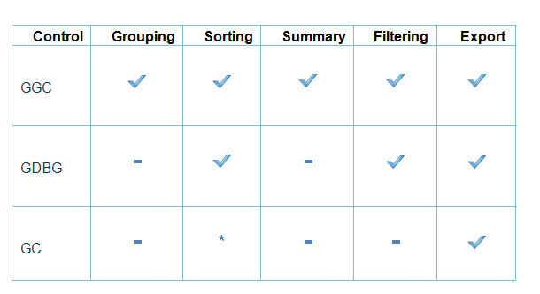
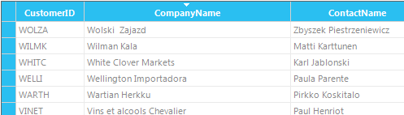
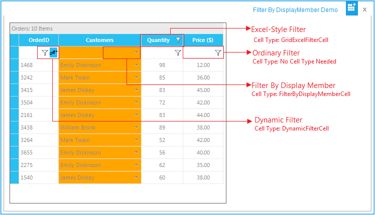

# Getting Started

This section will provide step-by-step procedure to create Grid control through designer and through programmatical approach in a .NET application.

## Choosing the Best Grid

GridControl (GC) is a powerful grid control that is implemented using unique styles architecture. Grid control, which is similar to Microsoft Excel, allows extremely detailed customization down to the cell level. Multilevel undo-redo, shared scrollbar support, data view separation, floating cells, more than 18 cell types, and unmatched extensibility are the unique features of the Essential Grid. This is a complete native .NET UI library, which provides several packages for building modern Windows applications by using the Microsoft .NET framework. 

GridGroupingControl (GGC) is a column-row oriented grid that is used to bind to a data source. Essential Grouping allows you to easily group, sort, filter, and summarize your data. It can display true nested grids with hierarchical data and it can also display multiple unrelated tables in one grid.

GridDataBoundGrid (GDBG) has been designed to be used as a grid bound to a data source such as an ADO.NET data set or data table. No data values are stored in the GridDataBoundGrid object. In GDBG, individual columns act as single entity (column-centric). Unlike the GridControl, GDBG is data bound. 

This section analyses the efficiency of the Grids based on the most important features. The following are the important features:

* Performance
* Grouping
* Sorting
* Summary
* ExcelExport
* Filtering

   

  * Sorting can be performed through customizing the GridSortColumnHeaderCellModel.

### Performance

#### GridGroupingControl

GridGroupingControl has an extremely high-performance standard. It can handle very high frequency updates and refresh scenarios. It also provides complete support for Virtual Mode wherein the data will be loaded only on demand. By simply setting a few properties, you can have the grid work with large amounts of data without affecting the performance. 

N>  For more details, refer to the following section: Performance

#### GridControl and GridDataBoundGrid

GridControl has an extremely high performance standard. It can handle high frequency updates and work with large amounts of data without affecting the performance, similarly GridDataBoundGrid can also handle large amount of data without affecting the performance. 

N> For more details, refer to the following section: Grid Data Bound Grid Performance and Performance

### Grouping

#### GridGroupingControl

GridGroupingControl alone supports grouping. This control is exclusively designed for grouping.This control supports grouping data at design time too. Grouping at design time displays the grid as a tree view. For non-nested data tables, you can use this control to quickly provide custom views of data. 

Grid Grouping control allows you to group the data based on one or more columns. When grouping is applied, the data will be organized into a hierarchical structure based on the matching field values.  This control enables you to combine identical value to form a group. Each group is identified by its GroupCaptionSection. You can expand this to view the records in the group. GroupCaptionSection provides information about a particular group such as the group name, number of items in the group and so on. The Grid Grouping control also provides Expand/Collapse button for every group. 

N> For more details, refer to the following section: Grouping

#### Sample 

A sample of this feature is available in the following location: &lt;Install Location&gt;\Syncfusion\EssentialStudio\[Version Number]\Windows\Grid.Grouping.Windows\Samples\2.0\Grouping\Grouping Demo

 

GridControl and the GridDataBoundGrid do not support Grouping.

### Summary

#### GridGroupingControl

GridGroupingcontrol alone supports calculating summaries and allows you to display summaries for each group. This enables you to derive additional information from your data such as average, maximum and minimum, summation, count, and so on. This engine supports summaries that operate on vectors such as Distinct Count, Median, 25% and 75% Quartile. You can also easily add custom summaries.

N> For more details, refer to the following section: Summaries

#### Sample

A sample of this feature is available in the following location:

&lt;Install Location&gt;\Syncfusion\EssentialStudio\[Version Number]\Windows\Grid.Grouping.Windows\Samples\2.0\Calculate Summary\Summary Tutorial

* GridControl and the GridDataBoundGrid do not support Summary.

### Sorting

#### GridGroupingControl

GridGroupingcontrol provides in-built support for sorting. This allows you to sort the table data against one or more columns and provides support to sort unlimited number of columns. While sorting, the grid will rearrange the data to match the current sort criteria.

N> For more details, refer to the following section: Sorting

#### Sample 

A sample of this feature is available in the following location:

&lt;Install Location&gt;\Syncfusion\EssentialStudio\[Version Number]\Windows\Grid.Grouping.Windows\Samples\Sorting\Sorting Demo

#### GridDataBoundGrid

GridDataBoundGrid allows you to arrange items in sequence, in different sets or in both. The following is the list of sorting behavior options that are available in GridDataBoundGrid:

* SingleClick: Sort column on single click once.
* DoubleClick: Sort column on double-click.
* None: Sorting is disabled.

  N> For more details, refer to the following section: Sorting By Display Member

#### Sample 

A sample of this feature is available in the following location:

  &lt;Install Location&gt;\Syncfusion\EssentialStudio\[Version Number]\Windows\GridDataBound.Windows\Samples\Sorting\Sort By DisplayMember Demo

#### GridControl

GridControl doesnot directly support sorting. Sorting can be performed through customizing the GridSortColumnHeaderCellModel. 

#### Sample 

The sample in the following location illustrates how to implement header-click sorting for the GridControl based grids. 

  &lt;Install Location&gt;\Syncfusion\EssentialStudio\[Version Number]\Windows\Grid.Windows\Samples\Grid Layout\Sorting Demo\

#### Sort Icon Placement

This feature is used to place the sort icon in different positions of the column header cell of the grid. The default position of the sort icon is to the right.

The position options include:

* Right
* Top
* Left 

_Table 4: Properties_

<table>
<tr>
<th>
{{ '**Property**' | markdownify }}</th><th>
{{ '**Description**' | markdownify }}</th><th>
{{ '**Type**' | markdownify }}</th><th>
{{ '**Data Type**' | markdownify }}</th></tr>
<tr>
<td>
SortIconPlacement.Right</td><td>
Gets or sets the icon placement to the right side of the column header cell.</td><td>
SortIconPlacement</td><td>
enumeration</td></tr>
<tr>
<td>
SortIconPlacement.Top</td><td>
Gets or sets the icon placement to the top side of the column header cell.</td><td>
SortIconPlacement</td><td>
enumeration</td></tr>
<tr>
<td>
SortIconPlacement.Left</td><td>
Gets or sets the icon placement to the left side of the column header cell.</td><td>
SortIconPlacement</td><td>
enumeration</td></tr>
</table>

##### Sample Link

&lt;Install Location&gt;\Syncfusion\EssentialStudio\[Version Number]\Windows\Grid.Grouping.Windows\Samples\Sorting\Sorting Demo

##### Adding Sort Icon Placement to an Application 

To enable this feature, use the following code:



this.gridGroupingControl1.SortIconPlacement = SortIconPlacement.Top;  





Me.gridGroupingControl1.SortIconPlacement = SortIconPlacement.Top



### Excel Export

Essential Grid control has built-in support for Excel. You can download the data from the Grid control or Grid Data Bound Grid or Grouping Grid control into an Excel spreadsheet for offline verification and computation. 

#### GridGroupingControl

This control automatically copies the Grid's styles, formats, groups, summary rows and expression fields to Excel. This enables you to export the grid with or without nested tables. It provides support for exporting grid with four different views. They are: 

* Default
* Visible
* RowHeader 
* ColumnHeader.
  N> For more details, refer to the following section:_ Exporting Grid Grouping Control To Excel

#### Sample 

A sample of this feature is available in the following location:

&lt;Install Location&gt;\Syncfusion\EssentialStudio\[Version Number]\Windows\Grid.Grouping.Windows\Samples\Exporting\Excel Export Demo

#### GridControl and GridDataBoundGrid

GridExcelConverter class enables you to export data from a Grid control or Grid Data Bound Grid into Excel. This control automatically copies the Grid's styles and formats to Excel. 

N> For more details, refer to the following section:_ [Exporting the Grid Control or Grid Data Bound Grid To Excel](http://help.syncfusion.com/ug_94/User%20Interface/Windows%20Forms/Grid/default.htm?turl=Documents%2F3161exportingthegridcontrolorgriddataboundgridtoexcel.htm)

#### Sample 

A sample of this feature is available in the following location:

#### For GDBG: 

&lt;Install Location&gt;\Syncfusion\EssentialStudio\[Version Number]\Windows\GridDataBound.Windows\Samples\Export\DBG XLS Export Demo

#### For GC:

&lt;Install Location&gt;\Syncfusion\EssentialStudio\[Version Number]\Windows\Grid.Grouping.Windows\Samples\Exporting\Excel Export Demo

### Filtering

#### GridGroupingControl

This control enables you to specify the logical condition for filtering. Similar to an Expression Field, this control also provides the option of typing an expression or entering a condition using an editor dialog for filtering.

#### Filterbar

Grouping Grid provides in-built support for displaying _Filter_ _Bar_across columns. It can be used to filter and clear filter at run time. This is user interactive and has more advantages.  One of the main reasons for its wide usage is that this can display various filter options for the columns. You can also add your own filter criteria.

#### Dynamic filter

Dynamic Filter serves as good replacement for Filter Bar. This provides advanced filtering capabilities. This is built on the foundation of the regular filter bar with added provisions to support dynamic filtering. The dynamic filter can be used with Nested Tables and Nested Groups.

N> For more details, refer to the following section: Record Filtering

#### Sample 

A sample of this feature is available in the following location:

&lt;Install Location&gt;\Syncfusion\EssentialStudio\[Version Number]\Windows\Grid.Grouping.Windows\Samples\Filters and Expressions

#### GridDataBoundGrid 

You can enable filtering for the grid based on GridDataBoundGrid, by adding a row of drop-down cells at the top of a simple (non-hierarchical) Grid Data Bound Grid. This allows you to filter match values from the drop-down. This control also supports filter by DisplayMember. 

N> For more details, refer to the following section: Filtering a Grid Data Bound Grid

#### Sample 

A sample of this feature is available in the following location:

&lt;Install Location&gt;\Syncfusion\EssentialStudio\[Version Number]\Windows\GridDataBound.Windows\Samples\Filtering\Filter By DisplayMember Demo

#### Filter for Specific Columns

When a filter is wired to a grid, it is wired to the entire grid. This makes it difficult to use different filters (e.g., dynamic filter, Excel-style filter, and filter by display member) in a single grid.

Here is a short description of each filter:

* Dynamic Filter—Filters the content using a list of comparison operators.
* Ordinary Filter—Filters the content based on the selected text and index.
* Excel-Style Filter—Filters the content based on multiple values and can sort the results, similar to Microsoft Excel filtering.
* Filter by Display Member—Filters the content by displaying the member instead of the value member of a combo-box column.

This feature enhances the use of different filters within a single grid. The filters are wired to each column by changing the cell type of the corresponding column, which enables users to apply many filters.

A filter can be applied to an individual column by setting the AllowIndividualColumnWiring property of the filter to true.

_Table 5: Properties_

<table>
<tr>
<th>
{{ '**Property**' | markdownify }}</th><th>
{{ '**Description**' | markdownify }}</th><th>
{{ '**Type**' | markdownify }}</th><th>
{{ '**Data Type**' | markdownify }}</th></tr>
<tr>
<td>
AllowIndividualColumnWiring</td><td>
Gets or sets whether the filters can be wired to an individual column. </td><td>
Bool</td><td>
Bool</td></tr>
</table>

##### Sample Link

A sample is available in the following location:

&lt;Install Location&gt;\Syncfusion\EssentialStudio\[Version Number]\Windows\Grid.Grouping.Windows\Samples\Filters and Expressions\Filter By DisplayMember Demo

##### Enable Filters on Desired Columns

The following code is used to enable filters in specific columns:



GridDynamicFilter filter = new GridDynamicFilter();

filter.AllowIndividualColumnWiring  = true;

filter.WireGrid(gridGroupingControl1);





 Dim filter As New GridDynamicFilter()

filter.AllowIndividualColumnWiring  = true;

filter.WireGrid(gridGroupingControl1);



Dynamic filter is wired to column 0 by using the following code:



this.gridGroupingControl1.TableDescriptor.Columns[0].Appearance.FilterBarCell.CellType = "DynamicFilterCell";





Me.gridGroupingControl1.TableDescriptor.Columns[0].Appearance.FilterBarCell.CellType = "DynamicFilterCell";



Other filters can be wired to the grids column by using the previous code.

## Through Designer

To make the task of designing Grid control easier on cell level, a new Designer Editor has been added. With the editor, grid can be modified and saved (and loaded) to xml formatted files or Soap formatted templates. There is also no longer Toggle Interactive Mode design verb that was present in versions prior to 4.1.

To add a Grid Control to the Application

Following steps illustrate how to add Grid control to your application.

1. Drag the GridControl component from the toolbox onto the form.

    

   To edit cell level properties of the grid (and also general Grid control properties), right-click anywhere in the Grid control and select Edit.

    

   This opens the GridControl Designer window. By using GridControl Designer, cell contents or styles, and general grid properties can be modified.

   

   Single cells can be modified along with a selection of ranges. To do this, select a range of cells, and switch to the Selected Range tab to view the property grid for the selection.

   

   GridControl Designer also lets you to save/load xml formatted files, and Soap templates.

2. When the changes are complete, simply exit the designer. If changes have been made, you will be prompted to save the changes to the Grid control in the designer.

3. Click OK to apply settings to the grid control.

See Also Through Code

## Through Code

The following code examples illustrate how to create a Grid control through code.



//Creates the Essential Grid.

private Syncfusion.Windows.Forms.Grid.GridControl gridControl1;

....

this.gridControl1 = new Syncfusion.Windows.Forms.Grid.GridControl();

//Sets the number of rows and columns.

this.gridControl1.ColCount = 10;

this.gridControl1.RowCount = 100;

//Positions it on the form.

this.gridControl1.Location = new System.Drawing.Point(20, 20);

this.gridControl1.Size = new System.Drawing.Size(344, 200);

//Adds it to the form's controls.

this.Controls.Add(this.gridControl1);





'Creates the Essential Grid.

Private WithEvents gridControl1 As GridControl

        ....

Me.gridControl1 = New Syncfusion.Windows.Forms.Grid.GridControl()

'Sets the number of rows and columns.

 Me.gridControl1.ColCount = 10

 Me.gridControl1.RowCount = 100

'Positions it on the form.

 Me.gridControl1.Location = New System.Drawing.Point(20, 15)

 Me.gridControl1.Size = New System.Drawing.Size(344, 150)

'Adds it to the form's controls.

Me.Controls.Add(Me.gridControl1)



See Also Through Designer

