# Getting Started

## Tutorials

What You Will Learn

This tutorial will show you how easy it is to get started with Essential Grid. It will give you basic introduction to the concepts you need to know before getting started with the product, and some tips and ideas on how to implement the Grid into your projects to improve customization and increase efficiency. The lessons in this tutorial are meant to introduce you to Essential Grid with simple step-by-step procedures.

* Grid Grouping Control Designer

In Lesson 1, you will become familiar with the Grid Grouping control, learning how to bind it to an MDB file, and creating a data source from an MDB file. You will also receive information related to the designer and its appearance properties. You will learn about the ShowGroupDropArea, TableOptions, AppearanceTopLevelGroupOptions, ChildGroupOptions, TableDescriptors properties as well as saving and restoring look and feel properties. There is also a section on adding summary rows, expression fields, and row filters.

* Grid Control Designer

In Lesson 2, you will use our cell-oriented Grid control in design mode to set properties on individual cells and ranges

of cells.

* Grid Data Bound Grid Designer

In Lesson 3, you will receive a background on the basics of Grid Data Bound Grid and will also learn how to apply special column formats.

* Virtual Grid

Lesson 4 will give you information on the importance of Virtual Grid. You will learn about creating the project and external data source, adding and initializing Essential grid, event handlers, saving edited values, type conversions and additional virtual grid properties.

* Excel Export

This section will take you through the conversion of Grid content to an Excel file, and also discusses the various converter options.

* Accessibility Information for Grid Windows Forms

This section will detail the criteria for accessibility for Grid Windows Forms

### Before You Begin

Some of the projects in this tutorial are mainly VS .NET steps, but we have included them to give you complete experience and information. 

During the installation of EssentialGrid, these controls will be installed in your toolbox within Visual Studio: Grid control, Grid Data Bound Grid, Grid List control, Grid Record Navigation control and Grid Grouping control. The latter control will only be available if you have purchased the Enterprise version of Essential Grid. If these controls are not available in your toolbox, you must add them before proceeding with this tutorial.

Lesson 1 assumes the sample data file, ACC.mdb, that we ship as part of our samples, is on your disk. It is usually found in this folder: _C:\Syncfusion\EssentialStudio\[Version Number]\Windows\Data_

Lesson 2 assumes that you have previously installed the QuickStart samples that are part of the .NET framework installation. In particular, we will use the NorthWind MSDE database that is part of those samples.

Depending on the specifications of your computer (resolution, color, size of monitor), the illustrations and code in this tutorial may vary slightly from what will appear on your screen. Contact technical support if you have any questions.

### Lesson 1: Grid Grouping Control Designer

Grid Grouping control has strong designer support. You can control all aspects of the grid's appearance through the designer. Additional commands (verbs) will let you save layouts and restore them. You can also use a preview feature that will let you load data into your control, and then further set the Grid Grouping control properties that can be persisted as design time properties.

This section has two major tasks. The first task is to place the Grid Grouping control on the form. The second task is to use the designer to set up data binding to an Access data file or SQL Server Database. This is strictly a Windows Forms process and really has nothing to do with our Grid Grouping control. You just need to set up a Data Adapter to access the data that is needed for the grid. The data for this is located in the My Documents\Syncfusion\EssentialStudio\VersionNumber\Windows\Data\NWIND.mdb or NWIND.sdf (depending upon your installation folder). For MDB file, you must use ADO.NET OLE DB support to access this data. For SQL Server, you must use SQL Server.

#### Binding MDB File by using Visual Studio 

##### By using VS 2005

The steps in this lesson are to be used with Visual Studio 2005 and .NET 2.0. You can use Smart Tags that are available in the .NET 2.0 Designer to hook into your MDB file. This tutorial is strictly a designer tutorial. You do not have to write even a single line of code.

1. From the Syncfusion tab in the toolbox, drag a Grid Grouping control onto your form.
2. In the Grid Grouping control smart tag, click the Choose Data Source drop down. Then click the Add Project Data Source link in the drop down.

In the Data Source Configuration Wizard that appears, select DataBase and click Next.

Click New Connection. Add Connection dialog box will be displayed.

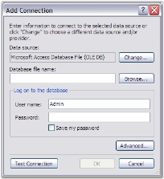

In the Add Connection dialog box, click Change button. This opens the Change Data Source dialog box.

In the Change Source dialog box, select the Microsoft Access DataBase File option, and then click OK.

The Add Connection dialog box will be opened without the DataBase file name entry set. Click Browse button and browse to the following path: _C:\Syncfusion\EssentialStudio\[Version Number]\Windows\Data\NWIND.mdb_ (this path will vary according to your installation location). Click OK.

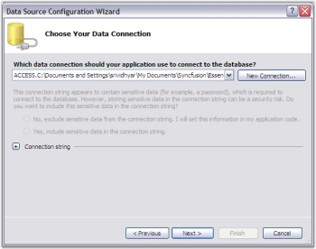

Click New Connection to choose your data connection. Click Next.

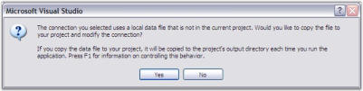

Click No to indicate that you do not want to save the MDB in the project.

The following screen appears.

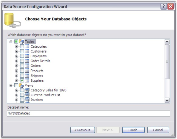

Click Next to choose your Database Objects. Select the Tables that you want. Click Finish.

The columns in the Grid Grouping control will now get populated as depicted in the following screen shot.

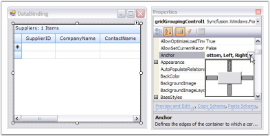

Finally, set the Anchor property of the Grid Grouping control to _All_, so that the Grid Grouping control can be easily sized with the form.

To allow grouping at run time, the Grid Grouping control displays a drop panel that the user can drag columns to be grouped. To display this drop panel, you need to set ShowGroupDropArea property to _true_.

Run the application to see the Grid Grouping control display the data from the MDB file (without having written a single line of code). Your form should look similar to the one in the following screen shot.

To group by CompanyName, click on the CompanyName column header and drag it to the drop area.

Notice that each set of grouped values has its own "Caption" row and its own "AddNew" row (*). Each group has its own PlusMinus cell that will let you expand/collapse the group.

> Note: For more details, refer the following browser sample: C:\Syncfusion\EssentialStudio\[Version Number]\Windows\Grid.Grouping.Windows\Samples\2.0\GettingStarted\Data Binding VS 2005 Demo

##### By using VS 2008

The steps in this lesson are to be used with Visual Studio 2008 and .NET 3.5. Smart Tags are available in the .NET 4.5.1 Designer to hook into your MDB file. This tutorial is strictly a designer tutorial. You do not have to write even a single line of code.

1. From the Syncfusion tab in the toolbox, drag a Grid Grouping control onto your form. In the Grid Grouping control smart tag, click Choose DataSource list, and then click Add Project Data Source. Data Source Configuration Wizard dialog box appears.

2. In the Choose a Data Source Type window, click Database, and then click Next.

3. In the Choose Your Data Connection window, click New Connection.

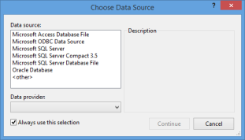

The ChooseData Source dialog box appears.

4. Click Microsoft Access Database File, and then click Continue.

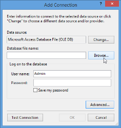

The Add Connection dialog box appears without the Database file name entry set.

5. Click Browse to choose the Data Source: _C:\Users\<User Name>\AppData\Local\Syncfusion\EssentialStudio\<Version number>\Common\Data\NWIND.mdb_ (this path will vary according to your installation location).
6. Click OK.

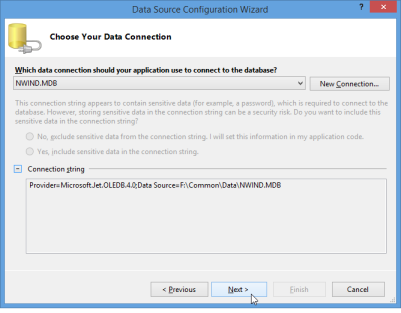

The connection string is displayed in the Data Source Configuration Wizard dialog box.

7. Click Next.

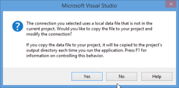

8. In the Microsoft Visual Studio message box that opens, click No to indicate that you do not want to save the MDB in the project.

The Save the Connection String to the Application Configuration File window opens.

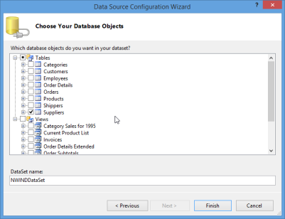

9. Click Next.
10. In the Choose your Database Objects window that opens, select the required tables.

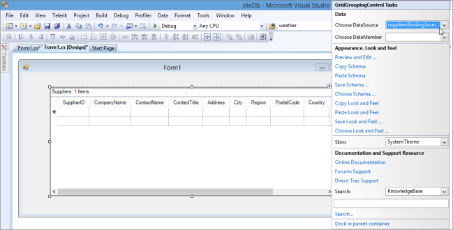

11. Click Finish.

The columns in the Grid Grouping control will get populated as shown in the following window shot.

12. Finally, set the Anchor property of the Grid Grouping control to _All_, so that the Grid Grouping control can be easily sized with the form.

13. You can group columns at run time by dragging columns headers of the columns be grouped to the GroupDropArea of the Grid Grouping control. To display the GroupDropArea of the Grid Grouping control, set ShowGroupDropArea property to _True_.

14. Run the application to view the MDB file data displayed by the Grid Grouping control (without having written a single line of code). Your form should look similar to the one in the following window shot.

##### By using VS 2010

The steps in this lesson are for use with Visual Studio 2010 and .NET 4.0. You can use Smart Tags available in the .NET 4.5.1 Designer to hook into your MDB file. This tutorial is strictly a designer tutorial. You do not have to write even a single line of code.

1. From the Syncfusion tab in the toolbox, drag a Grid Grouping control onto your form. In the Grid Grouping control smart tag, click Choose DataSource list, and then click Add Project Data Source. Data Source Configuration Wizard dialog box appears.

2. In the Choose a Data Source Type window, click Database, and then click Next.

3. In the Choose a Database Model window, click Dataset, and then click Next.

4. In the Choose Your Data Connection window, click New Connection.

The ChooseData Source dialog box appears.

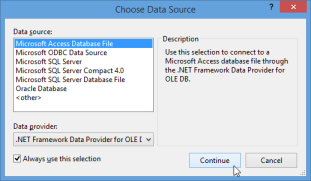

_Figure43: Choose Data Source dialog box_

5. Click Microsoft Access Database File, and then click Continue.

The Add Connection dialog box appears without the Database file name entry set.

6. Click Browse to choose the Data Source: _C:\Users\<User Name>\AppData\Local\Syncfusion\EssentialStudio\ <Version number>\ Common\Data\NWIND.mdb_ (this path will vary according to your installation location).
7. Click OK.

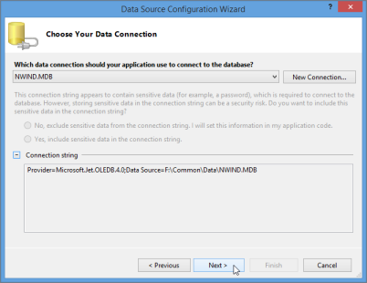

The connection string is displayed in the Data Source Configuration Wizard dialog box.

8. Click Next.

9. In the Microsoft Visual Studio message box that opens, click No to indicate that you do not want to save the MDB in the project.

The Save the Connection String to the Application Configuration File window opens.

10. Click Next.
11. In the Choose your Database Objects window that opens, select the required tables.

12. Click Finish.

The columns in the Grid Grouping control will get populated as shown in the following window shot.

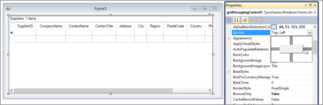

13. Finally, set the Anchor property of Grid Grouping control to _all_, so that Grid Grouping control can be easily sized with the form. This is depicted in the following screen shot.

14. You can group columns at run time by dragging column headers of the columns to be grouped to GroupDropArea of Grid Grouping control. To display GroupDropArea of Grid Grouping control, set ShowGroupDropArea property to _True_.

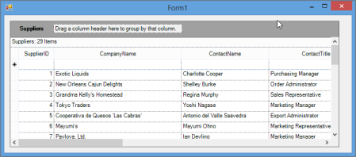

15. Run the application to view the MDB file data displayed by the Grid Grouping control (without having written a single line of code). Your form should look similar to the one in the following window shot.

##### By using VS 2012

The following steps are intended for use with Visual Studio 2012 and .NET 4.5. You can use Smart Tags that are available in the .NET 4.5 designer to hook into your MDB file. This tutorial is strictly a designer tutorial. You do not have to write a single line of code. 

1. From the Syncfusion tab in the toolbox, drag a Grid Grouping control onto your form.
2. In the Grid Grouping control smart tag, click Choose Data Source drop-down list. Then click Add Project Data Source link.

In the Data Source Configuration Wizard that appears, select Database and click Next.

Select Dataset from Data Source Configuration Wizard dialog and click Next.

The following screen will appear:

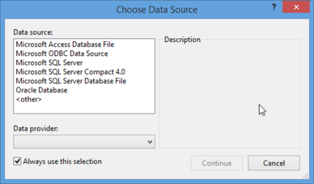

Click New Connection. ChooseData Source dialog box will be displayed.

3. In the Change Data Source dialog box, select the Microsoft Access Database File option, and then click Continue. Add Connection dialog box will be displayed.

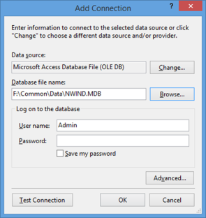

4. Add Connection dialog box will be opened without the Database file name entry set. Click Browse and browse to the following path: _C:\Users\<User Name>\AppData\Local\Syncfusion\EssentialStudio\<Version number>\Common\Data\NWIND.mdb_ (this path will vary according to your installation location). Click OK.

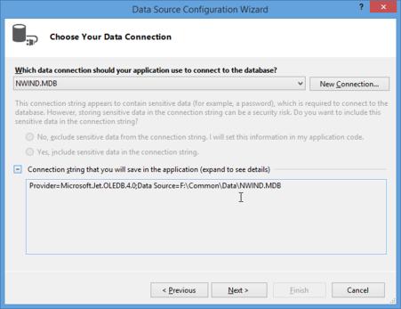

Now the Data Source Configuration Wizard will open, along with the connection string also shown in this dialog. Click Next.

Click No to indicate that you do not want to save the MDB in the project.

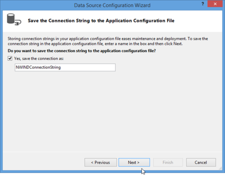

The following screen will appear:

5. Click Next to choose your Database Objects. Select the tables that you want. Click Finish.

The columns in the Grid Grouping control will now be populated as depicted in the following screenshot:

Finally, set the Anchor property of the Grid Grouping control to All, so that the Grid Grouping control can be easily sized with the form.

To allow grouping at run time, the Grid Grouping control displays a drop panel onto which the user can drag columns to be grouped. To display this drop panel, set the ShowGroupDropArea property to true as shown in the following screenshot:

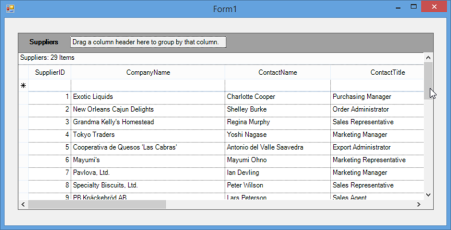

Run the application to see the Grid Grouping control display the data from the MDB file without having written a single line of code. Your form should look similar to the one in the following screenshot:

##### By using VS 2013

The steps in this lesson are for use with Visual Studio 2013 and .NET 4.5.1. You can use Smart Tags that are available in the .NET 4.5.1 Designer to hook into your MDB file. This tutorial is strictly a designer tutorial. You do not have to write even a single line of code.

1. From the Syncfusion tab in the toolbox, drag a Grid Grouping control onto your form. In the Grid Grouping control smart tag, click Choose DataSource list, and then click Add Project Data Source. Data Source Configuration Wizard dialog box appears.

2. In the Choose a Data Source Type window, click Database, and then click Next.

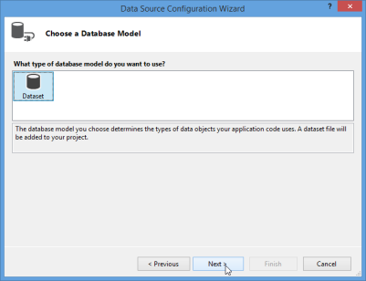

3. Then, in the Choose a Database Model window, click Dataset, and then click Next.

4. In the Choose Your Data Connection window, click New Connection.

ChooseData Source dialog box appears.

5. Click Microsoft Access Database File, and then click Continue.

The Add Connection dialog box appears without the Database file name entry set.

6. Click Browse to choose the Data Source: _C:\Users\<User Name>\AppData\Local\Syncfusion\EssentialStudio\<Version number>\Common\Data\NWIND.mdb_ (this path will vary according to your installation location).
7. Click OK.

The connection string is displayed in the Data Source Configuration Wizard dialog box.

8. Click Next.

9. In the Microsoft Visual Studio message box that opens, click No to indicate that you do not want to save the MDB in the project.

The Save the Connection String to the Application Configuration File window opens.

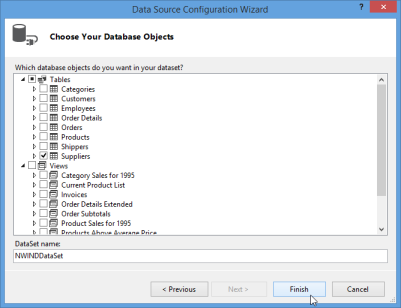

10. Click Next.
11. In the Choose your Database Objects window that opens, select the required tables.

12. Click Finish.

The columns in the Grid Grouping control will get populated as shown in the following window shot.

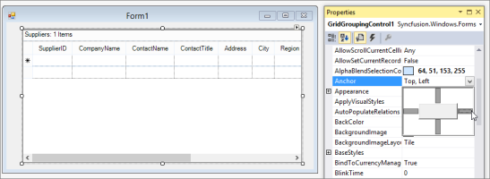

13. Finally, set the Anchor property of the Grid Grouping control to _All_, so that the Grid Grouping control can be easily sized with the form.

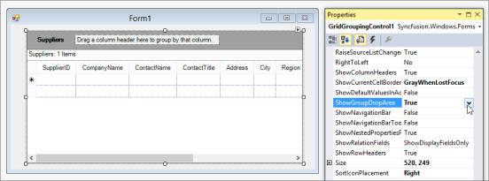

14. You can group columns at run time by dragging column headers of the columns to be grouped to the GroupDropArea of the Grid Grouping control. To display GroupDropArea of Grid Grouping control, set ShowGroupDropArea property to _True_.

15. Run the application to view the MDB file data displayed by the Grid Grouping control (without having written a single line of code). Your form should look similar to the one in the following window shot.

#### Binding SQL Server by using Visual Studio

##### By using VS 2005

The steps in this lesson are for use with Visual Studio 2005 and .NET 2.0. You can use Smart Tags that are available in the .NET 2.0 Designer to hook into your SQL server file. This tutorial is strictly a designer tutorial. You neednot write even a single line of code.

1. From the Syncfusion tab in the toolbox, drag a Grid Grouping control onto your form.
2. In the Grid Grouping control smart tag, click the Choose Data Source drop down. Then click the Add Project Data Source link in the drop down.

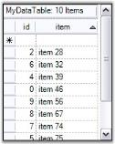

3. In the Data Source Configuration Wizard that appears, select DataBase and click Next.

4. Click New Connection. The Add Connection dialog box will be displayed.

_Figure86: Select the Data Connection

The ChooseData Source dialog box appears.

_Figure87: Choose Data Source dialog box_

5. Click Microsoft SQL Server, and then click OK.

_Figure88: Choose Data Source dialog box_

 The Add Connection dialog box appears without the Database file name entry set

6. Choose Server Name.
7. Choose Database Name or Click Browse to choose the Data Source:_C:\Users\<User Name>\AppData\Local\Syncfusion\EssentialStudio\<Version number>\Common\Data\NWIND.sdf_ (this path will vary according to your installation location).
8. Select either windows authentication or SQL server authentication option. You are required to give SQL server credentials when you Authenticate with SQL server.  

_Figure89:Selecting the SQL Server Database

9. Click OK.

 The connection string is displayed in the Data Source Configuration Wizard dialog box.

_Figure90:Choosing a Data Connection_

10. Click Next.

_Figure91: Saving Connection String_

11. Select the DataBaseObject file from the listed database files.

_Figure92: Choosing Database Objects

The columns in Grid Grouping control get populated, as depicted in the following screenshot.

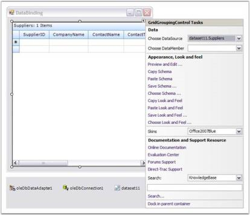

12. Finally, set the Anchor property of Grid Grouping control to All, so that the control can be sized easily with the form. This is depicted in the following screenshot.

13. To allow grouping at run time, the user can drag columns to be grouped onto a drop panel that the Grid Grouping control displays. To display this drop panel, set the ShowGroupDropArea property to “True” as shown in the following screenshot.

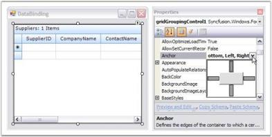

14. Run the application to see the Grid Grouping control display the data from the SQL Server database. Your form should look similar to the one in the following screenshot.

15. To group by CompanyName, click on the CompanyName column header and drag it to the drop area as illustrated in the following screenshot

Notice that each set of grouped values has its own "Caption" row and its own "AddNew" row, denoted by the * symbol. Each group has its own PlusMinus cell that allows you to expand or collapse the group. 

##### By using VS 2008

The steps in this lesson are for use with Visual Studio 2008 and .NET 3.5. You can use Smart Tags that are available in the .NET 4.5.1 Designer to hook into your SQL Server Database. This tutorial is strictly a designer tutorial. You need not write even a single line of code.

1. From the Syncfusion tab in the Toolbox, drag a Grid Grouping control onto your form.

In the Grid Grouping control smart tag, click Choose DataSource list, and then click Add Project Data Source.

The Data Source Configuration Wizard dialog box appears.

2. In the Choose a Data Source Type window, click Database, and then click Next.

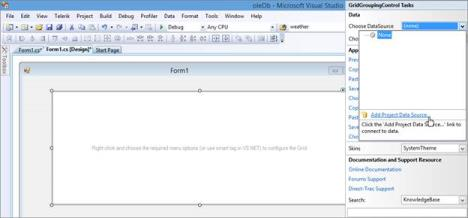

3. In the Choose Your Data Connection window, click New Connection.

The ChooseData Source dialog box appears.

4. Click Microsoft SQL Server, and then click OK.

 The Add Connection dialog box appears without the Database file name entry set.

5. Choose Server Name.
6. Choose Database Name or click Browse to choose the data source: _C:\Users\<User Name>\AppData\Local\Syncfusion\EssentialStudio\<Version number>\Common\Data\NWIND.sdf_

This path varies according to your installation location.

7. Select either the Windows Authentication option or the SQL Server Authentication option. If you want to authenticate SQL server, give your credentials for the SQL server.

8. Click OK.

 The connection string is displayed in the Data Source Configuration Wizard dialog box.

9. Click Next.

10. Select DataBaseObject file from listed database files.

11. Click Finish.

The columns in the Grid Grouping control get populated as shown in the following screenshot.

12. Finally, set the Anchor property of the Grid Grouping control to All, so that the control can be sized easily with the form, as shown in the following screenshot.

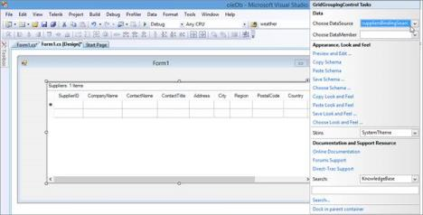

13. You can group columns at run time by dragging the column headers of the columns to be grouped to the GroupDropArea of the Grid Grouping control. To display the GroupDropArea of the Grid Grouping control, set the ShowGroupDropArea property to “True”, as shown in the following screenshot.

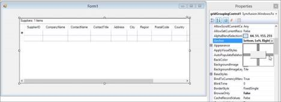

14. Run the application to view the SQL Server Database data displayed by the GridGrouping control. Your form should look similar to the one in the following screenshot.

##### By using VS 2010

The steps in this lesson are for use with Visual Studio 2010 and .NET 4.0. You can use Smart Tags that are available in the .NET 4.5.1 Designer to hook into your SQL Server Database. This tutorial is strictly a designer tutorial. You do not have to write even a single line of code.

1. From the Syncfusion tab in the Toolbox, drag a Grid Grouping control onto your form.

In the Grid Grouping control smart tag, click Choose DataSource list, and then click Add Project Data Source. The Data Source Configuration Wizard dialog box appears.

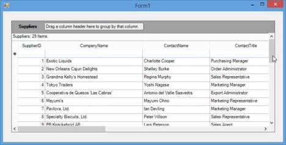

_Figure112: Add a Project Data Source_

2. In the Choose a Data Source Type window, click Database, and then click Next.

_Figure113: Select Database_

3. In the Choose a Database Model window, click Dataset, and then click Next.

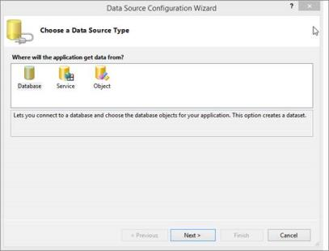

_Figure114: Select Dataset_

4. In the Choose Your Data Connection window, click New Connection.

The ChooseData Source dialog box appears.

_Figure116: Choose Data Source dialog box_

5. Click Microsoft SQL Server, and then click OK.

_Figure117: Choose Data Source dialog box_

The Add Connection dialog box appears without the Database file name entry set

6. Choose Server Name.
7. Choose Database Name or Click Browse to choose the Data Source: _C:\Users\<User Name>\AppData\Local\Syncfusion\EssentialStudio\<Version number>\Common\Data\NWIND.sdf_

This path varies according to your installation location.

8. Select either the Windows Authentication option or the SQL server authentication option. If you want to authenticate with SQL server, give your SQL server credentials.

_Figure118: Selecting the SQL Server Database_

9. Click OK.

 The connection string is displayed in the Data Source Configuration Wizard dialog box.

_Figure119: Choosing a Data Connection_

10. Click Next.

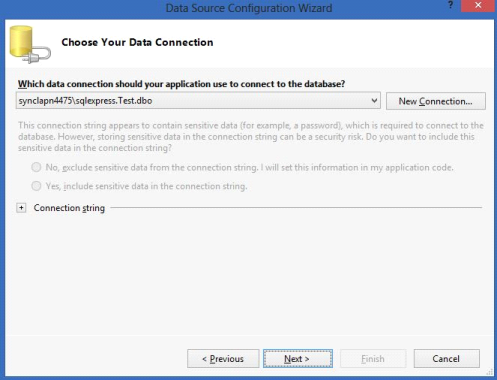

_Figure120: Saving Connection String_

11. Select DataBaseObject file from listed database files.

_Figure121:Choosing Database Objects_

12. Click Finish.

The columns in the Grid Grouping control get populated, as shown in the following screenshot.

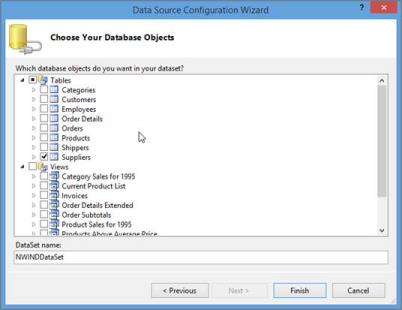

_Figure122: Grid Grouping Control_

13. Finally, set the Anchor property of the Grid Grouping control to All, so that the Grid Grouping control can be easily sized with the form. This is depicted in the following screenshot.

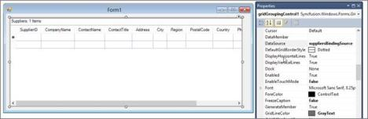

14. You can group columns at run time by dragging the columns headers of the columns to be grouped to the GroupDropArea of the Grid Grouping control. To display the GroupDropArea of the Grid Grouping control, set the ShowGroupDropArea property to “True”, as shown in the following screenshot.

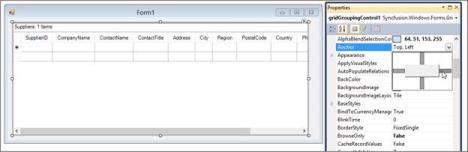

15. Run the application to view the SQL Server Database data, displayed by the Grid Grouping control. Your form should look similar to the one in the following screenshot.

##### By using VS 2012

The following steps are intended for use with Visual Studio 2012 and .NET 4.5. You can use Smart Tags that are available in the .NET 4.5 Designer to hook into your SQL Server database. This tutorial is strictly a designer tutorial. You do not have to write a single line of code.

1. From the Syncfusion tab in the Toolbox, drag a Grid Grouping control onto your form. 
2. In the Grid Grouping control smart tag, click the Choose Data Source drop-down list. Then click the Add Project Data Source link.

3. In the Data Source Configuration Wizard that appears, select Database and click Next.

4. Select Dataset from Data Source Configuration Wizard dialog and click Next.

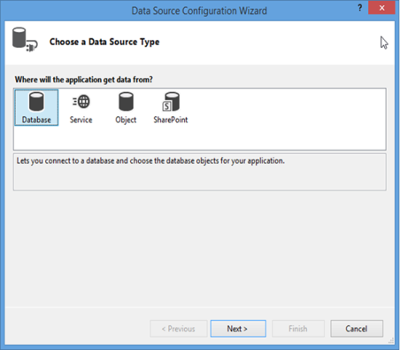

The following screen appears:

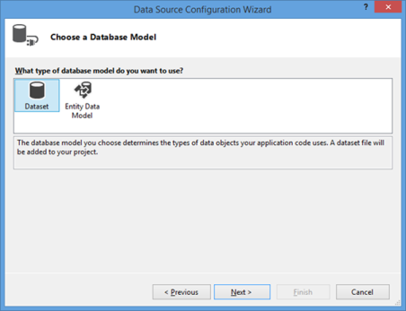

5. Click New Connection. The ChooseData Source dialog box is displayed.

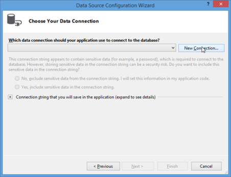

6. In the Change Data Source dialog box, select the SQL Server option, and then click Continue. The Add Connection dialog box is displayed.

7. Choose Server Name.
8. Choose Database Name or Click Browse to choose the Data Source: _C:\Users\<User Name>\AppData\Local\Syncfusion\EssentialStudio\<Version number>\Common\Data\NWIND.sdf_

This path varies according to your installation location.

9. Select either the Windows Authentication option or the SQL Server Authentication option. If you want to authenticate with SQL server, give your SQL server credentials.   

_Figure132:Selecting the SQL Server Database_

10. Click OK.

 The connection string is displayed in the Data Source Configuration Wizard dialog box.

_Figure133: Choosing a Data Connection_ 

11. Click Next.

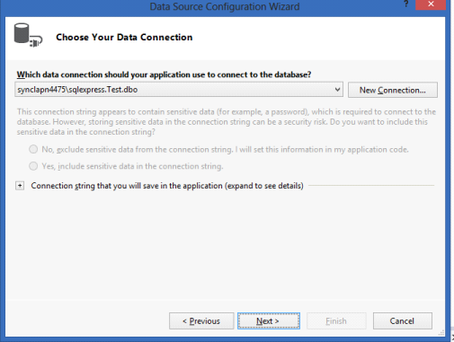

_Figure134: Saving Connection String_

12. Select DataBase Object file from listed database files.

_Figure135:Choosing Database Objects_

13. Click Finish.

The columns in the Grid Grouping control get populated, as depicted in the following screenshot:

14. Finally, set the Anchor property of the Grid Grouping control to All, so that the Grid Grouping control can be sized easily with the form. This is depicted in the following screenshot:

15. You can group columns at run time by dragging the columns headers of the columns to be grouped to the GroupDropArea of the Grid Grouping control. To display this drop panel, set the ShowGroupDropArea property to “True”, as shown in the following screenshot:

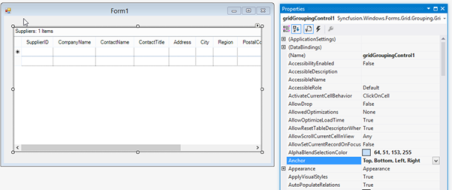

16. Run the application to see the Grid Grouping control display the data from the SQL Server Database, without having written a single line of code. Your form should look similar to the one in the following screenshot:

##### By using VS 2013

The steps in this lesson are for use with Visual Studio 2013 and .NET 4.5.1. You can use Smart Tags that are available in the .NET 4.5.1 Designer to hook into your SQL Server database. This tutorial is strictly a designer tutorial. You do not have to write even a single line of code.

1. From the Syncfusion tab in the Toolbox, drag a Grid Grouping control onto your form.

In the Grid Grouping control smart tag, click Choose DataSource list, and then click Add Project Data Source.

The Data Source Configuration Wizard dialog box appears.

2. In the Choose a Data Source Type window, click Database, and then click Next.

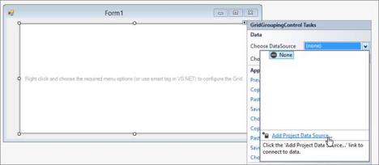

3. Then, in the Choose a Database Model window, click Dataset, and then click Next.

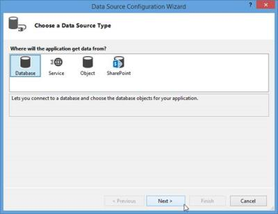

4. In the Choose Your Data Connection window, click New Connection.

The ChooseData Source dialog box appears.

5. In the Change Data Source dialog box, select the SQL Server option, and then click Continue. The Add Connection dialog box is displayed.

6. Choose Server Name.
7. Choose Database Name or Click Browse to choose the Data Source: 

_C:\Users\<User Name>\AppData\Local\Syncfusion\EssentialStudio\<Version number>\Common\Data\NWIND.sdf_

This path varies according to your installation location.

8. Select either the Windows Authentication option or the SQL Server Authentication option. If you want to authenticate with SQL server, give your SQL server credentials.   

_Figure146:Selecting the SQL Server Database_

9. Click OK.

 The connection string is displayed in the Data Source Configuration Wizard dialog box.

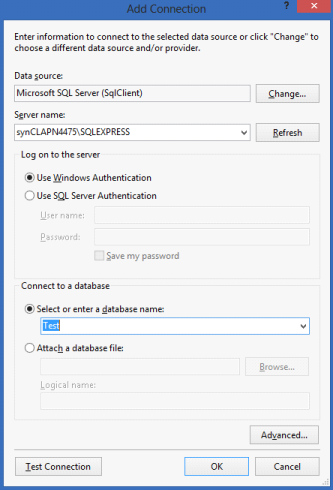

_Figure147:Choosing a Data Connection_

10. Click Next.

11. In the Choose your Database Objects window that opens, select the required tables.

12. Click Finish.

The columns in the Grid Grouping control get populated, as shown in the following screenshot.

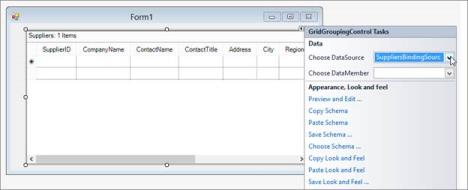

13. Finally, set the Anchor property of the Grid Grouping control to All, so that the Grid Grouping control can be easily sized with the form as shown in the following screenshot.

14. You can group columns at run time by dragging columns headers of the columns to be grouped to the GroupDropArea of the Grid Grouping control. To display the GroupDropArea of the Grid Grouping control, set the ShowGroupDropArea property to “True”, as shown in the following screenshot.

15. Run the application to view the SQL Server database data displayed by the GridGrouping control. Your form should look similar to the one in the following screenshot.

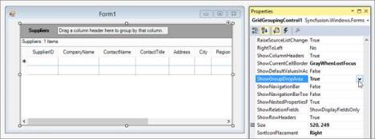

### Lesson 2: Grid Control Designer

Starting with Version 4.1, the design time support for the Grid control will be much more user friendly. To make the task of designing the Grid control easier on a cell level, a new Designer Editor has been added. With the editor, the grid can be modified and saved (and loaded) to Xml formatted files, or Soap formatted templates.  There is also no longer a Toggle Interactive Mode design verb that was present in versions prior to 4.1. 

In this lesson, you will learn about basic Grid Control.

#### Basic Grid Control

This section covers information on how to add a grid control to your Windows application.

Adding a Grid Control to your Application

Following step-by-step procedure illustrates how to add a simple grid control to your application.

1. Drag the GridControl component from the toolbox onto the form.

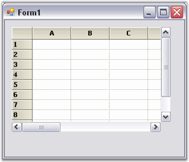

To edit the cell level properties of the grid (and also general Grid control properties), right-click on the Grid control and select Edit from the context menu.

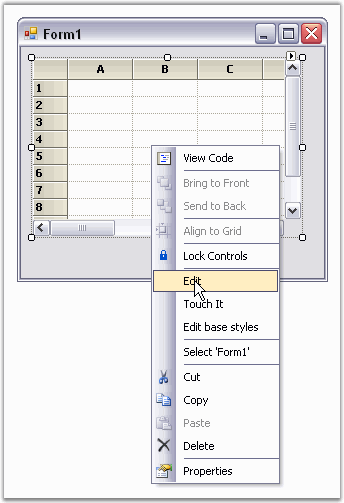

GridControl Designer window is displayed. By using GridControl Designer, cell contents/styles and general grid properties can be modified.

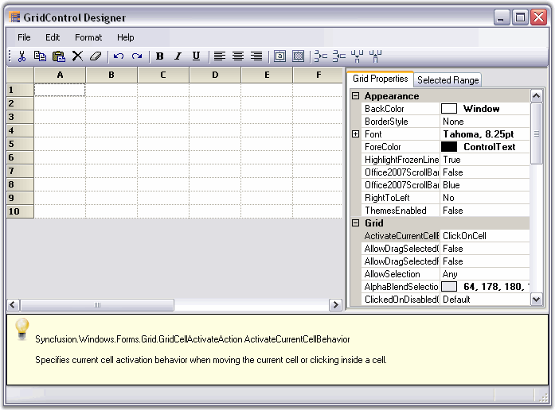

Single cells can be modified along with a selection of ranges. To do this, select a range of cells and switch to the Selected Range tab to view property grid to select.

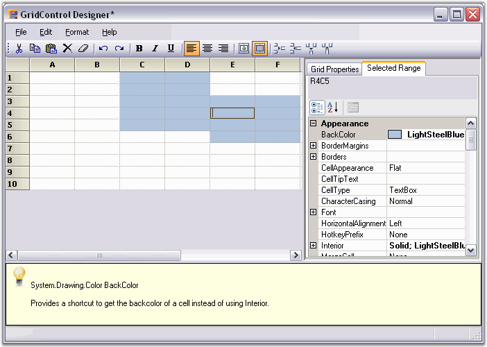

GridControl Designer also lets you save/load xml formatted files and Soap templates.

When the changes are complete, simply exit the designer. If changes have been made, you will be prompted to save the changes to the Grid control in the designer.

### Lesson 3: DataBound Grid Designer

In this lesson, you will learn how to use Forms Designer to create an Essential DataBound Grid. You can rely on the designer to generate all the codes necessary except for two lines: one that fills the ADO.NET adapter and one that updates the database when you are done.

#### Basic DataBound Grid

In this part, you will learn how to use the designer to place DataBound Grid on a form. 

1. In Visual Studio .NET, use the File -> Menu option to create a new Windows Application project, naming it DBGridTutorial.

You now have an empty form on the design surface. Open the Data section of your toolbox and drag a SQLDataAdapter onto your form. This will open a Data Adapter Wizard.

Use the wizard to create a connection to the NorthWind database. This DataBase is installed as part of the .NET Framework ADO.NET samples.

Select use SQL statements.

To generate SQL statement, click Query Builder button.

In the Add Table dialog, select Products table and click Add, then Close.

In this Query Build window, select ProductName, ProductID, QuantityPerUnit and UnitPrice. Then press OK.

Click Next to confirm the Query you selected.

Click Finish. Your design surface will look similar to this.

Next you will need to generate a dataset from the SQLDataAdapter. Right-click sqlDataAdapter1 under the design surface and select Generate DataSet. You will then see this window.

Press OK to add DataSet11 object next to sqlConnection1 under the design surface.

From the toolbox, drag Grid Data Bound Grid control to your form. Size and position it and add a button labeled Update to your form.

Click DataBound Grid to display its properties in PropertyGrid. Set these properties.

_Table 7: Properties_

<table>
<tr>
<td>
DataSource</td><td>
DataSet11</td></tr>
<tr>
<td>
DisplayMember</td><td>
Products</td></tr>
</table>
Double click the form on the design surface (not one of the controls, but the form itself) to add a load event handler. In this handler, add the single statement given below.

[C#]

//Loads dataset with records.

this.sqlDataAdapter1.Fill(this.dataSet11);




[VB.NET]

'Loads dataset with records.

Me.sqlDataAdapter1.Fill(Me.dataSet11)



To support updating data in your database, you will need to call Update command on the SQLDataAdapter. Double click Update button on the design surface to add a Click Handler. Then add this single line of code to the handler.



[C#]

//Saves Changes(if any) back to the database.

this.sqlDataAdapter1.Update(this.dataSet11);




[VB.NET]

'Saves Changes (if any) back to the database.

Me.sqlDataAdapter1.Update(Me.dataSet11);



Now when you click Update button, it will post the changes made back to your database.

#### Applying Special Column Formats

GridBoundColumn collection property of DataBound Grid is used to set column properties. This collection will let you control columns displayed and their order. For each column that you want displayed, add a Grid Bound Column. In this Grid Bound Column, you must set MappingName property; the other properties such as HeaderText and Style are optional. Under the Style property, you will have access to normal GridStyleInfo properties that you can apply to this column such as BackColor, CellType and Font.

1. Open GridBoundColumns collection editor by using property grid.

Click Add button to add a grid bound column, and then set MappingName property of that grid bound column to _ProductName_.

Select StyleInfo property and set BackColor for the column as shown in the following screen shot.

Repeat the above steps to add Grid Bound Columns for 'UnitPrice' and 'UnitsInStock'. For the 'UnitPrice' Grid Bound Column, set StyleInfo.Format to _C_.

Compile and run the project to see formatted Grid Data Bound Grid. In the following screen shot, you will be able to see the grid with columns specified and in the order that you specified them. Notice that the 'UnitPrice' column shows the price in specified currency format.

### Lesson 4: Virtual Grid Tutorial

Virtual grid does not hold any data. All the data displayed by the grid is provided on demand from some external data source to the grid when it needs it. Virtual grids are ideal for displaying large amounts of data, which are already stored in some manner. This data is not moved from its original location or stored in GridStyleInfo objects. Instead, GridInfoStyle objects are created on the fly, to temporarily hold only the necessary data and are discarded when they are no longer needed. There is no data stored in the grid.

Implementing virtual grid is straight forward. Depending upon the functionality that you need, you can implement a virtual grid with as few as three events. To implement a virtual grid, you must tell the grid how many rows and columns your data source has, and provide the grid data from your data source. You must do these things in real time, only when the grid requests these data elements. When the grid needs to know the number of rows in the grid, it will fire QueryRowCount event. When it needs to know the number of columns in the grid, it will fire QueryColCount event. When it needs to know GridStyleInfo object for a particular cell, it will fire QueryCellInfo event. By handling these events and setting appropriate members of EventArgs, you are providing information that the grid needs at the time required. 

In this section, you will learn how to set up an external data source, and then display it by using a virtual grid. The first iteration will allow the display of the external data source; the second iteration will add code that allows you to edit the displayed data in the virtual grid, pushing the changes back to your data source. 

#### Creating the Project and Data Source

1. In Visual Studio .NET, open File menu and select New Project. Then using either VB.NET or C#, select Windows Application project template to create a new Windows Forms project, naming it VirtualGridTutorial.

Create the data source

You can set any external data source that can return value based on the row-column parameters that are passed to it. In addition, external data source should have knowledge of the number of rows and columns. This last requirement can be relaxed, but if the data source knows the number of rows and columns, it simplifies things. Our tutorial will assume that this is the case.

The external data source will be a class with two public properties (RowCount and ColCount) and two-parameter class indexer that will return the integer value associated with two integers (row and column) passed in as indexes. The exact mechanics of this class are not material to this tutorial. This class simply provides data on demand. How it stores it or how it gets it, plays no role in a virtual grid. To add DataSource class, right-click project in the Solution Explorer, point to Add, click Class, and add a class named 'ExternalData'.

Copy the following code into this file. Notice that the constructor accepts row and column count, and then populates an integer array. You can modify this class in any way you like as long as you define the class indexer and RowCount and ColCount properties, so that the virtual grid can access the data when needed. 



[C#]

public class ExternalData

{

    private int _rowCount;

    private int _colCount;

    private int[,] _data;

    public ExternalData(int rows, int cols)

    {

//Sets number of rows and number of columns.

        _rowCount = rows;

        _colCount = cols;

//Allocates memory to store data values.

        _data = new int[_rowCount, _colCount];

//Just sets the data. 

        for(int i = 0; i < RowCount; ++i)

        for(int j = 0; j < ColCount; ++j)

        _data[i,j] = 100 * i + j;                

    }

//Sets Properties.

    public virtual int this[int row, int col]

    {

        get{ return _data[row, col];}

        set{ _data[row, col] = value;}

    }

    public virtual int RowCount

    {

        get{return _rowCount;}

    }

    public virtual int ColCount

    {

        get{ return _colCount;}

    }

}




[VB.NET]

Public Class ExternalData

Private _rowCount As Integer

Private _colCount As Integer

Private _data(,) As Int32

Public Sub New(ByVal rows As Integer, ByVal cols As Integer)

MyBase.New()

'Sets number of rows and number of columns.

_rowCount = rows

_colCount = cols

'Allocates memory to store data values.

_data = New Integer(_rowCount - 1, _colCount - 1) {}

'Just sets data.

Dim i As Integer

i = 0

Do While (i < RowCount)

Dim j As Integer

j = 0

Do While (j < ColCount)

_data(i, j) = ((100 * i) + j)

j = (j + 1)

Loop

i = (i + 1)

Loop

End Sub

'Sets Properties.

Public Overridable ReadOnly Property RowCount() As Integer

Get

Return _rowCount

End Get

End Property

Public Overridable ReadOnly Property ColCount() As Integer

Get

Return _colCount

End Get

End Property

Default Public Overridable Property Item(ByVal row As Integer, ByVal _

                                       col As Integer) As Integer

Get

Return _data(row, col)

End Get

Set(ByVal Value As Integer)

_data(row, col) = Value

End Set

End Property

End Class


#### Adding Virtual Grid

To add a Virtual Grid to your application:

1. Select the form, open the toolbox and drag a Grid control onto your form.
> Note: Do not change the values of the RowCount or ColCount properties for the grid. Let the default values remain as it is. These values will be provided dynamically as part of the virtual grid implementation.

2. Customize the other properties such as BorderStyle, etc.

#### Initializing the Virtual Grid

To initialize the Virtual Grid added to your application

1. Double-click the form's background so that a handler for the form's load event is added to your code.
2. Add an ExternalData member to your form with the code given below.



[C#]

//Adds an external data member.

private ExternalData _extData;



[VB.NET]

'Adds an external data member.

Private _extData as ExternalData



3. Then in your Form1_Load handler, add the following code to initialize the external data source and hook up the Grid control events so that the grid can use external data source to get data in demand. The events of interest are GridControl.QueryRowCount, GridControl.QueryColCount and GridControl.QueryCellInfo. The call to ResetVolatileData tells the grid that it needs to reset properties like RowCount and ColCount the next time they are needed. This will allow the event handlers to set these values.


[C#]

private void Form1_Load(object sender, System.EventArgs e)

{

//Creates a new external data source with 100 rows and 20 columns.

    this._extData = new ExternalData(100, 20);

//Prepares the grid for virtual data.

    gridControl1.ResetVolatileData();

//Hooks up the events needed for the virtual grid.

    gridControl1.QueryCellInfo += new GridQueryCellInfoEventHandler(GridQueryCellInfo);

    gridControl1.QueryRowCount += new GridRowColCountEventHandler(GridQueryRowCount);

    gridControl1.QueryColCount += new GridRowColCountEventHandler(GridQueryColCount);

}



[VB.NET]

Private Sub Form1_Load(ByVal sender As Object, ByVal e As EventArgs)

'Creates a new external data source with 100 rows and 20 columns.

Me._extData = New ExternalData(100, 20)

'Prepares the grid for virtual data.

gridControl1.ResetVolatileData()

' Hooks up the events needed for the virtual grid.

'While only the QueryCellInfo is absolutely required, it would be unusual not to handle at least one of the count events.

AddHandler gridControl1.QueryCellInfo, New _GridQueryCellInfoEventHandler(AddressOf GridQueryCellInfo)

AddHandler gridControl1.QueryRowCount, New _GridRowColCountEventHandler(AddressOf GridQueryRowCount)

AddHandler gridControl1.QueryColCount, New _GridRowColCountEventHandler(AddressOf GridQueryColCount)

End Sub


#### Style Properties

In your GridQueryCellInfo handler, it is possible to set style properties other than CellValue. For example, the code that follows will color any value that is divisible by three. To set properties other than the CellValue, change your QueryCellInfo event handler as shown below.



[C#]

void GridQueryCellInfo(object sender, GridQueryCellInfoEventArgs e) 

{

    if (e.RowIndex > 0 && e.ColIndex > 0)

    {

//Sets Cell Value.

        e.Style.CellValue = this._extData[e.RowIndex - 1, e.ColIndex - 1];

//Applies conditional formatting.

        if(this._extData[e.RowIndex - 1, e.ColIndex - 1] % 3 == 0)

                e.Style.BackColor = Color.LightPink;

        e.Handled = true;

    }

}



[VB.NET]

Private Sub GridQueryCellInfo(ByVal sender As Object, ByVal e _As GridQueryCellInfoEventArgs)

If ((e.RowIndex > 0) AndAlso (e.ColIndex > 0)) Then

'Sets Cell Value.

e.Style.CellValue = Me._extData(e.RowIndex - 1, e.ColIndex - 1)

'Applies conditional formatting.

If ((Me._extData(e.RowIndex - 1, e.ColIndex - 1) Mod 3) = 0) Then

e.Style.BackColor = Color.LightPink

End If

e.Handled = True

End If

End Sub



#### Handling Events to Retrieve Data for Virtual Grid

To retrieve data for the Virtual Grid from the external data source,

1. Add event handlers for QueryRowCount and QueryColCount events. Use the following code in your event handlers.

GridQueryRowCount and GridQueryColCount provide the number of rows and columns from the external data source. Thus, the implementation code will access public properties of our external data object to get these values.



[C#]

//Sets number of rows from external data source.

void GridQueryRowCount(object sender, GridRowColCountEventArgs e) 

{

    e.Count = this._extData.RowCount;

    e.Handled = true;

}

//Sets number of columns from external data source.

void GridQueryColCount(object sender, GridRowColCountEventArgs e) 

{

    e.Count = this._extData.ColCount;

    e.Handled = true;

}




[VB.NET]

'Sets number of rows from external data source.

Private Sub GridQueryRowCount(ByVal sender As Object, ByVal e _As GridRowColCountEventArgs)

e.Count = Me._extData.RowCount

e.Handled = True

End Sub

'Sets number of columns from external data source.

Private Sub GridQueryColCount(ByVal sender As Object, ByVal e _As GridRowColCountEventArgs)

e.Count = Me._extData.ColCount

e.Handled = True

End Sub



2. Add QueryCellInfo event handler.
3. GridQueryCellInfo is the event handler where the grid expects external data source to provide cell values that are in demand. Here is how it can be implemented with external data source. Recall that row 0 and column 0 are usually the header columns in a grid. In the GridQueryCellInfo, do not provide these values and use the default headers. If you need to provide special header values, you can do so.



[C#]

void GridQueryCellInfo(object sender, GridQueryCellInfoEventArgs e) 

{

    if (e.RowIndex > 0 && e.ColIndex > 0)

    {

        e.Style.CellValue = this._extData[e.RowIndex - 1, e.ColIndex - 1];

        e.Handled = true;

    }

}



[VB.NET]

Private Sub GridQueryCellInfo(ByVal sender As Object, ByVal e _As GridQueryCellInfoEventArgs)

If ((e.RowIndex > 0) AndAlso (e.ColIndex > 0)) Then

e.Style.CellValue = Me._extData(e.RowIndex - 1, e.ColIndex - 1)

e.Handled = True

End If

End Sub

Notice that all the three handlers set Handled property on EventArgs when a value is provided. This informs the grid that no further processing is needed. Do not forget this or you will lose some of the benefits of using a virtual grid. 

4. Compile and run the project. You will see something similar to the screen shot below. The point is that the grid itself does not hold any data. All the information is provided on demand through the three events that you have added.

#### Saving Edited Values

While working on Virtual Grid, you will see that the changes do not stay around after you leave the current cell, i.e., if you over type a cell entry, when you move off the cell, the old value is restored. The reason is that currently, there is no way for the changed value to be moved back to the external data source. So, as you move off the cell, when the grid redraws the old cell, it will query the external data source (through GridQueryCellInfo), get the original value and display it. The value you had typed will be lost. In order to edit and save values in the Virtual Grid, you must get the changed value back to the external data source. This is accomplished through GridControl.SaveCellInfo event. You must add a handler for this event and in this handler, you must save the changed value back to the external data source.


[C#]

private void Form1_Load(object sender, System.EventArgs e)

{

//Creates a new external data source with 100 rows and 20 columns.

    this._extData = new ExternalData(100, 20);

//Hooks up the events needed for the virtual grid.

    gridControl1.ResetVolatileData();

    gridControl1.QueryCellInfo += new GridQueryCellInfoEventHandler( GridQueryCellInfo);

    gridControl1.QueryRowCount += new GridRowColCountEventHandler( GridQueryRowCount);

    gridControl1.QueryColCount += new GridRowColCountEventHandler( GridQueryColCount);

//Handles saving data back to the data source.

    gridControl1.SaveCellInfo += new GridSaveCellInfoEventHandler( GridSaveCellInfo);

}

void GridSaveCellInfo(object sender, GridSaveCellInfoEventArgs e)

{

    try

    {

//Moves the changes back to the external data object.

        if( e.ColIndex > 0 && e.RowIndex > 0)

        {

            this._extData[e.RowIndex - 1, e.ColIndex - 1] = int.Parse(e.Style.CellValue.ToString());

        }

    }

    catch{}

    e.Handled = true;

}



[VB.NET]

Private Sub Form1_Load(ByVal sender As Object, ByVal e As EventArgs)

'Creates a new external data source with 100 rows and 20 columns.

Me._extData = New ExternalData(100, 20)

'Prepares the grid for virtual data.

gridControl1.ResetVolatileData()

'Hooks up the events needed for the virtual grid.

'While only the QueryCellInfo is absolutely required, it would be unusual not to handle at least one of the count events.

AddHandler gridControl1.QueryCellInfo, New _GridQueryCellInfoEventHandler(AddressOf GridQueryCellInfo)

AddHandler gridControl1.QueryRowCount, New _GridRowColCountEventHandler(AddressOf GridQueryRowCount)

AddHandler gridControl1.QueryColCount, New _GridRowColCountEventHandler(AddressOf GridQueryColCount)

'Handles saving data back to the data source.

AddHandler gridControl1.SaveCellInfo, New _GridSaveCellInfoEventHandler(AddressOf GridSaveCellInfo)

End Sub

Private Sub GridSaveCellInfo(ByVal sender As Object, ByVal e _As GridSaveCellInfoEventArgs)

Try

'Moves the changes back to the external data object.

If ((e.ColIndex > 0) AndAlso (e.RowIndex > 0)) Then

Me._extData((e.RowIndex - 1), (e.ColIndex - 1)) = _System.Int32.Parse(e.Style.CellValue.ToString)

End If

Catch ex As System.Exception

End Try

e.Handled = True

End Sub



#### Setting Properties in a Virtual Grid

So far you have seen that you can provide any GridStyleInfo property in a virtual manner by merely handling the Grid control's QueryCellInfo event. You can also provide the row count and column count in a virtual manner.

Here is a list of the other events that will allow virtual access to an Essential Grid.

* QueryRowHeight-This event allows you to dynamically provide row heights.
* QueryColWidth-This event allows you to dynamically provide column widths.
* QueryCoveredRange-This event allows you to dynamically provide covered cell ranges.


[C#]

//Provides the row heights on demand - optional...

void GridQueryRowHeight(object sender, GridRowColSizeEventArgs e)

{

    if( e.Index % 2 == 0)

    {

        e.Size = 20;

        e.Handled = true;

    }

}

//Provides the col widths on demand - optional...

void GridQueryColWidth(object sender, GridRowColSizeEventArgs e)

{

    if( e.Index % 3 == 0)

    {

        e.Size = 40;

        e.Handled = true;

    }

}

//Provides covered range on demand - optional...

void GridQueryCoveredRange(object sender, GridQueryCellRangeEventArgs e) 

{

//Covers odd rows, columns 1 through 3.

    if (e.RowIndex % 2 == 1 && e.ColIndex >= 1 && e.ColIndex <= 3)

    {

        e.Range = GridRangeInfo.Cells(e.RowIndex, 1, e.RowIndex, 3);

        e.Handled = true;

    }

//Covers column 6 with odd-even row pairs.

    if (e.RowIndex > 0 && e.ColIndex == 6)

    {

        int row = (e.RowIndex-1) /2 * 2 + 1;

        int col = e.ColIndex;

        e.Range = GridRangeInfo.Cells(row, col, row+1, col);

        e.Handled = true;

    }

}




[VB.NET]

Private Sub GridQueryRowHeight(ByVal sender As Object, ByVal e As _GridRowColSizeEventArgs)

If ((e.Index Mod 2) = 0) Then

e.Size = 20

e.Handled = True

End If

End Sub

Private Sub GridQueryColWidth(ByVal sender As Object, ByVal e As _GridRowColSizeEventArgs)

If ((e.Index Mod 3) = 0) Then

e.Size = 40

e.Handled = True

End If

End Sub

Private Sub GridQueryCoveredRange(ByVal sender As Object, ByVal e As _GridQueryCellRangeEventArgs)

'Covers odd rows, columns 1 through 3.

'Covers column 6 with odd-even row pairs.

If ((((e.RowIndex Mod 2) = 1) AndAlso (e.ColIndex >= 1)) _AndAlso (e.ColIndex <= 3)) Then

e.Range = GridRangeInfo.Cells(e.RowIndex, 1, e.RowIndex, 3)

e.Handled = True

End If

If ((e.RowIndex > 0) AndAlso (e.ColIndex = 6)) Then

Dim row As Integer

row = ((((e.RowIndex - 1) / 2) * 2) + 1)

Dim col As Integer

col = e.ColIndex

e.Range = GridRangeInfo.Cells(row, col, (row + 1), col)

e.Handled = True

End If

End Sub



#### Type Conversions

You will notice that in GridSaveCellInfo method, you had used int.Parse method to convert string value in the GridStyleInfo object to the integer you needed for the external data source. You can instead make use of the more general Convert class provided by Essential Grid to handle conversions between various data types. This class, for example, can convert the value in CellValue property to DataTime object or to Color object, depending upon the need. The following code example illustrates how to use this Convert class.

[C#]

// Converts a value in CellValue property to 'int' (as required by our data source) by using Convert class.

this._extData[e.RowIndex - 1, e.ColIndex - 1] = (int)GridCellValueConvert.ChangeType(e.Style.CellValue, typeof(int), null);




[VB.NET]

'Converts a value in CellValue property to 'int' (as required by our data source) by using Convert class.

Me._extData(e.RowIndex - 1, e.ColIndex - 1) = CInt(GridCellValueConvert.ChangeType(e.Style.CellValue, GetType(Integer), Nothing))


> Note: This conversion problem may occur when the value that is stored in the style object is a string. This happens when the CellValueType property is not explicitly set on the style object in your GridQueryCellInfo method. But when this is set to "int", then you can cast the CellValue in SaveCellInfo to an int, and do not have to worry about conversions.

### Lesson 5: Excel Export

Export to Excel is one of the most common functionalities required in the .NET world. Essential Grid control has built-in support for Excel Export. You can download the data from Grid control or DataBound Grid or Grouping Grid control into an Excel spreadsheet for offline verification and/or computation. This can be achieved by making use of the GridExcelConverter and GroupingGridExcelConverter classes. This section will take you through conversion of the contents of the grid to an Excel file, as well as discuss various converter options.

#### Exporting Grid Control or DataBound Grid To Excel

GridExcelConverter class provides support for exporting data from a Grid control or DataBound Grid into an Excel spreadsheet for verification and/or computation. This control automatically copies the Grid's styles and formats to Excel. GridExcelConverter control is derived from GridExcelConverterBase. The XlsIO libraries support the conversion of Grid content to Excel.

To make use of GridExcelConverter class, the following assemblies should be added along with default assemblies present in the References folder of your application: Syncfusion.GridConverter.Base and Syncfusion.XlsIO.Base. GridToExcel method is used to export the grid to an Excel sheet. The following code example illustrates how to convert the Grid content to Excel.

[C#]

Syncfusion.GridExcelConverter.GridExcelConverterControl gecc = new Syncfusion.GridExcelConverter.GridExcelConverterControl();

gecc.GridToExcel(this.gridControl1.Model, @"C:\MyGC.xls");



[VB.NET]

Dim gecc As Syncfusion.GridExcelConverter.GridExcelConverterControl = New Syncfusion.GridExcelConverter.GridExcelConverterControl()

gecc.GridToExcel(Me.gridControl1.Model, "C:\MyGC.xls")


The following code example illustrates how to convert the Grid Data Bound Grid content to Excel.

[C#]

Syncfusion.GridExcelConverter.GridExcelConverterControl gecc = new Syncfusion.GridExcelConverter.GridExcelConverterControl();

gecc.GridToExcel(this.gridDataBoundGrid1.Model, @"C:\MyGC.xls");



[VB.NET]

Dim gecc As Syncfusion.GridExcelConverter.GridExcelConverterControl = New Syncfusion.GridExcelConverter.GridExcelConverterControl()

gecc.GridToExcel(Me.gridDataBoundGrid1.Model, "C:\MyGC.xls")


##### GridControl to Excel Conversion Process

The conversion of Grid to Excel is done cell by cell. Each cell is converted with respect to its style, including its format and background color. This is done by using the GridCellToExcel() method of GridExcelConverterControl class.

##### Currency Cell Conversion

##### If format specified

The cell is checked whether it is a Currency cell type by using CellType property. If it is a Currency Cell type, then the CellValue will be converted into Double and saved in Range’s Number property. NumberFormatInformation is extracted from NumberFormatInfoObject and the number is converted to string by using extracted format. FormatString is created and saved in Range’s NumberFormat property. The following is a sample code to set the format of the Currency cell:

[C#]

this.gridControl1[row,col].Format = "C";




[VB]

Me.gridControl1(row,col).Format = "C"


##### If format is not specified

The cell is checked whether it is a Currency cell type by using the CellType property. If the CellType is not given, then it switches to default CellType and the CellValue is stored in Range’s “Value2” property, where the value2 is converted into the given CellValueType(Except Date Time and Currency). Hence, in this case the CellValue will be converted to General format.

##### Number Cell Conversion 

##### If format is specified

The cell is checked whether it is a Number cell type by using CellType property. If it is a Number Cell type then the cell value is assigned to Range’s Value2 property. Since the format is specified, the Value2’s value is converted to its respective type and set to Number format. The following is a sample code to set the format of Currency cell:

[C#]

this.gridControl1[row,col].Format = "N";



[VB]

Me.gridControl1(row,col).Format = "N"


##### If format is not specified

The cell is checked whether it is a Number cell type by using CellType property. If it is not a Number Cell type, format is skipped for all cell types and finally the CellValue is assigned to Range’s Value2 property. Since the format is not specified, the Value2 value is converted to its respective type and set to General Format.

##### Image Cell Conversion 

##### If CellType specified

The cell is checked whether it is an Image cell type by using CellType property. If it is an Image Cell type, then the CellValue is converted to a bitmap and this bitmap is inserted into the sheet specifying the row and column.

##### If CellType is not specified

Not Applicable

##### ComboBox and RichText Cell Conversion 

##### If CellType is specified

The cell is checked whether it is a ComboBox or RichText cell type by using the CellType property. If it is a ComboBox or RichText cell type then the FormattedText is stored in the Range’s Text property.

##### If CellType is not specified

Not Applicable

##### ProgressBar Cell Conversion 

##### If CellType is specified

The cell is checked whether it is a ProgressBar cell type using CellType property. If it is a ProgressBar cell type, then the ProgressBar text style is checked whether it should be in percentage style. If the style is in percentage  then the percentage value is calculated and saved to Range’s Number property. The Range’s NumberFormat is saved as “0%”. If there is no style specified, the ProgressValue is directly saved to Range’s Number.

##### If CellType is not specified

Not Applicable

##### DateTime Cell Conversion 

##### If format is specified

The cell is checked whether it is DateTime cell type using CellType property. If it is DateTime cell type, the format is skipped for all cell types and finally the CellValue is assigned to Range’s DateTime property. Since the format is specified, DateTime value is converted to DateTime type and format is set to the DateTime format in Range’s Format.

##### If format is not specified

The cell is checked whether it is DateTime cell type using CellType property. If it is not DateTime cell type, format is skipped for all cell types and finally CellValue is assigned to Range’s DateTime property. Since format is not specified, DateTime value is converted to DateTime type and set to General Format.

##### Formula Cell Conversion 

##### If Format is specified

The cell is checked whether it is Formula cell type using CellType property. If it is Formula cell type, then GridCell’s Text string is stored to Range’s Formula property. The values in Excel cells can be formatted by specifying format in Formula cell types.

##### If Format not specified

If formula is not specified for the cell, then the formula is set to Excel sheet’s range Formula property with its default format.

#### Import an Excel Sheet into Essential Grid

An Excel sheet can also be imported to the Grid control or DataBound Grid. This can be done by using ExcelToGrid method in the GridExcelConverterControl class. The following code example illustrates how to transfer Excel content to the Grid control.

[C#]

Syncfusion.GridExcelConverter.GridExcelConverterControl gecc = new Syncfusion.GridExcelConverter.GridExcelConverterControl();

gecc.ExcelToGrid(@"C:\MyGC.xls", this.gridControl1.Model);



[VB.NET]

Dim gecc As Syncfusion.GridExcelConverter.GridExcelConverterControl = New Syncfusion.GridExcelConverter.GridExcelConverterControl()

gecc.ExcelToGrid("C:\MyGC.xls", Me.gridControl1.Model)



The following code example illustrates how to transfer Excel content to DataBound Grid.

[C#]

Syncfusion.GridExcelConverter.GridExcelConverterControl gecc = new Syncfusion.GridExcelConverter.GridExcelConverterControl();

gecc.ExcelToGrid(@"C:\MyGC.xls", this.gridDataBoundGrid1.Model);



[VB.NET]

Dim gecc As Syncfusion.GridExcelConverter.GridExcelConverterControl = New Syncfusion.GridExcelConverter.GridExcelConverterControl()

gecc.ExcelToGrid("C:\MyGC.xls", Me.gridDataBoundGrid1.Model)


#### Excel Converter Options

GridExcelConverter class enables you to export specific grid elements like column headers, row headers, and so on. By default, GridExcelConverterControl exports all elements in the grid. The following code example illustrates how to include both row and column headers during the export.

[C#]

gecc.GridToExcel(this.grid.Model, @"C:\MyGGC.xls", Syncfusion.GridExcelConverter.ConverterOptions.RowHeaders | Syncfusion.GridExcelConverter.ConverterOptions.ColumnHeaders);




[VB.NET]

gecc.GridToExcel(Me.grid.Model, "C:\MyGGC.xls", Syncfusion.GridExcelConverter.ConverterOptions.RowHeaders|Syncfusion.GridExcelConverter.ConverterOptions.ColumnHeaders)


#### Exporting Grid Grouping Data To Excel

GroupingGridExcelConverter class provides support for exporting data from Grouping Grid control into an Excel spreadsheet for verification and/or computation. This control automatically copies Grid's styles, formats, groups, summary rows and expression fields to Excel. It is derived from GridExcelConverterBase. The XlsIO libraries support the conversion of Grid content to Excel.

To make use of the GroupingGridExcelConverter class, the following assemblies must be added along with default assemblies present in the References folder of your application: Syncfusion.XlsIO.Base and Syncfusion.GridConverter.Windows. The content of Grid Grouping control can be transferred to Excel by using GroupingGridToExcel method in GroupingGridExcelConverterControl class. There are two export options provided by the Grid Grouping control: first option converts the entire content of the grid to Excel, and the second option converts only the visible content of the grid to Excel. The following code example illustrates how to convert the entire Grid content to Excel.

[C#]

Syncfusion.GroupingGridExcelConverter.GroupingGridExcelConverterControl converter = new Syncfusion.GroupingGridExcelConverter.GroupingGridExcelConverterControl();

converter.GroupingGridToExcel(this.gridGroupingControl1, @"C:\MyGGC.xls", Syncfusion.GridExcelConverter.ConverterOptions.Default); 




[VB.NET]

Dim converter As Syncfusion.GroupingGridExcelConverter.GroupingGridExcelConverterControl = New Syncfusion.GroupingGridExcelConverter.GroupingGridExcelConverterControl()

converter.GroupingGridToExcel(Me.gridGroupingControl1, "C:\MyGGC.xls", Syncfusion.GridExcelConverter.ConverterOptions.Default);



You can export the visible or expanded records or groups alone by using the following code.

[C#]

converter.GroupingGridToExcel(this.gridGroupingControl1, @"C:\MyGGC.xls", Syncfusion.GridExcelConverter.ConverterOptions.Visible); 




[VB.NET]

converter.GroupingGridToExcel(this.gridGroupingControl1, "C:\MyGGC.xls", Syncfusion.GridExcelConverter.ConverterOptions.Visible);


#### Exporting Multiple Grids

It is possible to save multiple grids to a single XLS file as worksheet. The following code example illustrates how to do this.

[C#]

using Syncfusion.XlsIO;

using Syncfusion.GridExcelConverter;

private void buttonExport_Click(object sender, System.EventArgs e)

{

    SaveFileDialog saveFileDialog = new SaveFileDialog();

    saveFileDialog.Filter = "Files(*.XLS)|*.XLS";

    saveFileDialog.AddExtension = true;

    saveFileDialog.DefaultExt = ".XLS";

    if(saveFileDialog.ShowDialog() == DialogResult.OK && saveFileDialog.CheckPathExists)

    {

        GridExcelConverterControl gec = new GridExcelConverterControl();

        IWorkbook workBook = ExcelUtils.CreateWorkbook(new string[] {"Sheet1","Sheet2"});

        gec.GridToExcel(this.gridControl1.Model, workBook.Worksheets[0]);

        gec.GridToExcel(this.gridControl2.Model, workBook.Worksheets[1]);

        workBook.SaveAs(saveFileDialog.FileName);

        workBook.Close();

        ExcelUtils.ThrowNotSavedOnDestroy = false;

    }

}




[VB.NET]

Imports Syncfusion.XlsIO

Imports Syncfusion.GridExcelConverter

Private Sub buttonExport_Click(ByVal sender As Object, ByVal e As System.EventArgs)

Dim saveFileDialog As SaveFileDialog = New SaveFileDialog()

saveFileDialog.Filter = "Files(*.XLS)|*.XLS"

saveFileDialog.AddExtension = True

saveFileDialog.DefaultExt = ".XLS"

If saveFileDialog.ShowDialog() = DialogResult.OK And Also saveFileDialog.CheckPathExists Then

Dim gec As GridExcelConverterControl = New GridExcelConverterControl

Dim workbook As IWorkbook = ExcelUtils.CreateWorkbook(New String() {"Sheet1", "Sheet2"})

gec.GridToExcel(Me.gridControl1.Model, workBook.Worksheets(0))

gec.GridToExcel(Me.gridDataBoundGrid1.Model, workbook.Worksheets(1))

workbook.SaveAs(saveFileDialog.FileName)

workBook.Close()

ExcelUtils.ThrowNotSavedOnDestroy = False

End If

End Sub


#### Exporting Grid Data to Excel 2010

You can export Grid data to Excel 2010. To do this, you must explicitly set the Excel version by creating an XlsIO application, and then export the Grid data to the Excel worksheet. You can set DefaultVersion to _Excel2010_ to export to this version by default. Similarly, you can also export Grid data to other versions of Excel. The following code example illustrates this.


[C#]

ExcelEngine engine = new ExcelEngine();

IApplication app = engine.Excel.Application;

app.DefaultVersion = ExcelVersion.Excel2010;

IWorkbook book = app.Workbooks.Create();

GroupingGridExcelConverterControl gecc = new GroupingGridExcelConverterControl ();

SaveFileDialog saveFileDialog = new SaveFileDialog();

saveFileDialog.Filter = "Files(*.xlsx)|*.xlsx";

saveFileDialog.DefaultExt = ".xlsx";

if (saveFileDialog.ShowDialog() == System.Windows.Forms.DialogResult.OK)

{

gecc.GroupingGridToExcel(this.gridGroupingControl1, book.Worksheets(0), ConverterOptions.Visible);

book.SaveAs(saveFileDialog.FileName);

   if (MessageBox.Show("Do you wish to open the xls file now?", "Export to Excel", MessageBoxButtons.YesNo, MessageBoxIcon.Question) == System.Windows.Forms. DialogResult.Yes)

   {

Process proc = new Process ();

proc.StartInfo.FileName = saveFileDialog.FileName;

proc.Start();

  }

}




[VB.NET]

Dim engine As New ExcelEngine()

Dim app As IApplication = engine.Excel.Application

app.DefaultVersion = ExcelVersion.Excel2010

Dim book As IWorkbook = app.Workbooks.Create()

Dim gecc As New GroupingGridExcelConverterControl()

Dim saveFileDialog As New SaveFileDialog()

saveFileDialog.Filter = "Files(*.xlsx)|*.xlsx"

saveFileDialog.DefaultExt = ".xlsx"

If saveFileDialog.ShowDialog() = System.Windows.Forms.DialogResult.OK 

Then

gecc.GroupingGridToExcel(Me.gridGroupingControl1, book.Worksheets(0), ConverterOptions.Visible)

book.SaveAs(saveFileDialog.FileName)

   If MessageBox.Show("Do you wish to open the xls file now?", "Export to Excel", MessageBoxButtons.YesNo, MessageBoxIcon.Question) = System.Windows.Forms.DialogResult.Yes Then

Dim proc As New Process()

proc.StartInfo.FileName = saveFileDialog.FileName

proc.Start()

  End If

End If


> Note: This is applicable to all Grid controls in Essential Grid.

#### Lesson 6: Accessibility Information for Grid Windows Forms

##### Technical Standards

Software Applications and Operating Systems – Detailed Voluntary Product Accessibility Template

_Table 8: Voluntary Product Accessibility Template_

<table>
<tr>
<th>
CRITERIA</th><th>
SUPPORTING FEATURES</th><th>
REMARKS</th><th>
EXPLANATIONS</th></tr>
<tr>
<td>
(a) When software is designed to run on a system that has a keyboard, product functions shall be executable from a keyboard, where the function itself or the result of performing a function can be discerned textually.</td><td>
Fully Supported</td><td>
Essential Grid supports keyboard navigation and the editing of text.</td><td>
Events can be handled in order to suppress and simulate all the keys. The events could be made to be dependent on the cell or over the grid.</td></tr>
<tr>
<td>
(b) Applications shall not disrupt or disable activated features of other products identified as accessibility features, where those features are developed and documented according to industry standards. Applications also shall not disrupt or disable activated features of any operating system that is identified as accessibility feature where the application programming interface for those accessibility features has been documented by the manufacturer of the operating system and is available to the product developer. </td><td>
Fully Supported </td><td>
Essential Grid component can be placed independent of other controls, so that no other product or item on the operating system would be disrupted or disabled. </td><td>
Unless the grid is bound to the shared data source with external control, the grid does not affect the attributes over the other. Refreshing the form can also be specified within the bounds of the grid object.</td></tr>
<tr>
<td>
(c) A well-defined on-screen indication of the current focus shall be provided to move among interactive interface elements as the input focus changes. The focus shall be programmatically exposed so that Assistive Technology can track focus and focus changes.</td><td>
Fully Supported</td><td>
The focusing indication is applied to the individual cells. </td><td>
The border of the current cell can be highlighted if the grid has the focus on the specific cell.</td></tr>
<tr>
<td>
(d) Sufficient information about user interface element including identity, operation and state of the element shall be available to Assistive Technology. When an image represents a program element, the information conveyed by the image must also be available in text. </td><td>
Not Applicable</td><td>
It is application-oriented, where the information to be provided on an individual component depends on the event of the grid.</td><td>
</td></tr>
<tr>
<td>
(e) When bitmap images are used to identify controls, status indicators, or other programmatic elements, the meaning assigned to those images shall be consistent throughout an application's performance. </td><td>
Fully Supported</td><td>
Supports on design time to identify the control.</td><td>
The dependent property has been provided, where the property window will identify the control and specify its own attributes.</td></tr>
<tr>
<td>
(f) Textual information shall be provided through operating system functions for displaying text. The minimum information that shall be made available is text content, text input caret location and text attributes. </td><td>
Fully Supported</td><td>
Runtime support is also provided in order to change the text and its style. Format could be modified with the settings.</td><td>
Validation on the text with runtime is fully supported. Format dialog can be wired to the cell in order to change the settings. From the caret position, the nearest character can be obtained from the underlying text.</td></tr>
<tr>
<td>
(g) Applications shall not override user selected contrast, color selections and other individual display attributes. </td><td>
Fully Supported</td><td>
The settings handled in the grid will not be affected by the application.</td><td>
Supports with the DPI setting, also the contrast does not affect with the variations.</td></tr>
<tr>
<td>
(h) When animation is displayed, the information shall be displayable in at least one non-animated presentation mode at the option of the user. </td><td>
Not Applicable </td><td>
This behavior is application oriented, where the animation provided in the cells will be in specific bounds and the rest of the area can be used to provide non-animated content.</td><td>
</td></tr>
<tr>
<td>
(i) Color coding shall not be used as the only means of conveying information, indicating an action, prompting a response or distinguishing visual element. </td><td>
Fully Supported</td><td>
Essential Grid controls provide complete functionality that conforms to the criteria. </td><td>
Essential Grid abides by the default validation rules and constraints such that while entering invalid values in cells along with red color being highlighted, it prompts the respective system error message, which requires the user to rectify the invalid value to proceed further.</td></tr>
<tr>
<td>
(j) When a product permits a user to adjust color and contrast settings, a variety of color selections capable of producing a range of contrast levels shall be provided. </td><td>
Fully Supported</td><td>
Fully supported for Essential Grid controls internally.</td><td>
Depends on the component base of elements with default setting with the operating system. The window control acts to the specification and provides solid display with various contrasts.</td></tr>
<tr>
<td>
(k) Software shall not use flashing or blinking text, objects, or other elements having a flash or blink frequency greater than 2 Hz and lower than 55 Hz. </td><td>
Not Applicable </td><td>
The blinking support is provided in the Essential Grid, but the frequency on data update has to be provided by the user at their end based on the need.</td><td>
</td></tr>
<tr>
<td>
(l) When electronic forms are used, the form shall allow people using Assistive Technology to access the information, field elements, and functionality required for completion and submission of the form, including all directions and cues. </td><td>
Not Applicable</td><td>
This criterion does not apply to Essential Grid controls. </td><td>
</td></tr>
<tr>
<td>
(m) At least one mode of operation and information retrieval that does not require user vision shall be provided or support for Assistive Technology used by people who are blind or visually impaired shall be provided. </td><td>
Fully Supported</td><td>
</td><td>
Narrator support Essential Grid satisfies this compliance in all scenarios except when we navigate the cells using arrow keys in the keyboard. The cell information cannot be detected through the ‘Narrator’. However, we can rectify this by exposing information through handling tooltip for the cells in the grid.</td></tr>
<tr>
<td>
(n) Where audio information is important for the use of a product, at least one mode of operation and information retrieval shall be provided in an enhanced auditory fashion or support for assistive hearing devices shall be provided. </td><td>
Not applicable</td><td>
Not applicable</td><td>
</td></tr>
<tr>
<td>
(o) At least one mode of operation and information retrieval that does not require user speech shall be provided or support for Assistive Technology used by people with disabilities shall be provided. </td><td>
Fully Supported</td><td>
Fully Supported</td><td>
Can be achieved through existing cell-related APIs without requiring user speech.</td></tr>
<tr>
<td>
(p) At least one mode of operation and information retrieval that does not require fine motor control or simultaneous actions, and that is operable with limited reach and strength shall be provided. </td><td>
Fully Supported</td><td>
Essential Grid controls provide functionality that conform to the criteria.</td><td>
Can be achieved through existing cell-related APIs.</td></tr>
</table>
 Functional Performance Criteria

_Table 9: Functional Performance Criteria_

<table>
<tr>
<th>
CRITERIA</th><th>
SUPPORTING FEATURES </th><th>
REMARKS AND EXPLANATIONS </th></tr>
<tr>
<td>
(a) At least one mode of operation and information retrieval that does not require user vision shall be provided or support for Assistive Technology used by people who are blind or visually impaired shall be provided. </td><td>
Fully Supported</td><td>
Syncfusion Essential Windows Grid satisfies the requirements for the blind or visually-impaired in several operations.</td></tr>
<tr>
<td>
(b) At least one mode of operation and information retrieval that does not require visual acuity greater than 20/70 shall be provided in audio and enlarged print output working together or independently, or support for Assistive Technology used by people who are visually impaired shall be provided. </td><td>
Not Applicable </td><td>
This criterion does not apply to Essential Grid controls. </td></tr>
<tr>
<td>
(c) At least one mode of operation and information retrieval that does not require user-hearing shall be provided or support for Assistive Technology used by people who are deaf or hard of hearing shall be provided.</td><td>
Fully Supported</td><td>
Essential Grid controls have the support for retrieving information, which does not require user hearing. </td></tr>
<tr>
<td>
(d) Where audio information is important for the use of a product, at least one mode of operation and information retrieval shall be provided in an enhanced auditory fashion or support for assistive hearing devices shall be provided. </td><td>
Not Applicable </td><td>
Audio related functionality does not apply to Essential Grid controls. </td></tr>
<tr>
<td>
(e) At least one mode of operation and information retrieval that does not require user-speech shall be provided or support for Assistive Technology used by people with disabilities shall be provided. </td><td>
Fully Supported</td><td>
Existing grid specific APIs can be used to retrieve enough information without user speech. </td></tr>
<tr>
<td>
(f) At least one mode of operation and information retrieval that does not require fine motor control or simultaneous actions and that is operable with limited reach and strength shall be provided. </td><td>
Fully Supported</td><td>
Essential Grid controls provide functionality that conforms to these criteria.</td></tr>
</table>
For more information on accessibility features of Syncfusion products, visit Syncfusion’s accessibility web site at [http://www.syncfusion.com/accessibility](http://www.syncfusion.com/accessibility).

#### List of Controls

##### Essential Grid provides the following controls.

* Grid Control-This class is derived from GridControlBase. It is the primary class that encapsulates both state persistence (including data persistence) and rendering of the grid. Unless you are using one of the special grids (DataBound Grid, Grid Grouping control, or Grid List control), GridControl is the class you will use. This is a cell-oriented grid which will easily allow you to set both row and column properties as well as set cell specific properties for the grid to hold data. It can also be used in a virtual mode where data is provided on demand or the Grid control can physically hold the data for you.
* DataBound Grid-This class is also derived from GridControlBase. This control is more column-oriented than the Grid control. It is primarily used as grid bound to data source that supports either IList or IListSource. Classes such as ArrayList, DataTable, and DataView are included in this collection of possible data sources. Grid Data Bound Grid has a collection property called GridBoundColumns that maintains the column properties similar to the System.Windows.Forms.DataGridColumnStyle class. It is this property that allows DataBound Grid to be described as a column-oriented grid. 
* Grid Grouping Control-This grouping control, which is derived from control class implements several interfaces that add Grouping support to this class. If you need grouping support, multi-column sort support, or true nested-table hierarchical support in a grid, then this control is the one to be used. You can easily add expression columns, filter columns, and summary rows to this grid, as well as bind it to any IList data source. It can be fully designed by using Visual Studio.
* Grid List Control-This class is derived from System.Windows.Forms.ListControl, but can display multiple columns in its list. It has a GridControl object as a property of the class. This Grid member gives you grid-like access to a ListControl, and also provides both the data and formatting for the list control. This control is easy to use, provided your data source has the exact data you want displayed. But if you need to customize this control by hiding columns in your data source or changing column names, then generally using either the Grid Data Bound Grid or the Grid control in the list box mode is a simpler solution. This control exists so it can serve as the drop list object for the combo box that serves as a cell control.
* Grid Record Navigation Control-This class provides MS Access-like navigation support. It is normally used in conjunction with DataBound Grid to display record numbers and to allow record scrolling within the grid through record information window, which is displayed at the lower-left corner of the grid. You can also use it in conjunction with Grid control.
* Grid Aware Text Box-This class is derived from System.Windows.Forms.TextBox. It allows you to bind it to the CurrentCell of either a Grid control or DataBound Grid. The standard use for such a text box is to provide a special edit bar for editing grid cells or to serve as a formula bar in a formula grid.
