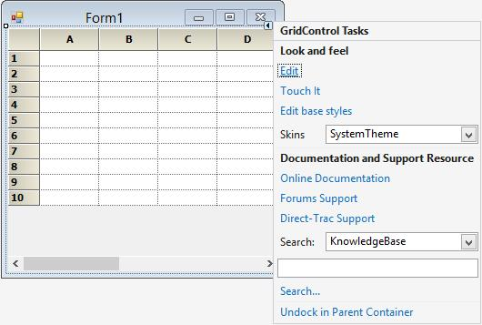

# Getting Started

This section will explain about creating simple GridControl and the overview of its basic functionalities.

## Choosing the Best Grid 

Essential Grid includes a trio of grid controls as well as many other controls that are used in conjunction with these three grids. Essential Grid works similar to Microsoft Excel and allows extremely detailed customization down to the cell level. Multi-level Undo / Redo, Shared Scrollbar support, Data / View separation, floating cells, more than 15 cell types, and unmatched extensibility are the unique features of the Essential Grid.

[GridGroupingControl](http://help.syncfusion.com/windowsforms/gridgrouping/getting-started) - a high performance grouping grid that offers very flexible support for grouping flat data sources as well as hierarchical data sources. This grid supports expressions fields, filters, multi-column sorting, grouping, nested tables/hierarchies, and custom summaries. It can use any [IList](https://msdn.microsoft.com/en-us/library/system.collections.ilist.aspx#) data source including [ADO.NET](https://msdn.microsoft.com/en-us/library/e80y5yhx.aspx#) [DataSet](https://msdn.microsoft.com/en-us/library/system.data.dataset.aspx#)/[DataTables](https://msdn.microsoft.com/en-US/library/system.data.datatable.aspx#) and [IBindingList](https://msdn.microsoft.com/en-us/library/system.componentmodel.ibindinglist.aspx#) objects.

[GridDataBoundGrid](http://help.syncfusion.com/windowsforms/databoundgrid/getting-started#) - a column oriented grid best suited for use with ADO.NET [DataSet](https://msdn.microsoft.com/en-us/library/system.data.dataset.aspx#)/[DataTables](https://msdn.microsoft.com/en-US/library/system.data.datatable.aspx#) data sources. If you are looking to bind with the `ADO.NET` data source without the grouping and hierarchical support then you can use GridDataBoundGrid. GridDataBoundGrid is marked as classic because all the features mentioned in this are available in `GridGroupingControl` with more efficiency and features.

[GridControl](#Getting_Started) - a cell oriented grid that can contain its own data and does not need to be bound to a data source. It has the facility to easily be customized down to the cell level. This grid can also be used in a [virtual manner](http://help.syncfusion.com/windowsforms/grid/virtual-grid# "") such that it can bind to any type of data source.

<table>
<tr>
<th>
Control  </th><th>
Grouping  </th><th>
Sorting  </th><th>
Summary  </th><th>
Filtering  </th><th>
Export  </th></tr>
<tr>
<td>
GGC  </td><td>
Yes  </td><td>
Yes  </td><td>
Yes  </td><td>
Yes  </td><td>
Yes  </td></tr>
<tr>
<td>
GDBG  </td><td>
-  </td><td>
Yes  </td><td>
-  </td><td>
Yes  </td><td>
Yes  </td></tr>
<tr>
<td>
GC  </td><td>
-  </td><td>
*  </td><td>
-  </td><td>
*  </td><td>
Yes  </td></tr>
</table>
N> The ‘*’ is denotes that by default the support is not provided to the Control. It will be added by having some customizations. The [Sorting](https://www.syncfusion.com/kb/454# "") and [Filtering](https://www.syncfusion.com/kb/4409/how-to-add-filter-in-grid-control# "") supports can be added to the `GridControl` using the customizations. 

For binding the different kind of data sources and support for filtering, sorting, grouping for flat and hierarchical data sources make use of the `GridGroupingControl`.

If user wants a cell oriented grid that can contain its own data and does not need to be bound to a data source then `GridControl` is the best choice

## Assembly Deployment

The following list of assemblies needs to be added as reference to use GridControl in any application,

<table>
<tr>
<th>
Required assemblies  </th><th>
Description  </th></tr>
<tr>
<td>
{{'[Syncfusion.Grid.Windows](http://help.syncfusion.com/cr/cref_files/windowsforms/grid/Syncfusion.Grid.Windows.html#"")'| markdownify }}  </td><td>
Syncfusion.Grid.Windows assembly contains classes that handles all UI operations, fundamentals and base classes of GridControl.  </td></tr>
<tr>
<td>
{{'[Syncfusion.Shared.Base](http://help.syncfusion.com/cr/cref_files/windowsforms/grid/Syncfusion.Shared.Base.html#"")'| markdownify }}  </td><td>
Syncfudion.Shared.Base contains style related properties and various editor controls which are used in GridControl.  </td></tr>
</table>
In addition to these assemblies there are also other optional assemblies.

<table>
<tr>
<th>
Optional assemblies  </th><th>
Description  </th></tr>
<tr>
<td>
{{'[Syncfusion.GridHelperClasses.Windows](http://help.syncfusion.com/cr/cref_files/windowsforms/grid/Syncfusion.GridHelperClasses.Windows.html#"")'| markdownify }}  </td><td>
Syncfusion.Grid.HelperClasses.Windows contains all the cell types, export properties, features which are in common with GridControl and GridGroupingControl  </td></tr>
<tr>
<td>
{{'[Syncfusion.GridConverter.Windows](http://help.syncfusion.com/cr/cref_files/windowsforms/grid/Syncfusion.GridConverter.Windows.html#"")'| markdownify }}  </td><td>
Syncfusion.Grid.Converter.Windows contains static extension classes for exporting GridControl to excel in Syncfusion.GridExcelConverter namespace.  </td></tr>
<tr>
<td>
{{'[Syncfusion.Pdf.Base](http://help.syncfusion.com/cr/cref_files/windowsforms/pdf/webtoc.html#"")'| markdownify }}  </td><td>
Syncfusion.Pdf.Base contains fundamental and base classes for creating Pdf.  </td></tr>
<tr>
<td>
{{'[Syncfusion.XlsIO.Base](http://help.syncfusion.com/cr/cref_files/windowsforms/xlsio/Syncfusion.XlsIO.Base.html#"")'| markdownify }}  </td><td>
Syncfusion.XlsIO.Base.WPF contains fundamental and base classes for creating and manipulating excel files.  </td></tr>
</table>

## Configuring a simple GridControl

This section explains about creating Simple GridControl with some basic functionalities of it.

### Adding GridControl via Designer

Grid Control can be added through designer by following the below steps.

1. Create a new **Windows** **Form** **Application**.
2. Drag and Drop GridControl from the toolbox into the designer page. 

   

3. Once you drag drop the GridControl into the designer page, the GridControl will be added successfully into the application with the required libraries. The below mentioned assemblies will be added automatically into the application.

* Syncfusion.Grid.Base.dll
* [Syncfusion.Grid.Windows.dll](http://help.syncfusion.com/cr/cref_files/windowsforms/grid/Syncfusion.Grid.Windows.html#)
* Syncfusion.Shared.Base.dll
* Syncfusion.Shared.Windows.dll

  

### Adding GridControl via Code

GridControl can be added through code-behind by following the below steps.

1.Create a new Windows Form Application.

2.Add the below assemblies into the project file

* Syncfusion.Grid.Windows.dll

* Syncfusion.Shared.Base.dll

   

3.Initialize a `GridControl` by using the below code in code behind.
   


//Initializing a new Grid.
 private Syncfusion.Windows.Forms.Grid.GridControl gridControl1 = new Syncfusion.Windows.Forms.Grid.GridControl();



'Initializing a new Grid.
Private gridControl1 As New Syncfusion.Windows.Forms.Grid.GridControl()



4.Use the below code for adding the initialized GridControl to the application.



//Add required size for the Grid.
this.gridControl1.Size = new System.Drawing.Size(344, 250);

this.Controls.Add(this.gridControl1);


   
'Add required size for the Grid.
Me.gridControl1.Size = New System.Drawing.Size(344, 250)

Me.Controls.Add(Me.gridControl1)



## Populating Data

GridControl is a cell based control and hence to populate the GridControl, [RowCount](http://help.syncfusion.com/cr/cref_files/windowsforms/grid/Syncfusion.Grid.Windows~Syncfusion.Windows.Forms.Grid.IGridVolatileData~RowCount.html#) and [ColCount](http://help.syncfusion.com/cr/cref_files/windowsforms/grid/Syncfusion.Grid.Windows~Syncfusion.Windows.Forms.Grid.IGridVolatileData~ColCount.html#) are necessary. By default the `RowCount` and `ColCount` values are 10. Data can be populated by any one of the following methods.

1.Populate data by looping through cells in GridControl. 



//Specifying row and column count
gridControl1.RowCount = 15;

gridControl1.ColCount = 4;

//Looping through the cells and assigning the values based on row and column index
for (int row = 1; row <= gridControl1.RowCount; row++)

{

for (int col = 1; col <= gridControl1.ColCount; col++)

{

gridControl1.Model[row, col].CellValue = string.Format("{0}/{1}", row, col);

}

}
 

  
'Specifying row and column count
gridControl1.RowCount = 15

gridControl1.ColCount = 4

'Looping through the cells and assigning the values based on row and column index
For row As Integer = 1 To gridControl1.RowCount

For col As Integer = 1 To gridControl1.ColCount

gridControl1.Model(row, col).CellValue = String.Format("{0}/{1}", row, col)

Next col

Next row



2.Populate data by using [PopulateValues](http://help.syncfusion.com/cr/cref_files/windowsforms/grid/Syncfusion.Grid.Windows~Syncfusion.Windows.Forms.Grid.GridModel~PopulateValues.html#) method. This method will allow you to pass in a range of cells of type [GridRangeInfo](http://help.syncfusion.com/cr/cref_files/windowsforms/grid/Syncfusion.Grid.Windows~Syncfusion.Windows.Forms.Grid.GridRangeInfo_members.html#) and data source of type **object**. 



//Specifying row and column count
gridControl1.RowCount = 15;

gridControl1.ColCount = 4;

//DataTable and other related binding types can be populated in GridControl

//Data type of string array has been created here.
string[,] table = new string[this.gridControl1.RowCount, this.gridControl1.ColCount];

for (int row = 1; row <= this.gridControl1.RowCount; ++row)

for (int col = 1; col <= this.gridControl1.ColCount; ++col)

table[row - 1, col - 1] = string.Format("{0}/{1}", row, col);

//Populating values using PopulateValues method
this.gridControl1.PopulateValues(

GridRangeInfo.Cells(1, 1, this.gridControl1.RowCount, this.gridControl1.ColCount),

table);


  
'Specifying row and column count
gridControl1.RowCount = 15

gridControl1.ColCount = 4

'DataTable and other related binding types can be populated in GridControl

'Data type of string array has been created here.
 Dim table(Me.gridControl1.RowCount - 1, Me.gridControl1.ColCount - 1) As String

 For row As Integer = 1 To Me.gridControl1.RowCount

 For col As Integer = 1 To Me.gridControl1.ColCount

 table(row - 1, col - 1) = String.Format("{0}/{1}", row, col)

 Next col

 Next row

'Populating values using PopulateValues method
Me.gridControl1.PopulateValues(GridRangeInfo.Cells(1, 1, Me.gridControl1.RowCount, Me.gridControl1.ColCount), table)
	


3.Populate Data using [QueryCellInfo](http://help.syncfusion.com/cr/cref_files/windowsforms/grid/Syncfusion.Grid.Windows~Syncfusion.Windows.Forms.Grid.GridControl~QueryCellInfo_EV.html#) event of the GridControl. This will load the data virtually ensuring the optimized performance. The data will be loaded in an on-demand basis. This will be discussed briefly in the [Virtual Grid](http://help.syncfusion.com/windowsforms/grid/virtual-grid#) section.
    


//Specifying row and column count
gridControl1.Model.RowCount = 15;

gridControl1.Model.ColCount = 4;

this.gridControl1.QueryCellInfo += gridControl1_QueryCellInfo;

//Assigning values by handling the QueryCellInfo event
void gridControl1_QueryCellInfo(object sender, GridQueryCellInfoEventArgs e)

{

if (e.RowIndex > 0 && e.ColIndex > 0)

{

e.Style.CellValue = string.Format("{0}/{1}", e.RowIndex, e.ColIndex);

}

}



'Specifying row and column count
 gridControl1.Model.RowCount = 15

gridControl1.Model.ColCount = 4

AddHandler Me.gridControl1.QueryCellInfo, AddressOf gridControl1_QueryCellInfo 

'Assigning values by handling the QueryCellInfo event
void gridControl1_QueryCellInfo(Object sender, GridQueryCellInfoEventArgs e)

If e.RowIndex > 0 AndAlso e.ColIndex > 0 Then

e.Style.CellValue = String.Format("{0}/{1}", e.RowIndex, e.ColIndex)

End If
	   


Final Look of the Grid:

## Cell Styles

In GridControl, each cell contains distinct style information and can be displayed independently of other cells. GridControl uses [GridStyleInfo](http://help.syncfusion.com/windowsforms/grid/cell-style-architecture) objects to store state information about the appearance of a grid cell. So attributes like font, back color, cell value and cell types are all reflected in a single `GridStyleInfo` object.

### Modifying Cell Styles through Designer

To edit the cell styles in `Designer mode`, the grid has to be selected in the designer mode and `Edit` option has to be clicked. This will allow the grid to be edited in the designer surface. Style settings also can be changed by using the `PropertyGrid` which is visible in the right side.

In property grid, there are two tabs mainly.

* Grid Properties.
* Selected Range.

`Grid Properties` tab consists of all the properties related to the whole grid. The Appearance and style related settings can be changed for the whole grid.

All the style related properties for the whole grid will be displayed in this tab. If back color of the whole grid needs to be changed, then the [BackColor](http://help.syncfusion.com/cr/cref_files/windowsforms/grid/Syncfusion.Grid.Windows~Syncfusion.Windows.Forms.Grid.GridStyleInfo~BackColor.html#) property listed under the heading `Appearance` can be used and required color can be chosen.

`Selected Range` tab consists of all the properties related to a particular cell or selected range of cells. The style and format related properties can be changed for the desired range of cells.

When you need to change the back color for the selected range of cells, then select the required cells and use the `BackColor` property listed under the heading `StyleCategoryAppearance` and required color can be chosen.

### Modifying Cell Styles through Code

Values can be entered into the GridControl by using the `GridRangeInfo` class and properties of **GridStyleInfo** class. By using the **GridStyleInfo** class, the appearance of the cell can be customized and by using the [ChangeCells](http://help.syncfusion.com/cr/cref_files/windowsforms/grid/Syncfusion.Grid.Windows~Syncfusion.Windows.Forms.Grid.GridControl~ChangeCells.html# "") method, the style can be assigned to the desired range of cells.



//Creates GridStyleInfo object.
GridStyleInfo style = new GridStyleInfo();

//Set properties to it.
style.BackColor = Color.DarkGreen;

style.TextColor = Color.White;

style.Font.Facename = "Verdana";

style.Font.Bold = true;

style.Font.Size = 9f;

//Apply the style to desired range of cells.
this.gridControl1.ChangeCells(GridRangeInfo.Cells(2, 2, 4, 2), style);



'Creates GridStyleInfo object.
Dim style As New GridStyleInfo()

'Set properties to it.
style.BackColor = Color.DarkGreen

style.TextColor = Color.White

style.Font.Facename = "Verdana"

style.Font.Bold = True

style.Font.Size = 9f

'Apply the style to desired range of cells.
Me.gridControl1.ChangeCells(GridRangeInfo.Cells(2, 2, 4, 2), style)



## Selection

GridControl provides two types of selection namely Range selection and Record selection. Range selection also known as cell based selection is used to select a range of cells, rows and columns in grid. Record selection which is also known as record based selection is used to select a single record or a range of records at a time in a grid.

For selecting single row or multiple range of rows in GridControl, set the [ListBoxSelectionMode](http://help.syncfusion.com/cr/cref_files/windowsforms/grid/Syncfusion.Grid.Grouping.Windows~Syncfusion.Windows.Forms.Grid.Grouping.GridTableOptionsStyleInfo~ListBoxSelectionMode.html#) property value as `Single`, `MultiSimple` or `MultiExtended` respectively. By default the value is `None`.



this.gridControl1.ListBoxSelectionMode = SelectionMode.None;



Me.gridControl1.ListBoxSelectionMode = SelectionMode.None



For selecting the range of cells in GridControl, set the [AllowSelection](http://help.syncfusion.com/cr/cref_files/windowsforms/grid/Syncfusion.Grid.Grouping.Windows~Syncfusion.Windows.Forms.Grid.Grouping.GridTableOptionsStyleInfo~AllowSelection.html#) property to the appropriate value from the [GridSelectionFlags](http://help.syncfusion.com/cr/cref_files/windowsforms/grid/Syncfusion.Grid.Windows~Syncfusion.Windows.Forms.Grid.GridSelectionFlags.html#) enumeration. 



this.gridControl1.AllowSelection = Syncfusion.Windows.Forms.Grid.GridSelectionFlags.Any;



Me.gridControl1.AllowSelection = Syncfusion.Windows.Forms.Grid.GridSelectionFlags.Any



Selection operation can be handled by using [SelectionChanging](http://help.syncfusion.com/cr/cref_files/windowsforms/grid/Syncfusion.Grid.Windows~Syncfusion.Windows.Forms.Grid.GridModel~SelectionChanging_EV.html#) and [SelectionChanged](http://help.syncfusion.com/cr/cref_files/windowsforms/grid/Syncfusion.Grid.Windows~Syncfusion.Windows.Forms.Grid.GridModel~SelectionChanged_EV.html#) events.

## Editing

By default the GridControl is in editable state. [Editing](http://help.syncfusion.com/windowsforms/grid/editing) can be enabled or disabled by using the [ReadOnly](http://help.syncfusion.com/cr/cref_files/windowsforms/grid/Syncfusion.Grid.Windows~Syncfusion.Windows.Forms.Grid.GridModel~ReadOnly.html#) property. This property can be applied for whole grid as well as cell by cell basis.



// Disabling Edit mode for the whole Grid.
this.gridControl1.ReadOnly = false.

// Disabling edit mode for a particular cell.
GridStyleInfo style = gridControl1.Model[2, 2];

style.ReadOnly = false;



'Disabling Edit mode for the whole Grid.
Me.gridControl1.ReadOnly = False.

'Disabling edit mode for a particular cell.
Dim style As GridStyleInfo = gridControl1.Model(2, 2)

style.ReadOnly = False



Editing operation can be customized by using [CurrentCellStartEditing](http://help.syncfusion.com/cr/cref_files/windowsforms/grid/Syncfusion.GridHelperClasses.Windows~Syncfusion.GridHelperClasses.GridCardView~CurrentCellStartEditing_EV.html#) and [CurrentCellEditingComplete](http://help.syncfusion.com/cr/cref_files/windowsforms/grid/Syncfusion.Grid.Windows~Syncfusion.Windows.Forms.Grid.GridControlBase~CurrentCellEditingComplete_EV.html#) events. 

