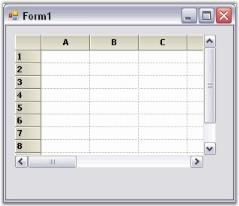

# Creating Grid Control

This section will provide step-by-step procedure to create Grid control through designer and through programmatical approach in a .NET application.

## Through Designer

To make the task of designing Grid control easier on cell level, a new Designer Editor has been added. With the editor, grid can be modified and saved (and loaded) to xml formatted files or Soap formatted templates. There is also no longer Toggle Interactive Mode design verb that was present in versions prior to 4.1.

To add a Grid Control to the Application

Following steps illustrate how to add Grid control to your application.

1. Drag the GridControl component from the toolbox onto the form.

To edit cell level properties of the grid (and also general Grid control properties), right-click anywhere in the Grid control and select Edit.

This opens the GridControl Designer window. By using GridControl Designer, cell contents or styles, and general grid properties can be modified.

Single cells can be modified along with a selection of ranges. To do this, select a range of cells, and switch to the Selected Range tab to view the property grid for the selection.

GridControl Designer also lets you to save/load xml formatted files, and Soap templates.

2. When the changes are complete, simply exit the designer. If changes have been made, you will be prompted to save the changes to the Grid control in the designer.
3. Click OK to apply settings to the grid control.

See Also Through Code

## Through Code

The following code examples illustrate how to create a Grid control through code.



//Creates the Essential Grid.

private Syncfusion.Windows.Forms.Grid.GridControl gridControl1;

....

this.gridControl1 = new Syncfusion.Windows.Forms.Grid.GridControl();

//Sets the number of rows and columns.

this.gridControl1.ColCount = 10;

this.gridControl1.RowCount = 100;

//Positions it on the form.

this.gridControl1.Location = new System.Drawing.Point(20, 20);

this.gridControl1.Size = new System.Drawing.Size(344, 200);

//Adds it to the form's controls.

this.Controls.Add(this.gridControl1);





'Creates the Essential Grid.

Private WithEvents gridControl1 As GridControl

        ....

Me.gridControl1 = New Syncfusion.Windows.Forms.Grid.GridControl()

'Sets the number of rows and columns.

 Me.gridControl1.ColCount = 10

 Me.gridControl1.RowCount = 100

'Positions it on the form.

 Me.gridControl1.Location = New System.Drawing.Point(20, 15)

 Me.gridControl1.Size = New System.Drawing.Size(344, 150)

'Adds it to the form's controls.

Me.Controls.Add(Me.gridControl1)


See Also Through Designer

