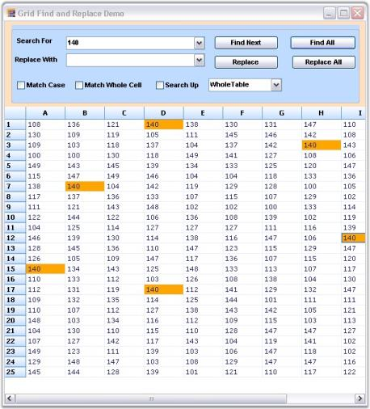

# Find and Replace

Find and Replace feature enables you to search and replace the required element present in Grid/Worksheet. You can implement the fastest Find and Replace functionality with Grid controls by using GridFindReplaceDialogSink and GridFindReplaceEventArgs classes. GridFindReplaceDialogSink class provides methods that are necessary to perform a Find and Replace operation. GridFindReplaceEventArgs class provides information about Find and Replace dialog box.

The value entered in the Search For field is highlighted in the worksheet after search action is performed. You can switch over to each highlighted text by clicking Find Next button. This functionality is available only when there is more than one search result.

##Search and Replace Options

The search and replace actions:

* Can be performed independently or simultaneously.
* Can be done for individual search or for the entire worksheet by using the Find Next/Replace buttons.
* Can be done for all the search results by clicking Find All/Replace All buttons.

##Search Options

The search options are as follows:

* Match Case-Matches case while performing search.
* Match Whole Cell-Matches the search text with the entire text in a grid cell.
* Search Up-Specifies if the search can be performed bottom-up.
* Column Only-Searches only the current column.
* Selection Only-Searches only the current selection.
* Whole Table-Searches the whole table.

The Find and Replace feature can be enabled for Essential Grid by using the following code:



GridFindTextOptions options = GridFindTextOptions.WholeTable | GridFindTextOptions.SearchUp;

object locInfo = GridRangeInfo.Table();

GridFindReplaceEventArgs frEvents = new GridFindReplaceEventArgs(cmbSearch.Text, "", options, locInfo);

GridFindReplaceDialogSink frDialog.Find(frEvents);




Private options As GridFindTextOptions = GridFindTextOptions.WholeTable Or GridFindTextOptions.SearchUp

Private locInfo As Object = GridRangeInfo.Table()

Private frEvents As New GridFindReplaceEventArgs(cmbSearch.Text, "", options, locInfo)

GridFindReplaceDialogSink(frDialog.Find(frEvents))


Highlighting Search Text

Grid control supports highlighting all or part of the search text in a cell. GridHighlightSearchText class is used to define search text for highlighting. This class exposes WireGrid method, which is used for passing Grid control. With HighLightText and HighlightColor properties, you can specify search text to be highlighted and the color for highlighting the search text. By default, the highlight color is _yellow_. The highlight color for the search text is optional.



//Creates an object for the class “GridHighlightSearchText”.

GridHighlightSearchText highlighttext = new GridHighlightSearchText();

//Wires the grid to the object.

highlighttext.WireGrid(this.gridControl1);

//Assigns the text that needs to be highlighted.

highlighttext.HighlightText = cmbSearch.Text;

//Assigns the color (optional).

highlighttext.HighlightColor = Color.Yellow;





'Creates an object for the class “GridHighlightSearchText”.

Private highlighttext As New GridHighlightSearchText()

'Wires the grid to the object.

highlighttext.WireGrid(Me.gridControl1)

'Assigns the text that needs to be highlighted.

highlighttext.HighlightText = cmbSearch.Text

'Assigns the color (optional).

highlighttext.HighlightColor = Color.Yellow



To view a sample on Highlighting Search Text, see 

    <Installed Location>\Syncfusion\EssentialStudio\<Version>\Windows\Grid.Windows\Samples\Editing \Find-Replace Demo

