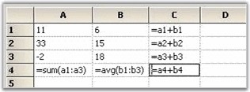
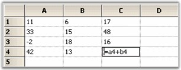

# Formula Cell

FormulaCell cell type allows you to add algebraic formulas to a cell that depends on other cells. The cell value should be a well-formed formula starting with an '=' and the CellType property set to _FormulaCell_. If a Formula Cell does not begin with an '=', the cell is treated as a text box cell. For details, see Formula Support.

The following code example illustrates how to set the cell type to FormulaCell.



//Sets Cell Type as Formula Cell.

gridControl1[rowIndex, colIndex].CellType = "FormulaCell";

//Assigns a Formula.

gridControl1[rowIndex, colIndex].CellValue = "= (A1+A2) / 2";





'Sets Cell Type as Formula Cell.

gridControl1(rowIndex, colIndex).CellType = "FormulaCell"

'Assigns a Formula.

gridControl1(rowIndex, colIndex).CellValue = "= (A1+A2) / 2"



 

