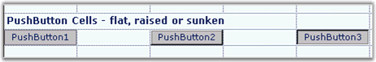

## Push Button

To display a Push Button in a grid cell, use the PushButton cell type. To catch and handle a user, click a button, and you can add GridControl.CellButtonClicked event handler. The event arguments passed into your handler will include the row and column of the click. GridStyleInfo properties that control the behavior of a Push Button cell are listed in the following table.

Table 21: GridStyleInfo properties

<table>
<tr>
<th>
PROPERTIES</th><th>
DESCRIPTION</th></tr>
<tr>
<td>
CellAppearance</td><td>
Specifies whether the button is raised, sunken, or flat.</td></tr>
<tr>
<td>
CellType</td><td>
Sets to "PushButton" for push button control.</td></tr>
</table>

The following code example illustrates how to set the cell type to PushButton.



gridControl1[rowIndex,colIndex].Description = "PushButton1";

gridControl1[rowIndex,colIndex].CellType = "PushButton";

gridControl1[rowIndex,colIndex ].CellAppearance = GridCellAppearance.Raised;

//To catch a click, hooks up a CellButtonClicked handler.

gridControl1.CellButtonClicked += new GridCellButtonClickedEventHandler(gridControl1_CellButtonClicked);

//Adds a handler.

private void gridControl1_CellButtonClicked(object sender, GridCellButtonClickedEventArgs e)

{

MessageBox.Show("You clicked row"  + e.RowIndex.ToString() + "col"  + e.ColIndex.ToString());

}





gridControl1(rowIndex, colIndex).Description = "PushButton1"

gridControl1(rowIndex, colIndex).CellType = "PushButton"

gridControl1(rowIndex, colIndex).CellAppearance = GridCellAppearance.Raised

'To catch a click, hooks up a CellButtonClicked handler.

AddHandler gridControl1.CellButtonClicked, AddressOf gridControl1_CellButtonClicked

'Adds a handler.

Private Sub gridControl1_CellButtonClicked(ByVal sender As Object, ByVal e As GridCellButtonClickedEventArgs)

MessageBox.Show("You clicked row " + e.RowIndex.ToString() + "  col " + e.ColIndex.ToString())

End Sub


 
