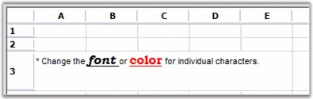

# Rich Text

Rich Text control will allow you to display and edit Rich Text in grid cells. The control enables you to optionally drop down an editable Rich Text window by which you can modify the Rich Text in the cell. The following code example illustrates how to set the cell type to RichText.



//Creates a Rich Text Format.

string rtf = 

@"{" +

@"\rtf1\ansi\deff0\deftab720" +

@"{" +

@"\fonttbl" +

@"{\f0\fswiss MS Sans Serif;}" +

@"{\f1\froman\fcharset2 Symbol;}" +

@"{\f2\fswiss\fprq2 System;}" +

@"{\f3\fswiss\fprq2 Arial;}" +

@"{\f4\froman Bookman Old Style;}" +

@"}" +

@"{\colortbl\red0\green0\blue0;\red255\green0\blue0;}" +

@"\deflang1033\cfpat1\pard\plain\f3\fs16\cf0 * Change the " +

@"\plain\f4\fs24\cf0\b\i\ul font \plain\f3\fs16\cf0 or " +

@"\plain\f4\fs24\cf1\b\ul color\plain\f3\fs16\cf0  " +

@"for individual characters.\par " +

" }"

;

//Sets up a Rich Text Cell.

gridControl1[rowIndex, 1].CellType = "RichText";

gridControl1[rowIndex, 1].Text = rtf;

gridControl1.RowHeights[rowIndex] = 50;

gridControl1.CoveredRanges.Add(GridRangeInfo.Cells(rowIndex, 1, rowIndex, 5));





'Creates a Rich Text Format.

Dim rtf As String = "{" + _

"\rtf1\ansi\deff0\deftab720" + _

"{" + _

"\fonttbl" + _

"{\f0\fswiss MS Sans Serif;}" + _

"{\f1\froman\fcharset2 Symbol;}" + _

"{\f2\fswiss\fprq2 System;}" + _

"{\f3\fswiss\fprq2 Arial;}" + _

"{\f4\froman Bookman Old Style;}" + _

"}" + _

"{\colortbl\red0\green0\blue0;\red255\green0\blue0;}" + _

"\deflang1033\cfpat1\pard\plain\f3\fs16\cf0 * Change the " + _

"\plain\f4\fs24\cf0\b\i\ul font \plain\f3\fs16\cf0 or " + _

"\plain\f4\fs24\cf1\b\ul color\plain\f3\fs16\cf0  " + _

"for individual characters.\par " + _

" }"

'Sets up a Rich Text Cell. 

gridControl1(rowIndex, 1).CellType = "RichText"

gridControl1(rowIndex, 1).Text = rtf

gridControl1.RowHeights(rowIndex) = 50

gridControl1.CoveredRanges.Add(GridRangeInfo.Cells(rowIndex, 1, rowIndex, 5))



 

