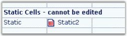

# Static

Static cell type will display text that cannot be edited. You can select it to make it the current cell, but the cell cannot be activated for editing. Static cells can be deleted by the user, if the static cells are part of the selection when the DELETE key is pressed (To prevent this deletion behavior, set static cells to ReadOnly). Static cells may also include an image in addition to the text. The following code example illustrates how to set the cell type to Static.



//Uses a static cell.

gridControl1[rowIndex,colIndex].CellType = "Static";

gridControl1[rowIndex,colIndex].Text = "Static";

//Uses a static cell with an image.

//Creates an image list and adds some images during the initialization.

ImageList imageList1 = new ImageList();

imageList1.Images.Add(SystemIcons.Warning.ToBitmap());

imageList1.Images.Add(SystemIcons.Application.ToBitmap());

imageList1.Images.Add(SystemIcons.Asterisk.ToBitmap());

imageList1.Images.Add(SystemIcons.Error.ToBitmap());

//Sets the imagelist into the TableStyle.

gridControl1.TableStyle.ImageList = imageList1;

//To use an image, sets the ImageIndex in the cell GridInfoStyle.

gridControl1[rowIndex,colIndex + 1].CellType = "Static";

gridControl1[rowIndex,colIndex + 1].Text = "Static2";

//Shows the third icon in the imagelist, which is inherited from the TableStyle.

gridControl1[rowIndex,colIndex + 1].ImageIndex = 2; 





'Uses a static cell.

gridControl1(rowIndex, colIndex).CellType = "Static"

gridControl1(rowIndex, colIndex).Text = "Static"

'Uses a static cell with an image.

'Creates an image list and adds some images during the initialization.

Dim imageList1 As New ImageList()

imageList1.Images.Add(SystemIcons.Warning.ToBitmap())

imageList1.Images.Add(SystemIcons.Application.ToBitmap())

imageList1.Images.Add(SystemIcons.Asterisk.ToBitmap())

imageList1.Images.Add(SystemIcons.Error.ToBitmap())

'Sets the imagelist into the TableStyle.

gridControl1.TableStyle.ImageList = imageList1

'To use an image, sets the ImageIndex in the cell GridInfoStyle.

gridControl1(rowIndex, colIndex + 1).CellType = "Static"

gridControl1(rowIndex, colIndex + 1).Text = "Static2"

'Shows the third icon in the imagelist which, is inherited from TableStyle.

gridControl1(rowIndex, colIndex + 1).ImageIndex = 2



 

