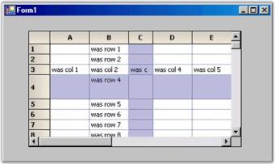

# Working with Rows and Columns

Grid control has properties that allow users to manipulate rows and columns programmatically. The following properties will be discussed in this section.

* GridControl.Cols, GridControl.Rows - Allows you to hide rows and columns, to freeze them to prevent scrolling and to control the number of headers.
* GridControl.ColWidths, GridControl.RowHeights - Allows you to set the row heights and column widths programmatically.
* GridListControl.ColStyles, GridListControl.RowStyles - Allows you to set the row or column styles.

For a DataBound Grid, you can access the first two items through the GridDataBoundGrid.Model property. The DataBound Grid does not use RowStyles or ColStyles. It uses the GridBoundColumn.StyleInfo object to set column styles with row styles not being directly supported. See the section on Grid Data Bound Grid for more information on how to set its styles.

## Hiding Rows and Columns

GridControl.Cols.Hidden collection will allow you to specify whether a column is hidden or not. You can index these properties directly as shown in the code below or you can use Hidden.SetRange method to provide settings for a range of rows or columns.



//Hides column 2.

this.gridControl1.Cols.Hidden[2] = true;

//Hides row 3.

this.gridControl1.Rows.Hidden[3] = true; 





'Hides column 2.

Me.GridControl1.Cols.Hidden(2) = True  

'Hides row 3. 

Me.GridControl1.Rows.Hidden(3) = True  


You can also use this property to hide the default row headers and column headers. These headers are just column zero and row zero respectively. To hide them you can use code like the one given below.



//Hides default row headers.

this.gridControl1.Cols.Hidden[0] = true; 

//Hides default column headers.

this.gridControl1.Rows.Hidden[0] = true; 





'Hides default row headers.       

Me.GridControl1.Cols.Hidden(0) = True  

'Hides default column headers. 

Me.GridControl1.Rows.Hidden(0) = True  


## Header Rows and Columns

As we have seen in the previous section, it is possible to hide both the row and column headers. We can also have more than one header row and/or more than one header column. The properties that control the number of header rows and columns is GridControl.Rows.HeaderCount and GridControl.Cols.HeaderCount. This HeaderCount property is the index of the last header row or column. So, to have a total of three column header rows, set Rows.HeaderCount to two.



//Total of three column header rows.        

this.gridControl1.Rows.HeaderCount = 2;





'Total of three column header rows.        

Me.GridControl1.Cols.Rows.HeaderCount = 2  


## Frozen Rows and Columns

A  frozen row is one that cannot be scrolled. For example, the default column header (row 0) is a frozen row. Frozen rows will always be displayed at the top of the grid. You can set the number of frozen rows using GridControl.Rows.FrozenCount property. In our previous code sample, we used the Rows.HeaderCount property to set up two additional column header rows. To cause the new headers to be fixed and not to scroll, you need to set the Rows.FrozenCount to two. Note that you can freeze non-header type rows as well, but in the following code samples we are freezing headers only.



//Has 3 non-scrollable rows at the top.        

this.gridControl1.Rows.FrozenCount = 2;  

//Total of three column header rows.        

this.gridControl1.Rows.HeaderCount = 2;  





'Has 3 non-scrollable rows at the top.        

Me.GridControl1.Rows.FrozenCount = 2    

'Total of three column header rows.        

Me.GridControl1.Rows.HeaderCount = 2   


As we have said, frozen rows will always appear at the top of the grid and frozen columns will always appear to the left of the grid. It is possible to freeze an interior range of rows or columns by using GridControl.Rows.FreezeRange or GridControl.Cols.FreezeRange method. But, the FreezeRange method will move the requested rows or columns to the top or left and then it will set FrozenCount to actually freeze the rows or columns. 



//Moves rows 3 and 4 to the top of the grid and freezes them.        

this.gridControl1.Rows.FreezeRange(3,4);





'Moves rows 3 and 4 to the top of the grid and freezes them.        

Me.GridControl1.Rows.FreezeRange(3,4)  


## Moving Rows and Columns

The methods GridControl.Rows.MoveRange and GridControl.Cols.MoveRange are used to move rows and columns in a grid. The MoveRange method takes three parameters that are used to determine the start position, number of items to move and the target position. 



//Starts at row 7, moves 2 rows to row 4.        

this.gridControl1.Rows.MoveRange(7, 2, 4); 




'Starts at row 7, moves 2 rows to row 4.      

Me.GridControl1.Rows.MoveRange(7, 2, 4)


## Setting Column Widths and Row Heights

GridControl.ColWidths and GridControl.RowHeights collections will allow you to programmatically set the width of a column and/or the height of a row.

> Note: Before you can use GridDataBoundGrid.Model.ColWidths to explicitly set column widths in Data Bound Grid, you must first set GridDataBoundGrid.AllowResizeToFit to false. Otherwise, the grid will try to size columns based on the width of the header text.



//Sets the width of column 3.       

this.gridControl1.ColWidths[3] = 40; 

//Sets the height of row 4.        

this.gridControl1.RowHeights[4] = 40; 





'Sets the width of column 3.        

Me.GridControl1.ColWidths(3) = 40   

'Sets the height of row 4.

Me.GridControl1.RowHeights(4) = 40 


## Setting Column Styles and Row Styles

GridControl.ColStyles and GridControl.RowStyles collections will allow you to programmatically set the default row or column style. This code will set backcolor and text color as well as set the font to bold for column two and row three.

> Note: RowStyles and ColStyles are not supported in DataBound Grid. For that grid, you will need to use  GridBoundColumn.StyleInfo property to set column styles and you will need to use grid.Model.QueryCellInfo event to set row styles.



//Sets Back Color, Text Color and Font Style of Column 2.

this.gridControl1.ColStyles[2].BackColor = Color.Red;

this.gridControl1.ColStyles[2].TextColor = Color.White;

this.gridControl1.ColStyles[2].Font.Bold = true;

//Sets Back Color, Text Color and Font Style of Row 3.

this.gridControl1.RowStyles[3].BackColor = Color.Red;

this.gridControl1.RowStyles[3].TextColor = Color.White;

this.gridControl1.RowStyles[3].Font.Bold = true;




'Sets Back Color, Text Color and Font Style of Column 2.

Me.GridControl1.ColStyles(2).BackColor = Color.Red

Me.GridControl1.ColStyles(2).TextColor = Color.White

Me.GridControl1.ColStyles(2).Font.Bold = True

'Sets Back Color, Text Color and Font Style of Row 3.

Me.GridControl1.RowStyles(3).BackColor = Color.Red

Me.GridControl1.RowStyles(3).TextColor = Color.White

Me.GridControl1.RowStyles(3).Font.Bold = True



## Controlling the Resize Behavior

Essential Grid supports resizing behavior of columns and rows in Grid control. This is achieved by using ResizeColsBehavior and ResizeRowsBehavior properties.

GridResizeCellsBehavior enumeration provides the following options to control resizing behavior. 

* AllowDragOutside - Allows the user to drag the cell boundary outside grid client area and resize specific row or column.

> Note: Grid client area is the area where cells along with row and column headers are visible to the client. Dragging outside the client area means dragging beyond the boundary of the grid.

* InsideGrid - Allows the user to resize rows or columns from anywhere inside the grid by dragging the divider between any two row or column headers.
* None - Turns off the mouse control over resizing rows and columns.
* OutlineBounds - Highlights the original cell boundaries of resizing row or column.
* OutlineHeaders - Highlights the header boundaries when the user resizes the associated row or column.
* ResizeAll - Resizes all rows or columns automatically when the user resizes one row or column with the mouse. All rows and columns are resized to the same size as the current row or column being resized.
* ResizeSingle - Resizes the row or column being resized by the user using the mouse.

> Note: You can also control the mouse controller's behavior at run time while the user is performing the action by subscribing to ResizingColumns and ResizingRows events.

The following code illustrates how to use this method in Grid control:

 

this.gridControl1.ResizeColsBehavior = GridResizeCellsBehavior.InsideGrid;

this.gridControl1.ResizeRowsBehavior = GridResizeCellsBehavior.InsideGrid;





Me.gridControl1.ResizeColsBehavior = GridResizeCellsBehavior.InsideGrid

Me.gridControl1.ResizeRowsBehavior = GridResizeCellsBehavior.InsideGrid


## Resize To Fit

Essential Grid supports this feature to enable resizing columns and rows based on the content of cells. ResizeToFit method is used for this purpose. The following code illustrates how to use this method in Grid control:

 

//Resizes the column widths.

this.gridControl1.ColWidths.ResizeToFit(GridRangeInfo.Cols(1, 5));

//Resizes the row heights.

this.gridControl1.RowHeights.ResizeToFit(GridRangeInfo.Rows(1, 5));





'Resizes the column widths.

Me.gridControl1.ColWidths.ResizeToFit(GridRangeInfo.Cols(1, 5))

'Resizes the row heights.

Me.gridControl1.RowHeights.ResizeToFit(GridRangeInfo.Rows(1, 5))


> Note: The parameter passed to ResizeToFit method is either GridRangeInfo.Cols or GridInfo.Rows method, which in turn has two parameters:

1. The first parameter corresponds to the starting row or column that is to be resized to fit. 
2. The second parameter corresponds to the ending row or column upto which the resize has to be done.

The following image shows the application of resize to fit operation to the first five rows of the grid.

   

> Note: The preceding image is the output of a demo that is available in the samples in the following installed location.

         <Install Location>\Syncfusion\EssentialStudio\[Version Number]\Windows\Grid.Windows\Samples\Grid Layout\Resize To Fit Demo

		 
The two buttons, Set RowHeight and Set Column Width seen in the image above are used to set irregular height and width to the specified rows and columns of the grid respectively. The ColWidths – Resize To Fit and RowHeights – Resize To Fit are enabled only when the rows or columns are set to irregular height and width by using the Set RowHeight and Set Column Width buttons respectively.

## ResizeToFitOptimized

Essential Grid supports ResizeToFitOptimized feature to enable resizing columns and rows based on the contents of grid cells. The existing ResizeToFit method does not resize the columns or rows to make the entire cell value visible in the control. ResizeToFitOptimized method is used for this purpose.

Use Case Scenarios

This feature enables you to display the entire cell with resized columns and rows even if the grid cells has special characters such as tab, newline, etc.

Methods Table

Table 71: Method Table

<table>
<tr>
<th>
METHOD </th><th>
DESCRIPTION </th><th>
PARAMETERS </th><th>
RETURN TYPE </th></tr>
<tr>
<td>
ResizeToFitOptimized</td><td>
Resizes a range of rows or columns to optimally fit contents of the specified range of cells.</td><td>
Overloads: 1. ResizeToFitOptimized(GridRangeInfo range) 2. ResizeToFitOptimized(GridRangeInfo range, GridResizeToFitOptions option)3. ResizeToFitOptimized(GridRangeInfo range, GridTextOptions textOption)</td><td>
 Void </td></tr>
</table>

##Applying ResizeToFitOptimized to an Application

The following code example illustrates how to use this ResizeToFitOptimized method in Grid control.



//Resizes the column width.

this.gridControl1.ColWidths.ResizeToFitOptimized(GridRangeInfo.Col(1));

//Resizes the row height.

this.gridControl1.RowHeights.ResizeToFitOptimized(GridRangeInfo.Rows(1,8));




'Resizes the column width.

Me.gridControl1.ColWidths.ResizeToFitOptimized(GridRangeInfo.Col(1)); 

'Resizes the row height.

Me.gridControl1.RowHeights.ResizeToFitOptimized(GridRangeInfo.Rows(1,8));


 The following image shows the application of ResizeToFitOptimized to the first column of the grid.

## ResizeToFit Behavior in AutoSize

Essential Grid supports resizing columns and rows based on the content of cells. This is achieved by using ResizeToFit() method. 

AutoSize enables the cell height to be automatically increased when the edited text does not fit into the cell and when WrapText is set to true. If WrapText is set to false, AutoSize will affect the column width, but it does not have the functionality of resizing the rows or columns after text has been entered as the ResizeToFit() method does. AutoSize also supports resizing rows and columns based on their cell content during the binding of the data source to the grid. Content can be entered in the grid and then the AutoSize property can be applied. This will resize the altered rows and columns.



this.gridGroupingControl1.Appearance.AnyCell.AutoSize = true;





 me.gridGroupingControl1.Appearance.AnyCell.AutoSize = true;


AutoSize can also be applied to different cell types to resize the rows and columns to fit the contents of the cell, and the row height and column width will be resized when editing cell contents.

## Autosizing Custom Cell

Essential Grid supports automatic resizing of cells in the Grid control when custom controls are placed inside the cells.

The Grid lets you add custom controls to cells by creating CellModel class and CellRenderer class. These custom controls can have different sizes. When these controls are placed in the Grid, the corresponding cell is automatically resized to fit the controls. This is achieved by overriding the OnQueryPrefferedClientSize method in the model class. The proper size of the control can be returned by using this method. ResizeToFit method will then resize the cell to the size returned by the OnQueryPrefferedClientSize method. 

The following code example illustrates how to implement this feature in the Grid control:

 

// Overrides this method to calculate proper control size and returns the same.

protected override Size OnQueryPrefferedClientSize(Graphics g, int rowIndex, int colIndex, GridStyleInfo style, GridQueryBounds queryBounds)

{

if(Grid[rowIndex,colIndex].Tag == null)

throw new Exception("No User Control is tagged");

else

{

//Gets the type of the control from Style.Tag.

Control userControl = Grid[rowIndex,colIndex].Tag as Control;

//Calculates the size of the control.

Size size = userControl.Size;

size.Height += 2;

//Returns the size.

return size;

}

}





'Overrides this method to calculate proper control size and return the same.

Protected Overrides Function OnQueryPrefferedClientSize(ByVal g As Graphics, ByVal rowIndex As Integer, ByVal colIndex As Integer, ByVal style As GridStyleInfo, ByVal queryBounds As GridQueryBounds) As Size

If Grid(rowIndex, colIndex).Tag Is Nothing Then

Throw New Exception("No User Control is tagged")

Else

'Gets the type of the control from Style.Tag.

Dim userControl As Control = TryCast(Grid(rowIndex, colIndex).Tag, Control)

'Calculates the size of the control.

Dim size As Size = userControl.Size

size.Height += 2

'Retur the size.

Return size

End If

End Function



The following image shows how the cell resizes itself automatically to the size of the control, when a custom control is added to it.

## Enter Key Behavior

This feature enables you to apply Enter key behavior for the following Windows Forms Grid controls: Grid, GridGrouping, and GridDataBoundGrid. By default, Enter key behavior is set to move to the cell to the right. By using EnterKeyBehavior property, you can set how the cell selection navigates when Enter is pressed.  

EnterKeyBehavior property provides support for the following navigation options to move the cell selection when Enter is pressed. 

* Bottom
* BottomRight
* Down
* Left
* MostLeft
* MostRight
* None
* PageDown
* PageUp
* Right
* Top
* TopLeft
* Up

Use Case Scenarios

You can use this property to change navigation direction of Enter key behavior in the grid. The EnterKeyBehavior property works based on WrapCellBehavior. Enter key behavior navigates to the first column in the next row when at the end of a row, moving to the right.

Table 72: Properties

<table>
<tr>
<th>
PROPERTY</th><th>
DESCRIPTION</th><th>
TYPE</th><th>
DATA TYPE</th></tr>
<tr>
<td>
EnterKeyBehavior</td><td>
Navigate to other cells when Enter is pressed.</td><td>
GridDirectionType</td><td>
Enum</td></tr>
<tr>
<td>
WrapCellBehavior</td><td>
Go to first column in next row or last column in previous row when at end or beginning of a row and moving based on Enter key behavior.</td><td>
GridWrapCellBehavior</td><td>
Enum</td></tr>
</table>

####Example

The following code illustrates how to set EnterKeyBehavior property for Syncfusion Windows Forms Grid controls.

For the Grid Control



this.gridControl1.EnterKeyBehavior = GridDirectionType.Top;

this.gridControl1.Model.Options.WrapCellBehavior = GridWrapCellBehavior.WrapGrid;




Me.gridControl1.EnterKeyBehavior = GridDirectionType.Top

        Me.gridControl1.Model.Options.WrapCellBehavior=GridWrapCellBehavior.WrapGrid;


For GridGroupingControl



this.gridGroupingControl1.TableModel.Options.EnterKeyBehavior = GridDirectionType.Top;

                    this.gridGroupingControl1.TableModel.Options.WrapCellBehavior = GridWrapCellBehavior.WrapGrid;





Me. gridGroupingControl1.TableModel.Options.EnterKeyBehavior = GridDirectionType.Top

Me.gridGroupingControl1.TableModel.Options.WrapCellBehavior = GridWrapCellBehavior.WrapGrid



For GridDataBoundGrid



this.gridDataBoundGrid1.Model.Options.EnterKeyBehavior = GridDirectionType.Top;

this.gridDataBoundGrid1.Model.Options.WrapCellBehavior = GridWrapCellBehavior.WrapGrid;





Me. gridDataBoundGrid1.Model.Options.EnterKeyBehavior = GridDirectionType.Top

Me. gridDataBoundGrid1.Model.Options.WrapCellBehavior = GridWrapCellBehavior.WrapGrid


###Sample Link

Samples for this feature are available in the following location:

         <Install Location>\Syncfusion\EssentialStudio\[Version Number]\Windows\Grid.Grouping.Windows\Samples\Styling and Formatting\Cell Formatting Demo

