## Grid Controls

### Grid Control

Grid control is a general purpose GridControl class. You can use it by allowing it to hold its own data or virtually binding it to an external data source.

{:.image }

#### Creating Grid Control

This section will provide step-by-step procedure to create Grid control through designer and through programmatical approach in a .NET application.

##### Through Designer

To make the task of designing Grid control easier on cell level, a new Designer Editor has been added. With the editor, grid can be modified and saved (and loaded) to xml formatted files or Soap formatted templates. There is also no longer Toggle Interactive Mode design verb that was present in versions prior to 4.1.

To add a Grid Control to the Application

Following steps illustrate how to add Grid control to your application.

1. Drag the GridControl component from the toolbox onto the form.

{:.image }

To edit cell level properties of the grid (and also general Grid control properties), right-click anywhere in the Grid control and select Edit.

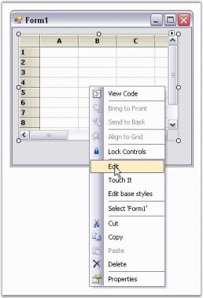
{:.image }

This opens the GridControl Designer window. By using GridControl Designer, cell contents or styles, and general grid properties can be modified.

 
{:.image }

Single cells can be modified along with a selection of ranges. To do this, select a range of cells, and switch to the Selected Range tab to view the property grid for the selection.

 
{:.image }

GridControl Designer also lets you to save/load xml formatted files, and Soap templates.

2. When the changes are complete, simply exit the designer. If changes have been made, you will be prompted to save the changes to the Grid control in the designer.
3. Click OK to apply settings to the grid control.

See Also Through Code

##### Through Code

The following code examples illustrate how to create a Grid control through code.

[C#]

//Creates the Essential Grid.

private Syncfusion.Windows.Forms.Grid.GridControl gridControl1;

....

this.gridControl1 = new Syncfusion.Windows.Forms.Grid.GridControl();

//Sets the number of rows and columns.

this.gridControl1.ColCount = 10;

this.gridControl1.RowCount = 100;

//Positions it on the form.

this.gridControl1.Location = new System.Drawing.Point(20, 20);

this.gridControl1.Size = new System.Drawing.Size(344, 200);

//Adds it to the form's controls.

this.Controls.Add(this.gridControl1);

[VB.NET]

'Creates the Essential Grid.

Private WithEvents gridControl1 As GridControl

        ....

Me.gridControl1 = New Syncfusion.Windows.Forms.Grid.GridControl()

'Sets the number of rows and columns.

 Me.gridControl1.ColCount = 10

 Me.gridControl1.RowCount = 100

'Positions it on the form.

 Me.gridControl1.Location = New System.Drawing.Point(20, 15)

 Me.gridControl1.Size = New System.Drawing.Size(344, 150)

'Adds it to the form's controls.

Me.Controls.Add(Me.gridControl1)

See Also Through Designer

#### Elaborate Structure of the Control

This section lists the important elements that are used by the grouping grid to organize data. These grid elements can have specific appearance and behavior. The following screen shot points out the various grid elements.

{:.image }

Elements of Grid Control

* Caption Section-This is the first section within a group that provides caption bar above column headers. If a caption should be displayed at the beginning of each group, then Caption Sections are created when the grouping for a table is initialized.
* Column Header Section-This section will appear at the top of a table or a group, below the caption section. Column Header Section is a place holder where grouping grid displays column headers.
* Filter Bar Row-It displays the filter bar for table data. You can enable the record filters for specific columns.
* Add New Record Section-This is the section within a group that is shown above the table records and/or below the records for each group, and implements logic to add new records.
* Preview Section-A Preview Section can be added under each group and record. It is a suitable place to display custom data for a given record or group.
* Summary Section-This section is a collection of rows used to display brief information about groups or specific columns of the table.
* Group Drop Area-It lets the user to group grid data. Data can be grouped by simply dragging column headers into the group drop area.

#### Feature Summary

Grid control is a powerful control that is implemented by using a unique Styles Architecture. This grid control is similar to Microsoft Excel, and allows detailed customization of control down to the cell level. Multi-level Undo/Redo, shared scroll bar support, data/view separation, floating cells, more than 18 cell types and unmatched extensibility are unique features of the Grid control.

{:.image }

##### Cell Attributes

Cell attributes are properties that affect the appearance and behavior of grid cells. They include features like font used in the cell or the color of the cell. Following table lists the cell attributes.

_Table 10: Cell attributes_

<table>
<tr>
<td>
FEATURE</td><td>
DESCRIPTION</td></tr>
<tr>
<td>
Cell TextAlignment</td><td>
Controls horizontal and vertical alignment.</td></tr>
<tr>
<td>
AutoSize</td><td>
Automatically increases cell height.</td></tr>
<tr>
<td>
PictureDisplay</td><td>
Displays picture within a cell.</td></tr>
<tr>
<td>
CustomizeBorders</td><td>
Changes the appearance of grid borders.</td></tr>
<tr>
<td>
Cell Appearances</td><td>
Controls cell edges (raised, flat, sunken).</td></tr>
<tr>
<td>
Cell TipText</td><td>
Adds ToolTips to cells and scroll bars.</td></tr>
<tr>
<td>
Cell AllowEnterMode</td><td>
Allows enter mode during edit.</td></tr>
<tr>
<td>
Cell TextColor</td><td>
Changes color of the text on a cell-by-cell basis.</td></tr>
<tr>
<td>
Cell ImageList</td><td>
Enables each cell to maintain a list of images.</td></tr>
<tr>
<td>
Cell BaseStyle</td><td>
Contains cells that depend on the same base style.</td></tr>
<tr>
<td>
Cell Types</td><td>
Specifies different control types for each cell.</td></tr>
<tr>
<td>
Cell InteriorColor</td><td>
Specifies a back color or gradient or pattern style.</td></tr>
<tr>
<td>
Cell ChoiceList</td><td>
Provides multiple choices as a single list.</td></tr>
<tr>
<td>
CharacterCasing</td><td>
Modifies the case of characters as it is typed.</td></tr>
<tr>
<td>
Control</td><td>
Contains custom control associated with a cell.</td></tr>
<tr>
<td>
CultureInfo</td><td>
Holds culture information rules.</td></tr>
<tr>
<td>
CurrencyEdit</td><td>
Holds currency text box properties for a cell.</td></tr>
<tr>
<td>
DataSource</td><td>
Assigns data source on cell-by-cell basis.</td></tr>
<tr>
<td>
DropDownStyle</td><td>
Contains a drop-down list within a cell.</td></tr>
<tr>
<td>
FloatCell</td><td>
Controls text that floats into a neighboring cell.</td></tr>
<tr>
<td>
FloodCell</td><td>
Allows flooding from a previous cell.</td></tr>
<tr>
<td>
Font</td><td>
Sets the font for drawing text.</td></tr>
<tr>
<td>
Format</td><td>
Control the format of the text within a cell.</td></tr>
<tr>
<td>
FormulaTag</td><td>
Associates formula tag with a cell.</td></tr>
<tr>
<td>
HotKey Prefix</td><td>
Controls display of hot-key prefixes.</td></tr>
<tr>
<td>
MaskedEdit</td><td>
Controls masked edit properties for a cell.</td></tr>
<tr>
<td>
MergeCell</td><td>
Merges cells with same data into single cell.</td></tr>
<tr>
<td>
Cell TextOrientation</td><td>
Controls the angle at which the cell text is rendered.</td></tr>
<tr>
<td>
Read-Only</td><td>
Protects a cell from being edited.</td></tr>
<tr>
<td>
Size</td><td>
Controls the size of the text within a cell.</td></tr>
<tr>
<td>
ShowButtons</td><td>
Controls the display of cell buttons.</td></tr>
<tr>
<td>
StrictValueType</td><td>
Controls exception behavior parsing text.</td></tr>
<tr>
<td>
Tag</td><td>
Associates a custom tag with a cell.</td></tr>
</table>

The following path helps you implement the appearance of Grid Window: _{Installed Drive}\Users\{User}\AppData\Location>\Syncfusion\EssentialStudio\[Version Number]\Windows\Grid.Windows\Samples\Appearance_

The following path holds the Dashboard sample where Cell Style properties are implemented: _<Install Location>\Syncfusion\EssentialStudio\[Version Number]\Windows\Grid.Windows\Samples\Appearance\Cell Customization Demo\_

##### Cell Types

Each cell may contain specialized control such as Text Box, Check Box, or Combo Box, and this attribute of the cell is referred to as its Cell Type. Following table lists all the default cell types.

_Table 11: Cell Types_

<table>
<tr>
<td>
FEATURE</td><td>
DESCRIPTION</td></tr>
<tr>
<td>
Static Cell</td><td>
Cannot be edited.</td></tr>
<tr>
<td>
Custom Cell</td><td>
Allows custom integration.</td></tr>
<tr>
<td>
Formula Cell</td><td>
Allows entries of algebraic formulas.</td></tr>
<tr>
<td>
Currency Cell</td><td>
Displays currency type formats.</td></tr>
<tr>
<td>
NumericUpDown</td><td>
Allows increase/decrease of numeric value.</td></tr>
<tr>
<td>
ComboBox</td><td>
Implements standard combo box interface.</td></tr>
<tr>
<td>
MaskedEdit</td><td>
Allows users to input masks to control validation.</td></tr>
<tr>
<td>
RichText Cell</td><td>
Allows users to display and edit Rich Text.</td></tr>
<tr>
<td>
WebBrowser Cell</td><td>
Display a web browser.</td></tr>
<tr>
<td>
ColorPicker</td><td>
Allows the user to interactively select a color.</td></tr>
<tr>
<td>
Grid Drop-Down</td><td>
Allows drop-down grids in any mode.</td></tr>
<tr>
<td>
HeaderText</td><td>
Hosts a Header cell type.</td></tr>
<tr>
<td>
CheckBox</td><td>
Implements a check box.</td></tr>
<tr>
<td>
PushButton</td><td>
Implements a push button control.</td></tr>
<tr>
<td>
MonthCalendar</td><td>
Display a drop-down month calendar.</td></tr>
<tr>
<td>
Password Cell</td><td>
Accepts entries without displaying text.</td></tr>
<tr>
<td>
ProgressBar Cell</td><td>
Displays Progress Bars.</td></tr>
<tr>
<td>
Slider Cell</td><td>
Displays Slider Controls.</td></tr>
<tr>
<td>
XHTML Cell</td><td>
Displays XHTML formatted text.</td></tr>
</table>
##### Data Binding

Essential Grid comes with control to meet user requirements such as a grid that is bound to an ADO.NET data source, a grid that is virtually bound to the arbitrary collections, or a grid that maintains its own data storage. Following table lists the Data Binding features supported by the Grid control.

_Table 12: Data Binding features_

<table>
<tr>
<td>
FEATURES</td><td>
DESCRIPTION</td></tr>
<tr>
<td>
ADO.NET</td><td>
Supports a whole range of flexible data binding.</td></tr>
<tr>
<td>
Virtual Mode</td><td>
Loads data in a virtual manner.</td></tr>
<tr>
<td>
Unbound Mode</td><td>
Connects to an unbound data source.</td></tr>
<tr>
<td>
RecordNavigationBar</td><td>
Scrolls through the records in the table.</td></tr>
<tr>
<td>
SplitViews</td><td>
Splits the display of data bound grid.</td></tr>
<tr>
<td>
DraggingColumns</td><td>
Rearranges the order of columns by using drag-and-drop operation.</td></tr>
<tr>
<td>
CustomCollections</td><td>
Binds to any collection that derives from the IList interface.</td></tr>
<tr>
<td>
Multiple Rows per Record</td><td>
Contains multiple rows per record.</td></tr>
<tr>
<td>
Formatting Cells</td><td>
Formats a cell depending on its value.</td></tr>
<tr>
<td>
Images from Database</td><td>
Displays pictures inside cells.</td></tr>
<tr>
<td>
DateTime/Boolean types</td><td>
Chooses to have Boolean and DateTime.</td></tr>
<tr>
<td>
Sorting</td><td>
Sorts the table alphabetically by values.</td></tr>
<tr>
<td>
FilterBar</td><td>
Filters the grid by items.</td></tr>
<tr>
<td>
Drop-Down Lists</td><td>
Displays a foreign key table in a drop-down.</td></tr>
</table>
##### MS Office Simulation

Essential Grid supports MS Office features like dynamic splitters and undo/redo. Following table lists the available features.

_Table 13: MS Office features_

<table>
<tr>
<td>
FEATURES</td><td>
DESCRIPTION</td></tr>
<tr>
<td>
Accelerated Scrolling</td><td>
Accelerates scrolling.</td></tr>
<tr>
<td>
Shared Scrollbars</td><td>
Shares scroll bars with other windows.</td></tr>
<tr>
<td>
Access Emulation</td><td>
Scrolls through records.</td></tr>
<tr>
<td>
ScrollTips/Thumbtracking</td><td>
Displays scroll tips when the user performs the drag-and-drop operation.</td></tr>
<tr>
<td>
Multilevel Undo/Redo</td><td>
Allows multilevel undo/redo.</td></tr>
<tr>
<td>
IntelliMouse Scrolling</td><td>
Supports intellipoint mouse scrolling.</td></tr>
<tr>
<td>
Excel-like Behavior</td><td>
Has excel-like behavior with full features.</td></tr>
<tr>
<td>
Workbook and Sheets</td><td>
Has a tabbed workbook format.</td></tr>
</table>
##### Functionalities

Essential Grid offers support for many functionalities such as OLE drag-and-drop, and resizing of rows and columns through property settings and special event handlers. Following table lists such features.

_Table 14: Essential Grid features_

<table>
<tr>
<td>
Features</td><td>
Description</td></tr>
<tr>
<td>
PropertyGrid Integration</td><td>
Sets properties with standard property grid.</td></tr>
<tr>
<td>
Alpha-Blending</td><td>
Blends background image.</td></tr>
<tr>
<td>
Supports XP Themes</td><td>
Supports XP Themes.</td></tr>
<tr>
<td>
Automatic Column Sizing</td><td>
Auto resizes column to hold content.</td></tr>
<tr>
<td>
Reusable Grid Layouts</td><td>
Saves and loads grid layouts.</td></tr>
<tr>
<td>
Excel-like Splits</td><td>
Splits rows/columns similar to Excel.</td></tr>
<tr>
<td>
Fixed Non-Scrolling Rows</td><td>
Fixes or freezes multiple rows.</td></tr>
<tr>
<td>
Fixed Columns</td><td>
Fixes or freezes multiple columns.</td></tr>
<tr>
<td>
Hierarchical Views</td><td>
View data in a hierarchical way.</td></tr>
<tr>
<td>
Worksheet Support</td><td>
Has multiple worksheets.</td></tr>
<tr>
<td>
Master/Detail</td><td>
Shows Master/Detail relationships.</td></tr>
<tr>
<td>
MultiRow Per Record</td><td>
Has one record in multiple rows.</td></tr>
<tr>
<td>
HideRow/Column</td><td>
Hides rows/columns.</td></tr>
<tr>
<td>
Column Styles</td><td>
Applies styles to entire columns.</td></tr>
<tr>
<td>
Multi-line Column Header</td><td>
Has multiline column headers.</td></tr>
<tr>
<td>
Select Multiple Blocks</td><td>
Selects multiple blocks of cells.</td></tr>
<tr>
<td>
Selection Modes</td><td>
Determines how users should select items.</td></tr>
<tr>
<td>
Reusable Styles</td><td>
Creates shared styles.</td></tr>
<tr>
<td>
Selection Styles</td><td>
Customizes the selection colors.</td></tr>
<tr>
<td>
InsertRows/Columns</td><td>
Inserts rows and columns at run time.</td></tr>
<tr>
<td>
DeleteRows/Columns</td><td>
Deletes rows and columns at run time.</td></tr>
<tr>
<td>
MoveRows/Columns</td><td>
Moves rows and columns.</td></tr>
<tr>
<td>
Clear Data</td><td>
Clears data from the cells, rows, and columns.</td></tr>
<tr>
<td>
Keyboard interface</td><td>
Provides extensive support for proper keyboard handling.</td></tr>
<tr>
<td>
Sorting</td><td>
Sorts data displayed in the grid.</td></tr>
<tr>
<td>
Filtering</td><td>
Filters data based on criteria.</td></tr>
<tr>
<td>
Search</td><td>
Finds data in the grid.</td></tr>
<tr>
<td>
Printing</td><td>
Prints the grid.</td></tr>
<tr>
<td>
Print Preview</td><td>
Previews the grid.</td></tr>
<tr>
<td>
In-cell Formulas Support</td><td>
Does advanced cell/ formula referencing.</td></tr>
<tr>
<td>
Clipboard Support</td><td>
Full clipboard support.</td></tr>
<tr>
<td>
Resize Columns/Rows</td><td>
Allows/prevents users from resizing columns/rows.</td></tr>
<tr>
<td>
Drag-and-Drop Features</td><td>
Drags cells, columns, or rows.</td></tr>
<tr>
<td>
OLE Drag-and-Drop</td><td>
Full OLE drag-and-drop support.</td></tr>
<tr>
<td>
Mouse Operations</td><td>
Changes the appearance of the mouse pointer.</td></tr>
</table>

##### General

Other features include Excel Export and versioned Serialization support. Following table lists the features.

_Table 15: Features of Essential Grid_

<table>
<tr>
<td>
FEATURES</td><td>
DESCRIPTION</td></tr>
<tr>
<td>
Document/View</td><td>
Easily implements multiple views.</td></tr>
<tr>
<td>
Dynamic Splitters</td><td>
Uses grid inside a dynamic splitter control.</td></tr>
<tr>
<td>
Export to Excel BIFF 8</td><td>
Exports grid content to Excel with formatting.</td></tr>
<tr>
<td>
100% Managed Code</td><td>
Written in 100% managed code.</td></tr>
<tr>
<td>
Tab Behavior</td><td>
Controls response selection of the tab.</td></tr>
<tr>
<td>
Full Keyboard Support</td><td>
Provides expected behavior for standard keys.</td></tr>
<tr>
<td>
Serialization</td><td>
Has versioned serialization of grid data.</td></tr>
<tr>
<td>
GridAwareTextBox</td><td>
Edits current cell outside the grid.</td></tr>
</table>
#### Concepts and Features

This section provides you detailed information on the features of Essential Grid. It gives you an overview of the major control classes. You will also learn how to perform the following tasks:

* Add special controls to grid cells.
* Derive a cell control.
* Populate Essential Grid.
* Use the Grid control and GridStyleInfo classes.
* Use the Read-only attribute and Undo/Redo.
* Work with rows and columns.
* Create code for making the current row bold.
* Derive a GridPrintDocument.
##### Adding Special Controls to Grid Cells

GridStyleInfo property, CellType, lets you add special controls such as a check box or a combo box to a grid cell. Since the CellType is a member of GridStyleInfo, you can use it on a cell basis, row basis, column basis, or on a table basis, simply by setting this CellType property on the appropriate style. If you want the entire grid to be a combo box, then you simply have to set the grid's CellValue property to use combo boxes. You can derive your own controls to implement additional cell types. For more details, see deriving a cell control.

Following table lists the cell types that are supported in Essential Grid.

_Table 16: Cell types supported in Essential Grid_

<table>
<tr>
<td>
GRID CELL CONTROL</td><td>
DESCRIPTION</td></tr>
<tr>
<td>
Check Box</td><td>
Displays a check box in the cell.</td></tr>
<tr>
<td>
Color Edit</td><td>
Displays a color selection and allows editing color choices.</td></tr>
<tr>
<td>
Combo Box</td><td>
Displays a combo box in the cell.</td></tr>
<tr>
<td>
Control</td><td>
Displays a System.Windows.Forms.Control in a cell.</td></tr>
<tr>
<td>
Currency Edit</td><td>
Displays a currency value and allows editing of it.</td></tr>
<tr>
<td>
Formula Cell</td><td>
Displays calculation from a formula entered in the cell.</td></tr>
<tr>
<td>
Grid List Control</td><td>
Displays multicolumn list control as a drop down.</td></tr>
<tr>
<td>
Header</td><td>
Displays cells as grid header cells with static text.</td></tr>
<tr>
<td>
Masked Edit</td><td>
Uses a mask to control values entered into the cell.</td></tr>
<tr>
<td>
Month Calendar</td><td>
Displays DateTime value and allows editing of it.</td></tr>
<tr>
<td>
Numeric Up Down</td><td>
Displays numeric text that can be edited or modified with spinner buttons.</td></tr>
<tr>
<td>
Progress Bar</td><td>
Displays ProgressBar control in a cell.</td></tr>
<tr>
<td>
Push Button</td><td>
Displays button in the cell that the user can click.</td></tr>
<tr>
<td>
Rich Text</td><td>
Displays rich text in the cell and allows editing while in a drop down.</td></tr>
<tr>
<td>
Slider</td><td>
Displays slider control in a cell.</td></tr>
<tr>
<td>
Static</td><td>
Displays text in the cell that cannot be edited.</td></tr>
<tr>
<td>
Text Box</td><td>
Displays text in the cell that can be edited.</td></tr>
</table>
###### Check Box

Check Box cell type displays a check box in a grid cell. The check box has three states: Checked, Unchecked and Indeterminate. You can decide whether the check box should behave as a two-state check box or a three-state check box.

The following GridStyleInfo properties can be used to control the functioning of a check box.

_Table 17: GridStyleInfo properties_

<table>
<tr>
<td>
GRIDSTYLEINFO PROPERTY</td><td>
DESCRIPTION</td></tr>
<tr>
<td>
CellType</td><td>
Set to "check box" for check box control.</td></tr>
<tr>
<td>
CheckBoxOptions</td><td>
Defines the display value of True, False, or indeterminate (i.e., the value returned by GridStyleInfo.Text property).</td></tr>
<tr>
<td>
Description</td><td>
Text that appears next to the check box.</td></tr>
<tr>
<td>
TriState</td><td>
Whether or not indeterminate value is supported.</td></tr>
<tr>
<td>
CellValue</td><td>
Boolean true or false values, or empty (null or nothing).</td></tr>
</table>

The following code example illustrates how to set the cell type to CheckBox.

[C#]

//Specifies display values for True/False/Indeterminate.

gridControl1.TableStyle.CheckBoxOptions = new GridCheckBoxCellInfo("True", "False", "", false);

//Sets up a check box with no tristate.

gridControl1[rowIndex,colIndex].CellValue = false;

gridControl1[rowIndex,colIndex].Description = "Click Me";

gridControl1[rowIndex,colIndex].CellType = "CheckBox";

gridControl1[rowIndex,colIndex].TriState = false;

//Sets up a check box with tristate.

gridControl1[rowIndex,colIndex + 1].CellValue = true;

gridControl1[rowIndex,colIndex + 1].CellType = "CheckBox";

gridControl1[rowIndex,colIndex + 1].TriState = true;

gridControl1[rowIndex,colIndex + 1].Description = "TriState";

[VB.NET]

' Specifies display values for True/False/Indeterminate.

gridControl1.TableStyle.CheckBoxOptions = New GridCheckBoxCellInfo("True", "False", "", False)

' Sets up a check box with no tristate.

gridControl1(rowIndex, colIndex).CellValue = False

gridControl1(rowIndex, colIndex).Description = "Click Me"

gridControl1(rowIndex, colIndex).CellType = "CheckBox"

gridControl1(rowIndex, colIndex).TriState = False

' Sets up a check box with tristate.

gridControl1(rowIndex, colIndex + 1).CellValue = True

gridControl1(rowIndex, colIndex + 1).CellType = "CheckBox"

gridControl1(rowIndex, colIndex + 1).TriState = True

gridControl1(rowIndex, colIndex + 1).Description = "TriState"

{:.image }

###### Color Edit

Color Edit cell type allows you to pick up colors and set a color object as the CellValue. To do this, you have to set the CellType property to _ColorEdit_. The following code example illustrates how to set the cell type to ColorEdit.

[C#]

//Sets up a Color Edit control.

gridControl1[rowIndex, colIndex].CellType = "ColorEdit";

gridControl1[rowIndex, colIndex].CellValue = Color.Aqua;

[VB.NET]

'Sets up a Color Edit control.

gridControl1(rowIndex, colIndex).CellType = "ColorEdit"

gridControl1(rowIndex, colIndex).CellValue = Color.Aqua

 
{:.image }

###### Combo Box

When you add a combo box to a grid cell, it will enable you to choose from a drop-down list of choices. You can populate this list in several ways by setting appropriate GridStyleInfo properties. Other properties restrict the choices to those items listed in the drop down, and enable auto completion of possible matches as the user types new items.

_Table 18: GridStyleInfo properties_

<table>
<tr>
<td>
GRIDSTYLEINFO PROPERTY</td><td>
DESCRIPTION</td></tr>
<tr>
<td>
CellType</td><td>
Sets to "combo box" for a combo box control.</td></tr>
<tr>
<td>
ChoiceList</td><td>
StringCollection holding the strings for the drop down.</td></tr>
<tr>
<td>
ExclusiveChoiceList</td><td>
{{ '_True_' | markdownify }} if you want to list the items in the drop-down, {{ '_false_' | markdownify }} otherwise.</td></tr>
<tr>
<td>
DataSource</td><td>
This property lets you to populate the drop-down list by using an object that implements IListSource or IList. Examples include DataTable, DataSet, DataView and ArrayList.</td></tr>
<tr>
<td>
DisplayMember</td><td>
String that names the public property from the data source object to be displayed in the cell.</td></tr>
<tr>
<td>
ValueMember</td><td>
String that names the public property from data source object to be used as the value for this cell.</td></tr>
</table>

The following code example illustrates how to set the cell type to ComboBox.

[C#]

//Generates the choices.

StringCollection items = new StringCollection();

items.Add("One");

items.Add("Two");

items.Add("Three");

items.Add("Four");

items.Add("Five");

//Sets up the control.

gridControl1[rowIndex, colIndex].CellType = "ComboBox";

gridControl1[rowIndex, colIndex].ChoiceList = items;

gridControl1[rowIndex, colIndex].Text = "Five";

gridControl1[rowIndex, colIndex].CellType = "ComboBox";

gridControl1[rowIndex, colIndex].ExclusiveChoiceList = true;

//Or uses a data source such as a table in a data set.

gridControl1[2, 2].CellType = "ComboBox";

gridControl1[2, 2].DataSource = this.dataSet11.Tables["Customers"];

gridControl1[2, 2].DisplayMember = "CustomerID";

gridControl1[2, 2].ValueMember = "CustomerID";

[VB.NET]

'Generates the choices.

Dim items As StringCollection = New StringCollection()

items.Add("One")

items.Add("Two")

items.Add("Three")

items.Add("Four")

items.Add("Five")

'Sets up the control. 

gridControl1(rowIndex, colIndex).CellType = "ComboBox"

gridControl1(rowIndex, colIndex).ChoiceList = items

gridControl1(rowIndex, colIndex).Text = "Five"

gridControl1(rowIndex, colIndex).CellType = "ComboBox"

gridControl1(rowIndex, colIndex).ExclusiveChoiceList = True

'Or uses a data source such as a table in a dataset.

gridControl1(2, 2).CellType = "ComboBox"

gridControl1(2, 2).DataSource = Me.dataSet11.Tables("Customers")

gridControl1(2, 2).DisplayMember = "CustomerID"

gridControl1(2, 2).ValueMember = "CustomerID"

 
{:.image }

AutoComplete Support for Combo Box in Edit Mode

Essential Grid provides AutoComplete support for combo box cells. AutoComplete feature is a filtered suggestion list presented as drop-down that is pulled from a mapped data source as the user enters text into a text box.  AutoComplete for combo box cells provide the following properties:

* AutoComplete—Displays suggestion in the text box. The content other than what you have typed will be highlighted. 
* AutoSuggest—Dynamically populates a list based on entered text.
* Both—Enables normal editable behavior.
* None—No operations will be performed in the text box and list box areas.

Use Case Scenarios

You can choose the suggestion instead of typing the entire content.

_Table_ _1_9: Properties_ 

<table>
<tr>
<td>
PROPERTIES </td><td>
DESCRIPTION </td><td>
TYPE </td><td>
DATA TYPE </td><td>
REFERENCE LINKS </td></tr>
<tr>
<td>
AutoComplete</td><td>
Gets a suggestion from the list based on the entered text. The suggestion will be highlighted. </td><td>
Enumerator</td><td>
N/A</td><td>
N/A</td></tr>
<tr>
<td>
AutoSuggest</td><td>
Dynamically populate a list based on the entered text.</td><td>
Enumerator</td><td>
N/A</td><td>
N/A</td></tr>
<tr>
<td>
Both</td><td>
Enables normal editable behavior.</td><td>
Enumerator</td><td>
N/A</td><td>
N/A</td></tr>
<tr>
<td>
None</td><td>
No operations will be performed in the text box and list box areas.</td><td>
Enumerator</td><td>
N/A</td><td>
N/A</td></tr>
</table>

Enabling AutoComplete in EditMode for Combo Box Celltype

The following steps illustrate enabling AutoComplete in EditMode for a combo Box celltype:

1. Declare the Celltype as Combo Box as given in the following code:

[C#]

this.gridControl1[RowIndex,ColIndex].CellType = GridCellTypeName.ComboBox;  

[VB]

Me.gridControl1(RowIndex,ColIndex).CellType = GridCellTypeName.ComboBox

Set the Dropdown style as Editable.

[C#]

this.gridControl1[RowIndex,ColIndex].DropDownStyle = GridDropDownStyle.Editable;

[VB]

Me.gridControl1(RowIndex,ColIndex).DropDownStyle = GridDropDownStyle.Editable  

Set the GridComboSelectionOption using AutoCompleteInEditMode property:

 [VB]

Me.gridControl1(RowIndex,ColIndex).AutoCompleteInEditMode = GridComboSelectionOptions.AutoSuggest

[VB]

Me.gridControl1(RowIndex,ColIndex).AutoCompleteInEditMode = GridComboSelectionOptions.AutoSuggest

###### Control

You can place an arbitrary control in a grid cell through Control cell type. This cell type differs from most other cell types shipped with Essential Grid, which cannot be shared among several cells. Control cell type requires you to instantiate control object for each cell that uses this cell type, and set that object to_style_._Control_. A different control object is required for every cell that makes use of Control cell type. The following code example illustrates how to set cell type to Control.

[C#]

//Sets up a Control Cell.

this.radioButton1.Checked = true; 

this.gridControl1.CoveredRanges.Add(GridRangeInfo.Cells(2,2,8,2));

this.gridControl1.ColWidths[2] = 200; 

this.gridControl1[2,2].CellType = "Control"; 

//Sets the control object.

this.gridControl1[2,2].Control = this.dataPanel;

[VB.NET]

'Sets up a Control Cell.

Me.radioButton1.Checked = True

Me.gridControl1.CoveredRanges.Add(GridRangeInfo.Cells(2, 2, 8, 2))

Me.gridControl1.ColWidths(2) = 200

Me.gridControl1(2, 2).CellType = "Control"

'Sets the control object.

Me.gridControl1(2, 2).Control = Me.dataPanel

The following screenshot shows a panel holding two radio buttons and a push button in the cell.

  
{:.image }

###### Currency Edit

CurrencyEdit cell type lets you edit monetary values and display them by using different currency type formats. To achieve this, you must set the CellType property to Currency_._ You can set additional properties such as the decimal and group separator for the cell value. The following code example illustrates how to set the cell type to CurrencyEdit.

[C#]

GridStyleInfo style = gridControl1[row, 2];

style.CellType = "Currency";

style.Text = "$1.00";

//Sets the clip mode.

style.CurrencyEdit.ClipMode = CurrencyClipModes.IncludeFormatting;

//Sets formatting properties.

style.CurrencyEdit.CurrencyDecimalDigits = 2;

style.CurrencyEdit.CurrencyDecimalSeparator = ".";

style.CurrencyEdit.CurrencyGroupSeparator = ",";

style.CurrencyEdit.CurrencyGroupSizes = new int[] {3};

style.CurrencyEdit.CurrencyNegativePattern = 1;

style.CurrencyEdit.CurrencyNumberDigits = 27;

style.CurrencyEdit.CurrencyPositivePattern = 0;

style.CurrencyEdit.CurrencySymbol = "$";

style.CurrencyEdit.NegativeColor = System.Drawing.Color.Red;

style.CurrencyEdit.NegativeSign = "-";

style.CurrencyEdit.PositiveColor = System.Drawing.Color.Black;

style.FloatCell = true;

[VB.NET]

Dim style As GridStyleInfo = gridControl1(row, 2)

style.CellType = "Currency"

style.Text = "$1.00"

'Sets the clip mode.

style.CurrencyEdit.ClipMode = CurrencyClipModes.IncludeFormatting

'Sets formatting properties.

style.CurrencyEdit.CurrencyDecimalDigits = 2

style.CurrencyEdit.CurrencyDecimalSeparator = "."

style.CurrencyEdit.CurrencyGroupSeparator = ","

style.CurrencyEdit.CurrencyGroupSizes = New Integer() {3}

style.CurrencyEdit.CurrencyNegativePattern = 1

style.CurrencyEdit.CurrencyNumberDigits = 27

style.CurrencyEdit.CurrencyPositivePattern = 0

style.CurrencyEdit.CurrencySymbol = "$"

style.CurrencyEdit.NegativeColor = System.Drawing.Color.Red

style.CurrencyEdit.NegativeSign = "-"

style.CurrencyEdit.PositiveColor = System.Drawing.Color.Black

style.FloatCell = True

{:.image }

###### Formula Cell

FormulaCell cell type allows you to add algebraic formulas to a cell that depends on other cells. The cell value should be a well-formed formula starting with an '=' and the CellType property set to _FormulaCell_. If a Formula Cell does not begin with an '=', the cell is treated as a text box cell. For details, see Formula Support.

The following code example illustrates how to set the cell type to FormulaCell.

[C#]

//Sets Cell Type as Formula Cell.

gridControl1[rowIndex, colIndex].CellType = "FormulaCell";

//Assigns a Formula.

gridControl1[rowIndex, colIndex].CellValue = "= (A1+A2) / 2";

[VB.NET]

'Sets Cell Type as Formula Cell.

gridControl1(rowIndex, colIndex).CellType = "FormulaCell"

'Assigns a Formula.

gridControl1(rowIndex, colIndex).CellValue = "= (A1+A2) / 2"

{:.image }

{:.image }

###### Grid List Control

GridListControl cell type allows display of drop-down list that can contain multiple columns as an image. It uses DataSource, DisplayMember and ValueMember properties to control what is shown in the multiple columns. DataSource member is generally stored in parent style, and this member is then shared among grid cells which might use DisplayMember and ValueMember properties to customize their look if needed.

_Table 20: GridStyleInfor Properties_

<table>
<tr>
<td>
Gridstyleinfo Property</td><td>
Description</td></tr>
<tr>
<td>
DisplayMember</td><td>
Any object that implements either IList or IListSource. These include DataTable, DataView, or ArrayList objects.</td></tr>
<tr>
<td>
ValueMember</td><td>
Indicates the column from the data source that is to be used for the value of the cell.</td></tr>
<tr>
<td>
ExclusiveChoiceList</td><td>
Determines whether the user is required to select an item in the drop-down list.</td></tr>
<tr>
<td>
MultiColumn</td><td>
Determines whether all the columns in the data source are displayed or if the single DisplayMember column is displayed.</td></tr>
</table>

Let us assume you have an ArrayList of US State objects. When you set the cell type to GridListControl, you will get the output as displayed in the screen shot. 

[C#]

//Sets up the data source.

//Here "USStates" is an arraylist of state objects, each of which have the properties LongName and ShortName.

gridControl1.TableStyle.DataSource = USStates;

gridControl1.TableStyle.DisplayMember = "LongName";

gridControl1.TableStyle.ValueMember = "ShortName";

gridControl1[rowIndex, colIndex + 2].CellType = "GridListControl";

gridControl1[rowIndex, colIndex + 2].Text = "Wisconsin";

gridControl1[rowIndex, colIndex + 2].ExclusiveChoiceList = true;

[VB.NET]

'Sets up the data source.

'Here "USStates" is an arraylist of state objects each of which, have the properties LongName and ShortName.

gridControl1.TableStyle.DataSource = USStates

gridControl1.TableStyle.DisplayMember = "LongName"

gridControl1.TableStyle.ValueMember = "ShortName"

gridControl1(rowIndex, colIndex + 2).CellType = "GridListControl"

gridControl1(rowIndex, colIndex + 2).Text = "Wisconsin"

gridControl1(rowIndex, colIndex + 2).ExclusiveChoiceList = True

{:.image }

A sample which demonstrates Grid List Control cell type is available in the following sample installation path.

_<Install Location>\Syncfusion\EssentialStudio\[Version Number]\Windows\Grid.Windows\Samples\Grid List Control_

###### Header

Header cell type displays static text similar to static CellType, but the Header cell type, in addition, has a button-like border that can have a depressed state. The following code example illustrates how to set the cell type to Header.

[C#]

//Sets Cell Type as "Header".

gridControl1[rowIndex,colIndex].Text = "HeaderText";

//Sets Formatting properties.

gridControl1[rowIndex,colIndex].CellType = "Header";

gridControl1[rowIndex,colIndex].BackColor = Color.FromArgb(208, 208, 208);

[VB.NET]

'Sets Cell Type as "Header".

gridControl1(rowIndex, colIndex).Text = "HeaderText"

'Sets Formatting properties.

gridControl1(rowIndex, colIndex).CellType = "Header"

gridControl1(rowIndex, colIndex).BackColor = Color.FromArgb(208, 208, 208)

{:.image }

###### Masked Edit

MaskedEdit cell type lets you edit and display specially formatted text cells that conform to an edit mask you specify. To make use of this cell type, set the CellType property to _MaskedEdit_. You can set additional properties like Mask, ClipMode, and so on, through the cell style's GridMaskEditInfo object. The various options will allow you to input masks to control the type of input that is valid within a cell. For example, you can use a MaskedEdit cell to facilitate entry of a formatted Social Security number, phone number, or 3 character alpha-code. The following code example illustrates how to set the cell type to MaskedEdit.

[C#]

gridControl1[2, 3].Text = "First Name";

GridStyleInfo style1 = gridControl1[2, 4];

GridMaskEditInfo maskedEditStyle1 = style1.MaskEdit;

gridControl1[4, 3].Text = "Last Name";

gridControl1[8, 3].Text = "Social Security";

GridStyleInfo style4 = gridControl1[8, 4];

GridMaskEditInfo maskedEditStyle4 = style4.MaskEdit;

//Masked Edit Box 1

style1.CellType = "MaskEdit";

maskedEditStyle1.AllowPrompt = false;

maskedEditStyle1.ClipMode = Syncfusion.Windows.Forms.Tools.ClipModes.ExcludeLiterals;

style1.CultureInfo = new System.Globalization.CultureInfo("en-US");

maskedEditStyle1.DateSeparator = '-';

maskedEditStyle1.Mask = ">C<CCCCCCCCCCCC";

style1.MaxLength = 13;

style1.AutoSize = true;

maskedEditStyle1.SpecialCultureValue = Syncfusion.Windows.Forms.Tools.SpecialCultureValues.None;

maskedEditStyle1.UseLocaleDefault = false;

maskedEditStyle1.UseUserOverride = true;

//Masked Edit Box 4

style4.CellType = "MaskEdit";

maskedEditStyle4.AllowPrompt = false;

maskedEditStyle4.ClipMode = Syncfusion.Windows.Forms.Tools.ClipModes.IncludeLiterals;

style4.CultureInfo = new System.Globalization.CultureInfo("en-US");

maskedEditStyle4.DateSeparator = '-';

maskedEditStyle4.Mask = "999-99-9999";

style4.MaxLength = 11;

maskedEditStyle4.SpecialCultureValue = Syncfusion.Windows.Forms.Tools.SpecialCultureValues.None;

style4.Text = "_-_-_";

maskedEditStyle4.UseLocaleDefault = false;

maskedEditStyle4.UseUserOverride = true;

[VB.NET]

gridControl1(2, 3).Text = "First Name"

Dim style1 As GridStyleInfo = gridControl1(2, 4)

Dim maskedEditStyle1 As GridMaskEditInfo = style1.MaskEdit

gridControl1(4, 3).Text = "Last Name"

gridControl1(8, 3).Text = "Social Security"

Dim style4 As GridStyleInfo = gridControl1(8, 4)

Dim maskedEditStyle4 As GridMaskEditInfo = style4.MaskEdit

'Masked Edit Box 1

style1.CellType = "MaskEdit"

maskedEditStyle1.AllowPrompt = False

maskedEditStyle1.ClipMode = Syncfusion.Windows.Forms.Tools.ClipModes.ExcludeLiterals

style1.CultureInfo = New System.Globalization.CultureInfo("en-US")

maskedEditStyle1.DateSeparator = "-"c

maskedEditStyle1.Mask = ">C<CCCCCCCCCCCC"

style1.MaxLength = 13

style1.AutoSize = True

maskedEditStyle1.SpecialCultureValue = Syncfusion.Windows.Forms.Tools.SpecialCultureValues.None

maskedEditStyle1.UseLocaleDefault = False

maskedEditStyle1.UseUserOverride = True

'Masked Edit Box 4

style4.CellType = "MaskEdit"

maskedEditStyle4.AllowPrompt = False

maskedEditStyle4.ClipMode = Syncfusion.Windows.Forms.Tools.ClipModes.IncludeLiterals

style4.CultureInfo = New System.Globalization.CultureInfo("en-US")

maskedEditStyle4.DateSeparator = "-"c

maskedEditStyle4.Mask = "999-99-9999"

style4.MaxLength = 11

maskedEditStyle4.SpecialCultureValue = Syncfusion.Windows.Forms.Tools.SpecialCultureValues.None

style4.Text = "_-_-_"

maskedEditStyle4.UseLocaleDefault = False

maskedEditStyle4.UseUserOverride = True

{:.image }

###### Month Calendar

MonthCalendar cell type lets you pick dates. To make use of this cell type in grid, set CellType property to _MonthCalendar_ and CellValue property to _DateTime_ object. The following code example illustrates how to set the cell type to MonthCalendar.

[C#]

//Sets Cell Type.

gridControl1[rowIndex, colIndex].CellType = "MonthCalendar";

//Assigns initial value.

gridControl1[rowIndex, colIndex].CellValue = DateTime.Now;

[VB.NET]

'Sets Cell Type.

gridControl1(rowIndex, colIndex).CellType = "MonthCalendar"

'Assigns initial value.

gridControl1(rowIndex, colIndex).CellValue = DateTime.Now

 
{:.image }

###### Numeric Up Down

NumericUpDownCellType lets you input numeric data either by editing the displayed text or by using spinner buttons to increase or decrease the displayed value. As your value hits a limit, you can either have it stick at that limit or wrap to the opposite limiting value. To hold information such as the upper and lower limits, Essential Grid uses GridNumericUpDownCellInfo object whose constructor accepts the parameters used in the control. This is illustrated in the following code.

[C#]

//Sets up a NumericUpDown Control and sets up upper and lower limits.  

public GridNumericUpDownCellInfo(int min, int max, int start, int step, bool wrap)

[VB.NET]

'Sets up a NumericUpDown Control and sets up upper and lower limits.

Public Sub New(min As Integer, max As Integer, start As Integer, step1 As Integer, wrap As Boolean) 

{:.image }

###### Progress Bar

There are several formatting options that can be applied to an ProgressBar cell type embedded into the grid control. The following code example illustrates this.

[C#]

//Sets up a Progress Bar Control.

GridStyleInfo style3 = gridControl1[12, 2];

GridProgressBarInfo progressBarEx3 = style3.ProgressBar;

style3.CellType = "ProgressBar";

style3.Themed = false;

//Applies Styles.

progressBarEx3.BackGradientEndColor = System.Drawing.Color.RosyBrown;

progressBarEx3.BackGradientStartColor = System.Drawing.Color.DarkRed;

progressBarEx3.BackgroundStyle = Syncfusion.Windows.Forms.Tools.ProgressBarBackgroundStyles.VerticalGradient; 

progressBarEx3.BackMultipleColors = new System.Drawing.Color[0];

progressBarEx3.BackSegments = false;

progressBarEx3.BackTubeEndColor = System.Drawing.SystemColors.Control;

progressBarEx3.BackTubeStartColor = System.Drawing.Color.LightGray;

progressBarEx3.FontColor = System.Drawing.Color.Lime;

progressBarEx3.ForegroundImage = null;

progressBarEx3.GradientEndColor = System.Drawing.Color.Lime;

progressBarEx3.GradientStartColor = System.Drawing.Color.Red;

progressBarEx3.MultipleColors = new System.Drawing.Color[] 

{ 

System.Drawing.SystemColors.ControlDarkDark,

System.Drawing.SystemColors.ControlLight,

System.Drawing.SystemColors.ControlDark,

System.Drawing.SystemColors.Control

};

progressBarEx3.ProgressStyle = Syncfusion.Windows.Forms.Tools.ProgressBarStyles.Tube;

progressBarEx3.SegmentWidth = 12;

progressBarEx3.TextVisible = false;

progressBarEx3.TubeEndColor = System.Drawing.Color.Black;

progressBarEx3.TubeStartColor = System.Drawing.Color.Red;

progressBarEx3.ProgressValue = 75;

[VB.NET]

'Sets up a Progress Bar Control.

Dim style3 As GridStyleInfo = gridControl1(12, 2)

Dim progressBarEx3 As GridProgressBarInfo = style3.ProgressBar

style3.CellType = "ProgressBar"

style3.Themed = False

'Applies Styles.

progressBarEx3.BackGradientEndColor = System.Drawing.Color.RosyBrown

progressBarEx3.BackGradientStartColor = System.Drawing.Color.DarkRed

progressBarEx3.BackgroundStyle = Syncfusion.Windows.Forms.Tools.ProgressBarBackgroundStyles.VerticalGradient

progressBarEx3.BackMultipleColors = New System.Drawing.Color(0) {}

progressBarEx3.BackSegments = False

progressBarEx3.BackTubeEndColor = System.Drawing.SystemColors.Control

progressBarEx3.BackTubeStartColor = System.Drawing.Color.LightGray

progressBarEx3.FontColor = System.Drawing.Color.Lime

progressBarEx3.ForegroundImage = Nothing

progressBarEx3.GradientEndColor = System.Drawing.Color.Lime

progressBarEx3.GradientStartColor = System.Drawing.Color.Red

progressBarEx3.MultipleColors = New System.Drawing.Color() { _System.Drawing.SystemColors.ControlDarkDark, _

System.Drawing.SystemColors.ControlLight,_System.Drawing.SystemColors.ControlDark, _System.Drawing.SystemColors.Control}

progressBarEx3.ProgressStyle = Syncfusion.Windows.Forms.Tools.ProgressBarStyles.Tube

progressBarEx3.SegmentWidth = 12

progressBarEx3.TextVisible = False

progressBarEx3.TubeEndColor = System.Drawing.Color.Black

progressBarEx3.TubeStartColor = System.Drawing.Color.Red

progressBarEx3.ProgressValue = 75 

{:.image }

For other code samples, refer to the samples in the following location: _<Install Location>\Syncfusion\EssentialStudio\[Version Number]\Windows\Grid.Windows\Samples\Cell Types\Content Cell Demo_

###### Push Button

To display a Push Button in a grid cell, use the PushButton cell type. To catch and handle a user, click a button, and you can add GridControl.CellButtonClicked event handler. The event arguments passed into your handler will include the row and column of the click. GridStyleInfo properties that control the behavior of a Push Button cell are listed in the following table.

_Table 21: GridStyleInfo properties_

<table>
<tr>
<td>
PROPERTIES</td><td>
DESCRIPTION</td></tr>
<tr>
<td>
CellAppearance</td><td>
Specifies whether the button is raised, sunken, or flat.</td></tr>
<tr>
<td>
CellType</td><td>
Sets to "PushButton" for push button control.</td></tr>
</table>

The following code example illustrates how to set the cell type to PushButton.

[C#]

gridControl1[rowIndex,colIndex].Description = "PushButton1";

gridControl1[rowIndex,colIndex].CellType = "PushButton";

gridControl1[rowIndex,colIndex ].CellAppearance = GridCellAppearance.Raised;

//To catch a click, hooks up a CellButtonClicked handler.

gridControl1.CellButtonClicked += new GridCellButtonClickedEventHandler(gridControl1_CellButtonClicked);

//Adds a handler.

private void gridControl1_CellButtonClicked(object sender, GridCellButtonClickedEventArgs e)

{

MessageBox.Show("You clicked row"  + e.RowIndex.ToString() + "col"  + e.ColIndex.ToString());

}

[VB.NET]

gridControl1(rowIndex, colIndex).Description = "PushButton1"

gridControl1(rowIndex, colIndex).CellType = "PushButton"

gridControl1(rowIndex, colIndex).CellAppearance = GridCellAppearance.Raised

'To catch a click, hooks up a CellButtonClicked handler.

AddHandler gridControl1.CellButtonClicked, AddressOf gridControl1_CellButtonClicked

'Adds a handler.

Private Sub gridControl1_CellButtonClicked(ByVal sender As Object, ByVal e As GridCellButtonClickedEventArgs)

MessageBox.Show("You clicked row " + e.RowIndex.ToString() + "  col " + e.ColIndex.ToString())

End Sub

{:.image }

###### Rich Text

Rich Text control will allow you to display and edit Rich Text in grid cells. The control enables you to optionally drop down an editable Rich Text window by which you can modify the Rich Text in the cell. The following code example illustrates how to set the cell type to RichText.

[C#]

//Creates a Rich Text Format.

string rtf = 

@"{" +

@"\rtf1\ansi\deff0\deftab720" +

@"{" +

@"\fonttbl" +

@"{\f0\fswiss MS Sans Serif;}" +

@"{\f1\froman\fcharset2 Symbol;}" +

@"{\f2\fswiss\fprq2 System;}" +

@"{\f3\fswiss\fprq2 Arial;}" +

@"{\f4\froman Bookman Old Style;}" +

@"}" +

@"{\colortbl\red0\green0\blue0;\red255\green0\blue0;}" +

@"\deflang1033\cfpat1\pard\plain\f3\fs16\cf0 * Change the " +

@"\plain\f4\fs24\cf0\b\i\ul font \plain\f3\fs16\cf0 or " +

@"\plain\f4\fs24\cf1\b\ul color\plain\f3\fs16\cf0  " +

@"for individual characters.\par " +

" }"

;

//Sets up a Rich Text Cell.

gridControl1[rowIndex, 1].CellType = "RichText";

gridControl1[rowIndex, 1].Text = rtf;

gridControl1.RowHeights[rowIndex] = 50;

gridControl1.CoveredRanges.Add(GridRangeInfo.Cells(rowIndex, 1, rowIndex, 5));

[VB.NET]

'Creates a Rich Text Format.

Dim rtf As String = "{" + _

"\rtf1\ansi\deff0\deftab720" + _

"{" + _

"\fonttbl" + _

"{\f0\fswiss MS Sans Serif;}" + _

"{\f1\froman\fcharset2 Symbol;}" + _

"{\f2\fswiss\fprq2 System;}" + _

"{\f3\fswiss\fprq2 Arial;}" + _

"{\f4\froman Bookman Old Style;}" + _

"}" + _

"{\colortbl\red0\green0\blue0;\red255\green0\blue0;}" + _

"\deflang1033\cfpat1\pard\plain\f3\fs16\cf0 * Change the " + _

"\plain\f4\fs24\cf0\b\i\ul font \plain\f3\fs16\cf0 or " + _

"\plain\f4\fs24\cf1\b\ul color\plain\f3\fs16\cf0  " + _

"for individual characters.\par " + _

" }"

'Sets up a Rich Text Cell. 

gridControl1(rowIndex, 1).CellType = "RichText"

gridControl1(rowIndex, 1).Text = rtf

gridControl1.RowHeights(rowIndex) = 50

gridControl1.CoveredRanges.Add(GridRangeInfo.Cells(rowIndex, 1, rowIndex, 5))

 

Interactive Features of RichTextBox

A range of enhancements have been made to the RichTextBox control:

* A Color combo box added to the RichTextBox Popup Panel can be used to change the Font Color.

  
{:.image }

* RichTextBox supports Hyperlinks. You can use Hyperlink element to display hyperlinks in a RichTextBox.

 
{:.image }

* You can load a Text document and easily format the content in the RichTextBox.

 
{:.image }

* You can alternatively edit Rich Text directly in the Grid Cell instead of the RichTextBox Popup Window by turning on the InRichTextEditMode property.

[C#]

this.grid.Model.InRichTextEditMode = true;

[VB.NET]

Me.grid.Model.InRichTextEditMode = True

{:.image }

###### Slider

You can use slider cells in grid cells. You can also share a single Slider control among multiple cells. To set slider properties for a cell, make use of the SliderStyleProperties object. The following code example illustrates how to set cell type to Slider.

[C#]

//Sets up a Slider control.

GridStyleInfo style = gridControl1[row, 3];

SliderStyleProperties sp = new SliderStyleProperties(style);

style.CellType = "Slider";

//Sets Slider Properties.

sp.Maximum = 40;

sp.Minimum = 0;

sp.TickFrequency = 8;

sp.LargeChange = 16;

sp.SmallChange = 4;

[VB.NET]

'Sets up a Slider control.

Dim style As GridStyleInfo = gridControl1(row, 3)

Dim sp As SliderStyleProperties = New SliderStyleProperties(style)

style.CellType = "Slider"

'Sets Slider Properties.

sp.Maximum = 40

sp.Minimum = 0

sp.TickFrequency = 8

sp.LargeChange = 16

sp.SmallChange = 4

 
{:.image }

###### Static

Static cell type will display text that cannot be edited. You can select it to make it the current cell, but the cell cannot be activated for editing. Static cells can be deleted by the user, if the static cells are part of the selection when the DELETE key is pressed (To prevent this deletion behavior, set static cells to ReadOnly). Static cells may also include an image in addition to the text. The following code example illustrates how to set the cell type to Static.

[C#]

//Uses a static cell.

gridControl1[rowIndex,colIndex].CellType = "Static";

gridControl1[rowIndex,colIndex].Text = "Static";

//Uses a static cell with an image.

//Creates an image list and adds some images during the initialization.

ImageList imageList1 = new ImageList();

imageList1.Images.Add(SystemIcons.Warning.ToBitmap());

imageList1.Images.Add(SystemIcons.Application.ToBitmap());

imageList1.Images.Add(SystemIcons.Asterisk.ToBitmap());

imageList1.Images.Add(SystemIcons.Error.ToBitmap());

//Sets the imagelist into the TableStyle.

gridControl1.TableStyle.ImageList = imageList1;

//To use an image, sets the ImageIndex in the cell GridInfoStyle.

gridControl1[rowIndex,colIndex + 1].CellType = "Static";

gridControl1[rowIndex,colIndex + 1].Text = "Static2";

//Shows the third icon in the imagelist, which is inherited from the TableStyle.

gridControl1[rowIndex,colIndex + 1].ImageIndex = 2; 

[VB.NET]

'Uses a static cell.

gridControl1(rowIndex, colIndex).CellType = "Static"

gridControl1(rowIndex, colIndex).Text = "Static"

'Uses a static cell with an image.

'Creates an image list and adds some images during the initialization.

Dim imageList1 As New ImageList()

imageList1.Images.Add(SystemIcons.Warning.ToBitmap())

imageList1.Images.Add(SystemIcons.Application.ToBitmap())

imageList1.Images.Add(SystemIcons.Asterisk.ToBitmap())

imageList1.Images.Add(SystemIcons.Error.ToBitmap())

'Sets the imagelist into the TableStyle.

gridControl1.TableStyle.ImageList = imageList1

'To use an image, sets the ImageIndex in the cell GridInfoStyle.

gridControl1(rowIndex, colIndex + 1).CellType = "Static"

gridControl1(rowIndex, colIndex + 1).Text = "Static2"

'Shows the third icon in the imagelist which, is inherited from TableStyle.

gridControl1(rowIndex, colIndex + 1).ImageIndex = 2

 
{:.image }

###### Text Box

Text Box cell type displays text and images that can be edited in place. The following code example illustrates how to set the cell type to TextBox.

[C#]

gridControl1[rowIndex,colIndex].Text = "TextBox";

gridControl1[rowIndex,colIndex].CellType = "TextBox";

//Text box with image - assumes ImageList set the same Static sample code.

gridControl1[rowIndex,colIndex + 1].Text = "TextBox/Image";

gridControl1[rowIndex,colIndex].CellType = "TextBox";

gridControl1[rowIndex,colIndex + 1].ImageIndex = 1;

[VB.NET]

gridControl1(rowIndex, colIndex).Text = "TextBox"

gridControl1(rowIndex, colIndex).CellType = "TextBox"

'Text box with image - assumes ImageList set the same Static sample code.

gridControl1(rowIndex, colIndex + 1).Text = "TextBox/Image"

gridControl1(rowIndex, colIndex).CellType = "TextBox"

gridControl1(rowIndex, colIndex + 1).ImageIndex = 1

{:.image }

##### Cell Style Architecture

The Essential Grid's cell style architecture plays an integral role in almost every aspect of Essential Grid. A basic understanding of this layered cell style architecture will help you understand and learn the grid behavior. This is particularly important when you are trying to modify or extend some existing functionality.

###### GridStyleInfo Class Overview

Grid control can be thought of as a rectangular table of grid cells. Each cell contains distinct information and can be displayed independently of other cells. EssentiGrid uses GridStyleInfo objects to store state information about the appearance of a grid cell. So attributes like font, backcolor, cellvalue and celltype are all reflected in a single GridStyleInfo object.

Every cell in a grid may have such an object associated with it, giving the individual cell its unique appearance. It is not necessary that all cells should require fully populated GridStyleInfo objects stored in memory to function. And, for a given GridStyleInfo object, not all possible properties need to be populated in the object. So for example, a particular cell may or may not have a stored GridStyleInfo object, and if it does, this GridStyleInfo object may, or may not, contain a particular property such as Font.

In general, when Essential Grid needs a cell's state information, usually to draw the cell, it uses an inheritance process to generate a GridStyleInfo from several parent styles. The following parent styles are GridStyleInfo objects associated with particular grid entities:

* TableStyle is a single GridStyleInfo object that is associated with the entire grid.
* RowStyles are GridStyleInfo objects that are associated with each row.
* ColumnStyles are GridStyleInfo objects that are associated with each column.

These three GridStyleInfo objects may not be fully populated, meaning that some properties may have not been set. However, there is a fourth parent style referred as the StandardStyle, which is a fully populated style object, meaning every property has a setting in StandardStyle. So when Grid control needs to generate a composite GridStyleInfo object for a particular cell, it first looks at any property that may be specifically set in a stored cell GridStyleInfo (if one exists) for this cell. If there are properties not set in this cell-specific GridStyleInfo object, Grid control will then pick up the rowstyle GridStyleInfo for this cell. From this rowstyle, it will populate any property that was explicitly set in the RowStyle, and those that were not explicitly set in the cell-specific GridStyleInfo object. After adding on unset properties to the composite GridStyleInfo from the RowStyle, it does the same for columnstyle, tablestyle, and finally standardstyle. In this manner, Grid control comes up with a fully populated composite GridStyleInfo object to use.

The following graphic illustrates the effect of using the GridStyleInfo inheritance to come up with the appearance of a cell 3, 2. Even though BackColor property is set in each of the tablestyle, rowstyle and columnstyle objects, it is the cell specific style that determines the back color of the cell.

 
{:.image }

The next graphic shows the effect of removing BackColor property from cell specific style. In this case, it is the rowstyle that determines the back color setting for the displayed cell. If you remove the rowstyle setting for BackColor, then the columnstyle would contribute its BackColor property to determine the cell's displayed color. Run the GridStyleInfo sample to experiment using different parent styles.

{:.image }

See Also     --------------------???????     

Properties

GridStyleInfo provides many properties to control the appearance and behavior of grid cells. The following table lists some of the properties.

_Table 22: GridStyleInfo properties_

<table>
<tr>
<td>
GRIDSTYLEINFO PROPERTIES</td><td>
DESCRIPTION</td></tr>
<tr>
<td>
String GridStyleInfo.Text</td><td>
Formatted string value of the cell.</td></tr>
<tr>
<td>
Object GridStyleInfo.CellValue</td><td>
Value of the object stored in the cell.</td></tr>
<tr>
<td>
BrushInfo GridStyleInfo.BackColor</td><td>
Back color of the cell.</td></tr>
<tr>
<td>
Color GridStyleInfo.TextColor</td><td>
Color of the displayed text.</td></tr>
<tr>
<td>
GridFontInfo GridStyleInfo.Font</td><td>
Font used to display the text.</td></tr>
<tr>
<td>
ImageList GridStyleInfo.ImageList</td><td>
Holds a list of images for use by the cell.</td></tr>
<tr>
<td>
Int GridStyleInfo.ImageIndex</td><td>
Picks a particular image from the ImageList property.</td></tr>
</table>

{:.image }
_Note: Refer to the GridStyleInfo topic in the Essential Grid Class Reference for a complete description of all the GridStyleInfo class members._

BackColor

BackColor property specifies the background color for the cell. If you want to use a special brush to get gradient background, you can use Interior property of GridStyleInfo to specify a brush that can be used to draw the cell background.

  
{:.image }

GridFontInfo

GridFontInfo class is an Essential Grid wrapper class for standard Systems.Drawing.Font class. Font property of the GridStyleInfo class specifies the font for the text displayed in the cell. The GridFontInfo class has special static members that enable you to easily modify font property members.

{:.image }

ImageList

ImageList property holds Systems.Windows.Forms.ImageList. Generally, there is one ImageListstored in the parent GridInfoStyle such as standardstyle or tablestyle. This single ImageListis shared by all cells in the grid through ImageIndex property, which has been set on cell-by-cell basis. 

{:.image }

Text and CellValue

Text and CellValue properties are closely related. You can set the value of either by using the other. The major difference is that Text property is a string and CellValue property is an object. This means, for example, that you can assign DateTime object to cell value, but you cannot assign it to a text. Grid control generally sets Text property by using CultureInfo formatting on CellValue property. Text property can also be set directly through code.

{:.image }

###### BaseStyles

Grid control supports another parent-type style, BaseStyles, which is used to customize cell's appearance. BaseStyles are GridStyleInfo objects which can be associated with an arbitrary collection of cells. In a Word Processing software, there is the common task of defining a particular style (such as style Header1 representing a bold, 20-point Helvetica font), and then using it repeatedly in your document whenever you need a 'Header1' type. BaseStyles play the same role within Grid control. You can define BaseStyle named Header1 as having certain properties, and then you can place these properties onto any cell just by applying this BaseStyle Header1 to the cell. More importantly, if you want to change Header1 (for example, changing its BackColor property from white to red), you can make the change once by just changing Header1 BaseStyle, and not having to relabel every other cell assigned to this BaseStyle.

Since BaseStyles are considered parent styles, where do they fit within the precedence hierarchy that we have discussed above? BaseStyles are applied between the tablestyle and standardstyle. Thus, they are the 'weakest' styles other than the fully populated standardstyle. BaseStyles are stored in GridControl.BaseStylesMap class. In addition to the standardstyle, other BaseStyles used by all Essential Grids include Row Header, Header and Column Header. You can define and apply your own BaseStyles as well.

To work with BaseStyles from within the Visual Studio designer, you need to use the Edit base styles verb that appears at the bottom of the Grid control's property grid.

{{ '' | markdownify }}
{:.image }

When you click Edit base styles verb, GridBaseStyle Collection Editor dialog box is displayed. You can use GridBaseStyle Collection Editor to edit existing BaseStyles or add new ones.

{{ '' | markdownify }}
{:.image }

The following code example illustrates how to create BaseStyle. When you define BaseStyle you can apply it to any cell (or row or column) just by setting GridStyleInfo.BaseStyle for that cell to the name used to define BaseStyle.

[C#]

//Adds a new base style.

GridBaseStyle gridBaseStyle1 = new GridBaseStyle("BackColorTest", false);

gridBaseStyle1.StyleInfo.BackColor = Color.SkyBlue;

gridBaseStyle1.StyleInfo.TextColor = Color.RosyBrown;

gridControl1.BaseStylesMap.AddRange(new GridBaseStyle[]{gridBaseStyle1});

...

//Applies this base style to a couple of cells.

gridControl1[1,2].BaseStyle = "BackColorTest";

gridControl1[4,2].BaseStyle = "BackColorTest";

[VB.NET]

'Adds a new base style.

Dim gridBaseStyle1 As GridBaseStyle = New GridBaseStyle("BackColorTest", False)

gridBaseStyle1.StyleInfo.BackColor = Color.SkyBlue

gridBaseStyle1.StyleInfo.TextColor = Color.RosyBrown

gridControl1.BaseStylesMap.AddRange(New GridBaseStyle() {gridBaseStyle1})

...

'Applies this base style to a couple of cells.

gridControl1(1, 2).BaseStyle = "BackColorTest"

gridControl1(4, 2).BaseStyle = "BackColorTest"

###### GridRangeInfo

This class is used extensively to specify a collection of grid cells that are to be used as parameters for other method calls. GridRangeInfo class contains static methods that will allow you to specify a single cell, a rectangular range of cells, a row or rows, a column or columns, or the entire table.

_Table 23: GridRangeInfo methods_

<table>
<tr>
<td>
GRIDRANGEINFO METHOD</td><td>
DESCRIPTION</td></tr>
<tr>
<td>
GridRangeInfo.Cell(int row, int col)</td><td>
Returns the GridRangeInfo object with cell row, col.</td></tr>
<tr>
<td>
GridRangeInfo.Cells(int top, int left, int bottom, int right)</td><td>
Returns GridRangeInfo object containing rectangular collection of cells with top left cell (top, left) and bottom right cell (bot, right).</td></tr>
<tr>
<td>
GridRangeInfo.Row(int row)</td><td>
Returns GridRangeInfo object with row = row.</td></tr>
<tr>
<td>
GridRangeInfo.Rows(int fromRow, int toRow)</td><td>
Returns GridRangeInfo object containing rows fromRow through toRow.</td></tr>
<tr>
<td>
GridRangeInfo.Col(int col)</td><td>
Returns GridRangeInfo object with column col.</td></tr>
<tr>
<td>
GridRangeInfo.Cols(int fromCol, int toCol)</td><td>
Returns GridRangeInfo object containing columns fromCol through toCol.</td></tr>
<tr>
<td>
GridRangeInfo.Table()</td><td>
Returns GridRangeInfo object containing the whole table.</td></tr>
</table>
> {{ '' | markdownify }}
{:.image }
_Note: For complete description of GridRangeInfo class, see the Essential Grid Class Reference._

###### The GridControl.ChangeCells Method

GridControl.ChangeCells method is used to modify GridStyleInfo objects. This overloaded method accepts GridRangeInfo and GridStyleInfo objects. ChangeCells method depends upon the value of ModifyType parameter. Current GridStyleInfo settings are modified by using new GridStyleInfo settings that are present in CellInfo parameter, according to the value of the ModifyType parameter.

[C#]

//Applies an array of styles to the specified range in grid.

public bool ChangeCells(GridRangeInfo range, GridStyleInfo cellInfo, StyleModifyType modifyType);

[VB.NET]

' Applies an array of styles to the specified range in grid.

Public Function ChangeCells(range As GridRangeInfo, cellInfo As GridStyleInfo, modifyType As StyleModifyType) As Boolean

###### Activating Current Cell Behavior

When moving current cell or clicking inside a cell, you can control the current cell's activation behavior by using ActivateCurrentCellBehavior property. GridCellActivateAction enumeration defines when to set focus on the cell or toggle to edit mode for the current cell. Here is the list of options under GridCellActivateAction enumeration:

* ClickOnCell-Setting ActivateCurrentCellBehavior to this option sets the cell to editing mode or sets focus on the cell after user clicks the cell.
* DblClickOnCell-Setting ActivateCurrentCellBehavior to this option sets the cell to editing mode or sets focus on the cell when user double clicks the cell.
* None-Setting ActivateCurrentCellBehavior to this option deactivates the cell, even if the user clicks it.
* PositionCaret-Setting ActivateCurrentCellBehavior to this option sets the caret to be positioned at the character where the user clicks.
* SelectAll-Setting ActivateCurrentCellBehavior to this option sets the cell to editing mode or sets focus on the cell and keeps the entire text in the cell selected whenever it becomes the current cell irrespective of the click on the cell or movement over it using arrow keys.
* SetCurrent-Setting ActivateCurrentCellBehavior to this option sets the cell to editing mode or sets focus on the cell whenever it becomes the current cell irrespective of the click on the cell or movement over it using arrow keys.

The following code examples illustrate how to set the ActivateCurrentCellBehavior property:

[C#]

this.gridControl1.ActivateCurrentCellBehavior = GridCellActivateAction.SelectAll;

[VB.NET]

Me.gridControl1.ActivateCurrentCellBehavior = GridCellActivateAction.SelectAll

###### Scroll Cell into View

You can use grid method, ScrollCellInView, to scroll the specified cell or range into view. The range that should be scrolled into the visible grid view area is given as the parameter to this method. The following code examples illustrate this:

[C#]

//Scrolls into view cell(2,2).

this.gridControl1.ScrollCellInView(GridRangeInfo.Cell(2, 2));

//Scrolls into view range Col(2).

this.gridControl1.ScrollCellInView(GridRangeInfo.Col(2));

[VB.NET]

'Scrolls into view cell(2,2).

Me.gridControl1.ScrollCellInView(GridRangeInfo.Cell(2, 2))

'Scrolls into view range Col(2).

Me.gridControl1.ScrollCellInView(GridRangeInfo.Col(2))

###### Managing Current Cell Operations

GridCurrentCell class provides storage for current cell information and manages all the current cell operations such as activating, deactivating, saving, editing and moving the current cell.

The following code examples illustrate how to set a GridCurrentCell:

[C#]

GridCurrentCell cc = this.gridControl1.CurrentCell;

[VB.NET]

Dim cc As GridCurrentCell = Me.gridControl1.CurrentCell

###### Show/Hide Current Cell Border

ShowCurrentCellBorderBehavior property of the grid determines the behavior of the current cell's border. The GridShowCurrentCellBorder enumeration specifies display of current cell's frame or border. Here is the list of options in GridShowCurrentCellBorder enumeration.

* AlwaysVisible-Setting ShowCurrentCellBorderBehavior property with this option displays the current cell borders/frame.
* GrayWhenLostFocus-Setting ShowCurrentCellBorderBehavior property with this option shows the current cell's borders in gray when it is not focused upon.
* HideAlways-Setting ShowCurrentCellBorderBehavior property with this option hides the borders of the current cell.
* WhenGridActive-Setting ShowCurrentCellBorderBehavior property with this option highlights the current cell's border when the grid is under focus.

The following code examples illustrate how to set the ShowCurrentCellBorderBehavior property:

[C#]

this.gridControl1.ShowCurrentCellBorderBehavior = GridShowCurrentCellBorder.AlwaysVisible;

[VB.NET]

Me.gridControl1.ShowCurrentCellBorderBehavior = GridShowCurrentCellBorder.AlwaysVisible

###### Refreshing Behavior of Current Cell

The Grid property, RefreshCurrentCellBehavior determines the behavior of refreshing cells while the focus is moved from current cell to another. GridRefreshCurrentCellBehavior enumeration specifies which cells to refresh when the focus is moved from current cell to another.

> {{ '' | markdownify }}
{:.image }
_Note: Refreshing behavior of the cells enables them to display current data automatically after updates._

> {{ '' | markdownify }}
{:.image }
_Note: Refreshing the cells denote reloading cell's value._

Following is the list of options provided by GridRefreshCurrentCellBehavior enumeration.

* None-Setting ShowCurrentCellBorderBehavior property with this option does not initiate refresh when moving the current cell.
* RefreshCell-Setting ShowCurrentCellBorderBehavior property with this option refreshes the current cell only.
* RefreshRow-Setting ShowCurrentCellBorderBehavior property with this option refreshes the entire row to which the current cell belongs. Use this setting if you are using GridShowButtons.ShowCurrentRow.

The following code examples illustrate how to set RefreshCurrentCellBehavior property:

[C#]

this.gridControl1.RefreshCurrentCellBehavior = GridRefreshCurrentCellBehavior.RefreshCell;

[VB.NET]

Me.gridControl1.RefreshCurrentCellBehavior = GridRefreshCurrentCellBehavior.RefreshCell

###### Style Properties

This section provides information on the following topics:

GridStyleInfo Properties

GridStyleInfo class comprises properties that let users to control the appearance and behavior of grid cells.

{{ '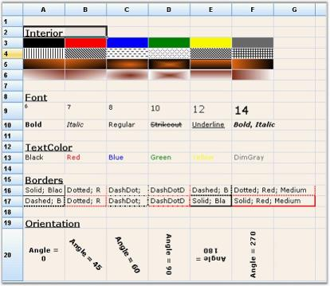' | markdownify }}
{:.image }

The above screen shot provides information on the following properties:

1. Interior -  Lets you specify solid, gradient, or pattern style for cell's background. Grid cells can be painted by using Interior property under Syncfusion.Drawing.BrushInfo class. BrushInfo holds information on filling the background of a grid cell. PatternStyle specifies the pattern style to be used and GradientStyle specifies the gradient style to be used.

[C#]

gridControl1[2, 2].Interior = new BrushInfo(GradientStyle.Horizontal, Color.Yellow, Color.Blue);  

gridControl1[3,2].Interior = new BrushInfo(PattenStyle.DashedHorizontal, Color.Black, Color.White);

[VB.NET]

gridControl1(2, 2).Interior = New BrushInfo(GradientStyle.Horizontal, color.Yellow, color.Blue)

gridControl1(3, 2).Interior = New BrushInfo(PattenStyle.DashedHorizontal, color.Black, color.White)

2. Font - Lets you specify the font for drawing text. Cells can be given required styles by using Font property under GridFontInfo. GridFontInfo holds information on font settings.

[C#]

GridFontInfo boldFont = new GridFontInfo();

boldFont.Bold = true;

boldFont.Size = 11;

boldFont.Underline = true;

gridControl1[3, 4].Font = boldFont;

[VB.NET]

Dim boldFont As GridFontInfo = New GridFontInfo()

boldFont.Bold = True

boldFont.Size = 11

boldFont.Underline = True

gridControl1(3, 4).Font = boldFont

3. Text Color - Colors for the cell text can be set by using TextColor property.

[C#]

gridControl1[rowIndex, colIndex].TextColor = Color.Red;

[VB.NET]

gridControl1(rowIndex, colIndex).TextColor = color.Red

4. Border - Borders can be set on all sides of a cell by setting Border property to an instance of GridBorder. GridBorder class holds the formatting information for borders of the cell.

[C#]

gridControl1[rowIndex, colIndex].Borders.All = new GridBorder(GridBorderStyle.DashDotDot, Color.Red);

[VB.NET]

gridControl1(rowIndex, colIndex).Borders.All = New GridBorder(GridBorderStyle.DashDotDot, color.Red)

5. Orientation - Lets you specify orientation of the grid cell text, in turn specifying the angle at which the text is displayed.

[C#]

gridControl1[3, 4].Font.Orientation = 270;

[VB.NET]

gridControl1[3, 4].Font.Orientation = 270

A sample demonstrating this feature is available under the following sample installation path. 

_<Install Location>\Syncfusion\EssentialStudio\[Version Number]\Windows\Grid.Windows\Samples\Appearance\Cell Customization Demo_

Custom Borders

You can draw custom borders around cells by using DrawCellFrameAppearance event of the Grid. DrawCellFrameAppearance event is triggered for every cell before the grid draws the frame of a specified cell and after the cell's background is drawn. This event can be used with any cell type such as TextBox, CheckBox, and so on. You can draw texture-brush border and gradient borders. The following code examples illustrate drawing custom borders by using the DrawCellFrameAppearance event:

[C#]

private void grid_DrawCellFrameAppearance(object sender, GridDrawCellBackgroundEventArgs)

{

//Draws a custom cell frame/border.

int rowIndex = e.Style.CellIdentity.RowIndex;

int colIndex = e.Style.CellIdentity.ColIndex;

if (rowIndex > 0 && colIndex > 0)

{

Brush brush;

Graphics g = e.Graphics;

//Allocates and cache bitmap and texture brush.

if (tb == null)

{

if (backBmp == null)

backBmp = GetImage("back3.jpg");

tb = new TextureBrush(backBmp);

}

//Uses TextureBrush for top-left cells.

if (colIndex < 6 && rowIndex < 12)

brush = tb;

else

//Otherwise uses a gradient brush.

brush = new System.Drawing.Drawing2D.LinearGradientBrush(e.TargetBounds, Color.FromArgb( 204, 212, 230 ), Color.FromArgb( 252, 172, 38 ), 45f);

//Draws custom border for the cell.

//Space has been reserved for this area with the TableStyle.BorderMargins property.

Rectangle rect = e.TargetBounds;

rect.Inflate(-2, -2);

Rectangle[] rects = new Rectangle[] 

{

new Rectangle(rect.X, rect.Y, rect.Width, 4),

new Rectangle(rect.X, rect.Y, 4, rect.Height),

new Rectangle(rect.Right-4, rect.Y, 4, rect.Height),

new Rectangle(rect.X, rect.Bottom-4, rect.Width, 4),

};

g.FillRectangles(brush, rects);

//Disallows grid's default drawing of cell frame for this cell.

e.Cancel = true;

}

}

[VB.NET]

Private Sub grid_DrawCellFrameAppearance(ByVal sender As Object, ByVal e As GridDrawCellBackgroundEventArgs)

'Draws a custom cell frame/border.

Dim rowIndex As Integer = e.Style.CellIdentity.RowIndex

Dim colIndex As Integer = e.Style.CellIdentity.ColIndex

If rowIndex > 0 AndAlso colIndex > 0 Then

Dim brush As Brush

Dim g As Graphics = e.Graphics

'Allocates and cache bitmap and texture brush.

If tb Is Nothing Then

If backBmp Is Nothing Then

backBmp = GetImage("back3.jpg")

End If

tb = New TextureBrush(backBmp)

End If

'Uses TextureBrush for top-left cells.

If colIndex < 6 AndAlso rowIndex < 12 Then

brush = tb

Else

' Otherwise uses a gradient brush.

brush = New System.Drawing.Drawing2D.LinearGradientBrush(e.TargetBounds, Color.FromArgb(204, 212, 230), Color.FromArgb(252, 172, 38), 45.0F)

End If

'Draws custom border for the cell.

'Space has been reserved for this area with the TableStyle.BorderMargins property.

Dim rect As Rectangle = e.TargetBounds

rect.Inflate(-2, -2)

Dim rects() As Rectangle = New Rectangle() {New Rectangle(rect.X, rect.Y, rect.Width, 4), New Rectangle(rect.X, rect.Y, 4, rect.Height), New Rectangle(rect.Right - 4, rect.Y, 4, rect.Height), New Rectangle(rect.X, rect.Bottom - 4, rect.Width, 4)}

g.FillRectangles(brush, rects)

'Disallow grid's default drawing of cell frame for this cell.

e.Cancel = True

End If

End Sub

{{ '' | markdownify }}
{:.image }

Number Formats

The formats of a numeric field (cell value) can be masked by using Format object. You can specify numeric format string as a mask. Format mask objects are assigned to date and numeric fields, and are also used to define how the data returned for that field is displayed.

> {{ '' | markdownify }}
{:.image }
_Note: Format masks object cannot be deleted once assigned to a field._

The following code examples illustrate masking numeric fields by using the Format object:

[C#]

this.gridControl1[2, 2].Format = "###0.##%";

[VB.NET]

Me.gridControl1(2, 2).Format = "###0.##%"

{{ '' | markdownify }}
{:.image }

Cell Tips

CellTipText object lets you specify the ToolTip Text to be displayed when the mouse pointer is moved over a cell. Cell tip text can be set for rows, columns, tables and individual cells. The following code examples illustrate how to set cell tips by using the CellTipText object:

[C#]

//Tip Text for cell (2,3).

this.gridControl1[2, 3].CellTipText = "TipText for cell 2,3";

//Tip Text for row 3.

this.gridControl1.RowStyles[3].CellTipText = "TipText for row 3";

//Tip Text for column 4.

this.gridControl1.ColStyles[4].CellTipText = "TipText for column 4";

//Tip Text for table.

this.gridControl1.TableStyle.CellTipText = "TipText for table";

[VB.NET]

'Tip Text for cell (2,3).

Me.gridControl1(2, 3).CellTipText = "TipText for cell 2,3"

'Tip Text for row 3.

Me.gridControl1.RowStyles(3).CellTipText = "TipText for row 3"

'Tip Text for column 4.

Me.gridControl1.ColStyles(4).CellTipText = "TipText for column 4"

'Tip Text for table.

Me.gridControl1.TableStyle.CellTipText = "TipText for table"

{{ '' | markdownify }}
{:.image }

Cell Comment Tips

Excel-like Cell Comment Tips can be included in a Grid by deriving the mouse controller class. The comment text is a custom style property added to cells that hold comments. To change, add, or delete a commen right-click the cell or left-click the red corner.

{{ '' | markdownify }}
{:.image }

A sample demonstrating this feature is available under the following sample installation path. _<Install Location>\Syncfusion\EssentialStudio\[Version Number]\Windows\Grid.Windows\Samples\ToolTip\Cell Comment Tip Demo_

###### Grid New Feature

ShowCurrentCellBorderBehavior property of the grid determines the behavior of the current cell's border. GridShowCurrentCellBorder enumeration specifies display of current cell's frame or border.

Here is the list of options in GridShowCurrentCellBorder enumeration.

* AlwaysVisible-Setting ShowCurrentCellBorderBehavior property with this option displays the current cell borders/frame.
* GrayWhenLostFocus-Setting ShowCurrentCellBorderBehavior property with this option shows the current cell's borders in gray when it is not focused upon.
* HideAlways-Setting ShowCurrentCellBorderBehavior property with this option hides the borders of the current cell.
* WhenGridActive-Setting ShowCurrentCellBorderBehavior property with this option highlights the current cell's border when the grid is under focus.

The following code example illustrates how to set the ShowCurrentCellBorderBehavior property:

[C#]

this.gridControl1.ShowCurrentCellBorderBehavior = GridShowCurrentCellBorder.AlwaysVisible;

[VB.NET]

'Set the ShowCurrentCellBorderBehavior property.

Me.gridControl1.ShowCurrentCellBorderBehavior = GridShowCurrentCellBorder.AlwaysVisible

###### Browse-Only Grid

BrowseOnly property permits the Grid control to be set to a non-editable state without affecting its background appearance, displaying an unavailable effect, etc. This feature is available in GridDataBoundGrid and GridGrouping controls, and it is directly exposed under the controls' properties.

Applying this property will reflect in all cell types and will make the Grid non-editable. It affects the following cell types as follows:

* ComboBox—Items in the drop-down can be viewed, but cannot be selected.
* CheckBox—Items cannot be selected or deselected.
* Textbox—Text cannot be entered in default edit mode

DropDown cells like MonthCalendar, ColorEdit, etc. will behave the same as ComboBox cell type; items can be viewed, but cannot be selected.

_Table 24: BrowseOnly property_

<table>
<tr>
<td>
PROPERTY</td><td>
DESCRIPTION</td><td>
TYPE</td><td>
DATA TYPE</td></tr>
<tr>
<td>
BrowseOnly</td><td>
Gets or sets a value to determine whether the Grid should be available only for viewing and not for editing.</td><td>
Boolean </td><td>
 true/false</td></tr>
</table>

Sample Link

_{Install Drive}\AppData\Local\Syncfusion\EssentialStudio\[Version Number]\Windows\Grid.Windows\Samples\Cell Types\Editor Cell Demo_

Making a Grid Browse-Only

To make the Grid non-editable, the following property must be set to true:

[C#]

 this.gridControl1.BrowseOnly = true;   

[VB]

 Me.gridControl1.BrowseOnly = true

##### Deriving Cell Control

Derived cell controls can be used to add cells that have special functions. You can employ such controls to produce special behavior like masked edit control, draggable button, or tree node within a grid cell. Being able to extend cell behavior through the derived cell controls makes Essential Grid very adaptable. 

There are two classes involved in defining cell architecture within Essential Grid. GridCellModelBase serves as the base class for the first class, which is involved in the cell model. GridCellRendererBase is the base class for second class, which is involved in defining cell control, the cell renderer. For example, Static cell control is defined in GridStaticCellModel and GridStaticCellRenderer classes which are derived from these base classes. So, whether cell control is a text box, combo box, or NumericUpDown cell, the behavior is accomplished through these two classes derived from GridCellModelBase and GridCellRendererBase.

In the next sections, you will learn how to derive cell control from, _C:\Syncfusion\EssentialStudio\VersionNumber\Windows\Grid.Windows\Samples\[Version Number]\CustomCellTypes\DerivedCellControlTutorial_  sample.

Also, _C:\Syncfusion\EssentialStudio\VersionNumber\Windows\Grid.Windows\Samples\[Version Number]\CustomCellTypes\DropDownFormAndUserControlSample_ sample illustrates how to add your own cell controls. It has two derived cell controls, one drops a modal form when a cell button is pressed and the other displays a pop-up UserControl when a cell button is pressed. Among the samples shipped with Grid control, there are several that provide custom cell types. The following table lists some of the samples.

_Table 25: Samples_

<table>
<tr>
<td>
SAMPLES</td><td>
DESCRIPTION</td></tr>
<tr>
<td>
ExcelSelectionMarker</td><td>
Has a derived celltype that displays BMP in a cell that is stored in GridStyleInfo.Tag. </td></tr>
<tr>
<td>
GridDataBoundImageCell</td><td>
Has two cell-derived cell types. Both display picture data stored in a database in a grid cell. One displays the picture directly in the grid cell with several choices regarding how the image will fit into the cell. The second celltype is a drop-down cell that displays a picture box when you click the cell.</td></tr>
<tr>
<td>
VirtTreeGrid</td><td>
Has an expandable tree node cell with an indentation property. This celltype is used in this example to enable the grid to have collapsible rows and generally function as a multicolumn tree control.</td></tr>
<tr>
<td>
2. LinkLabelCells</td><td>
3. Has LinkLabel-derived cell type. This cell type allows you to4. place a link in a GridCell and then launch the link in a browser5. window by clicking the link.</td></tr>
<tr>
<td>
 CellButtons</td><td>
Shows two different types of derived cell controls with buttons. The first is an ellipsis cell that displays further information when you click the button. This particular cell uses a bitmap button to display the ellipsis. The second custom cell type in this sample is a bar of three buttons that display different drag effects as you mouse down and drag.</td></tr>
<tr>
<td>
Drop-down grid</td><td>
Shows how you can drop a new grid in a cell. This sample is useful as it shows how to pass keystrokes onto the control that is embedded in the grid. For example, you may want the dropped grid to handle ARROW keys, but not have the ARROW keys move to another cell in the parent grid.</td></tr>
<tr>
<td>
CalendarCells</td><td>
Shows how you can drop Windows Forms DateTimePicker in a cell.</td></tr>
<tr>
<td>
SliderCells</td><td>
Shows how you can drop Windows Forms Slider Control in a cell.</td></tr>
<tr>
<td>
RepeaterUserControl</td><td>
Shows how you can use a derived cell control in a grid to create a repeater control used to edit DataTables.</td></tr>
</table>

See Also

###### GridCellModelBase

The main function of GridCellModelBase derived class is to serialize your control. It can hold any persistent state independent data that your control uses. The state dependent data should be part of GridStyleInfo object for the cell, but any other persistent property (for example, the initial height of a drop-down) will be in this GridCellModelBase derived class. Another major function of this class is to create cellrenderer object of the correct type. In fact, the only required override in GridCellModelBase derived class is the CreateRenderer method. In that override, you can create and return GridCellRendererBase derived object that would handle the user interactions in your new cell type. In general, you probably will not be able to derive directly from the base class, but instead from an existing Essential Grid derived class such as GridStaticCellModel. The following code example illustrates this.

[C#]

//Defines custom Cell Model by inheriting GridStaticCellModel.

public class LinkLabelCellModel : GridStaticCellModel

{

protected LinkLabelCellModel(SerializationInfo info, StreamingContext context): base(info, context)

{

}

public LinkLabelCellModel(GridModel grid): base(grid)

{

AllowFloating = false;

}

//Overrides CreateRenderer Method to create CellRenderer object.   

public override GridCellRendererBase CreateRenderer(GridControlBase control)

{

return new LinkLabelCellRenderer(control, this);

}

}

[VB.NET]

'Defines custom Cell Model by inheriting GridStaticCellModel.

Public Class LinkLabelCellModel

    Inherits GridStaticCellModel

    Protected Sub New(ByVal info As SerializationInfo, ByVal context As StreamingContext)

        MyBase.New(info, context)

    End Sub

    Public Sub New(ByVal grid As GridModel)

        MyBase.New(grid)

        AllowFloating = False

    End Sub

'Overrides CreateRenderer Method to create CellRenderer object.

    Public Overloads Overrides Function CreateRenderer(ByVal control As GridControlBase) As GridCellRendererBase

        Return New LinkLabelCellRenderer(Control, Me)

    End Function

End Class

###### GridCellRendererBase

The class derived from GridCellRendererBase handles drawing of the cell and user interaction aspect of the cell architecture. It takes care of things like the handling of the mouse and keyboard messages. Some of the virtual members you might override are listed in the following table.

_Table 26: Virtual members to override_

<table>
<tr>
<td>
VIRTUAL METHODS</td><td>
DESCRIPTION</td></tr>
<tr>
<td>
OnInitialize(int rowIndex, int colIndex)</td><td>
Override this method if you need to do any initialization for the current cell. One primary use of this method is to move state information from the GridStyleInfo object to cell control that handles active editing of the cell. For example, if your custom control is a checked list box control, you will use this method to check selected items in the embedded checked list box from information stored in the cell's style object. </td></tr>
<tr>
<td>
OnDraw(Graphics g, Rectangle clientRectangle, int rowIndex, int colIndex, GridStyleInfo style)</td><td>
Called to draw contents of the client bounds for the cell. For example, the text for a static cell. If your cell has an active state, then normally there are two paths through OnDraw. One path draws the active cell and the other handles the drawing of the cell when it is not active. Override it when you want to draw the content of your cell.</td></tr>
<tr>
<td>
OnKeyDown(KeyEventArgs e)</td><td>
Called when the user presses a key.</td></tr>
<tr>
<td>
OnKeyUp(KeyEventArgs e)</td><td>
Called when the user releases a key.</td></tr>
<tr>
<td>
OnKeyPress(KeyPressEventArgs e)</td><td>
Called for a user key press.</td></tr>
<tr>
<td>
OnHitTest(int rowIndex, int colIndex, MouseEventArgs mouseEventArgs, IMouseController controller)</td><td>
Override OnHitTest in your derived cell renderer if you want to catch mouse events. If you want your renderer class to handle mouse actions like OnMouseDown or OnMouseMove, this OnHitTest should return a non-zero value. Otherwise, your mouse methods will not be called.</td></tr>
<tr>
<td>
OnMouseHoverLeave(int rowIndex, int colIndex, EventArgs e)</td><td>
Called when your cell renderer has indicated in its OnHitTest override that it wants to receive mouse events, and that the user is moving the mouse out of the cell.</td></tr>
<tr>
<td>
OnMouseHover(int rowIndex, int colIndex, MouseEventArgs e)</td><td>
Called when your cell renderer has indicated in its OnHitTest override that it wants to receive mouse events and that the user is moving the mouse over the cell.</td></tr>
<tr>
<td>
OnMouseHoverEnter(int rowIndex, int colIndex)</td><td>
Called when your cell renderer has indicated in its OnHitTest override that it wants to receive mouse events and that the user has moved the mouse into the cell.</td></tr>
<tr>
<td>
OnMouseDown(int rowIndex, int colIndex, MouseEventArgs e)</td><td>
Called when your cell renderer has indicated in its OnHitTest override that it wants to receive mouse events and that the user has pressed a mouse button.</td></tr>
</table>

These are only a few of the many virtual methods available to you. For a complete list, take a look at the Essential Grid Class Reference. 

In general, you probably will not derive directly from the base class, but instead from an existing Essential Grid derived class such as GridStaticCellModel. For a sample implementation of a derived cell control that is based on the existing Static cell control, take a look at the sample in the following path: 

_C:\Syncfusion\EssentialStudio\VersionNumber\Windows\Grid.Windows\Samples\[Version Number]\CustomCellTypes\DropDownFormAndUserControlSample_. 

It shows two implementations of drop-downs. One drops a modal form by deriving GridStaticCellModel and GridStaticCellRenderer. The other drops UserControl using popup architecture that handles focus issues by deriving GridDropDownCellModel and GridDropDownCellRenderer.

##### Custom Cell Types

###### Button Edit

The Button Edit cell type will allow you to add images to the button, which can be embedded into the grid cells. This Button Edit cell type can be added by registering its cell model to the corresponding grid by using RegisterCellModel class. There are some in-built images, which will be added to the button by providing the button type, and also custom images can be added by specifying the button type as image and providing the location of the image. These Button Edit types can be used by initializing the ButtonEditStyleProperties class for the corresponding cell. The Button Edit types provided by grid control are listed as follows.

* Browse
* Check
* Down
* Left
* Leftend
* Redo
* Right
* Rightend
* Undo
* Up
* Image

You can also add custom buttons that you have created to the grid cells. This enables you to add custom buttons like split button to the grid.

The following code example illustrates how to set the cell type to ButtonEdit.

[C#]

RegisterCellModel.GridCellType(gridControl1, CustomCellTypes.ButtonEdit);

ButtonEditStyleProperties sp;

this.gridControl1[rowIndex, colIndex].CellType = CustomCellTypes.ButtonEdit.ToString();

sp = new ButtonEditStyleProperties(this.gridControl1[rowIndex, colIndex]);

sp.ButtonEditInfo.ButtonEditType = ButtonType.Browse;

sp.ButtonEditInfo.Width = 50;

[VB.NET]

RegisterCellModel.GridCellType(gridControl1, CustomCellTypes.ButtonEdit)

Private sp As ButtonEditStyleProperties

Me.gridControl1[rowIndex += 1, colIndex].CellType = "ButtonEdit";

Me.gridControl1(rowIndex, colIndex).CellType = CustomCellTypes.ButtonEdit.ToString()

sp = New ButtonEditStyleProperties(Me.gridControl1(rowIndex, colIndex))

sp.ButtonEditInfo.ButtonEditType = ButtonType.Browse

{{ '' | markdownify }}
{:.image }

###### Embeding OLE Objects in the Grid Cell

OLE objects can be directly embedded to a grid’s cell, which by default displays the icon of the file attached and opens through its default associated application when the cell is activated. This custom cell type will host the cell as an OLE container. The address of the file should be passed through the cell's Style.Description value.

Use Case Scenarios

In a payroll application, the generated report can be attached to the grid and viewed directly from the grid. The grid should be exported to the Excel when the operation is completed to view the recent results; otherwise the document will not reflect the recent changes.

Sample Link

Find a sample in the following location: _<Install Location>\Syncfusion\EssentialStudio\[Version Number]\Windows\Grid.Windows\Samples\2.0\ Grid Controls / Grid Control / Concepts and Features/Custom Cell Types_

Adding OleContainer Cell to an Application 

The following code illustrates how to set the cell type to OleContainer: 

[C#]

RegisterCellModel.GridCellType(this.gridControl1, CustomCellTypes.OleContainerCell);

this.gridControl1[rowIndex, colIndex].CellType = CustomCellTypes. OleContainerCell.ToString();

this.gridControl1[rowIndex, colIndex].Description = GetIconFile(@"common\Data\DocIO\SalesInvoiceDemo.doc");

VB.NET]

RegisterCellModel.GridCellType(this.gridControl1, CustomCellTypes.OleContainerCell);

Me.gridControl1(rowIndex, colIndex).CellType = CustomCellTypes. OleContainerCell.ToString()

Me.gridControl1(rowIndex, colIndex).Description = GetIconFile("common\Data\DocIO\SalesInvoiceDemo.doc")

{{ '' | markdownify }}
{:.image }

###### Calculator Text Box

Calculator Text Box cell type is implemented as a drop-down container, embedded in the cell where the drop-down contains the calculator, which displays the value in the cell. The following code examples illustrate how to set the cell type to CalculatorTextBox.

[C#]

RegisterCellModel.GridCellType(gridControl1, CustomCellTypes.CalculatorTextBox);

CalculatorControl c2 = new CalculatorControl();

c2.BorderStyle = Border3DStyle.RaisedOuter;

c2.BackColor = Color.BlanchedAlmond;

style = gridControl1[6, 2];

style.CellType = CustomCellTypes.CalculatorTextBox.ToString();

style.Control = c2;

[VB.NET]

RegisterCellModel.GridCellType(Me.gridControl1, CustomCellTypes.CalculatorTextBox)

Dim c2 As CalculatorControl = New CalculatorControl()

c2.BorderStyle = Border3DStyle.RaisedOuter

c2.BackColor = Color.BlanchedAlmond

style = gridControl1(6, 2)

style.CellType = CustomCellTypes.CalculatorTextBox.ToString()

style.Control = c2

{{ '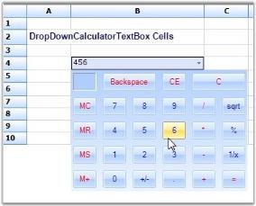' | markdownify }}
{:.image }

###### Calendar

Calendar cell type by can be added by registering the cell model by using RegisterCellModel class. The following code example illustrates how to set the cell type to Calendar.

[C#]

GridStyleInfo style;

style = gridControl1[row, 2];

style.CellType = CustomCellTypes.Calendar.ToString();

style.Control = new MonthCalendar();

[VB.NET]

Dim style As GridStyleInfo

style = gridControl1(row, 2)

style.CellType = CustomCellTypes.Calendar.ToString()

style.Control = New MonthCalendar()

{{ '' | markdownify }}
{:.image }

###### Date Time Picker

Date Time Picker cell type can be embedded into a cell as a drop-down container where date and time picker will be added in the drop-down. The cell value of the corresponding cell has to be specified as date value. Various formats of the date and time can be provided in the Format styleproperty. The following code example illustrates how to set the cell type to DateTimePicker.

[C#]

RegisterCellModel.GridCellType(gridControl1, CustomCellTypes.DateTimePicker);

this.gridControl1[4, 2].CellType = CustomCellTypes.DateTimePicker.ToString();

this.gridControl1[4, 2].CellValueType = typeof(DateTime);

this.gridControl1[4, 2].CellValue = DateTime.Now;

this.gridControl1[4, 2].Format = "MM/dd/yyyy hh:mm";

[VB.NET]

RegisterCellModel.GridCellType(Me.gridControl1, CustomCellTypes.DateTimePicker)

Me.gridControl1(4, 2).CellType = CustomCellTypes.DateTimePicker.ToString()

Me.gridControl1(4, 2).CellValueType = GetType(DateTime)

Me.gridControl1(4, 2).CellValue = DateTime.Now

Me.gridControl1(4, 2).Format = "MM/dd/yyyy hh:mm"

{{ '' | markdownify }}
{:.image }

###### Enhanced Numeric Up Down

Numeric Up Down cell type has been enhanced to provide more styles and properties that can be added to the numeric up down control by using FloatNumericUpDownStyleProperties class. It enables you to set the limitations of the numeric values and several other properties. 

_Table 27: Numeric Up Down style properties_

<table>
<tr>
<td>
FLOAT NUMERIC UP DOWN STYLE PROPERTIES</td><td>
DESCRIPTION</td></tr>
<tr>
<td>
BackColor</td><td>
Specifies the back color of the container.</td></tr>
<tr>
<td>
Maximum</td><td>
Indicates the maximum value that the cell can have.</td></tr>
<tr>
<td>
StartValue </td><td>
The starting value of the embedded cell.</td></tr>
<tr>
<td>
Step</td><td>
The value that has to be incremented for each click of the button.</td></tr>
<tr>
<td>
WrapValue</td><td>
The bool value that will allow to wrap the text.</td></tr>
<tr>
<td>
DecimalPlaces</td><td>
The decimal values after the decimal point.</td></tr>
<tr>
<td>
Orientation</td><td>
Orientation of the cell container on NumericUpDown.</td></tr>
<tr>
<td>
InterceptArrowkeys</td><td>
Allows to change the value by using ARROW keys from keyboard.</td></tr>
<tr>
<td>
ThousandsSeparator</td><td>
The bool value, which allows to separate thousand basis.</td></tr>
</table>

The following code example illustrates how to set the cell type to FNumericUpDown.

[C#]

RegisterCellModel.GridCellType(this.gridControl1, CustomCellTypes.FNumericUpDown);

GridStyleInfo style = this.gridControl1[1, 1];

style.Text = "Allow Decimal Increment and Decrement(step by 0.2,0.01,0.001)";

style.TextColor = Color.MidnightBlue;

//Sets up FNumericUpDown Cell.

style = gridControl1[2, 2];

style.CellType = CustomCellTypes.FNumericUpDown.ToString();

style.Text = "0.5";

//Assigns the Style Properties of Up Down Control.

FloatNumericUpDownStyleProperties sp = new FloatNumericUpDownStyleProperties(style);

sp.StyleInfo.BackColor = SystemColors.Window;

sp.FloatNumericUpDownProperties.Maximum = 15.0;

sp.FloatNumericUpDownProperties.Minimum = 0.0;

sp.FloatNumericUpDownProperties.StartValue = 0.5;

sp.FloatNumericUpDownProperties.Step = 0.2;

sp.FloatNumericUpDownProperties.WrapValue = true;

sp.FloatNumericUpDownProperties.DecimalPlaces = 1;

[VB.NET]

RegisterCellModel.GridCellType(gridControl1, CustomCellTypes.FNumericUpDown)

Dim style As GridStyleInfo = Me.gridControl1(1, 1)

style.Text = "Allow Decimal Increment and Decrement(step by 0.2,0.01,0.001)"

style.TextColor = Color.MidnightBlue

'Sets up FNumericUpDown Cell.

style = gridControl1(2, 2)

style.CellType = CustomCellTypes.FNumericUpDown.ToString()

style.Text = "0.5"

'Assigns the Style Properties of Up Down Control.

Dim sp As FloatNumericUpDownStyleProperties = New FloatNumericUpDownStyleProperties(style)

sp.StyleInfo.BackColor = SystemColors.Window

sp.FloatNumericUpDownProperties.Maximum = 15.0

sp.FloatNumericUpDownProperties.Minimum = 0.0

sp.FloatNumericUpDownProperties.StartValue = 0.5

sp.FloatNumericUpDownProperties.Step = 0.2

sp.FloatNumericUpDownProperties.WrapValue = True

sp.FloatNumericUpDownProperties.DecimalPlaces = 1

{{ '' | markdownify }}
{:.image }

###### GridInCell

GridInCell cell type provide covered range of cells to embed the grid, which is added as a control to the cells. The registered cell model will initialize the range by calculating the size of the grid control to be embedded, and add some styles such as borders and scroll bar to have the control within the range. The following code examples illustrate how to set the cell type to GridinCell.

[C#]

RegisterCellModel.GridCellType(gridControl1, CustomCellTypes.GridinCell);

gridControl1.BackColor = Color.FromArgb(0xda, 0xe5, 0xf5);

GridControl grid;

this.gridControl1[3, 2].CellType = CustomCellTypes.GridinCell.ToString();

this.gridControl1.CoveredRanges.Add(GridRangeInfo.Cells(3, 2, 7, 4));

grid = new CellEmbeddedGrid(this.gridControl1);

grid.BackColor = Color.FromArgb(0xb4, 0xe7, 0xf2);

grid.RowCount = 10;

grid.ColCount = 4;

grid[1, 1].Text = "this is a 10x4 grid";

grid.ThemesEnabled = true;

this.gridControl1[3, 2].Control = grid;

this.gridControl1.Controls.Add(grid);

[VB.NET]

RegisterCellModel.GridCellType(Me.gridControl1, CustomCellTypes.GridinCell)

Dim grid As GridControl

Me.gridControl1(3, 2).CellType = CustomCellTypes.GridinCell.ToString()

Me.gridControl1.CoveredRanges.Add(GridRangeInfo.Cells(3, 2, 7, 4))

grid = New CellEmbeddedGrid(Me.gridControl1)

grid.BackColor = Color.FromArgb(&HB4, &HE7, &HF2)

grid.RowCount = 10

grid.ColCount = 4

grid(1, 1).Text = "this is a 10x4 grid"

grid.ThemesEnabled = True

Me.gridControl1(3, 2).Control = grid

Me.gridControl1.Controls.Add(grid)

{{ '' | markdownify }}
{:.image }

###### Link Label Cell

The Link Label Cell type holds the link that has been provided in the Tag property. This displays ordinary text in the cell, which links specified location. The following code example illustrates how to set the cell type to LinkLabelCell.

[C#]

RegisterCellModel.GridCellType(gridControl1, CustomCellTypes.LinkLabelCell);

int rowIndex = 5;

gridControl1[rowIndex, 2].CellType = CustomCellTypes.LinkLabelCell.ToString();

gridControl1[rowIndex, 2].Text = "Syncfusion, Inc.";

gridControl1[rowIndex, 2].Font.Bold = true;

gridControl1[rowIndex, 2].Tag = "http://www.syncfusion.com";

[VB.NET]

RegisterCellModel.GridCellType(gridControl1, CustomCellTypes.LinkLabelCell)

Dim rowIndex As Integer = 5

gridControl1(rowIndex, 2).CellType = CustomCellTypes.LinkLabelCell.ToString()

gridControl1(rowIndex, 2).Text = "Syncfusion, Inc."

gridControl1(rowIndex, 2).Font.Bold = True

gridControl1(rowIndex, 2).Tag = "http://www.syncfusion.com"

{{ '' | markdownify }}
{:.image }

###### Picture Box

Picture Box cell type can be embedded into a cell by calculating the size of the picture and extending the width and height of the cell accordingly. PictureBoxStyleProperties class provides the style where it holds the information of the picture that has to be added. The following code examples illustrate how to set the cell type to PictureBox.

[C#]

RegisterCellModel.GridCellType(gridControl1, CustomCellTypes.PictureBox);

PictureBoxStyleProperties sp;

style = gridControl1[2, 2];

style.CellType = CustomCellTypes.PictureBox.ToString();

sp = new PictureBoxStyleProperties(style);

sp.Image = GetImage("one.jpg");

[VB.NET]

RegisterCellModel.GridCellType(Me.gridControl1, CustomCellTypes.PictureBox)

Dim sp As PictureBoxStyleProperties

style = gridControl1(2, 2)

style.CellType = CustomCellTypes.PictureBox.ToString()

sp = New PictureBoxStyleProperties(style)

sp.Image = GetImage("one.jpg")

{{ '' | markdownify }}
{:.image }

###### Slider

Slider control embedded in a grid cell is termed as a Slider Cell. Slider control can be embedded in the grid cells by using Slider cell type. The class SliderStyleProperties provides custom properties specific to Slider control. All the properties support the style inheritance mechanism. Slider control can be embedded by using the following set of codes:

[C#]

gridControl1.CellModels.Add("Slider", new SliderCellModel(gridControl1.Model));

GridStyleInfo style;

style = gridControl1[4, 5];

SliderStyleProperties sp = new SliderStyleProperties(style);

style.CellType = "Slider";

sp.Maximum = 40;

sp.Minimum = 0;

sp.TickFrequency = 8;

sp.LargeChange = 16;

sp.SmallChange = 4;

sp.Orientation = Orientation.Vertical;

[VB.NET]

gridControl1.CellModels.Add("Slider", New SliderCellModel(gridControl1.Model))

Dim style As GridStyleInfo

style = gridControl1(4, 5)

Dim sp As SliderStyleProperties = New SliderStyleProperties(style)

style.CellType = "Slider"

sp.Maximum = 40

sp.Minimum = 0

sp.TickFrequency = 8

sp.LargeChange = 16

sp.SmallChange = 4

sp.Orientation = Orientation.Vertical

{{ '' | markdownify }}
{:.image }

###### XHTML Cell

An XHTML page can be displayed in a grid cell by using Xhtml Cell cell type. Custom cell type can be created and registered to provide XHTML functionality. It requires derivation of two classes:

* GridCellModelBase
* GridCellRendererBase

The CellModel (read GridCellModelBase class in this document) handles any serialization that a cell type requires and also creates the CellRenderer (read GridCellRendererBase class in this document) class that is associated with the cell type. CellRenderer class manages the UI aspects of cell type. The XHTML page can be displayed by using the following set of codes.

[C#]

string xhtml1 = "<body style=\"font-family:Arial; line-height:1em\"> ";

xhtml1 += "<h1 style=\"text-align:center; color:#EE7A03 \">XhtmlCells</h1>";

xhtml1 += "
";

xhtml1 += "
XhtmlCells use the RichTextBoxSupportsXHTML control from GotDotNet user samples to display XHTML formatted text inside a cell.
";

xhtml1 += "</body>";

gridControl1[rowIndex, 1].CellType = "XhtmlCell";

gridControl1[rowIndex, 1].Text = xhtml1;

[VB.NET]

Dim xhtml1 As String = "<body style=""font-family:Arial; line-height:1em""> "

xhtml1 += "<h1 style=""text-align:center; color:#EE7A03 "">XhtmlCells</h1>"

xhtml1 += "
"

xhtml1 += "
XhtmlCells use the RichTextBoxSupportsXHTML control from GotDotNet user samples to display XHTML formatted text inside a cell.
"

xhtml1 += "</body>"

gridControl1(rowIndex, 1).CellType = "XhtmlCell"

gridControl1(rowIndex, 1).Text = xhtml1

{{ '' | markdownify }}
{:.image }

###### Chart Cell

Essential Chart control can be embedded in grid cells by creating and registering custom Chart Cell cell type. CellModel class handles any serialization that a cell type requires and also creates CellRenderer class associated with the cell type. The actions mentioned can be performed by using the following code example.

[C#]

ChartStyleProperties csp;

this.gridControl1.CellModels.Add("ChartCell", new GridChartCellModel(this.gridControl1.Model));

style = this.gridControl1[8, 2];

style.CellType = "ChartCell";

csp = new ChartStyleProperties(style);

csp.ChartType = ChartSeriesType.Column;

csp.TitleText = "Chart Cell";

csp.Series3D = false;

csp.TitleAlignment = StringAlignment.Center;

[VB.NET]

Dim csp As ChartStyleProperties

Me.gridControl1.CellModels.Add("ChartCell", New GridChartCellModel(Me.gridControl1.Model))

style = Me.gridControl1(8, 2)

style.CellType = "ChartCell"

csp = New ChartStyleProperties(style)

csp.ChartType = ChartSeriesType.Column

csp.TitleText = "Chart Cell"

csp.Series3D = False

csp.TitleAlignment = StringAlignment.Center

{{ '' | markdownify }}
{:.image }

###### Drop-Down Grid Cell

Essential Grid has flexible support for displaying drop-down grids in cells. It uses a custom cell derived from the GridDropDownGridCellModel/GridDropDownGridCellRenderer classes to display a drop-down grid. The GridDropDownGridCellModel gets an instance of GridControlBase and displays it through GridDropDownGridCellRenderer.

The actions mentioned above can be performed by using the following code examples.

[C#]

//Creates and registers drop-down grid cells.

DropDownGridCellModel aModel = new DropDownGridCellModel(this.gridControl1.Model);

aModel.EmbeddedGrid = GridA;

gridControl1.CellModels.Add("GridADropCell", aModel);

//Sets the drop-downs in the cell.

this.gridControl1[rowIndex,1].Text = "Grid A";

this.gridControl1[rowIndex,1].CellType = "GridADropCell";

[VB.NET]

'Creates and registers drop-down grid cells.

Dim aModel As DropDownGridCellModel = New DropDownGridCellModel(Me.gridControl1.Model)

aModel.EmbeddedGrid = GridA

gridControl1.CellModels.Add("GridADropCell", aModel)

'Sets the drop-downs in the cell.

Me.gridControl1(rowIndex,1).Text = "Grid A"

Me.gridControl1(rowIndex,1).CellType = "GridADropCell"

{{ '' | markdownify }}
{:.image }

###### Drop-Down Form and User Control Cell

A custom control cell that displays a drop-down form or a user control in a grid cell can be created.

You can create:

* A drop-down form in a grid cell by deriving GridStaticCellModel/GridStaticCellRenderer classes.
* Adrop-down User control in a grid cell by deriving GridDropDownCellModel/GridDropDownCellRender classes.

The actions mentioned can be performed by using the following code example.

[C#]

//Registers your custom cell type.

this.gridControl1.CellModels.Add("DropDownForm", new DropDownFormCellModel(this.gridControl1.Model, new DropDownForm()));

//Sets the style.CellType for the cells.

this.gridControl1[2, 2].CellType = "DropDownForm";

//Registers your custom cell type.

this.gridControl1.CellModels.Add("DropDownUserControl", new DropDownUserCellModel(this.gridControl1.Model, new DropDownUser()));

//Sets the style.CellType for the cells.

this.gridControl1[6, 2].CellType = "DropDownUserControl";

[VB.NET]

'Registers your custom cell type.

Me.gridControl1.CellModels.Add("DropDownForm", New DropDownFormCellModel(Me.gridControl1.Model, New DropDownForm()))

'Sets the style.CellType for the cells.

Me.gridControl1(2, 2).CellType = "DropDownForm"

'Registers your custom cell type.

Me.gridControl1.CellModels.Add("DropDownUserControl", New DropDownUserCellModel(Me.gridControl1.Model, New DropDownUser()))

'Sets the style.CellType for the cells.

Me.gridControl1(6, 2).CellType = "DropDownUserControl"

{{ '' | markdownify }}
{:.image }

###### Integer Text Box

Integer text box is used to display integer data-type values in the grid cells. This cell type can be added to the grid cells by registering its cell model using RegisterCellModel class. The following code example illustrates how to add the integer text box to grid cells using the RegisterCellModel class.

[C#]

RegisterCellModel.GridCellType(this.gridControl1, CustomCellTypes.IntegerTextBox);

this.gridControl1[4, 2].CellType = CustomCellTypes.IntegerTextBox.ToString();

[VB]

RegisterCellModel.GridCellType(Me.gridControl1, CustomCellTypes.IntegerTextBox)

Me.gridControl1(4, 2).CellType = CustomCellTypes.IntegerTextBox.ToString()

{{ '' | markdownify }}
{:.image }

###### Double Text Box

Double text box is used to display double data-type values in the grid cells. This cell type can be added to the grid cells by registering its cell model using RegisterCellModel class. The following code example illustrates how to add the double text box to grid cells using the RegisterCellModel class.

[C#]

 RegisterCellModel.GridCellType(this.gridControl1, CustomCellTypes.DoubleTextBox);

   this.gridControl1[4, 2].CellType= CustomCellTypes.DoubleTextBox.ToString();

[VB]

RegisterCellModel.GridCellType(Me.gridControl1, CustomCellTypes.DoubleTextBox)

Me.gridControl1(4, 2).CellType = CustomCellTypes.DoubleTextBox.ToString()

{{ '' | markdownify }}
{:.image }

###### Percent Text Box

Percent text box is used to display percentage values in the grid cell. This cell type can be added to the grid cells by registering its cell model using RegisterCellModel class. The following code example illustrates how to add percent text box to grid cells using RegisterCellModel class.

[C#]

   RegisterCellModel.GridCellType(this.gridControl1, CustomCellTypes.PercentTextBox);

this.gridControl1[5, 2].CellType = CustomCellTypes.PercentTextBox.ToString();

[VB]

RegisterCellModel.GridCellType(Me.gridControl1, CustomCellTypes.PercentTextBox)

Me.gridControl1(4, 2).CellType = CustomCellTypes.PercentTextBox.ToString() 

{{ '' | markdownify }}
{:.image }

##### MS Excel-like Features

Essential Grid offers a wide range of MS Excel-like features. Following is the list of features offered:

###### Selection Frame

Essential Grid supports MS Excel-like Selection Frame feature. This enables the selected cells in a frame to be highlighted. This feature can be enabled by setting ExcelLikeSelectionFrame property to _true_. Selection Frame feature can be enabled for Essential Grid by using the following code:

[C#]

this.gridControl1.ExcelLikeSelectionFrame = true;

[VB.NET]

Me.gridControl1.ExcelLikeSelectionFrame = True

{{ '' | markdownify }}
{:.image }

###### Current Cell

Essential Grid supports MS-Excel like Current Cell feature. This feature can be enabled by setting ExcelLikeCurrentCell property to _true_. When the user moves the current cell out of a selected range, the range will be cleared. If the user moves the current cell inside a selected range, the range will stay. Current Cell feature can be enabled for Essential Grid by using the following code:

[C#]

this.gridControl1.ExcelLikeCurrentCell = true;

[VB.NET]

Me.gridControl1.ExcelLikeCurrentCell = True

{{ '' | markdownify }}
{:.image }

###### Workbook

Worksheets in a workbook can be displayed as tabs for easier view and selection of worksheets similar to Excel. This is achieved by using the Tab Bar Splitter control. You can add any number of Tab Bar pages to Tab Bar Splitter control and then add the Grid control to each Tab Bar page to get the appearance similar to the Workbook in Excel.

[C#]

this.tabBarSplitterControl1.Controls.Add(this.tabBarPage1);

this.tabBarSplitterControl1.Controls.Add(this.tabBarPage2);

this.tabBarSplitterControl1.Controls.Add(this.tabBarPage3);

//Adds Grid controls to the Tab Bar Pages.

this.tabBarPage1.Controls.Add(this.gridControl1);

this.tabBarPage2.Controls.Add(this.gridControl2);

this.tabBarPage3.Controls.Add(this.gridControl3);

[VB.NET]

Me.tabBarSplitterControl1.Controls.Add(Me.tabBarPage1)

Me.tabBarSplitterControl1.Controls.Add(Me.tabBarPage2)

Me.tabBarSplitterControl1.Controls.Add(Me.tabBarPage3)

' Adds Grid controls to the Tab Bar Pages.

Me.tabBarPage1.Controls.Add(Me.gridControl1)

Me.tabBarPage2.Controls.Add(Me.gridControl2)

Me.tabBarPage3.Controls.Add(Me.gridControl3)

{{ '' | markdownify }}
{:.image }

###### Splitter

A dynamic-splitter window can be embedded in Essential Grid to show multiple views of the same grid by using a Splitter. This MS Excel-like feature enables you to view more than one copy of a worksheet and scroll through each pane of worksheet independently. The panes work simultaneously, i.e., the changes made in one pane are reflected in the other. The splitter can be scrolled by placing the mouse pointer over it, holding down the left mouse button and dragging it to the required position. It can be split horizontally and vertically. Following are the events associated with the Splitter control.

_Table 28: Events associated with the Splitter control_

<table>
<tr>
<td>
EVENTS</td><td>
DESCRIPTION</td></tr>
<tr>
<td>
PaneCreated</td><td>
This event is triggered when the splitter is moved across the Grid.</td></tr>
<tr>
<td>
PaneClosing</td><td>
This event is either triggered when the splitter is moved to the end/beginning or when it cannot be located on the worksheet.</td></tr>
</table>
The splitter can be created in a worksheet by using the following code:

[C#]

this.splitterControl1.Controls.Add(this.gridControl1);

//PaneCreated event.

private void splitterControl1_PaneCreated(object sender, Syncfusion.Windows.Forms.SplitterPaneEventArgs e)

{

Console.WriteLine("Created: " + e.ToString());

}

//PaneClosing event.

private void splitterControl1_PaneClosing(object sender, Syncfusion.Windows.Forms.SplitterPaneEventArgs e)

{

Console.WriteLine("Closed: " + e.ToString());

}

[VB.NET]

Me.splitterControl1.Controls.Add(Me.gridControl1)

'PaneCreated event.

private void splitterControl1_PaneCreated(Object sender, Syncfusion.Windows.Forms.SplitterPaneEventArgs e)

Console.WriteLine("Created: " & e.ToString())

'PaneClosing event.

private void splitterControl1_PaneClosing(Object sender, Syncfusion.Windows.Forms.SplitterPaneEventArgs e)

Console.WriteLine("Closed: " & e.ToString())

{{ '' | markdownify }}
{:.image }

###### Freeze Pane

Essential Grid supports MS Excel-like Freeze Pane feature. In a large worksheet, it is often required that column or row labels remain in view. This feature enables you to freeze either columns or rows in the Grid, so that they may remain visible while you scroll. The number of rows to be frozen can be specified by using Model.Rows.FrozenCount property and the number of columns to be frozen can be specified by using Model.Cols.FrozenCount property. The Freeze Pane feature can be enabled for Essential Grid by using the following code:

[C#]

this.gridControl1.Model.Rows.FrozenCount = 4;

this.gridControl1.Model.Cols.FrozenCount = 3;

[VB.NET]

Me.gridControl1.Model.Rows.FrozenCount = 4

Me.gridControl1.Model.Cols.FrozenCount = 3

> _{{ '' | markdownify }}
{:.image }
_Note: You can unfreeze the frozen rows or columns by clicking Unfreeze Current Row/Col button on the UI._

{{ '' | markdownify }}
{:.image }

###### MultiLevel Undo and Redo

Essential Grid has flexible support for Multilevel Undo/Redo. This feature enables the user to undo history for most actions that are performed. This feature can be enabled by setting CommandStack.Enabled property to _true_. Using the functions of GridModelCommandManager class, various tasks like undo and redo can be done. You can access this class from a Grid with CommandStack property of a GridModel instance. Multilevel Undo/Redo feature can be enabled for Essential Grid by using the following code:

[C#]

this.gridControl1.CommandStack.Enabled = true;

this.gridControl1.CommandStack.Undo();

this.gridControl1.CommandStack.Redo();

[VB.NET]

Me.gridControl1.CommandStack.Enabled = True

Me.gridControl1.CommandStack.Undo()

Me.gridControl1.CommandStack.Redo()

{{ '' | markdownify }}
{:.image }

###### Find and Replace

Find and Replace feature enables you to search and replace the required element present in Grid/Worksheet. You can implement the fastest Find and Replace functionality with Grid controls by using GridFindReplaceDialogSink and GridFindReplaceEventArgs classes. GridFindReplaceDialogSink class provides methods that are necessary to perform a Find and Replace operation. GridFindReplaceEventArgs class provides information about Find and Replace dialog box.

The value entered in the Search For field is highlighted in the worksheet after search action is performed. You can switch over to each highlighted text by clicking Find Next button. This functionality is available only when there is more than one search result.

Search and Replace Options

The search and replace actions:

* Can be performed independently or simultaneously.
* Can be done for individual search or for the entire worksheet by using the Find Next/Replace buttons.
* Can be done for all the search results by clicking Find All/Replace All buttons.

Search Options

The search options are as follows:

* Match Case-Matches case while performing search.
* Match Whole Cell-Matches the search text with the entire text in a grid cell.
* Search Up-Specifies if the search can be performed bottom-up.
* Column Only-Searches only the current column.
* Selection Only-Searches only the current selection.
* Whole Table-Searches the whole table.

The Find and Replace feature can be enabled for Essential Grid by using the following code:

[C#]

GridFindTextOptions options = GridFindTextOptions.WholeTable | GridFindTextOptions.SearchUp;

object locInfo = GridRangeInfo.Table();

GridFindReplaceEventArgs frEvents = new GridFindReplaceEventArgs(cmbSearch.Text, "", options, locInfo);

GridFindReplaceDialogSink frDialog.Find(frEvents);

[VB.NET]

Private options As GridFindTextOptions = GridFindTextOptions.WholeTable Or GridFindTextOptions.SearchUp

Private locInfo As Object = GridRangeInfo.Table()

Private frEvents As New GridFindReplaceEventArgs(cmbSearch.Text, "", options, locInfo)

GridFindReplaceDialogSink(frDialog.Find(frEvents))

{{ '' | markdownify }}
{:.image }

Highlighting Search Text

Grid control supports highlighting all or part of the search text in a cell. GridHighlightSearchText class is used to define search text for highlighting. This class exposes WireGrid method, which is used for passing Grid control. With HighLightText and HighlightColor properties, you can specify search text to be highlighted and the color for highlighting the search text. By default, the highlight color is _yellow_. The highlight color for the search text is optional.

[C#]

//Creates an object for the class “GridHighlightSearchText”.

GridHighlightSearchText highlighttext = new GridHighlightSearchText();

//Wires the grid to the object.

highlighttext.WireGrid(this.gridControl1);

//Assigns the text that needs to be highlighted.

highlighttext.HighlightText = cmbSearch.Text;

//Assigns the color (optional).

highlighttext.HighlightColor = Color.Yellow;

[VB.NET]

'Creates an object for the class “GridHighlightSearchText”.

Private highlighttext As New GridHighlightSearchText()

'Wires the grid to the object.

highlighttext.WireGrid(Me.gridControl1)

'Assigns the text that needs to be highlighted.

highlighttext.HighlightText = cmbSearch.Text

'Assigns the color (optional).

highlighttext.HighlightColor = Color.Yellow

{{ '' | markdownify }}
{:.image }

To view a sample on Highlighting Search Text, see _<Installed Location>\Syncfusion\EssentialStudio_

_\<Version>\Windows\Grid.Windows\Samples\Editing \Find-Replace Demo_

###### Unhide Column by Double-Clicking Disabled

Essential Grid has changed the unhide column operation to emulate the behavior found in Microsoft Excel. Previously, hidden columns could be shown by double-clicking a row. This behavior has been disabled so that applications created using Essential Grid will be similar to the hide/unhide behavior found in Microsoft Excel.

_Table_ _2_9: Property Table_

<table>
<tr>
<td>
PROPERTY</td><td>
DESCRIPTION</td><td>
TYPE</td><td>
DATA TYPE</td><td>
REFERENCE LINKS</td></tr>
<tr>
<td>
UnHideColsOnDblClick</td><td>
Indicates whether to unhide the hidden columns when the row is double clicked. </td><td>
Property </td><td>
Boolean </td><td>
N/A.</td></tr>
</table>
Disabling Unhide Column by Double-Clicking 

To disable unhide column by double- clicking, set the UnHideColsOnDblClick property to true. By default this is set to true. 

[C#]

//Disables unhide column when double clicking as found in Excel.

            this.gridControl1.UnHideColsOnDblClick = true;

[VB]

'Disables unhide column when double clicking as found in Excel.

            Me.gridControl1.UnHideColsOnDblClick = True

###### ighlighting Row and Column Headers

This feature is used to highlight the corresponding row and column headers of one or more cells that you selected. Using the MarkRowHeader and MarkColHeader properties, you can enable highlighting the row and column headers of the selected cells.

_Table_ _3_0: Properties Table_

<table>
<tr>
<td>
PROPERTY </td><td>
DESCRIPTION </td><td>
DATA TYPE </td></tr>
<tr>
<td>
MarkRowHeader</td><td>
It is used to highlight row headers of the selected cells.</td><td>
Boolean</td></tr>
<tr>
<td>
MarkColHeader</td><td>
It is used to highlight the column headers of the selected cells.</td><td>
Boolean</td></tr>
</table>
By default, MarkRowHeader and MarkColHeader properties are set to false. To enable highlighting row and column headers, set MarkRowHeader and MarkColHeader properties to true. The following code examples illustrate this.

[C#]

this.gridControl1.MarkColHeader = true;

this.gridControl1.MarkRowHeader = true;

[VB]

Me.gridControl1.MarkColHeader = true

Me.gridControl1.MarkRowHeader = true

{{ '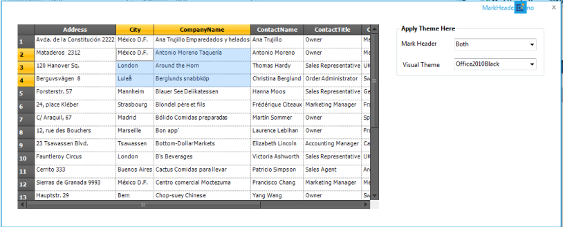' | markdownify }}
{:.image }

Sample Link

To view samples from the dashboard:

* Open Syncfusion Dashboard. 
* Select UI > Windows Forms.
* Click Run Samples.  
* Navigate to Grid > MS Excel-Style Features > Mark Header Demo
##### Formula Support

Setting cell type of a cell to FormulaCell will allow you to enter algebraic expressions using formulas and cell references. Cell references are entries such as A11 for column A row 11 or BA3 for column BA row 3. A formula is a defined calculation from the Formula Library, which is included with Essential Grid. This Formula Library is extensible and lets you to add additional formulas.

###### Defining FormulaCell

You can use Formula Cells for every cell in a grid or just for a few cells. Even if you set CellType property to _FormulaCell_ for every cell in a grid, the default behavior is to treat such cells as text box cells, unless you start the cell entry with an equal sign. If the cell value starts with an equal sign, then the cell is considered as a formula cell and its contents are treated as such. To make all cells present in a grid as potential formula cells, you will have to set cell type of standard BaseStyle to FormulaCell by using the following code. 

[C#]

//Sets up a Formula Cell.

this.gridControl1.BaseStylesMap["Standard"].StyleInfo.CellType = "FormulaCell";

[VB.NET]

'Sets up a Formula Cell.

Me.gridControl1.BaseStylesMap("Standard").StyleInfo.CellType = "FormulaCell"

###### Using the Formula Library

Essential Grid's Formula Library contains mathematical functions that are available in the .NET Framework's System.Math class. In addition, there are Sum and Avg members. You can also add additional functions to this library by using your own code.

{{ '' | markdownify }}
{:.image }

In the above screen shot, cell A2 has a formula that uses four different library functions: Sqrt, Pow, Cos, and Sin.

> {{ '' | markdownify }}
{:.image }
_Note: For a complete list of these library functions, refer to the Class Reference for "GridFormulaEngine"._

###### Supported Arithmetic Operators and Calculation Precedence

The current formula support will let you enter well-formed parenthetical algebraic expressions with operators and operands. The nine supported operators are shown in the following precedence table with operators on the same level being calculated as encountered when the expression is scanned from left to right. 

Code Tables

_Table 31: Code tables_

<table>
<tr>
<td>
OPERATIONS</td><td>
SYMBOL</td><td>
CALCULATION PRECEDENCE</td></tr>
<tr>
<td>
Multiplication, Division</td><td>
/  *</td><td>
1st</td></tr>
<tr>
<td>
Addition, Subtraction</td><td>
+  -</td><td>
2nd</td></tr>
<tr>
<td>
Less Than, Greater Than, Equal, Less Than Or Equal, Greater Than Or Equal, Not Equal</td><td>
<  > = <= >= <></td><td>
3rd</td></tr>
</table>

The supported operands include those listed in the following table. An operand by itself is also a well-formed algebraic expression that can serve as an entire formula in a cell.

_Table 32: Supported operands_

<table>
<tr>
<td>
OPERAND</td><td>
EXAMPLE</td></tr>
<tr>
<td>
number</td><td>
532.1, -10.2, or 18.</td></tr>
<tr>
<td>
cell reference</td><td>
A12, BB1010, or Q18.</td></tr>
<tr>
<td>
library formula with valid arguments</td><td>
Abs(E14), Cos(-3.14), or Sum(A1:A14).</td></tr>
<tr>
<td>
any well formed algebraic expression</td><td>
E1+E2, Cos(2)<A4, or Abs(A1-A5).</td></tr>
</table>
Within a formula cell, case is ignored. So, a1 is the same as A1, and Cos(3) is the same as COS(3).

###### Inside Essential Grid's Formula Support

Formula Cell control is implemented with four classes: GridFormulaCellModel, GridFormulaCellRenderer, GridFormulaEngine and GridFormulaTag. GridFormulaCellRenderer class handles a couple of activation issues that are specific to displaying formulas when a formula cell gets activated. GridFormulaCellModel class does some significant work in its GetFormattedText method override where calculations and formula parsing are initiated dynamically as required. 

GridFormulaEngine class does the actual parsing and calculation that is required to evaluate a formula in a cell. This class also maintains Formula Library. The programmer can gain access to an engine object by using GridFormulaCellModel.Engine property. It is this property that will let you add functions to (or remove functions from) the Formula Library. The use of the class is discussed in the next section. 

Finally, GridFormulaTag class is used in conjunction with GridStyleInfo class that has a property of this type. GridFormulaTag tracks computed value of the cell in its Text property.

###### Adding Formulas to the Formula Library

Here are the steps that are required to add a function to the Function Library.

1. First, define a method that has this signature.

[C#]

//Defines a method whose name is the FormulaName.

public string MyLibraryFormulaName(string args)

[VB.NET]

'Defines a method whose name is the FormulaName.

Public Function MyLibraryFormulaName(ByVal args As String) As String

Here MyLibraryFormulaName must be a name that has not already been used in Function Library and must include only letters and digits. If you want to replace an existing formula with a formula of the same name, first remove the existing formula before adding the new formula. Use GridFormulaEngine.RemoveFunction method to remove a formula.

Then, write an implementation for your method. Here code is used to implement a function that will sum only positive numbers that are passed in as either a range like A1:A5 and/or a list such as A1, A4, A10. The code uses the FormulaEngine helper method to extract these values from the cells. The GetCellsFromArgs method will return an array of cells from a range such as A1:A5, and GetValueFromArg method will take cells such as A3 and return a value such as 123.3. 

[C#]

//Implements your method.

public string ComputeSumPosNums(string args)

{

    GridFormulaCellModel model = this.gridControl1.CellModels["FormulaCell"] as GridFormulaCellModel;

    if(model != null)

    {

        GridFormulaEngine engine = model.Engine;

        double sum = 0d;

        double d;

        string s1;

//Loops through arguments and sum up the positive values.

        foreach(string r in args.Split(new char[]{','}))

        {

//Cell Range.

            if(r.IndexOf(':') > -1) 

            {

                foreach(string s in engine.GetCellsFromArgs(r))

                {

// s is a cell line a21 or c3...

                try

                    {

                        s1 = engine.GetValueFromArg(s);

                    }

                    catch(Exception ex)

                    {

                        return ex.Message;

                    }

                    if(s1 != "")

                    {

//Adds only if positive.

                        if(double.TryParse(s1, NumberStyles.Number, null, out d)

                                    && d > 0)

                        {

                            sum += d; 

                        }

                    }

                }

            }

            else

            {

                try

                {

                    s1 = engine.GetValueFromArg(r);

                }

                catch(Exception ex)

                {

                    return ex.Message;

                }

                if(s1 != "")

                {

                    if(double.TryParse(s1, NumberStyles.Number, null, out d) && d > 0)

                    {

                        sum += d; 

                    }

                }

            }

        }        

        return sum.ToString();

    }

    return "";

}

[VB.NET]

'Implements your Method.

Public Function ComputeSumPosNums(args As String) As String

Dim model As GridFormulaCellModel = Me.gridControl1.CellModels("FormulaCell")

If Not (model Is Nothing) Then

Dim engine As GridFormulaEngine = model.Engine

Dim sum As Double = 0.0

Dim d As Double

Dim s1 As String

'Loops through arguments and sum up the positive values.

Dim r As String

For Each r In args.Split(New Char() {","c})

'Cell Range.

If r.IndexOf(":"c) > -1 Then

Dim s As String

For Each s In engine.GetCellsFromArgs(r)

's is a cell line a21 or c3...

Try

s1 = engine.GetValueFromArg(s)

Catch ex As Exception

Return ex.Message

End Try

If s1 <> "" Then

'Adds only if positive.

If Double.TryParse(s1, NumberStyles.Number, Nothing, d) And d > 0 Then

sum += d

End If

End If

Next s

Else

Try

s1 = engine.GetValueFromArg(r)

Catch ex As Exception

Return ex.Message

End Try

If s1 <> "" Then

If Double.TryParse(s1, NumberStyles.Number, Nothing, d) And d > 0 Then

sum += d

End If

End If

End If

Next r

Return sum.ToString()

End If

Return ""

End Function

The last step is to actually add your formula to the library. You should do this after the grid has been created, say in a Form.Load event handler. 

[C#]

GridFormulaCellModel cellModel = this.gridControl1.CellModels["FormulaCell"] as GridFormulaCellModel;

//Adds a formula named SumPosNums to the Library.

cellModel.Engine.AddFunction("SumPosNums", new GridFormulaEngine.LibraryFunction(ComputeSumPosNums));

[VB.NET]

Dim cellModel As GridFormulaCellModel = Me.gridControl1.CellModels("FormulaCell")

'Adds a formula named SumPosNums to the Library.

cellModel.Engine.AddFunction("SumPosNums", New GridFormulaEngine.LibraryFunction(AddressOf ComputeSumPosNums))

###### Function Reference Section

In this section, the library functions that are shipped in the Essential Calculate library are discussed. The arguments required by each of these functions are listed in bold text. Optional arguments are listed in a normal text.

ABS

Returns the absolute value of a number. The absolute value of a non-negative number is the number itself. Theabsolute value of a negative number is -1 times the number.

Syntax

ABS(_number_), where: number is the real number for which you want the absolute value.

ACCRINT

ACCRINT function returns the accrued interest for a security that pays periodic interest.

Syntax

ACCRINT(issue, first_interest, settlement, rate, par, frequency, [basis], [calc_method]) where:

* issue - security's issue date.
* first_interest - security's first interest date.
* settlement - security's settlement date. The security settlement date is the date after the issue date when the security is traded to the buyer.
* rate - security's annual coupon rate.
* par - security's par value.
* frequency - number of coupon payments per year.

Remarks:

* #VALUE - occurs if issue, first_interest, or settlement is not a valid date
* #NUM! - occurs if rate ≤ 0 or if par ≤ 0
* #NUM! - occurs if frequency is any number other than 1, 2, or 4
* #NUM! - occurs if basis < 0 or if basis > 4
* #NUM! - occurs if issue ≥ settlement

ACCRINT is calculated as follows: 

{{ '' | markdownify }}
{:.image }

where:

Ai is the number of accrued days for the ith quasi-coupon period within an odd period.

NC is the number of quasi-coupon periods that fit in an odd period. If this number contains a fraction, raise it to the next whole number.

NLi is the normal length in days of the ith quasi-coupon period within an odd period.

ACOS

Returns the inverse cosine of a number. Inverse cosine is also referred to as arccosine. The arccosine is the angle whose cosine is the given number. The returned angle is given in radians in the range of 0 to pi.

Syntax 

ACOS(_number_),where: number is the cosine of the angle that you want and must be between -1 and 1.

ACOSH

Returns the inverse hyperbolic cosine of a number. The number must be greater than or equal to 1. The inverse hyperbolic cosine is the value whose hyperbolic cosine is the given number.

Syntax

ACOSH(_number_), where: number is any real number that is greater than or equal to 1.

ACOT

ACOT function retrieves the principal value of the inverse cotangent or arcotangent of a number.

Syntax

ACOT(number) where: number is the cotangent of the angle you need.

Remarks:

#VALUE! - occurs if the number is a non-numeric value.

The returned angle is given in radians in the range of 0 (zero) to pi.

ACOTH

ACOTH function retrieves the inverse hyperbolic cotangent of a value.

Syntax:

ACOTH(number) where: number is the cotangent of the angle you need.

Remarks:

* #NUM! - occurs if number is less than one.
* #VALUE! - occurs if absolute value of number is less than one.

This mathematical equation is used:

{{ '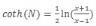' | markdownify }}
{:.image }

AcscH

AcscH function computes inverse hyperbolic cosecant of its argument.

Syntax

x = acsch(y) where:

* x is a complex or real array
* y is a complex or real array
ADDRESS

ADDRESS function returns the address of a cell in a worksheet given specified row and column numbers.

Syntax 

ADDRESS(row_num, column_num, [abs_num], [a1], [sheet_text])

* row_num:A numeric value that specifies the row number.
* column_num:A numeric value that specifies the column number
* abs_num: Optional. A numeric value that specifies the type of reference to return.
* A1: A logical value that specifies the A1 or R1C1 reference style.

Example

_Table 33: Address_

<table>
<tr>
<td>
FORMULA</td><td>
RESULT</td></tr>
<tr>
<td>
=ADDRESS(2,3,2,FALSE)</td><td>
R2C[3].</td></tr>
<tr>
<td>
=ADDRESS(2,3,1,FALSE,"[Book1]Sync1")</td><td>
[Book1] Sync1!R2C3</td></tr>
</table>
AND

Returns True if all the arguments have a logical value of True and returns False if at least one argument is False.

Syntax

AND(_logical1, logical2, ...),_ where:

logical1, logical2, ... are multiple conditions you want to test for True or False.

Remarks

* The arguments must evaluate to logical values (True or False).
* If an argument does not evaluate to True or False, those values are ignored. 
* There must be at least one value in the argument list.
ARABIC

A Roman numeral has been converted to an Arabic numeral.

Syntax:

ARABIC( text ) where text is a string.

Remarks:

* #VALUE! - occurs if text is not a valid value.
* #VALUE! - occurs if text is not a valid Roman numeral.

Value zero occurs if an empty string is given as an input.

AsecH

AsecH function computes element-wise inverse hyperbolic secant of the argument.

Syntax:

x = asech(y) where:

* x is a complex or real array.
* y is a complex or real array.
ASIN

Returns theinverse sine of a number. Inverse sine is also referred to as arcsine. The arcsine is the angle whose sine is the given number. The returned angle is given in radians in the range from -pi/2 to +pi/2.

Syntax

ASIN(_number_), where: number is the sine of the angle that you want and must be between -1 and 1.

ASINH

Returns the inverse hyperbolic sine of a number. The inverse hyperbolic sine is the value whose hyperbolic sine is the given number, so ASINH(SINH(number)) equals number.

Syntax

ASINH(number), where: number is any real number.

ATAN

Returns theinverse tangent of a number. Inverse tangent is also known as arctangent. The arctangent is the angle whose tangent is a number. The returned angle is given in radians in the range from -pi/2 to +pi/2.

Syntax

ATAN(number), where: number is the tangent of the angle that you want.

ATAN2

Returns the inverse tangent of the specified x- and y-coordinates. The arctangent is the angle from the x-axis to a line containing the origin (0, 0) and the point (x_num, y_num). The angle is given in radians between -pi and pi, excluding -pi.

Syntax

ATAN2(_x_num,y_num_), where:

x_num is the X coordinate of the point.

y_num is the Y coordinate of the point.

Remarks

* A positive result represents counterclockwise angle from the x-axis; and negative result represents clockwise angle. 
* ATAN2(a,b) equals ATAN(b/a), except that a can equal 0 in ATAN2.

ATANH

Returns the inverse hyperbolic tangent of a number. Number must be strictly between -1 and 1. The inverse hyperbolic tangent is the value whose hyperbolic tangent is a number, so ATANH(TANH(number)) equals the given number.

Syntax

ATANH(_number_), where: number is any real number that is between 1 and -1.

AVEDEV

Returns the average of absolute mean deviations of data points. AVEDEV is a measure of variability in a data set.

Syntax

AVEDEV(number1, number2, ...), where: number1, number2, ... are arguments for which you want the average of the absolute deviations. You can also use a single array or a reference to an array instead of arguments separated by commas.

Remarks

* The arguments must either be numbers or names, arrays or references that contain numbers. 
* If an array or reference argument contains text, logical values, or empty cells, those values are ignored; however, cells with zero value are included. 
* The equation for average deviation is,

{{ '' | markdownify }}
{:.image }

* where x-bar is the arithmetic mean of the data.

`

AVERAGE

Returns the average (arithmetic mean) of the arguments.

Syntax

AVERAGE(number1, number2, ...), where: number1,number2, ... are numeric arguments for which you want the average.

Remarks

* The arguments must either be numbers or names, arrays or references that contain numbers. 
* If an array or reference argument contains text, logical values, or empty cells, those values are ignored; however, cells with zero value are included.
AVERAGEA

Calculates the average (arithmetic mean) of the values in the list of arguments. In addition to numbers and text logical values such as True and False are also included in the calculation.

Syntax

AVERAGEA(value1, value2, ...), where: value1, value2, ... are cells, ranges of cells, or values for which you want the average.

Remarks

* The arguments must be numbers, names, arrays, or references. 
* Array or reference arguments that contain text evaluate as 0 (zero). If the calculation should not include text values in the average, then use AVERAGE function. 
* Arguments that contain True evaluate as 1; arguments that contain False evaluate as 0 (zero).
AVERAGEIF

AVERAGEIF function finds the average of values in a given array that satisfies the given criteria, and returns the average value of the corresponding values in a second given array.

Syntax 

=AVERAGEIF(range, criteria, average_range)

* range: Array of values to be tested against the given criteria.
* criteria: The condition to be tested in each of the values of the given range.
* average_range: Numeric values to be evaluated against the criteria and averaged.

Notes

* If range is blank or a text value, AVERAGEIF returns the #DIV/0! error value.
* If a cell in criteria is empty, AVERAGEIF treats it as 0 value.
* If no cells in the range meet the criteria, AVERAGEIF returns the #DIV/0! error value.

Example

_Table 34: Input Table_

<table>
<tr>
<td>
</td><td>
A</td><td>
B</td></tr>
<tr>
<td>
1</td><td>
Earning</td><td>
Tax</td></tr>
<tr>
<td>
2</td><td>
100000</td><td>
3000</td></tr>
<tr>
<td>
3</td><td>
200000</td><td>
6000</td></tr>
<tr>
<td>
4</td><td>
300000</td><td>
7500</td></tr>
<tr>
<td>
5</td><td>
400000</td><td>
9000</td></tr>
</table>

<table>
<tr>
<td>
FORMULA</td><td>
RESULT</td></tr>
<tr>
<td>
=AVERAGEIF(B2:B5,"<7000")</td><td>
4500</td></tr>
<tr>
<td>
=AVERAGEIF(A2:A5,">250000")</td><td>
350000</td></tr>
</table>

AVERAGEIFS

AVERAGEIFS function finds the average of values in a given array that satisfies a set of given criteria.

Syntax

= AVERAGEIFS( average_range, criteria_range1, criteria1, [criteria_range2, criteria2], ... )

* average_range: Specific set of values to be averaged if the criteria range meets the provided criteria.
* criteria_range1: Array of values to be tested against the given criteria.
* criteria1: The condition to be tested on each of the values of the given range.

Notes

* If average_range is blank or a text value, AVERAGEIFS returns the #DIV/0! error value.
* If a cell in a criteria range is empty, AVERAGEIFS treats it as a 0 value.
* If cells in average_range cannot be translated into numbers, AVERAGEIFS returns the #DIV/0! error value.

Example

_Table 35: Input Table_

<table>
<tr>
<td>
</td><td>
A</td><td>
B</td><td>
C</td></tr>
<tr>
<td>
1</td><td>
Earning</td><td>
Tax</td><td>
other</td></tr>
<tr>
<td>
2</td><td>
100000</td><td>
3000</td><td>
100</td></tr>
<tr>
<td>
3</td><td>
200000</td><td>
6000</td><td>
200</td></tr>
<tr>
<td>
4</td><td>
300000</td><td>
7500</td><td>
300</td></tr>
<tr>
<td>
5</td><td>
400000</td><td>
9000</td><td>
500</td></tr>
</table>

<table>
<tr>
<td>
FORMULA</td><td>
RESULT</td></tr>
<tr>
<td>
AVERAGEIFS(C2:C5, B2:B5, ">7000", B2:B5, "<10000")</td><td>
400</td></tr>
</table>
AVG

Returns the average (arithmetic mean) of the arguments.

Syntax

AVG(number1, number2, ...), where: number1, number2, ... are numeric arguments for which you want the average.

Remarks

* This method is the same as AVERAGE and is included for compatibility purpose.
BASE

A number has been converted into a text representation with the given radix (base).

Syntax:

BASE(Number, Radix [Min_length]) where:

* Number is the value that you want to convert.
* Radix is the base radix that you want to convert the number into.
* Min_length is the minimum length of the returned string. Min_length is optional.

Remarks:

* #NUM! - occurs if Number, Radix, or Min_length are outside the minimum or maximum constraints.
* #VALUE! - occurs if Number is a non-numeric value.

BigMul

BigMul function gives the full value of multiplying two 32-bit numbers.

Syntax

Math.BigMul(x,y); where:

* x is the first number to multiply
* y is the second nr to multiply.
BINOMDIST

Returns the individual term binomial distribution probability. 

Syntax

BINOMDIST(number_s, trials, probability_s, cumulative), where:

number_s  is the number of successes in trials.

trials is the number of independent trials.

probability_s  is the probability of success on each trial.

Cumulative is a logical value that determines the form of function. If cumulative is True, thenBINOMDIST returns the cumulative distribution, which is the probability that there are at most number_s successes; if False, it returns the probability that there are exactly number_s successes.

Remarks

* Number_s and trials are truncated to integers. 
* Number_s should be >= 0 and <= trials. 
* Probability_s  should be >=0 and <= 1. 
* The binomial probability mass function is,

{{ '' | markdownify }}
{:.image }

where:

{{ '' | markdownify }}
{:.image }

is COMBIN(n,x).

* The cumulative binomial distribution is,

{{ '' | markdownify }}
{:.image }

Binom.Inv

Binom.Inv function returns the smallest value for which the cumulative binomial distribution is greater than or equal to a criterion value.

Syntax:

BINOM.INV(trials,probability_s,alpha) where:

* trials is the number of Bernoulli trials.
* probability_s is the probability of a success on each trial.
* alpha is the criterion value.

Remarks:

* #NUM! - occurs if trials is less than zero.
* #VALUE! - occurs if trials is non-numeric.
* #NUM! - occurs if probability_s is less than zero.
* #NUM! - occurs if probability_s is greater than one.
* #VALUE! - occurs if probability_s is non-numeric.
* #NUM! - occurs if alpha is less than zero.
* #NUM! - occurs if alpha is greater than one.
* #VALUE! - occurs if alpha is non-numeric.
CEILING

Returns number rounded up, away from zero, to the nearest multiple of significance. For example, if you want to avoid using pennies in your prices and your product is priced at $4.82, use the formula =CEILING(4.82,0.05) to round prices up to the nearest nickel.

Syntax

CEILING(number, significance), where:

number is the value you want to round off.

significance is the multiple to which you want to round.

Remarks

* Both values must be numeric. 
* Regardless of the sign of a number, a value is rounded up when adjusted away from zero. If the number is an exact multiple of significance, no rounding occurs.
CEILING.MATH

CEILING.MATH function rounds a number up to the nearest multiple of significance.

Syntax:

CEILING(number, [significance],  [mode]) where:

* number must be less than 9.99E+307 and greater than -2.229E-308.
* significance must be the multiple to which the number is to be rounded.
* mode is for negative numbers, it controls whether the number is rounded towards or away from zero.

CHIDIST

Returns the one-tailed probability of the chi-squared ( ) distribution. The  distribution is associated with a  test. 

Syntax

CHIDIST(x, degrees_freedom), where:

x is the value at which you want to evaluate the distribution.

degrees_freedom is the number of degrees of freedom.

Remarks

* Both arguments should be numeric. 
* degrees_freedom  >= 1 and < 10^10. 
* CHIDIST is calculated as CHIDIST = P(X > x), where X is a  random variable.
CHIINV

Returns the inverse of the one-tailed probability of the chi-squared () distribution. If probability = CHIDIST(x,...), then CHIINV(probability,...) = x. Use this function to compare observed results with expected ones in order to decide whether your original hypothesis is valid.

Syntax

CHIINV(probability, degrees_freedom), where:

probability is a probability associated with the chi-squared distribution.

degrees_freedom is the number of degrees of freedom.

Remarks

* Probability must be >= 0 and <= 1.
* degrees_freedom >=1 and  = 10^10.

Given a value for probability, CHIINV seeks the value x such that CHIDIST(x, degrees_freedom) = probability. Thus, precision of CHIINV depends on precision of CHIDIST. CHIINV uses an iterative search technique.

CHI- TEST

Returns thetest for independence. CHITEST returns the value from chi-squared (c2) distribution for statistic and the appropriate degrees of freedom. 

Syntax

CHITEST(actual_range, expected_range), where:

actual_range is the range of data that contains observations to test against expected values.

expected_range is the range of data that contains the ratio of the product of row totals and column totals to the grand total.

Remarks

* The  test first calculates  statistic using the formula,

{{ '' | markdownify }}
{:.image }

      where:

        Aij = actual frequency in the i-th row, j-th column

        Eij = expected frequency in the i-th row, j-th column

        r = number of rows

        c = number of columns

       A low value of  is an indicator of independence.

The use of CHITEST is most appropriate when Eij's are not too small. Some statisticians suggest that each Eij should be greater than or equal to 5.

CLEAN

CLEAN function is used to remove the non-printable characters from the given text, represented by numbers 0 to 31 of the 7-bit ASCII code.

Syntax

=Clean(Text)

Text: Required. String or text from which to remove nonprintable characters.

Example 

_Table 36: Clean_

<table>
<tr>
<td>
FORMULA</td><td>
RESULT</td></tr>
<tr>
<td>
=Clean(Syncfusion)</td><td>
Syncfusion</td></tr>
<tr>
<td>
= Clean("Text*")</td><td>
Text</td></tr>
</table>
COMBIN

Returns the number of combinations for a given number of items. Use COMBIN to determine the total possible number of groups for a given number of items.

Syntax

COMBIN(number, number_chosen), where:

number is the number of items.

number_chosen is the number of items in each combination.

Remarks

* Numeric arguments are truncated to integers. 
* A combination is any set or subset of items, regardless of their internal order. Combinations are distinct from permutations where the internal order is significant. 
* The number of combinations is as follows, where number = n and number_chosen = k,

{{ '' | markdownify }}
{:.image }

where:

{{ '' | markdownify }}
{:.image }

COMBINA

For a given number of items, COMBINA function returns the number of combinations (with reputations).

Syntax

COMBINA(number1, number2) where:

* number 1 is greater than equal to zero and greater than equal to number2
* number 2 is greater than equal to zero.

Remarks:

* #NUM! - occurs if either value is outside its constraints
* #VALUE! - occurs if either value is non-numeric.

The following equation is used:

{{ '' | markdownify }}
{:.image }

CONCATENATE

Joins several text strings into one text string.

Syntax

CONCATENATE (text1, text2, ...), where: text1, text2, ... are text items to be joined into a single text item. The text items can be text strings, numbers, or single-cell references.

Remarks

* The "&" operator can be used instead of CONCATENATE to join text items.
CONFIDENCE

Returns a value that you can use to construct a confidence interval about population mean. The confidence interval is a range of values. In your sample, mean x is at the center of this range and the range is x ± CONFIDENCE. For example, if x is the sample mean of delivery times for products ordered through the mail, x ± CONFIDENCE is a range of population means. 

Syntax

CONFIDENCE(alpha, standard_dev, size), where:

alpha is the significance level used to compute the confidence level. The confidence level equals 100*(1 - alpha)%, or in other words, an alpha of 0.05 indicates a 95 percent confidence level.

standard_dev is the population standard deviation for the data range and is assumed to be known.

size is the sample size.

Remarks

* All arguments must be non-numeric.
* Alpha must be > 0 and < 1.
* Standard_dev must be > 0.
* Size must be >= 1.

CONFIDENCE.T

Using a student’s distribution, this function retrieves the confidence interval for a population mean.

Syntax

CONFIDENCE.T(alpha,standard_dev,size) where:

* alpha is the significance level used to compute the confidence level.
* standard_dev is the population standard deviation for data range and is assumed to be known.
* size is the sample size.

Remarks:

* #VALUE! - occurs if any argument is non-numeric.
* #NUM! - occurs if alpha is less than or equal to zero or if alpha is greater than or equal to zero.
* #NUM! - occurs if standard_dev is less than or equal to zero.
* #DIV/0! - occurs if the size is equal to one.
CORREL

Returns the correlation coefficient of the array1 and array2 cell ranges. 

Syntax

CORREL(array1, array2), where:

array1 is a cell range of values.

array2 is the second cell range of values.

Remarks

* array1 and array2 must have the same number of data points.
* The equation for correlation coefficient is,

{{ '' | markdownify }}
{:.image }

where x-bar and y-bar are the sample means AVERAGE(array1) and AVERAGE(array2).

COS

Returns the cosine of the given angle.

Syntax

COS(number), where: number is the angle in radians for which you want the cosine.

COSH

Returns the hyperbolic cosine of a number.

Syntax

COSH(number), where: number is any real number for which you want to find the hyperbolic cosine.

Remarks

The formula for the hyperbolic cosine is,

{{ '' | markdownify }}
{:.image }

COT

COT function returns the cotangent of an angle specified in radians.

Syntax:

COT(number) where: number – the angle radians for which you want the secant.

Remarks

* #NUM! - occurs if the number is outside its constraints.
* #VALUE! - occurs if the number is a non-numeric value.
COTH

COTH function returns the hyperbolic cotangent of a hyperbolic angle.

Syntax

COTH(number) where: number – the angle radians for which you want the secant.

Remarks

* #NUM! - occurs if the number is outside of its constraints.
* #VALUE! - occurs if the number is a non-numeric value.

The following equation is used:

{{ '' | markdownify }}
{:.image }

COUNT

Counts the number of items in a list that contains numbers. 

Syntax

COUNT(value1,value2, ...), where: value1, value2, ... are arguments that can contain or refer to a variety of different types of data, but only numbers are counted.

Remarks

* Arguments that are numbers, dates, or text representations of numbers are counted; arguments that are error values or text that cannot be translated into numbers are ignored.
* If an argument is an array or reference, only numbers in that array or reference are counted. Empty cells, logical values, text, or error values in the array or reference are ignored.
COUNTA

Counts the number of cells that are not empty.

Syntax

COUNTA(value1, value2, ...), where: value1, value2, ... are arguments representing the values you want to count. In this case, a value is any type of information excluding empty cells.

COUNTBLANK

Counts empty cells in a specified range of cells.

Syntax

COUNTBLANK(range), where: range is the range from which you want to count the blank cells.

Remark

* Cells with formulas that return "" (empty text) are also counted. Cells with zero values are not counted.
COUNTIF

Counts the number of cells within a range that meet the given criteria.

Syntax

COUNTIF(range, criteria), where:

range is the range of cells from which you want to count cells.

criteria is the criteria in the form of a number, expression or text that defines which cells will be counted. For example, the criteria can be expressed as ">32".

Remark

* If and SumIf are other library functions that can be used to conditionally compute values.
COVAR

Returns covariance, the average of the products of deviations for each data point pair. 

Syntax

COVAR(array1, array2), where:

array1 is the first cell range of numbers.

array2 is the second cell range of numbers.

Remarks

* The arguments must either be numbers or names, arrays or references that contain numbers. 
* array1 and array2 must have the same number of data points. 
* The covariance is,

{{ '' | markdownify }}
{:.image }

where X is array1, Y is array2, x-bar and y-bar are the sample means AVERAGE(array1) and AVERAGE(array2) and n is the sample size.

COVARIANCE.P

COVARIANCE.P function retrieves population covariance, the average of the products of deviations for each data point pair in two data sets.

Syntax

COVARIANCE.P(array1,array2) where:

* array1 is the first cell range of integers.
* array2 is the second cell range of integers.

Remarks

#N/A - occurs if arguments have a different number of data points.

The covariance is:

{{ '' | markdownify }}
{:.image }

_

where x and y are the sample means, AVERAGE(array1) and AVERAGE(array2), and n is the sample size.

COVARIANCE.S

COVARIANCE.S function returns the sample covariance, the average of the products of deviations for each data point pair in two data sets.

Syntax

COVARIANCE.S(array1,array2) where:

* array1 is the first cell range of integers.
* array2 is the second cell range of integers.

Remarks

* #N/A - occurs when values are different number of data points.
* #DIV/0! - occurs if either array1 or array2 is empty or contain only one data point each.
CRITBINOM

Returns the smallest value for which, the cumulative binomial distribution is greater than or equal to a criterion value.

Syntax

CRITBINOM(trials, probability_s, alpha), where:

trials is the number of Bernoulli trials.

probability_s is the probability of a success on each trial.

alpha is the criterion value.

Remarks

* Trials must be >= 0. 
* Probability_s must be >=0 and <= 1. 
* Alpha must be >= 0 and <= 1.
CSC

CSC function returns the cosecant of an angle specified in radians.

Syntax

CSC(number) where: number – the angle radians for which you want the secant.

Remarks

* #NUM! - occurs if the number is outside its constraints.
* #VALUE! - occurs if the number is a non-numeric value.
CSCH

CSCH function returns the hyperbolic cosecant of an angle specified in radians.

Syntax

CSCH(number) where: number – the angle radians for which you want the secant.

Remarks

* #NUM! - occurs if the number is outside its constraints.
* #VALUE! - occurs if the number is a non-numeric value.
CUMIPMT

Returns the Macaulay duration for an assumed par value of $100. Duration is defined as the weighted average of the present value of cash flows and is used as a measure of a bond price's response to changes in yield.

Syntax

DURATION(settlement,maturity,coupon,yld,frequency,basis) where:

* Settlement - security’s settlement date.
* Maturity - security’s maturity date.
* Coupon – annual coupon rate
* Yld – security’s annual yield.
* Frequency – number of coupon payments per year.
* Basis – type of day count basis.

Remarks

* #VALUE! – occurs if settlement or maturity is not a valid date.
* #NUM! – occurs if coupon < 0 or yld < 0
* # NUM! – occurs if frequency number is other than 1,2 and 4
* # NUM! – occurs if basis is less than 0 and greater than 4
* # NUM! – occurs if settlement is >= Maturity
CUMPRINC

CUMPRINC function returns the cumulative principal paid on a loan between the start_period and end_period.

Syntax

CUMPRINC(rate, nper, pv, start_period, end_period, type) where:

* Rate – the interest rate.
* Nper - total number of payment periods
* pv - present value.
* start_period - first period in calculation. Brgind with one.
* end_period - last period in calculation.
* type - timing of the payment.

Remarks

* #NUM! - occurs if rate,nper or pv is less than or equals zero.
* #NUM! - occurs if start_period or end_period is less than one
* #NUM! - occurs if start_period is greater than end_period.
* #NUM! - occurs if type is any number other than 0 or 1
DATE

Returns the sequential serial number that represents a particular date. 

Syntax

DATE(year, month, day), where: year can be one to four digits. Year is interpreted based on 1900.

* If a year is between 0 (zero) and 1899 (inclusive), the value is added to 1900 to calculate the year. For example, DATE(102,11,12) returns November 12, 2002 (1900+102).
* If a year is between 1900 and 9999 (inclusive), the value is used as is, for example, DATE(2002,11,12) returns November 12, 2002.

month is a number representing the month of the year. 

day is a number representing the day of the month.

Remark

* Dates are stored as sequential serial numbers so that they can be used in calculations. By default, January 1, 1900 is serial number 1 and November 12, 2002 is serial number 37572 because it is 37572 days after January 1, 1900.
DATEVALUE

Returns theserial number of the date represented by date_text. 

Syntax

DATEVALUE(date_text), where: date_text is the text that represents a date as a formatted string. For example, "11/12/2002" or "12-Nov-2002" are text strings within quotation marks that represent dates. If the year portion of the date_text is omitted, DATEVALUE uses current year from your computer's built-in clock. The time information in the date_text is ignored.

Remarks

* Dates are stored as sequential serial numbers so that they can be used in calculations. By default, January 1, 1900 is serial number 1, and November 12, 2002 is serial number 37572 because it is 37572 days after January 1, 1900. 
* Most functions automatically convert date values to serial numbers.
DAVERAGE

DAVERAGE function finds the average values in a column of a list or database that matches the conditions that have been specified.

Syntax

DAVERAGE(database,field,criteria) where:

* database is the range of cells that makes up the list or database
* field indicates which column is used in the function
* criteria is the range of cells that contains the conditions you specify.

DAY

Returns the day of a date represented by a serial number. The day is given as an integer ranging from 1 to 31.

Syntax

DAY(serial_number), where: serial_number is the date of the day you are trying to find. Dates should be entered by using the DATE function or as results of other formulas or functions. For example, use DATE(2002,4,23) for the 23rd day of April, 2002.

DAYS360

Returns the number of days between two dates based on a 360-day year (twelve 30-day months) which is used in some accounting calculations. 

Syntax

DAYS360(start_date, end_date, method), where: start_date and end_date are the two dates between which you want to know the number of days. If start_date occurs after end_date, DAYS360 returns a negative number. Dates should be entered by using the DATE function or as results of other formulas or functions. 

method is a logical value that specifies whether to use the U.S. or European method in calculation.

If method is:

* False or omitted – The calculation uses the U.S. (NASD) method. If the starting date is the 31st of a month, it becomes equal to the 30th of the same month. If the ending date is the 31st of a month and the starting date is earlier than the 30th of a month, the ending date becomes equal to the 1st of the next month; otherwise the ending date becomes equal to the 30th of the same month.
* True – The calculation uses the European method. Starting dates and ending dates that occur on the 31st of a month become equal to the 30th of the same month.
DB

Returns thedepreciation of an asset for a specified period using thefixed-declining balance method.

Syntax

DB(cost, salvage, life, period, month), where:

cost is the initial cost of the asset.

salvage is the value at the end of the depreciation (sometimes called the salvage value of the asset).

life is the number of periods over which the asset is being depreciated (sometimes called the useful life of the asset).

period is the period for which you want to calculate the depreciation. Period must use the same units as life.

month is the number of months in the first year. If month is omitted, it is assumed to be 12.

Remarks

* The fixed-declining balance method computes the depreciation at a fixed rate. DB uses the following formulas to calculate the depreciation for a period,

(cost - total depreciation from prior periods) * rate

where rate = 1 - ((salvage / cost) ^ (1 / life)), rounded to three decimal places.

* Depreciation for the first and last periods is a special case. For the first period, DB uses this formula,

cost * rate * month / 12

* For the last period, DB uses this formula,

((cost - total depreciation from prior periods) * rate * (12 - month)) / 12

DCOUNT

DCOUNT function counts the number of cells that contain numbers in a column of a list or database, which matches the conditions specified.

Syntax

DCOUNT(database, field,criteria ) where:

* database is the range of cells that makes up the list or database
* field indicates which column is used in the function
* criteria is the range of cells that contains the conditions you specify.
DCOUNTA

DCOUNTA function counts the number of nonblank cells in a column of a list or database that matches the conditions specified.

Syntax

DCOUNTA(database, field, criteria) where:

* database is the range of cells that makes up the list or database.
* field indicates which column is used in the function.
* criteria is the range of cells that contains the conditions you specify.
DDB

Returns the depreciation of an asset for a specified period using double-declining balance method or some other method you specify.

Syntax

DDB(cost, salvage, life, period, factor), where:

cost is the initial cost of the asset.

salvage is the value at the end of depreciation (sometimes called the salvage value of the asset).

life is the number of periods over which the asset is being depreciated (sometimes called the useful life of the asset).

period is the period for which you want to calculate the depreciation. Period must use the same units as life.

factor is the rate at which the balance declines. If factor is omitted, it is assumed to be 2 (the double-declining balance method).

> {{ '' | markdownify }}
{:.image }
_Note: All five arguments must be positive numbers._

Remarks

* The double-declining balance method computes the depreciation at an accelerated rate. Depreciation is highest in the first period and decreases in successive periods. DDB uses the following formula to calculate depreciation for a period,

((cost-salvage) - total depreciation from prior periods) * (factor/life)

DECIMAL

A text representation of a number in a given base has been converted into a decimal number.

Syntax

DECIMAL(text, radix) where:

* text is a string.
* radix is an integer.

Remarks

#NUM! or #VALUE! - occurs if text or radix is outside the constraints.

DEGREES

Converts radians into degrees.

Syntax

DEGREES(angle), where: angle is the angle in radians that you want to convert.

DEVSQ

Returns the sum of squares of deviations of data points from their sample mean.

Syntax

DEVSQ(number1, number2, ...), where: number1, number2, ... are arguments for which you want to calculate the sum of squared deviations. You can also use a single array or a reference to an array instead of arguments separated by commas.

Remarks

* The arguments must be numbers or names, arrays or references that contain numbers. 
* The equation for the sum of squared deviations is,

{{ '' | markdownify }}
{:.image }

DGET

DGET function extracts a single value from a column of a list or database that matches the conditions specified.

Syntax

DGET(database,field,criteria) where:

* database is the range of cells that makes up the list or database.
* _field_ indicates which column is used in the function.
* criteria is the range of cells that contains the conditions you specify.

Disc

Disc function returns the discount rate for a security.

Syntax

Disc(Arg1, Arg2, Arg3, Arg4, Arg5) where:

* Arg1 represents the security’s settlement date.
* Arg2 represents the security’s maturity date.
* Arg3 represents the security’ price per $100 face value.
* Arg4 represents the security’s redemption value.
* Arg5 represents the type of day count basis to use.
DivRem

DivRem function calculates the quotient of two numbers and also returns the remainder in an output parameter.

Syntax

Math.DivRem(a,b) where: a and b are integers.

DMAX

DMAX function returns the largest number in a column of a list or database,which matches the conditions specified.

Syntax

DMAX(database,field,criteria) where:

* database is the range of cells that makes up the list or database.
* field indicates which column is used in the function.
* criteria is the range of cells that contains the conditions you specify.
DMIN

DMIN function returns the smallest number in a column of a list or database, which matches the conditions specified.

Syntax

DMIN(database,field,criteria) where:

* database is the range of cells that makes up the list or database.
* field indicates which column is used in the function.
* criteria is the range of cells that contains the conditions you specify.
Dollar

Dollar function converts a number to text, using currency format. 

The format used is $#,##0.00_);($#,##0.00). 

Syntax

Dollar (number, decimal_places) where:

number is the number, which you want to convert to text.

decimal_places is the number of decimal digits to be displayed. The value will be rounded off accordingly.

DollarDe

A dollar price expressed as a fraction will be converted into a dollar price expressed as a decimal number.

Syntax

DOLLARDE(object arg1, object arg2) where:

* Arg1 is a number expressed as a fraction.
* Arg2 is an integer to use in the denominator of the fraction.

Remarks

* #NUM! - Occurs if the fraction is less than 0.
* #DIV/0! - Occurs if the fraction is equal to 0.
DollarFr

Dollar price expressed as a decimal number will be converted into a dollar price expressed as a fraction.

Syntax

DOLLARFR (object arg1,object arg2) where:

arg1 is a decimal number.

arg2 is an integer to use in the denominator of a fraction.

Remarks:

* #NUM! - Occurs if the fraction is less than 0.
* #DIV/0! - Occurs if the fraction is 0.
DSTDEV

DSTDEV function estimates the standard deviation of population based on a sample by using the numbers in a column of a list or database that matches the conditions specified.

Syntax

DSTDEV(database, field, criteria) where:

* database is the range of cells that makes up the list or database.
* field indicates which column is used in the function.
* criteria is the range of cells that contains the conditions you specify.
DSTDEVP

DSTDEVP function calculates the standard deviation of population based on the entire population using numbers in a column of a list or database that matches the conditions specified.

Syntax

DSTDEVP(database,field,criteria) where:

* database is the range of cells that makes up the list or database.
* field indicates which column is used in the function.
* criteria is the range of cells that contains the conditions you specify.
DSUM

DSUM function adds the numbers in a field (column) of records in a list or database that matches the conditions specified.

Syntax

DSUM(database, field, criteria) where:

* database is the range of cells that makes up the list or database.
* field indicates which column is used in the function.
* criteria is the range of cells that contains the conditions you specify.
Duration

Returns the annual duration of a security with periodic interest payments.

Syntax

Duration (settlement, maturity, coupon, yld, frequency, basis) where:

* Settlement – a security’s settlement date.
* Maturity – a security’s maturity date.
* Coupon – the annual coupon rate.
* Yld – security’s annual yield.
* Frequency – the number of coupon payments per year.
* Basis – the type of day count basis.
DVAR

DVAR function estimates the variance of population based on a sample by using the numbers in a column of a list or database which matches the conditions specified.

Syntax

VAR(database,field,criteria) where:

* database is the range of cells that makes up the list or database.
* field indicates which column is used in the function.
* criteria is the range of cells that contains the conditions you specify.
DVARP

DVARP function calculates the variance of population based on the entire population by using numbers in a column of a list or database which matches the conditions specified.

Syntax

DVARP(database,field,criteria) where:

* database is the range of cells that makes up the list or database.
* field indicates which column is used in the function.
* criteria is the range of cells that contains the conditions you specify.
EVEN

Returns the numberrounded upto thenearest even integer.

Syntax

EVEN(number), where: number is the value that is to be rounded.

Remarks

* Regardless of the sign of the number, a value is rounded up when adjusted away from zero. If the number is an even integer, no rounding occurs.
ERROR.TYPE

The Error.Type function returns an integer for the given error value that denotes the type of given error.

Syntax

= ERROR.TYPE(value)

The given value is required.

Here is the return value of function:

_Table 37: Return value of function_

<table>
<tr>
<td>
GIVEN VALUE</td><td>
RETURN VALUE OF FUNCTION</td></tr>
<tr>
<td>
#NULL!</td><td>
1</td></tr>
<tr>
<td>
#DIV/0!</td><td>
2</td></tr>
<tr>
<td>
#VALUE!</td><td>
3</td></tr>
<tr>
<td>
#REF!</td><td>
4</td></tr>
<tr>
<td>
#NAME?</td><td>
5</td></tr>
<tr>
<td>
#NUM!</td><td>
6</td></tr>
<tr>
<td>
#N/A</td><td>
7</td></tr>
<tr>
<td>
#GETTING_DATA</td><td>
8</td></tr>
<tr>
<td>
Anything else</td><td>
#N/A</td></tr>
</table>

Example:

<table>
<tr>
<td>
FORMULA</td><td>
RESULT</td></tr>
<tr>
<td>
= ERROR.TYPE(#NULL!) </td><td>
1</td></tr>
<tr>
<td>
= ERROR.TYPE(even)</td><td>
#NA</td></tr>
</table>
EXP

Returns e raised to the power of the given number.

Syntax

EXP(number), where: number is the exponent applied to the base e.

EXPONDIST

Returns the exponential distribution. 

Syntax

EXPONDIST(x, lambda, cumulative), where:

x is the value of the function.

lambda is the parameter value.

cumulative is a logical value that indicates which form of the exponential function is to be provided. If cumulative is True, EXPONDIST returns the cumulative distribution function; if False, it returns the probability density function.

Remarks

The equation for the probability density function is,

{{ '' | markdownify }}
{:.image }

* The equation for the cumulative distribution function is,

{{ '' | markdownify }}
{:.image }

* #NUM! - occurs if x is less than zero.
* #VALUE! - occurs if x is  is non-numeric.
* #VALUE! - occurs if lambda is  is non-numeric.
* #NUM!- occurs if lambda is equal to or less than zero.
FACT

Returns the factorial of a number. The factorial of a number is the product of all positive integers <= the given number.

Syntax

FACT(number), where: number is the non-negative number for which you want the factorial. If the number is not an integer, it is truncated.

FACTDOUBLE

FACTDOUBLE function returns the double factorial of a given value. The given value must be an integer value.

Syntax

= FACTDOUBLE (number) where: number – Required.

Remarks

* #NUM! - If the number is less than zero (0).
* #VALUE! - Occurs if any of the given argument is non-numeric.

Example:

_Table 38: Double factorial_

<table>
<tr>
<td>
FORMULA</td><td>
RESULT</td></tr>
<tr>
<td>
= FACTDOUBLE (6)</td><td>
48</td></tr>
<tr>
<td>
= FACTDOUBLE (-2)</td><td>
#NUM!</td></tr>
</table>

False

False function returns logical value when the given sting value is false.

Syntax

False(stringvalue) where: stringvalue is to provide any text value or empty string.

FDIST

Returns theF probability distribution.

Syntax

FDIST(x, degrees_freedom1, degrees_freedom2), where:

x is the value at which to evaluate the function.

degrees_freedom1 is the numerator degrees of freedom.

degrees_freedom2 is the denominator degrees of freedom.

Remarks

* All arguments must be numeric. 
* X must be >= 0. 
* Both degrees_freedom1 and degrees_freedom2 must be >= 1 and < 10^10. 
* FDIST is calculated as FDIST=P( F>x ), where F is a random variable that has an F distribution with degrees_freedom1 and degrees_freedom2 degrees of freedom.
Finv 

 Finv function returns the inverse of F probability distribution. If p = FDIST(x,...), then FINV(p,...) = x. By using F distribution, you can compare the degree of variability for two data sets. 

Syntax

FINV(probability,deg_freedom1,deg_freedom2)

FINV function syntax has the following three arguments (Argument is a value that provides information to an action, an event, a method, a property, a function, or a procedure):

Probability is a probability associated with F cumulative distribution.

Deg_freedom1 is the numerator degrees of freedom.

Deg_freedom2 is the denominator degrees of freedom.

Remarks

* #NUM! - occurs if probability is equal to or less than zero.
* #NUM! - occurs if probability is equal to or greater than 1.
* #VALUE! - occurs if probability is non-numeric.
* #NUM! - occurs if deg_freedom1 is less than one.
* #VALUE! - occurs if deg_freedom1 is non-numeric.
* #NUM! - occurs if deg_freedom2 is less than one.
* #VALUE! - occurs if deg_freedom2 is non-numeric.
F.Inv.Rt

F.Inv.Rt function returns the inverse of F probability distribution.

Syntax

F.INV.RT(probability,deg_freedom1,deg_freedom2) where:

* probability is a probability that corresponds to normal distribution.
* deg_freedom1 is the numerator degrees of freedom.
* deg_freedom2 is the denominator degrees of freedom.

Remarks

* #NUM! - occurs if probability is equal to or less than zero.
* #NUM! - occurs if probability is equal to or greater than 1.
* #VALUE! - occurs if probability is non-numeric.
* #NUM! - occurs if deg_freedom1 is less than one.
* #VALUE! - occurs if deg_freedom1 is non-numeric.
* #NUM! - occurs if deg_freedom2 is less than one.
* #VALUE! - occurs if deg_freedom2 is non-numeric.
FISHER

Returns Fisher transformation at x. This transformation produces a function that is normally distributed rather than skewed. 

Syntax

FISHER(x), where: x is a numeric value for which you want the transformation.

Remarks

* X must be > -1 and < 1.
* The equation for the Fisher transformation is,

{{ '' | markdownify }}
{:.image }

FISHERINV

Returns the inverse of Fisher transformation. If y = FISHER(x), then FISHERINV(y) = x.

Syntax

FISHERINV(y), where: y is the value for which you want to perform the inverse of the transformation.

Remarks

* The equation for the inverse of the Fisher transformation is,

{{ '' | markdownify }}
{:.image }

Fixed

Fixed function rounds off the given value to a specified number of decimal places and returns the value in text format.

Syntax

Fixed (number, decimal_places, no_commas) where:

number is the number, which you want to round off.

decimal_places is the number of decimal places you want to display in the result.

no_commas is a logical value. It will display commas when it is set to FALSE and does not display commas when it is set to TRUE.

FLOOR

Rounds off the given number down towards zero to the nearest multiple of significance.

Syntax

FLOOR(number, significance), where: 

number is the numeric value that you want to round off.

significance is the multiple to which you want to round off the number.

Remarks

* Number and significance must have the same sign. 
* Regardless of the sign of the number, a value is rounded down when adjusted away from zero. If a number is an exact multiple of significance, no rounding occurs.
FORECAST

Calculates future value with existing values by using linear regression. The predicted value is y-value for a given x-value. 

Syntax

FORECAST(x, known_ys, known_xs), where:

x is the data point for which you want to predict a value.

known_ys is the dependent array or range of data.

known_xs is the independent array or range of data.

Remarks

* The equation for FORECAST is a+bx,

 where

{{ '' | markdownify }}
{:.image }

and

{{ '' | markdownify }}
{:.image }

and 

x-bar and y-bar are sample means AVERAGE(known_xs) and AVERAGE(known_ys).

FV

Returns thefuture value of an investment based on periodic, constant payments and interest rate.

Syntax

FV(rate, nper, pmt, pv, type), where:

rate is the interest rate per period.

nper is the total number of payment periods in an annuity.

pmt is the payment made each period; it cannot change over the life of the annuity. Typically, pmt contains principal and interest, but no other fees or taxes. If pmt is omitted, you must include the pv argument.

pv is the present value or lump-sum amount that a series of future payments is worth right now. If pv is omitted, it is assumed to be 0 (zero), and you must include the pmt argument.

type is the number 0 or 1 and indicates when payments are due. If type is omitted it is assumed to be 0. If type equals:

* 0 - Payments are due at the end of the period.
* 1 - Payments are due at the beginning of the period.
> 
{{ '' | markdownify }}
{:.image }
_Note: For a more complete description of the arguments in FV, see PV._

Remarks

* Make sure that you are consistent about the units you use for specifying rate and nper. If you make monthly payments for four-year loan at 12 percent annual interest, use 12%/12 for rate and 4*12 for nper. If you make annual payments on the same loan, use 12% for rate and 4 for nper. 
* For all the arguments, cash you pay out such as deposits to savings is represented by negative numbers; cash you receive, such as dividend checks is represented by positive numbers.
Fvschedule

After applying a series of compound interest rates, Fvschedule method returns future value of the initial principle.

Syntax

FVSchedule(arg1,arg2) where:

* Arg1 is the present value.
* Arg2 is an array of interest rates to apply.

Remarks

#VALUE! – occurs any other than numbers or blank cells.

GAMMADIST

Returns thegamma distribution. 

Syntax

GAMMADIST(x, alpha, beta, cumulative), where:

x is the value at which you want to evaluate distribution.

alpha is a parameter to distribution.

beta is a parameter to distribution. If beta = 1, GAMMADIST returns the standard gamma distribution.

cumulative is a logical value that determines the form of the function. If cumulative is True, GAMMADIST returns the cumulative distribution function; if False, it returns the probability density function.

Remarks

* X must be >=  0. 
* Alpha and beta must be > 0. 
* The equation for the gamma probability density function is,

{{ '' | markdownify }}
{:.image }

The standard gamma probability density function is,

{{ '' | markdownify }}
{:.image }

When alpha = 1, GAMMADIST returns the exponential distribution with,

{{ '' | markdownify }}
{:.image }

* #NUM! - occurs if x is less than zero.
* #VALUE! - occurs if x is non-numeric.
* #VALUE! - occurs if alpha is non-numeric.
* #NUM!- occurs if alpha is equal to or less than zero.
* #VALUE! - occurs if beta is non-numeric. 
* #NUM! - occurs if beta  is equal to or less than zero.
GAMMALN

Returns the natural logarithm of the gamma function, Ã(x).

Syntax

GAMMALN(x), where: x is the value for which you want to calculate GAMMALN.

Remarks

* x must be positive.
* GAMMALN is calculated as follows,

{{ '' | markdownify }}
{:.image }

where:

{{ '' | markdownify }}
{:.image }

GAMMAINV

Returns theinverse of the gamma cumulative distribution. If p = GAMMADIST(x,...), then GAMMAINV(p,...) = x.

Syntax

GAMMAINV(probability, alpha, beta), where:

probability is the probability associated with the gamma distribution.

alpha is a parameter to the distribution.

beta is a parameter to the distribution.

Remarks

* Probability must be >= 0 and <= 1. 
* Alpha and beta must be positive. 

Given a value for probability, GAMMAINV seeks value x such that GAMMADIST(x, alpha, beta, True) = probability. Thus, precision of GAMMAINV depends on the precision of GAMMADIST. GAMMAINV uses an iterative search technique.

GCD

The GCD function returns the greatest common divisor of two or more given values. The values must be a numeric value.

Syntax

The syntax of the GCD function is

= GCD (number1, number2, ...)

Number1 – Required. 

If any value is not an integer, then it will be rounded down.

Remarks:

* #NUM!	 -	 If the number is less than zero (0).
* #VALUE! -	 Occurs if any of the given argument is non-numeric.

Example:

_Table 39: GCD_

<table>
<tr>
<td>
FORMULA</td><td>
RESULT</td></tr>
<tr>
<td>
= GCD (5,3,2)</td><td>
1</td></tr>
<tr>
<td>
= GCD (-2)</td><td>
#NUM!</td></tr>
</table>

EOMEAN

Returns the geometric mean of an array or range of positive data. 

Syntax

GEOMEAN(number1, number2, ...), where: number1, number2, ... are arguments for which you want to calculate the mean. 

Remarks

* The arguments must be either numbers or names, arrays or references that contain numbers. 
* All values must be positive. 
* The equation for the geometric mean is,

{{ '' | markdownify }}
{:.image }

Growth

Growth enables you to calculate predicted exponential growth by using existing data.  This calculates and returns an array of values used for regression analysis.

_Table_ _4_0: Method Table_

<table>
<tr>
<th>
METHOD </th><th>
DESCRIPTION </th><th>
PARAMETERS </th><th>
TYPE </th><th>
RETURN TYPE </th><th>
REFERENCE LINKS </th></tr>
<tr>
<th>
Growth() </th><th>
Calculates the Growth for an array of cells.</th><th>
Known y’s, Known x’s, new_x's</th><th>
Method </th><th>
String </th><th>
N/A </th></tr>
</table>
The following is the formula to calculate Growth for an array of cells in a column:

[Syntax]

=GROWTH(known_y's, [known_x's], [new_x's], where

known_y's: A set of y-values you already know in a relationship, where y = b*m^x.

known_x's: An optional set of x-values that you may already know in the relationship, where y = b*m^x.

new_x's: New x-values for which you want GROWTH to return corresponding y-values.

[Code]

=Growth(B2:B7,A2:A7,C6:C7) 

HARMEAN

Returns the harmonic mean of a data set. The harmonic mean is the reciprocal of arithmetic mean of reciprocals.

Syntax

HARMEAN(number1, number2, ...), where: number1, number2, ... are arguments for which you want to calculate the mean. 

Remarks

* The arguments must either be numbers or names, arrays or references that contain numbers. 
* All data values must be positive. 
* The equation for the harmonic mean is,

{{ '' | markdownify }}
{:.image }

HOUR

Returns the hour of a time value. The hour is given as an integer, ranging from 0 (12:00 A.M.) to 23 (11:00 P.M.).

Syntax

HOUR(serial_number), where: serial_number is the time that contains the hour you want to find. Times may be entered as text strings within quotation marks (for example, "6:00 PM"), as decimal numbers (for example, 0.75, which represents 6:00 PM), or as results of other formulas or functions (for example, TIMEVALUE("6:00 PM")).

HYPGEOMDIST

Returns the hypergeometric distribution. HYPGEOMDIST returns the probability of a given number of sample successes, given the sample size, population successes and population size. 

Syntax

HYPGEOMDIST(sample_s, number_sample, population_s, number_population), where:

sample_s is the number of successes in the sample.

number_sample is the size of the sample.

population_s is the number of successes in the population.

number_population is the population size.

Remarks

* All arguments are truncated to integers. 
* sample_s must be >= 0 less than both number_sample and population_s. 
* number_sample must be >= 0 and < number_population. 
* population_s must be >= 0 and < number_population.
* number_population must b >= 0. 
* The equation for the hypergeometric distribution is,

{{ '' | markdownify }}
{:.image }

where:

x = sample_s

n = number_sample

M = population_s

N = number_population

IEEERemainder

IEEERemainder function returns the remainder operation on two arguments.

Syntax

IEEEremainder(d1, d2) where:

* d1 is the divisor. 
* d2 is the dividend.
IF

Returns one value if a condition you specify evaluates to True and another value if it evaluates to False. Use IF to conduct conditional tests on values and formulas.

Syntax

IF(logical_test, value_if_true, value_if_false), where:

logical_test is any value or expression that can be evaluated to True or False. 

value_if_true is the value that is returned if a logical_test is True.

value_if_false is the value that is returned if a logical_test is False. 

Remarks

* Countif and Sumif are additional methods that provide conditional calculations.
IFERROR

IFERROR function tests if an initial given value (or expression) returns an error, and if so, this function returns a second given argument. Otherwise, the function returns the initial tested value.

Syntax

= IFERROR (value, value_error) where:

value –This is a value to check the error.

value_error –This value will be returned if the value has an error.

Remarks

If the value_error is an empty cell, then the function takes the error value as empty string.

Example:

_Table 41: Error_

<table>
<tr>
<td>
FORMULA</td><td>
RESULT</td></tr>
<tr>
<td>
= IFERROR (200/55, “ERROR in DIVISION”)</td><td>
3</td></tr>
<tr>
<td>
= IFERROR (200/0, “ERROR in DIVISION”)</td><td>
ERROR in DIVISION</td></tr>
</table>
IFNA 

IFNA function returns the value specified if the formula returns #N/A error value; otherwise, it returns the result of the given formula.

Syntax

=IFNA (Formula_value, value_if_na) where:

Formula_value - The argument that is checked for the #N/A error value.

value_if_na -The value returned if the formula evaluates to the #N/A error value.

Example 

_Table 42: IFNA_

<table>
<tr>
<td>
FORMULA</td><td>
RESULT</td></tr>
<tr>
<td>
=IFNA(“#N/A”,”Incorrect”)</td><td>
Incorrect</td></tr>
<tr>
<td>
=IFNA(1602,”incorrect”)</td><td>
1602</td></tr>
</table>
Index

The Index function returns the exact cell value from the provided row index and column index from a specific range of cells.

Syntax

Index(range,row,col) where:

range is a string to mention the specific range.

row is the integer that indicates the specific row index.

col is the integer that indicates the specific column index.

Indirect

The Indirect function returns the reference as a string instead of providing the content or range within the cell.

Syntax

Indirect(content), where: content is the string that provides the textual representation of the cell reference.

INT

Rounds a number down to the nearest integer.

Syntax

INT(number), where: number is the real number that you want to round down to an integer.

INTRATE

Intrate function returns the interest rate for a fully invested security.

Syntax

INTRATE(settlement, maturity, investment, redemption, basis ) where:

* settlement is the security's settlement date.
* maturity is the security's maturity date.
* investment is the amount invested in the security.
* redemption is the amount to be received at maturity.
* basis is the kind of day count basis to use.

Remarks

* #NUM! - occurs if settlement is greater than or equal to maturity.
* #VALUE! - occurs if a valid date is not given for the settlement.
* #VALUE! - occurs if a valid date is not given for maturity.
* #NUM! - occurs if investment is less than or equal to zero.
* #NUM! - occurs if redemption is less than or equal to zero.
INTERCEPT

Calculates the point at which the least squares fit line will intersect the y-axis. 

Syntax

INTERCEPT(known_y's, known_x's), where:

known_y's is the dependent set of observations or data.

known_x's is the independent set of observations or data.

Remarks

* The equation for the intercept of the regression line, a, is,

{{ '' | markdownify }}
{:.image }

where the slope, b, is calculated as:

{{ '' | markdownify }}
{:.image }

and x-bar and y-bar are the sample means AVERAGE(known_x's) and AVERAGE(known_y's).

IPMT

Returns theinterest payment for a given period of investment based on periodic, constant payments and constant interest rate. 

Syntax

IPMT(rate, per, nper, pv, fv, type), where:

rate is the interest rate per period.

per is the period for which you want to find the interest and must be in the range 1 to nper.

nper is the total number of payment periods in an annuity.

pv is the present value or the lump-sum amount that a series of future payments is worth right now.

fv is the future value or a cash balance that you want to attain after the last payment is made. If fv is omitted, it is assumed to be 0 (the future value of a loan, for example, is 0).

type is the number 0 or 1 and indicates when payments are due. If type is omitted, it is assumed to be 0. If type = 0, payments are made at the end of the period. If type is 1, payments are made at the beginning of the period.

Remarks

* Make sure that you are consistent about the units you use for specifying rate and nper. If you make monthly payments on a four-year loan at 12 percent annual interest, use 12%/12 for rate and 4*12 for nper. If you make annual payments on the same loan, use 12% for rate and 4 for nper.
IRR

Returns theinternal rate of return for a series of cash flows represented by the numbers in values. The cash flows must occur at regular intervals such as monthly or annually. 

Syntax

IRR(values, guess), where: values is an array or a reference to cells that contain numbers for which you want to calculate the internal rate of return.

* Values must contain at least one positive value and one negative value to calculate the internal rate of return. 
* IRR uses the order of values to interpret the order of cash flows. Be sure to enter your payment and income values in the sequence you want. 
* Guess is a number that you guess close to the result of IRR.
* An iterative technique is used for calculating IRR. 
* In most cases, you do not need to provide a guess for the IRR calculation. If a guess is omitted, it is assumed to be 0.1 (10 percent).
IsErr

The IsErr function checks whether a value is an error.

Syntax

IsErr(value) where: value is the value that you want to test for error. If the value has an error (except #N/A), this function will return TRUE or else it will return FALSE.

ISERROR

Returns True if the value is a string that starts with a #.

Syntax

ISERROR(value), where: value is the value that is to be tested.

IsNA

The IsNA function returns a boolean value after determining that the provided value is a  #NA error value.

Syntax

IsNA(value) where: value is the value, which the function will test.

ISNUMBER

Returns True if the value parses as a numeric value.

Syntax

ISNUMBER(value), where: value is the value that is to be tested.

ISPMT

Calculates theinterest paid during a specific period of investment. 

Syntax

ISPMT(rate, per, nper, pv), where:

rate is the interest rate for the investment.

per is the period for which you want to find the interest, and it must be between 1 and nper.

nper is the total number of payment periods for the investment.

pv is the present value of the investment. For a loan, pv is the loan amount.

Remarks

* Make sure that you are consistent about the units you use for specifying rate and nper. If you make monthly payments on a four-year loan at an annual interest rate of 12 percent, use 12%/12 for rate and 4*12 for nper. If you make annual payments on the same loan, use 12% for rate and 4 for nper.
ISREF

The ISREF function returns the logical value TRUE if the given value is a reference value; otherwise, the function returns FALSE.

Syntax

=ISREF(given_value) where: given_value - The value that is to be tested. The value argument can be a blank (empty cell), error, logical value, text, number, or reference value, or a name referring to any of these.

Example

_Table 43: ISREF_

<table>
<tr>
<td>
FORMULA</td><td>
RESULT</td></tr>
<tr>
<td>
=ISREF("Region1")   </td><td>
FALSE</td></tr>
<tr>
<td>
=ISREF(=ISLOGICAL(TRUE))</td><td>
TRUE</td></tr>
</table>
IsText

The IsText function returns a boolean value after determining that the provided value is a string.

Syntax

IsText(text) where: text is the value you want to check whether it is a string or not.

IsNonText

The IsNonText function returns the boolean value after determining that the provided value is not a string.

Syntax

IsNonText(text) where: text is the value you want to check whether it is a string or not.

KURT

Returns thekurtosis of data set. Kurtosis characterizes the relative peakedness or flatness of a distribution compared to the normal distribution. Positive kurtosis indicates a relatively peaked distribution. Negative kurtosis indicates a relatively flat distribution.

Syntax

KURT(number1, number2, ...), where: number1, number2, ... are arguments for which you want to calculate kurtosis. You can also use a single array or a reference to an array instead of arguments separated by commas.

Remarks

* The arguments must be either numbers or names, arrays or references that contain numbers. 
* If an array or reference argument contains text, logical values, or empty cells, those values are ignored; however, cells with the value zero are included. 
* If there are fewer than four data points or if the standard deviation of the sample equals zero, KURT returns the #DIV/0! error value. 
* Kurtosis is defined as:

{{ '' | markdownify }}
{:.image }

where s is the sample standard deviation.

LARGE

Returns the k-th largest value in a data set. 

Syntax

LARGE(array, k), where: 

array is the array or range of data for which you want to determine the k-th largest value.

k is the position (from the largest) in the array or cell range of data to return.

Remarks

* If n is the number of data points in a range, then LARGE(array,1) returns the largest value, and LARGE(array,n) returns the smallest value.
LCM

LCM function returns the least common multiple of two or more given values. The values must be numeric values.

Syntax

= LCM (number1, number2, ...) where: 

number1 – If any value is not an integer, then it will be rounded down.

Number2 –  ?

Remarks:

* #NUM!	 -	 If the number is less than zero (0).
* #VALUE! -	 Occurs if any of the given arguments is non-numeric.

Example

_Table 44: LCM_

<table>
<tr>
<td>
FORMULA</td><td>
RESULT</td></tr>
<tr>
<td>
= LCM (5,2)</td><td>
10</td></tr>
<tr>
<td>
= LCM (-2)</td><td>
#NUM!</td></tr>
</table>
LEFT

LEFT returns the first character or characters in a text string based on the number of characters you specify.

Syntax

LEFT(text, num_chars), where:

text is the text string that contains characters you want to extract.

num_chars specifies the number of characters you want LEFT to extract.

Remarks

* Num_chars must be greater than or equal to zero.
* If num_chars is greater than the length of text, LEFT returns all the text.
* If num_chars is omitted, it is assumed to be 1.
LN

Returns the natural logarithm of a number. Natural logarithms are based on the constant e (2.718281828459...).      

Syntax

LN(number), where: number is the positive real number for which you want the natural logarithm.

Remarks

*   LN is the inverse of the EXP function.
LEN

LEN returns the length of a text string including spaces.

Syntax

Len(text), where: text is the text string whose length is to be determined.

OG

Returns the logarithm of a number to the base that you specify.

Syntax

LOG(number, base), where:

number is the positive real number for which you want the logarithm.

base is the base of the logarithm. If base is omitted, it is assumed to be 10.

LOG10

Returns thebase-10 logarithm of a number.

Syntax
LOG10(number), where: number is the positive real number for which you want the base-10 logarithm.

IsBlank

The IsBlank function checks for blank or null values.

Syntax:

IsBlank(value) where: value is the value that you want to test. If the value is blank, this function will return TRUE. If the value is not blank, this function will return FALSE.

ISEVEN

The ISEVEN function returns TRUE if given number is an even number and returns FALSE if the given number is an odd number.

Syntax

ISEVEN (value), where: value must be a numeric value. If it is non-integer value, the value is rounded down.

Remarks

* If the given value is nonnumeric, ISEVEN function returns ‘#VALUE!’ error value.

Example:

_Table 45: ISEVEN_

<table>
<tr>
<td>
FORMULA</td><td>
RESULT</td></tr>
<tr>
<td>
=ISEVEN(-1) </td><td>
FALSE</td></tr>
<tr>
<td>
=ISEVEN(2.5) </td><td>
TRUE</td></tr>
<tr>
<td>
=ISEVEN(5) </td><td>
FALSE</td></tr>
</table>
ISODD

The ISODD function returns TRUE if the given number is an odd number and returns FALSE if the given number is even.

Syntax 

ISODD (value), where: value must be a numeric value. If it is a non-integer, the value is rounded down.

Remarks

If the given value is nonnumeric, ISODD function returns the ‘#VALUE!’ error value.

Example:

_Table 46: ISODD_

<table>
<tr>
<td>
FORMULA</td><td>
RESULT</td></tr>
<tr>
<td>
=ISODD(-1) </td><td>
TRUE</td></tr>
<tr>
<td>
=ISODD(2.5) </td><td>
FALSE</td></tr>
<tr>
<td>
=ISODD(5) </td><td>
TRUE</td></tr>
</table>
Logest

This feature enables you to calculate predicted exponential growth using existing data. This calculates and returns an array of values used for regression analysis.

_Table 47: Method Table_

<table>
<tr>
<th>
METHOD </th><th>
DESCRIPTION </th><th>
PARAMETERS </th><th>
TYPE </th><th>
RETURN TYPE </th><th>
REFERENCE LINKS </th></tr>
<tr>
<th>
Logest() </th><th>
Calculates Logest for an array of cells.</th><th>
known_y's, known_x's, const, stats</th><th>
Method</th><th>
String </th><th>
N/A </th></tr>
</table>
The following is the formula to calculate Logest for an array of cells in a column:

Syntax

=LOGEST(known_y's, [known_x's], [const], [stats]) where:

known_y's : A set of y-values you already know in a relationship, where y = b*m^x.

known_x's : An optional set of x-values that you may already know in a relationship, where y = b*m^x.

const : A logical value specifying whether to force the constant b to equal 1.

stats : A logical value specifying whether to return additional regression statistics.

Code

= Logest(B2:B7,A2:A7,TRUE,FALSE)

IsLogical

The IsLogical function checks whether a value is a logical value and returns TRUE or FALSE.

Syntax

IsLogical(value) where: value is the value to check if it is logical. If the value is TRUE or FALSE, this function will return TRUE. Otherwise, it will return FALSE.

LOGINV

Returns the inverse of the lognormal cumulative distribution function of x, where ln(x) is normally distributed with parameters mean and standard_dev. If p = LOGNORMDIST(x,...), then LOGINV(p,...) = x.

Syntax

LOGINV(probability, mean, standard_dev), where:

probability is the probability associated with the lognormal distribution.

mean is the mean of ln(x).

standard_dev is the standard deviation of ln(x).

Remarks

* Probability must be >= 0 and < 1.
* Standard_dev must be positive. 
* The inverse of the lognormal distribution function is,

{{ '' | markdownify }}
{:.image }

LOGNORMDIST

Returns the cumulative lognormal distribution of x, where ln(x) is normally distributed with parameters mean and standard_dev.

Syntax

LOGNORMDIST(x, mean, standard_dev), where:

x is the value at which the function can be evaluated.

mean is the mean of ln(x).

standard_dev is the standard deviation of ln(x).

Remarks

* Both x and standard_dev must be positive. 
* The equation for the lognormal cumulative distribution function is,

{{ '' | markdownify }}
{:.image }

LOOKUP

LOOKUP function returns a value either from a one-row or one-column range or from an array. LOOKUP function has two syntax forms: vector and array. 

Vector Form: The vector form of LOOKUP looks in one-row or one-column range for a value and then returns the value from the same position in the second one-row or one-column range. 

Syntax

LOOKUP(lookup_value, lookup_vector, result_vector)

Array form: The array form of LOOKUP looks in the first row or column of an array for the specified value, and then returns a value from the same position in the last row or column of the array.

Syntax

=LOOKUP(lookup_value, array)

Notes

* If the LOOKUP function cannot find the lookup_value, the function matches the largest value in lookup_vector that is less than or equal to lookup_value.
* If lookup_value is smaller than the smallest value in lookup_vector, LOOKUP returns the #N/A error value.

Example

_Table 48: Input Table_

<table>
<tr>
<td>
</td><td>
A</td><td>
B</td><td>
C</td></tr>
<tr>
<td>
1</td><td>
Earning</td><td>
Tax</td><td>
other</td></tr>
<tr>
<td>
2</td><td>
100000</td><td>
3000</td><td>
100</td></tr>
<tr>
<td>
3</td><td>
200000</td><td>
6000</td><td>
200</td></tr>
<tr>
<td>
4</td><td>
300000</td><td>
7500</td><td>
300</td></tr>
<tr>
<td>
5</td><td>
400000</td><td>
9000</td><td>
500</td></tr>
</table>

<table>
<tr>
<td>
FORMULA</td><td>
RESULT</td></tr>
<tr>
<td>
=LOOKUP(6000,B2:B5,C2:C5)</td><td>
200</td></tr>
<tr>
<td>
=LOOKUP("C", {"a","b","c","d";1,2,3,4})  </td><td>
3</td></tr>
</table>
Lower

Lower function converts all characters in a specified text string to lowercase. Characters in the string that are not text are not changed.

Syntax

Lower(text) where: text is the string you want to convert to lowercase.

MAX

Returns thelargest value in a set of values.

Syntax

MAX(number1, number2, ...), where: number1, number2, ... are numbers for which you want to find the maximum value.

MAXA

Returns the largest value in a list of arguments. Text and logical values such as True and False are compared as well as numbers.

Syntax

MAXA(value1, value2, ...), where: value1, value2, ... are values for which you want to find the largest value.

Remarks

* You can specify arguments that are numbers, empty cells, logical values, or text representations of numbers. Arguments that are error values cause errors. If the calculation does not include text or logical values, use MAX worksheet function instead. 
* If an argument is an array or reference, only values in that array or reference are used. Empty cells and text values in the array or reference are ignored. 
* Arguments that contain True evaluate as 1; arguments that contain text or False evaluate as 0 (zero). 
* If the arguments contain no values, MAXA returns 0 (zero).

MDTERM

MDETERM function retrieves the matrix determinant of an array.

Syntax

MDETERM(array) where: array is a numeric array with an equal number of rows and columns.

Remarks

* #VALUE! - occurs if any cell in the array is empty or has text in it.
* #VALUE! - occurs if the array does not have an equal number of rows and columns.
MEDIAN

Returns the median of the given numbers. Median is the number in the middle of a set of numbers; that is, half the numbers have values that are greater than the median and half have values that are less.

Syntax

MEDIAN(number1, number2, ...), where:number1, number2, ... are numbers for which you want the median.

Remarks

* If there is an even number of numbers in the set, then MEDIAN calculates the average of the two numbers in the middle.
MID

MID returns a text segment of a character string. The parameters specify the starting position and the number of characters.

Syntax

MID(text, start_position, num_chars), where:

text is the text containing characters to extract.

start is the position of the first character in the text to extract.

number specifies the number of characters in the part of text.

MIN

Returns thesmallest number in a set of values.

Syntax
MIN(number1, number2, ...), where: number1, number2, ... are numbers for which you want to find the minimum value.

Remarks

* If an argument is an array or reference, only numbers in that array or reference are used. Empty cells, logical values or text in the array or reference are ignored. If logical values and text should not be ignored, use MINA.
MINA

Returns the smallest value in the list of arguments. Text and logical values such as True and False are compared as well as numbers.

Syntax

MINA(value1,value2, ...), where: value1, value2, ... are values for which you want to find the smallest value.

Remarks

* Arguments that contain True evaluate as 1; arguments that contain text or False evaluate as 0 (zero).
MINUTE

Returns theminutes of time value. The minute is given as an integer, ranging from 0 to 59.

Syntax

MINUTE(serial_number), where: serial_number is the time that contains the minute you want to find. Times may be entered as text strings within quotation marks (for example, "6:00 PM"), as decimal numbers (for example, 0.75, which represent 6:00 PM), or as results of other formulas or functions (for example, TIMEVALUE("6:00 PM")).

Remarks

* Time values are a portion of date value and are represented by a decimal number (for example, 12:00 PM is represented as 0.5).
MINVERSE

MINVERSE function retrieves inverse matrix for the matrix stored in an array.

Syntax

MINVERSE(array) where: array is a numeric array with an equal number of rows and columns.

Remarks

*  #VALUE! - occurs if any cell in the array is empty or contains a string.
*  #VALUE! - occurs if the array does not have an equal number of rows and columns.
MIRR

Returns themodified internal rate of return for a series of periodic cash flow. 

Syntax

MIRR(values, finance_rate, reinvest_rate), where:

* values is an array or reference to cells that contain numbers. These numbers represent a series of payments (negative values) and income (positive values) occurring at regular periods. Values must contain at least one positive value and one negative value to calculate the modified internal rate of return. 
* finance_rate is the interest rate you pay on the money used in the cash flows.
* reinvest_rate is the interest rate you receive on the cash flows as you reinvest them.

Remarks

* MIRR uses the order of values to interpret the order of cash flows. Be sure to enter your payment and income values in the sequence you want and with the correct signs (positive values for cash received, negative values for cash paid). 
* If n is the number of cash flows in values, frate is the finance_rate, and rrate is the reinvest_rate, then the formula for MIRR is,

{{ '' | markdownify }}
{:.image }

MMULT

MMULT function returns the matrix product of two arrays. Both the arrays should have same number of columns and same number of rows.

Syntax

MMULT(a1,a2) where: a1,a2 are the arrays that have to be multiplied.

Remarks

* #VALUE! - occurs if any cell in array is empty or contains string.
* #VALUE! - occurs if the array does not have an equal number of rows and columns.

MOD

Returns the remainder after the number is divided by a divisor. The result has the same sign as the divisor.

Syntax

MOD(number, divisor), where:

number is the number for which you want to find the remainder.

divisor is the value by which you want to divide the number.

Remarks

* The MOD function can be expressed in terms of INT function,

        MOD(n, d) = n – d * INT(n/d)

MODE

Returns the most frequently occurring or repetitive value in an array or range of data. 

Syntax

MODE(number1, number2, ...), where: number1, number2, ... are arguments for which you want to calculate the mode. 

Remarks

* In a set of values, mode is the most frequently occurring value.
MONTH

Returns the month of a date represented by a serial number. Month is given as an integer, ranging from 1 (January) to 12 (December).

Syntax

MONTH(serial_number), where: serial_number is the date of the month you are trying to find. Dates should be entered by using the DATE function or as results of other formulas or functions. For example, use DATE(2002,11,12) for the 12th day of Nov, 2002.

Remarks

* Dates are stored as sequential serial numbers so that they can be used in calculations. By default, January 1, 1900 is serial number 1 and January 1, 2008 is serial number 39448 because it is 39,448 days after January 1, 1900.
MROUND

MROUND function rounds a given number up or down to the nearest multiple of a given number.

Syntax

MROUND (number, multiple) where:

number – The value to be rounded. This value is required.

multiple – This value is required. 

Remarks

The number must be greater than or equal to half the value of multiple.

* #NUM! - Occurs if the number and multiple have different signs.
* #VALUE! - Occurs if any of the given argument is non-numeric.

Example:

_Table 49: MROUND_

<table>
<tr>
<td>
FORMULA</td><td>
RESULT</td></tr>
<tr>
<td>
=MROUND(10,2.6)</td><td>
8</td></tr>
<tr>
<td>
=MROUND(-10,-2.6)</td><td>
-8</td></tr>
<tr>
<td>
=MROUND(10,-2)</td><td>
#NUM!</td></tr>
</table>
Multinomial

MULTINOMIAL function returns the ratio of the factorial of a sum of values to the product of factorials.

Syntax

MULTINOMIAL(number1, (number2), …)

Remarks

* #NUM!	-	Occurs if any of the supplied arguments is less than 0.
* #VALUE! -	Occurs if any of the supplied arguments is non-numeric.

Example:

_Table 50: MULTINOMIAL_

<table>
<tr>
<td>
FORMULA</td><td>
RESULT</td></tr>
<tr>
<td>
=MULTINOMIAL(2, 3, 4)</td><td>
1260</td></tr>
</table>
MUNIT

MUNIT function retrieves the unit matrix for the particular dimension that has been specified.

Syntax

MUNIT(dimension) where: dimension is an integer specifying the dimension of the unit matrix that you want to return.

Remarks

* #VALUE! - occurs if the dimension is a value that is equal to or smaller than zero.
N

The N function converts the given value into a numeric value.

Syntax: 

N (value), where a value is required.

Numeric values are converted to numeric values. A date value is converted to serial number. Logic operator TRUE returns a value of 1. The other values return as 0.

Example:

_Table 51: N function_

<table>
<tr>
<td>
FORMULA</td><td>
RESULT</td></tr>
<tr>
<td>
=N(7) </td><td>
7</td></tr>
<tr>
<td>
=N(“EVEN”) </td><td>
0</td></tr>
<tr>
<td>
=N(1/1/2008)</td><td>
39448</td></tr>
<tr>
<td>
=N(TRUE)</td><td>
1</td></tr>
</table>
NA

The NA function returns the #N/A error. This error message is produced when a formula is unable to find a value that it needs. This error message denotes 'value not available.'

Syntax 

NA()

The NA function syntax has no arguments.

Remarks

* The function does not have any arguments.

Example:

_Table 532: NA function_

<table>
<tr>
<td>
FORMULA</td><td>
RESULT</td></tr>
<tr>
<td>
=NA() </td><td>
#NA</td></tr>
</table>
NEGBINOMDIST

Returns the negative binomial distribution. NEGBINOMDIST returns the probability that there will be number_f failures before the number_s-th success, when the constant probability of a success is probability_s. 

Syntax

NEGBINOMDIST(number_f, number_s, probability_s), where:

number_f is the number of failures.

number_s is the threshold number of successes.

probability_s is the probability of a success.

Remarks

* number_s must be >= 1.
* probability_s must be >= 0 and <= 1. 
* number_f  must be >= 0. 
* The equation for the negative binomial distribution is,

{{ '' | markdownify }}
{:.image }

where x is number_f, r is number_s and p is probability_s.

NETWORKDAYS

NETWORKDAYS function is used to calculate the number of whole work days between two given dates. This includes all weekdays from Monday to Friday, but excludes a supplied list of holidays.

Syntax

NETWORKDAYS( start_date, end_date, [holidays] ) where:

start_date: The start of the period to find the working days

end_date: The end of the period to find the working days.

[holidays]: An optional argument, which specifies an array of dates that are not to be counted as working days.

Notes

* If any argument is not a valid date, NETWORKDAYS returns the #VALUE! error value.

Example  

_Table 53: Document Conventions_

<table>
<tr>
<td>
FORMULA</td><td>
RESULT</td></tr>
<tr>
<td>
=NETWORKDAYS(DATE(2012,10,1),DATE(2013,3,1))</td><td>
110</td></tr>
</table>
NORMDIST

Returns the normal distribution for the specified mean and standard deviation. 

Syntax

NORMDIST(x, mean, standard_dev, cumulative), where:

x is the value for which you want the distribution.

mean is the arithmetic mean of the distribution.

standard_dev is the standard deviation of the distribution.

cumulative is a logical value that determines the form of the function. If cumulative is True, NORMDIST returns the cumulative distribution function; if False, it returns the probability mass function.

Remarks

* Standard_dev must be > 0. 
* The equation for normal density function (cumulative = False) is,

{{ '' | markdownify }}
{:.image }

* When cumulative = True, the formula is the integral from negative infinity to x of the given formula.
* #VALUE! - occurs if mean is non-numeric.
* #VALUE! - occurs if standard_dev is non-numeric.
* #NUM! - occurs if standard_dev is equal to or less than zero.
NormsDist

NormsDist function returns the probability that the observed value of a standard normal random variable will be less than or equal to the parameter.

Syntax

NormsDist(value), where: value is a numeric value that checks with the random variable.

NORMINV

Returns theinverse of normal cumulative distribution for the specified mean and standard deviation.

Syntax

NORMINV(probability, mean, standard_dev), where:

* probability is a probability that corresponds to the normal distribution.
* mean is the arithmetic mean of the distribution.
* standard_dev is the standard deviation of the distribution.

Remarks

* #NUM! - if probability is equal to or less than zero.
* #NUM! - if probability is equal to or greater than 1.
* #VALUE! - if probability is non-numeric.
* #VALUE! - if mean is non-numeric.
* #NUM! - if standard_dev is equal to or less than zero.
* #VALUE! - if standard_dev is non-numeric.

Given a value for probability, NORMINV seeks value x such that NORMDIST(x, mean, standard_dev, True) = probability. NORMINV uses an iterative search technique.

NormsInv

NormsInv function returns the standard normal random variable that has Mean 0 and Standard Deviation 1.

Syntax:

NormsDist(value) where: value is the probability of the standard deviation.

NORM.S.DIST

NORM.S.DIST function returns the standard normal distribution.

Syntax

NORM.S.DIST(z, cumulative), where: 

z is the value for which you want the distribution.

cumulative is a logical value that determines the form of the function.

Remarks

The equation for the standard normal density function is:

{{ '' | markdownify }}
{:.image }

NORM.S.INV

NORM.S.INV function returns the inverse of the standard normal cumulative distribution.

Syntax

NORM.S.INV(probability) where: probability is a probability that corresponds to the normal distribution.

NOT

Reverses the value of its argument. 

Syntax

NOT(logical), where: logical is a value or expression that can be evaluated to True or False.

NOW

Returns theserial number of the current date and time. 

Syntax

NOW( )

Remarks

* Dates are stored as sequential serial numbers so that they can be used in calculations. By default, January 1, 1900 is serial number 1 and January 1, 2008 is serial number 39448 because it is 39,448 days after January 1, 1900.
* Numbers to the right of the decimal point in the serial number represent the time; numbers to the left represent the date. For example, the serial number .5 represents the time 12:00 noon.
NPER

Returns the number of periods for an investment based on periodic, constant payments and a constant interest rate.

Syntax

NPER(rate, pmt, pv, fv, type), where:

rate is the interest rate per period.

pmt is the payment made each period; it cannot change over the life of the annuity. 

pv is the present value or lump-sum amount that a series of future payments is worth right now.

fv is the future value or a cash balance that you want to attain after the last payment is made. If fv is omitted, it is assumed to be 0 (the future value of a loan, for example, is 0).

type is the number 0 or 1 and indicates when payments are due. If type equals:

* 0 - Payments are due at the end of the period.
* 1 - Payments are due at the beginning of the period.
NPV

Calculates the net present value of an investment by using a discount rate and a series of future payments (negative values) and income (positive values).

Syntax

NPV(rate, value1, value2, ...), where:

rate is the rate of discount over the length of one period.

value1, value2, ... are arguments representing the payments and income.

* Value1, value2, ... must be equally spaced in time and occur at the end of each period. 
* NPV uses the order of value1, value2, ... to interpret the order of cash flows. Be sure to enter your payment and income values in the correct sequence. 

Remarks

* NPV investment begins one period before the date of the value1 cash flow and ends with the last cash flow in the list. NPV calculation is based on future cash flows. If your first cash flow occurs at the beginning of the first period, the first value must be added to the NPV result, not included in the value arguments. 
* If n is the number of cash flows in the list of values, the formula for NPV is,

{{ '' | markdownify }}
{:.image }

ODD

Returns the number rounded up to the nearest odd integer.

Syntax

ODD(number), where: number is the value to be rounded off.

Remarks

* Regardless of the sign of a number, a value is rounded up when adjusted away from zero. If the number is an odd integer, no rounding occurs.
OR

Returns True if any argument is True; returns False if all arguments are False.

Syntax

OR(logical1, logical2, ...), where: logical1, logical2, ... are conditions you want to test that can be either True or False.

Remarks

* The arguments must evaluate to logical values such as True or False or in arrays or references that contain logical values.
PEARSON

Returns the Pearson product moment correlation coefficient, r, a dimensionless index that ranges from -1.0 to 1.0 inclusive and reflects the extent of linear relationship between two data sets.

Syntax

PEARSON(array1, array2), where:

array1 is a set of independent values.

array2 is a set of dependent values.

Remarks

* The arguments must be either numbers or names, array constants or references that contain numbers. 
* The formula for the Pearson product moment correlation coefficient, r, is,

{{ '' | markdownify }}
{:.image }

where x-bar and y-bar are the sample means AVERAGE(array1) and AVERAGE(array2).

PERCENTILE

Returns thek-th percentile of values in a range. 

Syntax

PERCENTILE(array, k), where:

array is the array or range of data that defines relative standing.

k is the percentile value in the range 0..1, inclusive.

Remarks

* k must be >=10 and <= 1. 
* If k is not a multiple of 1/(n - 1), PERCENTILE interpolates to determine the value at the k-th percentile.
PERCENTILE.EXC

PERCENTILE.EXC function returns the k-th percentile of values in a range, where k is in the range of 0 to 1, exclusively.

Syntax

PERCENTILE.EXC(array, k) where:

* array is the range of data that defines relative standing.
* k is the percentile value in the range of 0 to 1.

Remarks

* #NUM! - occurs if k is equal to or less than zero.
* #NUM! - occurs if the array is empty.
* #NUM! - occurs if k is equal to or greater than 1.
* #VALUE! - occurs if k is non-numeric.
PERCENTILE.INC

PERCENTILE.INC function returns the k-th percentile of values in a range, where k is in the range 0 to 1.

Syntax

PERCENTILE.INC(array,k) where:

* array is the range of data that defines relative standing.
* k is the percentile value in the range 0 to 1.

Remarks

* #NUM! - occurs if k is equal to or less than zero.
* #NUM! - occurs if array is empty.
* #NUM! - occurs if k is equal to or greater than 1.
* #VALUE! - occurs if k is non-numeric.
PERCENTRANK

Returns the rank of a value in data set as a percentage of data set. 

Syntax

PERCENTRANK(array, x, significance), where: 

array is the range of data with numeric values that defines relative standing.

x is the value for which you want to know the rank.

significance is an optional value that identifies the number of significant digits for the returned percentage value. If omitted, PERCENTRANK uses three digits (0.xxx).

Remarks

* Significance must be >= 1. 
* If x does not match one of the values in the array, PERCENTRANK interpolates to return the correct percentage rank.
PERCENTRANK.EXC

PERCENTRANK.EXC function returns the rank of a value in data set as a percentage (0 to 1, exclusively) of the data set.

Syntax

PERCENTRANK.EXC(array, x, significance) where:

* array is the range of data that defines relative standing.
* x is value for which you want to know the rank. 
* significance is an optional value that identifies the number of significant digits for the returned percentage value.

Remarks

* #NUM! - occurs if this argument is empty.
* #NUM! - occurs if the argument is less than one.
PERMUT

Returns thenumber of permutations for a given number of objects that can be selected from a number of objects. 

Syntax

PERMUT(number, number_chosen), where:

number is an integer that describes the number of objects.

number_chosen is an integer that describes the number of objects in each permutation.

Remarks

* Number must be > 0 and  number_chosen must be >= 0.
* Number must be >= number_chosen.
* The equation for the number of permutations is,

{{ '' | markdownify }}
{:.image }

PERMUTATIONA

PERMUTATIONA function returns the number of permutations for a given number of objects (with repetitions) that can be selected from the total number of objects.

Syntax

PERMUTATIONA(number, number-chosen) where:

* number is an integer that describes the total number of objects.
* number-chosen is an integer that describes the number of objects in each permutation.

Remarks

* #VALUE! - occurs if numeric arguments use data types that are non-numeric.
* #NUM! - occurs if numeric arguments are values that are not valid.
* Both arguments are truncated to integers.
PI

Returns the number 3.14159265358979, themathematical constant pi, accurate to 15 digits.

Syntax

PI( )

PMT

Calculates the payment for a loan based on constant payments and constant interest rate.

Syntax

PMT(rate, nper, pv, fv, type), where:

rate is the interest rate for the loan.

nper is the total number of payments for the loan.

pv is the present value or the total amount that a series of future payments is worth now; also known as the principal.

fv is the future value or cash balance you want to attain after the last payment is made. If fv is omitted, it is assumed to be 0 (zero), that is, the future value of a loan is 0.

type is the number 0 (zero) or 1 and indicates when payments are due. If type equals:

* 0 - Payments are due at the end of the period.
* 1 - Payments are due at the beginning of the period.

Remarks 

* The payment returned by PMT includes principal and interest, but no taxes, reserve payments, or fees sometimes associated with loans. 
* Make sure that you are consistent about the units you use for specifying rate and nper. If you make monthly payments on a four-year loan at an annual interest rate of 12 percent, use 12%/12 for rate and 4*12 for nper. If you make annual payments on the same loan, use 12 percent for rate and 4 for nper.
POISSON

Returns the Poisson distribution. 

Syntax

POISSON(x, mean, cumulative), where:

x is the number of events.

mean is the expected numeric value.

cumulative is a logical value that determines the form of probability distribution returned. If cumulative is True, POISSON returns the cumulative Poisson probability that the number of random events occurring will be between zero and x inclusive; if False, it returns the Poisson probability mass function that the number of events occurring will be exactly x.

Remarks

* X must be >= 0. 
* Mean must be > 0. 
* POISSON is calculated as follows:

For cumulative = False,

{{ '' | markdownify }}
{:.image }

For cumulative = True,

{{ '' | markdownify }}
{:.image }

Pow

Pow function returns the number raised to the specified power.

Syntax

POW(number, power) where:

number is the base number. It can be any real number.

power is the exponent to which, the base number is raised.

POWER

Returns the result of a number raised to a power.

Syntax

POWER(number, power), where:

number is the base number. It can be any real number.

power is the exponent to which the base number is raised.

PPMT

Returns the payment on the principal for a given period, for an investment based on periodic, constant payments and a constant interest rate.

Syntax

PPMT(rate, per, nper, pv, fv, type), where:

rate is the interest rate per period.

per specifies the period and must be in the range of 1 to nper.

nper is the total number of payment periods in an annuity.

pv is the present value - the total amount that a series of future payments is worth now.

fv is the future value or a cash balance that you may want to attain after the last payment is made. If fv is omitted, it is assumed to be 0 (zero), that is, the future value of a loan is 0.

type is the number 0 or 1 and indicates when payments are due. If type equals:

* 0 - Payments are due at the end of the period.
* 1 - Payments are due at the beginning of the period.

Remarks

* Make sure that you are consistent about the units you use for specifying rate and nper. If you make monthly payments on a four-year loan at 12 percent annual interest, use 12%/12 for rate and 4*12 for nper. If you make annual payments on the same loan, use 12% for rate and 4 for nper.
PROB

Returns the probability whose values are in a range between two limits. If upper_limit is not supplied, returns the probability that values in x_range are equal to lower_limit.

Syntax

PROB(x_range, prob_range, lower_limit, upper_limit), where:

x_range is the range of numeric values of x with which there are associated probabilities.

prob_range is a set of probabilities associated with values in x_range.

lower_limit is the lower bound on the value for which you want a probability.

upper_limit is the optional upper bound on the value for which you want a probability.

Remarks

* Any value in prob_range must be > 0 and < 1.
* If upper_limit is omitted, PROB returns the probability of being equal to lower_limit.
PRODUCT

Multiplies all the numbers given as arguments and returns the product.

Syntax

PRODUCT(number1, number2, ...), where: number1, number2, ... are numbers that you want to multiply.

PV

Returns the present value of an investment. The present value is the total amount that a series of future payments is worth now.

Syntax

PV(rate, nper, pmt, fv, type), where:

rate is the interest rate per period. For example, if you obtain an automobile loan at 10% annual interest rate and make monthly payments, your interest rate per month is 10%/12 or 0.83%. You would enter 10%/12 or 0.83% or 0.0083, into the formula as the rate.

nper is the total number of payment periods in an annuity. For example, if you get a four-year car loan and make monthly payments, your loan has 4*12 (or 48) periods. You would enter 48 into the formula for nper.

pmt is the payment made for each period and cannot change over the life of the annuity. Typically, pmt includes principal and interest, but no other fees or taxes. For example, the monthly payments on $10,000, four-year car loan at 12 percent are $263.33. You will have to enter 263.33 into the formula as the pmt. If pmt is omitted, you must include the fv argument.

fv is the future value or a cash balance that you want to attain after the last payment is made. If fv is omitted, it is assumed to be 0 (the future value of a loan, for example, is 0). For example, if you want to save $50,000 to pay for a special project in 18 years, then $50,000 is the future value. You could then make a conservative guess at an interest rate and determine how much you must save each month. If fv is omitted, you must include the pmt argument.

type is the number 0 or 1 and indicates when payments are due. If type equals:

* 0 - Payments are due at the end of the period.
* 1 - Payments are due at the beginning of the period.

Remarks 

* Make sure that you are consistent about the units you use for specifying rate and nper. If you make monthly payments on a four-year loan at 12 percent annual interest, use 12%/12 for rate and 4*12 for nper. If you make annual payments on the same loan, use 12% for rate and 4 for nper. 
* In annuity functions, the cash you pay out such as a deposit to savings is represented by a negative number; the cash you receive such as a dividend check is represented by a positive number. 
* One financial argument is solved in terms of the others. If rate is not 0, then,

{{ '' | markdownify }}
{:.image }

If rate is 0, then,

 (pmt * nper) + pv + fv = 0

QUARTILE

Returns the quartile of a data set. 

Syntax

QUARTILE(array, quart), where:

array is the array or cell range of numeric values for which you want the quartile value.

quart indicates which value to return.

_Table 54: Quartile_

<table>
<tr>
<td>
QUARTILE                      </td><td>
VALUE RETURNED</td></tr>
<tr>
<td>
0</td><td>
Minimum value</td></tr>
<tr>
<td>
1</td><td>
First quartile (25th percentile)</td></tr>
<tr>
<td>
2</td><td>
Median value (50th percentile)</td></tr>
<tr>
<td>
3</td><td>
Third quartile (75th percentile)</td></tr>
<tr>
<td>
4</td><td>
Maximum value</td></tr>
</table>
QUOTIENT

QUOTIENT function returns the integer portion of a division between two given numbers. The returned value will be integer value.

Syntax

QUOTIENT (numerator, denominator)

Numerator – Required.

Denominator – Required.

Remarks

* #VALUE! - Occurs if any of the given arguments is non-numeric.

Example

_Table 55: Quotient_

<table>
<tr>
<td>
FORMULA</td><td>
RESULT</td></tr>
<tr>
<td>
= QUOTIENT (10,3)</td><td>
3</td></tr>
<tr>
<td>
= QUOTIENT (-20,6)</td><td>
-3</td></tr>
</table>
RADIANS

Converts degrees to radians.

Syntax

RADIANS(angle), where: angle is an angle in degrees that you want to convert.

RAND

Returns an evenly distributed random number greater than or equal to 0 and less than 1.

Syntax

RAND( )

RANDBETWEEN

RANDBETWEEN function returns a random number that is between the given ranges. This function returns a new random number each time in recalculation.

Syntax

RANDBETWEEN (start_num, end_num), where:

start_num – is the smallest integer.

end_num – is the largest integer.

Remarks

* #NUM! -	Occurs if the end_num value is larger than start_num value.
* #VALUE! -	Occurs if any of the given arguments is non-numeric.

Example

_Table 56: Randbetween_

<table>
<tr>
<td>
FORMULA</td><td>
RESULT</td></tr>
<tr>
<td>
= RANDBETWEEN (10,20)</td><td>
12. The value is generated randomly between the given values.</td></tr>
</table>
RANK

Returns the rank of a number in a list of numbers. The rank of a number is its size relative to other values in a list. (If you were to sort the list, the rank of the number would be its position)

Syntax

RANK(number, ref, order), where:

number is the number whose rank you want to find.

ref is an array or a reference to a list of numbers.  

order is a number specifying how to rank numbers.

* If the order is 0 (zero) or omitted, the number is ranked as if ref were a list sorted in descending order. 
* If the order is any nonzero value, the number is ranked as if ref were a list sorted in ascending order. 

Remark

* RANK gives duplicate numbers of the same rank. However, the presence of duplicate numbers will affect the ranks of subsequent numbers.
RATE

Returns the interest rate per period of an annuity. RATE is calculated by iteration and may not converge to a unique solution. 

Syntax

RATE(nper, pmt, pv, fv, type, guess), where:

nper is the total number of payment periods in an annuity.

pmt is the payment made for each period and cannot change over the life of the annuity. Typically, pmt includes the principal and interest, but no other fees or taxes. If pmt is omitted, you must include the fv argument.

pv is the present value - the total amount that a series of future payments is worth now.

fv is the future value or cash balance that you want to attain after the last payment is made. If fv is omitted, it is assumed to be 0 (the future value of a loan, for example, is 0).

type is the number 0 or 1 and indicates when payments are due. If type equals:

* 0 - Payments are due at the end of the period.
* 1 - Payments are due at the beginning of the period.
* guess is your guess for what the rate will be.
* If you omit guess, it is assumed to be 10 percent. 
* If RATE does not converge, try different values for guess. RATE usually converges if guess is between 0 and 1.
RECEIVED

Received function returns the amount received at maturity for a fully invested security.

Syntax

RECEIVED(settlement,maturity,investment,discount, basis) where:

* maturity - security’s maturity date.
* settlement - security’s settlement date.
* discount - security’s discount rate.
* basis - type of day count basis.

Remarks

* #NUM! - occurs if settlement ≥ maturity
* #VALUE! - occurs if valid date is not entered for maturity and settlement.
* #NUM! - occurs if investment and discount is ≤ 0

RECEIVED is calculated as follows:

{{ '' | markdownify }}
{:.image }

where: 

* B is the number of days in year, depending on the year basis.
* DSM is the number of days from issue to maturity.
RIGHT

RIGHT returns the last character or characters in a text string based on the number of characters you specify.

Syntax

RIGHT(text, num_chars), where:

text is the text string containing the characters you want to extract.

num_chars specifies the number of characters you want RIGHT to extract.

Remarks

* Num_chars must be greater than or equal to zero. 
* If num_chars is greater than the length of text, RIGHT returns all the text. 
* If num_chars is omitted, it is assumed to be 1.
ROMAN

The ROMAN function converts an Arabic number to a Roman numeral. This function returns a text string depicting the Roman numeral form of the given number.

Syntax

ROMAN( number, (form) ), where:

number – Required. If number is not an integer, then it will be rounded down.

form – Optional, this value will specify the style of the Roman numeral.

_Table 57: Roman_

<table>
<tr>
<td>
FORM</td><td>
TYPE</td></tr>
<tr>
<td>
0 or omitted</td><td>
Classic.</td></tr>
<tr>
<td>
1</td><td>
More concise. See example below.</td></tr>
<tr>
<td>
2</td><td>
More concise. See example below.</td></tr>
<tr>
<td>
3</td><td>
More concise. See example below.</td></tr>
<tr>
<td>
4</td><td>
Simplified.</td></tr>
</table>
Remarks

* #VALUE! - Occurs if any of the given values is non-numeric or for values less than 0 and greater than 3999.

Example

_Table 58: Roman_

<table>
<tr>
<td>
FORMULA</td><td>
RESULT</td></tr>
<tr>
<td>
= ROMAN (499,0)</td><td>
CDXCIX</td></tr>
<tr>
<td>
= ROMAN (499,1)</td><td>
ID</td></tr>
<tr>
<td>
=ROMAN(-100)</td><td>
#VALUE!</td></tr>
</table>
ROUND

Rounds a number to a specified number of digits.

Syntax

ROUND(number, num_digits), where:

number is the number you want to round off.

num_digits specifies the number of digits you want to round off.

Remarks

* If num_digits > 0, then number is rounded off to the specified number of decimal places.
* If num_digits = 0, then number is rounded off to the nearest integer.
* If num_digits  < 0, then number is rounded off to the left of the decimal point.
ROUNDDOWN

Rounds a number down towards zero.

Syntax

ROUNDDOWN(number, num_digits), where:

number is any real number that you want rounded down.

Num_digits is the number of digits to which you want to round a number.

Remark

* ROUNDDOWN behaves like ROUND, except that it always rounds a number down.
ROUNDUP

Rounds a number up away from 0 (zero).

Syntax

ROUNDUP(number, num_digits), where:

number is any real number that you want rounded up.

num_digits is the number of digits to which you want to round a number.

Remarks

* ROUNDUP behaves like ROUND, except that it always rounds a number up.
RSQ

Returns the square of the Pearson product moment correlation coefficient through data points in known_y's and known_x's. 

Syntax

RSQ(known_y's, known_x's), where:

known_y's is an array or range of data points.

known_x's is an array or range of data points.

Remarks

* The equation for the Pearson product moment correlation coefficient is,

{{ '' | markdownify }}
{:.image }

where:

x-bar and y-bar are the sample means AVERAGE(known_x's) and AVERAGE(known_y's).

RSQ returns r2, which is the square of this correlation coefficient.

SEARCH

SEARCH function returns the location of a substring in a string. This function is NOT case-sensitive.

Syntax 

SEARCH(substring, string, [start_position] ), where:

substring: Required. The text to be found.

string:Required. The text in which to search for the value of the substring.

start_num: Optional. The starting position for searching the string.

Notes

* If the value of find_text is not found, the #VALUE! error value is returned.
* If the start_num argument is omitted, it is assumed to be 1.
* If start_num is not greater than 0 or is greater than the length of the string argument, the #VALUE! error value is returned.

Example

_Table 59: Search_ 

<table>
<tr>
<td>
FORMULA</td><td>
RESULT</td></tr>
<tr>
<td>
=SEARCH("base","database")  </td><td>
5</td></tr>
</table>
SEC

SEC function returns the secant of an angle.

Syntax

SEC(number) where: number - angle radians for which you want the secant

Remarks

* #NUM! - occurs if the number is outside of its constraints.
* #VALUE! - occurs if number is a non-numeric value.
SECH

SECH function returns the hyperbolic secant of an angle.

Syntax

SECH(number) where: number - angle radians for which you want the secant

REMARKS

* #NUM! - occurs if the number is outside its constraints.
* #VALUE! - occurs if the number is a non-numeric value.
SECOND

Returns the seconds of time value. The second is given as an integer in the range 0 (zero) to 59.

Syntax

SECOND(serial_number), where: serial_number is the time that contains the seconds you want to find. 

Remarks

* Time values are a portion of date value and are represented by a decimal number (for example, 12:00 PM is represented as 0.5 because it is half of a day).
SIGN

Determines the sign of a number. Returns 1 if the number is positive, zero (0) if the number is 0 and -1 if the number is negative.

Syntax

SIGN(number), where: number is any real number.

SIN

Returns the sine of the given angle.

Syntax

SIN(number), where: number is the angle in radians for which you want the sine.

SINH

Returns thehyperbolic sine of a number.

Syntax

SINH(number), where: number is any real number.

Remarks

* The formula for the hyperbolic sine is,

{{ '' | markdownify }}
{:.image }

SKEW

Returns the skewness of a distribution. Skewness characterizes the degree of asymmetry of a distribution around its mean. 

Syntax

SKEW(number1, number2, ...), where: number1, number2 ... are arguments for which you want to calculate the skewness. You can also use a single array or a reference to an array instead of arguments separated by commas.

Remarks

* The equation for skewness is defined as follows.

{{ '' | markdownify }}
{:.image }

SKEW.P.

Returns the skewness of a distribution based on population, characterization of the degree of asymmetry of a distribution around its mean.

Syntax

SKEW.P(number 1, [number 2],…) where: Number 1 is required, and subsequent numbers are optional. Number 2,... up to 254 can be used and they are numbers or names, arrays, or references that contain numbers for which you want the population skewness.

Remarks

* #NUM! - occurs if arguments do note have a valid value.
* #VALUE! - occurs if arguments do not have valid data types.
* #DIV/0! - occurs if there are fewer than three data points or the sample standard deviation is zero.
SLN

Returns the straight-line depreciation of an asset for one period.

Syntax

SLN(cost,_salvage, life), where:

cost is the initial cost of the asset.

salvage is the value at the end of the depreciation (sometimes called the salvage value of the asset).

life is the number of periods over which the asset is depreciated (the useful life of the asset).

SLOPE

Returns theslope of the linear regression line through data points in known_y's and known_x's. The slope is the rate of change along the regression line.

Syntax

SLOPE(known_y's, known_x's), where:

known_y's is an array or cell range of numeric dependent data points.

known_x's is the set of independent data points.

Remarks

* The equation for the slope of the regression line is

{{ '' | markdownify }}
{:.image }

where x-bar and y-bar are the sample means AVERAGE(known_x's) and AVERAGE(known_y's).

SMALL

Returns the k-th smallest value in a data set. 

Syntax

SMALL(array, k), where:

array is an array or range of numerical data for which you want to determine the k-th smallest value.

k is the position (from the smallest) in the array or range of data to return.

SQRT

Returns a positive square root.

Syntax

SQRT(number), where: number is the number for which you want the square root.

Remarks

* Number must be >= 0.
SQRTPI

SQRTPI function returns the square root of a given number multiplied by π. Here π is the constant math value.

Syntax

SQRTPI (number)

number – Required. 

Remarks

* #NUM! -	If the number is less than zero (0).
* #VALUE! -	Occurs if any of the given argument is non-numeric.

Example

_Table 60: SQRTPI_

<table>
<tr>
<td>
FORMULA</td><td>
RESULT</td></tr>
<tr>
<td>
= SQRTPI (2)</td><td>
2.506628</td></tr>
<tr>
<td>
= SQRTPI (-2)</td><td>
#NUM!</td></tr>
</table>
STANDARDIZE

Returns a normalized value from a distribution characterized by mean and standard_dev.

Syntax

STANDARDIZE(x,mean, standard_dev), where:

x is the value that you want to normalize.

mean is the arithmetic mean of the distribution.

standard_dev is the standard deviation of the distribution.

Remarks

* standard_dev must be > 0. 
* The equation for the normalized value is,

{{ '' | markdownify }}
{:.image }

STDEV

Estimates the standard deviation based on a sample. The standard deviation is a measure of how widely values are dispersed from the average value (the mean).

Syntax

STDEV(number1, number2, ...), where: number1, number2, ... are number arguments corresponding to a sample of a population. 

Remarks

* STDEV assumes that its arguments are a sample of the population. If your data represents the entire population, then compute the standard deviation using STDEVP. 
* STDEV uses the following formula,

{{ '' | markdownify }}
{:.image }

where x-bar is the sample mean AVERAGE(number1,number2,…) and n is the sample size.

STDEVA

Estimates standard deviation based on a sample. Standard deviation is a measure of how widely values are dispersed from the average value (the mean). Text and logical values such as True and False are also included in the calculation.

Syntax

STDEVA(value1, value2, ...), where: value1, value2, ... are values corresponding to a sample population. You can also use a single array or a reference to an array instead of arguments separated by commas.

Remarks

* Arguments that contain True evaluate as 1; arguments that contain text or False evaluate as 0 (zero). 
* STDEVA uses the following formula,

{{ '' | markdownify }}
{:.image }

where x-bar is the sample mean AVERAGE(value1,value2,…) and n is the sample size.

STDEVP

Calculates standard deviation based on the entire population given as arguments. 

Syntax

STDEVP(number1, number2, ...), where: number1, number2, ... are 1 to 30 number arguments corresponding to population. You can also use a single array or a reference to an array instead of arguments separated by commas.

Remarks

* STDEVP assumes that its arguments are the entire population. If your data represents a sample of the population, then compute the standard deviation using STDEV. 
* STDEVP uses the following formula:

{{ '' | markdownify }}
{:.image }

where x is the sample mean AVERAGE(number1,number2,…) and n is the sample size.

STDEVPA

Calculates the standard deviation based on the entire population given as arguments, including text and logical values.

Syntax

STDEVPA(value1, value2, ...), where: value1, value2, ... are values corresponding to a population. You can also use a single array or a reference to an array instead of arguments separated by commas.

Remarks

* Arguments that contain True evaluate as 1; arguments that contain text or False evaluate as 0 (zero).
* STDEVPA uses the following formula,

{{ '' | markdownify }}
{:.image }

where x-bar is the sample mean AVERAGE(value1,value2,…) and n is the sample size.

STDEV.S

Based on a sample, STDEV.S function estimates standard deviation.

Syntax:

STDEV.S(number1,[number2],...]) where:

number1 is the first number argument corresponding to a population.

number2, ... are the arguments 2 to 254 corresponding to a population.

Remarks:

* Arguments can either be numbers or names, arrays, or references that contain numbers.
* Standard deviation is calculated using the "n" method.
* Arguments that are error values or text that cannot be translated into numbers cause errors.
STEYX

Returns thestandard error of the predicted y-value for each x in the regression. 

Syntax

STEYX(known_y's, known_x's), where:

known_y's is an array or range of dependent data points.

known_x's is an array or range of independent data points.

Remarks

* The equation for the standard error of the predicted y is,

{{ '' | markdownify }}
{:.image }

where x-bar and y-bar are the sample means AVERAGE(known_x’s) and AVERAGE(known_y’s) and n is the sample size.

SUBSTITUTE

Substitutes new_text for old_text in a text string. Use SUBSTITUTE when you want to replace specific text in a text string; use REPLACE when you want to replace any text that occurs in a specific location in a text string.

Syntax

SUBSTITUTE(text, old_text, new_text, instance_num), where:

text is the text or the reference to a cell containing text for which you want to substitute characters.

old_text is the text you want to replace.

new_text is the text you want to replace old_text with

instance_num specifies which occurrence of old_text you want to replace with new_text. If you specify instance_num, only that instance ofold_text is replaced. Otherwise, every occurrence of old_text in text is changed to new_text.

Example

The example may be easier to understand if you copy it to a blank worksheet.

_Table 61: Input Data_

<table>
<tr>
<td>
1</td><td>
Data</td></tr>
<tr>
<td>
2</td><td>
Sales Data</td></tr>
<tr>
<td>
3</td><td>
Quarter 1, 2008</td></tr>
<tr>
<td>
4</td><td>
Quarter 1, 2011</td></tr>
</table>

_Table 62: Substitution_

<table>
<tr>
<td>
FORMULA</td><td>
DESCRIPTION (RESULT)</td></tr>
<tr>
<td>
=SUBSTITUTE(A2, "Sales", "Cost")</td><td>
Substitutes Cost for Sales (Cost Data).</td></tr>
<tr>
<td>
=SUBSTITUTE(A3, "1", "2", 1)</td><td>
Substitutes first instance of "1" with "2" (Quarter 2, 2008).</td></tr>
<tr>
<td>
=SUBSTITUTE(A4, "1", "2", 3)</td><td>
Substitutes third instance of "1" with "2" (Quarter 1, 2012).</td></tr>
</table>
SUBTOTAL

SUBTOTAL function returns a subtotal in a list. Once the subtotal list is created, you can modify it by editing the SUBTOTAL function.

Syntax

SUBTOTAL (function_Number, ref1, (ref2),...)

function_Number is required. This specifies which function to use in calculating subtotals within a list. Here is the list of functions supported by Syncfusion:

_Table 62: Subtotal_

<table>
<tr>
<td>
FUNCTION NUMBER</td><td>
FUNCTION NAME</td></tr>
<tr>
<td>
1</td><td>
AVERAGE</td></tr>
<tr>
<td>
2</td><td>
COUNT</td></tr>
<tr>
<td>
3</td><td>
COUNTA</td></tr>
<tr>
<td>
4</td><td>
MAX</td></tr>
<tr>
<td>
5</td><td>
MIN</td></tr>
<tr>
<td>
6</td><td>
PRODUCT</td></tr>
<tr>
<td>
7</td><td>
STDEV</td></tr>
<tr>
<td>
8</td><td>
STDEVP</td></tr>
<tr>
<td>
9</td><td>
SUM</td></tr>
<tr>
<td>
10</td><td>
VAR</td></tr>
</table>
ref1 The first named range which is used for the subtotal. This value is required.

ref2 This value is optional.

Remarks

* If the subtotal function has any nested subtotal functions, then the nested subtotal is ignored for double counting.
Sum

Sum function adds all numbers in a range of cells and returns the result.

Syntax

Sum(number1, number2, ... number_n) where: number1 is the first number, number2 is the second and number_n is the nth number to be added together.

SUMIF

Adds the cells specified by a given criteria.

Syntax

SUMIF(range, criteria, sum_range), where:

range is the range of cells you want evaluated.

criteria is the criteria in the form of a number, expression, or text that defines the cells to be added. For example, criteria can be expressed as ">32" or some other logical expression.

Sum_range is the actual cells to sum.

Remarks

* The cells in sum_range are summed only if their corresponding cells in range match the criteria.
* If sum_range is omitted, the cells in range are summed.
SUMIFS

SUMIFS function sums the values in a given array that satisfies a set of given criteria.

Syntax

SUMIFS(sum_range, criteria_range1, criteria1, [criteria_range2, criteria2], …) where:

criteria_range1: Array of values to be tested against the given criteria.

criteria1: The condition to be tested on each of the values of given range.

sum_range: The range of values to be summed if the associated criteria range meets the specified criteria. 

Notes

* Cells in the sum_range argument that contain TRUE evaluate to 1; cells in sum_range that contain FALSE evaluate to 0 (zero).

Example

_Table 63: Input Table_

<table>
<tr>
<td>
</td><td>
A</td><td>
B</td><td>
C</td></tr>
<tr>
<td>
</td><td>
</td><td>
</td><td>
</td></tr>
<tr>
<td>
1</td><td>
Earning</td><td>
Tax</td><td>
other</td></tr>
<tr>
<td>
2</td><td>
100000</td><td>
3000</td><td>
100</td></tr>
<tr>
<td>
3</td><td>
200000</td><td>
6000</td><td>
200</td></tr>
<tr>
<td>
4</td><td>
300000</td><td>
7500</td><td>
300</td></tr>
<tr>
<td>
5</td><td>
400000</td><td>
9000</td><td>
500</td></tr>
</table>

_Table 64: Input Table_

<table>
<tr>
<td>
FORMULA</td><td>
RESULT</td></tr>
<tr>
<td>
SUMIFS(C2:C5, B2:B5, ">7000", B2:B5, "<10000")</td><td>
800</td></tr>
</table>
SUMPRODUCT

Multiplies corresponding components in the given arrays and returns the sum of those products.

Syntax

SUMPRODUCT(array1, array2, array3, ...), where: array1, array2, array3, ... are 2 to 30 arrays whose components you will want to multiply and then add.

Remarks

* The array arguments must have the same dimensions.
* SUMPRODUCT treats array entries that are not numeric as if they were zeros.
SUMSQ

Returns thesum of the squares of the arguments.

Syntax

SUMSQ(number1, number2, ...), where: number1, number2, ... are arguments for which you want the sum of the squares. You can also use a single array or a reference to an array instead of arguments separated by commas.

SUMX2MY2

Returns the sum of the difference of squares of corresponding values in two arrays.

Syntax

SUMX2MY2(array_x, array_y), where:

array_x is the first array or range of values.

array_y is the second array or range of values.

Remarks

* If an array or reference argument contains text, logical values, or empty cells, those values are ignored; however, cells with the value zero are included. 
* The equation for the sum of the difference of squares is,

{{ '' | markdownify }}
{:.image }

SUMX2PY2

Returns the sum of the sum of squares of corresponding values in two arrays. The sum of the sum of squares is a common term in many statistical calculations.

Syntax

SUMX2PY2(array_x, array_y), where:

array_x is the first array or range of values.

array_y is the second array or range of values.

Remarks

* If an array or reference argument contains text, logical value, or empty cells, those values are ignored; however, cells with the value zero are included. 
* The equation for the sum of the sum of squares is,

{{ '' | markdownify }}
{:.image }

SUMXMY2

Returns the sum of squares of differences of corresponding values in two arrays.

Syntax

SUMXMY2(array_x, array_y), where:

array_x is the first array or range of values.

array_y is the second array or range of values.

Remarks

* If an array or reference argument contains text, logical values, or empty cells, those values are ignored; however, cells with value zero are included. 
* The equation for the sum of squared differences is,
SYD

Returns thesum-of-years' digits depreciation of an asset for a specified period.

Syntax

SYD(cost, salvage, life, per), where:

cost is the initial cost of the asset.

salvage is the value at the end of the depreciation (sometimes called the salvage value of the asset).

life is the number of periods over which the asset is depreciated (sometimes called the useful life of the asset).

per is the period and must use the same units as life.

Remarks

* SYD is calculated as follows,
T

T function tests whether the given value is text or not. If the given value is text, then it returns the given text. Otherwise, the function returns an empty text string.

Syntax

T( value ), where: value is a value to be checked.

Remarks:

* If the value is not a number or logical value, then the function returns an empty string.

Example:

_Table 65: T function_

<table>
<tr>
<td>
FORMULA</td><td>
RESULT</td></tr>
<tr>
<td>
=T(“SYNCFUSION”)</td><td>
SYNCFUSION</td></tr>
<tr>
<td>
=T(TRUE)</td><td>
</td></tr>
<tr>
<td>
=T(10)</td><td>
</td></tr>
</table>
TAN

Returns the tangent of the given angle.

Syntax

TAN(number), where: number is the angle in radians for which you want the tangent.

TANH

Returns the hyperbolic tangent of a number.

Syntax

TANH(number), where: number is any real number.

Remarks

* The formula for the hyperbolic tangent is,
TEXT

Converts a value to text in a specific number format.

Syntax

TEXT(value, format_text), where:

value is a numeric value, formula that evaluates to a numeric value, or reference to a cell containing numeric value.

format_text is a number format in text form in the Category box of Number tab in the Format Cellsdialog box.

TIME

Returns the decimal number for a particular time.

The decimal number returned by TIME is a value ranging from 0 (zero) to 0.99999999, representing the times from 0:00:00 (12:00:00 A.M.) to 23:59:59 (11:59:59 P.M.).

Syntax

TIME(hour, minute, second), where:

hour is a number from 0 (zero) to 23 representing the hour.

minute is a number from 0 to 59 representing the minute.

second is a number from 0 to 59 representing the second.

TIMEVALUE

Returns thedecimal number of the time represented by a text string. The decimal number is a value ranging from 0 (zero) to 0.99999999, representing the times from 0:00:00 (12:00:00 A.M.) to 23:59:59 (11:59:59 P.M.).

Syntax

TIMEVALUE(time_text), where: time_text is a text string that represents time as a formatted string; for example, "6:45 PM" and "18:45" text strings within quotation marks that represent time.

Remarks

* Date information in time_text is ignored.
TODAY

Returns theserial number of the current date. The serial number is the number of days since Jan 1, 1900.

Syntax

TODAY( )

Remarks

* Dates are stored as sequential serial numbers so that they can be used in calculations. By default, January 1, 1900 is serial number 1 and January 1, 2008 is serial number 39448 because it is 39,448 days after January 1, 1900.
Trim

Trim function returns a text value with the leading and trailing spaces removed.

Syntax:

Trim(text) where: text is the text value for which you want to remove the leading and trailing spaces.

TRIMMEAN

Returns the mean of the interior of a data set. TRIMMEAN calculates the mean taken by excluding a percentage of data points from the top and bottom tails of data set.

Syntax

TRIMMEAN(array, percent), where:

array is the array or range of values to trim and average.

percent is the fractional number of data points to exclude from the calculation. For example, if percent = 0.2, 4 points are trimmed from a data set of 20 points (20 x 0.2): 2 from the top and 2 from the bottom of the set.

Remarks

* Percent must be >= 0 and <= 1. 
* TRIMMEAN rounds off the number of excluded data points down to the nearest multiple of 2. If percent = 0.1, 10 percent of 30 data points equals 3 points. For symmetry, TRIMMEAN excludes a single value from the top and bottom of the data set.
TRUNC

Trunc function truncates a supplied number to a specified number of decimal places.

Syntax

TRUNC(number, num_digits), where:

number is the number you want to truncate.

num_digits is an optional argument that specifies the number of decimal places to truncate the supplied number to. The default value is 0.

Remarks

* TRUNC and INT are similar in that both return integers. TRUNC removes the fractional part of the number. INT rounds numbers down to the nearest integer based on the value of the fractional part of the number. INT and TRUNC are different only when using negative numbers: TRUNC(-4.3) returns -4 but, INT(-4.3) returns -5 because -5 is the lower number.
True

True function returns the logical value when the given sting value is true.

Syntax:

True(stringvalue) where: stringvalue is to provide any text value or empty string.

Upper

Upper function converts all characters in a text string to uppercase.

Syntax:

Upper(text) where: text is the string you want to convert to uppercase.

VALUE

Converts a text string that represents a number to a number.

Syntax

VALUE(text), where: text is the text enclosed in quotation marks or a reference to a cell containing the text you want to convert.

Remarks

* Text can be in any of the constant numbers, dates, or time formats recognized by Essential Calculate. 
* You do not generally need to use VALUE function in a formula as the text is automatically converted to numbers as necessary.
VAR

Estimates variance based on a sample.

Syntax

VAR(number1, number2, ...), where: number1, number2, ... are arguments corresponding to a sample of a population.

Remarks

* VAR assumes that its arguments are a sample of the population. If your data represents the entire population, then compute the variance using VARP. 
* Logical values such as True, False, and text are ignored. If logical values and text must not be ignored, use the VARA worksheet function. 
* VAR uses the following formula,

{{ '' | markdownify }}
{:.image }

where x-bar is the sample mean AVERAGE(number1,number2,…) and n is the sample size.

VARA

Estimates variance based on a sample. In addition to numbers and text, logical values such as True and False are included in the calculation.

Syntax

VARA(value1, value2, ...), where: value1, value2, ... are value arguments corresponding to a sample of a population.

Remarks

* VARA assumes that its arguments are a sample of the population. If your data represents the entire population, you must compute the variance using VARPA. 
* Arguments that contain True evaluate as 1; arguments that contain text or False evaluate as 0 (zero). If the calculation must not include text or logical values, use the VAR worksheet function instead. 
* VARA uses the following formula,

{{ '' | markdownify }}
{:.image }

where x-bar is the sample mean AVERAGE(value1,value2,…) and n is the sample size.

VARP

Calculates variance based on the entire population.

Syntax

VARP(number1, number2, ...), where: number1, number2, ... are number arguments corresponding to a population.

Remarks

* VARP assumes that its arguments are the entire population. If your data represents a sample of the population, then compute the variance using VAR. 
* The equation for VARP is,

{{ '' | markdownify }}
{:.image }

where x-bar is the sample mean AVERAGE(number1,number2,…) and n is the sample size.

VARPA

Calculates variance based on the entire population. In addition to numbers and text, logical values such as True and False are also included in the calculation.

Syntax

VARPA(value1, value2, ...), where: alue1, value2, ... are arguments corresponding to a population.

Remarks

* VARPA assumes that its arguments are the entire population. If your data represents a sample of the population, you must compute the variance using VARA. 
* Arguments that contain True evaluate as 1; arguments that contain text or False evaluate as 0 (zero). If the calculation does not include text or logical values, use the VARP worksheet function instead. 
* The equation for VARPA is,

{{ '' | markdownify }}
{:.image }

where x is the sample mean AVERAGE(value1,value2,…) and n is the sample size.

VDB

Returns the depreciation of an asset for any period you specify, including partial periods, using the double-declining balance method or some other method you specify. VDB stands for variable declining balance.

Syntax

VDB(cost, salvage, life, start_period, end_period, factor, no_switch), where:

cost is the initial cost of the asset.

salvage is the value at the end of the depreciation (sometimes called the salvage value of the asset).

life is the number of periods over which the asset is depreciated (sometimes called the useful life of the asset).

start_period is the starting period for which you want to calculate the depreciation. start_period must use the same units as life.

end_period is the ending period for which you want to calculate the depreciation. end_period must use the same units as life.

factor is the rate at which the balance declines. If factor is omitted, it is assumed to be 2 (the double-declining balance method). 

no_switch is a logical value specifying whether to switch to straight-line depreciation when depreciation is greater than the declining balance calculation.

* If no_switch is True, straight-line depreciation is not used even when the depreciation is greater than the declining balance calculation. 
* If no_switch is False or omitted, straight-line depreciation is used when depreciation is greater than the declining balance calculation. 

All arguments except no_switch must be positive numbers.

VLOOKUP

Searches for a value in the left most column of a table and then returns a value in the same row from a column you specify in the table. Use VLOOKUP instead of HLOOKUP when your comparison values are located in a column to the left of the data you want to find.

The V in VLOOKUP stands for "Vertical."

Syntax

VLOOKUP(lookup_value, table_array, col_index_num, range_lookup), where:

lookup_value is the value to be found in the first column of the array. Lookup_value can be a value, a reference, or a text string.

table_array is the table of information in which data is looked up. Use a reference to a range or a range name.

* If range_lookup is True, the values in the first column of the table_array must be placed in ascending order: ..., -2, -1, 0, 1, 2, ..., A-Z, False, True; otherwise VLOOKUP may not give the correct value. If range_lookup is False, table_array does not need to be sorted.
* The values in the first column of the table_array can be text, numbers, or logical values.
* Uppercase and lowercase text are equivalent.

col_index_num is the column number in table_array from which the matching value must be returned. Col_index_num of 1 returns the value in the first column of the table_array; col_index_num of 2 returns the value in the second column of the table_array, and so on.

range_lookup is a logical value that specifies whether you want VLOOKUP to find an exact match or an approximate match. If True or omitted, an approximate match is returned. In other words, if an exact match is not found, the next largest value that is less than the lookup_value is returned. 

Remarks

* If VLOOKUP cannot find a lookup_value and the range_lookup is True, it uses the largest value that is less than or equal to the lookup_value.
WEEKDAY

Returns the day of the week corresponding to a date. The day is given as an integer, ranging from 1 (Sunday) to 7 (Saturday) by default.

Syntax

WEEKDAY(serial_number, return_type), where: serial_number is a sequential number that represents the date of the day you are trying to find. Dates should be entered by using the DATE function or as results of other formulas or functions. For example, use DATE(2008,5,23) for the 23rd day of May 2008. 

return_type is a number that determines the type of return value.

_Table 66: Weekday_

<table>
<tr>
<td>
RETURN_TYPE IS                </td><td>
NUMBER RETURNED</td></tr>
<tr>
<td>
1 or omitted</td><td>
Numbers 1 (Sunday) through 7 (Saturday).</td></tr>
<tr>
<td>
2</td><td>
Numbers 1 (Monday) through 7 (Sunday).</td></tr>
<tr>
<td>
3</td><td>
Numbers 0 (Monday) through 6 (Sunday).</td></tr>
</table>

Remarks 

* Dates are stored as sequential serial numbers so that they can be used in calculations. By default, January 1, 1900 is serial number 1 and January 1, 2008 is serial number 39448 because it is 39,448 days after January 1, 1900.
WEIBULL

Returns the Weibull distribution. 

Syntax

WEIBULL(x, alpha, beta, cumulative), where:

x is the value at which to evaluate the function.

alpha is a parameter to the distribution.

beta is a parameter to the distribution.

cumulative determines the form of the function.

Remarks

* X must be >= 0. 
* Alpha and beta must > 0. 
* The equation for the Weibull cumulative distribution function is,

{{ '' | markdownify }}
{:.image }

* The equation for the Weibull probability density function is,   {{ '' | markdownify }}
{:.image }

* When alpha = 1, WEIBULL returns the exponential distribution with,

{{ '' | markdownify }}
{:.image }

WEIBULL.DIST

WEIBULL.DIST function returns the Weibull distribution.

Syntax

WEIBULL.DIST(x,alpha,beta,cumulative) where:

* x is the value at which to evaluate the function.
* alpha is a parameter of the distribution.
* beta is a parameter of the distribution.
* cumulative determines the form of the function.

Remarks

* #NUM! - occurs if x is less than zero.
* #VALUE! - occurs if x is is non-numeric.
* #VALUE! - occurs if alpha is non-numeric.
* #NUM!- occurs if alpha is equal to or less than zero.
* #VALUE! - occurs if beta is non-numeric. 
* #NUM! - occurs if beta is equal to or less than zero.
Xirr

Xirr function computes the internal rate-of-return for a schedule of possibly non-periodic cash flows.

Syntax: 

Xirr(cashflow, datelist, value) where:

cashflow is the range of cash flow.

datelist is the list of serial number of the corresponding date values.

value is an initial guess interger value which reflects in the result of the function.

XOR

XOR function returns the exclusive OR for the given arguments.

Syntax 

XOR (logical_value1, logical_value2,…) where: logical_value1: Required. This can be either TRUE or FALSE, and can be logical values, arrays, or references.

Notes

If the given arguments do not have the logical values, XOR returns the #VALUE! error value.

Example

_Table 67: Xor_

<table>
<tr>
<td>
FORMULA</td><td>
RESULT</td></tr>
<tr>
<td>
= XOR( 5>0, 7<9 )</td><td>
FALSE</td></tr>
<tr>
<td>
=XOR(3>12, 4>6)</td><td>
TRUE</td></tr>
</table>
YEAR

Returns theyear corresponding to a date. The year is returned as an integer in the range 1900-9999.

Syntax

YEAR(serial_number), where: serial_number is the date of the year you want to find. Dates should be entered by using the DATE function or as results of other formulas or functions. For example, use DATE(2002,11,12) for the 12th day of November 2002. 

Remarks

* Dates are stored as sequential serial numbers so that they can be used in calculations. By default, January 1, 1900 is serial number 1 and January 1, 2008 is serial number 39448 because it is 39,448 days after January 1, 1900.
ZTEST

Returns the one-tailed probability-value of a z-test. 

Syntax

ZTEST(array, u0, sigma), where:

array is the array or range of data against which to test u0

u0 is the value to test.

sigma is the population (known) standard deviation. If omitted, the sample standard deviation is used.

Remarks

* ZTEST is calculated as follows when sigma is not omitted,

{{ '' | markdownify }}
{:.image }

* or when sigma is omitted,

{{ '' | markdownify }}
{:.image }

where x is the sample mean AVERAGE(array); s is the sample standard deviation STDEV(array); and n is the number of observations in the sample COUNT(array).

###### Cross Sheet Reference

Essential Grid control supports cross sheet references. A formula cell can be defined with values from another grid by using cross sheet references. In this case, multiple grids can either be in worksheet format or multiple grids can be laid out in a form. The following screen shot shows multiple grids in worksheet format.

{{ '' | markdownify }}
{:.image }

_Figure_ _249_: Multiple Grids in Worksheet Format_

The following screen shot shows multiple grids laid out in the form.

{{ '' | markdownify }}
{:.image }

_Figure_ _250_: Form with Multiple Grids_

Example 

The following example implements this feature with two sheets-'Display' and 'Calculations'.

* The 'Display' sheet accepts parameters such as Salary details, Insurance Policy details, Loan details, and then computes the annual income of the given employee. 
* The 'Calculations' sheet computes tax deductions for an insurance policy and personal loan.

This process is explained in the following steps.

Step 1 - Register the grid controls as shown in the following code so that they can be referenced by using a formula.

[C#]

//Registers grid controls as separate sheets for cross-reference.

int sheetFamilyID = GridFormulaEngine.CreateSheetFamilyID();

GridFormulaEngine.RegisterGridAsSheet("Display", this.gridDisplay.Model, sheetFamilyID);

GridFormulaEngine.RegisterGridAsSheet("Calculate", this.gridCalculations.Model, sheetFamilyID);

[VB.NET]

'Registers grid as separate sheets for cross-reference.

Dim sheetFamilyID As Integer = GridFormulaEngine.CreateSheetFamilyID()

GridFormulaEngine.RegisterGridAsSheet("Display", Me.gridDisplay.Model, sheetFamilyID)

GridFormulaEngine.RegisterGridAsSheet("Calculate", Me.gridCalculations.Model, sheetFamilyID)

Step 2 - Set values for the Display Grid.

[C#]

this.gridDisplay[12, 1].Text = "Policy Premium Amount";

this.gridDisplay[12, 2].Text = "2,000";

this.gridDisplay[13, 1].Text = "Personal Loan Monthly Due";

this.gridDisplay[13, 2].Text = "1,500";

[VB.NET]

Me.gridDisplay(12, 1).Text = "Policy Premium Amount"

Me.gridDisplay(12, 2).Text = "2,000"

Me.gridDisplay(13, 1).Text = "Personal Loan Monthly Due"

Me.gridDisplay(13, 2).Text = "1,500"

Step 3 - Compute the values for the Calculations Grid by using the values in the Display Grid.

[C#]

//Cross Sheet References.

this.gridCalculations[row, col].CellType = GridCellTypeName.FormulaCell;

this.gridCalculations[row, col].Text = "=Display!B12";

this.gridCalculations[row, col + 1].CellType = GridCellTypeName.FormulaCell;

this.gridCalculations[row, col + 1].Text = "=Display!B13";

[VB.NET]

'Cross Sheet References.

Me.gridCalculations(row, col).CellType = GridCellTypeName.FormulaCell

Me.gridCalculations(row, col).Text = "=Display!B12"

Me.gridCalculations(row, col + 1).CellType = GridCellTypeName.FormulaCell

Me.gridCalculations(row, col + 1).Text = "=Display!B13"

{{ '' | markdownify }}
{:.image }

After computing the values, the Display sheet displays the Annual Income and Calculation sheet displays the Tax Deductions. A sample that demonstrates this feature is available in the followinf sample installation path.

_<Install Location>\Syncfusion\EssentialStudio\[Version Number]\Windows\Grid.Windows\Samples\Formula Support\Cross-Reference Demo_

###### Named Ranges

Essential Grid supports named ranges along with Grid Formula Engine. Named ranges let the users to set up names for expressions or ranges, and then use these names in formulas. For example, if you name the range, "B4:B12" as "Expenses", you can use formula =Sum(Expenses) instead of =Sum(B4:B12).

{{ '' | markdownify }}
{:.image }

Example

The following example illustrates the creation and usage of named ranges in Grid controls. You can call AddNamedRange method by using an instance of Grid Formula Engine and pass two parameters-Name and Value to be set for the range.

[C#]

GridFormulaEngine engine;

this.engine = ((GridFormulaCellModel)gridCashFlow.Model.CellModels["FormulaCell"]).Engine;

this.engine.AddNamedRange("Car", "300");

[VB.NET]

Dim engine As GridFormulaEngine

Me.engine = (CType(gridCashFlow.Model.CellModels("FormulaCell"), GridFormulaCellModel)).Engine

Me.engine.AddNamedRange("Car", "300")

You can edit the named ranges by using NamedRange Collection Editor. The following code uses the ShowNamedRangeDialog method to display the editor.

[C#]

GridFormulaNamedRangesEditHelper.ShowNamedRangesDialog(this.engine);

[VB.NET]

GridFormulaNamedRangesEditHelper.ShowNamedRangesDialog(Me.engine)

{{ '' | markdownify }}
{:.image }

In the above dialog box, you will notice the named ranges (Members) displayed in the left pane and their corresponding properties to the right pane (Properties). You can select a Named Range and edit its value as follows.

{{ '' | markdownify }}
{:.image }

You can also edit the title of this editor by handling ShowingNamedRangesDialog event. The following code example illustrates this.

[C#]

GridFormulaNamedRangesEditHelper.ShowingNamedRangesDialog += new ControlEventHandler(helper_ShowingNamedRangesDialog);

//Event handler changes the title of NamedRange Collection Editor dialog box.

private void helper_ShowingNamedRangesDialog(object sender, ControlEventArgs e)

{

Form f = e.Control as Form;

if(f != null)

{

//Sets title for the dialog box.

f.Text = "CashFlow Inputs";

}

}

[VB.NET]

Private GridFormulaNamedRangesEditHelper.ShowingNamedRangesDialog += New ControlEventHandler(AddressOf helper_ShowingNamedRangesDialog)

'Event handler changes the title of NamedRange Collection Editor dialog box.

Private Sub helper_ShowingNamedRangesDialog(ByVal sender As Object, ByVal e As ControlEventArgs)

Dim f As Form = TryCast(e.Control, Form)

If f IsNot Nothing Then

'Sets title for the dialog box.

f.Text = "CashFlow Inputs"

End If

End Sub

Custom Title for ShowNamedRange dialog is set to "CashFlow Inputs" by using the above code.

{{ '' | markdownify }}
{:.image }

> {{ '' | markdownify }}
{:.image }
_Note: The following sample illustrates the use of Cross Sheet References and Named Ranges with Grid Formula Engine.  <Install Location>\Syncfusion\EssentialStudio\[Version Number]\Windows\Grid.Windows\Samples\Formula Support\Named Range Demo_

##### Populating the Grid Control

There are several ways of using Grid control to display data. For instance, you can move your data directly into an Essential Grid and let the underlying grid manage this data for you or another way would be to set the datasource member of Essential Grid, thus binding the grid. Still another method is to use Essential Grid in a virtual mode whereby you can handle certain events to provide data to the Essential Grid whenever it is in demand.

Out of these three ways, the latter two ways of providing data to an Essential Grid are discussed in more detail (in their own sections) in this user's guide. In this section, you will learn how to store data directly into an Essential Grid's internal storage, so that the grid is able to maintain the data for you, and also how to populate a Grid control from a two-dimensional integer array.

###### Grid Control Indexer Technique

To place data into a grid, you need to loop through all the rows and columns, setting GridStyleInfo.CellValue property for each cell. This technique is fine for small grids and is not a real drawback. It does have overhead of firing events that are normally associated with a change in a cell's GridStyleInfo object. For larger grids, the overhead associated with such events is likely to be noticed by users only during population. One thing to note is that you may need to turn off the Grid's Undo/Redo support so that users cannot undo your initial population of the grid.

[C#]

//Turns off undo.

this.gridControl1.CommandStack.Enabled = false;

//Prevents the grid from redrawing for each change.

this.gridControl1.BeginUpdate();

this.gridControl1.RowCount = this.numArrayRows;

this.gridControl1.ColCount = this.numArrayCols;

for (int i = 0; i < this.numArrayRows; ++i)

{

for(int j = 0; j < this.numArrayCols; ++j)

this.gridControl1[i+1, j+1].CellValue = this.intArray[i,j];

}

this.gridControl1.EndUpdate();

this.gridControl1.Refresh();

[VB.NET]

'Turns off undo.

Me.gridControl1.CommandStack.Enabled = False

'Prevents the grid from redrawing for each change.

Me.gridControl1.BeginUpdate()

Me.gridControl1.RowCount = Me.numArrayRows

Me.gridControl1.ColCount = Me.numArrayCols

Dim i As Integer

Dim j As Integer

For i = 1 To Me.numArrayRows

For j = 1 To Me.numArrayCols

Me.gridControl1(i+1, j+1).CellValue = Me.intArray(i, j)

Next j

Next i

Me.gridControl1.EndUpdate()

Me.gridControl1.Refresh()

###### GridControl.PopulateValues Method

To overcome cell-by-cell event overhead intrinsic, Grid control has PopulateValues method. This method is a member of GridControl class, which is in the indexer population technique and was discussed in the Grid Control Indexer Technique section. This method will allow you to pass in a range of cells and data source of the type object. With this information, the method will then use techniques that will bypass event overhead to retrieve data from datasource object in a manner that depends upon the object type and will move it into the range.

The basic types that can be passed into the datasource parameter include IListSource, Array and IList. This includes things like DataTable and DataView, since DataTable implements IListSource and DataView implements IList.

Note that when you use theGridControl.PopulateValues method, data values are copied from your data source and placed into the Essential Grid object. Thus, this is an entirely different concept than binding a grid to a data source. In such cases, data is not moved into the grid object, instead is provided on demand from data source to the grid. So, the grid never stores any values in a databound grid. When you use the PopulateValues method, data is actually copied from data source and is placed in the grid's internal storage.

C#]

this.gridControl1.BeginUpdate();

this.gridControl1.RowCount = this.numArrayRows;

this.gridControl1.ColCount = this.numArrayCols;

//Calls PopulateValues Method to move values from a given data source (this.initArray) into the Grid Range specified.

this.gridControl1.Model.PopulateValues(GridRangeInfo.Cells(1, 1, this.numArrayRows, this.numArrayCols), this.intArray);

this.gridControl1.EndUpdate();

this.gridControl1.Refresh();

[VB.NET]

Me.gridControl1.BeginUpdate()

Me.gridControl1.RowCount = Me.numArrayRows

Me.gridControl1.ColCount = Me.numArrayCols

'Calls PopulateValues Method to move values from a given data source (this.initArray) into the Grid Range specified.

Me.gridControl1.Model.PopulateValues(GridRangeInfo.Cells(1, 1, Me.numArrayRows, Me.numArrayCols), Me.intArray)

Me.gridControl1.EndUpdate()

Me.gridControl1.Refresh()

To see a program sample that uses these techniques to populate a grid, look at the Grid Population Demo sample that is shipped with the product. It allows you to time the different population methods including using of a grid virtually. For small grids, the three techniques are comparable. But, as you increase the grid size, virtual grid timing values remain the same, whereas the other two methods vary depending upon the number of data points. In general, the population of a grid by using indexer technique is about factor of ten slower than using PopulateValues method. Depending upon the size of the grid, the virtual technique can be thousands of times quicker than the other techniques.

###### Using GridStyleInfo Class

By using GridRangeInfo class and properties of GridStyleInfo class, you can write code illustrating how to enter values into a grid and how to affect the appearance of these displayed values. In the sections that follow, you will learn how to create a Grid object and place it on a form. Then you can set the style values by using Grid classes discussed so far: GridStyleInfo, GridRangeInfo and GridControl.

Setting GridStyleInfo Properties

There are several ways of setting GridStyleInfo properties. If you want to set them for a particular cell, you need to use row and column values as indexers on GridControl object to retrieve GridStyleInfo object that is associated with a particular cell. But, to change BaseStyle, ColumnStyle, or RowStyle, you will have to use different accessory methods to retrieve the style which is under consideration. The code samples that follow will show you several ways of changing particular styles. 

> {{ '' | markdownify }}
{:.image }
_Note: This section shows working with cell-oriented Grid control allows explicit setting of individual cell and row properties. Column-oriented Grid Data Bound Grid does not support explicit setting of individual cell and row properties. Instead, events are used to set these properties on demand. You can see samples in the DataBound Grid section._

Through Code

Given below is the code to help you create GridStyleInfo properties.

[C#]

//Adds some text to cell (2,3).

gridControl1[2, 3].CellValue = "Essential";

// Creates a GridStyleInfo.

GridStyleInfo style = new GridStyleInfo();

// Sets some properties.

style.BackColor = Color.Aquamarine;

style.CellValue = "Grid";

style.Font.Facename = "Verdana";

style.Font.Size = 8.2f;

style.Font.Bold = true;

// Applies this style to several cells.

this.gridControl1.ChangeCells(GridRangeInfo.Cells(3, 3, 4, 4), style);

[VB.NET]

'Adds some text to cell (2,3).

gridControl1(2, 3).CellValue = "Essential"

'Creates a GridStyleInfo.

Dim style As GridStyleInfo

style = New GridStyleInfo()

'Sets some properties.

style.BackColor = Color.Aquamarine

style.CellValue = "Grid"

style.Font.Facename = "Verdana"

style.Font.Size = 8.2!

style.Font.Bold = True

' Applyies this style to several cells.

Me.gridControl1.ChangeCells(GridRangeInfo.Cells(3, 3, 4, 4), style)

{{ '' | markdownify }}
{:.image }

[C#]

//Changes the back color of the grid by using TableStyle.

this.gridControl1.TableStyle.BackColor = Color.FromArgb(255, 192, 192);

[VB.NET]

'Changes the back color of the grid using TableStyle.

Me.gridControl1.TableStyle.BackColor = Color.FromArgb(255, 192, 192)

{{ '' | markdownify }}
{:.image }

[C#]

//Changes a row style and a column style.

this.gridControl1.RowStyles[3].TextColor = Color.Blue;

this.gridControl1.RowStyles[3].CellValue = "Blue";

this.gridControl1.ColStyles[3].TextColor = Color.Red;

this.gridControl1.ColStyles[3].CellValue = "Red";

[VB.NET]

'Changes a row style and a column style.

Me.gridControl1.RowStyles(3).TextColor = Color.Blue

Me.gridControl1.RowStyles(3).CellValue = "Blue"

Me.gridControl1.ColStyles(3).TextColor = Color.Red

Me.gridControl1.ColStyles(3).CellValue = "Red"

{{ '' | markdownify }}
{:.image }

[C#]

//Changes a base style, eg. Row Header.

gridControl1.BaseStylesMap["Row Header"].StyleInfo.BackColor = Color.FromArgb(228, 255, 255);

[VB.NET]

'Changes a base style, eg. Row Header.

gridControl1.BaseStylesMap("Row Header").StyleInfo.BackColor = Color.FromArgb(228, 255, 255)

{{ '' | markdownify }}
{:.image }

Through Designer

To edit cell styles from the designer, you must select the grid on the design surface and then click Toggle Interactive Mode verb shown at the bottom of the PropertyGrid. This will allow you to select cells that are within the Grid control on the design surface. To change any of the style settings of the selected cells, you must first click the Cell Settings tool bar button at the top of PropertyGrid. This will display the cell style settings that are within the PropertyGrid and will allow you to change them. The changes will affect the currently selected range or the current cell if no range is selected. 

{{ '' | markdownify }}
{:.image }

Creating Grid Object

To add Grid control to a form, you must create an instance of Grid control, set row and column count, then position it on your form.

Through Designer

With the designer, you can drag-and-drop control, size it, and then set a couple of properties.

* Drag a Grid control object from your toolbox and drop it on the form. 
* Size and position it. 
* Change RowCount and ColCount values in the PropertyGrid for this control.
Through Code

Given below is the code to help you create a grid.

[C#]

using Syncfusion.Windows.Forms.Grid;

                        ....

//Creates the Essential Grid.

private GridControl gridControl1;

                        ....

this.gridControl1 = new GridControl();

//Sets the number of rows and columns.

this.gridControl1.ColCount = 10;

this.gridControl1.RowCount = 100;

//Positions it on the form.

this.gridControl1.Location = new System.Drawing.Point(20, 20);

this.gridControl1.Size = new System.Drawing.Size(344, 200);

//Adds it to the forms' controls.

this.Controls.Add(this.gridControl1);

[VB.NET]

imports Syncfusion.Windows.Forms.Grid

                ....

'Creates the Essential Grid.

Private WithEvents gridControl1 As GridControl

                ....

Me.gridControl1 = New GridControl()

'Sets the number of rows and columns.

Me.gridControl1.ColCount = 10

Me.gridControl1.RowCount = 100

'Positions it on the form.

Me.gridControl1.Location = New System.Drawing.Point(20, 15)

Me.gridControl1.Size = New System.Drawing.Size(344, 150)

'Adds it to the forms' controls.

Me.Controls.Add(Me.gridControl1)

##### Using ReadOnly Attribute

There are several ways to prevent the user from making a change to the contents of a grid cell. If you set a cell's GridStyleInfo.CellType to "Static", the user will not be able to type in the cell. Another way to accomplish this is to use Read-only attribute. This can be done on a grid-wide or cell-by-cell basis. 

A Static cell will not allow the edit cursor to become visible. With Read-only text box cell, edit cursor may be visible. But, a Static cell can be pasted over or cleared by hitting the Delete key. Read-only cells cannot be pasted over or cleared. If you want a cell that will not show an edit cursor and cannot be pasted over or cleared, you must set the CellType to "Static" and also set the Read-only property to True.

###### Setting ReadOnly Grid Wide

The property GridControl.ReadOnly or GridDataBoundGrid.Model.ReadOnly will allow you to set ReadOnly behavior on a grid-wide basis.

<table>
<tr>
<td>
[C#]//Changes cannot be made to the Grid control.this.gridControl1.ReadOnly = true;  //Changes cannot be made to the DataBound Grid.this.gridDataBoundGrid1.ReadOnly = true;</td></tr>
<tr>
<td>
[VB.NET]'Changes cannot be made to the Grid control.Me.GridControl1.ReadOnly = True   'Changes cannot be made to the DataBound Grid.Me.GridDataBoundGrid1.ReadOnly = True</td></tr>
</table>
###### Setting ReadOnly Cell by Cell

To set ReadOnly behavior on a cell-by-cell basis, you must use the cell's GridStyleInfo object which has ReadOnly property. 

[C#]

//Changes cannot be made to the cell (1,1).

this.gridControl1[1,1].ReadOnly = true;

[VB.NET]

'Changes cannot be made to the cell (1,1).

Me.GridControl1(1,1).ReadOnly = True

###### Making a Change to ReadOnly Cell

If you set Read-Only behavior, the user will not be able to type in the cell and he will also not be able to change the cell's value programmatically. So, to make changes to Read-Only cell, you must use GridControl.IgnoreReadOnly property, which will allow you to change a Read-Only cell.

[C#]

this.gridControl1[1,1].ReadOnly = true; 

//Cell (1,1) has been set to Read-only. 

//To change its value, you need to use IgnoreReadOnly property.

this.gridControl1.IgnoreReadOnly = true;

//Turns off Read-only checking.

this.gridControl1[1,1].CellValue = 256; 

//Now you can change the cell value.

//Turns on Read-only checking.

this.gridControl1.IgnoreReadOnly = false;

[VB.NET]

Me.GridControl1(1, 1).ReadOnly = True 

'Cell (1,1) has been set to Read-only.

'To change its value, you need to use the IgnoreReadOnly property.

Me.GridControl1.IgnoreReadOnly = True   

'Turns off Read-only checking.

Me.GridControl1(1, 1).CellValue = 256  

'Now you can change the cell value.

'Turns on Read-only checking.

this.Me.GridControl1.IgnoreReadOnly = False   

##### Using Undo/Redo

Essential Grid supports Undo/Redo functionalities similar to the one achieved with MS-Office type application. To handle this functionality, a stack is maintained internally in Essential Grid to save the changes handled through which the following tasks can be accomplished by the users directly.

* Allows to control the stack - when to save/unsave the changes and when to rollback changes.
* Allows to create new transactions and control each individual transaction (like cancelling, rollback) without affecting the others.

The Undo/Redo architecture is extensible thereby allowing the users to derive base class and add some more requirements to the Essential Grid.

###### The Basics

Essential Grid  has GridCommandStack class that implements support for the Undo/Redo commands in a grid. Depending upon the grid settings, as a user makes changes to the grid these changes will be tracked in stack structures, which will be found in the GridCommandStack class. This class has methods that will allow you to undo the last action, redo the last undone action and batch transactions so that a series of actions can be undone or redone in a single step. 

The CommandStack property of the GridControl class will return a reference to GridCommandStack object that is associated with a grid. It is through this property that you can access the Undo/Redo support in an Essential Grid. For example, you can use the enabled property of the CommandStack to control whether or not the grid is supporting an Undo/Redo at any given moment. Here is the code sample that shows you some CommandStack properties.

[C#]

//Turns off the Undo buffer. 

this.gridControl1.CommandStack.Enabled = false;

//Turns on the Undo buffer.

this.gridControl1.CommandStack.Enabled = true;

//Clears the Undo buffer.

this.gridControl1.CommandStack.UndoStack.Clear();

//Clears the Redo buffer.

this.gridControl1.CommandStack.RedoStack.Clear();

//Clears both Undo and Redo buffers.

this.gridControl1.CommandStack.Clear();

[VB.NET]

'Turns off the Undo buffer.  

Me.gridControl1.CommandStack.Enabled = False

'Turns on the Undo buffer.

Me.gridControl1.CommandStack.Enabled = True

'Clears the Undo buffer.

Me.gridControl1.CommandStack.UndoStack.Clear()

'Clears the Redo buffer.

Me.gridControl1.CommandStack.RedoStack.Clear()

'Clears both Undo and Redo buffers.

Me.gridControl1.CommandStack.Clear()

###### Transactions

A transaction is a series of steps that should be treated as a single action in the Undo/Redo architecture. For example, you may have a record-oriented grid where you may want to group any changes in the current row as one transaction. This way when the user wants to undo the last change, all the changes in the row are undone. It is possible to group a series of actions into a single Undo/Redo step through the use of these three GridCommandStack methods: BeginTrans, CommitTrans and RollBack. 

A call to BeginTrans will mark the start of a series of actions that are to be treated as a single Undo/Redo step. Once BeginTrans has begun, all the changes are marked as being a member of a single transaction until either CommitTrans or RollBack is called. CommitTrans signals a successful end to the transaction. A call to RollBack will cause all the changes in the current transaction to be undone and will end the transaction processing. RollBack call will return the grid to the same state that it was immediately prior to the call to BeginTrans.

It is possible to nest transactions. If you are in the middle of a transaction, it is OK to call BeginTrans again. But, when such nested transactions are undone, they are treated as part of a single parent transaction.

###### Derived Commands

Undo/Redo architecture of the Essential Grid is complete when shipped with the product. If, for some reason, you need to handle special grid requirements that cannot be performed with the standard implementation, Undo/Redo architecture is extensible. To extend it, you need to derive custom command classes from either the abstract class SyncfusionCommand or the abstract class GridModelCommand. In your derived class, you will need to add whatever members you need in order to track enough state information that will allow you to Undo/Redo the action that is being done. Then you have to implement an execute method and other abstract members of the base class. If you do a search in the Essential Grid source code for GridModelCommand, you will see many examples of the derived command classes.

Once you have your derived SyncfusionCommand class, whenever the action is taken, you will have to create a proper instance of your derived SyncfusionCommand class and add it to GridControl.CommandStack.UndoStack. Thus when Essential Grid needs to undo this action, your command will pop from the UndoStack, and its execute method will be called indicating that this action needs to be undone (Also, at this point Essential Grid will add this same instance to RedoStack so that the action can later be redone if necessary).

##### Serialization

The following serilaization techniques are discussed in this section:

###### Word Converter

Export to Word is one of the most common functionalities that is required in the .NET world. Essential Grid control has in-built support for Word Export. Users can download data from the Grid Control into a Word document for offline verification and/or computation. This can be achieved by making use of the GridWordConverter class. This section will walk you through conversion of the contents of the grid to a word file as well as discuss various converter options. GridWordConverter class derives from GridWordConverterBase. It contains number of methods that helps in exporting different components of the grid. 

Properties

Here is a list of properties offered by GridWordConverter. By setting these properties, you will be able to choose the elements you need to export.

_Table 68: Properties_

<table>
<tr>
<td>
PROPERTIES</td><td>
DESCRIPTION</td></tr>
<tr>
<td>
ShowHeader</td><td>
Specifies if header should be displayed.</td></tr>
<tr>
<td>
ShowFooter</td><td>
Indicates if footer should be displayed.</td></tr>
</table>
Method

GridWordConverter control provides a method called GridToWord. This is the method that does the conversion of grid contents to a Word file. It accepts two parameters: grid to be converted and filename of the destination Word document.

Syntax

[C#]

GridWordConverter converter = new GridWordConverter();

converter.GridToWord("Grid.doc", this.gridControl1);

[VB.NET]

Dim converter As GridWordConverter = New GridWordConverter()

converter.GridToWord("Grid.doc", Me.gridControl1)

Events

DrawHeader and DrawFooter are the events offered by the GridWordConverter that aids in adding as well as customizing the header and footer in the destination word document. 

Sample Output

Below images depict the conversion of grid content to a Word file.

{{ '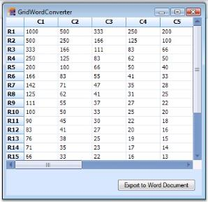' | markdownify }}
{:.image }

{{ '' | markdownify }}
{:.image }

A sample demonstrating this feature is available under the following sample installation path.

_<Install Location>\Syncfusion\EssentialStudio\[Version Number]\Windows\Grid.Windows\Samples\Exporting\Exporting Demo\_

###### Excel Export

Exporting data to an Excel spreadsheet is one of the most commonly preferred features in the .NET world. EssentialGrid control has in-built support for an Excel spreadsheet export. The class GridExcelConverterControl provides support for exporting data from GridControl or GridDataBoundGridControl to an Excel spreadsheet for verification and/or computation. This class automatically copies grid's styles and formats to an Excel spreadsheet. GridExcelConverterControl class is derived from GridExcelConverterBase class. XlsIO libraries are used to support conversion of the grid contents to Excel. For the control to function, the following dll files should be added along with the default dll files in the reference folder

* Syncfusion.GridConverter.Windows
* Syncfusion.XlsIO.Base

GridToExcel method is used to export the grid to an excel sheet. The following code example illustrates how to convert the content of Grid control to an Excel spreadsheet. 

[C#]

Syncfusion.GridExcelConverter.GridExcelConverterControl gecc = newSyncfusion.GridExcelConverter.GridExcelConverterControl();

gecc.GridToExcel(this.gridControl1.Model, @"C:\MyGC.xls");

[VB.NET]

Dim gecc As Syncfusion.GridExcelConverter.GridExcelConverterControl = NewSyncfusion.GridExcelConverter.GridExcelConverterControl()

gecc.GridToExcel(Me.gridControl1.Model, "C:\MyGC.xls")

The following screenshot shows a grid, which has some data that can be exported.

{{ '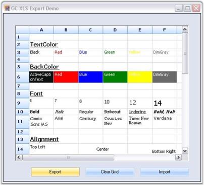' | markdownify }}
{:.image }

The following code example illustrates how to convert the content in GridDataBoundGrid control to an Excel spreadsheet.

[C#]

Syncfusion.GridExcelConverter.GridExcelConverterControl gecc = newSyncfusion.GridExcelConverter.GridExcelConverterControl();

gecc.GridToExcel(this.gridDataBoundGrid1.Model, @"C:\MyGC.xls");

[VB.NET]

Dim gecc As Syncfusion.GridExcelConverter.GridExcelConverterControl = NewSyncfusion.GridExcelConverter.GridExcelConverterControl()

gecc.GridToExcel(Me.gridDataBoundGrid1.Model, "C:\MyGC.xls")

The following screenshot shows the output of the exported excel. 

{{ '' | markdownify }}
{:.image }

You can view the sample for this demo under the following location.

_<Install Location>\Syncfusion\EssentialStudio\ [Version Number]\Windows\Grid.Windows\Samples\Exporting\Exporting Demo_

###### PDF Export

Our Essential Grid control supports conversion of grid content to a PDF file. Data in Grid control can be converted to a PDF document for offline verification and/or computation. This can be achieved by making use of GridPDFConverter class. PDF libraries are used to support the conversion of grid content to a PDF page. To make the control functional, the following dll files should be added along with the default dll files in the reference folder: 

* Syncfusion.Pdf.Base
* Syncfusion.GridHelperClasses.Windows.

ExportToPdf method is used to export grid content to a PDF file. Following code example illustrates how to convert the content in grid to PDF.

[C#]

GridPDFConverter pdfConvertor = new GridPDFConverter();

pdfConvertor.ExportToPdf("Sample1.pdf", this.gridControl1);

[VB.NET]

Dim pdfConvertor As GridPDFConverter = New GridPDFConverter()

pdfConvertor.ExportToPdf("Sample1.pdf", Me.gridControl1)

{{ '' | markdownify }}
{:.image }

A sample demonstrating this feature is available under the following sample installation path.

_<Install Location>\Syncfusion\EssentialStudio\[Version Number]\Windows\Grid.Windows\Samples\2.0\Export\PDF Converter Demo_

Support to Access or Modify Document Attributes of Exported PDF

This feature allows you to access and modify PDF document attributes while exporting, or after exporting, a grid to PDF. When you want to check the page count of the exporting document, you can use this feature. 

Events

_Table_ _6_9: Export Event table_

<table>
<tr>
<th>
EVENT </th><th>
DESCRIPTION </th><th>
ARGUMENTS </th><th>
TYPE </th><th>
REFERENCE LINKS </th></tr>
<tr>
<th>
Exporting </th><th>
This will be triggered before exporting grid to PDF. </th><th>
(object sender, Eventargs e) </th><th>
event</th><th>
N/A </th></tr>
<tr>
<th>
Exported </th><th>
This will be triggered after exporting grid to PDF.</th><th>
(object sender, Eventargs e) </th><th>
event </th><th>
N/A </th></tr>
</table>
 Sample Link

A demo of this feature is available in the following location: 

_{Install Drive}\AppData\Local\Syncfusion\EssentialStudio\[Version Number]\Windows\Grid.Windows\Samples\Exporting\Exporting Demo\_

Hooking the events in an application

You can hook the events using the ExportToPdf() method of PDFconverter. The following code illustrates this:

[C#]

GridPDFConverter pdfConvertor = new GridPDFConverter();

pdfConvertor.Exporting += new GridPDFConverter.PDFExportingEventHandler(pdfConvertor_Exporting);

pdfConvertor.Exported += new GridPDFConverter.PDFExportedEventHandler(pdfConvertor_Exported);

[VB]

Dim pdfConvertor As GridPDFConverter = New GridPDFConverter()

AddHandler pdfConvertor.Exporting, AddressOf pdfConvertor_Exporting

AddHandler pdfConvertor.Exported, AddressOf pdfConvertor_Exported

###### SOAP, Binary and XML Serialization

Essential Grid control has support for serialization and de-serialization of grid's schema information.Export as Image Support

Essential Grid provides image export support for the Grid, GridDataBoundGrid, and GridGrouping controls in the Excel converter. With this support, users can enable or disable image export from a Grid control to Excel. This is a Boolean property and its default value is true. This property will affect the grid-to-Excel converter when the ExportStyle property is true.

Use Case Scenarios 

This feature allows you to control the image export in the grid-to-Excel converter. This property will affect the grid when ExportStyle is true.

_Table 70: Properties_

<table>
<tr>
<td>
PROPERTY</td><td>
DESCRIPTION</td><td>
DATA TYPE</td></tr>
<tr>
<td>
ExportImage</td><td>
Used to enable or disable the image export in Syncfusion Windows Forms grid.</td><td>
Boolean</td></tr>
</table>
 Syntax

[C#]

ExcelExport.ExportStyle = true;   

//ExportImage works only when ExportStyle is true.         

ExcelExport.ExportImage = false;

[VB.NET]

ExcelExport.ExportStyle = True

‘ExportImage works only when ExportStyle is true.

ExcelExport.ExportImage = False

> {{ '' | markdownify }}
{:.image }
_Note: Serialization is the process of saving the state of an object as a stream of bytes. The reverse of this process is called deserialization._

Grid control supports three different types of serialization techniques namely:

* SOAP - Helps convert the grid schema information to SOAP format.
* Binary - Helps convert the grid schema information to binary format.
* XML - Helps convert the grid schema information to XML format.
* SOAP

* Following code example illustrates serialization of grid schema information by using SOAP technique.

[C#]

this.gridControl1.Model.SaveSoap(dlg.FileName);

[VB.NET]

Me.gridControl1.Model.SaveSoap(dlg.FileName)

* Following code example illustrates deserialization of grid schema information by using SOAP technique.

[C#]

this.gridControl1.Model = GridModel.LoadSoap(dlg.FileName);

this.gridControl1.Refresh();    

[VB.NET]

Me.gridControl1.Model = GridModel.LoadSoap(dlg.FileName)

Me.gridControl1.Refresh()

* Binary

* Following code example illustrates serialization of grid schema information by using Binary technique.

[C#]

this.gridControl1.Model.SaveBinary(dlg.FileName);

[VB.NET]

Me.gridControl1.Model.SaveBinary(dlg.FileName);

* Following code example illustrates deserialization of grid schema information by using Binary technique.

[C#]

this.gridControl1.Model = GridModel.LoadBinary(dlg.FileName);

this.gridControl1.Refresh();

[VB.NET]

Me.gridControl1.Model = GridModel.LoadBinary(dlg.FileName)

Me.gridControl1.Refresh()

* XML
* Following code example illustrates serialization of grid schema information by using XML technique.

[C#]

Stream s = null;

s = File.Create(dlg.FileName);

XmlWriter xw = new XmlTextWriter(s, System.Text.Encoding.Default);

XmlSerializer xs = new System.Xml.Serialization.XmlSerializer(this.gridControl1.Model.Data.GetType());

xs.Serialize(xw, this.gridControl1.Model.Data);

s.Close();

[VB.NET]

Dim s As Stream = Nothing

s = File.Create(dlg.FileName)

Dim xw As XmlWriter = New XmlTextWriter(s, System.Text.Encoding.Default)

Dim xs As XmlSerializer = New System.Xml.Serialization.XmlSerializer(Me.gridControl1.Model.Data.GetType())

xs.Serialize(xw, Me.gridControl1.Model.Data)

s.Close()

* Following code example illustrates deserialization of grid schema information by using XML technique.

[C#]

Stream s = null;

s = File.OpenRead(dlg.FileName);

XmlReader xw = new XmlTextReader(s);

XmlSerializer xs = new System.Xml.Serialization.XmlSerializer(this.gridControl1.Model.Data.GetType());

s.Close();

this.gridControl1.Model.Data = (GridData)xs.Deserialize(xw);

this.gridControl1.Refresh();

[VB.NET]

Dim s As Stream = Nothing

s = File.OpenRead(dlg.FileName)

Dim xw As XmlReader = New XmlTextReader(s)

Dim xs As XmlSerializer = New System.Xml.Serialization.XmlSerializer(Me.gridControl1.Model.Data.GetType())

s.Close()

Me.gridControl1.Model.Data = CType(xs.Deserialize(xw), GridData)

Me.gridControl1.Refresh()

{{ '' | markdownify }}
{:.image }

A sample demonstrating this feature is available under the following sample installation path.

_<Install Location>\Syncfusion\EssentialStudio\[Version Number]\Windows\Grid.Windows\Samples\2.0\Serialization\Serialize Grid Control Demo_

##### Virtual Grids

Essential Grid  supports complete separation between datasource and the grid. In a virtual grid, no cell data is stored in GridStyleInfo objects or any other internal grid storage. All information is provided on demand through handled events. For example, whenever Essential Grid needs a row count for a grid, it fires QueryRowCount event. In your handler, you must provide the row count from your datasource. Virtual grids can display large amounts of data extremely fast. There is no need to perform the time-consuming task of populating the grid. 

To implement Read-only virtual grid, you have to handle three events. To remove Read-only limitation, you have to handle a fourth event. In addition to these four events, there are other events that you may want to handle depending upon the behavior you are trying to implement. You can work through virtual grid tutorial to see an implementation of a simple virtual grid.

###### Required Events

These are the three events that you should handle in order to implement a virtual grid. They provide the basic information about the number of rows, columns, and the values for your data. 

QueryRowCount Event

This event is used to return the row count on demand. Here is a sample handler. 

[C#]

private void GridQueryRowCount(object sender, GridRowColCountEventArgs e)

{

//Determines number of rows.

    e.Count = this.numArrayRows;

    e.Handled = true;

}

[VB.NET]

Private Sub GridQueryRowCount(ByVal sender As Object, ByVal e As GridRowColCountEventArgs)

'Determines number of rows.

e.Count = Me.numArrayRows

e.Handled = True

End Sub

QueryColCount Event

QueryColCount event is used to return column count on demand. Note that when you handle the event by assigning e.Count, you are setting the e.Handled property to true. 

[C#]

private void GridQueryColCount(object sender, GridRowColCountEventArgs e)

{

//Determines the number of columns.

    e.Count = this.numArrayCols;

    e.Handled = true;

}

[VB.NET]

Private Sub GridQueryColCount(ByVal sender As Object, ByVal e As GridRowColCountEventArgs)

'Determines the number of columns.

e.Count = Me.numArrayCols

e.Handled = True

End Sub

QueryCellInfo Event

QueryCellInfo is the workhorse event. It is used to provide GridStyleInfo object for a given cell. In your handler for this event, you would normally set CellValue for GridStyleInfo object passed in with event arguments. But, you can also set other members of this GridStyleInfo object. For example, you can set BackColor to change the cell background. All of this is done on a demand basis. BackColor value is not stored in any grid storage. There is another event, PrepareViewStyleInfo that you can handle to make transient adjustment to a style just before it is displayed. This event is discussed in more detail later in this section. 

GridQueryCellInfoEventArgs members, e.ColIndex and e.RowIndex, specify the column and row of the requested style. The e.Style member holds GridStyleInfo object whose value this event should set provided it is a cell that you want to populate. It is possible that e.ColIndex and / or e.RowIndex may have the value of -1. A -1 indicating that rowstyle or columnstyle is being requested. So, e.ColIndex = -1 and e.RowIndex = 4 indicates that the rowstyle for row 4 is being requested (GridControl.RowStyles[4]). Similarly, positive column value with row value = -1 would be a request for that particular columnstyle. If both values are -1, then TableStyle property is being requested. 

One last comment before we look at the code. Header rows and columns in an Essential Grid are treated the same as other rows and columns with respect to QueryCellInfo. If you have a single header row, then anytime e.ColIndex is 0, a row header is being requested. Similarly, if you have a single column header row, e.RowIndex = 0 is a request for the column header.

[C#]

private void GridQueryCellInfo(object sender, GridQueryCellInfoEventArgs e)

{

    if(e.ColIndex > 0 && e.RowIndex > 0)

    {

//By using indexers, pass value to a cell from a given data source.

        e.Style.CellValue = this.intArray[e.RowIndex - 1, e.ColIndex - 1];

        e.Handled = true;

    }

}

[VB.NET]

Private Sub GridQueryCellInfo(ByVal sender As Object, ByVal e As GridQueryCellInfoEventArgs)

If ((e.ColIndex > 0) AndAlso (e.RowIndex > 0)) Then

'By using indexers indexers, pass value to a cell from a given data source.

e.Style.CellValue = Me.intArray(e.RowIndex - 1, e.ColIndex - 1)

e.Handled = True

End If

End Sub

###### Optional Events

Optional events can be used to extend the functionality of the basic Read-only virtual grid that you get by handling these three required events. One event lets you save information back into your external datasource while other events let you dynamically specify row heights and column widths. You can also dynamically provide covered cell ranges. 

SaveCellInfo Event

This event is used to store data back into your data source when it has been changed by the user. Here is a sample handler. 

[C#]

void GridSaveCellInfo(object sender, GridSaveCellInfoEventArgs e)

{

    if( e.ColIndex > 0 && e.RowIndex > 0)

    {

//Stores data back to the data source from the grid cell.

        this._extData[e.RowIndex - 1, e.ColIndex - 1] = int.Parse(e.Style.CellValue.ToString());

        e.Handled = true;

    }

}

[VB.NET]

Private Sub GridSaveCellInfo(ByVal sender As Object, ByVal e As GridSaveCellInfoEventArgs)

If ((e.ColIndex > 0) AndAlso (e.RowIndex > 0)) Then

'Stores data back to the data source from the grid cell.

Me._extData((e.RowIndex - 1), (e.ColIndex - 1)) = System.Int32.Parse(e.Style.CellValue.ToString())

e.Handled = True

End If

End Sub

QueryRowHeight

This event is used to return row heights that are in demand. 

[C#]

void GridQueryRowHeight(object sender, GridRowColSizeEventArgs e)

{

    if( e.Index % 2 == 0)

    {

//Determines Row Height.

        e.Size = 20;

        e.Handled = true;

    }

}

[VB.NET]

Private Sub GridQueryRowHeight(ByVal sender As Object, ByVal e As GridRowColSizeEventArgs)

If ((e.Index Mod 2) = 0) Then

'Determines Row Height.

e.Size = 20

e.Handled = True

End If

End Sub

QueryColWidth

This event is used to return column widths that are in demand. Here is a sample handler. 

[C#]

void GridQueryColWidth(object sender, GridRowColSizeEventArgs e)

{

if( e.Index % 3 == 0)

{

//Assigns Column Width.

e.Size = 40;

e.Handled = true;

}

}

[VB.NET]

Private Sub GridQueryColWidth(ByVal sender As Object, ByVal e As GridRowColSizeEventArgs)

If ((e.Index Mod 3) = 0) Then

'Assigns Column Width.

e.Size = 40

e.Handled = True

End If

End Sub

QueryCoveredRange

This event is used to provide covered ranges on demand. If you have a pattern of cells covered, then you can use this event to provide the ranges.

[C#]

void GridQueryCoveredRange(object sender, GridQueryCoveredRangeEventArgs e) 

{

//Covers odd rows, columns 1 through 3.

    if (e.RowIndex % 2 == 1 && e.ColIndex >= 1 && e.ColIndex <= 3)

    {

        e.Range = GridRangeInfo.Cells(e.RowIndex, 1, e.RowIndex, 3);

        e.Handled = true;

    }

//Covers column 6 with odd-even row pairs.

    if (e.RowIndex > 0 && e.ColIndex == 6)

    {

        int row = (e.RowIndex-1)/2 * 2 + 1;

        int col = e.ColIndex;

        e.Range = GridRangeInfo.Cells(row, col, row+1, col);

        e.Handled = true;

    }

}

[VB.NET]

Private Sub GridQueryCoveredRange(ByVal sender As Object, ByVal e As GridQueryCoveredRangeEventArgs)

'Covers odd rows, columns 1 through 3.

If ((((e.RowIndex Mod 2) = 1) AndAlso (e.ColIndex >= 1)) _

AndAlso (e.ColIndex <= 3)) Then

e.Range = GridRangeInfo.Cells(e.RowIndex, 1, e.RowIndex, 3)

e.Handled = True

End If

'Covers column 6 with odd-even row pairs.

If ((e.RowIndex > 0) AndAlso (e.ColIndex = 6)) Then

Dim row As Integer

row = ((((e.RowIndex - 1) / 2) * 2) + 1)

Dim col As Integer

col = e.ColIndex

e.Range = GridRangeInfo.Cells(row, col, (row + 1), col)

e.Handled = True

End If

End Sub

##### Pivot Grid

Essential Pivot Grid simulates Pivot Table feature of MS Excel. Pivot Grid pivots data via drag-and-drop to organize data in a cross-tabulated form. The major advantage of pivot grid is that you can extract any desired information within a limited span of time. Apart from being able to present the data in a proper manner, you can also summarize and group data. Pivot Grid has its main application in the financial domain. It is used to organize and analyze business data.

Pivot Grid control is built on the foundation of the Grid control. It comprises of the following components.

* Display Grid - Displays data extracted from the underlying database.
* Pivot Table Field List - Lists available fields from the database. Provides a way to add/remove fields from the grid.
* Drag-Drop Panel - Serves as a view state of the pivot grid, where you can rearrange the fields by performing drag-and-drop operation between row and column label areas.
* Filter Area - Lets you filter the results according to certain criteria in a desired manner.

 Pivot Grid provides UI that allows you to specify the rows and columns in the pivot table through drag-and-drop operations. The visual aspects of the control are saved in an Appearance object. The control supports Office 2003 and Office 2007 styles.

Calculations are done through Grouping Engine, which is a part of Essential Grouping. The default calculation is _Summation_, but there exists an option to change calculation type to _Average_, _Median_, _Percentiles_, _Variances_, _Standard Deviations_, etc. You can also provide "custom" calculations through the grouping engine.

Features

* Data-binding support
* Auto-calculation of Total Summary
* Filters
* Grouping support
* Customizable Appearance
* Support for XML and Binary Serialization

APIs

Here is a brief explanation on some of the important methods implemented in Pivot Grid.

* CollapseAll() - This will collapse all the expanded tables in the Pivot Grid.

[C#]

pivotGridControl1.CollapseAll();

* ExpandAll() - Expands all the collapsed nodes in the Pivot Grid.

[C#]

pivotGridControl1.ExpandAll();

* InitSchema() - A new Pivot schema will be created and it will be associated with the Pivot Grid.

[C#]

pivotGridControl1.InitSchema();

* ResetSchema() - Resets Pivot Grid control into an initial schema, which will be empty.

[C#]

pivotGridControl1.ResetSchema();

* SetAppearance() - This method sets the appearance of the Pivot Grid.

[C#]

pivotGridControl1.SetAppearance(new PivotGridLibrary.PivotAppearance(pivotGridControl2));

Here is a brief explanation on some of the important properties implemented in the Pivot Grid.

* AllString - This will get the string values that appear in the dropdown filter, when all the filter values get selected.

[C#]

pivotGridControl1.AllString = "All";

* AutoSizeColumns - Sizes the column according to the calculated value of the display width.

[C#]

pivotGridControl1.AutoSizeColumns = true;

* ColumnCount - This specifies the number of columns in the main display grid.

[C#]

int i = pivotGridControl1.ColumnCount;

* ColumnsCount - This specifies the number of distinct fields in the pivot grid.

[C#]

int i = pivotGridControl1.ColumnsCount;

* DataRowCount - This specifies the number of rows in the underlying IList datasource.

[C#]

int i = pivotGridControl1.DataRowCount;

* DefaultComputationName - This specifies the name of the default calculation. The default value is _Sum_.

[C#]

pivotGridControl1.DefaultComputationName = "Sum";

* DefaultDescriptionFormat - This specifies the format of calculated description. By default it will be, _{0} of {1}_, where {0} is the value of computation name and {1} is the value of the field name.

[C#]

pivotGridControl1.DefaultDescriptionFormat = "{0} of {1}";

* FilterCount - This specifies the number of distinct fields added to the filter.

[C#]

int i = pivotGridControl1.FilterCount;

* FreezeHeaders - This determines whether the row and column headers should be frozen.

[C#]

pivotGridControl1.FreezeHeaders = true;

* GrandTotalString - This provides the text for the summary cells of the Pivot Grid.

[C#]

pivotGridControl1.GrandTotalString = "Grand Total";

* LeftPanelWidth - This specifies the width of the left-most Panel.

[C#]

pivotGridControl1.LeftPanelWidth = 20;

* LeftPanelHeight - This specifies the height of the top-most Panel.

[C#]

pivotGridControl1.LeftPanelHeight = 20;

* MainDisplayGrid - This is a basic grid, which stores the pivot results.
* MultipleString - This specifies the text that should appear when the Multiple Filter selected in the Filter Combo Box is changed. By default it will be set to Multiple.

[C#]

pivotGridControl1.MultipleString = "Multiple";

* Print Option - The print option is extended for the PivotGrid control to allow users to preview the contents before the contents are printed on paper.

This feature is used to print PivotGrid control in landscape and portrait views. This feature has overridden GridPrintDocumentAdv from Syncfusion.GridHelperClasses.Windows. 

The pivot grid visual style color is automatically applied in the printed document based on the visual styles of the grid. 

The print functionality can be invoked using the following code:

 [C#]

private void button1_Click_1(object sender, EventArgs e)

{

 try

   {

PivotGridPrintDocumentAdv pd = new PivotGridPrintDocumentAdv(this.pivotGridControl1);

pd.DefaultPageSettings.Margins = new System.Drawing.Printing.Margins(25, 25, 25, 25);

PrintPreviewDialog previewDialog = new PrintPreviewDialog();

previewDialog.Document = pd;

previewDialog.Show();

   }

catch (Exception ex)

   {

MessageBox.Show("Error while print preview" + ex.ToString());

   }

}

[VB]

Private Sub button1_Click_1(ByVal sender As Object, ByVal e As EventArgs)

 Try

Dim pd As New PivotGridPrintDocumentAdv(Me.pivotGridControl1)

pd.DefaultPageSettings.Margins = New System.Drawing.Printing.Margins(25, 25, 25, 25)

Dim previewDialog As New PrintPreviewDialog()

previewDialog.Document = pd

previewDialog.Show()

Catch ex As Exception

MessageBox.Show("Error while print preview" & ex.ToString())

End Try

End Sub

The following screen shots illustrate the print feature of the PivotGrid control: Headers and footers can also be added by using DrawGridPrintHeader and DrawGridPrintFooter events. The following code illustrates how to add the header and footer.

[C#]

pd.DrawGridPrintHeader+=new GridPrintDocumentAdv.DrawGridHeaderFooterEventHandler(pd_DrawGridPrintHeader);

pd.DrawGridPrintFooter+=new GridPrintDocumentAdv.DrawGridHeaderFooterEventHandler(pd_DrawGridPrintFooter);

[VB]

AddHandler pd.DrawGridPrintHeader, AddressOf pd_DrawGridPrintHeader

AddHandler pd.DrawGridPrintFooter, AddressOf pd_DrawGridPrintFooter

The following image shows the printed output of the pivot grid:

{{ '' | markdownify }}
{:.image }
 _Figure_ _267_: Pivot Grid in Print Preview_

Sample Link

_<Install Location>\Syncfusion\EssentialStudio\[Version Number]\Windows\PivotGrid.Windows\Samples\Printing\Pivot Print Demo_

##### Appearance

This section comprises the following:

###### GridFormatCellDialog

GridFormatCellDialog simulates FormatCells dialog feature of MS Excel. It provides numerous formatting options such as Font, Alignment, Background, and Number, which aid in formatting grid cells dynamically. It is now available as an add-on feature for Essential Grid control. GridFormatCellDialog class accepts an instance of the Grid control to be formatted, and exposes the above mentioned formatting options to operate on grid cells that are selected. Below image illustrates such a sample dialog.

{{ '' | markdownify }}
{:.image }

Setting up GridFormatCellDialog

This GridFormatCellDialog can be enabled by instantiating GridFormatCellDialog class and invoking its ShowDialog method. 

> {{ '' | markdownify }}
{:.image }
_Note: You must select the cells to be formatted before activating this dialog._

[C#]

GridFormatCellDialog formatDialog = new GridFormatCellDialog(this.gridControl1);

formatDialog.ShowDialog();

[VB.NET]

Dim formatDialog As GridFormatCellDialog = New GridFormatCellDialog(Me.gridControl1)

formatDialog.ShowDialog()

Formatting Options

Font Tab

This provides options to set the font, font style, font size, font effects, and font color for the desired grid cells.

{{ '' | markdownify }}
{:.image }

Number Tab

This allows you to specify text format for grid cells. The possible options are Number, Currency, Percentage, Date, Time, Scientific and Text.

{{ '' | markdownify }}
{:.image }

Background Tab

This allows you to set background color for grid cells. You can set gradient shades and pattern styles as well.

{{ '' | markdownify }}
{:.image }

Alignment Tab

This provides various cell alignment options such as Horizontal Alignment, Vertical Alignment, Merge Cells, Wrap Text, and so on.

{{ '' | markdownify }}
{:.image }

###### Grid Visual Styles

This section provides information on VisualStyles and ThemesEnabled properties (XP themes) of the Essential Grid. Essential Grid supports a range of appearances for grid cells. Styles can be set to the grid control by assigning Syncfusion.Windows.Forms.GridVisualStyles enumeration value to the GridVisualStyles property.

{{ '' | markdownify }}
{:.image }

The figure above displays various visual styles in VisualStyles group box in UI for Essential Grid.

Following code example illustrates how to set visual style for Grid control.

[C#]

//Sets an Office 2007 Blue skin theme to the Essential Grid control.

gridControl1.GridVisualStyles = Syncfusion.Windows.Forms.GridVisualStyles.Office2007Blue;

[VB.NET]

'Sets an Office 2007 Blue skin theme to the Essential Grid control.

gridControl1.GridVisualStyles = Syncfusion.Windows.Forms.GridVisualStyles.Office2007Blue

ThemesEnabled property determines whether XP Themes (visual styles) can be used for this control or not, when available. Following code example illustrates how to set the theme for the Grid control.

[C#]

this.gridControl1.ThemesEnabled = true;

[VB.NET]

Me.gridControl1.ThemesEnabled = True

###### Grid Control Designer

This section elaborates upon Grid control's edit designer. Grid control has an excellent user friendly design-time support. A Grid control's edit designer is added to the grid to ease the process of designing Grid control on a cell level. Using the editor, Grid can be modified, saved, and loaded to XML formatted files or to SOAP formatted templates. 

Following is the step-by-step procedure to edit Grid control's cell styles using GridControl Designer window:

1. Right click the Grid control. A context menu is displayed.
2. Select Edit from the context menu drop-down. The figure below illustrates this user-action:

{{ '' | markdownify }}
{:.image }

> {{ '' | markdownify }}
{:.image }
_Note: Editor opens up on the right hand side of the page and Grid Properties tab is highlighted by default. The cell content, styles and general grid properties can be modified under Grid Properties tab._ 

{{ '' | markdownify }}
{:.image }

The figure above shows GridControl Designer window with Grid Properties tab.

Modifying the Properties of a Selected Range

To modify properties of a selected range, follow the steps listed below:

1. Select a range of cells.
2. Click Selected Range tab to view Property grid for the selection.

{{ '' | markdownify }}
{:.image }

The figure above shows the Property grid under Selected Range tab in GridControl Designer window.

3. Make the required modifications in the property grid so that they are affected in the selected range of the main grid.
4. Exit editor after modifications are done. 
> 
{{ '' | markdownify }}
{:.image }
_Note: The system prompts you to save the changes to the Grid control in the designer if exited without saving._

###### Grid Properties

Essential Grid provides support to customize the appearance and behavior of grid cells. This section would provide you more insight on the properties affecting Appearance, Print Styles, and Scroll Bar Settings available. It includes the following topics.

Appearance Properties

The properties that majorly affect the appearance cells and data in cells of a grid can be named as Appearance properties.

{{ '' | markdownify }}
{:.image }

The following properties are used to customize the appearance of Grid.

* TransparentBackground - Specifies whether to display grid with background image. When this property is set to false, the background image will not be displayed even if it is set by using BackgroundImage property.

The following code examples can be used to set this property:

[C#]

//Enables TransparentBackground property.

this.gridControl1.TransparentBackground = true;

[VB.NET]

'Enables TransparentBackground property.

Me.gridControl1.TransparentBackground = True

The following illustration shows how the Grid in "Figure 1" is transformed when the TransparentBackground property is set to true.

{{ '' | markdownify }}
{:.image }

* DisplayHorzLines - Specifies whether horizontal grid lines marking the cells are to be displayed. Default value is set to _true_.

The following code examples can be used to set this property:

[C#]

//Enables DisplayHorzLines property.

this.gridControl1.Properties.DisplayHorzLines = false;

[VB.NET]

'Enables DisplayHorzLines property.

Me.gridControl1.Properties.DisplayHorzLines = False

The following illustration shows how the Grid in "Figure 1" is transformed when the Properties.DisplayHorzLines property is set to false.

{{ '' | markdownify }}
{:.image }

* DisplayVertLines-Specifies whether vertical grid lines marking the cells are to be displayed. Default value is set to _true_.

The following code examples can be used to set this property:

[C#]

//Enables DisplayVertLines property.

this.gridControl1.Properties.DisplayVertLines = false;

[VB.NET]

'Enables DisplayVertLines property.

Me.gridControl1.Properties.DisplayVertLines = False

The following illustration shows how the Grid in "Figure 1" is transformed when the Properties.DisplayVertLines property is set to false.

{{ '' | markdownify }}
{:.image }

* ColHeaders-Specifies whether column headers are to be displayed. Default value is set to _true_.

The following code examples can be used to set this property:

[C#]

//Hides the column headers.

this.gridControl1.Properties.ColHeaders = false;

[VB.NET]

'Hides the column headers.

Me.gridControl1.Properties.ColHeaders = False

The following illustration shows how the Grid in "Figure 1" is transformed when Properties.ColHeaders property is set to false.

{{ '' | markdownify }}
{:.image }

* RowHeaders - Specifies whether row headers are to be displayed. Default value is set to _true_.

The following code examples can be used to set this property:

[C#]

//Hides the row headers.

this.gridControl1.Properties.RowHeaders = false;

[VB.NET]

'Hides the row headers.

Me.gridControl1.Properties.RowHeaders = False

The following illustration shows how the Grid in "Figure 1" is transformed when the Properties.RowHeaders property is set to false.

{{ '' | markdownify }}
{:.image }

* Buttons3D - Specifies if the row and column headers should have a three dimensional look, which in turn makes headers visually appealing. If this property is set to false, the row and column headers will appear flat. Default value is set to _true_.

The following code examples can be used to set this property:

[C#]

//Enables Buttons3D property.

this.gridControl1.Properties.Buttons3D = false;

[VB.NET]

'Enables Buttons3D property.

Me.gridControl1.Properties.Buttons3D = False

The following illustration shows how the Grid in "Figure 1" is transformed when Properties.Buttons3D property is set to false.

{{ '' | markdownify }}
{:.image }

* GridLineColor - Specifies the color for the grid lines (for example, active border). Default value is set to _GrayText_.

The following code examples can be used to set this property:

[C#]

//Specifiesthe color for the grid lines.

this.gridControl1.Properties.GridLineColor = System.Drawing.Color.IndianRed;

[VB.NET]

'Specifies the color for the grid lines.

Me.gridControl1.Properties.GridLineColor = System.Drawing.Color.IndianRed

The following illustration shows how the Grid in "Figure 1" is transformed when the Properties.GridLineColor property is set to IndianRed.

{{ '' | markdownify }}
{:.image }

* BackgroundImage - Enables background image to be inserted for the grid.

The following code examples can be used to set this property:

[C#]

// Specifies the background image.

this.gridControl1.BackgroundImage = Image.FromFile(FindImageFile(@"..\..\..\..pic.jpg"));

[VB.NET]

'Specifies the background image.

Me.gridControl1.BackgroundImage = Image.FromFile(FindImageFile("..\..\..\..pic.jpg"))

The following illustration shows how the Grid in "Figure 1" is transformed when the BackgroundImage property is set.

{{ '' | markdownify }}
{:.image }

* TextColor-Specifies the color of the text in the grid.

The following code examples can be used to set this property:

[C#]

//Sets grid text color.

this.gridControl1.TableStyle.TextColor = Color.MidnightBlue;

[VB.NET]

'Sets grid text color.

Me.gridControl1.TableStyle.TextColor = Color.MidnightBlue

The following illustration shows how the Grid in "Figure 1" is transformed when TableStyle.TextColor property is set to MidnightBlue.

{{ '' | markdownify }}
{:.image }

* BackColor-Specifies the color of the grid line marker when the user resizes rows or columns by dragging row or column headers. Default value is set to _Red_.

The following code examples can be used to set this property:

[C#]

//Sets the grid background color.

this.gridControl1.BackColor = Color.Beige;

[VB.NET]

'Sets the grid background color.

Me.gridControl1.BackColor = Color.Beige

The following illustration shows how the Grid in "Figure 1" is transformed when the BackColor property is set to Beige.

{{ '' | markdownify }}
{:.image }

* ResizingCellsLinesColor - Specifies the color for the grid lines (for example, active border). Default value is set to _GrayText_.

The following code examples can be used to set this property:

[C#]

//Specifies the color for the grid line marker while resizing rows and columns.

this.gridControl1.Properties.ResizingCellsLinesColor = Color.PaleVioletRed;

[VB.NET]

'Specifies the color for the grid line marker while resizing rows and columns.

Me.gridControl1.Properties.ResizingCellsLinesColor = Color.PaleVioletRed

* Borders - Specifies settings for Top, Left, Bottom, and Right borders.

The following code examples can be used to set this property:

[C#]

//Sets border settings for the grid.

this.gridControl1.TableStyle.Borders.All = new GridBorder(GridBorderStyle.Solid, Color.SteelBlue);

[VB.NET]

'Sets border settings for the grid.

Me.gridControl1.TableStyle.Borders.All = New GridBorder(GridBorderStyle.Solid, Color.SteelBlue)

* FixedLinesColor - Specifies the color of frozen grid lines (for example, row or column headers). Default value is set to _ActiveCaption_.

The following code examples can be used to set this property:

 [C#]

//Sets the color of frozen grid lines.

this.gridControl1.Properties.FixedLinesColor = Color.YellowGreen;

[VB.NET]

'Sets the color of frozen grid lines.

Me.gridControl1.Properties.FixedLinesColor = Color.YellowGreen

A sample demonstrating these properties is available under the following sample installation path.

_<Install Location>\Syncfusion\EssentialStudio\[Version Number]\Windows\Grid.Windows\Samples\Appearance\Properties Demo_

Print Properties

   The following properties are associated with printing in Grid. They are generally referred to as Print Styles.

* BlackWhite - Specifies if the grid should be printed only in black and white.

The following code examples illustrate how to set this property:

[C#]

//Specifies if the grid should print only in black and white.

this.gridControl1.Properties.BlackWhite = true;

 [VB.NET]

'Specifies if the grid should print only in black and white.

Me.gridControl1.Properties.BlackWhite = True

* Printing - Prints the grid.

The following code examples illustrate how to set this property:

[C#]

//Prints the grid.

this.gridControl1.Properties.Printing = true;

[VB.NET]

'Prints the grid.

Me.gridControl1.Properties.Printing = True

* PrintFrame - Specifies the appearance of a frame around the grid while printing.

The following code examples illustrate how to set this property:

[C#]

//Specifies if a frame should be drawn around the grid while printing.

this.gridControl1.Properties.PrintFrame = true;

[VB.NET]

' Specifies if a frame should be drawn around the grid while printing.

Me.gridControl1.Properties.PrintFrame = True

* PrintColHeader - Specifies if column headers should be printed.

The following code examples illustrate how to set this property:

[C#]

// Specify if column headers should be printed.

this.gridControl1.Properties.PrintColHeader = true;

 [VB.NET]

'Specifies if column headers should be printed.

Me.gridControl1.Properties.PrintColHeader = True

* PrintRowHeader - Specifies if row headers should be printed.

 The following code example illustrates how to set this property:

[C#]

//Specifies if row headers should be printed.

this.gridControl1.Properties.PrintRowHeader = true;

[VB.NET]

'Specifies if row headers should be printed.

Me.gridControl1.Properties.PrintRowHeader = True

* CenterVertical - Specifies if the grid should be centered vertically on printing.

The following code examples illustrate how to set this property:

 [C#]

//Specifies if the grid should be centered vertically on printing.

this.gridControl1.Properties.CenterVertical = true;

[VB.NET]

'Specifies if the grid should be centered vertically on printing.

Me.gridControl1.Properties.CenterVertical = True

* PrintHorzLines - Specifies if horizontal lines of the grid should be printed.

The following code example illustrates how to set this property:

 [C#]

//Specifies if horizontal lines of the grid should be printed.

this.gridControl1.Properties.PrintHorzLines = true;

[VB.NET]

'Specifies if horizontal lines of the grid should be printed.

Me.gridControl1.Properties.PrintHorzLines = True

* PrintVertLines - Specifies if vertical lines of the grid should be printed.

The following code example illustrates how to set this property:

 [C#]

//Specifies if vertical lines of the grid should be printed.

this.gridControl1.Properties.PrintVertLines = true;

[VB.NET]

'Specifies if vertical lines of the grid should be printed.

Me.gridControl1.Properties.PrintVertLines = True

* CenterHorizontal - Specifies if a grid should be centered horizontally while printing.

The following code example illustrates how to set this property in Grid control. 

[C#]

//Specifies if the grid should be centered horizontally while printing.

this.gridControl1.Properties.CenterHorizontal = true;

[VB.NET]

'Specifies if the grid should be centered horizontally while printing.

Me.gridControl1.Model.Properties.CenterHorizontal = False

A sample demonstrating these properties is available under the following sample installation path.

_<Install Location>\Syncfusion\EssentialStudio\[Version Number]\Windows\Grid.Windows\Samples\Printing\Print Grid Demo_

Scroll Bar Properties

Essential Grid provides support to control functionalities and appearance of the grid scroll bars.

{{ '' | markdownify }}
{:.image }

The following properties are associated with scrolling in grid.

* HscrollPixel - Specifies whether to enable or disable horizontal pixel scrolling for the grid. Default value is set to _false_.

The following code examples can be used to set this property:

[C#]

//Enables horizontal pixel scrolling for the grid.

this.gridControl1.HScrollPixel = true;

[VB.NET]

'Enables horizontal pixel scrolling for the grid.

Me.gridControl1.HScrollPixel = True

* VscrollPixel - Specifies whether to enable or disable vertical pixel scrolling for the grid. Default value is set to _false_.

The following code examples can be used to set this property:

 [C#]

//Enables vertical pixel scrolling for the grid.

this.gridControl1.VScrollPixel = true;

[VB.NET]

'Enables vertical pixel scrolling for the grid.

Me.gridControl1.VScrollPixel = True

* HorizontalScrollTips - Specifies if the control should display scroll tips while the user is dragging a horizontal scroll bar thumb. Default value is set to _false_.

The following code examples can be used to set this property:

 [C#]

//Specifies whether scroll tips should be displayed while dragging the horizontal scroll bar thumb.

this.gridControl1.HorizontalScrollTips = true;

[VB.NET]

'Specifies whether scroll tips should be displayed while dragging the horizontal scroll bar thumb.

Me.gridControl1.HorizontalScrollTips = True

The following illustration shows how the Grid in "Figure 1" is transformed when thorizontalScrollTips if  property is set to true.

{{ '' | markdownify }}
{:.image }

* VerticalScrollTips - Specifies if the control should display scroll tips while the user is dragging a vertical scroll bar thumb. Default value is set to _false_.

The following code examples can be used to set this property:

 [C#]

//Specifieswhether scroll tips should be displayed while dragging the vertical scroll bar thumb.

this.gridControl1.VerticalScrollTips = true;

[VB.NET]

'Specifies whether scroll tips should be displayed while dragging the vertical scroll bar thumb.

Me.gridControl1.VerticalScrollTips = True

The following illustration shows how the Grid in "Figure 1" is transformed when the VerticalScrollTips property is set to true.

{{ '' | markdownify }}
{:.image }

* HscrollBehavior - Specifies the behavior of the horizontal scroll bar. GridScrollbarMode enumeration provides the following options to control the scroll bar behavior: Automatic, AutoScroll, DetectIfShared, DisableAutoScroll, Disabled, Enabled, and Shared_._

The following code example can be used to set this property:

 [C#]

//Sets the behavior of the horizontal scroll bar.

this.gridControl1.HScrollBehavior = GridScrollbarMode.Shared;

[VB.NET]

'Sets the behavior of the horizontal scroll bar.

Me.gridControl1.HScrollBehavior = GridScrollbarMode.Shared

* VScrollBehavior - Specifies the behavior of the vertical scroll bar. GridScrollbarMode enumeration provides the following options to control the scroll bar behavior: Automatic, AutoScroll, DetectIfShared, DisableAutoScroll, Disabled, Enabled, and Shared_._

The following code example can be used to set this property:

[C#]

//Sets the behavior of the vertical scroll bar.

this.gridControl1.VScrollBehavior = GridScrollbarMode.Shared;

[VB.NET]

'Sets the behavior of the vertical scroll bar.

Me.gridControl1.VScrollBehavior = GridScrollbarMode.Shared

* HorizontalThumbTrack - Specifies whether the control should scroll while the user is dragging the horizontal scroll bar thumb. Default value is set to _false_.

The following code example can be used to set this property:

 [C#]

//Specifies whether the control should scroll while dragging the horizontal scroll bar thumb.

this.gridControl1.HorizontalThumbTrack = true;

[VB.NET]

'Specifies whether the control should scroll while dragging the horizontal scroll bar thumb.

Me.gridControl1.HorizontalThumbTrack = True

The following illustration shows how the Grid in "Figure 1" is transformed when the HorizontalThumbTrack property is set to true.

{{ '' | markdownify }}
{:.image }

* VerticalThumbTrack - Specifies whether the control should scroll while the user is dragging vertical scroll bar thumb. Default value is set to _false_.

The following code examples can be used to set this property:

 [C#]

//Specifies whether the control should scroll while dragging the vertical scroll bar thumb.

this.gridControl1.VerticalThumbTrack = true;

[VB.NET]

'Specifies whether the control should scroll while dragging the vertical scroll bar thumb.

Me.gridControl1.VerticalThumbTrack = True

The following illustration shows how the Grid in "Figure 1" is transformed when the VerticalThumbTrack property is set to true.

{{ '' | markdownify }}
{:.image }

* Office2007ScrollBars - Toggles between standard and Office 2007 scroll bars. Default value is set to _false_.

The following code examples can be used to set this property:

 [C#]

//Toggles to Office 2007 scroll bar.

this.gridControl1.Office2007ScrollBars = true;

 [VB.NET]

'Toggles to Office 2007 scroll bar.

Me.gridControl1.Office2007ScrollBars = True

* Office2007ScrollBarsColorScheme - Specifies the style for Office 2007 scroll bars. Default value is set to _Blue_.

The following code example can be used to set this property:

 [C#]

//Sets the style for Office 2007 scroll bar.

this.gridControl1.Office2007ScrollBarsColorScheme = Office2007ColorScheme.Blue;

[VB.NET]

'Sets the style for Office 2007 scroll bar.

Me.gridControl1.Office2007ScrollBarsColorScheme = Office2007ColorScheme.Blue

* ScrollFrozen - Defines scroll behavior when user moves current cell with arrow keys into frozen cells area. Default value is set to _true_.

The following code examples can be used to set this property:

 [C#]

//Defines scroll behavior in frozen cells.

this.gridControl1.ScrollFrozen = true;

[VB.NET]

'Defines scroll behavior in frozen cells.

Me.gridControl1.ScrollFrozen = True

* ScrollTipFormat - Specifies the text to be displayed in the ScrollTip window with a place holder for scroll position.

The following code example can be used to set this property:

[C#]

//Sets the text to be displayed in the ScrollTip window with a place holder for scroll position.

this.gridControl1.ScrollTipFormat = "Position {0}";

[VB.NET]

'Sets the text to be displayed in the ScrollTip window with a place holder for scroll position.

Me.gridControl1.ScrollTipFormat = "Position {0}"

* AutoScrolling - Specifies whether to enable or disable automatic scrolling.

The following code example can be used to set this property:

 [C#]

//Enables AutoScrolling.

this.gridControl1.AutoScrolling = true;

 [VB.NET]

'Enables AutoScrolling.

Me.gridControl1.AutoScrolling = True

* Hscroll - Specifies whether to enable orv disable horizontal scroll bar.

The following code examples can be used to set this property:

 [C#]

//Enables horizontal scroll bar.

this.gridControl1.HScroll = true;

[VB.NET]

'Enables horizontal scroll bar.

Me.gridControl1.HScroll = True

* VScroll - Specifies whether to enable or disable vertical scroll bar.

The following code example can be used to set this property:

 [C#]

//Enables vertical scroll bar.

this.gridControl1.VScroll = true;

[VB.NET]

' Enables vertical scroll bar.

Me.gridControl1.VScroll = True

A sample demonstrating these properties is available under the following sample installation path.

_<Install Location>\Syncfusion\EssentialStudio\[Version Number]\Windows\Grid.Windows\Samples\Zoom and Scroll\ScrollBar Demo_

###### Custom Drawing

Essential Grid enables custom drawing on its cells. Custom Drawing denotes adding text and drawings such as lines, polygons, etc., to the cell. It has custom draw events such as CellDrawn event and DrawCell event. By using these events, you can provide the exact appearance that you desire for your applications. 

* DrawCell - This event is handled for every cell before the grid draws a specified cell. This event is generally used to add custom drawing to a cell. It can also be used to draw shapes like lines, polygons, etc.
* CellDrawnevent - This event is handled for every cell when the grid has drawn the specified cell. You can handle the CellDrawn event and use its Graphics argument to do custom drawing after the grid has finished drawing the cell.

Following code example illustrates handling the Draw Cell event.

 [C#]

//DrawCell event is used to apply styles to the grid.

private void gridControl1_DrawCell(object sender, GridDrawCellEventArgs e)

{

    if (e.RowIndex == 0)

    {

        e.Style.Interior = new BrushInfo(GradientStyle.Vertical, Color.FromArgb(255, 229, 201), Color.FromArgb(255, 153, 52));

    }

    else if (e.ColIndex == 0)

    {

        e.Style.Interior = new BrushInfo(GradientStyle.Horizontal, Color.White, Color.FromArgb(102, 110, 152));

    }

    else if (e.RowIndex % 2 == 0)

    {

        e.Style.Interior = new BrushInfo(GradientStyle.BackwardDiagonal, Color.FromArgb(51, 51, 101), Color.White);

    }

}

[VB.NET]

'DrawCell event is used to apply styles to the grid.

Private Sub gridControl1_DrawCell(ByVal sender As Object, ByVal e As GridDrawCellEventArgs)

If e.RowIndex = 0 Then

e.Style.Interior = New BrushInfo(GradientStyle.Vertical, Color.FromArgb(255, 229, 201), Color.FromArgb(255, 153, 52))

ElseIf e.ColIndex = 0 Then

e.Style.Interior = New BrushInfo(GradientStyle.Horizontal, Color.White, Color.FromArgb(102, 110, 152))

ElseIf e.RowIndex Mod 2 = 0 Then

e.Style.Interior = New BrushInfo(GradientStyle.BackwardDiagonal, Color.FromArgb(51, 51, 101), Color.White)

End If

End Sub

The above code identifies the first row, first column and the even rows using their index values and paints them with unique interior styles.

Following code example illustrates handling the CellDrawn Event.

 [C#]

//Handles CellDrawn Event to customize the appearance of grid cells.

private void gridControl1_CellDrawn(object sender, GridDrawCellEventArgs e)

{

    if(e.ColIndex==6 &&e.RowIndex>0)

    {

        Rectangle rec = e.Bounds,rect=e.Bounds;

        rec.X=(e.Bounds.Left+e.Bounds.Right)/2;

        if(e.Style.CellValue.ToString()=="1")

        {

            e.Graphics.FillEllipse(Brushes.Gray,rect);

            GridImageCellRenderer.DrawImage(e.Graphics,this.imageList1,1,rec,false);

        }

        else

        {

            e.Graphics.FillEllipse(Brushes.LightGray,rect);

            GridImageCellRenderer.DrawImage(e.Graphics,this.imageList1,0,rec,false);

        }

    }

}

[VB.NET]

'Handles CellDrawn Event to customize the appearance of grid cells.

Private Sub gridControl1_CellDrawn(ByVal sender As Object, ByVal e As GridDrawCellEventArgs)

If e.ColIndex = 6 AndAlso e.RowIndex > 0 Then

Dim rec As Rectangle = e.Bounds, rect As Rectangle = e.Bounds

rec.X = (e.Bounds.Left + e.Bounds.Right) / 2

If e.Style.CellValue.ToString() = "1" Then

e.Graphics.FillEllipse(Brushes.Gray, rect)

GridImageCellRenderer.DrawImage(e.Graphics, Me.imageList1, 1, rec, False)

Else

e.Graphics.FillEllipse(Brushes.LightGray, rect)

GridImageCellRenderer.DrawImage(e.Graphics, Me.imageList1, 0, rec, False)

End If

End If

End Sub

The above code identifies the cells of the sixth column except the cell corresponding to the column header, using their index values, and customizes their appearance.

###### Formatting Drop-down List

Essential Grid has built-in support for displaying a Grid List control as a drop-down inside a grid cell. We can embed grid list controls into the grid cells and customize them.

The following screen shot shows grid cell with Grid List control as its drop-down.

{{ '' | markdownify }}
{:.image }

To add a Grid List control to grid cell and bind some data:

To have a Grid List control in a Grid cell, set its CellType property as _GridListControl_. An array is used as data source in the following example. You can set its DataSource and DisplayMember properties as follows:

[C#]

ArrayList array = new ArrayList();

array.Add(new MyClass(001, "John David"));

array.Add(new MyClass(002, "Tom"));

array.Add(new MyClass(003, "Bretney"));

array.Add(new MyClass(004, "Jessy"));

array.Add(new MyClass(005, "Bruch"));

array.Add(new MyClass(006, "Johny"));

//Sets up a Grid List control cell.

this.gridControl1[rowIndex, 2].CellType = "GridListControl";

//Specifies the data source and displays member for Grid List control.

this.gridControl1[rowIndex, 2].DataSource = array;

this.gridControl1[rowIndex, 2].DisplayMember = "Name";

[VB.NET]

Dim array As ArrayList = New ArrayList()

array.Add(New [MyClass](1, "John David"))

array.Add(New [MyClass](2, "Tom"))

array.Add(New [MyClass](3, "Bretney"))

array.Add(New [MyClass](4, "Jessy"))

array.Add(New [MyClass](5, "Bruch"))

array.Add(New [MyClass](6, "Johny"))

'Sets up a Grid List control cell.

Me.gridControl1(rowIndex, 2).CellType = "GridListControl"

'Specifies the data source and displays member for the Grid List control.

Me.gridControl1(rowIndex, 2).DataSource = array

Me.gridControl1(rowIndex, 2).DisplayMember = "Name"

We have now added a Grid List control in a Grid cell and bound the data to it. This Grid List control can be customized by accessing GridDropDownGridListControlCellRenderer class inside the CurrentCellShowedDropDown event handler.

> {{ '' | markdownify }}
{:.image }
_Note: CurrentCellShowedDropDown event is handled once the drop-down of the specified grid cell is made visible by clicking the downward arrow at the end of the cell._

The following code illustrates this event:

[C#]

private void gridControl1_CurrentCellShowedDropDown(object sender, EventArgs e)

{

//Retrieves the DropDownList Cell Renderer.

    GridDropDownGridListControlCellRenderer listRenderer =

    (GridDropDownGridListControlCellRenderer)this.gridControl1.CellRenderers["GridListControl"];

//Applies styles to Grid List control in the drop-down.

    listRenderer.ListControlPart.Grid.TableStyle.Font.Size = 17.8f;

    listRenderer.ListControlPart.BorderStyle = BorderStyle.FixedSingle;

    listRenderer.ListControlPart.Grid.BackColor = Color.FromArgb(250, 240, 230);

    listRenderer.ListControlPart.Grid.DefaultGridBorderStyle = GridBorderStyle.Solid;

    listRenderer.ListControlPart.Grid.TableStyle.TextColor = Color.MidnightBlue;

    listRenderer.ListControlPart.Grid.Properties.GridLineColor = Color.FromArgb(208, 215, 229);

    listRenderer.ListControlPart.FillLastColumn = false;

}

[VB.NET]

Private Sub gridControl1_CurrentCellShowedDropDown(ByVal sender As Object, ByVal e As EventArgs)

'Retrieves the DropDownList Cell Renderer.

    Dim listRenderer As GridDropDownGridListControlCellRenderer =

    CType(Me.gridControl1.CellRenderers("GridListControl"), GridDropDownGridListControlCellRenderer)

'Applies styles to Grid List control in the drop-down.

    listRenderer.ListControlPart.Grid.TableStyle.Font.Size = 17.8F

    listRenderer.ListControlPart.BorderStyle = BorderStyle.FixedSingle

    listRenderer.ListControlPart.Grid.BackColor = Color.FromArgb(250, 240, 230)

    listRenderer.ListControlPart.Grid.DefaultGridBorderStyle = GridBorderStyle.Solid

    listRenderer.ListControlPart.Grid.TableStyle.TextColor = Color.MidnightBlue

    listRenderer.ListControlPart.Grid.Properties.GridLineColor = Color.FromArgb(208, 215, 229)

    listRenderer.ListControlPart.FillLastColumn = False

End Sub

You can apply various styles such as table style, border style, text color, grid line color, etc, to the Grid List control inside a grid cell as in Figure 1. 

##### Working with Rows and Columns

Grid control has properties that allow users to manipulate rows and columns programmatically. The following properties will be discussed in this section.

* GridControl.Cols, GridControl.Rows - Allows you to hide rows and columns, to freeze them to prevent scrolling and to control the number of headers.
* GridControl.ColWidths, GridControl.RowHeights - Allows you to set the row heights and column widths programmatically.
* GridListControl.ColStyles, GridListControl.RowStyles - Allows you to set the row or column styles.

For a DataBound Grid, you can access the first two items through the GridDataBoundGrid.Model property. The DataBound Grid does not use RowStyles or ColStyles. It uses the GridBoundColumn.StyleInfo object to set column styles with row styles not being directly supported. See the section on Grid Data Bound Grid for more information on how to set its styles.

###### Hiding Rows and Columns

GridControl.Cols.Hidden collection will allow you to specify whether a column is hidden or not. You can index these properties directly as shown in the code below or you can use Hidden.SetRange method to provide settings for a range of rows or columns.

[C#]

//Hides column 2.

this.gridControl1.Cols.Hidden[2] = true;

//Hides row 3.

this.gridControl1.Rows.Hidden[3] = true; 

[VB.NET]

'Hides column 2.

Me.GridControl1.Cols.Hidden(2) = True  

'Hides row 3. 

Me.GridControl1.Rows.Hidden(3) = True  

You can also use this property to hide the default row headers and column headers. These headers are just column zero and row zero respectively. To hide them you can use code like the one given below.

[C#]

//Hides default row headers.

this.gridControl1.Cols.Hidden[0] = true; 

//Hides default column headers.

this.gridControl1.Rows.Hidden[0] = true; 

[VB.NET]

'Hides default row headers.       

Me.GridControl1.Cols.Hidden(0) = True  

'Hides default column headers. 

Me.GridControl1.Rows.Hidden(0) = True  

{{ '' | markdownify }}
{:.image }

{{ '' | markdownify }}
{:.image }

###### Header Rows and Columns

As we have seen in the previous section, it is possible to hide both the row and column headers. We can also have more than one header row and/or more than one header column. The properties that control the number of header rows and columns is GridControl.Rows.HeaderCount and GridControl.Cols.HeaderCount. This HeaderCount property is the index of the last header row or column. So, to have a total of three column header rows, set Rows.HeaderCount to two.

[C#]

//Total of three column header rows.        

this.gridControl1.Rows.HeaderCount = 2;

[VB.NET]

'Total of three column header rows.        

Me.GridControl1.Cols.Rows.HeaderCount = 2  

{{ '' | markdownify }}
{:.image }

###### Frozen Rows and Columns

A  frozen row is one that cannot be scrolled. For example, the default column header (row 0) is a frozen row. Frozen rows will always be displayed at the top of the grid. You can set the number of frozen rows using GridControl.Rows.FrozenCount property. In our previous code sample, we used the Rows.HeaderCount property to set up two additional column header rows. To cause the new headers to be fixed and not to scroll, you need to set the Rows.FrozenCount to two. Note that you can freeze non-header type rows as well, but in the following code samples we are freezing headers only.

[C#]

//Has 3 non-scrollable rows at the top.        

this.gridControl1.Rows.FrozenCount = 2;  

//Total of three column header rows.        

this.gridControl1.Rows.HeaderCount = 2;  

[VB.NET]

'Has 3 non-scrollable rows at the top.        

Me.GridControl1.Rows.FrozenCount = 2    

'Total of three column header rows.        

Me.GridControl1.Rows.HeaderCount = 2   

{{ '' | markdownify }}
{:.image }

As we have said, frozen rows will always appear at the top of the grid and frozen columns will always appear to the left of the grid. It is possible to freeze an interior range of rows or columns by using GridControl.Rows.FreezeRange or GridControl.Cols.FreezeRange method. But, the FreezeRange method will move the requested rows or columns to the top or left and then it will set FrozenCount to actually freeze the rows or columns. 

[C#]

//Moves rows 3 and 4 to the top of the grid and freezes them.        

this.gridControl1.Rows.FreezeRange(3,4);

[VB.NET]

'Moves rows 3 and 4 to the top of the grid and freezes them.        

Me.GridControl1.Rows.FreezeRange(3,4)  

###### Moving Rows and Columns

The methods GridControl.Rows.MoveRange and GridControl.Cols.MoveRange are used to move rows and columns in a grid. The MoveRange method takes three parameters that are used to determine the start position, number of items to move and the target position. 

[C#]

//Starts at row 7, moves 2 rows to row 4.        

this.gridControl1.Rows.MoveRange(7, 2, 4); 

[VB.NET]

'Starts at row 7, moves 2 rows to row 4.      

Me.GridControl1.Rows.MoveRange(7, 2, 4)

{{ '' | markdownify }}
{:.image }

###### Setting Column Widths and Row Heights

GridControl.ColWidths and GridControl.RowHeights collections will allow you to programmatically set the width of a column and/or the height of a row.

> {{ '' | markdownify }}
{:.image }
_Note: Before you can use GridDataBoundGrid.Model.ColWidths to explicitly set column widths in Data Bound Grid, you must first set GridDataBoundGrid.AllowResizeToFit to false. Otherwise, the grid will try to size columns based on the width of the header text._ 

[C#]

//Sets the width of column 3.       

this.gridControl1.ColWidths[3] = 40; 

//Sets the height of row 4.        

this.gridControl1.RowHeights[4] = 40; 

[VB.NET]

'Sets the width of column 3.        

Me.GridControl1.ColWidths(3) = 40   

'Sets the height of row 4.

Me.GridControl1.RowHeights(4) = 40 

{{ '' | markdownify }}
{:.image }

###### Setting Column Styles and Row Styles

GridControl.ColStyles and GridControl.RowStyles collections will allow you to programmatically set the default row or column style. This code will set backcolor and text color as well as set the font to bold for column two and row three.

> {{ '' | markdownify }}
{:.image }
_Note: RowStyles and ColStyles are not supported in DataBound Grid. For that grid, you will need to use  GridBoundColumn.StyleInfo property to set column styles and you will need to use grid.Model.QueryCellInfo event to set row styles._

[C#]

//Sets Back Color, Text Color and Font Style of Column 2.

this.gridControl1.ColStyles[2].BackColor = Color.Red;

this.gridControl1.ColStyles[2].TextColor = Color.White;

this.gridControl1.ColStyles[2].Font.Bold = true;

//Sets Back Color, Text Color and Font Style of Row 3.

this.gridControl1.RowStyles[3].BackColor = Color.Red;

this.gridControl1.RowStyles[3].TextColor = Color.White;

this.gridControl1.RowStyles[3].Font.Bold = true;

[VB.NET]

'Sets Back Color, Text Color and Font Style of Column 2.

Me.GridControl1.ColStyles(2).BackColor = Color.Red

Me.GridControl1.ColStyles(2).TextColor = Color.White

Me.GridControl1.ColStyles(2).Font.Bold = True

'Sets Back Color, Text Color and Font Style of Row 3.

Me.GridControl1.RowStyles(3).BackColor = Color.Red

Me.GridControl1.RowStyles(3).TextColor = Color.White

Me.GridControl1.RowStyles(3).Font.Bold = True

{{ '' | markdownify }}
{:.image }

###### Controlling the Resize Behavior

Essential Grid supports resizing behavior of columns and rows in Grid control. This is achieved by using ResizeColsBehavior and ResizeRowsBehavior properties.

GridResizeCellsBehavior enumeration provides the following options to control resizing behavior. 

* AllowDragOutside - Allows the user to drag the cell boundary outside grid client area and resize specific row or column.
> 
{{ '' | markdownify }}
{:.image }
_Note: Grid client area is the area where cells along with row and column headers are visible to the client. Dragging outside the client area means dragging beyond the boundary of the grid._

* InsideGrid - Allows the user to resize rows or columns from anywhere inside the grid by dragging the divider between any two row or column headers.
* None - Turns off the mouse control over resizing rows and columns.
* OutlineBounds - Highlights the original cell boundaries of resizing row or column.
* OutlineHeaders - Highlights the header boundaries when the user resizes the associated row or column.
* ResizeAll - Resizes all rows or columns automatically when the user resizes one row or column with the mouse. All rows and columns are resized to the same size as the current row or column being resized.
* ResizeSingle - Resizes the row or column being resized by the user using the mouse.
> 
{{ '' | markdownify }}
{:.image }
_Note: You can also control the mouse controller's behavior at run time while the user is performing the action by subscribing to ResizingColumns and ResizingRows events._

The following code illustrates how to use this method in Grid control:

 [C#]

this.gridControl1.ResizeColsBehavior = GridResizeCellsBehavior.InsideGrid;

this.gridControl1.ResizeRowsBehavior = GridResizeCellsBehavior.InsideGrid;

[VB.NET]

Me.gridControl1.ResizeColsBehavior = GridResizeCellsBehavior.InsideGrid

Me.gridControl1.ResizeRowsBehavior = GridResizeCellsBehavior.InsideGrid

###### Resize To Fit

Essential Grid supports this feature to enable resizing columns and rows based on the content of cells. ResizeToFit method is used for this purpose. The following code illustrates how to use this method in Grid control:

 [C#]

//Resizes the column widths.

this.gridControl1.ColWidths.ResizeToFit(GridRangeInfo.Cols(1, 5));

//Resizes the row heights.

this.gridControl1.RowHeights.ResizeToFit(GridRangeInfo.Rows(1, 5));

[VB.NET]

'Resizes the column widths.

Me.gridControl1.ColWidths.ResizeToFit(GridRangeInfo.Cols(1, 5))

'Resizes the row heights.

Me.gridControl1.RowHeights.ResizeToFit(GridRangeInfo.Rows(1, 5))

> {{ '' | markdownify }}
{:.image }
_Note: The parameter passed to ResizeToFit method is either GridRangeInfo.Cols or GridInfo.Rows method, which in turn has two parameters:_

1. The first parameter corresponds to the starting row or column that is to be resized to fit. 
2. The second parameter corresponds to the ending row or column upto which the resize has to be done.

The following image shows the application of resize to fit operation to the first five rows of the grid.

{{ '' | markdownify }}
{:.image }

> {{ '' | markdownify }}
{:.image }
_Note: The preceding image is the output of a demo that is available in the samples in the following installed location._

_<Install Location>\Syncfusion\EssentialStudio\[Version Number]\Windows\Grid.Windows\Samples\Grid Layout\Resize To Fit Demo_

The two buttons, Set RowHeight and Set Column Width seen in the image above are used to set irregular height and width to the specified rows and columns of the grid respectively. The ColWidths – Resize To Fit and RowHeights – Resize To Fit are enabled only when the rows or columns are set to irregular height and width by using the Set RowHeight and Set Column Width buttons respectively.

###### ResizeToFitOptimized

Essential Grid supports ResizeToFitOptimized feature to enable resizing columns and rows based on the contents of grid cells. The existing ResizeToFit method does not resize the columns or rows to make the entire cell value visible in the control. ResizeToFitOptimized method is used for this purpose.

Use Case Scenarios

This feature enables you to display the entire cell with resized columns and rows even if the grid cells has special characters such as tab, newline, etc.

Methods Table

_Table_ _7_1: Method Table_

<table>
<tr>
<th>
METHOD </th><th>
DESCRIPTION </th><th>
PARAMETERS </th><th>
RETURN TYPE </th></tr>
<tr>
<th>
ResizeToFitOptimized</th><th>
Resizes a range of rows or columns to optimally fit contents of the specified range of cells.</th><th>
Overloads: 1. ResizeToFitOptimized(GridRangeInfo range) 2. ResizeToFitOptimized(GridRangeInfo range, GridResizeToFitOptions option)3. ResizeToFitOptimized(GridRangeInfo range, GridTextOptions textOption)</th><th>
 Void </th></tr>
</table>
Applying ResizeToFitOptimized to an Application

The following code example illustrates how to use this ResizeToFitOptimized method in Grid control.

[C#]

//Resizes the column width.

this.gridControl1.ColWidths.ResizeToFitOptimized(GridRangeInfo.Col(1));

//Resizes the row height.

this.gridControl1.RowHeights.ResizeToFitOptimized(GridRangeInfo.Rows(1,8));

[VB.NET]

'Resizes the column width.

Me.gridControl1.ColWidths.ResizeToFitOptimized(GridRangeInfo.Col(1)); 

'Resizes the row height.

Me.gridControl1.RowHeights.ResizeToFitOptimized(GridRangeInfo.Rows(1,8));

 The following image shows the application of ResizeToFitOptimized to the first column of the grid.

{{ '' | markdownify }}
{:.image }

###### ResizeToFit Behavior in AutoSize

Essential Grid supports resizing columns and rows based on the content of cells. This is achieved by using ResizeToFit() method. 

AutoSize enables the cell height to be automatically increased when the edited text does not fit into the cell and when WrapText is set to true. If WrapText is set to false, AutoSize will affect the column width, but it does not have the functionality of resizing the rows or columns after text has been entered as the ResizeToFit() method does. AutoSize also supports resizing rows and columns based on their cell content during the binding of the data source to the grid. Content can be entered in the grid and then the AutoSize property can be applied. This will resize the altered rows and columns.

[C#]

this.gridGroupingControl1.Appearance.AnyCell.AutoSize = true;

[VB]

 me.gridGroupingControl1.Appearance.AnyCell.AutoSize = true;

 AutoSize can also be applied to different cell types to resize the rows and columns to fit the contents of the cell, and the row height and column width will be resized when editing cell contents.

###### Autosizing Custom Cell

Essential Grid supports automatic resizing of cells in the Grid control when custom controls are placed inside the cells.

The Grid lets you add custom controls to cells by creating CellModel class and CellRenderer class. These custom controls can have different sizes. When these controls are placed in the Grid, the corresponding cell is automatically resized to fit the controls. This is achieved by overriding the OnQueryPrefferedClientSize method in the model class. The proper size of the control can be returned by using this method. ResizeToFit method will then resize the cell to the size returned by the OnQueryPrefferedClientSize method. 

The following code example illustrates how to implement this feature in the Grid control:

 [C#]

// Overrides this method to calculate proper control size and returns the same.

protected override Size OnQueryPrefferedClientSize(Graphics g, int rowIndex, int colIndex, GridStyleInfo style, GridQueryBounds queryBounds)

{

if(Grid[rowIndex,colIndex].Tag == null)

throw new Exception("No User Control is tagged");

else

{

//Gets the type of the control from Style.Tag.

Control userControl = Grid[rowIndex,colIndex].Tag as Control;

//Calculates the size of the control.

Size size = userControl.Size;

size.Height += 2;

//Returns the size.

return size;

}

}

[VB.NET]

'Overrides this method to calculate proper control size and return the same.

Protected Overrides Function OnQueryPrefferedClientSize(ByVal g As Graphics, ByVal rowIndex As Integer, ByVal colIndex As Integer, ByVal style As GridStyleInfo, ByVal queryBounds As GridQueryBounds) As Size

If Grid(rowIndex, colIndex).Tag Is Nothing Then

Throw New Exception("No User Control is tagged")

Else

'Gets the type of the control from Style.Tag.

Dim userControl As Control = TryCast(Grid(rowIndex, colIndex).Tag, Control)

'Calculates the size of the control.

Dim size As Size = userControl.Size

size.Height += 2

'Retur the size.

Return size

End If

End Function

The following image shows how the cell resizes itself automatically to the size of the control, when a custom control is added to it.

{{ '' | markdownify }}
{:.image }

###### Enter Key Behavior

This feature enables you to apply Enter key behavior for the following Windows Forms Grid controls: Grid, GridGrouping, and GridDataBoundGrid. By default, Enter key behavior is set to move to the cell to the right. By using EnterKeyBehavior property, you can set how the cell selection navigates when Enter is pressed.  

EnterKeyBehavior property provides support for the following navigation options to move the cell selection when Enter is pressed. 

* Bottom
* BottomRight
* Down
* Left
* MostLeft
* MostRight
* None
* PageDown
* PageUp
* Right
* Top
* TopLeft
* Up

Use Case Scenarios

You can use this property to change navigation direction of Enter key behavior in the grid. The EnterKeyBehavior property works based on WrapCellBehavior. Enter key behavior navigates to the first column in the next row when at the end of a row, moving to the right.

_Table 72: Properties_

<table>
<tr>
<td>
PROPERTY</td><td>
DESCRIPTION</td><td>
TYPE</td><td>
DATA TYPE</td></tr>
<tr>
<td>
EnterKeyBehavior</td><td>
Navigate to other cells when Enter is pressed.</td><td>
GridDirectionType</td><td>
Enum</td></tr>
<tr>
<td>
WrapCellBehavior</td><td>
Go to first column in next row or last column in previous row when at end or beginning of a row and moving based on Enter key behavior.</td><td>
GridWrapCellBehavior</td><td>
Enum</td></tr>
</table>
Example

The following code illustrates how to set EnterKeyBehavior property for Syncfusion Windows Forms Grid controls.

For the Grid Control

[C#]

this.gridControl1.EnterKeyBehavior = GridDirectionType.Top;

this.gridControl1.Model.Options.WrapCellBehavior = GridWrapCellBehavior.WrapGrid;

[VB.NET]

Me.gridControl1.EnterKeyBehavior = GridDirectionType.Top

        Me.gridControl1.Model.Options.WrapCellBehavior=GridWrapCellBehavior.WrapGrid;

For GridGroupingControl

[C#]

this.gridGroupingControl1.TableModel.Options.EnterKeyBehavior = GridDirectionType.Top;

                    this.gridGroupingControl1.TableModel.Options.WrapCellBehavior = GridWrapCellBehavior.WrapGrid;

[VB.NET]

Me. gridGroupingControl1.TableModel.Options.EnterKeyBehavior = GridDirectionType.Top

Me.gridGroupingControl1.TableModel.Options.WrapCellBehavior = GridWrapCellBehavior.WrapGrid

For GridDataBoundGrid

[C#]

this.gridDataBoundGrid1.Model.Options.EnterKeyBehavior = GridDirectionType.Top;

this.gridDataBoundGrid1.Model.Options.WrapCellBehavior = GridWrapCellBehavior.WrapGrid;

[VB.NET]

Me. gridDataBoundGrid1.Model.Options.EnterKeyBehavior = GridDirectionType.Top

Me. gridDataBoundGrid1.Model.Options.WrapCellBehavior = GridWrapCellBehavior.WrapGrid

Sample Link

Samples for this feature are available in the following location:

_<Install Location>\Syncfusion\EssentialStudio\[Version Number]\Windows\Grid.Grouping.Windows\Samples\Styling and Formatting\Cell Formatting Demo_

##### Covered Cells

Covered cells will allow you to group a range of cells together so that the group appears to be a single cell. For example, you might want a header to span two columns; this can be done using covered cells. Covered cells also support a large button, which occupies several cells.

To specify a covered range, you will have to use GridControl.CoveredRange collection. You must add GridRangeInfo object to this collection to specify the range of cells that you want covered. You can then use the top-left corner to control what is being displayed in this large cell. 

[C#]

//Covers (2,2) through (3,4) so it is treated as a single cell.

this.gridControl1.Model.CoveredRanges.Add(GridRangeInfo.Cells(2, 2, 3, 4));

this.gridControl1[2, 2].CellType = "PushButton";

this.gridControl1[2, 2].CellAppearance = GridCellAppearance.Raised;

this.gridControl1[2, 2].Description = "Big Button";

this.gridControl1[2, 2].Font.Size = 12;

this.gridControl1[2, 2].Font.Bold = true;

//Covers (6,2) through (7,4) so it is treated as a large fancy label.

this.gridControl1.Model.CoveredRanges.Add(GridRangeInfo.Cells(6, 2, 7, 4));

this.gridControl1[6, 2].CellType = "Static";

this.gridControl1[6, 2].Text = "Big Label";

this.gridControl1[6, 2].HorizontalAlignment = GridHorizontalAlignment.Center;

this.gridControl1[6, 2].VerticalAlignment = GridVerticalAlignment.Middle;

this.gridControl1[6, 2].Font.Size = 12;

this.gridControl1[6, 2].Font.Bold = true;

this.gridControl1[6, 2].Interior = new BrushInfo(GradientStyle.PathRectangle, Color.FromArgb(0xED, 0xF0, 0xF6), Color.FromArgb(0x2A, 0x43, 0x7E));

this.gridControl1[6, 2].TextColor = Color.FromArgb(0x66, 0x6E, 0x98);

[VB.NET]

'Covers (2,2) through (3,4) so it is treated as a single cell.

Me.gridControl1.Model.CoveredRanges.Add(GridRangeInfo.Cells(2, 2, 3, 4))

Me.gridControl1(2, 2).CellType = "PushButton"

Me.gridControl1(2, 2).CellAppearance = GridCellAppearance.Raised

Me.gridControl1(2, 2).Description = "Big Button"

Me.gridControl1(2, 2).Font.Size = 12

Me.gridControl1(2, 2).Font.Bold = True

'Covers (6,2) through (7,4) so it is treated as a large fancy label.

Me.gridControl1.Model.CoveredRanges.Add(GridRangeInfo.Cells(6, 2, 7, 4))

Me.gridControl1(6, 2).CellType = "Static"

Me.gridControl1(6, 2).Text = "Big Label"

Me.gridControl1(6, 2).HorizontalAlignment = GridHorizontalAlignment.Center

Me.gridControl1(6, 2).VerticalAlignment = GridVerticalAlignment.Middle

Me.gridControl1(6, 2).Font.Size = 12

Me.gridControl1(6, 2).Font.Bold = True

Me.GridControl1(6, 2).Interior = New BrushInfo(GradientStyle.PathRectangle, _Color.FromArgb(0xED, 0xF0, 0xF6),

_Color.FromArgb(0x2A, 0x43, 0x7E ))

Me.GridControl1(6, 2).TextColor = Color.FromArgb(0x66, 0x6E, 0x98)

##### Deriving GridPrintDocument

GridPrintDocument has the events BeginPrint, PrintPage and EndPrint inherited from PrintDocument, which allows you access to the printing flow at certain points. To gain more control, you can derive GridPrintDocument and override members like OnPrint. This will allow you to access grid members like ViewLayout and TopRowIndex to obtain information about the page that is being printed. The following code will show you how to print the top and bottom row of the page.

[C#]

public class MyPrintDocument : GridPrintDocument

{

    GridControlBase _grid;

    public MyPrintDocument(GridControlBase grid, bool printPreview):base(grid, printPreview)

    {

        _grid = grid;

    }

    protected override void OnPrintPage(System.Drawing.Printing.PrintPageEventArgs ev)

    {

        base.OnPrintPage(ev);

        _grid.PrintingMode = true;

//Gets Top Row Index.

        int topRow = _grid.TopRowIndex;

        _grid.ViewLayout.Reset();

//Gets Bottom Row Index.

        int botRow = this._grid.ViewLayout.LastVisibleRow 

                        - (this._grid.ViewLayout.HasPartialVisibleRows ? 1 : 0);

        _grid.PrintingMode = false;

//Prints.

        Console.WriteLine("OnPrintPage " + topRow.ToString() + "   " + botRow.ToString());

    }

}

[VB.NET]

Public Class MyPrintDocument

Inherits GridPrintDocument

Private _grid As GridControlBase

Public Sub New(grid As GridControlBase, printPreview As Boolean)

MyBase.New(grid, printPreview)

_grid = grid

End Sub

Protected Overrides Sub OnPrintPage(ByVal ev As System.Drawing.Printing.PrintPageEventArgs)

MyBase.OnPrintPage(ev)

_grid.PrintingMode = True

'Gets Top Row Index.

Dim topRow As Integer = _grid.TopRowIndex

_grid.ViewLayout.Reset()

'Gets Bottom Row Index.

Dim botRow As Integer = Me._grid.ViewLayout.LastVisibleRow

If Me._grid.ViewLayout.HasPartialVisibleRows Then

                        botRow = botRow - 1

End If

_grid.PrintingMode = False

//Prints.

Console.WriteLine(("OnPrintPage " + topRow.ToString() + "   " + botRow.ToString()))

'OnPrintPage.

End Sub

'MyPrintDocument.

End Class

##### Floating Cells

Floating cells are those cells whose content floats over empty, adjacent cells. You can enable floating cells at the grid level by setting GridControl.FloatCellsMode. Setting this property to GridFloatCellsMode.BeforeDisplayCalculation will force the floating cells to always be calculated just prior to being displayed. Setting the property to GridFloatCellsMode.OnDemandCalculation will calculate the floating cells only if the cell contents or size changes. This latter option is more efficient. 

You can control a cell whether or not it floats over adjacent cells through FloatCell property in the cell's GridStyleInfo object. You can also prevent a cell from being flooded by using its GridStyleInfo.FloodCell property. In the code given below, all three lines (1, 3, 5) hold the same text in column one. But, the floating cells in lines three and five are stopped short; line three by an occupied cell and line five by a FloodCell false settings.

[C#]

//Enables Float Cells.

this.gridControl1.FloatCellsMode = GridFloatCellsMode.OnDemandCalculation;

//Specifies Cell Text.

this.gridControl1[1, 1].Text = "This is a text that floats over several cells.";

this.gridControl1[3, 1].Text = "This is a text that floats over several cells.";

this.gridControl1[5, 1].Text = "This is a text that floats over several cells.";

this.gridControl1[3, 3].Text = "3.14159";

//Code to prevent cell(5,2) from being flooded.

this.gridControl1[5, 2].FloodCell = false;

[VB.NET]

'Enables Float Cells.

Me.gridControl1.FloatCellsMode = GridFloatCellsMode.OnDemandCalculation

'Specifies Cell Text.

Me.gridControl1(1, 1).Text = "This is a text that floats over several cells."

Me.gridControl1(3, 1).Text = "This is a text that floats over several cells."

Me.gridControl1(5, 1).Text = "This is a text that floats over several cells."

Me.gridControl1(3, 3).Text = "3.14159"

'Code to prevent cell(5,2) from being flooded.

Me.gridControl1(5, 2).FloodCell = False

Me.gridControl1(2, 2).Font.Bold = True

{{ '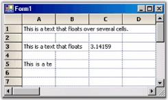' | markdownify }}
{:.image }

##### TabBarSplitterControl

TabBarSplitterControl enables users to create Tab Pages with dynamic splitters; when used with a grid control, it gives a workbook like appearance. It comes with Office 2007 Style by default, and supports all the three color schemes.

[C#]

this.tabBarSplitterControl.Style = Syncfusion.Windows.Forms.TabBarSplitterStyle.Office2007;

this.tabBarSplitterControl.Office2007ColorScheme = Syncfusion.Windows.Forms.Office2007Theme.Silver;

[VB.NET]

Me.tabBarSplitterControl.Style = Syncfusion.Windows.Forms.TabBarSplitterStyle.Office2007

Me.tabBarSplitterControl.Office2007ColorScheme = Syncfusion.Windows.Forms.Office2007Theme.Silver

{{ '' | markdownify }}
{:.image }

Custom Colors

We can apply custom colors to the TabBarSplitterControl by setting Office2007ColorScheme property to "Managed" and by giving the color through ApplyManagedColor method as follows.

[C#]

this.tabBarSplitterControl.Office2007ColorScheme = Syncfusion.Windows.Forms.Office2007Theme.Managed;

Office2007Colors.ApplyManagedColors(this, Color.PowderBlue);

[VB.NET]

Me.tabBarSplitterControl.Office2007ColorScheme = Syncfusion.Windows.Forms.Office2007Theme.Managed

Office2007Colors.ApplyManagedColors(Me, Color.PowderBlue)

{{ '' | markdownify }}
{:.image }

_Figure_ _306_: Custom Color of Tab Bar Splitter Control set to "PowderBlue"_

##### PrepareViewStyleInfo Event

PrepareViewStyleInfo event is raised to allow custom formatting of a cell by changing its style object just before it is drawn. This allows formatting based on the current view state, e.g. current cell context, focused control, and so on. For example, if you want draw the current row with a bold text, you can use PrepareViewStyleInfo to accomplish this task. The idea is to change the style to bold font for any cell in the current one. Given below are the steps that you can follow in order to implement this functionality.

* Add a handler for CurrentCellDeactivated to refresh the old row to remove its bold font. 
* Add a handler for CurrentCellActivated to refresh the new current row to add its bold font. 
* Add a handler for PrepareViewStyleInfo to conditionally change the bold style of the font if the requested cell is on the current row. 

To see a full working sample, check the HighlightCurrent sample that is shipped with Essential Grid. Notice that the work is done just by refreshing the grid (redraw) row. During refresh, PrepareViewStyleInfo is selected and the style is modified to be bold if the row is current. This means that no bold style information is saved anywhere. GridStyleInfo object is just temporarily modified immediately before it is used in the drawing.

##### Print Preview and Printing

Essential Grid directly supports printing and print previews through the .NET Framework classes Systems.Windows.Forms.PrintPreviewDialog and Systems.Windows.Forms.PrintDialog. A derived PrintDocument, GridPrintDocument is passed to these classes. This GridPrintDocument implements the printing logic that is needed to print multi-page grids. Following code example illustrates how to enable print previewing.

[C#]

//PrintPreview button handler.

private void PrintPreview_Click(object sender, System.EventArgs e)

{

    if (this.gridControl1 != null)

    {

        try 

        {

//Uses the default printer.

            GridPrintDocument pd = new GridPrintDocument(this.gridControl1, true); 

            PrintPreviewDialog dlg = new PrintPreviewDialog() ;

            dlg.Document = pd;

            dlg.ShowDialog();

        } 

        catch(Exception ex) 

        { 

            MessageBox.Show("An error occurred attempting to preview the grid - " + ex.Message);

        }

    }

}

private void Print_Click(object sender, System.EventArgs e)

{

    if (this.gridControl1 != null)

    {

        try 

        {

            GridPrintDocument pd = new GridPrintDocument(this.gridControl1, true); 

            PrintDialog dlg = new PrintDialog() ;

            dlg.Document = pd;

            if( dlg.ShowDialog() == DialogResult.OK)

                pd.Print();

        } 

        catch(Exception ex) 

        { 

            MessageBox.Show("An error occurred attempting to print the grid - " + ex.Message);

        }

    }

}

 [VB.NET]

'PrintPreview button handler.

Private Sub PrintPreview_Click(ByVal sender As Object, ByVal e As EventArgs)

    If (Not (gridControl1) Is Nothing) Then

        Try

            Dim pd As GridPrintDocument

            pd = New GridPrintDocument(gridControl1, True)

'Uses the default printer.

            Dim dlg As PrintPreviewDialog

            dlg = New PrintPreviewDialog()

            dlg.Document = pd

            dlg.ShowDialog()

        Catch ex As Exception

            MessageBox.Show(("An error occurred attempting to preview the grid - " + ex.Message))

        End Try

    End If

End Sub

'Print button handler.

Private Sub Print_Click(ByVal sender As Object, ByVal e As EventArgs)

    If (Not (gridControl1) Is Nothing) Then

        Try

            Dim pd As GridPrintDocument

            pd = New GridPrintDocument(gridControl1, True)

            ' Uses the default printer.

            Dim dlg As PrintDialog

            dlg = New PrintDialog()

            dlg.Document = pd

            If dlg.ShowDialog() = DialogResult.OK Then

                pd.Print()

            End If

        Catch ex As Exception

             MessageBox.Show(("An error occurred attempting to print the grid - " + ex.Message))

        End Try

    End If

End Sub

Grid Helper Features

The following are the features of Grid Helper that supports print preview and printing:

* Advanced printing
* Page layout
* Print Column To Fit

Advanced Printing

Multiple grids can be printed across various pages using helper class GridPrintDocumentAdv. This is achieved by drawing full sized grid to a large bitmap and then scaling this bitmap to fit the output page.

* Print Preview can be enabled by using GridPrintDocumentAdv class or by clicking Print Preview button under Grid Printing Options in UI.
* Columns can be specified to fit in a single page using ScaleColumnsToFitPage property or selecting Scale Columns To Fit check box under Grid Printing Options in UI. 
* Headers and footers can be added by using DrawGridPrintHeader and DrawGridPrintFooter events or by selecting Show Header and Footer check box under Grid Printing Options in UI.

Following code example illustrates Advanced Printing in Grid.

 [C#]

Syncfusion.GridHelperClasses.GridPrintDocumentAdv pd = new

Syncfusion.GridHelperClasses.GridPrintDocumentAdv(this.gridControl1);

pd.DefaultPageSettings.Margins = new System.Drawing.Printing.Margins(25, 25, 25, 25);

pd.HeaderHeight = 70;

pd.FooterHeight = 50;

pd.ScaleColumnsToFitPage = true;

PrintPreviewDialog previewDialog = new PrintPreviewDialog();

previewDialog.Document = pd;

previewDialog.Show();

[VB.NET]

Dim pd As Syncfusion.GridHelperClasses.GridPrintDocumentAdv = New

Syncfusion.GridHelperClasses.GridPrintDocumentAdv(Me.gridControl1)

pd.DefaultPageSettings.Margins = New System.Drawing.Printing.Margins(25, 25, 25, 25)

pd.HeaderHeight = 70

pd.FooterHeight = 50

pd.ScaleColumnsToFitPage = True

Dim previewDialog As PrintPreviewDialog = New PrintPreviewDialog()

previewDialog.Document = pd

previewDialog.Show()

Following screen shot illustrates Advanced Printing functionality provided by the GridPrintDocumentAdv class.

{{ '' | markdownify }}
{:.image }

Page Layout

The print Page Layout feature helps view the printing layout for the grid by displaying segment line and page number with each segment. This helps users to analyze page breaks within the grid and manage them accordingly. Colors for the line and text of the page layout can be defined with the properties available. Following code example illustrates this.

 [C#]

LayoutSupportHelper layoutHelper;

layoutHelper = new LayoutSupportHelper(gridControl1);

layoutHelper.LineColor = Color.Blue;

layoutHelper.TextColor = Color.Green;

[VB.NET]

Dim layoutHelper As LayoutSupportHelper

layoutHelper = New LayoutSupportHelper(gridControl1)

layoutHelper.LineColor = Color.Blue

layoutHelper.TextColor = Color.Green

Following screen shot shows the page layout of the grid, with the segment line and page number.

{{ '' | markdownify }}
{:.image }

> {{ '' | markdownify }}
{:.image }
_Note: The functionality mentioned above can also be achieved on UI by selecting Show Page Layout check box on the UI, which allows the user to view the page layout._

Print To Fit

An entire grid can be printed on a single page by deriving GridPrintDocument class to handle the printing of entire grid on a single page. The class achieves this by drawing full-size grid to a large bitmap and then scaling the same to fit the output page. Following code example illustrates this.

[C#]

GridPrintToFitDocument pd = new GridPrintToFitDocument(this.gridControl1, true);

PrintDialog dlg = new PrintDialog();

dlg.Document = pd;

if (dlg.ShowDialog() == DialogResult.OK)

pd.Print();

[VB.NET]

Dim dlg As PrintDialog = New PrintDialog()

dlg.Document = pd

If dlg.ShowDialog() = DialogResult.OK Then

pd.Print()

End If

Following screen shot illustrates the Grid's Print To Fit feature.

{{ '' | markdownify }}
{:.image }

This functionality can also be achieved by clicking PrintToFit button on UI. Refer Figure 3 on this page.

##### Multiple Grid Printing

Multiple grids can be printed across various pages using helper class MultipleGridPrintDocument. This is achieved by drawing full-size grid to a large bitmap and then scaling this bitmap to fit the output page.

* MultiGridPrinting - Customizes the way printing support is provided for grids. It enables multiple grids to be printed in a single print.
* PrintGridInNewPage - Multiple grids can be printed continuously. However, the consecutive grid’s starting page will begin on a new page.
* DefaultGridPrint - Multiple grids will be printed without considering column breaks.
* ScaleColumnsToFit - Multiple grid columns will be scaled to fit the printed page.

Properties

_Table 73: Properties Table_

<table>
<tr>
<td>
PROPERTY </td><td>
DESCRIPTION </td><td colspan = "2">
TYPE </td><td>
DATA TYPE </td><td>
REFERENCE LINKS </td></tr>
<tr>
<td>
GridPrintOptions</td><td>
Used to customize the printing of a grid.</td><td colspan = "2">
enum </td><td>
enum</td><td>
</td></tr>
<tr>
<td colspan = "3">
GRIDPRINTOPTIONS NAME</td><td colspan = "3">
DESCRIPTION</td></tr>
<tr>
<td colspan = "3">
MultiGridPrinting</td><td colspan = "3">
Multiple grids are printed in a single print continuously one after another. </td></tr>
<tr>
<td colspan = "3">
PrintGridInNewPage</td><td colspan = "3">
Prints multiple grids in a new page.</td></tr>
<tr>
<td colspan = "3">
DefaultGridPrint</td><td colspan = "3">
Default grid printing without column breaks for each new page.</td></tr>
<tr>
<td colspan = "3">
ScaleColumnsToFit </td><td colspan = "3">
Multiple grid columns are scaled to fit the printed page.</td></tr>
</table>

Sample Link

_<Install Location>\Syncfusion\EssentialStudio\[Version Number]\Windows\Grid.Windows\Samples\Printing\Multi-Grid Printing_

###### Adding Multi-Grid Printing to an Application

* The Print Preview can be enabled by using MultipleGridPrintDocument class or by clicking Print Preview button under Grid Printing Options in UI.
* Headers and footers can be added by using DrawGridPrintHeader and DrawGridPrintFooter events or by selecting Show Header and Footer check box under Grid Printing Options in UI.

[C#]

List<Control> gridsToPrint = new List<Control>();

foreach (Control cd in this.Controls)

{

   if (cd is Control)

   {

     gridsToPrint.Add((Control)cd);

   }

}

MultiGridPrintDocument pd = new MultiGridPrintDocument(gridsToPrint);

pd.GridPrintOption = MultiGridPrintDocument.GridPrintOptions.MultipleGridPrint;            

pd.ShowHeaderFooterOnAllPages = true;

PrintPreviewDialog printDialog = new PrintPreviewDialog();

printDialog.Document = pd;

printDialog.ShowDialog();

[VB]

Dim ctrls As New List(Of Control)()

Dim gridsToPrint As New List(Of Control)()

   For Each cd As Control In Me.Controls

       If TypeOf cd Is Control Then

         gridsToPrint.Add(CType(cd, Control))

       End If

   Next cd

Dim pd As New MultiGridPrintDocument(gridsToPrint)

pd.GridPrintOption = MultiGridPrintDocument.GridPrintOptions.MultipleGridPrint

pd.ShowHeaderFooterOnAllPages = True

Dim printDialog As New PrintPreviewDialog()

printDialog.Document = pd

printDialog.ShowDialog()

The following screen shot illustrates the advanced printing functionality provided by MultipleGridPrintDocument class:

{{ '' | markdownify }}
{:.image }

##### Drag Column Header

In Grid control, column header can be dragged to a new position by clicking on it, similar to how the fields in Microsoft Outlook are dragged without selecting the columns. This feature can be enabled in Grid control by adding DragColumnHeader option under ControllerOptions property. The event QueryAllowDragColumnHeader can be handled, while performing the drag operation.

The following code examples illustrate this feature.

[C#]

this.gridControl1.ControllerOptions |= GridControllerOptions.DragColumnHeader;

void gridControl1_QueryAllowDragColumnHeader(object sender, GridQueryDragColumnHeaderEventArgs e)

{

if (e.Reason != GridQueryDragColumnHeaderReason.HitTest)

System.Diagnostics.Debug.WriteLine("gridControl1_QueryAllowDragColumnHeader: " + e.ToString());

}

[VB.NET]

Me.gridControl1.ControllerOptions = Me.gridControl1.ControllerOptions Or GridControllerOptions.DragColumnHeader

Private Sub gridControl1_QueryAllowDragColumnHeader(ByVal sender As Object, ByVal e As                                                    GridQueryDragColumnHeaderEventArgs)

    If e.Reason <> GridQueryDragColumnHeaderReason.HitTest Then

        System.Diagnostics.Debug.WriteLine("gridControl1_QueryAllowDragColumnHeader: " & e.ToString())

    End If

End Sub

 The following screen shot illustrates how to drag the column header.

{{ '' | markdownify }}
{:.image }

##### OLE Drag-and-Drop

Essential Grid offers support functionality like Object Linking and Embedding (OLE) Drag-and-Drop. A range in one grid can be selected and dragged to another grid or into a Rich Edit Box. The following screen shot shows selected region of grid that has been dragged and dropped into another grid:

{{ '' | markdownify }}
{:.image }

The following code example illustrates this feature.

[C#]

gridControl1.AllowDrop = true;

gridControl2.AllowDrop = true;

private void gridControl1_DragOver(object sender, DragEventArgs e)

{

    e.Effect = DragDropEffects.Copy;

}

private void gridControl2_DragOver(object sender, DragEventArgs e)

{

    e.Effect = DragDropEffects.Copy;

}

[VB.NET]

gridControl1.AllowDrop = True

gridControl2.AllowDrop = True

private void gridControl1_DragOver(Object sender, DragEventArgs e)

e.Effect = DragDropEffects.Copy

private void gridControl2_DragOver(Object sender, DragEventArgs e)

e.Effect = DragDropEffects.Copy

##### Selection Modes

Essential Grid supports different selection modes for grid cells. A specific selection behavior can be set through GridControl.AllowSelection property. The following screen shot shows a window with a list of selection modes.

{{ '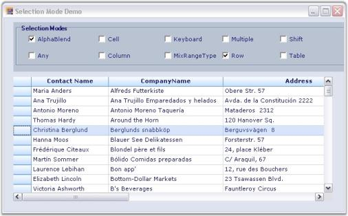' | markdownify }}
{:.image }

Different types of selection modes are listed with their corresponding descriptions:

* Thealpha blending to highlight selected cellscan be achieved by using GridSelectionFlags.AlphaBlend option or selecting AlphaBlend check box under Selection Modes group box in UI. 
* Thedefault behavior for selecting cells, rows, columns, tables, multiple extending SHIFT key support, and alpha blendingcan be achieved by using GridSelectionFlags.Any option or selecting Any check box under Selection Modes group box in UI. 
* Column selectioncan be achieved by using GridSelectionFlags.Column option or selecting Column check box under Selection Modes group box in UI. 
* Row selectioncan be achieved by using GridSelectionFlags.Row option or selecting Row check box under Selection Modes group box in UI. 
* An existing selection can be extended when a user holds SHIFT key and uses arrow keys by using GridSelectionFlags.Keyboard option or selecting Keyboard check box under Selection Modes group box in UI. 
* Selection of both rows and columns simultaneously when multiple selection is enabledcan be achieved by using GridSelectionFlags.MixRangeType option or selecting MixRangeType check box under Selection Modes group box in UI.
* Selection of entire table can be achieved by using GridSelectionFlags.Table option or selecting Table check box under Selection Modes group box in UI.
* Selection of multiple ranges of cells using CTRL key can be achieved by using GridSelectionFlags.Multiple option or selecting Multiple check box under Selection Modes group box in UI.
* An existing selection using SHIFT key can be extended by using GridSelectionFlags.Shift option or selecting Shift check box under Selection Modes group box in UI. 
* Selection of cells using CTRL key can be disabled by using GridSelectionFlags.None option or selecting Cell check box under Selection Modes group box in UI. 

Setting Specific Selection Mode

Specific selection modes can be set by using the following code examples:

[C#]

this.gridControl1.AllowSelection = GridSelectionFlags.Row;

[VB.NET]

Me.gridControl1.AllowSelection = GridSelectionFlags.Row

##### Banner Cells

Banner cells are multiple cells spanning a single background image. An image to be displayed in the cell can be loaded on disk, by changing the BackgroundImage property for a cell in Property Grid and applying a Banner for the cell area, displaying the image. For a cell background color, Gradient style can be set. Custom cell backgrounds can be drawn by handling DrawCellBackground event. Banner cells can also be defined through a recurring pattern by handling QueryBanneredRange event.

The following screen shot shows an example of how multiple cells span a single background image to form banner cells.

{{ '' | markdownify }}
{:.image }

Displaying Image using Banner Cells

The following code example illustrates how to display images by using banner cells:

 [C#]

GridStyleInfo style;

style = grid[4, 3];

grid.BanneredRanges.Add(GridRangeInfo.FromTlhw(4, 3, 8, 3));

style.BackgroundImage = GetImage(@"common\Images\Grid\BannerCells\back1.jpg");

style.Text = "back1.jpg";

style.TextColor = Color.Red;

style.BackgroundImageMode = GridBackgroundImageMode.StretchImage;

[VB.NET]

Dim style As GridStyleInfo

style = grid(4, 3)

grid.BanneredRanges.Add(GridRangeInfo.FromTlhw(4, 3, 8, 3))

style.BackgroundImage = GetImage("common\Images\Grid\BannerCells\back1.jpg")

style.Text = "back1.jpg"

style.TextColor = Color.Red

style.BackgroundImageMode = GridBackgroundImageMode.StretchImage

##### Merge Cells Feature

Merge Cells feature merges two or more adjacent cells with the same value into one cell and displays the content in the merged cell. A single cell is created by combining two or more selected cells.

> {{ '' | markdownify }}
{:.image }
_Note: The data in the merged cells will be displayed on the first cell of the merged range._

To use merge cells, you need to set Model.Options.MergeCellsMode and MergeCell properties of the cells to select the required merge behavior for cells.

1. The GridMergeCellsMode enumeration specifies behavior of the merged cells in a grid. Following is the list of options under this enumeration:
* None-

Merge cells behavior is disabled.

* OnDemandCalculation-

The number of cells to be merged are calculated before the merged cells are displayed and the results are saved. Floating cells will only be recalculated if the width or content of the cells change.

* BeforeDisplayCalculation-

The number of cells to be merged are always calculated before cells are displayed.

* MergeRowsInColumn-

Enables merging of neighboring cells among rows in the same column.

* MergeColumnsInRow-

Enables merging of neighboring cells among columns in the same row.

* SkipHiddenCells-

Skips hidden rows and columns while merging the cells. This means that the hidden rows or columns in the grid are not considered during the merge process.

2. GridMergeCellDirection enumeration specifies the merge behavior for an individual cell when merging cells feature has been enabled. Here is the list of options offered:
* None-

Merging cells is disabled.

* ColumnsInRow-

Merges with neighboring columns in the same row.

* RowsInColumn-

Merges with neighboring rows in the same column.

The following code examples illustrate how to set the MergeCellsMode and MergeCell properties.

[C#]

this.gridControl1.Model.Options.MergeCellsMode = GridMergeCellsMode.OnDemandCalculation | GridMergeCellsMode.MergeRowsInColumn;

//Merges cells in column 2.

this.gridControl1.ColStyles[2].MergeCell = GridMergeCellDirection.RowsInColumn;

[VB.NET]

Me.gridControl1.Model.Options.MergeCellsMode = GridMergeCellsMode.OnDemandCalculation Or GridMergeCellsMode.MergeRowsInColumn

'Merges cells in column 2.

Me.gridControl1.ColStyles(2).MergeCell = GridMergeCellDirection.RowsInColumn

The following screen shots illustrate the merge cells feature in Essential Grid.

{{ '' | markdownify }}
{:.image }

{{ '' | markdownify }}
{:.image }

##### Real-time Applications

This section provides information on the real-time applications of Essential Grid. It includes the following topics.

###### Gaming Applications

Essential Grid is used to implement gaming applications.

Example

Let us consider the Tetris game application, which is implemented by using Essential Grid. This game application makes use of arrow keys to move the blocks and change the block shape. It also provides an option to display the next block.

{{ '' | markdownify }}
{:.image }

A sample demonstrating this feature is available under the following sample installation path.

_<Install Location>\Syncfusion\EssentialStudio\[Version Number]\Windows\Grid.Windows\Samples\Product Showcase\Essential Blocks Demo_

###### MS Excel 2007-like UI

Essential Grid control provides support to implement Microsoft Excel 2007-like User Interface (UI). It contains Name Box that shows the current selection range and Formula Bar, which supports the formula cells. The row and column headers of the selected range are highlighted on the UI. This feature is similar to Excel.

{{ '' | markdownify }}
{:.image }

A sample demonstrating this feature is available under the following sample installation path.

_<Install Location>\Syncfusion\EssentialStudio\[Version Number]\Windows\Grid.Windows\Samples\Product Showcase\Excel Like UI Demo_

###### Grid Folder Browser

Essential Grid can be used to develop a powerful TreeView control owing to its flexibility. The tree nodes can be created through custom TreeCell cell type. GridStaticCellModel class is inherited to create this cell type. The plus/minus buttons of the tree nodes are selected by using ImageIndex property. 

Example

Let us consider the Grid Folder Browser sample which is available under the following installation path.

_<Install Location>\Syncfusion\EssentialStudio\[Version Number]\Windows\Grid.Windows\Samples\Product Showcase\Grid Folder Browser Demo_

This sample operates grid in virtual mode in order to populate the data dynamically on demand, i.e., when the tree is expanded. QueryCellInfo, QueryColCount and QueryRowCount events must be handled in order to implement virtual grid. These events provide basic information about the number of rows and columns and the values of the data.

The following code example illustrates how to set the data from the data source.

[C#]

void GridQueryCellInfo(object sender, GridQueryCellInfoEventArgs e) 

{

if (e.RowIndex > 0 && e.ColIndex > 0) 

{ 

e.Style.CellValue = externalData[e.RowIndex - 1].Items[e.ColIndex - 1]; 

if (e.ColIndex == 1) 

{

e.Style.CellType = "TreeCell"; 

e.Style.Tag = externalData[e.RowIndex - 1].IndentLevel; 

e.Style.ImageIndex = (int) externalData[e.RowIndex - 1].ExpandState; 

} 

}

e.Handled = true;

}

 [VB.NET]

Private Sub GridQueryCellInfo(ByVal sender As Object, ByVal e As GridQueryCellInfoEventArgs)

If e.RowIndex > 0 AndAlso e.ColIndex > 0 Then

e.Style.CellValue = externalData(e.RowIndex - 1).Items(e.ColIndex - 1)

If e.ColIndex = 1 Then

e.Style.CellType = "TreeCell"

e.Style.Tag = externalData(e.RowIndex - 1).IndentLevel

e.Style.ImageIndex = CInt(Fix(externalData(e.RowIndex - 1).ExpandState))

End If

End If

e.Handled = True

End Sub

The implementation uses CollapsibleDataSource class. This class makes use of custom collection to hold a list of SampleData objects. (Consider each of these objects as a row in the underlying grid). Each row carries information on a specific folder. Each SampleData object has IndentValue property, ExpandState property, and Items string array that holds the different column values for this row. The column values display folder details like the name of the folder, folder size and so on. This class also contains InsertData method, which retrieves data of inner subtree and inserts data into the collection when a node is expanded.

{{ '' | markdownify }}
{:.image }

##### Multiple Document Interface (MDI) Support

Essential Grid supports Multiple Document Interface (MDI) by enabling users to work with multiple grid controls simultaneously. Here, multiple windows reside under a single parent window.

{{ '' | markdownify }}
{:.image }

A sample demonstrating this feature is available under the following sample installation path.

_<Install Location>\Syncfusion\EssentialStudio\[Version Number]\Windows\Grid.Windows\Samples\Product Showcase\Grid Pad Demo_

##### Clipboard Support

This section discusses clipboard support provided by Essential Grid. It includes the following topics.

###### Managing Clipboard Operations with GridModelCutPaste

GridModelCutPaste class manages Cut, Copy and Paste operations for a grid. You can access this class from a grid with the Grid.Model.CutPaste property. This class provides many properties and functions.

Here is the list of properties and methods:

* ClipboardFlags -This property gets or sets various properties of GridDragDropFlags class, which specifies how the clipboard operations like cut, copy, and paste should be handled.

The following code examples illustrate how to set ClipboardFlags by using the GridDragDropFlags.Styles property:

[C#]

this.gridControl1.Model.CutPaste.ClipboardFlags = GridDragDropFlags.Styles;

[VB.NET]

Me.gridControl1.Model.CutPaste.ClipboardFlags = GridDragDropFlags.Styles

* CanCopy - This method checks whether there are selected ranges of cells that can be copied to clipboard or if the current cell's contents can be copied. The return type of this method is Boolean. If it returns true, it indicates that the selected range of cells or the current cell's contents can be copied to the clipboard. If it is false, it indicates that the selected range of cells or the current cell's contents cannot be copied to the clipboard.
> 
{{ '' | markdownify }}
{:.image }
_Note: Any content copied is pasted to the Clipboard by default._

The following code example is used to call CanCopy method:

[C#]

this.gridControl1.Model.CutPaste.CanCopy();

[VB.NET]

Me.gridControl1.Model.CutPaste.CanCopy()

* Copy - This method copies the contents of selected cells and the current cell's contents to the clipboard.

The following code example is used to call the Copy method:

 [C#]

this.gridControl1.Model.CutPaste.Copy();

[VB.NET]

Me.gridControl1.Model.CutPaste.Copy()

* CopyRange(GridRangeInfo range) - This method copies the contents of a specified range of cells to the clipboard. The range of cells to be copied is given to the method as a parameter. For example, if the range is specified to be (2,2), the selection is restricted to the cell with row index 2 and column index 2 of the grid.

The following code example shows how to call this method:

[C#]

this.gridControl1.Model.CutPaste.CopyRange(GridRangeInfo.Cell(2, 2));

[VB.NET]

Me.gridControl1.Model.CutPaste.CopyRange(GridRangeInfo.Cell(2, 2))

* CopyTextToClipboard(GridRangeInfo range) - This method copies the formatted text of a specified range of cells to clipboard. The range of cells to be copied is given to the method as a parameter. For example, if the range is specified to be (1,2,1,4), the selection starts from the cell (1,2) – with row index 1 and column index 2 to the cell (1,4) – with row index 1 and column index 4 of the grid.

The following code example shows how to call this method:

[C#]

this.gridControl1.Model.CutPaste.CopyTextToClipboard(GridRangeInfo.Cells(1, 2, 1, 4));

[VB.NET]

Me.gridControl1.Model.CutPaste.CopyTextToClipboard(GridRangeInfo.Cells(1, 2, 1, 4))

* CopyCellsToClipboard(GridRangeInfoList list, bool bLoadBaseStyles) - This method copies the style information of a specified range of cells to clipboard. The range of cells to be copied is given to the method as the first parameter. The second parameter represents a Boolean value. The base style will be copied along with default settings, if it is set to true. Only the default settings that were initialized to the cell are copied if it is set to false.

The following code example shows how to call this method:

[C#]

GridRangeInfoList list = new GridRangeInfoList();

list.Add(GridRangeInfo.Cell(2, 2));

this.gridControl1.Model.CutPaste.CopyCellsToClipboard(list, true);

[VB.NET]

Dim list As New GridRangeInfoList()

list.Add(GridRangeInfo.Cell(2, 2))

Me.gridControl1.Model.CutPaste.CopyCellsToClipboard(list, True)

* CanCut-This method checks if there are selected ranges that can be cut or if the current cell's contents can be cut. The return type of this method is Boolean. If it returns true, it indicates that the content in the selected range of cells or the current cell's content can be cut. This method returns false, when no selected range is available to cut.
> 
{{ '' | markdownify }}
{:.image }
_Note: Any content cut is pasted to the clipboard by default._

The following code example shows how to call this method:

[C#]

this.gridControl1.Model.CutPaste.CanCut();

[VB.NET]

Me.gridControl1.Model.CutPaste.CanCut()

* Cut - This method cuts the content of the selected cells and the current cell, and pastes them to the clipboard.

The following code example shows how to call this method:

[C#]

this.gridControl1.Model.CutPaste.Cut();

[VB.NET]

Me.gridControl1.Model.CutPaste.Cut()

* CutRange(GridRangeInfo rangelist) - This method cuts the content of a specified range of cells and pastes it to the clipboard. The range of cells to be cut is specified as a parameter. 

The following code examples show how to call this method:

[C#]

this.gridControl1.Model.CutPaste.CutRange(GridRangeInfo.Row(4), false);

[VB.NET]

Me.gridControl1.Model.CutPaste.CutRange(GridRangeInfo.Row(4), False)

* CanPaste - This method checks for the most recent content in the clipboard that can be pasted in the grid. The return type of this method is Boolean. If it returns true, it indicates that the contents in the clipboard can be pasted into the grid. If there is no content available in the clipboard to paste, this method returns false.

The following code example shows how to call this method:

[C#]

this.gridControl1.Model.CutPaste.CanPaste();

[VB.NET]

Me.gridControl1.Model.CutPaste.CanPaste()

* Paste-This method pastes the content from the clipboard into the grid at the current selected range or current cell.
> 
{{ '' | markdownify }}
{:.image }
_Note: It is not mandatory to call this method after CanPaste method. If there is no content in the clipboard to be pasted, this method will not respond._

The following code examples show how to call this method:

[C#]

this.gridControl1.Model.CutPaste.Paste();

[VB.NET]

Me.gridControl1.Model.CutPaste.Paste()

###### Clipboard Events

Essential Grid exposes various events to manage the clipboard content while performing cut, paste and copy operations. Following is the list of clipboard events:

* ClipboardCanCopy - This event is to be handled when the CanCopy method of grid is called.
* ClipboardCanPaste - This event is to be handled when the CanPaste method of grid is called.
* ClipboardCanCut - This event is to be handled when the CanCut method of grid is called.
* ClipboardCopy - This event is to be handled when the Copy method of grid is called.
* ClipboardCut - This event is to be handled when the Cut method of grid is called.
* ClipboardPaste - This event is to be handled when the Paste method of grid is called.
* ClipboardPasted - This event is to be handled after a paste operation.
##### Performance

Essential Grid control has an extremely high performance standard. It can handle high frequency updates and work with large amounts of data without its performance being affected.

###### High Frequency Real Time Updates

Essential Grid supports frequent updates that occur in random cells across the grid while keeping CPU usage to a minimum level.

Example:

In this example, a timer changes the cell in short intervals, inserts and removes rows. This example draws cell changes directly to the graphics context instead of performing an Invalidate. It also shows you text using GDI instead of GDI+ and how to optimize updates for inserting and removing rows. You can start multiple instances without slowing down your machine. You can confirm the same by viewing TaskManager CPU usage while the sample runs.

{{ '' | markdownify }}
{:.image }

A sample demonstrating this feature is available under the following sample installation path:

_<Install Location>\Syncfusion\EssentialStudio\[Version Number]\Windows\Grid.Windows\Samples\Performance\Trader Grid Test Demo_

###### Data Handling

Essential Grid control supports large amount of data without a performance hit.

Example:

This example will step you through following three ways of populating an Essential Grid:

* The first technique just loops through cells and uses an indexer on the Grid control to set the values.
* The second uses PopulateValues method that optimally places data from a data source into a grid range.
* The third technique uses an Essential Grid in a virtual manner.

You can specify the size of the grid that is to be populated while running the sample and then you can try all the three methods to compare the performance. However, the .NET Framework JIT slows the first population owing to one-time jitting of the code.

2. Using Indexer

This technique loops through the cells and uses an indexer on the Grid control to set values.

[C#]

for (int i = 0; i < this.numArrayRows; ++i)

    for (int j = 0; j < this.numArrayCols; ++j)

        this.gridControl1[i + 1, j + 1].CellValue = this.intArray[i, j]; 

[VB.NET]

For i As Integer = 0 To Me.numArrayRows - 1

For j As Integer = 0 To Me.numArrayCols - 1

Me.gridControl1(i + 1, j + 1).CellValue = Me.intArray(i, j)

Next j

Next i

3. Populating Values
4. PopulateValues method is used to move values from a given data source into the specified grid range. The first parameter specifies range of destination cells where data is to be copied and the second parameter specifies data source to the destination cells.

[C#]

gridControl1.Model.PopulateValues(GridRangeInfo.Cells(top, left, bottom, right), this.intArray);

[VB.NET]

gridControl1.Model.PopulateValues(GridRangeInfo .Cells(top, left, bottom, right), Me.intArray)

5. Implementing Virtual Mode
6. Three events need to be handled in order to implement a virtual mode. They perform the following actions:
* Determine number of rows
* Determine number of columns
* Pass value to a cell from a data source.

[C#]

//Determines number of rows.      

this.gridControl1.QueryRowCount += new GridRowColCountEventHandler(GridQueryRowCount); 

private void GridQueryRowCount(object sender, GridRowColCountEventArgs e)

{ 

    e.Count = this.numArrayRows;

    e.Handled = true;

}  

//Determines number of columns.

this.gridControl1.QueryColCount += new GridRowColCountEventHandler(GridQueryColCount);       

private void GridQueryColCount(object sender, GridRowColCountEventArgs e)

{

    e.Count = this.numArrayCols;

    e.Handled = true;

}

//Passes value to a cell from a given data source.

this.gridControl1.QueryCellInfo += new GridQueryCellInfoEventHandler(QueryCellInfoHandler);

private void GridQueryCellInfo(object sender, GridQueryCellInfoEventArgs e)

{

    if(e.ColIndex > 0 && e.RowIndex > 0)

    {

//By using indexers, passes value to a cell from a given data source.

        e.Style.CellValue = this.intArray[e.RowIndex - 1, e.ColIndex - 1];

        e.Handled = true;

    }

}

[VB.NET]

'Determines number of rows.

Private Me.gridControl1.QueryRowCount += New GridRowColCountEventHandler(AddressOf GridQueryRowCount)

Private Sub GridQueryRowCount(ByVal sender As Object, ByVal e As GridRowColCountEventArgs)

e.Count = Me.numArrayRows

e.Handled = True

End Sub

'Determines the number of columns.

Private Me.gridControl1.QueryColCount += New GridRowColCountEventHandler(AddressOf GridQueryColCount)

Private Sub GridQueryColCount(ByVal sender As Object, ByVal e As GridRowColCountEventArgs)

e.Count = Me.numArrayCols

e.Handled = True

End Sub

'Passes value to a cell from a given data source.

Private Me.gridControl1.QueryCellInfo += New GridQueryCellInfoEventHandler(AddressOf QueryCellInfoHandler)

Private Sub GridQueryCellInfo(ByVal sender As Object, ByVal e As GridQueryCellInfoEventArgs)

If e.ColIndex > 0 AndAlso e.RowIndex > 0 Then

'By using indexers, passes value to a cell from a given data source.

e.Style.CellValue = Me.intArray(e.RowIndex - 1, e.ColIndex - 1)

e.Handled = True

End If

End Sub

{{ '' | markdownify }}
{:.image }

A sample demonstrating this feature is available under the following sample installation path.

_<Install Location>\Syncfusion\EssentialStudio\[Version Number]\Windows\Grid.Windows\Samples\Performance\Trader Grid Test Demo_

##### Zooming options

This section discusses the following zooming options:

###### Cell-level and grid-level

We can implement zooming functionality in Essential Grid to show a magnified image of the Grid for better visualization. A method named ZoomGrid is used for this purpose. It accepts the percentage of zoom as the parameter and then uses this value to set the font size and cell size for the grid. Zooming can be implemented at cell-level and at grid-level.

The following screen shot shows a grid that is zoomed to the grid-level.

{{ '' | markdownify }}
{:.image }

The following screen shot shows a grid that is zoomed to the cell-level.

{{ '' | markdownify }}
{:.image }

Example

This example implements zooming functionality for Essential Grid at cell-level. Follow the steps listed below:

1. Call the ZoomGrid method by passing the percentage of zoom as the parameter. The below code illustrates this.

[C#]

private void zoomGrid(float percent)

{

    this.gridControl1.BeginUpdate();

    currentPercent = percent;

    for (int i = 0; i <= gridControl1.ColCount; i++)

    {

        for (int j = 0; j <= gridControl1.RowCount; j++)

        this.gridControl1[j, i].Font.Size = fontSize * currentPercent;

        this.gridControl1.Model.ColWidths[i] = (int)(percent * defColWidth);

    }

    this.gridControl1.ColWidths[0] = (int)(percent * headerColWd);

    this.gridControl1.DefaultColWidth = (int)(percent * defColWidth);

    this.gridControl1.DefaultRowHeight = (int)(percent * defRowHeight);

    this.gridControl1.RowHeights[0] = (int)(percent * headerRowHt);

    this.gridControl1.EndUpdate();

    this.gridControl1.Refresh();

}

[VB.NET]

Private Sub zoomGrid(ByVal percent As Single)

    Me.label1.Text = Me.trackBar1.Value.ToString() & "%"

    Me.label1.Refresh()

    Me.gridControl1.BeginUpdate()

    currentPercent = percent

    For i As Integer = 0 To gridControl1.ColCount

        For j As Integer = 0 To gridControl1.RowCount

            Me.gridControl1(j, i).Font.Size = fontSize * currentPercent

        Next j

        Me.gridControl1.Model.ColWidths(i) = CInt(Fix(percent * defColWidth))

    Next i

    Me.gridControl1.ColWidths(0) = CInt(Fix(percent * headerColWd))

    Me.gridControl1.DefaultColWidth = CInt(Fix(percent * defColWidth))

    Me.gridControl1.DefaultRowHeight = CInt(Fix(percent * defRowHeight))

    Me.gridControl1.RowHeights(0) = CInt(Fix(percent * headerRowHt))

    Me.gridControl1.EndUpdate()

    Me.gridControl1.Refresh()

End Sub

The preceding code sets the font and cell size using the percent parameter.

2. When the cell to be zoomed is clicked, handle CellClick event to display it as a zoomed cell. Here we use a PictureBox to show the magnified view of the cell content. 
> 
{{ '' | markdownify }}
{:.image }
_Note: A PictureBox is a Microsoft’s .NET Control used to display an image._

[C#]

//Code to show zoomed window.

private System.Windows.Forms.PictureBox zoomWindow;

private void gridControl1_CellClick(object sender, GridCellClickEventArgs e)

{

    if (e.RowIndex > 0 && e.ColIndex > 0)

    {

        if (checkBox1.Checked)

        {

            if (!zoomWindow.Visible)

            this.zoomWindow.Visible = true;

            Point p1 = new Point(0, 0);

            Size s = new Size(this.gridControl1.ColWidths[e.ColIndex] + 10, this.gridControl1.RowHeights[e.RowIndex] + 5);

            s.Width += 50;

            s.Height += 30;

            Rectangle rect = new Rectangle(p1, s);

            zoomWindow.Size = s;

            Bitmap bmp = new Bitmap(s.Width, s.Height);

            Graphics g = Graphics.FromImage(bmp);

            GridStyleInfo style = gridControl1[e.RowIndex, e.ColIndex];

            float size = style.Font.Size;

            style.Font.Size = 15.5f;

            gridControl1.DrawSingleCell(g, e.RowIndex, e.ColIndex, rect, style, true, true);

            g.Dispose();

            this.zoomWindow.Image = bmp;

            this.zoomWindow.BorderStyle = BorderStyle.FixedSingle;

            this.zoomWindow.Visible = true;

            Point pt = this.gridControl1.ViewLayout.RowColToPoint(e.RowIndex, e.ColIndex, GridCellSizeKind.VisibleSize);

            pt.Y += 60;

            zoomWindow.Location = pt;

            style.Font.Size = size;

        }

    }

    else

    {

        this.zoomWindow.Visible = false;

        MessageBox.Show("Not a record cell");

    }

}

[VB.NET]

Private zoomWindow As System.Windows.Forms.PictureBox

'Code to show zoomed window.

Private Sub gridControl1_CellClick(ByVal sender As Object, ByVal e As GridCellClickEventArgs)

    If e.RowIndex > 0 AndAlso e.ColIndex > 0 Then

        If checkBox1.Checked Then

            If (Not zoomWindow.Visible) Then

                Me.zoomWindow.Visible = True

            End If

            Dim p1 As Point = New Point(0, 0)

            Dim s As Size = New Size(Me.gridControl1.ColWidths(e.ColIndex) + 10, Me.gridControl1.RowHeights(e.RowIndex) + 5)

            s.Width += 50

            s.Height += 30

            Dim rect As Rectangle = New Rectangle(p1, s)

            zoomWindow.Size = s

            Dim bmp As Bitmap = New Bitmap(s.Width, s.Height)

            Dim g As Graphics = Graphics.FromImage(bmp)

            Dim style As GridStyleInfo = gridControl1(e.RowIndex, e.ColIndex)

            Dim size As Single = style.Font.Size

            style.Font.Size = 15.5F

            gridControl1.DrawSingleCell(g, e.RowIndex, e.ColIndex, rect, style, True, True)

            g.Dispose()

            Me.zoomWindow.Image = bmp

            Me.zoomWindow.BorderStyle = BorderStyle.FixedSingle

            Me.zoomWindow.Visible = True

            Dim pt As Point = Me.gridControl1.ViewLayout.RowColToPoint(e.RowIndex, e.ColIndex, GridCellSizeKind.VisibleSize)

            pt.Y += 60

            zoomWindow.Location = pt

            style.Font.Size = size

        End If

    Else

        Me.zoomWindow.Visible = False

        MessageBox.Show("Not a record cell")

    End If

End Sub

Now when you click any cell, it displays a picture box over the cell showing cell content in a magnified manner.

> {{ '' | markdownify }}
{:.image }
_Note: For more details on this feature, refer the following browser sample:_

_<Install Location>\Syncfusion\EssentialStudio\[Version Number]\Windows\Grid.Windows\Samples\Zoom and Scroll\Zooming Demo_

##### Tile Image In Grid Cell 

Essential GridControl supports Tile Image feature in Grid cell. Set BackgroundImageMode property to GridBackgroundImageMode.TileImage to add title image in grid cell.

The following code illustrates how to add Tile Image feature in Grid cell.

[C#]

this.gridControl1[2, 2].BackgroundImageMode = GridBackgroundImageMode.TileImage;

[VB]

  Me.gridControl1(2, 2).BackgroundImageMode = GridBackgroundImageMode.TileImage

When the code runs, the following image is displayed.

{{ '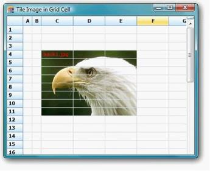' | markdownify }}
{:.image }

### Grid Grouping Control

Grid Grouping control supports grouping with summaries, filters, and expression columns, and can be used with flat data sources, hierarchical data sources, or data sources with multiple nested tables.

#### Creating Grid Grouping Control

This section will provide step-by-step procedure to create Grid Grouping control through designer and through programmatical approach in a .NET application.

##### Through Designer

For details, see Tutorials Lesson 1: Grid Grouping Control Designer.

##### Through Code

This section will give you a step by step tutorial on creating Grid Grouping control through code. You can bind Grid Grouping control either to an MDB file or to data source that has been created manually.

In this lesson, you will learn about the following topics.

###### Binding a Grid Grouping Control to an MDB File

This example illustrates how to bind Grid Grouping control to an MDB file at run time. It uses OleDbConnection and OleDbAdapter objects to get connected to data source that exposes OLE DB interface. Try a similar approach to connect to a database from MS SQL Server.

1. Include the required namespace.

[C#]

using Synctusion.Windows.Forms.Grid.Grouping;

using System.Data.OleDb;

[VB.NET]

Imports Synctusion.Windows.Forms.Grid.Grouping

Imports System.Data.OleDb

2. Create an instance of Grid Grouping control and specify its size.

[C#]

private Syncfusion.Windows.Forms.Grid.Grouping.GridGroupingControl gridGroupingControl1;

this.gridGroupingControl1 = new Syncfusion.Windows.Forms.Grid.Grouping.GridGroupingControl();

this.gridGroupingControl1.Size = new System.Drawing.Size(160, 200 );

[VB.NET]

Private gridGroupingControl1 As Syncfusion.Windows.Forms.Grid.Grouping.GridGroupingControl

Me.gridGroupingControl1 = New Syncfusion.Windows.Forms.Grid.Grouping.GridGroupingControl()

Me.gridGroupingControl1.Size = New System.Drawing.Size(160, 200 )

3. Set up Data Source.

[C#]

//Creates Connection Object. 

OleDbConnection connection = new OleDbConnection("Provider=Microsoft.Jet.OLEDB.4.0;Data Source=C:\\Data\\NWIND.MDB");

//Creates Data Adapter. 

OleDbDataAdapter adapter = new OleDbDataAdapter("SELECT * FROM Customers", connection);

// Creates and fills Data Set. 

DataSet dtSet = new DataSet();

adapter.Fill(dtSet);

[VB.NET]

'Creates Connection Object. 

Dim Connection As OleDbConnection = New OleDbConnection("Provider=Microsoft.Jet.OLEDB.4.0;Data Source=C:\\Data\\NWIND.MDB")

'Creates Data Adapter. 

Dim Adapter As OleDbDataAdapter = New OleDbDataAdapter("SELECT * FROM Customers", Connection)

'Creates and fills Data Set.

Dim dtSet As DataSet = New DataSet()

Adapter.Fill(dtSet)

4. Bind the grid grouping control to this data table by setting its DataSource property.

[C#]

this.gridGroupingControl1.DataSource = dtSet.Tables[0]; 

[VB.NET]

Me.GridGroupingControl1.DataSource = dtSet.Tables(0)

5. Finally add the grid grouping control to the form.

[C#]

this.Controls.Add(this.gridGroupingControl1); 

[VB.NET]

Me.Controls.Add(Me.GridGroupingControl1)

6. When you run the application, the grid will look like the following image.

{{ '' | markdownify }}
{:.image }

###### Bind a Grid Grouping Control to a Manual Data Source

Here are some code samples that will create DataTable and bind it to Grid Grouping control. Once you have DataTable object populated, you can use GridGroupingControl.DataSource property to implement the binding.

1. Include the required namespace.

[C#]

using Synctusion.Windows.Forms.Grid.Grouping;

[VB.NET]

Imports Synctusion.Windows.Forms.Grid.Grouping

2. Create an instance of Grid Grouping control and specify its size.

[C#]

private Syncfusion.Windows.Forms.Grid.Grouping.GridGroupingControl gridGroupingControl1;

this.gridGroupingControl1 = new Syncfusion.Windows.Forms.Grid.Grouping.GridGroupingControl();

this.gridGroupingControl1.Size = new System.Drawing.Size(160, 200 );

[VB.NET]

Private gridGroupingControl1 As Syncfusion.Windows.Forms.Grid.Grouping.GridGroupingControl

Me.gridGroupingControl1 = New Syncfusion.Windows.Forms.Grid.Grouping.GridGroupingControl()

Me.gridGroupingControl1.Size = New System.Drawing.Size(160, 200 )

3. Set up the Data Source.

[C#]

DataTable myDataTable = new DataTable("MyDataTable");

//Declares Data Column and Data Row variables.

DataColumn myDataColumn;

DataRow myDataRow;

//Creates new Data Column, sets Data Type and Column Name and adds to the Data Table.   

myDataColumn = new DataColumn();

myDataColumn.DataType = System.Type.GetType("System.Int32");

myDataColumn.ColumnName = "id";

myDataTable.Columns.Add(myDataColumn);

//Creates a second column.

myDataColumn = new DataColumn();

myDataColumn.DataType = Type.GetType("System.String");

myDataColumn.ColumnName = "item";

myDataTable.Columns.Add(myDataColumn);

//Creates new Data Row objects and adds to the Data Table.    

for (int i = 0; i <= 10; i++)

{

    myDataRow = myDataTable.NewRow();

    myDataRow["id"] = i;

    myDataRow["item"] = "item " + i.ToString();

    myDataTable.Rows.Add(myDataRow);

}

[VB.NET]

Dim myDataTable As DataTable = New DataTable("MyDataTable")

'Declares Data Column and Data Row variables.

Dim myDataColumn As DataColumn

Dim myDataRow As DataRow

'Creates a new Data Column, sets the Data Type and Column Name and adds to the Data Table. 

myDataColumn = New DataColumn()

myDataColumn.DataType = System.Type.GetType("System.Int32")

myDataColumn.ColumnName = "id"

myDataTable.Columns.Add(myDataColumn)

'Creates a second column.

myDataColumn = New DataColumn()

myDataColumn.DataType = Type.GetType("System.String")

myDataColumn.ColumnName = "item"

myDataTable.Columns.Add(myDataColumn)

'Creates new Data Row objects and adds to the Data Table.    

Dim i As Integer

For i = 0 To 10

myDataRow = myDataTable.NewRow

myDataRow("id") = i

myDataRow("item") = "item " & i

myDataTable.Rows.Add(myDataRow)

Next i

4. Bind the grid grouping control to this data table by setting its DataSource property.

[C#]

this.gridGroupingControl1.DataSource = myDataTable; 

[VB.NET]

Me.GridGroupingControl1.DataSource = myDataTable

5. Finally, add the grid grouping control to the form.

[C#]

this.Controls.Add(this.gridGroupingControl1); 

[VB.NET]

Me.Controls.Add(Me.GridGroupingControl1)

6. When you run the application, the grid will look like the following image. You will be able to sort data by clicking the header of the column you want to sort.

{{ '' | markdownify }}
{:.image }

#### Feature Summary

Essential Grid Grouping control possesses advanced features such as Outlook style grouping and is highly optimized to handle large amount of data. This section lists various features of grid grouping control in brief.

* Filter by Display Member: Filter by Display Member is a new addition to Grid Helper Utilities. It allows filtering of grid data by Display Member instead of Value Member. With this feature, filter bar's drop-down lists the display member strings of the filtering column instead of its value member strings. You can use this feature with both Grid Data Bound Grid and Grid Grouping control.

{{ '' | markdownify }}
{:.image }

{{ '' | markdownify }}
{:.image }

* Data Binding: The grid grouping control supports variety of data sources used to automatically populate the grid with data. It has full ADO+ support and also allows any component that implements IList, IBindingList, ITypedList, or IListSource interface. It also supports unbound mode.

{{ '' | markdownify }}
{:.image }

* Data Relations: The grid can display data from multiple tables at once forming hierarchical relationship. It also provides support to manually add relations.

{{ '' | markdownify }}
{:.image }

* Grouping: Grid data can be arranged based on matching field values to form groups. Essential Grid supports nested grouping by hierarchically combining the groups in different levels. The number of levels of grouping is unlimited.

{{ '' | markdownify }}
{:.image }

* Summaries: The grid allows you to add summary rows that is used to display brief information about groups or specific columns. It is also possible to add user defined summaries.

{{ '' | markdownify }}
{:.image }

* Filters: The grid grouping control has in-built support for FilterBar. The filter bar can be used to display a subset of records that satisfies user-defined criteria.

{{ '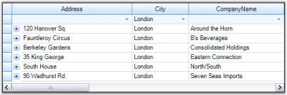' | markdownify }}
{:.image }

* Sorting: Grid Grouping control allows you to sort the data against an unlimited number of columns either in ascending or in descending order. When editing is done, the record values will be adjusted automatically to maintain the sorting order.

{{ '' | markdownify }}
{:.image }

* Expression Fields: Expression fields facilitate inclusion of columns with formula expressions.

{{ '' | markdownify }}
{:.image }

* Unbound Fields: Grid Grouping control can have unbound fields with custom values using which you can evaluate the field values at runtime similar to Expression Fields.

{{ '' | markdownify }}
{:.image }

* Preview Rows: It is possible to add preview section for each group or record. The preview rows can be enabled when you want to display memo fields or some notes for a given group or record.

{{ '' | markdownify }}
{:.image }

* Frozen Columns: This feature will allow you to lock specific columns so that they will always be visible on the screen no matter how far you scroll to the right or down.

{{ '' | markdownify }}
{:.image }

* Stacked MultiHeaders: This feature allows you to create additional header rows that span across visible grid columns. You can group columns under each header row. It also supports drag and drop of these header rows.

{{ '' | markdownify }}
{:.image }

* Multi Row Record: With Grid Grouping control, you can make a single record to span across several rows.

{{ '' | markdownify }}
{:.image }

* Designer Support: The Grid Grouping control offers rich design time support to customize the appearance and behavior of various grid elements.

{{ '' | markdownify }}
{:.image }

* Appearance: The grid provides design time and run time options to customize the appearance of its elements. The appearance settings include various options such as background color, font, text color, alignment, and so on.

{{ '' | markdownify }}
{:.image }

* Look and Feel: Through this look and feel technology, you can provide a common appearance to all the grid elements such as headers, drop down buttons, etc. Here, the appearance denotes not only the way the cell controls get painted but also the way in which they respond to user actions like MouseDown, MouseHover, and so on.

* Navigation: Grid Grouping control includes built-in Navigation and Page Bars that allows users to navigate records with ease.

{{ '' | markdownify }}
{:.image }

* Optimizations: Grid Grouping control is highly optimized to handle very high refresh and update scenarios. To increase performance, it also supports Virtual Mode.

{{ '' | markdownify }}
{:.image }

* Serialization: The grid schema information can be serialized and deserialized. Grid Grouping control supports several serialization formats such as XML and XLS.

{{ '' | markdownify }}
{:.image }

#### Major Control Classes Overview

GridGroupingControl Class

The GridGroupingControl class is derived from Control class and implements several interfaces that add Grouping support to this class. It provides support for displaying ADO.NET data and other data sources in a grid. Data will be loaded from the given datasource and changes will be written back to the datasource. It is the ideal choice if you need grouping support, multi-column sort support, or true nested-table hierarchical support in a grid. It can be bound to any IList datasource. You can easily add expression columns, filter columns, and summary rows to this grid. It is fully designable using Visual Studio and is customizable from code. 

GridTableControl is the main element in Grid Grouping control. Grid Table control displays rows from Syncfusion.Grouping.Table.DisplayElements collection of the Grid Grouping control.Table using schema information stored in the TableDescriptor.

TableDescriptor gives access to table schema information of the root table in datasource. TableDescriptor object is instantiated by GridEngine class and initialized with default schema information from the list assigned to DataSource. There is only one GridEngine object for Grid Grouping control. GridTableDescriptor and GridTable objects on the other side can be more than one when hierarchies are displayed. For each hierarchy level, GridTableDescriptor and GridTable are initialized. For example, if you have ADO.NET DataSet with three tables: "Products", "Orders", and "OrderDetails", there will be three GridTableDescriptors and GridTables.

Relations between tables are defined with GridTableDescriptor.Relations collection of TableDescriptor. Each TableDescriptor can have one or multiple RelationDescriptor objects. RelationDescriptor defines foreign key columns in the parent table, a child with information about related child table and primary key columns in the child table.

GridTable object is instantiated by GridEngine class. Table object manages records from the engine's DataSource and provides access to records and grouped elements through several collection classes. The most important collection used by Grid Table control is DisplayElements collection. This collection provides Grid Table control with information on which element to display at a row. It returns elements such as CaptionSection, RecordRow, SummaryRow, and others. Based on the elements returned by this collection, Grid Table control will display a record, summary, or group caption bar. There are several collections returned such as Records, which contains all records in the table. FilterRecords contains all visible records.

Another related collection is the NestedDisplayElements collection. Similar to DisplayElements, this collection also returns all records, groups, and sections that are expanded and meet filter criteria. The only difference between these two collections is that NestedDisplayElements collection steps into nested tables too whereas DisplayElements collection does not.

The Grouping Engine

Engine is the main object of the grid grouping control. It contains TableDescriptor with schema information such as fields, relations and Table with runtime representation of data source with groups, records, data, and display elements. The engine lets you set the main datasource for the whole engine. TableDescriptor will pick up ItemProperties (schema information) from the datasource and table will be initialized at runtime with records from the list.

GridEngineBase class adds design-time support for engine class. It can be dropped as a component into the component tray of the designer. It can be initialized with BindingContext so that the CurrencyManager can be kept synchronized. 

GridEngine class adds plumbing for displaying the data in Grid Grouping control. You can specify the datasource using DataSource and DataMember properties through the designer. It is instantiated with virtual GridGroupingControl.CreateEngine method. If you want to customize the engine object, you should subclass this class and should override CreateEngine method.

GridEngine object is the main grouping engine object. It is derived from Syncfusion.Grouping.Engine base class and adds Windows Forms specific functionality such as support for Forms BindingContext and CurrencyManager. GridEngine also has special overrides of virtual Engine.CreateTableDescriptor and Engine.CreateTable methods so that the grid-specific derived GridTable class and GridTableDescriptor class are instantiated.

#### Concepts and Features

This section provides basic insight into the grid grouping control architecture packed with detailed information on the features of Essential Grid. It also gives you an overview of the major control classes.

Here you will learn about the following concepts, which will help you to get familiar with Grid Grouping control.

##### Performance

Grid Grouping control has an extremelyhigh performance standard. It can handle very high frequency updates and refresh scenarios. It also offers complete support for Virtual Mode wherein data will be loaded only on demand. By simply setting few properties, you can have the grid work with large amounts of data without a performance hit.

All the properties that affects grid performance are wrapped into a category named Optimization. Here is an image of the property grid listing various optimization properties.

{{ '' | markdownify }}
{:.image }

Optimization Properties - A Glance

Below is a brief overview on the optimization properties. We will discuss these properties further in detail with suitable examples in the forth coming chapters.

* AllowedOptimizations

Specifies the optimizations, the engine is allowed to use when applicable. These optimizations can be used in combination with EngineCounter setting. EngineOptimizations enum defines values for this property, which will be discussed in the next chapter.

* AllowOptimizeLoadTime

This property might help in reducing the flickering issue at startup. When enabled, the grid will be rendered once into an offline bitmap before the form is shown for the first time. This offline rendering of the grid ensures that all the required data is loaded into the memory and all grid data are initialized. Default value is true.

* BindToCurrencyManager

When you assign DataTable to the grid grouping control, it will get access to the Default View of that Data Table through Currency Manager that would listen to the updates to the underlying data table. The benefit of using CurrencyManager is that all the form elements would be kept synchronized. 

Using Currency Manager may cause performance issues in certain scenarios. In such cases, you can bypass Currency Manager and access the list directly without ever involving CurrencyManager by setting this property to false (which is true by default). This will in turn detach the grid from Currency Manager and hence the Grid Engine does not register the list with Windows Forms Currency Manager and it solely relies on listening to ListChanged events.

* CacheRecordValues

If you have custom collections, you can choose to have the engine to cache record values with this property. When set to true, the engine will cache copies of old values from a record in the record object. You can get these values with Record.GetOldValue method. With custom collections, the engine can also determine exactly which values in a record were changed when the engine receives the ListChanged event and previous values were cached.

* CounterLogic

It specifies the CounterLogic to be used within the engine. GroupingEngine maintains counters for VisibleColumns, FilteredRecords, YAmount, HiddenRecords, and the like. These counters occupy a countable portion of the grid tree in memory. On every list change, all these counters need to be refreshed along with the data records. 

Invalidating all the counters is not required at all times. For instance, if you have a larger data source and you do not want support for groups and filtered records, then there is no need to maintain counters such as FilteredRecords and the like. Keeping all the counters in memory will greatly increase memory consumption, which is not necessary in this case and there will degradation of grid performance.

To handle such scenarios, Grid Grouping control provides options to skip allocating these counters. By setting this property, you can reduce the memory footprint by selectively disabling the counters that are not required in your application. EngineCounters enum defines the values for this property, which will be discussed in the next chapter.

* InsertRemoveBehavior and InsertRemoveBehaviorWithEndEdit

These properties determine how the grid should react when a record is inserted or deleted. One or multiple records need to be shifted up and down. By default, the whole display is invalidated and all the rows are repainted though only one record needs to be redrawn. 

By setting properties to ListChangedInsertRemoveBehavior.ScrollWithImmediateUpdate, you can instruct the engine not to repaint the whole screen. The engine will now determine the area affected by this change and use ScrollWindow API to shift records up and down, and only repaint one record that was really changed. This will have a big impact if you have a larger grid and repainting the whole display is expensive.

* InvalidateAllWhenListChanged

It lets you specify whether the grid should simply call Invalidate when a ListChanged event is handled or if it should determine the area that is affected by the change and call InvalidateRange. 

At first, you might think its better to determine the area that is affected by a change and call InvalidateRange. But when calling InvalidateRange, the grid needs to know the exact position of the record in the table before it can mark that area dirty. In order to determine the record position (and y-position of the row in the display), counters need to be evaluated. This operation can cost more time than simply calling Invalidate in high-frequency update scenarios. The group caption bar also needs to be updated when a record changes.

InsertRemoveBehavior, SortPositionChangedBehavior properties and UpdateDisplayFrequency can speed up things when InvalidateAllWhenListChanged is set to false.

* RaiseSourceListChangedEventsOnEngineOnly

When the engine handles ListChanged event, it will itself raise numerous events. When this property is set to true, the events will only be raised on the Engine object. If set to false then events will also be raised on inner objects (will bubble up on nested tables, which causes some performance overhead). It will only have effect if UseOldListChangedHandler is set to false.

* SortPositionChangedBehavior and SortPositionChangedBehaviorWithEndEdit

These properties determine how to update display with a change in the sort position of a record. By default, the whole display is invalidated and all the rows are repainted though only one record needs to be redrawn. This will degrade performance and will not be efficient if you have a larger grid and repainting the whole display is expensive. 

By setting these properties to ListChangedInsertRemoveBehavior.ScrollWithImmediateUpdate, you can instruct the engine not to repaint the whole screen. This will only repaint the record that was really changed.

* UpdateDisplayFrequency

This property lets you specify the number of milliseconds to wait between display updates when new ListChanged event handler logic is used. This property does not have any effect if UseOldListChangedHandler = true. Special values are 0 - only manually update display by calling grid.Update() and 1 - update display immediately after each change.

* UseDefaultsForFasterDrawing

By setting this to true, you can quickly switch to faster GDI Draw Text, Solid Borders and more efficient calculation of the optimal width of a column. Initializes recommended settings to improve handling of ListChanged events and scrolling through grid. Affected settings are: TableOptions.ColumnsMaxLengthStrategy, TableOptions.GridLineBorder, TableOptions.DrawTextWithGdiInterop, TableOptions.VerticalPixelScroll, Appearance.AnyRecordFieldCell.WrapText and Appearance.AnyRecordFieldCell.Trimming.

* UseOldListChangedHandler

With version 4.4, the engine changed the way ListChanged event is handled internally to fix shortcomings with performance of the code that was in place earlier. This property lets you switch back the behavior of the engine to old mechanism if you notice compatibility issues. The default value is false.

* BlinkTime

Grid Grouping control has in-built support for highlighting cells for a short period of time after a change is detected to a cell. The BlinkTime property lets you specify the amount of time in milliseconds the values should be highlighted. You could also enable or disable this feature for individual columns by toggling GridColumnDescriptor.AllowBlink property.

See Also

###### Memory Performance - Engine Optimizations

This section discusses the various optimizations that GroupingEngine provides. EngineOptimizations will greatly help improve MemoryPerformance. Triggering these optimizations selectively will help in reducing memory footprint. Engine optimizations can be enabled by setting AllowOptimizations to some value other than None. To optimize memory usage, CounterLogic property needs to be assigned with a proper value. 

AllowOptimizations

The following is the list of optimizations the grid offers that are defined by EngineOptimizations enumeration. By default they are turned off, but you can tell the engine which optimization should be applied when the specified criteria for the optimization is met.

* EngineOptimizations Enumeration

Specifies the values for AllowedOptimizations property.

* None

All optimizations are disabled.

* DisableCounters

When the engine detects that a table does not have RecordFilters, GroupedColumns, or nested relations, counter logic will be disabled for RecordsDetails collection since all counters are in sync with actual records (e.g. all records in data source are shown in TopLevelGroup). With this optimization, the engine will still have full support for sorting.

* VirtualMode

When all criteria are met for optimization and in addition to that no SortedColumns is set, RecordsDetails collection does not have to be initialized at all. Instead, it can create records elements on demand and discard them using regular garbage collection when no references to a Record exists any more (e.g. once you scroll them out of view). This approach reduces memory footprint to absolute minimum. You should be able to load and display millions of records in a table. The PrimaryKey collection is still supported, but it will be initialized only on demand if you do access Table.PrimaryKeyRecords collection. In such case all records will be enumerated.

* PassThroughSort

When all criteria are met for optimization and SortedColumns are set, the engine will normally have to loop through records and sort them. When you specify, the engine will check if the data source is an IBindingList and if IBindingList.SupportsSort returns true. In such cases, data source will be sorted by using IBindingList.Sort routine and the engine will access records by using VirtualMode. Using IBindingList is usually a bit faster than the engines own sorting routines, but the disadvantage is that you will loose CurrentRecord and SelectedRecords information. Inserting and removing records will also be slower (especially if the underlying data source is DataView).

PassThroughSort will be ignored if criteria are met for the optimization are not met. If you want to force a Pass-through sort mechanism in such a case, it can be done by implementing IGroupingList interface. This allows performing the sort on dataview directly instead of letting grouping engine perform the sorting. Normally, it is recommended to use the engine’s own Sort mechanism and only rely on PassThroughSort for Virtual mode scenarios.

* RecordsAsDisplayElements

When the engine detects that records do not have nested child tables, no record preview rows are being used, and each record has only one row (no ColumnSets are used), records do not have to be split into RecordParts. Instead when querying DisplayElements collection for a specific row, the engine can simply return Record element instead of RecordRow element. The same applies to CaptionSection, ColumnHeaderSection and FilterBarSection. Instead of returning CaptionRow, ColumnHeaderRow, or FilterBarRow element, DisplayElements collection returns section element. If you use this optimization, you need to be careful and be aware that when you query DisplayElements collection instead of RecordRow element, Record element can be returned. So also with ColumnHeader, FilterBase, and Caption.

* All

Enables the optimizations - DisableCounters, VirtualMode, and RecordsAsDisplayElements.

Based on the schema that you specify, the engine will determine if certain optimizations can be applied. If you have a flat table and do not sort records, VirtualMode will be applied and records do not have to be touched at all (only when drawing). If you sort records, then TreeTables will be built so that the grid can sort records, but the logic for filtering and grouping is turned off (DisableCounters optimization). In case of pass-through sorting, the table is sorted by using DataView.Sort routine and records will be accessed with VirtualMode. If you group records or if you have nested tables then full grouping logic will be needed.

* CounterLogic

In addition to being able to specify VirtualMode or WithoutCounter mode, you can also specify the counters you need. Most of the times you only want to count visible elements and filtered records and you can leave out custom counters, hidden element counter, etc. That can save you a few bytes per record (40-80 bytes). The engine will also determine whether records actually need to be broken into pieces or if a record can be returned as leave elements (RecordsAsDisplayElements option). This again saves a few bytes per record.

  * EngineCounters Enumeration

Specifies the values for CounterLogic.

  * All

All counters are supported: visible elements, filtered records, YAmount, hidden elements, hidden records, CustomCount and VisibleCustomCount. Highest memory footprint.

  * FilteredRecords

   			Counts only visible elements and filtered records. Smallest memory footprint.

  * YAmount

 	Counts visible elements, filtered records and YAmount. Medium memory 

footprint.

> {{ '' | markdownify }}
{:.image }
_Note: Allowing certain optimizations does not mean that the optimization is necessarily used. Optimizations will only be used when applicable. Take for example the optimization. If you allow this optimization, the engine will check schema settings when loading the table. If there are no SortedColumns, RecordFilters, GroupedColumns, or nested relations for a table, then virtual mode can be used and no records need to be loaded into memory. If the user later sorts by one column, the virtual mode cannot be used any more. Records will need to be iterated through and sorted and tree structures will be built that allow quick access to records and IndexOf operations. When initializing table, the engine will check if criteria for DisableCounters optimization are met._

Example

This example illustrates Virtual Mode and WithoutCounter optimizations having VirtualList as data source. The VirtualList is just a CustomCollection that implements IList and ITypedList interfaces. The list is populated with 100K items and the same is bound to the grid grouping control. The example also displays Log Window where you could track the different optimizations applied at different instances. It also displays the time elapsed for populating the grid grouping control. 

All the optimizations are enabled by setting AllowedOptimizations to All. As said earlier, optimizations specified will not be applied at all times. They will only be used when applicable, that is, when the criteria for those optimizations are met. This example best illustrates this process. On every property change, the log window displays the list of optimizations applied to the grid at that instance. When you run the sample, you can track optimizations applied in different engine states like with or without grouping, with or without sorting, etc.

> {{ '' | markdownify }}
{:.image }
_Note: For more details, refer to the following Browser Sample:_ 

_<Install Location>\Syncfusion\EssentialStudio\[Version Number]\Windows\Grid.Grouping.Windows\Samples\Performance\Engine Optimization Demo_

Implementation

Follow the steps below to experiment different engine optimizations.

1. Create a class (VirtualItem) that represents the record structure. Its data members form the record fields.

[C#]

public class VirtualItem

{

int index;

string name;

double someValue;

double otherValue;

public int Index

{

get

{

return index;

}

set

{

index = value;

}

}

public string Name

{

get

{

return name;

}

set

{

name = value;

}

}

public double SomeValue

{

get

{

return someValue;

}

set

{

someValue = value;

}

}

public double OtherValue

{

get

{

return otherValue;

}

set

{

otherValue = value;

}

}

}

[VB]

Public Class VirtualItem

Private index_Renamed As Integer

Private name_Renamed As String

Private someValue_Renamed As Double

Private otherValue_Renamed As Double

Public Property Index() As Integer

Get

Return index_Renamed

End Get

Set

index_Renamed = Value

End Set

End Property

Public Property Name() As String

Get

Return name_Renamed

End Get

Set

name_Renamed = Value

End Set

End Property

Public Property SomeValue() As Double

Get

Return someValue_Renamed

End Get

Set

someValue_Renamed = Value

End Set

End Property

Public Property OtherValue() As Double

Get

Return otherValue_Renamed

End Get

Set

otherValue_Renamed = Value

End Set

End Property

End Class

2. Create another class(VirtualList) by implementing IList and ITypedList interfaces. This class represents your collection that serves as data source for grid grouping control. Refer to CustomCollections to know how to implement these interfaces.

[C#]

public class VirtualList : IList, ITypedList

{

int virtualCount;

public VirtualList(int count)

{

virtualCount = count;

}

//IList Members.

public bool IsReadOnly

{

get

{

return true;

}

}

public object this[int index]

{

get

{

VirtualItem item = new VirtualItem();

item.Index = index;

item.Name = "Name" + index.ToString("000000000");

item.SomeValue = index*0.873332f;

item.OtherValue = (293023033-index)/8;

return item;

}

set{}

}

//Other IList members.

............

............

//ICollection Members.

............

............

//IEnumerator Members.

............

............

// ITypedList Members.

public PropertyDescriptorCollection GetItemProperties(PropertyDescriptor[] listAccessors)

{

PropertyDescriptorCollection pds = TypeDescriptor.GetProperties(typeof(VirtualItem));

string[] atts = new string[]{"Index", "Name", "SomeValue", "OtherValue"};

return pds.Sort(atts);

}

public string GetListName(PropertyDescriptor[] listAccessors)

{

return "VirtualList";

}

}

[VB]

Public Class VirtualList : Implements IList, ITypedList

Private virtualCount As Integer

Public Sub New(ByVal count_Renamed As Integer)

virtualCount = count_Renamed

End Sub

'IList Members.

Public ReadOnly Property IsReadOnly() As Boolean Implements IList.IsReadOnly

Get

Return True

End Get

End Property

Public Default Property Item(ByVal index As Integer) As Object

Get

Dim item As VirtualItem = New VirtualItem()

item.Index = index

item.Name = "Name" & index.ToString("000000000")

item.SomeValue = index*0.873332f

item.OtherValue = (293023033-index)/8

Return item

End Get

Set

End Set

End Property

'Other IList Members.

............

............

'ICollection Members.

............

............

'IEnumerable Members.

............

............

'ITypedList Members.

Public Function GetItemProperties(ByVal listAccessors As PropertyDescriptor()) As PropertyDescriptorCollection Implements ITypedList.GetItemProperties

Dim pds As PropertyDescriptorCollection = TypeDescriptor.GetProperties(GetType(VirtualItem))

Dim atts As String() = New String() {"Index", "Name", "SomeValue", "OtherValue"}

Return pds.Sort(atts)

End Function

Public Function GetListName(ByVal listAccessors As PropertyDescriptor()) As String Implements ITypedList.GetListName

Return "VirtualList"

End Function

End Class

3. Add a button and listbox to the main form. Clicking the button will create a grid grouping control and load it with Virtual List. ListBox serves as Log Window wherein you will display the log messages like time elapsed for loading the grid, list of optimizations applied, and so on. Your form will look like the one below at design time.

{{ '' | markdownify }}
{:.image }

4. Set up a new engine and specify the optimizations settings required.

[C#]

GridEngine schema = new GridEngine();

schema.InvalidateAllWhenListChanged = false;

schema.AllowedOptimizations = EngineOptimizations.All;

schema.CounterLogic = EngineCounters.YAmount;

//Also dependant on CounterLogic = EngineCounters.YAmount.

schema.TableOptions.VerticalPixelScroll = true;

schema.TableOptions.ColumnsMaxLengthStrategy = GridColumnsMaxLengthStrategy.FirstNRecords;

schema.TableOptions.ColumnsMaxLengthFirstNRecords = 100;

schema.TableOptions.AllowSortColumns = true;

schema.TableDescriptor.AllowEdit = false;

schema.DataSource = new VirtualList(100000);

schema.Reset();

schema.TableDescriptor.Columns["Index"].MaxLength = 10;

[VB]

Dim schema As GridEngine = New GridEngine()

schema.InvalidateAllWhenListChanged = False

schema.AllowedOptimizations = EngineOptimizations.All

schema.CounterLogic = EngineCounters.YAmount

'Also dependant on CounterLogic = EngineCounters.YAmount.

schema.TableOptions.VerticalPixelScroll = True   

schema.TableOptions.ColumnsMaxLengthStrategy = GridColumnsMaxLengthStrategy.FirstNRecords

schema.TableOptions.ColumnsMaxLengthFirstNRecords = 100

schema.TableOptions.AllowSortColumns = True

schema.TableDescriptor.AllowEdit = False

schema.DataSource = New VirtualList(100000)

schema.Reset()

schema.TableDescriptor.Columns["Index"].MaxLength = 10

5. Define a method LogMemoryUsage that calculates the amount of memory consumed and displays various optimizations applied to the grouping engine.

[C#]

void LogMemoryUsage()

{

//Forces garbage collection and gets used memory size.

    GC.Collect();

    System.Threading.Thread.Sleep(10);

    GC.Collect();

    System.Threading.Thread.Sleep(100);

    GC.Collect();

    LogWindow.Items.Add(string.Format("Optimizations for {0}: ", this.gridGroupingControl1.TableDescriptor.Name));

    LogWindow.Items.Add(string.Format("VirtualMode: {0}, ", this.gridGroupingControl1.Table.VirtualMode));

    LogWindow.Items.Add(string.Format("WithoutCounter: {0}, ", this.gridGroupingControl1.Table.WithoutCounter));

    LogWindow.Items.Add(string.Format("RecordsAsDisplayElements: {0}, ", gridGroupingControl1.Table.RecordsAsDisplayElements));

    Process myProcess = Process.GetCurrentProcess();

    double workingSetSizeinKiloBytes = myProcess.WorkingSet64 / 1000;

    string s = "Process's physical memory usage: " + workingSetSizeinKiloBytes.ToString() + " kb";

    LogWindow.Items.Add(s);

    LogWindow.Items.Add("");

}

[VB.NET]

Private Sub LogMemoryUsage()

'Forces garbage collection and gets used memory size.

GC.Collect()

System.Threading.Thread.Sleep(10)

GC.Collect()

System.Threading.Thread.Sleep(100)

GC.Collect()

LogWindow.Items.Add(String.Format("Optimizations for {0}: ", Me.gridGroupingControl1.TableDescriptor.Name))

LogWindow.Items.Add(String.Format("VirtualMode: {0}, ", Me.gridGroupingControl1.Table.VirtualMode))

LogWindow.Items.Add(String.Format("WithoutCounter: {0}, ", Me.gridGroupingControl1.Table.WithoutCounter))

LogWindow.Items.Add(String.Format("RecordsAsDisplayElements: {0}, ", gridGroupingControl1.Table.RecordsAsDisplayElements))

Dim myProcess As Process = Process.GetCurrentProcess()

Dim workingSetSizeinKiloBytes As Double = myProcess.WorkingSet64 / 1000

Dim s As String = "Process's physical memory usage: " & workingSetSizeinKiloBytes.ToString() & " kb"

LogWindow.Items.Add(s)

LogWindow.Items.Add("")

End Sub

Handle the ButtonClick event in order to populate the grid when the button is clicked. It also calls LogMemoryUsage method to display initial optimization settings for the grid - the optimizations for an ungrouped and unsorted grid.

[C#]

this.button1.Click += new System.EventHandler(this.button1_Click);

private void button1_Click(object sender, EventArgs e)

{

    this.LogWindow.Items.Add("");

    this.LogWindow.Items.Add("Flat, Virtual List with Sorting and Grouping Enabled.");

    int time = Environment.TickCount;

    Cursor.Current = Cursors.WaitCursor;

//Loads a Grid Grouping control with a new engine.

    gridGroupingControl1 = new GridGroupingControl();

    gridGroupingControl1.BackColor = System.Drawing.SystemColors.Window;

    gridGroupingControl1.Dock = System.Windows.Forms.DockStyle.Fill;

    gridGroupingControl1.Name = "gridGroupingControl1";

    gridGroupingControl1.TabIndex = 0;

    gridGroupingControl1.VersionInfo = "3.2.0.0";

    gridGroupingControl1.IntelliMousePanning = true;

    this.splitContainer1.Panel1.Controls.Add(this.gridGroupingControl1);

    gridGroupingControl1.Engine = schema;

    gridGroupingControl1.DataSource = new TestEngineOptimizations.VirtualList(100000);

    gridGroupingControl1.ShowGroupDropArea = true;

    this.Refresh();

    Cursor.Current = Cursors.Arrow;

    this.LogWindow.Items.Add(string.Format("Elapsed Time: {0}", Environment.TickCount - time));

    gridGroupingControl1.Appearance.AnyCell.Font.Facename = "Verdana";

    gridGroupingControl1.Appearance.AnyCell.TextColor = Color.MidnightBlue;

    gridGroupingControl1.TableOptions.GridVisualStyles = Syncfusion.Windows.Forms.GridVisualStyles.Office2007Blue;

    gridGroupingControl1.TableOptions.GridLineBorder = new GridBorder(GridBorderStyle.Solid, Color.FromArgb(227, 239, 255), GridBorderWeight.Thin);

//Initial Log Display.

    LogMemoryUsage();

}

[VB.NET]

Private Sub button1_Click(ByVal sender As Object, ByVal e As EventArgs) Handles button1.Click

Me.LogWindow.Items.Add("")

Me.LogWindow.Items.Add("Flat, Virtual List with Sorting and Grouping Enabled.")

Dim time As Integer = Environment.TickCount

Windows.Forms.Cursor.Current = Cursors.WaitCursor

'Loads a Grid Grouping control with a new engine.

gridGroupingControl1 = New GridGroupingControl()

gridGroupingControl1.BackColor = System.Drawing.SystemColors.Window

gridGroupingControl1.Dock = System.Windows.Forms.DockStyle.Fill

gridGroupingControl1.Name = "gridGroupingControl1"

gridGroupingControl1.TabIndex = 0

gridGroupingControl1.VersionInfo = "3.2.0.0"

gridGroupingControl1.IntelliMousePanning = True

Me.splitContainer1.Panel1.Controls.Add(Me.gridGroupingControl1)

gridGroupingControl1.Engine = schema

gridGroupingControl1.DataSource = New TestEngineOptimizations.VirtualList(100000)

gridGroupingControl1.ShowGroupDropArea = True

Me.Refresh()

Cursor.Current = Cursors.Arrow

Me.LogWindow.Items.Add(String.Format("Elapsed Time: {0}", Environment.TickCount - time))

gridGroupingControl1.Appearance.AnyCell.Font.Facename = "Verdana"

gridGroupingControl1.Appearance.AnyCell.TextColor = Color.MidnightBlue

gridGroupingControl1.TableOptions.GridVisualStyles = GridVisualStyles.Office2007Blue

gridGroupingControl1.TableOptions.GridLineBorder = New GridBorder(GridBorderStyle.Solid, Color.FromArgb(227, 239, 255), GridBorderWeight.Thin)

'Initial Log Display.

LogMemoryUsage()

End Sub

Handle PropertyChanging event to display log for every property that is being changed in the grid. This will be raised when you group or sort the grid grouping control and hence you could track the results of these operations (especially the current optimizations) here.

[C#]

gridGroupingControl1.PropertyChanging += new DescriptorPropertyChangedEventHandler(gridGroupingControl1_PropertyChanging);

Timer t = null;

void gridGroupingControl1_PropertyChanging(object sender, DescriptorPropertyChangedEventArgs e)

{

    LogWindow.Items.Add(e.ToString());

    if (t != null)

    {

        t.Tick -= new EventHandler(t_Tick);

        t.Dispose();

    }

    t = new Timer();

    t.Interval = 100;

    t.Tick += new EventHandler(t_Tick);

    t.Start();

}

private void t_Tick(object sender, EventArgs e)

{

    Timer t = (Timer)sender;

    t.Tick -= new EventHandler(t_Tick);

    t.Dispose();

    this.LogMemoryUsage();

}

[VB.NET]

AddHandler gridGroupingControl1.PropertyChanging, AddressOf gridGroupingControl1_PropertyChanging

Private t As Timer = Nothing

Private Sub gridGroupingControl1_PropertyChanging(ByVal sender As Object, ByVal e As DescriptorPropertyChangedEventArgs)

LogWindow.Items.Add(e.ToString())

If Not t Is Nothing Then

RemoveHandler t.Tick, AddressOf t_Tick

t.Dispose()

End If

t = New Timer()

t.Interval = 100

AddHandler t.Tick, AddressOf t_Tick

t.Start()

End Sub

Private Sub t_Tick(ByVal sender As Object, ByVal e As EventArgs)

Dim t As Timer = CType(sender, Timer)

RemoveHandler t.Tick, AddressOf t_Tick

t.Dispose()

Me.LogMemoryUsage()

End Sub

Here are the screen shots that show the optimizations applied at different engine states.

{{ '' | markdownify }}
{:.image }

{{ '' | markdownify }}
{:.image }

{{ '' | markdownify }}
{:.image }

{{ '' | markdownify }}
{:.image }

_(Both Virtual Mode and WithoutCounter optimizations disabled)_

###### ListChanged Performance

When ListChange is detected, the grouping engine has to update the grid records accordingly. Every record change may affect its sort position, group dependency, and summaries. The engine should take care of all these things and should also invalidate counters that are being affected with respect to ListChange. The easiest way to accomplish this would be invalidating the whole display and repainting all the rows. But this will have a big impact on grid performance in worst cases. For example, in case only one record is really changed and this change does not affect sort order and summaries, it requires to repaint only one record. Instead the engine will repaint the whole display.

GridEngine provides options to handle this type of scenarios and by using those it will track the expression fields and summary columns that depend on changes to a field, fields affecting group dependency or sort position. Based on these findings, it will choose the most efficient way to update the engine's internal object to keep up with the ListChanged events.

Example

The example features this optimization that handles the case when changes to the record only affect single cells in the grid. The sample updates two columns (and summaries) in one thousand records in a timer event every 50 milliseconds while at the same time keeping CPU usage low. In this sample, the engine detects that changes to the Freight or Employee field do not have any impact on counters in the engines object. It checks if the record is visible in the current view and if that is the case saves the record and field information for painting. The painting of the cell is delayed until gridGroupingControl.Update is called or until the time specified with GridGroupingControl.UpdateDisplayFrequency elapsed.

In that sample example you can also check out throttling the display updates. The UpateDisplayFrequency is initially set to 0, which means that the timer_tick method in form calls grid.Update to force pending updates. You can also specify any amount of milliseconds in the Property Grid for this property and watch the grid react slower or faster to changes and update the display while the ListChanged events still come in at the same pace.

If you click on the Freight column to sort records by values of this field then the strategy the Grid Grouping control updates the internal structure and the display has to change. Now, every change to the Freight column can possibly affect the sort position of a record. The moment you click on the column header and sort by that field the engine will have this field singled out for more detailed inspection when a ListChanged event is received. 

If change is detected to the Freight field in DataRow, the engine will then check the new value against the value of the previous record and next record. If the value is greater or equal to the previous record’s value and smaller or equal to the next records value, no further action is required other than repainting the cell. But if the new value does not fit in between these records, the sort position of the records needs to be recalculated. The binary tree structures within the engine allow quick removal and reinsertion of the record at the correct sort position and the engine will raise SourceListRecordChanging and SourceListRecordChanged events that indicate that the records sort position is about to change and has changed. 

Updating display with changes in sort position of a record is much more demanding than simply repainting a cell. One or multiple records need to be shifted up or down. The easiest way is to invalidate the whole display and repaint all rows. This is how Grid Grouping control handles this case by default. You can change this default behavior by specifying how the grid should update the display with InsertRemoveBehavior and SortPositionChangeBehavior properties. By setting these properties to ListChangedInsertRemoveBehavior.ScrollWithImmediateUpdate you can instruct the engine not to repaint the whole screen. Instead the engine will now determine the area affected by a sort position change and use ScrollWindow API to shift records up and down and only repaint the one record that was really changed. This can have big impact if you have a large grid and repainting the whole display is expensive. This can increase the speed by the number of rows that are visible. Only one row needs to be repainted instead of repainting all rows.

The example also shows more optimized calculation of summaries. By default the engine uses binary trees and caches values in them. When changes to a field are detected that affects a summary, then the nodes in the binary tree are marked dirty. This is a 2xO(log n) operation that is needed to mark nodes dirty and later again recalculate the summaries. The ManualTotalSummary sample demonstrates this by using a different approach. If you do not care about more complicated summaries such as minimum, maximum, distinct count, or median and if you know the delta of each value change, then you can keep total value cached in the parent group and manually apply that delta to this parent groups summary value. Now you have a linear O(1) operation instead of the more costly binary tree updates. With that change, the sample can now deal nicely with 1000 updates in 100 ms and 2 summary columns being changed with each update. 

GridListChangedInsertRemoveBehavior Enum

Defines the values for the properties InsertRemoveBehavior and SortPositionChangedBehavior.

InvalidateVisible 

It will keep engine in synchronization with ListChanged notifications and then invalidate rows on screen, below affected row.

InvalidateAll 

It will simply set TableDirty = true and the engine will not try to keep anything in synchronization at that time.

ScrollWithImmediateUpdate

It will keep engine in synchronization and use ScrollWindow to scroll window contents or adjust top row index if changes occurred before current visible row.

> {{ '' | markdownify }}
{:.image }
_Note: For Complete Code for this example, refer the following Browser sample:_ 

_<Install Location>\Syncfusion\EssentialStudio\[Version Number]\Windows\Grid.Grouping.Windows\Samples\Performance\Manual Total Summary Demo_

Implementation

* The implementation uses custom summary class named ManualTotalSummary. This is a manual summary class, which can be updated immediately using the difference between old and new value in ListChanged event. The Total property calculates summaries for groups and table manually by looping through each group and record, and summing up the values of changed field. It provides faster updates on summaries by applying a delta between the old and new value when a record is changed.

[C#]

public class ManualTotalSummary 

{

    double total;

    bool dirty = true;

    Group group;

    int fieldIndex = -1;

    public ManualTotalSummary(Group g, string field)

    : this(g, g.ParentTableDescriptor.Fields[field])

    {

    }

    public ManualTotalSummary(Group g, FieldDescriptor field)

    {

        this.Field = field;

        this.Group = g;

    }

    ............

    ............

    public double Total

    {

        get

        {

            if (dirty)

            {

                CalculateTotal();

                this.dirty = false;

        }

        return this.total;

        }

        set

        {

            this.total = value;

        }

    }

    void CalculateTotal()

    {

        total = 0;

        if (group.Details is RecordsDetails)

        {

            foreach (Record r in group.Records)

            {

                object obj = r.GetValue(field);

                if (obj != null && !(obj is DBNull))

                {

                    double d = Convert.ToDouble(obj);

                    total += d;

                }

            }

        }

        else

        {

            foreach (Group g in group.Groups)

            {

                IManualTotalSummaryArraySource tsa = g as IManualTotalSummaryArraySource;

                ManualTotalSummary mt = tsa.GetManualTotalSummaryArray()[this.FieldIndex];

                if (mt == null)

                mt = new ManualTotalSummary(g, field);

                double d = mt.Total;

                total += d;

            }

        }

    }

    public void ApplyDelta(Element r, bool isObsoleteRecord, bool isAddedRecord, ChangedFieldInfo ci)

    {

        if (Dirty)

        return;

        ManualTotalSummary mt = this;

        if (isObsoleteRecord)

        {

            if (ci.OldValue != null && !(ci.OldValue is DBNull))

            mt.Total -= Convert.ToDouble(ci.OldValue);

        }

        else if (isAddedRecord)

        {

            if (ci.NewValue != null && !(ci.NewValue is DBNull))

            mt.Total += Convert.ToDouble(ci.NewValue);

        }

        else

        mt.Total += ci.Delta;

    }

}

[VB.NET]

Public Class ManualTotalSummary

Private total_Renamed As Double

Private dirty_Renamed As Boolean = True

Private group_Renamed As Group

Private fieldIndex_Renamed As Integer = -1

Public Sub New(ByVal g As Group, ByVal field_Renamed As String)

Me.New(g, g.ParentTableDescriptor.Fields(field_Renamed))

End Sub

Public Sub New(ByVal g As Group, ByVal field_Renamed As FieldDescriptor)

Me.Field = field_Renamed

Me.Group = g

End Sub

...........

...........

Public Property Total() As Double

Get

If dirty_Renamed Then

CalculateTotal()

Me.dirty_Renamed = False

End If

Return Me.total_Renamed

End Get

Set

Me.total_Renamed = Value

End Set

End Property

Private Sub CalculateTotal()

total_Renamed = 0

If TypeOf group_Renamed.Details Is RecordsDetails Then

For Each r As Record In group_Renamed.Records

Dim obj As Object = r.GetValue(field_Renamed)

If Not obj Is Nothing AndAlso Not(TypeOf obj Is DBNull) Then

Dim d As Double = Convert.ToDouble(obj)

total_Renamed += d

End If

Next r

Else

For Each g As Group In group_Renamed.Groups

Dim tsa As IManualTotalSummaryArraySource = CType(IIf(TypeOf g Is IManualTotalSummaryArraySource, g, Nothing), IManualTotalSummaryArraySource)

Dim mt As ManualTotalSummary = tsa.GetManualTotalSummaryArray()(Me.FieldIndex)

If mt Is Nothing Then

mt = New ManualTotalSummary(g, field_Renamed)

End If

Dim d As Double = mt.Total

total_Renamed += d

Next g

End If

End Sub

Public Sub ApplyDelta(ByVal r As Element, ByVal isObsoleteRecord As Boolean, ByVal isAddedRecord As Boolean, ByVal ci As ChangedFieldInfo)

If Dirty Then

Return

End If

Dim mt As ManualTotalSummary = Me

If isObsoleteRecord Then

If Not ci.OldValue Is Nothing AndAlso Not(TypeOf ci.OldValue Is DBNull) Then

mt.Total -= Convert.ToDouble(ci.OldValue)

End If

Else If isAddedRecord Then

If Not ci.NewValue Is Nothing AndAlso Not(TypeOf ci.NewValue Is DBNull) Then

mt.Total += Convert.ToDouble(ci.NewValue)

End If

Else

mt.Total += ci.Delta

End If

End Sub

End Class

* ManualTotalSummary class makes use of ManualTotalSummaryTable class, which derives GridTable to calculate the new total. ManualTotalSummaryTable class overrides OnRecordChanged event in order to track record changes and keeps track of old and new values of the ChangedField. For each entry in ManualTotalSummaryTable.TotalSummaries, a ManualTotalSummary will be created. 

[C#]

public class ManualTotalSummaryTable : GridTable

{

    public ManualTotalSummaryTable(TableDescriptor tableDescriptor, Table parentRelationTable)

    : base((GridTableDescriptor)tableDescriptor, (GridTable)parentRelationTable)

    {

    }

    ArrayList totalSummaries = new ArrayList();

    public ArrayList TotalSummaries

    {

        get

        {

            return this.totalSummaries;

        }

        set

        {

            this.totalSummaries = value;

        }

    }

    ..............

    ..............

    protected override void OnRecordChanged(Element r, bool isObsoleteRecord, bool isAddedRecord)

    {

        TableDescriptor td = TableDescriptor;

        Group g = r.ParentGroup;

        while (g is IManualTotalSummaryArraySource)

        {

            OnGroupSummaryInvalidated(new GroupEventArgs(g));

            IManualTotalSummaryArraySource tsa = g as IManualTotalSummaryArraySource;

            foreach (ChangedFieldInfo ci in this.ChangedFieldsArray)

            {

                ManualTotalSummary mt = tsa.GetManualTotalSummaryArray()[ci.FieldIndex];

                if (mt != null)

                mt.ApplyDelta(r, isObsoleteRecord, isAddedRecord, ci);

            }

            g = g.ParentGroup;

        }

    } 

}

[VB.NET]

Public Class ManualTotalSummaryTable : Inherits GridTable

Public Sub New(ByVal tableDescriptor As TableDescriptor, ByVal parentRelationTable As Table)

MyBase.New(CType(tableDescriptor, GridTableDescriptor), CType(parentRelationTable, GridTable))

End Sub

Private totalSummaries_Renamed As ArrayList = New ArrayList()

Public Property TotalSummaries() As ArrayList

Get

Return Me.totalSummaries_Renamed

End Get

Set

Me.totalSummaries_Renamed = Value

End Set

End Property

..............

..............

Protected Overrides Sub OnRecordChanged(ByVal r As Element, ByVal isObsoleteRecord As Boolean, ByVal isAddedRecord As Boolean)

Dim td As TableDescriptor = TableDescriptor

Dim g As Group = r.ParentGroup

Do While TypeOf g Is IManualTotalSummaryArraySource

OnGroupSummaryInvalidated(New GroupEventArgs(g))

Dim tsa As IManualTotalSummaryArraySource = CType(IIf(TypeOf g Is IManualTotalSummaryArraySource, g, Nothing), IManualTotalSummaryArraySource)

For Each ci As ChangedFieldInfo In Me.ChangedFieldsArray

Dim mt As ManualTotalSummary = tsa.GetManualTotalSummaryArray()(ci.FieldIndex)

If Not mt Is Nothing Then

mt.ApplyDelta(r, isObsoleteRecord, isAddedRecord, ci)

End If

Next ci

g = g.ParentGroup

Loop

End Sub

End Class

* A Grid Grouping control is setup with options to display the summary cells in caption and enable the optimizations required. Use InvalidateAll option for InsertRemoveBehavior and SortPositionChangedBehavior properties when many records change sort position for a short time. Use ScrollWithImmediateUpdate if ScrollWindow should be called to minimize painting when sort position of limited number of records is changed. Grid Grouping control will be detached from Currency Manager, and then access the list directly to solely rely on ListChanged events.

[C#]

//Optimization code.

//0 if Manual updates only from timer_tick.

this.gridGroupingControl1.UpdateDisplayFrequency = 0;

this.gridGroupingControl1.UseDefaultsForFasterDrawing = true;

this.gridGroupingControl1.CounterLogic = EngineCounters.YAmount;

this.gridGroupingControl1.AllowedOptimizations = EngineOptimizations.DisableCounters | EngineOptimizations.RecordsAsDisplayElements;

this.gridGroupingControl1.CacheRecordValues = false;

this.gridGroupingControl1.InsertRemoveBehavior = GridListChangedInsertRemoveBehavior.ScrollWithImmediateUpdate;

this.gridGroupingControl1.SortPositionChangedBehavior = GridListChangedInsertRemoveBehavior.ScrollWithImmediateUpdate;

this.gridGroupingControl1.BindToCurrencyManager = false;

//Enables Caption Summaries.

gridGroupingControl1.TableDescriptor.ChildGroupOptions.ShowCaptionSummaryCells = true;

gridGroupingControl1.TableDescriptor.ChildGroupOptions.ShowSummaries = true;

gridGroupingControl1.TableDescriptor.ChildGroupOptions.CaptionSummaryRow = "Caption";

[VB.NET]

'Optimization code.

'0 if Manual updates only from timer_tick.

Me.gridGroupingControl1.UpdateDisplayFrequency = 0

Me.gridGroupingControl1.UseDefaultsForFasterDrawing = True

Me.gridGroupingControl1.CounterLogic = EngineCounters.YAmount

Me.gridGroupingControl1.AllowedOptimizations = EngineOptimizations.DisableCounters Or EngineOptimizations.RecordsAsDisplayElements

Me.gridGroupingControl1.CacheRecordValues = False

Me.gridGroupingControl1.InsertRemoveBehavior = GridListChangedInsertRemoveBehavior.ScrollWithImmediateUpdate

Me.gridGroupingControl1.SortPositionChangedBehavior = GridListChangedInsertRemoveBehavior.ScrollWithImmediateUpdate

Me.gridGroupingControl1.BindToCurrencyManager = False

'Enables Caption Summaries.

gridGroupingControl1.TableDescriptor.ChildGroupOptions.ShowCaptionSummaryCells = True

gridGroupingControl1.TableDescriptor.ChildGroupOptions.ShowSummaries = True

gridGroupingControl1.TableDescriptor.ChildGroupOptions.CaptionSummaryRow = "Caption"

* Setup ManualTotalSummary for the columns Freight and EmployeeID. The ManualTotalSummary.Total value will be retrieved and displayed in summary or caption cell in QueryCellStyleInfo event handler. It tracks the changes in sort positions of columns Freight and EmployeeID by handling PropertyChanged event.

[C#]

ManualTotalSummaryTable tb = (ManualTotalSummaryTable)this.gridGroupingControl1.Table;

tb.TotalSummaries.Add("Freight");

tb.TotalSummaries.Add("EmployeeID");

tb.TableDirty = true;

this.gridGroupingControl1.QueryCellStyleInfo += new GridTableCellStyleInfoEventHandler(gridGroupingControl1_QueryCellStyleInfo);

private void gridGroupingControl1_QueryCellStyleInfo(object sender, GridTableCellStyleInfoEventArgs e)

{

    Element el = e.TableCellIdentity.DisplayElement;

    ManualTotalSummaryTable table = el.ParentTable as ManualTotalSummaryTable;

    if (table == null)

    return;

    if (Element.IsCaption(el))

    {

        if (e.Style.TableCellIdentity.ColIndex > 3)

        {

//You need to provide manually, the code to look up the summaries you want to display here.

//e.TableCellIdentity.Column and e.TableCellIdentity.SummaryColumn will be null.

//You can get the column as follows.

            GridColumnDescriptor column = gridGroupingControl1.TableModel.GetHeaderColumnDescriptorAt(e.TableCellIdentity.ColIndex);

            if (column != null && table.TotalSummaries.IndexOf(column.MappingName) != -1)

            {

                int index = column.TableDescriptor.Fields.IndexOf(column.FieldDescriptor);

                IManualTotalSummaryArraySource tsa = (el is Group ? el : el.ParentGroup) as IManualTotalSummaryArraySource;

                ManualTotalSummary tm = tsa.GetManualTotalSummaryArray()[index];

                e.Style.CellValue = tm.Total;

                e.Style.CellValueType = typeof(double);

                e.Style.Format = "0.00";

            }

//By using that column you could try and identify the summary that should be displayed in this cell.

            }

        }

        else if (el is GridSummaryRow)

        {

//You can get the column as follows.

            GridColumnDescriptor column = this.gridGroupingControl1.TableModel.GetHeaderColumnDescriptorAt(e.TableCellIdentity.ColIndex);

            if (column != null && table.TotalSummaries.IndexOf(column.MappingName) != -1)

            {

                int index = column.TableDescriptor.Fields.IndexOf(column.FieldDescriptor);

                IManualTotalSummaryArraySource tsa = (el is Group ? el : el.ParentGroup) as IManualTotalSummaryArraySource;

                ManualTotalSummary tm = tsa.GetManualTotalSummaryArray()[index];

                e.Style.CellValue = tm.Total;

                e.Style.CellValueType = typeof(double);

                e.Style.Format = "0.00";

        }

//By using that column you could try and identify the summary that should be displayed in this cell.

    }

}

[VB.NET]

Dim tb As ManualTotalSummaryTable = DirectCast(Me.gridGroupingControl1.Table, ManualTotalSummaryTable)

tb.TotalSummaries.Add("Freight")

tb.TotalSummaries.Add("EmployeeID")

tb.TableDirty = True

AddHandler Me.gridGroupingControl1.QueryCellStyleInfo, AddressOf gridGroupingControl1_QueryCellStyleInfo

Private Sub gridGroupingControl1_QueryCellStyleInfo(ByVal sender As Object, ByVal e As GridTableCellStyleInfoEventArgs)

    Dim el As Element = e.TableCellIdentity.DisplayElement

    Dim table As ManualTotalSummaryTable = TryCast(el.ParentTable, ManualTotalSummaryTable)

    If table Is Nothing Then

        Return

    End If

    If Element.IsCaption(el) Then

        If e.Style.TableCellIdentity.ColIndex > 3 Then

'You need to provide manually, the code to look up the summaries you want to display here.

'e.TableCellIdentity.Column and e.TableCellIdentity.SummaryColumn will be null.

'You can get the column as follows.

            Dim column As GridColumnDescriptor =                                      

            gridGroupingControl1.TableModel.GetHeaderColumnDescriptorAt(e.TableCellIdentity.ColIndex)

            If column IsNot Nothing AndAlso table.TotalSummaries.IndexOf(column.MappingName) <> -1 Then

                Dim index As Integer = column.TableDescriptor.Fields.IndexOf(column.FieldDescriptor)

                Dim tsa As IManualTotalSummaryArraySource = TryCast((IIf(TypeOf el Is Group, el, el.ParentGroup)),                                        IManualTotalSummaryArraySource)

                Dim tm As ManualTotalSummary = tsa.GetManualTotalSummaryArray()(index)

                e.Style.CellValue = tm.Total

                e.Style.CellValueType = GetType(Double)

                e.Style.Format = "0.00"

'By using that column you could try and identify the summary that should be displayed in this cell.

            End If

        End If

    ElseIf TypeOf el Is GridSummaryRow Then

'You can get the column as follows.

        Dim column As GridColumnDescriptor = Me.gridGroupingControl1.TableModel.GetHeaderColumnDescriptorAt(e.TableCellIdentity.ColIndex)

        If column IsNot Nothing AndAlso table.TotalSummaries.IndexOf(column.MappingName) <> -1 Then

            Dim index As Integer = column.TableDescriptor.Fields.IndexOf(column.FieldDescriptor)

            Dim tsa As IManualTotalSummaryArraySource = TryCast((IIf(TypeOf el Is Group, el, el.ParentGroup)),                                        IManualTotalSummaryArraySource)

            Dim tm As ManualTotalSummary = tsa.GetManualTotalSummaryArray()(index)

            e.Style.CellValue = tm.Total

            e.Style.CellValueType = GetType(Double)

            e.Style.Format = "0.00"

'By using that column you could try and identify the summary that should be displayed in this cell.

        End If

    End If

End Sub

* Enable highlighting the cells changed in all the columns.

[C#]

for (int c = 0; c < gridGroupingControl1.TableDescriptor.Columns.Count; c++)

this.gridGroupingControl1.TableDescriptor.Columns[c].AllowBlink = true;

this.gridGroupingControl1.BlinkTime = 100;

[VB.NET]

Do While c < gridGroupingControl1.TableDescriptor.Columns.Count

Me.gridGroupingControl1.TableDescriptor.Columns(c).AllowBlink = True

c += 1

Loop

Me.gridGroupingControl1.BlinkTime = 100

* To optimize performance, grid is updated manually (UpdateDisplayFrequency = 0) at regular intervals. A timer is used to keep track of the duration of time periods. The code to track the changes in Freight and EmployeeID columns and to update the grid rows is written inside the timer_tick event handler where the update is done manually by making a call to gridGroupingControl.Update method. Timer Interval is set to 100, which means that there would be a update for every 100 ms. This implementation pushes in the pending updates every 100 ms and updates 1000 records each time.

[C#]

void timer_tick(object sender, EventArgs e)

{

    GridTableDescriptor td = this.gridGroupingControl1.TableDescriptor;

    ManualTotalSummaryTable tb = ((ManualTotalSummaryTable)this.gridGroupingControl1.Table);

    int i = 0;

    using (MeasureTime.Measure("Form1.timer_tick"))

    {

    int count = 1000;

    if (this.gridGroupingControl1.SortPositionChangedBehavior == GridListChangedInsertRemoveBehavior.ScrollWithImmediateUpdate)

    {

        if (sortedByFreight || gridGroupingControl1.TestDeleteRecords || gridGroupingControl1.TestInsertRecords || gridGroupingControl1.TestChangeGroup)

//When sort position is changed, this is much more demanding, let us do less records then.

        count = 200; 

        if (sortedByEmployeeID)

//Each update will cause records being shifted around, so let us do even less records. You can also check out InvalidateAll option instead above.

        count = 50; 

    }

    for (i = 0; i < count; i++)

    {

        ManualTotalSummaries.DataSet1.OrdersRow dr;

//Inserts Records.

        if (gridGroupingControl1.TestInsertRecords)

        {

            if (i % 10 == 0)

            {

                dr = northwindDataSet1.Orders.NewOrdersRow();

                dr.CustomerID = i.ToString() + (j++).ToString();

                dr.EmployeeID = i;

                dr.Freight = i / 10;

                dr.ShipVia = 0;

                dr.Table.Rows.Add(dr);

                continue;

            }

        }

        if (northwindDataSet1.Orders.Rows.Count == 0)

        {

            this.gridGroupingControl1.Update();

            return;

        }

        int newIndex = rnd.Next(northwindDataSet1.Orders.Rows.Count);

        dr = northwindDataSet1.Orders[newIndex];

//Deletes Records.

        if (gridGroupingControl1.TestDeleteRecords)

        {

            if (i % 12 == 0)

            {

                dr.Delete();

                continue;

            }

    }

// Changes Records.

// Freight

    decimal freight = (decimal)dr.Freight + Math.Round((decimal)rnd.Next(-100, 100) / 10000, 2);

    int employeeID = (int)(rnd.NextDouble() * 1000);

    dr.BeginEdit();

    decimal oldFreight = dr.Freight;

    dr.Freight = freight;

    dr.EmployeeID = employeeID;

    if (gridGroupingControl1.TestChangeGroup)

    {

//Changes Group Category.

        if (i == 10)

        {

            tb.AddChangedField(new ChangedFieldInfo(td, "ShipVia", dr.ShipVia, 0));

            dr.ShipVia = 0;

        }

    }

//Fires ListChanged event.

    dr.EndEdit();

    }

//Optionally manually flushes changes.

    if (this.gridGroupingControl1.UpdateDisplayFrequency == 0)

    this.gridGroupingControl1.Update();

    }

}

[VB.NET]

Private Sub timer_tick(ByVal sender As Object, ByVal e As EventArgs)

Dim td As GridTableDescriptor = Me.gridGroupingControl1.TableDescriptor

Dim tb As ManualTotalSummaryTable = (CType(Me.gridGroupingControl1.Table, ManualTotalSummaryTable))

Dim i As Integer = 0

MeasureTime.Measure("Form1.timer_tick")

Try

Dim count As Integer = 1000

If gridGroupingControl1.SortPositionChangedBehavior = GridListChangedInsertRemoveBehavior.ScrollWithImmediateUpdate Then

If sortedByFreight OrElse gridGroupingControl1.TestDeleteRecords OrElse gridGroupingControl1.TestInsertRecords OrElse gridGroupingControl1.TestChangeGroup Then

'When sort position is changed, this is much more demanding, let us do less records then.

count = 200

End If

If sortedByEmployeeID Then

'Each update will cause records being shifted around, so let us do even less records. You can also check out InvalidateAll option instead above.

count = 50

End If

End If

i = 0

Do While i < count

Dim dr As ManualTotalSummaries.DataSet1.OrdersRow

'Inserts Records.

If gridGroupingControl1.TestInsertRecords Then

If i Mod 10 = 0 Then

dr = northwindDataSet1.Orders.NewOrdersRow()

dr.CustomerID = i.ToString() & (j += 1).ToString()

dr.EmployeeID = i

dr.Freight = i / 10

dr.ShipVia = 0

dr.Table.Rows.Add(dr)

GoTo Continue1

End If

End If

If northwindDataSet1.Orders.Rows.Count = 0 Then

Me.gridGroupingControl1.Update()

Return

End If

Dim newIndex As Integer = rnd.Next(northwindDataSet1.Orders.Rows.Count)

dr = northwindDataSet1.Orders(newIndex)

'Deletes Records.

If gridGroupingControl1.TestDeleteRecords Then

If i Mod 12 = 0 Then

dr.Delete()

GoTo Continue1

End If

End If

'Changes Records.

'Freight

Dim freight As Decimal = CDec(dr.Freight) + Math.Round(CDec(rnd.Next(-100, 100)) / 10000, 2)

Dim employeeID As Integer = CInt(rnd.NextDouble() * 1000)

dr.BeginEdit()

Dim oldFreight As Decimal = dr.Freight

dr.Freight = freight

dr.EmployeeID = employeeID

If gridGroupingControl1.TestChangeGroup Then

'Changes Group Category.

If i = 10 Then

tb.AddChangedField(New ChangedFieldInfo(td, "ShipVia", dr.ShipVia, 0))

dr.ShipVia = 0

End If

End If

'Fires ListChanged event.

dr.EndEdit()

i += 1

Continue1:

Loop

'Optionally manually flushes changes.

If Me.gridGroupingControl1.UpdateDisplayFrequency = 0 Then

Me.gridGroupingControl1.Update()

End If

Finally

End Try

End Sub

* It should also take care of UnboundFields whose values are usually dependent on changes to other fields. If unbound fields are used, you can tell the engine the fields that the unbound field is dependent on, by setting the ReferencedFields property. When ReferencedFields is set and the engine detects changes to the unbound field, it will then automatically also mark the field as changed. This subsequently can affect sort order, group attachment, and so on.

[C#]

//Adds Unbound field 'ShipVia_CompanyName'.

gridGroupingControl1.TableDescriptor.UnboundFields.Add("ShipVia_CompanyName");

//Informs the engine about dependency on ShipVia of this field.

gridGroupingControl1.TableDescriptor.UnboundFields["ShipVia_CompanyName"].ReferencedFields = "ShipVia";           

[VB.NET]

'Adds Unbound field 'ShipVia_CompanyName'.

gridGroupingControl1.TableDescriptor.UnboundFields.Add("ShipVia_CompanyName")

'Informs the engine about dependency on ShipVia of this field.

gridGroupingControl1.TableDescriptor.UnboundFields("ShipVia_CompanyName").ReferencedFields = "ShipVia"

Here is a sample screen shot.

{{ '' | markdownify }}
{:.image }

###### High Frequency Updates

This section discusses an example that lets you make high frequency updates in an efficient manner. It shows sort position changes, inserting and removing of records from a timer event. At start up, the grid grouping control is sorted by Column "1" and changes to fields in that column affects the sort position of a record. The background colors of the cells in records are also dependant on the value in column "1". This dependency is specified with ReferencedFields property. The changes are highlighted for a short period of time after a change is detected.

ReferencedFields Property

ReferencedFields property, as the name implies, saves a list of field names referred by a given field. The engine will use these fields in the ListChanged event to determine the cells to be updated when change is made in an underlying field.

ReferencedFields property is very user interactive option and provides options to test the performance of the grid by enabling or disabling grouping, sorting, and filtering in the midst of heavy updates. It also allows you to change the timer frequency that controls the throughput i.e., the number of updates per unit time. At run time, you can also vary the amount of time the changes are highlighted.

> {{ '' | markdownify }}
{:.image }
_Note: For Complete Code for this example, refer to the following Browser sample:_

_<Install Location>\Syncfusion\EssentialStudio\[Version Number]\Windows\Grid.Grouping.Windows\Samples\Performance\Manual Total Summary Demo_

Implementation

This example demonstrates the frequent updates that occur in random cells across the grid grouping control, while keeping the CPU usage at minimum level. A timer changes cells in short intervals, inserts and removes rows. When you run the sample you also need to open up the TaskManager to notice the CPU usage while the sample runs. You should be able to start up multiple instances without slowing down your machine.

1. Set up Grid Grouping control and load it with some random data. Enable the optimizations as required.

[C#]

GridGroupingControl gridGroupingControl1 = new GridGroupingControl();

gridGroupingControl1.VerticalThumbTrack = true;

gridGroupingControl1.HorizontalThumbTrack = true;

gridGroupingControl1.TableOptions.VerticalPixelScroll = true;

gridGroupingControl1.DataSource = GetRandomDataTable();

this.gridGroupingControl1.ShowGroupDropArea = true;

//Uses less memory for internal binary tree structures.

gridGroupingControl1.CounterLogic = EngineCounters.YAmount;

gridGroupingControl1.AllowedOptimizations = EngineOptimizations.DisableCounters | EngineOptimizations.RecordsAsDisplayElements;

//Uses faster GDI drawing.

gridGroupingControl1.UseDefaultsForFasterDrawing = true;

//Skips Currency Manager.

gridGroupingControl1.BindToCurrencyManager = false;

//Immediately updates after each ListChanged event.

gridGroupingControl1.UpdateDisplayFrequency = 1;

//Scroll Window will cause immediate update.

gridGroupingControl1.InsertRemoveBehavior = GridListChangedInsertRemoveBehavior.ScrollWithImmediateUpdate;

gridGroupingControl1.SortPositionChangedBehavior = GridListChangedInsertRemoveBehavior.ScrollWithImmediateUpdate;

//Insert RemoveBehavior or SortPositionChangedBehavior takes effect only when InvalidateAll is set to false.

gridGroupingControl1.InvalidateAllWhenListChanged = false;

[VB.NET]

Dim gridGroupingControl1 As New GridGroupingControl()

gridGroupingControl1.VerticalThumbTrack = True

gridGroupingControl1.HorizontalThumbTrack = True

gridGroupingControl1.TableOptions.VerticalPixelScroll = True

gridGroupingControl1.DataSource = GetRandomDataTable()

Me.gridGroupingControl1.ShowGroupDropArea = True

'Uses less memory for internal binary tree structures.

gridGroupingControl1.CounterLogic = EngineCounters.YAmount

gridGroupingControl1.AllowedOptimizations = EngineOptimizations.DisableCounters Or EngineOptimizations.RecordsAsDisplayElements

'Uses faster GDI drawing.

gridGroupingControl1.UseDefaultsForFasterDrawing = True

'Skips Currency Manager.

gridGroupingControl1.BindToCurrencyManager = False

'Immediately updates after each ListChanged event.

gridGroupingControl1.UpdateDisplayFrequency = 1

'Scroll Window will cause immediate update.

gridGroupingControl1.InsertRemoveBehavior = GridListChangedInsertRemoveBehavior.ScrollWithImmediateUpdate

gridGroupingControl1.SortPositionChangedBehavior = GridListChangedInsertRemoveBehavior.ScrollWithImmediateUpdate

'InsertRemoveBehaior or SortPositionChangedBehavior takes effect only when InvalidateAll is set to false.

gridGroupingControl1.InvalidateAllWhenListChanged = False

2. Set AllowBlink to true for all the columns in order to enable highlighting cells for a short period of time when a change is detected. Engine.AddBaseStylesForBlinking method is used to add base styles for customization of the appearance of blink cells. Initialize base styles for various blink states. PrepareViewStyleInfo is handled to set custom base style for a newly added record. A cell change is highlighted by checking its BlinkState. BlinkState indicates whether the cell's value is increased or reduced or if the record has been recently added. If its state is either Increased or Reduced, its back color and text colors are changed.

[C#]

//Allows Blinking for all the columns.

//Highlights up and down ticks.

gridGroupingControl1.BlinkTime = 700;

for (int i = 1; i <= 20; i++)

gridGroupingControl1.TableDescriptor.Columns[i.ToString()].AllowBlink = true;

gridGroupingControl1.Engine.AddBaseStylesForBlinking();

gridGroupingControl1.BaseStyles[GridEngine.BlinkIncreased].StyleInfo.TextColor = Color.White;

gridGroupingControl1.BaseStyles[GridEngine.BlinkReduced].StyleInfo.TextColor = Color.White;

gridGroupingControl1.Engine.BaseStyles.Add("CustomStyle");

gridGroupingControl1.BaseStyles["CustomStyle"].StyleInfo.TextColor = Color.Black;

gridGroupingControl1.BaseStyles["CustomStyle"].StyleInfo.BackColor = Color.White;

//PrepareViewStyleInfo.

void gridGroupingControl1_TableControlPrepareViewStyleInfo(object sender, GridTableControlPrepareViewStyleInfoEventArgs e)

{

    GridTableCellStyleInfo style = (GridTableCellStyleInfo)e.Inner.Style;

    BlinkState bs = gridGroupingControl1.GetBlinkState(style.TableCellIdentity);

    if (bs != BlinkState.None)

    {

        if (bs == BlinkState.NewRecord)

        {

            e.Inner.Style.BaseStyle = "CustomStyle";

        }

    }

}

[VB.NET]

'Allows Blinking for all the columns.

'Highlights up and downticks.

gridGroupingControl1.BlinkTime = 700

For i As Integer = 1 To 20

gridGroupingControl1.TableDescriptor.Columns(i.ToString()).AllowBlink = True

Next i

gridGroupingControl1.Engine.AddBaseStylesForBlinking()

gridGroupingControl1.BaseStyles(GridEngine.BlinkIncreased).StyleInfo.TextColor = Color.White

gridGroupingControl1.BaseStyles(GridEngine.BlinkReduced).StyleInfo.TextColor = Color.White

gridGroupingControl1.Engine.BaseStyles.Add("CustomStyle")

gridGroupingControl1.BaseStyles("CustomStyle").StyleInfo.TextColor = Color.Black

gridGroupingControl1.BaseStyles("CustomStyle").StyleInfo.BackColor = Color.White

'PrepareViewStyleInfo.

Private Sub gridGroupingControl1_TableControlPrepareViewStyleInfo(ByVal sender As Object, ByVal e As GridTableControlPrepareViewStyleInfoEventArgs)

Dim style As GridTableCellStyleInfo = CType(e.Inner.Style, GridTableCellStyleInfo)

Dim bs As BlinkState = gridGroupingControl1.GetBlinkState(style.TableCellIdentity)

If bs <> BlinkState.None Then

If bs = BlinkState.NewRecord Then

e.Inner.Style.BaseStyle = "CustomStyle"

End If

End If

End Sub

3. A timer event is handled to insert and remove the records. This results in frequent list changes at regular intervals.

[C#]

bool skipTimer = false;

private void timer_Tick(object sender, EventArgs e)

{

    if (skipTimer)

    return;

    timerCount++;

    try

    {

        for (int i = 0; i < m_numUpdatesPerTick; i++)

        {

//Application.DoEvents();

            int recNum = rand.Next(table.Rows.Count - 1);

            int rowNum = recNum + 1;

            int col = rand.Next(16) + 1;

            int colNum = col + 1;

            DataRow drow = table.Rows[recNum];

            if (!(drow[col] is DBNull))

            drow[col] = (int) (Convert.ToDouble(drow[col]) * (rand.Next(50) / 100.0f + 0.8));

        }

//Inserts or removes a row.

        if (insertRemoveCount == 0)

        return;

        if (toggleInsertRemove > 0 && (timerCount % insertRemoveModulus) == 0)

        {

            icount = ++icount % (toggleInsertRemove * 2);

            shouldInsert = icount < toggleInsertRemove;

            if (shouldInsert)

            {

                for (int ri = 0; ri < insertRemoveCount; ri++)

                {

                    int recNum = 5;

                    int next = rand.Next(100);

                    object[] row = new object[]{"H"+ti.ToString("00000"),next+1,next+2,next+3,next+4,next+5,next+6,next+7,next+8,next+9,next+10,next+11,next+12,next+13,next+14,next+15,next+16,next+17,next+18,next+19,next+20};

                    ti++;

                    DataRow drow = table.NewRow();

                    drow.ItemArray = row;

                    table.Rows.InsertAt(drow, recNum);

                }

            }

            else

            {

                for (int ri = 0; ri < insertRemoveCount; ri++)

                {

                int recNum = 5; 

                int rowNum = recNum + 1;

//Underlying data structure (this could be a data table or whatever structure

you use behind a virtual grid).

                if (table.Rows.Count > 10)

                table.Rows.RemoveAt(recNum);

                }

            }

        }

    }

    finally

    {

    }

}

[VB.NET]

Private skipTimer As Boolean = False

Private Sub timer_Tick(ByVal sender As Object, ByVal e As EventArgs)

If skipTimer Then

Return

End If

timerCount += 1

Try

Dim i As Integer = 0

Do While i < m_numUpdatesPerTick

'Application.DoEvents();

Dim recNum As Integer = rand.Next(table.Rows.Count - 1)

Dim rowNum As Integer = recNum + 1

Dim col As Integer = rand.Next(16) + 1

Dim colNum As Integer = col + 1

Dim drow As DataRow = table.Rows(recNum)

If Not(TypeOf drow(col) Is DBNull) Then

drow(col) = CInt(Convert.ToDouble(drow(col)) * (rand.Next(50) / 100.0f + 0.8))

End If

i += 1

Loop

'Inserts or removes a row.

If insertRemoveCount = 0 Then

Return

End If

If toggleInsertRemove > 0 AndAlso (timerCount Mod insertRemoveModulus) = 0 Then

icount += 1

icount = icount Mod (toggleInsertRemove * 2)

shouldInsert = icount < toggleInsertRemove

If shouldInsert Then

Dim ri As Integer = 0

Do While ri < insertRemoveCount

Dim recNum As Integer = 5 

Dim next_Renamed As Integer = rand.[next](100)

Dim row As Object() = New Object(){{"H"+ti.ToString("00000"),next_Renamed+1,next_Renamed+2,next_Renamed+3, next_Renamed+4, next_Renamed+5,next_Renamed+6, next_Renamed+7,next_Renamed+8,next_Renamed+9,next_Renamed+10, next_Renamed+11,next_Renamed+12,next_Renamed+13,next_Renamed+14, next_Renamed+15,next_Renamed+16,next_Renamed+17, next_Renamed+18,next_Renamed+19,next_Renamed+20}}

ti += 1

Dim drow As DataRow = table.NewRow()

drow.ItemArray = row

table.Rows.InsertAt(drow, recNum)

ri += 1

Loop

Else

Dim ri As Integer = 0

Do While ri < insertRemoveCount

Dim recNum As Integer = 5 

Dim rowNum As Integer = recNum + 1

'Underlying data structure (this could be a data table or whatever structure

 you use behind a virtual grid).

If table.Rows.Count > 10 Then

table.Rows.RemoveAt(recNum)

End If

ri += 1

Loop

End If

End If

Finally

End Try

End Sub

4. QueryCellStyleInfo is handled to enable coloring of the cells. The background colors of the cells in the records are dependent on the column "1" values. This dependency is specified using Referenced Fields property. To make it user friendly, you can use CheckBox control to enable or disable this coloring. Hook this event if the checked state of the CheckBox is true; unhook otherwise.

[C#]

Color[] colors = new Color[] { Color.FromArgb( 0x85, 0xbf, 0x75 ), Color.FromArgb( 0xb4, 0xe7, 0xf2 ),

Color.FromArgb( 0xff, 0xbf, 0x34 ), Color.FromArgb( 0x82, 0x2e, 0x1b ), Color.FromArgb( 0x3a, 0x86, 0x7e ),};

void gridGroupingControl1_QueryCellStyleInfo(object sender, GridTableCellStyleInfoEventArgs e)

{

    GridTableCellStyleInfo style = (GridTableCellStyleInfo)e.Style;

    if (e.TableCellIdentity.TableCellType == GridTableCellType.RecordFieldCell

    || e.TableCellIdentity.TableCellType == GridTableCellType.AlternateRecordFieldCell)

    {

        if (e.TableCellIdentity.Column.FieldDescriptor.FieldPropertyType == typeof(string))

        return;

//Gets the value from column 1 and colors all cells in record based on this value.

        Record r = e.Style.TableCellIdentity.DisplayElement.GetRecord();

        object value = r.GetValue("1");

        int v = Convert.ToInt32(value) % colors.Length;

        e.Style.BackColor = colors[v];

    }

}

//CheckBox event to enable or disable cell coloring.

private void checkBoxColor_CheckedChanged(object sender, System.EventArgs e)

{

if (this.checkBoxColor.Checked)

    {

//Callback for dynamically coloring cells.

    gridGroupingControl1.QueryCellStyleInfo += new GridTableCellStyleInfoEventHandler(gridGroupingControl1_QueryCellStyleInfo);

//The color of these cells depends on value of cell 1. If engines ListChanged handler detects a change to column 1, it should also automatically repaint the dependant columns.

    for (int i = 2; i <= 20; i++)

    gridGroupingControl1.TableDescriptor.Fields[i.ToString()].ReferencedFields = "1";

}

else

{

    gridGroupingControl1.QueryCellStyleInfo -= new GridTableCellStyleInfoEventHandler(gridGroupingControl1_QueryCellStyleInfo);

    gridGroupingControl1.TableDescriptor.Fields.LoadDefault();

}

this.gridGroupingControl1.Refresh();

}

[VB.NET]

Private colors As Color() = New Color() {Color.FromArgb(&H85, &HBF, &H75), Color.FromArgb(&HB4, &HE7, &HF2), Color.FromArgb(&HFF, &HBF, &H34), Color.FromArgb(&H82, &H2E, &H1B), Color.FromArgb(&H3A, &H86, &H7E)}

Private Sub gridGroupingControl1_QueryCellStyleInfo(ByVal sender As Object, ByVal e As GridTableCellStyleInfoEventArgs)

Dim style As GridTableCellStyleInfo = CType(e.Style, GridTableCellStyleInfo)

If e.TableCellIdentity.TableCellType = GridTableCellType.RecordFieldCell OrElse e.TableCellIdentity.TableCellType = GridTableCellType.AlternateRecordFieldCell Then

If e.TableCellIdentity.Column.FieldDescriptor.FieldPropertyType Is GetType(String) Then

Return

End If

'Gets the value from column 1 and color all cells in record based on this value.

Dim r As Record = e.Style.TableCellIdentity.DisplayElement.GetRecord()

Dim value As Object = r.GetValue("1")

Dim v As Integer = Convert.ToInt32(value) Mod colors.Length

e.Style.BackColor = colors(v)

End If

End Sub

Private Sub checkBoxColor_CheckedChanged(ByVal sender As Object, ByVal e As System.EventArgs) Handles checkBoxColor.CheckedChanged

If Me.checkBoxColor.Checked Then

'Callback for dynamically coloring cells.

AddHandler gridGroupingControl1.QueryCellStyleInfo, AddressOf gridGroupingControl1_QueryCellStyleInfo

'The color of these cells depends on value of cell 1. If engines ListChanged handler detects a change to column 1, it should also automatically repaint the dependant columns.

For i As Integer = 2 To 20

gridGroupingControl1.TableDescriptor.Fields(i.ToString()).ReferencedFields = "1"

Next i

Else

RemoveHandler gridGroupingControl1.QueryCellStyleInfo, AddressOf gridGroupingControl1_QueryCellStyleInfo

gridGroupingControl1.TableDescriptor.Fields.LoadDefault()

End If

Me.gridGroupingControl1.Refresh()

End Sub

5. Add three more CheckBoxes to include options to enable or disable Grouping, Sorting, and Filtering at runtime. Handle their CheckedChanged events to add the code for adding and removing groups, sorted columns and record filters. For example, if the checked state of groupCheckBox is true, group the table against a column. When its checked state is turned to false, simply ungroup the table.

[C#]

//Sorts Option.

private void checkBoxSorting_CheckedChanged(object sender, System.EventArgs e)

{

    if (this.checkBoxSorting.Checked)

    {

        gridGroupingControl1.TableDescriptor.SortedColumns.Clear();

        gridGroupingControl1.TableDescriptor.SortedColumns.Add("1");

        gridGroupingControl1.TableDescriptor.SortedColumns.Add("2");

    }

    else

    {

        gridGroupingControl1.TableDescriptor.SortedColumns.Clear();

    }

    this.gridGroupingControl1.Refresh();

}

//Groups Option.

private void checkBoxGrouping_CheckedChanged(object sender, System.EventArgs e)

{

    if (this.checkBoxGrouping.Checked)

    {

        gridGroupingControl1.TableDescriptor.GroupedColumns.Clear();

        gridGroupingControl1.TableDescriptor.GroupedColumns.Add("1");

        this.gridGroupingControl1.Table.ExpandAllGroups();

    }

    else

    {

        gridGroupingControl1.TableDescriptor.GroupedColumns.Clear();

    }

    this.gridGroupingControl1.Refresh();

}

// Filters Option.

private void checkBoxFilter_CheckedChanged(object sender, System.EventArgs e)

{

    if (this.checkBoxFilter.Checked)

    {

        gridGroupingControl1.TableDescriptor.RecordFilters.Clear();

//Gets the filter expression from a Text Box.

        gridGroupingControl1.TableDescriptor.RecordFilters.Add(this.textBoxFilter.Text);

    }

    else

    {

        gridGroupingControl1.TableDescriptor.RecordFilters.Clear();

    }

    this.gridGroupingControl1.Refresh();

}

[VB.NET.NET]

'Sorts Option.

Private Sub checkBoxSorting_CheckedChanged(ByVal sender As Object, ByVal e As System.EventArgs) Handles checkBoxSorting.CheckedChanged

If Me.checkBoxSorting.Checked Then

gridGroupingControl1.TableDescriptor.SortedColumns.Clear()

gridGroupingControl1.TableDescriptor.SortedColumns.Add("1")

gridGroupingControl1.TableDescriptor.SortedColumns.Add("2")

Else

gridGroupingControl1.TableDescriptor.SortedColumns.Clear()

End If

Me.gridGroupingControl1.Refresh()

End Sub

'Groups Option.

Private Sub checkBoxGrouping_CheckedChanged(ByVal sender As Object, ByVal e As System.EventArgs) Handles checkBoxGrouping.CheckedChanged

If Me.checkBoxGrouping.Checked Then

gridGroupingControl1.TableDescriptor.GroupedColumns.Clear()

gridGroupingControl1.TableDescriptor.GroupedColumns.Add("1")

gridGroupingControl1.Table.ExpandAllGroups()

Else

gridGroupingControl1.TableDescriptor.GroupedColumns.Clear()

End If

Me.gridGroupingControl1.Refresh()

End Sub

'Filters Option.

Private Sub checkBoxFilter_CheckedChanged(ByVal sender As Object, ByVal e As System.EventArgs) Handles checkBoxFilter.CheckedChanged

If Me.checkBoxFilter.Checked Then

gridGroupingControl1.TableDescriptor.RecordFilters.Clear()

gridGroupingControl1.TableDescriptor.RecordFilters.Add(Me.textBoxFilter.Text)

Else

gridGroupingControl1.TableDescriptor.RecordFilters.Clear()

End If

Me.gridGroupingControl1.Refresh()

End Sub

6. Two TrackBar controls are used to change the frequencies of the Timer and BlinkTime. The frequencies that are set by the end user are integrated into the grid grouping control in their respective TrackBarScroll event handlers.

[C#]

//Changes the Blink Time Frequency.

private void trackBarBlinkFrequency_Scroll(object sender, System.EventArgs e)

{

    this.gridGroupingControl1.BlinkTime = this.trackBarBlinkFrequency.Value*100;

    if (this.gridGroupingControl1.BlinkTime == 0)

    this.labelBlinkTime.Text = String.Format("Disabled.");

    else

    this.labelBlinkTime.Text = String.Format("{0} milliseconds.", gridGroupingControl1.BlinkTime);

    this.gridGroupingControl1.Refresh();

}

//Changes the Timer Frequency.

private void trackBarTimer_Scroll(object sender, System.EventArgs e)

{

    if (this.trackBarTimer.Value == 0)

    {

        timer.Enabled = false;

        this.labelTimerInterval.Text = String.Format("Timer disabled.");

    }

    else

    {

        timer.Interval = 1000/(this.trackBarTimer.Value*trackBarTimer.Value);

        timer.Enabled = true;

        this.labelTimerInterval.Text = String.Format("Every {0} milliseconds.", timer.Interval);

    }

}

[VB.NET]

'Changes the Blink Time Frequency.

Private Sub trackBarBlinkFrequency_Scroll(ByVal sender As Object, ByVal e As System.EventArgs) Handles trackBarBlinkFrequency.Scroll

Me.gridGroupingControl1.BlinkTime = Me.trackBarBlinkFrequency.Value * 100

If Me.gridGroupingControl1.BlinkTime = 0 Then

Me.labelBlinkTime.Text = String.Format("Disabled.")

Else

Me.labelBlinkTime.Text = String.Format("{0} milliseconds.", gridGroupingControl1.BlinkTime)

End If

Me.gridGroupingControl1.Refresh()

End Sub

'Change the Timer Frequency.

Private Sub trackBarTimer_Scroll(ByVal sender As Object, ByVal e As System.EventArgs) Handles trackBarTimer.Scroll

If Me.trackBarTimer.Value = 0 Then

timer.Enabled = False

Me.labelTimerInterval.Text = String.Format("Timer disabled.")

Else

timer.Interval = 1000 / (Me.trackBarTimer.Value * trackBarTimer.Value)

timer.Enabled = True

Me.labelTimerInterval.Text = String.Format("Every {0} milliseconds.", timer.Interval)

End If

End Sub

7. Given below is a sample screen shot. While running the sample, apply grouping, sorting and filtering, and then check for the CPU time usage in TaskManager to detect grid performance.

{{ '' | markdownify }}
{:.image }

###### Grouping Performance

This section focuses on a sample that lets you check the performance of the grid grouping control by toggling various options that can affect the speed of the grid. The different options include Sort and Categorize the records, Calculating MaximumColumnWidth, CustomSorting and MultiThreading (in case if a multiprocessor system is available). 

> {{ '' | markdownify }}
{:.image }
_Note: For Code, refer to the following Browser sample:_

_<Install Location>\Syncfusion\EssentialStudio\[Version Number]\Windows\Grid.Grouping.Windows\Samples\Performance\Grouping Performance Demo_

The following is the list of the options used.

* Sort and Categorize

This option will enable grouping and sorting by assigning a group and sort order.

* UseDataViewSort

It uses the class GroupingSortList to wrap DataView with IBindingList. It also implements IGroupingList interface. This allows sorting the data view directly instead of relying on grouping engine to sort.

* CalculateMaximumColumnWidth

When enabled, the maximum number of characters found in record field cells is calculated for columns. This will be used in re sizing the columns to optimal width. Affects TableDescriptor.AllowCalculateMaxColumnWidth property.

* MultiThreading

When set to true, this option will allow multithreading. It allows you to calculate the count in a separate thread when all records are categorized. Affects Table.AllowThreading property. Enable this only on true multiprocessor machines otherwise systems calculating counts in separate thread will slow categorization down.

* ListChanging Options

It also includes options to insert, remove and modify the records in data source. All the changes will be immediately updated manually by making a call to grid.Update method.

* UseScrollWindow

When enabled, inserting and removing cells will be optimized by scrolling window contents and only invalidating new cells. If set to false, it results in repainting the whole display. Affects TableControl.OptimizeInsertRemoveCells property.

* ExpandAll or CollapseAll

By using these options, you can track the time taken to expand or collapse all the groups and memory usage too.

After enabling the options required, click the LoadGrid button. This will then check for the options requested and apply those options before painting the grid. After loading, it also displays a log to print various performance measures like time taken to paint the grid, physical memory usage, etc.  The log will continue to display these performance measure at every instant the grid options are changed.

Given below is a sample screen shot.

{{ '' | markdownify }}
{:.image }

###### IList Grouping Performance

The IList bound to GridGroupingControl has been implemented with an optimization process for grouping columns to improve performance. Grouping a column that has Ilist bound reduces the time taken to refresh the control after grouping. The grouping performance will improve with huge data loaded

Set OptimizeIListGroupingPerformance to true to enable grouping optimization over the Ilist data source. The following code illustrates how to enable grouping optimization.

[C#]

        private void Form1_Load(object sender, EventArgs e)

        {

            gridGroupingControl1.OptimizedListGrouping = true;

        }

[VB]

       Private Sub Form1_Load(ByVal sender As System.Object, ByVal e As System.EventArgs) Handles MyBase.Load

            GridGroupingControl1.OptimizedListGrouping = true

       End Sub

Enable Real Time Updates

The OptimizeIListGroupingPerformance method has to be called to enable real time updates with data source from GridGroupingControl

The following code illustrates how to enable real time updates.

[C#]

        void gridGroupingEmployee_SourceListListChanged(object sender, TableListChangedEventArgs e)

        {

            this.gridGroupingEmployee.OptimizeIListGroupingPeformance(sender, e);

        }

[VB]

       Private Sub gridGroupingEmployee_SourceListListChanged(ByVal sender As Object, ByVal e As TableListChangedEventArgs)

            Me.gridGroupingEmployee.OptimizeIListGroupingPeformance(sender, e)

       End Sub

{{ '' | markdownify }}
{:.image }

{{ '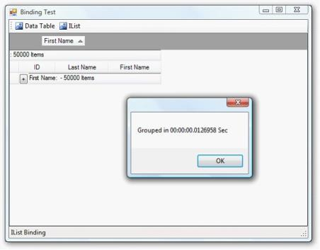' | markdownify }}
{:.image }
        _Figure_ _357_: Time Taken to Group the Records_

##### Data Binding

To display data, grid grouping control must be bound to data source. The grid grouping control supports variety of data sources such as DataTables, DataSets, or any component that implements interface IList, IBindingList, ITypedList, or IListSource. The data source can have multiple nested tables, which will be displayed hierarchically by grid grouping control.

This section deals with different types of data binding mechanisms, supported by grid grouping control, which are listed below.

###### Data Binding using ADO.NET

ADO.NET is an object-oriented set of libraries that allows you to interact with different types of data sources and different types of databases. It comes in different sets of libraries. These libraries are called DataProviders and they allow a common way to interact with specific data sources or protocols. The following table lists the data providers that are widely used.

_Table 79: Data Binding_

<table>
<tr>
<td>
PROVIDER NAME</td><td>
DESCRIPTION</td></tr>
<tr>
<td>
Ole Db Data Provider</td><td>
Data Sources that expose an OleDb interface, i.e. Access or Excel.</td></tr>
<tr>
<td>
SQL Data Provider</td><td>
For interacting with Microsoft SQL Server.</td></tr>
</table>

ADO.NET Objects

ADO.NET objects are used by ADO data model to support database interaction. These objects must be created to supply data-aware control like grid with database data. Data-aware controls possess two data binding properties, DataSource and DataMember. Any data source can be bound to the control by assigning it to DataSource and DataMember properties.

Connection Object

It is used for connection to database and managing transactions against database. Database location and access method will be specified through this connection object. The connection object should be a type of OleDBConnection in case of OLE DB data sources or should be a SqlConnection object for data sources provided by MS SQL Server.

DataAdapter Object

Data adapter acts like a bridge between dataset and data source. It is used to retrieve data from database and populate tables within a dataset. It uses connection object to connect database in order to fill dataset and update changes back to database. There are two adapter components supplied: OleDBDataAdapter and SqlDataAdapter. The former accesses data sources exposed using OLE DB and the latter is designed to work with data sources provided by MS SQL Server version 7.0 or later.

DataSet

Dataset acts like a memory resident cache to hold data. It represents a complete set of data including tables that organize data and relationships between tables. Dataset is designed to help manage data in memory and to support disconnected operations on data. It can be populated by calling Fill method of the DataAdapter.

Command Object

Commands contain information that is submitted to database, and are represented by provider-specific classes such as SQLCommand. A command can be a stored procedure call, an UPDATE statement, or a statement that returns results.

DataReader Object

This is a suitable object when you want to only get the stream of data for reading. The data returned from data reader is a fast forward-only stream of data. This means that you can only pull data from the stream in a sequential manner. This is good for speed, but if you need to manipulate data, then DataSet is a better object to work with.

Data Binding Methods

To bind grid to a database, you can use any one of the following methods.

1. Binding At Design Time
* Binding to a database at Design time using VS2003
* Binding to a database at Design time using VS2005

2. Binding At Run Time
* Binding to an MDB file at run time
* Binding to a manually created datasource
###### Binding to XML Data

Grid Grouping Control can be bound to data from XML files. To do this, DataSet object is required which provides the necessary methods that will let you read XML data into dataset. After loading the data, you can bind the grouping grid to this dataset by setting data binding properties, DataSource and DataMember to dataset and table name respectively. It is also possible to save the changes back to XML file.

The following table lists some important methods provided by dataset that allows you to manipulate XML data. In this, the XmlSchema represents the type of data stored in XML file.

_Table 80: Methods to manipulate XML_

<table>
<tr>
<td colspan = "2">
METHOD NAME</td><td>
DESCRIPTION</td></tr>
<tr>
<td>
ReadXml</td><td colspan = "2">
Reads XML Schema and data into dataset using the specified XML file.</td></tr>
<tr>
<td>
ReadXmlSchema</td><td colspan = "2">
Reads XML Schema from the specified file into dataset.</td></tr>
<tr>
<td>
WriteXml</td><td colspan = "2">
Writes the current data and optionally the schema, for dataset into the specified XML file.</td></tr>
<tr>
<td>
WriteXmlSchema</td><td colspan = "2">
Writes dataset structure as an XML schema into the specified file.</td></tr>
</table>

The following code example illustrates the binding process.

[C#]

//Creates a Data Set.

DataSet XmlData = new DataSet();

//Populates it with data from an XML file.

XmlData.ReadXml("C:\\Data\\Customers_Orders.xml");

//Binds the grid to Data Set.

gridGroupingControl1.DataSource = XmlData;

gridGroupingControl1.DataMember = XmlData.Tables[0];

[VB.NET]

'Creates a Data Set.

Dim XmlData As New DataSet()

'Populates it with data from an XML file.

XmlData.ReadXml("C:\\Data\\Customers_Orders.xml")

'Binds the grid to Data Set.

gridGroupingControl1.DataSource = XmlData

gridGroupingControl1.DataMember = XmlData.Tables(0)

###### Binding to Custom Collections

Custom Collections provide a way to store arbitrary objects in a structured fashion that can be bound to grouping grid. All the data binding is based on a set of interfaces that defines different capabilities of objects and collections within the context of accessing and navigating through data. These interfaces set up a two-way communication between bound grid and objects collection used by the same grid. Those collections may be custom business objects collection or may be the one provided by .NET Framework itself like DataView.

Data binding interfaces will allow you to create collections of custom objects to present those collections through the grid or navigate through the objects to view them through the same grid and interact with them. Some of these interfaces are IList, ITypedList, and IBindingList.

IList Interface

Using this interface, you can create an ordered, indexed set of data items. IList interface is one of the most important interfaces in data binding because complex data-bound controls can only be bound to collections that implement IList. This interface lets you manage collection's data by adding, removing, inserting, and accessing items.

Data source implementing the IList interface must have at least one record in order to make bound controls like grid to create any rows. It will not be notified of any data changes and thus the changes should be updated manually.

ITypedList Interface

ITypedList is suitable for complex data binding process where you can control the columns that are visible with which description and how they should be treated. For example, should they be read only, even there is a set clause in the property definition. Using this interface, you can tell the bound grid exactly how the objects inside a bound collection have to show up in the control and which properties should show up and how they should be treated.

In this case, it is not necessary to have any records for the rows to be created. Like IList, data source will not be notified when items are added or removed from the list.

IBindingList Interface

IBindingList interface is the most important data-binding interface that provides rich data binding support. Implementing this interface lets you control changes to the list, sorting and searching the list. One important benefit is support for providing change notifications to the collection subscribing to this interface.

IBindingList interface overcomes shortcomings of other interfaces by declaring ListChanged event. Data sources referencing this interface will hook onto this event and so will be aware of items that are added or removed from the list. This makes bound grid update itself automatically.

The chapters in this section will demonstrate how to create such collections by implementing collection interfaces and how to bind grouping grid to these collections. 

IList

This section demonstrates implementation of a collection using ArrayList and shows how to bind this collection to a grouping grid. ArrayList is an implementation of IList that could be best defined as a hybrid of normal array and collection. It holds items in the order they were added. The items can be retrieved in any order via their index. As elements are added, the capacity of the ArrayList increases automatically. It allows null references and duplicate elements. Objects implementing IList interface should have at least one record for data rows to be created. Data rows correspond to data objects in the collection and the data columns represents properties of data.

Implementation

Follow these steps to bind an array of custom objects to a grouping grid.

1. Create a class (Data) whose instances represent records and properties represent record fields.

[C#]

public class Data

{

    public Data() : this("", "", "")

    {

    }

    public Data(string cat_Id, string cat_Name, string desc)

    {

this.cat_Id = cat_Id;

this.cat_Name = cat_Name;

this.desc = desc;

    }

    private string cat_Name;

    public string CategoryName

    {

get

{

return this.cat_Name;

}

set

{

this.cat_Name = value;

}

    }

    private string desc;

    public string Description

    {

get

{

return this.desc;

}

set

{

this.desc = value;

}

    }

    private string cat_Id;

    public string CategoryID

    {

        get

        {

return this.cat_Id;

        }

        set

        {

this.cat_Id = value;

        }

    }

}

[VB.NET]

Public Class Data

Public Sub New()

Me.New("", "", "")

End Sub

Public Sub New(ByVal cat_Id As String, ByVal cat_Name As String, ByVal desc As String)

Me.cat_Id = cat_Id

Me.cat_Name = cat_Name

Me.desc = desc

End Sub

Private cat_Name As String

Public Property CategoryName() As String

Get

Return Me.cat_Name

End Get

Set(ByVal value As String)

Me.cat_Name = Value

End Set

End Property

Private desc As String

Public Property Description() As String

Get

Return Me.desc

End Get

Set(ByVal value As String)

Me.desc = Value

End Set

End Property

Private cat_Id As String

Public Property CategoryID() As String

Get

Return Me.cat_Id

End Get

Set(ByVal value As String)

Me.cat_Id = Value

End Set

End Property

End Class

2. Create an instance of ArrayList and add a list of Data type objects into it. This represents collection.

[C#]

using System;

using System.Collections;

ArrayList al = new ArrayList();

al.Add(new Data("Condiments", "Charlotte Cooper","Bigfoot Breweries"));

al.Add(new Data("Confections","Regina Murphy","Grandma Kelly's Homestead"));

al.Add(new Data("Grains/Cereals","Jean-Guy Lauzon","Ma Maison"));

al.Add(new Data("Meat/Poultry","Shelley Burke","New Orleans Cajun Delights"));

al.Add(new Data("Produce", "Mayumi Ohno", "Mayumi's"));

al.Add(new Data("Seafood", "Robb Merchant", "New England Seafood Cannery"));

[VB.NET]

Imports System

Imports System.Collections

Dim al As ArrayList = New ArrayList()

al.Add(New Data("Condiments", "Charlotte Cooper", "Bigfoot Breweries"))

al.Add(New Data("Confections", "Regina Murphy", "Grandma Kelly's Homestead"))

al.Add(New Data("Grains/Cereals", "Jean-Guy Lauzon", "Ma Maison"))

al.Add(New Data("Meat/Poultry", "Shelley Burke", "New Orleans Cajun Delights"))

al.Add(New Data("Produce", "Mayumi Ohno", "Mayumi's"))

al.Add(New Data("Seafood", "Robb Merchant", "New England Seafood Cannery"))

3. Assign this array list to the grouping grid's DataSource.

[C#]

this.gridGroupingControl1.DataSource = al;

[VB.NET]

Me.gridGroupingControl1.DataSource = al

4. Run the sample. Your grid will look similar to the one below.

{{ '' | markdownify }}
{:.image }

> {{ '' | markdownify }}
{:.image }
_Note: For more details, refer to the following browser sample:_

_<Install Location>\Syncfusion\EssentialStudio\[Version Number]\Windows\Grid.Grouping.Windows\Samples\Data Sources\Array List Demo_

IBindingList

This section demonstrates implementation of IBindingList and how to bind this list to Grid Grouping control. As IBindingList derives from IList, it requires the implementation of all the members of the IList, ICollection and IEnumerable interfaces.

Benefits

The benefit of using IBindingList includes support for change notifications when the list is modified. It does have ListChanged event, which will be fired upon any data change. If the collection supports changes, it should also support firing ListChanged event when the collection changes. To indicate that, the collection should return true from SupportsChangeNotification property. Hence when items are added or removed from the collection, the grouping grid will be notified of these changes and will update itself automatically.

Implementation Procedure

Follow these steps to create your own collection that implements IBindingList and to bind this collection to a grouping grid.

1. Create a class(Class1) whose instances will represent records. Its properties represent record fields.
2. Create another class(Class2) that implements interfaces IBindingList and INotifiedPropertyChanged, in order to be notified of any property value change. This class will represent the list of records and will act as data store for your grouping grid.
3. Implements the necessary events: ListChanged and PropertyChanged.
4. Raise ListChanged event once the list is modified. 
5. Make SupportChangeNotifications property to return true.
6. Create an instance of Class2 and add a list of records into it. Then assign this list to DataSource of grouping grid.
> 
{{ '' | markdownify }}
{:.image }
_Note: For the complete code refer the sample:_

_<Install Location>\Syncfusion\EssentialStudio\[Version Number]\Windows\Grid.Grouping.Windows\Samples\Data Sources\IBindingList Demo_

ITypedList

This section demonstrates implementation of ITypedList, which will be used for complex data binding. It is best to use this interface where you want a type to explicitly specify properties it exposes instead of letting TypeDescriptor to find out using reflection. The interface contains two methods: GetItemProperties and GetListName.

GetItemProperties accepts no parameters and returns PropertyDescriptorCollection. In this method, you can use TypeDescriptor.GetProperties to load properties from your type. GetListName returns the name of the list.

Implementation

Follow the steps below to create a collection (Books Collection) that implements ITypedList and binds this collection to the grouping grid.

1. Create a class Book that represents the structure of the record.

[C#]

class Book

{

    public Book(string bname, string author)

    {

        this.bookName = bname;

        this.author = author;

    }

    private string bookName;

    public string BookName

    {

        get

        {

            return this.bookName;

        }

        set

        {

            this.bookName = value;

        }

    }

    private string author;

    public string Author

    {

        get

        {

            return this.author;

        }

        set

        {

            this.author = value;

        }

    }

}

[VB.NET]

Public Class Book

Public Sub New(ByVal bname As String, ByVal auth As String)

Me.bName = bname

Me.authr = auth

End Sub

Private bname As String

Public Property BookName() As String

Get

Return Me.bname

End Get

Set

Me.bname = Value

End Set

End Property

Private authr As String

Public Property Author() As String

Get

Return Me.authr

End Get

Set

Me.authr = Value

End Set

End Property

End Class

2. Create another class Books that inherits ArrayList class and implements ITypedList. A list of its instances will act as data store for grouping grid. Implement GetItemProperties and GetListName methods.

[C#]

public class Books : ArrayList, ITypedList

{

    public PropertyDescriptorCollection GetItemProperties(PropertyDescriptor[] listAccessors)

    {

        return TypeDescriptor.GetProperties(typeof(Book));

    }

    public string GetListName(PropertyDescriptor[] listAccessors)

    {

        return "Book";

    }

}

[VB.NET]

Public Class Books : Inherits ArrayList : Implements ITypedList

Public Function GetItemProperties(ByVal listAccessors As PropertyDescriptor()) As PropertyDescriptorCollection Implements ITypedList.GetItemProperties

Return TypeDescriptor.GetProperties(GetType(Book))

End Function

Public Function GetListName(ByVal listAccessors As PropertyDescriptor()) As String Implements ITypedList.GetListName

Return "Book"

End Function

End Class

3. Create an instance of Books and add a few records into it.

[C#]

Books MyBooks = new Books();

MyBooks.Add(new Book("Computer Networks", "Tanenbaum"));

MyBooks.Add(new Book("Data Structures", "Tremblay and Sorenson"));

MyBooks.Add(new Book("Database Management", "Alexis Leon"));

[VB.NET]

Dim MyBooks As Books = New Books()

MyBooks.Add(New Book("Computer Networks", "Tanenbaum"))

MyBooks.Add(New Book("Data Structures", "Tremblay and Sorenson"))

MyBooks.Add(New Book("Database Management", "Alexis Leon"))

4. Assign this list to the grouping grid's DataSource.

[C#]

this.gridGroupingControl1.DataSource = MyBooks;

[VB.NET]

Me.GridGroupingControl1.DataSource = MyProducts

5. Run the sample. Given below is a sample screenshot.

{{ '' | markdownify }}
{:.image }

> {{ '' | markdownify }}
{:.image }
_Note: For more details, refer to the following browser sample:_

_<Install Location>\Syncfusion\EssentialStudio\[Version Number]\Windows\Grid.Grouping.Windows\Samples\Data Sources\Array List Demo_

Strongly Typed Collections

Grid Grouping control can be bound to a Strongly Typed Collection. Strongly Typed Collection is a collection that stores a Known Type. It can be viewed as an array of specific object. For example, suppose your application needs to store information about products in a factory, you could create a Strongly Typed collection of Product objects. 

Benefits

* Since the collection knows the type of object, it does not need to type cast items between the type you are really storing and a generic object type stored in a collection.
* If you are writing the code to manage collection items, then you can perform any other operation on the items that are being written into and read from the collection.
Collection Base

This section demonstrates how to build a Strongly Typed Collection using CollectionBase class. Strongly Typed collection can be created by inheriting from the System.Collections.CollectionBase class. CollectionBase class implements IList, IListSource, and IEnumerable. These interfaces enable the users to implement methods and properties that support binding, enumerating, and looping using ForEach construct. The result is that your strongly typed collections can be bound directly to our grid grouping control as datasource.

1. Create a class Product whose instances represent the records and properties represent the record fields.

[C#]

class Product

{

    string productName, qtyPerUnit;

    public Product(string name, string qty)

    {

        this.productName = name;

        this.qtyPerUnit = qty;

    }

    public string ProductName

    {

        get

        {

            return productName;

        }

        set

        {

            productName = value;

        }

    }

    public string QuantityPerUnit

    {

        get

        {

            return qtyPerUnit;

        }

        set

        {

            qtyPerUnit = value;

        }

    }

}

[VB.NET]

Class Product

Private ProdName As String 

Private QtyPerUnit As String

Public Sub New(ByVal name As String, ByVal qty As String)

ProdName = name

QtyPerUnit = qty

End Sub 

Public Property ProductName() As String 

Get

Return ProdName 

End Get 

Set(ByVal Value As String) 

ProdName = Value

End Set 

End Property     

Public Property QuantityPerUnit() As String 

Get

Return QtyPerUnit 

End Get 

Set(ByVal Value As String) 

QtyPerUnit = Value

End Set 

End Property  

End Class

2. Create another class Product that derives the CollectionBase class. To make it Strongly Typed, add a default property that will return a typed object. Also, implement an ADD method.

[C#]

using System;

using System.Collections;

class Products : CollectionBase

{

//Default Property.

    public Product this[int index]

    {

        get { return (Product)List[index]; }

        set { List[index] = (Product)value; }

    }

    public int Add(Product item)

    {

        return List.Add(item);

    }

}

[VB.NET]

Imports System

Imports System.Collections

Public Class Products

Inherits CollectionBase

//Using Default Property Indexer.

Default Public Property Item(ByVal Index As Integer) As Product 

Get 

Return CType(List.Item(Index), Product) 

End Get 

Set(ByVal Value As Product) 

List.Item(Index) = Value 

End Set 

End Property 

Public Function Add(ByVal Item As Product) As Integer 

Return List.Add(Item) 

End Function 

End Class 

3. Create Products Collection by instantiating Products class and adding few records to it.

[C#]

Products MyProducts = new Products();

MyProducts.Add(new Product("Chai", "10 boxes x 20 bags"));

MyProducts.Add(new Product("Aniseed Syrup", "12 - 550 ml bottles"));

MyProducts.Add(new Product("Sir Rodney's Marmalade", "30 gift boxes"));

[VB.NET]

Dim MyProducts As Products = New Products()

MyProducts.Add(New Product("Chai", "10 boxes x 20 bags"))

MyProducts.Add(New Product("Aniseed Syrup", "12 - 550 ml bottles"))

MyProducts.Add(New Product("Sir Rodney's Marmalade", "30 gift boxes"))

4. Finally assign this collection to the grouping grid's DataSource.

[C#]

this.gridGroupingControl1.DataSource = MyProducts;

[VB.NET]

Me.GridGroupingControl1.DataSource = MyProducts

5. Run the sample. Here is a sample screen shot.

{{ '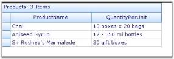' | markdownify }}
{:.image }

> {{ '' | markdownify }}
{:.image }
_Note: For more details, refer the following browser sample:_

_<Install Location>\Syncfusion\EssentialStudio\[Version Number]\Windows\Grid.Grouping.Windows\Samples\Data Sources\Collection Base Demo_

Generic Collection

This section deals with implementation of Generic Collection. Generics refer to those classes, structure, methods, and interfaces that have place holders for the types they can contain or use. A generic collection class uses type parameters as place holders for the type of objects it stores, for the type of its fields, and the parameter types for its methods. The actual types are assigned to these place holders while creating the instances.

It provides a standard way to create non-type-specific collection. Hence, we can get immediate benefit of type safety without having to derive from base collection type and implement type-specific members. Through generics, it is possible to have a single array class to store a list of Players or even a list of Products.

The .NET 2.0 framework provides a number of generic collections to work with. The generic collection classes have been defined in the System.Collections.Generic namespace. Some of them are listed below.

* List<T> is the generic version of ArrayList based on generic interface IList.
* BindingList<T> is the generic collection based on IBindingList.
* BindingListView<T> is a generic collection based on IBindingListView.

where T is the place-holder for type parameter.

Off these classes, IBindingList implementation has some specialities. BindingList<T> automatically raises ListChanged event when INotifyPropertyChanged.PropertyChanged event is raised in a child object. It also raises it when items are added or removed. When you implement custom collection and want the grid to react to changes in datasource, you should implement IBindingList and raise ListChanged events.

Implementation

Follow the steps below to implement generic collection and bind it to our grouping grid control. This implementation uses BindingList<T> class.

1. Create a class (CustomClass) whose objects represent records, and properties represent the record fields. This class implements INotifyPropertyChanged interface in order to trigger the grid to react to changes in the list.

[C#]

public class CustomClass : INotifyPropertyChanged

{

    int id;

    string first_name;

    string last_name;

    string address;

    string city;

    public CustomClass(int id,string fname,string lname,string addr,string city)

    {

        this.id = id;

        first_name = fname;

        last_name = lname;

        address = addr;

        this.city = city;

    }

    public int ID

    {

        get { return id; }

        set 

        {

            if (id != value)

            {

                id = value;

                RaisePropertyChanged("ID");                   

            }

        }

    }

    public string FirstName

    {

        get { return first_name; }

        set 

        {

            if (first_name != value)

            {

                first_name = value;

                RaisePropertyChanged("FirstName"); 

            }

        }

    }

    public string LastName

    {

        get { return last_name; }

        set 

        {

            if (last_name != value)

            {

                last_name = value;

                RaisePropertyChanged("LastName");

            }

            last_name = value; 

        }

    }

    public string Address

    {

        get { return address; }

        set 

        {

            if (address != value)

            {

                address = value;

                RaisePropertyChanged("Address");

            }

        }

    }

    public string City

    {

        get { return city; }

        set 

        {

            if (city != value)

            {

                city = value;

                RaisePropertyChanged("City");

            }

        }

    }

    void RaisePropertyChanged(string name)

    {

        if (PropertyChanged != null)

        PropertyChanged(this, new PropertyChangedEventArgs(name));

    }

//INotifyPropertyChanged Members.

    public event PropertyChangedEventHandler PropertyChanged;

}

[VB.NET]

Public Class CustomClass : Implements INotifyPropertyChanged

    Dim cusid As Integer

    Dim first_name As String, last_name As String, addr As String, cityname As String

    Public Sub New(ByVal id As Integer, ByVal fname As String, ByVal lname As String, ByVal addr As String, ByVal city As String)

        Me.cusid = id

        Me.first_name = fname

        Me.last_name = lname

        Me.addr = addr

        Me.cityname = city

    End Sub

    Public Property ID() As Integer

        Get

            Return cusid

        End Get

        Set(ByVal value As Integer)

            If cusid <> value Then

                cusid = value

                RaisePropertyChanged("ID")

            End If

        End Set

    End Property

    Public Property FirstName() As String

        Get

            Return first_name

        End Get

        Set(ByVal value As String)

            If first_name <> value Then

                first_name = value

                RaisePropertyChanged("FirstName")

            End If

        End Set

    End Property

    Public Property LastName() As String

        Get

            Return last_name

        End Get

        Set(ByVal value As String)

            If last_name <> value Then

                last_name = value

                RaisePropertyChanged("LastName")

            End If

        End Set

    End Property

    Public Property Address() As String

        Get

            Return addr

        End Get

        Set(ByVal value As String)

            If addr <> value Then

                addr = value

                RaisePropertyChanged("Address")

            End If

        End Set

    End Property

    Public Property city() As String

        Get

            Return cityname

        End Get

        Set(ByVal value As String)

            If cityname <> value Then

                cityname = value

                RaisePropertyChanged("City")

            End If

        End Set

    End Property

Sub RaisePropertyChanged(ByVal name As String)

RaiseEvent PropertyChanged(Me, New PropertyChangedEventArgs(name))

End Sub

Public Event PropertyChanged As PropertyChangedEventHandler Implements INotifyPropertyChanged.PropertyChanged

End Class

2. Instantiate BindingList <T> class by specifying the type of collection as CustomClass and add few records to it. This will create a collection of CustomClass type objects.

[C#]

using System.Collections.Generic;

BindingList<CustomClass> bl = new BindingList<CustomClass>();

bl.Add(new CustomClass(0101, "Charlotte", "Cooper", "49 Gilbert St.", "London"));

bl.Add(new CustomClass(0102, "Shelley", "Burke", "P.O. Box 78934", "New Orleans"));

bl.Add(new CustomClass(0103, "Regina", "Murphy", "707 Oxford Rd.", "Ann Arbor"));

bl.Add(new CustomClass(0104, "Yoshi", "Nagase", "9-8 Sekimai Musashino-shi", "Tokyo"));

bl.Add(new CustomClass(0105, "Mayumi", "Ohno", "Calle del Rosal 4", "Oviedo"));

[VB.NET]

Imports System.Collections.Generic

Dim bl As BindingList(Of CustomClass) = New BindingList(Of CustomClass)()

bl.Add(New CustomClass(101, "Charlotte", "Cooper", "49 Gilbert St.", "London"))

bl.Add(New CustomClass(102, "Shelley", "Burke", "P.O. Box 78934", "New Orleans"))

bl.Add(New CustomClass(103, "Regina", "Murphy", "707 Oxford Rd.", "Ann Arbor"))

bl.Add(New CustomClass(104, "Yoshi", "Nagase", "9-8 Sekimai Musashino-shi", "Tokyo"))

bl.Add(New CustomClass(105, "Mayumi", "Ohno", "Calle del Rosal 4", "Oviedo"))

3. Assign this list to the grouping grid's DataSource.

[C#]

this.gridGroupingControl1.DataSource = bl;

[VB.NET]

Me.GridGroupingControl1.DataSource = bl

4. Finally, run the sample. Your grid will look like this.

{{ '' | markdownify }}
{:.image }

> {{ '' | markdownify }}
{:.image }
_Note: For more details, refer the following browser sample:_

_<Install Location>\Syncfusion\EssentialStudio\[Version Number]\Windows\Grid.Grouping.Windows\Samples\Data Sources\Generic Collection Demo_

###### Unbound Mode

Grid Grouping control can be operated in Unbound Mode. In unbound mode, you can add your own columns to the grouping grid along with other bound columns.

Implementation

This section demonstrates how to add custom columns to a grouping grid. The TableDescriptor.UnboundFields.Add() method will allow you to add unbound fields to the grouping grid. Unbound values can be provided in QueryValue event and any changes in the values can be stored back to the data store by handling SaveValue event. Additionally, you can handle QueryCellStyleInfo event to customize unbound cells individually.

The values must be saved somewhere because the grouping grid does not maintain any data structure to store cell values. Since values are unbound, they cannot be stored into bound data source too. In this example, a HashTable is used to save the values of unbound column. The example displays an unbound CheckBox column along with other bound columns using grouping grid.

1. Create a Grid Grouping control and bind it to data store.

[C#]

private Syncfusion.Windows.Forms.Grid.Grouping.GridGroupingControl gridGroupingControl1;

//Defines Grouping Grid.

this.gridGroupingControl1 = new Syncfusion.Windows.Forms.Grid.Grouping.GridGroupingControl();

this.gridGroupingControl1.Size = new System.Drawing.Size(160,200 );

//Creates Data Store.

DataTable dt = new DataTable("MyTable");

int nCols = 2;

int nRows = 5;

for(int i = 0; i < nCols; i++)

dt.Columns.Add(new DataColumn(string.Format("Col{0}", i)));

for(int i = 0; i < nRows; ++i)

{

DataRow dr = dt.NewRow();

for(int j = 0; j < nCols; j++)

dr[j] = string.Format("row{0} col{1}", i, j);

dt.Rows.Add(dr);

}

//Binds data source to grouping grid.

this.gridGroupingControl1.DataSource = dt;

[VB.NET]

'Defines Grouping Grid.

Private gridGroupingControl1 

As Syncfusion.Windows.Forms.Grid.Grouping.GridGroupingControl

Me.gridGroupingControl1 = 

New Syncfusion.Windows.Forms.Grid.Grouping.GridGroupingControl()

Me.gridGroupingControl1.Size = New System.Drawing.Size(160,200 )

'Creates Data Store.

Dim dt As DataTable = New DataTable("MyTable")

Dim nCols As Integer = 2

Dim nRows As Integer = 5

Dim i As Integer = 0

Do While i < nCols

dt.Columns.Add(New DataColumn(String.Format("Col{0}", i)))

i += 1

Loop

i = 0

Do While i < nRows

Dim dr As DataRow = dt.NewRow()

Dim j As Integer = 0

Do While j < nCols

dr(j) = String.Format("row{0} col{1}", i, j)

j += 1

Loop

dt.Rows.Add(dr)

i += 1

Loop

' Binds data source to grouping grid.

Me.GridGroupingControl1.DataSource = dt

2. Create FieldDescriptor that well describes your custom column and adds it to UnboundFieldDescriptor collection of grouping grid.

[C#]

FieldDescriptor unboundField = new FieldDescriptor("CheckboxCol", "", false, "");

unboundField.ReadOnly = false;

this.gridGroupingControl1.TableDescriptor.UnboundFields.Add(unboundField);

[VB.NET]

Dim unboundField As FieldDescriptor = New FieldDescriptor("CheckboxCol", "", False, "")

unboundField.ReadOnly = False

Me.gridGroupingControl1.TableDescriptor.UnboundFields.Add(unboundField)

3. Setup check boxes in the unbound column. You can also customize unbound cells through Appearance property.

[C#]

gridGroupingControl1.TableDescriptor.Columns["CheckboxCol"].Appearance.AnyRecordFieldCell.CellType = "CheckBox";

gridGroupingControl1.TableDescriptor.Columns["CheckboxCol"].Appearance.AnyRecordFieldCell.CheckBoxOptions.CheckedValue = "True";

gridGroupingControl1.TableDescriptor.Columns["CheckboxCol"].Appearance.AnyRecordFieldCell.CheckBoxOptions.UncheckedValue = "False";

gridGroupingControl1.TableDescriptor.Columns["CheckboxCol"].Appearance.AnyRecordFieldCell.HorizontalAlignment = GridHorizontalAlignment.Center;

gridGroupingControl1.TableDescriptor.Columns["CheckboxCol"].Appearance.AnyRecordFieldCell.VerticalAlignment = GridVerticalAlignment.Middle;

[VB.NET]

gridGroupingControl1.TableDescriptor.Columns("CheckboxCol").Appearance.AnyRecordFieldCell.CellType = "CheckBox"

gridGroupingControl1.TableDescriptor.Columns("CheckboxCol"].Appearance.AnyRecordFieldCell.CheckBoxOptions.CheckedValue = "True"

gridGroupingControl1.TableDescriptor.Columns("CheckboxCol"].Appearance.AnyRecordFieldCell.CheckBoxOptions.UncheckedValue = "False"

gridGroupingControl1.TableDescriptor.Columns("CheckboxCol"].Appearance.AnyRecordFieldCell.HorizontalAlignment = GridHorizontalAlignment.Center

gridGroupingControl1.TableDescriptor.Columns("CheckboxCol"].Appearance.AnyRecordFieldCell.VerticalAlignment = GridVerticalAlignment.Middle

4. Handle QueryValue and SaveValue events to set and save the unbound values. Define a HashTable to store unbound values.

[C#]

Hashtable unboundValues = new Hashtable();

private void gridGroupingControl1_QueryValue(object sender, FieldValueEventArgs e)

{

    if (e.Field.Name == "CheckboxCol")

    {

        string key = e.Record.GetValue("Col1").ToString();

        if (key != null)

        {

            object val = unboundValues[key];

            e.Value = val;

        }

    }

}

private void gridGroupingControl1_SaveValue(object sender, FieldValueEventArgs e)

{

    if (e.Field.Name == "CheckboxCol")

    {

        string key = e.Record.GetValue("Col1").ToString();

        if (key != null)

        {

            object val = e.Value;

            unboundValues[key] = val;

        }

    }

}

[VB.NET]

Hashtable(unboundValues = New Hashtable())

Private Sub gridGroupingControl1_QueryValue(ByVal sender As Object, ByVal e As FieldValueEventArgs) Handles gridGroupingControl1.QueryValue

If e.Field.Name = "CheckboxCol" Then

Dim key As String = e.Record.GetValue("Col1").ToString()

If Not key Is Nothing Then

Dim val As Object = unboundValues(key)

e.Value = val

End If

End If

End Sub

Private Sub gridGroupingControl1_SaveValue(ByVal sender As Object, ByVal e As FieldValueEventArgs) Handles gridGroupingControl1.SaveValue

If e.Field.Name = "CheckboxCol" Then

Dim key As String = e.Record.GetValue("Col1").ToString()

If Not key Is Nothing Then

Dim val As Object = e.Value

unboundValues(key) = val

End If

End If

End Sub

5. Customize the unbound cells by handling the QueryCellStyleInfo event.

[C#]

this.gridGroupingControl1.QueryCellStyleInfo += new Syncfusion.Windows.Forms.Grid.Grouping.GridTableCellStyleInfoEventHandler(this.gridGroupingControl1_QueryCellStyleInfo);

private void gridGroupingControl1_QueryCellStyleInfo(object sender, GridTableCellStyleInfoEventArgs e)

{

    if (e.TableCellIdentity.ColIndex == 3 && e.TableCellIdentity.RowIndex > 2)

    {

        if (e.TableCellIdentity.RowIndex % 4 == 0)

        e.Style.CellValue = false;

        else

        e.Style.CellValue = true;

    }

}

[VB.NET]

Private Sub gridGroupingControl1_QueryCellStyleInfo(ByVal sender As Object, ByVal e As GridTableCellStyleInfoEventArgs) Handles gridGroupingControl1.QueryCellStyleInfo

If e.TableCellIdentity.ColIndex = 3 AndAlso e.TableCellIdentity.RowIndex > 2 Then

If e.TableCellIdentity.RowIndex Mod 4 = 0 Then

e.Style.CellValue = False

Else

e.Style.CellValue = True

End If

End If

End Sub

6. Run the sample. Here is a sample screenshot.

{{ '' | markdownify }}
{:.image }

##### Data Representation

This section deals with different layouts supported by grid grouping control. These layouts help grouping grid to organize data display. For example, if you want to view the data arranged based on values of a specific field, then you can group data columns by the required field.

###### Grouping

A Group represents a collection of records that belong to a category. Grid Grouping control allows the user to group data by one or more columns. When grouping is applied, data will be organized into a hierarchical structure based on the matching field values. Records having identical values in grouped column will be combined to form a group. Each group is identified by its GroupCaptionSection that can be expanded to bring underlying records into view. GroupCaptionSection carries information about a particular group like group name, number of items(records) in the group, etc. It also contains plus and minus buttons that allow the user to expand or collapse groups individually. By default, a grid table has one group.

GroupedColumns Collection

GroupedColumns collection defines the fields to group by and the sort order. The collection can have multiple entries resulting in nested groups. GroupedColumns collection of grouping grid can be accessed via its TableDescriptor. The collection consists of various properties, methods, and events that allows the user to manage the elements in it.

Adding Data Groups

Simple Grouping

The data can be grouped by adding the column name to TableDesriptor.GroupedColumns property.

[C#]

this.gridGroupingControl1.TableDescriptor.GroupedColumns.Add("Title");

[VB.NET]

Me.gridGroupingControl1.TableDescriptor.GroupedColumns.Add("Title")

The grid below displays data columns from the Employees Table grouped by the values of Title field.

{{ '' | markdownify }}
{:.image }

By default, the grouping of a column sorts records in the ascending order of their GroupedColumn values. It is possible to specify the sort order while grouping. The code below arranges the data in the descending order of their Title field values.

[C#]

this.gridGroupingControl1.TableDescriptor.GroupedColumns.Add("Title", ListSortDirection.Descending);

[VB.NET]

Me.gridGroupingControl1.TableDescriptor.GroupedColumns.Add("Title", ListSortDirection.Descending)

The screenshot below reflects this process.

{{ '' | markdownify }}
{:.image }

When multiple tables are used in nested manner, a child table can also be grouped by getting access to 

GroupedColumns property of the desired ChildTableDescriptor. The code below shows this process.

[C#]

this.gridGroupingControl1.TableDescriptor.Relations[0].ChildTableDescriptor.GroupedColumns.Add("CategoryName", ListSortDirection.Descending);

[VB.NET]

Me.gridGroupingControl1.TableDescriptor.Relations(0).ChildTableDescriptor.GroupedColumns.Add("CategoryName", ListSortDirection.Descending)

> {{ '' | markdownify }}
{:.image }
_Note: For more details, refer to the following browser sample:_

> _<Install Location>\Syncfusion\EssentialStudio\[Version Number]\Windows\Grid.Grouping.Windows\Samples\2.0\Grouping\Grouping Demo_

Multi Column Grouping

Grid Grouping control provides inbuilt support to group the data by more than one column. It is as simple as adding the column names to the GroupedColumns collection. With multicolumn grouping, grouping grid organizes data in a hierarchical structure showing groups in different levels. In the image below, you see Employees data grouped by Title and Country columns.

{{ '' | markdownify }}
{:.image }

> {{ '' | markdownify }}
{:.image }
_Note: For more details, refer to the following browser sample:_

> _<Install Location>\Syncfusion\EssentialStudio\[Version Number]\Windows\Grid.Grouping.Windows\Samples\2.0\Grouping\Multi Column Grouping Demo_

Grouping Through Designer

Grouping can also be done at design time. After binding dataset to the grouping grid, open TableDescriptor node in property grid of Grid Grouping control. In that, accessing GroupedColumns property will open SortColumnDescriptorCollection Editor. Clicking Add button will add an existing column from the dataset. By using drop down Name, you can change the column by which you want to group table data. You can also specify the sort order for that column by using SortDirection property.

The image below depicts this process.

{{ '' | markdownify }}
{:.image }

Using GroupDropArea

Table data can also be grouped simply by dragging the desired column header and dropping it into the GroupDropArea. Removing column header from the drop area will ungroup data. You can also change the grouping order by simple drag and drop action on column headers.

For more information on GroupDropArea, refer GroupDropArea.

Preventing a Column from Grouping

To disallow a column being grouped, AllowGroupByColumn property should be set to False for that column. This property determines whether the grid can be grouped by a column when the user drags the column to GroupDropArea.

[C#]

this.gridGroupingControl1.TableDescriptor.Columns[0].AllowGroupByColumn = false;

[VB.NET]

Me.gridGroupingControl1.TableDescriptor.Columns(0).AllowGroupByColumn = False

Clearing Groups

GroupedColumns.Clear() method will remove all the elements from GroupedColumns Collection and hence the data will get ungrouped.

[C#]

this.gridGroupingControl1.TableDescriptor.GroupedColumns.Clear();

[VB.NET]

Me.gridGroupingControl1.TableDescriptor.GroupedColumns.Clear()

Removing a given Group

GroupedColumns property provide two methods to remove a specific group from the collection. Remove() method deletes the column with a given name from GroupedColumns collection. As a result, the table data is ungrouped by that column. RemoveAt() method deletes the element at the specified index from the collection.

[C#]

//Removes the first element.

this.gridGroupingControl1.TableDescriptor.GroupedColumns.RemoveAt(0);

//Removes the Title element from the columns collection.

this.gridGroupingControl1.TableDescriptor.GroupedColumns.Remove("Title");

[VB.NET]

'Removes the first element.

Me.gridGroupingControl1.TableDescriptor.GroupedColumns.RemoveAt(0)

'Removes the Title element from the columns collection.

Me.gridGroupingControl1.TableDescriptor.GroupedColumns.Remove("Title")

GroupDropArea

GroupDropArea provides drop panel onto which the user can drag and drop the column headers to group table data by those columns. Its visibility can be controlled by ShowGroupDropArea property. Once it is set to true, a Drop Panel will be added at the top of the grouping grid.

Following code example illustrates how to enable Group Drop Area.

[C#]

this.gridGroupingControl1.ShowGroupDropArea = true;

[VB.NET]

Me.gridGroupingControl1.ShowGroupDropArea = True

Here are runtime screens showing the effect of setting ShowGroupDropArea property.

{{ '' | markdownify }}
{:.image }

{{ '' | markdownify }}
{:.image }

{{ '' | markdownify }}
{:.image }

{{ '' | markdownify }}
{:.image }

{{ '' | markdownify }}
{:.image }

See Also

Adding GroupDropArea

ShowGroupDropArea property will enable GroupDropArea only for the table at the top level. When nested tables are used, drop areas for the child tables need to be added at run time. It is achieved by calling AddGroupDropArea method, by specifying the respective child table name in its parameter.

In this example, the grid is bound to a hierarchical dataset containing three tables Categories, Products, and OrderDetails. The following code example illustrates how to add the group drop area for the child tables Products and OrderDetails.

[C#]

//ShowGroupDropArea adds Group Drop Area for parent Categories table.

this.gridGroupingControl1.ShowGroupDropArea = true;

//Adds Group Drop Areas for nested tables.

this.groupingGrid1.AddGroupDropArea("Products");

this.groupingGrid1.AddGroupDropArea("OrderDetails");

[VB.NET]

'ShowGroupDropArea adds Group Drop Area for parent Categories table.

Me.gridGroupingControl1.ShowGroupDropArea = True

'Adds Group Drop Areas for nested tables.

Me.gridGroupingControl1.AddGroupDropArea("Products")

Me.gridGroupingControl1.AddGroupDropArea("OrderDetails")

Given below is a sample screenshot.

{{ '' | markdownify }}
{:.image }

Customizing GroupDropArea

Grid Group Drop Area is made up of a collection of Grid controls packed in a panel named GroupDropPanel. A Splitter provides the insulation between Group Drop Panel and Grid Table Panel by using the size of Drop Panel that can be adjusted at run time. While formatting Group Drop Area, the user should take care of these controls too.

Properties affecting GroupDropArea

The table given below lists the properties that allow you to customize the look and feel of Grid Group Drop Area.

_Table 81: Properties_

<table>
<tr>
<td>
PROPERTIES</td><td>
DESCRIPTION</td></tr>
<tr>
<td>
gridGroupingControl1.GridGroupDropArea</td><td>
Lists the properties and events to customize drop area.</td></tr>
<tr>
<td>
gridGroupingControl1.GroupDropPanel</td><td>
Lets the user to control drop panel behavior.</td></tr>
<tr>
<td>
gridGroupingControl1.Splitter</td><td>
Provides splitter related properties.</td></tr>
</table>
Example

In this example, grouping grid is built with hierarchical dataset created at runtime. The formatting of Group Drop Area can be controlled by handling PrepareViewStyleInfo event for each of the grids in Group Drop Panel.

7. Formatting Splitter and GroupDropPanel.

[C#]

//Splitter Color.

this.gridGroupingControl1.Splitter.BackColor = Color.Red;

//Panel Color.

this.gridGroupingControl1.GroupDropPanel.BackColor = Color.YellowGreen;

[VB.NET]

'Splitter Color.

Private Me.gridGroupingControl1.Splitter.BackColor = Color.Red

'Panel Color.

Private Me.gridGroupingControl1.GroupDropPanel.BackColor = Color.YellowGreen

8. PrepareViewStyleInfo event for each of the grids can be hooked by looping through controls in the panel.

[C#]

foreach (Control ctl in this.gridGroupingControl1.GroupDropPanel.Controls)

{

    GridGroupDropArea groupDropArea = ctl as GridGroupDropArea;

    switch (groupDropArea.Model.Table.TableDescriptor.Name)

    {

        case "ParentTable":

        groupDropArea.Model.ColCount = 80;

        groupDropArea.PrepareViewStyleInfo += new GridPrepareViewStyleInfoEventHandler(ParentTable_PrepareViewStyleInfo);

        break;

        case "ChildTable":

        groupDropArea.Model.ColCount = 80;

        groupDropArea.PrepareViewStyleInfo += new GridPrepareViewStyleInfoEventHandler(ChildTable_PrepareViewStyleInfo);

        break;

    }

}

[VB.NET]

Dim ctl As Control

For Each ctl In Me.gridGroupingControl1.GroupDropPanel.Controls

Dim groupDropArea As GridGroupDropArea = ctl

Select Case groupDropArea.Model.Table.TableDescriptor.Name

Case "ParentTable"

groupDropArea.Model.ColCount = 80

AddHandler groupDropArea.PrepareViewStyleInfo, AddressOf ParentTable_PrepareViewStyleInfo

Case "ChildTable"

groupDropArea.Model.ColCount = 80

AddHandler groupDropArea.PrepareViewStyleInfo, AddressOf ChildTable_PrepareViewStyleInfo

End Select

Next ctl

9. Setting the style properties in PrepareViewStyleInfo event.

[C#]

private void ParentTable_PrepareViewStyleInfo(object sender, GridPrepareViewStyleInfoEventArgs e)

{

//Sets color to the text displaying table name.

    if (e.ColIndex == 2 && e.RowIndex == 2)

    {

        e.Style.Text = "ParentTable";

        e.Style.Font.Bold = true;

        e.Style.BackColor = Color.YellowGreen;

        e.Style.TextColor = Color.Blue;			

        e.Style.CellType = "Static";

        e.Style.HorizontalAlignment = GridHorizontalAlignment.Left;				

        e.Style.Enabled = false;

    }

//Sets color to the drop area.

    else if (e.Style.Text.StartsWith("Drag a"))

    {

        e.Style.Text = "Drag and Drop Parent Table Column headers";

        e.Style.BackColor = Color.White;

    }		

//Sets color to the dropped columns.

    else if (e.Style.Text.StartsWith("Par"))

    {

        e.Style.BackColor = Color.Tomato;				

        e.Style.Themed = false;

    }

//Sets color to the remaining part.

    else

    e.Style.BackColor = Color.YellowGreen;			

}

private void ChildTable_PrepareViewStyleInfo(object sender, GridPrepareViewStyleInfoEventArgs e)

{

//Sets color to the text displaying table name.

    if (e.ColIndex == 2 && e.RowIndex == 2)

    {

        e.Style.Text = "ChildTable ";

        e.Style.Font.Bold = true;

        e.Style.BackColor = Color.YellowGreen;

        e.Style.TextColor = Color.Yellow;	

        e.Style.CellType = "Static";

        e.Style.HorizontalAlignment = GridHorizontalAlignment.Left;				

        e.Style.Enabled = false;

    }

//Sets color to the drop area.

    else if (e.Style.Text.StartsWith("Drag a"))

    {

        e.Style.Text = "Drag and Drop Parent Table Column headers";

        e.Style.BackColor = Color.Orange;

        e.Style.TextColor = Color.White;

    }

//Sets color to the dropped columns.

    else if (e.Style.Text.StartsWith("Child"))

    {

        e.Style.BackColor = Color.Orange;

        e.Style.TextColor = Color.White;

        e.Style.Themed = false;

    }

//Sets color to the remaining part.

    else

    e.Style.BackColor = Color.YellowGreen;			

}

[VB.NET]

Private Sub ParentTable_PrepareViewStyleInfo(ByVal sender As Object, ByVal e As GridPrepareViewStyleInfoEventArgs)

'Sets color to the text displaying table name.

If e.ColIndex = 2 AndAlso e.RowIndex = 2 Then

e.Style.Text = "ParentTable"

e.Style.Font.Bold = True

e.Style.BackColor = Color.YellowGreen

e.Style.TextColor = Color.Blue

e.Style.CellType = "Static"

e.Style.HorizontalAlignment = GridHorizontalAlignment.Left

e.Style.Enabled = False

'Sets color to the drop area.

ElseIf e.Style.Text.StartsWith("Drag a") Then

e.Style.Text = "Drag and Drop Parent Table Column headers"

e.Style.BackColor = Color.White

'Sets color to the dropped columns.

ElseIf e.Style.Text.StartsWith("Par") Then

e.Style.BackColor = Color.Tomato

e.Style.Themed = False

'Sets color to the remaining part.

Else

e.Style.BackColor = Color.YellowGreen

End If

End Sub

Private Sub ChildTable_PrepareViewStyleInfo(ByVal sender As Object, ByVal e As GridPrepareViewStyleInfoEventArgs)

'Sets color to the text displaying table name.

If e.ColIndex = 2 AndAlso e.RowIndex = 2 Then

e.Style.Text = "ChildTable "

e.Style.Font.Bold = True

e.Style.BackColor = Color.YellowGreen

e.Style.TextColor = Color.Yellow

e.Style.CellType = "Static"

e.Style.HorizontalAlignment = GridHorizontalAlignment.Left

e.Style.Enabled = False

'Sets color to the drop area.

ElseIf e.Style.Text.StartsWith("Drag a") Then

e.Style.Text = "Drag and Drop Parent Table Column headers"

e.Style.BackColor = Color.Orange

e.Style.TextColor = Color.White

'Sets color to the dropped columns.

ElseIf e.Style.Text.StartsWith("Child") Then

e.Style.BackColor = Color.Orange

e.Style.TextColor = Color.White

e.Style.Themed = False

'Sets color to the remaining part.

Else

e.Style.BackColor = Color.YellowGreen

End If

End Sub

10. Here is a sample output.

{{ '' | markdownify }}
{:.image }

Display GroupDropArea in Hierarchy

This feature allows users to display items in GroupDropArea in a hierarchical order. The items will follow a stacked order. Hierarchical grouping enables the following interactive features in GridGrouping control:

* Dynamically remove columns from grouping area.
* Switch tree line placement between top and bottom of hierarchy levels.
* Resize group drop area dynamically up to the last level of hierarchy.
* Set the tree lines with desired color.

_Table 82: Properties_

<table>
<tr>
<td>
PROPERTIES </td><td>
DESCRIPTION </td><td>
TYPE </td><td>
DATA TYPE </td></tr>
<tr>
<td>
HierarchicalGroupDropArea</td><td>
Gets or sets a value to enable GroupDropArea hierarchy in the grid. </td><td>
Boolean </td><td>
Boolean, true/false</td></tr>
<tr>
<td>
GridGroupDropArea.AllowRemove</td><td>
Gets or sets whether GroupDropArea should support removal of groups dynamically.</td><td>
Boolean</td><td>
Boolean, true/false</td></tr>
<tr>
<td>
GridGroupDropArea.TreeLinePlacement</td><td>
Gets or sets the location for tree line, which will be drawn between hierarchy items.</td><td>
Enum</td><td>
enumeration</td></tr>
<tr>
<td>
GridGroupDropArea.DynamicResizing</td><td>
Gets or sets the value to resize GroupDropArea dynamically.</td><td>
Boolean</td><td>
Boolean, true/false</td></tr>
<tr>
<td>
GridGroupDropArea.TreeLineColor</td><td>
Gets or sets the color of tree lines.</td><td>
Color</td><td>
Color</td></tr>
</table>
Sample Link

{installed drive}\AppData\Local\Syncfusion\EssentialStudio\{version}\Windows\Grid.Grouping.Windows\

Samples\2.0\Grouping\GroupingDemo

Adding Hierarchical GroupDropArea to an Application 

To enable this feature, HierarchicalGroupDropArea property must be set to true.

[C#]

this.gridGroupingControl1.HierarchicalGroupDropArea = true;   

[VB]

Me.gridGroupingControl1.HierarchicalGroupDropArea = True

To enable other features supported within hierarchical GroupDropArea, the following properties can be used:

[C#]

//Supports dynamic removal of the column from being grouped (adds support in default GroupDropArea too).

this.gridGroupingControl1. GridGroupDropArea.AllowRemove = true;

//Supports switching tree line placement to the top and bottom between hierarchy levels.

this.gridGroupingControl1.GridGroupDropArea.TreeLinePlacement = TreeLinePlacement.Bottom;

//Supports resizing GroupDropArea dynamically up to the last level of the hierarchy.

this.gridGroupingControl1.GridGroupDropArea.DynamicResizing = true;

//Supports setting tree lines to a desired color.

this_.gridGroupingControl1.GridGroupDropArea.TreeLineColor = Color.Red;_   

[VB]

'Supports dynamic removal of the column from being grouped (adds support in default GroupDropArea too).

Me.gridGroupingControl1.GridGroupDropArea.AllowRemove = True

 'Supports switching tree tree line placement to the top and bottom between hierarchy levels.

Me.gridGroupingControl1.GridGroupDropArea.TreeLinePlacement = TreeLinePlacement.Bottom

'Supports resizing GroupDropArea dynamically up to the last level of the hierarchy.

Me.gridGroupingControl1.GridGroupDropArea.DynamicResizing = True

'Supports setting tree lines to a desired color.

Me.gridGroupingControl1.GridGroupDropArea.TreeLineColor = Color.Red 

{{ '' | markdownify }}
{:.image }

Aligning the GroupDropArea

By default, GroupDropArea is displayed at the top of the Grid Grouping control. With GroupDropAreaAlignment property, you can align it at the bottom, left, or right of the Grid Grouping control.

> {{ '' | markdownify }}
{:.image }
_Note: For GroupDropAreaAlignment property to take effect, HierarchicalGroupDropArea property must be set to false._

[C#]

//Top alignment for GroupDopArea.

this.gridGroupingControl1.GroupDropAreaAlignment = GridGroupDropAreaAlignment.Top;

//Left alignment for GroupDropArea.

this.gridGroupingControl1.GroupDropAreaAlignment = GridGroupDropAreaAlignment.Left;

//Bottom alignment for GroupDropArea.

this.gridGroupingControl1.GroupDropAreaAlignment = GridGroupDropAreaAlignment.Bottom;

//Right alignment for GroupDropArea.

this.gridGroupingControl1.GroupDropAreaAlignment = GridGroupDropAreaAlignment.Right;

[VB.NET]

'Top alignment for GroupDopArea.

Me.gridGroupingControl1.GroupDropAreaAlignment = GridGroupDropAreaAlignment.Top;

'Left alignment for GroupDropArea.

Me.gridGroupingControl1.GroupDropAreaAlignment = GridGroupDropAreaAlignment.Left;

'Bottom alignment for GroupDropArea.

Me.gridGroupingControl1.GroupDropAreaAlignment = GridGroupDropAreaAlignment.Bottom;

'Right alignment for GroupDropArea.

Me.gridGroupingControl1.GroupDropAreaAlignment = GridGroupDropAreaAlignment.Right;

The following screen shot shows GroupDropArea postioned at the top of Grid Grouping control.

{{ '' | markdownify }}
{:.image }

The following screen shot shows GroupDropArea postioned at the left of Grid Grouping control.

{{ '' | markdownify }}
{:.image }
_Figure_ _376_: GroupDropArea aligned at the Left_

The following screen shot shows GroupDropArea postioned at the bottom of Grid Grouping control.

{{ '' | markdownify }}
{:.image }

The following screen shot shows GroupDropArea postioned at the right of Grid Grouping control.

{{ '' | markdownify }}
{:.image }

For more information on setting the alignment of GroupDropArea, see 

<Installed Location>\Syncfusion\EssentialStudio\<Version>\Windows\Grid.Grouping.Windows\

Samples\Grouping\Grouping Demo.

GroupByOptions

Grid Grouping control provides a number of options that allows you to control the look and behavior of the groups. You can control the caption text, where and if AddNew row will be displayed and whether captions, headers, footers, preview rows and summaries will be displayed.

GridGroupOptionsStyleInfo class

GridGroupOptionsStyleInfo class derives StyleInfoBase and defines the properties to control the look and feel of the groups. A grouping grid distinguishes between three different kinds of group options listed below.

_Table 83: Group Options_

<table>
<tr>
<td>
GROUP OPTION</td><td>
DESCRIPTION</td></tr>
<tr>
<td>
TopLevelGroupOptions</td><td>
Lets you control the look and behavior of top level group.</td></tr>
<tr>
<td>
ChildGroupOptions</td><td>
Lets you control the look and behavior of child groups.</td></tr>
<tr>
<td>
NestedTableGroupOptions</td><td>
Lets you control the look and behavior of groups in nested child relations.</td></tr>
</table>

Properties of Group Options

The table below describes the properties defined in the GridGroupOptionsStyleInfo class. These properties are available for all kinds of Group Options.

_Table 84: Properties of Group Options_

<table>
<tr>
<td>
GROUP OPTIONS</td><td>
DESCRIPTION</td></tr>
<tr>
<td>
CaptionText</td><td>
Lets you control the caption text that is displayed.</td></tr>
<tr>
<td>
ShowCaption</td><td>
Indicates whether a caption row is visible.</td></tr>
<tr>
<td>
ShowCaptionPlusMinus</td><td>
Indicates whether a plus/minus cell is to be displayed next to the caption.</td></tr>
<tr>
<td>
ShowAddNewBeforeDetails</td><td>
When true, AddNew record is shown at the top of a group.</td></tr>
<tr>
<td>
ShowAddNewAfterDetails</td><td>
When true, AddNew record is shown at the bottom of a group.</td></tr>
<tr>
<td>
ShowColumnHeaders</td><td>
Indicates whether the column headers are visible.</td></tr>
<tr>
<td>
ShowEmptyGroups</td><td>
Indicates whether a preview is visible when the group is collapsed.</td></tr>
<tr>
<td>
ShowGroupHeader</td><td>
Indicates whether a header is visible.</td></tr>
<tr>
<td>
ShowGroupFooter</td><td>
Indicates whether a footer is visible.</td></tr>
<tr>
<td>
ShowGroupPreview</td><td>
Indicates whether a preview is visible when the group is collapsed.</td></tr>
<tr>
<td>
ShowSummaries</td><td>
Indicates whether summaries are visible.</td></tr>
<tr>
<td>
ShowGroupSummaryWhenCollapsed</td><td>
Indicates whether summary items are visible when the group is collapsed.</td></tr>
<tr>
<td>
ShowFilterBar</td><td>
Indicates whether a filter bar is visible.</td></tr>
<tr>
<td>
ShowStackedHeaders</td><td>
Indicates whether the stacked headers are visible.</td></tr>
<tr>
<td>
ShowGroupIndentAsCoveredRange</td><td>
Indicates whether to treat all indent cells for a group as a single covered cell.</td></tr>
<tr>
<td>
ShowCaptionSummaryCells</td><td>
Indicates whether a group caption should display summaries in columns instead of only one large caption bar.</td></tr>
</table>
Next chapter in this section discuss these properties in detail with a suitable example.

Working with Group Elements

This section explores various properties that can be used to manipulate different group elements.

Group Headers and Footers

The headers and footers of a group can be used to display any information that is common to all elements of that group. You can toggle the display of these headers and footers by using the boolean properties given below.

* <GroupOptions>.ShowGroupHeader
* <GroupOptions>.ShowGroupFooter

where <GroupOptions> can be any one of the following: TopLevelGroupOptions to affect only the top most group, ChildGroupOptions to affect the child groups, or NestedTableGroupOptions to affect the groups in nested tables.

You can also set header and footer attributes such as HeaderSectionHeight and FooterSectionHeight by using the properties given below.

* TableOptions.GroupHeaderSectionHeight
* TableOptions.GroupFooterSectionHeight

Group headers and footers can be populated by handling QueryCellStyleInfo event wherein you can check Header and Footer cell types and provide the data.

{{ '' | markdownify }}
{:.image }

GroupPreviewRows

GroupPreviewSection is the suitable place when you want to display memo fields or add custom notes for a given group. It can be enabled by setting <GroupOptions>.ShowGroupPreview property to True. You can adjust the size of preview row through TableOptions.GroupPreviewSectionHeight property. QueryCellStyleInfo event can be used to populate preview rows.

{{ '' | markdownify }}
{:.image }

AddNew Records

Each group can optionally have an AddNew row where you can provide the values for a new record. Once a new record is entered, the record will be sorted into the existing record set and will be assigned a group's category automatically. The visibility of the AddNewRecord can be controlled through the following two boolean properties.

* <GroupOptions>.ShowAddNewRecordBeforeDetails - adds the AddNew row at the top of a group.
* <GroupOptions>.ShowAddNewRecordAfterDetails - adds the AddNew row at the bottom of a group.

{{ '' | markdownify }}
{:.image }

GroupCaptionSection

This is the first section within a group that provides a caption bar above column headers. GroupCaptionRows are unbound rows that are created only to combine records into a group. By default, they display group category and the number of items in that group. The following properties can be used to control CaptionSection display.

* <GroupOptions>.ShowCaption - enables the display of caption section; True by default. 
* <GroupOptions>.CaptionText - used to get and set caption text.

{{ '' | markdownify }}
{:.image }

CaptionText Tokens

The following table lists the available token formats for <GroupOptions>.CaptionText.

_Table 85: Token formats_

<table>
<tr>
<td>
TOKEN</td><td>
DESCRIPTION</td></tr>
<tr>
<td>
{TableName}</td><td>
Displays the CaptionSection.ParentTableDescriptor.Name.</td></tr>
<tr>
<td>
{CategoryName}</td><td>
Displays the CaptionSection.ParentGroup.Name.</td></tr>
<tr>
<td>
{CategoryCaption}</td><td>
Displays the Header Text of the column that this group belongs to.</td></tr>
<tr>
<td>
{Category}</td><td>
Displays the CaptionSection.ParentGroup.Category.</td></tr>
<tr>
<td>
{RecordCount}</td><td>
Displays the CaptionSection.ParentGroup.GetFilteredRecordCount().</td></tr>
<tr>
<td>
Summary Tokens</td><td>
Allows you to display any item you enter as a Summary Column. See discussion below.</td></tr>
</table>

Custom Summary Tokens 

Any summary item you add can be included in the CaptionText and you have the option of hiding summaries; so it is possible to add summaries only for the purpose of displaying values in the CaptionText. If you have added a summary row named Row1 and a summary column named Column1, then you can also use the value of this summary item in the caption with the token {Row1.Column1}. 

Example

Here is a sample implementation that illustrates usage of the above properties.

1. Set up a Grid Grouping control and bind a data source into it.
2. Setup the necessary Group Options as required.

[C#]

//Group Options Setting.

this.gridGroupingControl1.ShowGroupDropArea = true;

this.gridGroupingControl1.TopLevelGroupOptions.ShowGroupHeader = true;

this.gridGroupingControl1.TopLevelGroupOptions.ShowGroupFooter = true;

this.gridGroupingControl1.TopLevelGroupOptions.ShowCaption = true;

this.gridGroupingControl1.TopLevelGroupOptions.ShowGroupPreview = true;

this.gridGroupingControl1.ChildGroupOptions.ShowGroupPreview = true;

this.gridGroupingControl1.TableOptions.GroupFooterSectionHeight = 30;

this.gridGroupingControl1.TableOptions.GroupHeaderSectionHeight = 30;

this.gridGroupingControl1.TableOptions.GroupPreviewSectionHeight = 25;

this.gridGroupingControl1.TopLevelGroupOptions.ShowAddNewRecordBeforeDetails = true;

this.gridGroupingControl1.TopLevelGroupOptions.ShowAddNewRecordAfterDetails = true;

this.gridGroupingControl1.ChildGroupOptions.CaptionText = "There are {RecordCount} items under {CategoryName} : {Category}";

[VB.NET]

'Group Options Setting.

Me.gridGroupingControl1.ShowGroupDropArea = True

Me.gridGroupingControl1.TopLevelGroupOptions.ShowGroupHeader = True

Me.gridGroupingControl1.TopLevelGroupOptions.ShowGroupFooter = True

Me.gridGroupingControl1.TopLevelGroupOptions.ShowCaption = True

Me.gridGroupingControl1.TopLevelGroupOptions.ShowGroupPreview = True

Me.gridGroupingControl1.ChildGroupOptions.ShowGroupPreview = True

Me.gridGroupingControl1.TableOptions.GroupFooterSectionHeight = 30

Me.gridGroupingControl1.TableOptions.GroupHeaderSectionHeight = 30

Me.gridGroupingControl1.TableOptions.GroupPreviewSectionHeight = 25

Me.gridGroupingControl1.TopLevelGroupOptions.ShowAddNewRecordBeforeDetails = True

Me.gridGroupingControl1.TopLevelGroupOptions.ShowAddNewRecordAfterDetails = True

Me.gridGroupingControl1.ChildGroupOptions.CaptionText = "There are {RecordCount} items under {CategoryName} : {Category}"

3. Handle the QueryCellStyleInfo event to manipulate the group elements.

[C#]

this.gridGroupingControl1.QueryCellStyleInfo += new GridTableCellStyleInfoEventHandler(gridGroupingControl1_QueryCellStyleInfo);

void gridGroupingControl1_QueryCellStyleInfo(object sender, GridTableCellStyleInfoEventArgs e)

{

    if (e.TableCellIdentity.TableCellType == GridTableCellType.GroupFooterSectionCell || e.TableCellIdentity.TableCellType == GridTableCellType.GroupHeaderSectionCell)

    {

        e.Style.Enabled = false;

        if (e.TableCellIdentity.TableCellType == GridTableCellType.GroupFooterSectionCell)

        e.Style.Text = "The details in the footer can be placed by enabling ShowGroupFooter and handling QueryCellStyleInfo";

        if (e.TableCellIdentity.TableCellType == GridTableCellType.GroupHeaderSectionCell)

        e.Style.Text = "The details in the header can be placed by enabling ShowGroupHeader and handling QueryCellStyleInfo";

    }

    if (e.TableCellIdentity.TableCellType == GridTableCellType.GroupPreviewCell)

    {

        Element el = e.TableCellIdentity.DisplayElement;

        e.Style.CellValue = "Preview notes for Group (" + el.ParentGroup.Name + ": " + el.ParentGroup.Category.ToString() + ")";

    }

}

[VB.NET]

Private Sub gridGroupingControl1_QueryCellStyleInfo(ByVal sender As Object, ByVal e As GridTableCellStyleInfoEventArgs) Handles gridGroupingControl1.QueryCellStyleInfo

If e.TableCellIdentity.TableCellType = GridTableCellType.GroupFooterSectionCell OrElse e.TableCellIdentity.TableCellType = GridTableCellType.GroupHeaderSectionCell Then

e.Style.Enabled = False

If e.TableCellIdentity.TableCellType = GridTableCellType.GroupFooterSectionCell Then

e.Style.Text = "The details in the footer can be placed by enabling ShowGroupFooter and handling QueryCellStyleInfo"

End If

If e.TableCellIdentity.TableCellType = GridTableCellType.GroupHeaderSectionCell Then

e.Style.Text = "The details in the header can be placed by enabling ShowGroupHeader and handling QueryCellStyleInfo"

End If

End If

If e.TableCellIdentity.TableCellType = GridTableCellType.GroupPreviewCell Then

Dim el As Element = e.TableCellIdentity.DisplayElement

e.Style.CellValue = "Preview notes for Group (" & el.ParentGroup.Name & ": " & el.ParentGroup.Category.ToString() & ")"

End If

End Sub

4. You can control the appearance of different group elements by using Appearance property.

[C#]

this.gridGroupingControl1.Appearance.AddNewRecordFieldCell.Interior = new BrushInfo(Color.FromArgb(255, 255, 192));

this.gridGroupingControl1.Appearance.GroupCaptionCell.Interior = new BrushInfo(SystemColors.Control);

this.gridGroupingControl1.Appearance.GroupCaptionCell.TextColor = Color.FromArgb(192, 64, 0);

this.gridGroupingControl1.Appearance.GroupFooterSectionCell.Interior = new BrushInfo(Color.Pink);

this.gridGroupingControl1.Appearance.GroupHeaderSectionCell.Interior = new BrushInfo(Color.Pink);

this.gridGroupingControl1.Appearance.GroupIndentCell.Interior = new BrushInfo(Color.FromArgb(192, 192, 255));

this.gridGroupingControl1.Appearance.GroupPreviewCell.Interior = new BrushInfo(Color.FromArgb(192, 255, 192));

[VB.NET]

Me.gridGroupingControl1.Appearance.AddNewRecordFieldCell.Interior = New BrushInfo(Color.FromArgb(255, 255, 192))

Me.gridGroupingControl1.Appearance.GroupCaptionCell.Interior = New BrushInfo(SystemColors.Control)

Me.gridGroupingControl1.Appearance.GroupCaptionCell.TextColor = Color.FromArgb(192, 64, 0)

Me.gridGroupingControl1.Appearance.GroupFooterSectionCell.Interior = New BrushInfo(Color.Pink)

Me.gridGroupingControl1.Appearance.GroupHeaderSectionCell.Interior = New BrushInfo(Color.Pink)

Me.gridGroupingControl1.Appearance.GroupIndentCell.Interior = New BrushInfo(Color.FromArgb(192, 192, 255))

Me.gridGroupingControl1.Appearance.GroupPreviewCell.Interior = New BrushInfo(Color.FromArgb(192, 255, 192))

5. Run the sample and group the table against any data column. Here is a sample screen shot that shows the grouped grid against 'Sport' column.

{{ '' | markdownify }}
{:.image }

> {{ '' | markdownify }}
{:.image }
_Note: For more details, refer to the following browser samples:_

* _<Install Location>\Syncfusion\EssentialStudio\[Version Number]\Windows\Grid.Grouping.Windows\Samples\Grouping Grid Options\Top-Level-Group Options Demo_
* _<Install Location>\Syncfusion\EssentialStudio\[Version Number]\Windows\Grid.Grouping.Windows\Samples\Grouping Grid Options\Child-Group Options Demo_
* _<Install Location>\Syncfusion\EssentialStudio\[Version Number]\Windows\Grid.Grouping.Windows\Samples\Grouping Grid Options\Nested-Table Group Options Demo_
Working with Groups

This section best demonstrates how to work with group rows and also shows how the groups are organized into a grouping grid. Grouping Grid architecture can be viewed as a binary where different grid elements like group rows, summary rows, filter rows, etc. form the nodes of the tree having data records at the bottom as leaf nodes. A group can be a final node with records or it can be a node with nested groups rooting a sub tree.

This lesson will guide you on the ways to access individual groups in a collection, to retrieve all the groups, to expand or collapse groups, and will discuss some of the properties and events used to process groups.

Expanding or Collapsing Groups

All the groups can be expanded as well as collapsed at once by calling the respective methods, Table.ExpandAllGroups and Table.CollapseAllGroups. To expand or collapse a specific group, set Group.IsExpanded property to true or false respectively. Following code example illustrates this.

[C#]

//Expands all groups.

this.gridGroupingControl1.Table.ExpandAllGroups();

//Collapses all groups.

this.gridGroupingControl1.Table.CollapseAllGroups();

//Expands the group with index 3.

this.gridGroupingControl1.Table.TopLevelGroup.Groups[3].IsExpanded = true;

//Collapses the group with index 4.

this.gridGroupingControl1.Table.TopLevelGroup.Groups[4].IsExpanded = false;

[VB.NET]

'Expands all groups.

Me.gridGroupingControl1.Table.ExpandAllGroups()

'Collapses all groups.

Me.gridGroupingControl1.Table.CollapseAllGroups()

'Expands the group with index 3.

Me.gridGroupingControl1.Table.TopLevelGroup.Groups(3).IsExpanded = True

'Collapses the group with index 4.

Me.gridGroupingControl1.Table.TopLevelGroup.Groups(4).IsExpanded = False

Accessing a Given Group

Table.TopLevelGroup.Groups collection maintains details of individual groups in this collection that can be used to retrieve the details of any group. The code below lets you access details of a group with the category ‘Sport’. It also defines a method named IterateGroup that is used to iterate through the records and also the nested groups in a given group. It provides you with group details such as the level of the group, number of items in that group, its category, and so on.

Accessing all the groups

Table.TopLevelGroup is the topmost group in a grouping grid. It forms the root node of the group hierarchy where its categorized records and nested groups form the child nodes. To access all the groups, you can make use of the same IterateThrough method by passing TopLevelGroup as the method parameter. Then this method will loop through categorized records and nested groups of the top level group and will print details of all the groups.

[C#]

//Calls IterateThrough method for a given group.

Group g = this.gridGroupingControl1.Table.TopLevelGroup.Groups["Sport"];

IterateGroup(g);

//Calls IterateThrough method for all the groups in a grid table.

IterateGroup(this.gridGroupingControl1.Table.TopLevelGroup);

//IterateThrough method iterates through records and nested groups.

public void IterateThrough(Group g)

{

    System.Diagnostics.Trace.WriteLine("GroupLevel = "+g.GroupLevel);

    System.Diagnostics.Trace.WriteLine(g.Info);

    foreach(Record r in g.Records)

    {

        System.Diagnostics.Trace.WriteLine(r.Info);

    }

    foreach(Group gr in g.Groups)

    {

        IterateGroup(gr);

    }

}

[VB.NET]

'Calls IterateThrough method for a given group.

Dim g As Group

g = Me.gridGroupingControl1.Table.TopLevelGroup.Groups("Sport")

IterateThrough(g)

'Calls IterateThrough method for all the groups in a grid table.

IterateThrough(Me.gridGroupingControl1.Table.TopLevelGroup)

'IterateThrough method iterates through the records and nested groups.

Public Sub IterateThrough(ByVal g As Group)

System.Diagnostics.Trace.WriteLine("GroupLevel = "+ g.GroupLevel.ToString())

System.Diagnostics.Trace.WriteLine(g.Info)

For Each r As Record In g.Records

System.Diagnostics.Trace.WriteLine(r.Info)

Next r

For Each gr As Group In g.Groups

IterateThrough(gr)

Next gr

End Sub

Accessing the group for a given record

It is the grid.Table object that provides access to the records and the grouped elements. The Table.Records collection returns a read only collection of the data records. The following code can be used to get access to the group for a particular record. Record.ParentGroup property is used to obtain the group that a record belongs to.

[C#]

System.Diagnostics.Trace.WriteLine(this.gridGroupingControl1.Table.Records[3].ParentGroup.Info);

[VB.NET]

System.Diagnostics.Trace.WriteLine(Me.gridGroupingControl1.Table.Records(3).ParentGroup.Info)

Events

This section discusses some of the important events that could be handled to catch grouping actions. Below is a list of such events.

_Table 86: Grouping events_

<table>
<tr>
<td>
EVENT</td><td>
DESCRIPTION</td></tr>
<tr>
<td>
GroupedColumns_Changing</td><td>
Occurs before a property in the collection is changed.</td></tr>
<tr>
<td>
GroupedColumns_Changed</td><td>
Occurs after a property in the collection is changed.</td></tr>
<tr>
<td>
GroupExpanding</td><td>
Occurs before a group is expanded.</td></tr>
<tr>
<td>
GroupExpanded</td><td>
Occurs after a group is expanded.</td></tr>
<tr>
<td>
GroupCollapsing</td><td>
Occurs before a group is collapsed.</td></tr>
<tr>
<td>
GroupCollapsed</td><td>
Occurs after a group is collapsed.</td></tr>
<tr>
<td>
SortingItemsInGroup</td><td>
Occurs before the records for a group are sorted.</td></tr>
<tr>
<td>
SortedItemsInGroup</td><td>
Occurs after the records for a group are sorted.</td></tr>
</table>

Example

The GroupedColumns Changing/Changed events get fired when the list is modified i.e. when any item is added, removed, or modified. It accepts an argument of type ListPropertyChangedEventArgs that lets you check the reason for a list change. The reason could be ItemAdded, ItemInserted, ItemRemoved, ItemModified, ItemMoved, ItemPropertyChanged, or the whole collection is modified.

The following code examples show you how to capture the events. 
[C#]

//Subscribes to the events.

this.gridGroupingControl1.TableDescriptor.GroupedColumns.Changing += new ListPropertyChangedEventHandler(GroupedColumns_Changing);

this.gridGroupingControl1.TableDescriptor.GroupedColumns.Changed += new ListPropertyChangedEventHandler(GroupedColumns_Changed);

//Event Handlers.

//GroupedColumns_Changing event.

void GroupedColumns_Changing(object sender, ListPropertyChangedEventArgs e)

{

SortColumnDescriptor scd = e.Item as SortColumnDescriptor;

if (e.Action == Syncfusion.Collections.ListPropertyChangedType.Insert)

Console.WriteLine("Column Added - {0}", scd.Name);

}

//GroupedColumns_Changed event.

void GroupedColumns_Changed(object sender, ListPropertyChangedEventArgs e)

{

SortColumnDescriptor scd = e.Item as SortColumnDescriptor;

if (e.Action == Syncfusion.Collections.ListPropertyChangedType.Remove)

Console.WriteLine("Column Removed - {0}", scd.Name);

}

[VB.NET]

'Subscribes to the events.

AddHandler gridGroupingControl1.TableDescriptor.GroupedColumns.Changing, AddressOf GroupedColumns_Changing

'Event Handlers.

'GroupedColumns_Changing event.

Private Sub GroupedColumns_Changed(ByVal sender As Object, ByVal e As ListPropertyChangedEventArgs)

Dim scd As SortColumnDescriptor = CType(e.Item, SortColumnDescriptor)

If e.Action = ListPropertyChangedType.Insert Then

Console.WriteLine("Column Added - {0}" + scd.Name)

End If

End Sub

'GroupedColumns_Changed event.

Private Sub GroupedColumns_Changing(ByVal sender As Object, ByVal e As ListPropertyChangedEventArgs)

Dim scd As SortColumnDescriptor = CType(e.Item, SortColumnDescriptor)

If e.Action = ListPropertyChangedType.Remove Then

Console.WriteLine("Column Removed - {0}" + scd.Name)

End If

End Sub

GroupExpanding/GroupExpanded and GroupCollapsing/GroupCollapsed event handlers are best to use when you want to do some actions as a result of the group operations, GroupExpand, and GroupCollapse.

The SortingItemsInGroup and SortedItemsInGroup events are raised when the records for a group are sorted. The grid should have at least one group for these events to occur. It does have no relationship with normal sorting. It occurs only when a grouped column is sorted.

Tracking the changes in Nested Table

It is possible to get notified of the changes in table descriptors other than the default table. This can be achieved by listening to Engine.PropertyChanging event and using GetNestedChildTableDescriptorEvent method. This method lets you get information about a change in the table descriptor of the nested child table. For example, when a column is changed in a nested table, the above method allows you to get details such as table descriptor of the affected table and the original EventArgs which was raised in response to the column changes (eg. ColumnsChanged event). Once you have the event data, you can check whether just the width of the column was changed or if other settings were also changed.

Following code example illustrates the usage of this method.

[C#]

protected override void Engine_PropertyChanging(object sender, DescriptorPropertyChangedEventArgs e)

{

if (e.PropertyName == "TableDescriptor")

{

TableDescriptor tableDescriptor = ((Engine) sender).TableDescriptor;

e = (DescriptorPropertyChangedEventArgs) e.Inner;

if (e.PropertyName == "Relations")

e = e.GetNestedChildTableDescriptorEvent(ref tableDescriptor);

if (e.PropertyName == "Columns")

{

ListPropertyChangedEventArgs le = (ListPropertyChangedEventArgs) e.Inner;

if (le.Action == ListPropertyChangedType.ItemPropertyChanged)

{

if (le.Property == "Appearance" || le.Property == "Width"

|| le.Property == "ReadOnly" || le.Property == "HeaderText"

|| le.Action == ListPropertyChangedType.Remove

|| le.Action == ListPropertyChangedType.Move

|| le.Property == "AllowFilter")

{

return;

}

}

}

}

else if (e.PropertyName == "Appearance")

{

//Base class will end edit mode, which is not necessary.

return;

}

base.Engine_PropertyChanging (sender, e);

}

[VB.NET]

Protected Overrides Sub Engine_PropertyChanging(ByVal sender As Object, ByVal e As DescriptorPropertyChangedEventArgs)

If e.PropertyName = "TableDescriptor" Then

Dim tableDescriptor As TableDescriptor = (CType(sender, Engine)).TableDescriptor

e = CType(e.Inner, DescriptorPropertyChangedEventArgs)

If e.PropertyName = "Relations" Then

e = e.GetNestedChildTableDescriptorEvent(tableDescriptor)

End If

If e.PropertyName = "Columns" Then

Dim le As ListPropertyChangedEventArgs = CType(e.Inner, ListPropertyChangedEventArgs)

If le.Action = ListPropertyChangedType.ItemPropertyChanged Then

If le.Property = "Appearance" OrElse le.Property = "Width" OrElse le.Property = "ReadOnly" OrElse le.Property = "HeaderText" OrElse le.Action = ListPropertyChangedType.Remove OrElse le.Action = ListPropertyChangedType.Move OrElse le.Property = "AllowFilter" Then

Return

End If

End If

End If

ElseIf e.PropertyName = "Appearance" Then

'Base class will end edit mode, which is not necessary.

Return

End If

MyBase.Engine_PropertyChanging(sender, e)

End Sub

Freezing the Caption Row

Grid Grouping control provides support to freeze Caption Row to make sure it stays visible while scrolling content to the left or right. With FreezeCaption property, you can freeze or unfreeze the Caption Row in the Grid Grouping control. A frozen Caption Cell belongs to the GroupCaptionCell Cell Type. Visual Style of the Caption Cell Type is based on Visual Style of Grid Grouping control. Caption Cell text can be changed according to user requirements.

[C#]

this.gridgroupingcontrol.FreezeCaption = true

[VB.NET]

Me.gridgroupingcontrol.FreezeCaption = True

{{ '' | markdownify }}
{:.image }

{{ '' | markdownify }}
{:.image }

To view a sample on Freezing the Caption Row, see <Installed Location>\Syncfusion\EssentialStudio

\<Version>\Windows\Grid.Grouping.Windows\Samples\Grouping\Grouping Demo

###### Sorting

Grid Grouping control allows you to sort table data against one or more columns. The number of columns by which data can be sorted is unlimited. When sorting is applied, grid will rearrange data to match the current sort criteria.

SortedColumns Collection

SortedColumns collection defines the sort order for records within groups. Multiple entries can be added with the first entry having precedence while sorting records. The properties and methods in this collection lets you manage elements in the collection. The collection can be viewed as a set of SortColumnDescriptors, one for every column against which the data is sorted. SortColumnDescriptor of a field contains details like the name of a field, sort direction, and optionally a custom comparer and categorization object. The custom comparer and categorizer will allow you to customize sorting.

Sorting Methods

There are multiple ways to sort table data. A simple one is to click the desired column headers that needs to be sorted. Once sorting is applied, the grid will display a sort icon in the respective column headers showing sort direction. Sorting can also be done against multiple columns by holding Ctrl key and clicking on the desired column headers.

Through Designer

At design time, data can be sorted by accessing SortedColumns property under TableDescriptor section in the property grid of Grid Grouping control. This will open SortColumnDescriptorCollection Editor. In that Editor, clicking Add button will add existing columns into the collection. Name and SortDirection in the property window of the editor will let you specify your desired field name to sort and the sort order. The image given below illustrates this process.

{{ '' | markdownify }}
{:.image }

Programmatic Sorting

Sorting can be applied to the grid data by specifying the desired field name to the TableDescriptor.SortedColumns.Add() method.

[C#]

this.gridGroupingControl1.TableDescriptor.SortedColumns.Add("ProductName");

[VB.NET]

Me.gridGroupingControl1.TableDescriptor.SortedColumns.Add("ProductName")

Multicolumn Sorting can be achieved by adding field names into SortedColumns property and optionally specifying sort direction. The following code example sorts data by ProductName and UnitPrice in ascending Order and by column Quantity in descending Order.

[C#]

this.gridGroupingControl1.TableDescriptor.SortedColumns.Add("ProductName", ListSortDirection.Ascending);

this.gridGroupingControl1.TableDescriptor.SortedColumns.Add("QuantityPerUnit", ListSortDirection.Descending);

this.gridGroupingControl1.TableDescriptor.SortedColumns.Add("UnitPrice", ListSortDirection.Ascending);

[VB.NET]

Me.gridGroupingControl1.TableDescriptor.SortedColumns.Add("ProductName", ListSortDirection.Ascending)

Me.gridGroupingControl1.TableDescriptor.SortedColumns.Add("QuantityPerUnit", ListSortDirection.Descending)

Me.gridGroupingControl1.TableDescriptor.SortedColumns.Add("UnitPrice", ListSortDirection.Ascending)

Here is a sample output. To indicate sort direction, a sort icon will be displayed in the column headers. When multicolumn sorting is applied, an index number will be displayed in the column headers along with sort icon that facilitates sort order. In the example below, the order of sorting would be ProductName(0), Quantity(1) and then UnitPrice(2). 

{{ '' | markdownify }}
{:.image }

> {{ '' | markdownify }}
{:.image }
_Note: For more details, refer to the following browser sample:_

> _<Install Location>\Syncfusion\EssentialStudio\[Version Number]\Windows\Grid.Grouping.Windows\Samples\Sorting\Multi Column Sorting Demo_

Sorting By Display Member

Grid Grouping control sorts the grid based on Value member of the grid data, by default. The user can also sort grid data by Display members of foreign-key combo boxes by setting up a foriegn-key reference relation between related tables. 

> {{ '' | markdownify }}
{:.image }
_Note: A foreign-key reference relation allows the user to look up values in a related table using an id column in the main table._

The following code example illustrates the usage of foreign-key relation:

1. Save the location of the mainTable.Customer column, so that it can be swapped after foreign table reference has been set.

[C#]

GridTableDescriptor td = this.gridGroupingControl1.TableDescriptor; td.VisibleColumns.LoadDefault();

int lookUpIndex = td.VisibleColumns.IndexOf("Customer");

[VB.NET]

Dim td As GridTableDescriptor = Me.gridGroupingControl1.TableDescriptor

td.VisibleColumns.LoadDefault()

Dim lookUpIndex As Integer = td.VisibleColumns.IndexOf("Customer")

2. Add foreign table to the Engine's source list.

[C#]

this.gridGroupingControl1.Engine.SourceListSet.Add(ForeignTableName, ForeignTable.DefaultView);

[VB.NET]

Me.gridGroupingControl1.Engine.SourceListSet.Add(ForeignTableName, ForeignTable.DefaultView)

3. Create and setup RelationKind.ForeignKeyReference relation. 

[C#]

GridRelationDescriptor rd = new GridRelationDescriptor();

rd.Name = "CustomerColDisplay";

rd.RelationKind = RelationKind.ForeignKeyReference;

rd.ChildTableName = ForeignTableName;

[VB.NET]

Dim rd As GridRelationDescriptor = New GridRelationDescriptor()

rd.Name = "CustomerColDisplay"

rd.RelationKind = RelationKind.ForeignKeyReference

rd.ChildTableName = ForeignTableName

4. Set any optional properties on the relation. 

[C#]

//Displays column.     

rd.ChildTableDescriptor.VisibleColumns.Add("CustomerName");

//Sorts it for dropdown display.

rd.ChildTableDescriptor.SortedColumns.Add("CustomerName");

[VB.NET]

'Displays column.    

rd.ChildTableDescriptor.VisibleColumns.Add("CustomerName")

'Sorts it for dropdown display. 

rd.ChildTableDescriptor.SortedColumns.Add("CustomerName")

5. Add relation descriptor to MainTableDescriptor. 

[C#]

td.Relations.Add(rd); 

[VB.NET]

td.Relations.Add(rd)

6. Replace mainTable.Customer with foreignTable.CustomerName.    

[C#]

string foreignCustomerColInMainTable = rd.Name + "_" + "CustomerName"; 

td.VisibleColumns.Insert(CustomerColIndex, foreignCustomerColInMainTable);

[VB.NET]

Dim foreignCustomerColInMainTable As String = rd.Name & "_" & "CustomerName"

td.VisibleColumns.Insert(CustomerColIndex, foreignCustomerColInMainTable)

7. Run the application. The following output is generated.

{{ '' | markdownify }}
{:.image }

In the figure above, CustomerName column is displayed in Foreign Table whereas a column named Customer is located in the Main Table. Customer column holds key values that match the values in a column named CustomerID in the Foreign Table.

> {{ '' | markdownify }}
{:.image }
_Note: For more details, refer to the following browser sample: <Install Location>\Syncfusion\EssentialStudio\[Version Number]\Windows\Grid.Grouping.Windows\Samples\Sorting\Sort By Display Member Demo_

Enable or Disable Sorting

By default, Grouping Grid supports automatic sorting. When you want to disable this automatic sorting, you can use the following methods to prevent sorting on specific columns. 

Properties used to control Sorting

Sorting on the grid data can be controlled by two boolean properties under TableOptions: AllowSortColumns and AllowMultiColumnSort. These properties are used to enable and disable sorting action. They are set to True by default. To prevent sorting against multiple columns, you should set AllowMultiColumnSort to False whereas the AllowSortColumns property should be set to True to allow single column sorting. The screenshot given below highlights these properties in the property window.

{{ '' | markdownify }}
{:.image }

Event used to Prevent Sorting

Sorting specified columns can also be controlled by handling TableControlQueryAllowSortColumn event. The event accepts an instance of GridQueryAllowSortColumnEventArgs as a parameter that contains details of the column being affected. Using this instance, you can check for a particular column and cancel sorting behavior.

The following code example prevents sorting on CompanyName field.

[C#]

this.gridGroupingControl1.TableControlQueryAllowSortColumn+=new GridQueryAllowSortColumnEventHandler(gridGroupingControl1_TableControlQueryAllowSortColumn);

private void gridGroupingControl1_TableControlQueryAllowSortColumn(object sender, GridQueryAllowSortColumnEventArgs e)

{

    if(e.Column.GetName() == "CompanyName")

    {

        e.AllowSort=false;

    }

}

[VB.NET]

AddHandler gridGroupingControl1.TableControlQueryAllowSortColumn, AddressOf gridGroupingControl1_TableControlQueryAllowSortColumn

Private Sub gridGroupingControl1_TableControlQueryAllowSortColumn(ByVal sender As Object, ByVal e As GridQueryAllowSortColumnEventArgs)

If e.Column.GetName() = "CompanyName" Then

e.AllowSort=False

End If

End Sub

> {{ '' | markdownify }}
{:.image }
_Note: For more details, refer to the following browser sample:_

_<Install Location>\Syncfusion\EssentialStudio\[Version Number]\Windows\Grid.Grouping.Windows\Samples\Sorting\Sorting Demo_

###### Summaries

Grid Grouping control allows you to display summaries for each group. Summaries lets you derive additional information from your data like averages, maximums, summations, count, and so on. For instance, you can get number of records, maximum value, etc. They display calculation results in separate display rows. The calculation of summary values is very fast with only O(log2 n) operations (n being the number of records in the table), because of highly optimized balanced tree structures used in the grouping engine.

The grouping grid provides the following built-in summary types.

* Int32Aggregate, DoubleAggregate (Count, Min, Max, Sum) 
* StringAggregate (MaxLength, Count)
* Count 
* DistinctCount (Count, Values array) 
* Vector (Values) 
* DoubleVector (statistical methods: Median, Min, Max, 25% Quartile, 75% Quartile) 
* Custom (Custom Summaries)

The engine supports summaries that operate on vectors such as Distinct Count, Median, 25% and 75% Quartile. Users may also easily add custom summaries.

SummaryRows Collection

TableDescriptor.SummaryRows manages a collection of summary rows for the grid table. This collection implements an abstracted view to summaries that lets users define where to display the summary in the grid. Behind the scenes, GridEngine adds many more hidden summaries to the Summaries collection. Examples for such hidden summaries are: maximum width for contents of a cell, filter bar choices, and display entries of a ForeignKeyKeyWords relation. You can have summaries for individual columns (SummaryColumns) that can be combined into a single Summary Row for display.

It is the SummaryDescriptorCollection that manages summaries for a given table containing one entry for each summary. Each SummaryDescriptor in this collection has a MappingName that identifies FieldDescriptor for summaries calculation and SummaryType property that defines the type of calculations to be performed. Possible options for SummaryType are: Count, BooleanAggregate, ByteAggregate, CharAggregate, DistinctCount, DoubleAggregate, Int32Aggregate, MaxLength, StringAggregate, Vector, DoubleVector, and Custom. By default, SummaryDescriptor ignores records that do not satisfy filter criteria. This behavior can be changed with IgnoreRecordFilterCriteria flag.

Summaries Through Designer

Summaries can be set at design time itself through property window of the grid grouping control. In the property window, SummaryRows under TableDescriptor node will let you manage summaries for a grouping grid. Accessing SummaryRows property will the GridSummaryRowDescriptor collection editor. The editor contains a list of properties such as Title, SummaryColumn, Appearance, etc. that allows you to define summaries for the desired columns and to control the appearance of these summaries.

{{ '' | markdownify }}
{:.image }

Through Code

This example shows a grouping grid bound with Statistics table whose columns are ID, School, Sport, wins, losses, ties and year. Follow the steps below to create a summary for wins column that displays the sum of wins's values.

1. Setup a SummaryColumn by instantiating GridSummaryColumnDescriptor specifying the SummaryType and format.

[C#]

GridSummaryColumnDescriptor scd = new GridSummaryColumnDescriptor();

scd.Appearance.AnySummaryCell.Interior = new BrushInfo(Color.FromArgb(192, 255, 162));

scd.DataMember = "wins";

scd.Format = "{Sum}";

scd.Name = "TotalWins";

scd.SummaryType = SummaryType.Int32Aggregate;

[VB.NET]

Dim scd As GridSummaryColumnDescriptor = New GridSummaryColumnDescriptor()

scd.Appearance.AnySummaryCell.Interior = New BrushInfo(Color.FromArgb(192, 255, 162))

scd.DataMember = "wins"

scd.Format = "{Sum}"

scd.Name = "TotalWins"

scd.SummaryType = SummaryType.Int32Aggregate

2. Define a SummaryRow and add SummaryColumn into it.

[C#]

GridSummaryRowDescriptor srd = new GridSummaryRowDescriptor();

srd.SummaryColumns.Add(scd);

srd.Appearance.AnySummaryCell.Interior = new BrushInfo(Color.FromArgb(255, 231, 162));

[VB.NET]

Dim srd As GridSummaryRowDescriptor = New GridSummaryRowDescriptor()

srd.SummaryColumns.Add(scd)

srd.Appearance.AnySummaryCell.Interior = new BrushInfo(Color.FromArgb(255, 231, 162))

3. Finally add Summary Row into the grouping grid.

[C#]

this.gridGroupingControl1.TableDescriptor.SummaryRows.Add(srd);

[VB.NET]

Me.gridGroupingControl1.TableDescriptor.SummaryRows.Add(srd)

4. Run the sample. The grid will look like this.

{{ '' | markdownify }}
{:.image }

> {{ '' | markdownify }}
{:.image }
_Note: For more details, refer to the following browser sample:_

> _<Install Location>\Syncfusion\EssentialStudio\[Version Number]\Windows\Grid.Grouping.Windows\Samples\Summaries\Getting Started_

Exploring Summaries

In the previous chapter, you learnt how to create simple summaries for a grid table. This chapter will explore the different forms of summaries. It is possible to have multiple summary rows for a single data table. We can define summary for each group and also for each table when nested tables are used.

Multicolumn Summaries

A Summary Row can have any number of summary columns. To display summaries for more than one field, you must first create summary columns for the desired fields. Then add those summary columns into a summary row. The code given below illustrates this.

[C#]

GridSummaryColumnDescriptor scd1 = new GridSummaryColumnDescriptor("Wins", SummaryType.Int32Aggregate, "wins", "{Sum}");

scd1.Appearance.AnySummaryCell.Interior = new BrushInfo(Color.FromArgb(192, 255, 162));

GridSummaryColumnDescriptor scd2 = new GridSummaryColumnDescriptor("Losses", SummaryType.Int32Aggregate, "losses", "{Sum}");

scd2.Appearance.AnySummaryCell.Interior = new BrushInfo(Color.LavenderBlush);

GridSummaryRowDescriptor srd = new GridSummaryRowDescriptor();

srd.SummaryColumns.AddRange(new GridSummaryColumnDescriptor[] { scd1, scd2 });

srd.Appearance.AnySummaryCell.Interior = new BrushInfo(Color.FromArgb(255, 231, 162));

this.gridGroupingControl1.TableDescriptor.SummaryRows.Add(srd);

[VB.NET]

Dim scd1 As GridSummaryColumnDescriptor = New GridSummaryColumnDescriptor("Wins", SummaryType.Int32Aggregate, "wins", "{Sum}")

scd1.Appearance.AnySummaryCell.Interior = New BrushInfo(Color.FromArgb(192, 255, 162))

Dim scd2 As GridSummaryColumnDescriptor = New GridSummaryColumnDescriptor("Losses", SummaryType.Int32Aggregate, "losses", "{Sum}")

scd2.Appearance.AnySummaryCell.Interior = New BrushInfo(Color.LavenderBlush)

Dim srd As GridSummaryRowDescriptor = New GridSummaryRowDescriptor()

srd.SummaryColumns.AddRange(New GridSummaryColumnDescriptor() {scd1, scd2})

srd.Appearance.AnySummaryCell.Interior = New BrushInfo(Color.FromArgb(255, 231, 162))

Me.gridGroupingControl1.TableDescriptor.SummaryRows.Add(srd)

Here is a sample screenshot displaying the summaries for the columns wins and losses.

{{ '' | markdownify }}
{:.image }

MultiRow Summaries

Grouping Grid allows you to have summaries for more than one row. It is achieved by defining the required number of summary row descriptors. Each of the summary rows can have its own format for calculating summaries. Here is an example that shows how to add two different summary rows for a grid table.

[C#]

GridSummaryColumnDescriptor scd1 = new GridSummaryColumnDescriptor("Wins", SummaryType.Int32Aggregate, "wins", "{Sum}");

scd1.Appearance.AnySummaryCell.Interior = new BrushInfo(Color.FromArgb(192, 255, 162));

GridSummaryColumnDescriptor scd2 = new GridSummaryColumnDescriptor("Losses", SummaryType.Int32Aggregate, "losses", "{Sum}");

scd2.Appearance.AnySummaryCell.Interior = new BrushInfo(Color.LavenderBlush);

GridSummaryRowDescriptor srd = new GridSummaryRowDescriptor();

srd.SummaryColumns.AddRange(new GridSummaryColumnDescriptor[] { scd1, scd2 });

srd.Appearance.AnySummaryCell.Interior = new BrushInfo(Color.FromArgb(255, 231, 162));

GridSummaryColumnDescriptor scd3 = new GridSummaryColumnDescriptor("Total", SummaryType.Count, "{Count} Records.");

GridSummaryRowDescriptor srd = new GridSummaryRowDescriptor("Row2", scd3);

srd2.Appearance.AnySummaryCell.Interior = new BrushInfo(Color.FromArgb(255, 231, 162));

this.gridGroupingControl1.TableDescriptor.SummaryRows.AddRange(new GridSummaryRowDescriptor[] { srd1, srd2 });

[VB.NET]

Dim scd1 As GridSummaryColumnDescriptor = New GridSummaryColumnDescriptor("Wins", SummaryType.Int32Aggregate, "wins", "{Sum}")

scd1.Appearance.AnySummaryCell.Interior = New BrushInfo(Color.FromArgb(192, 255, 162))

Dim scd2 As GridSummaryColumnDescriptor = New GridSummaryColumnDescriptor("Losses", SummaryType.Int32Aggregate, "losses", "{Sum}")

scd2.Appearance.AnySummaryCell.Interior = New BrushInfo(Color.LavenderBlush)

Dim srd1 As GridSummaryRowDescriptor = New GridSummaryRowDescriptor()

srd1.SummaryColumns.AddRange(New GridSummaryColumnDescriptor() {scd1, scd2})

srd1.Appearance.AnySummaryCell.Interior = New BrushInfo(Color.FromArgb(255, 231, 162))

Dim scd3 As GridSummaryColumnDescriptor = New GridSummaryColumnDescriptor("Total", SummaryType.Count, "{Count} Records.")

Dim srd2 As GridSummaryRowDescriptor = New GridSummaryRowDescriptor("Row2", scd3)

srd2.Appearance.AnySummaryCell.Interior = New BrushInfo(Color.FromArgb(255, 231, 162))

Me.gridGroupingControl1.TableDescriptor.SummaryRows.AddRange(New GridSummaryRowDescriptor() {srd1, srd2})

Given below is a sample screenshot.

{{ '' | markdownify }}
{:.image }

Summaries for Nested Tables and Groups

For example, if your datasource has two tables nested, Orders and Order Details, with summaries for the parent table. The summaries that are set for the top level table are sufficient enough for the groups. You need to define summary rows only for child tables. It can be achieved by creating summaries through ChildTableDescriptor. The following code illustrates this process.

[C#]

//Adds Summaries for the Parent Table(Orders).

GridSummaryColumnDescriptor scd = new GridSummaryColumnDescriptor("Sum", SummaryType.DoubleAggregate, "Freight", "{Sum:#}");

GridSummaryRowDescriptor srd = new GridSummaryRowDescriptor("Sum", "$", scd);

srd.Appearance.AnyCell.HorizontalAlignment = GridHorizontalAlignment.Right;

srd.Appearance.AnyCell.BackColor = Color.FromArgb(255, 231, 162);

this.gridGroupingControl1.TableDescriptor.SummaryRows.Add(srd);

//Adds Summaries for the Child Table(Order Details).

scd = new GridSummaryColumnDescriptor("Sum", SummaryType.Int32Aggregate, "Quantity", "{Sum:#}");

srd = new GridSummaryRowDescriptor("Sum", "Total", scd);

srd.Appearance.AnyCell.HorizontalAlignment = GridHorizontalAlignment.Right;

srd.Appearance.AnyCell.BackColor = Color.FromArgb(255, 231, 162);

this.gridGroupingControl1.GetTableDescriptor("Order Details").SummaryRows.Add(srd);

[VB.NET]

'Adds Summaries for the Parent Table(Orders).

Dim scd As GridSummaryColumnDescriptor = New GridSummaryColumnDescriptor("Sum", SummaryType.DoubleAggregate, "Freight", "{Sum:#}")

Dim srd As GridSummaryRowDescriptor = New GridSummaryRowDescriptor("Sum", "$", scd)

srd.Appearance.AnyCell.HorizontalAlignment = GridHorizontalAlignment.Right

srd.Appearance.AnyCell.BackColor = Color.FromArgb(255, 231, 162)

Me.gridGroupingControl1.TableDescriptor.SummaryRows.Add(srd)

'Adds Summaries for the Child Table(Order Details).

scd = New GridSummaryColumnDescriptor("Sum", SummaryType.Int32Aggregate, "Quantity", "{Sum:#}")

srd = New GridSummaryRowDescriptor("Sum", "Total", scd)

srd.Appearance.AnyCell.HorizontalAlignment = GridHorizontalAlignment.Right

srd.Appearance.AnyCell.BackColor = Color.FromArgb(255, 231, 162)

Me.gridGroupingControl1.GetTableDescriptor("Order Details").SummaryRows.Add(srd)

Here is a sample screen shot.

{{ '' | markdownify }}
{:.image }

> {{ '' | markdownify }}
{:.image }
_Note: For more details, refer to the following browser sample:_

> _<Install Location>\Syncfusion\EssentialStudio\[Version Number]\Windows\Grid.Grouping.Windows\Samples\Summaries\Nested-Table and Group Summary Demo_

Summary In Caption

Grid Grouping control provides built-in options to display group summaries for the columns in GroupCaptions instead of creating distinct rows for summaries. It can be easily achieved with few property settings. The table below describes these properties, which can be accessed through GroupOptions.

_Table 87: Properties_

<table>
<tr>
<td>
PROPERTY NAME</td><td>
DESCRIPTION</td></tr>
<tr>
<td>
ShowCaptionSummaryCells</td><td>
Decides whether GroupCaptionCells are allowed to display summaries for the columns.</td></tr>
<tr>
<td>
ShowSummaries</td><td>
Indicates whether summaries are visible.</td></tr>
<tr>
<td>
CaptionSummaryRow</td><td>
Lets you specify a summary row that should be displayed in the caption cells when ShowCaptionSummaryCells is set to true.</td></tr>
<tr>
<td>
CaptionText</td><td>
Lets you control the caption text to be displayed.</td></tr>
</table>

Steps to create Caption Summaries

1. First, define a summary for the grid table. Then group the table against a data column.

[C#]

//Adds Summaries.

GridSummaryColumnDescriptor scd = new GridSummaryColumnDescriptor("Sum", SummaryType.DoubleAggregate, "Freight", "{Sum:#}");

GridSummaryRowDescriptor srd = new GridSummaryRowDescriptor("Sum", "$", scd);

srd.Appearance.AnyCell.HorizontalAlignment = GridHorizontalAlignment.Right;

srd.Appearance.AnyCell.BackColor = Color.Cornsilk;

this.gridGroupingControl1.GetTableDescriptor("Orders").SummaryRows.Add(srd);

this.gridGroupingControl1.ShowGroupDropArea = true;

this.gridGroupingControl1.TableDescriptor.GroupedColumns.Add("RequiredDate");

[VB.NET]

'Adds Summaries.

Dim scd As GridSummaryColumnDescriptor = New GridSummaryColumnDescriptor("Sum", SummaryType.DoubleAggregate, "Freight", "{Sum:#}")

Dim srd As GridSummaryRowDescriptor = New GridSummaryRowDescriptor("Sum", "$", scd)

srd.Appearance.AnyCell.HorizontalAlignment = GridHorizontalAlignment.Right

srd.Appearance.AnyCell.BackColor = Color.Cornsilk

Me.gridGroupingControl1.GetTableDescriptor("Orders").SummaryRows.Add(srd)

Me.gridGroupingControl1.ShowGroupDropArea = True

Me.gridGroupingControl1.TableDescriptor.GroupedColumns.Add("RequiredDate")

2. Enable Caption Summaries by setting ShowCaptionSummaryCells to True and by turning off ShowSummaries property that will disable creation of additional summary rows.

[C#]

//Creates summaries in caption.

this.gridGroupingControl1.ChildGroupOptions.ShowCaptionSummaryCells = true;

this.gridGroupingControl1.ChildGroupOptions.ShowSummaries = false;

[VB.NET]

'Creates summaries in caption.

Me.gridGroupingControl1.ChildGroupOptions.ShowCaptionSummaryCells = True

Me.gridGroupingControl1.ChildGroupOptions.ShowSummaries = False

3. Once caption summaries are enabled, your next step is to specify a summary to be displayed in the Caption Rows. This is done by assigning summary name to CaptionSummaryRow property. Optionally you can customize caption text in the way you need.

[C#]

this.gridGroupingControl1.ChildGroupOptions.CaptionSummaryRow = "Sum";

this.gridGroupingControl1.ChildGroupOptions.CaptionText = "{RecordCount} Items";

[VB.NET]

Me.gridGroupingControl1.ChildGroupOptions.CaptionSummaryRow = "Sum"

Me.gridGroupingControl1.ChildGroupOptions.CaptionText = "{RecordCount} Items"

4. Finally, format the caption rows to improve the look and feel.

[C#]

//Provides a good look and enables Caption Summary Cells as Record Field Cells.

this.gridGroupingControl1.Appearance.GroupCaptionCell.BackColor = this.gridGroupingControl1.Appearance.RecordFieldCell.BackColor;

this.gridGroupingControl1.Appearance.GroupCaptionCell.Borders.Top = new GridBorder(GridBorderStyle.Standard);

this.gridGroupingControl1.Appearance.GroupCaptionCell.CellType = "Static";

[VB.NET]

'Provides a good look and enables Caption Summary Cells as Record Field Cells.

Me.gridGroupingControl1.Appearance.GroupCaptionCell.BackColor = Me.gridGroupingControl1.Appearance.RecordFieldCell.BackColor

Me.gridGroupingControl1.Appearance.GroupCaptionCell.Borders.Top = New GridBorder(GridBorderStyle.Standard)

Me.gridGroupingControl1.Appearance.GroupCaptionCell.CellType = "Static"

5. When you run the sample, your grid will look similar to this.

{{ '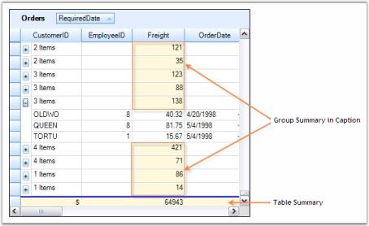' | markdownify }}
{:.image }

Here is another screenshot that shows the grouping grid with Caption Summaries disabled.

{{ '' | markdownify }}
{:.image }

> {{ '' | markdownify }}
{:.image }
_Note: For more details, refer to the following browser sample:_

> _<Install Location>\Syncfusion\EssentialStudio\[Version Number]\Windows\Grid.Grouping.Windows\Samples\Summaries\Caption Summary Demo_

Sort By Summary In Caption

This section illustrates how to sort groups by values of the summary. By default, when grouping is applied, it sorts records by the values of grouped column. When you want to change this default group and make grouping sort records by the values of group summaries, thre are a couple of ways to achieve this. You can use your own custom comparer to define the sort order. An alternate solution is to make use of built-in method, that is specially designed to use in this scenario, named SetGroupSummaryOrder. 

SetGroupSummaryOrder Method

This method will set up a custom comparer for sorting groups to enable groups to be sorted in a different order. It can be defined for a given column say, Col1 by passing the summary name, property in the summary and optionally sort direction as parameters. It makes use of these parameters to retrieve summary values and then pass these values to a custom comparer, which sets up a sort order based on these summary values. When the grid is grouped against column Col1, then groups are sorted in the order specified by the custom comparer instead of sorting by default order.

Example

This example uses an Orders Table bound to a grouping grid. Summaries are created for the column Freight. The group caption cells are made to display group summaries for Freight column. Now, our goal is to sort the table against ShipCountry field with data records arranged based on caption summaries i.e. groups are sorted against the summary values rather than the category.

Follow these steps to sort groups by summary values.

6. Define Summary Column Descriptor for column Freight and add it to SummaryRow of Orders table.

[C#]

GridSummaryColumnDescriptor summaryColumn1 = new GridSummaryColumnDescriptor("FreightAverage", SummaryType.DoubleAggregate, "Freight", "{Average:###.00}");

GridSummaryRowDescriptor summaryRow1 = new GridSummaryRowDescriptor();

summaryRow1.Name = "Caption";

summaryRow1.SummaryColumns.Add(summaryColumn1);

this.gridGroupingControl1.TableDescriptor.SummaryRows.Add(summaryRow1);

[VB.NET]

Dim summaryColumn1 As New GridSummaryColumnDescriptor("FreightAverage", SummaryType.DoubleAggregate, "Freight", "{Average:###.00}")

Dim summaryRow1 As New GridSummaryRowDescriptor()

summaryRow1.Name = "Caption"

summaryRow1.SummaryColumns.Add(summaryColumn1)

Me.gridGroupingControl1.TableDescriptor.SummaryRows.Add(summaryRow1)

7. Trigger caption summaries by setting appropriate properties.

[C#]

this.gridGroupingControl1.TableDescriptor.ChildGroupOptions.ShowCaptionSummaryCells = true;

this.gridGroupingControl1.TableDescriptor.ChildGroupOptions.CaptionSummaryRow = "Caption";

this.gridGroupingControl1.TableDescriptor.ChildGroupOptions.ShowSummaries = false;

[VB.NET]

Me.gridGroupingControl1.TableDescriptor.ChildGroupOptions.ShowCaptionSummaryCells = True

Me.gridGroupingControl1.TableDescriptor.ChildGroupOptions.CaptionSummaryRow = "Caption"

Me.gridGroupingControl1.TableDescriptor.ChildGroupOptions.ShowSummaries = False

8. Create SortColumnDescriptor for the field ShipCountry. Change default group order by using SetGroupSummaryOrder method with its parameters conveying summary name and property in the summary. Then group the grid against this column.

[C#]

//Specifies group sort order behavior when adding SortColumnDescriptor to GroupedColumns.

this.gridGroupingControl1.TableDescriptor.GroupedColumns.Clear();

SortColumnDescriptor gsd = new SortColumnDescriptor("ShipCountry");

//Specifies a summary name and the property (values will be determined using reflection).

gsd.SetGroupSummarySortOrder(summaryColumn1.GetSummaryDescriptorName(), "Average");

this.gridGroupingControl1.TableDescriptor.GroupedColumns.Add(gsd);

[VB.NET]

'Specifies group sort order behavior when adding SortColumnDescriptor to GroupedColumns

Me.gridGroupingControl1.TableDescriptor.GroupedColumns.Clear()

Dim gsd As New SortColumnDescriptor("ShipCountry")

'Specifies a summary name and property (values will be determined using reflection)

gsd.SetGroupSummarySortOrder(summaryColumn1.GetSummaryDescriptorName(), "Average")

Me.gridGroupingControl1.TableDescriptor.GroupedColumns.Add(gsd)

9. When you run the sample, you will see the groups sorted against summary values of Freight. Here is a sample screen shot.

{{ '' | markdownify }}
{:.image }

> {{ '' | markdownify }}
{:.image }
_Note: For more details, refer the following browser sample:_

> _<Install Location>\Syncfusion\EssentialStudio\[Version Number]\Windows\Grid.Grouping.Windows\Samples\Summaries\Sort by Summary Demo_

###### Filters and Expressions

Grouping Grid supports record filters and expression fields. Record Filters let you display subset of records that meets a given filter criteria. Expression Fields are unbound fields added to the grouping grid that can be used to display any calculation results based on other fields in the same record.

Further topics in this section discusses these concepts in detail with suitable examples.

Expression Fields

Expression Fields will allow you to add a column that holds calculated values based on other fields in the same record. These expression columns can be visible or invisible, used in grouping and sorting, and may be employed as summary fields for summary rows. As with adding Summary Rows and Summary Columns, you can use collection editors to add Expression Fields. 

Expression Fields Collection

Expression Fields collection of TableDescriptor defines expression fields. This collection is managed by ExpressionFieldDescriptor collection in which each entry termed as ExpressionFieldDescriptor defines one expression field. The data for expression fields is calculated at runtime based on ExpressionFieldDescriptor.Expression text formula and can depend on other fields in the same record.  

Adding Expression Fields Through Designer

In the property window of the grouping grid, if you open TableDescriptor section, you will notice ExpressionFields collection property. Clicking this will open ExpressionFieldDescriptor Collection Editor. The editor displays properties necessary to setup expression fields. The table given below gives a brief description about some important properties.

_Table 88: ExpressionFields collection properties_

<table>
<tr>
<td>
PROPERTY NAMES</td><td>
DESCRIPTION</td></tr>
<tr>
<td>
Name</td><td>
Specifies the name of the expression field.</td></tr>
<tr>
<td>
Expression</td><td>
Specifies the formula expression.</td></tr>
<tr>
<td>
ResultType</td><td>
Lets you specify the result type to which the expression should be converted.</td></tr>
<tr>
<td>
ForceImmediateSaveValue</td><td>
Indicates whether the changes to the field in a record should trigger SaveValue event; Set it to False to avoid triggering ListChanged events when the expression field is modified.</td></tr>
<tr>
<td>
ReferencedFields</td><td>
Saves a list of referenced field names used in the expression. Use semicolon as a delimiter to specify multiple fields.This list will be used by the engine to determine the cells to be updated when ListChanged event is triggered.</td></tr>
</table>

You can add any number of expression fields to the table. The following image depicts this.

{{ '' | markdownify }}
{:.image }

Programmatically

Expression Fields can also be set through code. The following code example adds two expression fields to the Statistics table.

[C#]

//Defines expression fields.

ExpressionFieldDescriptor exp1 = new ExpressionFieldDescriptor("Winning %", "([wins] *100)/([wins]+[ties]+[losses])", "System.Double");

ExpressionFieldDescriptor exp1 = new ExpressionFieldDescriptor("Loosing %", "([losses] *100)/([wins]+[ties]+[losses])", "System.Double");

//Adds expression fields to the grid table.

this.gridGroupingControl1.TableDescriptor.ExpressionFields.AddRange(new Syncfusion.Grouping.ExpressionFieldDescriptor[] { exp1, exp2 });

[VB.NET]

'Defines expression fields.

Dim exp1 As ExpressionFieldDescriptor = New ExpressionFieldDescriptor("Winning %", "([wins] *100)/([wins]+[ties]+[losses])", "System.Double")

Dim exp2 As ExpressionFieldDescriptor = New ExpressionFieldDescriptor("Loosing %", "([losses] *100)/([wins]+[ties]+[losses])", "System.Double")

'Adds the expression fields to the grid table.

this.gridGroupingControl1.TableDescriptor.ExpressionFields.AddRange(New Syncfusion.Grouping.ExpressionFieldDescriptor() {exp1, exp2})

The screen shot given below highlights these expression fields.

{{ '' | markdownify }}
{:.image }

> {{ '' | markdownify }}
{:.image }
_Note: For more details, refer to the following browser sample:_

> _<Install Location>\Syncfusion\EssentialStudio\[Version Number]\Windows\Grid.Grouping.Windows\Samples\Filters and Expressions\Expression Field Demo_

See Also

Nested Expression Fields

Expression fields can be nested, which means that the formula expression of an expression field can have reference to other fields. Given below are examples for nested expression fields.

* ExpressionField1.Expression = " [Col1] * 100 "
* ExpressionField2.Expression = " [ExpressionField1] + 0.5 "
* ExpressionField3.Expression = " [ExpressionField1] + [ExpressionField2] "

Sample Code

The following code example is used to create nested expression fields.

[C#]

//Defines expression fields that are nested.

ExpressionFieldDescriptor expField1 = new ExpressionFieldDescriptor("ExpCol1", "[wins]+[ties]+[losses]", typeof(System.Double));

ExpressionFieldDescriptor expField2 = new ExpressionFieldDescriptor("ExpCol2", "[ExpCol1]*100", typeof(System.Double));

//Adds these expression fields to the grid table.        

this.gridGroupingControl1.TableDescriptor.ExpressionFields.AddRange(new ExpressionFieldDescriptor[] { expField1, expField2 });

//Appearance Settings.

this.gridGroupingControl1.TableDescriptor.Columns["ExpCol1"].Appearance.AnyRecordFieldCell.BackColor = Color.Cornsilk;

this.gridGroupingControl1.TableDescriptor.Columns["ExpCol2"].Appearance.AnyRecordFieldCell.BackColor = Color.Cornsilk;

[VB.NET]

'Defines expression fields that are nested.

Dim expField1 As ExpressionFieldDescriptor = New ExpressionFieldDescriptor("ExpCol1", "[wins]+[ties]+[losses]", GetType(System.Double)))

Dim expField1 As ExpressionFieldDescriptor = New ExpressionFieldDescriptor("ExpCol2", "[ExpCol1]*100", GetType(System.Double))

'Adds these expression fields to the grid table.

Me.gridGroupingControl1.TableDescriptor.ExpressionFields.AddRange(New ExpressionFieldDescriptor() {expField1, expField2})

'Appearance Settings.

Me.gridGroupingControl1.TableDescriptor.Columns("ExpCol1").Appearance.AnyRecordFieldCell.BackColor = Color.Cornsilk

Me.gridGroupingControl1.TableDescriptor.Columns("ExpCol2").Appearance.AnyRecordFieldCell.BackColor = Color.Cornsilk

Here is a sample screen shot showing two expression fields ExpCol1 and ExpCol2 where ExpCol2 is referencing ExpCol1.

{{ '' | markdownify }}
{:.image }

List of Expressions

A note on Valid Expression Syntax

Expressions may be any well-formed algebraic combination of column mapping names enclosed with brackets ([]), numerical constants and literals, and the algebraic and logical operators are listed below.

The computations are performed as listed with level one operations done first. Alpha constants used with match and like should be enclosed in apostrophes (').

* *, / : multiplication, division.
* +, - : addition, subtraction.
* <, >, =, <=, >=: less than, greater than, equal, less than or equal.
* match, like, in, between.
* or, and.

Below is the list of operators used and their descriptions.

_Table 89: Operators_

<table>
<tr>
<td>
EXPRESSION</td><td>
SYNTAX</td><td>
DESCRIPTION</td><td>
EXAMPLE USAGE</td></tr>
<tr>
<td>
Multiplication, Division</td><td>
*,/</td><td>
Multiplies/Divides first argument by second arguMultiplies/Divides first argument by second argument.</td><td>
[Wins] * [Losses] / 100</td></tr>
<tr>
<td>
Addition, Subtraction</td><td>
+,-</td><td>
Adds first argument with second argument/ Subtracts second argument from the first one.</td><td>
[Wins]+[Losses]</td></tr>
<tr>
<td>
Or</td><td>
OR</td><td>
Returns 1 if either the first argument or the second one returns true.</td><td>
[Val]=50 OR [Val]=100</td></tr>
<tr>
<td>
And</td><td>
AND</td><td>
Returns 1 if both parameters return true.</td><td>
[Val]< 50 AND [Val]>100</td></tr>
<tr>
<td>
Less than</td><td>
<</td><td>
Returns true if first parameter is less than the second one.</td><td>
[OrderID] < 2000</td></tr>
<tr>
<td>
Greater than</td><td>
></td><td>
Returns true if first parameter is greater than the second one.</td><td>
[OrderID] > 2500</td></tr>
<tr>
<td>
Less than Or Equal to</td><td>
<=</td><td>
Returns true if first parameter is less than or equal to the second one.</td><td>
[OrderID] <= 2050</td></tr>
<tr>
<td>
Greater than Or Equal to</td><td>
>=</td><td>
Returns true if first parameter is greater than or equal to the second one.</td><td>
[OrderID] >= 2056</td></tr>
<tr>
<td>
Equal</td><td>
=</td><td>
Returns true if both arguments have the same value.</td><td>
[CustomerID] = 90</td></tr>
<tr>
<td>
Not Equal to</td><td>
<></td><td>
Returns true if both arguments do not have same value.</td><td>
[CustomerID] <> 95</td></tr>
<tr>
<td>
Match</td><td>
match</td><td>
Returns 1 if there is any occurrence of right-hand argument in the left-hand argument. For example, [CompanyName] match 'RTR' returns 0 for any record whose CompanyName field does not contain RTR anywhere in the string.</td><td>
[Company] match 'Syncfusion'</td></tr>
<tr>
<td>
Like</td><td>
Like</td><td>
Checks if the field starts exactly as specified in the right-hand argument. For example, [CompanyName] like 'RTR' returns 1 for any record whose CompanyName field is exactly RTR. You can use an asterisk as a wildcard. [CompanyName] like 'RTR*' returns 1 for any record whose CompanyName field starts with RTR. [CompanyName] like '*RTR' returns 1 for any record whose CompanyName field ends with RTR. </td><td>
[Sport] like 'Basket*'</td></tr>
<tr>
<td>
In</td><td>
in</td><td>
Checks if the field value is any of the values listed in the right-hand operand. The collection of items used as the right-hand should be separated by commas and enclosed with brackets({}). For example, [code] in {1,10,21} returns 1 for any record whose code field contains 1, 10 or 21. [CompanyName] in {RTR,MAS} returns 1 for any record whose CompanyName field is RTR or MAS.</td><td>
[Country] in {"USA", "UK"}</td></tr>
<tr>
<td>
Between</td><td>
between</td><td>
Checks if a date field value between two values is listed in the right-hand operand. For example, [date] between {2/25/2004, 3/2/2004} returns 1 for any record whose date field is greater or equal 2/25/2004 and less than 3/2/2004. To represent the current date, use the token TODAY. To represent DateTime.MinValue, leave the first argument empty. To represent DateTime.MaxValue, leave the second argument empty. </td><td>
[OrderDate] between {2/25/2007, TODAY}</td></tr>
<tr>
<td>
Between time </td><td>
betweentime</td><td>
Checks if a time in the date field value between the two values is listed in the right-hand operand. For example, [time] between {04:00:00 PM, 05:00:00 PM} returns 1 for any record whose date field is greater than or equal to 04:00 and less than 05:00. The time will be calculated along with date for betweentime.</td><td>
[OrderDate] between {“04/17/2008 9:00:00 PM”, “04/21/2008 07:00:00 AM”}</td></tr>
</table>
RecordFilters

RecordFilters otherwise known as RowFilters will allow you to restrict displayed records to those that satisfy logical condition you specify with FilterRowDescriptor. You have the option of typing an expression (similar to an Expression Field) or entering a condition using editor dialog.

RecordFilters Collection

RecordFilters collection defines filter criteria for showing or hiding records. Each filter in this collection is internally maintained by RecordFilterDescriptor. All RecordFilterDescriptors for a given filter are managed by RecordFilterDescriptorCollection, which is returned by RecordFilters property of the TableDescriptor. Filters can be specified through text formulas similar to expression fields or through the entries of FilterConditionCollection. FilterConditionCollection is a set of conditions each with CompareOperator and CompareValue to compare with the value retrieved from the record. A condition can also have custom ICustomFilter object if you want to provide your own logic for evaluating filter criteria.

Adding Filters Through Designer

Record Filters can easily be added through the designer. Opening TableDescriptor.RecordFilters property in the property window will display RecordFilterDescriptor Collection Editor that allows you to define record filters. The designer settings shown in the image below will setup a record filter for the field 'wins', to display only records with wins > 20.

{{ '' | markdownify }}
{:.image }

Here is the description of some important properties used to set a row filter.

_Table 90: Properties to set row filter_

<table>
<tr>
<td>
PROPERTIES</td><td>
DESCRIPTION</td></tr>
<tr>
<td>
Name</td><td>
Specifies the name of the field with which the filter is compared.</td></tr>
<tr>
<td>
Conditions</td><td>
A collection of conditions, each with CompareOperator and CompareValue.</td></tr>
<tr>
<td>
Expression</td><td>
A formula expression similar to expression fields.</td></tr>
<tr>
<td>
LogicalOperator</td><td>
Indicates logical operator used if multiple conditions are given.</td></tr>
</table>
Programmatically

To add record filter, you must create RecordFilterDescriptor by specifying field name with which the filter should be compared and a filter condition that contains CompareOperator and CompareValue. The possible options for CompareOperator are Equals, NotEquals, LessThan, LessThanOrEqualTo, GreaterThan, GreaterThanOrEqualTo, Like, Match and Custom ( for Custom Filter). A filter criteria can also be specified as an expression text similar to the one used in expression fields. A LogicalOperator will be used when you specify more than one condition for a given filter. Finally, add the record filter descriptor to RecordFilters collection of the Table Descriptor.

Following code example illustrates how to add a record filter for the column "wins" to display only the records with wins > 20.

[C#]

FilterCondition cond = new FilterCondition(FilterCompareOperator.GreaterThan, 20);

RecordFilterDescriptor filter = new RecordFilterDescriptor("wins", cond);

this.gridGroupingControl1.TableDescriptor.RecordFilters.Add(filter);

[VB.NET]

Dim cond As FilterCondition = New FilterCondition(FilterCompareOperator.GreaterThan, 20)

Dim filter As RecordFilterDescriptor = New RecordFilterDescriptor("wins", cond)

Me.gridGroupingControl1.TableDescriptor.RecordFilters.Add(filter)

Given below is a sample screen shot showing the grid filtered with wins > 20.

{{ '' | markdownify }}
{:.image }

> {{ '' | markdownify }}
{:.image }
_Note: Filter Expressions share the same format as in expression fields. For a list of valid expressions, refer to_ List of Filter Expressions.

Nested Tables

Record Filters can also be set to nested tables by accessing RecordFilters collection of the ChildTableDescriptor.

[C#]

FilterCondition cond = new FilterCondition(FilterCompareOperator.GreaterThan, 20);

RecordFilterDescriptor filter = new RecordFilterDescriptor("OrderID", cond);

this.gridGroupingControl1.GetTableDescriptor("Orders").RecordFilters.Add(filter);

[VB.NET]

Dim cond As FilterCondition = New FilterCondition(FilterCompareOperator.GreaterThan, 20)

Dim filter As RecordFilterDescriptor = New RecordFilterDescriptor("OrderID", cond)

Me.gridGroupingControl1.GetTableDescriptor("Orders").RecordFilters.Add(filter)

Special Characters in Filter Values

To match the special characters like left bracket ([), question mark (?), number sign (#) and asterisk (*), enclose them in square brackets (like [#] for # and  [*] for * etc.,). The right bracket (]) cannot be used within a group to match itself, but it can be used outside a group as an individual character. 

This is illustrated in the example below with our Grid Grouping control.

[C#]

void Form1_Load(object sender, EventArgs e)

{

ArrayList rank = new ArrayList();

RankData rankData = new RankData("aaa");

rank.Add(rankData);

rankData = new RankData("bbb#");

rank.Add(rankData);

gridGroupingControl1.DataSource = rank;

string filter = "";

RecordFilterDescriptor rfd = null;

Record r = null;

foreach (RankData a in rank)

{

filter = "[WellName] like '" + ReplaceSpcChar(a.WellName) + "'"; 

rfd = new RecordFilterDescriptor(filter);

gridGroupingControl1.TableDescriptor.RecordFilters.Add(rfd);

int cont = gridGroupingControl1.Table.FilteredRecords.Count;

r = new Record(gridGroupingControl1.Table);

//Exception will be thrown here if special characters are not enclosed in square brackets.

r = gridGroupingControl1.Table.FilteredRecords[0]; 

rankData = r.GetData() as RankData;

gridGroupingControl1.TableDescriptor.RecordFilters.Clear();

}

}

private string ReplaceSpcChar(string pattern)

{

//Take caution while replacing the pattern and ensure that only the intended pattern is modified.

pattern = pattern.Replace("[", "[[]");

pattern = pattern.Replace("#", "[#]");

pattern = pattern.Replace("*", "[*]");

pattern = pattern.Replace("?", "[?]");

return pattern;

}

[VB.NET]

Private Sub Form1_Load(ByVal sender As Object, ByVal e As EventArgs)

Dim rank As New ArrayList()

Dim rankData As New RankData("aaa")

rank.Add(rankData)

rankData = New RankData("bbb#")

rank.Add(rankData)

gridGroupingControl1.DataSource = rank

Dim filter As String = ""

Dim rfd As RecordFilterDescriptor = Nothing

Dim r As Record = Nothing

For Each a As RankData In rank

filter = "[WellName] like '" & ReplaceSpcChar(a.WellName) & "'"

rfd = New RecordFilterDescriptor(filter)

gridGroupingControl1.TableDescriptor.RecordFilters.Add(rfd)

Dim cont As Integer = gridGroupingControl1.Table.FilteredRecords.Count

r = New Record(gridGroupingControl1.Table)

'Exception will be thrown here if special characters are not enclosed in square brackets.

r = gridGroupingControl1.Table.FilteredRecords(0)

rankData = TryCast(r.GetData(), RankData)

gridGroupingControl1.TableDescriptor.RecordFilters.Clear()

Next a

End Sub

Private Function ReplaceSpcChar(ByVal pattern As String) As String

'Take caution while replacing the pattern and ensure that only the intended pattern is modified.

pattern = pattern.Replace("[", "[[]")

pattern = pattern.Replace("#", "[#]")

pattern = pattern.Replace("*", "[*]")

pattern = pattern.Replace("?", "[?]")

Return pattern

End Function

> {{ '' | markdownify }}
{:.image }
_Note: The 'Like' operator here is implemented similar to the ‘Like’ operator in VB.NET, where “#” character is considered as a character in patterns. Refer http://msdn.microsoft.com/en-us/library/swf8kaxw.aspx for detailed information._

Clearing Filters

Row Filters that are added for a table can be cleared by calling Clear() method of RecordFilters property.

[C#]

this.gridGroupingControl1.TableDescriptor.RecordFilters.Clear();

[VB.NET]

Me.gridGroupingControl1.TableDescriptor.RecordFilters.Clear()

> {{ '' | markdownify }}
{:.image }
_Note: For more details, refer to the following browser sample:_

> _<Install Location>\Syncfusion\EssentialStudio\[Version Number]\Windows\Grid.Grouping.Windows\Samples\Filters and Expressions\Getting Started_

Filter Bar

Grouping Grid provides in-built support for displaying Filter Bar across the columns. It can be used to filter and unfilter the records at run time. It is very user interactive and more advantageous than using RecordFilters collection. The main reason for its wide usage is that it could display various filter options for the columns. You will be able to add your own filter criteria too.

When filter bar is applied, a new row (Filter Row) will be added at the top of the table displaying filter options for the columns in a drop down. Each cell in the filter bar row is a simple ComboBox cell whose items are filter options. The filter options for a given column includes one entry for each value in that column. 

Setting up a Filter Bar

The Filter Bar can be enabled by setting ShowFilterBar and AllowFilter properties to true. AllowFilter property can be set for the columns that require filter options.

Given below is the code to set the filter for all the columns in the main table.

[C#]

//Shows Filter Bar for the main table.

this.gridGroupingControl1.TopLevelGroupOptions.ShowFilterBar = true;

//Changes the appearance of the Filter Row.

this.gridGroupingControl1.TableDescriptor.Appearance.FilterBarCell.BackColor = Color.CornSilk;

//Enables filter for all columns.

for (int i = 0; i < gridGroupingControl1.TableDescriptor.Columns.Count; i++)

gridGroupingControl1.TableDescriptor.Columns[i].AllowFilter = true;

[VB.NET]

'Shows Filter Bar for the main table.

Me.gridGroupingControl1.TopLevelGroupOptions.ShowFilterBar = True

'Changes the appearance of the Filter Row	.

 Me.gridGroupingControl1.TableDescriptor.Appearance.FilterBarCell.BackColor = Color.AliceBlue

'Enables the filter for all columns.

Dim i As Integer = 0

Do While i < gridGroupingControl1.TableDescriptor.Columns.Count

gridGroupingControl1.TableDescriptor.Columns(i).AllowFilter = True

i += 1

Loop

Through Designer

A filter bar can also be added at design time by setting the above properties through property window of the grouping grid. The designer settings shown below adds the filter for columns CompanyName and ContactTitle.

{{ '' | markdownify }}
{:.image }

{{ '' | markdownify }}
{:.image }

Setting AllowFilter property for the column CompanyName

Here is a sample screen shot that shows the filter bar with filters enabled for columns CompanyName and ContactTitle. The records are filtered against filter condition ContactTitle = 'Sales Representative'. The image also shows filter options for the column CompanyName.

{{ '' | markdownify }}
{:.image }

While enabling FilterBar, it automatically adds up an option for showing All records and Custom option. Clicking the Custom option will open the RecordFilterDescriptor collection editor wherein you can edit the filter conditions or add any more filters you want. The following screen shot illustrates this process.

{{ '' | markdownify }}
{:.image }

NestedTables and NestedGroups

AutoFilterRow can also be added to the nested tables and groups. To turn on the Filter Bar for Nested Tables, set the property ShowFilterBar under NestedTableGroupOptions. For all groups, ShowFilterBar under ChildGroupOptions need to be set to true.

[C#]

//Shows Filter Bar for the child tables.

this.gridGroupingControl1.NestedTableGroupOptions.ShowFilterBar = true;

//Shows Filter Bar for the groups.

this.gridGroupingControl1.ChildGroupOptions.ShowFilterBar = true;

[VB.NET]

'Shows Filter Bar for the child tables.

Me.gridGroupingControl1.NestedTableGroupOptions.ShowFilterBar = True

'Shows Filter Bar for the groups.

Me.gridGroupingControl1.ChildGroupOptions.ShowFilterBar = True

> {{ '' | markdownify }}
{:.image }
_Note: For more details, refer to the following browser sample:_

> _<Install Location>\Syncfusion\EssentialStudio\[Version Number]\Windows\Grid.Grouping.Windows\Samples\Filters and Expressions\Filter Bar Demo_

Dynamic Filter

Dynamic Filter serves as good replacement for the default Filter Bar, which provides advanced filtering capabilities. It is available as an add-on feature for Essential Grid, and is built on the foundation of the regular filter bar with added provisions to support dynamic filtering, user-friendliness, and so on.

The dynamic filter can be used with Nested Tables and Nested Groups too. To make it more interactive, it adds a Filter Button at the right-most corner of every Filter Bar Cell, on clicking, which drops down into a list showing the available comparative operators. On hovering any filter bar cell, a filter icon is displayed, indicating whether a filter is applied to that particular column or not. The key feature of the dynamic filtering mechanism is that it allows you to view the filter results as you type each and every character. It supports user-defined filter criteria as well.

Set up Dynamic Filter

The dynamic filter is defined in the GridDynamicFilter class, which exposes two public methods, WireGrid and UnwireGrid, in order to hook up and unhook the dynamic filter with the desired grid.

[C#]

GridDynamicFilter f = new GridDynamicFilter();

if (showDynamicFilter)

{

f.WireGrid(gridGroupingControl1);

}

else

f.UnWireGrid(gridGroupingControl1);

[VB.NET]

Dim f As GridDynamicFilter = New GridDynamicFilter()

If showDynamicFilter Then

f.WireGrid(gridGroupingControl1)

Else

f.UnWireGrid(gridGroupingControl1)

End If

Sample Output

Below image illustrates a sample output.

{{ '' | markdownify }}
{:.image }

> {{ '' | markdownify }}
{:.image }
_Note: For more details, refer the following browser sample:_

> _<Install Location>\Syncfusion\EssentialStudio\[Version Number]\Windows\Grid.Grouping.Windows\Samples\Filters and Expressions\Dynamic Filter Demo_

Localization Support for CompareOperatorListBox 

The dynamic filter in the GridGrouping control provides support to customize the display content of the static element. Using this you can localize the static elements in the compare operator list box. 

Use Case Scenarios

With this feature, you can localize the options in the compare operator list box to display the language specific to your locale.

Sample Link

A demo of this feature is available in the following location:

_<Install Location>\Syncfusion\EssentialStudio\[Version Number]\Windows\Grid.Grouping.Windows\Samples\Filters and Expressions\Dynamic Filter Demo_

Adding Localization Support for CompareOperatorListBox 

To localize the content, create a class file and add an interface as _ILocalizationProvider_. Assign the required content to be displayed to the _DynamicFilterResourceIdentifiers_ of the _GetLocalizedString_ method as illustrated in the following code:

[C#]

public string GetLocalizedString(System.Globalization.CultureInfo culture, string name)

        {

            if (str == "True")

            {

                switch (name)

                {

                    #region Menu Package

                    case DynamicFilterResourceIdentifiers.StartsWith:

                        return "empieza con";

                    case DynamicFilterResourceIdentifiers.EndsWith:

                        return "termina con";

                    case DynamicFilterResourceIdentifiers.Equals:

                        return "es igual a";

                    case DynamicFilterResourceIdentifiers.GreaterThan:

                        return "mayor que";

                    case DynamicFilterResourceIdentifiers.GreaterThanOrEqualTo:

                        return "Mayor o igual a";

                    case DynamicFilterResourceIdentifiers.LessThan:

                        return "menos que";

                    case DynamicFilterResourceIdentifiers.LessThanOrEqualTo:

                        return "Menor o igual a";

                    case DynamicFilterResourceIdentifiers.Like:

                        return "como";

                    case DynamicFilterResourceIdentifiers.Match:

                        return "partido";

                    case DynamicFilterResourceIdentifiers.NotEquals:

                        return "no es igual";

                    case DynamicFilterResourceIdentifiers.ExpressionMATCH:

                        return "expresión de coincidencia";

                    #endregion

                    default:

                        return string.Empty;

                }

            }

            else 

            {

                switch (name)

                {

                    #region Menu Package

                    case DynamicFilterResourceIdentifiers.StartsWith:

                        return "StartsWith";

                    case DynamicFilterResourceIdentifiers.EndsWith:

                        return "EndsWith";

                    case DynamicFilterResourceIdentifiers.Equals:

                        return "Equals";

                    case DynamicFilterResourceIdentifiers.GreaterThan:

                        return "GreaterThan";

                    case DynamicFilterResourceIdentifiers.GreaterThanOrEqualTo:

                        return "GreaterThanOrEqualTo";

                    case DynamicFilterResourceIdentifiers.LessThan:

                        return "LessThan";

                    case DynamicFilterResourceIdentifiers.LessThanOrEqualTo:

                        return "LessThanOrEqualTo";

                    case DynamicFilterResourceIdentifiers.Like:

                        return "Like";

                    case DynamicFilterResourceIdentifiers.Match:

                        return "Match";

                    case DynamicFilterResourceIdentifiers.NotEquals:

                        return "NotEquals";

                    case DynamicFilterResourceIdentifiers.ExpressionMATCH:

                        return "ExpressionMATCH";

                    #endregion

                    default:

                        return string.Empty;

                }

            }

        }

[VB]

Public Function GetLocalizedString(ByVal culture As System.Globalization.CultureInfo, ByVal name As String) As String

If str = "True" Then

Select Case name

'					#Region "Menu Package"

Case DynamicFilterResourceIdentifiers.StartsWith

Return "empieza con"

Case DynamicFilterResourceIdentifiers.EndsWith

Return "termina con"

Case DynamicFilterResourceIdentifiers.Equals

Return "es igual a"

Case DynamicFilterResourceIdentifiers.GreaterThan

Return "mayor que"

Case DynamicFilterResourceIdentifiers.GreaterThanOrEqualTo

Return "Mayor o igual a"

Case DynamicFilterResourceIdentifiers.LessThan

Return "menos que"

Case DynamicFilterResourceIdentifiers.LessThanOrEqualTo

Return "Menor o igual a"

Case DynamicFilterResourceIdentifiers.Like

Return "como"

Case DynamicFilterResourceIdentifiers.Match

Return "partido"

Case DynamicFilterResourceIdentifiers.NotEquals

Return "no es igual"

Case DynamicFilterResourceIdentifiers.ExpressionMATCH

Return "expresión de coincidencia"

'					#End Region

Case Else

Return String.Empty

End Select

Else

Select Case name

'					#Region "Menu Package"

Case DynamicFilterResourceIdentifiers.StartsWith

Return "StartsWith"

Case DynamicFilterResourceIdentifiers.EndsWith

Return "EndsWith"

Case DynamicFilterResourceIdentifiers.Equals

Return "Equals"

Case DynamicFilterResourceIdentifiers.GreaterThan

Return "GreaterThan"

Case DynamicFilterResourceIdentifiers.GreaterThanOrEqualTo

Return "GreaterThanOrEqualTo"

Case DynamicFilterResourceIdentifiers.LessThan

Return "LessThan"

Case DynamicFilterResourceIdentifiers.LessThanOrEqualTo

Return "LessThanOrEqualTo"

Case DynamicFilterResourceIdentifiers.Like

Return "Like"

Case DynamicFilterResourceIdentifiers.Match

Return "Match"

Case DynamicFilterResourceIdentifiers.NotEquals

Return "NotEquals"

Case DynamicFilterResourceIdentifiers.ExpressionMATCH

Return "ExpressionMATCH"

'					#End Region

Case Else

Return String.Empty

End Select

End If

End Function

{{ '' | markdownify }}
{:.image }

Working with Filters

This section deals with different options to process the filter rows.

Accessing FilteredRecords

If you want to work with the subset of records being filtered from a grid table, then you can use FilteredRecords collection for that table. This is a read-only collection that manages the subset of records that has been filtered against a filter criteria.

[C#]

GridTable table = this.grid.Table;

foreach (Record frec in table.FilteredRecords)

{

Console.WriteLine("Record Info : " + frec);

}

[VB.NET]

Private table As GridTable = Me.grid.Table

For Each frec As Record In table.FilteredRecords

Console.WriteLine("Record Info : " & frec)

Next frec

Accessing the FilterBarString

To get access to the FilteredString, you can use GetFilterBarText of FilterBarCellRenderer. Following code example illustrates how to print the filter bar string for a given column.

[C#]

private void GetFilterBarString()

{

    int row = 0, col=0;

    string colName = null; 

    GridTableCellStyleInfo style;

//Ensures that the filter bar is visible and RecordFilters collection is not empty and gets the filter bar row index and index of the field by using the value with which the grid records are filtered.

    if(gridGroupingControl1.TableDescriptor.RecordFilters.Count > 0)

    colName = gridGroupingControl1.TableDescriptor.RecordFilters[0].MappingName;

    foreach (Element el in this.gridGroupingControl1.Table.DisplayElements)

    {

        if (el.IsFilterBar() && colName != null)

        {

            style = gridGroupingControl1.Table.GetTableCellStyle(el, colName);

            row = style.TableCellIdentity.RowIndex;

            col = style.TableCellIdentity.ColIndex;

        }

    }

//Uses calulated row and column indices, gets the filter bar string of the record filter.

    GridTableFilterBarCellRenderer cr = this.gridGroupingControl1.TableControl.CellRenderers["FilterBarCell"] as                              GridTableFilterBarCellRenderer;

    if (cr != null && row != 0)

    {

         Console.WriteLine(cr.GetFilterBarText(this.gridGroupingControl1.TableModel[row, col]));

    }

}

[VB.NET]

Private Sub GetFilterBarString()

Dim row As Integer = 0, col As Integer = 0

Dim colName As String = Nothing

Dim style As GridTableCellStyleInfo

' Ensures the filter bar is visible and RecordFilters collection is not empty, and gets the filter bar row index and index of the field by using the value with which the grid records are filtered.

If gridGroupingControl1.TableDescriptor.RecordFilters.Count > 0 Then

colName = gridGroupingControl1.TableDescriptor.RecordFilters(0).MappingName

End If

For Each el As Element In Me.gridGroupingControl1.Table.DisplayElements

If el.IsFilterBar() AndAlso Not colName Is Nothing Then

style = gridGroupingControl1.Table.GetTableCellStyle(el, colName)

row = style.TableCellIdentity.RowIndex

col = style.TableCellIdentity.ColIndex

End If

Next el

'Uses the calculated row and column indices, gets the filter bar string of the record filter.

Dim cr As GridTableFilterBarCellRenderer = TryCast(Me.gridGroupingControl1.TableControl.CellRenderers("FilterBarCell"), GridTableFilterBarCellRenderer)

If Not cr Is Nothing AndAlso row <> 0 Then

Console.WriteLine(cr.GetFilterBarText(Me.gridGroupingControl1.TableModel(row, col)))

End If

End Sub

Filter By DisplayMember

Grid Grouping control filters data records by the value member of the columns by default. This behavior can be customized to get filters work with display member of the columns. This is accomplished in the Filter By DisplayMember feature.

Implementation

Implementation includes the following classes.

* GroupingGridFilterBarExt - It derives a custom filter bar cell type named FilterByDisplayMemberCell and uses this cell type in the place of default filter bar cell.
* GridFilterByDisplayMemberCellModel - This is the cell model class that loads the filter drop down with the display strings of the respective filter bar column and creates cell renderer.
* GridFilterByDisplayMemberCellRenderer - This is the cell renderer class that sets up the actual filter string by replacing the display string with the value string.

Following code example illustrates how to enable or disable this custom filter.

[C#]

//Enables filter.

GroupingGridFilterBarExt gGCFilter = new GroupingGridFilterBarExt();

gGCFilter.WireGrid(gridGroupingControl1);

//Disables filter.

gGCFilter.UnwireGrid(gridGroupingControl1);

[VB.NET]

'Enables filter.

Dim gGCFilter As GroupingGridFilterBarExt = New GroupingGridFilterBarExt()

gGCFilter.WireGrid(gridGroupingControl1)

'Disables filter.

gGCFilter.UnwireGrid(gridGroupingControl1)

{{ '' | markdownify }}
{:.image }

> {{ '' | markdownify }}
{:.image }
_Note: For more details, refer to the following browser sample:_

> _<Install Location>\Syncfusion\EssentialStudio\[Version Number]\Windows\Grid.Grouping.Windows\Samples\Filters and Expressions\Filter By DisplayMember Demo_

List of Filter Expressions

Filter expressions can be set and added to RecordFilters collection through a textual string. The string should abide by the syntax to be followed and should be valid.

The following table lists tokens used, (Expression Filters) and their descriptions.

_Table 91: Tokens_

<table>
<tr>
<td>
SYNTAX</td><td>
EXPRESSION</td><td>
DESCRIPTION</td></tr>
<tr>
<td>
*</td><td>
[columnname] * 'anynumber'</td><td>
Filters grid based on multiplied value computed.</td></tr>
<tr>
<td>
/</td><td>
[columnname] / 'anynumber'</td><td>
Filters grid based on divided value computed.</td></tr>
<tr>
<td>
+</td><td>
[columnname] + 'anynumber'</td><td>
Filters grid based on result computed.</td></tr>
<tr>
<td>
-</td><td>
[columnname] – 'anynumber'</td><td>
Filters grid based on computed value.</td></tr>
<tr>
<td>
<</td><td>
[columnname] < 'anynumber'</td><td>
Filters grid displaying records whose specified column holds value lesser than the mentioned value.</td></tr>
<tr>
<td>
></td><td>
[columnname] > 'anynumber'</td><td>
Filters grid displaying records whose specified column holds value greater than the mentioned value.</td></tr>
<tr>
<td>
=</td><td>
[columnname] = 'value'</td><td>
Filters grid displaying records whose specified column holds value equal to the mentioned value.</td></tr>
<tr>
<td>
<=</td><td>
10. [columnname] <= 'anynumber'</td><td>
 Filters grid displaying records whose specified column holds value lesser than or equal to the mentioned value.</td></tr>
<tr>
<td>
>=</td><td>
[columnname] >= 'anynumber'</td><td>
Filters grid displaying records whose specified column holds value greater than or equal to the mentioned value.</td></tr>
<tr>
<td>
<></td><td>
[columnname] <> 'value'</td><td>
Filters grid displaying records whose specified column holds value not equal to the mentioned value.</td></tr>
<tr>
<td>
AND</td><td>
[expression1] AND [expression2] AND[expression]</td><td>
Filters grid displaying records that meet criteria of all the expressions.</td></tr>
<tr>
<td>
OR</td><td>
[expression1] OR [expression2] OR[expression]</td><td>
Filters grid displaying records that meet criteria of either or all the expressions.</td></tr>
<tr>
<td>
XOR</td><td>
[expression1] XOR [expression2] XOR [expression]</td><td>
Filters grid displaying records that does not meet criteria of either or all the expressions.</td></tr>
<tr>
<td>
LIKE</td><td>
[columnname] LIKE 'value'</td><td>
Filters grid displaying records whose specified column holds value equal to the mentioned value (irrespective of character casing).</td></tr>
<tr>
<td>
MATCH</td><td>
[columnname] MATCH 'value'</td><td>
Filters grid displaying records whose specified column holds whole or a part of the mentioned value (irrespective of character casing).</td></tr>
<tr>
<td>
BETWEEN</td><td>
[columnname] BETWEEN {date1,date2}</td><td>
Filters grid displaying records whose date lies between two dates irrespective of the time.</td></tr>
<tr>
<td>
BETWEENTIME</td><td>
[columnname] BETWEENTIME  {datetime1,datetime2}</td><td>
Filters grid displaying records whose datetimevalue lies between two dates and respective times.</td></tr>
<tr>
<td>
IN</td><td>
[columnname] IN 'val1,val2,..,valn'</td><td>
Filters grid displaying records whose specified column hold the values mentioned.</td></tr>
</table>
###### Relations and Hierarchy

Grid Grouping control can display nested tables in a hierarchy using master-detail configuration. In an hierarchical view, all the tables in the data source are inter-connected via relations. Generally a relation between any two tables can take any of the following forms: 1:1, 1:n, n:1 or n:n.

A grouping grid can automatically detect data relations in a dataset for display. By default, Relation is created for each such relation found in dataset. Hence, the data relations defined in a dataset are sufficient enough for the grid to form relations. No additional code is required in this case.

With nested tables, each record in the parent table will have an associated set of records in the child table. Every record in the relation is provided with a +/- button called RecordPlusMinus that can be expanded (as well as collapsed) to bring the underlying records in the child table into view. The number of tables that can be nested with relations using a Grid Grouping control is unlimited.

Relations Collection

TableDescriptor.Relations collection defines relations for the table. By default a relation (RelatedMasterDetails) is created for each DataRelation found in a DataSet. Relations can either be related foreign key tables or nested child tables that can be expanded and collapsed. Each entry in this collection is owned by RelationDescriptor that stores details of a relation. All the RelationDescriptors for a given table is managed by RelationDescriptor Collection which is returned by TableDescriptor.Relations property.

TableDescriptor.RelationChildColumns collection is internally initialized and contains child key fields of the RelationDescriptor.RelationKeys collection of a RelationKind.RelatedMasterDetails relation. You should not modify this collection.

TableDescriptor.PrimaryKeyColumns collection defines fields that form a unique primary key for the table. By default, PrimaryKeyColumns collection is initialized from the child key fields of the RelationDescriptor.RelationKeys collection of a RelationKind.ForeignKeyReference relation. If the table is not a foreign table and UniqueConstraint for a DataTable is present, the collection is initialized with fields from that UniqueConstraint. Users can also manually modify the collection. If the table is the foreign table of a RelationKind.ForeignKeyReference relation, the parent table uses the fields that are defined in the PrimaryKeyColumns collection to lookup and identify records in the foreign table.

Setting Up Relations Through Designer

After binding an hierarchical dataset to the grouping grid, you could find TableDescriptor.Relations collection populated with values. These values represent the relationship between the parent and child tables. 

{{ '' | markdownify }}
{:.image }

_Figure_ _410_: Setting Up Relations by using GridRelationDescriptor Collection Editor_

Properties

Here is a brief description on the properties used to setup a relation.

 _Table 92: Properties_

<table>
<tr>
<td>
GRIDRELATIONDESCRIPTOR PROPERTY</td><td>
DESCRIPTION</td></tr>
<tr>
<td>
Name</td><td>
Specifies the relation name.</td></tr>
<tr>
<td>
ChildTableName</td><td>
Specifies the name of the ChildTable.</td></tr>
<tr>
<td>
RelationKeys</td><td>
Defines the mapping between the parent and child columns in a master-detail relation.</td></tr>
<tr>
<td>
MappingName</td><td>
Specifies the name of the PropertyDescriptor in the parent table that contains the details about the relation.</td></tr>
<tr>
<td>
RelationKind</td><td>
Specifies the type of the relation.The options included are as follows.* RelatedMasterDetails* ForeignKeyReference* ForeignKey KeyWords* UniformChildList* ListItemReference</td></tr>
<tr>
<td>
 AllowCacheChildList</td><td>
* Indicates whether the ChildList associated with a view can be cached.* Used with UniformChildList relation. </td></tr>
<tr>
<td>
ChildTableDescriptor</td><td>
Specifies the table schema of Child Table.</td></tr>
</table>
Different RelationKinds

Apart from the default Master-Detail type, Essential Grouping Grid supports a number of relations that could be enabled by specifying the relations manually in the grouping engine. In case of manual relations, dataset does not need to have relations. This is the same approach that should be used if you want to setup relationships between independent IList collections.

Supported Relations

* RelatedMasterDetails
* ForeignKeyReference
* ForeignKey KeyWords
* ListItemReference
* UniformChildList

The ForeignKey DropDown

When a Foreign Key relation (a relation for looking up values into a related child table using a key) is used, the child records are displayed using a DropDownList. Using this foreign key drop down, you can \edit the record. Here are the screen shots of the foreign key drop down.

ForeignKey DropDown showing Edit Button (button with Pencil Icon) clicking which allows you to edit the list

{{ '' | markdownify }}
{:.image }

The image below shows the state after clicking Edit button.

{{ '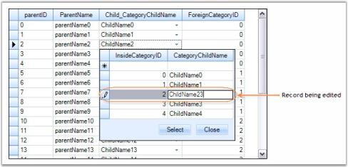' | markdownify }}
{:.image }

Related Master Details Relation

RelatedMasterDetails is a Master-Details relation where matching keys in columns in the parent and child tables define a relationship between two tables. This a 1:n relation where each record in the child table can only belong to one parent record.

This section demonstrates how to manually specify master-detail relations between three independent tables that have primary key and foreign key column in common.

Steps to setup RelatedMasterDetails relation

1. Setup three datatables that have primary and foreign key columns in common.

[C#]

private int numberParentRows = 5;

private int numberChildRows = 20;

private int numberGrandChildRows = 50;

//Creates Parent Table.

private DataTable GetParentTable()

{

    DataTable dt = new DataTable("ParentTable");

    dt.Columns.Add(new DataColumn("parentID"));

    dt.Columns.Add(new DataColumn("ParentName"));

    dt.Columns.Add(new DataColumn("ParentDec"));

    for(int i = 0; i < numberParentRows; i++)

    {

        DataRow dr = dt.NewRow();

        dr[0] = i;

        dr[1] = string.Format("parentName{0}", i);

        dr[1] = string.Format("parentName{0}", i);

        dt.Rows.Add(dr);

    }

    return dt;

}

//Creates Child Table.

private DataTable GetChildTable()

{

    DataTable dt = new DataTable("ChildTable");

    dt.Columns.Add(new DataColumn("childID"));

    dt.Columns.Add(new DataColumn("Name"));

    dt.Columns.Add(new DataColumn("ParentID"));

    for(int i = 0; i < numberChildRows; i++)

    {

        DataRow dr = dt.NewRow();

        dr[0] = i.ToString();

        dr[1] = string.Format("ChildName{0}",i);

        dr[2] = (i % numberParentRows).ToString();

        dt.Rows.Add(dr);

    }

    return dt;

}

//Creates Grand Child Table.

private DataTable GetGrandChildTable()

{

    DataTable dt = new DataTable("GrandChildTable");

    dt.Columns.Add(new DataColumn("GrandChildID"));

    dt.Columns.Add(new DataColumn("Name"));

    dt.Columns.Add(new DataColumn("ChildID"));

    for(int i = 0; i < numberGrandChildRows; i++)

    {

        DataRow dr = dt.NewRow();

        dr[0] = i.ToString();

        dr[1] = string.Format("GrandChildName{0}",i);

        dr[2] = (i % numberChildRows).ToString();

        dt.Rows.Add(dr);

    }

    return dt;

}

[VB.NET]

Private numberParentRows As Integer = 5

Private numberChildRows As Integer = 20

Private numberGrandChildRows As Integer = 50

'Creates Parent Table.

Private Function GetParentTable() As DataTable

Dim dt As New DataTable("ParentTable")

dt.Columns.Add(New DataColumn("parentID"))

dt.Columns.Add(New DataColumn("ParentName"))

dt.Columns.Add(New DataColumn("ParentDec"))

Dim i As Integer

For i = 0 To numberParentRows - 1

Dim dr As DataRow = dt.NewRow()

dr(0) = i

dr(1) = String.Format("parentName{0}", i)

dr(1) = String.Format("parentName{0}", i)

dt.Rows.Add(dr)

Next i

Return dt

End Function

'Creates Child Table.

Private Function GetChildTable() As DataTable

Dim dt As New DataTable("ChildTable")

dt.Columns.Add(New DataColumn("childID"))

dt.Columns.Add(New DataColumn("Name"))

dt.Columns.Add(New DataColumn("ParentID"))

Dim i As Integer

For i = 0 To numberChildRows - 1

Dim dr As DataRow = dt.NewRow()

dr(0) = i.ToString()

dr(1) = String.Format("ChildName{0}", i)

dr(2) = (i Mod numberParentRows).ToString()

dt.Rows.Add(dr)

Next i

Return dt

End Function

'Creates Grand Child Table.

Private Function GetGrandChildTable() As DataTable

Dim dt As New DataTable("GrandChildTable")

dt.Columns.Add(New DataColumn("GrandChildID"))

dt.Columns.Add(New DataColumn("Name"))

dt.Columns.Add(New DataColumn("ChildID"))

Dim i As Integer

For i = 0 To numberGrandChildRows - 1

Dim dr As DataRow = dt.NewRow()

dr(0) = i.ToString()

dr(1) = String.Format("GrandChildName{0}", i)

dr(2) = (i Mod numberChildRows).ToString()

dt.Rows.Add(dr)

Next i

Return dt

End Function

2. Manually set up relationships between tables and add relation to the parent and child tables.

[C#]

GridRelationDescriptor parentToChildRelationDescriptor = new GridRelationDescriptor();

//Same as SourceListSetEntry.Name for Child Table.

parentToChildRelationDescriptor.ChildTableName = "MyChildTable";

parentToChildRelationDescriptor.RelationKind = RelationKind.RelatedMasterDetails;

parentToChildRelationDescriptor.RelationKeys.Add("parentID", "ParentID");

//Adds relation to Parent Table.

gridGroupingControl1.TableDescriptor.Relations.Add(parentToChildRelationDescriptor);

GridRelationDescriptor childToGrandChildRelationDescriptor = new GridRelationDescriptor();

//Same as SourceListSetEntry.Name for Grand Child Table.

childToGrandChildRelationDescriptor.ChildTableName = "MyGrandChildTable";

childToGrandChildRelationDescriptor.RelationKind = RelationKind.RelatedMasterDetails;

childToGrandChildRelationDescriptor.RelationKeys.Add("childID", "ChildID");

//Adds relation to Child Table.

parentToChildRelationDescriptor.ChildTableDescriptor.Relations.Add(childToGrandChildRelationDescriptor);

[VB.NET]

Dim parentToChildRelationDescriptor As New GridRelationDescriptor()

'Same as SourceListSetEntry.Name for Child Table.

parentToChildRelationDescriptor.ChildTableName = "MyChildTable"

parentToChildRelationDescriptor.RelationKind = RelationKind.RelatedMasterDetails

parentToChildRelationDescriptor.RelationKeys.Add("parentID", "ParentID")

'Adds relation to Parent Table.

gridGroupingControl1.TableDescriptor.Relations.Add(parentToChildRelationDescriptor)

Dim childToGrandChildRelationDescriptor As New GridRelationDescriptor()

'Same as SourceListSetEntry.Name for Grand Child Table.

childToGrandChildRelationDescriptor.ChildTableName = "MyGrandChildTable"

childToGrandChildRelationDescriptor.RelationKind = RelationKind.RelatedMasterDetails

childToGrandChildRelationDescriptor.RelationKeys.Add("childID", "ChildID")

'Adds relation to Child Table.

parentToChildRelationDescriptor.ChildTableDescriptor.Relations.Add(childToGrandChildRelationDescriptor)

3. Register the datatables with Engine.SourceListSet so that RelationDescriptor can resolve the name.

<table>
<tr>
<td>
[C#]this.gridGroupingControl1.Engine.SourceListSet.Add("MyParentTable", parentTable);this.gridGroupingControl1.Engine.SourceListSet.Add("MyChildTable", childTable);this.gridGroupingControl1.Engine.SourceListSet.Add("MyGrandChildTable", grandChildTable);</td></tr>
<tr>
<td>
[VB.NET]Me.gridGroupingControl1.Engine.SourceListSet.Add("MyParentTable", parentTable)Me.gridGroupingControl1.Engine.SourceListSet.Add("MyChildTable", ChildTable)Me.gridGroupingControl1.Engine.SourceListSet.Add("MyGrandChildTable", grandChildTable)</td></tr>
</table>
4. Finally, bind hierarchical data source, which has been created through the above steps to a grouping grid by assigning parent table to the datasource.

[C#]

this.gridGroupingControl1.DataSource = parentTable;

[VB.NET]

Me.gridGroupingControl1.DataSource = parentTable

5. When you run the sample, you could find the tables connected with Master-Details relation.

{{ '' | markdownify }}
{:.image }

> {{ '' | markdownify }}
{:.image }
_Note: For more details, refer to the following browser sample:_

> _<Install Location>\Syncfusion\EssentialStudio\[Version Number]\Windows\Windows\Grid.Grouping.Windows\Samples\Relation And Hierarchy\Related Master Details Demo_

Foreign Key Reference Relation

ForeignKeyReference is a foreign-key relation for looking up values where an id column in the main table can be used to look up a record in a related table. This is an n:1 relation where multiple records in the parent table can reference the same record in the related table. Fields in the related table can be referenced using a '.' dot in the FieldDescriptor.MappingName of the main table.

Steps to setup ForeignKeyReference relation

This section sets up a foreignkeyreference relation between data table and the collection USStates. Data table represents Parent Table of the relation and USStates collection serves as the related child list wherein the values can be looked up using a key. The collection derives from ArrayList in which every item is an USState object having two properties named Key and Name. It also defines a method named CreateDefaultCollection() that returns an instance of itself populated with a set of values.

A foreignkeyreference relation can be set up between the lists by defining a relation descriptor with its attributes carrying the relation details and adding this descriptor to the Relations collection of the main table.

The following steps demonstrate this process.

1. Create a collection named USStates in which each entry stores USState object.

[C#]

//US States Collection.

[Serializable]

public class USStatesCollection : ArrayList

{

    public new USState this[int index]

    {

        get

        {

            return (USState) base[index];

        }

        set

        {

            base[index] = value;

        }

    }

    public static USStatesCollection CreateDefaultCollection()

    {

        USStatesCollection states = new USStatesCollection();

        states.Add(new USState("AL", "Alabama"));

        states.Add(new USState("AK", "Alaska"));

        states.Add(new USState("CA", "California"));

        states.Add(new USState("FL", "Florida"));

        states.Add(new USState("GA", "Georgia"));

        states.Add(new USState("IN", "Indiana"));

        states.Add(new USState("MS", "Mississippi"));

        states.Add(new USState("NJ", "New Jersey"));

        states.Add(new USState("NM", "New Mexico"));

        states.Add(new USState("NY", "New York"));

        states.Add(new USState("TX", "Texas"));

        states.Add(new USState("WA", "Washington"));

        states.Add(new USState("PE", "Prince Edward Island"));

        states.Add(new USState("YT", "Yukon Territories"));

        return states;

    }

    public override bool IsReadOnly

    {

        get

        {

            return true;

        }

    }

    public override bool IsFixedSize

    {

        get

        {

            return true;

        }

    }

}

//US State Class.

[Serializable]

public class USState

{

    private string _code;

    private string _name;

    public  USState()

    {

    }

    public  USState(string key, string name)

    {

        this._code = key;

        this._name = name;

    }

    [Browsable(true)]

    public string Key

    {

        get

        {

            return _code;

        }

        set

        {

            _code = value;

        }

    }

    [Browsable(true)]

    public string Name

    {

          get

        {

            return _name ;

        }

        set

        {

            _name = value;

        }

    }

    public override string ToString()

    {

        return this._name + "(" + this._code + ")";

    }

}

[VB.NET]

'US States Collection.

<Serializable()>  _

Public Class USStatesCollection

Inherits ArrayList

Default Public Shadows Property Item(index As Integer) As USState

Get

Return CType(MyBase.Item(index), USState)

End Get

Set

MyBase.Item(index) = Value

End Set

End Property        

Public Shared Function CreateDefaultCollection() As USStatesCollection

      Dim states As New USStatesCollection()

      states.Add(New USState("AL", "Alabama"))

      states.Add(New USState("AK", "Alaska"))

      states.Add(New USState("CA", "California"))

      states.Add(New USState("FL", "Florida"))

      states.Add(New USState("GA", "Georgia"))

      states.Add(New USState("IN", "Indiana"))

      states.Add(New USState("MS", "Mississippi"))

      states.Add(New USState("NJ", "New Jersey"))

      states.Add(New USState("NM", "New Mexico"))

      states.Add(New USState("NY", "New York"))

      states.Add(New USState("TX", "Texas"))

      states.Add(New USState("WA", "Washington"))

      states.Add(New USState("PE", "Prince Edward Island"))

      states.Add(New USState("YT", "Yukon Territories"))

      Return states

End Function

Public Overrides ReadOnly Property IsReadOnly() As Boolean

Get

Return True

End Get

End Property

Public Overrides ReadOnly Property IsFixedSize() As Boolean

Get

Return True

End Get

End Property

End Class

'US State Class.

<Serializable()>  _

Public Class USState

Private _code As String

Private _name As String

Public Sub New()

End Sub

Public Sub New(key As String, name As String)

Me._code = key

Me._name = name

End Sub

<Browsable(True)>  _

Public Property Key() As String

Get

Return _code

End Get

Set

_code = value

End Set

End Property

<Browsable(True)>  _

Public Property Name() As String

Get

Return _name

End Get

Set

_name = value

End Set

End Property

Public Overrides Function ToString() As String

Return Me._name + "(" + Me._code + ")"

End Function

End Class

2. Create an object of USStates and add this object into the SourceListSet with a lookup name.

[C#]

USStatesCollection usStates = USStatesCollection.CreateDefaultCollection();

this.gridGroupingControl1.Engine.SourceListSet.Add("USStates", usStates);

[VB.NET]

Dim usStates As USStatesCollection = USStatesCollection.CreateDefaultCollection()

Me.gridGroupingControl1.Engine.SourceListSet.Add("USStates", usStates)

3. Creates a datatable with the Key from USState as one of the columns.

[C#]

DataTable table = new DataTable();

table.Columns.Add("Id", typeof(string));

table.Columns.Add("State", typeof(string));

//Adds rows.

for (int i = 0; i < 25; i++)

{

    table.Rows.Add(table.NewRow());

    table.Rows[i][0] = i;

    table.Rows[i][1] = usStates[i % 8].Key;

}

[VB.NET]

Dim table As New DataTable()

table.Columns.Add("Id", GetType(String))

table.Columns.Add("State", GetType(String))

'Adds rows.

Dim i As Integer

For i = 0 To 24

table.Rows.Add(table.NewRow())

table.Rows(i)(0) = i

table.Rows(i)(1) = usStates((i Mod 8)).Key

Next i

4. Establish ForeignKeyReference relationship.

[C#]

GridTableDescriptor mainTd = this.gridGroupingControl1.TableDescriptor;

GridRelationDescriptor usStatesRd = new GridRelationDescriptor();

usStatesRd.Name = "State";

usStatesRd.RelationKind = RelationKind.ForeignKeyReference;

//SourceListSet name for look up.

usStatesRd.ChildTableName = "USStates";  

usStatesRd.RelationKeys.Add("State", "Key");

//Formats ChildList.

usStatesRd.ChildTableDescriptor.Appearance.AlternateRecordFieldCell.BackColor = Color.FromArgb(255, 245, 227);

//Hides the Key column.

usStatesRd.ChildTableDescriptor.VisibleColumns.Add("Name");

usStatesRd.ChildTableDescriptor.SortedColumns.Add("Name");

usStatesRd.ChildTableDescriptor.AllowEdit = false;

//Disallows users to modify states.

usStatesRd.ChildTableDescriptor.AllowNew = false;

mainTd.Relations.Add(usStatesRd);

//Assigns data source.

this.gridGroupingControl1.DataSource = table;

mainTd.Name = "ForeignKeyReference";

[VB.NET]

Dim mainTd As GridTableDescriptor = Me.gridGroupingControl1.TableDescriptor

Dim usStatesRd As New GridRelationDescriptor()

usStatesRd.Name = "State"

usStatesRd.RelationKind = RelationKind.ForeignKeyReference

'SourceListSet name for look up.

usStatesRd.ChildTableName = "USStates"

usStatesRd.RelationKeys.Add("State", "Key")

'Formats ChildList.

usStatesRd.ChildTableDescriptor.Appearance.AlternateRecordFieldCell.BackColor = Color.FromArgb(255, 245, 227)

'Hides Key Column.

usStatesRd.ChildTableDescriptor.VisibleColumns.Add("Name")

usStatesRd.ChildTableDescriptor.SortedColumns.Add("Name")

usStatesRd.ChildTableDescriptor.AllowEdit = False

'Disallows users to modify states.

usStatesRd.ChildTableDescriptor.AllowNew = False

mainTd.Relations.Add(usStatesRd)

'Assigns data source.

Me.gridGroupingControl1.DataSource = table

mainTd.Name = "ForeignKeyReference"

5. Here is a sample output that displays a look up child list for data column State with value Georgia.

{{ '' | markdownify }}
{:.image }

> {{ '' | markdownify }}
{:.image }
_Note: For more details, refer to the following browser sample:_

> _<Install Location>\Syncfusion\EssentialStudio\[Version Number]\Windows\Grid.Grouping.Windows\Samples\Relation And Hierarchy\Foreign-Key Reference Demo_

GridForeignKeyHelper

GridForeignKeyHelper is a helper class that makes it easy for the users to use foreign key relations to do foreign key look ups. With this class available, users can easily hook up a foreign table by a single method call instead of going through all the steps described above.

The GridForeignKeyHelper class exposes a static method called SetupForeignTableLookUp that accepts grouping grid, main table, foreign table, main table column, foreign table value column and foreign table display column and sets up the Foreign Key relation using these parameter values.

[C#]

string valueColInMainTable = "Country", valueColInForeignTable = "CountryCode", displayColInForeignTable = "CountryName";

GridForeignKeyHelper.SetupForeignTableLookUp(gridGroupingControl1, valueColInMainTable, countries, valueColInForeignTable, displayColInForeignTable);

[VB.NET]

Dim valueColInMainTable As String = "Country", valueColInForeignTable As String = "CountryCode",

displayColInForeignTable As String = "CountryName"

GridForeignKeyHelper.SetupForeignTableLookUp(gridGroupingControl1, valueColInMainTable, countries, valueColInForeignTable, displayColInForeignTable)

Foreign Key KeyWords Relation

ForeignKeyKeyWords is a unique relation kind offered by the grouping engine. It is a foreign key relation where matching keys in the columns of the parent and child table define a relationship between two tables. This is an m:n relation. Field summaries of the related child table can be referenced using a ‘.’ dot in the FieldDescriptor.MappingName of the main table. This relation kind allows you to have multi-valued columns in the grid.

Example

Say you have a Customers table where each customer can have a list of purchased items. With MasterDetails, for a given customer the underlying child list (the list of items purchased by that customer) will be displayed in a separate table once the RecordPlusMinus button is clicked. Instead if you want to view the entire record along with the related child records in a single row, then ForeignKeyKeyWords would be the right choice to use.

The following example illustrates creation of ForeignKeyKeyWords relation.

1. Create two data tables, Customers and Items, and add a list of records into them.

[C#]

private int numberParentRows = 6;

private int numberChildRows = 20;

private DataTable GetParentTable()

{

    DataTable dt = new DataTable("Customers");

    dt.Columns.Add(new DataColumn("customerID"));

    dt.Columns.Add(new DataColumn("CustomerName"));

    dt.Columns.Add(new DataColumn("Address"));

    for(int i = 0; i < numberParentRows; ++i)

    {

        DataRow dr = dt.NewRow();

        dr[0] = i;

        dr[1] = string.Format("CustomerName{0}", i);

        dr[2] = string.Format("Address{0}", i);

        dt.Rows.Add(dr);

    }

    return dt;

}

private DataTable GetChildTable()

{

    DataTable dt = new DataTable("Items");

    dt.Columns.Add(new DataColumn("ItemID")); 

    dt.Columns.Add(new DataColumn("ItemName"));

    dt.Columns.Add(new DataColumn("CustomerID"));

    dt.Columns.Add(new DataColumn("Price")); 

    Random rand = new Random();

    for(int i = 0; i < numberChildRows; ++i)

    {

        DataRow dr = dt.NewRow();

        dr[0] = i.ToString();

        dr[1] = string.Format("ItemName{0}",i);

        dr[2] = (i % numberParentRows).ToString();

        dr[3] = rand.Next(500).ToString();

        dt.Rows.Add(dr);

    }

    return dt;

}

[VB.NET]

Private numberParentRows As Integer = 6

Private numberChildRows As Integer = 20

Private Function GetParentTable() As DataTable

Dim dt As DataTable = New DataTable("Customers")

dt.Columns.Add(New DataColumn("customerID"))

dt.Columns.Add(New DataColumn("CustomerName"))

dt.Columns.Add(New DataColumn("Address"))

Dim i As Integer = 0

Do While i < numberParentRows

Dim dr As DataRow = dt.NewRow()

dr(0) = i

dr(1) = String.Format("CustomerName{0}", i)

dr(2) = String.Format("Address{0}", i)

dt.Rows.Add(dr)

i += 1

Loop

Return dt

End Function

Private Function GetChildTable() As DataTable

Dim dt As DataTable = New DataTable("Items")

dt.Columns.Add(New DataColumn("ItemID"))

dt.Columns.Add(New DataColumn("ItemName"))

dt.Columns.Add(New DataColumn("CustomerID"))

dt.Columns.Add(New DataColumn("Price"))

Dim rand As Random = New Random()

Dim i As Integer = 0

Do While i < numberChildRows

Dim dr As DataRow = dt.NewRow()

dr(0) = i.ToString()

dr(1) = String.Format("ItemName{0}", i)

dr(2) = (i Mod numberParentRows).ToString()

dr(3) = rand.Next(500).ToString()

dt.Rows.Add(dr)

i += 1

Loop

Return dt

End Function

2. Register the child table (Items) into the SourceListSet of the grouping engine.

[C#]

DataTable parentTable = GetParentTable();

DataTable childTable = GetChildTable();

this.gridGroupingControl1.Engine.SourceListSet.Add("Items", childTable);

[VB.NET]

Dim parentTable As DataTable = GetParentTable()

Dim childTable As DataTable = GetChildTable()

Me.gridGroupingControl1.Engine.SourceListSet.Add("Items", childTable)

3. Assign the datasource to the grid.

[C#]

this.gridGroupingControl1.DataSource = parentTable;

[VB.NET]

Me.gridGroupingControl1.DataSource = parentTable

4. Establish ForeignKeyKeyWords relationship between the tables.

[C#]

GridRelationDescriptor childRelation = new GridRelationDescriptor();

childRelation.RelationKind = RelationKind.ForeignKeyKeyWords;

//SourceListSet name for look up.

childRelation.ChildTableName = "Items"; 

childRelation.RelationKeys.Add("customerID", "CustomerID");

childRelation.ChildTableDescriptor.AllowEdit = true;

childRelation.ChildTableDescriptor.AllowNew = true;

this.gridGroupingControl1.TableDescriptor.Relations.Add(childRelation);

[VB.NET]

Dim childRelation As GridRelationDescriptor = New GridRelationDescriptor()

childRelation.RelationKind = RelationKind.ForeignKeyKeyWords

'SourceListSet name for look up.

childRelation.ChildTableName = "Items"

childRelation.RelationKeys.Add("customerID", "CustomerID")

childRelation.ChildTableDescriptor.AllowEdit = True;

childRelation.ChildTableDescriptor.AllowNew = True;

Me.gridGroupingControl1.TableDescriptor.Relations.Add(childRelation)

5. Here is a sample output.

{{ '' | markdownify }}
{:.image }

> {{ '' | markdownify }}
{:.image }
_Note: For more details, refer to the following browser sample:_

> _<Install Location>\Syncfusion\EssentialStudio\[Version Number]\Windows\Grid.Grouping.Windows\Samples\Relation And Hierarchy\Employee Territory Order Demo\_

ListItem Reference Relation

ListItemReference is an object reference relation for looking up values from a strong typed collection. Like ForeignKeyReference, it is also an n:1 relation where multiple records in the parent table can reference the same record in the related table. One difference between the ForeignKeyReference and ListItemReference is that the former uses a key to look up the values whereas the latter uses an object to look up the values in a nested collection.

Steps to setup ListItemReference relation

This section sets up ListItemReference relation between data table and the collection Countries. The data table represents the Parent Table of the relation and the Countries collection serves as the related child list wherein the values can be looked up using an object of the child list. The collection derives from ArrayList in which every item is a Country object having two properties, CountryCode and Name. It also defines a method named CreateDefaultCollection() that returns an instance of itself populated with a set of values.

This relation kind can be set up by defining a relation descriptor with its attributes carrying the relation details and adding this descriptor to the Relations collection of the main table.

The following steps demonstrate this process.

1. Create a collection named Countries in which each entry stores a Country object.

[C#]

//Countries Collection.

[Serializable]

public class CountriesCollection : ArrayList

{

    public new Country this[int index]

    {

        get

        {

            return (Country) base[index];

        }

        set

        {

            base[index] = value;

        }

    }

    public static CountriesCollection CreateDefaultCollection()

    {

        CountriesCollection countries = new CountriesCollection();

        countries.Add(new Country("US", "United States"));

        countries.Add(new Country("CA", "Canada"));

        countries.Add(new Country("AU", "Australia"));

        countries.Add(new Country("BR", "Brazil"));

        countries.Add(new Country("IO", "British Indian Ocean Territory"));

        countries.Add(new Country("CN", "China"));

        countries.Add(new Country("FI", "Finland"));

        countries.Add(new Country("FR", "France"));

        countries.Add(new Country("DE", "Germany"));

        countries.Add(new Country("HK", "Hong Kong"));

        countries.Add(new Country("HU", "Hungary"));

        countries.Add(new Country("IS", "Iceland"));

        countries.Add(new Country("IN", "India"));

        countries.Add(new Country("JP", "Japan"));

        countries.Add(new Country("MY", "Malaysia"));

        countries.Add(new Country("SG", "Singapore"));

        countries.Add(new Country("CH", "Switzerland"));

        return countries;

    }

    public override bool IsReadOnly

    {

        get

        {

            return true;

        }

    }

    public override bool IsFixedSize

    {

        get

        {

            return true;

        }

    }

}

//Country Class.

[Serializable]

public class Country

{

    private string _code;

    private string _name;

    public  Country()

    {

    }

    public  Country(string strCode, string strName)

    {

        this._code = strCode;

        this._name = strName;

    }

    [Browsable(true)]

    public string CountryCode

    {

        get

        {

            return _code;

        }

        set

        {

            _code = value;

        }

    }

    [Browsable(true)]

    public string Name

    {

        get

        {

            return _name ;

        }

        set

        {

            _name = value;

        }

    }

    public override string ToString()

    {

        return this._name + "(" + this._code + ")";

    }

}

[VB.NET]

'Countries Collection

<Serializable()>  _

Public Class CountriesCollection

Inherits ArrayList

Default Public Shadows Property Item(index As Integer) As Country

Get

Return CType(MyBase.Item(index), Country)

End Get

Set

MyBase.Item(index) = Value

End Set

End Property        

Public Shared Function CreateDefaultCollection() As CountriesCollection

      Dim countries As New CountriesCollection()

      countries.Add(New Country("US", "United States"))

      countries.Add(New Country("CA", "Canada"))

      countries.Add(New Country("AU", "Australia"))

      countries.Add(New Country("BR", "Brazil"))

      countries.Add(New Country("IO", "British Indian Ocean Territory"))

      countries.Add(New Country("CN", "China"))

      countries.Add(New Country("FI", "Finland"))

      countries.Add(New Country("FR", "France"))

      countries.Add(New Country("DE", "Germany"))

      countries.Add(New Country("HK", "Hong Kong"))

      countries.Add(New Country("HU", "Hungary"))

      countries.Add(New Country("IS", "Iceland"))

      countries.Add(New Country("IN", "India"))

      countries.Add(New Country("JP", "Japan"))

      countries.Add(New Country("MY", "Malaysia"))

      countries.Add(New Country("SG", "Singapore"))

      countries.Add(New Country("CH", "Switzerland"))

      Return countries

End Function

Public Overrides ReadOnly Property IsReadOnly() As Boolean

Get

Return True

End Get

End Property

Public Overrides ReadOnly Property IsFixedSize() As Boolean

Get

Return True

End Get

End Property

End Class

'Country Class.

<Serializable()>  _

Public Class Country

Private _code As String

Private _name As String

Public Sub New()

End Sub

Public Sub New(strCode As String, strName As String)

Me._code = strCode

Me._name = strName

End Sub    

<Browsable(True)>  _

Public Property CountryCode() As String

Get

Return _code

End Get

Set

_code = value

End Set

End Property

<Browsable(True)>  _

Public Property Name() As String

Get

Return _name

End Get

Set

_name = value

End Set

End Property

Public Overrides Function ToString() As String

Return Me._name + "(" + Me._code + ")"

End Function

End Class

6. 2. Create an object of USStates and add this object into the SourceListSet with a lookup name.

[C#]

CountriesCollection countries = CountriesCollection.CreateDefaultCollection();

this.gridGroupingControl1.Engine.SourceListSet.Add("Countries", countries);

[VB.NET]

Dim countries As CountriesCollection = CountriesCollection.CreateDefaultCollection()

Me.gridGroupingControl1.Engine.SourceListSet.Add("Countries", countries)

3. Create a datatable with one of the columns type as Country.

[C#]

DataTable table = new DataTable();

table.Columns.Add("Id", typeof(string));

table.Columns.Add("Country", typeof(Country));

//Adds Rows.

for (int i = 0; i < 25; i++)

{

    table.Rows.Add(table.NewRow());

    table.Rows[i][0] = i;

    table.Rows[i][1] = countries[i % 8];

}

[VB.NET]

Dim table As New DataTable()

table.Columns.Add("Id", GetType(String))

table.Columns.Add("Country", GetType(Country))

'Adds Rows.

Dim i As Integer

For i = 0 To 24

table.Rows.Add(table.NewRow())

table.Rows(i)(0) = i

table.Rows(i)(1) = countries((i Mod 8))

Next i

4. Establish the ForeignKeyReference relationship.

[C#]

GridTableDescriptor mainTd = this.gridGroupingControl1.TableDescriptor;

GridRelationDescriptor countriesRd = new GridRelationDescriptor();

countriesRd.Name = "Country";

countriesRd.MappingName = "Country";

countriesRd.RelationKind = RelationKind.ListItemReference;

//SourceListSet name for look up.

countriesRd.ChildTableName = "Countries";  

//Formats ChildList.

countriesRd.ChildTableDescriptor.Appearance.AlternateRecordFieldCell.BackColor = Color.FromArgb(255, 245, 227);

//Hides Key column.

countriesRd.ChildTableDescriptor.VisibleColumns.Add("Name");

countriesRd.ChildTableDescriptor.SortedColumns.Add("Name");

countriesRd.ChildTableDescriptor.AllowEdit = true;

//Disallows users to modify states.

countriesRd.ChildTableDescriptor.AllowNew = true;

mainTd.Relations.Add(countriesRd);

//Assigns data source.

this.gridGroupingControl1.DataSource = table;

mainTd.Name = "ListItemReference";

[VB.NET]

Dim mainTd As GridTableDescriptor = Me.gridGroupingControl1.TableDescriptor

Dim countriesRd As New GridRelationDescriptor()

countriesRd.Name = "Country"

countriesRd.MappingName = "Country"

countriesRd.RelationKind = RelationKind.ListItemReference

'SourceListSet name for look up.

countriesRd.ChildTableName = "Countries" 

'Formats ChildList.

countriesRd.ChildTableDescriptor.Appearance.AlternateRecordFieldCell.BackColor = Color.FromArgb(255, 245, 227)

' Hides Key Column.

countriesRd.ChildTableDescriptor.VisibleColumns.Add("Name")

countriesRd.ChildTableDescriptor.SortedColumns.Add("Name")

countriesRd.ChildTableDescriptor.AllowEdit = True

'Disallows users to modify states.

countriesRd.ChildTableDescriptor.AllowNew = True

mainTd.Relations.Add(countriesRd)

'Assigns data source.

Me.gridGroupingControl1.DataSource = Table

mainTd.Name = “ListItemReference”

5. Here is a sample output that displays a look up child list for the data column Country with value Brazil.

{{ '' | markdownify }}
{:.image }

> {{ '' | markdownify }}
{:.image }
_Note: For more details, refer the following browser sample:_

> _<Install Location>\Syncfusion\EssentialStudio\[Version Number]\Windows\Grid.Grouping.Windows\Samples\Relation And Hierarchy\List Item Reference Demo_

Uniform Child List Relation

UniformChildList relation can be used to map nested strong typed collection inside a parent collection. If a public property is an object, then it will be displayed in a Nested Table. The collection in the below example consists of two kinds of objects, ParentObj and ChildObj, where every ParentObj is associated with a collection of ChildObjs and is represented by the public property named 'Child'. Hence, a nested table is always created to display associated children for a given parent.

Example

1. Create a class(ChildObj) whose instances form the child table records.

[C#]

public class ChildObj : INotifyPropertyChanged

{

    private string f1, f2;

    private int f3;

    public ChildObj(string f1, string f2, int f3) {

        this.f1 = f1;

        this.f2 = f2;

        this.f3 = f3;

    }

    public string Field1

    {

        get { return f1; }

        set

        {

            if (f1 != value)

            {

                f1 = value;

                RaisePropertyChanged("Field1");

            }

        }

    }

    public string Field2

    {

        get { return f2; }

        set

        {

            if (f2 != value)

            {

                f2 = value;

                RaisePropertyChanged("Field2");

            }

        }

    }

    public int Field3

    {

        get { return f3; }

        set

        {

            if (f3 != value)

            {

                f3 = value;

                RaisePropertyChanged("Field3");

            }

        }

    }

    void RaisePropertyChanged(string name)

    {

        if (PropertyChanged != null)

            PropertyChanged(this, new PropertyChangedEventArgs(name));

    }

    public event PropertyChangedEventHandler PropertyChanged;

}

[VB.NET]

Public Class ChildObj : Implements INotifyPropertyChanged

    Private f1, f2 As String

    Private f3 As Integer

    Public Sub New(ByVal f1 As String, ByVal f2 As String, ByVal f3 As Integer)

        Me.f1 = f1

        Me.f2 = f2

        Me.f3 = f3

    End Sub

    Public Property Field1() As String

        Get

            Return f1

        End Get

        Set(ByVal value As String)

            If f1 <> value Then

                f1 = value

                RaisePropertyChanged("Field1")

            End If

        End Set

    End Property

    Public Property Field2() As String

        Get

            Return f2

        End Get

        Set(ByVal value As String)

            If f2 <> value Then

                f2 = value

                RaisePropertyChanged("Field2")

            End If

        End Set

    End Property

    Public Property Field3() As Integer

        Get

            Return f3

        End Get

        Set(ByVal value As Integer)

            If f3 <> value Then

                f3 = value

                RaisePropertyChanged("Field3")

            End If

        End Set

    End Property

    Sub RaisePropertyChanged(ByVal name As String)

        RaiseEvent PropertyChanged(Me, New PropertyChangedEventArgs(name))

    End Sub

    Public Event PropertyChanged As PropertyChangedEventHandler Implements INotifyPropertyChanged.PropertyChanged

End Class

2. Create another class(ParentObj) that contains a reference to the above class (ChildObj). The instances of this class make the parent records. Both the classes implement INotifyPropertyChanged interface in order to get notified of any property changes.

[C#]

public class ParentObj : INotifyPropertyChanged

{

    private string f1, f2;

    private int f3;

    private BindingList<ChildObj> childObj = new BindingList<ChildObj>();

    public ParentObj(string f1, string f2, int f3, params ChildObj[] c)

    {

        this.f1 = f1;

        this.f2 = f2;

        this.f3 = f3;

        foreach(ChildObj i in c)

            childObj.Add(i);

    }

    public string Field1

    {

        get { return f1; }

        set

        {

            if (f1 != value) 

            { 

                f1 = value; 

                RaisePropertyChanged("Field1"); 

            }

        }

    }

    public string Field2

    {

        get { return f2; }

        set

        {

            if (f2 != value)

            {

                f2 = value;

                RaisePropertyChanged("Field2");

            }

        }

    }

    public int Field3 {

        get { return f3; }

        set

        {

            if (f3 != value)

            {

                f3 = value;

                RaisePropertyChanged("Field3");

            }

        }

    }

    public BindingList<ChildObj> Child {

        get { return childObj;  }

    }

    void RaisePropertyChanged(string name)

    {

        if (PropertyChanged != null)

            PropertyChanged(this, new PropertyChangedEventArgs(name));

    }

    public event PropertyChangedEventHandler PropertyChanged;

}

[VB.NET]

Public Class ParentObj : Implements INotifyPropertyChanged

    Private f1, f2 As String

    Private f3 As Integer

    Private childObj As BindingList(Of ChildObj) = New BindingList(Of ChildObj)()

    Public Sub New(ByVal f1 As String, ByVal f2 As String, ByVal f3 As Integer, ByVal ParamArray c As ChildObj())

        Me.f1 = f1

        Me.f2 = f2

        Me.f3 = f3

        For Each i As ChildObj In c

            childObj.Add(i)

        Next i

    End Sub

    Public Property Field1() As String

        Get

            Return f1

        End Get

        Set(ByVal value As String)

            If f1 <> value Then

                f1 = value

                RaisePropertyChanged("Field1")

            End If

        End Set

    End Property

    Public Property Field2() As String

        Get

            Return f2

        End Get

        Set(ByVal value As String)

            If f2 <> value Then

                f2 = value

                RaisePropertyChanged("Field2")

            End If

        End Set

    End Property

    Public Property Field3() As Integer

        Get

            Return f3

        End Get

        Set(ByVal value As Integer)

            If f3 <> value Then

                f3 = value

                RaisePropertyChanged("Field3")

            End If

        End Set

    End Property

    Public ReadOnly Property Child() As BindingList(Of ChildObj)

        Get

            Return childObj

        End Get

    End Property

    Sub RaisePropertyChanged(ByVal name As String)

        RaiseEvent PropertyChanged(Me, New PropertyChangedEventArgs(name))

    End Sub

    Public Event PropertyChanged As PropertyChangedEventHandler Implements INotifyPropertyChanged.PropertyChanged

End Class

3. Generate the collection using BindingList class, which implements ListChanged events in itself so that the grid can listen to those events when the list is changed. Add few items into the collection.

[C#]

BindingList<ParentObj> topList = new BindingList<ParentObj>();

BindingList<ChildObj> childList = new BindingList<ChildObj>();

Random r = new Random();

for (int i = 0; i < 30; i++)

childList.Add(new ChildObj(string.Format("Name{0}", r.Next(10)), string.Format("Desc{0}", r.Next(20)), r.Next(30)));

for (int i = 0; i < 5; i++)

{

topList.Add(new ParentObj(string.Format("Name{0}", r.Next(5)), string.Format("Desc{0}", r.Next(15)), r.Next(20)));

for (int j = i * 5; j < (i * 5) + 5; j++)

topList[i].Child.Add(childList[j]);

}

[VB.NET]

Private topList As BindingList(Of UniformChildList_2005.ParentObj) = New BindingList(Of UniformChildList_2005.ParentObj)()

Private childList As BindingList(Of UniformChildList_2005.ChildObj) = New BindingList(Of UniformChildList_2005.ChildObj)()

Private r As Random = New Random()

For i As Integer = 0 To 29

childList.Add(New UniformChildList_2005.ChildObj(String.Format("Name{0}", r.Next(10)), String.Format("Desc{0}", r.Next(20)), r.Next(30)))

Next i

For i As Integer = 0 To 4

topList.Add(New UniformChildList_2005.ParentObj(String.Format("Name{0}", r.Next(5)), String.Format("Desc{0}", r.Next(15)), r.Next(20)))

Dim j As Integer = i * 5

Do While j < (i * 5) + 5

topList(i).Child.Add(childList(j))

j += 1

Loop

Next i

4. Assign the above collection to the datasource of grouping grid.

[C#]

gridGroupingControl1.DataSource = topList;

[VB.NET]

GridGroupingControl1.DataSource = topList

5. Establish UniformChildList relation kind.

[C#]

GridRelationDescriptor relation = new GridRelationDescriptor();

relation.RelationKind = RelationKind.UniformChildList;

relation.MappingName = "Child";

relation.Name = "Child";

relation.ChildTableName = "ChildTable";

gridGroupingControl1.TableDescriptor.Relations.Add(relation);

this.gridGroupingControl1.ShowGroupDropArea = true;

GridTable chiltTable = gridGroupingControl1.GetTable("ChildTable");

this.gridGroupingControl1.AddGroupDropArea(chiltTable);

chiltTable.TableDescriptor.GroupedColumns.Add("Field1");

[VB.NET]

Dim relation As GridRelationDescriptor = New GridRelationDescriptor()

relation.RelationKind = RelationKind.UniformChildList

relation.MappingName = "Child"

relation.Name = "Child"

relation.ChildTableName = "ChildTable"

gridGroupingControl1.TableDescriptor.Relations.Add(relation)

Me.gridGroupingControl1.ShowGroupDropArea = True

Dim chiltTable As GridTable = gridGroupingControl1.GetTable("ChildTable")

Me.gridGroupingControl1.AddGroupDropArea(chiltTable)

chiltTable.TableDescriptor.GroupedColumns.Add("Field1")

6. Here is a sample output.

{{ '' | markdownify }}
{:.image }

> {{ '' | markdownify }}
{:.image }
_Note: For more details, refer to the following browser sample:_

> _<Install Location>\Syncfusion\EssentialStudio\[Version Number]\Windows\Grid.Grouping.Windows\Samples\Relation And Hierarchy\Uniform Child List Demo_

Working with Relations

This section discusses how to handle related tables in certain scenarios. It also describes the properties and events used for this purpose.

AutoPopulateRelations Property

It specifies if the relations should be automatically generated when you assign DataSource with a DataTable with constraints or a DataSet with relations defined. It is true by default.

[C#]

this.gridGroupingControl1.AutoPopulateRelations = false;

[VB.NET]

Me.gridGroupingControl1.AutoPopulateRelations = False

ShowRelationFields Property

When a foreign key relation (or related collection) is used, this property controls the display of dependent fields from a related table in the main table.

Possible Options

_Table 93: Relations_

<table>
<tr>
<td>
PROPERTIES</td><td>
DESCRIPTION</td></tr>
<tr>
<td>
ShowRelationFields</td><td>
Displays the dependent fields from a related table in the main table. It includes the following options.* Hide - Hides all the fields.* ShowAllRelatedFields - Shows all related fields including Primary and Foreign Keys.* ShowDisplayFieldsOnly - Shows only dependent fields; Hides Primary and Foreign Keys.</td></tr>
</table>

Default value is ShowDisplayFieldsOnly.

[C#]

this.gridGroupingControl1.ShowRelationFields = ShowRelationFields.ShowAllRelatedFields;

[VB.NET]

Me.gridGroupingControl1.ShowRelationFields = ShowRelationFields.ShowAllRelatedFields;

MaxNestedCollectionRecursionLevel Property

When nested collection is used, this property specifies the number of levels of recursion allowed when self-relations are detected. The settings below lets the grid to loop through up to four recursion levels.

[C#]

this.gridGroupingControl1.Engine.MaxNestedCollectionRecurseLevel = 4;

[VB.NET]

Me.gridGroupingControl1.Engine.MaxNestedCollectionRecurseLevel = 4

QueryShowRelationDisplayFields Event

It is raised for every foreign-key relation. At runtime, it allows you to control related fields of the child table to be added to the FieldDescriptorCollection. Inside this event, you can check for specific fields and set e.Cancel to true to avoid adding those fields.

[C#]

this.gridGroupingControl1.Engine.QueryShowRelationDisplayFields += new QueryShowRelationFieldsEventHandler(Engine_QueryShowRelationDisplayFields);

void Engine_QueryShowRelationDisplayFields(object sender, QueryShowRelationFieldsEventArgs e)

{

if (e.Relation.ChildTableName == "Countries")

{

e.ShowRelationFields = ShowRelationFields.Hide;

}

}

[VB.NET]

AddHandler gridGroupingControl1.Engine.QueryShowRelationDisplayFields, AddressOf Engine_QueryShowRelationDisplayFields

Private Sub Engine_QueryShowRelationDisplayFields(ByVal sender As Object, ByVal e As QueryShowRelationFieldsEventArgs)

If e.Relation.ChildTableName = "Countries" Then

e.ShowRelationFields = ShowRelationFields.Hide

End If

End Sub

QueryShowField Event

It gets fired for every field in the Field Descriptor Collection of individual tables in the dataset. It lets you control the population of field descriptors. Using this event, you can check for specific fields and cancel the population of desired fields at runtime.

[C#]

this.gridGroupingControl1.Engine.QueryShowField += new QueryShowFieldEventHandler(Engine_QueryShowField);

void Engine_QueryShowField(object sender, QueryShowFieldEventArgs e)

{

    if (e.Field.Name == "GrandChildID")

    e.Cancel = true;

}

[VB.NET]

AddHandler gridGroupingControl1.Engine.QueryShowField, AddressOf Engine_QueryShowField

Private Sub Engine_QueryShowField(ByVal sender As Object, ByVal e As QueryShowFieldEventArgs)

If e.Field.Name = "GrandChildID" Then

e.Cancel = True

End If

End Sub

QueryAddRelation Event

It is invoked for every relation that is being added to the RelationDescriptorCollection. By setting e.Cancel to true, you can avoid specific relations being added.

[C#]

this.gridGroupingControl1.Engine.QueryAddRelation += new QueryAddRelationEventHandler(Engine_QueryAddRelation);

void Engine_QueryAddRelation(object sender, QueryAddRelationEventArgs e)

{

    Console.WriteLine(e.Relation.Name);

}

[VB.NET]

AddHandler gridGroupingControl1.Engine.QueryAddRelation, AddressOf Engine_QueryAddRelation

Private Sub Engine_QueryAddRelation(ByVal sender As Object, ByVal e As QueryAddRelationEventArgs)

Console.WriteLine(e.Relation.Name)

End Sub

QueryShowNestedPropertiesFields Event

It is called when there exists nested properties in the bound datasource. With the help of this event, you can determine if the individual fields in the nested property should be displayed.

[C#]

this.gridGroupingControl1.Engine.QueryShowNestedPropertiesFields += new QueryShowNestedPropertiesFieldsEventHandler(Engine_QueryShowNestedPropertiesFields);

void Engine_QueryShowNestedPropertiesFields(object sender, QueryShowNestedPropertiesFieldsEventArgs e)

{

    if (e.PropertyDescriptor.PropertyType == typeof(BaseClass))

    e.Cancel = true;

}

[VB.NET]

AddHandler gridGroupingControl1.Engine.QueryShowNestedPropertiesFields, AddressOf Engine_QueryShowNestedPropertiesFields

Private Sub Engine_QueryShowNestedPropertiesFields(ByVal sender As Object, ByVal e As QueryShowNestedPropertiesFieldsEventArgs)

If e.PropertyDescriptor.PropertyType Is GetType(BaseClass) Then

e.Cancel = True

End If

End Sub

##### Paging Support in GridGrouping Control

Paging support has been provided in Windows Grid to improve the performance of GridGrouping control. This feature enables you to load data in an efficient way by storing and retrieving records in Pages. Each page consisting of not more than hundred records, thereby decreasing the load time. Previously all the records were displayed on a single page. Filters have also been customized to perform filtering only on the hundred items displayed anytime on the current page. 

Navigation through the retrieved records is accomplished by using Arrow buttons of the newly rendered Record Navigation control, displayed at the bottom of the page.

GridGrouping control also provides Paging support for various Data Source Items. This is achieved by using a Pager, which extracts a specific page from the bound data source and binds it to the GridGrouping control.

Certain restrictions may occur on Filtering while using Paging functionality. This is because a grid can control only the records in the page bound to it and not all the records in the data source. However, this restriction can be overcome by wiring the view to a temporary table.

The following code illustrates wiring the GridGrouping control to a Pager:

[C#]

var pager = new Pager {PageSize = 1000};

pager.Wire(gridGroupingControl1, dt); //dt is a DataTable object

[VB]

Dim pager = New Pager With {PageSize = 1000}

pager.Wire(gridGroupingControl1, dt) 'dt is a DataTable object

The following code illustrates Filtering along with Paging functionality in the GridGrouping control:

[C#]

gridGroupingControl1.TopLevelGroupOptions.ShowFilterBar = true;

foreach (var col in _gridGroupingControl2.TableDescriptor.Columns)

col.AllowFilter = true;

[VB]

gridGroupingControl1.TopLevelGroupOptions.ShowFilterBar = True

For Each col In _gridGroupingControl2.TableDescriptor.Columns

col.AllowFilter = True

Next col

{{ '' | markdownify }}
{:.image }

The following sample illustrates Paging support in the GridGrouping control for a data table populated with 100,000 records.

> {{ '' | markdownify }}
{:.image }
_Note: For more details, refer to the following sample link:_

[http://www.syncfusion.com/downloads/Support/DirectTrac/101296/Paging-1289568956.zip](http://www.syncfusion.com/downloads/Support/DirectTrac/101296/Paging-1289568956.zip)

###### Paging support with a different data source

Paging support has been provided in Grid control for Windows Forms to improve the performance of GridGroupingControl. This feature enables you to load data in an efficient way by storing and retrieving records in pages. Paging support is provided for different data sources. We have provided paging support with IEnumerable, Array List, Generic Collection, IBindingList, and DataTable.

The following code sample illustrates wiring GridGrouping control to a Pager:

[C#]

var pager = new Pager {PageSize = 1000};

pager.Wire(gridGroupingControl1); //Data sources assigned to the pager from gridGroupingControl

[VB]

Dim pager = New Pager With {PageSize = 1000}

pager.Wire(gridGroupingControl1) 'Data sources assigned to the pager from gridGroupingControl

##### Appearance

This property allows you to control the appearance of the grouping grid at design time as well as at run time. You can change the overall appearance of the grid and also the appearance of each element in the grid by setting this property. 

Appearance contains a list of GridStyleInfo properties as seen in the following graphic. GridStyleInfo object contains many properties such as BackColor, Font and CellType, which defines the look and behavior of a grid cell. Each of these properties identifies a particular set of cells that make up Grid Grouping control.

{{ '' | markdownify }}
{:.image }

To understand exactly what is going on here, let us consider three of these GridStyleInfo properties: AnyCell, AnyRecordFieldCell and AnyAlternateRecordFieldCell. Say we set AnyCell.BackColor = Color.LightBlue. This will color any grid cell light blue.

> {{ '' | markdownify }}
{:.image }
_Note: If you are using a Themed Operating system like Windows XP, turn the GridGroupingControl.ThemesEnabled property off so that the theme coloring does not affect things like header cell buttons. Otherwise, this will interfere with illustrating the concepts we are trying to communicate in this section._

Next, if we set AnyRecordFieldCell.BackColor = Color.Azure, we will see the color of any record field cell change to azure. If we then set AnyAlternateRecordFieldCell.BackColor = Color.LightGreen, we will see alternate records being displayed with a green background. Below is a picture illustrating the look of the grid after setting each property in order. 

There is an inheritance hierarchy that is associated with the Appearance properties. The general rule is that, if present, the more specific property takes precedence over the less specific property. This means thatAnyCell.BackColor is overridden by setting AnyRecordFieldCell.BackColor, which is again overridden by setting even more specific AnyAlternatingRecordFieldCell.BackColor. 

{{ '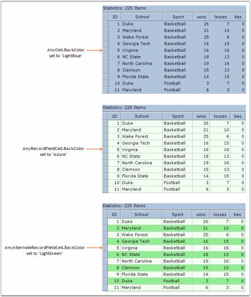' | markdownify }}
{:.image }

###### Appearance Options

The simplest way to check the exact cells affected by setting one of these properties is to use Preview and Edit verb to display Grid Grouping control and then set the property to view the effect. 

When using Preview tool at design-time, there is a cell tip that is displayed over each cell that gives information about that cell. In particular, the first line of the tip will give the exact Appearance property that this cell is based on. In addition, it will also list the Appearance properties that the cell inherits. Here is a graphic showing some cell tip samples.

{{ '' | markdownify }}
{:.image }

> 

> {{ '' | markdownify }}
{:.image }
_Note: When using Preview, make sure that you set ThemesEnabled to False, if you want to see the effect of setting the property on a header cell or a button type cell. If you do not, then the theme appearance will supersede the appearance properties you set here._ 

> _Some of the properties are not applicable unless the item they affect is used in the grid. For example, properties that affect nested tables or summaries will not change the appearance of a Grid Grouping control that does not have either of these items. In latter tutorials, you will be able to test such properties._

List of Appearance Properties

_Table 94: Appearance properties_

<table>
<tr>
<td>
APPEARANCE PROPERTIES</td><td>
DESCRIPTION</td></tr>
<tr>
<td>
AddNewRecordFieldCell</td><td>
Style information for any cell in a new record row.</td></tr>
<tr>
<td>
AddNewRecordRowHeaderCell</td><td>
Style information for header cell for any new record.</td></tr>
<tr>
<td>
AlternateRecordFieldCell</td><td>
Style information for any cell in alternate record rows.</td></tr>
<tr>
<td>
AlternateRecordRowHeaderCell</td><td>
Style information for any header cell in alternate record rows.</td></tr>
<tr>
<td>
AnyCell</td><td>
Style information for any cell in the Grid.</td></tr>
<tr>
<td>
AnyGroupCell</td><td>
Style information for any cell in a Group item.</td></tr>
<tr>
<td>
AnyHeaderCell</td><td>
Style information for any header cell.</td></tr>
<tr>
<td>
AnyIndentCell</td><td>
Style information for any indent cell.</td></tr>
<tr>
<td>
AnyNestedTableCell</td><td>
Style information for any nested table cell.</td></tr>
<tr>
<td>
AnyPreviewCell</td><td>
Style information for any preview cell.</td></tr>
<tr>
<td>
AnyRecordFieldCell</td><td>
Style information for any record cell.</td></tr>
<tr>
<td>
AnySummaryCell</td><td>
Style information for any summary cell.</td></tr>
<tr>
<td>
ColumnHeaderCell</td><td>
Style information for any column header cell.</td></tr>
<tr>
<td>
ColumnHeaderWithFilterCell</td><td>
Style information for any column header cell with filter.</td></tr>
<tr>
<td>
EmptyCell</td><td>
Style information for any empty cell.</td></tr>
<tr>
<td>
EmptySectionRowHeaderCell</td><td>
Style information for any row header cell in an empty section.</td></tr>
<tr>
<td>
FilterBarCell</td><td>
Style information for any filter bar cell.</td></tr>
<tr>
<td>
FilterBarRowHeaderCell</td><td>
Style information for any filter bar rowheader cell.</td></tr>
<tr>
<td>
GroupCaptionCell</td><td>
Style information for any cell in a group caption.</td></tr>
<tr>
<td>
GroupCaptionPlusMinusCell</td><td>
Style information for any plus-minus cell in a group caption.</td></tr>
<tr>
<td>
GroupCaptionRowHeaderCell</td><td>
Style information for any row header cell in a group caption.</td></tr>
<tr>
<td>
GroupCaptionSummaryCell</td><td>
Style information for any summary cell in a group caption.</td></tr>
<tr>
<td>
GroupFooterIndentCell</td><td>
Style information for any indent cell in a group footer.</td></tr>
<tr>
<td>
GroupFooterRowHeaderCell</td><td>
Style information for any header cell in a group footer.</td></tr>
<tr>
<td>
GroupFooterSectionCell</td><td>
Style information for any section cell in a group footer.</td></tr>
<tr>
<td>
GroupHeaderIndentCell</td><td>
Style information for any indent cell in a group.</td></tr>
<tr>
<td>
GroupHeaderRowHeaderCell</td><td>
Style information for any cell in a group header.</td></tr>
<tr>
<td>
GroupHeaderSectionCell</td><td>
Style information for any section cell in a group header.</td></tr>
<tr>
<td>
GroupIndentCell</td><td>
Style information for any indent cell in a group.</td></tr>
<tr>
<td>
GroupIndentICell</td><td>
Style information for any indent cell with no connected item.</td></tr>
<tr>
<td>
GroupIndentLCell</td><td>
Style information for any indent cell with a bottom connected item.</td></tr>
<tr>
<td>
GroupIndentTCell</td><td>
Style information for any indent cell with a middle connected item.</td></tr>
<tr>
<td>
GroupPreviewCell</td><td>
Style information for any preview cell.</td></tr>
<tr>
<td>
GroupPreviewRowHeaderCell</td><td>
Style information for any header cell in a preview row.</td></tr>
<tr>
<td>
NestedTableCell</td><td>
Style information for any cell in a nested table.</td></tr>
<tr>
<td>
NestedTableIndentCell</td><td>
Style information for any indent cell in a nested table.</td></tr>
<tr>
<td>
NestedTableIndentICell</td><td>
Style information for any nested table indent cell with a bottom connected item.</td></tr>
<tr>
<td>
NestedTableIndentLCell</td><td>
Style information for any nested table indent cell with a middle connected item.</td></tr>
<tr>
<td>
NestedTableIndentTCell</td><td>
Style information for any nested table indent cell with no connected item.</td></tr>
<tr>
<td>
NestedTableRowHeaderCell</td><td>
Style information for any row header cell in a nested table.</td></tr>
<tr>
<td>
RecordFieldCell</td><td>
Style information for any field cell in a record row.</td></tr>
<tr>
<td>
RecordPlusMinusCell</td><td>
Style information for any plus-minus cell in a record row.</td></tr>
<tr>
<td>
RecordPreviewCell</td><td>
Style information for any preview cell in a record row.</td></tr>
<tr>
<td>
RecordPreviewRowHeaderCell</td><td>
Style information for any header cell in a record preview row</td></tr>
<tr>
<td>
RecordRowHeaderCell</td><td>
Style information for any header cell in a record row.</td></tr>
<tr>
<td>
RowHeaderCell</td><td>
Style information for any row header cell.</td></tr>
<tr>
<td>
SummaryEmptyCell</td><td>
Style information for any empty cell in a summary row.</td></tr>
<tr>
<td>
SummaryFieldCell</td><td>
Style information for any field cell in a summary row.</td></tr>
<tr>
<td>
SummaryFillRowCell</td><td>
Style information for any fill cell in a summary row.</td></tr>
<tr>
<td>
SummaryRowHeaderCell</td><td>
Style information for any header cell in a summary row.</td></tr>
<tr>
<td>
SummaryTitleCell</td><td>
Style information for any title cell in a summary row.</td></tr>
<tr>
<td>
TopLeftHeaderCell</td><td>
Style information for any top left header cell.</td></tr>
</table>
Styles At Table Level

This section demonstrates how to provide different appearances to the tables at different levels. Properties set through grid.TableDescriptor.Appearance property will be applied to the top level table(parent). To control the appearance of individual child tables, you need to first get the TableDescriptor of the desired Child Table. You can then use ChildTableDescriptor.Appearance property to provide the appearances to the respective child table.

Example

This implementation applies unique styles to the tables at different levels (Parent and Child). The grouping grid is bound to an hierarchical dataset with two tables. Below is the code to customize the appearance of these tables.

1. Set styles to the Parent Table.

[C#]

//Column Header Cell styles.

this.gridGroupingControl1.Appearance.ColumnHeaderCell.CellTipText = "ColumnHeader";

this.gridGroupingControl1.Appearance.ColumnHeaderCell.Interior = new BrushInfo(GradientStyle.Vertical, Color.FromArgb(214, 220, 232), Color.FromArgb(106, 111, 151));

this.gridGroupingControl1.Appearance.ColumnHeaderCell.TextColor = System.Drawing.Color.White;

//Record Field Cell style.

this.gridGroupingControl1.Appearance.RecordFieldCell.Interior = new BrushInfo(Color.Lavender);

//Row Header Cell styles.

this.gridGroupingControl1.Appearance.RowHeaderCell.Interior = new Syncfusion.Drawing.BrushInfo(Syncfusion.Drawing.GradientStyle.Horizontal, SystemColors.Window, Color.FromArgb(206, 213, 231));

this.gridGroupingControl1.Appearance.RowHeaderCell.Themed = false;

//Top Left Header Cell style.

this.gridGroupingControl1.Appearance.TopLeftHeaderCell.Interior = new BrushInfo(GradientStyle.PathRectangle, SystemColors.Window, Color.FromArgb(255, 228, 221));

[VB.NET]

'Column Header Cell styles.

Me.gridGroupingControl1.Appearance.ColumnHeaderCell.CellTipText = "ColumnHeader"

Me.gridGroupingControl1.Appearance.ColumnHeaderCell.Interior = new BrushInfo(GradientStyle.Vertical, Color.FromArgb(214, 220, 232),Color.FromArgb(106, 111, 151))

Me.gridGroupingControl1.Appearance.ColumnHeaderCell.TextColor = Color.White

'Record Field Cell style.

Me.gridGroupingControl1.Appearance.RecordFieldCell.Interior = new BrushInfo(Color.Lavender)

'Row Header Cell styles.

Me.gridGroupingControl1.Appearance.RowHeaderCell.Interior = new BrushInfo(GradientStyle.Horizontal, SystemColors.Window, Color.FromArgb(206, 213, 231))

Me.gridGroupingControl1.Appearance.RowHeaderCell.Themed = false

'Top Left Header Cell style.

Me.gridGroupingControl1.Appearance.TopLeftHeaderCell.Interior = new BrushInfo(GradientStyle.PathRectangle, SystemColors.Window, Color.FromArgb(255, 228, 221))

2. Apply styles to the Child Table.

[C#]

GridTableDescriptor gtd = this.gridGroupingControl1.GetTableDescriptor("Orders");

//Record Field Cell styles.

gtd.Appearance.AnyRecordFieldCell.BackColor = Color.FromArgb(223, 247, 252);

gtd.Appearance.AlternateRecordFieldCell.BackColor = Color.FromArgb(255, 229, 201);

//Column Header Cell styles.

gtd.Appearance.ColumnHeaderCell.Interior = new BrushInfo(GradientStyle.Vertical, Color.FromArgb(203, 201, 202), Color.FromArgb(253, 247, 215));

gtd.Appearance.ColumnHeaderCell.TextColor = Color.Black;

//Group Caption Cell styles.

gtd.Appearance.GroupCaptionCell.Interior = new BrushInfo(Color.FromArgb(255, 238, 220));

gtd.Appearance.GroupCaptionCell.Borders.Bottom = new GridBorder(GridBorderStyle.Solid, Color.FromArgb(242, 158, 32), GridBorderWeight.Medium);

[VB.NET]

Dim gtd As GridTableDescriptor = Me.gridGroupingControl1.GetTableDescriptor("Orders")

'Record Field Cell styles.

gtd.Appearance.AnyRecordFieldCell.BackColor = Color.FromArgb(223, 247, 252)

gtd.Appearance.AlternateRecordFieldCell.BackColor = Color.FromArgb(255, 229, 201)

'Column Header Cell styles.

gtd.Appearance.ColumnHeaderCell.Interior = New BrushInfo(GradientStyle.Vertical, Color.FromArgb(203, 201, 202), Color.FromArgb(253, 247, 215))

gtd.Appearance.ColumnHeaderCell.TextColor = Color.Black

'Group Caption Cell styles.

gtd.Appearance.GroupCaptionCell.Interior = New BrushInfo(Color.FromArgb(255, 238, 220))

gtd.Appearance.GroupCaptionCell.Borders.Bottom = New GridBorder(GridBorderStyle.Solid, Color.FromArgb(242, 158, 32), GridBorderWeight.Medium)

Here is a sample screenshot.

{{ '' | markdownify }}
{:.image }

> {{ '' | markdownify }}
{:.image }
_Note: For more details, refer To the following browser sample:_

> _<Install Location>\Syncfusion\EssentialStudio\[Version Number]\Windows\Grid.Grouping.Windows\Samples\Styling and Formatting_

Styles At Group Level

This section lets you customize the appearances of different group elements. You can provide unique appearances to every element of a group such as GroupCaptionCell and Group Header or Footer Cells by setting the following properties under Appearance section: GroupCaptionCell, GroupCaptionPlusMinusCell, GroupHeaderSectionCell, GroupIndentCell, GroupFooterSectionCell, GroupPreviewCell, and the like.

Example

Below is the code to apply different styles to various group members.

[C#]

this.gridGroupingControl1.Appearance.AnyGroupCell.Interior = new BrushInfo(Color.White);

this.gridGroupingControl1.Appearance.AnyGroupCell.Themed = false;

this.gridGroupingControl1.Appearance.GroupCaptionCell.Borders.Bottom = GridBorder(GridBorderStyle.Solid, Color.FromArgb(157, 179, 200));

this.gridGroupingControl1.Appearance.GroupCaptionRowHeaderCell.Interior = new BrushInfo(GradientStyle.BackwardDiagonal, SystemColors.Window, Color.DarkOrange);

this.gridGroupingControl1.Appearance.GroupFooterSectionCell.Interior = new BrushInfo(GradientStyle.Horizontal, Color.White, Color.FromArgb(192, 255, 192));

this.gridGroupingControl1.Appearance.GroupHeaderRowHeaderCell.Interior = new BrushInfo(GradientStyle.Vertical, SystemColors.Window, Color.LightPink);

this.gridGroupingControl1.Appearance.GroupHeaderSectionCell.Interior = new BrushInfo(GradientStyle.Horizontal, Color.White, Color.FromArgb(255, 199, 190);

[VB.NET]

gridGroupingControl1.Appearance.AnyGroupCell.Interior = New BrushInfo(Color.White)

gridGroupingControl1.Appearance.AnyGroupCell.Themed = False

gridGroupingControl1.Appearance.GroupCaptionCell.Borders.Bottom = GridBorder(GridBorderStyle.Solid, Color.FromArgb(157, 179, 200))

gridGroupingControl1.Appearance.GroupCaptionRowHeaderCell.Interior = New BrushInfo(GradientStyle.BackwardDiagonal, SystemColors.Window, Color.DarkOrange)

gridGroupingControl1.Appearance.GroupFooterSectionCell.Interior = New BrushInfo(GradientStyle.Horizontal, Color.White, Color.FromArgb(192, 255, 192))

gridGroupingControl1.Appearance.GroupHeaderRowHeaderCell.Interior = New BrushInfo(GradientStyle.Vertical, SystemColors.Window, Color.LightPink)

gridGroupingControl1.Appearance.GroupHeaderSectionCell.Interior = New BrushInfo(GradientStyle.Horizontal, Color.White, Color.FromArgb(255, 199, 190)

Here is a sample screen shot.

{{ '' | markdownify }}
{:.image }

> {{ '' | markdownify }}
{:.image }
_Note: For more details, refer to the following browser sample:_

> _<Install Location>\Syncfusion\EssentialStudio\[Version Number]\Windows\Grid.Grouping.Windows\Samples\Styling and Formatting\Group Style Demo_

ColumnStyles

Grid Grouping control allows you to do Column-Based formatting. With this feature, you can provide an unique appearance to different grid columns. Grid columns can be customized by setting GridColumnDescriptor.Appearance property. 

ColumnFormatting can be done at design time. Once the data source is set, select TableDescriptor.Columns property in the property window of the grid grouping control. This will open the GridColumnDescriptor collection editor that is populated with the columns in the datasource. You can modify the appearance of the desired column by setting Appearance property of that column in this editor. The following picture shows this process.

{{ '' | markdownify }}
{:.image }

Programmatically

You can control the appearance of the columns through code also. Below is the code that applies different styles to the various columns in the grid.

[C#]

GridColumnDescriptor desc1 = new GridColumnDescriptor();

desc1.MappingName = "ProductName";

desc1.Appearance.RecordFieldCell.Interior = new BrushInfo(Color.FromArgb(237, 240, 246));

GridColumnDescriptor desc2 = new GridColumnDescriptor();

desc2.MappingName = "SupplierID";

desc2.Appearance.RecordFieldCell.Interior = new BrushInfo(Color.FromArgb(218, 229, 245));

GridColumnDescriptor desc3 = new GridColumnDescriptor();

desc3.MappingName = "CategoryID";

desc3.Appearance.RecordFieldCell.Interior = new BrushInfo(Color.FromArgb(102, 110, 152));

GridColumnDescriptor desc4 = new GridColumnDescriptor();

desc4.MappingName = "QuantityPerUnit";

desc4.Appearance.RecordFieldCell.Interior = new BrushInfo(Color.FromArgb(252, 172, 38));

[VB.NET]

Dim desc1 As GridColumnDescriptor = New GridColumnDescriptor

desc1.MappingName = "ProductName"

desc1.Appearance.RecordFieldCell.Interior = New BrushInfo(Color.FromArgb(237, 240, 246))

Dim desc1 As GridColumnDescriptor = New GridColumnDescriptor

desc1.MappingName = "ProductName"

desc1.Appearance.RecordFieldCell.Interior = New BrushInfo(Color.FromArgb(218, 229, 245))

Dim desc1 As GridColumnDescriptor = New GridColumnDescriptor

desc1.MappingName = "SupplierID"

desc1.Appearance.RecordFieldCell.Interior = New BrushInfo(Color.FromArgb(102, 110, 152))

Dim desc1 As GridColumnDescriptor = New GridColumnDescriptor

desc1.MappingName = "QuantityPerUnit"

desc1.Appearance.RecordFieldCell.Interior = New BrushInfo(Color.FromArgb(252, 172, 38))

Given below is a sample screen shot.

{{ '' | markdownify }}
{:.image }

> _\_{{ '' | markdownify }}
{:.image }
_Note: For more details, refer to the following browser sample:_

> _<Install Location>\Syncfusion\EssentialStudio\[Version Number]\Windows\Grid.Grouping.Windows\Samples\Styling and Formatting\Column Style Demo_

Render Images in Header Cells

Header cells are enhanced to render images along with their header text to represent data more clearly. The user can align images as desired. 

Use Case Scenarios

In a payroll application, images in the header cells help the user understand the nature of data type in which the column is supposed to be bound.

{{ '' | markdownify }}
{:.image }

_Table 95: Properties Table_

<table>
<tr>
<td>
PROPERTY </td><td>
DESCRIPTION </td><td>
TYPE </td><td>
DATA TYPE </td></tr>
<tr>
<td>
HeaderImage </td><td>
Gets or sets images to display in the header cells.</td><td>
Image </td><td>
Image</td></tr>
<tr>
<td>
HeaderAlignment</td><td>
Gets or sets the alignment of the image in the header.</td><td>
Enumeration</td><td>
Enumeration</td></tr>
</table>

Sample Link

Find a sample in the following location:

_<Install Location>\Syncfusion\EssentialStudio\[Version Number]\Windows\Grid.Grouping.Windows\Samples\Grouping\Grouping Demo_

Adding Images at Header Cells to an Application 

To display images in the header cells, pass the image through GridColumnDescriptor. The following code helps you to set the image for a specific column header.

[C#]

this.gridGroupingControl1.TableDescriptor.Columns[Name/Index].HeaderImage = Image.FromFile(@"\..\..image.PNG"));

[VB.NET]

Me.gridGroupingControl1.TableDescriptor.Columns (Name/Index).HeaderImage = Image.FromFile(@"\..\..image.PNG"))

To switch alignment of the image between right and left of the header cell, enumeration property HeaderImageAlignment is used. The code helps you to set the alignment.

[C#]

this.gridGroupingControl1.TableDescriptor.Columns[Name/Index].HeaderImageAlignment = Syncfusion.Windows.Forms.Grid.Grouping.HeaderImageAlignment.Right;

[VB.NET]

Me.gridGroupingControl1.TableDescriptor.Columns(Name/Index).HeaderImageAlignment = Syncfusion.Windows.Forms.Grid.Grouping.HeaderImageAlignment.Right

{{ '' | markdownify }}
{:.image }

###### Format Cells Dialog Support

GridGrouping control provides support to apply styles using Format Cell dialog as found in Microsoft Excel.

Use Case Scenarios

This feature enables you to dynamically format such cell attributes as cell background color, font, text color, alignment, and more.

Methods

_Table_ _8_: Method Table_

<table>
<tr>
<th>
METHOD </th><th>
DESCRIPTION </th><th>
PARAMETERS </th><th>
TYPE </th><th>
RETURN TYPE </th><th>
REFERENCE LINKS </th></tr>
<tr>
<th>
{{ '_Grouping_' | markdownify }}GridFormatCellDialog ()</th><th>
Uses to wire the Grid with FormatCell Dialog</th><th>
GridGoupingControl </th><th>
Method (Constructor)</th><th>
N/A.</th><th>
N/A. </th></tr>
</table>
Sample Link

A demo of this feature is available in the following location:

_<Install Location>\Syncfusion\EssentialStudio\[Version Number]\Windows\_

Adding GridFormatCellDialog To GridGroupingControl 

You can add cell formatting dialog using _GridFormatCellDialog_ class. To add _GridFormatCellDialog_, pass _GridGroupingControl_ as a parameter_of the _GroupingGridFormatCellDialog()_ method.

The following code illustrates this:

[C#]

GroupingGridFormatCellDialog Dialog = new GroupingGridFormatCellDialog(this.gridGroupingControl1);

Dialog.ShowDialog();

[VB]

Dim Dialog As GroupingGridFormatCellDialog = New GroupingGridFormatCellDialog(Me.gridGroupingControl1)

Dialog.ShowDialog()

{{ '' | markdownify }}
{:.image }

###### Conditional Formatting

Grid Grouping control has in-built support for Conditional Formatting. This feature allows you to format grid cells based on a certain condition. This can be achieved by defining GridConditionalFormatDescriptor for the grid. Using this descriptor, you can specify the filter criteria for the cells and the style to be applied for filtered cells. Once these specifications are defined, then the given styles are applied to only those cells that satisfy the condition specified.

Conditional Formatting can be specified through the designer itself by accessing the TableDescriptor.ConditionalFormats property. This will open GridConditionalFormatDescriptor editor wherein you can add as many formatters as you want. For each such formatter, you need to specify the filter criteria either by adding RecordFilters or by an Expression. The below property editor illustrates this process.

{{ '' | markdownify }}
{:.image }

Programmatically

Following code example illustrates how to apply conditional formatting to the grouping grid.

1. Define Conditional Format Descriptor and specify filter criteria and style to be applied.

[C#]

//Applies the following style to the records whose CustomerID starts with 'A'.

GridConditionalFormatDescriptor format1 = new GridConditionalFormatDescriptor();

format1.Appearance.AnyRecordFieldCell.Interior = new BrushInfo(Color.FromArgb(255, 191, 52));

format1.Appearance.AnyRecordFieldCell.TextColor = Color.White;

format1.Expression = "[CustomerID]  LIKE \'A*\'";

format1.Name = "ConditionalFormat 1";

//Applies the following style to the records whose ContactTitle = 'Sales Representative'.

GridConditionalFormatDescriptor format2 = new GridConditionalFormatDescriptor();

format2.Appearance.AnyRecordFieldCell.Font.Bold = true;

format2.Appearance.AnyRecordFieldCell.Interior = new BrushInfo(Color.FromArgb(102, 110, 152));

format2.Appearance.AnyRecordFieldCell.TextColor = Color.White;

format2.Expression = "[ContactTitle] LIKE \'Sales Representative\'";

format2.Name = "ConditionalFormat 2";

[VB.NET]

' Applies the following style to the records whose CustomerID starts with 'A'

Dim format1 As GridConditionalFormatDescriptor = New GridConditionalFormatDescriptor()

format1.Appearance.AnyRecordFieldCell.Interior = New BrushInfo(Color.FromArgb(255, 191, 52))

format1.Appearance.AnyRecordFieldCell.TextColor = Color.White

format1.Expression = "[CustomerID]  LIKE \'A*\'"

format1.Name = "ConditionalFormat 1"

' Applies the following style to the records whose ContactTitle = 'Sales Representative'

Dim format2 As GridConditionalFormatDescriptor = New GridConditionalFormatDescriptor()

format2.Appearance.AnyRecordFieldCell.Font.Bold = True

format2.Appearance.AnyRecordFieldCell.Interior = New BrushInfo(Color.FromArgb(102, 110, 152))

format2.Appearance.AnyRecordFieldCell.TextColor = Color.White

format2.Expression = "[ContactTitle] LIKE \'Sales Representative\'"

format2.Name = "ConditionalFormat 2"

2. Add the descriptor to the TableDescriptor.ConditionalFormats property.

[C#]

this.gridGroupingControl1.TableDescriptor.ConditionalFormats.Add(format1);

this.gridGroupingControl1.TableDescriptor.ConditionalFormats.Add(format2);

[VB.NET]

Me.gridGroupingControl1.TableDescriptor.ConditionalFormats.Add(format1)

Me.gridGroupingControl1.TableDescriptor.ConditionalFormats.Add(format2)

Given below is a sample screenshot.

{{ '' | markdownify }}
{:.image }

> {{ '' | markdownify }}
{:.image }
_Note: For more details, refer the following browser sample:_

> _<Install Location>\Syncfusion\EssentialStudio\[Version Number]\Windows\Grid.Grouping.Windows\Samples\Styling and Formatting\Conditional Formatting Demo_

###### Dynamic Formatting

Style Settings can be applied to different grid elements dynamically at run time. This can be achieved by proper handling of the QueryCellStyleInfo event. It provides GridStyleInfo object for a cell on demand.

QueryCellStyleInfo is raised every time a request is made to access style information for a cell. You can do any type of formatting cells with this event. It accepts GridTableCellStyleInfoEventArgs as one of its parameters that can be used to customize cells of the grouping grid control. For instance, you can apply style settings for a given CellType by using TableCellIdentity.TableCellType property on the instances of GridTableCellStyleInfoEventArgs. style for a given cell.

Here is an example code that applies different styles to different cells in the grouping grid.

[C#]

//Hooks up the event.

this.gridGroupingControl1.QueryCellStyleInfo += new GridTableCellStyleInfoEventHandler(gridGroupingControl1_QueryCellStyleInfo);

//QueryCellStyleInfo event : Formats Cell by Cell Basis on demand.

private void gridGroupingControl1_QueryCellStyleInfo(object sender, GridTableCellStyleInfoEventArgs e)

{

    if(e.TableCellIdentity.TableCellType == GridTableCellType.RecordFieldCell)

    {

        if(e.TableCellIdentity.ColIndex %2 == 0)

        {

            e.Style.BackColor = Color.FromArgb(255, 187, 111);

            e.Style.Font.FontStyle = FontStyle.Bold;

        }

        else

        {

            e.Style.TextColor = Color.White;

            e.Style.BackColor = Color.FromArgb(55, 91, 114);

        }

    }

    else if( e.TableCellIdentity.TableCellType == GridTableCellType.AlternateRecordFieldCell)

    {

        if(e.TableCellIdentity.ColIndex%2==0)

        {

            e.Style.Font.FontStyle = FontStyle.Underline;

            e.Style.BackColor = Color.FromArgb(0, 21, 84);

            e.Style.TextColor = Color.White;

        }

        else

        {

            e.Style.BackColor = Color.FromArgb(255, 188, 112);

            e.Style.Font.FontStyle = FontStyle.Italic;

        }

    }

}

[VB.NET]

'Hooks up the event.

AddHandler gridGroupingControl1.QueryCellStyleInfo, AddressOf gridGroupingControl1_QueryCellStyleInfo

'QueryCellStyleInfo event : Formats Cell by Cell Basis on demand. 

Private Sub gridGroupingControl1_QueryCellStyleInfo(ByVal sender As Object, ByVal e As GridTableCellStyleInfoEventArgs)

If e.TableCellIdentity.TableCellType = GridTableCellType.RecordFieldCell Then

If e.TableCellIdentity.ColIndex Mod 2 = 0 Then

e.Style.BackColor = Color.FromArgb(255, 187, 111)

e.Style.Font.FontStyle = FontStyle.Bold

Else

e.Style.TextColor = Color.White

e.Style.BackColor = Color.FromArgb(55, 91, 114)

End If

ElseIf e.TableCellIdentity.TableCellType = GridTableCellType.AlternateRecordFieldCell Then

If e.TableCellIdentity.ColIndex Mod 2 = 0 Then

e.Style.BackColor = Color.FromArgb(0, 21, 84)

e.Style.Font.FontStyle = FontStyle.Underline

e.Style.TextColor = Color.White

Else

e.Style.BackColor = Color.FromArgb(255, 188, 112)

e.Style.Font.FontStyle = FontStyle.Italic

End If

End If

End Sub

Given below is a sample screen shot.

{{ '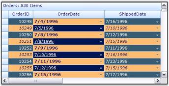' | markdownify }}
{:.image }

> {{ '' | markdownify }}
{:.image }
_Note: For more details, refer to the following browser sample:_

> _<Install Location>\Syncfusion\EssentialStudio\[Version Number]\Windows\Grid.Grouping.Windows\Samples\Filters and Expressions\Dynamic Filter Demo_

###### Merge Cells Dynamically

Merging can be applied to the cells dynamically based on cell values. The merged state will be preserved after any dynamic change such as sorting or grouping.  

By default, when merging is applied in the cells, the Grid’s bounds will be drawn with respect to the MergeCellsMode applied in the Grid. In the case of GridGrouping control, when the Grid’s view layout is changed, the merged state becomes invalid as the Grid still has its initial state bounds. 

To preserve this merging after the dynamic change in grid’s layout, the existing MergeCellsMode is modified to update grid bounds after they change and provides additional support to query the user whether to always update the range of cells to merge.

_Table 97: Properties_

<table>
<tr>
<td>
PROPERTY </td><td>
DESCRIPTION </td><td>
TYPE </td><td>
DATA TYPE </td></tr>
<tr>
<td>
MergeCellsLayout</td><td>
Sets the range of cells to merge in the grid.</td><td>
Enum </td><td>
enumeration</td></tr>
</table>
Sample Link

{Installed Drive}\AppData\Local\Syncfusion\EssentialStudio\{version}\Windows\Grid.Grouping.Windows\Samples\2.0\Grouping\Grouping Demo

Merging Cells Dynamically in a Grid

To apply dynamic merging in GridGrouping control, MergeCellsLayout needs to be applied along with the existing code to merge cells in the grid.

[C#]

//Existing code to set merge cells.

this.gridGroupingControl1.TableDescriptor.Columns[colName]Appearance.AnyRecordFieldCell.MergeCell = GridMergeCellDirection.Both;

this.gridGroupingControl1.TableModel.Options.MergeCellsMode = GridMergeCellsMode.OnDemandCalculation ;

//Sets the range of cells.

this.gridGroupingControl1.TableModel.Options.MergeCellsLayout = GridMergeCellsLayout.Grid;

[VB]

'Existing code to set merge cells.

Me.gridGroupingControl1.TableDescriptor.Columns(colName).Appearance.AnyRecordFieldCell.MergeCell = GridMergeCellDirection.Both

Me.gridGroupingControl1.TableModel.Options.MergeCellsMode = GridMergeCellsMode.OnDemandCalculation

'Sets the range of cells.

Me.gridGroupingControl1.TableModel.Options.MergeCellsLayout = GridMergeCellsLayout.Grid

###### BaseStyles

In addition to the parent styles discussed in the previous topics, Essential Grid supports one other parent-type style that can contribute to a cell's appearance. They are BaseStyles of GridStyleInfo objects associated with an arbitrary collection of cells.

BaseStyles provide the way to create StyleTemplates that can be applied to the cells. It allows you to apply styles with ease and faster. For example, in a word processing software, there is a common task of defining particular style (such as style Header1 representing a bold, 20-point Helvetica font) and then using it repeatedly in your document. BaseStyles play the same role within Essential Grid. You can define a BaseStyle named Header1 as having certain properties and then you can place these properties onto any cell just by applying this BaseStyle Header1 to the cell. More importantly, if you want to change what Header1 means later on (for example, changing its BackColor property from white to red), you can make the change one time by just changing the Header1 BaseStyle and not having to relabel every other cell assigned to this BaseStyle.

BaseStyles are stored in GridGroupingControl.TableModel.BaseStylesMap class. In addition to the standardstyle, other BaseStyles used by all Essential Grids include Row Header, Header and Column Header. You can define and apply your own BaseStyles as well.

Users can add base styles to the engine and inherit the style settings through GridStyleInfo.BaseStyle property. You can create any number of style templates through BaseStyles. 

Applying BaseStyles

1. To add style templates at design time, you need to access BaseStyles property in the property editor. This will open GridTableStyle Collection Editor that lists StyleInfo properties that can be associated to a grid cell. Here is a property editor that shows the creation of two style templates named BaseStyle1 and BaseStyle2.

{{ '' | markdownify }}
{:.image }

2. Your next step is to set base styles created above to the grid cells as required. Suppose you want to set BaseStyle1 for alternate record field cells and BaseStyle2 for the remaining cells, then this can be specified by setting Appearance.AlternateRecordFieldCell.BaseStyle property to BaseStyle1 and Appearance.AnyCell.BaseStyle property to BaseStyle2 as shown in the image below.

{{ '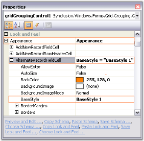' | markdownify }}
{:.image }

3. Here is a sample screenshot.

{{ '' | markdownify }}
{:.image }

Programmatically

Base styles can also be set through code. The following code example illustrates how to create and apply the above styles to the grouping grid.

[C#]

GridTableBaseStyle style1 = new GridTableBaseStyle("BaseStyle 1");

style1.Name = "BaseStyle 1";

style1.StyleInfo.Font.Facename = "Verdana";

style1.StyleInfo.Interior = new BrushInfo(Color.FromArgb(255, 128, 0));

GridTableBaseStyle style2 = new GridTableBaseStyle("BaseStyle 2");

style2.Name = "BaseStyle 2";

style2.StyleInfo.Font.Facename = "Arial";

style2.StyleInfo.Interior = new BrushInfo(Color.FromArgb(192, 192, 255));

gridGroupingControl1.BaseStyles.AddRange(new GridTableBaseStyle[] { style1, style2 });

gridGroupingControl1.Appearance.AlternateRecordFieldCell.BaseStyle = "BaseStyle 1";

gridGroupingControl1.Appearance.AnyCell.BaseStyle = "BaseStyle 2";

[VB.NET]

Dim style1 As GridTableBaseStyle = New GridTableBaseStyle("BaseStyle 1")

style1.Name = "BaseStyle 1"

style1.StyleInfo.Font.Facename = "Verdana"

style1.StyleInfo.Interior = New BrushInfo(Color.FromArgb(255, 128, 0))

Dim style2 As GridTableBaseStyle = New GridTableBaseStyle("BaseStyle 2")

style2.Name = "BaseStyle 2"

style2.StyleInfo.Font.Facename = "Arial"

style2.StyleInfo.Interior = New BrushInfo(Color.FromArgb(192, 192, 255))

gridGroupingControl1.BaseStyles.AddRange(New GridTableBaseStyle() { style1, style2 });

gridGroupingControl1.Appearance.AlternateRecordFieldCell.BaseStyle = "BaseStyle 1";

gridGroupingControl1.Appearance.AnyCell.BaseStyle = "BaseStyle 2";

###### Get Cell Styles

This topic elaborates the way of retrieving style information of grid cells. On a mouse hit, when you want to retrieve the content of underlying cells and also its style information, it is good to use PointToTableCellStyle method on the instances of Grid Table control. 

PointToTableCellStyleInfo Method

For any given point on the grid, this method will return the style information of the underlying cell that is displayed under that point. If the underlying cell belongs to a nested table, then style information is returned for the cell inside the nested table. The details of this method are given below.

_Table 98: Cell styles_

<table>
<tr>
<td>
METHOD NAME</td><td>
PARAMETER</td><td>
RETURN VALUE</td></tr>
<tr>
<td>
PointToTableCellStyle</td><td>
ptClient: A type of System.Drawing Point object that represents mouse position in client coordinates.</td><td>
GridTableCellStyleInfo object that stores stye information of the underlying grid cell.</td></tr>
</table>

Implementation

The implementation of this method is a two-step process.

1. As a first step, it gets corresponding nested display element that is displayed at the given mouse position. This can be performed easily by employing PointToNestedDisplayElement method. This method is explained later in this chapter.
2. Once the display element is retrieved, style information of the corresponding cell can be got by using Table.GetTableCellStyleInfo method, which will return a cell style information given its row and column indices.

PointToNestedDisplayElement Method

This method returns nested display element that is displayed at the given mouse position. The details are given below.

_Table 99: Nested display_

<table>
<tr>
<td>
METHOD NAME</td><td>
PARAMETER</td><td>
RETURN VALUE</td></tr>
<tr>
<td>
PointToNestedDisplayElement</td><td>
ptClient: A type of System.Drawing Point object that represents mouse position in client coordinates.</td><td>
An Element object that represents underlying display element.</td></tr>
</table>

Example

Below is an example that demonstrates how to use PointToTableCellStyle method to retrieve cell style information. This example handles MouseMove handler of the Grid Table Control, retrieves the cell content using the above given method and then writes the content to a listbox control.

1. Setup a Grouping Grid and bind it to a dataset. Handle TableControl.MouseMove event to let the user get the cell style information printed while hovering the mouse over grid cells. Once you have the style, you can check Style.TableCellIdentity for information about the cell such as its column, underlying record, parent table, and so on.

[C#]

private void TableControl_MouseMove(object sender, MouseEventArgs e)

{

    Point ptClient = new Point(e.X, e.Y);

    GridTableControl tableControl = this.groupingGrid1.TableControl;

    GridTableCellStyleInfo style = tableControl.PointToTableCellStyle(ptClient);

    Element displayElement = style.TableCellIdentity.DisplayElement;

    string info = "";

    if (style != null)

    {

        if (style.TableCellIdentity.Column != null)

            info = "Field Name - "+style.TableCellIdentity.Column.Name + ", Field Value - \"" + style.CellValue.ToString() + "\", Field Type - "+style.CellType.ToString();

        else

            info = style.TableCellIdentity.ToString();

    }

    listBox1.Items.Clear();

    listBox1.Items.Add("MousePosition: " + ptClient.ToString());

    listBox1.Items.Add("Category Keys: " + displayElement.ParentChildTable.CategoriesToString());

    listBox1.Items.Add("Display Element Type: " + displayElement.GetType().Name);

    listBox1.Items.Add("Cell Information: " + info);

}

[VB.NET]

Private Sub TableControl_MouseMove(ByVal sender As Object, ByVal e As MouseEventArgs)

Dim ptClient As New Point(e.X, e.Y)

Dim tableControl As GridTableControl = Me.groupingGrid1.TableControl

Dim style As GridTableCellStyleInfo = tableControl.PointToTableCellStyle(ptClient)

Dim displayElement As Element = style.TableCellIdentity.DisplayElement

Dim info As String = ""

If Not (style Is Nothing) Then

If Not (style.TableCellIdentity.Column Is Nothing) Then

info = "Field Name - " & style.TableCellIdentity.Column.Name & ", Field Value - """ & style.CellValue.ToString() & """, Field Type - " & style.CellType.ToString()

Else

info = style.TableCellIdentity.ToString()

End If

End If

listBox1.Items.Clear()

listBox1.Items.Add("MousePosition: " & ptClient.ToString())

listBox1.Items.Add("Category Keys: " & displayElement.ParentChildTable.CategoriesToString())

listBox1.Items.Add("Display Element Type: " & displayElement.GetType().Name)

listBox1.Items.Add("Cell Information: " & info)

End Sub

2. Here is a sample output.

{{ '' | markdownify }}
{:.image }

###### Look and Feel

GridGroupingControl implements Themes and VisualStyles that set up a common Look and Feel to all the components in the grid. The term 'Look and Feel' refers not only to the way grid elements appear, but also to the way they behave in response to the user interactions like hovering mouse over them, clicking, and so on. Grid has in-built support for the following skins: WindowsXP, Office2007 (Blue/Black/Silver) and Office2003.

ThemesEnabled

Grouping Grid enables as well as disables XP themes via ThemesEnabled property. When it is set to true, XP themes are enabled.

[C#]

this.gridGroupingControl1.ThemesEnabled = true;

[VB.NET]

Me.gridGroupingControl1.ThemesEnabled = True

{{ '' | markdownify }}
{:.image }

GridVisualStyles

GridVisualStyles property is used to set different VisualStyles (skins) for grid like Office2007 and Office2003. Every component that is incorporated into the grid will be affected by these visual styles.

GridVisualStyles enumeration defines the skins exposed by the grouping grid. They are Office2003, Office2007Blue, Office2007Black, Office2007Silver and SystemTheme. Default is SystemTheme.

Visual Styles can be set by assigning GridVisualStyles enumeration value to the TableOptions.GridVisualStyles property.

[C#]

this.gridGroupingControl1.TableOptions.GridVisualStyles = GridVisualStyles.Office2007Blue;

[VB.NET]

Me.gridGroupingControl1.TableOptions.GridVisualStyles = GridVisualStyles.Office2007Blue

{{ '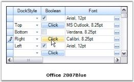' | markdownify }}
{:.image }

 _Figure 345: Grid Grouping Control with Office 2007 Blue Visual Style_

{{ '' | markdownify }}
{:.image }

{{ '' | markdownify }}
{:.image }

{{ '' | markdownify }}
{:.image }

Since visual styles also affect how the cells behave, cell controls are painted with a different gradient when users interact with them either by clicking or by hovering the mouse over them. Below is the image that exposes these cases.

{{ '' | markdownify }}
{:.image }

Grid Skins

GridSkins, an extension of GridVisualStyles, is built on the idea of providing more advanced themes for your grid along with basic themes defined by GridVisualStyles. It is available as an add-on feature in the GridHelperClasses library. GridSkins depict the custom skin of GridVisualStyles. Currently, it comes with new Vista skin that makes your grid components appear in vista-like look and feel.

Grid Skins can be set by invoking static method ApplySkin of the GridSkins helper class. This method accepts two parameters, a grid that needs to be styled and a Skins enumeration value that specifies the desired skin, and applies this desired skin to all the grid components. 

[C#]

GridSkins.ApplySkin(this.gridControl1.Model, Skins.Vista);

[VB.NET]

GridSkins.ApplySkin(Me.gridControl1.Model, Skins.Vista)

The image below illustrates a sample output.

{{ '' | markdownify }}
{:.image }

###### Table Options

TableOptions lets you set various properties that will affect the look and behavior of a grouping grid across all groups and child groups. Properties such as default height of a Caption Row, GroupHeader and Footer, PreviewRow, or whether TreeLines are visible between PlusMinus cells are controlled by this property. Here is a screen shot that shows the list of properties you can set under TableOptions.

{{ '' | markdownify }}
{:.image }

The table below gives a brief description on the above properties.

_Table 100: Properties_

<table>
<tr>
<td>
TABLEOPTIONS PROPERTIES</td><td>
DESCRIPTION</td></tr>
<tr>
<td>
AllowDragColumns</td><td>
Allows the user to rearrange columns by dragging the headers.</td></tr>
<tr>
<td>
AllowDropDownCell</td><td>
Decides whether combo boxes are displayed for foreign key reference columns.</td></tr>
<tr>
<td>
AllowSelection</td><td>
Defines selection behavior. Set it to none to use record selections.</td></tr>
<tr>
<td>
AllowSortColumns</td><td>
Allows user to sort columns by clicking column header.</td></tr>
<tr>
<td>
AllowMultiColumnSort</td><td>
Allows user to sort the table by multiple columns.</td></tr>
<tr>
<td>
CaptionRowHeight</td><td>
Displays height of caption rows in pixels.</td></tr>
<tr>
<td>
ColumnHeaderRowHeight</td><td>
Displays height of column header rows in pixels.</td></tr>
<tr>
<td>
ColumnsMaxLengthFirstNRecords</td><td>
Number of rows to be evaluated for GridColumnsMaxLengthStrategy.FirstNRecords.</td></tr>
<tr>
<td>
ColumnsMaxLengthStrategy</td><td>
Defines strategy for resizing columns to optimal width.</td></tr>
<tr>
<td>
DefaultColumnWidth</td><td>
Default width for columns.</td></tr>
<tr>
<td>
DrawTextWithGdiInterop</td><td>
Specifies whether the text should be drawn using GDI interop routines.</td></tr>
<tr>
<td>
GridLineBorder</td><td>
Controls the style of the lines used to draw grid lines.</td></tr>
<tr>
<td>
GridVisualStyles</td><td>
Specifies the skin for the grid.</td></tr>
<tr>
<td>
GroupFooterSectionHeight</td><td>
Displays height of group footers in pixels.</td></tr>
<tr>
<td>
GroupHeaderSectionHeight</td><td>
Displays height of group headers in pixels.</td></tr>
<tr>
<td>
GroupPreviewSectionHeight</td><td>
Displays height of group previews in pixels.</td></tr>
<tr>
<td>
IndentWidth</td><td>
Displays width of the indentation of each child group in pixels.</td></tr>
<tr>
<td>
ListBoxSelectionColor Option</td><td>
Controls the appearance of selected cells.</td></tr>
<tr>
<td>
ListBoxSelectionCurrentCell Options</td><td>
Controls the appearance and behavior of the current cell when ListBoxSelectionMode is set.</td></tr>
<tr>
<td>
ListBoxSelectionMode</td><td>
Enables list box-type selection behavior when the user moves the current cell.</td></tr>
<tr>
<td>
MaxDropDownTableSize</td><td>
Maximum size for the dropdown table associated with foreign keys.</td></tr>
<tr>
<td>
RecordPreviewRowHeight</td><td>
Displays height of the record previews in pixels.</td></tr>
<tr>
<td>
RecordRowHeight</td><td>
Displays height of the record rows in pixels.</td></tr>
<tr>
<td>
RowHeaderWidth</td><td>
Displays width of the row header cells in pixels.</td></tr>
<tr>
<td>
SelectionBackColor</td><td>
Sets background color for selected records.</td></tr>
<tr>
<td>
SelectionTextColor</td><td>
Sets text color for selected records.</td></tr>
<tr>
<td>
ShowRecordPlusMinus</td><td>
Indicates whether a PlusMinus cell should appear next to the records; only applicable for nested tables.</td></tr>
<tr>
<td>
ShowRecordPreviewRow</td><td>
Indicates whether a nested table has a preview row; only applicable for nested tables.</td></tr>
<tr>
<td>
ShowRowHeader</td><td>
Indicates whether the row header column should be visible.</td></tr>
<tr>
<td>
ShowTableIndent</td><td>
Indicates whether children of the records in the parent table should be indented; only applicable for nested tables.</td></tr>
<tr>
<td>
ShowTableIndentAsCoveredRange</td><td>
Indicates whether the cells in a particular indent level are treated as a single covered cell; only applicable for nested tables.</td></tr>
<tr>
<td>
ShowTableRowHeaderAsCoveredRange</td><td>
Indicates whether the row header cells for a particular nested table is treated as a single covered cell; only applicable for nested tables.</td></tr>
<tr>
<td>
ShowTreeLines</td><td>
Indicates whether the PlusMinus cells are shown connected with lines.</td></tr>
<tr>
<td>
SummaryRowHeight</td><td>
Height in pixels of the summary rows. The value -1 is a special setting to indicate that the summary row height should always be the same as the RecordRowHeight.</td></tr>
<tr>
<td>
TreeLineBorder</td><td>
Controls the style of the line that is used to draw the tree lines.</td></tr>
</table>
In the Preview, try various property settings to see their effect on display. Below is a sample of what you might see. The properties changed here are CaptionRowHeight, ColumnHeaderRowHeight, GridLineBorder, GridVisualStyles, ListBoxSelectionMode, SelectionBackColor, SelectionTextColor and ShowTreeLines.

{{ '' | markdownify }}
{:.image }

> {{ '' | markdownify }}
{:.image }
_Note: For more details, refer to the following browser sample:_

> _<Install Location>\Syncfusion\EssentialStudio\[Version Number]\Windows\Grid.Grouping.Windows\Samples\Grouping Grid Options\Table Options Demo_

##### Grid Layout

Grouping grid offers different layouts to organize data display. With default layout, grouping grid combines column headers into a single row docked to the top. Below the column headers are the rows of data records displayed with one record per row and only one record field per column.

This default arrangement can be modified to customize data views. This section discusses two features offered by the grouping grid in this regard.

###### Stacked MultiHeaders

Essential Grouping Grid Control offers in-built support for Stacked MultiHeaders. This feature allows you to create additional unbound header rows called StackedHeaderRows that span across visible grid columns. You can group some columns under each header row. It also supports Drag/Drop of these header rows. Grouped columns will also be rearranged along with the header.

StackedHeaderRows Collection

Stacked Header rows for a given Grid Table are gathered under TableDescriptor.StackedHeaderRows collection. This contains property definitions that control the behavior and appearance of Stacked Headers. A StackedHeaderRow collection can be viewed as a set of stacked header rows in which each header row contains a collection of stacked headers that span across multiple columns. 

Every header in a Stacked Header Row is defined by GridStackedHeaderDescriptor. All the headers for a given stacked header row is managed by GridStackedHeaderRowDescriptor. GridStackedHeaderRowDescriptorCollection, which is returned by TableDescriptor.StackedHeaderRows property manages the collection of GridStackedHeaderRowDescriptors for a given table. It is the GridStackedHeaderVisibleColumnDescriptor that binds a Column or ColumnSet to the StackedHeaderCell. 

The order in which the StackedHeaders will appear is determined by the VisibleColumns collection.When the layout of the GridStackedHeaderRow is calculated, the grid will loop through VisibleColumns collection and find StackedHeader Descriptor that references the VisibleColumn. If the same StackedHeader references multiple neighboring VisibleColumns, then the header for these columns will be drawn as one cell. If there are no visible columns specified for a StackedHeader, then it will span across all the visible columns similar to a Caption.

You will be able to rearrange the columns by dragging the stacked headers. While doing so, it is the Visible Columns collection that is being affected. Since the order of stacked headers is dependent on Visible Columns, the GridStackedHeaderCollections itself does not need to be modified.

It is possible to add Stacked Headers for nested tables and groups too. You can enable the display of StackedHeaders by setting ShowStackedHeaders property to true.

* TopLevelGroupOptions.ShowStackedHeaders - Toggles the display of StackedHeaders for top most group.
* ChildGroupOptions.ShowStackedHeaders - Toggles the display of StackedHeaders for child groups.
* NestedTableGroupOptions.ShowStackedHeaders - Toggles the display of StackedHeaders for child table and its groups.

Through Designer

Creating Stacked Headers is a two-step process. 

1. As a first step, you must define the Stacked Header Rows by accessing TableDescriptor.StackedHeaderRows property. This will open GridStackedHeaderRowDescriptor Collection Editor wherein you can add as many header rows as you want by specifying different attributes like HeaderText, VisibleColumns, Appearance, and so on, for each header in the header row.

{{ '' | markdownify }}
{:.image }

Property Definitions

_Table 101: Definitions_ 

<table>
<tr>
<td>
PROPERTY NAMES</td><td>
DESCRIPTION</td></tr>
<tr>
<td>
Name</td><td>
Specifies the name of the descriptor.</td></tr>
<tr>
<td>
HeaderText</td><td>
Specifies the text to be displayed in the StackedHeaderCell.</td></tr>
<tr>
<td>
VisibleColumns</td><td>
The collection of columns that should be combined under the Stacked Header.</td></tr>
<tr>
<td>
Appearance</td><td>
Controls the appearance of the StackedHeaderCell.</td></tr>
</table>

2. The second step is to enable the display of StackedHeaders for the given table and group by setting ShowStackedHeaders property to true.

{{ '' | markdownify }}
{:.image }

Output

Here are the screen shots showing Grouping Grid with two Stacked Header Rows. It illustrates the effect of doing Drag and Drop on StackedHeaders. Notice that the order of the Visible columns gets affected automatically while rearranging StackedHeaders.

{{ '' | markdownify }}
{:.image }

{{ '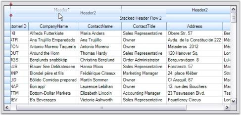' | markdownify }}
{:.image }

{{ '' | markdownify }}
{:.image }

StackedHeaders for NestedGroups

Stacked Headers can be enabled for Child Group by setting ChildGroupOptions.ShowStackedHeaders to true. The grouping grid in the image below displays stacked headers for nested groups.

{{ '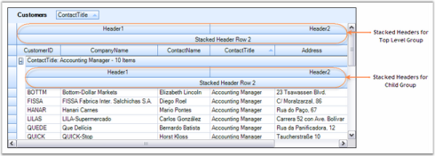' | markdownify }}
{:.image }

Appearance

Appearance of StackedHeaders can be controlled in a couple of ways. One way to access Appearance.StackedHeaderCell property is to enter appearance definitions. Appearance set this way will be applied to all stacked header cells. An alternate way is to specify appearance settings through GridStackedHeaderRow Descriptor. In this way, you can have different settings for individual stacked headers in each StackedHeaderRow.

Here is the property window with GridStackedHeaderRowDescriptor Collection Editor showing the appearance settings of Stacked Headers defined.

{{ '' | markdownify }}
{:.image }

Output

Here is the effect of the above settings.

{{ '' | markdownify }}
{:.image }

Programmatically

You can add Stacked Header Rows at runtime too. To achieve this, first you must define the required number of GridStackedHeaderDescriptors by specifying VisibleColumns for each. Next, create StackedHeaderRow by instantiating GridStackedHeaderRowDescriptor and then add the above defined stacked headers into it. Finally, add this header row into TableDescriptor.StackedHeaderRows collection. The following code example illustrates this process.

[C#]

GridStackedHeaderDescriptor shd = new GridStackedHeaderDescriptor("header1", "StackedHeader1");

shd.VisibleColumns.Add(new GridStackedHeaderVisibleColumnDescriptor("CustomerName"));

shd.VisibleColumns.Add(new GridStackedHeaderVisibleColumnDescriptor("CompanyName"));

GridStackedHeaderRowDescriptor shrd = new GridStackedHeaderRowDescriptor("Row1",

new GridStackedHeaderDescriptor[] { shd });

this.gridGroupingControl1.TableDescriptor.StackedHeaderRows.Add(shrd);

//Customizes Appearance.

this.gridGroupingControl1.Appearance.StackedHeaderCell.BackColor = Color.Teal;

[VB.NET]

Dim shd As GridStackedHeaderDescriptor = New GridStackedHeaderDescriptor("header1", "StackedHeader1")

shd.VisibleColumns.Add(New GridStackedHeaderVisibleColumnDescriptor("CustomerName"))

shd.VisibleColumns.Add(New GridStackedHeaderVisibleColumnDescriptor("CompanyName"))

Dim shrd As GridStackedHeaderRowDescriptor = New GridStackedHeaderRowDescriptor("Row1", 

New GridStackedHeaderDescriptor() { shd })

Me.gridGroupingControl1.TableDescriptor.StackedHeaderRows.Add(shrd)

'Customizes Appearance.

Me.gridGroupingControl1.Appearance.StackedHeaderCell.BackColor = Color.Teal

> {{ '' | markdownify }}
{:.image }
_Note: For more details, refer to the following browser sample:_

> _<Install Location>\Syncfusion\EssentialStudio\[Version Number]\Windows\Windows\Grid.Grouping.Windows\Samples\Layout Customization\Stacked Headers Demo_

###### MultiRow Record

Grid Grouping control offers built-in support for MultiRowRecords. This feature allows the records to span across multiple rows and columns. It is achieved through the property, TableDescriptor.ColumnSets. It allows you to modify default alignment of visible columns. 

ColumnSets Collection

ColumnSets act as superset of TableDescriptor.Columns collection. Once ColumnSets are defined, the grouping grid will then loop through the collection and organize data display accordingly. Each ColumnSet is defined by GridColumnSetDescriptor. ColumnSets are managed by GridColumnSetDescriptorCollection that is returned by TableDescriptor.ColumnSets property.

Programmatically

Follow the steps below to span the records across multiple rows.

1. Define GridColumnSpanDescriptor for each column to be spanned across grid rows or columns. Specify the range that the column spans. Rows and Columns are zero-based.

[C#]

GridColumnSpanDescriptor csd0 = new GridColumnSpanDescriptor("EmployeeID");

csd0.Range = GridRangeInfo.Cells(0, 0, 1, 0);

GridColumnSpanDescriptor csd1 = new GridColumnSpanDescriptor("Address");

csd1.Range = GridRangeInfo.Cells(0, 1, 0, 2);

GridColumnSpanDescriptor csd2 = new GridColumnSpanDescriptor("City");

csd2.Range = GridRangeInfo.Cells(1, 1, 1, 1);

GridColumnSpanDescriptor csd3 = new GridColumnSpanDescriptor("Country");

csd3.Range = GridRangeInfo.Cells(1, 2, 1, 2);

[VB.NET]

Dim csd0 As GridColumnSpanDescriptor = New GridColumnSpanDescriptor("EmployeeID")

csd0.Range = GridRangeInfo.Cells(0, 0, 1, 0)

Dim csd1 As GridColumnSpanDescriptor = New GridColumnSpanDescriptor("Address")

csd1.Range = GridRangeInfo.Cells(0, 1, 0, 2)

Dim csd2 As GridColumnSpanDescriptor = New GridColumnSpanDescriptor("City")

csd2.Range = GridRangeInfo.Cells(1, 1, 1, 1)

Dim csd3 As GridColumnSpanDescriptor = New GridColumnSpanDescriptor("Country")

csd3.Range = GridRangeInfo.Cells(1, 2, 1, 2)

2. Create a GridColumnSetDescriptor whose ColumnSpans property stores information about columns that need to be spanned. Hence, you need to initialize ColumnSpans property with Columns (ColumnSpanDescriptors of the desired columns) you want to spread.

[C#]

GridColumnSetDescriptor csd = new GridColumnSetDescriptor();

csd.ColumnSpans.Add(csd0);

csd.ColumnSpans.Add(csd1);

csd.ColumnSpans.Add(csd2);

csd.ColumnSpans.Add(csd3);

[VB.NET]

Dim csd As GridColumnSetDescriptor = New GridColumnSetDescriptor()

csd.ColumnSpans.Add(csd0)

csd.ColumnSpans.Add(csd1)

csd.ColumnSpans.Add(csd2)

csd.ColumnSpans.Add(csd3)

3. Finally bind this ColumnSet to the grid by adding the above created GridColumnSetDescriptor into the TableDescriptor.ColumnSets property.

[C#]

this.gridGroupingControl1.TableDescriptor.ColumnSets.Add(csd);

[VB.NET]

Me.gridGroupingControl1.TableDescriptor.ColumnSets.Add(csd)

4. Here is a sample output.

{{ '' | markdownify }}
{:.image }

Through Designer

To create ColumnSets that defines ColumnSpans for a grid, select TableDescriptor.ColumnSets property in the property window. This will open GridColumnSetDescriptor Collection Editor that will let you specify the columns to span and the range for each of the columns.

{{ '' | markdownify }}
{:.image }

> {{ '' | markdownify }}
{:.image }
_Note: For more details, refer to the following browser sample:_

> _<Install Location>\Syncfusion\EssentialStudio\[Version Number]\Windows\Grid.Grouping.Windows\Samples\Serialization\Employee View Demo_

###### Grid Field Chooser

The view of a grid can be customized based on column visibility by using plug-in utility called Field Chooser. A Field Chooser can be associated to Grid Grouping control to add or remove columns from a grid. It can be done by intializing FieldChooser class where the constructor takes a parameter as a Grid Grouping control object.

Enabling the Field Chooser allows the user to right-click on a column header and select Field Chooser menu item to view the Field Chooser dialog. This dialog will list all the column names with check boxes beside them. The required columns can be made visible in the grid by selecting the check box adjacent to the required column.

The following code example illustrates the usage of Field Chooser.

[C#]

FieldChooser fchooser = new FieldChooser(this.gridGroupingControl1);

[VB.NET]

Dim fchooser As FieldChooser = New FieldChooser(Me.gridGroupingControl1)

{{ '' | markdownify }}
{:.image }

For more details, refer the following sample:

_<Install Location>\Syncfusion\EssentialStudio\[Version Number]\Windows\Grid.Grouping.Windows\Samples\Layout Customization\Field Chooser Demo_

Field Chooser Update on Close support

Using FieldChooser, the required columns can be made visible or invisible by selecting the checkbox adjacent to the required column. But the changes will be made alongside while checking or unchecking the checkbox in the FieldChooser dialog box. To update the Visibility or Invisibility of columns after closing the FieldChooser Dialog box, you have to set DeferLayoutUpdate property to _‘True’_.

<table>
<tr>
<td>
[C#] FieldChooser fchooser = new FieldChooser(this.gridGroupingControl1);fchooser.DeferLayoutUpdate = true;</td></tr>
<tr>
<td>
[VB] Dim fchooser As FieldChooser = New FieldChooser(Me.gridGroupingControl1)fchooser.DeferLayoutUpdate = True</td></tr>
</table>

Field Chooser Events

FieldChooser events are used to customize FieldChooser dialog box. Field chooser events allow the user to modify control of the FieldChooser dialog and change its caption name. It has events to perform operations in FieldChooser dialog box such as FieldChooserShowing, FieldChooserShown, FieldChooserClosing,and FieldChooserClosed events.

_Table 102: Field Chooser Events Table_

<table>
<tr>
<td>
EVENTS</td><td>
DESCRIPTION</td><td>
ARGUMENTS</td><td>
TYPE</td></tr>
<tr>
<td>
FieldChooserShowing</td><td>
This event is handled before the FieldChooser DialogBox is shown either in the stacked header or column header. This event is generally used to change the caption of the DialogBox, get and set the control of TreeviewAdv or Grid controls, and also used to cancel showing the FieldChooser dialog.</td><td>
public FieldChooserShowingEventArgs (string caption, object fieldList);</td><td>
Event </td></tr>
<tr>
<td>
FieldChooserShown</td><td>
This event is handled after the FieldChooser dialog is shown. This event is generally used to get the caption name of the FieldChooser dialog box and get the control of the TreeviewAdv or Grid controls.</td><td>
public FieldChooserShownEventArgs(string caption, object fieldList);</td><td>
Event</td></tr>
<tr>
<td>
FieldChooserClosing</td><td>
This event is generally used to change the caption name of the dialog, get and set the control of TreeviewAdv or Grid controls, and also used to cancel closing the FieldChooser dialog.</td><td>
public FieldChooserClosingEventArgs(string caption, object fieldList);</td><td>
Event</td></tr>
<tr>
<td>
FieldChooserClosed</td><td>
This event is handled after the FieldChooser Dialog Box is closed. This event is generally used to get the caption name of the FieldChooser dialog, and get the control of the TreeviewAdv or Grid controls after closing the FieldChooser dialog.</td><td>
public FieldChooserClosedEventArgs(string caption, object fieldList);</td><td>
Event</td></tr>
</table>
The following code sample illustrates handling FieldChooserShowing event. It is used to change the caption of the FieldChooser dialog and cancel the showing of FieldChooser dialog.

[C#]

//FieldChooserShowing Event.

        void gridGroupingControl1_FieldChooserShowing(object sender, FieldChooserShowingEventArgs e)

        {

            e.Caption = "Syncfusion";

            e.Cancel = true;

        }

[VB.NET]

'FieldChooserShowing Event.

 Private Sub GroupingControl_FieldChooserShowing(ByVal sender As Object, ByVal e As Syncfusion.Windows.Forms.Grid.FieldChooserShowingEventArgs)

            e.Caption = "Syncfusion"

            e.Cancel = True

        End Sub

The following code example illustrates handling FieldChooserShown event. It is used to get the caption name of FieldChooser dialog after showing the dialog box.

[C#]

//FieldChooserShown Event.

        void gridGroupingControl1_FieldChooserShown(object sender, FieldChooserShownEventArgs e)

        {

            string captionName = e.Caption;

            Console.WriteLine(captionName);

        }

[VB.NET]

'FieldChooserShown Event.

        Private Sub GroupingControl_FieldChooserShown(ByVal sender As Object, ByVal e As Syncfusion.Windows.Forms.Grid.FieldChooserShownEventArgs)

            Dim captionName As String = e.Caption

            Console.WriteLine(captionName)

        End Sub

The following code example illustrates handling FieldChooserClosing event. Here it is used to change the caption name of the FieldChooser dialog and cancel closing it.

[C#]

//FieldChooserClosing Event.

        void gridGroupingControl1_FieldChooserClosing(object sender, FieldChooserClosingEventArgs e)

        {

            e.Caption = "Syncfusion Inc";

            e.Cancel = true;

        }

[VB.NET]

'FieldChooserClosing Event.

                  Private Sub GroupingControl_FieldChooserClosing(ByVal sender As Object, ByVal e As Syncfusion.Windows.Forms.Grid.FieldChooserClosingEventArgs)

            e.Caption = "Syncfusion Inc"

            e.Cancel = True

        End Sub

The following code example illustrates handling FieldChooserClosed event. Here it is used to get the caption name of the FieldChooser dialog after closing it.

[C#]

//FieldChooserClosed Event.

        void gridGroupingControl1_FieldChooserClosed(object sender, FieldChooserClosedEventArgs e)

        {

            string caption = e.Caption;

            Console.WriteLine(caption);

        }

[VB.NET]

'FieldChooserClosed Event.

       Private Sub GroupingControl_FieldChooserClosed(ByVal sender As Object, ByVal e As Syncfusion.Windows.Forms.Grid.FieldChooserClosedEventArgs)

            Dim captionName As String = e.Caption.ToString()

            Console.WriteLine(captionName)

        End Sub

###### Field Chooser for Stacked Header

GridGrouping control in Essential Grid provides field chooser support for stacked headers. The field chooser feature enables you to customize a column in a grid at runtime without modifying the database it is bound to. 

Use Case Scenarios

When you want to show or hide the columns of a stacked header in a grid without deleting its bound records, you can achieve this using this feature.

_Table 103: Property Table_

<table>
<tr>
<td>
PROPERTY </td><td>
DESCRIPTION </td><td>
TYPE </td><td>
DATA TYPE </td></tr>
<tr>
<td>
EnableColumnsInView</td><td>
Used to enable or disable the column names in the field chooser dialog.</td><td>
Property </td><td>
Boolean </td></tr>
</table>
_Table 104: Constructor_

<table>
<tr>
<th>
CONSTRUCTOR </th><th>
DESCRIPTION </th><th>
PARAMETERS </th><th>
TYPE </th><th>
RETURN TYPE </th></tr>
<tr>
<th>
FieldChooser</th><th>
Used to wire the GridGroupin gControl  with the field chooser. </th><th>
(<GridGroupingControl>)</th><th>
Constructor</th><th>
class</th></tr>
</table>
Sample Link

A demo of this feature is available in the following location: 

_<Install Location>\Syncfusion\EssentialStudio\[Version Number]\Windows\Grid.Grouping.Windows\Samples\Layout Customization\Stacked Headers Demo_

Adding Field Chooser Stacked Headers In GridGroupingControl

1. To add field chooser, create a constructor using _FieldChooser_ class and pass _GridGroupingControl_ as the parameter.

The following code illustrates this: 

[C#]

//Wires GridGroupingControl with the field chooser.

            FieldChooser fchooser = new FieldChooser(this.gridGroupingControl1);

Here is the code snippet used to disable the EnableColumnsInView property.:

//Disables EnableColumnsInView property.

           fchooser.EnableColumnsInView = false;

[VB]

'Wires GridGroupingControl with the field chooser.

            Dim fchooser As FieldChooser = New FieldChooser(Me.gridGroupingControl1)

'Disables EnableColumnsInView property.

            fchooser.EnableColumnsInView = False

When the code runs, the entire grid will open.

2.  Right click on a column header and select Field Chooser menu item to view Field Chooser dialog.

{{ '' | markdownify }}
{:.image }

3. This dialog will list all the column names with check boxes adjacent to them.

{{ '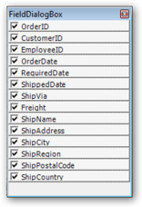' | markdownify }}
{:.image }

9. Select the checkboxes of the columns to be displayed in the grid. The grid will have only the columns that are selected in the Field Chooser dialog.

{{ '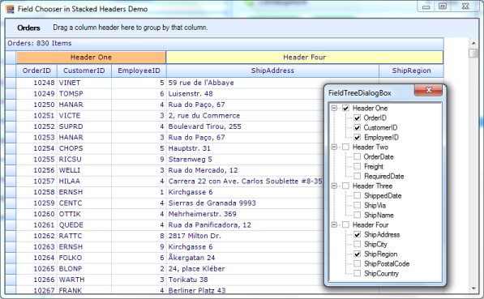' | markdownify }}
{:.image }

##### Selections

There are two type of selection architectures in a Grid Grouping control. One is designed specifically for Grid Grouping control referred as Record-Based Selection and the other is inherited from GridControlBase named as Model-Based Selection. 

If you use the Record-Based selection functionality, then whole records are selected and these selections function properly with nested tables, sorting, and so on. If you choose the inherited selection capability, you will be able to select cell ranges, but the selections will have no knowledge of nested tables, grouping, or sorting, and thus is limited in Grid Grouping control. 

To use the Grid Grouping control record selections, you must set AllowSelections to None and then set ListBoxSelectionMode to something other than None. To use inherited selection capability, set AllowSelections to something other than None.

###### Model Based Selection

Model Based Selection is cell-based that allows you to select across the cell, which is not possible with record-based selection. This derives from the GridControlBase and hence will not be aware of grouping elements like nested tables, groups, and so on. Model-based selection can be set by initializing AllowSelection property to a value other than None. The possible values for this type of selection is defined by the enum GridSelectionFlags. By setting various flags in AllowSelection, you can control the selection behavior of the grouping grids.

Selection Flags

_Table 105: Flag selection_

<table>
<tr>
<td>
FLAG NAMES</td><td>
DESCRIPTION</td></tr>
<tr>
<td>
AlphaBlend</td><td>
Uses alpha blending to highlight selected cells.</td></tr>
<tr>
<td>
Cell</td><td>
Individual cells can be selected.</td></tr>
<tr>
<td>
Column</td><td>
Columns can be selected.</td></tr>
<tr>
<td>
Row</td><td>
Rows can be selected.</td></tr>
<tr>
<td>
Table</td><td>
Whole table can be selected.</td></tr>
<tr>
<td>
Shift</td><td>
Allows user to extend existing selection by holding Shift key and clicking a cell.</td></tr>
<tr>
<td>
MixRangeType</td><td>
Allows you to select multiple ranges by holding CTRL key.</td></tr>
<tr>
<td>
Multiple</td><td>
Allows both rows and columns to be selected at the same time when GridSelectionFlags.Multiple is enabled.</td></tr>
<tr>
<td>
Keyboard</td><td>
Allows extenion of existing selection when user holds SHIFT+Arrow keys.</td></tr>
<tr>
<td>
Any</td><td>
Default behavior for selecting cells: Rows, Columns, Cells, Table, Multiple, Extends Shift Key support, and alpha blending.</td></tr>
<tr>
<td>
None</td><td>
Disable selecting cells.</td></tr>
</table>
You can combine more than one flags to customize current selection behavior.

Example

Following code example illustrates how to set the selection mode for selecting multiple rows with alpha blending.

[C#]

this.gridGroupingControl1.TableOptions.AllowSelection = GridSelectionFlags.AlphaBlend | GridSelectionFlags.Row | GridSelectionFlags.Multiple;

[VB.NET]

Me.gridGroupingControl1.TableOptions.AllowSelection = GridSelectionFlags.AlphaBlend Or GridSelectionFlags.Row Or GridSelectionFlags.Multiple

{{ '' | markdownify }}
{:.image }

Format Selection

It is possible to modify default color used for alphablend selection. This can be achieved by assigning a desired color to AlphaBlendSelectionColor property. The example given below uses Red Color for alpha blending.

[C#]

this.gridGroupingControl1.TableOptions.AllowSelection = GridSelectionFlags.AlphaBlend | GridSelectionFlags.Cell;

this.gridGroupingControl1.TableModel.Options.AlphaBlendSelectionColor = Color.Red;

[VB.NET]

Me.gridGroupingControl1.TableOptions.AllowSelection = GridSelectionFlags.AlphaBlend Or GridSelectionFlags.Cell

Me.gridGroupingControl1.TableModel.Options.AlphaBlendSelectionColor = Color.Red

{{ '' | markdownify }}
{:.image }

> {{ '' | markdownify }}
{:.image }
_Note: For more details, refer to the following browser sample:_

> _<Install Location>\Syncfusion\EssentialStudio\[Version Number]\Windows\Grid.Grouping.Windows\Samples\Grouping Grid Options\Table Options Demo_

###### Record Based Selection

This type of selection mechanism allows selection in terms of record. It is not cell based. This selection mode is specifically designed for a Grouping Grid and hence it is aware of nested tables, nested groups, and the like. Any selection that is record based affects Table.SelectedRecords collection. 

Grid Grouping control offers three types of record based selections, which together are called ListBoxSelection Modes. To enable record based selection, you need to set ListBoxSelectionMode property to a value other than None. Once a listbox selection is enabled, it automatically turns off the model based selection by assigning None to AllowSelection property.

Following code example illustrates the different types of record based selections.

SelectionMode - One

It allows you to select only one item (record).

[C#]

this.gridGroupingControl1.TableOptions.ListBoxSelectionMode = SelectionMode.One;

[VB.NET]

Me.gridGroupingControl1.TableOptions.ListBoxSelectionMode = SelectionMode.One

{{ '' | markdownify }}
{:.image }

SelectionMode - MultiSimple

You can select multiple items individually. It does not support the use of SHIFT, CTRL and ARROW keys to extend the selection.

[C#]

this.gridGroupingControl1.TableOptions.ListBoxSelectionMode = SelectionMode.MultiSimple;

[VB.NET]

Me.gridGroupingControl1.TableOptions.ListBoxSelectionMode = SelectionMode.MultiSimple

{{ '' | markdownify }}
{:.image }

SelectionMode - MultiExtended

This selection type allows selection of multiple items through Shift, Ctrl and Arrow keys.

[C#]

this.gridGroupingControl1.TableOptions.ListBoxSelectionMode = SelectionMode.MultiExtended;

[VB.NET]

Me.gridGroupingControl1.TableOptions.ListBoxSelectionMode = SelectionMode.MultiExtended

{{ '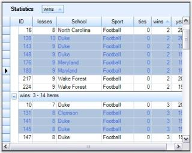' | markdownify }}
{:.image }

Format ListBox Selections

ListBoxSelection appearance can be customized by setting the properties: SelectionBackColor, SelectionTextColor and ListBoxSelectionColorOptions. By default, SystemColors.Highlight and SystemColors.HighlightText are the colors used as backcolor and textcolor to highlight selected records. SelectionBackColor and SelectionTextColor property settings can be used to override these default colors.

ListBoxSelectionColorOptions is used to control the appearance of the selections. The GridListBoxSelectionColorOptions enumeration specifies the options for this property.

* ApplySelectionColor

Gets the required colors from the SelectionBackColor and SelectionTextColor properties.

[C#]

this.gridGroupingControl1.TableOptions.ListBoxSelectionColorOptions = GridListBoxSelectionColorOptions.ApplySelectionColor;

this.gridGroupingControl1.TableOptions.SelectionBackColor = Color.PaleGreen;

this.gridGroupingControl1.TableOptions.SelectionTextColor = Color.Green;

[VB.NET]

Me.gridGroupingControl1.TableOptions.ListBoxSelectionColorOptions = GridListBoxSelectionColorOptions.ApplySelectionColor

Me.gridGroupingControl1.TableOptions.SelectionBackColor = Color.PaleGreen

Me.gridGroupingControl1.TableOptions.SelectionTextColor = Color.Green

Here is the effect of the above settings.

{{ '' | markdownify }}
{:.image }

* Draw Alphablend

Draws alphablending over the selected row.

[C#]

this.gridGroupingControl1.TableOptions.ListBoxSelectionColorOptions = GridListBoxSelectionColorOptions.DrawAlphablend;

[VB.NET]

Me.gridGroupingControl1.TableOptions.ListBoxSelectionColorOptions = GridListBoxSelectionColorOptions.DrawAlphablend

{{ '' | markdownify }}
{:.image }

* InvertCells

Inverts the cells in selected row. As a result, the back color of the cell is used to draw the text and CellTextColor becomes its BackColor.

[C#]

this.gridGroupingControl1.TableOptions.ListBoxSelectionColorOptions = GridListBoxSelectionColorOptions.InvertCells;

[VB.NET]

Me.gridGroupingControl1.TableOptions.ListBoxSelectionColorOptions = GridListBoxSelectionColorOptions.InvertCells

{{ '' | markdownify }}
{:.image }

* None

Do not change the appearance of the cells. The cell appearance could be specified manually by handling TableControlPrepareViewStyleInfo and TableControlCellDrawn events.

[C#]

this.gridGroupingControl1.TableOptions.ListBoxSelectionColorOptions = GridListBoxSelectionColorOptions.None;

[VB.NET]

Me.gridGroupingControl1.TableOptions.ListBoxSelectionColorOptions = GridListBoxSelectionColorOptions.None

{{ '' | markdownify }}
{:.image }

ListBoxSelection CurrentCellOptions

When ListBoxSelection mode is set, you can control the appearance and behavior of the CurrentCell by setting ListBoxSelectionCurrentCellOptions property to a desired value. Possible values are defined by GridListBoxSelectionCurrentCellOptions enumeration described below.

* HideCurrentCell

Do not select a current cell in the current row.

{{ '' | markdownify }}
{:.image }

* WhiteCurrentCell

When a current cell is in current row, it is drawn with the original cell background color.

{{ '' | markdownify }}
{:.image }

* None

When a current cell is in current row, it is drawn with the same color used for highlighting the whole record. 

{{ '' | markdownify }}
{:.image }

* MoveCurrentCellWithMouse

Used only with SelectionMode.MultiExtended. Moves current cell when user extends the selection with mouse. The image below illustrates this mode well. Here, the selection started with the cell {R2:C1} and has extended up to Row4 through a mouse drag that made the current cell to shift to the cell {R4:C1} by following the mouse.

{{ '' | markdownify }}
{:.image }

> {{ '' | markdownify }}
{:.image }
_Note: For more details, refer to the following browser sample:_

> _<Install Location>\Syncfusion\EssentialStudio\[Version Number]\Windows\Grid.Grouping.Windows\Samples\2.0\Grouping Grid Options\Table Options Demo_

###### Focused Selection

Grouping Grid selection behavior can also be customized by handling appropriate events as required. Here is an example implementation that focuses current selection onto the desired grid elements like only the Current Cell, only the entire Row that contains the current cell, only the entire column that contains the current cell, or both the row and the column that contains the current cell. The focused grid element is highlighted to show the current selection.

 _Table 106: Selection options_

<table>
<tr>
<td>
NAME</td><td>
DESCRIPTION</td></tr>
<tr>
<td>
</td><td>
</td></tr>
<tr>
<td>
Cell Only</td><td>
Selects only the individual cells.</td></tr>
<tr>
<td>
Row Only</td><td>
Selects only the row.</td></tr>
<tr>
<td>
Column Only</td><td>
Selects only the column.</td></tr>
<tr>
<td>
Row and Column</td><td>
Selects the row and the column with respect to the current cell.</td></tr>
<tr>
<td>
Default</td><td>
Enables ListBoxSelection mode by default.</td></tr>
<tr>
<td>
None</td><td>
Disables the cell selection.</td></tr>
</table>

Implementation

Follow the steps below to create a sample that shows the above selections.

1. Create a grid grouping control and bind it to any data table. This example uses the grouping grid that has been bound to the Statistics Table from Northwind.MDB.
2. Setup the designer to add options for different selection types. Add six radio buttons to the form to enable selection options Cell Only, Row Only, Column Only, Row and Column, Default and None.
3. Set the required flags with respect to the current cell.

[C#]

this.gridGroupingControl1.TableModel.Options.RefreshCurrentCellBehavior = GridRefreshCurrentCellBehavior.RefreshCell;

this.gridGroupingControl1.TableModel.Options.ShowCurrentCellBorderBehavior = GridShowCurrentCellBorder.GrayWhenLostFocus;

[VB.NET]

Me.gridGroupingControl1.TableModel.Options.RefreshCurrentCellBehavior = GridRefreshCurrentCellBehavior.RefreshCell

Me.gridGroupingControl1.TableModel.Options.ShowCurrentCellBorderBehavior = GridShowCurrentCellBorder.GrayWhenLostFocus

4. Handle PrepareViewStyleInfo event to focus the current selection according to the chosen selection type. It also includes the code to highlight the current selection. This works for CellOnly, RowOnly, ColumnOnly, and Row and Column types.

[C#]

this.gridGroupingControl1.TableControl.PrepareViewStyleInfo += new GridPrepareViewStyleInfoEventHandler(TableControl_PrepareViewStyleInfo);

void TableControl_PrepareViewStyleInfo(object sender, Syncfusion.Windows.Forms.Grid.GridPrepareViewStyleInfoEventArgs e)

{

    GridCurrentCell cc = gridGroupingControl1.TableControl.CurrentCell;

    GridControlBase grid = this.gridGroupingControl1.TableControl.CurrentCell.Grid;

//Code for RowOnly.

    if (radioButton3.Checked)

    {

//Highlights the current row with SystemColors.Highlight and Bold font.

        if (e.RowIndex > grid.Model.Rows.HeaderCount && e.ColIndex > grid.Model.Cols.HeaderCount

        && cc.HasCurrentCellAt(e.RowIndex))

        {

            e.Style.Interior = new BrushInfo(SystemColors.Highlight);

            e.Style.TextColor = SystemColors.HighlightText;

            e.Style.Font.Bold = true;

        }

    }

//Code for CellOnly.

    else if (radioButton2.Checked)

    {

//Highlights the current cell with SystemColors.Highlight and Bold font.

        if (e.RowIndex > grid.Model.Rows.HeaderCount && e.ColIndex > grid.Model.Cols.HeaderCount

        && cc.HasCurrentCellAt(e.RowIndex, e.ColIndex))

        {

        e.Style.Interior = new BrushInfo(SystemColors.Highlight);

        e.Style.TextColor = SystemColors.HighlightText;

        e.Style.Font.Bold = true;

        }

    }

//Code for ColumnOnly.

    else if (radioButton4.Checked)

    {

//Highlight the current column with SystemColors.Highlight and Bold font.

        if (e.RowIndex > grid.Model.Rows.HeaderCount && e.ColIndex > grid.Model.Cols.HeaderCount

        && cc.ColIndex == e.ColIndex)

        {

            e.Style.Interior = new BrushInfo(SystemColors.Highlight);

            e.Style.TextColor = SystemColors.HighlightText;

            e.Style.Font.Bold = true;

        }

    }

//Code for Row and Column.

    else if (radioButton5.Checked)

    {

//Highlights the current row and column with SystemColors.Highlight and Bold font.

        if (e.RowIndex > grid.Model.Rows.HeaderCount && e.ColIndex > grid.Model.Cols.HeaderCount

        && (cc.RowIndex == e.RowIndex || cc.ColIndex == e.ColIndex))

        {

            e.Style.Interior = new BrushInfo(SystemColors.Highlight);

            e.Style.TextColor = SystemColors.HighlightText;

            e.Style.Font.Bold = true;

        }

    }

}

[VB.NET]

AddHandler gridGroupingControl1.TableControl.PrepareViewStyleInfo, AddressOf TableControl_PrepareViewStyleInfo

Private Sub TableControl_PrepareViewStyleInfo(ByVal sender As Object, ByVal e As GridPrepareViewStyleInfoEventArgs)

Dim cc As GridCurrentCell = gridGroupingControl1.TableControl.CurrentCell

Dim grid As GridControlBase = Me.gridGroupingControl1.TableControl.CurrentCell.Grid

'Code for RowOnly.

If radioButton3.Checked Then

'Highlights the current row with SystemColors.Highlight and Bold font.

If e.RowIndex > grid.Model.Rows.HeaderCount AndAlso e.ColIndex > grid.Model.Cols.HeaderCount AndAlso cc.HasCurrentCellAt(e.RowIndex) Then

e.Style.Interior = New BrushInfo(SystemColors.Highlight)

e.Style.TextColor = SystemColors.HighlightText

e.Style.Font.Bold = True

End If

'Code for CellOnly.

ElseIf radioButton2.Checked Then

'Highlights the current cell with SystemColors.Highlight and Bold font.

If e.RowIndex > grid.Model.Rows.HeaderCount AndAlso e.ColIndex > grid.Model.Cols.HeaderCount AndAlso cc.HasCurrentCellAt(e.RowIndex, e.ColIndex) Then

e.Style.Interior = New BrushInfo(SystemColors.Highlight)

e.Style.TextColor = SystemColors.HighlightText

e.Style.Font.Bold = True

End If

'Code for ColumnOnly.

ElseIf radioButton4.Checked Then

'Highlights the current column with SystemColors.Highlight and Bold font.

If e.RowIndex > grid.Model.Rows.HeaderCount AndAlso e.ColIndex > grid.Model.Cols.HeaderCount AndAlso cc.ColIndex = e.ColIndex Then

e.Style.Interior = New BrushInfo(SystemColors.Highlight)

e.Style.TextColor = SystemColors.HighlightText

e.Style.Font.Bold = True

End If

'Code for Row and Column.

ElseIf radioButton5.Checked Then

'Highlights the current row and column with SystemColors.Highlight and Bold font.

If e.RowIndex > grid.Model.Rows.HeaderCount AndAlso e.ColIndex > grid.Model.Cols.HeaderCount AndAlso (cc.RowIndex = e.RowIndex OrElse cc.ColIndex = e.ColIndex) Then

e.Style.Interior = New BrushInfo(SystemColors.Highlight)

e.Style.TextColor = SystemColors.HighlightText

e.Style.Font.Bold = True

End If

End If

End Sub

Enable ListBoxSelection mode to expose the default selection.

[C#]

//Code for Default option.

private void radioButton1_CheckedChanged(object sender, System.EventArgs e)

{

    if (this.radioButton1.Checked)

    this.gridGroupingControl1.TableOptions.ListBoxSelectionMode = SelectionMode.One;

    else

    this.gridGroupingControl1.TableOptions.ListBoxSelectionMode = SelectionMode.None;

    foreach (Table t in this.gridGroupingControl1.Engine.EnumerateTables())

    this.gridGroupingControl1.GetTable(t.TableDescriptor.Name).SelectedRecords.Clear();

}

[VB.NET]

'Code for Default option.

Private Sub radioButton1_CheckedChanged(ByVal sender As Object, ByVal e As System.EventArgs) Handles radioButton1.CheckedChanged

If Me.radioButton1.Checked Then

Me.gridGroupingControl1.TableOptions.ListBoxSelectionMode = SelectionMode.One

Else

Me.gridGroupingControl1.TableOptions.ListBoxSelectionMode = SelectionMode.None

End If

Dim t As Table

For Each t In Me.gridGroupingControl1.Engine.EnumerateTables()

Me.gridGroupingControl1.GetTable(t.TableDescriptor.Name).SelectedRecords.Clear()

Next t

End Sub

Below is the code for None option that disables the selection.

[C#]

//Code for None option.

private void radioButton6_CheckedChanged(object sender, System.EventArgs e)

{

    if(this.radioButton6.Checked)

    this.gridGroupingControl1.TableModel.Options.ShowCurrentCellBorderBehavior = GridShowCurrentCellBorder.HideAlways;

    else

    this.gridGroupingControl1.TableModel.Options.ShowCurrentCellBorderBehavior = GridShowCurrentCellBorder.GrayWhenLostFocus;

}

[VB.NET]

' Code for None option.

Private Sub radioButton6_CheckedChanged(ByVal sender As Object, ByVal e As System.EventArgs) Handles radioButton6.CheckedChanged

If Me.radioButton6.Checked Then

Me.gridGroupingControl1.TableModel.Options.ShowCurrentCellBorderBehavior = GridShowCurrentCellBorder.HideAlways

Else

Me.gridGroupingControl1.TableModel.Options.ShowCurrentCellBorderBehavior = GridShowCurrentCellBorder.GrayWhenLostFocus

End If

End Sub

Refresh the table control once the selection type is changed. You could also handle TableControlCurrentCellActivating event for this purpose.

[C#]

private void radioButton2_CheckedChanged(object sender, System.EventArgs e)

{

    this.gridGroupingControl1.TableControl.Refresh();

}

private void radioButton3_CheckedChanged(object sender, System.EventArgs e)

{

    this.gridGroupingControl1.TableControl.Refresh();

}

private void radioButton4_CheckedChanged(object sender, System.EventArgs e)

{

    this.gridGroupingControl1.TableControl.Refresh();

}

private void radioButton5_CheckedChanged(object sender, System.EventArgs e)

{

    this.gridGroupingControl1.TableControl.Refresh();

}

void TableControl_CurrentCellActivating(object sender, GridCurrentCellActivatingEventArgs e)

{

    this.gridGroupingControl1.TableControl.Refresh();

}

[VB.NET]

Private Sub radioButton2_CheckedChanged(ByVal sender As Object, ByVal e As System.EventArgs) Handles radioButton2.CheckedChanged

Me.gridGroupingControl1.TableControl.Refresh()

End Sub

Private Sub radioButton3_CheckedChanged(ByVal sender As Object, ByVal e As System.EventArgs) Handles radioButton3.CheckedChanged

Me.gridGroupingControl1.TableControl.Refresh()

End Sub

Private Sub radioButton4_CheckedChanged(ByVal sender As Object, ByVal e As System.EventArgs) Handles radioButton4.CheckedChanged

Me.gridGroupingControl1.TableControl.Refresh()

End Sub

Private Sub radioButton5_CheckedChanged(ByVal sender As Object, ByVal e As System.EventArgs) Handles radioButton5.CheckedChanged

Me.gridGroupingControl1.TableControl.Refresh()

End Sub

Private Sub TableControl_CurrentCellActivating(ByVal sender As Object, ByVal e As GridCurrentCellActivatingEventArgs)

Me.gridGroupingControl1.TableControl.Refresh()

End Sub

Here is a sample output that focuses the current row and column.

{{ '' | markdownify }}
{:.image }

###### Multiple Record Selection

Grid Table supports selection of multiple records. Each record that is being selected is added to the SelectedRecords collection, which manages these records. You can iterate through this collection in order to step through all records marked as selected. When records are added or removed from this collection, the grid raises the events, SelectedRecordsChanging and SelectedRecordsChanged. This section demonstrates how to work with the SelectedRecords collection. 

Selecting Multiple Records

Multiple records can be selected at a time by adding the desired record specifications into the SelectedRecords collection. The following code example illustrates this process. It selects the records with indexes 2, 4 and 0 by adding them into the SelectedRecords collection.

[C#]

Record r1 = this.gridGroupingControl1.Table.Records[2];

Record r2 = this.gridGroupingControl1.Table.Records[4];

Record r3 = this.gridGroupingControl1.Table.Records[0];

Table t = this.gridGroupingControl1.Table;

t.SelectedRecords.Add(r1);

t.SelectedRecords.Add(r2);

t.SelectedRecords.Add(r3);

[VB.NET]

Dim r1 As Record = Me.gridGroupingControl1.Table.Records(2)

Dim r2 As Record = Me.gridGroupingControl1.Table.Records(4)

Dim r3 As Record = Me.gridGroupingControl1.Table.Records(0)

Dim t As Table = Me.gridGroupingControl1.Table

t.SelectedRecords.Add(r1)

t.SelectedRecords.Add(r2)

t.SelectedRecords.Add(r3)

{{ '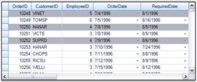' | markdownify }}
{:.image }

> {{ '' | markdownify }}
{:.image }
_Note: For more details, refer to the following browser sample:_

> _<Install Location>\Syncfusion\EssentialStudio\[Version Number]\Windows\Grid.Grouping.Windows\Samples\Selection\Record Range Selection Demo_

RecordSelection with NestedTables

When nested tables are used, you can extend record selection mechanisms to each of the child table by accessing SelectedRecords collection of the desired child table.

[C#]

//For Parent Table.

Record r1 = this.gridGroupingControl1.Table.Records[1];

Record r2 = this.gridGroupingControl1.Table.Records[2];

Table t = this.gridGroupingControl1.Table;

t.SelectedRecords.Add(r1);

t.SelectedRecords.Add(r2);

t.SelectedRecords.Add(r3);

//For Child Table.

Record cr1 = this.gridGroupingControl1.GetTable("Orders").Records[7];

Record cr2 = this.gridGroupingControl1.GetTable("Orders").Records[12];

this.gridGroupingControl1.GetTable("Orders").SelectedRecords.Add(or1);

this.gridGroupingControl1.GetTable("Orders").SelectedRecords.Add(or2);

[VB.NET]

'For Parent Table.

Dim r1 As Record = Me.gridGroupingControl1.Table.Records(1)

Dim r2 As Record = Me.gridGroupingControl1.Table.Records(2)

Dim t As Table = Me.gridGroupingControl1.Table

t.SelectedRecords.Add(r1)

t.SelectedRecords.Add(r2)

t.SelectedRecords.Add(r3)

'For Child Table.

Dim cr1 As Record = Me.gridGroupingControl1.GetTable("Orders").Records(7)

Dim cr2 As Record = Me.gridGroupingControl1.GetTable("Orders").Records(12)

Me.gridGroupingControl1.GetTable("Orders").SelectedRecords.Add(or1)

Me.gridGroupingControl1.GetTable("Orders").SelectedRecords.Add(or2)

{{ '' | markdownify }}
{:.image }

Record Search

To search for a particular record, SelectedRecords collection provides a method called FindRecord(). This method searches for the occurrences of the specified record and returns a zero-based index of the occurrence found. If there is no such record, then returns -1. It comes in two versions: one accepts the whole record as its parameter and the other accepts the position of the record in the underlying datasource.

[C#]

Record rec = this.gridGroupingControl1.Table.Records[2];

//Searches for the record 'rec'.

int index = this.gridGroupingControl1.Table.SelectedRecords.FindRecord(rec);

//Searches for the record with index 2.

int index2 = this.gridGroupingControl1.Table.SelectedRecords.FindRecord(2);

[VB.NET]

Dim rec As Record = Me.gridGroupingControl1.Table.Records(2)

'Searches for the record 'rec'.

Dim index As Integer = Me.gridGroupingControl1.Table.SelectedRecords.FindRecord(rec)

'Searches for the record with index 2.

Dim index2 As Integer = Me.gridGroupingControl1.Table.SelectedRecords.FindRecord(2)

Removing a RecordSelection

A record can be removed from the SelectedRecords collection by using the methods Remove() and RemoveAt(). A call to Remove() requires you to specify the whole record as parameter. In case if you know only the record index, you could then make use of RemoveAt(). Both the methods remove the specified record from the collection and mark it as deselect.

[C#]

Record rec = this.gridGroupingControl1.Table.Records[2];

//Removes the record 'rec'.

this.gridGroupingControl1.Table.SelectedRecords.Remove(rec);

//Removes the record at the index 2.

this.gridGroupingControl1.Table.SelectedRecords.RemoveAt(2);

[VB.NET]

Dim rec As Record = Me.gridGroupingControl1.Table.Records(2)

'Removes the record 'rec'.

Me.gridGroupingControl1.Table.SelectedRecords.Remove(rec)

'Removes the record at the index 2.

Me.gridGroupingControl1.Table.SelectedRecords.RemoveAt(2)

Clear Selection

To remove all the selections from the grid, you can call SelectedRecords.Clear() method that removes all the elements from the collection and marks them as deselect.

[C#]

this.gridGroupingControl1.Table.SelectedRecords.Clear();

[VB.NET]

Me.gridGroupingControl1.Table.SelectedRecords.Clear()

> {{ '' | markdownify }}
{:.image }
_Note: For more details, refer to the following browser sample:_

> _<Install Location>\Syncfusion\EssentialStudio\[Version Number]\Windows\Grid.Grouping.Windows\Samples\Selection\Record Range Selection Demo_

###### Selected Ranges Collection

The selections made by the user are saved into a collection named TableModel.SelectedRanges. If the Selection option is turned on, then the grid will always listen to the selections that are being made and records all those selections into the SelectedRanges collection. You can loop through every selection range of this collection to get the information about the records. The SelectedRanges.ActiveRange property gives the current selection range (i.e. last range in the collection).

Example

This example shows how to loop through SelectedRanges collection to retrieve information about the records that are being selected.

1. Turn on any type of selection. Here the record-based selection is active. It is enabled by setting ListBoxSelectionMode property to a value other than None. You could set the selection colors as well.

[C#]

this.gridGroupingControl1.TableOptions.ListBoxSelectionMode = SelectionMode.MultiExtended;

this.gridGroupingControl1.TableOptions.ListBoxSelectionColorOptions = GridListBoxSelectionColorOptions.DrawAlphablend;

this.gridGroupingControl1.TableModel.Options.AlphaBlendSelectionColor = Color.Red;

[VB.NET]

Me.gridGroupingControl1.TableOptions.ListBoxSelectionMode = SelectionMode.MultiExtended

Me.gridGroupingControl1.TableOptions.ListBoxSelectionColorOptions = GridListBoxSelectionColorOptions.DrawAlphablend

Me.gridGroupingControl1.TableModel.Options.AlphaBlendSelectionColor = Color.Red

2. The code below loops through the ranges of all the selections and writes the record values that have been selected to a listbox control. 

[C#]

foreach (GridRangeInfo range in gridGroupingControl1.TableModel.SelectedRanges)

{

    if (range.IsRows)

    {

        for (int i = range.Top; i <= range.Bottom; i++)

        {

            Record rec = gridGroupingControl1.Table.DisplayElements[i].GetRecord();

            listBox1.Items.Add(rec.ToString());

        }

    }

}

[VB.NET]

For Each range As GridRangeInfo In gridGroupingControl1.TableModel.SelectedRanges

If range.IsRows Then

Dim i As Integer = range.Top

Do While i <= range.Bottom

Dim rec As Record = gridGroupingControl1.Table.DisplayElements(i).GetRecord()

listBox1.Items.Add(rec.ToString())

i += 1

Loop

End If

Next range

3. Here is a sample screenshot.

{{ '' | markdownify }}
{:.image }

##### Serialization

In this section, we will discuss how to serialize and deserialize grouping grid schema information. Serialization is the process of saving the object state into a stream of bytes for further use. The reverse process is Deserialization. Through serialization, the objects are made portable so that they can be serialized at one end and then transferred to the other end of a network where they will again be deserialized into its original form for use.

Grid Grouping control supports two forms of serialization.

###### XML Serialization

With XmlSerialization, the grid schema information can be converted into XML format. Grouping Grid provides two methods to support Xml Serialization.

* WriteXmlSchema - It writes the engine settings into an XML stream(Serialization).
* ApplyXmlSchema - It loads the engine settings from an XML stream(Deserialization).

All the grid elements can be serialized. Not only the data, but also the look and feel of the grid can be serialized and deserialized. The following code example best illustrates this process.

Example

1. Setup a grouping grid and load it with some data. Save the initial state of the grid schema so that it could be used to reset the grid. 

[C#]

//Knows the initial state.

System.IO.MemoryStream stream;

stream = new System.IO.MemoryStream();

this.gridGroupingControl1.WriteXmlSchema(new XmlTextWriter(stream, null));

[VB.NET]

' Knows the initial state.

Private stream As System.IO.MemoryStream

stream = New System.IO.MemoryStream()

Me.gridGroupingControl1.WriteXmlSchema(New XmlTextWriter(stream, Nothing))

2. Apply the look and feel properties that you desire.

[C#]

//Customizes the Appearance.

this.gridGroupingControl1.TableOptions.GridVisualStyles = GridVisualStyles.Office2007Blue;

this.gridGroupingControl1.TableOptions.GridLineBorder = new GridBorder(GridBorderStyle.Solid, Color.FromArgb(208, 215, 229), GridBorderWeight.Thin);

this.gridGroupingControl1.TopLevelGroupOptions.ShowCaption = false;

this.gridGroupingControl1.Appearance.AnyCell.Font.Facename = "Verdana";

this.gridGroupingControl1.Appearance.AnyCell.TextColor = Color.MidnightBlue;

this.gridGroupingControl1.TableDescriptor.Appearance.AlternateRecordFieldCell.Interior = new BrushInfo(Color.Orange);

[VB.NET]

'Customizes the Appearance.

Me.gridGroupingControl1.TableOptions.GridVisualStyles = GridVisualStyles.Office2007Blue

Me.gridGroupingControl1.TableOptions.GridLineBorder = New GridBorder(GridBorderStyle.Solid, Color.FromArgb(208, 215, 229), GridBorderWeight.Thin)

Me.gridGroupingControl1.TopLevelGroupOptions.ShowCaption = False

Me.gridGroupingControl1.Appearance.AnyCell.Font.Facename = "Verdana"

Me.gridGroupingControl1.Appearance.AnyCell.TextColor = Color.MidnightBlue

Me.gridGroupingControl1.TableDescriptor.Appearance.AlternateRecordFieldCell.Interior = New BrushInfo(Color.Orange)

3. Create a button name 'Serialize', clicking which will start the serialization process. Add the code below into the ButtonClick event handler. This will save the grid schema into an XML file.

[C#]

//Serializes.

private void Serialize_Click(object sender, System.EventArgs e)

{

    FileDialog dlg = new SaveFileDialog();

    dlg.AddExtension = true;

    dlg.Filter = "xml files (*.xml)|*.xml|All files (*.*)|*.*";

    if (dlg.ShowDialog() == DialogResult.OK)

    {

        XmlTextWriter xw = new XmlTextWriter(dlg.FileName, System.Text.Encoding.UTF8);

        xw.Formatting = System.Xml.Formatting.Indented;

        this.gridGroupingControl1.WriteXmlSchema(xw);

        xw.Close();

    }

}

[VB.NET]

'Serializes.

Private Sub Serialize_Click(ByVal sender As Object, ByVal e As System.EventArgs) Handles btnSaveXmlSchema.Click

Dim dlg As FileDialog = New SaveFileDialog()

dlg.AddExtension = True

dlg.Filter = "xml files (*.xml)|*.xml|All files (*.*)|*.*"

If dlg.ShowDialog() = DialogResult.OK Then

Dim xw As XmlTextWriter = New XmlTextWriter(dlg.FileName, System.Text.Encoding.UTF8)

xw.Formatting = System.Xml.Formatting.Indented

Me.gridGroupingControl1.WriteXmlSchema(xw)

xw.Close()

End If

End Sub

4. Create another button named 'Deserialize' to deserialize the grid. The following code will help you to load the grid schema back from an XML file.

[C#]

//Deserializes.

private void btnLoadXmlSchema_Click(object sender, System.EventArgs e)

{

    FileDialog dlg = new OpenFileDialog();

    dlg.Filter = "xml files (*.xml)|*.xml|All files (*.*)|*.*";

    if (dlg.ShowDialog() == DialogResult.OK)

    {

        XmlReader xr = new XmlTextReader(dlg.FileName);

        this.gridGroupingControl1.ApplyXmlSchema(xr);

        xr.Close();

    }

}

[VB.NET]

'Deserializes.

Private Sub btnLoadXmlSchema_Click(ByVal sender As Object, ByVal e As System.EventArgs) Handles btnLoadXmlSchema.Click

Dim dlg As FileDialog = New OpenFileDialog()

dlg.Filter = "xml files (*.xml)|*.xml|All files (*.*)|*.*"

If dlg.ShowDialog() = DialogResult.OK Then

Dim xr As XmlReader = New XmlTextReader(dlg.FileName)

gridGroupingControl1.ApplyXmlSchema(xr);

xr.Close()

End If

End Sub

5. Create a third button named 'Reset', which will reset the look and feel of the grid.

[C#]

//Resets Grid.

private void reset_Click(object sender, System.EventArgs e)

{

    System.IO.MemoryStream stream2 = new System.IO.MemoryStream(stream.ToArray());

    this.gridGroupingControl1.ApplyXmlSchema(new XmlTextReader(stream2));

}

[VB.NET]

'Resets Grid.

Private Sub reset_Click(ByVal sender As Object, ByVal e As System.EventArgs) Handles reset.Click

Dim stream2 As System.IO.MemoryStream = New System.IO.MemoryStream(stream.ToArray())

Me.gridGroupingControl1.ApplyXmlSchema(New XmlTextReader(stream2))

End Sub

6. While running the sample, click Serialize button and save the grid schema into an XML file. Then click Reset button to switch the grid to its default state. It removes all the appearance settings done in the first step. You can also make changes in the TableDescriptor of the grid manually like rearranging columns through drag and drop so that after reloading the grid schema, you would notice that the entire grid schema has been serialized. Reloading will transform the grouping grid back to the state before serialization.

{{ '' | markdownify }}
{:.image }

{{ '' | markdownify }}
{:.image }

{{ '' | markdownify }}
{:.image }

> {{ '' | markdownify }}
{:.image }
_Note: For more details, refer to the following browser samples:_

> _<Install Location>\Syncfusion\EssentialStudio\[Version Number]\Windows\Grid.Grouping.Windows\Samples\Serialization\XML Serialization Demo_

> _<Install Location>\Syncfusion\EssentialStudio\[Version Number]\Windows\Grid.Grouping.Windows\Samples\Serialization\Employee View Demo_

Saving and Restoring Look and Feel Properties

You can save, look, and feel properties in XML format. This will allow you to design a basic look and feel to use with all your Grid Grouping controls, and then easily apply this look and feel to new grids at design-time or runtime.

It can be done in the following ways.

* Through Verbs 
* Through Code

Through Verbs

The verbs "Save Look and Feel" and "Choose Look and Feel" that are found at the bottom of the property grid of Grid Grouping control will allow you to easily accomplish this task. Use the Save verb to save Look and Feel properties of the current Grid Grouping control. Then use Choose verb to apply the saved settings to a different control.

{{ '' | markdownify }}
{:.image }

Through Code

To apply the Look and Feel properties saved as XML at runtime, simply call ApplyXmlLookandFeel method. For example, the code below shows the code that is necessary to load such a file in the form's constructor.

[C#]

public Form1()

{

    System.Xml.XmlReader xr = new System.Xml.XmlReader("BaseLandF.xml");

    this.gridGroupingControl1.ApplyXmlLookAndFeel(xr);

}

[VB.NET]

Public Sub New()

Dim xr As System.Xml.XmlReader = New System.Xml.XmlReader("BaseLandF.xml")

Me.gridGroupingControl1.ApplyXmlLookAndFeel(xr)

End Sub

###### Excel Export

Export to Excel is one of the most common functionalities required in the .Net world. The Essential Grid Control has in-built support for Excel Export. Users can download data from the Grouping Grid control into an Excel spreadsheet for offline verification and/or computation. This can be achieved by making use of the GroupingGridExcelConverter class. This section will walk you through the conversion of the contents of grid to an excel file as well as discuss various converter options.

GroupingGridExcelConverter class derives from GridExcelConverterBase. It contains a number of methods that helps in exporting different components of the grouping grid. Its properties will let you control the export of grid schema like styles and grid elements. You will be able to export Styles, RecordPlusMinus, GroupCaptionPlusMinus, Borders and PreviewRows as well.

ConverterOptions

Exporting of a Grouping Grid to Excel has two options: Visible and Default. Visible option will allow you to export only the visible contents of the grid, whereas Default option exports the entire elements of the grouping grid. Converter options are defined in GridExcelConverter.ConverterOptions enumeration.

The following table lists the properties offered by Grouping Grid Excel Converter. By setting these properties, you would be able to choose the elements you need to export.

_Table 107: Grouping Grid Excel Converter properties_

<table>
<tr>
<td>
PROPERTIES</td><td>
DESCRIPTION</td></tr>
<tr>
<td>
ExportBorders</td><td>
Specifies if borders should be exported.</td></tr>
<tr>
<td>
ExportStyle</td><td>
Indicates if style should be exported.</td></tr>
<tr>
<td>
ExportGroupPlusMinus</td><td>
Specifies if GridGroup should be exported as Excel Group.</td></tr>
<tr>
<td>
ExportRecordPlusMinus</td><td>
When true, the record with related tables will be exported as Excel Group.</td></tr>
<tr>
<td>
ExportPreviewRows</td><td>
When enabled, PreviewRows will be exported.</td></tr>
<tr>
<td>
CaptionBackColor</td><td>
Specifies the color to be used for Caption in the worksheet.</td></tr>
<tr>
<td>
HeaderBackColor</td><td>
Indicates the color to be used for Header in the worksheet.</td></tr>
</table>

Method

Grouping Grid Excel Converter control provides a method called GroupingGridToExcel. This is the method that converts grouping grid contents to an excel file. It accepts three parameters: grouping grid to be converted, filename of the destination worksheet, and convert options.

Syntax

[C#]

GroupingGridExcelConverterControl converter = new GroupingGridExcelConverterControl();

converter.GroupingGridToExcel(this.gridGroupingControl1, "Grid.xls", ConverterOptions.Visible);

[VB.NET]

Dim converter As GroupingGridExcelConverter = New GroupingGridExcelConverter()

converter.GroupingGridToExcel(Me.gridGroupingControl1, "Grid.xls", ConverterOptions.Visible)

Events

QueryExportPreviewRowInfo is an event offered by the Grouping Grid Excel Converter control that aids in the conversion process. It occurs for each PreviewRow element before exporting the grid and letting you customize the preview row. It accepts two parameters: one contains the Element to export and the other the GridStyleInfo object representing style information.

Syntax

[C#]

GroupingGridExcelConverter converter  = new GroupingGridExcelConverter();

converter.QueryExportPreviewRowInfo += new GroupingGridExcelConverterControl.GroupingGridExportPreviewRowQueryInfoEventHandler(converter_QueryExportPreviewRowInfo);

void converter_QueryExportPreviewRowInfo(object sender, GroupingGridExportPreviewRowQueryInfoEventArgs e)

{

}

[VB.NET]

Dim converter As GroupingGridExcelConverter  = New GroupingGridExcelConverter()

AddHandler converter.QueryExportPreviewRowInfo, AddressOf converter_QueryExportPreviewRowInfo

Private Sub converter_QueryExportPreviewRowInfo(ByVal sender As Object, ByVal e As GroupingGridExportPreviewRowQueryInfoEventArgs)

End Sub

Implementation

Here is an example that illustrates the conversion of a grouping grid to an Excel file.

4. 1. Include the required namespaces.

[C#]

using Syncfusion.XlsIO;

using Syncfusion.GridExcelConverter;

using Syncfusion.GroupingGridExcelConverter;

using Syncfusion.Grouping;

using Syncfusion.Windows.Forms.Grid;

using Syncfusion.Windows.Forms.Grid.Grouping;

[VB.NET]

Imports Syncfusion.XlsIO

Imports Syncfusion.GridExcelConverter

Imports Syncfusion.GroupingGridExcelConverter

Imports Syncfusion.Grouping

Imports Syncfusion.Windows.Forms.Grid

Imports Syncfusion.Windows.Forms.Grid.Grouping

5. 2.Setup an hierarchical datasource.

[C#]

private int numberParentRows = 50;

private int numberChildRows = 200;

private int numberGrandChildRows = 500;

private DataTable GetParentTable()

{

    DataTable dt = new DataTable("ParentTable");

    dt.Columns.Add(new DataColumn("parentID"));

    dt.Columns.Add(new DataColumn("ParentName"));

    dt.Columns.Add(new DataColumn("GroupID"));

    Random r = new Random();

    for (int i = 0; i < numberParentRows; i++)

    {

        DataRow dr = dt.NewRow();

        dr[0] = i;

        dr[1] = string.Format("parentName{0}", i);

        dr[2] = r.Next(99, 111);

        dt.Rows.Add(dr);

    }

    return dt;

}

private DataTable GetChildTable()

{

    DataTable dt = new DataTable("ChildTable");

    dt.Columns.Add(new DataColumn("childID"));

    dt.Columns.Add(new DataColumn("Name"));

    dt.Columns.Add(new DataColumn("ParentID"));

    dt.Columns.Add(new DataColumn("ChildGroupID"));

    Random r = new Random();

    for (int i = 0; i < numberChildRows; i++)

    {

        DataRow dr = dt.NewRow();

        dr[0] = i.ToString();

        dr[1] = string.Format("ChildName{0}", i);

        dr[2] = (i % numberParentRows).ToString();

        dr[3] = r.Next(994, 1006);

        dt.Rows.Add(dr);

    }

    return dt;

}

[VB.NET]

Private numberParentRows As Integer = 50

Private numberChildRows As Integer = 200

Private numberGrandChildRows As Integer = 500

Private Function GetParentTable() As DataTable

Dim dt As DataTable = New DataTable("ParentTable")

dt.Columns.Add(New DataColumn("parentID"))

dt.Columns.Add(New DataColumn("ParentName"))

dt.Columns.Add(New DataColumn("GroupID"))

Dim r As Random = New Random()

Dim i As Integer = 0

Do While i < numberParentRows

Dim dr As DataRow = dt.NewRow()

dr(0) = i

dr(1) = String.Format("parentName{0}", i)

dr(2) = r.Next(99, 111)

dt.Rows.Add(dr)

i += 1

Loop

Return dt

End Function

Private Function GetChildTable() As DataTable

Dim dt As DataTable = New DataTable("ChildTable")

dt.Columns.Add(New DataColumn("childID"))

dt.Columns.Add(New DataColumn("Name"))

dt.Columns.Add(New DataColumn("ParentID"))

dt.Columns.Add(New DataColumn("ChildGroupID"))

Dim r As Random = New Random()

Dim i As Integer = 0

Do While i < numberChildRows

Dim dr As DataRow = dt.NewRow()

dr(0) = i.ToString()

dr(1) = String.Format("ChildName{0}", i)

dr(2) = (i Mod numberParentRows).ToString()

dr(3) = r.Next(994, 1006)

dt.Rows.Add(dr)

i += 1

Loop

Return dt

End Function

6. 3.Setup a grouping grid and load it with data from data source. Customize the grid by adding preview rows, groups, etc., as required.

[C#]

DataTable parentTable = GetParentTable();

DataTable childTable = GetChildTable();

//Adds Summary row to parent table.

GridSummaryColumnDescriptor gridSummaryColumnDescriptor = new GridSummaryColumnDescriptor();

gridSummaryColumnDescriptor.DisplayColumn = "GroupID";

gridSummaryColumnDescriptor.Format = "  {Count} Records.";

gridSummaryColumnDescriptor.Name = "SummaryColumn";

gridSummaryColumnDescriptor.SummaryType = SummaryType.Count;

this.gridGroupingControl1.TableDescriptor.SummaryRows.Add(new GridSummaryRowDescriptor("SummaryRow", new GridSummaryColumnDescriptor[] {gridSummaryColumnDescriptor}));

//Manually specify relations in grouping engine.

GridRelationDescriptor parentToChildRelationDescriptor = new GridRelationDescriptor();

parentToChildRelationDescriptor.ChildTableName = "MyChildTable";// same as SourceListSetEntry.Name for childTable 

parentToChildRelationDescriptor.RelationKind = RelationKind.RelatedMasterDetails;

parentToChildRelationDescriptor.RelationKeys.Add("parentID", "ParentID");

//Adds Summary Row to child table.

gridSummaryColumnDescriptor = new GridSummaryColumnDescriptor();

gridSummaryColumnDescriptor.DisplayColumn = "ChildGroupID";

gridSummaryColumnDescriptor.Format = "  {Count} Records.";

gridSummaryColumnDescriptor.Name = "SummaryColumn";

gridSummaryColumnDescriptor.SummaryType = SummaryType.Count;

parentToChildRelationDescriptor.ChildTableDescriptor.SummaryRows.Add(new GridSummaryRowDescriptor("SummaryRow", new Syncfusion.Windows.Forms.Grid.Grouping.GridSummaryColumnDescriptor[] {gridSummaryColumnDescriptor}));

//Adds relation to parent table.

gridGroupingControl1.TableDescriptor.Relations.Add(parentToChildRelationDescriptor);

//Registers any DataTable/IList with SourceListSet, so that RelationDescriptor can resolve the name

this.gridGroupingControl1.Engine.SourceListSet.Add("MyParentTable", parentTable);

this.gridGroupingControl1.Engine.SourceListSet.Add("MyChildTable", childTable);

this.gridGroupingControl1.DataSource = parentTable;

this.gridGroupingControl1.ShowGroupDropArea = true;

this.gridGroupingControl1.AddGroupDropArea("MyChildTable");

//The TrackWidthOfParentColumn property of a column descriptor ensures that 

//columns are aligned and synchronized. 

this.gridGroupingControl1.TableDescriptor.Columns[0].Width = 200;

this.gridGroupingControl1.TableDescriptor.Columns[1].Width = 150;

this.gridGroupingControl1.TableDescriptor.Columns[2].Width = 150;

//Synchronizes width of columns in child record with width of column in parent record.

for(int n=0;n<3;n++)

parentToChildRelationDescriptor.ChildTableDescriptor.Columns[n].TrackWidthOfParentColumn = gridGroupingControl1.TableDescriptor.Columns[n].Name;

this.gridGroupingControl1.TableDescriptor.GroupedColumns.Add("GroupID");

this.gridGroupingControl1.TableOptions.ShowRecordPreviewRow = true;

this.gridGroupingControl1.ChildGroupOptions.ShowGroupPreview = true;

this.gridGroupingControl1.TableDescriptor.Columns["GroupID"].Appearance.AnyHeaderCell.HorizontalAlignment = GridHorizontalAlignment.Right;

this.gridGroupingControl1.TableDescriptor.Columns["GroupID"].Appearance.AnyHeaderCell.VerticalAlignment = GridVerticalAlignment.Bottom;

this.gridGroupingControl1.Appearance.AnySummaryCell.Interior = new BrushInfo(Color.FromArgb(255, 231, 162));

//Hooks up this event to handle preview rows.

this.gridGroupingControl1.QueryCellStyleInfo += new GridTableCellStyleInfoEventHandler(gridGroupingControl1_QueryCellStyleInfo);

Private Sub gridGroupingControl1_QueryCellStyleInfo(ByVal sender As Object, ByVal e As GridTableCellStyleInfoEventArgs)

If e.TableCellIdentity.TableCellType = GridTableCellType.RecordPreviewCell Then

Dim el As Element = e.TableCellIdentity.DisplayElement

e.Style.CellValue = "Preview notes for Record (" & el.ParentTableDescriptor.Fields(0).Name & ": " & el.ParentRecord.GetValue(el.ParentTableDescriptor.Fields(0).Name) & ")"

End If

If e.TableCellIdentity.TableCellType = GridTableCellType.GroupPreviewCell Then

Dim el As Element = e.TableCellIdentity.DisplayElement

e.Style.CellValue = "Preview notes for Group (" & el.ParentGroup.Name & ": " & el.ParentGroup.Category.ToString() & ")"

End If

End Sub

[VB.NET]

Dim parentTable As DataTable = GetParentTable()

Dim childTable As DataTable = GetChildTable()

'Adds Summary row to parent table.

Dim gridSummaryColumnDescriptor As New GridSummaryColumnDescriptor()

gridSummaryColumnDescriptor.DisplayColumn = "GroupID"

gridSummaryColumnDescriptor.Format = "  {Count} Records."

gridSummaryColumnDescriptor.Name = "SummaryColumn"

gridSummaryColumnDescriptor.SummaryType = SummaryType.Count

Me.gridGroupingControl1.TableDescriptor.SummaryRows.Add(New GridSummaryRowDescriptor("SummaryRow", New GridSummaryColumnDescriptor() {gridSummaryColumnDescriptor}))

'Manually specify relations in grouping engine.

Dim parentToChildRelationDescriptor As New GridRelationDescriptor()

parentToChildRelationDescriptor.ChildTableName = "MyChildTable" ' same as SourceListSetEntry.Name for childTable

parentToChildRelationDescriptor.RelationKind = RelationKind.RelatedMasterDetails

parentToChildRelationDescriptor.RelationKeys.Add("parentID", "ParentID")

'Adds Summary Row to child table.

gridSummaryColumnDescriptor = New GridSummaryColumnDescriptor()

gridSummaryColumnDescriptor.DisplayColumn = "ChildGroupID"

gridSummaryColumnDescriptor.Format = "  {Count} Records."

gridSummaryColumnDescriptor.Name = "SummaryColumn"

gridSummaryColumnDescriptor.SummaryType = SummaryType.Count

parentToChildRelationDescriptor.ChildTableDescriptor.SummaryRows.Add(New GridSummaryRowDescriptor("SummaryRow", New Syncfusion.Windows.Forms.Grid.Grouping.GridSummaryColumnDescriptor() {gridSummaryColumnDescriptor}))

'Adds relation to parent table.

gridGroupingControl1.TableDescriptor.Relations.Add(parentToChildRelationDescriptor)

'Registers any DataTable/IList with SourceListSet, so that RelationDescriptor can resolve the name

Me.gridGroupingControl1.Engine.SourceListSet.Add("MyParentTable", parentTable)

Me.gridGroupingControl1.Engine.SourceListSet.Add("MyChildTable", childTable)

Me.gridGroupingControl1.DataSource = parentTable

Me.gridGroupingControl1.ShowGroupDropArea = True

Me.gridGroupingControl1.AddGroupDropArea("MyChildTable")

'The TrackWidthOfParentColumn property of a column descriptor ensures that 

'columns are aligned and synchronized. 

Me.gridGroupingControl1.TableDescriptor.Columns(0).Width = 200

Me.gridGroupingControl1.TableDescriptor.Columns(1).Width = 150

Me.gridGroupingControl1.TableDescriptor.Columns(2).Width = 150

'Synchronizes width of columns in child record with width of column in parent record.

For n As Integer = 0 To 2

parentToChildRelationDescriptor.ChildTableDescriptor.Columns(n).TrackWidthOfParentColumn = gridGroupingControl1.TableDescriptor.Columns(n).Name

Next n

Me.gridGroupingControl1.TableDescriptor.GroupedColumns.Add("GroupID")

Me.gridGroupingControl1.TableOptions.ShowRecordPreviewRow = True

Me.gridGroupingControl1.ChildGroupOptions.ShowGroupPreview = True

Me.gridGroupingControl1.TableDescriptor.Columns("GroupID").Appearance.AnyHeaderCell.HorizontalAlignment = GridHorizontalAlignment.Right

Me.gridGroupingControl1.TableDescriptor.Columns("GroupID").Appearance.AnyHeaderCell.VerticalAlignment = GridVerticalAlignment.Bottom

Me.gridGroupingControl1.Appearance.AnySummaryCell.Interior = New BrushInfo(Color.FromArgb(255, 231, 162))

'Hooks up this event to handle preview rows.

AddHandler gridGroupingControl1.QueryCellStyleInfo, AddressOf gridGroupingControl1_QueryCellStyleInfo

private void gridGroupingControl1_QueryCellStyleInfo(Object sender,GridTableCellStyleInfoEventArgs e)

If e.TableCellIdentity.TableCellType = GridTableCellType.RecordPreviewCell Then

Dim el As Element = e.TableCellIdentity.DisplayElement

e.Style.CellValue = "Preview notes for Record (" & el.ParentTableDescriptor.Fields(0).Name & ": " & el.ParentRecord.GetValue(el.ParentTableDescriptor.Fields(0).Name) & ")"

End If

If e.TableCellIdentity.TableCellType = GridTableCellType.GroupPreviewCell Then

Dim el As Element = e.TableCellIdentity.DisplayElement

e.Style.CellValue = "Preview notes for Group (" & el.ParentGroup.Name & ": " & el.ParentGroup.Category.ToString() & ")"

End Sub

7. 4.Set up a Grouping Grid Excel Converter and choose the elements you want to export by setting the appropriate properties.

[C#]

GroupingGridExcelConverterControl converter = new GroupingGridExcelConverterControl();

converter.ExportBorders = true;

converter.ExportGroupPlusMinus = true;

converter.ExportPreviewRows = true;

converter.ExportRecordPlusMinus = true;

converter.ExportStyle = true;

converter.HeaderBackColor = Color.Orange;

converter.CaptionBackColor = Color.Lavender;

[VB.NET]

Dim converter As GroupingGridExcelConverterControl = New GroupingGridExcelConverterControl()

converter.ExportBorders = True

converter.ExportGroupPlusMinus = True

converter.ExportPreviewRows = True

converter.ExportRecordPlusMinus = True

converter.ExportStyle = True

converter.HeaderBackColor = Color.Orange

converter.CaptionBackColor = Color.Lavender

8. 5.Handle the QueryExportPreviewRowInfo event to customize preview rows before export.

[C#]

converter.QueryExportPreviewRowInfo += new GroupingGridExcelConverterControl.GroupingGridExportPreviewRowQueryInfoEventHandler(converter_QueryExportPreviewRowInfo);

void converter_QueryExportPreviewRowInfo(object sender, GroupingGridExportPreviewRowQueryInfoEventArgs e)

{

    if (e.Element.Kind == DisplayElementKind.GroupPreview)

    {

        Element el = e.Element;

        e.Style.CellValue = "Preview notes for Group (" + el.ParentGroup.Name + ": " + el.ParentGroup.Category.ToString() + ")";

        e.Style.BackColor = Color.MistyRose;

        e.Handled = true;

    }

    if (e.Element.Kind == DisplayElementKind.RecordPreview)

    {

        Element el = e.Element;

        e.Style.CellValue = "Preview notes for Record (" + el.ParentTableDescriptor.Fields[0].Name + ": " +                                       el.ParentRecord.GetValue(el.ParentTableDescriptor.Fields[0].Name) + ")";

        e.Style.BackColor = Color.MistyRose;

        e.Handled = true;

    }

}

[VB.NET]

AddHandler converter.QueryExportPreviewRowInfo, AddressOf converter_QueryExportPreviewRowInfo)

Private Sub converter_QueryExportPreviewRowInfo(ByVal sender As Object, ByVal e As GroupingGridExportPreviewRowQueryInfoEventArgs)

If e.Element.Kind = DisplayElementKind.GroupPreview Then

Dim el As Element = e.Element

e.Style.CellValue = "Preview notes for Group (" & el.ParentGroup.Name & ": " & el.ParentGroup.Category.ToString() & ")"

e.Style.BackColor = Color.MistyRose

e.Handled = True

End If

If e.Element.Kind = DisplayElementKind.RecordPreview Then

Dim el As Element = e.Element

e.Style.CellValue = "Preview notes for Record (" & el.ParentTableDescriptor.Fields(0).Name & ": " & el.ParentRecord.GetValue(el.ParentTableDescriptor.Fields(0).Name) & ")"

e.Style.BackColor = Color.MistyRose

e.Handled = True

End If

End Sub

9. 6.Export the grouping grid to an Excel file. 

[C#]

converter.GroupingGridToExcel(this.gridGroupingControl1, "ExcelGrid.xls", ConverterOptions.Default);

[VB.NET]

converter.GroupingGridToExcel(Me.gridGroupingControl1, "ExcelGrid.xls", ConverterOptions.Default)

Here are screen shots showing grouping grid and the exported grid in Excel file.

{{ '' | markdownify }}
{:.image }

{{ '' | markdownify }}
{:.image }

> {{ '' | markdownify }}
{:.image }
_Note: For more details, refer to the following browser sample:_

> _<Install Location>\Syncfusion\EssentialStudio\[Version Number]\Windows\Grid.Grouping.Windows\Samples\Exporting\Excel Export Demo_

###### Word Converter

Export to Word is one of the most common functionalities that is required in the .NET world. Essential Grid Control has in-built support for Word Export. Users can download data from the Grouping Grid control into a Word document for offline verification and/or computation. This can be achieved by making use of GroupingGridWordConverter class. This section will walk you through the conversion of the contents of the grid to a word file as well as discuss the various converter options.

GroupingGridWordConverter class derives from GridWordConverterBase. It contains a number of methods that helps in exporting different components of the grouping grid. You can export NestedTables as well.

The following table lists the properties offered by Grouping Grid Word Converter. By setting these properties, you can choose the elements you need to export.

_Table 108: Properties_

<table>
<tr>
<td>
PROPERTIES</td><td>
DESCRIPTION</td></tr>
<tr>
<td>
ShowHeader</td><td>
Specifies if header should be displayed.</td></tr>
<tr>
<td>
ShowFooter</td><td>
Specifies if footer should be displayed.</td></tr>
</table>

Method

Grouping Grid Word Converter control provides a method called GroupingGridToWord. This is the method that does the conversion of grouping grid contents to a word file. It accepts two parameters: grouping grid to be converted and filename of the destination Word document.

Syntax

[C#]

GroupingGridWordConverter converter = new GroupingGridWordConverter();

converter.GroupingGridToWord("Grid.doc", this.gridGroupingControl1);

[VB.NET]

Dim converter As GroupingGridWordConverter = New GroupingGridWordConverter()

converter.GroupingGridToWord("Grid.doc", Me.gridGroupingControl1)

Events

DrawHeader and DrawFooter are the events offered by Grouping Grid Word Converter that aids in adding as well as customizing header and footer in the destination Word document. 

Sample Output

The images below depict the conversion of grid content to a Word file.

{{ '' | markdownify }}
{:.image }

{{ '' | markdownify }}
{:.image }

> {{ '' | markdownify }}
{:.image }
_Note: For more details, refer to the following browser sample:_

> _<Install Location>\Syncfusion\EssentialStudio\[Version Number]\Windows\Grid.Grouping.Windows\Samples\Exporting\Word Converter Demo_

###### PDF Converter

PDF Export

Essential Grid Grouping control supports conversion of grid contents to a PDF file. Users can convert data from Grid Grouping control into a PDF document using GridPDFConverter class. PDF libraries are used to support conversion of grid content to a PDF page. 

To ensure convertion of grid data to PDF document, the following dll files should be added along with default dll files in the reference folder:

* Syncfusion.Pdf.Base  
* Syncfusion.GridHelperClasses.Windows

ExportToPdf method should be used to export the grid to a PDF file. 

The following code example illustrates the conversion of grid data to PDF document.

[C#]

GridPDFConverter pdfConvertor = new GridPDFConverter();

pdfConvertor.ExportToPdf("Sample.pdf", this.gridGroupingControl1.TableControl);

//Launches PDF file by using default Application [Acrobat Reader].

System.Diagnostics.Process.Start("Sample.pdf");

[VB.NET]

Dim pdfConvertor As GridPDFConverter = New GridPDFConverter()

pdfConvertor.ExportToPdf("Sample.pdf", Me.gridGroupingControl1.TableControl)

'Launches PDF file by using default Application [Acrobat Reader].

System.Diagnostics.Process.Start("Sample.pdf")

{{ '' | markdownify }}
{:.image }

{{ '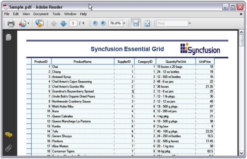' | markdownify }}
{:.image }

##### Real Time Applications

This section provides information on the realtime applications of Essential Grouping Grid. 

###### Portfolio Grid

The user can simulate Portfolio Manager application by using Essential Grid. It allows you to track all your investments and assets in stocks and mutual funds. It provides you with an insight on current market pricing that would help to plan your future investments.

{{ '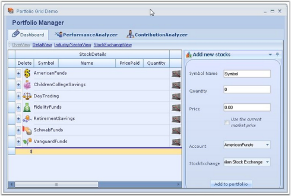' | markdownify }}
{:.image }

> {{ '' | markdownify }}
{:.image }
 _Note: For more details, refer to the following browser sample:_

> _<Install Location>\Syncfusion\EssentialStudio\[Version Number]\Windows\Grid.Grouping.Windows\Samples\Product Showcase\Portfolio Grid Demo_

Example : This sample comes with three modules whose features are explained below.

Dashboard : This is the place where you can track the status of all your investments. It comes with a variety of views: 

* Overview - Provides a consolidated view of your mutual fund holdings. You can get useful information on your investments such as rate of change per day, current market price, total returns, etc.  You have options to add or delete desired stocks. 
* Detail View - Provides a more detailed view, allowing you to get the stock details of mutual funds. 
* Industry/Sector View - Provides a consolidated view of your stock holdings. 
* Stock Exchange View - Displays details with respect to individual stock exchange. 

{{ '' | markdownify }}
{:.image }

Contribution Analyzer : This module illustrates the contributions of different stocks for every portfolio account in a graphical representation by using chart controls. Click the desired portfolio account on the left side chart to view its contributions.

{{ '' | markdownify }}
{:.image }

Performance Analyzer : This module does a performance analysis and displays the market history for the top three large cap accounts. You have options to view the history for last three months, last six months, and last year.

{{ '' | markdownify }}
{:.image }

###### Outlook 2007 Demo

You can implement Microsoft Outlook 2007-like interface by using Essential Grid Grouping control and other components from Essential Studio. Essential Grid has been extended to support all the Office 2007 themes (Blue, Black, and Silver) with the look and feel of Outlook 2007.

{{ '' | markdownify }}
{:.image }

> {{ '' | markdownify }}
{:.image }
 _Note: For more details, refer to the following browser sample:_

> _<Install Location>\Syncfusion\EssentialStudio\[Version Number]\Windows\Grid.Grouping.Windows\Samples\Product Showcase\Outlook Demo_

Example: Following are the major features of the sample.

Features

* Office 2007 themes - Blue, Black, and Silver to see the effects of the application.
* The grouping of columns in the mails display area. Right click on the column headers and select ArrangeBy in the column.
* Custom selection navigation with all arrow keys.
* Custom grouping for dates, size, priority, and flag fields.
* Dynamic formatting when narrowly switching between column-set view and normal view.
* Events when deleting records.
* Customized current view.
* Outlook appearance and functionalities.
##### Grid Designer

Grid Grouping control has strong designer support. You can control all aspects of grid's appearance through the designer. Additional commands (verbs) will let you save layouts and restore them. You can also use preview feature that will allow you load data into your control and then further set the Grid Grouping control properties that can be persisted as design-time properties.

Clicking Preview and Edit verb will allow you to view the Grid Grouping control, populated with data along with companion property grid as seen in the picture below. It also displays help description for the properties that are being selected. You can use the property grid to change Grid Grouping control's properties and see the effect immediately on the populated control. When you close the preview, you will have the option of saving any changed properties to the property grid in the designer. We will use this Preview and Edit support to see the effects of setting various TableOption properties.

{{ '' | markdownify }}
{:.image }

Grid Designer presents populated Grid Grouping control along with property grid listing out the related properties. It also includes an integrated help feature to display a brief description on the property selected. You will be able to set any kind of properties using the designer so that you can see the results immediately. Here is a brief discussion on how to work with grid elements through the designer.

Grouping

Designer provides full drag and drop capability so that you can group the records by dragging a column header and dropping it into GroupDropArea, provided the GroupDropArea is enabled by setting ShowGroupDropArea to true. Likewise you can group data against any number of columns across the tables when multiple nested tables are used.

{{ '' | markdownify }}
{:.image }

{{ '' | markdownify }}
{:.image }

You can also use TableDescriptor.GroupedColumns property to add groups where you need to specify the column names based on which the table has to be grouped.

{{ '' | markdownify }}
{:.image }

Sorting

Sorting can be done on the table data by simply clicking the desired column header by which the values need to be sorted. Once sorting is done, the grouping grid displays ListSortIcon in the respective column header to indicate Sort Direction. You could also make use of the TableDescriptor.SortedColumns property to sort table data wherein you need to provide the column to be sorted and sort order.

{{ '' | markdownify }}
{:.image }

{{ '' | markdownify }}
{:.image }

Summaries

Summaries can be added in the designer itself by accessing TableDescriptor.SummaryRows property. You can add as many summary rows as you need, each with a desired number of summary columns specifying the type of summary, summary format, the column based on whose values the summary has to be calculated and the like for each of the summary columns.

{{ '' | markdownify }}
{:.image }

{{ '' | markdownify }}
{:.image }

Record Filters

By using the TableDescriptor.RecordFilters property, you can add row filters for your grid table. Once you have specified filter criteria and column name whose values have to be checked against the given criteria, the grouping grid will display only the subset of records that satisfies the given criteria.

{{ '' | markdownify }}
{:.image }

{{ '' | markdownify }}
{:.image }

  _Figure_ _464_: Filtered Grid_

Grid Grouping control provides AutoFilterRow, which can be enabled by setting ShowFilterBar property to true. Once that is done, you must enable AllowFilter property for the desired columns to enable filtering on those columns.

{{ '' | markdownify }}
{:.image }

{{ '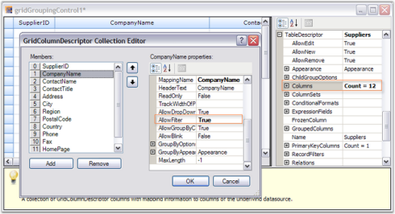' | markdownify }}
{:.image }

{{ '' | markdownify }}
{:.image }

Expression Fields

When there is a need to display calculated values based on the values on other fields in the same record, ExpressionFields would be the right choice to use. ExpressionFields can be created by using TableDescriptor.ExpressionFields property. This will open an editor wherein you can add any number of expression fields each with its own expression used to calculate the results.

{{ '' | markdownify }}
{:.image }

{{ '' | markdownify }}
{:.image }

Relations

It is possible to specify the relation to be used across the tables in case multiple tables are used. It can be done by accessing TableDescriptor.Relations property wherein you can specify the relation type, name of the child table, relation keys consisting of the keys in parent and child tables and other information necessary to setup the relation.

{{ '' | markdownify }}
{:.image }

Appearance

The appearance of every grid element can be customized by accessing Appearance property. It allows you to set GridStyleInfo properties like cell type, value, back color, font, etc. for grid cells. It holds a sub tree of different grid elements, each with its own set of formatting properties. For instance, when you want to set appearance for alternate record field cell, you can make use of Appearance.AlternateRecordFieldCell property; if you want to customize summary cells, you will have to use Appearance.SummaryFieldCell or related property.

{{ '' | markdownify }}
{:.image }

Skins

You can change the appearance and behavior of every grid element to provide grid with a rich look and feel by setting skins. Grouping Grid currently offers five such skins: Office2007Blue, Office2007Silver, Office2007Black, Office2003 and SystemTheme(Default XP theme). To set a skin, GridVisualStyles property which is under TableOptions section is used. It lists possible skin options in a drop down, which will make the entire grid redrawn with the chosen style.

{{ '' | markdownify }}
{:.image }

 _Figure_ _472_: Grid Designer displaying the possible skins in a Drop Down_

See Also

Grouping, Sorting, Summaries, Record Filters, Expression Fields, Relations, Appearance, Grid Skins

##### Navigation Bar

Grid Grouping control comes with an in-built Navigation Control that allows the user to browse through the records with ease. The navigation bar consists of buttons that facilitate navigation to first, next, previous, last records and also to the AddNew record in the grid. It also contains a label that displays the current record number together with the total record count.

NavigationBar can be enabled by setting ShowNavigationBar to true. It is possible to customize default appearance of the navigation bar by setting appropriate properties. Tooltips can be enabled for the navigation bar by setting the property, ShowNavigationBarToolTips to true. ShowNavigationBar must be set to true to enable tooltips.

  _Table 109: Navigation bar_

<table>
<tr>
<td>
GRID GROUPING CONTROL PROPERTY</td><td>
DESCRIPTION</td></tr>
<tr>
<td>
ShowNavigationBar</td><td>
Specifies whether to show the record navigation bar.</td></tr>
<tr>
<td>
ShowNavigationBarToolTips</td><td>
Specifies whether to show tooltips when the user hovers the mouse over the elements of the RecordNavigationBar.</td></tr>
</table>

The following code examples illustrate the above settings.

[C#]

this.gridGroupingControl1.ShowNavigationBar = true;

this.gridGroupingControl1.ShowNavigationBarToolTips = true;

[VB.NET]

Private Me.gridGroupingControl1.ShowNavigationBar = True

Private Me.gridGroupingControl1.ShowNavigationBarToolTips = True

Through Designer

{{ '' | markdownify }}
{:.image }

Output

{{ '' | markdownify }}
{:.image }

##### Print and Print Preview

Grid Grouping control supports printing and printing previews through the .NET Framework classes System.Windows.Forms.PrintPreviewDialog and System.Windows.Forms.PrintDialog. A derived GridPrintDocument, which represents the print document is passed to these classes. This GridPrintDocument implements printing logic that is needed to print multipage grids.

Code for Print Preview Dialog Box

[C#]

GridPrintDocument pd = new GridPrintDocument(this.gridGroupingControl1.TableControl, true);

PrintPreviewDialog ppv = new PrintPreviewDialog();

ppv.Document = pd;

pd.DefaultPageSettings.Landscape = true;

ppv.ShowDialog();

[VB.NET]

Dim pd As New GridPrintDocument(Me.gridGroupingControl1.TableControl, True)

Dim ppv As New PrintPreviewDialog()

ppv.Document = pd

pd.DefaultPageSettings.Landscape = True

ppv.ShowDialog()

Code for Print Dialog Box

[C#]

GridPrintDocument pd = new GridPrintDocument(this.gridGroupingControl1.TableControl);

PrintDialog printDialog = new PrintDialog();

printDialog.Document = pd;

pd.DefaultPageSettings.Landscape = true;

if (printDialog.ShowDialog() == DialogResult.OK)

pd.Print();

[VB.NET]

Dim pd As New GridPrintDocument(Me.gridGroupingControl1.TableControl)

Dim printDialog As New PrintDialog()

printDialog.Document = pd

pd.DefaultPageSettings.Landscape = True

If printDialog.ShowDialog() = Windows.Forms.DialogResult.OK Then

pd.Print()

End If

Given below are sample screen shots.

{{ '' | markdownify }}
{:.image }

{{ '' | markdownify }}
{:.image }

> {{ '' | markdownify }}
{:.image }
_Note: For more details, refer to the following browser sample:_

> _<Install Location>\Syncfusion\EssentialStudio\[Version Number]\Windows\Grid.Grouping.Windows\Samples\Printing\Hierarchical Grid Demo_

Advanced printing

Grid Grouping control supports printing of entire grid's column in a single page. Also, it allows the user to specify the header and footer for the page to be printed. This can be achieved by using GridPrintDocumentAdv class. Column can be specified to fit in a single page by setting ScaleColumnsToFitPage property to true, header and footer can be added using the events DrawGridPrintHeader and DrawGridPrintFooter.

The following code example illustrates setting the header and footer for the page to be printed.

[C#]

Syncfusion.GridHelperClasses.GridPrintDocumentAdv pd = new Syncfusion.GridHelperClasses.GridPrintDocumentAdv(this.gridGroupingControl1.TableControl);

pd.DefaultPageSettings.Margins = new System.Drawing.Printing.Margins(25, 25, 25, 25);

//Sets header and footer height.

pd.HeaderHeight = 70;

pd.FooterHeight = 50;

//Scales columns to fit page.

pd.ScaleColumnsToFitPage = true;

//Handles the following events to draw the header and footer.

pd.DrawGridPrintHeader += new Syncfusion.GridHelperClasses.GridPrintDocumentAdv.DrawGridHeaderFooterEventHandler(pd_DrawGridPrintHeader);

pd.DrawGridPrintFooter += new Syncfusion.GridHelperClasses.GridPrintDocumentAdv.DrawGridHeaderFooterEventHandler(pd_DrawGridPrintFooter); pd = new GridPrintDocument(this.gridGroupingControl1.TableControl);

PrintDialog printDialog = new PrintDialog();

printDialog.Document = pd;

pd.DefaultPageSettings.Landscape = true;

if (printDialog.ShowDialog() == DialogResult.OK)

pd.Print();

[VB.NET]

Dim pd As Syncfusion.GridHelperClasses.GridPrintDocumentAdv = New Syncfusion.GridHelperClasses.GridPrintDocumentAdv(Me.gridGroupingControl1.TableControl)

pd.DefaultPageSettings.Margins = New System.Drawing.Printing.Margins(25, 25, 25, 25)

'Sets header and footer height. 

pd.HeaderHeight = 70

pd.FooterHeight = 50

'Scales columns to fit page.

pd.ScaleColumnsToFitPage = True

'Handles the following events to draw header and footer.

AddHandler pd.DrawGridPrintHeader, AddressOf pd_DrawGridPrintHeader

AddHandler pd.DrawGridPrintFooter, AddressOf pd_DrawGridPrintFooter

> {{ '' | markdownify }}
{:.image }
 _Note: For more details, refer to the following browser sample:_

> _<Install Location>\Syncfusion\EssentialStudio\[Version Number]\Windows\Grid.Grouping.Windows\Samples\Printing\Hierarchical Grid Demo_

{{ '' | markdownify }}
{:.image }

##### Advanced Features

###### Custom Grouping

By default, data rows having matching values in a grouping column will be combined into a single group. If this does not suit your requirements, you can customize grouping logic so that you can categorize the records as you need. 

Custom Grouping can be achieved by adding a custom Categorizer object to SortColumnDescriptor that defines the group. You can also add a custom Comparer object to the SortColumnDescriptor. When a column is grouped, it is first sorted. The Comparer object allows you to control how sorting is done on your column. Once the column is sorted, custom Categorizer is used to determine which adjacent records in the sorted column belong to the same group. To create custom Comparer and Categorizer objects, you have to define classes that implement either IComparer (one method) or ICategorizer (two methods).

Example

Say you have a column with values for 0 to 50, and you want to have them grouped so that values less than 10 are in one group, values 10-20 are in another, values 20-30 in another, and so on. The following code example illustrates how to achieve this by using Custom Categorizer.

1. Create a datasource and bind it to a grid grouping control.

[C#]

//Creates the data source.

private DataTable GetADataTable()

{

    DataTable dt = new DataTable("MyTable");

    int nCols = 4;

    int nRows = 50;

    for(int i = 0; i < nCols; i++)

    dt.Columns.Add(new DataColumn(string.Format("Col{0}", i)));

    Random r = new Random();

    for(int i = 0; i < nRows; ++i)

    {

        DataRow dr = dt.NewRow();

        for(int j = 0; j < nCols; j++)

        dr[j] = r.Next(100).ToString();

        dt.Rows.Add(dr);

    }

    return dt;

}

//Sets up a grouping grid.

this.gridGroupingControl1.DataSource = GetADataTable();

this.gridGroupingControl1.ShowGroupDropArea = true;

[VB.NET]

'Creates the data source.

Private Function GetADataTable() As DataTable

    Dim dt As New DataTable("MyTable")

    Dim nCols As Integer = 4

    Dim nRows As Integer = 50

    Dim i As Integer

    For i = 0 To nCols - 1

        dt.Columns.Add(New DataColumn(String.Format("Col{0}", i)))

    Next i

    Dim r As New Random()

    i = 0

    While i < nRows

        Dim dr As DataRow = dt.NewRow()

        Dim j As Integer

        For j = 0 To nCols - 1

            dr(j) = r.Next(100).ToString()

        Next j

        dt.Rows.Add(dr)

        i += 1

    End While

    Return dt

End Function

'Sets up a grouping grid.

Me.gridGroupingControl1.DataSource = GetADataTable()

Me.gridGroupingControl1.ShowGroupDropArea = True

Define custom Categorizer by implementing IGroupByColumnCategorizer interface. It writes a method named GetCategory where it defines a group and returns category object, which in turn is used by the interface members GetGroupByCategoryKey and CompareCategoryKey methods. GetGroupByCategoryKey is used to return the key for the specified column and record, and the CompareCategoryKey determines if the current record belongs to the same category as previous record.

[C#]

//Defines custom categorizer.

public class CustomCategorizer : Syncfusion.Grouping.IGroupByColumnCategorizer

{

//Defines a group and returns a group category object (here returns 1 through 5).

    public static int GetCategory(int i)

    {

    int ret = 0;

    if(i < 10)

    ret = 1;

    else if(i >= 10 && i < 20)

    ret = 2;

    else if(i >= 20 && i < 30)

    ret = 3;

    else if(i >= 30 && i < 40)

    ret = 4;

    else  

    ret = 5;

    return ret;

    }

    public object GetGroupByCategoryKey(SortColumnDescriptor column, bool isForeignKey, Record record)

    {

        return GetCategory(int.Parse( record.GetValue(column).ToString()));

    }

    public int CompareCategoryKey(SortColumnDescriptor column, bool isForeignKey, object category, Record record)

    {

        return GetCategory( int.Parse(record.GetValue(column).ToString())) - (int)category;

    }

}

[VB.NET]

'Defines custom categorizer.

Public Class CustomCategorizer

    Implements Syncfusion.Grouping.IGroupByColumnCategorizer

'Defines a group and returns a group category object (here returns 1 through 5).

    Public Shared Function GetCategory(ByVal i As Integer) As Integer

        Dim ret As Integer = 0

        If i < 10 Then

            ret = 1

        ElseIf i >= 10 AndAlso i < 20 Then

            ret = 2

        ElseIf i >= 20 AndAlso i < 30 Then

            ret = 3

        ElseIf i >= 30 AndAlso i < 40 Then

            ret = 4

        Else

            ret = 5

        End If

        Return ret

    End Function

    Public Function GetGroupByCategoryKey(ByVal column As SortColumnDescriptor, ByVal isForeignKey As Boolean,

    ByVal record As Record) As Object Implements IGroupByColumnCategorizer.GetGroupByCategoryKey

        Return GetCategory(Integer.Parse(record.GetValue(column).ToString()))

    End Function

    Public Function CompareCategoryKey(ByVal column As SortColumnDescriptor, ByVal isForeignKey As Boolean, ByVal category As Object,         ByVal record As Record) As Integer Implements IGroupByColumnCategorizer.CompareCategoryKey

        Return GetCategory(Integer.Parse(record.GetValue(column).ToString())) - Fix(category)

    End Function

End Class

2. Define a custom Comparer to ensure that the integer values are sorted as integers instead of strings.

[C#]

public class CustomComparer : IComparer

{

    public int Compare(object x, object y)

    {

        if(x == null)

        return -1;

        else if(y == null)

        return 100;

        else 

        {

            int i = int.Parse(x.ToString());

            int j = int.Parse(y.ToString());

            return i - j;

        }

    }

}

[VB.NET]

Public Class CustomComparer Implements IComparer

    Public Function [Compare](ByVal x As Object, ByVal y As Object) As Integer Implements IComparer.Compare

        If x Is Nothing Then

            Return -1

        ElseIf y Is Nothing Then

            Return 100

        Else

            Dim i As Integer = Integer.Parse(x.ToString())

            Dim j As Integer = Integer.Parse(y.ToString())

            Return i - j

        End If

    End Function

End Class

3. Group the column Col2 using a custom categorizer and comparer.

[C#]

//Groups "Col2" by using Custom Categorizer and Comparer.

SortColumnDescriptor cd = new SortColumnDescriptor("Col2");

cd.Categorizer = new CustomCategorizer();

cd.Comparer = new CustomComparer();

this.gridGroupingControl1.TableDescriptor.GroupedColumns.Add(cd);

[VB.NET]

'Groups "Col2" by using Custom Categorizer and Comparer.

Dim cd As New Syncfusion.Grouping.SortColumnDescriptor("Col2")

cd.Categorizer = New CustomCategorizer()

cd.Comparer = New CustomComparer()

Me.gridGroupingControl1.TableDescriptor.GroupedColumns.Add(cd)

4. Handle QueryCellStyleInfo event to display custom group caption.

[C#]

//Subscribes to QueryCellStyleInfo event to display custom group caption.

this.gridGroupingControl1.QueryCellStyleInfo += new GridTableCellStyleInfoEventHandler(gridGroupingControl1_QueryCellStyleInfo);

private void gridGroupingControl1_QueryCellStyleInfo(object sender, GridTableCellStyleInfoEventArgs e)

{

    if (e.TableCellIdentity.GroupedColumn != null && e.TableCellIdentity.DisplayElement.ParentGroup != null

    && e.TableCellIdentity.DisplayElement.ParentGroup.Category is int)

    {

        if (e.TableCellIdentity.DisplayElement is CaptionRow

        && e.TableCellIdentity.GroupedColumn.Name == "Col2")

        {

            int cat = (int) e.TableCellIdentity.DisplayElement.ParentGroup.Category;

            string ret = "";

            switch (cat)

            {

                case 1:     

                ret = " < 10";

                break;

                case 2:     

                ret = "10 - 19";

                break;

                case 3:     

                ret = "20 - 29";

                break;

                case 4:     

                ret = "30 - 39";

                break;

                case 5:     

                ret = " >= 40";

                break;

            }

            e.Style.CellValue = String.Format("{0}: {1} Items.", ret, e.TableCellIdentity.DisplayElement.ParentGroup.GetChildCount());

        }

    }

}

[VB.NET]

'Subscribes to QueryCellStyleInfo event to display custom group caption.

AddHandler Me.gridGroupingControl1.QueryCellStyleInfo, AddressOf gridGroupingControl1_QueryCellStyleInfo

Private Sub gridGroupingControl1_QueryCellStyleInfo(ByVal sender As Object, ByVal e As GridTableCellStyleInfoEventArgs)

If Not (e.TableCellIdentity.GroupedColumn Is Nothing) AndAlso Not (e.TableCellIdentity.DisplayElement.ParentGroup Is Nothing) AndAlso TypeOf e.TableCellIdentity.DisplayElement.ParentGroup.Category Is Integer Then

If TypeOf e.TableCellIdentity.DisplayElement Is CaptionRow AndAlso e.TableCellIdentity.GroupedColumn.Name = "Col2" Then

Dim cat As Integer = Fix(e.TableCellIdentity.DisplayElement.ParentGroup.Category)

Dim ret As String = ""

Select Case cat

Case 1

ret = " < 10"

Case 2

ret = "10 - 19"

Case 3

ret = "20 - 29"

Case 4

ret = "30 - 39"

Case 5

ret = " >= 40"

End Select

e.Style.CellValue = String.Format("{0}: {1} Items.", ret, e.TableCellIdentity.DisplayElement.ParentGroup.GetChildCount())

End If

End If

End Sub

Given below is a sample screen shot.

{{ '' | markdownify }}
{:.image }

###### Custom Sorting

Custom Sorting allows you to implement custom sorting logic when the standard sorting techniques do not meet your needs. To support custom sorting in Grid Grouping control, the user needs to add an IComparer object and handle one event. The Comparer object allows you to control how the sorting is done on the column. This is the place where you can define your own sorting logic. After customizing the sorting logic through IComparer, you can make grouping grid use this special IComparer by handling an event.

Example

Consider a scenario where one of the data columns of your datasource consists of Date-Numeric combination values. In this case, default sorting will not produce results we desire. The sorting has to be done first on date values and then on numeric values. Hence, we need to write custom sorting logic by defining special IComparer object. The grouping grid could then be made to use this custom comparer by handling an event that gets fired while sorting columns.

The example illustrates this process in a step-by-step manner.

1. Setup a datasource and bind it to a grid grouping control.

[C#]

//Creates a Data Source.

DataTable dt = new DataTable("MyTable");

int nCols = 4;

int nRows = 30;

for (int i = 0; i < nCols; i++)

    dt.Columns.Add(new DataColumn(string.Format("Col{0}", i)));

Random r = new Random();

for (int i = 0; i < nRows; ++i)

{

    DataRow dr = dt.NewRow();

    for (int j = 0; j < nCols; j++)

        dr[j] = string.Format("row{0} col{1}", i, j);

    DateTime d = DateTime.Now.AddDays(r.Next(i < 20 ? 700 : 1));

    dr[nCols - 1] = string.Format("{0:MMM}{1:00} - {2:0.00}", d, d.Year, r.Next(1000000) / 100d);

    dt.Rows.Add(dr);

}

//Binds the data source to the grouping grid.

this.gridGroupingControl1.DataSource = new DataView(dt);

[VB.NET]

'Creates a Data Source.

Dim dt As DataTable = New DataTable("MyTable")

Dim nCols As Integer = 4

Dim nRows As Integer = 30

Dim i As Integer = 0

Do While i < nCols

dt.Columns.Add(New DataColumn(String.Format("Col{0}", i)))

i += 1

Loop

Dim r As Random = New Random()

i = 0

Do While i < nRows

Dim dr As DataRow = dt.NewRow()

Dim j As Integer = 0

Do While j < nCols

dr(j) = String.Format("row{0} col{1}", i, j)

j += 1

Loop

Dim d As DateTime = DateTime.Now.AddDays(r.Next(IIf(i < 20, 700, 1)))

dr(nCols - 1) = String.Format("{0:MMM}{1:00} - {2:0.00}", d, d.Year, r.Next(1000000) / 100.0R)

dt.Rows.Add(dr)

i += 1

Loop

'Binds the data source to the grouping grid.

Me.gridGroupingControl1.DataSource = New DataView(dt)

2. Define a Custom Comparer by implementing IComparer interface.

[C#]

//Sorts first on date and then on value.

public class DateComparer : IComparer

{

//IComparer Members.

    public int Compare(object x, object y)

    {

        if (x == null && y == null)

        return 0;

        else if (x == null)

        return -1;

        else if (y == null)

        return 1;

        else

        {

            DateTime xdate = Convert.ToDateTime(x.ToString());

            DateTime ydate = Convert.ToDateTime(y.ToString());

            int c = xdate.CompareTo(ydate);

            return c;

        }

    }

}

[VB.NET]

'Sorts first on date and then on value.

Public Class DateComparer : Implements IComparer

'IComparer Members.

Public Function Compare(ByVal x As Object, ByVal y As Object) As Integer Implements IComparer.Compare

If x Is Nothing AndAlso y Is Nothing Then

Return 0

Else If x Is Nothing Then

Return -1

Else If y Is Nothing Then

Return 1

Else

Dim c As Integer = GetDate(x.ToString()).CompareTo(GetDate(y.ToString()))

If c = 0 Then

c = GetDouble(x.ToString()).CompareTo(GetDouble(y.ToString()))

End If

Return c

End If

End Function

Private Function GetDate(ByVal s As String) As DateTime

Dim dt As DateTime = DateTime.MinValue

Dim pos As Integer = s.IndexOf("-"c)

If pos > -1 Then

DateTime.TryParse(s.Substring(0, pos), dt)

End If

Return dt

End Function

Private Function GetDouble(ByVal s As String) As Double

Dim d As Double = Double.NaN

Dim pos As Integer = s.IndexOf("-"c)

If pos > -1 Then

Double.TryParse(s.Substring(pos + 1), d)

End If

Return d

End Function

End Class

3. Handle SortColumnsChanging event to make the grid use custom comparer.

[C#]

private string specialDateColName = "Col3";

private DateComparer specialDateComparer = new DateComparer();

//Sets up support for custom sort on Grid Grouping control.

this.gridGroupingControl1.TableDescriptor.SortedColumns.Changing += new ListPropertyChangedEventHandler(SortedColumns_Changing);

//Makes the Grid Grouping control use special IComparer.

void SortedColumns_Changing(object sender, ListPropertyChangedEventArgs e)

{

    SortColumnDescriptor scd = e.Item as SortColumnDescriptor;

    if (e.Action == ListPropertyChangedType.Add && scd != null && scd.Name == specialDateColName)

    {

        ((SortColumnDescriptor)e.Item).Comparer = specialDateComparer;

    }

}

[VB.NET]

Private specialDateColName As String = "Col3"

Private specialDateComparer As DateComparer = New DateComparer()

'Sets up support for custom sort on Grid Grouping control.

AddHandler gridGroupingControl1.TableDescriptor.SortedColumns.Changing, AddressOf SortedColumns_Changing

'Makes the Grid Grouping control use special IComparer.

Private Sub SortedColumns_Changing(ByVal sender As Object, ByVal e As ListPropertyChangedEventArgs)

Dim scd As SortColumnDescriptor = CType(IIf(TypeOf e.Item Is SortColumnDescriptor, e.Item, Nothing), SortColumnDescriptor)

If e.Action = ListPropertyChangedType.Add AndAlso Not scd Is Nothing AndAlso scd.Name = specialDateColName Then

CType(e.Item, SortColumnDescriptor).Comparer = specialDateComparer

End If

End Sub

4. When you run the sample, click on Col3 to sort it. You will see the effect of the custom sorting logic. The screen shot given below shows the sorted grid with and without Custom Comparer.

{{ '' | markdownify }}
{:.image }

{{ '' | markdownify }}
{:.image }

###### Custom Summary

This section deals with implementation of Custom Summaries. You can go for custom summaries when the standard summaries do not meet your needs.

Custom Summaries can be created by subclassing SummaryBase class and by specifying SummaryType as Custom. In the derived class, you can customize CreateSummaryMethod in the way you want. It is the right place to define the way summaries need to be calculated. You can call this method each time the summary is queried, by assigning Custom CreateSummaryDelegate to CreateSummaryMethod property of SummaryDescriptor inside the QueryCustomSummary event handler. Optionally, you can also specify CreateSummaryFromElementMethod if summaries need to be calculated for elements other than records.

Example

Here is an example that calculates summaries for both Minimum and Maximum values of the Date field. This can be achieved by using a custom summary field. For Custom summary, the summary Base class is derived and combine method is used to get the new summary value by comparing it with other summary values.

The following code example illustrates how the Combine method compares and gets maximum date value.

[C#]

public override SummaryBase Combine(SummaryBase other)

{

     return Combine((DateMaxSummary) other);

}

public DateMaxSummary Combine(DateMaxSummary other)

{

     if(Max > other.Max)

         return new DateMaxSummary(this.Max);

    else

         return new DateMaxSummary(other.Max);

}

[VB.NET]

Public Overloads Overrides Function Combine(ByVal other As SummaryBase) As SummaryBase

Return Combine(CType(other,DateMaxSummary))

End Function

Public Overloads Function Combine(ByVal other As DateMaxSummary) As DateMaxSummary

If (Max > other.Max) Then

Return New DateMaxSummary(Me.Max)

Else

Return New DateMaxSummary(other.Max)

End If

End Function

The following are the classes and events used to create date summary field.

1. Creating GridSummaryColumnDescriptor instance.

[C#]

GridSummaryColumnDescriptor sd1 = new GridSummaryColumnDescriptor();

sd1.Name = "MaxDate";

sd1.DataMember = "Date";

sd1.DisplayColumn = "Date";

sd1.Format = "{Max}";

sd1.SummaryType = SummaryType.Custom;

this.gridGroupingControl1.TableDescriptor.SummaryRows.Add(new GridSummaryRowDescriptor("Row 1", "Max", sd1));

[VB.NET]

Dim sd1 As GridSummaryColumnDescriptor = New GridSummaryColumnDescriptor

sd1.Name = "MaxDate"

sd1.DataMember = "Date"

sd1.DisplayColumn = "Date"

sd1.Format = "{Max}"

sd1.SummaryType = SummaryType.Custom

Me.gridGroupingControl1.TableDescriptor.SummaryRows.Add(New GridSummaryRowDescriptor("Row 1", "Max", sd1))

2. Using QueryCustomSummary event to instantiate custom summary for maximum and minimum date.

[C#]

private void gridGroupingControl1_QueryCustomSummary(object sender, GridQueryCustomSummaryEventArgs e)

{

    switch (e.SummaryColumn.Name)

    {

        case "MaxDate":

        {

            e.SummaryDescriptor.CreateSummaryMethod = new CreateSummaryDelegate(DateMaxSummary.CreateSummaryMethod);

            break;

        }

        case "MinDate":

        {

            e.SummaryDescriptor.CreateSummaryMethod = new CreateSummaryDelegate(DateMinSummary.CreateSummaryMethod);

            break;

        }

    }

}

[VB.NET]

Private Sub gridGroupingControl1_QueryCustomSummary(ByVal sender As Object, ByVal e As GridQueryCustomSummaryEventArgs)

Select Case (e.SummaryColumn.Name)

Case "MaxDate"

e.SummaryDescriptor.CreateSummaryMethod = New CreateSummaryDelegate(AddressOf DateMaxSummary.CreateSummaryMethod)

Exit Select

Case "MinDate"

e.SummaryDescriptor.CreateSummaryMethod = New CreateSummaryDelegate(AddressOf DateMinSummary.CreateSummaryMethod)

Exit Select

End Select

End Sub

3. The CurrentRecordContextChange event is used to refresh the grid so that new values will be updated in the summary row.

[C#]

private void gridGroupingControl1_CurrentRecordContextChange(object sender, CurrentRecordContextChangeEventArgs e)

{

    if (e.Action == CurrentRecordAction.EndEditComplete)

    {

        e.Record.InvalidateCounterBottomUp();

        this.gridGroupingControl1.Refresh();

    }

}

[VB.NET]

Private Sub gridGroupingControl1_CurrentRecordContextChange(ByVal sender As Object, ByVal e As CurrentRecordContextChangeEventArgs)

If (e.Action = CurrentRecordAction.EndEditComplete) Then

e.Record.InvalidateCounterBottomUp()

Me.gridGroupingControl1.Refresh()

End If

End Sub

###### Custom Summary row with Custom Function

This section discusses about implementation of Custom Function in Custom Summaries. You can use custom summaries when the standard summaries do not meet your needs.

Earlier, custom summary rows calculated only standard arithmetic operation in Expression. But now, it is customized to calculate mathematical formulas and custom functions along with arithmetic functions.

Adding custom function in ExpressionFieldEvaluator

The following code shows how to add custom function in ExpressionFieldEvaluator.

[C#]

ExpressionFieldEvaluator evaluator = this.gridGroupingControl1.TableDescriptor.ExpressionFieldEvaluator;

            evaluator.AddFunction("Customadd", new ExpressionFieldEvaluator.LibraryFunction(ComputeCustomAdd));

[VB.NET]

Dim evaluator As ExpressionFieldEvaluator = Me.gridGroupingControl1.TableDescriptor.ExpressionFieldEvaluator

evaluator.AddFunction("Customadd", New ExpressionFieldEvaluator.LibraryFunction(ComputeCustomAdd))

Change Expression to compute custom functions along with arithmetic functions

The following code shows how to change Expression to compute functions along with arithmetic functions.

[C#]

ExpressionFieldDescriptor field2 = new ExpressionFieldDescriptor();

field2.Name = "CustomExpression";

            field2.Expression = "10 + Customadd([ColZero],[ColOne])";

[VB.NET]

 Dim field2 As New ExpressionFieldDescriptor()

field2.Name = "CustomExpression"

field2.Expression = "10 + Customadd([ColZero],[ColOne])"

###### Custom Filter Dialog

When you have a grouping grid with filter bar enabled, the drop down in a filter bar cell shows 'Custom' option too along with other filtering options. This option allows you to customize filtering mechanism. By default, custom option pops up the RecordFieldDescriptor collection editor for the table. This default behavior must be overridden when a custom defined filter dialog has to be displayed as a result of clicking custom option. It can be achieved by replacing default FilterBarCell with custom defined filter bar cell.

This section best demonstrates merging of user defined filter dialog with grid filter bar and also explores the code to implement it.

Implementation

To adopt our own filter dialog with respect to the 'Custom' filtering option, we must define Custom Filter CellType, which should then replace the filter bar cell that is shown by default. 

In general, a celltype requires a model class and a renderer class. The model class handles serialization requirements for the control and creates the renderer class. The renderer class handles UI requirements of the cell, such as drawing it, handling mouse actions, and so on.

For our FilterBarCell, we have to create the model and renderer classes by inheriting GridTableFilterBarCellModel and GridTableFilterBarCellRenderer classes. In the renderer, you should override ListBoxClick or ListBoxMouseUp event handlers (the event that gets fired upon clicking a filter option) in order to show up our own filter dialog. Once the dialog is closed, retrieve the filter string that has been setup using the dialog and add this filter string into the RecordFilters collection of the TableDescriptor. This would set up a filter using custom option.

Following steps illustrate how to add a custom filter dialog.

1. Set up a grouping grid and bind a data source into it. Enable the grid filter bar to show filter options for all the columns.

[C#]

//Sets up a data source.

DataTable dt = new DataTable("MyTable");

int nCols = 6;

int nRows = 20;

Random r = new Random(100);

for (int i = 0; i < nCols; i++)

    dt.Columns.Add(new DataColumn(string.Format("Col{0}", i), typeof(int)));

for (int i = 0; i < nRows; ++i)

{

    DataRow dr = dt.NewRow();

    for (int j = 0; j < nCols; j++)

        dr[j] = r.Next(10);

    dt.Rows.Add(dr);

}

//Binds it to the grouping grid.

this.gridGroupingControl1.DataSource = dt;

//Enables the filter bar.

this.gridGroupingControl1.TopLevelGroupOptions.ShowFilterBar = true;

for (int i = 0; i < gridGroupingControl1.TableDescriptor.Columns.Count; i++)

gridGroupingControl1.TableDescriptor.Columns[i].AllowFilter = true;

[VB.NET]

'Sets up a data source.

Dim dt As DataTable = New DataTable("MyTable")

Dim nCols As Integer = 6

Dim nRows As Integer = 20

Dim r As Random = New Random(100)

Dim i As Integer = 0

Do While i < nCols

dt.Columns.Add(New DataColumn(String.Format("Col{0}", i), GetType(Integer)))

i += 1

Loop

i = 0

Do While i < nRows

Dim dr As DataRow = dt.NewRow()

Dim j As Integer = 0

Do While j < nCols

dr(j) = r.Next(10)

j += 1

Loop

dt.Rows.Add(dr)

i += 1

Loop

'Binds it to the grouping grid.

Me.gridGroupingControl1.DataSource = dt

'Enables the filter bar.

Me.gridGroupingControl1.TopLevelGroupOptions.ShowFilterBar = True

i = 0

Do While i < gridGroupingControl1.TableDescriptor.Columns.Count

gridGroupingControl1.TableDescriptor.Columns(i).AllowFilter = True

i += 1

Loop

2. Add another form, say FilterDialog to the project. This form will accept two filter conditions combined by a logical operator. Add a label to display the name of the filter column, two comboboxes to display the compare operator choices and two text boxes to accept the compare values, two radio buttons to determine logical combination of the filter conditions, and two buttons 'Ok' to pass the filter string to the parent grid and 'Cancel' to cancel the filter action. Here is a sample image of the form's designer.

{{ '' | markdownify }}
{:.image }

 _Figure_ _481_: Creating FilterDialog Dialog Box_ 

3. Add a method SetupOptions to fill the comboboxes with the operator choices. Inside the Ok_Button_Click event handler, form the filter string by writing the extracted values from the form in a valid syntax. Then close the form. The CancelButton would simply close the form.

[C#]

internal FilterString = "";

//Fills up the combo boxes with the operator options.

public void SetupOptions(string[] filteroptions)

{

    this.comboBox1.Items.AddRange(filteroptions);

    this.comboBox2.Items.AddRange(filteroptions);

}

//Code that is implemented on clicking the OK button.

private void button1_Click(object sender, EventArgs e)

{

    if (this.comboBox1.Text.Length > 0 && this.textBox1.Text.Length > 0)

    {

        FilterString = '[' + colLabel.Text + ']' + GetFilter(this.comboBox1.SelectedIndex, this.textBox1.Text);

    }

    if (this.comboBox2.Text.Length > 0 && this.textBox2.Text.Length > 0)

    {

        FilterString += (this.radioButton1.Checked) ? " AND " : " OR ";

        FilterString += '[' + colLabel.Text + ']' + GetFilter(this.comboBox2.SelectedIndex, this.textBox2.Text);

    }

    this.DialogResult = DialogResult.OK;

    this.Close();

}

private string GetFilter(int index, string text)

{

    string s = "";

    switch (index)

    {

        case 0:

        s = " = '" + text + "'";

        break;

        case 1:

        s = " <> '" + text + "'";

        break;

        case 2:

        s = " > '" + text + "'";

        break;

        case 3:

        s = " >= '" + text + "'";

        break;

        case 4: 

        s = " < '" + text + "'";

        break;

        case 5: 

        s = " <= '" + text + "'";

        break; 

    }

    return s;

}   

//Code that is implemented on clicking the Cancel button.

private void button2_Click(object sender, EventArgs e)

{

    this.Close();

}

[VB.NET]

Friend FilterString As String = ""

'Fills up the combo boxes with the operator options.

Public Sub SetupOptions(ByVal filteroptions As String())

Me.comboBox1.Items.AddRange(filteroptions)

Me.comboBox2.Items.AddRange(filteroptions)

End Sub

'Code that is implemented on clicking the OK button.

Private Sub button1_Click(ByVal sender As Object, ByVal e As EventArgs)

If Me.comboBox1.Text.Length > 0 AndAlso Me.textBox1.Text.Length > 0 Then

FilterString = "["c + colLabel.Text & "]"c + GetFilter(Me.comboBox1.SelectedIndex, Me.textBox1.Text)

End If

If Me.comboBox2.Text.Length > 0 AndAlso Me.textBox2.Text.Length > 0 Then

If (Me.radioButton1.Checked) Then

FilterString &= " AND "

Else

FilterString &= " OR "

End If

FilterString &= "["c + colLabel.Text & "]"c + GetFilter(Me.comboBox2.SelectedIndex, Me.textBox2.Text)

End If

Me.DialogResult = DialogResult.OK

Me.Close()

End Sub

Private Function GetFilter(ByVal index As Integer, ByVal text As String) As String

Dim s As String = ""

Select Case index

Case 0 

s = " = '" + text + "'"

Case 1 

s = " <> '" + text + "'"

Case 2 

s = " > '" + text + "'"

Case 3 

s = " >= '" + text + "'"

Case 4 

s = " < '" + text + "'"

Case 5 

s = " <= '" + text + "'"

End Select

Return s

End Function

'Code that is implemented on clicking the Cancel button.

Private Sub button2_Click(ByVal sender As Object, ByVal e As EventArgs)

Me.Close()

End Sub

4. Once a filter dialog has been designed, our next step is to create the required model and renderer classes in order to adopt the custom filter dialog. Inside the renderer, override the ListBoxMouseUp event to make the custom filter dialog to pop up. When the dialog is closed, add the filter string into the RecordFilters collection to set up the filter.

[C#]

//Cell Model class.

class CustomFilterCellModel : GridTableFilterBarCellModel

{

    internal GridFilterBar filterBar;

    public CustomFilterCellModel(GridModel grid) : base(grid)

    {

        filterBar = new GridFilterBar();

    }

    public override GridCellRendererBase CreateRenderer(GridControlBase control)

    {

        return new CustomFilterCellRenderer(control, this);

    }

    public string[] FilterBarOptions = new string[]

    {

        "equals",						

        "does not equal",				

        "is greater than",				

        "is greater than or equal to",	

        "is less than",					

        "is less than or equal to"		

    }; 

}

//Cell Renderer class.

class CustomFilterCellRenderer : GridTableFilterBarCellRenderer

{

    CustomFilterCellModel filterModel;

    public CustomFilterCellRenderer(GridControlBase grid, GridCellModelBase cellModel)

    : base(grid, cellModel)

    {

        filterModel = cellModel as CustomFilterCellModel;

    }

    protected override void ListBoxMouseUp(object sender, MouseEventArgs e)

    {

        GridTableCellStyleInfo tableStyleInfo = (GridTableCellStyleInfo) StyleInfo;

        GridTableCellStyleInfoIdentity tableCellIdentity = tableStyleInfo.TableCellIdentity;

        if( this.ListBoxPart.SelectedIndex == 1)

        {

            FilterDialog dlg = new FilterDialog();

            dlg.colLabel.Text = tableCellIdentity.Column.MappingName;

            dlg.SetupOptions(filterModel.FilterBarOptions);

            if(dlg.ShowDialog() == DialogResult.OK)

            {

 //Applies the filter.

                tableCellIdentity.Table.TableDescriptor.RecordFilters.Add(dlg.FilterString);

            }

        }

        else

        {

            if( this.ListBoxPart.SelectedIndex == 0)

            tableCellIdentity.Table.TableDescriptor.RecordFilters.Clear();

            base.ListBoxMouseUp(sender, e);

        }

    }

}

[VB.NET]

'Cell Model class.

Friend Class CustomFilterCellModel : Inherits GridTableFilterBarCellModel

Friend filterBar As GridFilterBar

Public Sub New(ByVal grid As GridModel)

MyBase.New(grid)

filterBar = New GridFilterBar()

End Sub

Public Overrides Function CreateRenderer(ByVal control As GridControlBase) As GridCellRendererBase

Return New CustomFilterCellRenderer(control, Me)

End Function

Public FilterBarOptions As String() = New String() {"equals", "does not equal", "is greater than",	"is greater than or equal to",

"is less than", "is less than or equal to"}

End Class

'Cell Renderer class.

Friend Class CustomFilterCellRenderer : Inherits GridTableFilterBarCellRenderer

Private filterModel As CustomFilterCellModel

Public Sub New(ByVal grid As GridControlBase, ByVal cellModel As GridCellModelBase)

MyBase.New(grid, cellModel)

filterModel = CType(IIf(TypeOf cellModel Is CustomFilterCellModel, cellModel, Nothing), CustomFilterCellModel)

End Sub

Protected Overrides Sub ListBoxMouseUp(ByVal sender As Object, ByVal e As MouseEventArgs)

Dim tableStyleInfo As GridTableCellStyleInfo = CType(StyleInfo, GridTableCellStyleInfo)

Dim tableCellIdentity As GridTableCellStyleInfoIdentity = tableStyleInfo.TableCellIdentity

If Me.ListBoxPart.SelectedIndex = 1 Then

Dim dlg As FilterDialog = New FilterDialog()

dlg.colLabel.Text = tableCellIdentity.Column.MappingName

dlg.SetupOptions(filterModel.FilterBarOptions)

If dlg.ShowDialog() = DialogResult.OK Then

'Applies the filter.

tableCellIdentity.Table.TableDescriptor.RecordFilters.Add(dlg.FilterString)

End If

Else

If Me.ListBoxPart.SelectedIndex = 0 Then

tableCellIdentity.Table.TableDescriptor.RecordFilters.Clear()

End If

MyBase.ListBoxMouseUp(sender, e)

End If

End Sub

End Class

5. Our final step is to replace the default filter bar cell with our custom filter bar cell. This can be done by registering our new cell model class into the existing cell model's collection by specifying a name for the new cell type. Then set the cell type of the FilterBarCell to this new cell type.

[C#]

this.gridGroupingControl1.TableModel.CellModels.Add("MyFilterCell", new CustomFilterCellModel(this.gridGroupingControl1.TableModel));

this.gridGroupingControl1.Appearance.FilterBarCell.CellType = "MyFilterCell";

[VB.NET]

Me.gridGroupingControl1.TableModel.CellModels.Add("MyFilterCell", New CustomFilterCellModel(Me.gridGroupingControl1.TableModel))

Me.gridGroupingControl1.Appearance.FilterBarCell.CellType = "MyFilterCell"

6. When you run the sample, click the filter drop down and then select custom option to show up our filter dialog. This is shown in the screenshots below.

{{ '' | markdownify }}
{:.image }

{{ '' | markdownify }}
{:.image }

###### Filter Optimization

The filter can be optimized for the performance over large data in GridGroupingControl. Set OptimizeFilterPerformance to true to optimize the filter.This boolean property enables the grid to optimize filtering of data by delegating the summary to filter the grid accordingly. 

The OptimizeFilterPerformance property can be assigned directly from the GridGroupingControl and can apply to any type of filter bar specified to the grid.

The following code illustrates how to optimize the filter.

[C#]

        private void Form1_Load(object sender, EventArgs e)

        {

            this.gridGroupingControl1.OptimizeFilterPerformance = true;

        }

[VB]

       Private Sub Form1_Load(ByVal sender As Object, ByVal e As EventArgs)

            Me.gridGroupingControl1.OptimizeFilterPerformance = True

        End Sub

{{ '' | markdownify }}
{:.image }

###### Enhancement of GridExcelFilter in Stacked Column Header

You can filter StackedColumnHeader by choosing any one of the columns from the collection (by default, the first column in the collection is taken for filtering).

The following screenshot displays the Filter Dialogue.

{{ '' | markdownify }}
{:.image }

Enabling Grid Excel like filter in Stacked Column header

Set EnableStackedColumnFilterIcon to ‘_True_’ when Grid Control is wired with GridExcelFilter.

The following code example illustrates how to add Grid Excel like Filter to the Stacked Column Header.



[C#]

         GridExcelFilter filter = new GridExcelFilter();

       filter.EnableStackedColumnFilterIcon = true;

         filter.WireGrid(this.gridGroupingControl1);

gridStackedHeaderRowDescriptor1.Headers.AddRange(new Syncfusion.Windows.Forms.Grid.Grouping.GridStackedHeaderDescriptor[] {

            new Syncfusion.Windows.Forms.Grid.Grouping.GridStackedHeaderDescriptor("StackedHeader 1","StackedHeader 1","SupplierID",new Syncfusion.Windows.Forms.Grid.Grouping.GridStackedHeaderVisibleColumnDescriptor[] {

                        new Syncfusion.Windows.Forms.Grid.Grouping.GridStackedHeaderVisibleColumnDescriptor("SupplierID"),

                        new Syncfusion.Windows.Forms.Grid.Grouping.GridStackedHeaderVisibleColumnDescriptor("CompanyName"),

                        new Syncfusion.Windows.Forms.Grid.Grouping.GridStackedHeaderVisibleColumnDescriptor("ContactName")}),

            new Syncfusion.Windows.Forms.Grid.Grouping.GridStackedHeaderDescriptor("StackedHeader 2","StackedHeader 2","City",new Syncfusion.Windows.Forms.Grid.Grouping.GridStackedHeaderVisibleColumnDescriptor[] {

                        new Syncfusion.Windows.Forms.Grid.Grouping.GridStackedHeaderVisibleColumnDescriptor("ContactTitle"),

                        new Syncfusion.Windows.Forms.Grid.Grouping.GridStackedHeaderVisibleColumnDescriptor("Address"),

                        new Syncfusion.Windows.Forms.Grid.Grouping.GridStackedHeaderVisibleColumnDescriptor("City")}),

            new Syncfusion.Windows.Forms.Grid.Grouping.GridStackedHeaderDescriptor("StackedHeader 3","StackedHeader 3","",new Syncfusion.Windows.Forms.Grid.Grouping.GridStackedHeaderVisibleColumnDescriptor[] {

                        new Syncfusion.Windows.Forms.Grid.Grouping.GridStackedHeaderVisibleColumnDescriptor("Country"),

                        new Syncfusion.Windows.Forms.Grid.Grouping.GridStackedHeaderVisibleColumnDescriptor("Fax"),

                        new Syncfusion.Windows.Forms.Grid.Grouping.GridStackedHeaderVisibleColumnDescriptor("Region")}),

            new Syncfusion.Windows.Forms.Grid.Grouping.GridStackedHeaderDescriptor("StackedHeader 4","StackedHeader 4","Phone", new Syncfusion.Windows.Forms.Grid.Grouping.GridStackedHeaderVisibleColumnDescriptor[] {

                        new Syncfusion.Windows.Forms.Grid.Grouping.GridStackedHeaderVisibleColumnDescriptor("PostalCode"),

                        new Syncfusion.Windows.Forms.Grid.Grouping.GridStackedHeaderVisibleColumnDescriptor("Phone"),

                        new Syncfusion.Windows.Forms.Grid.Grouping.GridStackedHeaderVisibleColumnDescriptor("HomePage")})});





[VB]

 Dim filter As New GridExcelFilter()

GridExcelFilter.EnableStackedColumnFilterIcon = True

filter.WireGrid(Me.gridGroupingControl1)

gridStackedHeaderRowDescriptor1.Headers.AddRange(New Syncfusion.Windows.Forms.Grid.Grouping.GridStackedHeaderDescriptor() {New Syncfusion.Windows.Forms.Grid.Grouping.GridStackedHeaderDescriptor("StackedHeader 1", "StackedHeader 1", "SupplierID", New Syncfusion.Windows.Forms.Grid.Grouping.GridStackedHeaderVisibleColumnDescriptor() {New Syncfusion.Windows.Forms.Grid.Grouping.GridStackedHeaderVisibleColumnDescriptor("SupplierID"), New Syncfusion.Windows.Forms.Grid.Grouping.GridStackedHeaderVisibleColumnDescriptor("CompanyName"), New Syncfusion.Windows.Forms.Grid.Grouping.GridStackedHeaderVisibleColumnDescriptor("ContactName")}), New Syncfusion.Windows.Forms.Grid.Grouping.GridStackedHeaderDescriptor("StackedHeader 2", "StackedHeader 2", "City", New Syncfusion.Windows.Forms.Grid.Grouping.GridStackedHeaderVisibleColumnDescriptor() {New Syncfusion.Windows.Forms.Grid.Grouping.GridStackedHeaderVisibleColumnDescriptor("ContactTitle"), New Syncfusion.Windows.Forms.Grid.Grouping.GridStackedHeaderVisibleColumnDescriptor("Address"), New Syncfusion.Windows.Forms.Grid.Grouping.GridStackedHeaderVisibleColumnDescriptor("City")}), New Syncfusion.Windows.Forms.Grid.Grouping.GridStackedHeaderDescriptor("StackedHeader 3", "StackedHeader 3", "", New Syncfusion.Windows.Forms.Grid.Grouping.GridStackedHeaderVisibleColumnDescriptor() {New Syncfusion.Windows.Forms.Grid.Grouping.GridStackedHeaderVisibleColumnDescriptor("Country"), New Syncfusion.Windows.Forms.Grid.Grouping.GridStackedHeaderVisibleColumnDescriptor("Fax"), New Syncfusion.Windows.Forms.Grid.Grouping.GridStackedHeaderVisibleColumnDescriptor("Region")}), New Syncfusion.Windows.Forms.Grid.Grouping.GridStackedHeaderDescriptor("StackedHeader 4", "StackedHeader 4", "Phone", New Syncfusion.Windows.Forms.Grid.Grouping.GridStackedHeaderVisibleColumnDescriptor() {New Syncfusion.Windows.Forms.Grid.Grouping.GridStackedHeaderVisibleColumnDescriptor("PostalCode"), New Syncfusion.Windows.Forms.Grid.Grouping.GridStackedHeaderVisibleColumnDescriptor("Phone"), New Syncfusion.Windows.Forms.Grid.Grouping.GridStackedHeaderVisibleColumnDescriptor("HomePage")})})



> {{ '' | markdownify }}
{:.image }
_Note: The highlighted column name is the column based on which the corresponding stacked header gets filtered. By default, it takes the first column in stacked column collection._

##### Events

An Event is a message that is triggered to notify an object or a class of the occurrence of an action. When an event gets fired, all the event handlers will be notified i.e. the event handler functions will be invoked.    In order to receive the event notifications, the caller object must subscribe to the desired events. If you no longer want to listen to an event, then you can simply unsubscribe from the event notification. This section deals with some important events that are fired while performing group related actions. They are organized into different categories based primarily on the grid component they affect and the functionality it provides.

###### Table Events

The Table Style events are as follows:

BackColorChanged - Occurs when the value of Control's BackColor property changes.

[C#]

this.groupingEngine.TableControl.BackColorChanged+=new EventHandler(TableControl_BackColorChanged);

[VB.NET]

AddHandler groupingEngine.TableControl.BackColorChanged, AddressOf TableControl_BackColorChanged

BackgroundImageChanged - Occurs when the value of Control's BackgroundImage property changes.

[C#]

this.groupingEngine.TableControl.BackgroundImageChanged+=new EventHandler(TableControl_BackgroundImageChanged);

[VB.NET]

AddHandler groupingEngine.TableControl.BackgroundImageChanged, AddressOf TableControl_BackgroundImageChanged

BindingContextChanged - Occurs when the value of Control's BindingContextChanged property.

[C#]

this.groupingEngine.TableControl.BindingContextChanged+=new EventHandler(TableControl_BindingContextChanged);

[VB.NET]

AddHandler groupingEngine.TableControl.BindingContextChanged, AddressOf TableControl_BindingContextChanged

QueryAllowDragColumn - Occurs when the user hovers the mouse over a column header or clicks on it. In your event handler, you can determine if the selected column can be dragged.

[C#]

this.groupingEngine.TableControl.QueryAllowDragColumn+=new GridQueryAllowDragColumnEventHandler(TableControl_QueryAllowDragColumn);

[VB.NET]

AddHandler groupingEngine.TableControl.QueryAllowDragColumn, AddressOf TableControl_QueryAllowDragColumn

The event handler receives an argument of type GridQueryAllowDragColumnEventArgs containing data related to this event.

The following GridQueryAllowDragColumnEventArgs properties provide information specific to this event. 

* AllowDrag - You can disallow dragging the column when you assign it to False.
* Column - Get the column Name.
* Reason - Provide reason why the event is raised.

QueryAllowGroupByColumn - Occurs when the user drags a column header over the GroupDropArea. In your event handler, you can determine if the grid can be grouped by the selected column.

[C#]

this.groupingEngine.TableControl.QueryAllowGroupByColumn+=new GridQueryAllowGroupByColumnEventHandler(TableControl_QueryAllowGroupByColumn);

[VB.NET]

AddHandler groupingEngine.TableControl.QueryAllowGroupByColumn, AddressOf TableControl_QueryAllowGroupByColumn

The event handler receives an argument of type GridQueryAllowGroupByColumnEventArgs containing data related to this event.

The following GridQueryAllowGroupByColumnEventArgs properties provide information specific to this event. 

* AllowGroupByColumn - You can disallow grouping by the column when you assign False to it.
* Column - Get the column Name.
* Reason - Provide reason why the event is raised.

QueryAllowSortColumn - Occurs when the user hovers the mouse over a column header or clicks on it. In your event handler you can determine if the selected column can be sorted. 

[C#]

this.groupingEngine.TableControl.QueryAllowSortColumn+=new GridQueryAllowSortColumnEventHandler(TableControl_QueryAllowSortColumn);

[VB.NET]

AddHandler groupingEngine.TableControl.QueryAllowSortColumn, AddressOf TableControl_QueryAllowSortColumn

The event handler receives an argument of type GridQueryAllowSortColumnEventArgs containing data related to this event.

The following GridQueryAllowSortColumnEventArgs properties provide information specific to this event.

* AllowSort - You can disallow sorting by the column when you assign False to it. 
* CellClickEventArgs - You can check the CellClickEventArgs to find out which mouse button was clicked or the exact position of the mouse pointer.
* Column - Get the column Name.

Resize-Occurs when control is resized.

[C#]

this.groupingEngine.TableControl.Resize+=new EventHandler(TableControl_Resize);

[VB.NET]

AddHandler groupingEngine.TableControl.Resize, AddressOf TableControl_Resize

ResizingColumns - Occurs when the user resizes a selected range of columns.

The event handler receives an argument of type GridResizingColumnsEventArgs containing data related to this event.

The following GridResizingColumnsEventArgs properties provide information specific to this event.

* Width - The new width of the columns.
* Reason - The originating reason for this event.
* SizeIndicatorBorder - The appearance of the line that indicates the new size.
* Point - The mouse location.

TextChanged - Occurs when value of Control's text property changes.

[C#]

this.groupingEngine.TableControl.TextChanged+=new EventHandler(TableControl_TextChanged);

[VB.NET]

AddHandler groupingEngine.TableControl.TextChanged, AddressOf TableControl_TextChanged

TopRowChanged - Occurs after the grid has been scrolled when the top row index is changed. 

[C#]

this.groupingEngine.TableControl.TopRowChanged+=new Syncfusion.Windows.Forms.Grid.GridRowColIndexChangedEventHandler(TableControl_TopRowChanged);

[VB.NET]

AddHandler groupingEngine.TableControl.TopRowChanged, AddressOf TableControl_TopRowChanged

The event handler receives an argument of type GridRowColIndexChangedEventArgs containing data related to this event.

The following GridRowColIndexChangedEventArgs properties provide information specific to this event.

* SavedValue - The saved Syncfusion.Windows.Forms.Grid.GridControlBase.TopRowIndex or Syncfusion.Windows.Forms.Grid.GridControlBase.LeftColIndex value.
* Success - Indicates if operation was ended successfully or was aborted.
CurrentRecordContextChange Event

The event occurs before and after the status of the current record is changed. Event handler receives an argument of type CurrentRecordContextChangeEventArgs containing data related to this event.

_Table 110: Context change_ 

<table>
<tr>
<td>
PROPERTIES</td><td>
DESCRIPTION</td></tr>
<tr>
<td>
Action</td><td>
Specifies how the current record context changes.</td></tr>
<tr>
<td>
Cancel</td><td>
Gets or sets a value indicating whether the event should be canceled.</td></tr>
<tr>
<td>
Record</td><td>
Specifies the affected record.</td></tr>
<tr>
<td>
Success</td><td>
Specifies if the operation was completed successfully or failed.</td></tr>
<tr>
<td>
Table</td><td>
Specifies the table that Grouping.Table.SelectedRecords collection belongs to.</td></tr>
</table>

You can handle this event and get the updated expression field value. The following code example illustrates this.

[C#]

private void gridGroupingControl1_CurrentRecordContextChange(object sender, CurrentRecordContextChangeEventArgs e) 

{

   if (e.Action == CurrentRecordAction.EndEditComplete)

   Console.WriteLine(e.Record);

}

[VB.NET]

Private Sub gridGroupingControl1_CurrentRecordContextChange(ByVal sender As Object, ByVal e As CurrentRecordContextChangeEventArgs)

    If e.Action = CurrentRecordAction.EndEditComplete Then

        Console.WriteLine(e.Record)

    End If

End Sub

GroupAdded Event

This event occurs when a new group is added to the table after the table was categorized and when a record is changed. It does not occur during the categorization of the table. The event handler receives an argument of type GroupEventArgs containing data related to this event.

_Table 111: Group add event_

<table>
<tr>
<td>
PROPERTY</td><td>
DESCRIPTION</td></tr>
<tr>
<td>
Cancel</td><td>
Gets or sets a value indicating whether the event should be canceled.</td></tr>
<tr>
<td>
Group</td><td>
Gets the affected group.</td></tr>
</table>

You can handle this event to make the child groups that were not initially expanded. The following code example illustrates this.

[C#]

private void gridGroupingControl1_GroupAdded(object sender, GroupEventArgs e)

{

    e.Group.IsExpanded = false;

}

[VB.NET]

Private Sub gridGroupingControl1_GroupAdded(ByVal sender As Object, ByVal e As GroupEventArgs)

e.Group.IsExpanded = False

End Sub

GroupCollapsing Event

This occurs before a group is collapsed. The event handler receives an argument of type GroupEventArgs containing data related to this event.

_Table 112: Group collapsing event_

<table>
<tr>
<td>
PROPERTY</td><td>
DESCRIPTION</td></tr>
<tr>
<td>
Cancel</td><td>
Gets or sets a value indicating whether the event should be canceled.</td></tr>
<tr>
<td>
Group</td><td>
Gets the affected group.</td></tr>
</table>

[C#]

this.gridGroupingControl1.GroupCollapsing += new GroupEventHandler(this.gridGroupingControl1_GroupCollapsing);

private void gridGroupingControl1_GroupCollapsing(object sender, GroupEventArgs e)

{

    foreach(Record r in e.Group.Records)

    Console.WriteLine("Collapsing event "+r.Info);

}

[VB.NET]

AddHandler gridGroupingControl1.GroupCollapsing, AddressOf gridGroupingControl1_GroupCollapsing

Private Sub gridGroupingControl1_GroupCollapsing(ByVal sender As Object, ByVal e As GroupEventArgs) 

For Each r As Record In e.Group.Records

Console.WriteLine("Collapsing event "+r.Info)

Next r

End Sub

GroupCollapsed Event

This occurs when a group is collapsed. The event handler receives an argument of type GroupEventArgs containing data related to this event.

_Table 113: Group collapsed event_

<table>
<tr>
<td>
PROPERTIES</td><td>
DESCRIPTION</td></tr>
<tr>
<td>
Cancel</td><td>
Gets or sets a value indicating whether the event should be canceled.</td></tr>
<tr>
<td>
Group</td><td>
Gets the affected group.</td></tr>
</table>

[C#]

this.gridGroupingControl1.GroupCollapsed += new GroupEventHandler(this.gridGroupingControl1_GroupCollapsed);

private void gridGroupingControl1_GroupCollapsed(object sender, GroupEventArgs e)

{

    foreach(Record r in e.Group.Records)

    Console.WriteLine("Collapsed event "+r.Info);

}

[VB.NET]

AddHandler gridGroupingControl1.GroupCollapsed, AddressOf gridGroupingControl1_GroupCollapsed

Private Sub gridGroupingControl1_GroupCollapsed(ByVal sender As Object, ByVal e As GroupEventArgs)

For Each r As Record In e.Group.Records

Console.WriteLine("Collapsed event "+r.Info)

Next r

End Sub

GroupExpanding Event

This occurs before a group is expanded. The event handler receives an argument of type GroupEventArgs containing the data related to this event.

_Table 114: Group expanding event_

<table>
<tr>
<td>
PROPERTIES</td><td>
DESCRIPTION</td></tr>
<tr>
<td>
Cancel</td><td>
Gets or sets a value indicating whether the event should be canceled.</td></tr>
<tr>
<td>
Group</td><td>
Gets the affected group.</td></tr>
</table>
You can allow the user to expand the group by clicking the plus OR minus button. The following code example illustrates this.

[C#]

bool IsClickExpand = false;

private void gridGroupingControl1_GroupExpanding(object sender, GroupEventArgs e)

{

    if (IsClickExpand)

    IsClickExpand = false;

    else

    e.Cancel = true;

}

[VB.NET]

Private IsClickExpand As Boolean = False

Private Sub gridGroupingControl1_GroupExpanding(ByVal sender As Object, ByVal e As GroupEventArgs)

    If IsClickExpand Then

        IsClickExpand = False

    Else

        e.Cancel = True

    End If

End Sub

GroupExpanded Event

This occurs when a group is expanded.The event handler receives an argument of type GroupEventArgs containing data related to this event.

_Table 115: Group expanded event_

<table>
<tr>
<td>
PROPERTIES</td><td>
DESCRIPTION</td></tr>
<tr>
<td>
Cancel</td><td>
Gets or sets a value indicating whether the event should be canceled.</td></tr>
<tr>
<td>
Group</td><td>
Gets the affected group.</td></tr>
</table>

[C#]

this.gridGroupingControl1.GroupExpanded += new GroupEventHandler(this.gridGroupingControl1_GroupExpanded);

private void gridGroupingControl1_GroupExpanded(object sender, GroupEventArgs e)

{

foreach(Record r in e.Group.Records)

Console.WriteLine("Expanded event "+ r.Info);

}

[VB.NET]

AddHandler gridGroupingControl1.GroupExpanded, AddressOf gridGroupingControl1_GroupExpanded

Private Sub gridGroupingControl1_GroupExpanded(ByVal sender As Object, ByVal e As GroupEventArgs) 

For Each r As Record In e.Group.Records

Console.WriteLine("Expanded event "+ r.Info)

Next r

End Sub

GroupRemoving Event

This event occurs before a group is removed after the table was categorized and when a record is changed. It does not occur during the categorization of the table. The event handler receives an argument of type GroupEventArgs containing data related to this event.

_Table 116: Group removing event_

<table>
<tr>
<td>
PROPERTIES</td><td>
DESCRIPTION</td></tr>
<tr>
<td>
Cancel</td><td>
Gets or sets a value indicating whether the event should be canceled.</td></tr>
<tr>
<td>
Group</td><td>
Gets the affected group.</td></tr>
</table>

[C#]

this.gridGroupingControl1.GroupExpanded += new GroupEventHandler(this.gridGroupingControl1_GroupExpanded);

private void gridGroupingControl1_GroupExpanded(object sender, GroupEventArgs e)

{

    foreach(Record r in e.Group.Records)

    Console.WriteLine("Expanded event "+ r.Info);

}

[VB.NET]

AddHandler gridGroupingControl1.GroupRemoving, AddressOf gridGroupingControl1_GroupRemoving

Private Sub gridGroupingControl1_GroupRemoving(ByVal sender As Object, ByVal e As GroupEventArgs)

For Each r As Record In e.Group.Records

Console.WriteLine("Expanded event "+ r.Info)

Next r

End Sub

GroupSummaryInvalidated Event

This occurs when a summary has been marked dirty. The event handler receives an argument of type GroupEventArgs containing data related to this event.

_Table 117: Invalidated event_

<table>
<tr>
<td>
PROPERTIES</td><td>
DESCRIPTION</td></tr>
<tr>
<td>
Cancel</td><td>
Gets or sets a value indicating whether the event should be canceled.</td></tr>
<tr>
<td>
Group</td><td>
Gets the affected group.</td></tr>
</table>
You can handle this event to get updated summary value in a grid. The following code example illustrates this.

[C#]

private void gridGroupingControl1_GroupSummaryInvalidated(object sender, GroupEventArgs e)

{

    e.Group.ParentTable.SummariesDirty = true;

    GridGroupingControl grid = sender as GridGroupingControl;

    GridTableControl tc = grid.GetTableControl(e.Group.ParentTableDescriptor.Name);

    tc.RefreshRange(GridRangeInfo.Cell(8, 3));

//Gets the updated summary in a Text Box.

    textbox1.Text = tc.Model[8, 3].Text;

}

[VB.NET]

Private Sub gridGroupingControl1_GroupSummaryInvalidated(ByVal sender As Object, ByVal e As GroupEventArgs)

    e.Group.ParentTable.SummariesDirty = True

    Dim grid As GridGroupingControl = CType(IIf(TypeOf sender Is GridGroupingControl, sender, Nothing), GridGroupingControl)

    Dim tc As GridTableControl = grid.GetTableControl(e.Group.ParentTableDescriptor.Name)

    tc.RefreshRange(GridRangeInfo.Cell(8, 3))

'Gets the updated summary in a Text Box.

    textbox1.Text = tc.Model(8, 3).Text

End Sub

RecordExpanding Event

This occurs before a record with nested table is expanded. The event handler receives an argument of type RecordEventArgs containing data related to this event.

_Table 118: Properties_

<table>
<tr>
<td>
PROPERTIES</td><td>
DESCRIPTION</td></tr>
<tr>
<td>
Cancel</td><td>
Gets or sets a value indicating whether the event should be canceled.</td></tr>
<tr>
<td>
Record</td><td>
Gets the affected record.</td></tr>
</table>

The parent records that have no child record can be prevented from expanding by handling Table.RecordExpanding event and by setting e.Cancel to true.

[C#]

private void Table_RecordExpanding(object sender, RecordEventArgs e)

{

    if(e.Record.GetRelatedChildTable(new RelationDescriptor("ParentToChild")).GetRecordCount() == 0)

    e.Cancel = true;

}

[VB.NET]

Private Sub Table_RecordExpanding(ByVal sender As Object, ByVal e As RecordEventArgs)

    If e.Record.GetRelatedChildTable(New RelationDescriptor("ParentToChild")).GetRecordCount() = 0 Then

        e.Cancel = True

    End If

End Sub

RecordValueChanging Event

This occurs when RecordFieldCell cell's value is changed and before Record.SetValue is returned. The event handler receives an argument of type RecordValueChangingEventArgs containing data related to this event.

_Table 119: Record value changing event properties_

<table>
<tr>
<td>
PROPERTIES</td><td>
DESCRIPTION</td></tr>
<tr>
<td>
Cancel</td><td>
Gets or sets a value indicating whether the event should be canceled.</td></tr>
<tr>
<td>
Column</td><td>
Specifies the column.</td></tr>
<tr>
<td>
FieldDescriptor</td><td>
Specifies the field descriptor.</td></tr>
<tr>
<td>
NewValue</td><td>
Specifies the new value to save.</td></tr>
<tr>
<td>
Record</td><td>
Specifies the record.</td></tr>
</table>

You can handle this event to compare the old and new values of the cell when cursor leaves the cell. The following code example illustrates this.

[C#]

private void gridGroupingControl1_RecordValueChanging(object sender, RecordValueChangingEventArgs e)

{

    Console.WriteLine(" New Value: {0} ", e.NewValue);

    Console.WriteLine(" Old Value: {0} ", e.Record.GetValue(e.Column));

}

[VB.NET]

Private Sub gridGroupingControl1_RecordValueChanging(ByVal sender As Object, ByVal e As RecordValueChangingEventArgs)

    Console.WriteLine(" New Value: {0} ", e.NewValue)

    Console.WriteLine(" Old Value: {0} ", e.Record.GetValue(e.Column))

End Sub

RecordValueChanged Event

This occurs when RecordFieldCell cell's value is changed and after Record.SetValue is returned. The event handler receives an argument of type RecordValueChangedEventArgs containing data related to this event.

_Table 120: Record value changed properties_

<table>
<tr>
<td>
PROPERTIES</td><td>
DESCRIPTION</td></tr>
<tr>
<td>
Action</td><td>
Specifies how the current record context changes.</td></tr>
<tr>
<td>
Cancel</td><td>
Gets or sets a value indicating whether the event should be canceled.</td></tr>
<tr>
<td>
Record</td><td>
Specifies the affected record.</td></tr>
<tr>
<td>
Success</td><td>
Specifies if the operation was completed successfully or failed.</td></tr>
<tr>
<td>
Table</td><td>
Specifies the affected table.</td></tr>
</table>

You can handle this event to save the current record value. The following code example illustrates this.

[C#]

private void gridGroupingControl1_RecordValueChanged(object sender, RecordValueChangedEventArgs e)

{

    Record r = e.Record ;

    if(e.Column != "Column2")    

    r.SetValue("Column2",""); 

}

[VB.NET]

Private Sub gridGroupingControl1_RecordValueChanged(ByVal sender As Object, ByVal e As RecordValueChangedEventArgs)

    Dim r As Record = e.Record

    If e.Column <> "Column2" Then

        r.SetValue("Column2", "")

    End If

End Sub

SortingItemsInGroup Event

This occurs before the records for a group is sorted. The event handler receives an argument of type GroupEventArgs containing data related to this event.

_Table 121: Sorting properties_

<table>
<tr>
<td>
 PROPERTIES</td><td>
DESCRIPTION</td></tr>
<tr>
<td>
Cancel</td><td>
Gets or sets a value indicating whether the event should be canceled.</td></tr>
<tr>
<td>
Group</td><td>
Gets the affected group.</td></tr>
</table>

[C#]

void Table_SortingItemsInGroup(object sender, GroupEventArgs e)

{

Console.WriteLine("Before Sorting the records in the group: "+ e.Group.Info);

}

[VB.NET]

Private Sub Table_SortingItemsInGroup(ByVal sender As Object, ByVal e As GroupEventArgs)

Console.WriteLine("Before Sorting the records in the group: "+ e.Group.Info)

End Sub

SortedItemsInGroup Event

This occurs after the records for a group is sorted. The event handler receives an argument of type  GroupEventArgs containing data related to this event.

_Table 122: Properties_

<table>
<tr>
<td>
PROPERTIES</td><td>
DESCRIPTION</td></tr>
<tr>
<td>
Cancel</td><td>
Gets or sets a value indicating whether the event should be canceled.</td></tr>
<tr>
<td>
Group</td><td>
Gets the affected group.</td></tr>
</table>

[C#]

void Table_SortedItemsInGroup(object sender, GroupEventArgs e)

{

Console.WriteLine("After Sorting the records in the group: "+ e.Group.Info);

}

[VB.NET]

Private Sub Table_SortedItemsInGroup(ByVal sender As Object, ByVal e As GroupEventArgs)

Console.WriteLine("After Sorting the records in the group: "+ e.Group.Info)

End Sub

SourceListListChanged Event

This occurs before the table processes System.ComponentModel.IBindingList.ListChanged event of attached source list. The event handler receives an argument of type TableListChangedEventArgs containing data related to this event.

_Table 123: Source list changed properties_

<table>
<tr>
<td>
PROPERTIES</td><td>
DESCRIPTION</td></tr>
<tr>
<td>
ListChangedType</td><td>
Gets the type of change.</td></tr>
<tr>
<td>
NavigateCurrentRecordWhenDeleted</td><td>
Specifies whether the current record should be moved to the previous visible record when ItemDeleted notification is received for the current record.</td></tr>
<tr>
<td>
NewIndex</td><td>
Gets the index of the item affected by change.</td></tr>
<tr>
<td>
OldIndex</td><td>
Gets the old index of an item that has been moved.</td></tr>
<tr>
<td>
PropertyDescriptor</td><td>
Gets the PropertyDescriptor that was added, changed, or deleted.</td></tr>
<tr>
<td>
ShouldIgnoreReset</td><td>
Specifies whether ListChangedType.Reset notification should be ignored.</td></tr>
<tr>
<td>
ShouldInvalidateCounters</td><td>
Specifies whether counters need to be marked dirty when ListChanged event is handled.</td></tr>
<tr>
<td>
ShouldInvalidateGroupSortOrder</td><td>
Specifies whether changes to the current record affect the sort order of the current group.</td></tr>
<tr>
<td>
ShouldInvalidateScreen</td><td>
Specifies whether grid should repaint the record when changes to the record were made in the underlying data source and ListChangedType.ItemChanged notification was raised.</td></tr>
<tr>
<td>
ShouldInvalidateSummaries</td><td>
Specifies whether summaries need to be marked dirty when ListChanged event is handled.</td></tr>
<tr>
<td>
ShouldReevaluateSortPosition</td><td>
Specifies whether changes to the current record affects the sort order of the current group.</td></tr>
<tr>
<td>
ShouldResetCurrentRecord</td><td>
Specifies whether current record should be reset when ItemChanged notification is received for the current record.</td></tr>
</table>

You can handle this event to retrieve the ListChangedType. The following code example illustrates this.

[C#]

private void gridGroupingControl1_SourceListListChanged(object sender, TableListChangedEventArgs e)

{

Console.WriteLine("ListChangedType :" +e.ListChangedType.ToString() );

}

[VB.NET]

Private Sub gridGroupingControl1_SourceListListChanged(ByVal sender As Object, ByVal e As TableListChangedEventArgs)

    Console.WriteLine("ListChangedType :" & e.ListChangedType.ToString())

End Sub

###### Cell Events

The Cell events are as follows:

1. CellButtonClicked - Occurs when the user clicked on a child button element inside the cell renderer.

[C#]

this.groupingEngine.TableControl.CellButtonClicked+=new Syncfusion.Windows.Forms.Grid.GridCellButtonClickedEventHandler(TableControl_CellButtonClicked);

[VB.NET]

AddHandler groupingEngine.TableControl.CellButtonClicked, AddressOf TableControl_CellButtonClicked

The event handler receives an argument of type GridCellButtonClickedEventArgs containing data related to this event.

The following GridCellButtonClickedEventArgs properties provide information specific to this event.

* RowIndex - Gets the row index.
* ColIndex - Gets the column index.
* ButtonIndex - The index of the clicked cell button element.

2. CellClick - Occurs when the user clicks inside a cell.

[C#]

this.groupingEngine.TableControl.CellClick+=new Syncfusion.Windows.Forms.Grid.GridCellClickEventHandler(TableControl_CellClick);

[VB.NET]

AddHandler groupingEngine.TableControl.CellClick, AddressOf TableControl_CellClick

The event handler receives an argument of type GridCellClickEventArgs containing data related to this event.

The following GridCellClickEventArgs properties provide information specific to this event.

* RowIndex - Gets the row index.        
* ColIndex - Gets the column index.
* MouseEventArgs - The System.Windows.Forms.MouseEventArgs originating this event.
* IsOverImage - Indicates if the mouse was over an image in static cell when the mouse was released.

3. CellDoubleClick - Occurs when the user double-clicks inside a cell.

[C#]

this.groupingEngine.TableControl.CellDoubleClick+=new Syncfusion.Windows.Forms.Grid.GridCellClickEventHandler(TableControl_CellDoubleClick);

[VB.NET]

AddHandler groupingEngine.TableControl.CellDoubleClick, AddressOf TableControl_CellDoubleClick

The event handler receives an argument of type GridCellClickEventArgs containing data related to this event.

The following GridCellClickEventArgs properties provide information specific to this event.

* RowIndex - Gets the row index.        
* ColIndex - Gets the column index.
* MouseEventArgs - The System.Windows.Forms.MouseEventArgs originating this event.
* IsOverImage - Indicates if the mouse was over an image in static cell when the mouse was released.
4. CellDrawn - Occurs for every cell after the grid has drawn the specified cell. 

[C#]

this.groupingEngine.TableControl.CellDrawn+=new Syncfusion.Windows.Forms.Grid.GridDrawCellEventHandler(TableControl_CellDrawn);

[VB.NET]

AddHandler groupingEngine.TableControl.CellDrawn, AddressOf TableControl_CellDrawn

The event handler receives an argument of type GridDrawCellEventArgs containing data related to this event.

The following GridDrawCellEventArgs properties provide information specific to this event.

* Graphics - Gets the Graphics context.
* Renderer - Gets the cell renderer.
* Bounds - Gets the Cell boundaries.
* RowIndex-Gets the row index.
* ColIndex-The column index.
* Style-The Syncfusion.Windows.Forms.Grid.GridStyleInfo object that holds cell information.
* IsBackgroundErased-True if the cell background has already been drawn with the interior as specified in the style object.
CellButtonClicked Event

This occurs when a user clicks on a child button element inside the cell renderer. The event handler receives an argument of type GridCellButtonClickedEventArgs containing data related to this event. This event can be invoked as follows.

[C#]

this.gridGroupingControl1.TableControlCellButtonClicked+=new GridCellButtonClickedEventHandler(TableControl_CellButtonClicked);

[VB.NET]

AddHandler Me.gridGroupingControl1.TableControlCellButtonClicked, AddressOf TableControl_CellButtonClicked

The following GridCellButtonClickedEventArgs properties provide information specific to this event. 

_Table 124: Cell button clicked properties_

<table>
<tr>
<td>
PROPERTIES</td><td>
DESCRIPTION</td></tr>
<tr>
<td>
Button</td><td>
A reference to the GridCellButton for the clicked button.</td></tr>
<tr>
<td>
ButtonIndex</td><td>
The index of the cell button clicked.</td></tr>
<tr>
<td>
ColIndex</td><td>
Specifies the column index of the cell.</td></tr>
<tr>
<td>
RowIndex</td><td>
Specifies the row index of the cell.</td></tr>
</table>

Example

[C#]

private void TableControl_CellButtonClicked(object sender, GridCellButtonClickedEventArgs e)

{

Console.Writeline("CellButtonClicked");

}

[VB.NET]

Private Sub TableControl_CellButtonClicked(ByVal sender As Object, ByVal e As GridCellButtonClickedEventArgs)

Console.Writeline("CellButtonClicked")

End Sub

CellClick Event

This occurs when the user clicks inside a cell. The event handler receives an argument of type GridCellClickEventArgs containing data related to this event. This event can be invoked as follows.

[C#]

this.gridGroupingControl1.TableControlCellClick+=new Syncfusion.Windows.Forms.Grid.GridCellClickEventHandler(TableControl_CellClick);

[VB.NET]

AddHandler Me.gridGroupingControl1.TableControlCellClick, AddressOf TableControl_CellClick

The following GridCellClickEventArgs properties provide information specific to this event. 

_Table 125: Grid cell click properties_

<table>
<tr>
<td>
PROPERTIES</td><td>
DESCRIPTION</td></tr>
<tr>
<td>
IsOverImage</td><td>
Indicates if the mouse was over the image in a static cell when the mouse was released.</td></tr>
<tr>
<td>
MouseEventArgs</td><td>
MouseEventArgs originate this event.</td></tr>
<tr>
<td>
ColIndex</td><td>
Specifies the column index of the cell.</td></tr>
<tr>
<td>
RowIndex</td><td>
Specifies the row index of the cell.</td></tr>
<tr>
<td>
Cancel</td><td>
Specifies a value to indicate if this event should be canceled.</td></tr>
</table>

Example

[C#]

private void TableControl_CellClick(object sender, GridCellClickEventArgs e)

{

Console.Writeline("CellClicked");

}

[VB.NET]

Private Sub TableControl_CellClick(ByVal sender As Object, ByVal e As GridCellClickEventArgs)

Console.Writeline("CellClicked")

End Sub

CellDrawn Event

This occurs for every cell after the grid has drawn the specified cell. The event handler receives an argument of type GridDrawCellEventArgs containing data related to this event. This event can be invoked as follows.

[C#]

this.gridGroupingControl1.TableControlCellDrawn+=new Syncfusion.Windows.Forms.Grid.GridDrawCellEventHandler(TableControl_CellDrawn);

[VB.NET]

AddHandler Me.gridGroupingControl1.TableControlCellDrawn, AddressOf TableControl_CellDrawn

The following GridTableControlCellDrawnEventArgs properties provide information specific to this event. 

_Table 126: Grid table control properties_

<table>
<tr>
<td>
PROPERTIES</td><td>
DESCRIPTION</td></tr>
<tr>
<td>
Bounds</td><td>
Cell boundaries including borders and margins.</td></tr>
<tr>
<td>
Renderer</td><td>
GridCellRendererBase associated with the cell.</td></tr>
<tr>
<td>
Graphics</td><td>
Graphics context.</td></tr>
<tr>
<td>
IsBackgroundErased</td><td>
Specifies if the cell background has already been drawn with the interior as specified in the style object.</td></tr>
<tr>
<td>
ColIndex</td><td>
Specifies the column index of the cell.</td></tr>
<tr>
<td>
RowIndex</td><td>
Specifies the row index of the cell.</td></tr>
<tr>
<td>
Cancel</td><td>
Specifies a value to indicate if this event should be canceled.</td></tr>
</table>

You can handle TableControlCellDrawn to draw error icon in an invalid cell as follows.

[C#]

private void TableControl_CellDrawn(object sender, GridDrawCellEventArgs e)

{

Console.Writeline("Cell Drawn");

}

[VB.NET]

Private Sub TableControl_CellDrawn(ByVal sender As Object, ByVal e As GridDrawCellEventArgs)

Console.Writeline("Cell Drawn")

End Sub

CellDoubleClick Event

This occurs when the user double-clicks inside a cell. The event handler receives an argument of type GridCellClickEventArgs containing data related to this event. This event can be invoked as follows.

[C#]

this.gridGroupingControl1.TableControlCellDoubleClick+=new Syncfusion.Windows.Forms.Grid.GridCellClickEventHandler(TableControl_CellDoubleClick);

[VB.NET]

AddHandler Me.gridGroupingControl1.TableControlCellDoubleClick, AddressOf TableControl_CellDoubleClick

The following GridCellClickEventArgs properties provide information specific to this event. 

_Table 127: Click event properties_

<table>
<tr>
<td>
PROPERTIES</td><td>
DESCRIPTION</td></tr>
<tr>
<td>
IsOverImage</td><td>
Indicates if the mouse was over the image in a static cell when the mouse was released.</td></tr>
<tr>
<td>
MouseEventArgs</td><td>
MouseEventArgs originating this event.</td></tr>
<tr>
<td>
ColIndex</td><td>
Specifies the column index of the cell.</td></tr>
<tr>
<td>
RowIndex</td><td>
Specifies the row index of the cell.</td></tr>
<tr>
<td>
Cancel</td><td>
Specifies a value to indicate if this event should be canceled.</td></tr>
</table>

[C#]

private void TableControl_CellDoubleClick(object sender, GridCellClickEventArgs e)

{

Console.Writeline("Cell DoubleClicked");

}

[VB.NET]

Private Sub TableControl_CellDoubleClick(ByVal sender As Object, ByVal e As GridCellClickEventArgs)

Console.Writeline("Cell DoubleClicked")

End Sub

###### Current Cell Events

Current Cell events are as follows:

1. CurrentCellActivated - Occurs after the grid activates the specified cell as current cell. 

[C#]

this.groupingEngine.TableControl.CurrentCellActivated+=new EventHandler(TableControl_CurrentCellActivated);

[VB.NET]

AddHandler groupingEngine.TableControl.CurrentCellActivated, AddressOf TableControl_CurrentCellActivated

7. CurrentCellChanged - Occurs when the user changes contents of the current cell. 

[C#]

this.groupingEngine.TableControl.CurrentCellChanged+=new EventHandler(TableControl_CurrentCellChanged);

[VB.NET]

AddHandler groupingEngine.TableControl.CurrentCellChanged, AddressOf TableControl_CurrentCellChanged

8. CurrentCellControlGotFocus - Occurs when the current cell switches to in-place editing and the control associated with the current cell receives the focus. 

[C#]

this.groupingEngine.TableControl.CurrentCellControlGotFocus+=new ControlEventHandler(TableControl_CurrentCellControlGotFocus);

[VB.NET]

AddHandler groupingEngine.TableControl.CurrentCellControlGotFocus, AddressOf TableControl_CurrentCellControlGotFocus

The event handler receives an argument of type ControlEventArgs containing data related to this event.

The following ControlEventArgs properties provide information specific to this event.

* Control - Gets the control object used by this event.
9. CurrentCellControlLostFocus - Occurs when the current cell is in in-place editing mode and the control associated with the current cell has lost the focus. 

[C#]

this.groupingEngine.TableControl.CurrentCellControlLostFocus+=new ControlEventHandler(TableControl_CurrentCellControlLostFocus);

[VB.NET]

AddHandler groupingEngine.TableControl.CurrentCellControlLostFocus, AddressOf TableControl_CurrentCellControlLostFocus

The event handler receives an argument of type ControlEventArgs containing data related to this event.

The following ControlEventArgs properties provide information specific to this event.

* Control - Gets the control object used by this event.
10. CurrentCellDeactivated - Occurs after the grid deactivates current cell. 

[C#]

this.groupingEngine.TableControl.CurrentCellDeactivated+=new Syncfusion.Windows.Forms.Grid.GridCurrentCellDeactivatedEventHandler(TableControl_CurrentCellDeactivated);

[VB.NET]

AddHandler groupingEngine.TableControl.CurrentCellDeactivated, AddressOf TableControl_CurrentCellDeactivated

The event handler receives an argument of type GridCurrentCellDeactivatedEventArgs containing data related to this event.

The following GridCurrentCellDeactivatedEventArgs properties provide information specific to this event.

* RowIndex - Gets the row index.
* ColIndex - Gets thecolumn index.
11. CurrentCellStartEditing - Occurs before the current cell switches into editing mode.

[C#]

this.groupingEngine.TableControl.CurrentCellStartEditing+=new CancelEventHandler(TableControl_CurrentCellStartEditing);

[VB.NET]

AddHandler groupingEngine.TableControl.CurrentCellStartEditing, AddressOf TableControl_CurrentCellStartEditing

The event handler receives an argument of type CancelEventArgs containing data related to this event.

The following CancelEventArgs properties provide information specific to this event.

* Cancel - Gets or sets a value indicating whether the event should be canceled.

12. CurrentCellValidated - Occurs when the grid has successfully validated the contents of the active current cell. 

[C#]

this.groupingEngine.TableControl.CurrentCellValidated+=new EventHandler(TableControl_CurrentCellValidated);

[VB.NET]

AddHandler groupingEngine.TableControl.CurrentCellValidated, AddressOf TableControl_CurrentCellValidated

###### Control Events

Following are the control events:

1. Click - Occurs when control is clicked.

[C#]

this.groupingEngine.TableControl.Click+=new EventHandler(TableControl_Click);

[VB.NET]

AddHandler groupingEngine.TableControl.Click, AddressOf TableControl_Click

13. DoubleClick - Occurs when control is double clicked.

[C#]

this.groupingEngine.TableControl.DoubleClick+=new EventHandler(TableControl_DoubleClick);

[VB.NET]

AddHandler groupingEngine.TableControl.DoubleClick, AddressOf TableControl_DoubleClick

14. DragDrop - Occurs when a drag and drop operation is completed.

[C#]

this.groupingEngine.TableControl.DragDrop+=new DragEventHandler(TableControl_DragDrop);

[VB.NET]

AddHandler groupingEngine.TableControl.DragDrop, AddressOf TableControl_DragDrop

15. GotFocus - Occurs when the control receives focus.

[C#]

this.groupingEngine.TableControl.GotFocus+=new EventHandler(TableControl_GotFocus);

[VB.NET]

AddHandler groupingEngine.TableControl.GotFocus, AddressOf TableControl_GotFocus

16. GridControlMouseDown - Occurs before a MouseDown is raised and allows you to cancel the mouse event. 

[C#]

this.groupingEngine.TableControl.GridControlMouseDown+=new Syncfusion.Windows.Forms.CancelMouseEventHandler(TableControl_GridControlMouseDown);

[VB.NET]

AddHandler groupingEngine.TableControl.GridControlMouseDown, AddressOf TableControl_GridControlMouseDown

The event handler receives an argument of type CancelMouseEventArgs containing data related to this event.

The following CancelMouseEventArgs properties provide information specific to this event.

* Cancel - Gets or sets a value indicating whether the event should be canceled.
17. GridControlMouseUp - Occurs before MouseUp is raised and allows you to cancel the mouse event. 

[C#]

this.groupingEngine.TableControl.GridControlMouseUp+=new Syncfusion.Windows.Forms.CancelMouseEventHandler(TableControl_GridControlMouseUp);

[VB.NET]

AddHandler groupingEngine.TableControl.GridControlMouseUp, AddressOf TableControl_GridControlMouseUp

The event handler receives an argument of type CancelMouseEventArgs containing data related to this event.

The following CancelMouseEventArgs properties provide information specific to this event.

* Cancel - Gets or sets a value indicating whether the event should be canceled.
###### Mouse Events

Following are the mouse events:

1. MouseDown - Occurs when the mouse pointer is over the control and Mouse button is pressed.

[C#]

this.groupingEngine.TableControl.MouseDown+=new MouseEventHandler(TableControl_MouseDown);

[VB.NET]

AddHandler groupingEngine.TableControl.MouseDown, AddressOf TableControl_MouseDown

The event handler receives an argument of type MouseEventArgs containing data related to this event. The following MouseEventArgs properties provide information specific to this event.

* Button - Indicates which mouse button was pressed.
* Clicks - The number of times mouse button was pressed.
* X - The x-coordinate of a mouse click in pixels.
* Y - The y-coordinate of a mouse click in pixels.    
* Point - Gets the location of the mouse during the generating mouse event.

18. MouseLeave - Occurs when mouse pointer leaves the control.

[C#]

this.groupingEngine.TableControl.MouseLeave+=new MouseLeave EventHandler(TableControl_MouseLeave);

[VB.NET]

AddHandler groupingEngine.TableControl.MouseLeave, AddressOf TableControl_MouseLeave

19. MouseUp - Occurs when the mouse pointer is over the control and Mouse button is released.

[C#]

this.groupingEngine.TableControl.MouseUp+=new MouseEventHandler(TableControl_MouseUp);

[VB.NET]

AddHandler groupingEngine.TableControl.MouseUp, AddressOf TableControl_MouseUp

The event handler receives an argument of type MouseEventArgs containing data related to this event. The following MouseEventArgs properties provide information specific to this event.

* Button - Indicates which mouse button was pressed.
* Clicks - The number of times a mouse button was pressed.
* X - The x-coordinate of a mouse click in pixels.
* Y - The y-coordinate of a mouse click in pixels.    
* Point - Gets the location of the mouse during the generating mouse event.
MouseDown Event

It occurs when the mouse pointer is over the control and mouse button is pressed. It receives an argument of type GridTableControlMouseEventArgs that provides data related to this event. This event can be invoked as follows.

[C#]

this.gridGroupingControl1.TableControlMouseDown+=new GridTableControlMouseEventArgs(TableControl_MouseDown);

[VB.NET]

Private Me.gridGroupingControl1.TableControlMouseDown+= New GridTableControlMouseEventArgs(TableControl_MouseDown)

The following GridTableControlMouseEventArgs properties provide information specific to this event.

_Table 128: Mouse event properties_

<table>
<tr>
<td>
 PROPERTIES</td><td>
DESCRIPTION</td></tr>
<tr>
<td>
Inner</td><td>
Holds the event data of the underlying original event.</td></tr>
<tr>
<td>
TableControl</td><td>
The GridTableControl that initiated the original event.</td></tr>
</table>

[C#]

private void Table Control_MouseDown(object sender, GridTableControlMouseEventArgs e)

{

Console.Writeline("MouseDown: No. of Clicks"+e.Inner.Clicks.ToString());

}

[VB.NET]

Private Sub TableControl_MouseDown(ByVal sender As Object, ByVal e As GridTableControlMouseEventArgs)

Console.Writeline("MouseDown: No. of Clicks"+e.Inner.Clicks.ToString())

End Sub

MouseLeave Event

This occurs when the mouse pointer leaves control. It receives an argument of type EventArgs that provides data related to this event. This event can be invoked as follows.

[C#]

this.gridGroupingControl1.TableControl.MouseLeave+=new MouseEventHandler(TableControl_MouseDown);

[VB.NET]

Private Me.gridGroupingControl1.TableControl.MouseLeave+= New MouseEventHandler(TableControl_MouseLeave)

Example

[C#]

private void TableControl_MouseLeave(object sender, EventArgs e)

{

Console.Writeline("MouseLeave");

}

[VB.NET]

Private Sub TableControl_MouseLeave(ByVal sender As Object, ByVal e As EventArgs)

Console.Writeline("MouseLeave")

End Sub

MouseUp Event

This occurs when the mouse pointer leaves the control and Mouse button is pressed. It receives an argument of type MouseEventArgs that provides data related to this event. This event can be invoked as follows.

[C#]

this.gridGroupingControl1.TableControlMouseUp+=new MouseEventHandler(TableControl_MouseUp);

[VB.NET]

Private Me.gridGroupingControl1.TableControlMouseUp+= New MouseEventHandler(TableControl_MouseUp)

The following MouseEventArgs properties provide information specific to this event.

_Table 129: Mouse up event_

<table>
<tr>
<td>
PROPERTIES</td><td>
DESCRIPTION</td></tr>
<tr>
<td>
Button</td><td>
Gets which mouse button (left or right) is pressed.</td></tr>
<tr>
<td>
Clicks</td><td>
Gets the number of times the mouse button was pressed and released.</td></tr>
<tr>
<td>
Delta</td><td>
Gets a signed count of the number of detent's the mouse wheel has rotated. A detent is one notch of the mouse wheel.</td></tr>
<tr>
<td>
Location</td><td>
Gets the mouse location during generating this event.</td></tr>
<tr>
<td>
X</td><td>
Gets X co-ordinate of the mouse during generating this event.</td></tr>
<tr>
<td>
Y</td><td>
Gets Y co-ordinate of the mouse during generating this event.</td></tr>
</table>

Example

[C#]

private void TableControl_MouseUp(object sender, MouseEventArgs e)

{

Console.Writeline("MouseUp: No. of Clicks"+e.Clicks.ToString());

}

[VB.NET]

Private Sub TableControl_MouseUp(ByVal sender As Object, ByVal e As MouseEventArgs)

Console.Writeline("MouseUp: No. of Clicks"+e.Clicks.ToString())

End Sub

###### Key Events

Following are the key events:

1. KeyDown - Occurs when a key is pressed when control has focus.

[C#]

this.groupingEngine.TableControl.KeyDown+=new KeyEventHandler(TableControl_KeyDown);

[VB.NET]

AddHandler groupingEngine.TableControl.KeyDown, AddressOf TableControl_KeyDown

The event handler receives an argument of type KeyEventArgs containing data related to this event.

The following KeyEventArgs properties provide information specific to this event.

20. KeyData - Gets the key data for System.Windows.Forms.Control.KeyDown or System.Windows.Forms.Control.KeyUp event.    
* Alt - Gets a value indicating whether the ALT key was pressed.
* Control - Gets a value indicating whether the CTRL key was pressed.
* Handled - Gets or sets a value indicating whether the event was handled.
* KeyCode - Gets the keyboard code for a System.Windows.Forms.Control.KeyDown or System.Windows.Forms.Control.KeyUp.
* KeyValue - Gets the keyboard value for System.Windows.Forms.Control.KeyDown or System.Windows.Forms.Control.KeyUp event.
* Modifiers - Gets the modifier flags for System.Windows.Forms.Control.KeyDown or System.Windows.Forms.Control.KeyUp.
* Shift - Gets a value indicating whether the SHIFT key was pressed.
* SuppressKeyPress - Gets or sets a value indicating whether the key event should be passed on to the underlying control.
21. KeyPress - Occurs when a key is pressed when control has focus.

[C#]

this.groupingEngine.TableControl.KeyPress+=new KeyPressEventHandler(TableControl_KeyPress);

[VB.NET]

AddHandler groupingEngine.TableControl.KeyPress, AddressOf TableControl_KeyPress

The event handler receives an argument of type KeyPressEventArgs containing data related to this event. The following KeyPressEventArgs properties provide information specific to this event.

* KeyChar - The ASCII character corresponding to the key the user pressed.
* Handled - Gets or sets a value indicating whether the System.Windows.Forms.Control.KeyPress
22. KeyUp - Occurs when a key is released when control has focus.

[C#]

this.groupingEngine.TableControl.KeyUp+=new KeyEventHandler(TableControl_KeyUp);

[VB.NET]

AddHandler groupingEngine.TableControl.KeyUp, AddressOf TableControl_KeyUp

The event handler receives an argument of type KeyEventArgs containing data related to this event. The following KeyEventArgs properties provide information specific to this event.

* KeyData - Gets the key data for System.Windows.Forms.Control.KeyDown or System.Windows.Forms.Control.KeyUp event.  
* Alt - Gets a value indicating whether the ALT key was pressed.
* Control - Gets a value indicating whether the CTRL key was pressed.
* Handled - Gets or sets a value indicating whether the event was handled.
* KeyCode - Gets the keyboard code for System.Windows.Forms.Control.KeyDown or System.Windows.Forms.Control.KeyUp
* KeyValue - Gets the keyboard value for System.Windows.Forms.Control.KeyDown or System.Windows.Forms.Control.KeyUp event.
* Modifiers - Gets the modifier flags for System.Windows.Forms.Control.KeyDown or System.Windows.Forms.Control.KeyUp event.
* Shift - Gets a value indicating whether the SHIFT key was pressed.
* SuppressKeyPress - Gets or sets a value indicating whether the key event should be passed on to the underlying control.
###### Selection Events for Filter Bar 

Two Selection events for filter bar, namely FilterBarSelectedItemChanging and FilterBarSelectedItemChanged are implemented for Essential Grid. These events enable you to cancel or customize filter value. This support is not available in MS-DataGridView.

Use Case Scenarios

FilterBarSelectedItemChanging_event_enables you to customize or cancel filter value for specific column. FilterBarSelectedItemChanged_event enables you to retrieve selected column information, selected index, and selected text.

_Table_ _9_0: Event Table_

<table>
<tr>
<th>
EVENT </th><th>
DESCRIPTION </th><th>
ARGUMENTS </th><th>
TYPE </th><th>
REFERENCE LINKS </th></tr>
<tr>
<th>
{{ '_FilterBarSelectedItemChanging_' | markdownify }}</th><th>
This event will be triggered while filtering a column.  This can be canceled. Selected index or selected text can be modified as required.  </th><th>
 public FilterBarSelectedItemChangingEventArgs( GridColumnDescriptor column, int selectedIndex, string selectedText)</th><th>
Event</th><th>
NA </th></tr>
<tr>
<th>
{{ '_FilterBarSelectedItemChanged_' | markdownify }}</th><th>
This event will be triggered after a column is filtered.    Selected column, selected index, and selected text can be retrieved with this event.</th><th>
        public FilterBarSelectedItemChangedEventArgs(GridColumnDescriptor column, int selectedIndex, string selectedText)</th><th>
Event </th><th>
NA</th></tr>
</table>
Triggering Selection Events

Refer to the following code to trigger the Selection events:  

//Events hooked in the form load...

this.gridGroupingControl1.FilterBarSelectedItemChanged += new FilterBarSelectedItemChangedEventHandler(gridGroupingControl1_FilterBarSelectedItemChanged);

            this.gridGroupingControl1.FilterBarSelectedItemChanging += new FilterBarSelectedItemChangingEventHandler(gridGroupingControl1_FilterBarSelectedItemChanging);

void gridGroupingControl1_FilterBarSelectedItemChanging(object sender, FilterBarSelectedItemChangingEventArgs e)

        {

//Cancels filtering like this.

            if (e.Column.Name == "Department")

            {

                e.Cancel = true;

            }

        }

        void gridGroupingControl1_FilterBarSelectedItemChanged(object sender, FilterBarSelectedItemChangedEventArgs e)

        {

//Retreives the selected column, selected index and selected text.

            MessageBox.Show(e.SelectedIndex.ToString());

        }

[VB]

'Events hooked in the form load...

Private Me.gridGroupingControl1.FilterBarSelectedItemChanged += New FilterBarSelectedItemChangedEventHandler(AddressOf gridGroupingControl1_FilterBarSelectedItemChanged)

Private Me.gridGroupingControl1.FilterBarSelectedItemChanging += New FilterBarSelectedItemChangingEventHandler(AddressOf gridGroupingControl1_FilterBarSelectedItemChanging)

Private Sub gridGroupingControl1_FilterBarSelectedItemChanging(ByVal sender As Object, ByVal e As FilterBarSelectedItemChangingEventArgs)

'Cancels filtering like this.

If e.Column.Name = "Department" Then

e.Cancel = True

End If

End Sub

Private Sub gridGroupingControl1_FilterBarSelectedItemChanged(ByVal sender As Object, ByVal e As FilterBarSelectedItemChangedEventArgs)

'Retreives the selected column, selected index, and selected text.

MessageBox.Show(e.SelectedIndex.ToString())

End Sub

##### Delete Collection of Records in GridGroupingControl

Essential GridGroupingControl now supports deletion of collection of Records from GridGroupingControl instead of deleting records one by one. GridGroupingControl supports three methods of deleting records.

* DeleteAll - Deletes all records
* Delete All[Selected] - Deletes selected records
* Delete Selected Records - Deletes specified records

For these methods DeleteAll have been implemented to support delete all the records, Delete All[Selected] deletes selected records, and Delete Selected Records delete specified records from the GridGroupingControl. 

1. Deleting All

The following code illustrates deleting all the records.

[C#]

//Deletes all the records from the grid table.

this.gridGroupingControl1.Table.Records.DeleteAll();

When the code runs, Deleting all records is bound to Delete All button.

23. Deleting Selected Records

The following code illustrates deleting records manually selected.  

[C#]

//Delete selected records from the grid table. 

this.gridGroupingControl1.Table.SelectedRecords.DeleteAll();

When the code runs, deleting manually selected record is bound to Delete All[Selected] button  

24. Deleting Specified Records

The following code illustrates deleting Specified records.

> {{ '' | markdownify }}
{:.image }
_Note: Parameter – Specify the collection of records that needs to be deleted._

[C#]

//Deletes the specified records from the table. 

 this.gridGroupingControl1.Table.Records.DeleteRecords(rec);

When the code runs, deleting specified records are bound to Delete Selected Records button. 

{{ '' | markdownify }}
{:.image }

##### Select Collection of Records In GridGroupingControl

Essential GridGroupingControl now supports two methods for selecting records in grid table. 

* SelectAll
* Select Specified Record

Selecting All

The following code illustrates how to select all record in grid table.

//Selects all the records from the grid table.

this.gridGroupingControl1.Table.Records.SelectAll();

When the code runs, selecting all record is bound to Select All button.

{{ '' | markdownify }}
{:.image }

Selecting Specified Records

The following code illustrates how to select specified records.

> {{ '' | markdownify }}
{:.image }
_Note: Method Name:  AddRange   Parameter: Specify the Record collection to be selected_

//Selects the specified records in the grid table.

this.gridGroupingControl1.Table.SelectedRecords.AddRange(rec);

When the code runs, selecting specified records is bound to Select Specified Records button. 

{{ '' | markdownify }}
{:.image }

##### Export Summary as Caption 

This feature enables you to export the summary as caption while exporting GridGroupingControl to Excel. 

_Table 131: Property Table_

<table>
<tr>
<td>
PROPERTY </td><td>
DESCRIPTION </td><td>
TYPE </td><td>
DATA TYPE </td><td>
REFERENCE LINKS </td></tr>
<tr>
<td>
ExportCaptionSummary</td><td>
This property exports summary as caption.  </td><td>
GridGroupingControl</td><td>
Boolean </td><td>
NA </td></tr>
</table>

Exporting Summary as Caption

You can export summary as caption using _ExportCaptionSummary_ property. The following code illustrates this:

[C#]

converter.ExportCaptionSummary = true;

{{ '' | markdownify }}
{:.image }

###### Searching for text in multiple columns

This feature can be used to perform searches either in specified columns or in all the grid columns. Only the rows containing search text will be filtered and displayed. 

Searches can be performed in two modes:

1. Search for text in all columns.
25. Search for text in particular columns.

_Table 132: Method Table_

<table>
<tr>
<td>
METHOD</td><td>
PROTOTYPES</td><td>
DESCRIPTION</td></tr>
<tr>
<td rowspan = "2">
Search()</td><td>
this.gridGroupingControl1.TableDescriptor.Search("SearchText", List<GridColumnDescriptor>);</td><td rowspan = "2">
It is called for performing search operation in the columns. </td></tr>
<tr>
<td>
this.gridGroupingControl1.TableDescriptor.Search("SearchText");</td></tr>
</table>
Searching for text in all columns

Here, text is provided as a parameter in the Search method in TableDescriptor. It searches for the text in all the columns and displays the rows that contain the word.

The following code sample illustrates how to perform the search operation:

[C#]

this.gridGroupingControl1.TableDescriptor.Search("Duke");

[VB]

 Me.gridGroupingControl1.TableDescriptor.Search("Duke");

Searching for text in particular columns

We can perform this operation by passing columns that need to be searched into the Search() method. In this case, we need to create a list that will hold columns that need to be searched for that particular text. The search text and the list of columns that will be searched are passed as parameters for performing the operation. The following code illustrates this:

[C#]

List<GridColumnDescriptor> list= new List<GridColumnDescriptor>();

list.Add(this.gridGroupingControl1.TableDescriptor.Columns[1]);

list.Add(this.gridGroupingControl1.TableDescriptor.Columns[3]);

this.gridGroupingControl1.TableDescriptor.Search("Duke", list);

[VB]

Dim list As New List(Of GridColumnDescriptor)()

list.Add(Me.gridGroupingControl1.TableDescriptor.Columns(1))

list.Add(Me.gridGroupingControl1.TableDescriptor.Columns(3))

Me.gridGroupingControl1.TableDescriptor.Search("Duke", list)

### DataBound Grid

DataBound Grid has been designed to be used as a grid that is bound to a data source such as an ADO.NET dataset or data table. It can be used with either flat or hierarchical data sources and it does not include grouping support. No data value is stored in GridDataBoundGrid object. DataBound Grid is more column-centric than the Grid control as it is data bound. Its GridBoundColumns collection property will maintain an array of GridBoundColumn objects that will hold information like HeaderText, MappingName and GridStyleInfo object that holds the style properties for the column.

{{ '' | markdownify }}
{:.image }

#### Creating Grid DataBound Grid

This section will provide step-by-step procedure to create Grid DataBound Grid through designer and through programmatical approach in a .NET application.

##### Through Designer

With the designer, all you have to do is drag Grid DataBound Grid control, resize it and then set the desired properties. The following steps illustrate this.

1. Drag GridBoundDataGrid object from your toolbox onto the form.

{{ '' | markdownify }}
{:.image }

2. Size and position it.
3. Click Smart tag, expand Choose DataSource combo box and click Add Project DataSource.

{{ '' | markdownify }}
{:.image }

4. In the Data Source Configuration wizard, select Database and click Next.

{{ '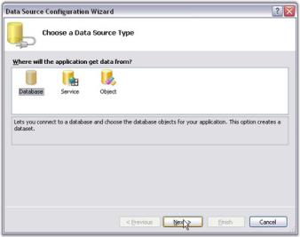' | markdownify }}
{:.image }

5. Select appropriate data connection and click Next. This example uses Northwind database available in: _<Sample Install Location>\Syncfusion\EssentialStudio\x.x.x.x\Common\Data_

{{ '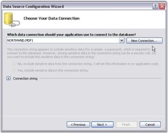' | markdownify }}
{:.image }

6. Select appropriate table and data using this wizard.

{{ '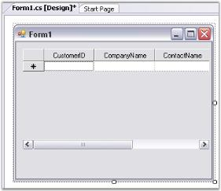' | markdownify }}
{:.image }

7. To customize columns, open GridBoundColumns collection by clicking that property in Grid DataBound Grid. With this editor, you can determine exactly which columns of data source are displayed in the grid. You can also set column properties like backcolor and font.

{{ '' | markdownify }}
{:.image }

8. Run the application. Following is the output.

{{ '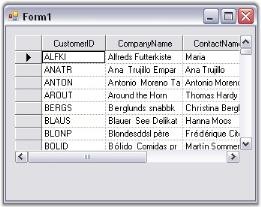' | markdownify }}
{:.image }

Grid Data Bound Grid is added to the windows application and bound to a local data source. For more details, see Grid Data Bound Grid tutorial.

##### Through Code

Here are some code samples that will create a DataTable and bind it a to Grid Data Bound Grid. Once you have a DataTable object populated you can use the GridDataBoundGrid.DataSource property to implement the binding.

[C#]

DataTable myDataTable = new DataTable("MyDataTable");

//Declares the Data Column and Data Row variables.

DataColumn myDataColumn;

DataRow myDataRow;

//Creates a new Data Column, sets the Data Type and Column Name and adds to the Data Table.   

myDataColumn = new DataColumn();

myDataColumn.DataType = System.Type.GetType("System.Int32");

myDataColumn.ColumnName = "id";

myDataTable.Columns.Add(myDataColumn);

//Creates a second column.

myDataColumn = new DataColumn();

myDataColumn.DataType = Type.GetType("System.String");

myDataColumn.ColumnName = "item";

myDataTable.Columns.Add(myDataColumn);

//Creates new Data Row objects and adds to the Data Table.    

for (int i = 0; i <= 10; i++)

{

    myDataRow = myDataTable.NewRow();

    myDataRow["id"] = i;

    myDataRow["item"] = "item " + i.ToString();

    myDataTable.Rows.Add(myDataRow);

}

this.GridDataBoundGrid1.DataSource = myDataTable;

//Sizes the columns.

this.GridDataBoundGrid1.Model.ColWidths[1] = 30;

this.GridDataBoundGrid1.Model.ColWidths[2] = 50;

[VB.NET]

Dim myDataTable As DataTable = New DataTable("MyDataTable")

'Declares the Data Column and Data Row variables.

Dim myDataColumn As DataColumn

Dim myDataRow As DataRow

'Creates a new Data Column, sets Data Type and Column Name and adds to the Data Table. 

myDataColumn = New DataColumn()

myDataColumn.DataType = System.Type.GetType("System.Int32")

myDataColumn.ColumnName = "id"

myDataTable.Columns.Add(myDataColumn)

'Creates a second column.

myDataColumn = New DataColumn()

myDataColumn.DataType = Type.GetType("System.String")

myDataColumn.ColumnName = "item"

myDataTable.Columns.Add(myDataColumn)

'Creates new Data Row objects and adds to the Data Table.    

Dim i As Integer

For i = 0 To 10

myDataRow = myDataTable.NewRow

myDataRow("id") = i

myDataRow("item") = "item " & i

myDataTable.Rows.Add(myDataRow)

Next i

Me.gridDataBoundGrid1.DataSource = myDataTable

'Sizes the columns.

Me.gridDataBoundGrid1.Model.ColWidths(1) = 30

Me.gridDataBoundGrid1.Model.ColWidths(2) = 50

#### Concepts and Features

This section discusses use cases for Grid Data Bound Grid. The cases range from simple binding to a DataTable through Master-Detail and ends with some hierarchical binding samples. It also includes other topics like filtering, sorting, and accessing data in the grid.

##### Binding to an ArrayList

You can bind an ArrayList that holds objects with public properties. Given below is an example, which substantiates this point.

1. We first define an object called Person with two public properties: FirstName and LastName.
2. We then create an ArrayList holding a collection of these objects.
3. To bind this ArrayList to Grid Data Bound Grid, we set the grid's DataSource property after dropping Grid Data Bound Grid onto the form.

Given below is the code sample for this.

[C#]

//Creates the Person object class.

public class Person

{

    private string lname;

    private string fname;

    public Person(string fname, string lname)

    {

            this.fname = fname;

            this.lname = lname;

    }

    public string FirstName

    {

            get{return fname;}

            set{fname = value;}

    }

    public string LastName

    {

            get{return lname;}

            set{lname = value;}

    }

}

//Code within your Form Load event handler.

private void Form1_Load(object sender, System.EventArgs e)

{

    ArrayList al = new ArrayList();

    al.Add(new Person("John", "Smith"));

    al.Add(new Person("Mary", "Tucker"));

    al.Add(new Person("Sue", "Gaskins"));

    al.Add(new Person("John", "Jacobs"));

    al.Add(new Person("Sam", "Garfunkel"));

    al.Add(new Person("George", "Shepherd"));

    al.Add(new Person("Becky", "Dunsford"));

    this.gridDataBoundGrid1.DataSource = al;

}

[VB.NET]

'Creates the Person object class.

Public Class Person

Private fname As String

Private lname As String

Public Sub New(ByVal fname As String, ByVal lname As String)

Me.fname = fname

Me.lname = lname

End Sub

Public Property LastName()

Get

Return lname

End Get

Set(ByVal Value)

lname = Value

End Set

End Property

Public Property FirstName()

Get

Return fname

End Get

Set(ByVal Value)

fname = Value

End Set

End Property

End Class

'Code within your Form Load event handler.

Private Sub Form1_Load(ByVal sender As System.Object, ByVal e As System.EventArgs) Handles MyBase.Load

Dim al As ArrayList = New ArrayList()

al.Add(New Person("John", "Smith"))

al.Add(New Person("Mary", "Tucker"))

al.Add(New Person("Sue", "Gaskins"))

al.Add(New Person("John", "Jacobs"))

al.Add(New Person("Sam", "Garfunkel"))

al.Add(New Person("George", "Shepherd"))

al.Add(New Person("Becky", "Dunsford"))

Me.GridDataBoundGrid1.DataSource = al

End Sub

See Also

###### ArrayList Class with IBindingList Support

Any change that you make to the grid will be posted back to the ArrayList. Keep in mind that you cannot add new items to the ArrayList through the grid. Instead, make sure that your data source supports the IBindingList interface and that it implements an appropriate AddNew method. The IBindingList support determines whether you can add new items and sort items as well as do searching for other basic aspects of list behavior. 

{{ '' | markdownify }}
{:.image }

Here is a minimal implementation of an ArrayList-derived class that also supports IBindingList. If you add this class to the above code and in the Form-Load change the ArrayList to PersonList, then you will be able to add new entries to your underlying PersonList data source by using the AppendRow at the bottom of the grid. Notice that the implementation of IBindingList.AddNew as well as the IBindingList.AllowNew property will indicate that new rows are allowed.

##### Binding to a DataTable

Binding to a DataTable is a very simple and straight-forward process. After defining DataTable, you must set GridDataBoundGrid.DataSource property to the table. Then you can easily use the Data Tab of your toolbox in Visual Studio to generate DataTables. Here we will add a simple People table using the code to illustrate how you can dynamically create a DataTable. 

Creating a DataTable from code is a two-step process. You must first add DataColumn objects to the DataTable.Columns collection and then you must add DataRow objects to the DataTable.Rows collection. Given below is the code that does this. The code will assume that you have dropped a Grid Data Bound Grid onto the form.

[C#]

private void Form1_Load(object sender, System.EventArgs e)

{

this.gridDataBoundGrid1.DataSource = ReturnATable();

}

private DataTable ReturnATable()

{

    DataTable table = new DataTable("People");

//Adds two columns.

   table.Columns.Add(new DataColumn("FirstName"));

   table.Columns.Add(new DataColumn("LastName"));

//Adds some rows.

   DataRow dr = table.NewRow();

   dr["FirstName"] = "John";

   dr["LastName"] = "Smith";

   table.Rows.Add(dr);

   dr = table.NewRow();

   dr["FirstName"] = "Mary";

   dr["LastName"] = "Tucker";

   table.Rows.Add(dr);

   dr = table.NewRow();

   dr["FirstName"] = "Sue";

   dr["LastName"] = "Gaskins";

   table.Rows.Add(dr);

   dr = table.NewRow();

   dr["FirstName"] = "John";

   dr["LastName"] = "Jacobs";

   table.Rows.Add(dr);

   dr = table.NewRow();

   dr["FirstName"] = "Sam";

   dr["LastName"] = "Garfunkel";

   table.Rows.Add(dr);

   dr = table.NewRow();

   dr["FirstName"] = "George";

   dr["LastName"] = "Shepherd";

   table.Rows.Add(dr);

   dr = table.NewRow();

   dr["FirstName"] = "Becky";

   dr["LastName"] = "Dunsford";

   table.Rows.Add(dr);

   return table;

}

[VB.NET]

Private Sub Form1_Load(ByVal sender As System.Object, ByVal e As System.EventArgs) Handles MyBase.Load

Me.GridDataBoundGrid1.DataSource = ReturnATable()

End Sub

Private Function ReturnATable()

Dim table As DataTable = New DataTable("People")

'Adds two columns.

table.Columns.Add(New DataColumn("FirstName"))

table.Columns.Add(New DataColumn("LastName"))

'Adds some rows.

Dim dr As DataRow = table.NewRow()

dr("FirstName") = "John"

dr("LastName") = "Smith"

table.Rows.Add(dr)

dr = table.NewRow()

dr("FirstName") = "Mary"

dr("LastName") = "Tucker"

table.Rows.Add(dr)

dr = table.NewRow()

dr("FirstName") = "Sue"

dr("LastName") = "Gaskins"

table.Rows.Add(dr)

dr = table.NewRow()

dr("FirstName") = "John"

dr("LastName") = "Jacobs"

table.Rows.Add(dr)

dr = table.NewRow()

dr("FirstName") = "Sam"

dr("LastName") = "Garfunkel"

table.Rows.Add(dr)

dr = table.NewRow()

dr("FirstName") = "George"

dr("LastName") = "Shepherd"

table.Rows.Add(dr)

dr = table.NewRow()

dr("FirstName") = "Becky"

dr("LastName") = "Dunsford"

table.Rows.Add(dr)

Return table

End Function

##### Accessing Values in the Grid Data Bound Grid and in the Data Source

To access values in the Grid Data Bound Grid, use the indexer and retrieve the value from the GridStyleInfo object. 

[C#]

//Gets value at (row, col).

object myValue = this.gridDataBoundGrid1[row, col].CellValue; 

[VB.NET]

'Gets Value at (row, col).

Dim myValue as Object = Me.GridDataBoundGrid1(row, col).CellValueget value at row, col

If you want to retrieve the values that are based on column names, use the methods in the GridDataBoundGrid.Binder object to switch the name for a column index.

[C#]

//Specifies the field name.

int nField = this.gridDataBoundGrid1.Binder.NameToField("FirstName");

//Calls Binder.FieldToColIndex method to retrieve the column index for the ColumnName specified.

int col = this.gridDataBoundGrid1.Binder.FieldToColIndex(nField);

//Gets Value at (row, col).

object myValue = this.gridDataBoundGrid1[row, col].CellValue;

[VB.NET]

'Specifies the field name.

Dim nField As Integer = Me.gridDataBoundGrid1.Binder.NameToField("FirstName")

'Calls Binder.FieldToColIndex method to retrieve the column index for the ColumnName specified.

Dim col As Integer = Me.gridDataBoundGrid1.Binder.FieldToColIndex(nField)

'Gets Value at (row, col).

Dim myValue As Object = Me.gridDataBoundGrid1(row, col).CellValue

##### Using CurrencyManager

Sometimes the grid itself will not contain all the data in the data table. For example, your data table may have 12 columns in it, but you are able to add only three GridBoundColumns to display exactly three of the twelve columns. In this case, the table has nine more columns than the grid. How do you get all the values in the columns that are not in the grid? 

Your first inclination might be to grab the row number from the grid and try to use it as an index in the datatable. But, the relationship between the grid's row number and the data table row numbers will break if your grid has been sorted. So, instead of using the row number as an index in the data table, you should use it as an index in the CurrencyManager List. 

Given below are some code samples.

[C#]

//Assuming the grid is bound to a Data Table.

CurrencyManager cm = (CurrencyManager)this.grid.BindingContext[this.grid.DataSource, this.grid.DataMember];

DataRowView drv = cm.List[1] as DataRowView; 

//Accesses row 2 of the grid.

if(drv != null)

{

    DataRow dr = drv.Row;

    Console.WriteLine(dr["FirstName"].ToString());

}

[VB.NET]

'Assuming grid is bound to a Data Table.

Dim cm As CurrencyManager = CType(Me.grid.BindingContext(Me.grid.DataSource, Me.grid.DataMember), CurrencyManager)

Dim drv As DataRowView = cm.List(1)  

'Accesses row 2 of the grid.

If Not (drv Is Nothing) Then

Dim dr As DataRow = drv.Row

Console.WriteLine(dr("FirstName").ToString())

End If

##### Filtering Grid Data Bound Grid

We will use an example to illustrate filtering procedure for the grid.

Assume that you are binding a grid to DataTable. In this case, you will have to use DataView.RowFilter property to restrict the rows that appear in your Grid Data Bound Grid. The syntax for RowFilter clause is very similar to SQL WHERE clause. You will be able to see a full description of this in the .NET Frameworks online help for DataColumn.Expression, which uses the same syntax. 

Here are some samples.

_Table 74: Filtering procedure for the grid_

<table>
<tr>
<td>
ROWFILTER STRING</td><td>
RESULT</td></tr>
<tr>
<td>
[City Area] = Center</td><td>
Shows only rows where the City Area column is center.</td></tr>
<tr>
<td>
rate > 10</td><td>
Shows only rows where the rate column is greater than 10.</td></tr>
<tr>
<td>
Name LIKE a*</td><td>
Shows only rows where the Name column begins with *a.</td></tr>
<tr>
<td>
Name LIKE *a</td><td>
Shows only rows where the Name column ends with *a.</td></tr>
</table>
{{ '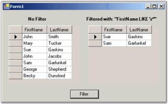' | markdownify }}
{:.image }

The filtered grid is created by setting RowFilter property of it to default view. If you change RowFilter property then the grid's contents will change to reflect the new filter. 

[C#]

//Assuming the grid is bound to a Data Table.

DataView dv = ((DataTable)this.gridDataBoundGrid1.DataSource).DefaultView;

dv.RowFilter = "FirstName LIKE 's*'";

[VB.NET]

' Assuming the grid is bound to a Data Table.

Dim dv As DataView = CType(Me.gridDataBoundGrid1.DataSource, DataTable).DefaultView

dv.RowFilter = "FirstName LIKE 's*'"

You can use the Essential Grid's GridFilterBar class to automatically add a row of drop-down cells at the top of a simple (non-hierarchical) DataBound Grid that can be used to filter the grid to display only rows that match values from the drop-down. For example, when you have a grid with Grid Filter Bar, if one of your columns is City and you want to see all the rows where City is 'Boston' for example and then you will have to drop the combo box at the top of the City column and select Boston. The grid will then display only those rows with Boston in the City column. Adding a Grid Filter Bar takes only two lines of code. 

[C#]

//Adds a Filter Bar to the databound grid.

GridFilterBar filterBar = new Syncfusion.Windows.Forms.Grid.GridFilterBar();

filterBar.WireGrid(gridDataBoundGrid1);

[VB.NET]

'Adds a Filter Bar to the databound grid.

Dim filterBar As GridFilterBar = New Syncfusion.Windows.Forms.Grid.GridFilterBar()

filterBar.WireGrid(GridDataBoundGrid1)

{{ '' | markdownify }}
{:.image }

Filter By DisplayMember

Grid Data Bound Grid filters data records by value member of the columns. This default behavior can be customized in order to accomplish filtering by display member instead. This can be achieved by deriving custom filter from the GridFilterBar class wherein you can customize GetFilterFromRow method to replace the display strings in the filter with value strings.

Filter By DisplayMember feature performs this sort of customization and lets you filter grid data by display member instead of value member. 

Following code example illustrates how to enable this filter.

[C#]

GridDataBoundGridFilterBarExt filterBar = new GridDataBoundGridFilterBarExt();

filterBar.WireGrid(gridDataBoundGrid1);

[VB.NET]

Dim filterBar As GridDataBoundGridFilterBarExt = New GridDataBoundGridFilterBarExt()

filterBar.WireGrid(gridDataBoundGrid1)

{{ '' | markdownify }}
{:.image }

> {{ '' | markdownify }}
{:.image }
_Note: For more details, refer to the following browser sample:_ 

> _<Install Location>\Syncfusion\EssentialStudio\[Version Number]\Windows\Grid.Windows\Samples\2.0\Data Bound\Filter By DisplayMember Demo_

##### GridBoundColumns and Controlling the Column Format

To control properties of a column in your Grid DataBound Grid, you must use GridBoundColumn class object. You can also explicitly add GridBoundColumn object to GridDataBoundGrid.GridBoundColumns collection for each column that you want to see in the grid or you can let GridDataBoundGrid.Binder class generate these columns for you. 

Here are the code samples that will explicitly add GridBoundColumns. Note that you can add these GridBoundColumns at design-time provided you properly set MappingName property for each column.

[C#]

private void Form1_Load(object sender, System.EventArgs e)

{

    this.gridDataBoundGrid1.DataSource = ReturnATable();

    this.gridDataBoundGrid1.EnableAddNew = false;

    this.gridDataBoundGrid1.BackColor = Color.FromArgb(0xcc, 0xd4, 0xe6);

//Creates GridBoundColumn for each displayed column.

    GridBoundColumn gbc = new GridBoundColumn();

    gbc.MappingName = "FirstName";  

//Must set to column mapping name.

    gbc.HeaderText = "Name";

//Sets some style properties.

    gbc.StyleInfo.BackColor = Color.FromArgb(0xC0, 0xC9, 0xdb);

    gbc.StyleInfo.TextColor = Color.Blue;

//Adds the column to GridBoundColumns collection.

    this.gridDataBoundGrid1.GridBoundColumns.Add(gbc);

//Repeats for each column.

    gbc = new GridBoundColumn();

    gbc.MappingName = "LastName";

    gbc.HeaderText = "FamilyName";

    gbc.StyleInfo.Font.Bold = true;

    this.gridDataBoundGrid1.GridBoundColumns.Add(gbc);

    gbc = new GridBoundColumn();

    gbc.MappingName = "City";

    gbc.HeaderText = "City";

    this.gridDataBoundGrid1.GridBoundColumns.Add(gbc);

//Needs to initialize GridBoundColumns so that their settings will replace currently set values.

    this.gridDataBoundGrid1.Binder.InitializeColumns();

//Resizes the column headers.

    this.gridDataBoundGrid1.Model.ColWidths.ResizeToFit(GridRangeInfo.Row(0), GridResizeToFitOptions.NoShrinkSize);

}

[VB.NET]

Private Sub Form1_Load(ByVal sender As Object, ByVal e As System.EventArgs)

Me.gridDataBoundGrid1.DataSource = ReturnATable()

Me.gridDataBoundGrid1.EnableAddNew = False

Me.gridDataBoundGrid1.BackColor = Color.FromArgb(&HCC, &HD4, &HE6)

'Creates GridBoundColumn for each displayed column.

Dim gbc As New GridBoundColumn()

gbc.MappingName = "FirstName"

'Must set to column mapping name.

gbc.HeaderText = "Name"

'Sets some style properties.

gbc.StyleInfo.BackColor = Color.FromArgb(&HC0, &HC9, &HDB)

gbc.StyleInfo.TextColor = Color.Blue

'Adds column to GridBoundColumns collection.

Me.gridDataBoundGrid1.GridBoundColumns.Add(gbc)

'Repeats for each column.

gbc = New GridBoundColumn()

gbc.MappingName = "LastName"

gbc.HeaderText = "FamilyName"

gbc.StyleInfo.Font.Bold = True

Me.gridDataBoundGrid1.GridBoundColumns.Add(gbc)

gbc = New GridBoundColumn()

gbc.MappingName = "City"

gbc.HeaderText = "City"

Me.gridDataBoundGrid1.GridBoundColumns.Add(gbc)

'Needs to initialize GridBoundColumns so their settings will replace currently set values.

Me.gridDataBoundGrid1.Binder.InitializeColumns()

'Resizes column headers.

Me.gridDataBoundGrid1.Model.ColWidths.ResizeToFit(GridRangeInfo.Row(0), GridResizeToFitOptions.NoShrinkSize)

'Form1_Load

End Sub

###### Using the GridDataBoundGrid.Binder Class

Instead of adding your own GridBoundColumns, you can directly reference internal columns that are generated by GridDataBoundGrid.Binder class when data source is set in the grid. You can also use these internal columns to set the style info for columns or HeaderText or any other property of the GridBoundColumn. Here is a Form_Load handler that will display the same grid as above using internal columns.

[C#]

private void Form1_Load(object sender, System.EventArgs e)

{

    this.gridDataBoundGrid1.DataSource = ReturnATable();

    this.gridDataBoundGrid1.EnableAddNew = false;

    this.gridDataBoundGrid1.BackColor = Color.FromArgb(0xcc, 0xd4, 0xe6);

//Sets the first column.

    GridModelDataBinder binder = this.gridDataBoundGrid1.Binder;

    GridBoundColumn gbc = binder.InternalColumns["FirstName"];

    gbc.HeaderText = "Name";

    gbc.StyleInfo.BackColor = Color.FromArgb(0xC0, 0xC9, 0xdb);

    gbc.StyleInfo.TextColor = Color.Blue;

//Sets the second column.

    gbc = binder.InternalColumns["LastName"];

    gbc.HeaderText = "FamilyName";

    gbc.StyleInfo.Font.Bold = true;

//Just uses the default third column... no changes.

//Resizes column headers.

    this.gridDataBoundGrid1.Model.ColWidths.ResizeToFit(GridRangeInfo.Row(0), GridResizeToFitOptions.NoShrinkSize);

}

[VB.NET]

Private Sub Form1_Load(ByVal sender As Object, ByVal e As System.EventArgs)

Me.gridDataBoundGrid1.DataSource = ReturnATable()

Me.gridDataBoundGrid1.EnableAddNew = False

Me.gridDataBoundGrid1.BackColor = Color.FromArgb(&HCC, &HD4, &HE6)

'Sets the first column.

Dim binder As GridModelDataBinder = Me.gridDataBoundGrid1.Binder

Dim gbc As GridBoundColumn = binder.InternalColumns("FirstName")

gbc.HeaderText = "Name"

gbc.StyleInfo.BackColor = Color.FromArgb(&HC0, &HC9, &HDB)

gbc.StyleInfo.TextColor = Color.Blue

'Sets the second column.

gbc = binder.InternalColumns("LastName")

gbc.HeaderText = "FamilyName"

gbc.StyleInfo.Font.Bold = True

'Just uses the default third column... no changes.

'Resizes the column headers.

Me.gridDataBoundGrid1.Model.ColWidths.ResizeToFit(GridRangeInfo.Row(0), GridResizeToFitOptions.NoShrinkSize)

' Form1_Load

End Sub 

##### Changing Column Order in Grid Data Bound Grid

The simplest way to change the column order in a Grid Data Bound Grid is to use the GridDataBoundGrid.Model.Cols.MoveRange method. This method will rearrange columns that are based on from and to and counts the parameters passed into it. 

[C#]

//Moves columns 4 and 5, to column 1.

this.gridDataBoundGrid1.Model.Cols.MoveRange(4, 2, 1);

[VB.NET]

'Moves columns 4 and 5, to column 1.

Me.GridDataBoundGrid1.Model.Cols.MoveRange(4, 2, 1)

##### Using Master-Details Relation

To define simple Master-Details relation, you must have two tables. The first is a Master table that has a column whose values are also included in a second table, referred to as the Details table. You must display these two tables in two grids, which are called Master grid and Details grid. As you click a row in the Master grid, the rows displayed in the Details Grid will be restricted to only those rows whose common value matches the value in the selected Master grid row. 

Here is a screen shot showing you Master-Detail grid pair using NorthWind Customers table as the Master table, and the NorthWind Orders table as the details table. As you click on a customer in the customers grid, the orders for that customer will appear in the second grid.

{{ '' | markdownify }}
{:.image }

Here is the code that implements this Master-Detail form. In the designer, two DataAdapters (one for each table), Customers and Orders are added to the form. A DataSet will be generated as well. Two DataBound Grids are also positioned on the form. The Form_Load event listed below will set up all the data binding between DataSet that is holding the two tables and the two grids. 

[C#]

private void Form1_Load(object sender , System.EventArgs e)  

{

//Fills Data Set with two tables.

    this.sqlDataAdapter1.Fill(this.dataSet11.Customers);

    this.sqlDataAdapter2.Fill(this.dataSet11.Orders);

//Adds Data Relation to the Data Set.

    DataRelation dr  = new DataRelation("CustomersToOrders", this.dataSet11.Customers.Columns["CustomerID"],

    this.dataSet11.Orders.Columns["CustomerID"]);

    this.dataSet11.Relations.Add(dr);

//Sets up data sources.

    this.masterGrid.DataSource = this.dataSet11.Tables["Customers"];

    this.detailsGrid.DataSource = Me.DataSet11.Tables["Customers"];

    this.detailsGrid.DataMember = "CustomersToOrders";

}

[VB.NET]

Private Sub Form1_Load(ByVal sender As System.Object, ByVal e As System.EventArgs) Handles MyBase.Load

'Fills Data Set with two tables.

Me.SqlDataAdapter1.Fill(Me.DataSet11.Customers)

Me.SqlDataAdapter2.Fill(Me.DataSet11.Orders)

'Adds Data Relation to Data Set.

Dim dr As DataRelation = New DataRelation("CustomersToOrders", Me.DataSet11.Customers.Columns("CustomerID"),

Me.DataSet11.Orders.Columns("CustomerID"))

Me.DataSet11.Relations.Add(dr)

'Sets up data sources.

Me.masterGrid.DataSource = Me.DataSet11.Tables("Customers")

Me.detailsGrid.DataSource = Me.DataSet11.Tables("Customers")

Me.detailsGrid.DataMember = "CustomersToOrders"

End Sub

##### Foreign Key Columns: Shows One Value, but Saves Another

Very often a table will have a column that displays an ID key defined in another table. In your grid, you may like to have this foreign key mapped to some meaningful value, which is referenced from a different column in this other table. The key column in the foreign table is referred as ValueMember and the meaningful column is referred as DisplayMember. 

Essential Grid will handle this work for you and it can be done through the designer. For the example discussed below, we use code to handle most of the steps.

In the designer, drag two of the DataBound Grids onto a form. Use one grid to show the foreign key combobox and the other to show the raw data for the primary table. Once the grids are in place, the code, which is given below will create the tables for this sample and then the code in the Form_Load will hook up the foreign key combobox. In our sample, we have set the combobox button to display only the current row.

[C#]

private void Form1_Load(object sender, System.EventArgs e)

{

    this.gridDataBoundGrid1.DataSource = PrimaryTable();

    this.gridDataBoundGrid1.EnableAddNew = false;

//Column 2 of the grid is the foreign key combo.

    GridBoundColumn gbc = this.gridDataBoundGrid1.Binder.InternalColumns[1];

    gbc.StyleInfo.CellType = "ComboBox";

    gbc.StyleInfo.DataSource = ForeignKeyTable();

    gbc.StyleInfo.DisplayMember = "Name";

    gbc.StyleInfo.ValueMember = "CustID";

    gbc.StyleInfo.ShowButtons = GridShowButtons.ShowCurrentRow;

    gbc.StyleInfo.HorizontalAlignment = GridHorizontalAlignment.Left;

//Displays the primary table in a second grid without foreign key column.

    this.gridDataBoundGrid2.DataSource = this.gridDataBoundGrid1.DataSource;

    this.gridDataBoundGrid2.EnableAddNew = false;

    this.gridDataBoundGrid2.Enabled = false;

}

private DataTable PrimaryTable()

{

    DataTable dt = new DataTable("PrimaryTable");

    dt.Columns.Add(new DataColumn("ID", typeof(int)));

    dt.Columns.Add(new DataColumn("CustID", typeof(int)));

    dt.Columns.Add(new DataColumn("Address"));

    dt.Columns.Add(new DataColumn("City"));

    for(int i = 0; i < 10; ++i)

    {

        DataRow dr = dt.NewRow();

        dr[0] = i;

        dr[1] = i % 4;

        dr[2] = string.Format("address{0}", i);

        dr[3] = string.Format("city{0}", i);

        dt.Rows.Add(dr);

    }

    return dt;

}

private DataTable ForeignKeyTable()

{

//Two columns CustID (Value Member) and Name (Display Member).

    DataTable dt = new DataTable("ForeignKeyTable");

    dt.Columns.Add(new DataColumn("CustID", typeof(int)));

    dt.Columns.Add(new DataColumn("Name"));

    for(int i = 0; i < 4; ++i)

    {

        DataRow dr = dt.NewRow();

        dr[0] = i;

        dr[1] = string.Format("Name{0}", i);

        dt.Rows.Add(dr);

    }

    return dt;

}

[VB.NET]

Private Sub Form1_Load(ByVal sender As Object, ByVal e As System.EventArgs)

Me.gridDataBoundGrid1.DataSource = PrimaryTable()

Me.gridDataBoundGrid1.EnableAddNew = False

'Col 2 of the grid is the foreign key combo.

Dim gbc As GridBoundColumn = Me.gridDataBoundGrid1.Binder.InternalColumns(1)

gbc.StyleInfo.CellType = "ComboBox"

gbc.StyleInfo.DataSource = ForeignKeyTable()

gbc.StyleInfo.DisplayMember = "Name"

gbc.StyleInfo.ValueMember = "CustID"

gbc.StyleInfo.ShowButtons = GridShowButtons.ShowCurrentRow

gbc.StyleInfo.HorizontalAlignment = GridHorizontalAlignment.Left

'Just displays the primary table in a second grid without foreign key column.

Me.gridDataBoundGrid2.DataSource = Me.gridDataBoundGrid1.DataSource

Me.gridDataBoundGrid2.EnableAddNew = False

'Does not allow clicking it.

Me.gridDataBoundGrid2.Enabled = False

'Form1_Load.

End Sub

Private Function PrimaryTable() As DataTable

Dim dt As New DataTable("PrimaryTable")

dt.Columns.Add(New DataColumn("ID", GetType(Integer)))

dt.Columns.Add(New DataColumn("CustID", GetType(Integer)))

dt.Columns.Add(New DataColumn("Address"))

dt.Columns.Add(New DataColumn("City"))

Dim i As Integer

While i < 10

Dim dr As DataRow = dt.NewRow()

dr(0) = i

dr(1) = i Mod 4

dr(2) = String.Format("address{0}", i)

dr(3) = String.Format("city{0}", i)

dt.Rows.Add(dr)

i += 1

End While

Return dt

'Primary Table.

End Function

Private Function ForeignKeyTable() As DataTable

'Two columns CustID (Value Member) and Name (Display Member).

Dim dt As New DataTable("ForeignKeyTable")

dt.Columns.Add(New DataColumn("CustID", GetType(Integer)))

dt.Columns.Add(New DataColumn("Name"))

Dim i As Integer

While i < 4

Dim dr As DataRow = dt.NewRow()

dr(0) = i

dr(1) = String.Format("Name{0}", i)

dt.Rows.Add(dr)

i = i + 1

End While

Return dt

'Foreign Key Table.

End Function

{{ '' | markdownify }}
{:.image }

##### Sorting

Sorting feature available in DataBound Grid control allows the user to arrange items in a sequence and/or in different sets. SortBehaviour property under the control allows you to sort a column in a data bound grid when the column header cell is clicked. Implementation of this property will rearrange the cell data in the clicked column. This property can be set using either a code or designer. By default, it is set to perform sorting on double-click. GridSortBehavior is an enumeration that defines the sorting behavior options/values.

Following is the list of options/values that can be assigned to SortBehaviour property:

* SingleClick: Sort column when user clicks once.
* DoubleClick: Sort column when user double-clicks.
* None: No sorting when user clicks.

The following code example illustrates sorting of columns on a single click.

[C#]

this.gridDataBoundGrid1.SortBehavior = GridSortBehavior.SingleClick;

[VB.NET]

Me.gridDataBoundGrid1.SortBehavior = GridSortBehavior.SingleClick

{{ '' | markdownify }}
{:.image }

##### Sort by DisplayMember

By default, sorting is done in DataBound Grid through IBindingList.

> {{ '' | markdownify }}
{:.image }
_Note: IBindingList interface provides features required to support both complex and simple scenarios when binding to a data source._

Sort method relies on the data source for the grid and by default sorting is done based on the value members present in the data source and not based on display member. We can implement Sort By DisplayMember feature in Data Bound Grid. The code for foreign key column can be added to the View of the data table so that the sort behavior can be redirected to use foreign key column linked to the combo box column when the user sorts combo box column.

Example

The following code example implements a solution for sorting a column by its display member instead of its value member. Here the foreign key column is added to the View of the data to redirect sort behavior to use foreign key column. 

To accomplish this, two handlers, CellClick event and QueryCellInfo event have been used. In CellClick event, display member is set to the existing mapping name in sortName (which will be the value member) so that sorting is done by display member.

[C#]

string sortName = column.MappingName;

if (column.MappingName == "SupplierID")

    sortName = "CompanyName";

else if (column.MappingName == "CategoryID")

    sortName = "CategoryName";

[VB.NET]

Dim sortName As String = column.MappingName

If column.MappingName = "SupplierID" Then

sortName = "CompanyName"

ElseIf column.MappingName = "CategoryID" Then

sortName = "CategoryName"

End If

DataView is created by using List property under CurrencyManager class.

[C#]

CurrencyManager cm = BindingContext[grid.DataSource, grid.DataMember] as CurrencyManager;

DataView dv = cm.List as DataView;

[VB.NET]

Dim cm As CurrencyManager = TryCast(BindingContext(Grid.DataSource, Grid.DataMember), CurrencyManager)

Dim dv As DataView = TryCast(cm.List, DataView)

DataView sort is applied to this with sortName.

[C#]

if (dv.Sort == sortName)

{

    dv.Sort = sortName + " DESC";

}

else

    dv.Sort = sortName;

[VB.NET]

If dv.Sort = sortName Then

dv.Sort = sortName & " DESC"

Else

dv.Sort = sortName

End If

> {{ '' | markdownify }}
{:.image }
_Note: CurrencyManager manages a list of binding objects when data source uses IBindingList interface._

In QueryCellInfo handler, the sorting icon is drawn with respect to sorting

[C#]

if (dv.Sort == sortName)

    e.Style.Tag = ListSortDirection.Ascending;

else if (dv.Sort == sortName + " DESC")

    e.Style.Tag = ListSortDirection.Descending;

[VB.NET]

If dv.Sort = sortName Then

e.Style.Tag = ListSortDirection.Ascending

ElseIf dv.Sort = sortName & " DESC" Then

e.Style.Tag = ListSortDirection.Descending

End If

{{ '' | markdownify }}
{:.image }

A sample demonstrating this feature is available under the following sample installation path.

_<Install Location>\Syncfusion\EssentialStudio\[Version Number]\Windows\Grid.Windows\Samples\2.0\Data Bound\Sort By DisplayMember Demo_

##### Data Relations

This section illustrates the following topics.

###### Nested Drop-down Grids

Nested Drop-down grids are used to represent multi-level data in a grid. For example, if a bank wants to load all the accounts of an enrolled user in grid control for a financial project, and some of the accounts have subaccounts with options to be selected under each subaccount, which need to be loaded/ shown as a subelement to that account, Nested Drop-down grids can be used to represent data. Data can be distributed in parent (primary) grid, child grid, and so on. Grid Data Bound Grid control can display hierarchical data using Nested Drop-down grids.

Example

In the code example below, the parent (primary) grid is the 'Customers' table from NorthWind database. On clicking a row of this table, the 'Orders' table will be displayed in a new grid providing details on orders placed by the customers. On clicking any of the rows in Orders table, another grid named 'Order_Details' table is displayed providing details on the order details of the selected row in the Orders table.  

This example has a derived GridDataBoundGrid class called GridHierDataBoundGrid used for all the grids to be displayed. In the constructor for this class, the tables for parent and child are to be passed.

[C#]

//Parent table to Child table.

//Creates the outermost grid for customers table-uses GridHierDataBoundGrid class.

this.customerGrid1 = new GridHierDataBoundGrid(this, this.dataSet11.Customers,

this.dataSet11.Orders, this.orderGrid2, new QueryFilterStringEventHandler(ProvideOrdersFilterStrings),

new QueryFormatGridEventHandler(ProvideOrderFormat), true);

[VB.NET]

'Parent table to Child table.

'Creates the outermost grid for customers table and uses GridHierDataBoundGrid class.

Me.customerGrid1 = New GridHierDataBoundGrid(Me, Me.dataSet11.Customers, Me.dataSet11.Orders, Me.orderGrid2, New QueryFilterStringEventHandler(AddressOf ProvideOrdersFilterStrings), New QueryFormatGridEventHandler(AddressOf ProvideOrderFormat), True)

Finally, to specify a relationship between a parent table and a child table, an event handler must be passed for the QueryFilterString event. The event should specify the FilterString that defines the relationship between the parent table and the child table.

[C#]

// Parent table to Child table.

private void ProvideOrdersFilterStrings(object sender, QueryFilterStringEventArgs e)

{

if (this.customerGrid1.Model[e.Row, e.Column + 1].Text != "")

//Adds 1 to get to Customer ID.

e.FilterString = string.Format("CustomerID = '{0}'", this.customerGrid1.Model[e.Row, e.Column + 1].Text);

}

[VB.NET]

'Parent table to Child table.

Private Sub ProvideOrdersFilterStrings(ByVal sender As Object, ByVal e As QueryFilterStringEventArgs)

If Me.customerGrid1.Model(e.Row, e.Column + 1).Text <> "" Then

' Adds 1 to get to Customer ID.

e.FilterString = String.Format("CustomerID = '{0}'", Me.customerGrid1.Model(e.Row, e.Column + 1).Text)

End If

End Sub

{{ '' | markdownify }}
{:.image }

A sample demonstrating this feature is available under the following sample installation path.

_<Install Location>\Syncfusion\EssentialStudio\[Version Number]\Windows\GridDataBound.Windows\Samples\Customization\Drop Grid Demo_

###### Multiple Nested Relations

Grid Data Bound Grid control supports multiple nested relations. A relation can be added in the data source and the data source can be set to GridDataBoundGrid. Then the name of the relation can be passed through Grid.Binder.AddRelation function to show a hierarchical pattern.

Example:

The following code example illustrates the display of a DataSet with multiple nested relations. The sample displays NorthWind's 'Category', 'Products' and the 'Orders_Details' table, and allows you to expand and collapse the order details for each order and products for each category. After adding a relation in the dataset and setting DataSource to the grid, the name of the relation is passed through Grid.Binder.AddRelation function in order to show hierarchical pattern.

[C#]

GridHierarchyLevel hlCategory_Products = gridBinder.AddRelation("Category_Products");

GridHierarchyLevel hlProducts_OrderDetails = gridBinder.AddRelation("Products_OrderDetails");

[VB.NET]

Dim hlCategory_Products As GridHierarchyLevel = gridBinder.AddRelation("Category_Products")

Dim hlProducts_OrderDetails As GridHierarchyLevel = gridBinder.AddRelation("Products_OrderDetails")

{{ '' | markdownify }}
{:.image }

A sample demonstrating this feature is available under the following sample installation path.

_<Install Location>\Syncfusion\EssentialStudio\[Version Number]\Windows\GridDataBound.Windows\Samples\Hierarchy\Expand Grid Demo_

###### Hierarchical Grid with Tree Lines

Grid Data Bound Grid supports display of hierarchical grid with tree lines. This can be achieved by setting the ShowTreeLines property to _true_. 

[C#]

this.gridDataBoundGrid1.ShowTreeLines = true;

[VB.NET]

Me.gridDataBoundGrid1.ShowTreeLines = True

With ShowTreeLines property set to true, there is no separate column allotted for plus or minus buttons, instead the indented text in the first column can be seen. 

{{ '' | markdownify }}
{:.image }

A sample demonstrating this feature is available under the following sample installation path.

_<Install Location>\Syncfusion\EssentialStudio\[Version Number]\Windows\GridDataBound.Windows\Samples\Hierarchy\GDBG Tree Lines Demo_

###### ExpandAll and CollapseAll Methods

1. ExpandAll
4. Using this method will enable the user to view expanded nodes in DataBound Grid, i.e., the parent, child and subsequent sublevel nodes.

The following code illustrates how to set this method for DataBound Grid:

[C#]

this.gridDataBoundGrid1.ExpandAll();

[VB.NET]

Me.gridDataBoundGrid1.ExpandAll()

{{ '' | markdownify }}
{:.image }

5. CollapseAll
6. Using this method will enable the user to view collapsed nodes in DataBound Grid, i.e., only the parent node can be viewed with its corresponding expansion icon.

The following code illustrates how to set this method for DataBound Grid:

[C#]

this.gridDataBoundGrid1.CollapseAll();

[VB.NET]

Me.gridDataBoundGrid1.CollapseAll()

{{ '' | markdownify }}
{:.image }

##### Multi Row Record

DataBound Grid has support for displaying a single record in multiple rows. 

{{ '' | markdownify }}
{:.image }

> {{ '' | markdownify }}
{:.image }
_Note: For more details, refer to the following browser sample:_

_<Install Location>\Syncfusion\EssentialStudio\[Version Number]\Windows\GridDataBound.Windows\Samples\Customization\Multi Row Record Demo_

Example

Using the following code example, you can switch display of records from NorthWind's Customers table between displaying a single row per record and multiple rows per record. The Binder.LayoutColumns function can be used to break records into multiple rows. The record can be broken by inserting a "." in the LayoutColumns() function of GridHierarchyLevel class.

[C#]

GridModel gridModel = gridDataBoundGrid1.Model;

GridModelDataBinder binder = gridDataBoundGrid1.Binder;

// "." indicates a new row.

binder.LayoutColumns(new string[] {"CustomerID", "CompanyName", "ContactTitle", "ContactName", ".", "Address", "City", ".", "PostalCode", "Country", "Phone", "Fax", "Region"});

[VB.NET]

Dim gridModel As GridModel = gridDataBoundGrid1.Model

Dim binder As GridModelDataBinder = gridDataBoundGrid1.Binder

' "." indicates a new row.

binder.LayoutColumns(New String() {"CustomerID", "CompanyName", "ContactTitle", "ContactName", ".", "Address", "City", ".", "PostalCode",

"Country", "Phone", "Fax", "Region"})

##### Record Navigation Bar

It is possible to display DataBound Grid within Grid Record Navigation control. This combination will give you a look similar to Microsoft Access.

{{ '' | markdownify }}
{:.image }

> {{ '' | markdownify }}
{:.image }
_Note: For more details, refer to the following browser sample:_

_<Install Location>\Syncfusion\EssentialStudio\[Version Number]\Windows\GridDataBound.Windows\Samples\Product Showcase\Record Navigation Data Bound Grid Demo_

Example

The following sample displays DataBound Grid within Grid Record Navigation control. This sample was created using the designer. 

1. Step 1: Create an SqlDataAdapter and connect to the Customers table of NorthWind database. 
> 
{{ '' | markdownify }}
{:.image }
_Note: A DataSet is generated._ 

7. Step 2: Drag Grid Record Navigation control onto the form.

{{ '' | markdownify }}
{:.image }

8. Step 3: Drag Grid DataBound Grid onto the Grid Record Navigation control.

{{ '' | markdownify }}
{:.image }

> {{ '' | markdownify }}
{:.image }
_Note: Records can be displayed by typing in the NavigationBar._

{{ '' | markdownify }}
{:.image }

DataBound Grid is displayed within Grid Record Navigation control.

##### Multiple Headers

Grid Data Bound Grid supports display of multiple row and column headers. Additional row headers can be added along side the existing header by setting Model.Rows.HeaderCount and additional column headers can be added below the existing column header by setting the Model.Cols.HeaderCount property.

The following code example illustrates how to display multiple row and column headers.

[C#]

int extraRowHeaders = 1;

int extraColHeaders = 1;

//Initializes extra row and column headers.

this.gridDataBoundGrid1.Model.Rows.HeaderCount = extraRowHeaders;

this.gridDataBoundGrid1.Model.Cols.HeaderCount = extraColHeaders;

[VB.NET]

Dim extraRowHeaders As Integer = 1

Dim extraColHeaders As Integer = 1

'Initializes extra row and column headers.

Me.gridDataBoundGrid1.Model.Rows.HeaderCount = extraRowHeaders

Me.gridDataBoundGrid1.Model.Cols.HeaderCount = extraColHeaders

The resultant output is shown below.

{{ '' | markdownify }}
{:.image }

##### Performance of DataBound Grid 

Essential DataBound Grid can handle large amount of data without a performance hit.

{{ '' | markdownify }}
{:.image }

For more details, refer to the sample: _<Install Location>\Syncfusion\EssentialStudio\[Version Number]\Windows\Grid.Windows\Samples\2.0\Data Bound\Grid Performance Demo_

Example

The Grid can be loaded by specifying the number of records and using the following options, Use OptimizedListChangeEvent, Use ResizeToFit on ColWidths and Use DataTableList.

In the Initialize Table group box,

* Use OptimizedListChangeEvent - Selecting this option ensures that the grid data is updated using IBindingList.ListChanged instead of CurrencyManager to change events. 
* Use ResizeToFit on ColWidths - Selecting this option ensures column width is resized to fit the cell content after the data is loaded. 
* Use DataTableList - Selecting this option ensures that the Syncfusion.Collections.DataTableWrapperList is used as the data source instead of data table. DataTableWrapperList is an IBindingList collection that wraps a data table and provides optimized access to the rows of data table in turn improving the performance when inserting records into an existing table holding many records.

In the Manipulate Grid group box

* Repeat Count and Batch Size can be specified in order to check the performance in batch updates. 
* Selecting Use ScrollWindow check box invalidates only the inserted or removed rows instead of invalidating the whole Grid.
* Insert Records, Remove Records and Change Records buttons let you check the performance when inserting, removing, or changing records in the underlying data table. Once the data is loaded after the batch update, you will be able to see the performance and memory usage in a text box, as shown below.

{{ '' | markdownify }}
{:.image }

##### Events

The important events in Grid control and DataBound Grid are as follows.

Current Cell Related Events

* CurrentCellAcceptedChanges - Occurs when the grid accepts changes made to active current cell.
* CurrentCellMoved - Occurs when current cell is moved to new position.
* CurrentCellMoving - Occurs when current cell is about to be moved to a new position.
* CurrentCellMoveFailed - Occurs when current cell movement to a new position fails.
* CurrentCellActivating - Occurs before the grid activates the specified cell as current cell.
* CurrentCellActivated - Occurs after the grid activates the specified cell as current cell.
* CurrentCellActivateFailed - Occurs after the grid fails to activate a specific cell as current cell.
* CurrentCellDeleting - Occurs when the user presses Delete key on an active current cell.
* CurrentCellStartEditing - Occurs before the current cell switches into editing mode.
* CurrentCellChanging - Occurs when the user wants to modify contents of the current cell.
* CurrentCellChanged - Occurs when the user changes contents of the current cell.
* CurrentCellDeactivating - Occurs before the grid deactivates the current cell.
* CurrentCellShowedDropDown - Occurs after the drop-down is displayed.
* CurrentCellCloseDropDown - Occurs when the drop-down in the current cell is closed.
* CurrentCellShowingDropDown - Occurs when the drop-down is about to be shown.
* CurrentCellValidating - Occurs when the grid validates content of the active current cell.
* CurrentCellValidated - Occurs when the grid has successfully validated the content of the active current cell.
* CurrentCellAcceptedChanges - Occurs when the grid accepts changes made to the active current cell.
* CurrentCellConfirmChangesFaileds - Occurs when the grid could not save changes made to the active current cell.
* CurrentCellRejectedChanges - Occurs when the grid rejects changes made to the active current cell.
* CurrentCellEditingComplete - Occurs when the grid completes editing mode, i.e., when the active current cell exits the editing mode.
* CurrentCellDeactivated - Occurs after the grid deactivates current cell.
* CurrentCellDeactivateFailed - Occurs after the grid fails to deactivate the current cell.
* CurrentCellControlGotFocus - Occurs when the current cell has switched to in-place editing and the control associated with the current cell has received the focus.
* CurrentCellControlLostFocus - Occurs when the current cell has switched to in-place editing and the control associated with the current cell has lost the focus.
* CurrentCellKeyPress - Occurs before GridCellRendererBase.OnKeyPress is called.
* CurrentCellKeyDown - Occurs before GridCellRendererBase.OnKeyDown is called.
* CurrentCellKeyUp - Occurs before GridCellRendererBase.OnKeyUp is called.

Mouse Related Events

* CellButtonClicked - Occurs when the user has clicked on a button element inside a cell renderer.
* CellClick - Occurs when user clicks inside a cell.
* CellDoubleClick - Occurs when the user double-clicks inside a cell.
* CellMouseDown - Occurs before OnMouseDown method of a cell's renderer is called.
* CellMouseUp - Occurs before OnMouseUp method of a cell's renderer is called.
* CellMouseHoverEnter - Occurs before OnMouseHoverEnter method of a cell's renderer is called.
* CellMouseHoverLeave - Occurs before OnMouseHoverLeave method of a cell's renderer is called.
* CheckBoxClick - Occurs when the user selects a check box in a cell.
* PushButtonClick - Occurs when the user clicks a push button of the PushButton cell.

Other Events

* Click - Occurs when control is clicked once.
* DoubleClick - Occurs when control is double clicked.
* DragDrp - Occurs when drag-drop operation is completed.
* DragEnter - Occurs when an object is dragged into the control's bounds.
* DragLeave - Occurs when an object is dragged out of control's bound.
* DragOver - Occurs when the object is dragged over the control.
* GotFocus - Occurs when control receives focus.
* LostFocus - Occurs when control loses focus.
* MouseDown - Occurs when the mouse pointer is over the control and a mouse button is pressed.
* MouseUp - Occurs when the mouse pointer is over the control and a mouse button is released.
* MouseEnter - Occurs when mouse pointer enters the control.
* MouseLeave - Occurs when mouse pointer leaves the control.
* QueryCanOleDragRange - Occurs when the user hovers the mouse over the edge of a selected range. 
* ResizingColumns - Occurs when user is resizing a selected range of columns.
* ResizingRows - Occurs when user is resizing a selected range of rows.
##### Enables Migration of .Net Grid to Esssential Grid

Look-up table that Enables Migration of .Net Grid to Esssential Grid

The following section contains document that enables users to migrate .Net Grid to Esssential Grid. Most of the properties, events, methods have common names in both grids. So it is not included in the following table. Since the API of both the grids is different, following document contains only common features that can be implemented with single line of code.

Equivalent Properties available

_Table 75: Properties_

<table>
<tr>
<td>
.NET GRID</td><td>
ESSSENTIAL GRID</td><td>
DESCRIPTION</td></tr>
<tr>
<td>
AllowDrop</td><td>
AllowDrop</td><td>
Gets or sets a value indicating whether the control can accept data that the user drags into it.</td></tr>
<tr>
<td>
AllowUserToAddRows</td><td>
EnableAddNew</td><td>
Gets or sets a value indicating whether the option to add rows is displayed.</td></tr>
<tr>
<td>
AllowUserToDeleteRows</td><td>
EnableRemove</td><td>
Gets or sets a value indicating whether it allows deletion of rows.</td></tr>
<tr>
<td>
AllowUserToResizeColumns</td><td>
ResizeRowsBehavior</td><td>
Gets or sets a value indicating whether it allows dragging of selected columns for rearranging.</td></tr>
<tr>
<td>
AllowUserToResizeRows</td><td>
ResizeRowsBehavior</td><td>
Gets or sets a value indicating wheather row is resizable.</td></tr>
<tr>
<td>
ColumnCount</td><td>
 Model.ColCount  </td><td>
Gets or sets the number of columns displayed</td></tr>
<tr>
<td>
ColumnHeadersHeight</td><td>
Model.RowHeights[0]</td><td>
Gets or sets the width of the row.</td></tr>
<tr>
<td>
ColumnHeadersVisible</td><td>
Properties.ColHeaders  </td><td>
Gets or sets a value indicating whether the column header row is displayed.</td></tr>
<tr>
<td>
HorizontalScrollingOffset</td><td>
HScrollIncrement</td><td>
Gets or sets the number of pixels by which the control is scrolled horizontally.</td></tr>
<tr>
<td>
GridColor</td><td>
Properties.GridLineColor</td><td>
Gets or sets the color of the grid lines separating the cells.</td></tr>
<tr>
<td>
MultiSelect</td><td>
AllowSelection</td><td>
Gets or sets a value indicating whether more than one cell, row, or column can be selected.</td></tr>
<tr>
<td>
RowCount</td><td>
Model.RowCount</td><td>
Gets or sets the number of rows displayed.</td></tr>
<tr>
<td>
RowHeadersVisible</td><td>
Properties.RowHeaders  </td><td>
Gets or sets a value indicating whether the column that contains row headers is displayed.</td></tr>
<tr>
<td>
RowHeadersWidth</td><td>
Model.ColWidths[0]</td><td>
Gets or sets the width of the column.</td></tr>
<tr>
<td>
VerticalScrollingOffset</td><td>
VScrollIncrement</td><td>
Gets the number of pixels by which the control is scrolled vertically.</td></tr>
<tr>
<td>
IsCurrentCellInEditMode</td><td>
CurrentCell.IsEditing  </td><td>
Gets a value indicating whether the currently active cell is being edited.</td></tr>
<tr>
<td>
RightToLeft</td><td>
RightToLeft</td><td>
Gets or sets a value indicating whether control's elements are aligned to support locales using right-to-left fonts.</td></tr>
</table>
Equivalent Events available

_Table 76: Events_

<table>
<tr>
<td>
.NET GRID</td><td>
ESSSENTIAL GRID</td><td>
DESCRIPTION</td></tr>
<tr>
<td>
BackgroundColorChanged</td><td>
BackColorChanged</td><td>
Occurs when the value of the System.Windows.Forms.Control.BackColor property changes.</td></tr>
<tr>
<td>
CellMouseEnter</td><td>
CellMouseHoverEnter</td><td>
Occurs when the mouse pointer hovers over a cell.</td></tr>
<tr>
<td>
CellMouseLeave</td><td>
CellMouseHoverLeave</td><td>
Occurs when the mouse pointer leaves a cell.</td></tr>
<tr>
<td>
CellPainting</td><td>
CellDrawn</td><td>
Occurs when a cell needs to be drawn.</td></tr>
<tr>
<td>
ColumnWidthChanged</td><td>
Model.ColWidthsChanged</td><td>
Occurs when column width changes.</td></tr>
<tr>
<td>
DataSourceChanged</td><td>
Binder.DataSourceChanged</td><td>
Occurs when DataSource property is changed.</td></tr>
<tr>
<td>
RowsRemoved</td><td>
Model.RowsRemoved</td><td>
Occurs when a row or rows are deleted.</td></tr>
<tr>
<td>
SelectionChanged</td><td>
Model.SelectionChanged</td><td>
Occurs when current selection changes.</td></tr>
<tr>
<td>
SelectionChanged</td><td>
Model.RowHeightsChanged</td><td>
Occurs when row height changes.</td></tr>
</table>
Methods

_Table 77: Methods_

<table>
<tr>
<td>
.NET GRID</td><td>
ESSSENTIAL GRID</td><td>
DESCRIPTION</td></tr>
<tr>
<td>
ClearSelection()</td><td>
Selections.Clear()</td><td>
Clears the current selection by unselecting all selected cells.</td></tr>
<tr>
<td>
InvalidateCell()</td><td>
Model.InvalidateRange()</td><td>
Invalidates the specified cell forcing it to be repainted.</td></tr>
<tr>
<td>
InvalidateColumn()</td><td>
Model.InvalidateRange()</td><td>
Invalidates the specified column forcing it to be repainted.</td></tr>
<tr>
<td>
InvalidateRow</td><td>
Model.InvalidateRange()</td><td>
Invalidates the specified row forcing it to be repainted.</td></tr>
<tr>
<td>
RefreshEdit</td><td>
CurrentCell.Refresh()</td><td>
Refreshes the value of the current cell. </td></tr>
</table>
##### Field Chooser for DataBound Grid 

This feature enables you to customize the view of the grid without modifying the database.The _FieldChooser_ class of _GridDataBoundGrid_ has been implemented to add or remove columns from a grid. 

Use Case Scenarios

This feature will be useful when you want to remove certain columns (which cannot be deleted) from the grid.

Methods

_Table 78: Field chooser_

<table>
<tr>
<th>
TABLEMETHODS </th><th>
DESCRIPTION </th><th>
PARAMETERS </th><th>
TYPE </th><th>
RETURN TYPE </th><th>
REFERENCE LINKS </th></tr>
<tr>
<th>
WireGrid </th><th>
Used to wire the {{ '_FieldChooser._' | markdownify }}</th><th>
Overloads:  ( Arg1) </th><th>
In GridWindowsForm </th><th>
Example: GridDataboundGrid1.WireGrid(GridDataboundGrid). </th><th>
NA</th></tr>
<tr>
<th>
UnWireGrid </th><th>
Used to unwire the FieldChooser.</th><th>
NA</th><th>
In GridWindowsForm </th><th>
Example: GridDataboundGrid1.Unwired(). </th><th>
NA</th></tr>
</table>

Sample Link

You can find a sample for this feature in the following location: 

_..\..\AppData\Local\Syncfusion\EssentialStudio\9.4.0.49\Windows\Grid.Windows\Samples\2.0\Data Bound\GDBG FieldChooser Demo_

Adding Field Chooser for Grid Data Bound Grid

9. To add field chooser, pass data bound grid as the parameter_of the _WireGrid_ method.

The following code illustrates this:

[C#]

  GridDataBoundFieldChooser fChooser = new GridDataBoundFieldChooser();

            fChooser.WireGrid(this.GridDataBoundGrid1);

[VB.NET]

Dim fchooser As GridDataBoundFieldChooser = New GridDataBoundFieldChooser()

            fchooser.WireGrid(Me.GridDataBoundGrid1)

10. When the code runs, the entire grid will open.
11. Right click on a column header and select the Field Chooser menu item to view _Field Chooser_ dialog.

{{ '' | markdownify }}
{:.image }

12. This dialog will list all the column names with check boxes adjacent to them.

{{ '' | markdownify }}
{:.image }

13. Select the checkboxes of the columns you want to be displayed in the grid.
14. The grid will have only the columns which are selected in the _Field Chooser_ dialog.

{{ '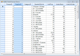' | markdownify }}
{:.image }

### Grid List Control

Grid List control is System.Windows.Forms ListControl-derived object. It uses an embedded GridControl object to hold data. Using this GridListControl.Grid member, you can easily control the appearance of your list control through the GridControl object.

{{ '' | markdownify }}
{:.image }

#### Creating Grid List Control

This section will provide step-by-step procedure to create a Grid List control through designer and through programmatical approach in a .NET application.

##### Through Designer

With the designer, all you have to do is drag the control onto the form, size it and then set the desired properties, assuming you have a data source ready. If you do not have data source ready, then create one by using the steps listed below.

To Create a Data Source

1. Drag an SqlDataAdapter from Data tab of the Toolbox onto the form. Follow the steps in the wizard to select database and SQL query used to generate the table.

{{ '' | markdownify }}
{:.image }

2. Click SqlAdapter in the components tray with the right Mouse button and generate a dataset for this adapter by just taking the defaults. 

{{ '' | markdownify }}
{:.image }

3. In the Form_Load event handler, Fill method will be called automatically for this SqlDataAdapter by passing dataset that is generated in the previous step.

{{ '' | markdownify }}
{:.image }

4. Drag GridListControl object from your tool box and drop it onto the form.

{{ '' | markdownify }}
{:.image }

5. Size and position it.
6. Go to Properties dialog of this Grid List control and set DataSource property of this control to an appropriate object.

{{ '' | markdownify }}
{:.image }

7. Run the application. Following is the output.

{{ '' | markdownify }}
{:.image }

This designer-created data source is now available for use as the data source member of Grid List control. For a complete step-by-step tutorial on how to use the designer to create data source, see the Grid Data Bound Grid tutorial.

##### Through Code

The Grid List control sample that ships with Essential Grid does not use the designer. It creates an ArrayList of objects that serves as a data source for the Grid List control. Each state object has a LongName, ShortName and ImageIndex properties that can be displayed in the list control. Here are some code samples that illustrate assignments of the major properties. 

For the complete implementation details, refer to the sample in the below installation path.

_<Install Location>\Syncfusion\EssentialStudio\[Version Number]\Windows\Grid.Windows\Samples\Grid List Control_

[C#]

//Sets to arraylist of states.

gridListBox1.DataSource = USStates;

//ImageList-the images displayed in the list.      

gridListBox1.ImageList = imageList;

//Displays multiple columns.

gridListBox1.MultiColumn = true;

gridListBox1.ShowColumnHeader = true;

gridListBox1.SelectionMode = SelectionMode.One;

//Makes the last column wide enough to fill client area.

gridListBox1.FillLastColumn = true; 

[VB.NET]

'Sets to arraylist of states.

gridListBox1.DataSource = USStates        

'ImageList-the images displayed in the list.       

gridListBox1.ImageList = ImageList           

'Displays multiple columns.       

gridListBox1.MultiColumn = True                

gridListBox1.ShowColumnHeader = True

gridListBox1.SelectionMode = SelectionMode.One

'Makes last column.

gridListBox1.FillLastColumn = True             

#### Concepts and Features

This section discusses the following concepts of Grid List control:

##### Data binding and Selection Modes

Data Binding

Data binding is used in Web pages that contain interactive components such as forms, calculators, tutorials, and games. Pages are displayed incrementally so that portions of a page can be used even before the entire page has finished downloading. Data binding helps in populating Grid List control with large amounts of data. This can be achieved by using DataSource property, which allows the system to acquire data from the Data Source Object (DSO).

The following code example illustrates data binding for Grid List control by using DataSource property.

[C#]

ArrayList array = new ArrayList();

array.Add(new MyClass(001,"John David"));

array.Add(new MyClass(002,"Tom"));

array.Add(new MyClass(003,"Bretney"));

array.Add(new MyClass(004,"Jessy"));

array.Add(new MyClass(005,"Bruch"));

array.Add(new MyClass(006,"Johny"));

this.gridlistControl1.DataSource = array;

[VB.NET]

Dim array As ArrayList = New ArrayList()

array.Add(New [MyClass](1, "John David"))

array.Add(New [MyClass](2, "Tom"))

array.Add(New [MyClass](3, "Bretney"))

array.Add(New [MyClass](4, "Jessy"))

array.Add(New [MyClass](5, "Bruch"))

array.Add(New [MyClass](6, "Johny"))

Me.gridlistControl1.DataSource = array

Selection Modes

The selection behavior for Grid List control can be specified by using SelectionMode property. There are 3 types of selection behaviors:

* One - Allows the user to select only one item.
* MultiSimple - Allows the user to select multiple items.
* MultiExtended - Allows the user to select multiple items using SHIFT, CTRL,

arrow keys, etc.

The following code example illustrates setting of various selection behaviors for Grid List control.

[C#]

this.gridListControl1.SelectionMode = SelectionMode.One;

this.gridListControl1.SelectionMode = SelectionMode.MultiSimple;

this.gridListControl1.SelectionMode = SelectionMode.MultiExtended;

[VB.NET]

Me.gridListControl1.SelectionMode = SelectionMode.One

Me.gridListControl1.SelectionMode = SelectionMode.MultiSimple

Me.gridListControl1.SelectionMode = SelectionMode.MultiExtended

##### ComboBoxBase Feature

Grid List control can be coupled to a ComboBoxBase control by using ListControl property of ComboBoxBase class. ComboBoxBase is an advanced control provided by Syncfusion, which essentially separates edit portion from drop-down portion making. It displays Grid List control as a dropdown i.e. users can drop Grid List control in the drop-down area to get a multi-column drop-down effect.

The following code example illustrates usage of Grid List control as a drop-down in Combo Box Base control.

[C#]

this.comboBoxBase1.ListControl = this.gridListControl1;

[VB.NET]

Me.comboBoxBase1.ListControl = Me.gridListControl1

{{ '' | markdownify }}
{:.image }

##### Customizing List control

The appearance Grid List control can be customized by customizing the background color, image, header background color, etc. The following properties can be used for customization:

* TransparentBackground - This property can be used to set a transparent background for grid cells. If its value is set to true, no background color is displayed. If its value is set to false, the background is filled with the chosen color. The value is set to False by default. Refer BackColor property for setting the required background color. 

The following code example illustrates setting of a transparent background for grid cells.

[C#]

this.gridListControl1.TransparentBackground = true;

[VB.NET]

Me.gridListControl1.TransparentBackground = True

{{ '' | markdownify }}
{:.image }

* DisplayVertLines/DisplayHorzLines - This property can be used to specify the display of vertical/horizontal lines on the grid. This property when set to true ensures display of vertical/horizontal grid lines.

The following code example illustrates usage of the properties to display grid lines.

[C#]

this.gridListControl1.Properties.DisplayHorzLines = true;

this.gridListControl1.Properties.DisplayVertLines = true;

[VB.NET]

Me.gridListControl1.Properties.DisplayHorzLines = True

Me.gridListControl1.Properties.DisplayVertLines = True

{{ '' | markdownify }}
{:.image }

{{ '' | markdownify }}
{:.image }

* Buttons3D - This property can be used to specify the appearance of row and column headers. This property when set to true, renders three-dimensional header providing the header a raised look. 

The following code example illustrates the usage of the property to render a 3D header.

[C#]

this.gridListControl1.Properties.Buttons3D = true;

[VB.NET]

Me.gridListControl1.Properties.Buttons3D = True

{{ '' | markdownify }}
{:.image }

* GridLineColor-This property allows the user to specify a color for grid lines. Its value can be set to the required color.

The following code example illustrates the usage of this property to render blue grid lines.

[C#]

this.gridListControl1.Grid.Properties.GridLineColor = Color.Blue;

[VB.NET]

Me.gridListControl1.Grid.Properties.GridLineColor = Color.Blue

{{ '' | markdownify }}
{:.image }

* BackColor - This property allows the user to specify background color for Grid List control. It is mandatory to set TransparentBackground to false to set the background color.

The following code example illustrates the usage of this property to render Beige background color.

[C#]

this.gridListControl1.BackColor = Color.Beige;

[VB.NET]

Me.gridListControl1.BackColor = Color.Beige

{{ '' | markdownify }}
{:.image }

* HeaderBackColor - This property allows the user to specify the background color of headers.

The following code example illustrates usage of this property to render a red background for the headers.

[C#]

this.gridListControl1.HeaderBackColor = Color.Red;

[VB.NET]

Me.gridListControl1.HeaderBackColor = Color.Red

* HeaderTextColor - This property allows the user to specify header text color. 

The following code example illustrates usage of this property to render a blue header text color.

[C#]

this.gridListControl1.HeaderTextColor = Color.Blue;

[VB.NET]

Me.gridListControl1.HeaderTextColor = Color.Blue;

* BackgroundImage - This property allows the user to specify the background image used for control.

The following code example illustrates usage of this property to set the required image as background of the control.

[C#]

this.gridListControl1.BackgroundImage = Image.FromFile("Colud.jpg");

[VB.NET]

Me.gridListControl1.BackgroundImage = Image.FromFile("Colud.jpg")

{{ '' | markdownify }}
{:.image }

### Grid Record Navigation Control

Grid Record Navigation control will allow the user to move from row to row using Microsoft Access-like navigation bar at the bottom of the grid.

{{ '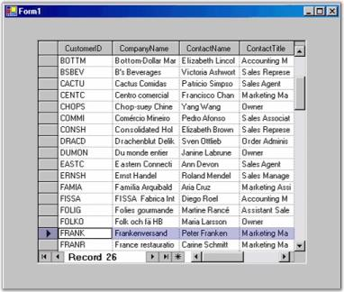' | markdownify }}
{:.image }

#### Creating Grid Record Navigation Control

This section will provide step-by-step procedure to create Grid Record Navigation control through designer and through programmatical approach in.NET application.

##### Through Designer

With the designer you can drag both Grid Record Navigation control and Grid control (either Grid control or Data Bound Grid) from the toolbox onto your form. But, to get the proper initialization code generated by the designer, you must first drop and position Grid Record Navigation control on your form and then drag the grid directly onto Grid Record Navigation control. Do not drop the grid onto the form.

8. Drag GridRecordNavigationControl object from your toolbox and drop it on the form.

{{ '' | markdownify }}
{:.image }

9. Size and position it.
10. Drag GridDataBoundGrid object from your toolbox and drop it on Grid Record Navigation control (and not the form itself).

{{ '' | markdownify }}
{:.image }

11. Set GridDataBoundGrid.DataSource property to an appropriate object.

{{ '' | markdownify }}
{:.image }

12. Run the application. The following will be the output.

{{ '' | markdownify }}
{:.image }

A Grid Record Navigation control is created.

##### Through Code

Here is some minimal code that is necessary to create Grid Record Navigation control.

[C#]

this.recordNavigationControl1 = new Syncfusion.Windows.Forms.Grid.GridRecordNavigationControl();

this.recordNavigationControl1.Location = new System.Drawing.Point(32, 48);

this.recordNavigationControl1.MaxLabel = "of 1000";

this.recordNavigationControl1.MaxRecord = 1000;

this.recordNavigationControl1.NavigationBarWidth = 237;

this.recordNavigationControl1.Size = new System.Drawing.Size(520, 256);

this.recordNavigationControl1.SplitBars = Syncfusion.Windows.Forms.DynamicSplitBars.Both;

this.gridControl1 = new Syncfusion.Windows.Forms.Grid.GridControl();

this.gridControl1.ColCount = 16;

this.gridControl1.NumberedRowHeaders = false;

this.gridControl1.RowCount = 1000;

//Adds the grid to the Record Navigation control.

this.recordNavigationControl1.Controls.Add(this.gridControl1);

//Adds the Record Navigation control to the form.

this.Controls.Add(this.recordNavigationControl1);

[VB.NET]

Me.recordNavigationControl1 = New Syncfusion.Windows.Forms.Grid.GridRecordNavigationControl()

Me.recordNavigationControl1.Location = New System.Drawing.Point(32, 48)

Me.recordNavigationControl1.MaxLabel = "of 1000"

Me.recordNavigationControl1.MaxRecord = 1000

Me.recordNavigationControl1.NavigationBarWidth = 237

Me.recordNavigationControl1.Size = New System.Drawing.Size(520, 256)

Me.recordNavigationControl1.SplitBars = Syncfusion.Windows.Forms.DynamicSplitBars.Both

Me.gridControl1 = New Syncfusion.Windows.Forms.Grid.GridControl()

Me.gridControl1.ColCount = 16

Me.gridControl1.NumberedRowHeaders = False

Me.gridControl1.RowCount = 1000

'Adds the grid to the Record Navigation control.

Me.recordNavigationControl1.Controls.Add(Me.gridControl1)

'Adds the Record Navigation control to the form.

Me.Controls.Add(Me.recordNavigationControl1)

#### Built-in Navigation Support for RecordNavigationControl in GridGroupingControl

GridGrouping control now provides four types of built-in navigation support enabling users to navigate to the first record, last record, previous record, and next record. 

Use Case Scenarios

When you have lots of records in your application, this feature helps you easily navigate to the required record.

 _Table_ _10_: Methods Table_

<table>
<tr>
<th>
METHOD</th><th>
DESCRIPTION</th><th>
PARAMETERS</th><th>
TYPE</th><th>
RETURN TYPE</th><th>
REFERENCE LINKS</th></tr>
<tr>
<th>
MoveFirst()</th><th>
This Method is used to navigate to the first record.</th><th>
N/A </th><th>
method</th><th>
void </th><th>
N/A. </th></tr>
<tr>
<th>
MoveLast()</th><th>
This method is used to navigate to the last record.</th><th>
N/A</th><th>
method</th><th>
void</th><th>
N/A</th></tr>
<tr>
<th>
MoveNext()</th><th>
This method is used to navigate to the next record.</th><th>
N/A</th><th>
method</th><th>
void</th><th>
N/A</th></tr>
<tr>
<th>
MovePrevious()</th><th>
This method is used to navigate to the previous record.</th><th>
N/A </th><th>
method</th><th>
void</th><th>
N/A</th></tr>
</table>
Sample Link

A demo of this feature is available in the following location:

_<Install Location>\Syncfusion\EssentialStudio\[Version Number]\Windows\Grid.Grouping.Windows\Samples\Selection\Record Range Selection Demo_

Adding Navigation Bar to the RecordNavigationControl

The following are steps to add navigation bar:

13. Enable navigation bar by setting ShowNavigationBar property to true. The following code illustrates this:

[C#]

this.gridGroupingControl1.ShowNavigationBar = true;

[VB]

Me.gridGroupingControl1.ShowNavigationBar = True

14. Call the methods for navigation bar i.e., MoveFirst(), MoveLast(), MoveNext() and MovePrevious() methods. The following code illustrates this: 

<table>
<tr>
<td>
[C#]//This property should set to true to show navigation bar.      this.gridGroupingControl1.ShowNavigationBar = true;//This method is used to navigate the first record.this.gridGroupingControl1.RecordNavigationBar.MoveFirst();//This method is used to navigate the last record.this.gridGroupingControl1.RecordNavigationBar.MoveLast();//This method is used to navigate the next record.this.gridGroupingControl1.RecordNavigationBar.MoveNext();//This method is used to navigate the previous record.    this.gridGroupingControl1.RecordNavigationBar.MovePrevious();</td></tr>
<tr>
<td>
[VB]'This property should set to true to show the navigation bar.       Me.gridGroupingControl1.ShowNavigationBar = True'This method is used to navigate the first record.     Me.gridGroupingControl1.RecordNavigationBar.MoveFirst()'This method is used to navigate the last record.     Me.gridGroupingControl1.RecordNavigationBar.MoveLast()'This method is used to navigate the next record.  Me.gridGroupingControl1.RecordNavigationBar.MoveNext()'This method is used to navigate the previous record.     Me.gridGroupingControl1.RecordNavigationBar.MovePrevious()</td></tr>
</table>
{{ '' | markdownify }}
{:.image }

#### Style

RecordNavigationControl supports visual styles such as Default, Metro. The style can be set using Style property. 

* Default
* Metro

The following code example allows you to set the style for the RecordNavigationControl.

[C#]

this.recordNavigationControl1.Style = Syncfusion.Windows.Forms.Appearance.Metro;

 [VB]

Me.recordNavigationControl1.Style = Syncfusion.Windows.Forms.Appearance.Metro

{{ '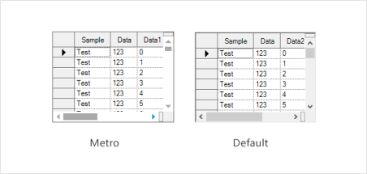' | markdownify }}
{:.image }

### Grid Aware Text Box

This class is derived from the textbox and will allow you to bind it to the CurrentCell of either a Grid control or a Data Bound Grid. The standard use for such a text box is to provide a special edit bar for editing grid cells. This is similar to the FormulaBar in Excel. In Essential Grid's Formula Grid sample, a similar Formula Bar is implemented by using Grid Aware Text Box.

Drag the Grid Aware Text Box from your toolbox and drop it on a form along with either Grid control or DataBound Grid. Finally, in your Form_Load handler, add a call to GridAwareTextBox.WireGrid to bind Grid Aware Text Box to the grid. Here are some code samples that will show you how this is done.

<table>
<tr>
<td>
[C#]private void Form1_Load(object sender, System.EventArgs e){//Binds Grid Aware Text Box to grid.    this.gridAwareTextBox1.WireGrid(this.gridControl1);}</td></tr>
<tr>
<td>
[VB.NET]Private Sub Form1_Load(sender As Object, e As System.EventArgs)'Binds Grid Aware Text Box to grid.Me.gridAwareTextBox1.WireGrid(Me.gridControl1)End Sub </td></tr>
</table>
### Grid Helper Classes

Grid control provides a collection of grid helper classes to achieve specific functionalities. You need to refer to Syncfusion.GridHelperClasses.Windows assembly in your Windows application to make use of these helper classes. The various helper classes and their usage is described in the following topics.

#### Grid to PDF Conversion

Grid control provides support to convert grid content to PDF format. You can convert grid content into PDF document for offline verification and/or computation. This is achieved by making use of the GridPDFConverter class. PDF libraries support conversion of grid content to a PDF page. The following dependent assemblies need to be referenced for this purpose along with default assemblies that are present in the References folder of your Windows application: Syncfusion.Pdf.Base and Syncfusion.GridHelperClasses.Windows.

Following are the properties, methods, and events that are available to users as part of the GridPDFConverter class.

Properties

* ShowHeader - This property gets or sets value indicating whether header should be displayed in PDF document. Default value is set to _false._

The following code example illustrates how to set this property.

[C#]

pdfConvertor.ShowHeader = true;

[VB.NET]

pdfConvertor.ShowHeader = True

{{ '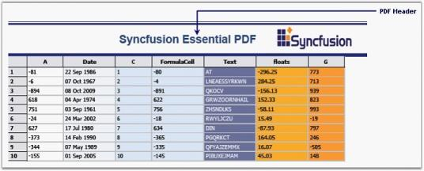' | markdownify }}
{:.image }

* ShowFooter - This property gets or sets value indicating whether footer should be displayed in PDF document. Default value is set to _false_.

The following code example illustrates how to set this property.

[C#]

pdfConvertor.ShowFooter = true;

[VB.NET]

pdfConvertor.ShowFooter = True

{{ '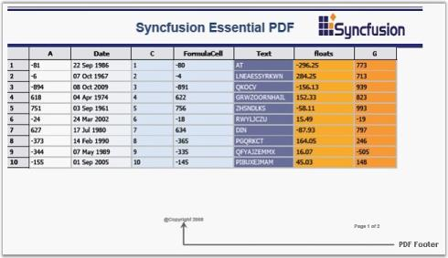' | markdownify }}
{:.image }

* HeaderHeight - This property gets or sets the height of the header for PDF document.

The following code example illustrates how to set this property.

[C#]

pdfConvertor.HeaderHeight = 15;

[VB.NET]

pdfConvertor.HeaderHeight = 15

* FooterHeight - This property gets or sets the height of the footer for PDF document.

The following code example illustrates how to set this property.

[C#]

pdfConvertor.FooterHeight = 20;

[VB.NET]

pdfConvertor.FooterHeight = 20

* Margins - This property gets or sets margins for PDF document.

The following code example illustrates how to set this property.

[C#]

pdfConvertor.Margins.All = 40;

[VB.NET]

pdfConvertor.Margins.All = 40

Methods

* ExportToPdf-This method is used to export the grid to PDF file.

The following code example illustrates how to use this method.

[C#]

GridPDFConverter pdfConvertor = new GridPDFConverter();

pdfConvertor.ExportToPdf("Sample1.pdf", this.gridControl1);

[VB.NET]

Dim pdfConvertor As New GridPDFConverter()

pdfConvertor.ExportToPdf("Sample1.pdf", Me.gridControl1)

Events

* DrawPDFFooter - This event lets you draw a footer for the PDF document.

The following code example illustrates how to handle this event.

[C#]

pdfConvertor.DrawPDFFooter += new GridPDFConverter.DrawPDFHeaderFooterEventHandler(pdfConvertor_DrawPDFFooter);

[VB.NET]

AddHandler pdfConvertor.DrawPDFFooter, AddressOf pdfConvertor_DrawPDFFooter

* DrawPDFHeader - This event lets you draw a header for the PDF document.

The following code example illustrates how to handle this event.

[C#]

pdfConvertor.DrawPDFHeader += new GridPDFConverter.DrawPDFHeaderFooterEventHandler(pdfConvertor_DrawPDFHeader);

[VB.NET]

AddHandler pdfConvertor.DrawPDFHeader, AddressOf pdfConvertor_DrawPDFHeader

#### Resizing Heights of Individual Rows in Grid

Grid Grouping control does not support resizing heights of individual rows in the grid. This feature has been newly added and can be implemented by initializing an instance of the AllowResizingIndividualRows class to GridEngineFactory in the Form's constructor of your Windows application. The following code examples illustrate how to do this.

[C#]

GridEngineFactory.Factory = new Syncfusion.GridHelperClasses.AllowResizingIndividualRows();

[VB.NET]

GridEngineFactory.Factory = New Syncfusion.GridHelperClasses.AllowResizingIndividualRows()

You can make use of AllowResizingIndividualRows class by adding dependent assembly, Syncfusion.GridHelperClasses.Windows to the References folder in your application.

The following screen shot illustrates how the heights of individual rows in the grid have been resized.

{{ '' | markdownify }}
{:.image }

#### Grid Dynamic Filter

GridDynamicFilter class is used to wire a custom filter bar to the Grid Grouping control by replacing the default filter bar. The existing filter bar logic is extended to make the filter easy to use. This feature displays filtered results as you type each character.

The new filter bar adds two cell buttons, Filter button and Clear Filter button, inside every filter bar cell. The Filter button is used to display a list of available Compare Operators in a drop down. The selected operator will then be associated with the value present in the filter bar cell to form a filter string. Clear Filter button, as its name indicates, clears the record filters of the respective column. This button will be displayed for a filter bar cell only when that particular cell is in focus.

The following code example illustrates how to invoke Grid Dynamic Filter.

[C#]

GridEngineFactory.Factory = new Syncfusion.GridHelperClasses.AllowResizingIndividualRows();

[VB.NET]

GridEngineFactory.Factory = New Syncfusion.GridHelperClasses.AllowResizingIndividualRows()

The following screen shot illustrates Grid Grouping control with filter drop down.

{{ '' | markdownify }}
{:.image }

 Support to Save and Load Compare Operators State in Grid Dynamic Filter

GridDynamicFilter in GridGroupingControl is now an enhanced functionality to serialize/de-serialize compareoperator images in button. This can be achieved by handling the following method calls.

<code>filter.LoadCompareOperator();</code>

<code>filter.SaveCompareOperator();</code>

When the code runs, the following output displays.

{{ '' | markdownify }}
{:.image }

Apply Filter Only on Lost Focus in GridDynamicFilter

ApplyFilterOnlyOnCellLostFocus property enables you to turn off/on the filtering on each key stroke in GridDynamicFilter. Set ApplyFilterOnlyOnCellLostFocus property to true to filter only when the filter cell lost focus. This disables filtering for each key stroke including Enter, arrow keys, and tab keys. Defaults value is false and allows filtering for each key stroke.

The following code illustrates how to add ApplyFilterOnlyOnCellLostFocus property.

[C#]

  GridDynamicFilter filter = new GridDynamicFilter();

  filter.ApplyFilterOnlyOnCellLoseFocus= true;

When the code runs, the following output displays.

{{ '' | markdownify }}
{:.image }

#### Setting up Foreign Key Relations

GridForeignKeyHelper class is used to set up foreign key relations to perform foreign key look ups. With this class, you can easily set up a foreign table with a single method call instead of implementing numerous steps.

The following code example illustrates how to use this class.

[C#]

GridForeignKeyHelper.SetupForeignTableLookUp(gridGroupingControl1, "Country", countries, "CountryCode", "CountryName");

[VB.NET]

GridForeignKeyHelper.SetupForeignTableLookUp(gridGroupingControl1, "Country", countries, "CountryCode", "CountryName")

> {{ '' | markdownify }}
{:.image }
_Note:_

* _The first argument in this method is an instance of Grid Grouping control._
* _The second argument is the column name of the Parent table's Value Member._
* _The third argument is the name of the Foreign table._
* _The fourth argument is the column name of Child table's Value Member._
* _The fifth argument is the column name of Child tables's Display Member._

The following screen shot illustrates Foreign Key Relations in the Grid Grouping control.

{{ '' | markdownify }}
{:.image }

#### Custom Cell Types

Following are the custom cell types supported by the Grid Helper Library.

* ButtonEdit
* CalculatorTextBox
* Calendar
* DateTimePicker
* FNumericUpDown
* GridinCell
* LinkLabelCell
* PictureBox
* ButtonEdit

You can implement Button Edit control in grid cells by using ButtonEdit cell type. ButtonEdit cell types can be used by initializing ButtonEditStyleProperties class for grid cells.

Following are the Button Edit cell types available in the Grid control.

* Browse
* Check
* Down
* Image
* Left
* Leftend
* None
* Redo
* Right
* Rightend
* Undo
* Up

The following code example illustrates how to set the grid cell type to ButtonEdit.

[C#]

//Registers the Cell Type with Grid control.

RegisterCellModel.GridCellType(gridControl1, CustomCellTypes.ButtonEdit);

Syncfusion.GridHelperClasses.ButtonEditStyleProperties sp;

sp = new Syncfusion.GridHelperClasses.ButtonEditStyleProperties(this.gridControl1[rowIndex, colIndex]);

sp.ButtonEditInfo.ButtonEditType = Syncfusion.GridHelperClasses.ButtonType.Browse;

this.gridControl1[2, 2].CellType = "ButtonEdit";

[VB.NET]

'Registers the Cell Type with Grid control.

RegisterCellModel.GridCellType(gridControl1, CustomCellTypes.ButtonEdit)

Dim sp As Syncfusion.GridHelperClasses.ButtonEditStyleProperties

sp = New Syncfusion.GridHelperClasses.ButtonEditStyleProperties(Me.gridControl1(rowIndex, colIndex))

sp.ButtonEditInfo.ButtonEditType = Syncfusion.GridHelperClasses.ButtonType.Browse

gridControl1[2, 2].CellType = "ButtonEdit"

Following screen shots illustrate different Button Edit cell types.

{{ '' | markdownify }}
{:.image }

{{ '' | markdownify }}
{:.image }

{{ '' | markdownify }}
{:.image }

{{ '' | markdownify }}
{:.image }

{{ '' | markdownify }}
{:.image }

{{ '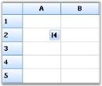' | markdownify }}
{:.image }

{{ '' | markdownify }}
{:.image }

{{ '' | markdownify }}
{:.image }

{{ '' | markdownify }}
{:.image }

_Figure_ _559_: "Right" Button Edit Cell Type_

{{ '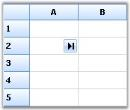' | markdownify }}
{:.image }

{{ '' | markdownify }}
{:.image }

{{ '' | markdownify }}
{:.image }

CalculatorTextBox

You can implement Calculator control in grid cells by using CalculatorTextBox cell type. This cell type is implemented as a drop-down container, embedded into the cell. The drop down contains the calculator, which displays and stores the value in the cell.

The following code example illustrates how to set the grid cell type to CalculatorTextBox.

[C#]

RegisterCellModel.GridCellType(gridControl1, CustomCellTypes.CalculatorTextBox);

CalculatorControl c1 = new CalculatorControl();

c1.BorderStyle = Border3DStyle.Flat;

c1.ButtonStyle = Syncfusion.Windows.Forms.ButtonAppearance.Office2007;

c1.UseVisualStyle = true;

GridStyleInfo style = gridControl1[4, 2];

style.CellType = "CalculatorTextBox";

style.Control = c1;

[VB.NET]

RegisterCellModel.GridCellType(gridControl1, CustomCellTypes.CalculatorTextBox)

Dim c1 As New CalculatorControl()

c1.BorderStyle = Border3DStyle.Flat

c1.ButtonStyle = Syncfusion.Windows.Forms.ButtonAppearance.Office2007

c1.UseVisualStyle = True

Dim style As GridStyleInfo = gridControl1(4, 2)

style.CellType = "CalculatorTextBox"

style.Control = c1

Following screen shot illustrates CalculatorTextBox cell type in the Grid control.

{{ '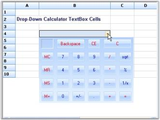' | markdownify }}
{:.image }

Calendar

You can implement MonthCalendar control in a grid cell by enabling Calendar cell type for that particular cell.

The following code example illustrates how to set the grid cell type to Calendar.

 [C#]

RegisterCellModel.GridCellType(gridControl1, CustomCellTypes.Calendar);

GridStyleInfo style;

style = gridControl1[row, 2];

style.CellType = "Calendar";

//Provides Month Calendar control for drawing cell contents.

style.Control = new MonthCalendar();

[VB.NET]

RegisterCellModel.GridCellType(gridControl1, CustomCellTypes.Calendar)

Dim style As GridStyleInfo

style = gridControl1(row, 2)

style.CellType = "Calendar"

'Provides Month Calendar control for drawing cell contents.

style.Control = New MonthCalendar()

Following screen shot illustrates Calendar cell type in Grid control.

{{ '' | markdownify }}
{:.image }

DateTimePicker

You can implement Date Time Picker control in grid cells by using DateTimePicker cell type. This cell type is implemented as a drop-down container, embedded into the cell where date and time picker is added. The drop down contains calendar, which displays and stores date value in the cell. Various formats for date and time can be specified by using Format style property.

The following code example illustrates how to set grid cell type to DateTimePicker.

 [C#]

RegisterCellModel.GridCellType(gridControl1, CustomCellTypes.DateTimePicker);

//Sets up DateTimePicker Cells.

this.gridControl1[4, 2].CellType = "DateTimePicker";

this.gridControl1[4, 2].CellValueType = typeof(DateTime);

this.gridControl1[4, 2].CellValue = DateTime.Now;

this.gridControl1[4, 2].Format = "MM/dd/yyyy hh:mm";

[VB.NET]

RegisterCellModel.GridCellType(gridControl1, CustomCellTypes.DateTimePicker)

'Sets up DateTimePicker Cells.

Me.gridControl1(4, 2).CellType = "DateTimePicker"

Me.gridControl1(4, 2).CellValueType = GetType(DateTime)

Me.gridControl1(4, 2).CellValue = DateTime.Now

Me.gridControl1(4, 2).Format = "MM/dd/yyyy hh:mm"

Following screen shot illustrates DateTimePicker cell type in Grid control.

{{ '' | markdownify }}
{:.image }

FnumericUpDown

You can implement Float Numeric Up Down control in grid cells by using FNumericUpDown cell type. FNumericUpDown cell types can be used by initializing FloatNumericUpDownStyleProperties class for grid cells. This will allow you set limitations of numeric values and several other properties can also be added as follows.

The following code example illustrates how to set grid cell type to FNumericUpDown.

[C#]

RegisterCellModel.GridCellType(gridControl1, CustomCellTypes.FNumericUpDown);

GridStyleInfo style = this.gridControl1[2, 2];

//Sets up FNumericUpDown Cell. 

style.CellType = "FNumericUpDown";

style.Text = "0.5";

[VB.NET]

RegisterCellModel.GridCellType(gridControl1, CustomCellTypes.FNumericUpDown)

Dim style As GridStyleInfo = Me.gridControl1(2, 2)

'Sets up FNumericUpDown Cell. 

style.CellType = "FNumericUpDown"

style.Text = "0.5"

Following screen shot illustrates FNumericUpDown cell type in the Grid control.

{{ '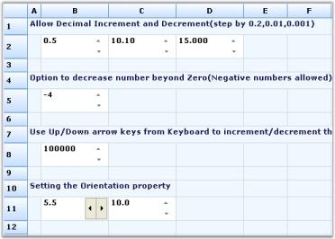' | markdownify }}
{:.image }

GridinCell

GridinCell cell type provides covered range of cells to embed the grid, which is added as a control to the cells. The registered cell model initializes the range by calculating the size of the grid control to be embedded, and adds styles such as borders and scroll bars to have the control within the range.

The following code example illustrates how to set grid cell type to GridinCell.

[C#]

RegisterCellModel.GridCellType(gridControl1, CustomCellTypes.GridinCell);

GridControl grid;

this.gridControl1[3, 2].CellType = "GridinCell";

this.gridControl1.CoveredRanges.Add(GridRangeInfo.Cells(3, 2, 7, 4));

grid = new Syncfusion.GridHelperClasses.CellEmbeddedGrid(this.gridControl1);

grid.BackColor = Color.FromArgb(0xb4, 0xe7, 0xf2);

grid.RowCount = 10;

grid.ColCount = 4;

grid[1, 1].Text = "this is a 10x4 grid";

grid.ThemesEnabled = true;

this.gridControl1[3, 2].Control = grid;

this.gridControl1.Controls.Add(grid);

[VB.NET]

RegisterCellModel.GridCellType(gridControl1, CustomCellTypes.GridinCell)

Dim grid As GridControl

Me.gridControl1(3, 2).CellType = "GridinCell"

Me.gridControl1.CoveredRanges.Add(GridRangeInfo.Cells(3, 2, 7, 4))

grid = New Syncfusion.GridHelperClasses.CellEmbeddedGrid(Me.gridControl1)

grid.BackColor = Color.FromArgb(&HB4, &HE7, &HF2)

grid.RowCount = 10

grid.ColCount = 4

grid(1, 1).Text = "this is a 10x4 grid"

grid.ThemesEnabled = True

Me.gridControl1(3, 2).Control = grid

Me.gridControl1.Controls.Add(grid)

Following screen shot illustrates GridinCell cell type in Grid control.

{{ '' | markdownify }}
{:.image }

LinkLabelCell

LinkLabelCell cell type displays text, which can be hyperlinked to a specific location. The path to be hyperlinked is specified by using the Tag property.

The following code example illustrates how to set grid cell type to LinkLabelCell.

 [C#]

RegisterCellModel.GridCellType(gridControl1, CustomCellTypes.LinkLabelCell);

int rowIndex = 5;

gridControl1[rowIndex, 2].CellType = "LinkLabelCell";

gridControl1[rowIndex, 2].Text = "Syncfusion, Inc.";

gridControl1[rowIndex, 2].Font.Bold = true;

gridControl1[rowIndex, 2].Tag = "http://www.syncfusion.com";

gridControl1[rowIndex, 2].HorizontalAlignment = GridHorizontalAlignment.Center;

[VB.NET]

RegisterCellModel.GridCellType(gridControl1, CustomCellTypes.LinkLabelCell)

Dim rowIndex As Integer = 5

gridControl1(rowIndex, 2).CellType = "LinkLabelCell"

gridControl1(rowIndex, 2).Text = "Syncfusion, Inc."

gridControl1(rowIndex, 2).Font.Bold = True

gridControl1(rowIndex, 2).Tag = "http://www.syncfusion.com"

gridControl1(rowIndex, 2).HorizontalAlignment = GridHorizontalAlignment.Center

Following screen shot illustrates LinkLabelCell cell type in the Grid control.                                      

{{ '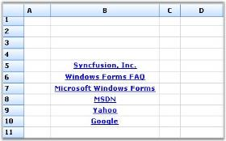' | markdownify }}
{:.image }

PictureBox

PictureBox cell type can be embedded into a cell by calculating the size of the picture and extending the width and height of the cell accordingly. PictureBoxStyleProperties class is used to specify the style for Picture Box control.

The following code example illustrates how to set the grid cell type to PictureBox.

[C#]

RegisterCellModel.GridCellType(gridControl1, CustomCellTypes.PictureBox);

Syncfusion.GridHelperClasses.PictureBoxStyleProperties tsp = new Syncfusion.GridHelperClasses.PictureBoxStyleProperties(new GridStyleInfo(gridControl1.TableStyle));

tsp.SizeMode = PictureBoxSizeMode.AutoSize;

Syncfusion.GridHelperClasses.PictureBoxStyleProperties sp;

GridStyleInfo style;

gridControl1.ColWidths[1] = 20;

style = gridControl1[2, 2];

style.CellType = "PictureBox";

sp = new Syncfusion.GridHelperClasses.PictureBoxStyleProperties(style);

sp.Image = GetImage("one.jpg");

[VB.NET]

RegisterCellModel.GridCellType(gridControl1, CustomCellTypes.PictureBox)

Dim tsp As New Syncfusion.GridHelperClasses.PictureBoxStyleProperties(New GridStyleInfo(gridControl1.TableStyle))

tsp.SizeMode = PictureBoxSizeMode.AutoSize

Dim sp As Syncfusion.GridHelperClasses.PictureBoxStyleProperties

Dim style As GridStyleInfo

gridControl1.ColWidths(1) = 20

style = gridControl1(2, 2)

style.CellType = "PictureBox"

sp = New Syncfusion.GridHelperClasses.PictureBoxStyleProperties(style)

sp.Image = GetImage("one.jpg")

Following screen shot illustrates PictureBox cell type in Grid control.

{{ '' | markdownify }}
{:.image }

#### Grid Field Chooser

You can customize column appearance of a Grid Grouping control by using plug-in utility called Field Chooser. FieldChooser class can be associated with Grid Grouping control to add or remove columns from the grid. The following code example illustrates this.

<table>
<tr>
<td>
[C#]FieldChooser fchooser = new FieldChooser(this.gridGroupingControl1);</td></tr>
<tr>
<td>
[VB.NET]Dim fchooser As New FieldChooser(Me.gridGroupingControl1)</td></tr>
</table>

Following screen shot shows Grid Grouping control with the Field dialog box.

{{ '' | markdownify }}
{:.image }

To add or remove columns by using Field Chooser, right-click column header and select Field Chooser menu item to view Field dialog box. This dialog box lists all the column names with check boxes. You can select or clear check boxes to add or remove respective columns from Grid Grouping control.

A sample demonstration of Grid Field Chooser feature is available in the following sample installation path.

_<Install Location>\Syncfusion\EssentialStudio\[Version Number]\Windows\Grid.Grouping.Windows\Samples\Layout Customization\Field Chooser Demo_

#### Filtering By Display Member

This topic elaborates on filtering columns in the Grid Data Bound Grid and Grid Grouping controls by their display member.

Filtering Columns in Grid Data Bound Grid

GridDataBoundGridFilterBarExt class provides support to filter a column in DataBound Grid by its display member instead of the value member. This is accomplished by implementing a custom filter bar cell by replacing the default filter bar cell.

Following code example illustrates how to wire GridDataBoundGridFilterBarExt to Data Bound Grid.

[C#]

private GridDataBoundGridFilterBarExt filterBar;

filterBar = new GridDataBoundGridFilterBarExt();

filterBar.WireGrid(this.gridDataBoundGrid1);

[VB.NET]

Private filterBar As GridDataBoundGridFilterBarExt

filterBar = New GridDataBoundGridFilterBarExt()

filterBar.WireGrid(Me.gridDataBoundGrid1)

Following screen shot illustrates how to filter a column in the Grid Data Bound Grid by its display member.

{{ '' | markdownify }}
{:.image }

Filtering Columns in Grid Grouping Control

GroupingGridFilterBarExt class provides support to filter a column in the Grid Grouping control by its display member instead of value member. This is accomplished by implementing a custom filter bar cell by replacing the default filter bar cell.

Following code example illustrates how to wire the GroupingGridFilterBarExt to the Grid Grouping control. 

[C#]

private GroupingGridFilterBarExt gGCFilter;

this.gGCFilter = new GroupingGridFilterBarExt();

this.gGCFilter.WireGrid(this.gridGroupingControl1);

[VB.NET]

Private gGCFilter As GroupingGridFilterBarExt

Me.gGCFilter = New GroupingGridFilterBarExt()

Me.gGCFilter.WireGrid(Me.gridGroupingControl1)

Following screen shot illustrates how to filter a column in the Grid Grouping control by its display member.

{{ '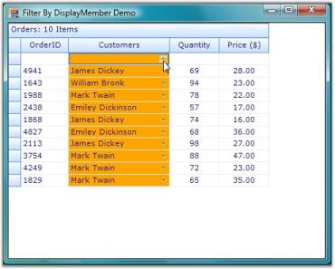' | markdownify }}
{:.image }

#### Grid Format Cell Dialog

Grid Format Cell Dialog, similar to the Excel-like Format Cell Dialog, enables users to format cells dynamically. It provides options to customize cell font family, font color, font size, font style, font effects, background, alignment, text format, and so on. You can instantiate Grid Format Cell Dialog by using the following code.

[C#]

GridFormatCellDialog f = new GridFormatCellDialog(this.gridControl1);

f.ShowDialog();

[VB.NET]

Dim f As New GridFormatCellDialog(Me.gridControl1)

f.ShowDialog()

Following screen shot illustrates the Format Cell Dialog of Grid control.

{{ '' | markdownify }}
{:.image }

#### Printing

This topic elaborates on printing options supported by Grid control.

Printing Multiple Grids

You can print multiple grids across various pages by using GridPrintDocumentAdv helper class. This is achieved by drawing full sized grid to a large bitmap and then drawing this bitmap scaled to fit the output page.

By using ScaleColumnsToFitPage property, columns can be scaled to fit a single page. Headers and footers can also be added by using DrawGridPrintHeader and DrawGridPrintFooter events. The following code examples illustrate how to do this.

[C#]

Syncfusion.GridHelperClasses.GridPrintDocumentAdv pd = new Syncfusion.GridHelperClasses.GridPrintDocumentAdv(this.gridControl1);

pd.DefaultPageSettings.Margins = new System.Drawing.Printing.Margins(25, 25, 25, 25);

pd.HeaderHeight = 70;

pd.FooterHeight = 50;

pd.ScaleColumnsToFitPage = true;

PrintPreviewDialog previewDialog = new PrintPreviewDialog();

previewDialog.Document = pd;

previewDialog.Show();

[VB.NET]

Dim pd As New Syncfusion.GridHelperClasses.GridPrintDocumentAdv(Me.gridControl1)

pd.DefaultPageSettings.Margins = New System.Drawing.Printing.Margins(25, 25, 25, 25)

pd.HeaderHeight = 70

pd.FooterHeight = 50

pd.ScaleColumnsToFitPage = True

Dim previewDialog As New PrintPreviewDialog()

previewDialog.Document = pd

previewDialog.Show()

The following screen shots illustrate the Print Preview feature of the Grid control.

{{ '' | markdownify }}
{:.image }

{{ '' | markdownify }}
{:.image }

Print Page Layout

Print Page Layout feature enables viewing page layout on the grid by displaying a segment line and page number with each segment. This helps users to analyze page breaks within the grid, and manage them accordingly.

Properties are available to define colors for the line and text of the page layout. The following code examples illustrate how to set the line and text color of the page layout.

[C#]

LayoutSupportHelper layoutHelper;

layoutHelper = new LayoutSupportHelper(gridControl1);

layoutHelper.LineColor= Color.Blue;

layoutHelper.TextColor = Color.Green;

[VB.NET]

Dim layoutHelper As LayoutSupportHelper

layoutHelper = New LayoutSupportHelper(gridControl1)

layoutHelper.TextColor = Color.Orange

layoutHelper.LineColor = Color.SteelBlue

Following screen shot illustrates print page layout feature of the Grid control.

{{ '' | markdownify }}
{:.image }

#### Word Converter

This topic illustrates how to convert Grid and Grid Grouping content to Word format.

Grid to Word Conversion

GridWordConverter class provides support to convert grid content into a Word document. It also provides support to add headers and footers to the document. Essential DocIO libraries are used to support conversion of grid content into a Word document. The following dependent assemblies must be included in your Windows application to work with GridWordConverter helper class: Syncfusion.DocIO.Base and Syncfusion.GridHelperClasses.Windows.

The following code examples illustrate conversion of Grid content to Word document.

[C#]

GridWordConverter converter = new GridWordConverter(true, true);

converter.DrawHeader+=new GridWordConverterBase.DrawDocHeaderFooterEventHandler(converter_DrawHeader);

converter.DrawFooter+=new GridWordConverterBase.DrawDocHeaderFooterEventHandler(converter_DrawFooter);

converter.GridToWord("Sample.doc", gridControl1);

System.Diagnostics.Process.Start("Sample.doc");

void converter_DrawFooter(object sender, DocHeaderFooterEventArgs e)

{

e.Footer.AddParagraph().AppendText("Copyright 2001-2008");

}

void converter_DrawHeader(object sender, DocHeaderFooterEventArgs e)

{

e.Header.AddParagraph().AppendText("Syncfusion Inc.");

}

[VB.NET]

Private converter As New GridWordConverter(True, True)

Private converter.DrawHeader+= New GridWordConverterBase.DrawDocHeaderFooterEventHandler(AddressOf converter_DrawHeader)

Private converter.DrawFooter+= New GridWordConverterBase.DrawDocHeaderFooterEventHandler(AddressOf converter_DrawFooter)

converter.GridToWord("Sample.doc", gridControl1)

System.Diagnostics.Process.Start("Sample.doc")

void converter_DrawFooter(Object sender, DocHeaderFooterEventArgs e)

e.Footer.AddParagraph().AppendText("Copyright 2001-2008")

void converter_DrawHeader(Object sender, DocHeaderFooterEventArgs e)

e.Header.AddParagraph().AppendText("Syncfusion Inc.")

The following screen shots illustrate Grid to Word conversion.

{{ '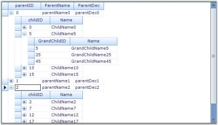' | markdownify }}
{:.image }

{{ '' | markdownify }}
{:.image }

Grouping Grid to Word Conversion

GroupingGridWordConverter class provides support to convert grouping grid content into a Word document. It also provides support to add headers and footers to the document. Essential DocIO libraries are used to support conversion of grouping grid content into a Word document. The following dependent assemblies must be included in your Windows application to work with GroupingGridWordConverter helper class: Syncfusion.DocIO.Base and Syncfusion.GridHelperClasses.Windows.

The following code example illustrates the conversion of Grouping Grid content to Word document.

[C#]

GroupingGridWordConverter converter = new GroupingGridWordConverter(true, true);

converter.DrawHeader += new GridWordConverterBase.DrawDocHeaderFooterEventHandler(converter_DrawHeader);

converter.DrawFooter += new GridWordConverterBase.DrawDocHeaderFooterEventHandler(converter_DrawFooter);

converter.GroupingGridToWord("Sample.doc", gridGroupingControl1);

System.Diagnostics.Process.Start("Sample.doc");

void converter_DrawFooter(object sender, DocHeaderFooterEventArgs e)

{

    IWTextRange txt = e.Footer.AddParagraph().AppendText("\t\t\tCopyright Syncfusion Inc. 2001 - 2008");

    txt.CharacterFormat.Font = new Font("verdana", 12f, FontStyle.Bold);

}

void converter_DrawHeader(object sender, DocHeaderFooterEventArgs e)

{

    IWTextRange txt = e.Header.AddParagraph().AppendText("\t\t\t\tSyncfusion Inc.\n");

    txt.CharacterFormat.Font = new Font("verdana", 12f, FontStyle.Bold);

}

[VB.NET]

Private converter As New GroupingGridWordConverter(True, True)

Private converter.DrawHeader += New GridWordConverterBase.DrawDocHeaderFooterEventHandler(AddressOf converter_DrawHeader)

Private converter.DrawFooter += New GridWordConverterBase.DrawDocHeaderFooterEventHandler(AddressOf converter_DrawFooter)

converter.GroupingGridToWord("Sample.doc", gridGroupingControl1)

System.Diagnostics.Process.Start("Sample.doc")

void converter_DrawFooter(Object sender, DocHeaderFooterEventArgs e)

Dim txt As IWTextRange = e.Footer.AddParagraph().AppendText(Constants.vbTab + Constants.vbTab + Constants.vbTab & "Copyright Syncfusion Inc. 2001 - 2008")

txt.CharacterFormat.Font = New Font("verdana", 12.0F, FontStyle.Bold)

void converter_DrawHeader(Object sender, DocHeaderFooterEventArgs e)

Dim txt As IWTextRange = e.Header.AddParagraph().AppendText(Constants.vbTab + Constants.vbTab + Constants.vbTab + Constants.vbTab & "Syncfusion Inc." & Constants.vbLf)

txt.CharacterFormat.Font = New Font("verdana", 12.0F, FontStyle.Bold)

The following screen shots illustrate Grouping Grid to Word conversion.

{{ '' | markdownify }}
{:.image }

{{ '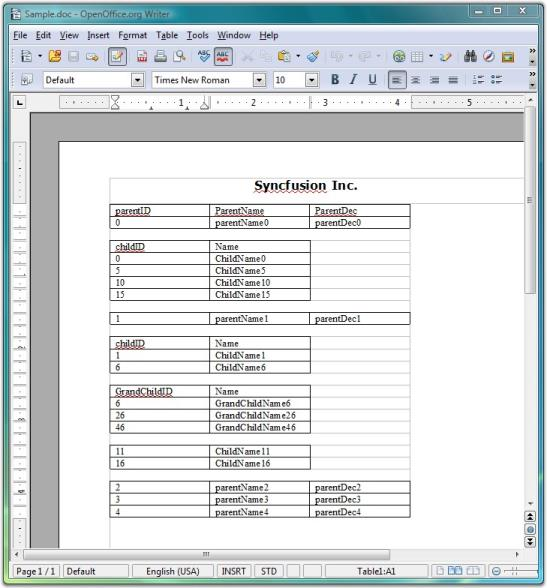' | markdownify }}
{:.image }

#### Fill Series 

Support to implement Excel-like Fill Series in the Grid

A helper class implementing IMouseController interface has been added to GridHelperClasses library to implement Excel-like Fill Series in the Grid. To make use of this functionality, Syncfusion.GridHelperClasses.Windows .dll must be referred and the mouse controller has to be added in MouseControllerDispatcher of grid.

The following support has been provided since 8.2.

The behavior has extended support, which pops up a menu after the drag, and has two items:

* Copy Series - Copy paste the content from the cell.
* Fill Series - Fill the cell with appropriate sequence.

The Excel Like fill Series has support on:

* Number - From active range with single or multiple cells (e.g. 1, 2, 3...)
* Text - Will paste the same text for both 'copy series' and 'fill series'
* Date - Date format must be MM/DD/YYYY
* Month - The month in text (e.g. January, February, March... or Jan, Feb, Mar...)

The following code illustrates how to add Excel Like fill Series.

[C#] 

            gridControl1.ExcelLikeCurrentCell = true;

            Syncfusion.GridHelperClasses.ExcelSelectionMarkerMouseController marker = new

 Syncfusion.GridHelperClasses.ExcelSelectionMarkerMouseController(this.gridControl1);

            this.gridControl1.MouseControllerDispatcher.Add(marker);

[VB]

            GridControl1.ExcelLikeCurrentCell = True

            Dim excelMarker As New ExcelMarkerMouseController(GridControl1)

            GridControl1.MouseControllerDispatcher.Add(excelMarker)

Methods of IMouseController Interface Implemented

* MouseMove - The code handled in this method allows dragging series in either one of the four directions at a time, retaining a rectangular layout.
* MouseUp - The code handled in this method sets the cell values based on dragged series accordingly (if it is a formula or text or numeric value).

Following are screen shots illustrating the feature.

1. Image displaying drag operation of the selected series towards bottom.

{{ '' | markdownify }}
{:.image }

2. Image displaying the filled series.

{{ '' | markdownify }}
{:.image }

3. The image shows popup menu displayed after dragging the cell that displays January.

{{ '' | markdownify }}
{:.image }

> {{ '' | markdownify }}
{:.image }
_Note: The cell has been dragged exactly the same as it is done in Excel._ 

4. The image shows cells have been filled after the Fill series has been selected from the popup menu.

{{ '' | markdownify }}
{:.image }

#### Excel-Like Filters

Office2007Filter and optimized GridExcelFilter are the two types of Excel-like filter. The next section explains these types in detail.

##### Office2007Filter

Essential Grid now provides an in-built filter similar to Microsoft Excel 2007 from the class GridOffice2007Filter with which the grid has to be wired.

Enabling Excel like filter 

Set Allow filter to true when Grid Control is wired with GridOffice2007Filter to enable Excel like filter to the Grid filter bar.

The following code illustrates how to add Excel Like Filter to the Grid filter bar.

[C#]

         GridOffice2007Filter filter;

         private void showFilter_CheckedChanged(object sender, EventArgs e)

        {

            this.gridGroupingControl1.TableDescriptor.Columns[0].AllowFilter = true;

            if (this.showFilter.Checked)

            {

                filter.WireGrid(this.gridGroupingControl1);

            }

            else

            {

                filter.UnWireGrid(this.gridGroupingControl1);

            }

        }

[VB]

    Private filter As GridOffice2007Filter

    Private Sub showFilter_CheckedChanged(ByVal sender As Object, ByVal e As EventArgs)

        Me.gridGroupingControl1.TableDescriptor.Columns(0).AllowFilter = True

        If Me.showFilter.Checked Then

            filter.WireGrid(Me.gridGroupingControl1)

        Else

            filter.UnWireGrid(Me.gridGroupingControl1)

        End If

    End Sub

> {{ '' | markdownify }}
{:.image }
_Note: GridOffice2007Filter can be unwired from the grid to disable Excel like filter._

Specifying Value To Filter 

The feature has multiple selections of values to filter. 

You can specify the value of the column that has to filter in the check box of tree view inside the drop down container.

{{ '' | markdownify }}
{:.image }

##### Optimized GridExcelFilter

Use Case Scenarios

If Office2007Filter is used in a WF GridGroupingControl where the columns have a large number of unique items (say 5000 or 10000), the grid is unusable (hanged). To improve the performance, the new optimized GridExcelFilter can be used.

_Table 134: Methods_

<table>
<tr>
<th>
METHOD </th><th>
DESCRIPTION </th><th>
PARAMETERS </th><th>
TYPE </th><th>
RETURN TYPE </th></tr>
<tr>
<th>
WireGrid</th><th>
Wires grid with filter.</th><th>
this.gridGroupingControl1 (control as argument)</th><th>
 Method</th><th>
 void </th></tr>
<tr>
<th>
UnWireGrid</th><th>
Unwire grid with filter. </th><th>
this.gridGroupingControl1 (control as argument)</th><th>
 Method</th><th>
 void </th></tr>
</table>
Sample Link

To view a sample:

* Open Syncfusion Dashboard. 
* Select UI > Windows Forms.
* Click Run Samples.  
* Navigate to GridGrouping Samples > Filters and Expressions > Optimized Excel Filter Demo

Implementing optimized GridExcelFilter to GGC 

Set AllowFilter to True when the Grid control is wired with GridOffice2007Filter to enable Excel-like filtering in the grid filter bar.

The following code illustrates how to add Excel-like filter to grid filter bar:

[C#]

GridExcelFilter filter;

         private void showFilter_CheckedChanged(object sender, EventArgs e)

        {

            this.gridGroupingControl1.TableDescriptor.Columns[0].AllowFilter = true;

            if (this.showFilter.Checked)

            {

                filter.WireGrid(this.gridGroupingControl1);

            }

            else

            {

                filter.UnWireGrid(this.gridGroupingControl1);

            }

        }

[VB]

Private filter As GridExcelFilter

Private Sub showFilter_CheckedChanged(ByVal sender As Object, ByVal e As EventArgs)

Me.gridGroupingControl1.TableDescriptor.Columns(0).AllowFilter = True

If Me.showFilter.Checked Then

filter.WireGrid(Me.gridGroupingControl1)

Else

filter.UnWireGrid(Me.gridGroupingControl1)

End If

End Sub

##### GridExcelFilter Enhancement

GridExcelFilter’s FilterByColor functionality is used to filter GridGroupingControl based on its color. You can enable or disable FilterByColor functionality by customizing AllowFilterByColor property before wiring GridGroupingControl. FilterByColor functionality is available for cell background color and font color. 

The following screenshot shows the result of setting FilterByColor property in GridGroupingControl.

{{ '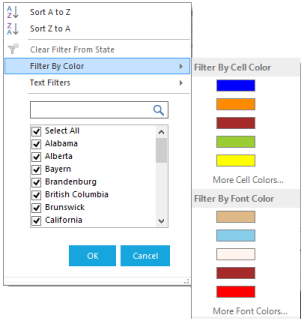' | markdownify }}
{:.image }

 The following code example shows how to set FilterByColor property for GridGroupingControl.

[C#]

this.filter.AllowResize = true;

this.filter.AllowFilterByColor = true;

GridTableDescriptor td = this.gridGroupingControl1.TableDescriptor.Relations["ParentToChild"].ChildTableDescriptor;

foreach (GridColumnDescriptor col in td.Columns)

{

col.AllowFilter = true;

}

this.filter.WireGrid(gridGroupingControl1);

AllowFilterByColor

You can enable FilterByColor functionality in GridExcelFilter by setting AllowFilterByColor property. GridExcelFilter calculates the colors available in the collection of the Grid Grouping control and displays any five colors from the collection in a drop-down. You can view the other available colors by clicking the “_More Cell Colors/More Font Colors”_ option in the drop-down menu.

The following screen shots show the list of available colors when FilerByColor property is enabled in GridGroupingControl.

{{ '' | markdownify }}
{:.image }

{{ '' | markdownify }}
{:.image }

AllowResize

Using AllowResize property, you can enable or disable resizable functionality of the GridExcelFilter. GridExcelFilter has a resizable strip at the bottom of the filterpopup, which is used to resize GridExcelFilter popup.
Search TextBox  
Search Textbox added in GridExcelFilter searches the available collection from checkedlistbox and displays searched results in the checkedlistbox.

##### Filtering Null Values from the Grid

This feature is to provide support for filtering null or empty values from the grid using Excel-like filters. The filter choice will be in the name of “(Blanks)” when there are empty values in the grid.

Option to Filter Empty values in Application

The option to filter empty values (Blanks) will automatically be included in filter choices when there are one or more empty values in the grid. No property is needed to enable this feature.

{{ '' | markdownify }}
{:.image }

##### Date and Number Filter in GridExcelFilter

###### Date Filter

You can use EnableDateFilter property in GridExcelFilter to search and filter the dates quickly. The following screenshot shows the values that are filtered by years in a filter Drop-down box. 

{{ '' | markdownify }}
{:.image }

Filter options 

You can use the following filter options by using context menu of the filter Drop-down.

* Equal - Returns the records that matches the given date.
* Before - Returns the records that are created before the given date.
* Afterbetween - Returns the records that matches the records after the given date.
* Today - Returns the records, which are matches today’s date.
* Tomorrow - To get the records that matches tomorrow’s date.
* Yesterday - To get the records that matches yesterday’s date.
* Month-wise - Using month-wise, you can filter the values for a particular month.
* Year-wise - Using year-wise, you can filter the values for a particular year.
* Quarter-wise - You can filter the records for a particular quarter.
* Custom filter - Using this option, you can filter the values based on customer dates.

You can filter the required dates using the above options in check box selection available in the filter Drop-down.

###### Number Filter

You can use EnableNumberFilter property in GridExcelFilter to filter the numbers that are displayed in a grid. This property is enabled in filter Drop-down when the cell value is in number format. You can filter the numbers using the following filter options.

Filter options 

* Equal - Returns the records the matches the given numeric value.
* Does Not Equal - Returns the records, which is not equal to the given date.
* Greater than - Returns the record that has the higher value than the given value.
* Greater than or equal - Returns the records that contain higher and equal value than the given one.
* Less than - Returns the records that have the lesser value than the given one
* Less than or equal - Returns the records that contains less or equal value for the given one.
* Between - Returns the records between the given two numeric values.
* Top 10 - Returns the top and bottom records using the new dialog box.
* Above average - Returns the records that are higher than the average value for the given numeric column.
* Below Average - Returns the records that are less than the average value for the given numeric column.
* Custom filter - Using this you can filter the records based on the custom filter option.

You can filter the top selected values or percentage of values using the Top 10 Filter option in EnableNumberFilter property. The following image shows an example of the Top 10 Filter option in EnableNumberFilter property.

{{ '' | markdownify }}
{:.image }

You can select the number of items using numeric up down option. You can select upto 100 items using this option.

#### Card View Layout

The card view displays records as separate cards arranged in a grid-like layout. It is implemented similar to binding GridDataBoundGrid control to GridCardView object.

##### Tables for Properties, Methods, and Events

_Table 135: Properties_

<table>
<tr>
<td>
PROPERTIES </td><td>
DESCRIPTION </td><td>
TYPE </td><td>
DATA TYPE </td></tr>
<tr>
<td>
CaptionField</td><td>
Sets or gets caption of each card. Users can set a column name to this. </td><td>
string</td><td>
string</td></tr>
<tr>
<td>
CardStyle</td><td>
Applies a card model such as standard, merged, variable, or compressed styles.</td><td>
CardStyle</td><td>
enum</td></tr>
<tr>
<td>
VisualStyle</td><td>
Applies the visual style of the cards in the grid. The new GridVisualStyles are applied to this.</td><td>
CardVisualStyle</td><td>
enum</td></tr>
<tr>
<td>
CardSpacingWidth</td><td>
Gets or sets the width of the spacing between each card.</td><td>
int</td><td>
int</td></tr>
<tr>
<td>
CardSpacingHeight</td><td>
Gets or sets the height of the spacing between each card.</td><td>
int</td><td>
int</td></tr>
<tr>
<td>
MaxCardCols</td><td>
Gets or sets the maximum number of cards in the column area. MaxCardRows will be automatically calculated.</td><td>
int</td><td>
int</td></tr>
<tr>
<td>
MaxCardRows</td><td>
Gets or sets the maximum number of cards in the row area. MaxCardCol will be automatically calculated if it is not set.</td><td>
int</td><td>
int</td></tr>
<tr>
<td>
ShowCaption</td><td>
Shows or hides the caption of each card.</td><td>
bool</td><td>
bool</td></tr>
<tr>
<td>
ShowCardCellBorders</td><td>
Shows or hides the cell borders.</td><td>
bool</td><td>
bool</td></tr>
<tr>
<td>
AllowResizing</td><td>
Allows or prevents the card resizing.</td><td>
bool</td><td>
bool</td></tr>
<tr>
<td>
CaptionHeight</td><td>
Gets or sets the height of the caption row.</td><td>
bool</td><td>
bool</td></tr>
<tr>
<td>
ActivateCurrentCellBehavior</td><td>
Specifies current cell activation behavior when moving the current cell or clicking inside a cell.</td><td>
GridCellActivateAction</td><td>
enum</td></tr>
<tr>
<td>
HighlightActiveCard</td><td>
Gets or sets the highlight of the active card.</td><td>
bool</td><td>
bool</td></tr>
</table>

_Table 136: Methods_

<table>
<tr>
<th>
METHODS</th><th>
DESCRIPTION </th><th>
PARAMETERS</th><th>
TYPE </th><th>
RETURN TYPE </th></tr>
<tr>
<th>
WireGrid</th><th>
Gets the GridDataBoundGrid and changes it to Card View Style.</th><th>
GridDataBoundGridboundGrid </th><th>
Method </th><th>
void</th></tr>
<tr>
<th>
UnWireGrid</th><th>
Unhooks all the events hooked in the WireGrid() method.</th><th>
N/A</th><th>
Method</th><th>
Void</th></tr>
<tr>
<th>
IsActiveCard</th><th>
Indicates the state of the card if active.</th><th>
rowIndex, ColIndex</th><th>
Method</th><th>
bool</th></tr>
<tr>
<th>
IsHeaderCell</th><th>
Indicates if the cell is a header column cell.</th><th>
rowIndex, ColIndex</th><th>
Method</th><th>
bool</th></tr>
<tr>
<th>
IsRecordCell</th><th>
Indicates if the cell is a record cell.</th><th>
rowIndex,colIndex.</th><th>
Method</th><th>
bool</th></tr>
<tr>
<th>
IsValueCell</th><th>
Indicates if the cell is a value cell.</th><th>
rowIndex,colIndex.</th><th>
Method</th><th>
bool</th></tr>
<tr>
<th>
IsCardCaption</th><th>
Indicates if the cell is a caption cell.</th><th>
rowIndex,colIndex.</th><th>
Method</th><th>
bool</th></tr>
<tr>
<th>
GetCardCellTypeGetCardCellType</th><th>
Specifies the type of the card cell.</th><th>
rowIndex,colIndex.</th><th>
Method</th><th>
CardCellType</th></tr>
</table>

_Table 137: Events_

<table>
<tr>
<th>
EVENTS</th><th>
DESCRIPTION </th><th>
ARGUMENTS </th><th>
TYPE </th></tr>
<tr>
<th>
QueryCardCellInfo</th><th>
Occurs when the card model queries for style information about a specific cell.</th><th>
public QueryCardCellInfoEventArgs(GridQueryCellInfoEventArgs e, GridCardView cardView)</th><th>
Event</th></tr>
<tr>
<th>
CellClick</th><th>
Occurs when the user clicks inside a cell.</th><th>
public CardCellClickEventArgs(GridCellClickEventArgs e, GridCardView cardView)</th><th>
Event</th></tr>
<tr>
<th>
SaveCardCellInfo</th><th>
Occurs when the card model is about to save style information about a specific cell.</th><th>
public SaveCardCellInfoEventArgs(GridSaveCellInfoEventArgs e, GridCardView cardView)</th><th>
Event</th></tr>
<tr>
<th>
PushButtonClick</th><th>
Occurs when the user clicks a push button.</th><th>
public CardCellPushButtonClickEventArgs(GridCellPushButtonClickEventArgs e, GridCardView cardView)</th><th>
Event</th></tr>
</table>

{{ '' | markdownify }}
{:.image }

Sample Link

_<Install Location>\Syncfusion\EssentialStudio\[Version Number]\Windows\GridDataBound.Windows\Samples\Product Showcase\Card View Demo_

##### Enable the Card View Layout

The following code is used to enable card view layout in GridDataBoundGrid control.

[C#]

GridCardView card = new GridCardView();

card.CaptionField = "ProductName";

card.WireGrid(this.gridDataBoundGrid1);

[VB]

Private card As New GridCardView()

card.CaptionField = "ProductName"

card.WireGrid(Me.gridDataBoundGrid1)

### Office2010 Theme in Windows Grids

This feature provides support to have MS Office 2010 themes namely Blue, Black, and Silver) for Windows Grids: GridControl, GridGroupingControl, GridDataBoundGrid, GridListControl, GridRecordNavigationControl and associated scrollbars.

To enable this support in grid, the following need to be handled:

* Apply Office 2010 Visual Style to Grid
* Enable Office 2010 Scrollbars

Applying Office2010 Visual Style to Grid

To apply Office 2010 Visual Style to Grid:

1. Create grid enabled sample application.
2. Set Office2010 theme to grid control using GridVisualStyles.

{{ '' | markdownify }}
{:.image }

Enabling Office2010 Scrollbars

To enable Office 2010 Scrollbars:

3. Set GridOfficeScrollBars property to Office 2010.
4. Set Office2010ScrollBarColorScheme property to Blue, Black, or Silver.

{{ '' | markdownify }}
{:.image }

Use Case Scenarios

Office2010Theme support for Windows Grids is useful for commercial applications in order to attract its users with inspiring UI look and feel.

{{ '' | markdownify }}
{:.image }

{{ '' | markdownify }}
{:.image }

{{ '' | markdownify }}
{:.image }

Tables for Properties and Events

Properties

_Table_ _11_38: Properties Table_

<table>
<tr>
<td>
PROPERTY</td><td>
DESCRIPTION</td><td>
DATA TYPE</td></tr>
<tr>
<td>
GridVisualStyles</td><td>
* This is an Enumeration type property.* This property is used to get or set the VisualStyles (skins) like Office2010, Office2007, Office2003.</td><td>
 Syncfusion.Windows.Forms.GridVisualStyles</td></tr>
<tr>
<td>
GridOfficeScrollbars</td><td>
* This is an Enumeration type property.* This property is used to get or set the Office like scrollbars.</td><td>
 Syncfusion.Windows.Forms.OfficeScrollBars</td></tr>
<tr>
<td>
Office2010ScrollBarsColorScheme</td><td>
* This is an Enumeration type property.* This property is used to get or set the style of Office2010 scroll bars</td><td>
 Syncfusion.Windows.Forms.Office2010ColorScheme</td></tr>
</table>

Events

The following event is used when applying Office2010 theme to Essential Windows Grids.

_Table 139: Events Table_

<table>
<tr>
<td>
EVENT</td><td>
PARAMETERS</td><td>
DESCRIPTION</td></tr>
<tr>
<td>
ThemeChanged</td><td>
Object sender, EventArgs e</td><td>
Occurs when the ThemesEnabled property is changed.</td></tr>
</table>

The following events occur when GridOfficeScrollBars are applied to Essential Windows Grids.

_Table 140: Events Table_

<table>
<tr>
<th>
EVENTS</th><th>
PARAMETERS</th><th>
DESCRIPTION</th></tr>
<tr>
<td>
Office2010ScrollBarsColorSchemeChanged</td><td>
Object sender, EventArgs e</td><td>
Occurs when the Office2010ScrollBarsColorScheme property has changed.</td></tr>
<tr>
<td>
OfficeScrollBarsChanged</td><td>
object sender, GridGroupingControl.OfficeScrollBarsEventArgs e</td><td>
Occurs when the GridOfficeScrollBars property has changed.</td></tr>
</table>
Adding Grid with Office2010 Theme to an Application 

To add Grid with Office 2010 theme to an application:

1. Create a GridControl enabled application.
2. Set GridVisualStyles property to apply Office2010 theme in GridControl.

The following sample code sets an Office2010 Black skin theme to Essential Grid Control.  

[C#]

this.gridGroupingControl1.GridVisualStyles = GridVisualStyles.Office2010Black;

[VB]

Me.gridGroupingControl1.GridVisualStyles = GridVisualStyles.Office2010Black

3. Set GridOfficeScrollBars property to Office2010 to apply Office2010 like scroll bars in Essential Windows Grids.
4. Set Office2010ScrollBarsColorScheme to apply the color scheme of the scroll bars.

[C#]

this.gridGroupingControl1.GridOfficeScrollBars = OfficeScrollBars.Office2010;

this.gridGroupingControl1.Office2010ScrollBarsColorScheme = Office2010ColorScheme.Black;

[VB]

Me.gridGroupingControl1.GridOfficeScrollBars = OfficeScrollBars.Office2010

Me.gridGroupingControl1.Office2010ScrollBarsColorScheme = Office2010ColorScheme.Black

Sample Link

To get the Schedule samples from the dashboard:

1. Open Essential Studio Dashboard by selecting Start -> All Programs -> Syncfusion -> Essential Studio <<Version Number>> -> Dashboard.
2. Select “Run Locally Installed Samples” from the Windows Forms drop-down list on the User Interface pane.
3. Expand “Grid samples” in the left panel of sample browser.
4. Expand “Appearance” subsection and select “Grid Style Demo”.
5. Click the “Run Sample” button in the right panel.

To open sample project:

1. Navigate to the following sample location in your system:

_<Install Location>\Syncfusion\EssentialStudio\[Version Number]\Windows\Grid.Windows\Samples\Appearance\GridStyle Demo_

2. This location contains two sub folders CS and VB.  You can open the sample projects from the respective folders based on your application language.
### Enhanced Visual Styles for Syncfusion Windows Grids

This feature enables you to apply an enhanced visual styles for Windows Grids: Grid control, GridGrouping control, GridDataBoundGrid, GridList control, GridRecordNavigation control and associated scrollbars, combo box drop-down container, filter (dynamic filter and filter bar), selected row and group drop area.

By default, EnableLegacyStyle property value is true.

Use Case Scenarios

You can use this control to apply skin for the entire control including the scrollbars, combo box, drop-down container, filter, and so on.

 _Table 141: Properties Table_

<table>
<tr>
<td>
PROPERTY</td><td>
DESCRIPTION</td><td>
DATA TYPE</td></tr>
<tr>
<td>
EnableLegacyStyle</td><td>
Specifies whether the enhanced GridVisual style has to be enabled.</td><td>
Boolean</td></tr>
<tr>
<td>
EnableGridListControlInCobmoBox</td><td>
Specifies whether the grid combo box should contain GridList control.</td><td>
Boolean</td></tr>
</table>
 Sample Link

Samples for the feature are available in the following locations: 

_<Install Location>\Syncfusion\EssentialStudio\[Version Number]\Windows\Grid.Grouping.Windows\Samples\Styling and Formatting\Skin Customization Demo_

#### Applying Enhanced GridVisualStyle to the Application

To apply enhanced visual style to the entire control, you have to enable enhanced GridVisualStyle. You can enable this using _EnableLegacyStyle_ property. To enable enhanced GridVisualStyle, set EnableLegacyStyle to _false_. To enable GridVisualStyle, set EnableLegacyStyle to _true_. By default, this is set to _true_.                                                   

The following code illustrates how to enable enhanced GridVisualStyle. 

[C#]

this.gridGroupingControl1.TableModel.EnableLegacyStyle = false;

[VB]

Me.gridGroupingControl1.TableModel.EnableLegacyStyle = False

 EnhancedGridVisualStyle

You can apply one of the following skins to the control using EnhancedGridVisualStyle property: 

* Office2003
* Office2007Blue
* Office2007Black
* Office2007Silver
* Office2010Blue
* Office2010Black
* Office2010Silver
* Metro
* SystemTheme 

SystemTheme is the default skin.

The following code illustrated how to customize the skin for the control: 

[C#]

this.gridGroupingControl1.GridVisualStyles = GridVisualStyles.Office2007Black;

[VB]

this.gridGroupingControl1.GridVisualStyles = GridVisualStyles.Office2007Black

{{ '' | markdownify }}
{:.image }

#### Combo Box

Skin cannot be applied to ListBox control inside combo box. To overcome this limitation, Essential Grid uses GridList_control in the combo box. The enhanced GridVisualStyle settings uses combo box with GridDropDownGridListControlCellModel, which is inherited from GridComboBoxCellModel_class, instead of using GridComboBoxCellModel directly. To use GridList control in the combo box (which enables you to apply styles), set EnableGridListControlInCobmoBox property to true_._  This is_the default value.

The following code illustrated this: 

[C#]

this.gridControl1.Model.EnableGridListControlInComboBox = true;

[VB]

Me.gridControl1.Model.EnableGridListControlInComboBox = true

If you want to create an application for which the combo box is created from GridComboBoxCellModel and not to use GridDropDownGridListControlCellModel, you need to set EnableGridListControlInCobmoBox property to false. By default, this is set to true.

The following code illustrates how to disable EnableGridListControlInCobmoBox property:

[C#]

this.gridControl1.Model.EnableGridListControlInComboBox = false;

[VB]

this.gridControl1.Model.EnableGridListControlInComboBox = false;

### Metro Theme for Essential Grid Controls

This feature enables you to apply new Metro styles to the controls of Essential Grid for Windows Forms. It provides support for the following controls and its associated scroll bars:

* Grid control
* GridGrouping control
* GridDataBound control
* GridList control
* GridRecordNavigation control

Use case scenarios

The Metro theme support is useful for commercial applications in order to attract end users with inspiring UI look and feel.

#### Tables for Properties and Events

_Table 142: Properties Table_

<table>
<tr>
<td>
PROPERTY</td><td>
DESCRIPTION</td></tr>
<tr>
<td>
GridVisualStyles</td><td>
This is an enumeration type property. It is used to get or set the visual styles (skins) such as Office2010, Office2007, Office2003, Metro, etc.</td></tr>
</table>

_Table_ _12_43: Event Table_

<table>
<tr>
<td>
EVENT</td><td>
PARAMETERS</td><td>
DESCRIPTION</td></tr>
<tr>
<td>
ThemeChanged</td><td>
Object sender, EventArgs e</td><td>
Occurs when the ThemesEnabled property is changed.</td></tr>
</table>

#### Applying Metro Theme to a Control

You can apply Metro theme to an application by setting GridVisualStyles property as Metro. The following code example illustrates how to apply Metro theme for the GridGrouping control.

[C#]

this.gridGroupingControl1.GridVisualStyles = GridVisualStyles.Metro;

[VB]

Me.gridGroupingControl1.GridVisualStyles = GridVisualStyles.Metro

The following screenshot is a sample output for the previous code.

{{ '' | markdownify }}
{:.image }

#### Applying User-Defined Colors as Metro Themes

Users can now utilize SetMetroStyle method to set user-defined colors as Metro theme in a grid. 

_Table 144: Method Table_

<table>
<tr>
<td>
METHOD</td><td>
PROTOTYPE</td><td>
DESCRIPTION</td></tr>
<tr>
<td>
SetMetroStyle</td><td>
public void SetMetroStyle(Color metroColor,Color metroHoverColor,Color metroColorPressed);</td><td>
A method that takes the user-defined back color, mouse hover color, and mouse pressed color to apply to grid.</td></tr>
</table>

{{ '' | markdownify }}
{:.image }

{{ '' | markdownify }}
{:.image }

{{ '' | markdownify }}
{:.image }

[C#]

this.gridControl1.SetMetroStyle(Color.Pink, Color.Plum, Color.PowderBlue);

[VB]

Me.gridControl1.SetMetroStyle(Color.Pink, Color.Plum, Color.PowderBlue)

### Coded UI Support in Windows Grids

Essential Grid for Windows Forms now supports automated UI testing with VS 2010 Coded UI technology. The Grid Test plugin blends in with automated UI testing framework in VS 2010 by implementing the following classes:

* UITechnologyManager
* UITestPropertyProvider
* UIActionFilter

The architectural diagram is as follows:

_Figure_ _602_: Architectural Diagram_

* The Grid Test Plugin implements necessary details to communicate with VS 2010 Test Framework.
* The Grid application host runs with .NET Remoting channel hosted internally to communicate with test plugin through an interface. Data is then channeled across the VS 2010 Test Framework to identify the Cells and Grid controls.

Use Case Scenarios

You can create Coded UI Test with Essential Grid for Windows Forms. The following example shows the implementation of the feature.

Perform the following initial steps before creating the Coded UI Test project:

* Deploying Extension assembly
* Prepare Grid sample application
* Write UI tests using VS 2010
* Testing the application with generated Coded UI Tests
#### Deploying Extension Assembly

To deploy extension assembly:

1. Navigate to copydrop.bat file in UITest folder.
2. Run Bat file to place Extension and Provider assemblies with appropriate directories to pick the assemblies by VS2010.
#### Preparing the Grid Application

To prepare the Grid Application:

1. Syncfusion.VisualStudio.TestTools.UITest.GridCommunication.dll contains implementation to easily change an existing application to the test application that the plugin would require.
2. Let the parent container inherit GridControlTestApplication class as shown below:

[C#]

public class Form1 : GridControlTestApplication

{

}

[VB]

Public Class Form1

Inherits GridControlTestApplication

End Class

3. Build and run the application to make it ready for testing.
#### Creating Unit Tests with VS2010

To create Unit Tests with VS2010:

1. Create a new test project in VS2010.

{{ '' | markdownify }}
{:.image }

2. Add a new CodedUITest item for the project.

{{ '' | markdownify }}
{:.image }

_Figure_ _604_: Adding Coded UI Test file_

#### Testing the Application with Generated Coded UI Tests

To test the application with generated coded UI Tests:

1. Add a TestMethod called CodedUITestMethod1.

[C#]

  [TestMethod]

public void CodedUITestMethod1()

{

//Generates codes for this test, select "Generate Code for Coded UI Test" from the shortcut menu and select one of the menu items.

//For more information on generated code, see: http://go.microsoft.com/fwlink/?LinkId=179463

}

[VB]

  <TestMethod()>

Public Sub CodedUITestMethod1()

            '            

'Generates codes for this test, select "Generate Code for Coded UI Test" from the shortcut menu and select one of the menu items.

'For more information on generated code, see: http://go.microsoft.com/fwlink/?LinkId=179463

            '

End Sub

2. Build and run the Grid application that was configured already. Right-click TestMethod body and then select Generate Code for Coded UI Test -> Use Coded UI Test Builder as shown in the following screenshot:

{{ '' | markdownify }}
{:.image }

3. Click the Record button to perform actions. In this scenario, add a text Hello World in a cell [x, y].

{{ '' | markdownify }}
{:.image }

{{ '' | markdownify }}
{:.image }
     _Figure_ _607_: Identifying the Table of the Syncfusion Grid_

{{ '' | markdownify }}
{:.image }

4. Assert the cell value using cross-hair present in Coded UI Test builder. Click cross-hair and hover to the cell. It will display Assert window as shown in the following screenshot:

{{ '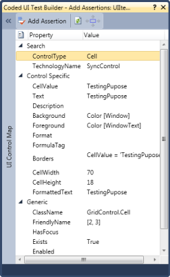' | markdownify }}
{:.image }

#### Properties

Below is the Cell Properties Table-

_Table 145: Cell properties_

<table>
<tr>
<th>
PROPERTIES</th><th>
DESCRIPTION</th><th>
TYPE</th><th>
DATA TYPE</th></tr>
<tr>
<td>
AllowEnter</td><td>
Indicates that by pressing the <Enter>-Key, a new line is inserted into the edited text.</td><td>
-</td><td>
bool</td></tr>
<tr>
<td>
AllowPrompt</td><td>
Specifies if the prompt character can be allowed to be entered as an input character.</td><td>
-</td><td>
bool</td></tr>
<tr>
<td>
AutoSize</td><td>
Specifies that the cell height should automatically increase when the edited text does not fit into the cell and when WrapText is True. If WrapText is False, AutoSize will affect the column width.</td><td>
-</td><td>
bool</td></tr>
<tr>
<td>
BackGradientEndColor</td><td>
The end color of the dual gradient of the background (Progress bar).</td><td>
-</td><td>
Color</td></tr>
<tr>
<td>
BackGradientStartColor</td><td>
The start color of the dual gradient of the background (Progress bar).</td><td>
-</td><td>
Color</td></tr>
<tr>
<td>
Background</td><td>
Background color of the control.</td><td>
-</td><td>
Color</td></tr>
<tr>
<td>
BackgroundFallBackStyle</td><td>
Determines the background style when System mode is selected and the machine does not support themes.</td><td>
-</td><td>
ProgressBarBackgroundStyles</td></tr>
<tr>
<td>
BackgroundImageID</td><td>
Gets / sets the image that the PictureBox displays.</td><td>
-</td><td>
Image</td></tr>
<tr>
<td>
BackgroundImageMode</td><td>
Indicates how the image is displayed.</td><td>
-</td><td>
GridBackgroundImageMode</td></tr>
<tr>
<td>
BackgroundStyle</td><td>
Determines the background style.</td><td>
-</td><td>
ProgressBarBackgroundStyles</td></tr>
<tr>
<td>
BackMultipleColors</td><td>
The array of colors used to draw the multiple gradient of the background.</td><td>
-</td><td>
Color[]</td></tr>
<tr>
<td>
BackSegments</td><td>
Determines if the background is segmented.</td><td>
-</td><td>
bool</td></tr>
<tr>
<td>
BackTubeEndColor</td><td>
The outer color of the tube of the background.</td><td>
-</td><td>
Color</td></tr>
<tr>
<td>
BackTubeStartColor</td><td>
The middle color of the tube of the background.</td><td>
-</td><td>
Color</td></tr>
<tr>
<td>
Borders</td><td>
Top, left, bottom, and right border settings.</td><td>
-</td><td>
GridBordersInfo</td></tr>
<tr>
<td>
CellAppearance</td><td>
Specifies if cell edges shall be drawn raised, sunken, or flat (default).</td><td>
-</td><td>
GridCellAppearance</td></tr>
<tr>
<td>
CellTipText</td><td>
ToolTip text to be displayed when the user hovers the mouse over the cell.</td><td>
-</td><td>
string</td></tr>
<tr>
<td>
CellType</td><td>
Contains cell type information of a cell.</td><td>
-</td><td>
string</td></tr>
<tr>
<td>
CellValue</td><td>
Contains cell value information of a cell.</td><td>
-</td><td>
object</td></tr>
<tr>
<td>
CheckState</td><td>
Indicates the check state of the node.</td><td>
-</td><td>
CheckState</td></tr>
<tr>
<td>
Clickable</td><td>
Specifies if the user can click on any cell button elements in this renderer.</td><td>
-</td><td>
bool</td></tr>
<tr>
<td>
Control</td><td>
A custom control you can associate with a cell.</td><td>
-</td><td>
Control</td></tr>
<tr>
<td>
CultureInfo</td><td>
The culture information holds rules for parsing and formatting the cell's value.</td><td>
-</td><td>
CultureInfo</td></tr>
<tr>
<td>
CurrencyDecimalDigits</td><td>
Gets or sets the maximum number of digits for the decimal portion of the currency.</td><td>
-</td><td>
int</td></tr>
<tr>
<td>
CurrencyDecimalSeperator</td><td>
Gets or sets the decimal separator character that will be used for the display.</td><td>
-</td><td>
string</td></tr>
<tr>
<td>
CurrencyGroupSeperator</td><td>
Gets or sets the separator to be used for grouping digits.</td><td>
-</td><td>
string</td></tr>
<tr>
<td>
CurrencyGroupSizes</td><td>
Gets or sets the grouping of CurrencyDigits in the CurrencyTextBox</td><td>
-</td><td>
int[]</td></tr>
<tr>
<td>
CurrencyNumberDigits</td><td>
Gets or Sets the number of digits for the number part. This value is initially set based on the maximum value of the Currency data type.</td><td>
-</td><td>
int</td></tr>
<tr>
<td>
CurrencySymbol</td><td>
Gets or sets the currency symbol to be used in the CurrencyTextBox.</td><td>
-</td><td>
string</td></tr>
<tr>
<td>
DataSource</td><td>
Indicates the list that this cell will use to get its items.</td><td>
-</td><td>
object</td></tr>
<tr>
<td>
DateSeperator</td><td>
Gets or sets the character to use when a date separator position is specified.</td><td>
-</td><td>
char</td></tr>
<tr>
<td>
DecimalSeperator</td><td>
Gets or sets the character to use when a decimal separator position is specified.</td><td>
-</td><td>
char</td></tr>
<tr>
<td>
Description</td><td>
Gets or sets the text that is shown in check box or pushbuttons.</td><td>
-</td><td>
string</td></tr>
<tr>
<td>
DisplayMember</td><td>
Indicates the property to display for the items in this control.</td><td>
-</td><td>
string</td></tr>
<tr>
<td>
Enabled</td><td>
Specifies if the cell can be activated as the current cell or if the cell should be skipped when moving the current cell.</td><td>
-</td><td>
bool</td></tr>
<tr>
<td>
FloatCell</td><td>
Gets or sets if text can float into the boundaries of a neighboring cell.</td><td>
-</td><td>
bool</td></tr>
<tr>
<td>
FloodCell</td><td>
Gets or sets if this cell can be flooded by a previous cell.</td><td>
-</td><td>
bool</td></tr>
<tr>
<td>
Font</td><td>
The font for drawing text.</td><td>
-</td><td>
GridFontInfo</td></tr>
<tr>
<td>
Foreground</td><td>
The foreground color used to display text and graphics in the control.</td><td>
-</td><td>
Color</td></tr>
<tr>
<td>
ForeSegments</td><td>
Determines if the foreground is segmented (Progress bar)</td><td>
-</td><td>
bool</td></tr>
<tr>
<td>
Format</td><td>
Contains format information of a cell.</td><td>
-</td><td>
string</td></tr>
<tr>
<td>
FormulaTag</td><td>
A custom tag you can associate with a cell.</td><td>
-</td><td>
GridFormulaTag</td></tr>
<tr>
<td>
GradientEndColor</td><td>
The end color of the dual gradient of the foreground (Progress bar).</td><td>
-</td><td>
Color</td></tr>
<tr>
<td>
GradientStartColor</td><td>
The start color of the dual gradient of the foreground (Progress bar).</td><td>
-</td><td>
Color</td></tr>
<tr>
<td>
HorizontalAlignment</td><td>
Specifies the horizontal alignment of text in the cell.</td><td>
-</td><td>
GridHorizontalAlignment</td></tr>
<tr>
<td>
ImageIndex</td><td>
Holds an image index that specifies an image inside an image list.</td><td>
-</td><td>
int</td></tr>
<tr>
<td>
ImageList</td><td>
A list of images.</td><td>
-</td><td>
ImageList</td></tr>
<tr>
<td>
ImageSizeMode</td><td>
Indicates how the image is displayed.</td><td>
-</td><td>
GridImageSizeMode</td></tr>
<tr>
<td>
Interior</td><td>
Lets you specify a solid backcolor, gradient, or pattern style with both back and forecolor for a cell's background.</td><td>
-</td><td>
BrushInfo</td></tr>
<tr>
<td>
MaxLength</td><td>
Limits the number of characters the user can type into the cell. Note: When selecting a text from a choice list or when pasting text, the text can be longer but additional validation is necessary from your side.</td><td>
-</td><td>
int</td></tr>
<tr>
<td>
MaxValue</td><td>
Specifies the maximum value that can be set through the MaskedEditBox.</td><td>
-</td><td>
decimal</td></tr>
<tr>
<td>
MergeCell</td><td>
Specifies if cell edges shall be drawn raised, sunken, or flat (default).</td><td>
-</td><td>
GridMergeCellDirection</td></tr>
<tr>
<td>
MinValue</td><td>
Specifies the minimum value that can be set through the MaskedEditBox.</td><td>
-</td><td>
decimal</td></tr>
<tr>
<td>
NegativeColor</td><td>
Gets/Sets the forecolor when the current value is negative.</td><td>
-</td><td>
Color</td></tr>
<tr>
<td>
NegativeSign</td><td>
Specifies the sign that is to be used to indicate a negative value.</td><td>
-</td><td>
string</td></tr>
<tr>
<td>
NullString</td><td>
Specifies the string to be displayed when the DecimalValue is 0.</td><td>
-</td><td>
string</td></tr>
<tr>
<td>
NullValue</td><td>
Specifies the value to be saved when the modified display text matches the null string.</td><td>
-</td><td>
object</td></tr>
<tr>
<td>
PaddingCharacter</td><td>
Specifies the character that will be used instead of mask characters when the mask position has not been filled when the Text property is used.</td><td>
-</td><td>
char</td></tr>
<tr>
<td>
PassivePromptCharacter</td><td>
The prompt character that will serve as a placeholder for mask characters when the control does not have the focus.</td><td>
-</td><td>
char</td></tr>
<tr>
<td>
PasswordChar</td><td>
The character used to mask characters of a password in a password-entry cell.</td><td>
-</td><td>
char</td></tr>
<tr>
<td>
PositiveColor</td><td>
Gets or Sets the forecolor when the current value is positive</td><td>
-</td><td>
Color</td></tr>
<tr>
<td>
ProgressFontColor</td><td>
The color of the font used to draw the text of the ProgressBar.</td><td>
-</td><td>
Color</td></tr>
<tr>
<td>
ProgressForeColor</td><td>
The color used to draw the foreground in segment mode and constant mode.</td><td>
-</td><td>
Color</td></tr>
<tr>
<td>
ProgressMaximum</td><td>
The higher bound of the range of the ProgressBar.</td><td>
-</td><td>
int</td></tr>
<tr>
<td>
ProgressMinimum</td><td>
The lower bound of the range of the ProgressBar.</td><td>
-</td><td>
int</td></tr>
<tr>
<td>
ProgressMultipleColors</td><td>
The array of colors used in the multiple gradient of the foreground.</td><td>
-</td><td>
Color</td></tr>
<tr>
<td>
ProgressOrientation</td><td>
Determines the orientation of the text.</td><td>
-</td><td>
Orientation</td></tr>
<tr>
<td>
ProgressStep</td><td>
The amount to increment the value of the ProgressBar when Increment() is called.</td><td>
-</td><td>
int</td></tr>
<tr>
<td>
ProgressStretchImage</td><td>
Determines if the foreground image will be stretched.</td><td>
-</td><td>
bool</td></tr>
<tr>
<td>
ProgressStyle</td><td>
Determines the foreground drawing style.</td><td>
-</td><td>
ProgressBarStyles</td></tr>
<tr>
<td>
ProgressTextVisible</td><td>
Determines if the text of the Progressbar is visible.</td><td>
-</td><td>
bool</td></tr>
<tr>
<td>
ProgressValue</td><td>
The current value between the minimum and maximum values.</td><td>
-</td><td>
int</td></tr>
<tr>
<td>
PromptCharacter</td><td>
The prompt character that will serve as a placeholder for mask characters when the control does not have the focus (MaskEdit).</td><td>
-</td><td>
char</td></tr>
<tr>
<td>
ReadOnly</td><td>
Specifies if cell contents can be modified by the user. You can programmatically change Read-only cells by setting IgnoreReadOnly to True.</td><td>
-</td><td>
bool</td></tr>
<tr>
<td>
RightToLeft</td><td>
Specifies if the cell content reads from right to left.</td><td>
-</td><td>
RightToLeft</td></tr>
<tr>
<td>
ShowButtons</td><td>
Specifies when to show or display the cell buttons. Possible choices are: show the button only for the current cell, always show buttons, or never show buttons.</td><td>
-</td><td>
GridShowButtons</td></tr>
<tr>
<td>
StretchMultGrad</td><td>
Determines if the multiple gradient will be stretched.</td><td>
-</td><td>
bool</td></tr>
<tr>
<td>
StrictValueType</td><td>
Gets or sets a value indicating whether an exception should be thrown in the ApplyFormattedText method if the formatted text cannot be parsed and converted to the type specified with CellValueType.</td><td>
-</td><td>
bool</td></tr>
<tr>
<td>
Tag</td><td>
A custom tag you can associate with a cell.</td><td>
-</td><td>
object</td></tr>
<tr>
<td>
Text</td><td>
Gets or sets the value as a string.</td><td>
-</td><td>
string</td></tr>
<tr>
<td>
TextAlign</td><td>
Align text left of button elements (which is typical for combo boxes) or align text right of button elements.</td><td>
-</td><td>
GridTextAlign</td></tr>
<tr>
<td>
TextShadow</td><td>
Determines if the text shadow is visible.</td><td>
-</td><td>
bool</td></tr>
<tr>
<td>
TextStyle</td><td>
Determines the style of the text.</td><td>
-</td><td>
ProgressBarTextStyles</td></tr>
<tr>
<td>
ThousandSeperator</td><td>
The character to use when thousand separator positions are specified.</td><td>
-</td><td>
char</td></tr>
<tr>
<td>
TimeSeperator</td><td>
The character to use when a time separator position is specified.</td><td>
-</td><td>
char</td></tr>
<tr>
<td>
Trimming</td><td>
Indicates how text is trimmed when it exceeds the edges of the cell text rectangle.</td><td>
-</td><td>
StringTrimming</td></tr>
<tr>
<td>
TubeEndColor</td><td>
The outer color of the tube of the foreground (Progress bar).</td><td>
-</td><td>
Color</td></tr>
<tr>
<td>
TubeStartColor</td><td>
The middle color of the tube of the foreground.</td><td>
-</td><td>
Color</td></tr>
<tr>
<td>
UsageMode</td><td>
Specifies if the MaskedEditBox is to behave as a numeric control.</td><td>
-</td><td>
MaskedUsageMode</td></tr>
<tr>
<td>
UseCultureInfo</td><td>
Specifies whether the NumberFormat should be based on Grid's style or individual properties of this object.</td><td>
-</td><td>
bool</td></tr>
<tr>
<td>
UseLocaleDefault</td><td>
Specifies if the individual globalization property changes are to be ignored.</td><td>
-</td><td>
bool</td></tr>
<tr>
<td>
UseUserOverride</td><td>
The UseUserOverride parameter for CultureInfo.</td><td>
-</td><td>
bool</td></tr>
<tr>
<td>
ValueMember</td><td>
Indicates the property to use as the actual value for the items in the control.</td><td>
-</td><td>
string</td></tr>
<tr>
<td>
VerticalAlignment</td><td>
Specifies the vertical alignment of the text in the cell.</td><td>
-</td><td>
GridVerticalAlignment</td></tr>
<tr>
<td>
VerticalScrollBar</td><td>
Specifies if the text box should show a vertical scrollbar when text is being edited and does not fit in cell. WrapText must be initialized to True.</td><td>
-</td><td>
bool</td></tr>
</table>

_Table 146: Control Properties_ 

<table>
<tr>
<td>
PROPERTIES</td><td>
DESCRIPTION</td><td>
TYPE</td><td>
DATA TYPE</td></tr>
<tr>
<td>
RowCount</td><td>
Gets or sets the number of rows in the grid. </td><td>
 -</td><td>
int</td></tr>
<tr>
<td>
ColCount</td><td>
Gets or sets the number of columns in the grid.</td><td>
-</td><td>
int</td></tr>
<tr>
<td>
SelectedRanges</td><td>
Gets the Selected Ranges.</td><td>
-</td><td>
GridRangeInfoList</td></tr>
<tr>
<td>
CurrentCell</td><td>
Gets GridCurrentCell object that provides storage for current cell information and manages all current cell operations such as activating, deactivating, saving, editing, and moving the current cell.</td><td>
-</td><td>
GridCurrentCell</td></tr>
<tr>
<td>
GridOfficeScrollBars</td><td>
Gets or sets MS Office-like scrollbars.</td><td>
-</td><td>
OfficeScrollBars</td></tr>
<tr>
<td>
GridVisualStyles</td><td>
Specifies the look and feel skins for the Grid.</td><td>
-</td><td>
GridVisualStyles</td></tr>
<tr>
<td>
ThemesEnabled</td><td>
Specifies whether XP Themes should be used for this control when available.</td><td>
-</td><td>
bool</td></tr>
</table>
#### In-built Coded UI Support for 3.5 and 4.0 Frameworks

Essential Grid for Windows Forms supports automated UI testing with VS 2010 coded UI technology. Without using the existing plugins, the coded UI test is now enabled in frameworks 3.5 and 4.0.

_Table 147_13_: Property Table_

<table>
<tr>
<td>
PROPERTY </td><td>
DESCRIPTION </td><td>
DATA TYPE </td></tr>
<tr>
<td>
AccesibiltyEnabled </td><td>
Gets or sets a value indicating whether the control should enable its accessibility support.</td><td>
Boolean, true/false</td></tr>
</table>

Enabling AccessibilityEnabled Property

The following code example illustrates how to enable AccessibilityEnabled property for the control.

[C#] 

    this.grid.AccessibilityEnabled = true;

[VB] 

    Me.grid.AccessibilityEnabled = True

> {{ '' | markdownify }}
{:.image }
_You can follow the same steps to test the application with generated coded UI tests as described in the chapter_ Testing the Application with Generated Coded UI Tests_._

### Built-in Error Provider Support

Essential Grid for Windows Forms now provides a built-in error provider for error alerts. This feature enables you to display an error icon in a specific cell and row header when incorrect data is entered in a cell. This also enables you to specify the error conditions.

Use Case Scenarios

This feature is useful when you want to set only numeric values to be entered in a cell. 

_Table 148: Error properties_

<table>
<tr>
<td>
PROPERTIES </td><td>
DESCRIPTION </td><td>
TYPE </td><td>
DATA TYPE </td></tr>
<tr>
<td>
ShowerrorIcon</td><td>
Specifies whether to show error icon. </td><td>
NA</td><td>
Boolean </td></tr>
<tr>
<td>
ShowRowHeaderErrorIcon</td><td>
Specifies whether to show error icon in the row header. </td><td>
NA</td><td>
Boolean </td></tr>
<tr>
<td>
ShowErrorMessageBox</td><td>
Specifies whether to show error message box.</td><td>
NA</td><td>
Boolean </td></tr>
<tr>
<td>
ValidationErrorText</td><td>
Specifies the text to be displayed in the error message box. </td><td>
NA</td><td>
Boolean </td></tr>
</table>

_Table 149: Methods_

<table>
<tr>
<th>
METHOD </th><th>
DESCRIPTION </th><th>
PARAMETERS </th><th>
TYPE </th><th>
RETURN TYPE </th></tr>
<tr>
<th>
SetError()</th><th>
</th><th>
Method (string)</th><th>
Method</th><th>
String </th></tr>
</table>

Sample Link

A sample of this feature is available in the following location:

GridDataBoundGrid

_<Install Location>\Syncfusion\EssentialStudio\[Version Number]\Windows\GridDataBound.Windows\Samples\Appearance\Error Provider Demo_   

_<Install Location>\Syncfusion\EssentialStudio\[Version Number]\Windows\Grid.Grouping.Windows\Samples\Styling and Formatting\Error Provider Demo_                                                                           

_<Install Location>\Syncfusion\EssentialStudio\[Version Number]\Windows\Grid.Windows\Samples\Grid Layout\Error Provider Demo_

#### Enabling Error Alert

You can show an error icon or error message box as an alert for incorrect data. 

Displaying Error Icon

You can show the error icon in the cell and row header using the ShowerrorIcon and the ShowRowHeaderErrorIcon properties respectively. 

To show the error icon in the cell, set ShowerrorIcon property to True. By default this will be set to True. To show the error icon in the row header, set ShowRowHeaderErrorIcon property to True. By default this will be set to False. You can display the error icon in the cell as well as a row header if needed. 

The following code illustrates how to display the error icon on both the cell as well as the row header:

[C#]

this.gridDataBoundGrid1.CurrentCell.ShowerrorIcon = true;

this.gridDataBoundGrid1.ShowRowHeaderErrorIcon = true; 

[VB]

Me.gridDataBoundGrid1.CurrentCell.ShowerrorIcon = True

Me.gridDataBoundGrid1.ShowRowHeaderErrorIcon = True

{{ '' | markdownify }}
{:.image }

Displaying Error Message Box

You can show an error dialog using ShowErrorMessageBox_property and specify the content to be displayed using the ValidationErrorText_property. 

The following code illustrates this:

[C#]

this.gridDataBoundGrid1.CurrentCell.ShowErrorMessageBox= false;

this.gridDataBoundGrid1.CurrentCell.ValidationErrorText = "this is the text";

[VB]

Me.gridDataBoundGrid1.CurrentCell.ShowErrorMessageBox= False

Me.gridDataBoundGrid1.CurrentCell.ValidationErrorText = "this is the text"

{{ '' | markdownify }}
{:.image }

Specifying Error Content

You can specify error conditions for individual cells using SetError() method of GridCurrentCell. 

The following code illustrates this:

[C#]

this.gridDataBoundGrid1.CurrentCell.SetError("Please enter valid number");

[VB]

Me.gridDataBoundGrid1.CurrentCell.SetError("Please enter valid number")

### Support for Skin Manager in Windows Forms Grid 

This feature enables you to easily apply themes to all grids in an application through single functional call. The Skin Manager provides support for the following themes:

* Office 2007 Blue
* Office 2007 Black
* Office 2007 Silver
* Office 2010 Blue
* Office 2010 Black
* Office 2010 Silver

Use Case Scenarios

When you create an application with multiple Grid controls, you can apply uniform themes for the entire form and its child controls using this feature.

_Table 150: Properties Table_ 

<table>
<tr>
<td>
PROPERTY </td><td>
DESCRIPTION </td><td>
DATA TYPE </td></tr>
<tr>
<td>
Control</td><td>
Specifies the parent control for which theme has to be applied.</td><td>
Control  </td></tr>
<tr>
<td>
VisualTheme</td><td>
Specifies the style.</td><td>
Enum </td></tr>
</table>

_Table 151_14_: Methods Table_ 

<table>
<tr>
<th>
METHOD </th><th>
DESCRIPTION </th><th>
PARAMETERS </th><th>
RETURN TYPE </th></tr>
<tr>
<th>
VisualTheme(Control,VisualTheme)</th><th>
Specifies the parent control and the theme to be applied.</th><th>
Overloads:* (Control, String)* (Control,VisualTheme)</th><th>
 Void</th></tr>
</table>
Sample Link

_<Install Location>\Syncfusion\EssentialStudio\[Version Number]\Windows\Grid.Windows\Samples\Appearance\SkinManager Demo_

#### Adding Skin Manager to an Application 

You can add SkinManager control to one of the controls in your form or to the entire control as needed by specifying the root control. You can specify the root control using the Control property.

 To add SkinManager control to one of the controls, specify selected control as the root control. The following code illustrates this, where the control is styled with Office2010Blue theme.

[C#]

 SkinManager.SetVisualStyle(this.gridControl1, VisualTheme.Office2010Blue );

[VB]

SkinManager.SetVisualStyle(Me.gridControl1, VisualTheme.Office2010Blue)

To add Skin Manager to the entire form, specify the form as the root control. The following code illustrates this. 

[C#]

 SkinManager.SetVisualStyle(this, VisualTheme.Office2010Blue );

[VB]

SkinManager.SetVisualStyle(Me, VisualTheme.Office2010Blue)

Implementing the above code will create the following output.

{{ '' | markdownify }}
{:.image }

### Localization Support

Localization support allows you to set the content according to the language or culture of a specific country or region. Essential Grid provides localization support for all controls.

Use Case Scenarios

With this feature, you can localize the options in the grid to display the content according to the language or culture of a specific country or region.

Sample Link

To open sample project, navigate to the following sample location in your system:

_<Install Location>\Syncfusion\EssentialStudio\[Version Number]\Windows\Grid.Grouping.Windows\Samples\Localization Samples\Localization Demo_

Adding Localization Support to Grid Controls

To localize the content, create a class file and add ILocalizationProvider_interface to the class. Assign the required content to be displayed to DynamicFilterResourceIdentifiers_,_GroupingResourceIdentifiers_,_ and_GridResourceIdentifiers of GetLocalizedString method as illustrated in the following code.

[C#]

   public string GetLocalizedString(System.Globalization.CultureInfo culture, string name,object obj)

        {

            switch (name)

            {

                case DynamicFilterResourceIdentifiers.StartsWith:

                    if (comparerList)

                        return "empieza con";

                    else

                        return "StartsWith";                

                case GroupingResourceIdentifiers.RecordNavigatorOF:

                    if (recordNavigBar)

                        return "von";

                    else

                        return "Of";

//Drag group column.

                case GroupingResourceIdentifiers.DragColumnHeaderHereText:

                    return "Ziehen Sie die Spaltenüberschrift";

                case DynamicFilterResourceIdentifiers.SortAtoZ:

                    if (office2007Filter)

                        return "&SortierenAbisZ";

                    else

                        return "&SortAtoZ";

                default:

                    return string.Empty;

            }

        }

[VB]

Public Function GetLocalizedString(ByVal culture As System.Globalization.CultureInfo, ByVal name As String, ByVal obj As Object) As String Implements ILocalizationProvider.GetLocalizedString

Select Case name

Case DynamicFilterResourceIdentifiers.StartsWith

If comparerList Then

Return "empieza con"

Else

Return "StartsWith"

End If

Case GroupingResourceIdentifiers.RecordNavigatorOF

If recordNavigBar Then

Return "von"

Else

Return "Of"

End If

Case DynamicFilterResourceIdentifiers.SortAtoZ

If office2007Filter Then

Return "&SortierenAbisZ"

Else

Return "&SortAtoZ"

End If

Case Else

Return String.Empty

End Select

End Function

Add the following table items to the above code example by substituting the identifiers and Enum values as in they correspond in the table.

_Table 152: Enum_

<table>
<tr>
<td rowspan = "10">
DynamicFilterResourceIdentifiers</td><td colspan = "3">
ENUM</td></tr>
<tr>
<td>
StartsWith</td><td>
CustomAutoFilterGreaterthan</td><td>
Office2007FilterOK</td></tr>
<tr>
<td>
EndsWith</td><td>
SelectAll</td><td>
Office2007FilterCancel</td></tr>
<tr>
<td>
Equals</td><td>
SortAtoZ</td><td>
CustomAutoFilter</td></tr>
<tr>
<td>
GreaterThan</td><td>
SortZtoA</td><td>
CustomAutoFilterLessthan</td></tr>
<tr>
<td>
GreaterThanOrEqualTo</td><td>
ClearFilterFrom</td><td>
Office2007FilterEquals</td></tr>
<tr>
<td>
LessThan</td><td>
All</td><td>
CustomAutoFilterEqual</td></tr>
<tr>
<td>
LessThanOrEqualTo</td><td>
Custom</td><td>
CustomAutoFilterNotequal</td></tr>
<tr>
<td>
Like</td><td>
Empty</td><td>
FieldDialogBox</td></tr>
<tr>
<td>
Match</td><td>
ExpressionMATCH</td><td>
NotEquals</td></tr>
<tr>
<td colspan = "2">
ResourceIdentifiers</td><td colspan = "2">
OK</td></tr>
<tr>
<td colspan = "2">
GridResourceIdentifiers</td><td colspan = "2">
Cannotchangepartofamergedcell</td></tr>
</table>

This will generate the following output.

{{ '' | markdownify }}
{:.image }

#### Localization Support for ComboBox Cell

Localization support allows you to set the content in a ComboBox cell according to the language or culture of a specific country or region. You can localize the content in the ComboBox cell using the ConvertToString method of Status class.

Use Case Scenarios

With this feature, you can localize the options in the ComboBox cell to display the content according to the language or culture of a specific country or region.

Sample Link

To get DataGrid samples from the dashboard:

1. Open Syncfusion Dashboard.
1. Select UI > Windows Forms.
2. Click Run Samples.
3. Select Data Grid.
4. Expand Localization samples in the left panel of sample browser and click ComboBoxCellLocalization Demo.

Adding Localization Support to ComboBox Cell 

The following code example illustrates how to add localization support to ComboBox cell using ConvertToString method of Status class.

[C#]

public object ConvertToString(ITypeDescriptorContext context, System.Globalization.CultureInfo culture, object value)

        {

            switch ((Status)value)

            {case Status.Divorced:

                    return "geschieden";

                case Status.Married:

                    return "verheiratet";

                case Status.Single:

                    return "Einzel";

                case Status.Widow:

                    return "Witwe";

                default:

                    return string.Empty;

            }}

[VB]

Private Overloads Function ConvertFromString(ByVal context As ITypeDescriptorContext, ByVal culture As System.Globalization.CultureInfo, ByVal value As Object) As Object

Select Case CStr(value)

Case "geschieden"

Return Status.Divorced

Case "verheiratet"

Return Status.Married

Case "Einzel"

Return Status.Single

Case "Witwe"

Return Status.Widow

Case Else

Return Nothing

End Select

End Function

{{ '' | markdownify }}
{:.image }

#### Localization By Using Satellite Assemblies

A Satellite Assembly is a compiled library that contains resources that can be localized. You can use satellite assemblies to create a multilingual application. You can design and deploy your solution to multiple cultures, rather than using hard coding strings into your main application. Satellite assemblies are auto generated, and do not contain any code. Hence, they cannot be executed as the main assembly. Localization processes can be performed by using Satellite Assemblies without recompiling the main assembly. Localization can be applied to Grid, Grid Grouping, and Pivot Grid controls by using Satellite Assemblies. 

##### Creating a Satellite Assembly

The following components are required for creating a Satellite Assembly:

1. A text file, which holds different strings that has to be localized.
2. A resource file, which is created by using the Text file. The resource file has the “.Resources” extension.

The following steps illustrate creating a Satellite Assembly:

1. Open Visual Studio Command Prompt with Administrator privileges.
2. Enter the following command for creating resource file from the text file:

Resgen Text_file.txt  Resource_File.resources

{{ '' | markdownify }}
{:.image }

3. You can modify the resource file according to your requirements by using the Resorce Editor.

{{ '' | markdownify }}
{:.image }

4. Create the satellite assembly from the resource file by using the following command:

al /t:lib /culture:de-DE /out:<Location>\Syncfusion.GridHelperClasses.Windows.resources.dll /v:1.1.0.0 /delay+ /keyf:<Location>:\\sf.publicsnk /embed:<Location>\Syncfusion. GridHelperClasses.Windows.Localization.SR.de-DE.Resources  

5. After creating the satellite assembly, you must have the assembly signed to access the resources in the assembly. The signing operation is done by using the following code:

Sn –Vr <Location of Satellite dll>\Syncfusion.GridHelperClasses.Windows.resources.dll

6. Finally, the satellite assembly created is placed in a folder at the following path:

<Location of Program>\bin\debug\de-DE (German Culture)

> {{ '' | markdownify }}
{:.image }
_Note: The name of the subfolder in Debug folder differs based on the culture of the application. For example, fr-FR is used for the French Culture, and so on._

Similarly, you can create satellite assemblies for resource files of Windows Grid, Grid Grouping, and Pivot Grid controls. You can find the resource files for Windows Grid, Grid Grouping, and Pivot Grid controls at the following paths respectively:

* Grid

_<Installed Location>\Syncfusion\EssentialStudio\<Version>\Windows\Grid.Windows\Samples\_

_Localization Samples\Localization Demo\CS\Resources\SR.resources_

* Grid Grouping

_<Installed Location>\Syncfusion\EssentialStudio\<Version>\Windows\Grid.Grouping.Windows\_

_Samples\Localization Samples\Localization Demo\CS\Resources\SR.resources_

* Pivot Grid

_<Installed Location>\Syncfusion\EssentialStudio\<Version>\Windows\PivotGrid.Windows\_

_Samples\Localization\ Localization using Satellite Assemblies\CS\Resources\SR.resources_

### Zoom Support

Essential Grid provides zoom support for the Grid, GridDataBoundGrid, and GridGrouping controls. With this support, users can zoom in or out of the entire grid as well as individual cells of the grid. 

Use Case Scenarios

You can zoom in or out the Grid at the specified percentage level in your application by using this feature.

_Table 153: Properties Table_

<table>
<tr>
<td>
PROPERTIES </td><td>
DESCRIPTION </td><td>
DATA TYPE </td></tr>
<tr>
<td>
ZoomGridControlCell</td><td>
Used to enable zooming at the cell level for the GridControl.</td><td>
Boolean</td></tr>
<tr>
<td>
ZoomGridDataBoundCell</td><td>
Used to enable zooming at the cell level for the GridDataBoundGrid.</td><td>
Boolean</td></tr>
</table>
_Table154: Methods Table_

<table>
<tr>
<th>
METHODS </th><th>
DESCRIPTION </th><th>
PARAMETERS </th><th>
RETURN TYPE </th></tr>
<tr>
<th>
zoomGrid</th><th>
Gets the percentage value as the parameter and uses this value to set font and cell size for the grid. </th><th>
Overloads: 1) (string Arg1)</th><th>
Void</th></tr>
<tr>
<th>
ZoomGrid</th><th>
This constructor gets Grid control to be zoomed as a parameter.</th><th>
Overloads:1)(Class Arg1)</th><th>
Constructor </th></tr>
<tr>
<th>
ZoomGroupingGrid</th><th>
This constructor gets the GridGrouping control as a parameter and defines zooming function for the GridGroupingControl.</th><th>
Overloads:1)(Class Arg1)</th><th>
Constructor</th></tr>
</table>

Sample Link

To open sample project, navigate to the following sample locations in your system:

For GridControl:

_<Install Location>\Syncfusion\EssentialStudio\[Version Number]\Windows\Grid.Windows\Samples\Zoom and Scroll\Zooming Demo_

For GridDataBoundGrid:

_<Install Location>\Syncfusion\EssentialStudio\[Version Number]\Windows\GridDataBound.Windows\Samples\Zoom\Zooming Demo_

For GridGroupingControl:

_<Install Location>\Syncfusion\EssentialStudio\[Version Number]\Windows\Grid.Grouping.Windows\Samples\Zooming\Zooming Demo_

#### Zooming Grid Controls

To enable zooming support for a control, you need to pass the control as a parameter to implement zooming functionality. Then, you need to define percentage value of zooming by using zoomGrid method. The following code examples illustrate how to zoom the entire grid of the GridControl, GridDataBoundGrid, and GridGrouping controls.

For GridControl

[C#]

 ZoomGrid zoom = new ZoomGrid(this.gridControl1);

zoom.zoomGrid(this.trackBar1.Value.ToString());

[VB]

Dim zoom As New ZoomGrid(Me.gridControl1)

       zoom.zoomGrid(Me.trackBar1.Value.ToString())

{{ '' | markdownify }}
{:.image }

For GridDataBoundGrid Control

[C#]

 ZoomGrid zoom = new ZoomGrid(this.gridDataBoundGrid1);      

zoom.zoomGrid(this.trackBar1.Value.ToString());

[VB]

Dim zoom As New ZoomGrid(Me.gridDataBoundGrid1)

       zoom.zoomGrid(Me.trackBar1.Value.ToString())

{{ '' | markdownify }}
{:.image }

For GridGrouping Control

[C#]

 ZoomGroupingGrid zoom = new ZoomGroupingGrid(this.gridGroupingControl1);

 zoom.zoomGrid(this.trackBar1.Value.ToString());

[VB]

Dim zoom As New ZoomGroupingGrid (Me.gridGroupingControl1)

zoom.zoomGrid(Me.trackBar1.Value.ToString())

{{ '' | markdownify }}
{:.image }

#### Zooming Individual Cells of the Grid

You can also zoom individual cells of a grid by using ZoomGridControlCell property.This facilitates display of selected cell content in a maximized form. When you click any cell, this sample displays a picture box control over the cell displaying the content in large fonts.

[C#]

 ZoomGrid.ZoomGridControlCell = true;

[VB]

 ZoomGrid.ZoomGridControlCell = True

{{ '' | markdownify }}
{:.image }

