# Grid Helper Classes

## Grid to PDF Conversion

Grid control provides support to convert grid content to PDF format. You can convert grid content into PDF document for offline verification and/or computation. This is achieved by making use of the GridPDFConverter class. PDF libraries support conversion of grid content to a PDF page. The following dependent assemblies need to be referenced for this purpose along with default assemblies that are present in the References folder of your Windows application: Syncfusion.Pdf.Base and Syncfusion.GridHelperClasses.Windows.

Following are the properties, methods, and events that are available to users as part of the GridPDFConverter class.

### Properties

* ShowHeader - This property gets or sets value indicating whether header should be displayed in PDF document. Default value is set to false.

The following code example illustrates how to set this property.



pdfConvertor.ShowHeader = true;





pdfConvertor.ShowHeader = True



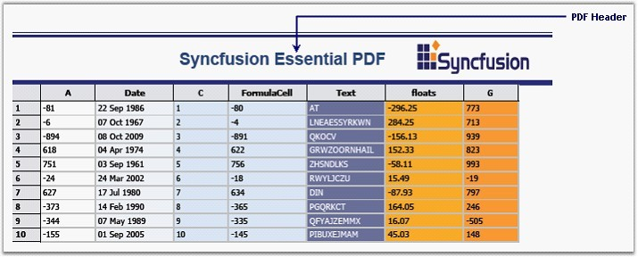 
 
Figure 544: PDF Document displayed with Header

* ShowFooter - This property gets or sets value indicating whether footer should be displayed in PDF document. Default value is set to false.

The following code example illustrates how to set this property.



pdfConvertor.ShowFooter = true;





pdfConvertor.ShowFooter = True



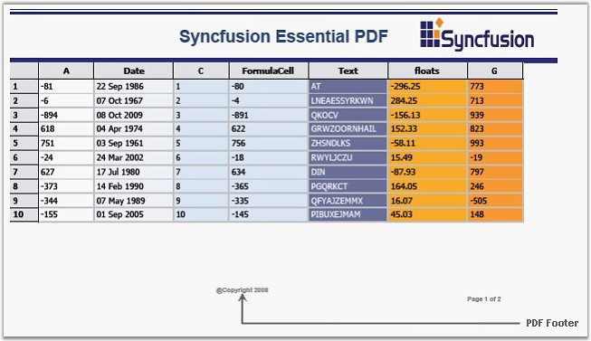 

Figure 545: PDF Document displayed with Footer

 
* HeaderHeight - This property gets or sets the height of the header for PDF document.

The following code example illustrates how to set this property.



pdfConvertor.HeaderHeight = 15;





pdfConvertor.HeaderHeight = 15



* FooterHeight - This property gets or sets the height of the footer for PDF document.

The following code example illustrates how to set this property.



pdfConvertor.FooterHeight = 20;





pdfConvertor.FooterHeight = 20



* Margins - This property gets or sets margins for PDF document.

 
The following code example illustrates how to set this property.



pdfConvertor.Margins.All = 40;





pdfConvertor.Margins.All = 40


 
### Methods

* ExportToPdf-This method is used to export the grid to PDF file.

The following code example illustrates how to use this method.



GridPDFConverter pdfConvertor = new GridPDFConverter();
pdfConvertor.ExportToPdf("Sample1.pdf", this.gridControl1);





Dim pdfConvertor As New GridPDFConverter()
pdfConvertor.ExportToPdf("Sample1.pdf", Me.gridControl1)



### Events

* DrawPDFFooter - This event lets you draw a footer for the PDF document.

 
The following code example illustrates how to handle this event.



pdfConvertor.DrawPDFFooter += new GridPDFConverter.DrawPDFHeaderFooterEventHandler(pdfConvertor_DrawPDFFooter);





AddHandler pdfConvertor.DrawPDFFooter, AddressOf pdfConvertor_DrawPDFFooter



* DrawPDFHeader - This event lets you draw a header for the PDF document.

The following code example illustrates how to handle this event.



pdfConvertor.DrawPDFHeader += new GridPDFConverter.DrawPDFHeaderFooterEventHandler(pdfConvertor_DrawPDFHeader);





AddHandler pdfConvertor.DrawPDFHeader, AddressOf pdfConvertor_DrawPDFHeader



## Resizing Heights of Individual Rows in Grid

Grid Grouping control does not support resizing heights of individual rows in the grid. This feature has been newly added and can be implemented by initializing an instance of the AllowResizingIndividualRows class to GridEngineFactory in the Form's constructor of your Windows application. The following code examples illustrate how to do this.



GridEngineFactory.Factory = new Syncfusion.GridHelperClasses.AllowResizingIndividualRows();





GridEngineFactory.Factory = New Syncfusion.GridHelperClasses.AllowResizingIndividualRows()



You can make use of AllowResizingIndividualRows class by adding dependent assembly, Syncfusion.GridHelperClasses.Windows to the References folder in your application.

The following screen shot illustrates how the heights of individual rows in the grid have been resized.

 

 Figure 546: Grid Grouping control with Row Heights Resized

 
## Grid Dynamic Filter

GridDynamicFilter class is used to wire a custom filter bar to the Grid Grouping control by replacing the default filter bar. The existing filter bar logic is extended to make the filter easy to use. This feature displays filtered results as you type each character.

The new filter bar adds two cell buttons, Filter button and Clear Filter button, inside every filter bar cell. The Filter button is used to display a list of available Compare Operators in a drop down. The selected operator will then be associated with the value present in the filter bar cell to form a filter string. Clear Filter button, as its name indicates, clears the record filters of the respective column. This button will be displayed for a filter bar cell only when that particular cell is in focus.

The following code example illustrates how to invoke Grid Dynamic Filter.



GridEngineFactory.Factory = new Syncfusion.GridHelperClasses.AllowResizingIndividualRows();





GridEngineFactory.Factory = New Syncfusion.GridHelperClasses.AllowResizingIndividualRows()



The following screen shot illustrates Grid Grouping control with filter drop down.

Figure 547: Grid Grouping control with Filter Drop Down

### Support to Save and Load Compare Operators State in Grid Dynamic Filter

GridDynamicFilter in GridGroupingControl is now an enhanced functionality to serialize/de-serialize compareoperator images in button. This can be achieved by handling the following method calls.

 


<code>filter.LoadCompareOperator();</code>

<code>filter.SaveCompareOperator();</code>



When the code runs, the following output displays.

  Figure 548: CompareOperator states restored in respective columns

 
### Apply Filter Only on Lost Focus in GridDynamicFilter

ApplyFilterOnlyOnCellLostFocus property enables you to turn off/on the filtering on each key stroke in GridDynamicFilter. Set ApplyFilterOnlyOnCellLostFocus property to true to filter only when the filter cell lost focus. This disables filtering for each key stroke including Enter, arrow keys, and tab keys. Defaults value is false and allows filtering for each key stroke.

The following code illustrates how to add ApplyFilterOnlyOnCellLostFocus property.



  GridDynamicFilter filter = new GridDynamicFilter();
  filter.ApplyFilterOnlyOnCellLoseFocus= true;



When the code runs, the following output displays.

Figure 549: Filter on Lost Focus on lost focus 
 
 
## Setting up Foreign Key Relations

GridForeignKeyHelper class is used to set up foreign key relations to perform foreign key look ups. With this class, you can easily set up a foreign table with a single method call instead of implementing numerous steps.

The following code example illustrates how to use this class.



GridForeignKeyHelper.SetupForeignTableLookUp(gridGroupingControl1, "Country", countries, "CountryCode", "CountryName");





GridForeignKeyHelper.SetupForeignTableLookUp(gridGroupingControl1, "Country", countries, "CountryCode", "CountryName")


 
> Note:
>
> * The first argument in this method is an instance of Grid Grouping control.
> * The second argument is the column name of the Parent table's Value Member.
> * The third argument is the name of the Foreign table.
> * The fourth argument is the column name of Child table's Value Member.
> * The fifth argument is the column name of Child tables's Display Member.
The following screen shot illustrates Foreign Key Relations in the Grid Grouping control.

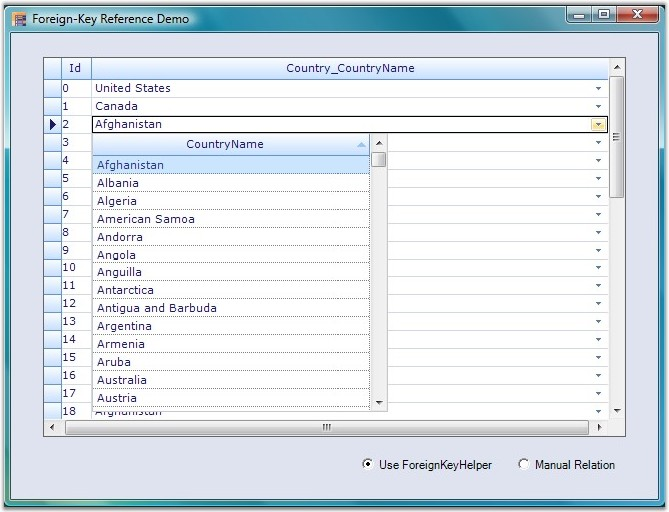

Figure 550: Grid Grouping control with Foreign Key Relations

## Custom Cell Types

Following are the custom cell types supported by the Grid Helper Library.

* ButtonEdit
* CalculatorTextBox
* Calendar
* DateTimePicker
* FNumericUpDown
* GridinCell
* LinkLabelCell
* PictureBox
* ButtonEdit

You can implement Button Edit control in grid cells by using ButtonEdit cell type. ButtonEdit cell types can be used by initializing ButtonEditStyleProperties class for grid cells.

Following are the Button Edit cell types available in the Grid control.

* Browse
* Check
* Down
* Image
* Left
* Leftend
* None
* Redo
* Right
* Rightend
* Undo
* Up

The following code example illustrates how to set the grid cell type to ButtonEdit.



//Registers the Cell Type with Grid control.

RegisterCellModel.GridCellType(gridControl1, CustomCellTypes.ButtonEdit);

Syncfusion.GridHelperClasses.ButtonEditStyleProperties sp;

sp = new Syncfusion.GridHelperClasses.ButtonEditStyleProperties(this.gridControl1[rowIndex, colIndex]);

sp.ButtonEditInfo.ButtonEditType = Syncfusion.GridHelperClasses.ButtonType.Browse;

this.gridControl1[2, 2].CellType = "ButtonEdit";





'Registers the Cell Type with Grid control.

RegisterCellModel.GridCellType(gridControl1, CustomCellTypes.ButtonEdit)

Dim sp As Syncfusion.GridHelperClasses.ButtonEditStyleProperties

sp = New Syncfusion.GridHelperClasses.ButtonEditStyleProperties(Me.gridControl1(rowIndex, colIndex))

sp.ButtonEditInfo.ButtonEditType = Syncfusion.GridHelperClasses.ButtonType.Browse

gridControl1[2, 2].CellType = "ButtonEdit"

Following screen shots illustrate different Button Edit cell types.



 

 

_Figure 559: "Right" Button Edit Cell Type_

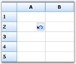

### CalculatorTextBox

You can implement Calculator control in grid cells by using CalculatorTextBox cell type. This cell type is implemented as a drop-down container, embedded into the cell. The drop down contains the calculator, which displays and stores the value in the cell.

The following code example illustrates how to set the grid cell type to CalculatorTextBox.



RegisterCellModel.GridCellType(gridControl1, CustomCellTypes.CalculatorTextBox);

CalculatorControl c1 = new CalculatorControl();

c1.BorderStyle = Border3DStyle.Flat;

c1.ButtonStyle = Syncfusion.Windows.Forms.ButtonAppearance.Office2007;

c1.UseVisualStyle = true;

GridStyleInfo style = gridControl1[4, 2];

style.CellType = "CalculatorTextBox";

style.Control = c1;





RegisterCellModel.GridCellType(gridControl1, CustomCellTypes.CalculatorTextBox)

Dim c1 As New CalculatorControl()

c1.BorderStyle = Border3DStyle.Flat

c1.ButtonStyle = Syncfusion.Windows.Forms.ButtonAppearance.Office2007

c1.UseVisualStyle = True

Dim style As GridStyleInfo = gridControl1(4, 2)

style.CellType = "CalculatorTextBox"

style.Control = c1



Following screen shot illustrates CalculatorTextBox cell type in the Grid control.

### Calendar

You can implement MonthCalendar control in a grid cell by enabling Calendar cell type for that particular cell.

The following code example illustrates how to set the grid cell type to Calendar.



RegisterCellModel.GridCellType(gridControl1, CustomCellTypes.Calendar);

GridStyleInfo style;

style = gridControl1[row, 2];

style.CellType = "Calendar";

//Provides Month Calendar control for drawing cell contents.

style.Control = new MonthCalendar();





RegisterCellModel.GridCellType(gridControl1, CustomCellTypes.Calendar)

Dim style As GridStyleInfo

style = gridControl1(row, 2)

style.CellType = "Calendar"

'Provides Month Calendar control for drawing cell contents.

style.Control = New MonthCalendar()



Following screen shot illustrates Calendar cell type in Grid control.

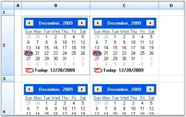

### DateTimePicker

You can implement Date Time Picker control in grid cells by using DateTimePicker cell type. This cell type is implemented as a drop-down container, embedded into the cell where date and time picker is added. The drop down contains calendar, which displays and stores date value in the cell. Various formats for date and time can be specified by using Format style property.

The following code example illustrates how to set grid cell type to DateTimePicker.



RegisterCellModel.GridCellType(gridControl1, CustomCellTypes.DateTimePicker);

//Sets up DateTimePicker Cells.

this.gridControl1[4, 2].CellType = "DateTimePicker";

this.gridControl1[4, 2].CellValueType = typeof(DateTime);

this.gridControl1[4, 2].CellValue = DateTime.Now;

this.gridControl1[4, 2].Format = "MM/dd/yyyy hh:mm";





RegisterCellModel.GridCellType(gridControl1, CustomCellTypes.DateTimePicker)

'Sets up DateTimePicker Cells.

Me.gridControl1(4, 2).CellType = "DateTimePicker"

Me.gridControl1(4, 2).CellValueType = GetType(DateTime)

Me.gridControl1(4, 2).CellValue = DateTime.Now

Me.gridControl1(4, 2).Format = "MM/dd/yyyy hh:mm"



Following screen shot illustrates DateTimePicker cell type in Grid control.

### FnumericUpDown

You can implement Float Numeric Up Down control in grid cells by using FNumericUpDown cell type. FNumericUpDown cell types can be used by initializing FloatNumericUpDownStyleProperties class for grid cells. This will allow you set limitations of numeric values and several other properties can also be added as follows.

The following code example illustrates how to set grid cell type to FNumericUpDown.



RegisterCellModel.GridCellType(gridControl1, CustomCellTypes.FNumericUpDown);

GridStyleInfo style = this.gridControl1[2, 2];

//Sets up FNumericUpDown Cell. 

style.CellType = "FNumericUpDown";

style.Text = "0.5";





RegisterCellModel.GridCellType(gridControl1, CustomCellTypes.FNumericUpDown)

Dim style As GridStyleInfo = Me.gridControl1(2, 2)

'Sets up FNumericUpDown Cell. 

style.CellType = "FNumericUpDown"

style.Text = "0.5"



Following screen shot illustrates FNumericUpDown cell type in the Grid control.

### GridinCell

GridinCell cell type provides covered range of cells to embed the grid, which is added as a control to the cells. The registered cell model initializes the range by calculating the size of the grid control to be embedded, and adds styles such as borders and scroll bars to have the control within the range.

The following code example illustrates how to set grid cell type to GridinCell.



RegisterCellModel.GridCellType(gridControl1, CustomCellTypes.GridinCell);

GridControl grid;

this.gridControl1[3, 2].CellType = "GridinCell";

this.gridControl1.CoveredRanges.Add(GridRangeInfo.Cells(3, 2, 7, 4));

grid = new Syncfusion.GridHelperClasses.CellEmbeddedGrid(this.gridControl1);

grid.BackColor = Color.FromArgb(0xb4, 0xe7, 0xf2);

grid.RowCount = 10;

grid.ColCount = 4;

grid[1, 1].Text = "this is a 10x4 grid";

grid.ThemesEnabled = true;

this.gridControl1[3, 2].Control = grid;

this.gridControl1.Controls.Add(grid);





RegisterCellModel.GridCellType(gridControl1, CustomCellTypes.GridinCell)

Dim grid As GridControl

Me.gridControl1(3, 2).CellType = "GridinCell"

Me.gridControl1.CoveredRanges.Add(GridRangeInfo.Cells(3, 2, 7, 4))

grid = New Syncfusion.GridHelperClasses.CellEmbeddedGrid(Me.gridControl1)

grid.BackColor = Color.FromArgb(&HB4, &HE7, &HF2)

grid.RowCount = 10

grid.ColCount = 4

grid(1, 1).Text = "this is a 10x4 grid"

grid.ThemesEnabled = True

Me.gridControl1(3, 2).Control = grid

Me.gridControl1.Controls.Add(grid)



Following screen shot illustrates GridinCell cell type in Grid control.

### LinkLabelCell

LinkLabelCell cell type displays text, which can be hyperlinked to a specific location. The path to be hyperlinked is specified by using the Tag property.

The following code example illustrates how to set grid cell type to LinkLabelCell.



RegisterCellModel.GridCellType(gridControl1, CustomCellTypes.LinkLabelCell);

int rowIndex = 5;

gridControl1[rowIndex, 2].CellType = "LinkLabelCell";

gridControl1[rowIndex, 2].Text = "Syncfusion, Inc.";

gridControl1[rowIndex, 2].Font.Bold = true;

gridControl1[rowIndex, 2].Tag = "http://www.syncfusion.com";

gridControl1[rowIndex, 2].HorizontalAlignment = GridHorizontalAlignment.Center;





RegisterCellModel.GridCellType(gridControl1, CustomCellTypes.LinkLabelCell)

Dim rowIndex As Integer = 5

gridControl1(rowIndex, 2).CellType = "LinkLabelCell"

gridControl1(rowIndex, 2).Text = "Syncfusion, Inc."

gridControl1(rowIndex, 2).Font.Bold = True

gridControl1(rowIndex, 2).Tag = "http://www.syncfusion.com"

gridControl1(rowIndex, 2).HorizontalAlignment = GridHorizontalAlignment.Center



Following screen shot illustrates LinkLabelCell cell type in the Grid control.                                      

### PictureBox

PictureBox cell type can be embedded into a cell by calculating the size of the picture and extending the width and height of the cell accordingly. PictureBoxStyleProperties class is used to specify the style for Picture Box control.

The following code example illustrates how to set the grid cell type to PictureBox.



RegisterCellModel.GridCellType(gridControl1, CustomCellTypes.PictureBox);

Syncfusion.GridHelperClasses.PictureBoxStyleProperties tsp = new Syncfusion.GridHelperClasses.PictureBoxStyleProperties(new GridStyleInfo(gridControl1.TableStyle));

tsp.SizeMode = PictureBoxSizeMode.AutoSize;

Syncfusion.GridHelperClasses.PictureBoxStyleProperties sp;

GridStyleInfo style;

gridControl1.ColWidths[1] = 20;

style = gridControl1[2, 2];

style.CellType = "PictureBox";

sp = new Syncfusion.GridHelperClasses.PictureBoxStyleProperties(style);

sp.Image = GetImage("one.jpg");





RegisterCellModel.GridCellType(gridControl1, CustomCellTypes.PictureBox)

Dim tsp As New Syncfusion.GridHelperClasses.PictureBoxStyleProperties(New GridStyleInfo(gridControl1.TableStyle))

tsp.SizeMode = PictureBoxSizeMode.AutoSize

Dim sp As Syncfusion.GridHelperClasses.PictureBoxStyleProperties

Dim style As GridStyleInfo

gridControl1.ColWidths(1) = 20

style = gridControl1(2, 2)

style.CellType = "PictureBox"

sp = New Syncfusion.GridHelperClasses.PictureBoxStyleProperties(style)

sp.Image = GetImage("one.jpg")



Following screen shot illustrates PictureBox cell type in Grid control.

## Grid Field Chooser

You can customize column appearance of a Grid Grouping control by using plug-in utility called Field Chooser. FieldChooser class can be associated with Grid Grouping control to add or remove columns from the grid. The following code example illustrates this.



FieldChooser fchooser = new FieldChooser(this.gridGroupingControl1);





Dim fchooser As New FieldChooser(Me.gridGroupingControl1)


 
Following screen shot shows Grid Grouping control with the Field dialog box.

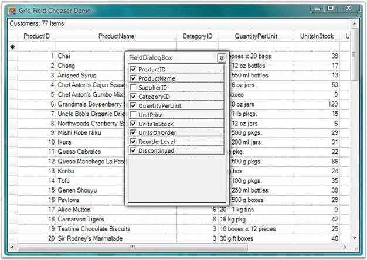

 Figure 570: Grid Grouping control with Field Dialog Box

 
To add or remove columns by using Field Chooser, right-click column header and select Field Chooser menu item to view Field dialog box. This dialog box lists all the column names with check boxes. You can select or clear check boxes to add or remove respective columns from Grid Grouping control.

A sample demonstration of Grid Field Chooser feature is available in the following sample installation path.

&lt;Install Location&gt;\Syncfusion\EssentialStudio\[Version Number]\Windows\Grid.Grouping.Windows\Samples\Layout Customization\Field Chooser Demo

## Filtering By Display Member

This topic elaborates on filtering columns in the Grid Data Bound Grid and Grid Grouping controls by their display member.

### Filtering Columns in Grid Data Bound Grid

GridDataBoundGridFilterBarExt class provides support to filter a column in DataBound Grid by its display member instead of the value member. This is accomplished by implementing a custom filter bar cell by replacing the default filter bar cell.

Following code example illustrates how to wire GridDataBoundGridFilterBarExt to Data Bound Grid.



private GridDataBoundGridFilterBarExt filterBar;

filterBar = new GridDataBoundGridFilterBarExt();

filterBar.WireGrid(this.gridDataBoundGrid1);





Private filterBar As GridDataBoundGridFilterBarExt

filterBar = New GridDataBoundGridFilterBarExt()

filterBar.WireGrid(Me.gridDataBoundGrid1)



Following screen shot illustrates how to filter a column in the Grid Data Bound Grid by its display member.

 Figure 571: Filtering a column in DataBound Grid by its Display Member

 
### Filtering Columns in Grid Grouping Control

GroupingGridFilterBarExt class provides support to filter a column in the Grid Grouping control by its display member instead of value member. This is accomplished by implementing a custom filter bar cell by replacing the default filter bar cell.

Following code example illustrates how to wire the GroupingGridFilterBarExt to the Grid Grouping control.



private GroupingGridFilterBarExt gGCFilter;

this.gGCFilter = new GroupingGridFilterBarExt();

this.gGCFilter.WireGrid(this.gridGroupingControl1);





Private gGCFilter As GroupingGridFilterBarExt

Me.gGCFilter = New GroupingGridFilterBarExt()

Me.gGCFilter.WireGrid(Me.gridGroupingControl1)


 
Following screen shot illustrates how to filter a column in the Grid Grouping control by its display member.

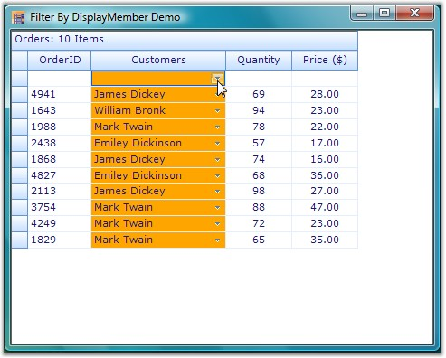

Figure 572: Filtering a column in the Grid Grouping control by its Display Member

## Grid Format Cell Dialog

Grid Format Cell Dialog, similar to the Excel-like Format Cell Dialog, enables users to format cells dynamically. It provides options to customize cell font family, font color, font size, font style, font effects, background, alignment, text format, and so on. You can instantiate Grid Format Cell Dialog by using the following code.



GridFormatCellDialog f = new GridFormatCellDialog(this.gridControl1);

f.ShowDialog();





Dim f As New GridFormatCellDialog(Me.gridControl1)

f.ShowDialog()



Following screen shot illustrates the Format Cell Dialog of Grid control.

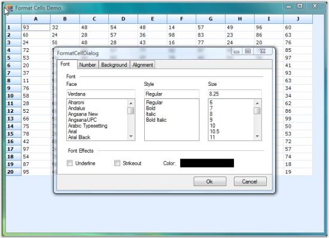

## Printing

This topic elaborates on printing options supported by Grid control.

### Printing Multiple Grids

You can print multiple grids across various pages by using GridPrintDocumentAdv helper class. This is achieved by drawing full sized grid to a large bitmap and then drawing this bitmap scaled to fit the output page.

By using ScaleColumnsToFitPage property, columns can be scaled to fit a single page. Headers and footers can also be added by using DrawGridPrintHeader and DrawGridPrintFooter events. The following code examples illustrate how to do this.



Syncfusion.GridHelperClasses.GridPrintDocumentAdv pd = new Syncfusion.GridHelperClasses.GridPrintDocumentAdv(this.gridControl1);

pd.DefaultPageSettings.Margins = new System.Drawing.Printing.Margins(25, 25, 25, 25);

pd.HeaderHeight = 70;

pd.FooterHeight = 50;

pd.ScaleColumnsToFitPage = true;

PrintPreviewDialog previewDialog = new PrintPreviewDialog();

previewDialog.Document = pd;

previewDialog.Show();





Dim pd As New Syncfusion.GridHelperClasses.GridPrintDocumentAdv(Me.gridControl1)

pd.DefaultPageSettings.Margins = New System.Drawing.Printing.Margins(25, 25, 25, 25)

pd.HeaderHeight = 70

pd.FooterHeight = 50

pd.ScaleColumnsToFitPage = True

Dim previewDialog As New PrintPreviewDialog()

previewDialog.Document = pd

previewDialog.Show()



The following screen shots illustrate the Print Preview feature of the Grid control.

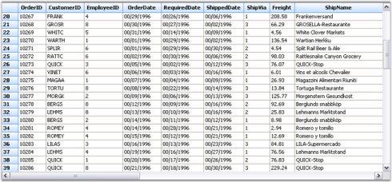

### Print Page Layout

Print Page Layout feature enables viewing page layout on the grid by displaying a segment line and page number with each segment. This helps users to analyze page breaks within the grid, and manage them accordingly.

Properties are available to define colors for the line and text of the page layout. The following code examples illustrate how to set the line and text color of the page layout.



LayoutSupportHelper layoutHelper;

layoutHelper = new LayoutSupportHelper(gridControl1);

layoutHelper.LineColor= Color.Blue;

layoutHelper.TextColor = Color.Green;





Dim layoutHelper As LayoutSupportHelper

layoutHelper = New LayoutSupportHelper(gridControl1)

layoutHelper.TextColor = Color.Orange

layoutHelper.LineColor = Color.SteelBlue



Following screen shot illustrates print page layout feature of the Grid control.

## Word Converter

This topic illustrates how to convert Grid and Grid Grouping content to Word format.

### Grid to Word Conversion

GridWordConverter class provides support to convert grid content into a Word document. It also provides support to add headers and footers to the document. Essential DocIO libraries are used to support conversion of grid content into a Word document. The following dependent assemblies must be included in your Windows application to work with GridWordConverter helper class: Syncfusion.DocIO.Base and Syncfusion.GridHelperClasses.Windows.

The following code examples illustrate conversion of Grid content to Word document.



GridWordConverter converter = new GridWordConverter(true, true);

converter.DrawHeader+=new GridWordConverterBase.DrawDocHeaderFooterEventHandler(converter_DrawHeader);

converter.DrawFooter+=new GridWordConverterBase.DrawDocHeaderFooterEventHandler(converter_DrawFooter);

converter.GridToWord("Sample.doc", gridControl1);

System.Diagnostics.Process.Start("Sample.doc");
 
void converter_DrawFooter(object sender, DocHeaderFooterEventArgs e)
{
e.Footer.AddParagraph().AppendText("Copyright 2001-2008");
}
 
void converter_DrawHeader(object sender, DocHeaderFooterEventArgs e)
{

e.Header.AddParagraph().AppendText("Syncfusion Inc.");

}





Private converter As New GridWordConverter(True, True)

Private converter.DrawHeader+= New GridWordConverterBase.DrawDocHeaderFooterEventHandler(AddressOf converter_DrawHeader)

Private converter.DrawFooter+= New GridWordConverterBase.DrawDocHeaderFooterEventHandler(AddressOf converter_DrawFooter)

converter.GridToWord("Sample.doc", gridControl1)

System.Diagnostics.Process.Start("Sample.doc")
 
void converter_DrawFooter(Object sender, DocHeaderFooterEventArgs e)

e.Footer.AddParagraph().AppendText("Copyright 2001-2008")
 
void converter_DrawHeader(Object sender, DocHeaderFooterEventArgs e)

e.Header.AddParagraph().AppendText("Syncfusion Inc.")


 
The following screen shots illustrate Grid to Word conversion.

Figure 577: Grid Control

Figure 578: Grid control content converted to Word Document

 
### Grouping Grid to Word Conversion

GroupingGridWordConverter class provides support to convert grouping grid content into a Word document. It also provides support to add headers and footers to the document. Essential DocIO libraries are used to support conversion of grouping grid content into a Word document. The following dependent assemblies must be included in your Windows application to work with GroupingGridWordConverter helper class: Syncfusion.DocIO.Base and Syncfusion.GridHelperClasses.Windows.

The following code example illustrates the conversion of Grouping Grid content to Word document.



GroupingGridWordConverter converter = new GroupingGridWordConverter(true, true);

converter.DrawHeader += new GridWordConverterBase.DrawDocHeaderFooterEventHandler(converter_DrawHeader);

converter.DrawFooter += new GridWordConverterBase.DrawDocHeaderFooterEventHandler(converter_DrawFooter);

converter.GroupingGridToWord("Sample.doc", gridGroupingControl1);

System.Diagnostics.Process.Start("Sample.doc");
 
void converter_DrawFooter(object sender, DocHeaderFooterEventArgs e)
{
    IWTextRange txt = e.Footer.AddParagraph().AppendText("\t\t\tCopyright Syncfusion Inc. 2001 - 2008");
	
    txt.CharacterFormat.Font = new Font("verdana", 12f, FontStyle.Bold);
}
 
void converter_DrawHeader(object sender, DocHeaderFooterEventArgs e)
{
    IWTextRange txt = e.Header.AddParagraph().AppendText("\t\t\t\tSyncfusion Inc.\n");
	
    txt.CharacterFormat.Font = new Font("verdana", 12f, FontStyle.Bold);
}





Private converter As New GroupingGridWordConverter(True, True)

Private converter.DrawHeader += New GridWordConverterBase.DrawDocHeaderFooterEventHandler(AddressOf converter_DrawHeader)

Private converter.DrawFooter += New GridWordConverterBase.DrawDocHeaderFooterEventHandler(AddressOf converter_DrawFooter)

converter.GroupingGridToWord("Sample.doc", gridGroupingControl1)

System.Diagnostics.Process.Start("Sample.doc")
 
void converter_DrawFooter(Object sender, DocHeaderFooterEventArgs e)

Dim txt As IWTextRange = e.Footer.AddParagraph().AppendText(Constants.vbTab + Constants.vbTab + Constants.vbTab & "Copyright Syncfusion Inc. 2001 - 2008")

txt.CharacterFormat.Font = New Font("verdana", 12.0F, FontStyle.Bold)
 

 void converter_DrawHeader(Object sender, DocHeaderFooterEventArgs e)

 Dim txt As IWTextRange = e.Header.AddParagraph().AppendText(Constants.vbTab + Constants.vbTab + Constants.vbTab + Constants.vbTab & "Syncfusion Inc." & Constants.vbLf)

 txt.CharacterFormat.Font = New Font("verdana", 12.0F, FontStyle.Bold)


 
The following screen shots illustrate Grouping Grid to Word conversion.

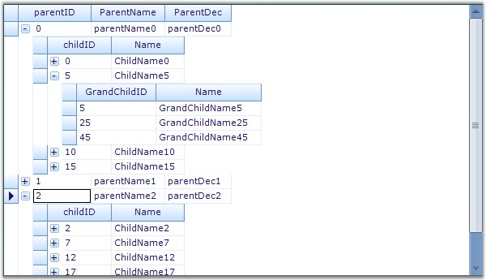

Figure 579: Grouping Grid Control

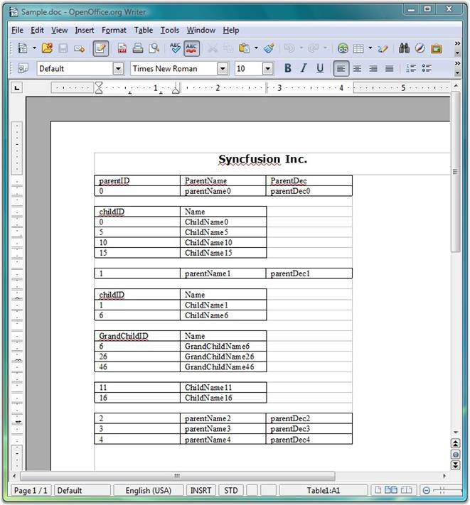

Figure 580: Grouping Grid control content converted to Word Document

## Fill Series 

Support to implement Excel-like Fill Series in the Grid

A helper class implementing IMouseController interface has been added to GridHelperClasses library to implement Excel-like Fill Series in the Grid. To make use of this functionality, Syncfusion.GridHelperClasses.Windows .dll must be referred and the mouse controller has to be added in MouseControllerDispatcher of grid.

The following support has been provided since 8.2.

The behavior has extended support, which pops up a menu after the drag, and has two items:

* Copy Series - Copy paste the content from the cell.
* Fill Series - Fill the cell with appropriate sequence.

The Excel Like fill Series has support on:

* Number - From active range with single or multiple cells (e.g. 1, 2, 3...)
* Text - Will paste the same text for both 'copy series' and 'fill series'
* Date - Date format must be MM/DD/YYYY
* Month - The month in text (e.g. January, February, March... or Jan, Feb, Mar...)

The following code illustrates how to add Excel Like fill Series.



            gridControl1.ExcelLikeCurrentCell = true;

            Syncfusion.GridHelperClasses.ExcelSelectionMarkerMouseController marker = new

 Syncfusion.GridHelperClasses.ExcelSelectionMarkerMouseController(this.gridControl1);

            this.gridControl1.MouseControllerDispatcher.Add(marker);





            GridControl1.ExcelLikeCurrentCell = True

            Dim excelMarker As New ExcelMarkerMouseController(GridControl1)

            GridControl1.MouseControllerDispatcher.Add(excelMarker)



#### Methods of IMouseController Interface Implemented

* MouseMove - The code handled in this method allows dragging series in either one of the four directions at a time, retaining a rectangular layout.
* MouseUp - The code handled in this method sets the cell values based on dragged series accordingly (if it is a formula or text or numeric value).

Following are screen shots illustrating the feature.

1. Image displaying drag operation of the selected series towards bottom.

   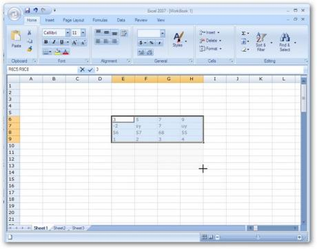

2. Image displaying the filled series.

   

3. The image shows popup menu displayed after dragging the cell that displays January.

   

   > Note: The cell has been dragged exactly the same as it is done in Excel.

4. The image shows cells have been filled after the Fill series has been selected from the popup menu.

   
   
   
## Excel-Like Filters

Office2007Filter and optimized GridExcelFilter are the two types of Excel-like filter. The next section explains these types in detail. 
   
   
### Office2007Filter

Essential Grid now provides an in-built filter similar to Microsoft Excel 2007 from the class GridOffice2007Filter with which the grid has to be wired.

#### Enabling Excel like filter

Set Allow filter to true when Grid Control is wired with GridOffice2007Filter to enable Excel like filter to the Grid filter bar.

The following code illustrates how to add Excel Like Filter to the Grid filter bar.



         GridOffice2007Filter filter;
		 
         private void showFilter_CheckedChanged(object sender, EventArgs e)
        {
		
            this.gridGroupingControl1.TableDescriptor.Columns[0].AllowFilter = true;
			
            if (this.showFilter.Checked)
            {
                filter.WireGrid(this.gridGroupingControl1);
            }
			
            else
            {
                filter.UnWireGrid(this.gridGroupingControl1);
            }
			
        }





Private filter As GridOffice2007Filter

    Private Sub showFilter_CheckedChanged(ByVal sender As Object, ByVal e As EventArgs)
	
        Me.gridGroupingControl1.TableDescriptor.Columns(0).AllowFilter = True
		
        If Me.showFilter.Checked Then
		
            filter.WireGrid(Me.gridGroupingControl1)
			
        Else
		
            filter.UnWireGrid(Me.gridGroupingControl1)
			
        End If
		
    End Sub	

    
	
> Note: GridOffice2007Filter can be unwired from the grid to disable Excel like filter.

### Specifying Value To Filter

The feature has multiple selections of values to filter.

You can specify the value of the column that has to filter in the check box of tree view inside the drop down container.

   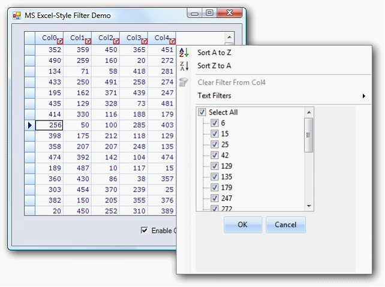

Figure 585: Filter Bar Drop Down

### Optimized GridExcelFilter

#### Use Case Scenarios

If Office2007Filter is used in a WF GridGroupingControl where the columns have a large number of unique items (say 5000 or 10000), the grid is unusable (hanged). To improve the performance, the new optimized GridExcelFilter can be used.

Table 134: Methods
<table>
<tr>
<th>
METHOD</th><th>
DESCRIPTION</th><th>
PARAMETERS</th><th>
TYPE</th><th>
RETURN TYPE</th></tr>
<tr><td>
WireGrid</td><td>
Wires grid with filter.</td><td>
this.gridGroupingControl1 (control as argument)</td><td>
 Method</td><td>
 void</td></tr>
<tr><td>
UnWireGrid</td><td>
Unwire grid with filter.</td><td>
this.gridGroupingControl1 (control as argument)</td><td>
 Method</td><td>
 void</td></tr>
 </table>
 
#### Sample Link

To view a sample:

* Open Syncfusion Dashboard.

* Select UI > Windows Forms.

* Click Run Samples. 

* Navigate to GridGrouping Samples > Filters and Expressions > Optimized Excel Filter Demo

#### Implementing optimized GridExcelFilter to GGC

Set AllowFilter to True when the Grid control is wired with GridOffice2007Filter to enable Excel-like filtering in the grid filter bar.

The following code illustrates how to add Excel-like filter to grid filter bar:



GridExcelFilter filter;

         private void showFilter_CheckedChanged(object sender, EventArgs e)

        {

            this.gridGroupingControl1.TableDescriptor.Columns[0].AllowFilter = true;

            if (this.showFilter.Checked)

            {

                filter.WireGrid(this.gridGroupingControl1);

            }

            else

            {

                filter.UnWireGrid(this.gridGroupingControl1);

            }

        }





Private filter As GridExcelFilter

             Private Sub showFilter_CheckedChanged(ByVal sender As Object, ByVal e As EventArgs)
			 
                  Me.gridGroupingControl1.TableDescriptor.Columns(0).AllowFilter = True
				  
                  If Me.showFilter.Checked Then
				  
                        filter.WireGrid(Me.gridGroupingControl1)
						
                  Else
				  
                        filter.UnWireGrid(Me.gridGroupingControl1)
						
                  End If
				  
             End Sub



### GridExcelFilter Enhancement

GridExcelFilter’s FilterByColor functionality is used to filter GridGroupingControl based on its color. You can enable or disable FilterByColor functionality by customizing AllowFilterByColor property before wiring GridGroupingControl. FilterByColor functionality is available for cell background color and font color.

The following screenshot shows the result of setting FilterByColor property in GridGroupingControl.

   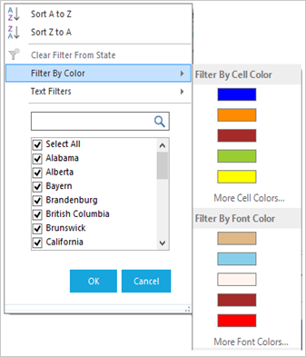

 Figure 586: FilterByColor Property in GridExcelFilter Control

 The following code example shows how to set FilterByColor property for GridGroupingControl.



this.filter.AllowResize = true;

this.filter.AllowFilterByColor = true;

GridTableDescriptor td = this.gridGroupingControl1.TableDescriptor.Relations["ParentToChild"].ChildTableDescriptor;

foreach (GridColumnDescriptor col in td.Columns)

{

col.AllowFilter = true;

}

this.filter.WireGrid(gridGroupingControl1);



#### AllowFilterByColor

You can enable FilterByColor functionality in GridExcelFilter by setting AllowFilterByColor property. GridExcelFilter calculates the colors available in the collection of the Grid Grouping control and displays any five colors from the collection in a drop-down. You can view the other available colors by clicking the “More Cell Colors/More Font Colors” option in the drop-down menu.

The following screen shots show the list of available colors when FilerByColor property is enabled in GridGroupingControl.
                                                            

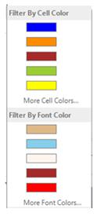
	
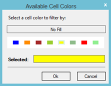

Figure 587: Availabe Cell Colours

#### AllowResize

Using AllowResize property, you can enable or disable resizable functionality of the GridExcelFilter. GridExcelFilter has a resizable strip at the bottom of the filterpopup, which is used to resize GridExcelFilter popup.

#### Search TextBox  

Search Textbox added in GridExcelFilter searches the available collection from checkedlistbox and displays searched results in the checkedlistbox.

### Filtering Null Values from the Grid

This feature is to provide support for filtering null or empty values from the grid using Excel-like filters. The filter choice will be in the name of “(Blanks)” when there are empty values in the grid.

#### Option to Filter Empty values in Application

The option to filter empty values (Blanks) will automatically be included in filter choices when there are one or more empty values in the grid. No property is needed to enable this feature.

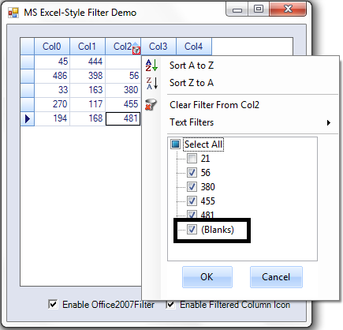

Figure 588: Blanks Option to Filter Empty Values

### Date and Number Filter in GridExcelFilter

#### Date Filter

You can use EnableDateFilter property in GridExcelFilter to search and filter the dates quickly. The following screenshot shows the values that are filtered by years in a filter Drop-down box.

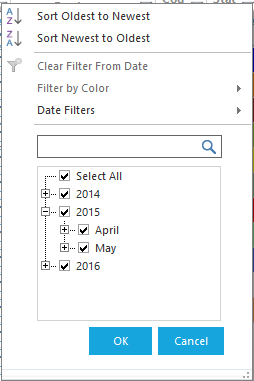

Figure 589: Values filtered by years

#### Filter options

You can use the following filter options by using context menu of the filter Drop-down.

* Equal - Returns the records that matches the given date.
* Before - Returns the records that are created before the given date.
* After between - Returns the records that matches the records after the given date.
* Today - Returns the records, which are matches today’s date.
* Tomorrow - To get the records that matches tomorrow’s date.
* Yesterday - To get the records that matches yesterday’s date.
* Month-wise - Using month-wise, you can filter the values for a particular month.
* Year-wise - Using year-wise, you can filter the values for a particular year.
* Quarter-wise - You can filter the records for a particular quarter.
* Custom filter - Using this option, you can filter the values based on customer dates.

You can filter the required dates using the above options in check box selection available in the filter Drop-down.

#### Number Filter

You can use EnableNumberFilter property in GridExcelFilter to filter the numbers that are displayed in a grid. This property is enabled in filter Drop-down when the cell value is in number format. You can filter the numbers using the following filter options.

#### Filter options

* Equal - Returns the records the matches the given numeric value.
* Does Not Equal - Returns the records, which is not equal to the given date.
* Greater than - Returns the record that has the higher value than the given value.
* Greater than or equal - Returns the records that contain higher and equal value than the given one.
* Less than - Returns the records that have the lesser value than the given one
* Less than or equal - Returns the records that contains less or equal value for the given one.
* Between - Returns the records between the given two numeric values.
* Top 10 - Returns the top and bottom records using the new dialog box.
* Above average - Returns the records that are higher than the average value for the given numeric column.
* Below Average - Returns the records that are less than the average value for the given numeric column.
* Custom filter - Using this you can filter the records based on the custom filter option.

 

You can filter the top selected values or percentage of values using the Top 10 Filter option in EnableNumberFilter property. The following image shows an example of the Top 10 Filter option in EnableNumberFilter property.

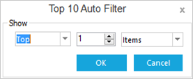

Figure 590: Top 10 Filter option

You can select the number of items using numeric up down option. You can select upto 100 items using this option.

## Card View Layout

The card view displays records as separate cards arranged in a grid-like layout. It is implemented similar to binding GridDataBoundGrid control to GridCardView object.

### Tables for Properties, Methods, and Events

Table 135: Properties
<table>
<tr>
<th>
PROPERTIES</th><th>
DESCRIPTION</th><th>
TYPE</th><th>
DATA TYPE</th></tr>
<tr>
<td>
CaptionField</td><td>
Sets or gets caption of each card. Users can set a column name to this.</td><td>
string</td><td>
string</td></tr>
<tr><td>
CardStyle</td><td>
Applies a card model such as standard, merged, variable, or compressed styles.</td><td>
CardStyle</td><td>
enum</td></tr>
<tr><td>
VisualStyle</td><td>
Applies the visual style of the cards in the grid. The new GridVisualStyles are applied to this.</td><td>
CardVisualStyle</td><td>
enum</td></tr>
<tr><td>
CardSpacingWidth</td><td>
Gets or sets the width of the spacing between each card.</td><td>
int</td><td>
int</td></tr>
<tr><td>
CardSpacingHeight</td><td>
Gets or sets the height of the spacing between each card.</td><td>
int</td><td>
int</td></tr>
<tr><td>
MaxCardCols</td><td>
Gets or sets the maximum number of cards in the column area. MaxCardRows will be automatically calculated.</td><td>
int</td><td>
int</td></tr>
<tr><td>
MaxCardRows</td><td>
Gets or sets the maximum number of cards in the row area. MaxCardCol will be automatically calculated if it is not set.</td><td>
int</td><td>
int</td></tr>
<tr><td>
ShowCaption</td><td>
Shows or hides the caption of each card.</td><td>
bool</td><td>
bool</td></tr>
<tr><td>
ShowCardCellBorders</td><td>
Shows or hides the cell borders.</td><td>
bool</td><td>
bool</td></tr>
<tr><td>
AllowResizing</td><td>
Allows or prevents the card resizing.</td><td>
bool</td><td>
bool</td></tr>
<tr><td>
CaptionHeight</td><td>
Gets or sets the height of the caption row.</td><td>
bool</td><td>
bool</td></tr>
<tr><td>
ActivateCurrentCellBehavior</td><td>
Specifies current cell activation behavior when moving the current cell or clicking inside a cell.</td><td>
GridCellActivateAction</td><td>
enum</td></tr>
<tr><td>
HighlightActiveCard</td><td>
Gets or sets the highlight of the active card.</td><td>
bool</td><td>
bool</td></tr>
</table>
 

Table 136: Methods

<table>
<tr>
<th>
METHODS</th><th>
DESCRIPTION</th><th>
PARAMETERS</th><th>
TYPE</th><th>
RETURN TYPE</th></tr>
<tr><td>
WireGrid</td><td>
Gets the GridDataBoundGrid and changes it to Card View Style.</td><td>
GridDataBoundGridboundGrid</td><td>
Method</td><td>
void</td></tr>
<tr><td>
UnWireGrid</td><td>
Unhooks all the events hooked in the WireGrid() method.</td><td>
N/A</td><td>
Method</td><td>
Void</td></tr>
<tr><td>
IsActiveCard</td><td>
Indicates the state of the card if active.</td><td>
rowIndex, ColIndex</td><td>
Method</td><td>
bool</td></tr>
<tr><td>
IsHeaderCell</td><td>
Indicates if the cell is a header column cell.</td><td>
rowIndex, ColIndex</td><td>
Method</td><td>
bool</td></tr>
<tr><td>
IsRecordCell</td><td>
Indicates if the cell is a record cell.</td><td>
rowIndex,colIndex.</td><td>
Method</td><td>
bool</td></tr>
<tr><td>
IsValueCell</td><td>
Indicates if the cell is a value cell.</td><td>
rowIndex,colIndex.</td><td>
Method</td><td>
bool</td></tr>
<tr><td>
IsCardCaption</td><td>
Indicates if the cell is a caption cell.</td><td>
rowIndex,colIndex.</td><td>
Method</td><td>
bool</td></tr>
<tr><td>
GetCardCellTypeGetCardCellType</td><td>
Specifies the type of the card cell.</td><td>
rowIndex,colIndex.</td><td>
Method</td><td>
CardCellType</td></tr>
</table>

Table 137: Events

<table>
<tr>
<th>
EVENTS</th><th>
DESCRIPTION</th><th>
ARGUMENTS</th><th>
TYPE</th></tr>
<tr><td>
QueryCardCellInfo</td><td>
Occurs when the card model queries for style information about a specific cell.</td><td>
public QueryCardCellInfoEventArgs(GridQueryCellInfoEventArgs e, GridCardView cardView)</td><td>
Event</td></tr>
<tr><td>
CellClick</td><td>
Occurs when the user clicks inside a cell.</td><td>
public CardCellClickEventArgs(GridCellClickEventArgs e, GridCardView cardView)</td><td>
Event</td></tr>
<tr><td>
SaveCardCellInfo</td><td>
Occurs when the card model is about to save style information about a specific cell.</td><td>
public SaveCardCellInfoEventArgs(GridSaveCellInfoEventArgs e, GridCardView cardView)</td><td>
Event</td></tr>
<tr><td>
PushButtonClick</td><td>
Occurs when the user clicks a push button.</td><td>
public CardCellPushButtonClickEventArgs(GridCellPushButtonClickEventArgs e, GridCardView cardView)</td><td>
Event</td></tr>
 </table>

 
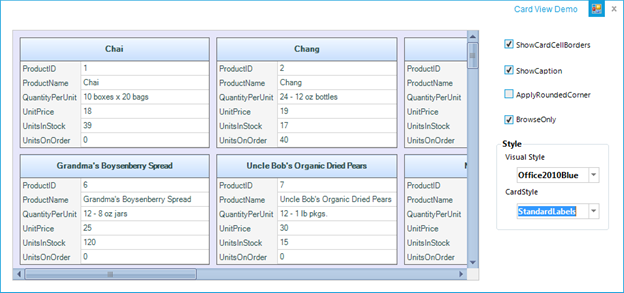

Figure 591: Image for Card View Layout in GridDataBoundGrid

#### Sample Link

&lt;Install Location&gt;\Syncfusion\EssentialStudio\[Version Number]\Windows\GridDataBound.Windows\Samples\Product Showcase\Card View Demo

### Enable the Card View Layout

The following code is used to enable card view layout in GridDataBoundGrid control.



GridCardView card = new GridCardView();

card.CaptionField = "ProductName";

card.WireGrid(this.gridDataBoundGrid1);





Private card As New GridCardView()

card.CaptionField = "ProductName"

card.WireGrid(Me.gridDataBoundGrid1)

