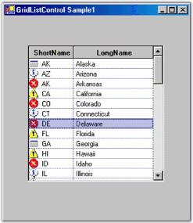
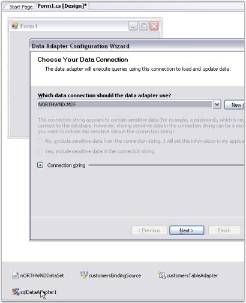
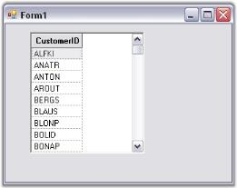

# Grid List Control

Grid List control is System.Windows.Forms ListControl-derived object. It uses an embedded GridControl object to hold data. Using this GridListControl.Grid member, you can easily control the appearance of your list control through the GridControl object.

## Creating Grid List Control

This section will provide step-by-step procedure to create a Grid List control through designer and through programmatical approach in a .NET application.

### Through Designer

With the designer, all you have to do is drag the control onto the form, size it and then set the desired properties, assuming you have a data source ready. If you do not have data source ready, then create one by using the steps listed below.

To Create a Data Source

1. Drag an SqlDataAdapter from Data tab of the Toolbox onto the form. Follow the steps in the wizard to select database and SQL query used to generate the table.

   

2. Click SqlAdapter in the components tray with the right Mouse button and generate a dataset for this adapter by just taking the defaults. 

   

3. In the Form_Load event handler, Fill method will be called automatically for this SqlDataAdapter by passing dataset that is generated in the previous step.

   

4. Drag GridListControl object from your tool box and drop it onto the form.

   
   
5. Size and position it.

6. Go to Properties dialog of this Grid List control and set DataSource property of this control to an appropriate object.

   

7. Run the application. Following is the output.

   

This designer-created data source is now available for use as the data source member of Grid List control. For a complete step-by-step tutorial on how to use the designer to create data source, see the Grid Data Bound Grid tutorial.

### Through Code

The Grid List control sample that ships with Essential Grid does not use the designer. It creates an ArrayList of objects that serves as a data source for the Grid List control. Each state object has a LongName, ShortName and ImageIndex properties that can be displayed in the list control. Here are some code samples that illustrate assignments of the major properties. 

For the complete implementation details, refer to the sample in the below installation path.

&lt;Install Location&gt;\Syncfusion\EssentialStudio\[Version Number]\Windows\Grid.Windows\Samples\Grid List Control



//Sets to arraylist of states.

gridListBox1.DataSource = USStates;

//ImageList-the images displayed in the list.      

gridListBox1.ImageList = imageList;

//Displays multiple columns.

gridListBox1.MultiColumn = true;

gridListBox1.ShowColumnHeader = true;

gridListBox1.SelectionMode = SelectionMode.One;

//Makes the last column wide enough to fill client area.

gridListBox1.FillLastColumn = true;





'Sets to arraylist of states.

gridListBox1.DataSource = USStates        

'ImageList-the images displayed in the list.       

gridListBox1.ImageList = ImageList           

'Displays multiple columns.       

gridListBox1.MultiColumn = True                

gridListBox1.ShowColumnHeader = True

gridListBox1.SelectionMode = SelectionMode.One

'Makes last column.

gridListBox1.FillLastColumn = True             



## Data binding and Selection Modes

### Data Binding

Data binding is used in Web pages that contain interactive components such as forms, calculators, tutorials, and games. Pages are displayed incrementally so that portions of a page can be used even before the entire page has finished downloading. Data binding helps in populating Grid List control with large amounts of data. This can be achieved by using DataSource property, which allows the system to acquire data from the Data Source Object (DSO).

The following code example illustrates data binding for Grid List control by using DataSource property.



ArrayList array = new ArrayList();

array.Add(new MyClass(001,"John David"));

array.Add(new MyClass(002,"Tom"));

array.Add(new MyClass(003,"Bretney"));

array.Add(new MyClass(004,"Jessy"));

array.Add(new MyClass(005,"Bruch"));

array.Add(new MyClass(006,"Johny"));

this.gridlistControl1.DataSource = array;





Dim array As ArrayList = New ArrayList()

array.Add(New [MyClass](1, "John David"))

array.Add(New [MyClass](2, "Tom"))

array.Add(New [MyClass](3, "Bretney"))

array.Add(New [MyClass](4, "Jessy"))

array.Add(New [MyClass](5, "Bruch"))

array.Add(New [MyClass](6, "Johny"))

Me.gridlistControl1.DataSource = array



### Selection Modes

The selection behavior for Grid List control can be specified by using SelectionMode property. There are 3 types of selection behaviors:

* One - Allows the user to select only one item.
* MultiSimple - Allows the user to select multiple items.
* MultiExtended - Allows the user to select multiple items using SHIFT, CTRL, arrow keys, etc.

The following code example illustrates setting of various selection behaviors for Grid List control.



this.gridListControl1.SelectionMode = SelectionMode.One;

this.gridListControl1.SelectionMode = SelectionMode.MultiSimple;

this.gridListControl1.SelectionMode = SelectionMode.MultiExtended;





Me.gridListControl1.SelectionMode = SelectionMode.One

Me.gridListControl1.SelectionMode = SelectionMode.MultiSimple

Me.gridListControl1.SelectionMode = SelectionMode.MultiExtended



## ComboBoxBase Feature

Grid List control can be coupled to a ComboBoxBase control by using ListControl property of ComboBoxBase class. ComboBoxBase is an advanced control provided by Syncfusion, which essentially separates edit portion from drop-down portion making. It displays Grid List control as a dropdown i.e. users can drop Grid List control in the drop-down area to get a multi-column drop-down effect.

The following code example illustrates usage of Grid List control as a drop-down in Combo Box Base control.



this.comboBoxBase1.ListControl = this.gridListControl1;





Me.comboBoxBase1.ListControl = Me.gridListControl1



## Customizing List control

The appearance Grid List control can be customized by customizing the background color, image, header background color, etc. The following properties can be used for customization:

* TransparentBackground - This property can be used to set a transparent background for grid cells. If its value is set to true, no background color is displayed. If its value is set to false, the background is filled with the chosen color. The value is set to False by default. Refer BackColor property for setting the required background color. 

The following code example illustrates setting of a transparent background for grid cells.



this.gridListControl1.TransparentBackground = true;





Me.gridListControl1.TransparentBackground = True



* DisplayVertLines/DisplayHorzLines - This property can be used to specify the display of vertical/horizontal lines on the grid. This property when set to true ensures display of vertical/horizontal grid lines.

The following code example illustrates usage of the properties to display grid lines.



this.gridListControl1.Properties.DisplayHorzLines = true;

this.gridListControl1.Properties.DisplayVertLines = true;





Me.gridListControl1.Properties.DisplayHorzLines = True

Me.gridListControl1.Properties.DisplayVertLines = True



* Buttons3D - This property can be used to specify the appearance of row and column headers. This property when set to true, renders three-dimensional header providing the header a raised look. 

The following code example illustrates the usage of the property to render a 3D header.



this.gridListControl1.Properties.Buttons3D = true;





Me.gridListControl1.Properties.Buttons3D = True



* GridLineColor-This property allows the user to specify a color for grid lines. Its value can be set to the required color.

The following code example illustrates the usage of this property to render blue grid lines.



this.gridListControl1.Grid.Properties.GridLineColor = Color.Blue;





Me.gridListControl1.Grid.Properties.GridLineColor = Color.Blue



* BackColor - This property allows the user to specify background color for Grid List control. It is mandatory to set TransparentBackground to false to set the background color.

The following code example illustrates the usage of this property to render Beige background color.



this.gridListControl1.BackColor = Color.Beige;





Me.gridListControl1.BackColor = Color.Beige



* HeaderBackColor - This property allows the user to specify the background color of headers.

The following code example illustrates usage of this property to render a red background for the headers.



this.gridListControl1.HeaderBackColor = Color.Red;





Me.gridListControl1.HeaderBackColor = Color.Red



* HeaderTextColor - This property allows the user to specify header text color. 

The following code example illustrates usage of this property to render a blue header text color.



this.gridListControl1.HeaderTextColor = Color.Blue;





Me.gridListControl1.HeaderTextColor = Color.Blue



* BackgroundImage - This property allows the user to specify the background image used for control.

The following code example illustrates usage of this property to set the required image as background of the control.



this.gridListControl1.BackgroundImage = Image.FromFile("Colud.jpg");





Me.gridListControl1.BackgroundImage = Image.FromFile("Colud.jpg")



