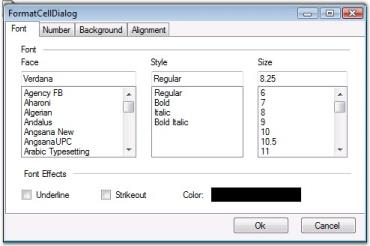
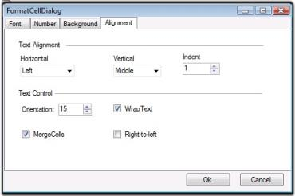
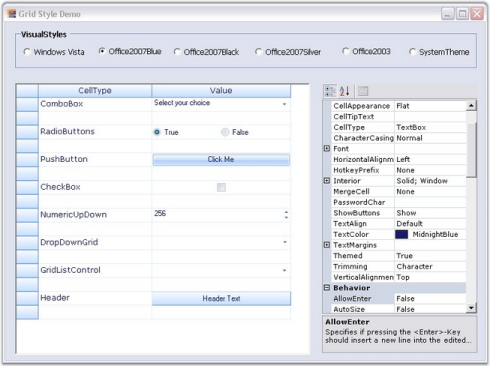

# Appearance

This section comprises the following:

## GridFormatCellDialog

GridFormatCellDialog simulates FormatCells dialog feature of MS Excel. It provides numerous formatting options such as Font, Alignment, Background, and Number, which aid in formatting grid cells dynamically. It is now available as an add-on feature for Essential Grid control. GridFormatCellDialog class accepts an instance of the Grid control to be formatted, and exposes the above mentioned formatting options to operate on grid cells that are selected. Below image illustrates such a sample dialog.

###Setting up GridFormatCellDialog

This GridFormatCellDialog can be enabled by instantiating GridFormatCellDialog class and invoking its ShowDialog method. 

> Note: You must select the cells to be formatted before activating this dialog.



GridFormatCellDialog formatDialog = new GridFormatCellDialog(this.gridControl1);

formatDialog.ShowDialog();





Dim formatDialog As GridFormatCellDialog = New GridFormatCellDialog(Me.gridControl1)

formatDialog.ShowDialog()



###Formatting Options

####Font Tab

This provides options to set the font, font style, font size, font effects, and font color for the desired grid cells.

####Number Tab

This allows you to specify text format for grid cells. The possible options are Number, Currency, Percentage, Date, Time, Scientific and Text.

####Background Tab

This allows you to set background color for grid cells. You can set gradient shades and pattern styles as well.

####Alignment Tab

This provides various cell alignment options such as Horizontal Alignment, Vertical Alignment, Merge Cells, Wrap Text, and so on.

## Grid Visual Styles

This section provides information on VisualStyles and ThemesEnabled properties (XP themes) of the Essential Grid. Essential Grid supports a range of appearances for grid cells. Styles can be set to the grid control by assigning Syncfusion.Windows.Forms.GridVisualStyles enumeration value to the GridVisualStyles property.

The figure above displays various visual styles in VisualStyles group box in UI for Essential Grid.

Following code example illustrates how to set visual style for Grid control.



//Sets an Office 2007 Blue skin theme to the Essential Grid control.

gridControl1.GridVisualStyles = Syncfusion.Windows.Forms.GridVisualStyles.Office2007Blue;





'Sets an Office 2007 Blue skin theme to the Essential Grid control.

gridControl1.GridVisualStyles = Syncfusion.Windows.Forms.GridVisualStyles.Office2007Blue



ThemesEnabled property determines whether XP Themes (visual styles) can be used for this control or not, when available. Following code example illustrates how to set the theme for the Grid control.



this.gridControl1.ThemesEnabled = true;





Me.gridControl1.ThemesEnabled = True


## Grid Control Designer

This section elaborates upon Grid control's edit designer. Grid control has an excellent user friendly design-time support. A Grid control's edit designer is added to the grid to ease the process of designing Grid control on a cell level. Using the editor, Grid can be modified, saved, and loaded to XML formatted files or to SOAP formatted templates. 

Following is the step-by-step procedure to edit Grid control's cell styles using GridControl Designer window:

1. Right click the Grid control. A context menu is displayed.
2. Select Edit from the context menu drop-down. The figure below illustrates this user-action:

> Note: Editor opens up on the right hand side of the page and Grid Properties tab is highlighted by default. The cell content, styles and general grid properties can be modified under Grid Properties tab.

The figure above shows GridControl Designer window with Grid Properties tab.

Modifying the Properties of a Selected Range

To modify properties of a selected range, follow the steps listed below:

1. Select a range of cells.
2. Click Selected Range tab to view Property grid for the selection.

The figure above shows the Property grid under Selected Range tab in GridControl Designer window.

3. Make the required modifications in the property grid so that they are affected in the selected range of the main grid.
4. Exit editor after modifications are done. 

> Note: The system prompts you to save the changes to the Grid control in the designer if exited without saving.

